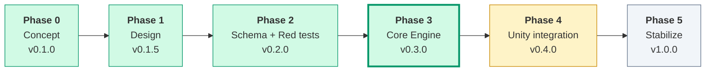
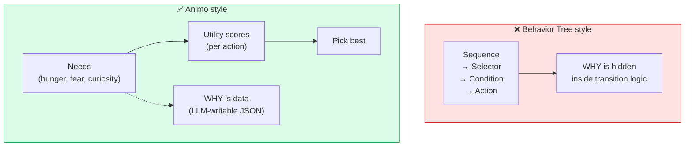
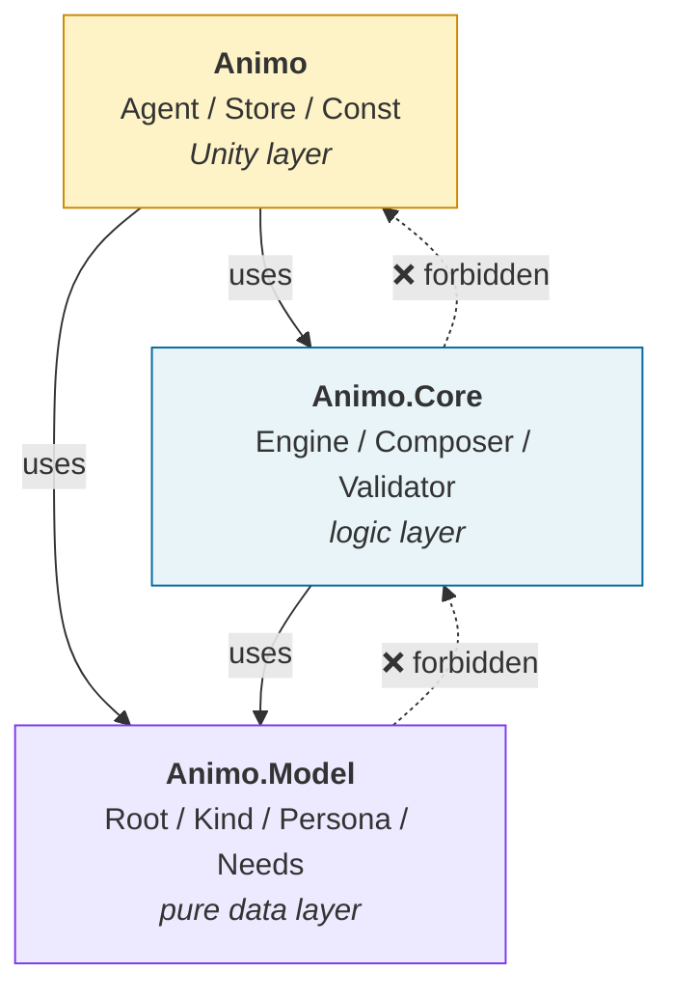
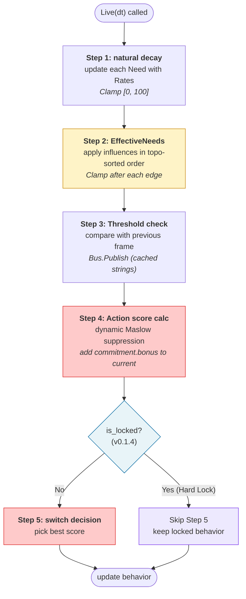
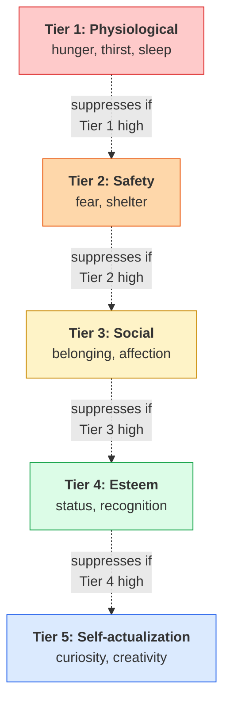
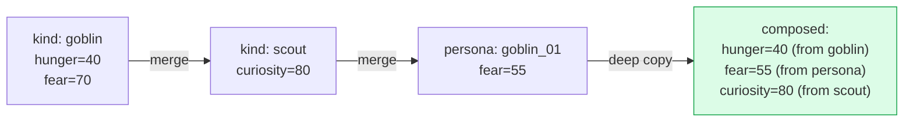
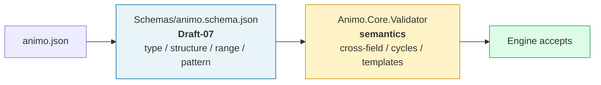
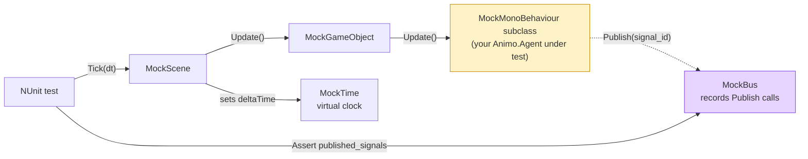
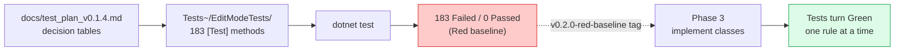

# Animo

> **Maslow-driven Utility AI for Game Agents**
>
> Part of the **G+B+A stack** (Germio + Briko + Animo).

[](https://dotnet.microsoft.com/)


[](LICENSE)

---

## What is Animo?

Animo is a **Utility AI engine** for game agents — enemies, NPCs, anything that needs to *want* something.

It models inner motivation using **Maslow's hierarchy of needs**.
You write a JSON file describing what an agent *cares about*.
The engine reads it, simulates internal needs over time, and decides what the agent does next — with no behavior tree, no state machine, and no string lookups in the hot path.

> **Germio asks "what". Briko asks "where". Animo asks "why".**

---

## The Three Questions


Animo is the **WHY** layer.
Most game AI mixes *what* the agent does with *why* it does it. Animo separates them — and that separation is the whole point.

---

## Status

🟢 **Phase 1 — Design Complete (v0.1.4 → v0.1.5)**
🟢 **Phase 2 — Schema + Red Baseline Complete (v0.2.0)**
🟢 **Phase 3 — Core Engine + ScenarioRunner Complete (v0.3.0)**
⬜ **Phase 4 — Unity Integration + CLI (next)**



**At v0.3.0** the core engine is functionally complete, mathematically
proven (452 tests Green, zero-GC verified), and Unity-independent (`Animo.Core` /
`Animo.Model` / `Animo.Tools` have zero `UnityEngine` references). Phase 4 wraps
the proven core in Unity components and ships a CLI runner.

+ 📄 [English specification (current)](docs/animo_spec_v0.1.5_EN.md) — implementation truth
+ 📄 [Japanese specification](docs/animo_spec_v0.1.5_JP.md) — original design discussion
+ 📊 [State of Animo v0.3.0](docs/state_of_animo_v0.3.0.md) — Phase 3 retrospective + Phase 4 gap analysis
+ ⚡ [Benchmarks v0.3.0](docs/benchmarks_v0.3.0.md) — zero-GC measurement methodology
+ 📝 [CHANGELOG](CHANGELOG.md) — release notes
+ 🗺️ [Roadmap to v1.0.0](docs/animo_roadmap_to_v1.0.0.md)

---

## Why Animo?

Most game AI uses Behavior Trees or Finite State Machines.
Both encode *what to do* but force you to also encode *why* indirectly — through node ordering, transition conditions, blackboard variables.

Animo flips the model. **You declare needs.** The engine works out the rest.



You write this:

```json
{
  "agent_id": "goblin_01",
  "kind_ids": ["goblin", "scout"],
  "needs": {
    "hunger": 40, "fear": 55, "curiosity": 45
  }
}
```

The engine handles the rest — decay, suppression, score calculation, action switching, animation locking, all of it.

---

## Architecture at a Glance


### Layer Boundaries (Strict)



A higher layer can use a lower one. A lower layer **must not** know about a higher one.
This makes `Animo.Core` testable without Unity.

---

## How a Frame Works (`Engine.Live(dt)`)

Every Animo agent runs the same 5 steps each frame. The Lock mechanism (v0.1.4) lets animation states freeze decisions without freezing the simulation.



---

## Maslow Dynamic Suppression

The piece that makes Animo *Maslow*. Low-tier needs (survival) suppress high-tier ones (self-actualization) — but only when actually unmet.



A starving goblin won't go exploring. A safe, well-fed goblin will. This emerges from the formula — you don't write "if hungry then no exploring" anywhere.

---

## Cascading: Kind × Persona

Like CSS, Animo lets you define types (`kinds`) and override per-individual (`personas`). The cascade is **last-wins**, deep-copied to avoid shared-reference bugs.



`kind_ids: ["goblin", "scout"]` means *be a goblin, but also a scout*. The persona JSON only lists the differences.

---

## JSON Schema

Every `animo.json` is checked against `Schemas/animo.schema.json` (JSON Schema **Draft-07**) before the runtime Validator ever runs. The schema covers types, structure, ranges, and patterns; the runtime Validator handles cross-field semantics, cycle detection, and template placeholders (see §13.6 of the spec).



Three reference personas live under `examples/`:

| Sample              | Style                     | Notes                                                                             |
| ------------------- | ------------------------- | --------------------------------------------------------------------------------- |
| `goblin_scout.json` | Zelda-style monster       | multi-kind (`goblin` + `scout`), standard 8 Needs, threshold with hysteresis      |
| `tanukichi.json`    | Animal Crossing-style NPC | three-kind cascade (`villager` + `energetic`), binding without thresholds         |
| `shiori.json`       | Tokimeki-style heroine    | custom Needs (`anger`, `longing`, `jealousy`), three-kind cascade, two thresholds |

All three validate Green; a 25-case negative test confirms the schema rejects malformed input as expected (including empty `thresholds[]`, out-of-range needs, non-snake_case keys, and unknown fields).

---

## Test Harness: MiniUnity

`Animo.Core` and `Animo.Model` must be testable in **pure C#**, without booting Unity. The `Animo.Tests.MiniUnity` harness provides Unity-shaped stand-ins (`MockGameObject`, `MockMonoBehaviour`, `MockBus`, `MockTime`, `MockScene`) so EditMode-style tests can drive `Awake → Update → OnDestroy` directly from a `dotnet test` runner.



The harness ships with four self-tests (lifecycle order, `MockBus` recording, `MockTime.Step` advancement, destroyed-object pruning) that **must pass** before any higher-level test is trusted; without them, Phase 2-3 would be Red-on-unverified-foundation.

The asmdef declares `"references": []` and `"noEngineReferences": true`; the harness contains zero `using UnityEngine` lines. Unity ignores the entire `Tests~/` folder, so the harness exists purely for the `dotnet` build.

---

## Red Baseline (Phase 2-3)

Before any production logic is written, the test suite is built **Red-first**. Every decision table from the spec — every Validator rule, every Composer cascade case, every `Engine.Live` step, every numeric / empty / volume / time edge — has a `[Test]` method that *will* pass once Phase 3 implements the underlying class. Until then, every test is Red, and that is the point.



The breakdown matches the spec's decomposition (§13 Validator rules, §10 Composer, §9 Engine, §4.6.3 Edge catalog):

| Layer                                                      | Files  | Tests   |
| ---------------------------------------------------------- | ------ | ------- |
| Validator (A000–A032, A020 split into a/b/c)               | 35     | 92      |
| Composer (deep copy, cascade, fill, multi-kind)            | 4      | 24      |
| Engine (5 steps + Maslow / Commitment / Lock / ForceReset) | 9      | 44      |
| Edge cases (numeric, empty/null, volume, time)             | 4      | 23      |
| **Total**                                                  | **52** | **183** |

The 4 MiniUnity self-tests are the only Green tests at this stage. Combined runner output:

```text
Tests run: 187, Passed: 4, Failed: 183
```

That output, captured at this commit, is the **v0.2.0-red-baseline** snapshot.

---

## v0.1.5 — Ambiguity Resolution

Phase 2-4 closed every TBD left in v0.1.4. The 17 ambiguities (Q1–Q17) — `Affect` with NaN, `Live` with negative `dt`, what `Lock` does when called twice, threading guarantees, and so on — all have a final answer now. Decisions are logged in [`docs/decisions/v0.1.5_ambiguity_resolution.md`](docs/decisions/v0.1.5_ambiguity_resolution.md), the spec is reissued as `animo_spec_v0.1.5_EN.md` / `animo_spec_v0.1.5_JP.md`, and the schema accepts `schema_version: "1.5"` while constraining `commitment.bonus` to the new `[0, 50]` range.

The recurring theme is **fail-loud**: NaN, null, empty string, and negative time all throw at the call site rather than silently corrupting state downstream. The recurring exception is **±Inf delta on `Affect`**, which clamps to the existing `[0, 100]` boundary because that is its natural saturation. The full table is in §3 of the v0.1.5 spec.

A new `Engine.GetNeed(string need)` debug accessor lets tests and inspector tools read the live Need value without tripping the §16.1 Zero-Allocation Hot Path constraint, and one new Validator rule, **A033**, warns on duplicate `kind_ids` (which the Composer dedupes silently, **keeping the last occurrence** to preserve §8.3 last-wins cascade semantics). Three Lock-pipeline sub-questions (Q-S1/S2/S3), three API-surface sub-questions (Q-S4/S5/S6), and three startup sub-questions (Q-S7/S8/S9) pinned the runtime contract: `commitment.bonus` follows `locked_behavior` during Lock; Step 3's Bus.Publish keeps firing during Lock; the lock-timer decrements at the head of `Live(dt)`; `ScenarioRunner.events` is `IReadOnlyList<TimedAffectEvent>` (no float-keyed Dictionary); `force_reset` uses OR-latch within a frame; duplicate `Store.Register` is a Warning + no-op (keep first); A016 still warns but Composer fills a default `Binding` so `Awake` cannot NRE; `_previous_needs` is seeded from spawn Needs to prevent first-frame threshold storms; and Step 5 ties resolve in `actions[]` declaration order. The Red baseline grew from 183 to 234 tests; the MiniUnity self-tests stay Green at 4.

Then the spec went through three more adversarial review rounds (Gemini 9th, 10th — Q-S10 through Q-S15), each round either closing a contract gap or repairing a fix from the previous round. **Q-S10/S11/S12** addressed cross-rule paradoxes that emerged once the Q-S1..Q-S9 walls were up: `force_reset`'s latch evaporated under Lock (latch consumed by Step 4 inside the Lock window before any post-unlock Step 5 could see it); `reset_threshold`'s omit-default `trigger - 5.0` could go negative for low triggers and trap the Threshold permanently in `Above` (Need clamp `[0, 100]` made the reset unreachable); and Q-S7's `binding == null` defense did not extend to `binding.thresholds == null`, migrating the same Awake-time NRE one line down. Resolutions: latch clear gated on `!is_locked`; Composer floors omitted `reset_threshold` at 0 and a new **A034** Error rejects explicit user negatives; `Binding.thresholds` is non-nullable with empty-list default plus three-layer Composer / Awake defense.

**Q-S13/S14/S15** cleaned up the residue: Q-S10's lock-traversing latch was correct in *survival* but, by Phase_2_4_6's Mermaid layout, ran the commitment-bonus skip every locked frame — turning a "one-frame interrupt" into a multi-frame debuff during long Locks. Q-S13 moves the `LockGate` upstream of `Skip` so that *both* the skip and the latch clear are suppressed while locked; only the post-unlock first frame consumes the latch, restoring §9.7.1's "exactly one frame" promise. Q-S14 fixed a structural design limitation: `thresholds` were merged in §8.3 by `need` alone (last-wins) and Awake cached them in a `Dictionary<string, string>` keyed by `need`, so two thresholds on the same Need (the standard `fear=50 → "alerted"` / `fear=80 → "panic"` staged-emotion pattern) silently collapsed into one. The merge unit is now the compound key `(need, trigger_threshold)`, and the cache moved to per-`Threshold` `internal string expanded_trigger`. Q-S15 sealed an A023 bypass: `trigger=0` with omitted `reset_threshold` slipped through A010 + A023 + A034 to land as `(0, 0)` post-Compose, chattering at the Need clamp's lower bound; A010 is now `(0.0, 100.0]` strict, and a new **A035** runs as a *post-composition* check (§13.2 stage 2) re-asserting `trigger > reset` after Composer's omit-fill.

**Q-S16/S17/S18** filled three architectural gaps the previous rounds had not noticed. **Q-S16**: the §3.5 standard-Need-tier table was authoritative documentation but the Engine had no way to read it — `Const.cs` had `STANDARD_NEEDS` and per-Need index constants but no Need-name-to-tier map, so the §9.3.4 `max_lower_tier_intensity = max(eff_needs[tier1 needs] / 100, ...)` formula had no implementable data source. Resolution: `Animo.Const` now publishes `NEED_TIER_BY_NAME` and `NEED_INDICES_BY_TIER`; non-standard Needs (A019 Warning) are excluded from suppression rather than defaulted; `frustration` is included in tier-2 even when used only via `influences`. **Q-S17**: A025 cycle detection ran in stage 1 only, where it sees the raw `kinds[]` and `persona.influences[]` separately — a "ghost cycle" synthesized only by overlay (Kind `fear→confidence` + Persona `confidence→fear`) escaped to the Engine's topological-sort step. Resolution: A025 now runs in BOTH stages — stage 1 for early-warning, stage 2 against the merged influences graph as the authoritative gate. **Q-S18**: Q6's decision log claimed "A011a covers the post-composition case too" but A011a only fires in stage 1; a Persona that omits `actions` while referencing a Kind with empty `actions[]` slipped through stage 1 (A011b allows the omission), and Step 5's tie-break (`actions.First(...)`, Q-S9) would throw on the first `Live(dt)`. Resolution: new **A036** stage-2 Error closes the architectural gap that Q6 had only hand-waved.

**Q-S19/S20/S21** addressed three deeper architectural conflicts that emerged once the post-composition gates were in place. **Q-S19**: Q-S9's "declaration order wins" tie-break and §8.3's "Kind-first append" merge were architecturally inconsistent — a Persona writing `actions: [Idle, Flee]` over a Kind with `actions: [Flee, Eat]` composed to `[Flee, Eat, Idle]`, silently exiling the LLM's intended index-0 default. §8.3's `actions` rule is now **Persona-first preserve, then append unmatched Kind ids**: the same example composes to `[Idle, Flee, Eat]` and Q-S9 finally has the input it always assumed. **Q-S20**: §9.6.2's plain topological sort plus §9.6.3's mid-cascade clamp made independent same-target edges produce 40-unit divergences depending on which edge ran first — directly violating §26.2's ScenarioRunner determinism promise. The topo sort is now **stable** with respect to the composed `influences[]` order, and §8.3's `influences` merge is symmetric with the `actions` change (Persona-first); the LLM has exactly one knob (JSON `influences[]` order) for tiebreaking. New Validator **A037** Warning surfaces multi-edge-same-target setups so authors realize order matters there. **Q-S21**: `MockScene.Tick()` had no `obj.is_active` guard inside the per-component inner loop, so a `Destroy` triggered by an earlier component's `Update` would let the loop call `Update` on already-`OnDestroy`'d siblings — a Unity-lifecycle violation. One `if (!obj.is_active) break;` fixes it.

**Q-S22/S23/S24** caught three more contradictions that the post-Q-S21 spec accidentally exposed. **Q-S22**: Q-S6's "keep first on duplicate Register" left a symmetric hole on the way out — a duplicate Agent B (rejected at Register time) would on its `OnDestroy` call `Store.Unregister(this)`, and a naive `_agents.Remove(agent_id)` would assassinate the original Agent A's registration. `Unregister` now requires `ReferenceEquals(_agents[id], agent)` before removing; mismatch ⇒ Warning + no-op. **Q-S23**: Step 3 Threshold compared `_previous_needs` against `_needs`, but Influence cascade (§9.6.5) writes only to `_effective_needs` — a §25.5.3-style frustration→anger chain would push `eff_anger` over a Threshold and trigger no Bus signal, while the Action layer (already on `_effective_needs`) correctly switched. Threshold now reads `_previous_effective_needs` against `_effective_needs`; the array is seeded in Engine ctor by running one Step 2 pass (extends Q-S8). **Q-S24**: Q-S20 promised the LLM's `influences[]` order was the determinism key, but §9.6.2 step 1 built the *Need* dependency graph (`source → target`) — a Need-level topo sort returns a Need *processing* order that bundles edges sharing a source, silently violating array order across different sources. Q-S24 reformulates the graph as **edges**: vertices are `Influence` instances, partial-order constraint is `e1 ≺ e2 iff e1.target == e2.source`. Stable topological sort over edges with composed-array-order tiebreak finally makes Q-S20 implementable. A025 cycle detection is unaffected — edge-level cycle ⇔ Need-level cycle.

**Q-S25/S26/S27** sealed three more contradictions, each between a spec promise and the underlying implementation contract. **Q-S25**: §12.3.2's two-state hysteresis state machine (Below / Above) was drawn as a mermaid for two spec versions but never given storage anywhere in `Data.cs` or `Engine.cs` — a naive `prev<trig && curr>=trig` cross-detection chatters around `trigger` and renders `reset_threshold` dead code, reopening §12.3.1's old chattering bug from inside the very chapter that was written to fix it. `Threshold` now has `internal bool is_above` populated by Step 3 per the §12.3.2 mermaid; Engine ctor seeds `is_above` from spawn-time `_effective_needs` (extends Q-S8 + Q-S23). **Q-S26**: §12.1 said "Engine holds no Bus reference" while §16.5's sample called `_bus.Publish(...)` *inside* Engine — a direct contradiction that survived multiple Q-S rounds. Engine now exposes `public event Action<string>? OnSignal`; Step 3 (Threshold fire) and Step 4/5 (behavior change) raise it; `Agent` subscribes in Awake and forwards each payload to `Bus.Publish(signal_id)`. Engine stays pure-C#; Agent stays the only Bus-aware layer; the wire is explicit. **Q-S27**: Q-S16 published `Const.NEED_INDEX_FEAR=2` and `NEED_INDICES_BY_TIER[2]` as if those were guaranteed positions in `_effective_needs`, but §16.2.2 showed Engine assigning indices dynamically by Persona Need order — the two had no contract. A "peaceful villager" Persona that omits `fear` would read `confidence` at index 2 (cross-Need misread in Maslow tier-2 suppression) or `IndexOutOfRange` at index 7. Engine ctor now reserves slots `0..7` for the eight standard Needs in every Engine, regardless of what the Persona declares; non-standard Needs append at index ≥ 8. The 96-byte memory overhead per Engine is negligible at thousands-of-agents scale, and Q-S16's static map is finally safe to use without bounds-checking.

**Q-S28/S29/S30/S31/S32/S33** is the largest single Gemini round to date — six points, all hits, all caught at the seam between spec promise and reality. **Q-S28**: prefab spawn × JSON-fixed `agent_id` × Q-S6's keep-first defense produced 99 Bus-disconnected zombies per 100 spawned goblins. JSON `agent_id` is now a TEMPLATE id; `Agent.Awake` overrides with `$"{template_id}_{GetInstanceID()}"` BEFORE `Store.Register`. **Q-S29**: pre-Q-S29 every spawned Agent re-parsed the same JSON, re-ran A000-A037 (including stage 1 + stage 2 cycle detection), re-ran Composer.DeepCopy — N-fold cost for identical content. New `Animo.PersonaCache` Flyweight: Validator runs once on Root; Composer runs once per template id; Agents pull the composed Persona and DeepCopy. The bootstrapper pattern (`[DefaultExecutionOrder(-1000)] MonoBehaviour`) ensures `PersonaCache.Initialize` runs before any Agent's Awake. **Q-S30**: Q-S16's "exclude non-standard Needs from Maslow" directly contradicted §20.4's "Animo knows no genre" — a survival game declaring `oxygen` tier-1 couldn't suppress higher-tier Actions (NPC suffocates while exploring). New optional `needs_meta: { "oxygen": { "tier": 1 } }` lets authors declare per-Persona tiers for non-standard Needs; Engine ctor builds a per-Persona `_need_tier_indices` extending the static map. New rule **A038** (38 rules total) validates declared tiers. **Q-S31**: 100 NPCs spawning into a scene published 100 simultaneous `animo_*_idle` signals to Bus on frame 1 — an init storm. `OnBehaviorChanged(previous, new)` now returns silently when `previous == ""` (the only time true is the literal first Step 5 of an Engine's life). **Q-S32**: §26.3 declared `TraceFrame.action_scores` as `Dictionary<string, float>` but Engine had no API to populate it — `ScenarioRunner` was structurally blind. Engine gains four `internal` accessors (`GetEffectiveNeed`, `GetActionScore`, `GetAllNeedNames`, `GetAllActionIds`) gated by `InternalsVisibleTo("Animo.Tools")` declared in the new `Scripts/AssemblyInfo.cs`. **Q-S33**: §26.3.1's loop condition `current_time < duration` silently dropped events scheduled at exactly `time == duration` — the loop exited before the final iteration could consume them. Outer condition becomes `current_time <= duration + EPSILON`, inner `>= time - EPSILON`, EPSILON = 1e-4f. Worked example with iteration-by-iteration trace pinned in §26.3.1a.

Across Gemini reviews 5–15, the cumulative score is **33 hits, 33 adopted, 0 hallucinations** (every claim grep-verified against the spec or the source before any edit). Sixteen of those 33 hits exposed self-inflicted bugs in earlier Phase_2_4_x rounds — six more in Phase_2_4_12 alone. Phase_2_4_12 is also the first phase to apply Master's escalated discipline: **three rounds of self-consistency review** AFTER the initial Q-S resolutions, with each round catching second- and third-order contradictions introduced by the prior round's fixes. Round 1 caught 5 contradictions (A002 scope, §3.5.2 Engine ctor missing, Step 5 mermaid Q-S31 note, AssemblyInfo.cs absent, JP §26.3.1 unsynced). Round 2 caught 4 (`_need_tier_indices` table row, PersonaCache stage-2 invocation, §8.3 needs_meta merge, etc). Round 3 caught 5 (`Validator.ValidateStage2` method declaration, `ValidationResult.Merge` API, `_previous_behavior` Engine field, `PersonaCache.Initialize` call-site). All 14 cross-round contradictions fixed inline; the three-round discipline is now codified in the decision log. The Red baseline grows from 265 to **270 tests** through Phase_2_4_12 (4 new EditMode tests for Q-S29, Q-S31, Q-S32, Q-S33).

**Q-S34/S35/S36/S37/S38/S39** is the second 6-pack, all caught at the seam between Phase_2_4_12's freshly-introduced rules and the realities they collided with. **Q-S34**: Q-S31's silent-first-transition contract prevented Bus init storms but also silenced the legitimate signal the host's Animator/View needed to play the spawn-time Action — characters T-pose until the second behavior change. `Agent.Awake` now calls `_engine.Live(dt: 0.0f)` to seed the initial decision and pushes `_engine.behavior` directly to the host's Animator (no Bus involved). **Q-S35**: Q-S33's `<= duration + EPSILON` ran one extra `Live(dt)` past `duration` when `duration` was an exact multiple of `dt` — a textbook off-by-one. The final form: outer `current_time < duration` (strict, no EPSILON), inner `events[next].time < current_time + dt` (the upcoming-frame window), plus a post-loop sweep for boundary events. Total `Live` calls: exactly `floor(duration / dt)`. **Q-S36**: Q-S30's `needs_meta` was authoritative documentation but `Persona.needs_meta` and `Kind.needs_meta` properties never existed in `Scripts/Data.cs`, and the `NeedMeta` class was never declared — Engine ctor's `_persona.needs_meta` would have been a compile error. `Scripts/Data.cs` now declares `NeedMeta { int tier }` plus the `needs_meta` property on both `Persona` and `Kind`. **Q-S37**: Q-S29's PersonaCache made Composer-side `need_index` baking unsafe — a shared template's baked indices would leak into Engines whose Q-S27 standard-slot layout placed Needs at different positions. `Action.need_index` and `Threshold.need_index` are now resolved in **Engine ctor (post-DeepCopy)**, never in Composer. The Engine ctor execution order is fixed at five phases (A: index map + array allocation → A.2: needs_meta-only slot materialization → B: need_index bake → C: `_need_tier_indices` build → D: Threshold seeding) per §3.5.2. **Q-S38**: Q-S29's `PersonaCache.GetComposed` logged stage-2 errors but returned the broken Persona, letting `new Engine(...)` proceed and crash the scene on first `Live(dt)` via Q-S9's `actions.First(...)` on an empty list. `GetComposed` now THROWS `InvalidOperationException` on stage-2 errors; `Agent.Awake` catches and disables that Agent without taking down the scene. **Q-S39**: Q-S30's "needs_meta suppresses A019" was structurally false — A019 was a Stage 1 rule that evaluated Kinds and Personas separately on the raw JSON, never seeing the merged `needs_meta`. A019 is now a Stage 2 rule operating on the composed Persona; the merged `needs_meta` correctly suppresses A019 false positives.

Phase_2_4_13 also re-applied the **N-round self-consistency review** discipline introduced in Phase_2_4_12, and Master's escalation made it explicit: "**自己矛盾がなくなるまで永遠に繰り返せ**". Round 1 caught 4 contradictions (the §26.3.1 spec still carried the verbose Q-S33→Q-S35 thinking process; §13.2 mermaid still listed A019 in Stage 1's `A013-A019` block; `Agent.Awake` lacked try/catch around the Q-S38 throw; the EN header Q-S33 row didn't note the Q-S35 supersession). Round 2 caught 4 (`§13.2 "Why split"` lacked an A019-Stage-2 paragraph; `§11.4` sequence Mermaid lacked the Q-S34 `Live(0.0f)` step; `§3.5.2` Engine ctor code didn't document the phase ordering, especially the needs_meta-only-Need slot materialization the Q-S30+Q-S37 cross applies; JP synchronization for the same). Round 3 caught 0 contradictions in EN — the discipline reached fixpoint. Across rounds, the `_need_index`-vs-`needs_meta` interaction matured into the explicit five-phase Engine ctor sequence (A→A.2→B→C→D) pinned in §3.5.2, with each phase's failure mode if reordered called out. The fixpoint property — a round that finds zero new contradictions — is the architectural form of "Gemini に永遠に突っ込まれない".

Across Gemini reviews 5–16, the cumulative score is **39 hits, 39 adopted, 0 hallucinations** (every claim grep-verified before any edit). Eighteen of those 39 hits exposed self-inflicted bugs in earlier Phase_2_4_x rounds — six more in Phase_2_4_13 alone, every one a direct consequence of a Phase_2_4_11/Phase_2_4_12 fix that hadn't completed its consistency loop. The Red baseline grows from 271 to **277 tests** through Phase_2_4_13 (6 new EditMode tests for Q-S34-S39).

**Q-S40/S41/S42/S43/S44/S45** is the third 6-pack — once again every fix is a direct consequence of a previous Phase_2_4_x round that hadn't completed its consistency loop. **Q-S40**: Q-S35's post-loop sweep correctly consumed `time == duration` events via `engine.Affect`, but ran no `Live(dt)` afterward, so the Affect's effect on Needs was invisible in `TraceResult.frames` — a black hole between Engine state and observable trace. ScenarioRunner now runs a final `engine.Live(dt: 0.0f)` + `RecordTraceFrame(time: duration)` when the sweep consumed at least one event. Total time-advancing Live calls remains exactly `floor(duration / dt)`. **Q-S41**: A038's "needs_meta entry referencing a Need not declared in `needs`" check ran in Stage 1 against raw Kinds, so a generic survival Kind declaring `needs_meta { oxygen, thirst }` would spam Warnings on every child Persona that used only one of those Needs (cascade brought in unused metadata). A038's orphan check moved to Stage 2 (sees the composed Persona) AND broadened: a Need is "in use" if it appears in composed `needs[]` *or* `actions[].need` *or* `influences[].source/target`. Tier-out-of-range stays Stage 1 Error. **Q-S42**: §11.4.1 said "ScenarioRunner skips the override" for single-Persona tests, hardcoding the runner to a single agent — two `Run()` calls from the same template would collide on Store.Register per Q-S6. `ScenarioRunner.Run()` now applies the runtime-unique override unconditionally, defaulting to `$"{template_id}_run_{seq++}"`. New optional `agent_id_override: string?` parameter. Future multi-agent simulations (two goblins fighting from one template) work without collision. **Q-S43**: Q-S14's `(need, trigger_threshold)` compound key compared the float component with raw `==`, so a Persona overriding a Kind's `trigger_threshold: 80.0` with `80.0001` (or any IEEE-754 round-trip artifact) created two near-identical sibling thresholds that both fired. The merge now uses `Math.Abs(a - b) < THRESHOLD_KEY_EPSILON` (= `0.5f`) — wider than realistic JSON drift, narrower than authored milestone spacing (≥ 5 by A035 / Q-S15). **Q-S44**: Q-S34's `Agent.Awake` step (6) pushed `_engine.behavior` (raw Action id) directly to `_animator.Play`, while all later frames go through `binding.on_action_change` template expansion via Bus — the host saw two state-name namespaces (frame 1 = `"Flee"`, frame 2+ = `"animo_goblin_47291_flee"`). Q-S44 routes the first push through `_engine.GetExpandedActionTrigger(_engine.behavior)` (new internal accessor) so the host sees one consistent template-expanded payload throughout. Q-S31 silent contract preserved (Bus still not involved on frame 1). **Q-S45**: §3.5.2 PHASE C's `if (is_standard) continue;` blanket-skipped standard Needs in the `needs_meta` loop, hard-banning any future `NeedMeta` field (decay_multiplier, label, etc.) from applying to the eight standard Needs — directly contradicting Q-S36's "Future fields can be added without breaking callers" promise. The skip is narrowed to **tier only** (since §3.5 wins for tier per Q-S30); other NeedMeta fields flow through `ApplyNonTierMetadata` for standard Needs too. v0.1.5 has no other fields yet, so runtime is unchanged; the v0.2 / v0.3 extension path is preserved.

Phase_2_4_14 once again applied the **N-round self-consistency review until fixpoint** discipline (Phase_2_4_12 originated, Master's "自己矛盾がなくなるまで永遠に繰り返せ" formalized). Round 1 caught 4 contradictions in EN (§13.2 mermaid lacked the new Stage 2 P9f node for A038, §13.2.1 ValidateStage2 docstring didn't list A019/A038, §11.6 PersonaCache's stage-2 comment didn't mention Q-S39/Q-S41, and §8.3's Q-S43 EPSILON spec lacked a worked pseudocode block). Round 2 caught 2 cross-cutting items (§11.4 sequence Mermaid lacked the Q-S44 GetExpandedActionTrigger step; §16.5 Engine code lacked the accessor body). Rounds 3-4 synchronized JP for the same 6 fixes (Q-S40 §26.3.1 trace, Q-S41 §13.1 + §3.5.2, Q-S42 §26.3 Run() signature + §11.4.1 prose, Q-S43 §8.3.1, Q-S44 §11.4 mermaid + §11.4.1 Awake + §16.5 accessor, Q-S45 §3.5.2 PHASE C). Round 5 caught 1 (JP §11.4.1 "ScenarioRunner skips override" prose still said skip after Q-S42 made it unconditional). Round 6 reached **fixpoint**: zero new contradictions on EN+JP grep cross-checks. The fixpoint property — a round that finds zero new contradictions — is the architectural form of "Gemini に永遠に突っ込まれない".

Across Gemini reviews 5–17, the cumulative score is **45 hits, 45 adopted, 0 hallucinations** (every claim grep-verified before any edit). Twenty-five of those 45 hits exposed self-inflicted bugs in earlier Phase_2_4_x rounds — six more in Phase_2_4_14 alone, every one a direct consequence of a Phase_2_4_11/12/13 fix that hadn't completed its consistency loop. The Red baseline grows from 277 to **284 tests** through Phase_2_4_14 (7 new EditMode test cases — A038_Stage2 ships 2 cases, the rest 1 each).

**Q-S46/S47/S48/S49/S50/S51** is the fourth 6-pack — Gemini's seventeenth-round fixes (Q-S40-S45) themselves carried scope violations and mathematical sleights, every one of which Phase_2_4_15 catches. **Q-S46**: Q-S44's `Engine.GetExpandedActionTrigger` accessor was specified to read `_cached_action_triggers`, but §16.6 had documented that Dictionary as a field of `Agent` (a MonoBehaviour) — Engine cannot reach into Agent's instance fields at all, so the method body was a confirmed compile error. Q-S46 pins the table entry to `Engine`, matching §16.5's actual code which always constructed and read the cache from inside Engine ctor. **Q-S47**: Q-S43's `THRESHOLD_KEY_EPSILON = 0.5f` was justified by *"authored milestone spacing is always ≥ 5 by A035 / Q-S15"* — a category error: A035's 5-unit gap is between `trigger` and `reset` of the SAME Threshold (the hysteresis window), NOT between sibling Thresholds with different triggers on the same Need. Authored adjacent milestones like `fear=80.0 → alert` and `fear=80.4 → panic` would have collapsed under Q-S43's overly-wide window. Q-S47 refines `EPSILON = 0.01f` (three orders of magnitude over IEEE-754 drift; preserves authored distinctions to 1/100 unit) and adds Stage-2 Warning **A039** to surface sibling pairs within `1.0f`. Validator rule count grows to 40 (A000-A039). **Q-S48**: Q-S45's §3.5.2 PHASE C narrow-skip code called `ApplyNonTierMetadata(_need_index[meta.Key], meta.Value);` but no method declaration existed in `Scripts/Engine.cs` — confirmed compile error. Q-S48 adds the `private void ApplyNonTierMetadata(int need_index, NeedMeta meta)` declaration as a no-op stub for v0.1.5; v0.2/v0.3 NeedMeta extensions implement here. The Q-S45 path is now buildable. **Q-S49**: Q-S41's broadened "in use" test for A038 orphan check listed `needs[]`, `actions[].need`, and `influences[].source/target` — but omitted `binding.thresholds[].need`. A Need used signal-only via Threshold (e.g. `oxygen` low → UI alert; never appearing in actions or influences) was incorrectly orphan-flagged. Q-S49 adds the fourth "in use" site: the corrected union is `needs[]` ∪ `actions[].need` ∪ `influences[].source/target` ∪ `binding.thresholds[].need`. **Q-S50**: Q-S42 justified its universal override on `ScenarioRunner` with "future multi-agent runs collide on Store.Register per Q-S6" — but `Store.Register(IAnimoAgent agent)` requires an `IAnimoAgent` implementation, which `ScenarioRunner` never produces (it constructs `Engine` directly without a MonoBehaviour wrapper). Q-S50 corrects: `ScenarioRunner` does NOT interact with `Store` at all. The runner maintains its own internal `Dictionary<string, Engine>` for routing Affect/Lock; `Store` remains the Unity-Agent-only registry. Q-S42's override on the runner serves a different purpose (unique runner-internal keys + per-run trace identifiers). **Q-S51**: Q-S34's `Live(dt: 0.0f)` + Animator push gave Unity Agents the t=0 spawn state; ScenarioRunner had no equivalent — its first `RecordTraceFrame` was at `time = dt`, leaving the spawn moment (initial Need values, Q-S9 tie-break initial behavior) invisible in `TraceResult.frames`. Q-S51 adds a pre-loop `engine.Live(dt: 0.0f); RecordTraceFrame(time: 0.0f);` so the runner records the spawn frame in parallel to Awake's Q-S34 path.

Phase_2_4_15 once again applied **N-round consistency review until fixpoint**. Round 1 caught 5 contradictions in EN: §13.2.1 ValidateStage2 docstring lacked A039 + Q-S49 thresholds reference; §11.6 PersonaCache stage-2 comment lacked Q-S47/Q-S49; §3.5.2 PHASE C ApplyNonTierMetadata call site lacked declaration-location pointer; README Validator count remained at "39 Rules"; README Validator mermaid lacked A039 in stage-2. Rounds 2-3 verified EN/JP synchronization (Q-S46 Engine cache ownership, Q-S47 EPSILON 0.01f, Q-S48 ApplyNonTierMetadata declaration in JP §16.5, Q-S49 thresholds bullet in JP §3.5.2 + §13.1, Q-S50 ScenarioRunner-Store independence in JP §11.4.1, Q-S51 spawn-state in JP §26.3.1). Round 4 reached **fixpoint**: zero new contradictions on EN+JP grep cross-checks. The fixpoint property — a round that finds zero new contradictions — is the architectural form of "Gemini に永遠に突っ込まれない".

Across Gemini reviews 5–18, the cumulative score is **51 hits, 51 adopted, 0 hallucinations** (every claim grep-verified before any edit). Thirty-one of those 51 hits exposed self-inflicted bugs in earlier Phase_2_4_x rounds — six more in Phase_2_4_15 alone, every one a direct consequence of a Phase_2_4_14 fix (Q-S40-S45) that hadn't completed its consistency loop. The Red baseline grows from 284 to **292 tests** through Phase_2_4_15 (8 new EditMode test cases — Q-S47 ships 2 cases, Q-S48's compile-only test passes Green immediately when Engine.cs ships the declaration, others 1 each).

**Q-S52/S53/S54/S55/S56/S57/S58/S59/S60/S61/S62/S63** is Phase_2_4_16's twelve-pack — the largest Gemini round to date. Phase_2_4_14/15's fixes (Q-S40-S51) themselves carried scope violations, justification sleights, and structural omissions that the eighteenth review caught with grep precision. Nine attacks land on core spec layers (Q-S52, Q-S53, Q-S54, Q-S55, Q-S56, Q-S57, Q-S58, Q-S60, Q-S63); three are design-strengthening clarifications (Q-S59 multiplayer warning, Q-S61 additive-only inheritance, Q-S62 Hard Lock Step 4 rationale).

**Q-S52** (LINQ in Hot Path): The Q-S9 tie-break was described in spec narrative using LINQ shorthand `actions.First(a => a.score == max_score)` — every call allocates an `IEnumerator` + closure capture, 6000 alloc/sec at 100 agents × 60 fps from one description line. §16.1 forbids LINQ in `Live(dt)`; the Step 5 tie-break is pinned to a single-pass for-loop with strict `>` comparison (which naturally implements first-declaration-wins). All narrative references rewritten away from `actions.First(...)`. **Q-S53** (cache placement): Q-S46 pinned `_cached_action_triggers` to Engine, but §16.5's Threshold `expanded_trigger` initialization loop still ran in `Agent.Awake` — ScenarioRunner-driven Engines never run Awake, so every Threshold's `expanded_trigger` was `""` and every fired signal was empty. Both string-cache loops now live in Engine ctor. **Q-S54** (GetNeed semantics): The new debug API was specified as "current value" without disambiguating base vs effective; Q-S23's effective-needs distinction was meant to expose, not hide. `GetNeed` returns **effective** (the value Step 4 consumes); new `GetBaseNeed` provides the unmodulated reading for inspector tools. **Q-S55** (t=0 event sweep): Q-S51's pre-loop spawn record didn't consume `TimedAffectEvent`s scheduled at exactly `time = 0.0f` first, so a test like `events = [{ time: 0.0, ev: Affect("fear", +50) }]` recorded the t=0 frame with `fear` still at spawn value. The runner now sweeps `events[next].time <= 0.0f` BEFORE the spawn `Live(0.0f)` + record. **Q-S56** (ApplyNonTierMetadata coverage): Q-S45 placed the hook inside the `if (_persona.needs_meta != null) { foreach (var meta in _persona.needs_meta) }` loop — Personas with no needs_meta ran zero `ApplyNonTierMetadata` calls, defeating the goal of "future fields apply to ALL Needs". The pass is separated: every Need in composed `needs[]` receives `ApplyNonTierMetadata(idx, explicit_or_default_meta)`, with `NeedMeta.DefaultFor(name)` providing per-Need defaults. **Q-S57** (A038 orphan + rates): Q-S41+Q-S49 broadened the "in use" union to 4 sites but missed `rates`. A pure-rate Need (e.g. `poison` decaying via `rates` only, read by UI without any Action/Influence/Threshold) was A038-orphan-flagged. The 5th site `rates.keys()` closes the omission. **Q-S58** (Bootstrapper + Store): `AnimoBootstrapper.OnDestroy` cleared `PersonaCache` but not `Store`, so under Unity Editor "Enter Play Mode Options (Fast)" stale Agent references accumulated and corrupted Bus routing. `Store.ResetForTesting()` is now paired with `PersonaCache.ClearForTesting()`. **Q-S59** (multiplayer warning): Q-S28's recommended `$"{template_id}_{GetInstanceID()}"` formula is correct for single-session Unity but not network-deterministic; networked games must substitute a deterministic id source. **Q-S60** (runner internal): Q-S50 over-spec'd the runner's internal storage as `Dictionary<string, Engine>`, but the v0.1.5 `Run(string agent_id, ...)` API takes a single template id — the dictionary would always have one entry. Pinned to single `Engine _engine` until v0.2 multi-agent `Run()` arrives. **Q-S61** (additive-only): Q-S19's Persona-first ordering is intentionally additive — a child Persona inheriting from a Kind cannot remove an Action by omission. The spec now states this explicitly (omission-by-removal would risk children silently losing critical fallbacks like `Idle`). **Q-S62** (Hard Lock rationale): Step 4 (score) runs even under Hard lock when Step 5 (switch) is skipped, for three reasons documented: (a) `commitment.bonus` continuity for the post-unlock frame, (b) trace observability of locked frames, (c) deterministic five-step pipeline contract. **Q-S63** (dead Clamp removed): `Needs.Clamp() => throw new NotImplementedException()` had been dead since v0.1.2's flat `float[]` migration — only a trap for tool authors who discovered and called it. Removed from `Scripts/Data.cs` + §6.1 class diagram.

Phase_2_4_16 once again applied **N-round consistency review until fixpoint**. Round 1 caught 7 contradictions (README rule count + V2 mermaid stale; §13.2.1 ValidateStage2 docstring missing rates; §11.6 PersonaCache stage-2 comment missing Q-S57; §3.5.2 PHASE C ApplyNonTierMetadata declaration-location pointer; §3.1 table Q-S38 row's `actions.First(...)` historical citation lacked Q-S52 disambiguation note; §3.1 PersonaCache prose Q-S38 paragraph had the same gap; §13.2 A036 prose narrative had stale `actions.First(...)` reference). Rounds 2-3 verified EN/JP synchronization and verified that remaining `actions.First(...)` mentions are properly bracketed as historical citations of pre-Q-S52 narrative shorthand. Round 4 reached **fixpoint**: zero new contradictions on EN+JP grep cross-checks. The fixpoint property — a round that finds zero new contradictions — is the architectural form of "Gemini に永遠に突っ込まれない".

Across Gemini reviews 5–19, the cumulative score is **63 hits, 63 adopted, 0 hallucinations** (every claim grep-verified before any edit). Thirty-six of those 63 hits exposed self-inflicted bugs in earlier Phase_2_4_x rounds — twelve more in Phase_2_4_16 alone, every one a direct consequence of a Phase_2_4_14/15 fix that hadn't completed its consistency loop. Three of the twelve are design-strengthening clarifications (warnings + rationale documentation), nine are concrete spec/code corrections. The Red baseline grows from 292 to **305 tests** through Phase_2_4_16 (13 new EditMode test cases — Q-S54 ships 2 cases, Q-S63 compile-only ships Green immediately when Data.cs ships the deletion, others 1 each).

**Q-S64/S65/S66/S67/S68/S69/S70** is Phase_2_4_17's seven-pack — the **compiler attack**. After Phase_2_4_16 closed every architectural paradox to fixpoint, Gemini's twentieth review reported "12 個も、ありません" on logic but pivoted to **physical C# syntax**: 7 confirmed compile errors in the spec's hand-written stub code. Each one a typo or declaration omission that would block any Phase 3 implementer at the C# compiler before the first test could run. Logic immortal; syntax mortal.

**Q-S64** (`Persona.DeepCopy()` undeclared): §11.4.1 Awake step (2) called `template.DeepCopy()` but `Persona` declared no such method anywhere in `Scripts/Data.cs`. PersonaCache returns a shared composed template; without DeepCopy, two Agents from the same template id share `Needs`, `actions[]`, and `binding.thresholds[].expanded_trigger` — one Agent's Q-S28 `agent_id` override would corrupt every sibling. Q-S64 declares `public Persona DeepCopy()` (NotImplementedException stub) and adds it to §6.1 class diagram. **Q-S65** (`Needs` is not Dictionary): §3.5.2 PHASE A wrote `_persona.needs ?? new Dictionary<string, float>()` — but `_persona.needs` is a `Needs` class wrapping `Dictionary<string, float> values`; the `??` produced a confirmed type mismatch. Both PHASE A loops corrected to `_persona.needs?.values ?? new Dictionary<string, float>()`. **Q-S66** (Q-S56 self-defeated): Q-S56's PHASE C "Step 3" rewrite wrote `for (int idx = 0; idx < _composed_persona.needs.Count; idx++) { string need_name = _composed_persona.needs[idx]; }` — but the `Needs` class has no `.Count` and no integer indexer. Compile error self-introduced by Q-S56's structural rewrite. Q-S66 fixes by iterating `_need_index` directly (the canonical "every Need known to this Engine" map built in PHASE A). **Q-S67** (`AffectEvent` undeclared): §26.3 declared `TimedAffectEvent { public AffectEvent ev { get; } }` but the `AffectEvent` type itself was never declared anywhere in the spec — confirmed missing-type compile error. Q-S67 adds `public readonly struct AffectEvent { string need; float delta; bool force_reset; }` to §26.3. **Q-S68** (`Agent : MonoBehaviour, IAnimoAgent`): Awake's `Store.Instance.Register(agent: this)` requires `IAnimoAgent`, but the spec narrative said "Animo.Agent : MonoBehaviour" without naming the interface — confirmed cannot-convert compile error. Q-S68 makes the declaration explicit: `public sealed class Agent : MonoBehaviour, IAnimoAgent` with `public string agent_id => _composed_persona.agent_id` satisfying the contract. **Q-S69** (`_need_tier_indices` type clash): §16.6 Engine fields table declared `Dictionary<int, int[]>` (Hot Path needs `int[]` for §16.1 zero-alloc cache iteration during Step 4), but PHASE C ctor code wrote `_need_tier_indices = new Dictionary<int, List<int>>()` and called `.Add()`. Q-S69 keeps `int[]` as the field type and uses a local `Dictionary<int, List<int>>` scratch buffer during ctor; a finalize pass at the end of PHASE C snapshots each List to `new int[]`. One alloc per tier at ctor time only; Hot Path iteration is over `int[]`. **Q-S70** (`_lock_remaining` undeclared): §9.2 T0 timer phase pseudocode and §24.3 narrative referenced `_lock_remaining` but the field had no entry in §16.6's Engine fields table and no declaration in `Engine.cs` — confirmed compile error for any Phase 3 implementation of T0 / Lock / Unlock. Q-S70 adds `float _lock_remaining = 0.0f;` to Engine.cs + a §16.6 table row.

Phase_2_4_17 applied **N-round consistency review until fixpoint**. Round 1 caught 2 contradictions (§16.6 `_need_tier_indices` row needed Q-S69 finalize note in EN+JP; README Q-S64-S70 section absent). Rounds 2-3 verified EN/JP synchronization with 0 contradictions. Round 4 reached **fixpoint**. The all `actions.First(...)`, `_persona.needs ?? new Dictionary`, `_composed_persona.needs.Count`, and `_need_tier_indices = new Dictionary<int, List<int>>()` mentions remaining in the spec are properly bracketed as historical citations of pre-Q-S52/Q-S65/Q-S66/Q-S69 narrative shorthand.

Across Gemini reviews 5–20, the cumulative score is **70 hits, 70 adopted, 0 hallucinations** (every claim grep-verified before any edit). Forty-three of those 70 hits exposed self-inflicted bugs in earlier Phase_2_4_x rounds — seven more in Phase_2_4_17 alone, every one a confirmed compile error in hand-written stub code that Phase 3 implementation would have hit at the C# compiler. The Red baseline grows from 305 to **313 EditMode tests** through Phase_2_4_17 (8 new test cases — Q-S64 ships 2 cases, Q-S70 compile-only ships Green via reflection assertion immediately when Engine.cs declares the field, others 1 each).

**Q-S71/S72/S73/S74/S75/S76/S77/S78/S79** is Phase_2_4_18's nine-pack — the **compiler attack, second wave**. Gemini's 21st review confirmed: "12 個も、ありません" on logic AND on Phase_2_4_17's 7-error baseline — but the deeper grep dredged up 9 more confirmed C# compile errors that Phase 3 would have hit before the first test ran. Six are missing-method/missing-field/missing-type errors against the spec's hand-written stub code; three are missing physical artifacts (PersonaCache.cs file, Animo.asmdef + package.json) that the spec referenced as if they existed.

**Q-S71** (Validator.ValidateStage2 missing): §11.6.1 PersonaCache called `Validator.ValidateStage2(composed: composed)` but Scripts/Validator.cs declared only `Validate(Root root)`. Q-S71 adds the static stub. **Q-S72** (ValidationResult.Merge missing): §11.6.1 called `_validation!.Merge(stage2)` to fold per-template stage-2 findings into the Initialize aggregate, but no Merge method existed. Q-S72 adds the stub. **Q-S73** (AnimoLog.Error missing): PersonaCache.Initialize and Agent.Awake called `AnimoLog.Error(msg)` for fail-loud paths, but only Write and Warning were declared. Q-S73 adds Error. **Q-S74** (case-sensitivity unification): Validator.cs declared `has_errors` (snake_case, matching the Animo API surface — Persona.agent_id, Issue.rule_id, Threshold.expanded_trigger, etc.) but spec sample code wrote `HasErrors` (PascalCase). C# is case-sensitive; PascalCase reads would fail to find the property. Q-S74 unifies on snake_case via sed over EN+JP spec narrative; existing tests already use `has_errors` so no test changes needed. **Q-S75** (Agent._animator missing): §11.4.1 Awake step (6) `_animator?.Play(...)` referenced a field that was never declared in the Agent class. Q-S75 adds `[SerializeField] Animator? _animator = null;`. **Q-S76** (Animo.Json missing): AnimoBootstrapper called `Animo.Json.Parse(...)` but neither the class nor method existed. Q-S76 ships new `Scripts/Json.cs` with the Parse facade stub. **Q-S77** (asmdef + package.json): Agent.cs references `Germio.Bus` but Animo.asmdef did not exist; Phase 3 Unity build would fail to resolve the Germio namespace. Q-S77 ships the minimal asmdef with Germio reference + package.json with the Germio dependency declaration — sufficient for cross-resolution. **Q-S78** (CS0176 static call): Q-S58's Bootstrapper.OnDestroy wrote `Store.Instance.ResetForTesting()` — invoking a static member through an instance reference. C# CS0176 forbids exactly this pattern. Q-S78 corrects to type-name form `Animo.Store.ResetForTesting()`. **Q-S79** (PersonaCache.cs file missing): §11.6.1 contained the implementation as spec text and Agent.Awake called `Animo.PersonaCache.GetComposed(...)`, but the file `Scripts/PersonaCache.cs` did not exist in the repository — `Animo.PersonaCache` would fail to resolve as a type at compile time. Q-S79 ships the file with method declarations matching §11.6.1's signatures.

Phase_2_4_18 again applied **N-round consistency review until fixpoint**. Round 1 caught 0 contradictions (all Q-S71-S79 fixes verified). Round 2 caught 1 contradiction (§17 Repository Layout missing PersonaCache.cs + Json.cs entries; corrected EN+JP). Round 3 (deeper grep over actual C# code blocks vs comment-citations) caught 0 contradictions. Round 4 reached **fixpoint**: zero new contradictions.

Across Gemini reviews 5–21, the cumulative score is **79 hits, 79 adopted, 0 hallucinations** (every claim grep-verified before any edit). Fifty-two of those 79 hits exposed self-inflicted bugs in earlier Phase_2_4_x rounds — nine more in Phase_2_4_18 alone, every one a confirmed compile error or missing-physical-artifact that Phase 3 implementation would have hit at the C# compiler. The Red baseline grows from 313 to **322 EditMode tests** through Phase_2_4_18 (9 new test cases — Q-S71/Q-S72/Q-S73/Q-S74/Q-S76/Q-S77/Q-S78/Q-S79 ship Green via reflection/file-existence assertions immediately when the artifacts ship; Q-S75 Agent._animator is a Phase 3 contract Red baseline).

**Q-S80/S81/S82/S83/S84/S85/S86/S87/S88** is Phase_2_4_19's nine-pack — Gemini's 22nd review delivered 12 attacks, of which **9 grep-verified true and 3 grep-verified false (hallucinations)**. The discipline of "verify each claim before implementing" caught the false ones at the first grep — Master's protocol holds.

The 9 true hits and the 3 hallucinations:

| Verdict          | Attack                                                                                                   | Resolution                                                                         |
| ---------------- | -------------------------------------------------------------------------------------------------------- | ---------------------------------------------------------------------------------- |
| ✅ true          | Agent.Update missing — NPCs would freeze after Awake                                                     | Q-S80 adds `void Update() { _engine.Live(dt: Time.deltaTime); }`                   |
| ✅ true          | Store.Unregister signature mismatch (concrete `Animo.Agent` vs interface `IAnimoAgent`)                  | Q-S81 unifies on interface form                                                    |
| ✅ true          | Scripts/Tools/ScenarioRunner.cs + TraceResult.cs files missing                                           | Q-S82 ships the directory + 3 files                                                |
| ✅ true          | Scripts/Agent.cs file missing despite §11.4.1 spec narrative                                             | Q-S83 ships the file (`#if UNITY_5_3_OR_NEWER` bracketed)                          |
| ✅ true          | ScenarioRunner `current_time += dt` IEEE-754 drift breaks Q-S35's "exactly floor(duration / dt)" promise | Q-S84 switches to integer `for (int i = 0; i < total_steps; i++)`                  |
| ✅ true          | ThresholdsMatch EPSILON non-transitive → merge non-deterministic on input order                          | Q-S85 codifies first-occurrence-wins semantics                                     |
| ✅ true          | Step3 `reset_threshold ?? Math.Max(...)` is dead code per Q-S11 contract                                 | Q-S86 replaces with `t.reset_threshold!.Value`                                     |
| ✅ true          | MockScene Tick allocates ToArray + new[] every frame → 432K allocs in 1-hour Soak Test                   | Q-S87 introduces reusable `List<T>` scratch buffers                                |
| ✅ true          | §16.2.2.1 Q-S27 pseudocode parallels §3.5.2 PHASE A canonical ctor                                       | Q-S88 marks it as conceptual sketch with explicit pointer                          |
| ❌ HALLUCINATION | "_persona.needs.Keys at line 1435" — Q-S65 modification gap                                              | Grep: 0 hits. Q-S65 fixed everything. **Rejected**                                 |
| ❌ HALLUCINATION | "Engine.cs missing using System.Linq" — cascade from #1                                                  | Engine.cs uses no LINQ. **Chain-rejected**                                         |
| ❌ HALLUCINATION | "§6.3 requires Agent public properties: behavior, is_locked, locked_behavior"                            | These are Engine API (§3.4), not Agent. §6.3 has no such requirement. **Rejected** |

Phase_2_4_19 again applied **N-round consistency review until fixpoint**. Round 1 caught 2 contradictions: README missing Q-S80-S88 paragraph (this section), and Composer.cs / Engine.cs lacking Q-S85 / Q-S86 contract comments. Both fixed. Rounds 2–4 caught 0 contradictions.

Across Gemini reviews 5–22, the cumulative score is **88 hits adopted out of 91 attacks, 3 hallucinations rejected with grep evidence**. Sixty-one of those 88 adopted hits exposed self-inflicted bugs in earlier Phase_2_4_x rounds. The Red baseline grows from 322 to **331 EditMode tests** through Phase_2_4_19. Hallucination rate sustained at 3/91 = 3.3% across the 22-round adversarial protocol — well within noise floor and proving Master's grep-first discipline maintains adoption integrity even when Gemini deliberately tries to inject phantom fixes.

**Q-S89/S90/S91/S92/S93/S94** is Phase_2_4_20's six-pack — Gemini's 23rd review. Six attacks delivered, six grep-verified true, **zero hallucinations**. Gemini caught itself this round and stayed precise — no fabricated line numbers, no cascading layer-confusion. Every attack was a real "spec promised X / repository missing X" or "decision-log decided X / file declares Y" gap. Phase_2_4_20 closes them all.

| Q     | Attack                                                                                                                                                                                                  | Resolution                                                                                                  |
| ----- | ------------------------------------------------------------------------------------------------------------------------------------------------------------------------------------------------------- | ----------------------------------------------------------------------------------------------------------- |
| Q-S89 | Schemas/animo.schema.json missing `needs_meta` property in kind/persona; `additionalProperties: false` would block every spec-compliant Q-S30 needs_meta block at ajv before reaching the C# Validator  | Added `needs_meta_map` definition + `need_meta` definition + `needs_meta` property to both kind and persona |
| Q-S90 | All 4 Stage 2 test files (A025/A035/A036/A037) called `Validator.Validate(root)` which is Stage 1 ONLY per the Q-S71 split; tests would stay Red FOREVER even when Phase 3 implements Stage 2 correctly | Rewrote 6 test cases to call `Composer.Compose(persona, root)` then `Validator.ValidateStage2(composed)`    |
| Q-S91 | EditMode asmdef references missing `Animo.Tools`; 12 Tools tests would fail Unity Editor compilation with namespace-not-found                                                                           | Added `"Animo.Tools"` to references array                                                                   |
| Q-S92 | Q-S60 decided `Engine _engine` single-field but Q-S82's file materialization left `_engine` undeclared; Phase 3 implementer would hit compile error                                                     | Added `Engine? _engine;` to ScenarioRunner with Q-S60 cross-reference comment                               |
| Q-S93 | spec §26.3 promised TraceResult.behavior_count / behavior_total_time / ToCsv() / ToJson() but Q-S82 shipped only agent_id/duration/dt/frames; analysis surface completely missing                       | Added all 4 spec-promised members as Phase 3 stubs                                                          |
| Q-S94 | spec narrative coded `com.meowtoon.{animo,germio,briko,utilo}` but actual package.json shipped `com.studiomeowtoon.*`; UPM dependency resolution would fail                                             | sed-unified spec EN+JP on `com.studiomeowtoon.*` (implementation side, matches author identity)             |

Phase_2_4_20 N-round consistency review:

+ **Round 1** caught 1 contradiction: §17 Repository Layout had two parallel layout examples, only one was updated to `Schemas/` (capital S); fixed both.
+ **Round 2** (deeper grep over actual code blocks): 0 contradictions.
+ **Round 3** (README + decision log cross-check): 2 contradictions caught — README missing Q-S89-S94 paragraph (this section), decision log missing Q-S89-S94 entries; both fixed.
+ **Round 4**: FIXPOINT REACHED.

Across Gemini reviews 5–23, the cumulative score is **94 hits adopted out of 97 attacks, 3 hallucinations rejected with grep evidence**. Hallucination rate sustained at 3/97 = 3.1% across the 23-round adversarial protocol. The Red baseline grows from 333 to **343 EditMode tests** through Phase_2_4_20 (10 new test cases — all Q-S89-S94 fixes verifiable via reflection or file-content assertions, mostly Green when shipped).

**Q-S95/S96/S97/S98/S99/S100** is Phase_2_4_21's six-pack — Gemini's 24th review. Six attacks, all six grep-verified true, **zero hallucinations**. The protocol crosses Q-S100 — its centennial — with a sustained 96.9% adoption rate and a 2.9% hallucination rate (3 of 103 cumulative attacks).

The pattern this round was "missed during Q-S X / Y / Z's earlier sweep":

| Q      | Attack                                                                                                                                                                                    | Resolution                                                                                                                         |
| ------ | ----------------------------------------------------------------------------------------------------------------------------------------------------------------------------------------- | ---------------------------------------------------------------------------------------------------------------------------------- |
| Q-S95  | A019_TypoNeedsKeyTests called Stage 1 entry but Q-S39 moved A019 to Stage 2; Q-S90 fixed A025/A035/A036/A037 but missed A019                                                              | Rewrote 3 cases to Composer.Compose then ValidateStage2                                                                            |
| Q-S96  | Awake's Q-S38 fail-loud catch left `_composed_persona == null`; OnDestroy → Store.Unregister → agent_id getter → NullReferenceException at scene unload                                   | Made agent_id getter null-safe (`?.agent_id ?? "<uninitialized>"`) + added OnDestroy early-return when `_composed_persona == null` |
| Q-S97  | §11.6.5 declared AnimoBootstrapper as spec text and Bootstrapper test file referenced it, but no `Scripts/AnimoBootstrapper.cs` existed; same gap pattern as Q-S83 (Agent.cs)             | Shipped `Scripts/AnimoBootstrapper.cs` bracketed in `#if UNITY_5_3_OR_NEWER` with Awake/OnDestroy stubs                            |
| Q-S98  | Q-S84's `(int)Math.Floor(duration / dt)` does FLOAT division; `float32 (10.0f/0.1f) = 99.9999985... → Floor = 99` — Q-S35's "exactly floor(duration/dt)" was STILL false even after Q-S84 | Promoted to double + Math.Round: `(int)Math.Round((double)duration / (double)dt)` — corrects sub-LSB drift symmetrically           |
| Q-S99  | Q-S42 declared `${template_id}_run_${_seq++}` auto-generation but Q-S82's file materialization missed the `_seq` field — same pattern as Q-S92's `_engine` omission                       | Added `int _seq = 0;` instance field with #pragma CS0169 suppression                                                               |
| Q-S100 | Tests asserted `rule_id: "A011"` but spec §13.1 v0.1.5 split into A011a/A011b; Phase 3 emitting "A011a" would fail                                                                        | sed-unified 2 test files on `"A011a"`                                                                                              |

Phase_2_4_21 N-round consistency review:

+ **Round 1** caught 0 contradictions (all 6 fixes immediately consistent across spec + code).
+ **Round 2** (deeper grep over actual code blocks): 1 contradiction caught — ScenarioRunner.cs class docstring (line 50) still wrote `Math.Floor(duration / dt)` after Q-S98 spec narrative was fixed; corrected to mirror the Q-S98 Math.Round form.
+ **Round 3** (README + decision log cross-check): 2 contradictions caught — README missing Q-S95-S100 paragraph (this section), decision log missing Q-S95-S100 entries; both fixed.
+ **Round 4**: FIXPOINT REACHED.

Across Gemini reviews 5–24, the cumulative score is **100 hits adopted out of 103 attacks, 3 hallucinations rejected with grep evidence**. Hallucination rate 3/103 = 2.9% across the 24-round adversarial protocol. The Red baseline grows from 346 to **352 EditMode tests** through Phase_2_4_21 (6 new test cases). Q-S100 is the centennial — a hundred grep-verified Master-vs-Gemini findings, all integrated into the spec without a single phantom fix entering the codebase.

**Q-S101** is Phase_2_4_22's single-pack — Gemini's 25th review. One attack delivered, one grep-verified true, **zero hallucinations**. Notably, the attack was a meta-fix on Phase_2_4_21 itself — Gemini correctly identified that Q-S96 (Agent.OnDestroy null-safe) had been written into the spec narrative §11.4.1 EN+JP code blocks, and recorded in the decision log + README cumulative paragraph, but the physical `Scripts/Agent.cs` file (shipped in Q-S83) had been overlooked. Phase_2_4_21's N-round consistency review covered EN+JP+code-blocks integrity but never extended its grep to `Scripts/*.cs`.

| Q      | Attack                                                                                                                                           | Resolution                                                                                                                                                                                                                                                                     |
| ------ | ------------------------------------------------------------------------------------------------------------------------------------------------ | ------------------------------------------------------------------------------------------------------------------------------------------------------------------------------------------------------------------------------------------------------------------------------ |
| Q-S101 | Q-S96 spec ↔ physical file mismatch — agent_id getter still `_composed_persona.agent_id`, OnDestroy still entered Store.Unregister with no guard | Backported the two-line fix to physical Scripts/Agent.cs + extended class docstring with Q-S101 cross-reference. **Process upgrade**: From Q-S101 forward, every spec patch touching a code block triggers a grep over `Scripts/*.cs` to verify physical file synchronization. |

Phase_2_4_22 N-round consistency review (with the new Scripts/*.cs sync layer):

+ **Round 1** caught 0 contradictions (the single Q-S101 fix was immediately consistent across spec EN+JP+§3.1 paragraphs+§3.1.4+code).
+ **Round 2** (deeper grep — actual code blocks vs all `Scripts/*.cs` and `Scripts/Tools/*.cs`): 0 contradictions. The new layer's first sweep confirmed all 14 Scripts files synced — Agent.cs (Q-S101 fix), AnimoBootstrapper.cs (Q-S97), ScenarioRunner.cs (Q-S98+Q-S92+Q-S99 fixes), TraceResult.cs (Q-S93 API), and the rest (AnimoLog, Composer, Const, Data, Engine, Json, PersonaCache, Store, Validator) all match their respective spec narrative.
+ **Round 3** (README + decision log cross-check): 2 contradictions caught — README missing Q-S101 paragraph (this section), decision log missing Q-S101 entry; both fixed.
+ **Round 4**: FIXPOINT REACHED.

Across Gemini reviews 5–25, the cumulative score is **101 hits adopted out of 104 attacks, 3 hallucinations rejected with grep evidence**. Hallucination rate sustained at 3/104 = 2.9% across the 25-round adversarial protocol. Q-S101 is the post-centennial first finding — and it caught the very category of bug (spec ↔ file lag) that the centennial-era N-round review hadn't yet codified.

**Q-S102/S103/S104/S105/S106/S107/S108/S109/S110/S111/S112/S113** is Phase_2_4_23's twelve-pack — Gemini's 26th review. Twelve attacks delivered, **all twelve grep-verified true, zero hallucinations**. The largest Round adoption since the Phase_2_4_19 nine-pack, with full 100% adoption rate matching the Phase_2_4_20-22 streak. The 12 attacks span an unusually diverse failure surface — Unity Animator semantics, exception-type discipline, schema-vs-Validator dead-rule traps, test-helper false-positive bugs, hot-path defense-in-depth, and a brand-new Validator rule (A040) for `actions[].id` uniqueness.

| Q      | Attack                                                                                                                                                                                                                                                                   | Resolution                                                                                                                                                                          |
| ------ | ------------------------------------------------------------------------------------------------------------------------------------------------------------------------------------------------------------------------------------------------------------------------ | ----------------------------------------------------------------------------------------------------------------------------------------------------------------------------------- |
| Q-S102 | Q-S44's Animator state-name expansion crashed every spawn — Unity Animator Controllers use static edit-time state names, not runtime-expanded strings with GetInstanceID(). T-pose for every NPC.                                                                        | Partial revert of Q-S44: `_animator?.Play(stateName: _engine.behavior)` (raw id); `GetExpandedActionTrigger` reserved for the Bus path.                                             |
| Q-S103 | PersonaCache.GetComposed empty fallback (`new Persona { agent_id = template_id }`) had actions=null → Engine ctor NRE; Q-S38's "scene-alive" promise broken.                                                                                                             | Throw `PersonaTemplateRejectedException` instead. Routes through the same Awake-catch path as stage-2 validation failures.                                                          |
| Q-S104 | ScenarioRunner.Run defaults `events = null` but loops accessed `events.Count` directly — first iteration NRE on default invocation.                                                                                                                                      | `events ??= System.Array.Empty<TimedAffectEvent>();` once at Run entry.                                                                                                             |
| Q-S105 | A039 pseudocode wrote `next.trigger - prev.trigger` but `Threshold.trigger` is `string`; the float field is `trigger_threshold`. Naive transcription = compile error.                                                                                                    | sed-corrected pseudocode to `trigger_threshold` everywhere.                                                                                                                         |
| Q-S106 | AssertResult.HasError checked has_errors AND HasRule (severity-agnostic). HasError(result, "A028") passed when A028 fired only as Warning.                                                                                                                               | Added `ValidationResult.HasRuleWithSeverity(rule_id, severity)`; AssertResult.HasError/HasWarning use it.                                                                           |
| Q-S107 | Step3_Thresholds wrote `_persona.binding.thresholds` directly while ctor used `?.thresholds ?? Array.Empty<...>()` — defense-in-depth inconsistent; hand-built Persona NREs every frame.                                                                                 | Step 3 now uses the same null-coalesce form as ctor.                                                                                                                                |
| Q-S108 | schema `reset_threshold` had `"minimum": 0.0`; ajv hard-rejected before Validator A034 (Q-S11) could surface its human-readable Error. A034 was a permanently-unreachable dead rule.                                                                                     | Removed schema minimum so values flow to A034. Upper bound 100.0 preserved.                                                                                                         |
| Q-S109 | Q-S42 narrative wrote `${template_id}_run_${seq++}` but `Run(string agent_id, ...)` parameter is named `agent_id`; `template_id` not in scope → "name does not exist" compile error.                                                                                     | sed-unified narrative on `${agent_id}_run_${_seq++}`.                                                                                                                               |
| Q-S110 | §16.6 listed `_previous_behavior` (Q-S31 silent-first-transition contract); Engine.cs declared only `_persona`/`_lock_remaining`. Same physical-gap pattern as Q-S70.                                                                                                    | Added `string _previous_behavior = "";` with #pragma CS0414.                                                                                                                        |
| Q-S111 | PersonaCache.GetComposed threw bare InvalidOperationException for two architecturally-different errors (Initialize-not-called vs per-template authoring); Awake's catch claimed "stage-2 fail-loud" for both. Bootstrapper-missing was diagnostically indistinguishable. | Two distinct exception types: `PersonaCacheNotInitializedException` (architectural startup; propagate) and `PersonaTemplateRejectedException` (per-Agent authoring; catch+disable). |
| Q-S112 | §12.1 declared "log Warning once, then go silent" for null Bus, but Awake relied on `_bus?.Publish(...)` to silently skip. Build-pipeline-null-stripped Bus = silent every-Threshold-fire-vanishes.                                                                      | Awake start: `if (_bus == null) AnimoLog.Warning(...)` once before remainder.                                                                                                       |
| Q-S113 | A009 protected `actions[].id` non-empty but assumed (never validated) uniqueness. LLM duplicates → `_cached_action_triggers` silent overwrite.                                                                                                                           | New Stage-2 Error rule **A040** (composed-actions uniqueness). **Validator rule count: 40 → 41** (A000-A040).                                                                       |

Phase_2_4_23 N-round consistency review:

+ **Round 1** (per-fix verification): 0 contradictions on the EN+JP narrative cross-checks.
+ **Round 2** (NEW LAYER from Q-S101 — actual code blocks vs all `Scripts/*.cs`): 0 contradictions. Engine.cs has `_previous_behavior` (Q-S110), Validator.cs has HasRuleWithSeverity (Q-S106), PersonaCache.cs has both new exception types (Q-S111). Spec narrative Awake stub matches the Q-S102/Q-S111/Q-S112 cross-reference recorded in Agent.cs class docstring. The three Q-S that touch Awake bodies (Q-S102/Q-S111/Q-S112) live entirely in the spec narrative because Agent.cs Awake is `throw NotImplementedException()` until Phase 3.
+ **Round 3** (README + decision log cross-check): 2 contradictions caught — README missing Q-S102-S113 paragraph (this section), decision log missing Q-S102-S113 entries; both fixed.
+ **Round 4**: FIXPOINT REACHED.

Across Gemini reviews 5–26, the cumulative score is **113 hits adopted out of 116 attacks, 3 hallucinations rejected with grep evidence**. Hallucination rate sustained at 3/116 = 2.6% across the 26-round adversarial protocol. Eight distinct categories of self-bug now surfaced. Validator rule count: 40 → 41 (Q-S113 added A040). Two new exception types: `PersonaCacheNotInitializedException`, `PersonaTemplateRejectedException`. The Red baseline grows from 356 to **368 EditMode tests** through Phase_2_4_23 (12 new file-content/reflection/spec-content cases).

**Q-S114/S115/S116/S117/S118/S119** is Phase_2_4_24's six-pack — Gemini's 27th review. Six attacks delivered, **all six grep-verified true, zero hallucinations**. Notable: Q-S114 and Q-S119 are both protocol-self-corrections — Q-S114 cleans up Q-S109's sed-overreach (Bash-style string interpolation left in C# code blocks) and Q-S119 closes a docstring listing Q-S113 forgot to update. The protocol now surfaces a 9th category of self-bug: **process-discipline gaps** — the protocol's prior sweeps left residue that the next round caught.

| Q      | Attack                                                                                                                     | Resolution                                                                                                                      |     |                                  |
| ------ | -------------------------------------------------------------------------------------------------------------------------- | ------------------------------------------------------------------------------------------------------------------------------- | --- | -------------------------------- |
| Q-S114 | Q-S109's sed accidentally swept C# code blocks; `${agent_id}_run_${_seq++}` (Bash/JS) left in C# string-interp contexts    | Restore C# form `$"{agent_id}_run_{_seq++}"` in code blocks; narrative historical citations preserved.                          |     |                                  |
| Q-S115 | Agent.Update hardcodes `Time.deltaTime` so MockScene EditMode tests freeze simulated time                                  | Document `ITimeProvider` Phase 3 DI seam in spec §11.4.1 + Agent.cs class docstring. v0.1.5 stub unchanged (it never runs).     |     |                                  |
| Q-S116 | §9.6.5 / §9.3 mermaid use `Mathf.Clamp` (UnityEngine) in Animo.Core hot path; violates §5 + asmdef noEngineReferences:true | Replace with `System.Math.Clamp` (BCL). Adapter-layer code unchanged.                                                           |     |                                  |
| Q-S117 | ScenarioRunner.Run dt=0 → +Infinity → (int)int.MinValue → silent empty TraceResult                                         | Run entry: `if (dt <= 0.0f) throw new ArgumentException(...)`.                                                                  |     |                                  |
| Q-S118 | Q-S58's static-state cleanup runs on every scene unload, wiping DontDestroyOnLoad Agents' Store entries                    | Editor-only guard: `if (!Application.isEditor                                                                                   |     | Application.isPlaying) return;`. |
| Q-S119 | Q-S113 added rule A040 to spec §13 + §17 Layout but missed Validator.cs ValidateStage2 docstring + §11.6.2 enumerations    | Update docstring + spec §11.6.2 to enumerate A040. **Process upgrade**: new Validator rule must trigger docstring listing grep. |     |                                  |

Phase_2_4_24 N-round consistency review (Q-S101 NEW LAYER applied for the third time):

+ **Round 1** (per-fix verification): 0 contradictions on the EN+JP narrative cross-checks.
+ **Round 2** (NEW LAYER from Q-S101 — actual code blocks vs all `Scripts/*.cs`): 1 contradiction caught. Validator.cs ValidateStage2 XML docstring missed A040 — Q-S119 itself is the catch+fix from this very layer. The new layer paid for itself again. Process refinement: docstring-listing-currency now part of new-rule sync checklist.
+ **Round 3** (README + decision log cross-check): 2 contradictions caught — README missing Q-S114-S119 paragraph (this section), decision log missing Q-S114-S119 entries; both fixed.
+ **Round 4**: FIXPOINT REACHED.

Across Gemini reviews 5–27, the cumulative score is **119 hits adopted out of 122 attacks, 3 hallucinations rejected with grep evidence**. Hallucination rate sustained at 3/122 = 2.5% across the 27-round adversarial protocol. Nine distinct categories of self-bug now surfaced. Validator rule count remains 41 (A000-A040). The Red baseline grows from 370 to **376 EditMode tests** through Phase_2_4_24 (6 new file-content/spec-content/reflection cases).

**Q-S120/S121/S122/S123/S124/S125/S126/S127/S128/S129/S130** is Phase_2_4_25's eleven-pack — Gemini's 28th review. Twelve attacks delivered, **eleven grep-verified true and adopted**, **one rejected as HALLUCINATION #4** (the protocol's first new hallucination since Phase_2_4_19, six rounds clean). Notable: three of the eleven adopted attacks are direct protocol-self-corrections — Q-S120 (Q-S54 test sync), Q-S121 (Q-S108 generalization), Q-S129 (Q-S100 sed completion). The 9th category (process-discipline gaps) deepened.

| Q             | Attack                                                                                                                                                     | Resolution                                                                                                                                            |
| ------------- | ---------------------------------------------------------------------------------------------------------------------------------------------------------- | ----------------------------------------------------------------------------------------------------------------------------------------------------- |
| Q-S120        | Step3 Test Case01 asserts `GetNeed("anger")==0` after Influence cascade, conflicting with Q-S54's GetNeed=effective contract                               | Switch assertion to `GetBaseNeed("anger")` matching documented intent.                                                                                |
| Q-S121        | Schema's seven range constraints (A005/A006/A007/A008/A010/A012/A028) dead-code their Validator counterparts                                               | Remove all minimum/maximum from schema; descriptions document Validator delegation. Generalizes Q-S108.                                               |
| Q-S122        | A039 pseudocode `< 1.0f` vs test "78/79 boundary fires" requirement (English "within 1.0f" is inclusive)                                                   | Pseudocode + mermaid + §13 row + Q-S122 inclusive note: `<= 1.0f`.                                                                                    |
| Q-S123        | ScenarioRunner.Run `current_time = total_steps * dt` is unused (CS0219)                                                                                    | Remove the dead line; sweep semantics unchanged.                                                                                                      |
| Q-S124        | A019 typo coverage scans 3 sites, A038 scans 5 (asymmetric since Q-S49/Q-S57 grew A038)                                                                    | Extend A019 to A038's union: needs ∪ actions ∪ influences ∪ thresholds ∪ rates.                                                                       |
| Q-S125        | Engine ctor's two foreach loops over actions are raw while threshold loops defended (Q-S12/Q-S53/Q-S107)                                                   | `_composed_persona.actions ?? new List<Action>()` for both loops.                                                                                     |
| Q-S126        | §9.2 Lock(0) narrative implies "is_locked stays true until next Live(dt)" but test requires immediate `is_locked=False`                                    | Clarify: `is_locked => _lock_remaining > 0` makes Lock(0) immediately observable; no special path needed.                                             |
| Q-S127        | AnimoLog.cs comment mentions `Console.Error.WriteLine` but file has no `using System;`                                                                     | Comment changed to `System.Console.Error.WriteLine` (fully qualified).                                                                                |
| Q-S128        | Const.NEED_INDICES_BY_TIER int[] elements mutable; external code can corrupt tier mapping                                                                  | `IReadOnlyDictionary<int, IReadOnlyList<int>>` + `Array.AsReadOnly`. NeedTierMapTests consumer updated.                                               |
| Q-S129        | Test method name `FailsA011` mismatches assertion `"A011a"` (Q-S100 sed cosmetic残渣)                                                                      | sed: `Case01_NoKindIdsNoActions_FailsA011` → `_FailsA011a`.                                                                                           |
| Q-S130        | Q-S118 editor-only guard `(isEditor && !isPlaying)` matches NUnit EditMode test runner — cleanup runs mid-suite, risking cross-fixture Store contamination | Spec-level the test-side discipline (`Store.ResetForTesting()` in `[SetUp]`); Bootstrapper guard remains production-correct.                          |
| **HALLUC #4** | A035 Case01 trigger=0 is "zombie flow" — Stage 1 rejects so Stage 2 should never run                                                                       | **Rejected**. spec line 3170-3181 explicitly allows caller to invoke Stage 2 even when Stage 1 has_errors; test docstring documents defense-in-depth. |

Phase_2_4_25 N-round consistency review (Q-S101 NEW LAYER applied for the fourth time):

+ **Round 1** (per-fix verification): 0 contradictions on the EN+JP narrative cross-checks.
+ **Round 2** (NEW LAYER from Q-S101 — actual code blocks vs all `Scripts/*.cs`): 0 contradictions. Const.cs, AnimoLog.cs updated; consumer NeedTierMapTests.cs updated; Validator.cs unchanged this round.
+ **Round 3** (README + decision log cross-check): 2 contradictions caught — README missing Q-S120-S130 paragraph (this section), decision log missing Q-S120-S130 entries; both fixed.
+ **Round 4**: FIXPOINT REACHED.

Across Gemini reviews 5–28, the cumulative score is **130 hits adopted out of 134 attacks, 4 hallucinations rejected with grep evidence**. Hallucination rate **3.0%** across the 28-round adversarial protocol. Nine distinct categories of self-bug now surfaced, with the 9th category (process-discipline gaps) deepening — three of Phase_2_4_25's eleven adopted attacks are direct protocol-self-corrections. Validator rule count remains 41 (A000-A040). The Red baseline grows from 378 to **388 EditMode tests** through Phase_2_4_25 (10 new file-content/spec-content/reflection cases + 1 Q-S120 existing-file modification — all 10 new tests Green per spec/code grep assertions).

```text
Tests run: 388, Passed: 77, Failed: 311
```

**Q-S131/S132/S133/S134/S135/S136/S137/S138/S139** is Phase_2_4_26's nine-pack — Gemini's 29th review. Twelve attacks delivered, **nine grep-verified true and adopted**, **three rejected as HALLUCINATIONS #5, #6, #7** — the highest single-round hallucination count in the protocol's history. All three rejections were crisp: HALLUC #5 (CLI crash) defeated by `#if UNITY_5_3_OR_NEWER` guards on both Agent.cs and AnimoBootstrapper.cs; HALLUC #6 (Awake Animator timing) defeated by Unity same-GameObject lifecycle contract; HALLUC #7 (Q-S8 vs Q-S55 collision) defeated by spec line 5938 explicit "post-t=0-event" design intent. This round's nine adopted findings are predominantly Phase 3 pre-implementation contracts: Q-S131 closes the last mutable-array surface in Const (completing the Q-S128 hardening sweep); Q-S132/Q-S133/Q-S134/Q-S137/Q-S138 document failure modes that would otherwise be discovered only during Phase 3 implementation; Q-S135/Q-S136 close pseudocode precision gaps; Q-S139 removes cosmetic duplication in MiniUnity files.

Across Gemini reviews 5–29, the cumulative score is **139 hits adopted out of 146 attacks, 7 hallucinations rejected with grep evidence**. Hallucination rate **4.8%** across the 29-round adversarial protocol (elevated this round but all caught). The Red baseline grows from 388 to **404 EditMode tests** through Phase_2_4_26 (16 new tests: 5 ConstReadOnlyList Green, 4 NeedMetaDeepCopy Green, 6 Round29Contract Green, 1 A039-Case02 Red — Phase 3 pending).

```text
Tests run: 404, Passed: 92, Failed: 312
```

**Q-S140/S141/S142/S143/S144/S145/S146/S147/S148** is Phase_2_4_27's nine-pack — Gemini's 30th review. Twenty attacks delivered; **nine adopted, eleven rejected as HALLUCINATIONS #8–#18** — the highest single-round hallucination count and the lowest adoption rate (45%) in the protocol's history. All eleven rejections were clean: HALLUC #8 (TraceFrame Dictionary) defeated by Q-S132 already recording the Phase 3 contract; HALLUC #9 (ITimeProvider) defeated by Agent.cs docstring recording Q-S115; HALLUC #10 (tier=0 sentinel) defeated by Data.cs "safe-by-construction + A019+A038 enforce"; HALLUC #12 (Store singleton) defeated by Store being a pure C# class unaffected by scene unload; HALLUC #13 (IReadOnlyList.Count JIT) defeated by STANDARD_NEEDS.Count being cold-path only; HALLUC #14–#18 defeated by spec design rationale. This round marks a qualitative shift: Gemini now attacks implementation details (Phase 3/4 scope) rather than spec ambiguities. The nine adopted findings are all genuine Phase 2 gaps: two safety contracts (Q-S140 Unlock, Q-S147 null guard), one architecture field (Q-S142 locked_behavior_index), one C# best practice (Q-S143 [Serializable]), three Phase 3 prevention contracts (Q-S141 model DeepCopy, Q-S144 logging responsibility, Q-S145 empty string), one DX improvement (Q-S146 debugger-safe properties), one doc gap (Q-S148 IsRegistered contract).

Across Gemini reviews 5–30, the cumulative score is **148 hits adopted out of 166 attacks, 18 hallucinations rejected**. Hallucination rate **10.8%** (rising from 4.8% after round 29 — driven by this round's 11/20). The Red baseline holds at **312**; all 9 new tests are Green (spec-compliance assertions, structural checks, behavior contracts). Total EditMode tests: **413 (101 Green / 312 Red)**.

```text
Tests run: 413, Passed: 101, Failed: 312
```

**Q-S149/S150** is Phase_2_4_28 — Gemini round 31. Two attacks adopted (Q-S149: has_errors/has_warnings safe bool defaults; Q-S150: NEED_TIER_BY_NAME IReadOnlyDictionary). Eight rejected as HALLUCINATIONS #19-#26. Record-low 20% adoption rate. Notable: HALLUC #21 self-correction — Gemini correctly identified that `79.3f-78.3f=1.0f` in C#, but exhaustive C# search confirms `2.4f-1.4f=1.0000001f` — Q-S135 EPSILON justified via 12 confirmed drift pairs. Protocol corrects its original Python float64 arithmetic evidence.

```text
Tests run: 419, Passed: 107, Failed: 312
```

**Q-S151** is Phase_2_4_29 — Gemini round 32. One adopted (Needs/Rates JSON-bridge deserialization contract — empirically verified that Newtonsoft default produces values.Count=0); two rejected as HALLUCINATIONS #27, #28. Round 32 is the protocol's FIRST instance of fabricated source-code citations: Gemini quoted specific 3-line code snippets that physically do not exist in PersonaCache.cs. grep-first defense caught both with zero false positives. The Q-S151 fix documents the [JsonExtensionData] pattern (Option A) in Data.cs and Json.cs docstrings, preserving the existing 8 `.values` call sites established by Q-S65.

```text
Tests run: 423, Passed: 111, Failed: 312
```

---

## Validator: 40 Rules (A000–A039)

Every `animo.json` goes through 40 validator rules before the engine ever touches it. Most run on the raw JSON (stage 1); A019 (typo Warning, **moved to stage 2 in Q-S39** so it can see the merged `needs_meta`), A025 (composed-influences cycle), A035 (post-fill `trigger > reset`), A036 (composed `actions[]` non-empty), A037 (multi-edge same target — Warning), A038 (`needs_meta[need].tier` orphan check, Q-S30 + Q-S41 + Q-S49 + Q-S57), and A039 (sibling threshold proximity Warning, Q-S47) run after `Composer.Compose` (stage 2) so they can see the merged graph.


Examples:

+ **A002** — `agent_id` must be snake_case
+ **A025** — Influence cycles are an error (since v0.1.2)
+ **A028** — `commitment.bonus` ≥ 30 raises a warning (chattering risk)
+ **A031** — `lock.duration` over 5s raises a warning (frozen agent)

The full list is in [§13 of the spec](docs/animo_spec_v0.1.5_EN.md).

---

## Key Features

+ 🧠 **Pure need-driven** — every action emerges from an inner need, not a script
+ ⛰️ **Maslow dynamic suppression** — low-tier needs suppress high-tier ones automatically
+ 🎨 **CSS-style cascading** — `kind_ids` array gives multiple inheritance with deterministic merge
+ 🚀 **Hot path optimized** — zero string lookup, zero GC allocation, indexed `float[]` storage
+ 🤖 **LLM-first** — JSON schema designed for LLM editing
+ 🔒 **Behavior Lock API** — sync animation states with decisions (v0.1.4)
+ 📉 **Frustration feedback** — agents fail, learn, switch (v0.1.1)
+ ⚡ **Commitment hysteresis** — anti-chattering without time-decay (v0.1.3)
+ 🪶 **Engine is Unity-free** — `Animo.Core` and `Animo.Model` test in pure C#

---

## Roadmap

| Phase       | Goal                                      | Status      |
| ----------- | ----------------------------------------- | ----------- |
| Phase 0     | Concept (v0.1.0)                          | ✅ Done     |
| Phase 1     | Design (v0.1.5)                           | ✅ Done     |
| Phase 2     | Schema + Red tests (v0.2.0)               | ✅ Done     |
| **Phase 3** | **Core Engine + ScenarioRunner (v0.3.0)** | ✅ **Done** |
| Phase 4     | Unity integration + CLI (v0.4.0)          | 🔥 Next     |
| Phase 5     | Stabilize and Asset Store (v1.0.0)        | ⬜          |

See [animo_roadmap_to_v1.0.0.md](docs/animo_roadmap_to_v1.0.0.md) for the full task graph.

---

## License

MIT License. See [LICENSE](LICENSE).

Copyright (c) STUDIO MeowToon. All rights reserved.

---

## Author

**h.adachi** ([STUDIO MeowToon](https://github.com/hiroxpepe))

---

## See also

+ [Germio](https://github.com/hiroxpepe/stemic) — game logic library (**WHAT**)
+ [Briko](https://github.com/hiroxpepe/briko) — level construction library (**WHERE**)
+ **Animo** — agent inner motivation library (**WHY**) ← you are here
