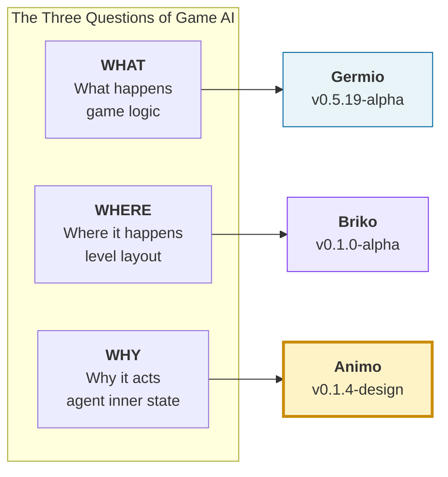
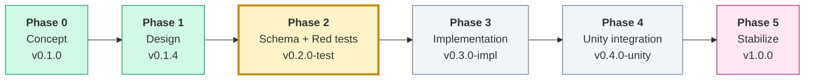
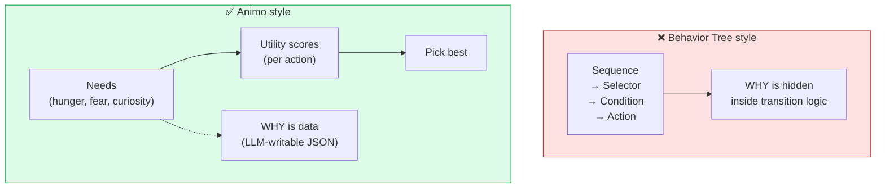
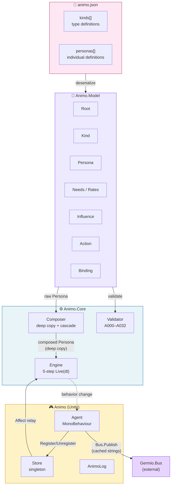
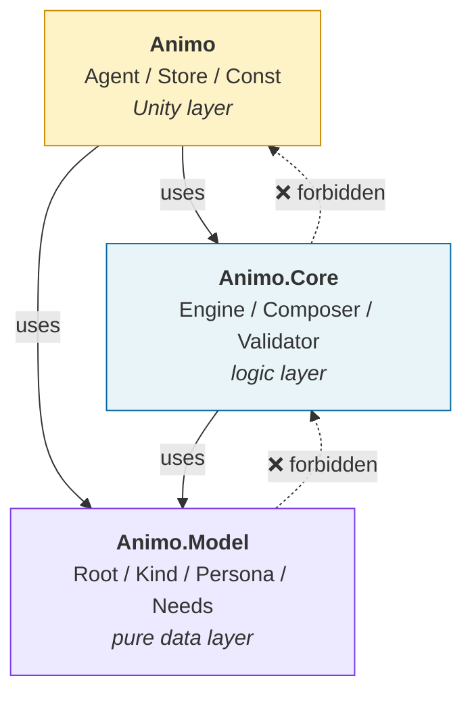
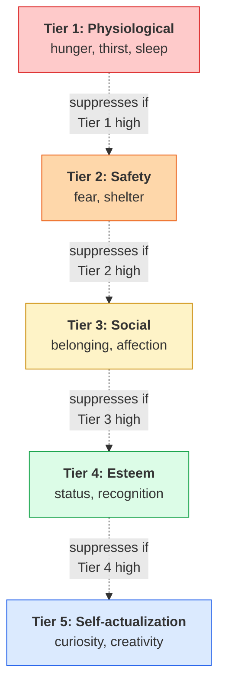
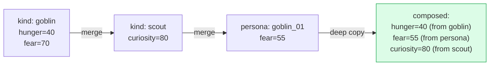
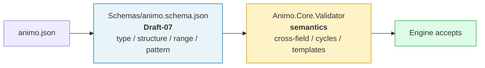
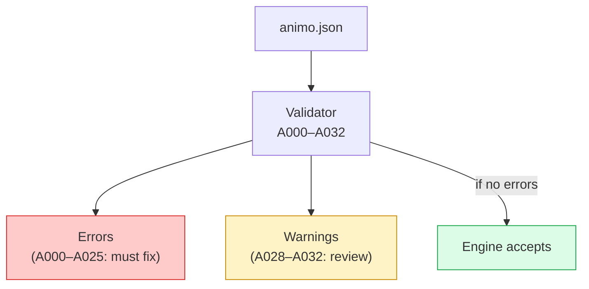

# Animo

> **Maslow-driven Utility AI for Game Agents**
>
> Part of the **G+B+A stack** (Germio + Briko + Animo).

[](LICENSE)
[](docs/animo_spec_v0.1.4_EN.md)
[](docs/animo_spec_v0.1.4_EN.md)
[](docs/animo_roadmap_to_v1.0.0.md)

---

## What is Animo?

Animo is a **Utility AI engine** for game agents — enemies, NPCs, anything that needs to *want* something.

It models inner motivation using **Maslow's hierarchy of needs**.
You write a JSON file describing what an agent *cares about*.
The engine reads it, simulates internal needs over time, and decides what the agent does next — with no behavior tree, no state machine, and no string lookups in the hot path.

> **Germio asks "what". Briko asks "where". Animo asks "why".**

---

## The Three Questions



Animo is the **WHY** layer.
Most game AI mixes *what* the agent does with *why* it does it. Animo separates them — and that separation is the whole point.

---

## Status

🟢 **Phase 1 — Design Complete**
🔥 **Phase 2 — Schema and Test Foundation (in progress)**



The architecture is locked. Eight commits of iterative spec design (v0.1.0 → v0.1.4) put us at a point where **every formula, every validator rule, every namespace boundary is decided**. Implementation can now start without redesigning anything mid-flight.

- 📄 [English specification (reference)](docs/animo_spec_v0.1.4_EN.md) — implementation truth
- 📄 [Japanese specification](docs/animo_spec_v0.1.4_JP.md) — original design discussion
- 🗺️ [Roadmap to v1.0.0](docs/animo_roadmap_to_v1.0.0.md)

---

## Why Animo?

Most game AI uses Behavior Trees or Finite State Machines.
Both encode *what to do* but force you to also encode *why* indirectly — through node ordering, transition conditions, blackboard variables.

Animo flips the model. **You declare needs.** The engine works out the rest.



You write this:

```json
{
  "agent_id": "goblin_01",
  "kind_ids": ["goblin", "scout"],
  "needs": {
    "hunger": 40, "fear": 55, "curiosity": 45
  }
}
```

The engine handles the rest — decay, suppression, score calculation, action switching, animation locking, all of it.

---

## Architecture at a Glance



### Layer Boundaries (Strict)



A higher layer can use a lower one. A lower layer **must not** know about a higher one.
This makes `Animo.Core` testable without Unity.

---

## How a Frame Works (`Engine.Live(dt)`)

Every Animo agent runs the same 5 steps each frame. The Lock mechanism (v0.1.4) lets animation states freeze decisions without freezing the simulation.


---

## Maslow Dynamic Suppression

The piece that makes Animo *Maslow*. Low-tier needs (survival) suppress high-tier ones (self-actualization) — but only when actually unmet.



A starving goblin won't go exploring. A safe, well-fed goblin will. This emerges from the formula — you don't write "if hungry then no exploring" anywhere.

---

## Cascading: Kind × Persona

Like CSS, Animo lets you define types (`kinds`) and override per-individual (`personas`). The cascade is **last-wins**, deep-copied to avoid shared-reference bugs.



`kind_ids: ["goblin", "scout"]` means *be a goblin, but also a scout*. The persona JSON only lists the differences.

---

## JSON Schema

Every `animo.json` is checked against `Schemas/animo.schema.json` (JSON Schema **Draft-07**) before the runtime Validator ever runs. The schema covers types, structure, ranges, and patterns; the runtime Validator handles cross-field semantics, cycle detection, and template placeholders (see §13.6 of the spec).



Three reference personas live under `examples/`:

| Sample | Style | Notes |
|---|---|---|
| `goblin_scout.json` | Zelda-style monster | multi-kind (`goblin` + `scout`), standard 8 Needs, threshold with hysteresis |
| `tanukichi.json` | Animal Crossing-style NPC | three-kind cascade (`villager` + `energetic`), binding without thresholds |
| `shiori.json` | Tokimeki-style heroine | custom Needs (`anger`, `longing`, `jealousy`), three-kind cascade, two thresholds |

All three validate Green; a 25-case negative test confirms the schema rejects malformed input as expected (including empty `thresholds[]`, out-of-range needs, non-snake_case keys, and unknown fields).

---

## Validator: 33 Rules (A000–A032)

Every `animo.json` goes through 33 validator rules before the engine ever touches it.



Examples:
- **A002** — `agent_id` must be snake_case
- **A025** — Influence cycles are an error (since v0.1.2)
- **A028** — `commitment.bonus` ≥ 30 raises a warning (chattering risk)
- **A031** — `lock.duration` over 5s raises a warning (frozen agent)

The full list is in [§13 of the spec](docs/animo_spec_v0.1.4_EN.md).

---

## Key Features

- 🧠 **Pure need-driven** — every action emerges from an inner need, not a script
- ⛰️ **Maslow dynamic suppression** — low-tier needs suppress high-tier ones automatically
- 🎨 **CSS-style cascading** — `kind_ids` array gives multiple inheritance with deterministic merge
- 🚀 **Hot path optimized** — zero string lookup, zero GC allocation, indexed `float[]` storage
- 🤖 **LLM-first** — JSON schema designed for LLM editing
- 🔒 **Behavior Lock API** — sync animation states with decisions (v0.1.4)
- 📉 **Frustration feedback** — agents fail, learn, switch (v0.1.1)
- ⚡ **Commitment hysteresis** — anti-chattering without time-decay (v0.1.3)
- 🪶 **Engine is Unity-free** — `Animo.Core` and `Animo.Model` test in pure C#

---

## Roadmap

| Phase | Goal | Status |
|---|---|---|
| Phase 0 | Concept (v0.1.0) | ✅ Done |
| **Phase 1** | **Design (v0.1.4)** | ✅ **Done** |
| Phase 2 | Schema + Red tests (v0.2.0-test) | 🔥 In progress |
| Phase 3 | Implementation (v0.3.0-impl) | ⬜ |
| Phase 4 | Unity integration (v0.4.0-unity) | ⬜ |
| Phase 5 | Stabilize (v1.0.0) | ⬜ |

See [animo_roadmap_to_v1.0.0.md](docs/animo_roadmap_to_v1.0.0.md) for the full task graph.

---

## License

MIT License. See [LICENSE](LICENSE).

Copyright (c) STUDIO MeowToon. All rights reserved.

---

## Author

**h.adachi** ([STUDIO MeowToon](https://github.com/hiroxpepe))

---

## See also

- [Germio](https://github.com/hiroxpepe/stemic) — game logic library (**WHAT**)
- [Briko](https://github.com/hiroxpepe/briko) — level construction library (**WHERE**)
- **Animo** — agent inner motivation library (**WHY**) ← you are here
