# Animo 仕様書

> **Maslow-driven Utility AI for Game Agents**
> v0.1.0-design / 2026-05-08
> STUDIO MeowToon — h.adachi
> github.com/hiroxpepe/animo

---

## 目次

1. [プロジェクト概要](#1-プロジェクト概要)
2. [G+B+A スタック思想](#2-gba-スタック思想)
3. [アーキテクチャ全景](#3-アーキテクチャ全景)
4. [ネームスペース階層と依存方向](#4-ネームスペース階層と依存方向)
5. [クラス全一覧](#5-クラス全一覧)
6. [animo.json スキーマ](#6-animojson-スキーマ)
7. [Kind × Persona カスケーディング](#7-kind--persona-カスケーディング)
8. [Engine の内部設計](#8-engine-の内部設計)
9. [Composer の責務](#9-composer-の責務)
10. [Store API 仕様](#10-store-api-仕様)
11. [Binding 動作仕様](#11-binding-動作仕様)
12. [Validator ルール A000–A021](#12-validator-ルール-a000a021)
13. [Animo.Const ドメイン定数](#13-animoconst-ドメイン定数)
14. [コーディング規約](#14-コーディング規約)
15. [リポジトリ構成](#15-リポジトリ構成)
16. [package.json と依存](#16-packagejson-と依存)
17. [応用シミュレーション](#17-応用シミュレーション)
18. [LLM チューニングフロー](#18-llm-チューニングフロー)
19. [TODO メモ — 将来課題](#19-todo-メモ--将来課題)
20. [設計決定の履歴](#20-設計決定の履歴)

---

## 1. プロジェクト概要

**Animo** は STUDIO MeowToon が開発する **G+B+A スタック**の3番目のピース。マズローの欲求段階説を Utility AI エンジンとして実装し、ゲームエージェント（敵・NPC）に「**なぜそう動くのか**」という内面を与えるライブラリ。

### 1.1 スタックの位置付け

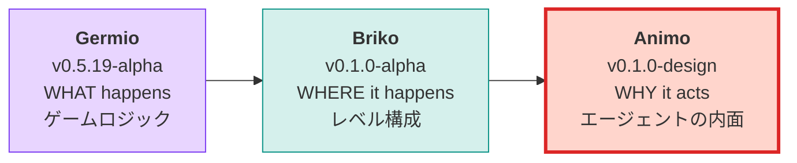
```mermaid
flowchart LR
  G["<b>Germio</b><br/>v0.5.19-alpha<br/>WHAT happens<br/>ゲームロジック"]
  B["<b>Briko</b><br/>v0.1.0-alpha<br/>WHERE it happens<br/>レベル構成"]
  A["<b>Animo</b><br/>v0.1.0-design<br/>WHY it acts<br/>エージェントの内面"]
  G --> B --> A
  style G fill:#e8d5ff,stroke:#7e3ff2
  style B fill:#d5f0ec,stroke:#0d9488
  style A fill:#ffd5cc,stroke:#dc2626,stroke-width:3px
```

### 1.2 ライブラリ識別子

| 項目 | 値 |
|---|---|
| パッケージ名 | `com.meowtoon.animo` |
| GitHub（当面） | `github.com/hiroxpepe/animo` |
| GitHub（将来） | `github.com/meowtoon/animo` |
| ライセンス | GPL v2.0 |
| Unity 最低バージョン | 2022.3 |

---

## 2. G+B+A スタック思想

ゲーム開発を **3つの問い**に分解し、それぞれを独立したライブラリで担当する。

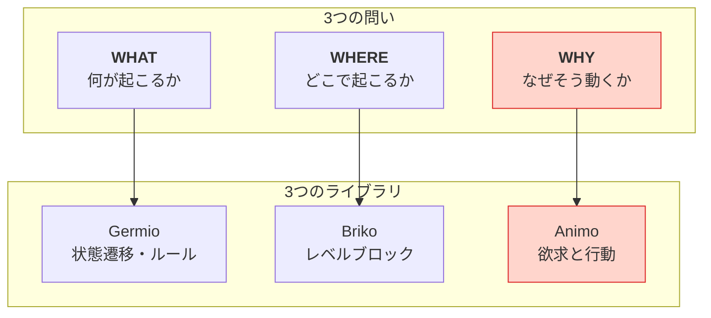
```mermaid
flowchart TB
  subgraph Q["3つの問い"]
    direction LR
    QW["<b>WHAT</b><br/>何が起こるか"]
    QH["<b>WHERE</b><br/>どこで起こるか"]
    QY["<b>WHY</b><br/>なぜそう動くか"]
  end
  subgraph L["3つのライブラリ"]
    direction LR
    LG["Germio<br/>状態遷移・ルール"]
    LB["Briko<br/>レベルブロック"]
    LA["Animo<br/>欲求と行動"]
  end
  QW --> LG
  QH --> LB
  QY --> LA
  style QY fill:#ffd5cc,stroke:#dc2626
  style LA fill:#ffd5cc,stroke:#dc2626
```

### 2.1 LLM ファースト設計

3 ライブラリすべてが **LLM が JSON を直接生成・編集する**ことを前提に設計されている。これが G+B+A の核心。

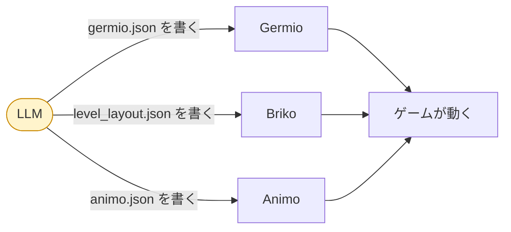
```mermaid
flowchart LR
  LLM(["LLM"])
  LLM -->|"germio.json を書く"| G["Germio"]
  LLM -->|"level_layout.json を書く"| B["Briko"]
  LLM -->|"animo.json を書く"| A["Animo"]
  G & B & A --> Game["ゲームが動く"]
  style LLM fill:#fff4cc,stroke:#ca8a04
```

### 2.2 設計原則の継承

Animo は Germio・Briko の文化を踏襲する。

| 原則 | 内容 |
|---|---|
| **G16** | C# クラス名・JSON キー・Schema $defs・LLM 語彙を全層で同一名にする |
| **G17** | JSON 可視プロパティはすべて `snake_case` |
| **G18** | ネームスペース階層を厳守し依存方向を絶対に逆にしない |

---

## 3. アーキテクチャ全景

Animo の内部構造を一望する。

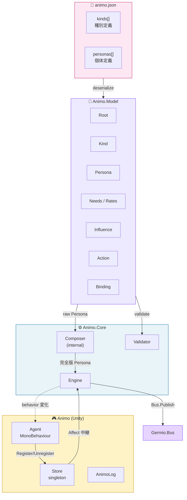
```mermaid
flowchart TB
  subgraph JSON["📄 animo.json"]
    direction LR
    JK["kinds[]<br/>種別定義"]
    JP["personas[]<br/>個体定義"]
  end

  subgraph Model["🧬 Animo.Model"]
    direction LR
    MR["Root"]
    MK["Kind"]
    MP["Persona"]
    MN["Needs / Rates"]
    MI["Influence"]
    MA["Action"]
    MB["Binding"]
  end

  subgraph Core["⚙️ Animo.Core"]
    direction LR
    CC["Composer<br/>(internal)"]
    CE["Engine"]
    CV["Validator"]
  end

  subgraph Runtime["🎮 Animo (Unity)"]
    direction LR
    RA["Agent<br/>MonoBehaviour"]
    RS["Store<br/>singleton"]
    RL["AnimoLog"]
  end

  Germio["Germio.Bus"]

  JSON -->|"deserialize"| Model
  Model -->|"raw Persona"| CC
  CC -->|"完全版 Persona"| CE
  Model -->|"validate"| CV
  CE -.->|"behavior 変化"| RA
  RA -->|"Register/Unregister"| RS
  RS -->|"Affect 中継"| CE
  CE -->|"Bus.Publish"| Germio

  style Core fill:#e8f4f8,stroke:#0369a1
  style Runtime fill:#fef3c7,stroke:#ca8a04
  style Model fill:#ede9fe,stroke:#7c3aed
  style JSON fill:#fce7f3,stroke:#be185d
  style Germio fill:#e8d5ff,stroke:#7e3ff2
```

---

## 4. ネームスペース階層と依存方向

**G18 厳守。** 上位は下位に依存できるが、下位は上位を知ってはならない。

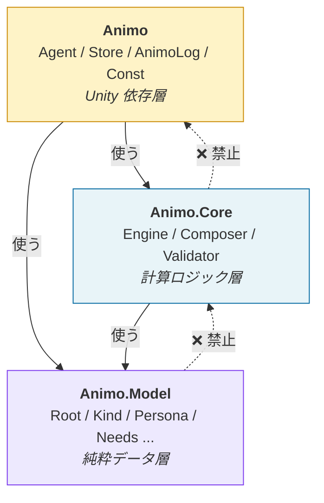
```mermaid
flowchart TB
  Animo["<b>Animo</b><br/>Agent / Store / AnimoLog / Const<br/><i>Unity 依存層</i>"]
  Core["<b>Animo.Core</b><br/>Engine / Composer / Validator<br/><i>計算ロジック層</i>"]
  Model["<b>Animo.Model</b><br/>Root / Kind / Persona / Needs ...<br/><i>純粋データ層</i>"]
  Animo -->|"使う"| Core
  Animo -->|"使う"| Model
  Core -->|"使う"| Model
  Model -.->|"❌ 禁止"| Core
  Core -.->|"❌ 禁止"| Animo
  style Animo fill:#fef3c7,stroke:#ca8a04
  style Core fill:#e8f4f8,stroke:#0369a1
  style Model fill:#ede9fe,stroke:#7c3aed
```

### 4.1 各層の責務

| 層 | 責務 | 依存可能 |
|---|---|---|
| `Animo.Model` | 純粋データクラス。`animo.json` の構造をそのまま表現 | なし |
| `Animo.Core` | 計算ロジック。Unity 非依存でテスト可能 | `Animo.Model` |
| `Animo` | Unity 統合層。MonoBehaviour と Germio 接続 | `Animo.Core` `Animo.Model` |

---

## 5. クラス全一覧

### 5.1 全クラスのカード

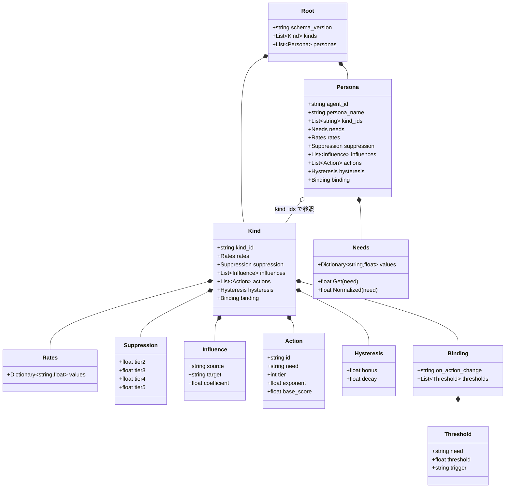
```mermaid
classDiagram
  class Root {
    +string schema_version
    +List~Kind~ kinds
    +List~Persona~ personas
  }
  class Kind {
    +string kind_id
    +Rates rates
    +Suppression suppression
    +List~Influence~ influences
    +List~Action~ actions
    +Hysteresis hysteresis
    +Binding binding
  }
  class Persona {
    +string agent_id
    +string persona_name
    +List~string~ kind_ids
    +Needs needs
    +Rates rates
    +Suppression suppression
    +List~Influence~ influences
    +List~Action~ actions
    +Hysteresis hysteresis
    +Binding binding
  }
  class Needs {
    +Dictionary~string,float~ values
    +float Get(need)
    +float Normalized(need)
  }
  class Rates {
    +Dictionary~string,float~ values
  }
  class Suppression {
    +float tier2
    +float tier3
    +float tier4
    +float tier5
  }
  class Influence {
    +string source
    +string target
    +float coefficient
  }
  class Action {
    +string id
    +string need
    +int tier
    +float exponent
    +float base_score
  }
  class Hysteresis {
    +float bonus
    +float decay
  }
  class Binding {
    +string on_action_change
    +List~Threshold~ thresholds
  }
  class Threshold {
    +string need
    +float threshold
    +string trigger
  }
  Root *-- Kind
  Root *-- Persona
  Persona o-- Kind : kind_ids で参照
  Kind *-- Rates
  Kind *-- Suppression
  Kind *-- Influence
  Kind *-- Action
  Kind *-- Hysteresis
  Kind *-- Binding
  Persona *-- Needs
  Binding *-- Threshold
```

### 5.2 全クラス表

| ネームスペース | クラス | 役割 | 公開度 |
|---|---|---|---|
| `Animo.Model` | `Root` | JSON ルート。`schema_version` `kinds` `personas` を持つ | public |
| `Animo.Model` | `Kind` | 種別定義。複数 Persona に共通する設定 | public |
| `Animo.Model` | `Persona` | 個体定義。`Kind` と同じフィールドを全部持てる | public |
| `Animo.Model` | `Needs` | 欲求の値セット。`Dictionary<string, float>` ベース | public |
| `Animo.Model` | `Rates` | 欲求の変化率 | public |
| `Animo.Model` | `Suppression` | 階層抑制係数。`tier2`–`tier5` の固定フィールド | public |
| `Animo.Model` | `Influence` | 欲求間の影響（source → target） | public |
| `Animo.Model` | `Action` | 行動定義。`need` はオプション | public |
| `Animo.Model` | `Hysteresis` | 行動切り替え抑制パラメータ | public |
| `Animo.Model` | `Binding` | Germio との接続定義 | public |
| `Animo.Model` | `Threshold` | 欲求の閾値トリガー | public |
| `Animo.Core` | `Composer` | Kind 合成 → 完全版 Persona 生成 | **internal** |
| `Animo.Core` | `Engine` | AI 計算本体 | public |
| `Animo.Core` | `Validator` | animo.json 検証 | public |
| `Animo` | `Agent` | MonoBehaviour ラッパー | public |
| `Animo` | `Store` | 全 Agent の窓口（シングルトン） | public |
| `Animo` | `AnimoLog` | ロガー（`GermioLog` / `BrikoLog` と同パターン） | public |
| `Animo` | `Const` | ドメイン定数（`Env` ではない） | public static |

---

## 6. animo.json スキーマ

### 6.1 完全版サンプル

```json
{
  "schema_version": "1.0",
  "kinds": [
    {
      "kind_id": "goblin",
      "rates": {
        "hunger": 2.0, "fatigue": 1.5, "fear": -2.0,
        "loneliness": 1.2, "confidence": -0.3, "curiosity": 0.8
      },
      "suppression": {
        "tier2": 0.25, "tier3": 0.30, "tier4": 0.40, "tier5": 0.50
      },
      "influences": [
        { "source": "fear",   "target": "confidence", "coefficient": -0.60 },
        { "source": "fear",   "target": "curiosity",  "coefficient": -0.50 },
        { "source": "hunger", "target": "fear",       "coefficient":  0.25 }
      ],
      "actions": [
        { "id": "Flee",       "need": "fear",      "tier": 2, "exponent": 2.5 },
        { "id": "SearchFood", "need": "hunger",    "tier": 1, "exponent": 1.8 },
        { "id": "Rest",       "need": "fatigue",   "tier": 1, "exponent": 1.5 },
        { "id": "Patrol",     "need": "curiosity", "tier": 5, "exponent": 1.0, "base_score": 8 }
      ],
      "hysteresis": { "bonus": 10, "decay": 6 },
      "binding": {
        "on_action_change": "animo_{agent_id}_{behavior}",
        "thresholds": [
          { "need": "fear",   "threshold": 80, "trigger": "animo_{agent_id}_fear_critical" }
        ]
      }
    },
    {
      "kind_id": "scout",
      "influences": [
        { "source": "fear", "target": "confidence", "coefficient": -0.30 }
      ],
      "actions": [
        { "id": "Socialize", "need": "loneliness", "tier": 3, "exponent": 1.3 }
      ]
    }
  ],
  "personas": [
    {
      "agent_id": "goblin_scout_01",
      "persona_name": "Goblin Scout — Timid Skirmisher",
      "kind_ids": ["goblin", "scout"],
      "needs": {
        "hunger": 40, "fatigue": 20, "fear": 55,
        "loneliness": 60, "confidence": 35, "curiosity": 45
      }
    }
  ]
}
```

### 6.2 JSON キー一覧（G16 一致）

| C# クラス | JSON キー | 個数 |
|---|---|---|
| `Root` | — | ルートのためキーなし |
| `Kind` | `kinds` | 配列（複数形） |
| `Persona` | `personas` | 配列（複数形） |
| `Needs` | `needs` | オブジェクト |
| `Rates` | `rates` | オブジェクト |
| `Suppression` | `suppression` | オブジェクト |
| `Influence` | `influences` | 配列（複数形） |
| `Action` | `actions` | 配列（複数形） |
| `Hysteresis` | `hysteresis` | オブジェクト |
| `Binding` | `binding` | 単数 |
| `Threshold` | `thresholds` | 配列（`binding` 内） |

### 6.3 オプション項目と省略可能性

| キー | 省略可? | デフォルト |
|---|---|---|
| `actions[].base_score` | ✅ | `0` |
| `actions[].need` | ✅ | なし（常時行動） |
| `binding.on_action_change` | ✅ | エンジン固定 `animo_{agent_id}_{behavior}` |
| `kind_ids` | ✅ | 空配列（合成なし） |
| `persona.rates` 以下のフィールド | ✅ | `Kind` から継承 |

---

## 7. Kind × Persona カスケーディング

### 7.1 思想：CSS と同じ後勝ちカスケード

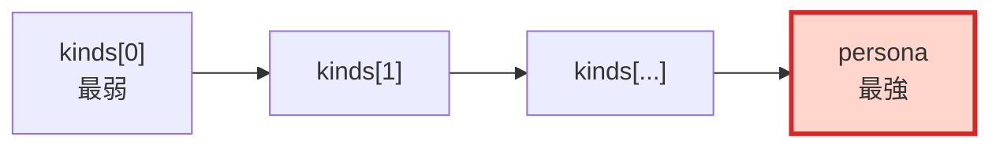
```mermaid
flowchart LR
  K1["kinds[0]<br/>最弱"]
  K2["kinds[1]"]
  K3["kinds[...]"]
  P["persona<br/>最強"]
  K1 --> K2 --> K3 --> P
  style P fill:#ffd5cc,stroke:#dc2626,stroke-width:3px
```

### 7.2 合成ルール

| 対象 | 合成方法 |
|---|---|
| スカラー値（`hysteresis.bonus` など） | 後勝ち |
| Dictionary キー（`needs` `rates`） | キー単位で後勝ち |
| 配列要素（`actions` `influences`） | 後勝ち（同一識別子は上書き、新規は追加） |
| `Influence` の同一 source/target ペア | 後勝ちで上書き |
| `Action` の同一 `id` | 後勝ちで上書き |

### 7.3 多重継承の例：「日本人 × A型 × 男性 → 山田太郎」

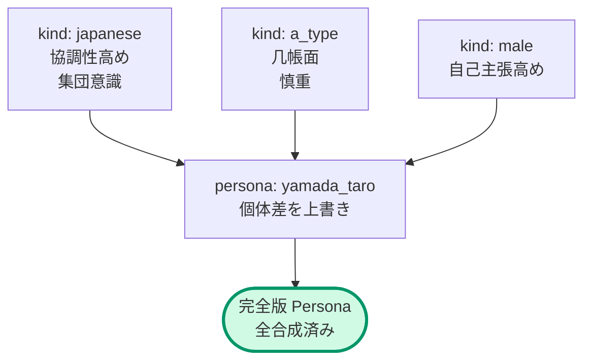
```mermaid
flowchart TB
  K1["kind: japanese<br/>協調性高め<br/>集団意識"]
  K2["kind: a_type<br/>几帳面<br/>慎重"]
  K3["kind: male<br/>自己主張高め"]
  P["persona: yamada_taro<br/>個体差を上書き"]
  Result(["完全版 Persona<br/>全合成済み"])
  K1 --> P
  K2 --> P
  K3 --> P
  P --> Result
  style Result fill:#d1fae5,stroke:#059669,stroke-width:3px
```

### 7.4 推論と演算の分離

LLM は `kind_ids` の配列順を書くだけ。後勝ちの合成計算は `Composer` が担当する。

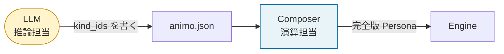
```mermaid
flowchart LR
  LLM(["LLM<br/>推論担当"]) -->|"kind_ids を書く"| JSON["animo.json"]
  JSON --> Comp["Composer<br/>演算担当"]
  Comp -->|"完全版 Persona"| Engine
  style LLM fill:#fff4cc,stroke:#ca8a04
  style Comp fill:#e8f4f8,stroke:#0369a1
```

---

## 8. Engine の内部設計

### 8.1 公開 API

| 種別 | 名前 | 内容 |
|---|---|---|
| コンストラクタ | `Engine(Persona persona)` | `Composer` が生成した完全版 `Persona` を受け取る |
| メソッド | `Live(float dt)` | 時間を進める（5ステップ処理） |
| メソッド | `Affect(string need, float delta, bool forceReset = false)` | 外部刺激を与える |
| プロパティ | `behavior` | 現在の行動（string） |

### 8.2 Live() の5ステップ

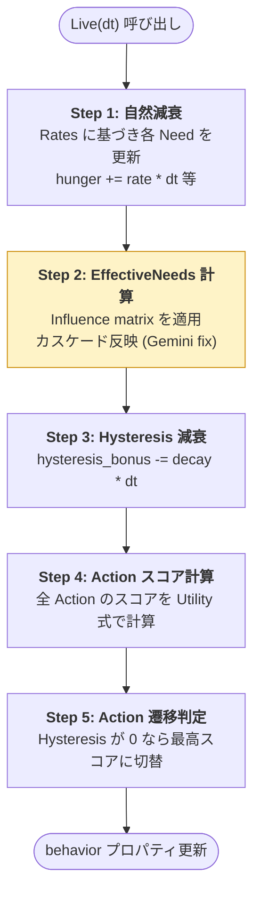
```mermaid
flowchart TB
  Start(["Live(dt) 呼び出し"])
  S1["<b>Step 1: 自然減衰</b><br/>Rates に基づき各 Need を更新<br/>hunger += rate * dt 等"]
  S2["<b>Step 2: EffectiveNeeds 計算</b><br/>Influence matrix を適用<br/>カスケード反映 (Gemini fix)"]
  S3["<b>Step 3: Hysteresis 減衰</b><br/>hysteresis_bonus -= decay * dt"]
  S4["<b>Step 4: Action スコア計算</b><br/>全 Action のスコアを Utility 式で計算"]
  S5["<b>Step 5: Action 遷移判定</b><br/>Hysteresis が 0 なら最高スコアに切替"]
  End(["behavior プロパティ更新"])
  Start --> S1 --> S2 --> S3 --> S4 --> S5 --> End
  style S2 fill:#fef3c7,stroke:#ca8a04
```

### 8.3 Utility スコア計算式

```
score = Pow(intensity, exponent) × (1 - suppression[tier]) × 100 + base_score + hysteresis_bonus
```

| 変数 | 意味 |
|---|---|
| `intensity` | EffectiveNeeds で正規化された欲求強度（0–1） |
| `exponent` | Action の鋭敏度。大きいほど高 need で急激に立ち上がる |
| `suppression[tier]` | Maslow tier に応じた抑制率 |
| `base_score` | 常時加算される基本スコア（Patrol など） |
| `hysteresis_bonus` | 現在選択中の Action にだけ加算される維持ボーナス |

### 8.4 EffectiveNeeds カスケード（Gemini fix）

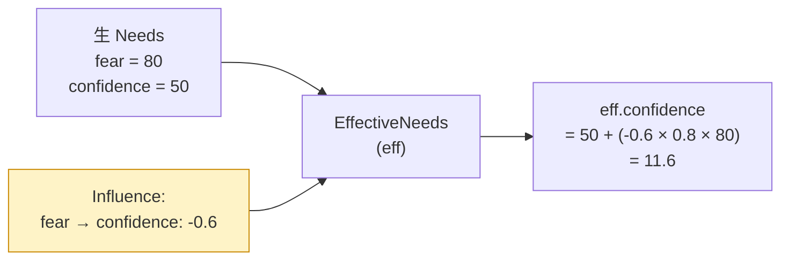
```mermaid
flowchart LR
  N["生 Needs<br/>fear = 80<br/>confidence = 50"]
  E["EffectiveNeeds<br/>(eff)"]
  Inf["Influence:<br/>fear → confidence: -0.6"]
  Result["eff.confidence<br/>= 50 + (-0.6 × 0.8 × 80)<br/>= 11.6"]
  N --> E
  Inf --> E
  E --> Result
  style Inf fill:#fef3c7,stroke:#ca8a04
```

旧実装は `Needs.Normalized(source)` を使っていたためカスケードしなかった。修正版は `eff.Normalized(source)` を使うことで A→B→C の連鎖反応が正しく発生する。

```csharp
// ❌ 旧（カスケードしない）
float intensity = Needs.Normalized(inf.Source);
float delta     = inf.Coefficient * intensity * Needs.Get(inf.Source);

// ✅ fix（カスケードする）
float intensity = eff.Normalized(inf.Source);
float delta     = inf.Coefficient * intensity * eff.Get(inf.Source);
```

### 8.5 Affect() の動作

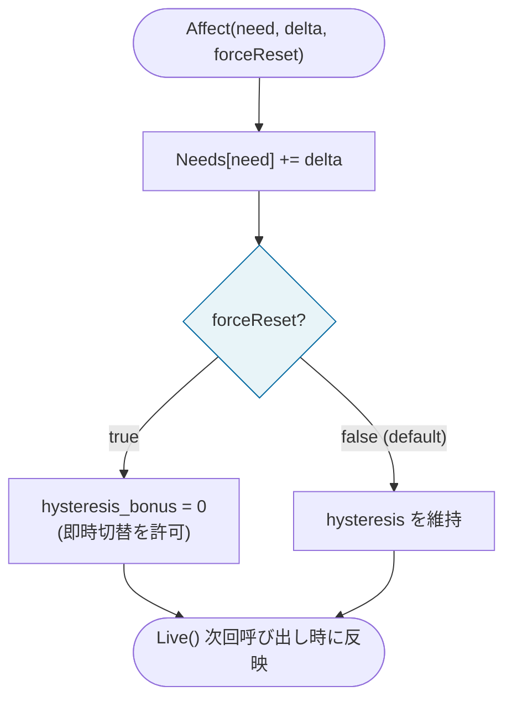
```mermaid
flowchart TB
  In(["Affect(need, delta, forceReset)"])
  Add["Needs[need] += delta"]
  Q{"forceReset?"}
  Reset["hysteresis_bonus = 0<br/>(即時切替を許可)"]
  Keep["hysteresis を維持"]
  End(["Live() 次回呼び出し時に反映"])
  In --> Add --> Q
  Q -->|"true"| Reset --> End
  Q -->|"false (default)"| Keep --> End
  style Q fill:#e8f4f8,stroke:#0369a1
```

魔法数字（旧実装の delta ≥ 20）を使わない。挙動は完全に `animo.json` の `hysteresis` 設定でコントロール可能。

### 8.6 Hysteresis の動作

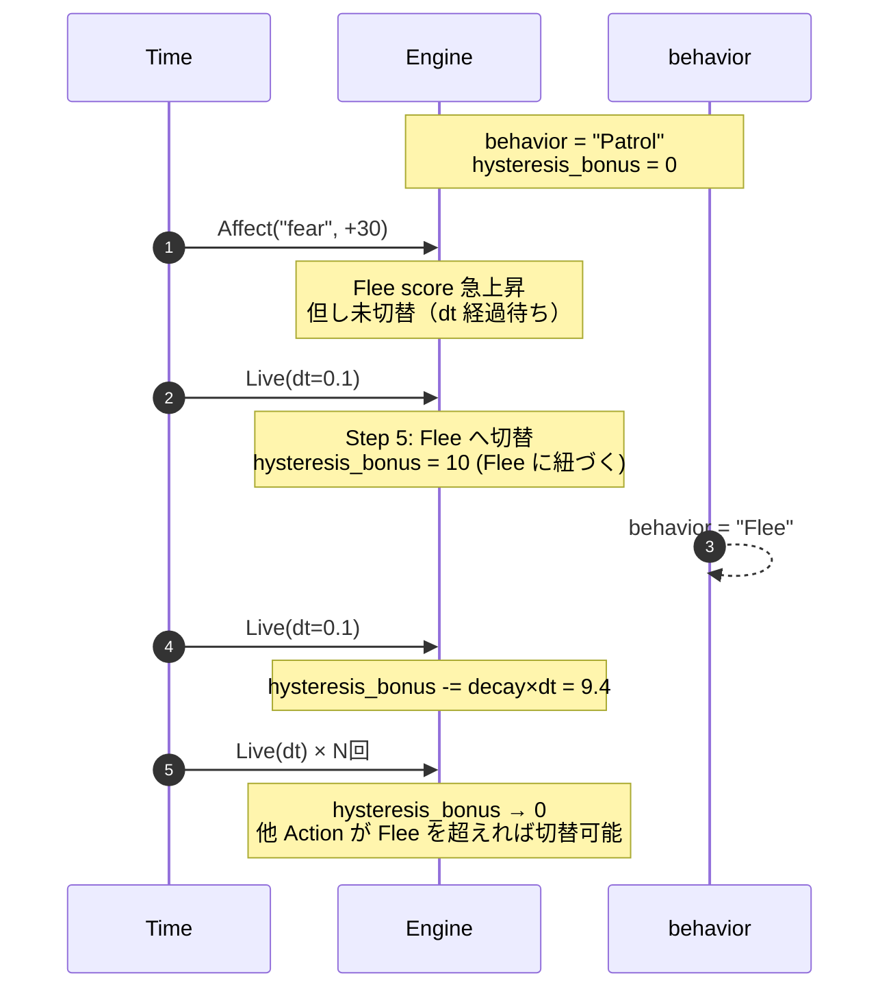
```mermaid
sequenceDiagram
  autonumber
  participant T as Time
  participant E as Engine
  participant B as behavior
  Note over E,B: behavior = "Patrol"<br/>hysteresis_bonus = 0
  T->>E: Affect("fear", +30)
  Note over E: Flee score 急上昇<br/>但し未切替（dt 経過待ち）
  T->>E: Live(dt=0.1)
  Note over E: Step 5: Flee へ切替<br/>hysteresis_bonus = 10 (Flee に紐づく)
  B-->>B: behavior = "Flee"
  T->>E: Live(dt=0.1)
  Note over E: hysteresis_bonus -= decay×dt = 9.4
  T->>E: Live(dt) × N回
  Note over E: hysteresis_bonus → 0<br/>他 Action が Flee を超えれば切替可能
```

---

## 9. Composer の責務

### 9.1 なぜ専用クラスか

`Engine` は純粋な計算エンジンであるべき。Kind 合成という「変換ロジック」を `Engine` の中に置くと責務が混在する。`Composer` を独立させることで：

- `Engine` が `Root` を知らずに済む
- `Composer` 単体テストが書ける
- 合成ロジックが複雑化しても `Engine` `Store` に影響しない

### 9.2 利用フロー

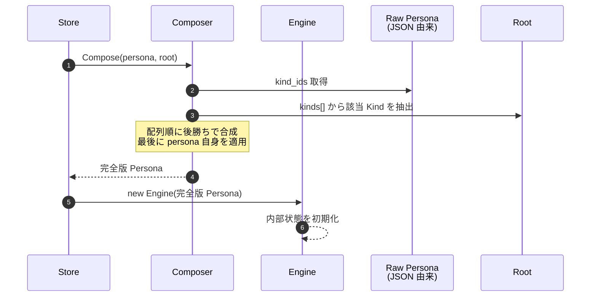
```mermaid
sequenceDiagram
  autonumber
  participant Store
  participant Composer
  participant Engine
  participant Persona as Raw Persona<br/>(JSON 由来)
  participant Root
  Store->>Composer: Compose(persona, root)
  Composer->>Persona: kind_ids 取得
  Composer->>Root: kinds[] から該当 Kind を抽出
  Note over Composer: 配列順に後勝ちで合成<br/>最後に persona 自身を適用
  Composer-->>Store: 完全版 Persona
  Store->>Engine: new Engine(完全版 Persona)
  Engine-->>Engine: 内部状態を初期化
```

### 9.3 公開度

`internal class Composer` — 外部からは見えない。`Store` だけが呼ぶ。

### 9.4 合成の擬似コード

```csharp
internal static class Composer {
    internal static Persona Compose(Persona persona, Root root) {
        // 1. 空の完全版 Persona を作る
        // 2. kind_ids[] を順に処理
        //    各 Kind のフィールドをマージ（後勝ち）
        // 3. 最後に persona 自身のフィールドをマージ（最強）
        // 4. 完全版を返す
    }
}
```

---

## 10. Store API 仕様

### 10.1 役割

`agent_id` をキーに全 `Agent` を保持し、外部から `Affect` を届ける窓口。

### 10.2 仕様一覧

| 項目 | 内容 |
|---|---|
| パターン | シングルトン（`Germio.Core.Store` 文化踏襲） |
| 登録タイミング | `Agent.Awake` |
| 解除タイミング | `Agent.OnDestroy` |
| `agent_id` 未発見時 | `AnimoLog.Warning` を出して処理継続 |
| `Find` メソッド | `internal` — 外部非公開 |

### 10.3 公開 API

```csharp
// 登録
Animo.Store.Instance.Register(agent: this);

// 登録解除
Animo.Store.Instance.Unregister(agent: this);

// Affect 中継（Germio Executor から呼ばれる）
Animo.Store.Instance.Affect(
    agent_id: "goblin_01",
    need:     "fear",
    delta:    +30f
);
```

### 10.4 ライフサイクル

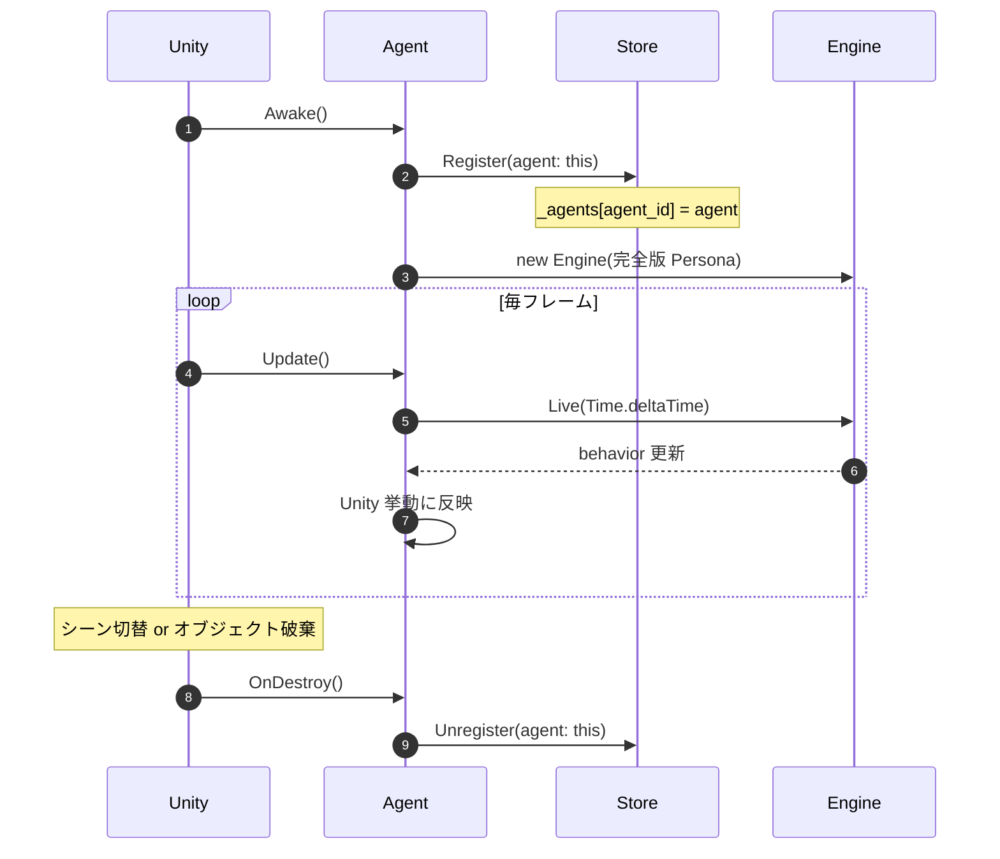
```mermaid
sequenceDiagram
  autonumber
  participant Unity
  participant Agent
  participant Store
  participant Engine
  Unity->>Agent: Awake()
  Agent->>Store: Register(agent: this)
  Note over Store: _agents[agent_id] = agent
  Agent->>Engine: new Engine(完全版 Persona)
  loop 毎フレーム
    Unity->>Agent: Update()
    Agent->>Engine: Live(Time.deltaTime)
    Engine-->>Agent: behavior 更新
    Agent->>Agent: Unity 挙動に反映
  end
  Note over Unity: シーン切替 or オブジェクト破棄
  Unity->>Agent: OnDestroy()
  Agent->>Store: Unregister(agent: this)
```

### 10.5 Affect 中継の流れ

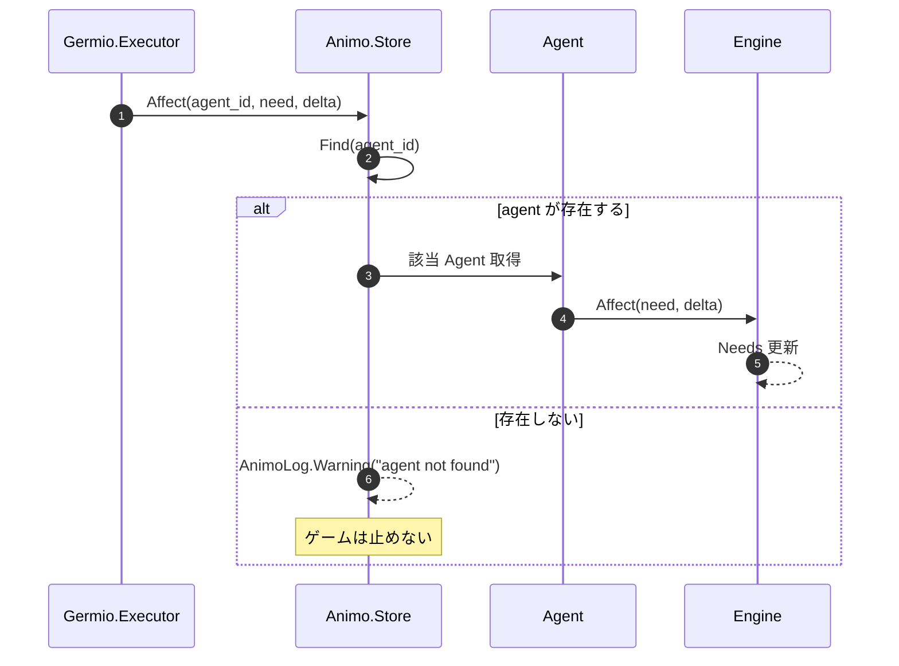
```mermaid
sequenceDiagram
  autonumber
  participant Germio as Germio.Executor
  participant Store as Animo.Store
  participant Agent
  participant Engine
  Germio->>Store: Affect(agent_id, need, delta)
  Store->>Store: Find(agent_id)
  alt agent が存在する
    Store->>Agent: 該当 Agent 取得
    Agent->>Engine: Affect(need, delta)
    Engine-->>Engine: Needs 更新
  else 存在しない
    Store-->>Store: AnimoLog.Warning("agent not found")
    Note over Store: ゲームは止めない
  end
```

---

## 11. Binding 動作仕様

### 11.1 Bus への参照

`Agent`（MonoBehaviour）が Inspector で `Bus` を受け取る。`Store` も `Engine` も `Bus` を直接持たない。

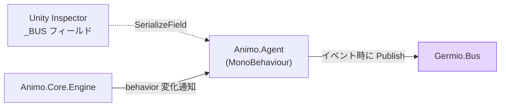
```mermaid
flowchart LR
  Inspector["Unity Inspector<br/>_BUS フィールド"]
  Agent["Animo.Agent<br/>(MonoBehaviour)"]
  Engine["Animo.Core.Engine"]
  Bus["Germio.Bus"]
  Inspector -.->|"SerializeField"| Agent
  Agent -->|"イベント時に Publish"| Bus
  Engine -->|"behavior 変化通知"| Agent
  style Bus fill:#e8d5ff,stroke:#7e3ff2
```

`Bus` が `null` のとき：`AnimoLog.Warning` を1回出して以後 Silent。Animo 単体使用（Germio なし）も正当なユースケース。

### 11.2 on_action_change の発火

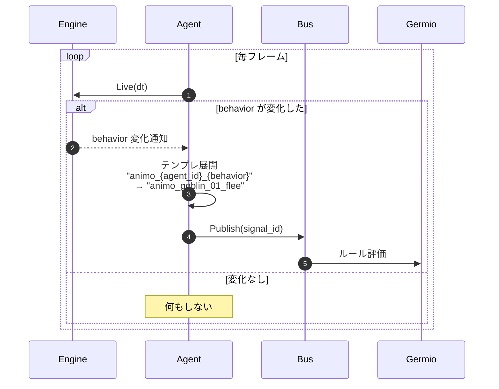
```mermaid
sequenceDiagram
  autonumber
  participant Engine
  participant Agent
  participant Bus
  participant Germio
  loop 毎フレーム
    Agent->>Engine: Live(dt)
    alt behavior が変化した
      Engine-->>Agent: behavior 変化通知
      Agent->>Agent: テンプレ展開<br/>"animo_{agent_id}_{behavior}"<br/>→ "animo_goblin_01_flee"
      Agent->>Bus: Publish(signal_id)
      Bus->>Germio: ルール評価
    else 変化なし
      Note over Agent: 何もしない
    end
  end
```

### 11.3 thresholds の発火

「前フレームで閾値以下・今フレームで閾値以上」の**瞬間**だけ発火。連続発火を防ぐ。

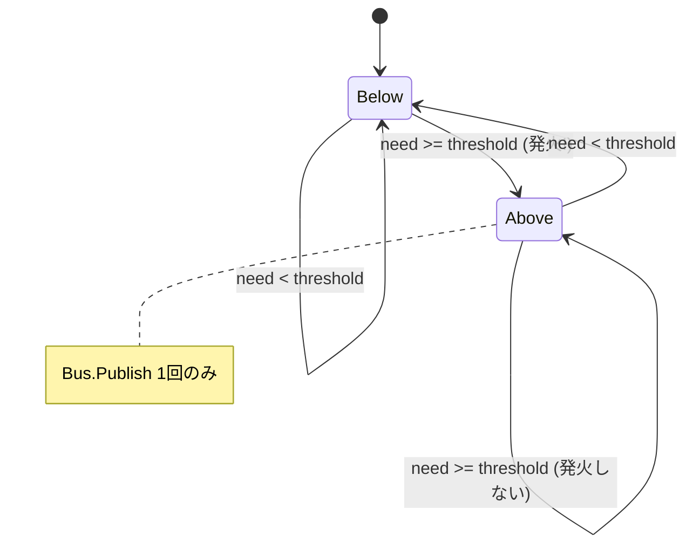
```mermaid
stateDiagram-v2
  [*] --> Below
  Below --> Below : need < threshold
  Below --> Above : need >= threshold (発火!)
  Above --> Above : need >= threshold (発火しない)
  Above --> Below : need < threshold
  note right of Above : Bus.Publish 1回のみ
```

`Engine` 内部に `_previous_needs` を保持して比較する。

### 11.4 テンプレート許容プレースホルダ

| ルール | フィールド | 許容プレースホルダ |
|---|---|---|
| A014 | `binding.on_action_change` | `{agent_id}` `{behavior}` |
| A015 | `thresholds[].trigger` | `{agent_id}` |

固定文字列（プレースホルダなし）も許容。

### 11.5 テンプレート展開フロー

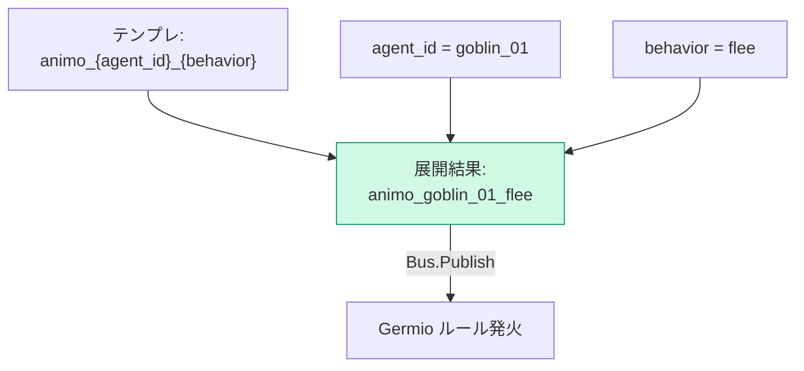
```mermaid
flowchart TB
  T["テンプレ:<br/>animo_{agent_id}_{behavior}"]
  V1["agent_id = goblin_01"]
  V2["behavior = flee"]
  R["展開結果:<br/>animo_goblin_01_flee"]
  T --> R
  V1 --> R
  V2 --> R
  R -->|"Bus.Publish"| Germio["Germio ルール発火"]
  style R fill:#d1fae5,stroke:#059669
```

---

## 12. Validator ルール A000–A021

### 12.1 全ルール一覧

| ID | 内容 | 種別 |
|---|---|---|
| **A000** | `schema_version` が存在し空でない | Error |
| **A001** | `personas` が存在し空でない | Error |
| **A002** | `persona.agent_id` が snake_case・空文字禁止・重複なし・128文字以下 | Error |
| **A003** | `kind.kind_id` が snake_case・空文字禁止・重複なし・128文字以下 | Error |
| **A004** | `persona.kind_ids` の全要素が `kinds` に存在する | Error |
| **A005** | `needs` の全値が 0.0 以上 100.0 以下 | Error |
| **A006** | `suppression` のキーが `tier2`–`tier5` のみ・値が 0.0 以上 1.0 以下 | Error |
| **A007** | `actions[].tier` が 1 以上 5 以下 | Error |
| **A008** | `actions[].exponent` が 0.1 以上 5.0 以下 | Error |
| **A009** | `actions[].id` が空文字でない | Error |
| **A010** | `thresholds[].threshold` が 0.0 以上 100.0 以下 | Error |
| **A011a** | `kind_ids` なしのとき Persona 単体で `actions` が最低1つ | Error |
| **A011b** | `kind_ids` ありのとき `actions` は省略可 | — |
| **A012** | `influences[].coefficient` が -1.0 以上 1.0 以下 | Error |
| **A013** | `rates` のキーが `needs` のキーのサブセット | Warning |
| **A014** | `binding.on_action_change` のプレースホルダが `{agent_id}` / `{behavior}` のみ | Error |
| **A015** | `thresholds[].trigger` のプレースホルダが `{agent_id}` のみ | Error |
| **A016** | `binding` がない | Warning |
| **A017** | `hysteresis.bonus` が `hysteresis.decay` 以下 | Warning |
| **A018** | `agent_id` / `kind_id` が 128 文字以下（A002/A003 に統合） | Error |
| **A019** | 未知 `needs` キーが標準6欲求に類似（タイポ疑い） | Warning |
| **A020a** | `kind.rates` キーが参照 Persona の `needs` に存在しない | Warning |
| **A020b** | `kind.influences` source/target が参照 Persona の `needs` に存在しない | Warning |
| **A020c** | `kind.actions[].need` が参照 Persona の `needs` に存在しない | Warning |
| **A021** | `schema_version` が `"1.0"` のみサポート | Error |

### 12.2 検証フロー

```mermaid
flowchart TB
  Start(["animo.json 読込"])
  P1{"A000: schema_version 存在?"}
  P2{"A021: version == 1.0?"}
  P3["A001-A010: 構造・範囲チェック"]
  P4["A011-A015: フィールド整合性"]
  P5["A016-A019: Warning 系"]
  P6["A020a/b/c: Kind × Persona<br/>クロスフィールド検証"]
  Result(["ValidationResult<br/>(errors + warnings)"])
  Start --> P1
  P1 -->|"No"| Err(["即時 Error 終了"])
  P1 -->|"Yes"| P2
  P2 -->|"No"| Err
  P2 -->|"Yes"| P3
  P3 --> P4 --> P5 --> P6 --> Result
  style Err fill:#fecaca,stroke:#dc2626
  style Result fill:#d1fae5,stroke:#059669
```

### 12.3 snake_case の定義（A002 / A003 共通）

| 項目 | 規則 |
|---|---|
| 使用可能文字 | `a-z` / `0-9` / `_` |
| 先頭文字 | 英字のみ |
| アンダースコア連続 | `__` 禁止 |
| 末尾アンダースコア | 禁止 |
| 上限文字数 | 128 |

### 12.4 テンプレート検証ロジック（A014 / A015）

```mermaid
flowchart TB
  In(["テンプレ文字列"])
  C1{"空文字?"}
  C2{"{ } 対応?"}
  C3["プレースホルダ抽出<br/>{xxx} を全部"]
  C4{"全プレースホルダが<br/>許容リスト内?"}
  Pass(["✅ Pass"])
  Fail(["❌ Error"])
  In --> C1
  C1 -->|"Yes"| Fail
  C1 -->|"No"| C2
  C2 -->|"No"| Fail
  C2 -->|"Yes"| C3
  C3 --> C4
  C4 -->|"No"| Fail
  C4 -->|"Yes"| Pass
  style Pass fill:#d1fae5,stroke:#059669
  style Fail fill:#fecaca,stroke:#dc2626
```

固定文字列（プレースホルダなし）も Pass。

### 12.5 JSON Schema と Validator の責務分離

**LLM ファースト設計**：JSON Schema は型・構造・範囲制限まで全て担当する。LLM が Schema だけを見て正しい animo.json を書ける状態を維持する。

```mermaid
flowchart LR
  JSON["animo.json"]
  Schema["animo.schema.json<br/><b>型 + 構造 + 範囲</b><br/>minimum / maximum / pattern"]
  Validator["Animo.Core.Validator<br/><b>意味の整合性</b><br/>Cross-field<br/>テンプレート展開可能性"]
  JSON -->|"型・構造・範囲<br/>(LLM が直接参照)"| Schema
  JSON -->|"実行時の意味検証"| Validator
  style Schema fill:#e8f4f8,stroke:#0369a1
  style Validator fill:#fef3c7,stroke:#ca8a04
```

| 検証内容 | Schema | Validator |
|---|---|---|
| 型（string / number / array） | ✅ | — |
| 必須フィールド | ✅ | — |
| `additionalProperties: false` | ✅ | — |
| 値の範囲（0–100, 0.1–5.0 等） | ✅ | — |
| `pattern`（snake_case 等） | ✅ | — |
| 重複検出 | — | ✅ |
| 参照整合性（`kind_ids` の存在） | — | ✅ |
| Cross-field（A020a/b/c） | — | ✅ |
| テンプレート展開可能性 | — | ✅ |

---

## 13. Animo.Const ドメイン定数

### 13.1 命名根拠

**`Env` ではない。** `Env` は「実行環境設定」を表す語。Animo の定数は「AI エンジンのドメイン定義値」であり Environment ではない。だから `Const`。

| 用途 | 命名 |
|---|---|
| 実行環境定数（FPS, モード名等） | `Env`（例：`Germio.Env`） |
| ドメイン定義値（欲求リスト等） | `Const`（`Animo.Const`） |

ライブラリ間で命名を統一しない。**意味の正確さを優先する**のが Germio / Briko 文化の本質。

### 13.2 完全版コード

```csharp
// Copyright (c) STUDIO MeowToon. All rights reserved.
// Licensed under the GPL v2.0 license.

namespace Animo {
    /// <summary>
    /// Animo domain constants.
    /// Not "Env" because these are domain values, not environment settings.
    /// </summary>
    /// <author>h.adachi (STUDIO MeowToon)</author>
    public static class Const {
#nullable enable

        // ============================================================
        // Standard needs (used by A019 typo detection)
        // ============================================================

        /// <summary>The 6 standard Maslow-derived needs.</summary>
        public static readonly string[] STANDARD_NEEDS = {
            "hunger", "fatigue", "fear",
            "loneliness", "confidence", "curiosity"
        };

        // ============================================================
        // Validator limits
        // ============================================================

        public const float MIN_NEED         =   0.0f;
        public const float MAX_NEED         = 100.0f;
        public const float MIN_EXPONENT     =   0.1f;
        public const float MAX_EXPONENT     =   5.0f;
        public const float MIN_COEFFICIENT  =  -1.0f;
        public const float MAX_COEFFICIENT  =   1.0f;
        public const float MIN_SUPPRESSION  =   0.0f;
        public const float MAX_SUPPRESSION  =   1.0f;
        public const int   MIN_TIER         =   1;
        public const int   MAX_TIER         =   5;
        public const int   MAX_ID_LENGTH    = 128;

        // ============================================================
        // Schema version support
        // ============================================================

        public const string SUPPORTED_SCHEMA_VERSION = "1.0";

        // ============================================================
        // Template placeholders
        // ============================================================

        public static readonly string[] TEMPLATE_PLACEHOLDERS_ACTION = {
            "agent_id", "behavior"
        };
        public static readonly string[] TEMPLATE_PLACEHOLDERS_THRESHOLD = {
            "agent_id"
        };

        // ============================================================
        // Default Germio binding template
        // ============================================================

        public const string DEFAULT_ON_ACTION_CHANGE = "animo_{agent_id}_{behavior}";
    }
}
```

---

## 14. コーディング規約

Germio / Briko 文化を完全踏襲する。

### 14.1 命名規則

```mermaid
flowchart TB
  subgraph C1["クラス・型"]
    PascalCase["<b>PascalCase</b><br/>Engine / Persona / Action"]
  end
  subgraph C2["public プロパティ (Unity GameDev)"]
    camelCase["<b>camelCase</b><br/>behavior / agentId"]
  end
  subgraph C3["JSON 可視・private フィールド・パラメータ"]
    snake_case["<b>snake_case</b><br/>agent_id / kind_ids / _store"]
  end
  subgraph C4["SerializeField / Inspector"]
    ALLCAPS["<b>_ALL_CAPS</b><br/>_BUS / _PERSONA"]
  end
  subgraph C5["定数"]
    UPPER_SNAKE["<b>UPPER_SNAKE</b><br/>MAX_ID_LENGTH"]
  end
  style PascalCase fill:#ede9fe
  style camelCase fill:#fef3c7
  style snake_case fill:#e8f4f8
  style ALLCAPS fill:#fce7f3
  style UPPER_SNAKE fill:#d1fae5
```

### 14.2 ファイル冒頭テンプレ

```csharp
// Copyright (c) STUDIO MeowToon. All rights reserved.
// Licensed under the GPL v2.0 license. See LICENSE text in the project root for license information.

#nullable enable

using System.Collections.Generic;

namespace Animo.Core {
    /// <summary>
    /// Brief description of the class.
    ///
    /// More detailed explanation of behavior, design intent, references to G16/G17/G18.
    /// </summary>
    /// <author>h.adachi (STUDIO MeowToon)</author>
    public class Engine {
#nullable enable

        ///////////////////////////////////////////////////////////////////////////////////////////////
        // Fields

        readonly Persona _persona;

        ///////////////////////////////////////////////////////////////////////////////////////////////
        // Constructor

        /// <summary>
        /// Constructs an Engine for the given fully-composed Persona.
        /// </summary>
        /// <param name="persona">The fully-composed Persona produced by Composer.</param>
        public Engine(Persona persona) {
            _persona = persona;
        }

        ///////////////////////////////////////////////////////////////////////////////////////////////
        // public Methods [verb]

        // ...
    }
}
```

### 14.3 必須要素チェックリスト

| 項目 | 内容 |
|---|---|
| Copyright ヘッダー | GPL v2.0 表記 |
| `#nullable enable` | 全 .cs ファイルに記述 |
| XML doc | 全 public クラス・メソッド・プロパティに必須 |
| author タグ | `<author>h.adachi (STUDIO MeowToon)</author>` |
| セクションコメント | `// Fields` `// Constructor` `// public Methods [verb]` 等 |
| Named parameters | 必須（BCL・Unity API・Newtonsoft 除外） |
| モデル集約 | `Data.cs` 1ファイルに `Animo.Model` 全クラス |
| ログ統一 | `AnimoLog.Write(message: ...)` |

### 14.4 Named parameters の例

```csharp
// ✅ 正しい — 自前 API は named parameters
Store.Instance.Affect(agent_id: "goblin_01", need: "fear", delta: +30f);
AnimoLog.Write(message: "[Animo Engine] behavior changed");
new Engine(persona: composed_persona);

// ✅ BCL / Unity API は named 不要
Mathf.Clamp(value, 0f, 1f);
Time.deltaTime;
GetComponent<Rigidbody>();

// ✅ Newtonsoft も named 不要
JsonConvert.DeserializeObject<Root>(json);
```

---

## 15. リポジトリ構成

```
animo/
├─ Scripts/
│  ├─ Animo.asmdef                ← Unity assembly definition
│  ├─ Data.cs                     ← Animo.Model 全クラス集約
│  ├─ Engine.cs                   ← Animo.Core.Engine
│  ├─ Composer.cs                 ← Animo.Core.Composer (internal)
│  ├─ Validator.cs                ← Animo.Core.Validator
│  ├─ Agent.cs                    ← Animo.Agent (MonoBehaviour)
│  ├─ Store.cs                    ← Animo.Store (singleton)
│  ├─ AnimoLog.cs                 ← Animo.AnimoLog
│  └─ Const.cs                    ← Animo.Const
├─ Editor/
│  └─ Animo.Editor.asmdef         ← Editor 拡張用 (将来)
├─ schemas/
│  └─ animo.schema.json           ← LLM ファースト Schema
├─ examples/
│  ├─ goblin_scout.json           ← ゼルダ系
│  ├─ tanukichi.json              ← どうぶつの森系
│  └─ shiori.json                 ← ときメモ系
├─ docs/
│  ├─ design_overview.md
│  ├─ cascade_rules.md
│  ├─ validator_rules.md
│  └─ binding_protocol.md
├─ Tests~/                        ← Unity から見えないテスト
│  └─ EditModeTests/
│     ├─ ComposerTests.cs
│     ├─ EngineTests.cs
│     └─ ValidatorTests.cs
├─ package.json
├─ README.md
├─ CHANGELOG.md
└─ LICENSE
```

### 15.1 ディレクトリ説明

```mermaid
flowchart LR
  subgraph Repo["animo/"]
    Scripts["Scripts/<br/>ランタイムコード"]
    Editor["Editor/<br/>エディタ拡張"]
    Schemas["schemas/<br/>JSON Schema"]
    Examples["examples/<br/>サンプル animo.json"]
    Docs["docs/<br/>設計ドキュメント"]
    Tests["Tests~/<br/>EditMode テスト"]
    Pkg["package.json<br/>com.meowtoon.animo"]
  end
  style Scripts fill:#e8f4f8
  style Schemas fill:#fce7f3
  style Examples fill:#fef3c7
  style Tests fill:#ede9fe
```

---

## 16. package.json と依存

```json
{
  "name": "com.meowtoon.animo",
  "version": "0.1.0",
  "displayName": "Animo",
  "description": "Maslow-driven Utility AI engine for game agents. JSON-defined personas, Kind cascading inheritance, and Germio Bus integration. Part of the G+B+A stack.",
  "unity": "2022.3",
  "author": {
    "name": "STUDIO MeowToon",
    "url": "https://github.com/hiroxpepe/animo"
  },
  "keywords": [
    "unity", "ai", "utility-ai", "maslow",
    "llm", "germio", "agent", "npc"
  ],
  "dependencies": {
    "com.unity.nuget.newtonsoft-json": "3.2.1"
  }
}
```

### 16.1 依存関係（現在）

```mermaid
flowchart LR
  Animo["com.meowtoon.animo<br/>v0.1.0"]
  Newtonsoft["com.unity.nuget.newtonsoft-json<br/>3.2.1"]
  Animo -->|"必須"| Newtonsoft
  style Animo fill:#ffd5cc,stroke:#dc2626
```

### 16.2 依存関係（将来 — Utilo / Germio Package 化後）

```mermaid
flowchart LR
  Animo["com.meowtoon.animo"]
  Germio["com.meowtoon.germio"]
  Utilo["com.meowtoon.utilo<br/>(共通基盤)"]
  Newtonsoft["newtonsoft-json"]
  Animo --> Germio
  Animo --> Utilo
  Animo --> Newtonsoft
  Germio --> Utilo
  Briko["com.meowtoon.briko"] --> Germio
  Briko --> Utilo
  style Utilo fill:#d1fae5,stroke:#059669,stroke-width:3px
```

---

## 17. 応用シミュレーション

Animo は3つのジャンルで自然に動作することを設計時に確認済み。

### 17.1 ゼルダ系（モンスター AI）

```json
{
  "kinds": [
    { "kind_id": "monster",  "suppression": {...}, "rates": {...} },
    { "kind_id": "predator", "actions": [
      { "id": "Hunt",   "need": "hunger", "tier": 1, "exponent": 2.0 },
      { "id": "Ambush", "need": "fear",   "tier": 2, "exponent": 1.5 }
    ]},
    { "kind_id": "boss", "hysteresis": { "bonus": 30, "decay": 2 } }
  ],
  "personas": [
    {
      "agent_id": "ganon",
      "kind_ids": ["monster", "predator", "boss"],
      "needs": { "hunger": 60, "fear": 20, "confidence": 90 }
    }
  ]
}
```

### 17.2 どうぶつの森系（村の住人）

```json
{
  "kinds": [
    { "kind_id": "villager",   "actions": [
      { "id": "Socialize", "need": "loneliness", "tier": 3, "exponent": 1.3 },
      { "id": "Craft",     "need": "curiosity",  "tier": 5, "exponent": 1.0 },
      { "id": "Rest",      "need": "fatigue",    "tier": 1, "exponent": 1.5 }
    ]},
    { "kind_id": "energetic",   "rates": { "loneliness": 3.0 } },
    { "kind_id": "introverted", "rates": { "loneliness": 0.5 } }
  ],
  "personas": [
    {
      "agent_id": "tanukichi",
      "kind_ids": ["villager", "energetic"],
      "needs": { "loneliness": 30, "curiosity": 80 }
    }
  ]
}
```

### 17.3 ときメモ系（ヒロイン心理）

```json
{
  "kinds": [
    { "kind_id": "heroine", "actions": [
      { "id": "Confront", "need": "anger",      "tier": 2, "exponent": 2.0 },
      { "id": "Withdraw", "need": "loneliness", "tier": 3, "exponent": 1.5 },
      { "id": "Demand",   "need": "longing",    "tier": 4, "exponent": 1.8 }
    ]},
    { "kind_id": "anxious", "influences": [
      { "source": "loneliness", "target": "anger",   "coefficient":  0.60 },
      { "source": "loneliness", "target": "longing", "coefficient":  0.80 }
    ]},
    { "kind_id": "a_type", "suppression": { "tier2": 0.10, "tier3": 0.20 } }
  ],
  "personas": [
    {
      "agent_id": "shiori",
      "kind_ids": ["heroine", "anxious", "a_type"],
      "needs": { "loneliness": 70, "longing": 65, "anger": 40, "jealousy": 50 }
    }
  ]
}
```

### 17.4 応用が利く根拠

```mermaid
mindmap
  root((Animo<br/>応用力))
    Action.id が string
      ゼルダ Hunt/Ambush
      どう森 Socialize/Craft
      ときメモ Confront/Withdraw
    needs キーが自由
      標準 6 欲求
      ジャンル独自 longing/jealousy
    kind_ids 多重合成
      monster × predator × boss
      heroine × anxious × a_type
    Animo はジャンルを知らない
      ライブラリ汚染なし
      LLM が自由に書ける
```

---

## 18. LLM チューニングフロー

### 18.1 自然言語 → animo.json のリアルタイム反映

```mermaid
sequenceDiagram
  autonumber
  participant Dev as 開発者
  participant LLM
  participant JSON as animo.json
  participant Val as Validator
  participant Game
  Dev->>LLM: "ゴブリンをもっと臆病にして"
  LLM->>JSON: kinds[goblin].rates.fear を編集
  JSON->>Val: 検証
  alt エラーなし
    Val-->>JSON: ✅ Pass
    JSON->>Game: ホットリロード
    Game-->>Dev: 即座に挙動変化
  else エラー
    Val-->>LLM: rule_id + fix_suggestion
    LLM->>JSON: 修正
  end
```

### 18.2 G+B+A のチューニング階層

```mermaid
flowchart TB
  Dev["開発者の自然言語指示"]
  LLM["LLM"]
  G["germio.json<br/>ルール変更<br/>(WHAT)"]
  B["level_layout.json<br/>地形変更<br/>(WHERE)"]
  A["animo.json<br/>性格変更<br/>(WHY)"]
  Game(["ゲームに反映"])
  Dev --> LLM
  LLM --> G
  LLM --> B
  LLM --> A
  G --> Game
  B --> Game
  A --> Game
  style A fill:#ffd5cc,stroke:#dc2626,stroke-width:3px
```

### 18.3 チューニングできる範囲（コード変更不要）

| 変更 | 編集箇所 |
|---|---|
| 全ゴブリンを強気に | `kinds[goblin].influences` の係数 |
| この個体だけ臆病に | `personas[xxx].needs.fear` を上げる |
| 新しい性格を追加 | `kinds[]` に新 Kind を追加し既存 Persona の `kind_ids` に追記 |
| 行動切替を遅くする | `hysteresis.bonus` を上げる |
| 緊急時に即反応 | ゲーム側で `Affect(forceReset: true)` を呼ぶ |

---

## 19. TODO メモ — 将来課題

設計検討の過程で記録された全 TODO を集約。

### 19.1 全 TODO の俯瞰

```mermaid
mindmap
  root((Animo<br/>将来課題))
    ログ統合
      GermioLog/BrikoLog/AnimoLog<br/>3本コピー存在
      → UtiloLog に統合
    Utilo 新設
      共通ロガー
      ValidationResult<br/>ValidationLevel<br/>Location
      G18 違反の根本解決
    Germio Package 化
      stemic から切り出し
      com.meowtoon.germio
    Organization 移管
      hiroxpepe → meowtoon
      G+B+A+U 全部移管
    GroupMind
      恐怖伝染<br/>集団行動
      Animo v2 スコープ
    Validator 進化
      A012 合成方式変更時の見直し
      A020 重複抑制
      Germio Schema を A 案化
    スキーマバージョン
      "1.0" のみ現在対応
      "2.0" 移行は v2 で検討
```

### 19.2 ログ統合（最優先）

```mermaid
flowchart LR
  subgraph Now["現状（負債）"]
    GL["GermioLog"]
    BL["BrikoLog"]
    AL["AnimoLog"]
    G_FILE["germio.log"]
    B_FILE["briko.log"]
    A_FILE["animo.log"]
    GL --> G_FILE
    BL --> B_FILE
    AL --> A_FILE
  end
  subgraph Future["Utilo 統合後"]
    UL["UtiloLog"]
    U_FILE["utilo.log"]
    UL --> U_FILE
  end
  Now -.->|"統合"| Future
  style Now fill:#fecaca,stroke:#dc2626
  style Future fill:#d1fae5,stroke:#059669
```

### 19.3 Utilo の構成（将来）

```
github.com/meowtoon/utilo
└─ Scripts/
   ├─ UtiloLog.cs           ← 共通ロガー
   └─ Validation.cs         ← ValidationResult / ValidationLevel / Location
```

切り出し対象：

| 項目 | 現所在 | 移行先 |
|---|---|---|
| `GermioLog` | Germio | `Utilo.UtiloLog` |
| `BrikoLog` | Briko | `Utilo.UtiloLog` |
| `AnimoLog` | Animo | `Utilo.UtiloLog` |
| `ValidationResult` | Germio | `Utilo` |
| `ValidationLevel` | Germio | `Utilo` |
| `Location` | Germio | `Utilo` |

### 19.4 Germio の Unity Package 化

現状：`stemic/game/Assets/Plugins/Germio/` にベタ置き → Plugin であり Package ではない。

```mermaid
flowchart TB
  subgraph Now2["現状"]
    Stemic1["stemic リポジトリ"]
    Plugin["game/Assets/Plugins/Germio/"]
    Stemic1 --> Plugin
  end
  subgraph Future2["将来"]
    Stemic2["stemic<br/>(ゲームコードのみ)"]
    GermioRepo["github.com/meowtoon/germio"]
    Stemic2 -.->|"package.json で参照"| GermioRepo
  end
  Now2 -.->|"分離"| Future2
  style Future2 fill:#d1fae5,stroke:#059669
```

### 19.5 Organization 移管計画

```mermaid
flowchart LR
  subgraph Personal["github.com/hiroxpepe (個人)"]
    H1["stemic"]
    H2["briko"]
    H3["animo (新設)"]
  end
  subgraph Org["github.com/meowtoon (Organization)"]
    M1["stemic"]
    M2["briko"]
    M3["animo"]
    M4["germio (新規)"]
    M5["utilo (新規)"]
  end
  Personal -.->|"移管"| Org
  style Org fill:#d1fae5,stroke:#059669,stroke-width:3px
```

### 19.6 各プロダクトへの懸念

| プロダクト | 懸念 |
|---|---|
| `Germio.Env` | 現状は `Env` で問題なし。将来ドメイン定義値が増えたら `Germio.Const` を新設し分離 |
| `Briko` | 定数クラス未存在。必要になったら内容で `Env` / `Const` を判断（統一不要） |
| `Animo.Const` | `MAX_ID_LENGTH` など Utilo 移管候補の定数あり。Utilo 設計時に再検討 |
| `Utilo.Env/Const` | Utilo 設計時に内容で判断 |
| **全体方針** | 命名は一貫性より意味の正確さを優先する |

### 19.7 Validator の進化

| 項目 | 内容 |
|---|---|
| **A012 範囲** | `coefficient` -1.0–1.0 は後勝ち合成前提。合成方式を変えたら見直し |
| **A020 重複抑制** | 同 Kind 起因の Warning を Kind 単位で1回に集約 |
| **Germio Schema** | 現在 `minimum`/`maximum` なし。LLM ファースト A 案に更新すべき |

### 19.8 GroupMind（v2 スコープ）

```mermaid
flowchart LR
  Member1["Agent 1<br/>Flee 開始"]
  Member2["Agent 2<br/>恐怖伝染"]
  Member3["Agent 3<br/>恐怖伝染"]
  Group["GroupMind<br/>(Animo v2)"]
  Member1 -->|"NotifyMemberFled"| Group
  Group -.->|"fear +X"| Member2
  Group -.->|"fear +X"| Member3
  style Group fill:#fef3c7,stroke:#ca8a04,stroke-dasharray: 5 5
```

Gemini fix の `GroupMind.cs` は参考資料として保存。実装は v2 へ。

---

## 20. 設計決定の履歴

この仕様書に至るまでに行われた主な設計判断。

### 20.1 命名の進化

```mermaid
flowchart LR
  subgraph Iter1["初期案"]
    A1["AnimoEngine"]
    A2["AnimoNeeds"]
    A3["AnimoAgent"]
    A4["AnimoManager"]
  end
  subgraph Iter2["G16 反映"]
    B1["Engine"]
    B2["Needs"]
    B3["Agent"]
    B4["Backstage"]
  end
  subgraph Iter3["最終"]
    C1["Engine"]
    C2["Needs"]
    C3["Agent"]
    C4["Store"]
  end
  Iter1 -->|"プレフィックス削除"| Iter2
  Iter2 -->|"温度感調整"| Iter3
  style Iter3 fill:#d1fae5,stroke:#059669
```

### 20.2 重要な却下案と採用理由

| 検討項目 | 却下案 | 採用案 | 理由 |
|---|---|---|---|
| ルートクラス名 | `Scenario` `Cast` | `Root` | Briko `Root` と思想一致・特別な意味を持ち込まない |
| データ層名 | `Agent` | `Persona` | 動くものとデータの混同回避 |
| 多重継承単位 | `Type`（C# 予約語） | `Kind` | 衝突回避＋一語名詞 |
| 行動enum | `Action`（衝突）`Behavior` | `Action` | C# クラス名で `System.Action` と区別可能・JSON `actions` と一致 |
| 行動 ID 型 | enum 固定 | string | ときメモの `Confront` に対応・拡張性最大 |
| 欲求 enum | `Need` | string | `Action.id` と思想統一・jealousy 等を許可 |
| 合成方法 | 加算 / 平均 | 後勝ち（CSS 流） | 意図を明示できる・予測可能 |
| 合成責務 | `Engine` 内蔵 | 専用 `Composer` | Engine 純化・テスト容易 |
| Hysteresis 強制リセット | delta ≥ 20 自動 | `forceReset` 引数 | 魔法数字撤廃・LLM 制御可能 |
| Schema の範囲 | 型のみ | 型 + 範囲 | LLM ファースト |
| 定数クラス名 | `Env` 統一 | `Const`（Animo） | 意味の正確さを優先 |

### 20.3 検討の総ターン数

20 章にわたる仕様検討で合意に至った主要トピック：

```mermaid
pie title 検討時間配分（主観）
  "命名・文化整合" : 30
  "JSON スキーマ設計" : 20
  "Kind × Persona 合成" : 15
  "Validator ルール" : 15
  "Engine API" : 10
  "Store / Binding" : 5
  "Utilo / Organization 計画" : 5
```

---

## 完

**Animo v0.1.0-design** 仕様書、ここで完結。
GO がかかったら本実装に着手する。

> "Germio asks **what**, Briko asks **where**, Animo asks **why**."
> — STUDIO MeowToon

---

*Last updated: 2026-05-08 — STUDIO MeowToon — h.adachi*
