# Animo

> **A Maslow-Driven Utility AI for Game Agents**
>
> Part of the **G+B+A stack** (Germio + Briko + Animo).

[](https://dotnet.microsoft.com/)


[](LICENSE)

---

## What is Animo?

Animo is a **Utility AI engine** for a game's own agents —
enemies, NPCs, anything at all that needs to *want* something.

It models an inner drive with **Maslow's own layers of need**. You
write a JSON file that says what an agent *cares about*. The
engine reads it, works out the inner needs as time passes, and
decides what the agent does next — with no behavior tree, no
state machine, and no string a search by name at all in the hot path.

> **Germio asks "what." Briko asks "where." Animo asks "why."**

---

## The three questions

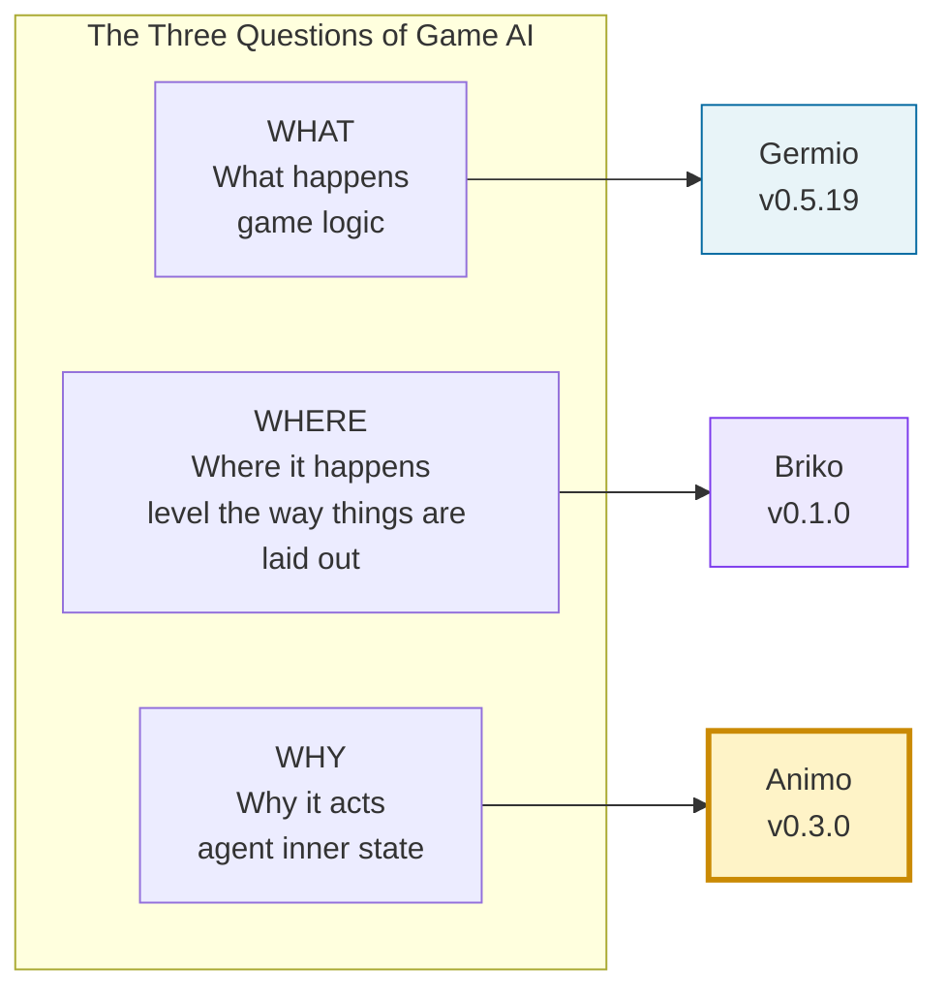

Animo is the **WHY** layer.
Most game AI mixes *what* the agent does in with *why* it does it.
Animo keeps the two apart — and that is the whole point of it.

---

## Where things stand

🟢 **Phase 1 — Design done (v0.1.4 → v0.1.5)**
🟢 **Phase 2 — Schema + a red baseline, done (v0.2.0)**
🟢 **Phase 3 — Core Engine + ScenarioRunner, done (v0.3.0)**
⬜ **Phase 4 — Unity work + a CLI (next)**

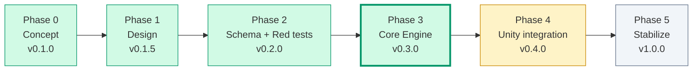

**At v0.3.0** the core engine's own work is done, in full, proven by
mathematics (452 tests Green, checked to make no waste at all in memory),
and free of Unity (`Animo.Core` / `Animo.Model` / `Animo.Tools` use
no `UnityEngine` reference at all). Phase 4 puts the proven core
inside Unity's own parts, and ships a CLI runner.

+ 📄 [English the exact plan (current)](docs/animo_spec_v0.1.5_EN.md) — the true, real reference used to build it
+ 📄 [Japanese the exact plan](docs/animo_spec_v0.1.5_JP.md) — the first talk on its design
+ 📊 [State of Animo v0.3.0](docs/state_of_animo_v0.3.0.md) — a look back on Phase 3, and the gap left before Phase 4
+ ⚡ [Benchmarks v0.3.0](docs/benchmarks_v0.3.0.md) — how the "no memory waste" claim was measured
+ 📝 [CHANGELOG](CHANGELOG.md) — the release notes
+ 🗺️ [Roadmap to v1.0.0](docs/animo_roadmap_to_v1.0.0.md)

---

## Why Animo?

Most game AI uses a Behavior Tree, or a Finite State Machine.
Both put *what to do* into words, but force *why* to be put in too,
in an indirect way — through the order of points, the conditions
for a change, or a shared set of variables on a blackboard.

Animo turns this around. **You state the needs.** The engine works
out the rest, on its own.

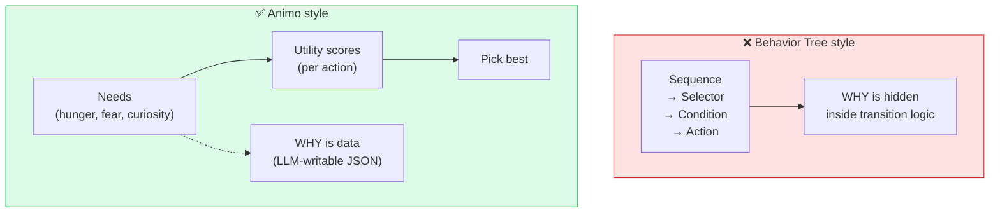

You write this:

```json
{
  "agent_id": "goblin_01",
  "kind_ids": ["goblin", "scout"],
  "needs": {
    "hunger": 40, "fear": 55, "curiosity": 45
  }
}
```

The engine takes it from there — decay, holding a need back,
working out a score, switching between acts, locking to an
animation, all of it.

---

## The build, at a glance

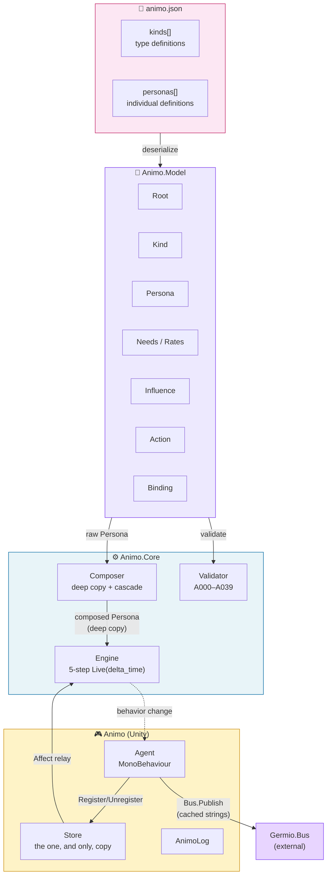

### Where one layer ends (a strict rule)

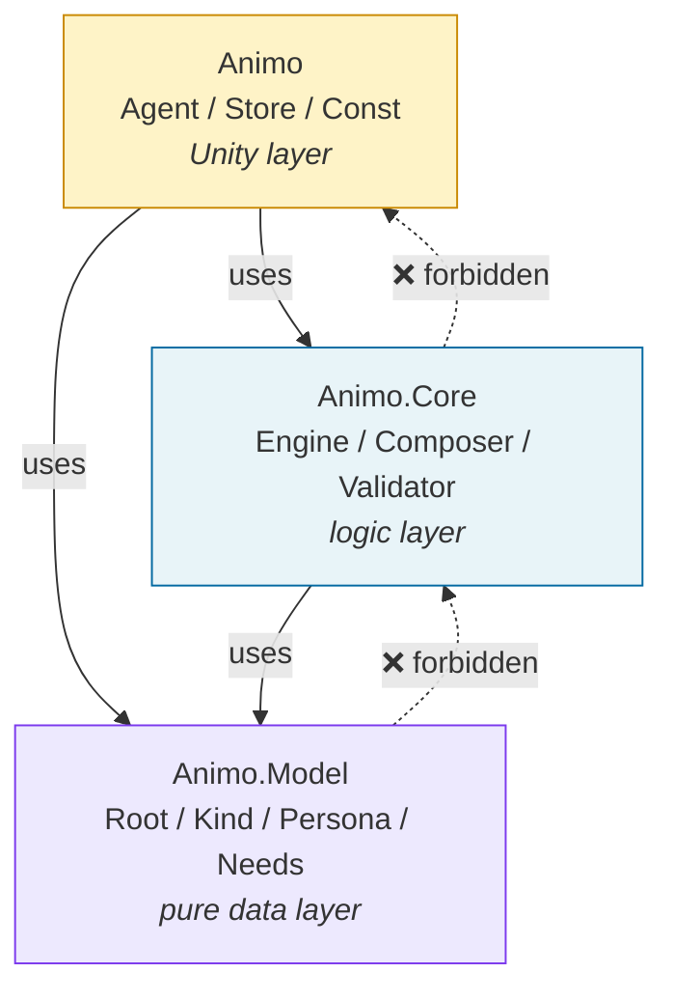

A higher layer may use a lower one. A lower layer **must not** know
of a higher one at all.
This is what lets `Animo.Core` be tested with no Unity at all.

---

## How one frame works (`Engine.Live(delta_time)`)

Every Animo agent runs the same five steps, each frame. The Lock
part (v0.1.4) lets an animation's own state freeze a decision,
with no freeze on the simulation itself.


---

## Maslow, and holding a need back

The one part that makes Animo *Maslow*. A low-tier need
(survival) holds a high-tier one (rising to your own full self)
back — but only while it is, in fact, unmet.

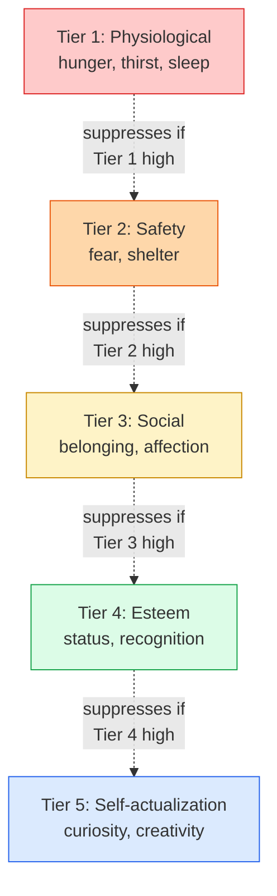

A in need of food goblin, near starving, will not go out to explore. A
safe, well-fed goblin will. This comes straight out of the
formula — nowhere do you write "if in need of food, then no exploring."

---

## Cascading: Kind × Persona

Much like CSS, Animo lets you set a type (`kinds`), then change it
per one, single agent (`personas`). The cascade is
**last-wins**, and copied deep, to keep clear of a shared-reference
bug.

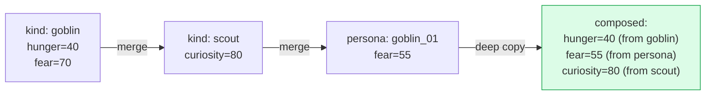

`kind_ids: ["goblin", "scout"]` means *be a goblin, but also a
scout*. The persona's own JSON lists only what is different.

---

## The JSON schema

Every `animo.json` is checked against
`Schemas/animo.schema.json` (JSON Schema **Draft-07**) before the
runtime Validator is ever run at all. The schema checks types,
structure, ranges, and patterns; the runtime Validator handles
meaning across fields, cycle checks, and template fill-in points
(see §13.6 of the spec).

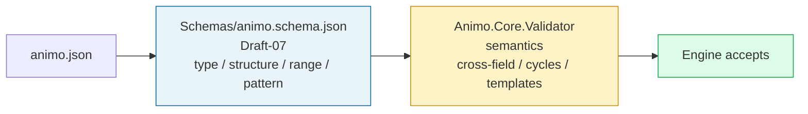

Three sample personas live under `examples/`:

| Sample | Style | Notes |
| --- | --- | --- |
| `goblin_scout.json` | a monster, like Zelda's own | more than one kind (`goblin` + `scout`), the standard 8 Needs, a threshold that holds steady between two points |
| `tanukichi.json` | an NPC, like Animal Crossing's own | a three-kind cascade (`villager` + `energetic`), a binding with no threshold at all |
| `shiori.json` | a heroine, like Tokimeki's own | its own Needs (`anger`, `longing`, `jealousy`), a three-kind cascade, two thresholds |

All three pass Green; a 25-case negative test proves the schema
turns down badly-formed input, as it should (including an empty
`thresholds[]`, a need out of range, a key not in snake_case, and
a field it does not know).

---

## The test test frame: MiniUnity

`Animo.Core` and `Animo.Model` must be fit for a test in **plain
C# alone**, with no need to start Unity at all. The
`Animo.Tests.MiniUnity` test frame gives Unity-shaped stand-
(`MockGameObject`, `MockMonoBehaviour`, `MockBus`, `MockTime`,
`MockScene`), so an EditMode-style test can drive
`Awake → Update → OnDestroy` straight, from a `dotnet test` runner.

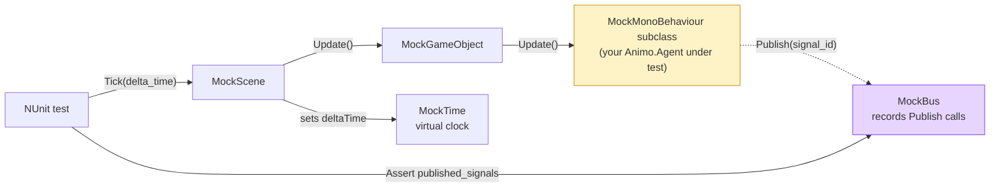

The test frame ships with four tests of its own (the order things
happen in, `MockBus` keeping a record, `MockTime.Step` moving
forward, a check that a destroyed object is dropped) that **must
pass** before any test built on top of it can be trusted; with no
proof of these, Phase 2-3 would stand on a base that was never
checked, and still show red.

The asmdef states `"references": []` and
`"noEngineReferences": true`; the test frame holds no line at all
that says `using UnityEngine`. Unity leaves the whole `Tests~/`
folder alone, so the test frame lives only for the `dotnet` build.

---

## A red baseline (Phase 2-3)

Before any real logic is written, the test a group of tests is built
**red-first**. Every choice laid out in the spec — every Validator
rule, every case in the Composer's own cascade, every step of
`Engine.Live`, every edge case in a number, an empty value, an
amount, or time — has a `[Test]` method that *will* pass once
Phase 3 builds the class it needs. Until then, every test is red,
and that is the whole point of it.

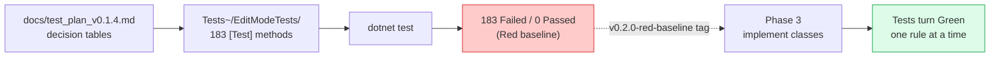

The count matches how the spec breaks it down (§13 Validator
rules, §10 Composer, §9 Engine, §4.6.3 the list of edge cases):

| Layer | Files | Tests |
| --- | --- | --- |
| Validator (A000-A032, with A020 split into a/b/c) | 35 | 92 |
| Composer (deep copy, cascade, fill-in, more than one kind) | 4 | 24 |
| Engine (5 steps, plus Maslow / Commitment / Lock / ForceReset) | 9 | 44 |
| Edge cases (a number, an empty or null value, an amount, time) | 4 | 23 |
| **Total** | **52** | **183** |

The 4 MiniUnity tests of its own are the only Green tests, at this
point. The runner's own output, taken together:

```text
Tests run: 187, Passed: 4, Failed: 183
```

That output, taken at this commit, is the **v0.2.0-red-baseline**
snapshot.

For the full, round-by-round record of the hard review this
project went through, with Gemini, on the way to v0.1.5, see
[Animo Development Log](docs/animo_development_log.md) (151
things found, all checked by search).

## The Validator: 40 rules (A000-A039)

Every `animo.json` goes through 40 rules of the Validator, before
the engine ever touches it at all. Most run on the raw JSON
(stage 1); A019 (a a spelling mistake, a Warning, **moved to stage 2 in Q-S39**,
so it can see the merged `needs_meta`), A025 (a cycle, once
composed), A035 (after fill-in, `trigger > reset`), A036 (composed
`actions[]`, must not be empty), A037 (more than one edge, to the
same target — a Warning), A038 (`needs_meta[need].tier`, an unused
check, from Q-S30, Q-S41, Q-S49, and Q-S57), and A039 (a Warning,
for a threshold pair sitting close together, from Q-S47) all run
after `Composer.Compose` (stage 2), so they can see the graph, once
merged.

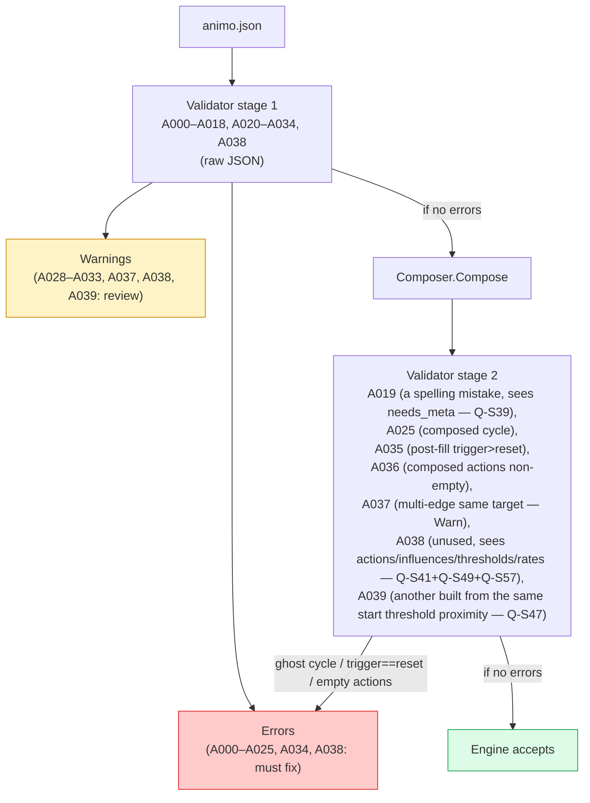

A few examples:

+ **A002** — `agent_id` must be snake_case
+ **A025** — a cycle, in an Influence, is an Error (since v0.1.2)
+ **A028** — a `commitment.bonus` of 30 or more raises a Warning
  (a a chance of harm of chattering)
+ **A031** — a `lock.duration` above five seconds raises a Warning
  (an agent, frozen too long)

The full list stands in [§13 of the spec](docs/animo_spec_v0.1.5_EN.md).

---

## What it does

+ 🧠 **Driven only by a need** — every act rises from an inner
  need, never from a a small program
+ ⛰️ **Maslow, holding needs back, on its own** — a low-tier need
  holds a high-tier one back, all on its own
+ 🎨 **A cascade, much like CSS** — the `kind_ids` array gives more
  than one line of descent, with a merge that always gives the
  same, one answer
+ 🚀 **Built for the hot path** — no string a search by name, no waste of
  memory, values kept in an indexed `float[]`
+ 🤖 **LLM-first** — its own JSON schema is made to be edited by an
  LLM
+ 🔒 **A Behavior Lock, in its own API** — keeps an animation's own
  state in step with a decision (v0.1.4)
+ 📉 **A word back from failure** — an agent fails, learns from it,
  and switches (v0.1.1)
+ ⚡ **Commitment, that holds steady** — holds off chattering, with
  no decay over time at all (v0.1.3)
+ 🪶 **The engine is free of Unity** — `Animo.Core` and
  `Animo.Model` can be tested in plain C# alone

---

## Roadmap

| Phase | Its own aim | Where it stands |
| --- | --- | --- |
| Phase 0 | The idea (v0.1.0) | ✅ Done |
| Phase 1 | Design (v0.1.5) | ✅ Done |
| Phase 2 | Schema, plus a red baseline (v0.2.0) | ✅ Done |
| **Phase 3** | **The Core Engine, plus ScenarioRunner (v0.3.0)** | ✅ **Done** |
| Phase 4 | Work with Unity, plus a CLI (v0.4.0) | 🔥 Next |
| Phase 5 | Made steady, and put on the Asset Store (v1.0.0) | ⬜ |

See [animo_roadmap_to_v1.0.0.md](docs/animo_roadmap_to_v1.0.0.md)
for the full map of tasks left.

---

## License

The MIT License. See [LICENSE](LICENSE).

Copyright (c) STUDIO MeowToon. All rights held.

---

## Author

**h.adachi** ([STUDIO MeowToon](https://github.com/hiroxpepe))

---

## See also

+ [Germio](https://github.com/hiroxpepe/stemic) — a library for a
  game's own logic (**WHAT**)
+ [Briko](https://github.com/hiroxpepe/briko) — a library for
  building a level (**WHERE**)
+ **Animo** — a library for an agent's own, inner drive (**WHY**)
  ← you are here
