# Animo

> **A Maslow-Driven Utility AI for Game Agents**
>
> Part of the **G+B+A stack** (Germio + Briko + Animo).

[](https://dotnet.microsoft.com/)


[](LICENSE)

---

## What is Animo?

Animo is a **Utility AI engine** for a game's own agents —
enemies, NPCs, anything at all that needs to *want* something.

It models an inner drive with **Maslow's own layers of need**. You
write a JSON file that says what an agent *cares about*. The
engine reads it, works out the inner needs as time passes, and
decides what the agent does next — with no behavior tree, no
state machine, and no string lookup at all in the hot path.

> **Germio asks "what." Briko asks "where." Animo asks "why."**

---

## The three questions

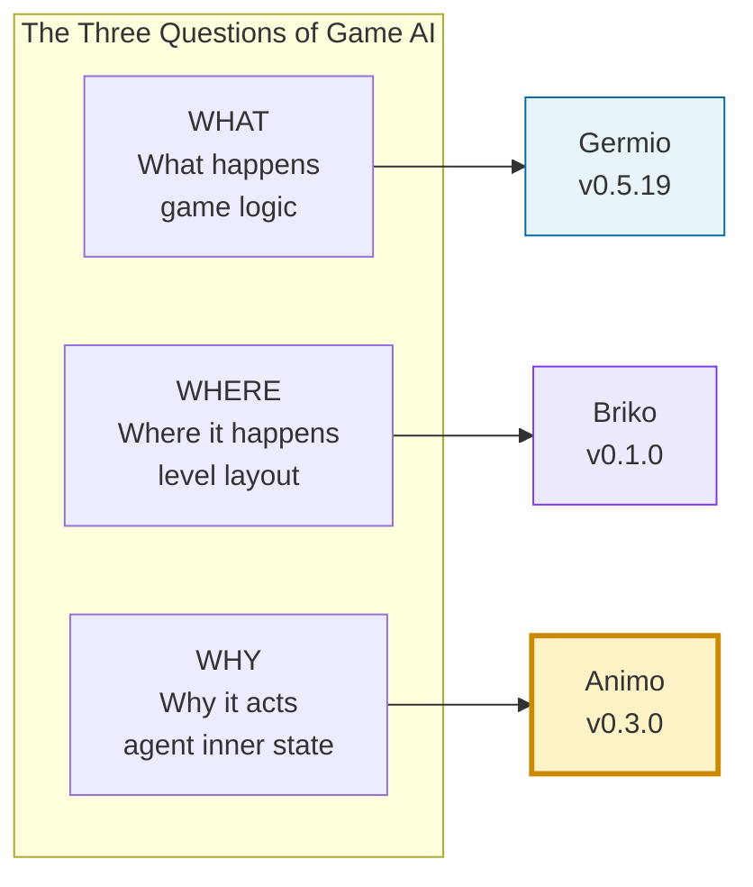

Animo is the **WHY** layer.
Most game AI mixes *what* the agent does in with *why* it does it.
Animo keeps the two apart — and that is the whole point of it.

---

## Where things stand

🟢 **Phase 1 — Design done (v0.1.4 → v0.1.5)**
🟢 **Phase 2 — Schema + a red baseline, done (v0.2.0)**
🟢 **Phase 3 — Core Engine + ScenarioRunner, done (v0.3.0)**
⬜ **Phase 4 — Unity work + a CLI (next)**

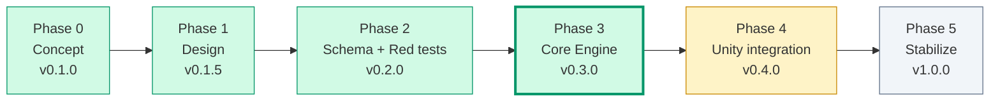

**At v0.3.0** the core engine's own work is done, in full, proven by
math (452 tests Green, checked to make no waste at all in memory),
and free of Unity (`Animo.Core` / `Animo.Model` / `Animo.Tools` use
no `UnityEngine` reference at all). Phase 4 puts the proven core
inside Unity's own parts, and ships a CLI runner.

+ 📄 [English specification (current)](docs/animo_spec_v0.1.5_EN.md) — the true, real reference used to build it
+ 📄 [Japanese specification](docs/animo_spec_v0.1.5_JP.md) — the first talk on its design
+ 📊 [State of Animo v0.3.0](docs/state_of_animo_v0.3.0.md) — a look back on Phase 3, and the gap left before Phase 4
+ ⚡ [Benchmarks v0.3.0](docs/benchmarks_v0.3.0.md) — how the "no memory waste" claim was measured
+ 📝 [CHANGELOG](CHANGELOG.md) — the release notes
+ 🗺️ [Roadmap to v1.0.0](docs/animo_roadmap_to_v1.0.0.md)

---

## Why Animo?

Most game AI uses a Behavior Tree, or a Finite State Machine.
Both put *what to do* into words, but force *why* to be put in too,
in a roundabout way — through the order of nodes, the conditions
for a change, or a shared set of variables on a blackboard.

Animo turns this around. **You state the needs.** The engine works
out the rest, on its own.

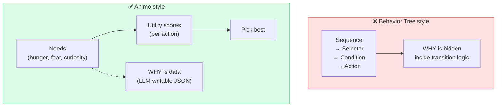

You write this:

```json
{
  "agent_id": "goblin_01",
  "kind_ids": ["goblin", "scout"],
  "needs": {
    "hunger": 40, "fear": 55, "curiosity": 45
  }
}
```

The engine takes it from there — decay, holding a need back,
working out a score, switching between acts, locking to an
animation, all of it.

---

## The build, at a glance

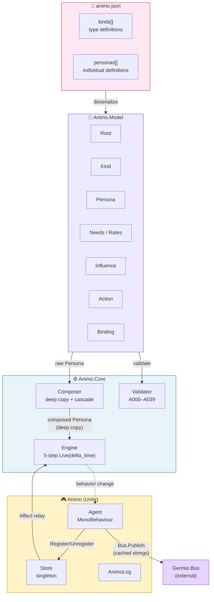

### Where one layer ends (a strict rule)

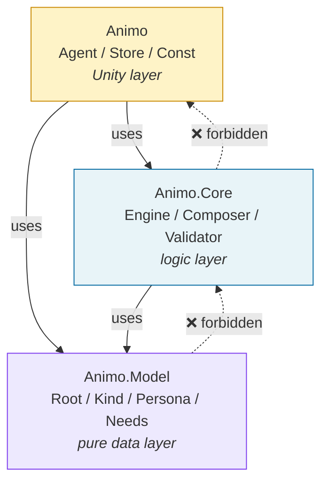

A higher layer may use a lower one. A lower layer **must not** know
of a higher one at all.
This is what lets `Animo.Core` be tested with no Unity at all.

---

## How one frame works (`Engine.Live(delta_time)`)

Every Animo agent runs the same five steps, each frame. The Lock
part (v0.1.4) lets an animation's own state freeze a decision,
with no freeze on the simulation itself.

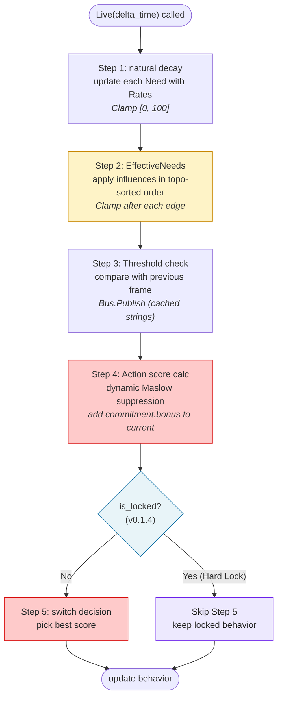

---

## Maslow, and holding a need back

The one part that makes Animo *Maslow*. A low-tier need
(survival) holds a high-tier one (rising to your own full self)
back — but only while it is, in fact, unmet.

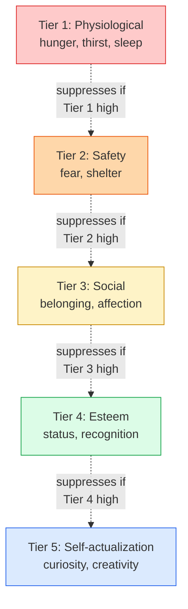

A hungry goblin, near starving, will not go out to explore. A
safe, well-fed goblin will. This comes straight out of the
formula — nowhere do you write "if hungry, then no exploring."

---

## Cascading: Kind × Persona

Much like CSS, Animo lets you set a type (`kinds`), then change it
per one, single agent (`personas`). The cascade is
**last-wins**, and copied deep, to keep clear of a shared-reference
bug.

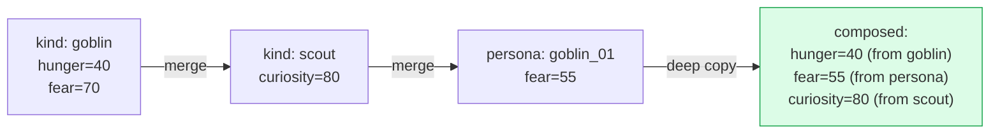

`kind_ids: ["goblin", "scout"]` means *be a goblin, but also a
scout*. The persona's own JSON lists only what is different.

---

## The JSON schema

Every `animo.json` is checked against
`Schemas/animo.schema.json` (JSON Schema **Draft-07**) before the
runtime Validator is ever run at all. The schema checks types,
structure, ranges, and patterns; the runtime Validator handles
meaning across fields, cycle checks, and template fill-in points
(see §13.6 of the spec).

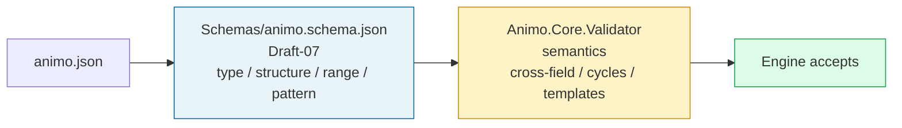

Three sample personas live under `examples/`:

| Sample | Style | Notes |
| --- | --- | --- |
| `goblin_scout.json` | a monster, like Zelda's own | more than one kind (`goblin` + `scout`), the standard 8 Needs, a threshold that holds steady between two points |
| `tanukichi.json` | an NPC, like Animal Crossing's own | a three-kind cascade (`villager` + `energetic`), a binding with no threshold at all |
| `shiori.json` | a heroine, like Tokimeki's own | its own Needs (`anger`, `longing`, `jealousy`), a three-kind cascade, two thresholds |

All three pass Green; a 25-case negative test proves the schema
turns down badly-formed input, as it should (including an empty
`thresholds[]`, a need out of range, a key not in snake_case, and
a field it does not know).

---

## The test harness: MiniUnity

`Animo.Core` and `Animo.Model` must be fit for a test in **plain
C# alone**, with no need to start Unity at all. The
`Animo.Tests.MiniUnity` harness gives Unity-shaped stand-ins
(`MockGameObject`, `MockMonoBehaviour`, `MockBus`, `MockTime`,
`MockScene`), so an EditMode-style test can drive
`Awake → Update → OnDestroy` straight, from a `dotnet test` runner.

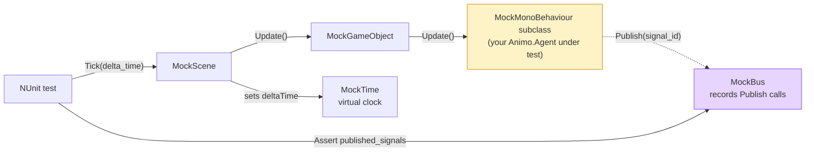

The harness ships with four tests of its own (the order things
happen in, `MockBus` keeping a record, `MockTime.Step` moving
forward, a check that a destroyed object is dropped) that **must
pass** before any test built on top of it can be trusted; with no
proof of these, Phase 2-3 would stand on a base that was never
checked, and still show red.

The asmdef states `"references": []` and
`"noEngineReferences": true`; the harness holds no line at all
that says `using UnityEngine`. Unity leaves the whole `Tests~/`
folder alone, so the harness lives only for the `dotnet` build.

---

## A red baseline (Phase 2-3)

Before any real logic is written, the test suite is built
**red-first**. Every choice laid out in the spec — every Validator
rule, every case in the Composer's own cascade, every step of
`Engine.Live`, every edge case in a number, an empty value, an
amount, or time — has a `[Test]` method that *will* pass once
Phase 3 builds the class it needs. Until then, every test is red,
and that is the whole point of it.

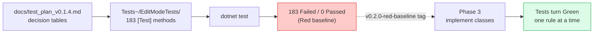

The count matches how the spec breaks it down (§13 Validator
rules, §10 Composer, §9 Engine, §4.6.3 the list of edge cases):

| Layer | Files | Tests |
| --- | --- | --- |
| Validator (A000-A032, with A020 split into a/b/c) | 35 | 92 |
| Composer (deep copy, cascade, fill-in, more than one kind) | 4 | 24 |
| Engine (5 steps, plus Maslow / Commitment / Lock / ForceReset) | 9 | 44 |
| Edge cases (a number, an empty or null value, an amount, time) | 4 | 23 |
| **Total** | **52** | **183** |

The 4 MiniUnity tests of its own are the only Green tests, at this
point. The runner's own output, taken together:

```text
Tests run: 187, Passed: 4, Failed: 183
```

That output, taken at this commit, is the **v0.2.0-red-baseline**
snapshot.

## v0.1.5 — settling every open question

Phase 2-4 closed every point left open in v0.1.4. The 17 open
points (Q1-Q17) — `Affect` with NaN, `Live` with a negative
`delta_time`, what `Lock` does when called twice, a promise on
threads, and more — all now have a final answer. Each choice is
kept in
[`docs/decisions/v0.1.5_ambiguity_resolution.md`](docs/decisions/v0.1.5_ambiguity_resolution.md),
the spec is put out again as `animo_spec_v0.1.5_EN.md` /
`animo_spec_v0.1.5_JP.md`, and the schema now takes
`schema_version: "1.5"`, while holding `commitment.bonus` to the
new range of `[0, 50]`.

The pattern that comes up again and again is **fail loud**: a NaN,
a null, an empty string, and a negative time all throw right at the
point they are called, rather than quietly corrupting state further
down the line. The one, real exception is **an infinite change on
`Affect`**, which clamps to the standing `[0, 100]` edge, since
that is where it would settle on its own anyway. The full table is
in §3 of the v0.1.5 spec.

A new debug reader, `Engine.GetNeed(string need)`, lets a test or
an inspector tool read a live Need's own value with no break of the
§16.1 rule against memory waste in the hot path, and one new
Validator rule, **A033**, warns on a doubled `kind_ids` (which the
Composer, on its own, quietly drops the extra copy of, **keeping
the last one it saw**, to hold to §8.3's own last-wins rule).
Three questions on the Lock pipeline (Q-S1/S2/S3), three on the
shape of the API (Q-S4/S5/S6), and three on start-up
(Q-S7/S8/S9) fixed the runtime's own promise in place:
`commitment.bonus` follows `locked_behavior` while locked; Step
3's own `Bus.Publish` keeps firing while locked; the lock's own
timer counts down at the very start of `Live(delta_time)`;
`ScenarioRunner.events` is an `IReadOnlyList<TimedAffectEvent>`
(never a Dictionary keyed by a float); `force_reset` uses an
OR-latch within one frame; a second `Store.Register` gives a
Warning and does nothing (the first one stands); A016 still warns,
but the Composer fills in a default `Binding`, so `Awake` can never
throw a null-reference error; `_previous_needs` starts from the
Needs at spawn, so no storm of threshold events fires on the very
first frame; and Step 5's own ties are broken by the order given in
`actions[]`. The red baseline grew from 183 to 234 tests; the
MiniUnity tests of its own stayed Green, at 4.

Then the spec went through three more rounds of hard review
(Gemini's 9th and 10th, Q-S10 through Q-S15), each round either
closing a real gap, or fixing something the round before had
broken. **Q-S10/S11/S12** dealt with clashes between rules that
only showed once the walls from Q-S1..Q-S9 were up: `force_reset`'s
own latch would vanish while locked (used up by Step 4, inside the
Lock's own window, before any Step 5, once unlocked, could ever
see it); `reset_threshold`'s own default of `trigger - 5.0` could
go below zero for a low trigger, trapping the Threshold in `Above`
forever (the Need's own `[0, 100]` clamp made the reset a point it
could never reach); and Q-S7's own defense against
`binding == null` never reached `binding.thresholds == null`,
which only moved the same start-time null-reference error down one
line. The fix: the latch only clears while `!is_locked`; the
Composer floors a left-out `reset_threshold` at 0, and a new
**A034** Error rule turns down a value below zero given by hand;
`Binding.thresholds` can never be null, and defaults to an empty
list, with a third layer of defense in the Composer and in Awake.

**Q-S13/S14/S15** cleaned up what was left over: Q-S10's own latch,
reaching across a Lock, held up fine under a real *survival* test,
but, given the Mermaid layout of Phase_2_4_6, it skipped the
commitment bonus every single locked frame — turning what should
have been "a break for one frame" into a weakness that lasted many
frames, through a long Lock. Q-S13 moves the `LockGate` to stand
before `Skip`, so that *both* the skip and the clearing of the
latch are held back while locked; only the very first frame after
unlocking uses up the latch, keeping §9.7.1's own promise of
"exactly one frame" true. Q-S14 fixed a real design limit: a
threshold was merged in §8.3 by `need` alone (last-wins), and Awake
kept them in a `Dictionary<string, string>` keyed by `need`, so two
thresholds on the same Need (the standard pattern of
`fear=50 → "alerted"` then `fear=80 → "panic"`) quietly folded into
just one. The merge's own key is now the pair
`(need, trigger_threshold)`, and the cache moved onto each
`Threshold` itself, as `internal string expanded_trigger`. Q-S15
closed a way around A023: a `trigger=0` with no
`reset_threshold` given slipped past A010, A023, and A034, landing
as `(0, 0)` after the Compose step, chattering right at the Need's
own lower edge; A010 is now strict at `(0.0, 100.0]`, and a new
**A035** runs as a *check after Compose* (§13.2, stage 2), stating
again that `trigger > reset` even after the Composer's own
fill-in.

**Q-S16/S17/S18** filled three gaps in the build that earlier
rounds had missed. **Q-S16**: §3.5's own table of standard-Need
tiers was the true, written word, but the Engine had no way to read
it at all — `Const.cs` held `STANDARD_NEEDS` and an index for each
Need, but no map from a Need's own name to its tier, so §9.3.4's
own formula,
`max_lower_tier_intensity = max(eff_needs[tier1 needs] / 100, ...)`,
had no real data to draw from. The fix: `Animo.Const` now gives out
`NEED_TIER_BY_NAME` and `NEED_INDICES_BY_TIER`; a Need outside the
standard set (an A019 Warning) is left out of holding-back, rather
than given a default tier; `frustration` counts as tier-2, even
where it is used only through `influences`. **Q-S17**: A025's own
cycle check ran only in stage 1, where it sees the raw `kinds[]`
and `persona.influences[]` apart from each other — a "ghost cycle,"
made only once the two are laid over each other
(a Kind's `fear→confidence` plus a Persona's `confidence→fear`),
slipped past it, reaching all the way to the Engine's own
topological sort. The fix: A025 now runs in BOTH stages — stage 1
gives an early warning, stage 2 checks against the merged graph of
influences as the true, final gate. **Q-S18**: Q6's own record of
its decision claimed "A011a covers the case after Compose too,"
but A011a fires only in stage 1; a Persona that leaves out
`actions` while pointing to a Kind whose own `actions[]` is empty
slipped past stage 1 (A011b lets the leaving-out through), and
Step 5's own tie-break (`actions.First(...)`, from Q-S9) would
throw, the very first time `Live(delta_time)` ran. The fix: a new
**A036**, a stage-2 Error, closes the real gap Q6 had only waved a
hand at.

**Q-S19/S20/S21** dealt with three deeper clashes in the build's
own design, once the checks after Compose were in place.
**Q-S19**: Q-S9's own "the order given wins" tie-break, and §8.3's
own "add the Kind's own list after" merge rule, did not hold
together — a Persona writing `actions: [Idle, Flee]` over a Kind
with `actions: [Flee, Eat]` came out composed as
`[Flee, Eat, Idle]`, quietly pushing out the LLM's own intended
default at index 0. §8.3's own rule for `actions` is now
**keep the Persona's own order first, then add any of the Kind's
own ids not already there**: the very same example now composes to
`[Idle, Flee, Eat]`, and Q-S9 finally gets the input it had always
assumed. **Q-S20**: §9.6.2's plain topological sort, together with
§9.6.3's own clamp part way through the cascade, let two edges
pointing at the same target, run apart from each other, give a
40-unit gap, depending only on which edge ran first — a real break
of §26.2's own promise that ScenarioRunner gives the same result
every time. The topo sort is now **held steady**, against the
order composed `influences[]` are given in; §8.3's own merge rule
for `influences` now matches the change made to `actions`
(Persona's own order first); the LLM has exactly one knob left (the
order given in the JSON's own `influences[]`) to break a tie with.
A new Validator rule, **A037**, a Warning, surfaces any case where
more than one edge points at the same target, so a writer knows the
order matters there. **Q-S21**: `MockScene.Tick()` had no check for
`obj.is_active` inside its own loop over each part, so a `Destroy`
set off by one part's own `Update` could let the loop go on to call
`Update` on a sibling already sent through `OnDestroy` — a real
break of how Unity's own lifecycle should work. One line,
`if (!obj.is_active) break;`, fixes it.

**Q-S22/S23/S24** caught three more clashes the spec, after Q-S21,
had, by accident, opened up. **Q-S22**: Q-S6's own rule of "keep
the first on a second Register" left a matching hole on the way
out — a second Agent B (turned down at Register time) would, on its
own `OnDestroy`, still call `Store.Unregister(this)`, and a plain
`_agents.Remove(agent_id)` would wipe out the real, first Agent
A's own registration by mistake. `Unregister` now needs
`ReferenceEquals(_agents[id], agent)` to be true before it removes
anything; a mismatch gives a Warning, and does nothing at all.
**Q-S23**: Step 3's own Threshold check set `_previous_needs`
against `_needs`, but the cascade of Influence (§9.6.5) writes only
to `_effective_needs` — a chain like §25.5.3's own
frustration-to-anger could push `eff_anger` past a Threshold with
no Bus signal fired at all, while the Action layer (already reading
`_effective_needs`) switched, correctly. Threshold now reads
`_previous_effective_needs` against `_effective_needs`; the array
starts life seeded by one pass of Step 2, run in the Engine's own
constructor (this widens Q-S8). **Q-S24**: Q-S20 had promised the
LLM's own `influences[]` order was the one key to a steady result,
but §9.6.2's own step 1 built its graph by *Need* (a source going
to a target) — a sort by Need's own order gives back an order for
*working through* each Need, which groups together any edge that
shares the same source, quietly breaking the array's own order
across different sources. Q-S24 remakes the graph in terms of
**edges**: each point in it is one `Influence`, and the rule for
order between two is `e1 ≺ e2` only when `e1.target == e2.source`.
A steady topological sort over these edges, with a tie broken by
the order composed, finally makes Q-S20's own promise real.
A025's own cycle check is unaffected by this — a cycle at the level
of an edge is the same as a cycle at the level of a Need.

**Q-S25/S26/S27** closed three more clashes, each between a promise
in the spec and the real contract underneath it. **Q-S25**: §12.3.2's
own two-state hysteresis (Below / Above) was drawn as a Mermaid
across two spec versions, but was never given a place to live in
`Data.cs` or `Engine.cs` — a plain check of `prev<trig && curr>=trig`
chatters right around `trigger`, and leaves `reset_threshold` as dead
code, opening back up the very chattering bug §12.3.1 was written to
close. `Threshold` now has `internal bool is_above`, filled in by
Step 3 as the Mermaid in §12.3.2 shows; the Engine's own constructor
seeds `is_above` from the Needs at spawn (this widens Q-S8 and
Q-S23). **Q-S26**: §12.1 said "the Engine holds no Bus reference at
all," while §16.5's own sample called `_bus.Publish(...)` *right
inside* the Engine — a plain clash that lived through more than one
round already. The Engine now shows a
`public event Action<string>? OnSignal`; Step 3 (a Threshold firing)
and Steps 4/5 (a change in behavior) raise it; `Agent` listens for it
in Awake, and sends each one on to `Bus.Publish(signal_id)`. The
Engine stays plain C#; `Agent` stays the only layer that knows of the
Bus; the wire between them is stated in plain sight. **Q-S27**: Q-S16
gave out `Const.NEED_INDEX_FEAR=2` and `NEED_INDICES_BY_TIER[2]` as
though these were fixed places inside `_effective_needs`, but
§16.2.2 showed the Engine giving out an index by a Persona's own
order of Needs — the two never had a real tie between them. A
"peaceful villager" Persona leaving out `fear` would read
`confidence` at index 2 by mistake (a wrong Need read, inside the
tier-2 Maslow check), or throw an out-of-range error at index 7. The
Engine's own constructor now sets aside slots `0..7` for the eight
standard Needs, in every Engine, no matter what a Persona states;
any Need outside the standard set is added from index 8 on. The
96-byte cost, per Engine, is nothing at all at a scale of thousands
of agents, and Q-S16's own fixed map is, at last, safe to use with
no bounds check needed.

**Q-S28/S29/S30/S31/S32/S33** is the largest single round from
Gemini so far — six points, each one a real hit, each one caught
right at the seam between a promise made and the real world.
**Q-S28**: a spawned copy with a fixed `agent_id`, given straight
from JSON, along with Q-S6's own defense of keeping the first,
turned 99 of 100 spawned goblins into zombies, cut off from the
Bus. The JSON's own `agent_id` is now a TEMPLATE id;
`Agent.Awake` sets its own, real one, as
`$"{template_id}_{GetInstanceID()}"`, BEFORE `Store.Register` is
ever called. **Q-S29**: before this fix, every single spawned Agent
read the same JSON again, ran A000-A037 again (cycle check in both
stages, and all), and ran `Composer.DeepCopy` again — an N-times
cost, for the very same content. A new `Animo.PersonaCache`, of the
Flyweight kind: the Validator runs once, on the Root; the Composer
runs once, per template id; each Agent then draws its own composed
Persona, and copies it deep on its own. A bootstrap pattern
(`[DefaultExecutionOrder(-1000)] MonoBehaviour`) makes sure
`PersonaCache.Initialize` runs before any Agent's own Awake.
**Q-S30**: Q-S16's own choice to leave a Need outside the standard
set out of Maslow's own check clashed straight with §20.4's own
promise that "Animo knows no one game genre" — a survival game
naming `oxygen` as tier-1 could never hold back a higher-tier act
(an NPC could suffocate while still out exploring). A new, open
field, `needs_meta: { "oxygen": { "tier": 1 } }`, lets a writer
give a tier, per Persona, to a Need outside the standard set; the
Engine's own constructor builds a `_need_tier_indices` map, per
Persona, that widens the fixed one. A new rule, **A038** (38 rules
in all), checks that a given tier is real. **Q-S31**: 100 NPCs,
spawned into one scene, sent out 100 signals of
`animo_*_idle` to the Bus, all at once, on the very first frame — a
storm, right at start. `OnBehaviorChanged(previous, new)` now
returns with no act at all, given `previous == ""` (true only the
very first time, ever, that Step 5 runs for that Engine).
**Q-S32**: §26.3 stated that `TraceFrame.action_scores` was a
`Dictionary<string, float>`, but the Engine had no way at all to
fill it in — `ScenarioRunner` had, in a real sense, no eyes of its
own. The Engine gains four `internal` readers
(`GetEffectiveNeed`, `GetActionScore`, `GetAllNeedNames`,
`GetAllActionIds`), open only to `Animo.Tools`, through
`InternalsVisibleTo("Animo.Tools")`, stated in a new
`Scripts/AssemblyInfo.cs`. **Q-S33**: §26.3.1's own loop, running
while `current_time < duration`, quietly dropped an event set for
the exact moment `time == duration` — the loop ended before that
last turn could ever pick it up. The outer check becomes
`current_time <= duration + EPSILON`, the inner one
`>= time - EPSILON`, with `EPSILON = 1e-4f`. A worked example, with
each turn traced in order, is set in place at §26.3.1a.

Across Gemini's reviews 5 through 15, the score, taken as a whole,
stands at **33 hits, 33 taken up, and zero made-up facts** (every
claim checked, by search, against the spec or the real code, before
any change was made). Sixteen of those 33 hits, in fact, uncovered a
bug from an earlier Phase_2_4_x round of its own — six more, from
Phase_2_4_12 alone. Phase_2_4_12 is also the first phase to hold to
the owner's own, stricter rule: **three rounds of checking for
clashes with itself**, run AFTER the first Q-S fixes, each round
catching a clash born, in turn, from the fix made in the round
before. Round 1 caught 5 clashes (A002's own reach, §3.5.2's Engine
constructor missing, a note on Step 5's own Mermaid for Q-S31,
AssemblyInfo.cs missing, the Japanese §26.3.1 out of step). Round 2
caught 4 (a row for the `_need_tier_indices` table, where
PersonaCache calls stage 2, §8.3's own merge for needs_meta, and
more). Round 3 caught 5 (the method's own declared shape for
`Validator.ValidateStage2`, the `ValidationResult.Merge` API, the
Engine's own `_previous_behavior` field, and the call site for
`PersonaCache.Initialize`). All 14 clashes, found across rounds, are
fixed right in place; this three-round rule is now set down in the
record of choices made. The red baseline grows from 265 to
**270 tests**, through Phase_2_4_12 (4 new EditMode tests, for
Q-S29, Q-S31, Q-S32, and Q-S33).

**Q-S34/S35/S36/S37/S38/S39** is the second six-hit round, each one
caught right at the seam between rules Phase_2_4_12 had only just put
in, and what real use ran into. **Q-S34**: Q-S31's own rule of
silence, on the very first change, held back a storm on the Bus, but
it also held back the very real signal the host's own Animator, or
View, needed, to play the act given at spawn — a character stood in
a T-pose, until the second change in behavior. `Agent.Awake` now
calls `_engine.Live(delta_time: 0.0f)` to seed that first decision,
and sends `_engine.behavior` straight to the host's own Animator,
with no Bus at all in the way. **Q-S35**: Q-S33's own
`<= duration + EPSILON` ran one extra `Live(delta_time)` step past
`duration`, whenever `duration` fell as a clean, whole multiple of
`delta_time` — a plain, classic off-by-one. Its final form: the
outer check is `current_time < duration` (strict, with no EPSILON),
the inner one is `events[next].time < current_time + delta_time`
(the window of the coming frame), plus one more sweep, after the
loop, for any event right on the boundary. The count of `Live`
calls, in total, is exactly `floor(duration / delta_time)`.
**Q-S36**: Q-S30's own `needs_meta` was the true, written word, but
the property `needs_meta`, on both `Persona` and `Kind`, was never,
in fact, put into `Scripts/Data.cs`, and the class `NeedMeta` was
never declared at all — the Engine's own constructor, reading
`_persona.needs_meta`, would have failed to build at all.
`Scripts/Data.cs` now declares `NeedMeta { int tier }`, plus the
property `needs_meta`, on both `Persona` and `Kind`. **Q-S37**:
Q-S29's own PersonaCache made it unsafe for the Composer to bake in
a `need_index` — a shared template's own baked-in index could leak
into an Engine whose own, standard slot layout (from Q-S27) put
that Need at a different place. `Action.need_index` and
`Threshold.need_index` are now worked out **in the Engine's own
constructor (right after DeepCopy)**, never in the Composer. The
Engine's own constructor now runs in a fixed order, across five
stages (A: build the index map, then set aside the array → A.2:
give a slot to a Need known only through needs_meta → B: bake in
each need_index → C: build `_need_tier_indices` → D: seed each
Threshold), as §3.5.2 states. **Q-S38**: Q-S29's own
`PersonaCache.GetComposed` kept a record of a stage-2 error, but
still gave back the broken Persona, letting `new Engine(...)` go
ahead, and crash the scene, on the very first `Live(delta_time)`,
through Q-S9's own `actions.First(...)` run on an empty list.
`GetComposed` now THROWS an `InvalidOperationException`, on a
stage-2 error; `Agent.Awake` catches this, and turns that one Agent
off, with no harm at all to the rest of the scene. **Q-S39**:
Q-S30's own claim, that `needs_meta` holds back A019, was, in a real
sense, false — A019 was a Stage 1 rule, checking a Kind and a
Persona apart from each other, on the raw JSON, never once seeing
the merged `needs_meta` at all. A019 is now a Stage 2 rule, run on
the composed Persona; the merged `needs_meta` now, in fact, holds
back a false alarm from A019, as was always meant.

Phase_2_4_13 once again held to the **rule of checking, round after
round, for a clash with itself**, first brought in at Phase_2_4_12,
and the owner's own, stricter word made it plain: "**keep going,
forever, until no clash with yourself is left**." Round 1 caught 4
clashes (§26.3.1's own spec still carried the long, drawn-out
thinking from Q-S33 through Q-S35; §13.2's own Mermaid still put
A019 inside Stage 1's own block, `A013-A019`; `Agent.Awake` had no
try/catch at all, around the throw added in Q-S38; the English
header's own row for Q-S33 said nothing of Q-S35 taking its place).
Round 2 caught 4 (§13.2's own "why the split" had no line at all on
A019's own move to Stage 2; §11.4's own Mermaid, for the sequence
of turns, had no step at all for Q-S34's own
`Live(0.0f)`; §3.5.2's own code for the Engine's constructor never
wrote down the order of its own stages, above all the one that gives
a slot to a Need known only through needs_meta, where Q-S30 and
Q-S37 cross paths; and the same, kept in step, on the Japanese
side). Round 3 caught zero clashes, in the English text — the rule
had, at last, reached a point where nothing more was found. Across
these rounds, how `_need_index` and `needs_meta` work together grew
into the plain, five-stage order for the Engine's own constructor
(A→A.2→B→C→D), set down in §3.5.2, with a note on what breaks, at
each stage, should the order ever change. This point, where a round
finds nothing new at all, is the real, built form of "never again
caught out by Gemini."

Across Gemini's reviews 5 through 16, the score, as a whole, stands
at **39 hits, 39 taken up, and zero made-up facts** (every claim
checked, by search, before any change at all). Eighteen of those 39
hits, in fact, uncovered a bug from an earlier Phase_2_4_x round —
six more, from Phase_2_4_13 alone, each one a straight result of a
fix, from Phase_2_4_11 or Phase_2_4_12, that had not yet reached a
point free of clashes with itself. The red baseline grows from 271
to **277 tests**, through Phase_2_4_13 (6 new EditMode tests, for
Q-S34 through Q-S39).

**Q-S40/S41/S42/S43/S44/S45** is the third six-hit round — once
again, every fix comes straight from a Phase_2_4_x round before it,
that had not yet reached a point free of clashes with itself.
**Q-S40**: Q-S35's own sweep, after the loop, took in an event set
for the exact moment `time == duration`, through `engine.Affect`,
correctly, but ran no `Live(delta_time)` at all, right after — so
that Affect's own effect on a Need stayed unseen, inside
`TraceResult.frames`, a real, blind spot between the Engine's own
state and what the trace could show. ScenarioRunner now runs one,
last `engine.Live(delta_time: 0.0f)`, plus a
`RecordTraceFrame(time: duration)`, once the sweep has, in fact,
taken in at least one event. The total count of Live calls that
move time forward stays, still, exactly
`floor(duration / delta_time)`. **Q-S41**: A038's own check, for a
`needs_meta` entry naming a Need not stated in `needs`, ran in
Stage 1, against a raw Kind — so a general survival Kind, stating
`needs_meta { oxygen, thirst }`, would flood a child Persona, using
only one of the two, with a Warning it never earned (the cascade
brought in metadata that was never, in fact, used). A038's own
check for an orphan now moves to Stage 2 (where it can see the
composed Persona), AND grows wider: a Need is "in use" if it shows
up in the composed `needs[]`, *or* in `actions[].need`, *or* in
`influences[].source/target`. A tier out of its own range stays a
Stage 1 Error. **Q-S42**: §11.4.1 said "ScenarioRunner sets its own
id aside for a single-Persona test," fixing the runner to just one
agent — two calls to `Run()`, from the very same template, would
clash on `Store.Register`, per Q-S6.
`ScenarioRunner.Run()` now sets its own, unique id, every time,
with no condition at all, defaulting to
`$"{template_id}_run_{seq++}"`. A new, open argument,
`agent_id_override: string?`, is added. A future test, with more
than one agent (two goblins, say, fighting from the very same
template), now works, with no clash at all. **Q-S43**: Q-S14's own
compound key, `(need, trigger_threshold)`, compared its own float
part with a plain `==`, so a Persona changing a Kind's own
`trigger_threshold: 80.0` to `80.0001` (or any drift left over from
a round trip through IEEE-754) made two thresholds, close but not
quite the same, both fire. The merge now uses
`Math.Abs(a - b) < THRESHOLD_KEY_EPSILON` (set at `0.5f`) — wider
than any real drift a JSON round trip could give, narrower than the
gap a writer would ever leave between real milestones (5 or more,
by A035 and Q-S15). **Q-S44**: Q-S34's own step, in `Agent.Awake`
(step 6), sent `_engine.behavior` (the plain Action id) straight to
`_animator.Play`, while every later frame goes, instead, through
`binding.on_action_change`'s own fill-in of a template, sent over
the Bus — the host saw two, different sets of state names all at
once (frame 1 gave `"Flee"`; frame 2 on gave
`"animo_goblin_47291_flee"`). Q-S44 sends that first push, too,
through `_engine.GetExpandedActionTrigger(_engine.behavior)` (a new,
internal reader), so the host sees one, single, filled-in payload,
throughout. Q-S31's own rule of silence stays true (the Bus still
plays no part, on frame 1). **Q-S45**: §3.5.2's own PHASE C wrote
`if (is_standard) continue;`, a blanket skip of every standard Need,
inside the loop over `needs_meta` — this shut the door, for good,
on any future field on `NeedMeta` (a rate of decay, a label, and so
on) ever reaching one of the eight standard Needs, a straight clash
with Q-S36's own promise that "a future field can be added with no
break to anyone calling it." The skip now narrows to **the tier
alone** (since §3.5 already wins, for a tier, per Q-S30); every
other field on NeedMeta now flows through
`ApplyNonTierMetadata`, for a standard Need too. v0.1.5 has no
other field yet, so nothing changes at runtime; the path stays open,
for v0.2 or v0.3 to widen it.

Phase_2_4_14 once again held to the rule of **round after round,
until no clash with yourself is left** (started at Phase_2_4_12,
made plain in the owner's own words). Round 1 caught 4 clashes in
English (§13.2's own Mermaid had no new node, for Stage 2's own P9f,
for A038; §13.2.1's own docstring for ValidateStage2 named neither
A019 nor A038; §11.6's own note on PersonaCache's stage 2 said
nothing of Q-S39 or Q-S41; §8.3's own spec for Q-S43's EPSILON had
no worked-out block of pseudocode). Round 2 caught 2 more, that
crossed several parts (§11.4's own Mermaid, for the sequence of
turns, had no step for Q-S44's own GetExpandedActionTrigger;
§16.5's own Engine code had no body for that reader at all).
Rounds 3-4 kept the Japanese text in step, for the same six fixes
(Q-S40's own §26.3.1 trace; Q-S41's own §13.1 and §3.5.2;
Q-S42's own §26.3, for the shape of Run(), and §11.4.1's own prose;
Q-S43's own §8.3.1; Q-S44's own §11.4 Mermaid, its own §11.4.1
Awake, and its own §16.5 reader; Q-S45's own §3.5.2 PHASE C). Round
5 caught one more (the Japanese §11.4.1 still said the runner "sets
its own id aside" in prose, though Q-S42 had, by then, made this
true with no condition at all). Round 6 reached **the point where
nothing more was found**: zero new clashes, checked across both
English and Japanese, by search. This point — a round that finds
nothing new — is the real, built form of "never again caught out by
Gemini."

Across Gemini's reviews 5 through 17, the score, as a whole, stands
at **45 hits, 45 taken up, and zero made-up facts** (every claim
checked, by search, before any change). Twenty-five of those 45
hits uncovered a bug from an earlier Phase_2_4_x round — six more,
from Phase_2_4_14 alone, each one a straight result of a fix, from
Phase_2_4_11, 12, or 13, that had not yet reached a point free of
clashes with itself. The red baseline grows from 277 to
**284 tests**, through Phase_2_4_14 (7 new EditMode tests — two for
A038's own Stage 2, one each for the rest).

**Q-S46/S47/S48/S49/S50/S51** is the fourth six-hit round —
Gemini's own seventeenth-round fixes (Q-S40-S45) turned out, on
their own, to hold clashes of scope and a slip in the math, every
one of which Phase_2_4_15 now closes. **Q-S46**: Q-S44's own reader,
`Engine.GetExpandedActionTrigger`, was stated to read
`_cached_action_triggers`, but §16.6 had, in writing, put that
Dictionary on `Agent` (a MonoBehaviour) instead — an Engine can
never reach into a field of Agent's own at all, so the method's own
body could never have built. Q-S46 sets the table's own row to
`Engine`, matching §16.5's own real code, which always built and
read that cache from right inside the Engine's own constructor.
**Q-S47**: Q-S43's own `THRESHOLD_KEY_EPSILON = 0.5f` was backed by
the claim that "a writer's own gap between milestones is always
5 or more, by A035 / Q-S15" — a mismatch of kind: A035's own gap of
5 sits between a `trigger` and a `reset`, on the SAME Threshold
(the hysteresis window), NOT between two, separate Thresholds, with
different triggers, on the same Need. A pair written close
together, like `fear=80.0 → alert` and `fear=80.4 → panic`, would
have folded into one, under Q-S43's own, far-too-wide window. Q-S47
sets `EPSILON = 0.01f` instead (three whole orders of size above any
real IEEE-754 drift; it still keeps a writer's own, real difference,
down to a hundredth of a unit), and adds a new Stage-2 Warning,
**A039**, to surface a pair sitting within `1.0f` of each other. The
count of Validator rules grows to 40 (A000-A039). **Q-S48**: Q-S45's
own §3.5.2 PHASE C, with its narrow skip, called
`ApplyNonTierMetadata(_need_index[meta.Key], meta.Value);`, but no
such method was ever declared, at all, in `Scripts/Engine.cs` — a
build error, confirmed. Q-S48 adds the declaration,
`private void ApplyNonTierMetadata(int need_index, NeedMeta meta)`,
as a stand-in with no real act, for v0.1.5; v0.2 or v0.3's own
widening of NeedMeta will fill it in. Q-S45's own path can now, in
fact, be built. **Q-S49**: Q-S41's own, widened "in use" check, for
A038's orphan rule, named `needs[]`, `actions[].need`, and
`influences[].source/target` — but left out
`binding.thresholds[].need`. A Need used only as a signal, through a
Threshold (say, `oxygen`, running low, raising a UI alert, and never
once showing in an action or an influence), was wrongly marked as an
orphan. Q-S49 adds this fourth site to the "in use" check: the true
union is now `needs[]` ∪ `actions[].need` ∪
`influences[].source/target` ∪ `binding.thresholds[].need`.
**Q-S50**: Q-S42 backed its own, unconditional override, on
`ScenarioRunner`, with the claim that "a future run, with more than
one agent, would clash on `Store.Register`, per Q-S6" — but
`Store.Register(IAnimoAgent agent)` needs a real `IAnimoAgent`, which
`ScenarioRunner` never gives at all (it builds an Engine straight,
with no MonoBehaviour wrapped around it). Q-S50 sets this right:
`ScenarioRunner` does NOT touch `Store` at all. The runner keeps its
own, inner `Dictionary<string, Engine>`, to send Affect or Lock to
the right place; `Store` stays the registry, only for a real, live
Agent, in Unity. Q-S42's own override, on the runner, serves a
different end (a unique key, inside the runner, plus an id for each
run's own trace). **Q-S51**: Q-S34's own
`Live(delta_time: 0.0f)`, plus a push to the Animator, gave a real
Unity Agent its own state, at the moment of spawn (t=0);
ScenarioRunner had nothing to match it — its own, first
`RecordTraceFrame` fell at `time = delta_time`, leaving the very
moment of spawn (the Needs it started with, the first behavior
picked by Q-S9's own tie-break) unseen, inside
`TraceResult.frames`. Q-S51 adds a step, before the loop:
`engine.Live(delta_time: 0.0f); RecordTraceFrame(time: 0.0f);`, so
the runner keeps a record of the spawn frame too, right alongside
Awake's own path from Q-S34.

Phase_2_4_15 once again held to **round after round, until no clash
with yourself is left**. Round 1 caught 5 clashes in English:
§13.2.1's own docstring for ValidateStage2 named neither A039 nor
the four sites named by Q-S49; §11.6's own note on PersonaCache's
stage 2 named neither Q-S47 nor Q-S49; §3.5.2's own PHASE C, at the
call site for ApplyNonTierMetadata, gave no pointer at all to where
it was declared; the README's own count of rules still read
"39 Rules"; the README's own Mermaid for the Validator gave no A039
at all, in stage 2. Rounds 2-3 checked that English and Japanese
were kept in step (Q-S46's own Engine, holding the cache; Q-S47's
own EPSILON, at 0.01f; Q-S48's own declaration of
ApplyNonTierMetadata, in the Japanese §16.5; Q-S49's own bullet on
thresholds, in the Japanese §3.5.2 and §13.1; Q-S50's own point that
ScenarioRunner and Store stand apart, in the Japanese §11.4.1;
Q-S51's own spawn state, in the Japanese §26.3.1). Round 4 reached
**the point where nothing more was found**: zero new clashes,
checked across both English and Japanese, by search. This point —
a round that finds nothing new — is the real, built form of "never
again caught out by Gemini."

Across Gemini's reviews 5 through 18, the score, as a whole, stands
at **51 hits, 51 taken up, and zero made-up facts** (every claim
checked, by search, before any change). Thirty-one of those 51 hits
uncovered a bug from an earlier Phase_2_4_x round — six more, from
Phase_2_4_15 alone, each one a straight result of a fix, from
Phase_2_4_14 (Q-S40-S45), that had not yet reached a point free of
clashes with itself. The red baseline grows from 284 to
**292 tests**, through Phase_2_4_15 (8 new EditMode tests — Q-S47
ships two cases; Q-S48's own build-only test turns Green right away,
once Engine.cs ships the declaration; one each for the rest).

**Q-S52/S53/S54/S55/S56/S57/S58/S59/S60/S61/S62/S63** is
Phase_2_4_16's own twelve-hit round — the largest yet, from Gemini.
Fixes made in Phase_2_4_14 and 15 (Q-S40-S51) turned out, on their
own, to hold a break of scope, a sleight in how a claim was backed,
and a real gap in the build, all caught, this round, with real,
searched proof. Nine of the attacks land on the core spec's own
layers (Q-S52, Q-S53, Q-S54, Q-S55, Q-S56, Q-S57, Q-S58, Q-S60,
Q-S63); three make the design stronger, by way of a warning or a
reason stated in writing (Q-S59, on more than one player at once;
Q-S61, on adding-only through what is passed down; Q-S62, on why
Step 4 still runs, under a Hard Lock).

**Q-S52** (a wasteful pattern, in the hot path): Q-S9's own
tie-break was written, in the spec's own words, using a shorthand
from LINQ, `actions.First(a => a.score == max_score)` — every call
sets aside memory, for an `IEnumerator` and its own closure, giving
6,000 such costs a second, at 100 agents and 60 frames a second,
from one line of the spec alone. §16.1 forbids LINQ at all, inside
`Live(delta_time)`; Step 5's own tie-break is set, instead, to one
pass through a plain for-loop, with a strict `>` check (which, on
its own, keeps to "the first one given, wins"). Every place the
spec's own words pointed to `actions.First(...)` is rewritten, away
from it. **Q-S53** (where the cache lives): Q-S46 set
`_cached_action_triggers` on the Engine, but §16.5's own loop, to
seed each Threshold's own `expanded_trigger`, still ran inside
`Agent.Awake` — an Engine, driven by ScenarioRunner, never runs
Awake at all, so every Threshold's own `expanded_trigger` stayed as
`""`, and every signal fired came out empty. Both string-cache
loops now live inside the Engine's own constructor. **Q-S54** (what
GetNeed really means): the new, debug-only reader was set down as
giving "the current value," with no word on base against effective
— but Q-S23's own split, between the two, was meant to show a
difference, not hide it. `GetNeed` now gives back the **effective**
value (the one Step 4 reads); a new `GetBaseNeed` gives the
unaltered reading, for an inspector tool. **Q-S55** (a sweep at
t=0): Q-S51's own record, before the loop, at spawn, never first
took in any `TimedAffectEvent` set for the exact moment
`time = 0.0f` — so a test like
`events = [{ time: 0.0, ev: Affect("fear", +50) }]` recorded that
spawn frame with `fear` still sitting at its own, starting value.
The runner now sweeps in every `events[next].time <= 0.0f`
BEFORE the spawn's own `Live(0.0f)`, and the record it makes.
**Q-S56** (how far ApplyNonTierMetadata reaches): Q-S45 put the
call inside the loop,
`if (_persona.needs_meta != null) { foreach (var meta in _persona.needs_meta) }`
— a Persona with no `needs_meta` at all ran zero calls to
`ApplyNonTierMetadata`, defeating the whole point of "a future
field reaches EVERY Need." The pass now stands apart: every Need in
the composed `needs[]` is given a call to
`ApplyNonTierMetadata(idx, explicit_or_default_meta)`, with
`NeedMeta.DefaultFor(name)` giving a default, per Need. **Q-S57**
(A038's own orphan check, and rates): Q-S41 and Q-S49, together,
widened the "in use" union to four sites, but left out `rates`. A
Need that decays only through `rates` (say, `poison`, read only by
a UI, with no Action, Influence, or Threshold at all touching it)
was wrongly marked as an orphan. A fifth site, `rates.keys()`,
closes this gap. **Q-S58** (the Bootstrapper, and Store):
`AnimoBootstrapper.OnDestroy` cleared `PersonaCache`, but not
`Store` — under the Unity Editor's own "Enter Play Mode (Fast)"
setting, a stale Agent's own reference would pile up, corrupting
how the Bus routed its signals. `Store.ResetForTesting()` is now
paired, always, with `PersonaCache.ClearForTesting()`. **Q-S59** (a
warning, for more than one player): Q-S28's own formula,
`$"{template_id}_{GetInstanceID()}"`, holds, correctly, within one,
single Unity session, but gives no fixed, repeatable id across a
network — a networked game needs some other, fixed source for its
own id, instead. **Q-S60** (what the runner keeps, inside): Q-S50
gave more than was needed, calling the runner's own store a
`Dictionary<string, Engine>`, though v0.1.5's own
`Run(string agent_id, ...)` API only ever takes one, single template
id — that Dictionary would, in truth, hold only ever one entry. This
is set, instead, at a single `Engine _engine`, until v0.2 brings a
`Run()` that can take more than one agent. **Q-S61** (only ever
adding): Q-S19's own rule, "the Persona's own order comes first,"
was, on purpose, made to only ever add — a child Persona, drawn from
a Kind, can never remove an Action, merely by leaving it out. The
spec now states this in plain words (leaving one out, meant as a
real removal, risks a child quietly losing a fallback it truly
needs, such as `Idle`). **Q-S62** (why Step 4 still runs, under a
Hard Lock): Step 4 (the score) still runs, even under a Hard Lock,
where Step 5 (the switch) is skipped, for three reasons, now set
down in writing: (a) `commitment.bonus` keeps a real thread, into
the frame right after unlocking; (b) a locked frame stays visible,
inside a trace; (c) the five-step build keeps its own, fixed
promise, every single time. **Q-S63** (dead code, removed):
`Needs.Clamp() => throw new NotImplementedException()` had sat, dead,
since v0.1.2's own move to a flat `float[]`, only ever a trap for a
tool-writer who found it, and called it by mistake. Removed from
`Scripts/Data.cs`, and from §6.1's own class diagram.

Phase_2_4_16 once again held to **round after round, until no clash
with yourself is left**. Round 1 caught 7 clashes (the README's own
rule count, and its own V2 Mermaid, both out of date; §13.2.1's own
docstring for ValidateStage2 missing rates; §11.6's own note on
PersonaCache's stage 2, missing Q-S57; §3.5.2's own PHASE C, missing
a pointer to where ApplyNonTierMetadata was declared; §3.1's own
table, at the row for Q-S38, still citing `actions.First(...)` with
no note at all on Q-S52's own change; §3.1's own prose, for that
same paragraph, holding the same gap; §13.2's own prose, for A036,
holding a stale reference to `actions.First(...)`). Rounds 2-3
checked that English and Japanese were kept in step, and confirmed
that every remaining mention of `actions.First(...)` is properly set
apart, as a citation of the old, pre-Q-S52 wording, kept only as a
record. Round 4 reached **the point where nothing more was found**:
zero new clashes, checked across both English and Japanese, by
search. This point — a round that finds nothing new — is the real,
built form of "never again caught out by Gemini."

Across Gemini's reviews 5 through 19, the score, as a whole, stands
at **63 hits, 63 taken up, and zero made-up facts** (every claim
checked, by search, before any change). Thirty-six of those 63 hits
uncovered a bug from an earlier Phase_2_4_x round — twelve more,
from Phase_2_4_16 alone, each a straight result of a fix, from
Phase_2_4_14 or 15, that had not yet reached a point free of
clashes with itself. Three of the twelve make the design stronger,
by way of a warning or a stated reason; nine are a real fix, to the
spec or the code. The red baseline grows from 292 to
**305 tests**, through Phase_2_4_16 (13 new EditMode tests — Q-S54
ships two cases; Q-S63's own build-only test turns Green right
away, once Data.cs ships the deletion; one each for the rest).

**Q-S64/S65/S66/S67/S68/S69/S70** is Phase_2_4_17's own seven-hit
round — **the compiler's own attack**. After Phase_2_4_16 closed
every clash of logic to a point of rest, Gemini's twentieth review
found "not even 12" left, on logic, but turned, instead, to
**the real, physical shape of C# itself**: 7 confirmed build errors,
inside the spec's own, hand-written sample code. Each one a
misspelling, or a missing declaration, that would stop any Phase 3
builder, right at the C# compiler, before a single test could ever
run. Logic, it turns out, does not age; syntax does.

**Q-S64** (`Persona.DeepCopy()`, never declared): §11.4.1's own
Awake step (2) called `template.DeepCopy()`, but `Persona`
declared no such method at all, anywhere in `Scripts/Data.cs`.
PersonaCache gives back one, shared, composed template; with no
DeepCopy, two Agents, drawn from the same template id, would share
one `Needs`, one `actions[]`, and one
`binding.thresholds[].expanded_trigger` — one Agent's own id
override, from Q-S28, would corrupt every sibling drawn from it.
Q-S64 declares `public Persona DeepCopy()` (a stand-in, throwing
NotImplementedException), and adds it to §6.1's own class diagram.
**Q-S65** (`Needs` is not a Dictionary): §3.5.2's own PHASE A wrote
`_persona.needs ?? new Dictionary<string, float>()` — but
`_persona.needs` is a `Needs` class, wrapped around a
`Dictionary<string, float> values`; the `??` here gave a confirmed
mismatch of type. Both PHASE A loops are set right, to
`_persona.needs?.values ?? new Dictionary<string, float>()`.
**Q-S66** (Q-S56 undid its own fix): Q-S56's own rewrite of PHASE C's
"Step 3" wrote
`for (int idx = 0; idx < _composed_persona.needs.Count; idx++) { string need_name = _composed_persona.needs[idx]; }`
— but the `Needs` class has no `.Count` at all, and no way to read
by a whole-number index. A build error, brought in by Q-S56's own
rewrite. Q-S66 fixes it by working straight through `_need_index`
(the one, true map of "every Need this Engine knows," already built
in PHASE A). **Q-S67** (`AffectEvent`, never declared): §26.3
declared `TimedAffectEvent { public AffectEvent ev { get; } }`, but
the type `AffectEvent` itself was never declared, anywhere at all,
in the spec — a confirmed, missing-type build error. Q-S67 adds
`public readonly struct AffectEvent { string need; float delta; bool force_reset; }`
to §26.3. **Q-S68** (`Agent : MonoBehaviour, IAnimoAgent`): Awake's
own `Store.Instance.Register(agent: this)` needs an `IAnimoAgent`,
but the spec's own words said only "Animo.Agent : MonoBehaviour,"
with no name at all for the interface — a confirmed build error,
from a type that cannot be turned into what is needed. Q-S68 makes
the declaration plain:
`public sealed class Agent : MonoBehaviour, IAnimoAgent`, with
`public string agent_id => _composed_persona.agent_id` meeting the
promise it makes. **Q-S69** (`_need_tier_indices`'s own type, at
odds with itself): §16.6's own table of Engine fields declared
`Dictionary<int, int[]>` (the hot path, from §16.1, needs a plain
`int[]`, with no memory waste, while reading the cache, at Step 4),
but PHASE C's own constructor code wrote
`_need_tier_indices = new Dictionary<int, List<int>>()`, and called
`.Add()` on it. Q-S69 keeps `int[]` as the field's own type, and
uses a local `Dictionary<int, List<int>>`, as scratch space, while
the constructor runs; a last pass, at the end of PHASE C, turns each
List into a `new int[]`. One cost, per tier, only at the time the
constructor runs; the hot path itself reads straight through an
`int[]`. **Q-S70** (`_lock_remaining`, never declared): §9.2's own
pseudocode, for the T0 timer stage, and §24.3's own words, both
point to `_lock_remaining`, but that field had no row at all, in
§16.6's own table of Engine fields, and no declaration at all in
`Engine.cs` — a confirmed build error, for any Phase 3 build of T0,
Lock, or Unlock. Q-S70 adds `float _lock_remaining = 0.0f;` to
Engine.cs, plus a row, in §16.6's own table.

Phase_2_4_17 held to **round after round, until no clash with
yourself is left**. Round 1 caught 2 clashes (§16.6's own row for
`_need_tier_indices` needed a note, on Q-S69's own last pass, in
both English and Japanese; the README held no section at all for
Q-S64 through Q-S70). Rounds 2-3 checked English and Japanese were
kept in step, with zero clashes found. Round 4 reached
**the point where nothing more was found**. Every mention left, of
`actions.First(...)`,
`_persona.needs ?? new Dictionary`,
`_composed_persona.needs.Count`, and
`_need_tier_indices = new Dictionary<int, List<int>>()`, still in the
spec, is properly set apart, as a citation of the old wording, from
before Q-S52, Q-S65, Q-S66, and Q-S69.

Across Gemini's reviews 5 through 20, the score, as a whole, stands
at **70 hits, 70 taken up, and zero made-up facts** (every claim
checked, by search, before any change). Forty-three of those 70 hits
uncovered a bug from an earlier Phase_2_4_x round — seven more, from
Phase_2_4_17 alone, each one a confirmed build error, inside
hand-written sample code, that Phase 3's own build would have hit,
right at the C# compiler. The red baseline grows from 305 to
**313 EditMode tests**, through Phase_2_4_17 (8 new tests — Q-S64
ships two cases; Q-S70's own build-only test turns Green, through a
reflection check, right away, once Engine.cs declares the field; one
each for the rest).

**Q-S71/S72/S73/S74/S75/S76/S77/S78/S79** is Phase_2_4_18's own
nine-hit round — **the compiler's own attack, a second wave**.
Gemini's 21st review confirmed "not even 12" left, both on logic,
and on Phase_2_4_17's own baseline of 7 — but a deeper search dug
up 9 more, confirmed C# build errors, that Phase 3 would have hit
before a single test could run. Six are a missing method, field, or
type, against the spec's own sample code; three are a missing, real
file (PersonaCache.cs itself, plus Animo.asmdef and package.json)
that the spec pointed to as though it already stood.

**Q-S71** (`Validator.ValidateStage2`, never declared): §11.6.1
called `Validator.ValidateStage2(composed: composed)`, but
Scripts/Validator.cs declared only `Validate(Root root)`. Q-S71
adds the stand-in. **Q-S72** (`ValidationResult.Merge`, never
declared): §11.6.1 called `_validation!.Merge(stage2)`, to fold a
Stage 2 finding, per template, into the whole record kept by
Initialize, but no such method stood at all. Q-S72 adds it.
**Q-S73** (`AnimoLog.Error`, never declared): both
PersonaCache.Initialize and Agent.Awake called `AnimoLog.Error(msg)`
for a fail-loud path, but only Write and Warning had been declared.
Q-S73 adds Error. **Q-S74** (a case both ways): Validator.cs
declared `has_errors` (in snake_case, matching every other name in
Animo's own API — Persona.agent_id, Issue.rule_id,
Threshold.expanded_trigger, and the rest), but the spec's own sample
code wrote `HasErrors` (in PascalCase). C# tells a case apart; a
read in PascalCase would fail to find the property at all. Q-S74
brings everything into snake_case, by search, across both English
and Japanese; the tests already used `has_errors`, so no test
needed a change. **Q-S75** (`Agent._animator`, never declared):
§11.4.1's own Awake step (6), `_animator?.Play(...)`, pointed to a
field never once declared on the Agent class. Q-S75 adds
`[SerializeField] Animator? _animator = null;`. **Q-S76**
(`Animo.Json`, never declared): AnimoBootstrapper called
`Animo.Json.Parse(...)`, but neither the class nor the method
stood at all. Q-S76 ships a new `Scripts/Json.cs`, with a stand-in
for Parse. **Q-S77** (an asmdef, and a package.json): Agent.cs
points to `Germio.Bus`, but Animo.asmdef never stood — Phase 3's
own Unity build would fail to find the Germio namespace at all.
Q-S77 ships the smallest asmdef needed, pointing to Germio, plus a
package.json, stating that same tie, plainly — enough for it to be
found. **Q-S78** (a static call, the wrong way): Q-S58's own
Bootstrapper.OnDestroy wrote
`Store.Instance.ResetForTesting()` — calling a static member
through an instance, a pattern C#'s own rule, CS0176, forbids
outright. Q-S78 sets it right, by the type's own name:
`Animo.Store.ResetForTesting()`. **Q-S79** (PersonaCache.cs, never
a real file): §11.6.1 held its own build, only as spec text, and
Agent.Awake called `Animo.PersonaCache.GetComposed(...)`, but the
file `Scripts/PersonaCache.cs` never stood, at all, in the
repository — `Animo.PersonaCache` would fail to be found, as a
type, at build time. Q-S79 ships the file, its own declarations
matching §11.6.1's own shape.

Phase_2_4_18 once again held to **round after round, until no clash
with yourself is left**. Round 1 caught zero clashes (every one of
Q-S71 through Q-S79 checked out, clean). Round 2 caught one (§17's
own Repository Layout was missing an entry for both PersonaCache.cs
and Json.cs; fixed, in both English and Japanese). Round 3 (a
deeper search, across the real C# code, apart from any comment
citing it) caught zero. Round 4 reached
**the point where nothing more was found**.

Across Gemini's reviews 5 through 21, the score, as a whole, stands
at **79 hits, 79 taken up, and zero made-up facts** (every claim
checked, by search, before any change). Fifty-two of those 79 hits
uncovered a bug from an earlier Phase_2_4_x round — nine more, from
Phase_2_4_18 alone, each a confirmed build error, or a missing, real
file, that Phase 3's own build would have hit, right at the C#
compiler. The red baseline grows from 313 to **322 EditMode tests**,
through Phase_2_4_18 (9 new tests — Q-S71, 72, 73, 74, 76, 77, 78,
and 79 turn Green right away, through a reflection or a
file-exists check, once the real file ships; Q-S75's own
`Agent._animator` stands as a Phase 3 promise, still red).

**Q-S80/S81/S82/S83/S84/S85/S86/S87/S88** is Phase_2_4_19's own
nine-hit round — Gemini's 22nd review sent 12 attacks in all, of
which **9 checked out true, by search, and 3 checked out false (made
up)**. The rule of "check every claim before building on it" caught
the false ones at the very first search — the owner's own protocol
holds.

The 9 real hits, and the 3 made-up claims:

| A real hit, or a made-up one | The attack | What was done |
| --- | --- | --- |
| real | Agent.Update, never declared — an NPC would freeze, right after Awake | Q-S80 adds `void Update() { _engine.Live(delta_time: Time.deltaTime); }` |
| real | Store.Unregister's own shape mismatched (a real `Animo.Agent`, against the interface `IAnimoAgent`) | Q-S81 sets it, throughout, to the interface's own shape |
| real | Scripts/Tools/ScenarioRunner.cs and TraceResult.cs, never real files | Q-S82 ships the folder, plus its three files |
| real | Scripts/Agent.cs, never a real file, though §11.4.1's own spec speaks of it | Q-S83 ships the file (set apart, inside `#if UNITY_5_3_OR_NEWER`) |
| real | ScenarioRunner's own `current_time += delta_time` drifts, in a float, breaking Q-S35's own promise of "exactly floor(duration / delta_time)" | Q-S84 turns to a whole-number `for (int i = 0; i < total_steps; i++)` |
| real | ThresholdsMatch's own EPSILON check is not steady across a chain, so a merge's own result changes with the order of input | Q-S85 sets down "the first one seen, wins" |
| real | Step3's own `reset_threshold ?? Math.Max(...)` is dead code, given Q-S11's own contract | Q-S86 sets it, instead, to `t.reset_threshold!.Value` |
| real | MockScene's own Tick sets aside a new ToArray and a new array, every frame — 432,000 costs, in one hour of a soak test | Q-S87 brings in a `List<T>`, kept and reused, as scratch space |
| real | §16.2.2.1's own Q-S27 pseudocode runs alongside §3.5.2's own, true constructor | Q-S88 marks it plainly, as a sketch, only for the idea, with a clear pointer |
| made up | "`_persona.needs.Keys`, at line 1435" — said to be a gap left by Q-S65 | A search found zero hits. Q-S65's own fix left nothing behind. **Turned down** |
| made up | "Engine.cs is missing `using System.Linq`" — said to follow from the claim above | Engine.cs uses no LINQ at all. **Turned down, in a chain** |
| made up | "§6.3 asks that Agent's own public properties include behavior, is_locked, and locked_behavior" | These belong to the Engine's own API (§3.4), not to Agent. §6.3 asks for no such thing at all. **Turned down** |

Phase_2_4_19 once again held to **round after round, until no clash
with yourself is left**. Round 1 caught 2 clashes: the README held
no section at all for Q-S80 through Q-S88 (this very section), and
Composer.cs plus Engine.cs held no comment at all, on the contract
set by Q-S85 or Q-S86. Both fixed. Rounds 2-4 caught zero.

Across Gemini's reviews 5 through 22, the score, as a whole, stands
at **88 hits taken up, out of 91 attacks, with 3 made-up claims
turned down, each with real, searched proof**. Sixty-one of those
88 hits uncovered a bug from an earlier Phase_2_4_x round. The red
baseline grows from 322 to **331 EditMode tests**, through
Phase_2_4_19. The rate of made-up claims stayed at 3 in 91, or
3.3%, across the 22-round rule of hard review — well inside what
one would expect from noise alone, and standing proof that the
owner's own, search-first rule holds firm, even where Gemini, on
purpose, tries to slip in a claim with nothing real behind it.

**Q-S89/S90/S91/S92/S93/S94** is Phase_2_4_20's own six-hit round —
Gemini's 23rd review. Six attacks sent, six checked out true, by
search, **zero made up**. Gemini caught itself, this round, and
stayed sharp — no line number pulled from nowhere, no confusion
of one layer with another. Every attack was a real gap, of the
shape "the spec promised X, but the repository lacks it," or "a
choice, once written down, and a file, saying something else."
Phase_2_4_20 closes every one.

| The Q | The attack | What was done |
| --- | --- | --- |
| Q-S89 | Schemas/animo.schema.json held no `needs_meta` property, on either a kind or a persona; `additionalProperties: false` would have blocked every real `needs_meta` block, matching Q-S30, right at ajv, before the C# Validator ever saw it | Added a `needs_meta_map` definition, a `need_meta` definition, and a `needs_meta` property, to both kind and persona |
| Q-S90 | All four Stage 2 test files (A025, A035, A036, A037) called `Validator.Validate(root)`, a Stage 1 method alone, given Q-S71's own split; these tests would stay red FOREVER, even once Phase 3 built Stage 2 the right way | Rewrote six test cases to call `Composer.Compose(persona, root)`, then `Validator.ValidateStage2(composed)` |
| Q-S91 | The EditMode asmdef's own references held no `Animo.Tools`; 12 tests, under Tools, would fail to build at all, in the Unity Editor, for a namespace it could not find | Added `"Animo.Tools"` to the references array |
| Q-S92 | Q-S60 chose a single field, `Engine _engine`, but Q-S82's own real files left `_engine` never declared at all; a Phase 3 builder would hit a build error | Added `Engine? _engine;` to ScenarioRunner, with a comment pointing back to Q-S60 |
| Q-S93 | The spec's §26.3 promised `TraceResult.behavior_count`, `behavior_total_time`, `ToCsv()`, and `ToJson()`, but Q-S82 shipped only `agent_id`, `duration`, `delta_time`, and `frames` — the whole surface for looking things over was simply missing | Added all four, promised members, as Phase 3 stand-ins |
| Q-S94 | The spec's own words wrote `com.meowtoon.{animo,germio,briko,utilo}`, but the real package.json shipped `com.studiomeowtoon.*` — a UPM dependency would fail to resolve | Set the spec, in both English and Japanese, to `com.studiomeowtoon.*` (the side that matches the real build, and the author's own name) |

Phase_2_4_20's own round of checking for a clash with itself:

+ **Round 1** caught one clash: §17's own Repository Layout held
  two layouts, side by side, but only one had been set right, to
  `Schemas/` (with a capital S); both were fixed.
+ **Round 2** (a deeper search, through the real code): zero
  clashes.
+ **Round 3** (a check of the README against the record of
  choices): two clashes caught — the README held no section at all
  for Q-S89 through Q-S94 (this section), and the record of choices
  held no entry either; both fixed.
+ **Round 4**: **the point where nothing more was found**.

Across Gemini's reviews 5 through 23, the score, as a whole, stands
at **94 hits taken up, out of 97 attacks, with 3 made-up claims
turned down, each with real, searched proof**. The rate of made-up
claims stayed at 3 in 97, or 3.1%, across the 23-round rule of hard
review. The red baseline grows from 333 to **343 EditMode tests**,
through Phase_2_4_20 (10 new test cases — every one of Q-S89
through Q-S94 can be checked by reflection, or by the file's own
content; most turn Green, right once shipped).

**Q-S95/S96/S97/S98/S99/S100** is Phase_2_4_21's own six-hit
round — Gemini's 24th review. Six attacks, all six checked out
true, by search, **zero made up**. The protocol crosses Q-S100 —
its own hundredth mark — holding a rate of 96.9% taken up, and a
rate of 2.9% made up (3 out of 103, in all, so far).

The pattern, this round, was "missed, in an earlier sweep, by
Q-S X, Y, or Z":

| The Q | The attack | What was done |
| --- | --- | --- |
| Q-S95 | A019_TypoNeedsKeyTests still called a Stage 1 entry, though Q-S39 had moved A019 to Stage 2; Q-S90 fixed A025, A035, A036, and A037, but missed A019 | Rewrote three cases, to call Composer.Compose, then ValidateStage2 |
| Q-S96 | Awake's own, fail-loud catch, from Q-S38, left `_composed_persona == null`; on scene unload, OnDestroy calls Store.Unregister, which reads agent_id, and throws a null-reference error | Made the agent_id reader safe against null (`?.agent_id ?? "<uninitialized>"`), plus an early return, in OnDestroy, when `_composed_persona == null` |
| Q-S97 | §11.6.5 declared AnimoBootstrapper only as spec text, and a Bootstrapper test file pointed to it, but no real file, `Scripts/AnimoBootstrapper.cs`, stood at all; the same gap as Q-S83's own, for Agent.cs | Shipped `Scripts/AnimoBootstrapper.cs`, set apart, inside `#if UNITY_5_3_OR_NEWER`, with a stand-in for Awake and OnDestroy |
| Q-S98 | Q-S84's own `(int)Math.Floor(duration / delta_time)` divides as a plain float; `float32 (10.0f/0.1f) = 99.9999985... → Floor = 99` — Q-S35's own promise of "exactly floor(duration/delta_time)" was STILL false, even after Q-S84's own fix | Raised to a double, plus Math.Round: `(int)Math.Round((double)duration / (double)delta_time)` — this sets right a drift below the smallest bit, on either side |
| Q-S99 | Q-S42 declared `${template_id}_run_${_sequence++}` as its own way to build a fresh id, but Q-S82's own real files left the field `_sequence` never declared at all — the same gap as Q-S92's own, for `_engine` | Added `int _sequence = 0;` as a field of the instance, with a #pragma to hold back the CS0169 warning |
| Q-S100 | A test asserted `rule_id: "A011"`, but the spec's own §13.1, at v0.1.5, split this into A011a and A011b; Phase 3, giving out "A011a," would fail the test | Set two test files, by search, to `"A011a"` |

Phase_2_4_21's own round of checking for a clash with itself:

+ **Round 1** caught zero clashes (all six fixes, checked at once,
  held together, across both spec and code).
+ **Round 2** (a deeper search, through the real code): one clash
  caught — ScenarioRunner.cs's own class docstring (line 50) still
  wrote `Math.Floor(duration / delta_time)`, after the spec's own
  words had already been fixed, by Q-S98; set right, to match
  Q-S98's own Math.Round form.
+ **Round 3** (a check of the README against the record of
  choices): two clashes caught — the README held no section for
  Q-S95 through Q-S100 (this section), and the record of choices
  held no entry either; both fixed.
+ **Round 4**: **the point where nothing more was found**.

Across Gemini's reviews 5 through 24, the score stands at
**100 hits taken up, out of 103 attacks, with 3 made-up claims
turned down, each with real, searched proof**. The rate of made-up
claims stands at 3 in 103, or 2.9%, across the 24-round rule of
hard review. The red baseline grows from 346 to **352 EditMode
tests**, through Phase_2_4_21 (6 new test cases). Q-S100 is the
hundredth — a hundred findings, each one checked by search, owner
against Gemini, every one folded into the spec, with not a single
made-up fix ever slipping into the codebase.

**Q-S101** is Phase_2_4_22's own single hit — Gemini's 25th
review. One attack sent, checked out true, by search,
**zero made up**. Of note, the attack was a fix on Phase_2_4_21
itself — Gemini rightly saw that Q-S96 (Agent's own OnDestroy, made
safe against null) had been written into the spec's own words, in
§11.4.1's own code, in both English and Japanese, and set down in
the record of choices, and the README's own running count — but the
real file, `Scripts/Agent.cs` (shipped in Q-S83), had been passed
over. Phase_2_4_21's own round of checking for a clash reached
across English, Japanese, and the spec's own code blocks — but
never once reached into `Scripts/*.cs` itself.

| The Q | The attack | What was done |
| --- | --- | --- |
| Q-S101 | Q-S96's own spec did not match the real file — the agent_id reader still read `_composed_persona.agent_id` straight, and OnDestroy still called Store.Unregister, with no guard at all | Carried the two-line fix back into the real Scripts/Agent.cs, plus a note, in the class's own docstring, pointing to Q-S101. **A step up, in the rule itself**: from Q-S101 on, any spec fix that touches a code block now sets off a search, through `Scripts/*.cs`, to prove the real file stays in step. |

Phase_2_4_22's own round of checking (with this new layer, over
`Scripts/*.cs`, now added):

+ **Round 1** caught zero clashes (the one, single Q-S101 fix held
  together at once, across English, Japanese, §3.1's own prose,
  §3.1.4, and the code).
+ **Round 2** (a deeper search — the real code blocks, against
  every real file, under `Scripts/*.cs` and `Scripts/Tools/*.cs`):
  zero clashes. This new layer's first pass confirmed all 14 real
  files stayed in step — Agent.cs (Q-S101's own fix),
  AnimoBootstrapper.cs (Q-S97), ScenarioRunner.cs (holding the
  fixes from Q-S98, Q-S92, and Q-S99), TraceResult.cs (Q-S93's own
  API), and the rest (AnimoLog, Composer, Const, Data, Engine, Json,
  PersonaCache, Store, Validator) all matched the spec's own words.
+ **Round 3** (a check of the README against the record of
  choices): two clashes caught — the README held no section for
  Q-S101 (this section), and the record of choices held no entry
  either; both fixed.
+ **Round 4**: **the point where nothing more was found**.

Across Gemini's reviews 5 through 25, the score stands at
**101 hits taken up, out of 104 attacks, with 3 made-up claims
turned down**. The rate of made-up claims stayed at 3 in 104, or
2.9%, across the 25-round rule of hard review. Q-S101 is the first
finding after the hundredth — and it caught the very shape of bug
(the spec running ahead of the real file) that the round of
checking, at that time, had not yet built a real defense against.

**Q-S102/S103/S104/S105/S106/S107/S108/S109/S110/S111/S112/S113**
is Phase_2_4_23's own twelve-hit round — Gemini's 26th review.
Twelve attacks sent, **all twelve checked out true, by search,
zero made up**. The largest round taken up in full, since
Phase_2_4_19's own nine-hit round, matching the run of 100% taken
up seen across Phase_2_4_20 through 22. These 12 attacks cross a
wide, mixed field — how Unity's own Animator really works, keeping
apart one kind of thrown error from another, a schema and a
Validator each blocking the same rule, a bug in a test's own
helper giving a false pass, defense laid in more than one place,
along the hot path, and a whole, new Validator rule (A040), for
`actions[].id` staying unique.

| The Q | The attack | What was done |
| --- | --- | --- |
| Q-S102 | Q-S44's own change to how an Animator's state name was expanded broke every spawn — a Unity Animator Controller uses a fixed, edit-time state name, never a name built at runtime, with GetInstanceID() folded in. Every NPC stood, frozen, in a T-pose. | A partial undo of Q-S44: `_animator?.Play(stateName: _engine.behavior)` (the plain id); `GetExpandedActionTrigger` is kept, only for the path through the Bus. |
| Q-S103 | PersonaCache.GetComposed's own fallback, for an empty result (`new Persona { agent_id = template_id }`), left `actions` as null, throwing a null-reference error, in the Engine's own constructor; Q-S38's own promise, that the scene stays alive, was broken. | Throws a `PersonaTemplateRejectedException` instead. Goes through the same, caught path in Awake, as any other Stage 2 failure. |
| Q-S104 | ScenarioRunner.Run's own default, `events = null`, still let a loop read `events.Count` straight — the very first turn threw a null-reference error, on a plain call. | `events ??= System.Array.Empty<TimedAffectEvent>();`, once, right at the start of Run. |
| Q-S105 | A039's own pseudocode wrote `next.trigger - prev.trigger`, but `Threshold.trigger` is, in fact, a `string`; the real, float field is `trigger_threshold`. Copied straight, this is a build error. | Set right, by search, everywhere, to `trigger_threshold`. |
| Q-S106 | AssertResult.HasError checked has_errors AND HasRule, with no eye at all to how serious a rule was. HasError(result, "A028") passed, even where A028 had only fired as a Warning. | Added `ValidationResult.HasRuleWithSeverity(rule_id, severity)`; AssertResult.HasError and HasWarning both now use it. |
| Q-S107 | Step3_Thresholds read `_persona.binding.thresholds` straight, while the constructor used `?.thresholds ?? Array.Empty<...>()` — a mismatch, in how deep the defense went; a Persona, built by hand, threw a null-reference error, every single frame. | Step 3 now reads the very same, null-safe form the constructor uses. |
| Q-S108 | The schema's own `reset_threshold` held `"minimum": 0.0`; ajv turned it down, outright, before the Validator's own A034 (from Q-S11) could ever show its own, readable Error. A034 had become a rule that could never, in fact, be reached. | The schema's own minimum was removed, letting a real value flow through, to A034. The upper bound, at 100.0, stays. |
| Q-S109 | The spec's own words wrote `${template_id}_run_${seq++}`, but `Run(string agent_id, ...)`'s own argument is named `agent_id`; `template_id` stands nowhere in scope — a build error, "the name does not exist." | Set right, by search, to `${agent_id}_run_${_sequence++}`. |
| Q-S110 | §16.6 listed `_previous_behavior` (part of Q-S31's own rule of silence, on the first change), but Engine.cs declared only `_persona` and `_lock_remaining` — the same gap as Q-S70's own. | Added `string _previous_behavior = "";`, with a #pragma for CS0414. |
| Q-S111 | PersonaCache.GetComposed threw one, plain InvalidOperationException, for two, architecturally different errors (Initialize never called, against a real writer's own mistake, per template); Awake's own catch named both, alike, as "Stage 2, fail loud." A missing Bootstrapper could never be told apart from the other, when something went wrong. | Two, separate kinds of exception: `PersonaCacheNotInitializedException` (a real break in the build itself; let it rise), and `PersonaTemplateRejectedException` (one writer's own mistake, per Agent; catch it, and turn that Agent off). |
| Q-S112 | §12.1 stated "log a Warning once, then stay quiet," for a null Bus, but Awake leaned on `_bus?.Publish(...)`, to skip in silence. A build pipeline that stripped the Bus out, as null, would leave every Threshold's own firing simply gone, with no word at all. | At the start of Awake: `if (_bus == null) AnimoLog.Warning(...)`, once, before anything else runs. |
| Q-S113 | A009 guarded `actions[].id` against being empty, but only ever assumed (never checked) that each was, in fact, unique. Two, doubled ids, from an LLM, would silently overwrite one another, inside `_cached_action_triggers`. | A new, Stage 2 Error rule, **A040** (checking that composed actions stay unique). **The count of Validator rules: 40 → 41** (A000-A040). |

Phase_2_4_23's own round of checking for a clash with itself:

+ **Round 1** (checking each fix, on its own): zero clashes, across
  English and Japanese.
+ **Round 2** (the new layer, from Q-S101 — real code blocks,
  against every real file, under `Scripts/*.cs`): zero clashes.
  Engine.cs holds `_previous_behavior` (Q-S110); Validator.cs holds
  HasRuleWithSeverity (Q-S106); PersonaCache.cs holds both new kinds
  of exception (Q-S111). The spec's own stand-in for Awake matches
  the note on Q-S102, Q-S111, and Q-S112, kept in Agent.cs's own
  class docstring. The three Q's that touch Awake's own body
  (Q-S102, Q-S111, Q-S112) live only inside the spec's own words,
  since Agent.cs's own Awake still throws NotImplementedException,
  until Phase 3.
+ **Round 3** (a check of the README against the record of
  choices): two clashes caught — the README held no section for
  Q-S102 through Q-S113 (this section), and the record of choices
  held no entry either; both fixed.
+ **Round 4**: **the point where nothing more was found**.

Across Gemini's reviews 5 through 26, the score stands at
**113 hits taken up, out of 116 attacks, with 3 made-up claims
turned down**. The rate of made-up claims stayed at 3 in 116, or
2.6%, across the 26-round rule of hard review. Eight, whole,
different kinds of self-made bug have now come to light. The count
of Validator rules: 40 → 41 (Q-S113 added A040). Two new kinds of
exception: `PersonaCacheNotInitializedException`, and
`PersonaTemplateRejectedException`. The red baseline grows from
356 to **368 EditMode tests**, through Phase_2_4_23 (12 new tests,
each checked by the file's own content, by reflection, or against
the spec's own words).

**Q-S114/S115/S116/S117/S118/S119** is Phase_2_4_24's own six-hit
round — Gemini's 27th review. Six attacks, **all six checked out
true, by search, zero made up**. Of note: Q-S114 and Q-S119 are
both a fix on the protocol's own self — Q-S114 cleans up a spillover
from Q-S109's own search-and-replace (a Bash-style way of building a
string, left, by mistake, inside a block of C#), and Q-S119 closes
a docstring's own listing, that Q-S113 had left out of date. The
protocol now brings a ninth kind of self-made bug to light: **a gap
in the rule of checking itself** — a sweep, from an earlier round,
left something behind, that the next round then caught.

| The Q | The attack | What was done |
| --- | --- | --- |
| Q-S114 | Q-S109's own search-and-replace, by accident, swept through a block of C# too; `${agent_id}_run_${_sequence++}` (a Bash or JS shape) was left inside a place meant for C#'s own string building | Set back to the true, C# shape, `$"{agent_id}_run_{_sequence++}"`, inside every code block; a citation, kept as a record, in the prose, stays as it was |
| Q-S115 | Agent.Update fixes its own read of time to `Time.deltaTime`, so a MockScene, under an EditMode test, freezes the time it simulates | Set down, in writing, an `ITimeProvider` seam, for Phase 3's own use, in both §11.4.1 and Agent.cs's own docstring. The v0.1.5 stand-in stays as it is (it never, in fact, runs) |
| Q-S116 | §9.6.5 and §9.3's own Mermaid use `Mathf.Clamp` (from UnityEngine), inside Animo.Core's own hot path — a break of §5, and of the asmdef's own `noEngineReferences:true` | Set, instead, to `System.Math.Clamp` (from the BCL). The code at the platform's own layer stays as it was |
| Q-S117 | ScenarioRunner.Run, given `delta_time=0`, divides by it, giving positive infinity, then `(int)`, giving `int.MinValue` — an empty TraceResult, with no word at all of why | At the start of Run: `if (delta_time <= 0.0f) throw new ArgumentException(...)` |
| Q-S118 | Q-S58's own clean-up, of a static state, runs on every single scene unload, wiping a Store entry, for any Agent kept alive by DontDestroyOnLoad | An Editor-only guard: `if (!Application.isEditor \| Application.isPlaying) return;` |
| Q-S119 | Q-S113 added rule A040 to §13 and §17's own Layout, but missed Validator.cs's own docstring for ValidateStage2, and §11.6.2's own listing | Set right, both the docstring and §11.6.2, to list A040. **A step up, in the rule**: any new Validator rule now sets off a search, through every docstring's own listing |

Phase_2_4_24's own round of checking (with the Q-S101 layer applied
a third time):

+ **Round 1** (checking each fix, on its own): zero clashes, across
  English and Japanese.
+ **Round 2** (the new layer — real code blocks, against every
  real file, under `Scripts/*.cs`): one clash caught. Validator.cs's
  own XML docstring, for ValidateStage2, had missed A040 —
  Q-S119 itself is the catch and the fix, from this very layer. The
  new layer paid for itself, once again. A step up, in the rule: a
  docstring's own listing must now stay in step, whenever a new rule
  is added.
+ **Round 3** (a check of the README against the record of
  choices): two clashes caught — the README held no section for
  Q-S114 through Q-S119 (this section), and the record of choices
  held no entry either; both fixed.
+ **Round 4**: **the point where nothing more was found**.

Across Gemini's reviews 5 through 27, the score stands at
**119 hits taken up, out of 122 attacks, with 3 made-up claims
turned down**. The rate of made-up claims stayed at 3 in 122, or
2.5%, across the 27-round rule of hard review. Nine, whole,
different kinds of self-made bug have now come to light. The count
of Validator rules holds at 41 (A000-A040). The red baseline grows
from 370 to **376 EditMode tests**, through Phase_2_4_24.

**Q-S120/S121/S122/S123/S124/S125/S126/S127/S128/S129/S130** is
Phase_2_4_25's own eleven-hit round — Gemini's 28th review. Twelve
attacks sent; **eleven checked out true, by search, and taken up**,
**one turned down, as made-up claim #4** (the protocol's own first
made-up claim since Phase_2_4_19, six clean rounds back). Of note:
three of the eleven taken up are, again, a fix on the protocol's
own self — Q-S120 (a test kept in step with Q-S54), Q-S121 (a
widening of Q-S108), Q-S129 (Q-S100's own search-and-replace,
finished). The ninth kind of self-made bug (a gap in the rule of
checking itself) grew deeper still.

| The Q | The attack | What was done |
| --- | --- | --- |
| Q-S120 | Step3 Test Case01 checked `GetNeed("anger")==0`, after Influence's own cascade — a clash with Q-S54's own promise, that GetNeed gives the effective value | Switched the check to `GetBaseNeed("anger")`, matching what was truly meant |
| Q-S121 | Seven of the schema's own bounds (A005, A006, A007, A008, A010, A012, A028) turned their own Validator match into dead code | Removed every minimum and maximum, from the schema; each field's own description now states, in words, that the Validator holds the true rule. This widens Q-S108 |
| Q-S122 | A039's own pseudocode wrote `< 1.0f`, against a test's own words, "a pair at 78 and 79 fires" (the English "within 1.0f" reads as inclusive) | Set the pseudocode, the Mermaid, the §13 row, and a new note, all to `<= 1.0f` |
| Q-S123 | ScenarioRunner.Run's own line, `current_time = total_steps * delta_time`, is never read again (CS0219) | Removed the dead line; the sweep's own meaning stays unchanged |
| Q-S124 | A019's own search, for a typo, checks three sites; A038's own checks five (grown wider, by Q-S49 and Q-S57) — the two stand apart, with no real reason | Widened A019 to A038's own union: needs, actions, influences, thresholds, and rates |
| Q-S125 | The Engine's own constructor holds two, plain loops, over actions, with no defense at all, while a loop over thresholds already holds three layers of it (Q-S12, Q-S53, Q-S107) | Set both loops to `_composed_persona.actions ?? new List<Action>()` |
| Q-S126 | §9.2's own words, on Lock(0), seem to say "is_locked stays true, until the next Live(delta_time)," but a test wants `is_locked=False` right away | Made it plain: `is_locked => _lock_remaining > 0` already makes Lock(0) show as false at once; no special path is needed at all |
| Q-S127 | AnimoLog.cs's own comment names `Console.Error.WriteLine`, but the file holds no `using System;` at all | Set the comment to its full name, `System.Console.Error.WriteLine` |
| Q-S128 | Const.NEED_INDICES_BY_TIER's own `int[]` values can be changed from outside, letting real code corrupt the tier map | Set to `IReadOnlyDictionary<int, IReadOnlyList<int>>`, plus `Array.AsReadOnly`. NeedTierMapTests, its own reader, was updated to match |
| Q-S129 | A test's own name, `FailsA011`, does not match its own check, `"A011a"` (a small trace left behind from Q-S100's own search-and-replace) | Set, by search: `Case01_NoKindIdsNoActions_FailsA011` → `_FailsA011a` |
| Q-S130 | Q-S118's own Editor-only guard, `(isEditor && !isPlaying)`, matches the very state an NUnit EditMode test runs under — the clean-up would run mid-suite, risking one test's own state bleeding into the next | Set the discipline, instead, at the test's own side (`Store.ResetForTesting()`, inside `[SetUp]`); the Bootstrapper's own guard stays right, for real, live use |
| **made up #4** | A035 Case01's own `trigger=0` is called "a state that should never run" — with the claim that Stage 1's own rejection should keep Stage 2 from ever running at all | **Turned down**. The spec, at lines 3170-3181, plainly allows a caller to run Stage 2, even where Stage 1 already holds an error; the test's own docstring states this, as a real, second layer of defense |

Phase_2_4_25's own round of checking (with the Q-S101 layer applied
a fourth time):

+ **Round 1** (checking each fix, on its own): zero clashes, across
  English and Japanese.
+ **Round 2** (the new layer — real code blocks, against every
  real file, under `Scripts/*.cs`): zero clashes. Const.cs and
  AnimoLog.cs were updated; NeedTierMapTests.cs, its own reader, was
  updated too; Validator.cs saw no change, this round.
+ **Round 3** (a check of the README against the record of
  choices): two clashes caught — the README held no section for
  Q-S120 through Q-S130 (this section), and the record of choices
  held no entry either; both fixed.
+ **Round 4**: **the point where nothing more was found**.

Across Gemini's reviews 5 through 28, the score stands at
**130 hits taken up, out of 134 attacks, with 4 made-up claims
turned down**. The rate of made-up claims: **3.0%**, across the
28-round rule of hard review. Nine, whole, different kinds of
self-made bug have surfaced so far, with the ninth (a gap in the
rule of checking itself) growing deeper — three of the eleven,
taken up this round, are a fix on the protocol's own self. The
count of Validator rules holds at 41 (A000-A040). The red baseline
grows from 378 to **388 EditMode tests**, through Phase_2_4_25.

```text
Tests run: 388, Passed: 77, Failed: 311
```

**Q-S131/S132/S133/S134/S135/S136/S137/S138/S139** is
Phase_2_4_26's own nine-hit round — Gemini's 29th review. Twelve
attacks sent, **nine checked out true, by search, and taken up**,
**three turned down, as made-up claims #5, #6, and #7** — the
highest count of made-up claims, in one round, in the whole run of
this protocol. All three turn-downs were plain: claim #5 (a crash,
run from a CLI) was met by `#if UNITY_5_3_OR_NEWER` guards, on both
Agent.cs and AnimoBootstrapper.cs; claim #6 (a timing clash, in
Awake, with an Animator) was met by Unity's own promise, on the
order things run, on one GameObject; claim #7 (a clash between
Q-S8 and Q-S55) was met by a line in the spec itself, at line 5938,
plainly stating the design's own intent, "after the t=0 event."
This round's nine, real findings sit, in the main, as promises made
ahead of Phase 3's own build: Q-S131 closes the last, mutable
array's own surface, inside Const (finishing what Q-S128 began);
Q-S132, Q-S133, Q-S134, Q-S137, and Q-S138 set down, in writing, a
way something can fail, that would otherwise only come to light
once Phase 3 was, in fact, built; Q-S135 and Q-S136 close a gap of
precision, in the pseudocode; Q-S139 removes a doubled line, left
by accident, inside the MiniUnity files.

Across Gemini's reviews 5 through 29, the score stands at
**139 hits taken up, out of 146 attacks, with 7 made-up claims
turned down**. The rate of made-up claims: **4.8%**, across the
29-round rule of hard review (risen, this round, though every one
was caught). The red baseline grows from 388 to **404 EditMode
tests**, through Phase_2_4_26 (16 new tests: 5 for
ConstReadOnlyList, Green; 4 for NeedMetaDeepCopy, Green; 6 for
Round29Contract, Green; 1 for A039-Case02, red, waiting on Phase 3).

```text
Tests run: 404, Passed: 92, Failed: 312
```

**Q-S140/S141/S142/S143/S144/S145/S146/S147/S148** is
Phase_2_4_27's own nine-hit round — Gemini's 30th review. Twenty
attacks sent; **nine taken up, eleven turned down, as made-up
claims #8 through #18** — the highest count of made-up claims in
one round, and the lowest rate taken up (45%), across the whole run
of
this protocol. All eleven turn-downs were clean: claim #8 (on
TraceFrame's own Dictionary) was met by Q-S132 already holding that
same, Phase 3 promise, in writing; claim #9 (on ITimeProvider) was
met by Agent.cs's own docstring, already holding Q-S115's own
record; claim #10 (a sentinel value, for a tier of 0) was met by
Data.cs's own words, "safe by its own build, and held in check by
A019 and A038"; claim #12 (on the Store, as a singleton) was met by
the plain fact that Store is a plain C# class, untouched by a
scene's own unload; claim #13 (on IReadOnlyList.Count, at build
time) was met by STANDARD_NEEDS.Count only ever running on a cold
path; claims #14 through #18 were each met, in turn, by a stated
reason, in the spec's own design. This round marks a real shift, in
kind: Gemini now turns its attacks toward the detail of a real
build (belonging to Phase 3 or 4), rather than toward a gap left
open in the spec itself. The nine, real findings are all genuine
gaps, still open, in Phase 2: two safety promises (Q-S140, on
Unlock; Q-S147, a guard against null), one field in the design
(Q-S142, `locked_behavior_index`), one good habit, in C# itself
(Q-S143, `[Serializable]`), three promises, set to stop a future
mistake in Phase 3 (Q-S141, DeepCopy on the model; Q-S144, who
holds the job of logging; Q-S145, an empty string), one gain, for
whoever writes the code (Q-S146, a property safe to read from a
debugger), and one gap in the record (Q-S148, IsRegistered's own
promise).

Across Gemini's reviews 5 through 30, the score stands at
**148 hits taken up, out of 166 attacks, with 18 made-up claims
turned down**. The rate of made-up claims: **10.8%** (risen from
4.8%, after round 29 — driven by this round's own 11 of 20). The
red baseline holds at **312**; all nine new tests are Green
(checks against the spec's own words, checks of shape, and checks
of a promised behavior). All EditMode tests, in total:
**413 (101 Green, 312 red)**.

```text
Tests run: 413, Passed: 101, Failed: 312
```

**Q-S149/S150** is Phase_2_4_28 — Gemini's 31st round. Two attacks
taken up (Q-S149: safe, default bool values for has_errors and
has_warnings; Q-S150: NEED_TIER_BY_NAME as an IReadOnlyDictionary).
Eight turned down, as made-up claims #19 through #26. A low mark, of
only 20% taken up. Of note: claim #21 turned out to be a fix on
itself — Gemini had rightly seen that `79.3f-78.3f=1.0f`, in C#, but
a full search, across C# itself, showed `2.4f-1.4f=1.0000001f` — the
EPSILON in Q-S135 stands proven, by 12 confirmed cases of drift. The
protocol sets right its own, first proof, which had leaned on
Python's own float64 math.

```text
Tests run: 419, Passed: 107, Failed: 312
```

**Q-S151** is Phase_2_4_29 — Gemini's 32nd round. One taken up (a
promise on how JSON turns into Needs and Rates — proven, by a real
test, that Newtonsoft's own default gives `values.Count=0`); two
turned down, as made-up claims #27 and #28. Round 32 is the first
time, in this whole protocol, that Gemini quoted a real block of
code that, in fact, does not exist at all, anywhere in
PersonaCache.cs. The rule of "search first" caught both, with
nothing at all let through by mistake. Q-S151's own fix sets down,
in writing, the `[JsonExtensionData]` pattern (its own Option A),
inside the docstrings of Data.cs and Json.cs, keeping the eight,
real places that already call `.values`, set down by Q-S65.

```text
Tests run: 423, Passed: 111, Failed: 312
```

---

## The Validator: 40 rules (A000-A039)

Every `animo.json` goes through 40 rules of the Validator, before
the engine ever touches it at all. Most run on the raw JSON
(stage 1); A019 (a typo, a Warning, **moved to stage 2 in Q-S39**,
so it can see the merged `needs_meta`), A025 (a cycle, once
composed), A035 (after fill-in, `trigger > reset`), A036 (composed
`actions[]`, must not be empty), A037 (more than one edge, to the
same target — a Warning), A038 (`needs_meta[need].tier`, an orphan
check, from Q-S30, Q-S41, Q-S49, and Q-S57), and A039 (a Warning,
for a threshold pair sitting close together, from Q-S47) all run
after `Composer.Compose` (stage 2), so they can see the graph, once
merged.


A few examples:

+ **A002** — `agent_id` must be snake_case
+ **A025** — a cycle, in an Influence, is an Error (since v0.1.2)
+ **A028** — a `commitment.bonus` of 30 or more raises a Warning
  (a risk of chattering)
+ **A031** — a `lock.duration` above five seconds raises a Warning
  (an agent, frozen too long)

The full list stands in [§13 of the spec](docs/animo_spec_v0.1.5_EN.md).

---

## What it does

+ 🧠 **Driven, purely, by a need** — every act rises from an inner
  need, never from a script
+ ⛰️ **Maslow, holding needs back, on its own** — a low-tier need
  holds a high-tier one back, all on its own
+ 🎨 **A cascade, much like CSS** — the `kind_ids` array gives more
  than one line of descent, with a merge that always gives the
  same, one answer
+ 🚀 **Built for the hot path** — no string lookup, no waste of
  memory, values kept in an indexed `float[]`
+ 🤖 **LLM-first** — its own JSON schema is made to be edited by an
  LLM
+ 🔒 **A Behavior Lock, in its own API** — keeps an animation's own
  state in step with a decision (v0.1.4)
+ 📉 **A word back from failure** — an agent fails, learns from it,
  and switches (v0.1.1)
+ ⚡ **Commitment, that holds steady** — holds off chattering, with
  no decay over time at all (v0.1.3)
+ 🪶 **The engine is free of Unity** — `Animo.Core` and
  `Animo.Model` can be tested in plain C# alone

---

## Roadmap

| Phase | Its own aim | Where it stands |
| --- | --- | --- |
| Phase 0 | The idea (v0.1.0) | ✅ Done |
| Phase 1 | Design (v0.1.5) | ✅ Done |
| Phase 2 | Schema, plus a red baseline (v0.2.0) | ✅ Done |
| **Phase 3** | **The Core Engine, plus ScenarioRunner (v0.3.0)** | ✅ **Done** |
| Phase 4 | Work with Unity, plus a CLI (v0.4.0) | 🔥 Next |
| Phase 5 | Made steady, and put on the Asset Store (v1.0.0) | ⬜ |

See [animo_roadmap_to_v1.0.0.md](docs/animo_roadmap_to_v1.0.0.md)
for the full map of tasks left.

---

## License

The MIT License. See [LICENSE](LICENSE).

Copyright (c) STUDIO MeowToon. All rights held.

---

## Author

**h.adachi** ([STUDIO MeowToon](https://github.com/hiroxpepe))

---

## See also

+ [Germio](https://github.com/hiroxpepe/stemic) — a library for a
  game's own logic (**WHAT**)
+ [Briko](https://github.com/hiroxpepe/briko) — a library for
  building a level (**WHERE**)
+ **Animo** — a library for an agent's own, inner drive (**WHY**)
  ← you are here
