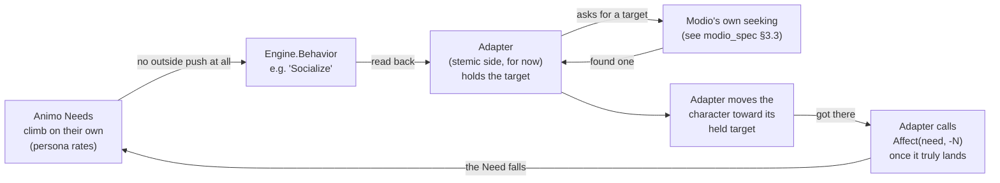

# Adapter Spec

> How Animo's own Agent/Adapter layer talks with Germio, so a character's
> true wish can still reach toward a target, with no target field ever
> sitting inside Animo itself. Checked true, 2026-08-19, in a plan talk
> with Master, over a wish to give `stemic` a true, live pair of
> characters. Written in the project writing standard, so a reader whose
> first language is not English can follow it.

---

## Why

`stemic` wants two characters, each with its own true way of being, and
with no fixed side at all — not one friend and one enemy. A first plan
talk held that a character's true wish must stay fully inside itself (no
target at all), since Animo, by true design, never picks *who* an action
is toward. A second look found that rule too tight, and this spec sets
out the fix, plus the full shape of the Adapter that makes it work.

---

## Two kinds of true wish

There are two kinds of wish a character might hold, not one:

1. **A wish held by the player alone** — say, walking up to a fixed point
   to close out a level. Animo's own characters should never hold this
   kind of wish; it calls for a straight path to one fixed spot, which is
   outside what Animo, or this Adapter, takes on.
2. **A wish that comes from a Need itself**, which may well call for a
   target once some other agent (or the player) sits near enough.
   `Socialize` (already real, in `tanukichi.json`) is this kind: a true
   wish, come from `loneliness`, that only lands once carried out
   *toward* someone.

So a character's true wish may hold a target, so long as that target is
picked by a Need, not by an outside goal the player alone should carry.

---

## Why `Needs`/`Action` still hold no field for a target

A check of `Animo/Scripts/Model/Data.cs` found no target field on either
class, by true design:

+ `Needs` holds only `Dictionary<string, float> values` — a name and a
  number, nothing more.
+ `Action` holds only `id`, `need`, `tier`, `exponent` — again, no
  `GameObject`, no position, no name of another agent.
+ `Influence.source`/`Influence.target` are Need names (say, `"fear"` to
  `"confidence"`), not a place in the world or another agent.

This still stands, and this spec does not touch it. **The target itself
is held by the Adapter, never by Animo.**

**Where the Adapter itself sits (Master's own word, 2026-08-19):** with
`Human_Animable`, on the `stemic` side, for as long as this stays a PoC.
The two are one true piece of work split in two — moving one alone to
`germio` would mean reaching across two separate places for every small
design fix, while the design is still finding its own shape. Once the
PoC shows this holds true for any game, both move to `germio` together
(the same true way `SoundSystem` already sits there).

**Seeking does not sit in `germio` at all.** It was planned there
once, and moved to `modio` on 2026-08-21: seeking and remembering are
one act ("find a Block not yet met"), and cannot be split. See
`modio`'s own `docs/modio_spec.md` §3.3.

---

## The full call path

1. A Need climbs on its own, with no outside push at all, at whatever
   rate the persona's own `rates` sets (say, `loneliness` at +1.2 a
   second, `curiosity` at +0.8). **This is Animo's own true work, and
   the Adapter never pushes a Need up.**
2. Animo runs its own true Step 1-5 pass and picks a Behavior, say
   `"Socialize"` or `"Patrol"`.
3. The Adapter reads `Engine.Behavior` back, and asks Germio's own
   seeking (held by `modio`; see its own `docs/modio_spec.md` §3.3) for
   whatever that Behavior calls for — another character, for
   `"Socialize"`; a block or step not yet stood on, for `"Patrol"`.
4. The Adapter holds onto that target itself (a plain field on the
   Adapter, not on Animo), and moves the character toward it.
5. Animo never learns who or where the target is; it only ever feels
   its own Needs, and picks what to do.
6. Once the character truly gets there (close enough to the other
   character, or standing on the new block), the Adapter calls
   `Affect("loneliness", -30)` — or `Affect("curiosity", -N)` — and the
   Need falls back down. **This one call, telling Animo an action
   truly landed, is the Adapter's own only true reach into Animo.**

**Animo picks *what* to do; Germio alone knows *who* or *where*.**

Why the Adapter must make that last call at all: `Action` holds only
`id`, `need`, `tier`, `exponent` (checked true in
`Scripts/Model/Data.cs`) — no field at all for "how far this Need falls
once the action lands". Animo, holding no place in the world, can never
know on its own whether a character truly got anywhere. Germio alone
knows, so Germio alone can tell it.

---

## The kind/persona pair for `stemic`

Two kinds, off one shared base (`stemic_character`, with a plain `idle`
and `fatigue` rate), the same shape `tanukichi.json` already shows (a
base kind plus a second kind that gives its own true way of being):

**These two are now fully designed** — see
`docs/persona_design_spec.md` §6, which holds every value settled
(Stage/Need/start/rate/exponent/Action/suppression, plus influence and
commitment bonus for each), all checked by real sums.

What that design settled, in short:

| Kind              | Stage 3 (social)          | Stage 5 (own true self) | Commitment |
| ----------------- | ------------------------- | ----------------------- | ---------- |
| `place_curious`   | `loneliness` → `Approach` | `curiosity` → `Explore` | +6         |
| `company_seeking` | `loneliness` → `Approach` | `togetherness` → `Give` | +12        |

The two were built as one true pair: `place_curious` cannot reach
`Explore` while its own `loneliness` sits high (Maslow's own
holding-back, `animo_spec.md` §8.3), so it only truly goes exploring
once `company_seeking` comes near. Each time it walks off again,
`company_seeking`'s own `separation` climbs, and it calls out. One
true, closed round — checked by real sums in `persona_design_spec.md`
§6.

An older sketch stood here, holding only one Stage-3 pair for each,
plus an `idle` Need. Both were dropped: no persona may use `idle` at
all (`persona_design_spec.md` §3), and every one of Maslow's own 5
Stages must hold a true Need (§1).

Neither kind holds `Flee` or a fight action at all — those call for a
true side (friend/enemy), which this pair does not have.

---

## Not part of this spec

+ Modio's own seeking (a sight check, a drop-off check, and the
  call-in point for `DoFixedUpdate.Apply`) — moved out of `germio` on
  2026-08-21.
+ `GroupMind` (a Need spreading between more than two agents at once) —
  still a v0.2 idea only, not real code, per `animo_spec.md` §21.4a.

---

## Open points

+ The real number for `loneliness`'s own climb rate while a target sits
  near, and how close "near" truly is, are both still open — a Germio-
  side call, once seeking itself is built in `modio` and can be
  checked against real play.
+ Whether the Adapter should drop its held target the moment seeking
  no longer finds it (a hard cut), or let it fall away over a short true
  span (a soft cut), is still open.
