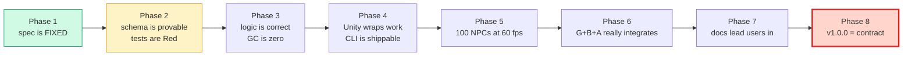
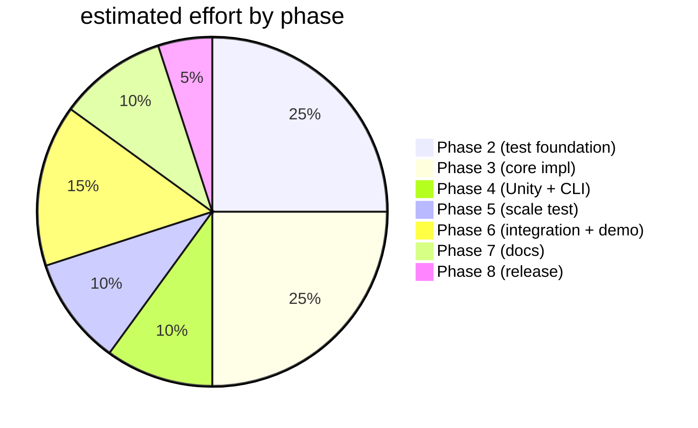
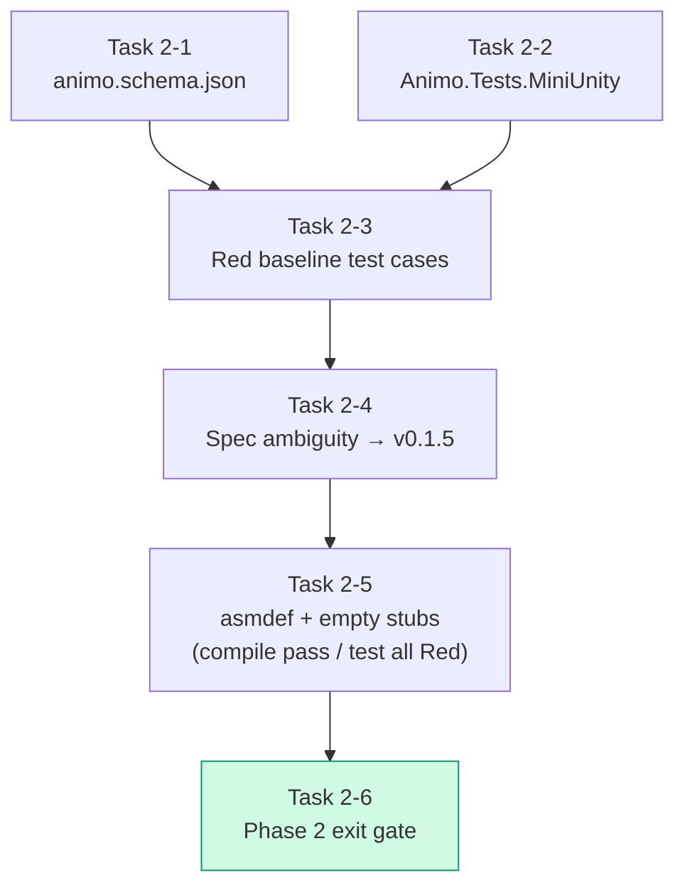
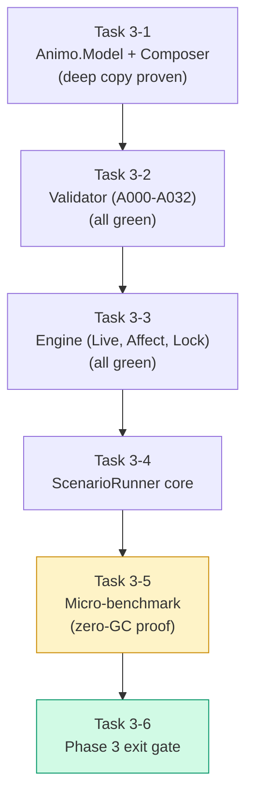
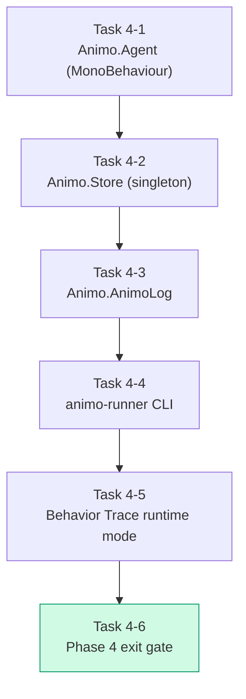
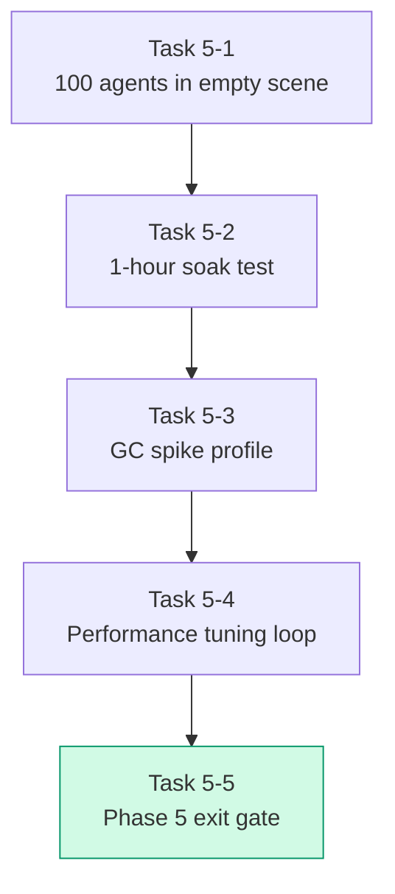
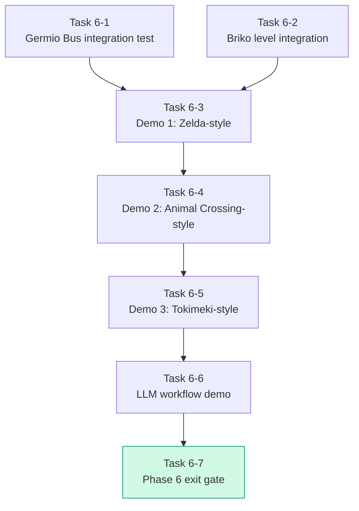
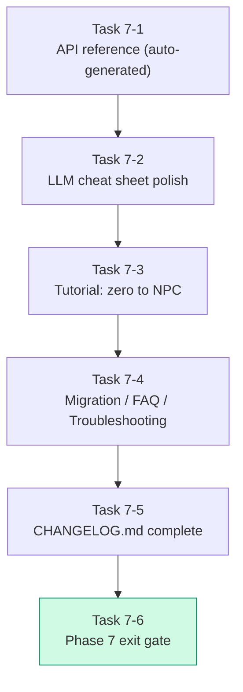
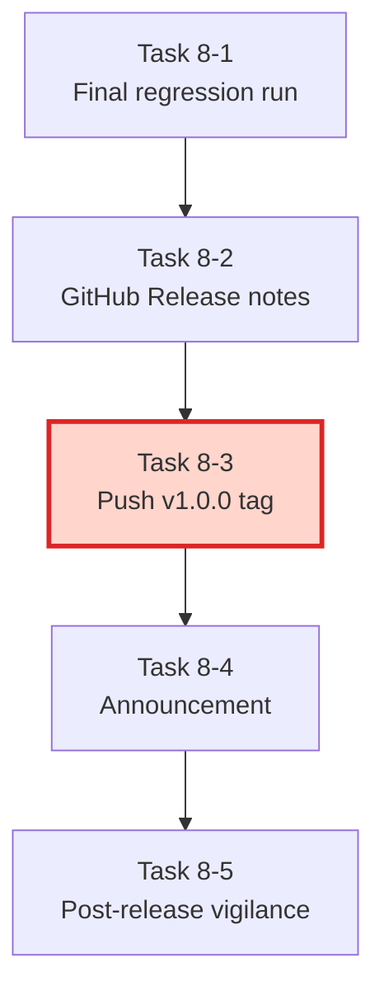

# Animo Roadmap to v1.0.0

> **The Master Plan: from spec FIX to commercial-grade release**
> **Document version**: 1.0
> **Status**: Active (Phase 1 complete, Phase 2 next)
> **Last updated**: 2026-05-08
> **Author**: STUDIO MeowToon — h.adachi
> **Companion spec**: [`animo_spec_v0.1.4_EN.md`](animo_spec_v0.1.4_EN.md)

---

## Table of Contents

1. [Philosophy](#1-philosophy)
2. [Phase Overview](#2-phase-overview)
3. [Phase 1 — Spec FIX (v0.1.4-design)](#3-phase-1--spec-fix-v014-design)
4. [Phase 2 — Schema and Test Foundation (v0.2.0-test)](#4-phase-2--schema-and-test-foundation-v020-test)
5. [Phase 3 — Core Implementation and Zero-GC Proof (v0.3.0-alpha)](#5-phase-3--core-implementation-and-zero-gc-proof-v030-alpha)
6. [Phase 4 — Unity Integration and CLI (v0.4.0-alpha)](#6-phase-4--unity-integration-and-cli-v040-alpha)
7. [Phase 5 — Scale and Stress Test (v0.5.0-beta)](#7-phase-5--scale-and-stress-test-v050-beta)
8. [Phase 6 — G+B+A Integration (v0.6.0-beta)](#8-phase-6--gba-integration-v060-beta)
9. [Phase 7 — Documentation and LLM Prompt Set (v0.9.0-rc)](#9-phase-7--documentation-and-llm-prompt-set-v090-rc)
10. [Phase 8 — Release (v1.0.0)](#10-phase-8--release-v100)
11. [Cross-Phase Quality Gates](#11-cross-phase-quality-gates)
12. [Risk Register](#12-risk-register)

---

## 1. Philosophy

### 1.1 Goal of v1.0.0

**"Provable, commercial-grade stability and performance — ready to drop into a shipping game."**

This is not a "0.x reaches feature parity, then we call it 1.0" plan. It is a **proof-driven** plan. Every phase has a target that can be measured, asserted, or benchmarked.

### 1.2 Anti-Pattern We Reject

```
❌ "Implement → run in Unity → fix bugs as they appear" (waterfall-ish)
```

This wastes time on the slow Unity round-trip and lets logic bugs sneak past as "performance issues" or vice versa.

### 1.3 Pattern We Adopt

```
✅ "Schema first → pure C# simulation → burn out every flaw before Unity"
```

The flow is:
1. Lock the JSON schema as the contract.
2. Build a pure-C# test harness that mocks Unity (`Animo.Tests.MiniUnity`).
3. Write Red tests covering all decision tables and edge cases.
4. Implement core to turn Red into Green.
5. Prove zero-GC mathematically with micro-benchmarks.
6. Only then bring it into Unity.
7. Stress test, then integrate, then document, then release.

### 1.4 Each Phase Proves Something



---

## 2. Phase Overview

| Phase | Version | Theme | Status | Exit Criteria (Proof) |
|---|---|---|---|---|
| **1** | `v0.1.4-design` | Spec FIX and operational pattern | ✅ Complete | EN/JP spec + 59 mermaid diagrams build-checked |
| **2** | `v0.2.0-test` | Schema definition + pure C# test harness | 🔥 Next | All test cases Red. Schema validates 3 sample JSONs. |
| **3** | `v0.3.0-alpha` | Core impl + zero-GC proof | | All tests Green. `GC.Alloc == 0` in `Live(dt)` over 100K calls. |
| **4** | `v0.4.0-alpha` | Unity integration + CLI tool | | `animo-runner` CLI runs from terminal. `Animo.Agent` works in Unity. |
| **5** | `v0.5.0-beta` | Scale and stress test | | 100 agents × 60 fps stable in empty scene. 1-hour soak: no leak. |
| **6** | `v0.6.0-beta` | G+B+A integration + 3 demos | | Three genre demos run with `Lock` and `frustration` working. |
| **7** | `v0.9.0-rc` | Docs and LLM prompt set | | Tutorial works. LLM produces a valid `animo.json` from a prompt. |
| **8** | `v1.0.0` | Stable release | 🎯 | Tag pushed. Release notes published. Semver applies from now. |

### 2.1 Time-Effort Distribution (rough)



Phase 2 and 3 take half of the total. This is on purpose. The proof has to hold there. Everything later inherits that quality.

---

## 3. Phase 1 — Spec FIX (v0.1.4-design)

**Status: ✅ Complete**

### 3.1 Goal

- Lock all design decisions in writing.
- Burn out every logic, math, and performance hole found during four rounds of Gemini Pro critique.
- Define operational patterns: `Lock`, `frustration`, `ScenarioRunner`.

### 3.2 Deliverables (already done)

| Artifact | Location |
|---|---|
| English specification (reference) | `docs/animo_spec_v0.1.4_EN.md` |
| Japanese specification | `docs/animo_spec_v0.1.4_JP.md` |
| README | `README.md` |
| LICENSE (MIT) | `LICENSE` |
| Git history | 7 commits, `3b8f3b4` to `1e7c082` |

### 3.3 Phase 1 Exit Checklist

- [x] All four rounds of Gemini critique addressed.
- [x] Spec covers: Maslow dynamic suppression, Pre-cache Principle, Commitment, Lock API, frustration Need, ScenarioRunner.
- [x] All 59 Mermaid diagrams build-check pass.
- [x] EN version is the implementation reference.
- [x] License is MIT and applied consistently.
- [x] Repository is OSS-ready.

---

## 4. Phase 2 — Schema and Test Foundation (v0.2.0-test)

**Status: 🔥 Next**

### 4.1 Goal

Build the foundation that lets us **burn out every flaw before Unity**:

1. Lock the **`animo.schema.json`** as the JSON contract that the LLM and the runtime both honor.
2. Build a pure-C# **`Animo.Tests.MiniUnity`** harness that mocks `MonoBehaviour`, `GameObject`, and `Bus`.
3. Write **Red tests** for every decision table and edge case derived from the spec.
4. Find and resolve all **spec ambiguities** that surface while writing tests.

### 4.2 Why This Phase Exists

Skipping this phase means:
- The LLM produces invalid JSON that the runtime accepts but mishandles.
- Bugs in `Awake` lifecycle and `Update` chattering can only be found inside Unity (slow round-trip).
- We discover spec holes mid-implementation and have to redesign.

This phase pays a heavy upfront cost and avoids all of that.

### 4.3 Phase 2 Task Map



### 4.4 Task 2-1 — `animo.schema.json` Construction

**Goal**: One JSON Schema file (`schemas/animo.schema.json`) that an LLM can read and produce a valid `animo.json` against, with no runtime help.

#### 4.4.1 Sub-tasks

- [ ] **2-1-a** Define the root structure (`schema_version`, `kinds`, `personas`).
- [ ] **2-1-b** Define `Kind` and `Persona` shapes (`additionalProperties: false`).
- [ ] **2-1-c** Define numeric ranges:
  - `needs.*`: 0.0 to 100.0
  - `actions[].tier`: 1 to 5
  - `actions[].exponent`: 0.1 to 5.0
  - `influences[].coefficient`: -1.0 to 1.0
  - `suppression.tier2..5`: 0.0 to 1.0
  - `commitment.bonus`: 0.0 to 100.0 (range is opinionated; 30 triggers A028)
- [ ] **2-1-d** Define `pattern` for snake_case (`agent_id`, `kind_id`, `actions[].id`).
- [ ] **2-1-e** Mark required fields (`actions[].need` is required since v0.1.1).
- [ ] **2-1-f** Add `enum` for `schema_version`: `["1.3", "1.4"]`.
- [ ] **2-1-g** Validate the three example JSONs from §20 against the schema.
- [ ] **2-1-h** Add JSON Schema metadata (`$schema`, `title`, `description`).

#### 4.4.2 Implementation Steps

```
1. Create schemas/animo.schema.json with root skeleton.
2. Add $defs for each Animo.Model class.
3. Add range and pattern constraints based on Const.cs values.
4. Run a JSON Schema validator (e.g. ajv) on:
   - examples/goblin_scout.json
   - examples/tanukichi.json
   - examples/shiori.json
5. Fix any mismatches between spec and schema.
6. Document the schema in docs/schema_reference.md.
```

#### 4.4.3 Task 2-1 Checklist

- [ ] Schema file created at `schemas/animo.schema.json`.
- [ ] All Animo.Model classes have a `$defs` entry.
- [ ] All numeric ranges match `Animo.Const` values.
- [ ] snake_case patterns enforced where required (A002, A003).
- [ ] `actions[].need` is marked required.
- [ ] `additionalProperties: false` on every defined object.
- [ ] All three sample JSONs from §20 pass schema validation.
- [ ] `schema_reference.md` written with one example per `$defs`.

#### 4.4.4 Proof of Completion

```bash
# all three must pass
ajv validate -s schemas/animo.schema.json -d examples/goblin_scout.json
ajv validate -s schemas/animo.schema.json -d examples/tanukichi.json
ajv validate -s schemas/animo.schema.json -d examples/shiori.json
```

### 4.5 Task 2-2 — `Animo.Tests.MiniUnity` Harness

**Goal**: A pure-C# test harness that simulates Unity's `MonoBehaviour` lifecycle without loading Unity. EditMode tests can call `Awake`, `Update`, `OnDestroy` directly. PlayMode is not needed for most logic.

#### 4.5.1 What MiniUnity Provides

```csharp
namespace Animo.Tests.MiniUnity {
    public class MockGameObject {
        public string name { get; set; }
        public void AddComponent<T>() where T : MockMonoBehaviour, new();
        public T GetComponent<T>() where T : MockMonoBehaviour;
    }

    public abstract class MockMonoBehaviour {
        public MockGameObject gameObject { get; internal set; }
        public virtual void Awake() {}
        public virtual void Update() {}
        public virtual void OnDestroy() {}
    }

    public class MockBus {
        public List<string> published_signals { get; }
        public void Publish(string signal_id);
        public void Reset();
    }

    public static class MockTime {
        public static float deltaTime { get; set; }
        public static void Step(float dt); // advances all registered MonoBehaviours
    }

    public class MockScene {
        public void Add(MockGameObject obj);
        public void Tick(float dt); // calls Update on every active object
    }
}
```

#### 4.5.2 Sub-tasks

- [ ] **2-2-a** Create `Tests~/MiniUnity/` directory and asmdef.
- [ ] **2-2-b** Implement `MockGameObject` with `AddComponent` / `GetComponent`.
- [ ] **2-2-c** Implement `MockMonoBehaviour` with virtual `Awake` / `Update` / `OnDestroy`.
- [ ] **2-2-d** Implement `MockBus` with `Publish` recording and `Reset`.
- [ ] **2-2-e** Implement `MockTime` with controllable `deltaTime`.
- [ ] **2-2-f** Implement `MockScene` with `Tick(dt)` that advances all objects.
- [ ] **2-2-g** Write 3 self-tests for MiniUnity (otherwise the harness is unverified):
  - lifecycle order: `Awake → Update × N → OnDestroy`
  - `MockBus.published_signals` records in order
  - `MockTime.Step` advances all `Update` calls

#### 4.5.3 Task 2-2 Checklist

- [ ] `Animo.Tests.MiniUnity.asmdef` exists, no `UnityEngine` reference.
- [ ] `MockGameObject` supports multiple components.
- [ ] `MockMonoBehaviour` lifecycle hooks fire in correct order.
- [ ] `MockBus.published_signals` is verifiable.
- [ ] `MockTime` is independent of real time.
- [ ] `MockScene.Tick` calls `Update` on all active components in registration order.
- [ ] 3 self-tests for MiniUnity all Green.

#### 4.5.4 Proof of Completion

The MiniUnity self-tests pass. They are the only Green tests in this phase.

### 4.6 Task 2-3 — Red Baseline Test Cases

**Goal**: Cover every decision table and every edge case from the spec. Every test must fail (Red) until Phase 3 implements the code.

#### 4.6.1 Test File Structure

```
Tests~/EditModeTests/
├─ Animo.Tests.EditMode.asmdef
├─ Validator/
│  ├─ A000_SchemaVersionTests.cs
│  ├─ A001_PersonasExistsTests.cs
│  ├─ A002_AgentIdTests.cs
│  ├─ ...
│  ├─ A025_CycleDetectionTests.cs
│  ├─ A028_CommitmentBonusWarnTests.cs
│  ├─ A029_CommitmentMissingWarnTests.cs
│  ├─ A030_FrustrationUnusedTests.cs
│  ├─ A031_LockDurationWarnTests.cs
│  └─ A032_FallbackActionInfoTests.cs
├─ Composer/
│  ├─ DeepCopyTests.cs
│  ├─ KindCascadeTests.cs
│  ├─ MissingNeedFillTests.cs
│  └─ MultiKindMergeTests.cs
├─ Engine/
│  ├─ Step1_NaturalDecayTests.cs
│  ├─ Step2_EffectiveNeedsTests.cs
│  ├─ Step3_ThresholdTests.cs
│  ├─ Step4_ScoreCalcTests.cs
│  ├─ Step5_ActionSwitchTests.cs
│  ├─ MaslowSuppressionTests.cs
│  ├─ CommitmentTests.cs
│  ├─ LockTests.cs
│  └─ ForceResetTests.cs
└─ EdgeCases/
   ├─ NumericEdgeTests.cs
   ├─ EmptyAndNullTests.cs
   ├─ HighVolumeTests.cs
   └─ TimeEdgeTests.cs
```

#### 4.6.2 Decision Table Method

For each Validator rule, edge case, and behavior path, the developer writes:

1. **A decision table** (Markdown) listing input combinations and expected results.
2. **A test method per row** of the table, named after the row.

Example for `A025_CycleDetectionTests.cs`:

| # | Has A→B | Has B→A | Has A→C→A | Has self A→A | Expected |
|---|---|---|---|---|---|
| 1 | × | × | × | × | Pass |
| 2 | ○ | × | × | × | Pass |
| 3 | ○ | ○ | × | × | Error A025 |
| 4 | ○ | × | ○ | × | Error A025 |
| 5 | × | × | × | ○ | Error A025 |
| 6 | ○ | ○ | ○ | × | Error A025 |
| 7 | ○ | × | × | × (independent DAGs) | Pass |

```csharp
[TestFixture]
public class A025_CycleDetectionTests {
    [Test] public void Case01_NoInfluences_Passes() { ... }
    [Test] public void Case02_OneWayOnly_Passes() { ... }
    [Test] public void Case03_DirectCycle_FailsA025() { ... }
    [Test] public void Case04_TriangleCycle_FailsA025() { ... }
    [Test] public void Case05_SelfReference_FailsA025() { ... }
    [Test] public void Case06_MultipleCycles_FailsA025() { ... }
    [Test] public void Case07_IndependentDAGs_Passes() { ... }
}
```

#### 4.6.3 Edge Case Catalog (cross-class)

| Category | Cases |
|---|---|
| **Numeric** | NaN, +Infinity, -Infinity, +0.0, -0.0, max float, min float, denormals |
| **Empty** | empty string `""`, empty array `[]`, empty object `{}`, missing field |
| **Null** | null reference, null string |
| **Bounds** | range min, range min - epsilon, range max, range max + epsilon |
| **Volume** | 0 elements, 1 element, 1000 elements, 10000 elements |
| **Duplicates** | same `id` twice in array, same `kind_id` twice in `kind_ids` |
| **Time** | `dt = 0`, `dt < 0`, `dt = NaN`, `dt = very large` |
| **Encoding** | Unicode in `agent_id` (must fail snake_case) |
| **Order** | reversed `influences` order (must produce same EffectiveNeeds after topo sort) |

Each cross-class edge case becomes a row in `EdgeCases/`.

#### 4.6.4 Sub-tasks

- [ ] **2-3-a** Create `Tests~/EditModeTests/` directory and asmdef.
- [ ] **2-3-b** Write decision table for each Validator rule (A000–A032) — 33 tables.
- [ ] **2-3-c** Implement Validator test classes (33 files, 80+ test methods total).
- [ ] **2-3-d** Write decision table for `Composer` (deep copy, cascade, missing-Need fill).
- [ ] **2-3-e** Implement Composer test classes (4 files, ~30 test methods).
- [ ] **2-3-f** Write decision table for `Engine.Live` Steps 1–5.
- [ ] **2-3-g** Implement Engine test classes (5 step files + 4 feature files = 9 files, ~40 test methods).
- [ ] **2-3-h** Implement edge-case catalog tests (4 files, ~30 test methods).
- [ ] **2-3-i** Run all tests. **All must be Red. None can be Green** (except MiniUnity self-tests).

#### 4.6.5 Task 2-3 Checklist

- [ ] All 33 Validator decision tables documented in `docs/test_plan_v0.1.4.md`.
- [ ] All Validator test classes exist with named test methods.
- [ ] Composer decision table documented and implemented.
- [ ] Engine 5-step decision tables documented and implemented.
- [ ] Edge case catalog documented and implemented.
- [ ] Total test methods ≥ 180. (See §11 for rationale.)
- [ ] All tests are Red (no false Green).
- [ ] Test naming follows `[A025_]Case03_DirectCycle_FailsA025` pattern.

#### 4.6.6 Proof of Completion

NUnit runner output shows:
```
Tests run: 180+, Passed: 3 (MiniUnity self-tests), Failed: 177+
```

That is the **Red baseline**. Commit it as `git tag v0.2.0-red-baseline`.

### 4.7 Task 2-4 — Spec Ambiguity Resolution

**Goal**: While writing tests, every undefined behavior gets surfaced and resolved. Patches go into a `v0.1.5` spec patch.

#### 4.7.1 Known Ambiguities (already identified)

These have no answer in v0.1.4. They must be resolved here.

| # | Ambiguity | Proposed default | Decision |
|---|---|---|---|
| Q1 | `Affect("hunger", float.NaN)` | reject silently with Warning | TBD |
| Q2 | `Affect("hunger", float.PositiveInfinity)` | clamp to 100 | TBD |
| Q3 | `Affect("undefined_need", +10)` | log Warning, no-op | TBD |
| Q4 | `Affect("", +10)` | throw `ArgumentException` | TBD |
| Q5 | `Affect(null, +10)` | throw `ArgumentNullException` | TBD |
| Q6 | empty `actions[]` after composition | A011a Error | TBD |
| Q7 | duplicate in `kind_ids` (`["goblin", "goblin"]`) | dedupe with Warning | TBD |
| Q8 | negative `commitment.bonus` | A012-style range Error | TBD |
| Q9 | `Lock(duration: 0)` | immediate Unlock | TBD |
| Q10 | `Lock(duration: -1.0)` | throw `ArgumentException` | TBD |
| Q11 | `Live(dt: 0)` | no-op, return | TBD |
| Q12 | `Live(dt: -0.5)` | clamp to 0 with Warning | TBD |
| Q13 | `Live(dt: float.NaN)` | throw `ArgumentException` | TBD |
| Q14 | `Lock` called while already locked | extend duration vs replace | TBD |
| Q15 | `Unlock` called while not locked | no-op | TBD |
| Q16 | `force_reset` called while `is_locked = true` (Hard) | ignored, but Need still updates | TBD |
| Q17 | `Affect` called from background thread | thread-safety contract? | TBD |

#### 4.7.2 Sub-tasks

- [ ] **2-4-a** Catalog all ambiguities found while writing tests.
- [ ] **2-4-b** For each ambiguity, write a proposed answer with one-line reason.
- [ ] **2-4-c** Bring the list to user for Yes/No decision per item.
- [ ] **2-4-d** Patch the EN spec into `animo_spec_v0.1.5_EN.md` (and JP).
- [ ] **2-4-e** Update `animo.schema.json` if any field range changes.
- [ ] **2-4-f** Bump `Const.CURRENT_SCHEMA_VERSION` if needed.
- [ ] **2-4-g** Re-run all Red tests; new tests must still be Red, old ones must remain consistent.

#### 4.7.3 Task 2-4 Checklist

- [ ] Every ambiguity has a final answer (no `TBD` left in the table).
- [ ] EN spec updated (v0.1.5) — if needed.
- [ ] JP spec updated (v0.1.5) — if needed.
- [ ] Schema updated.
- [ ] Tests updated to reflect resolved decisions.
- [ ] Decision log committed under `docs/decisions/v0.1.5_ambiguity_resolution.md`.

### 4.8 Task 2-5 — `asmdef` and Empty Stubs

**Goal**: The project compiles. Tests can resolve types. Tests are still Red, but **compile errors are not what makes them Red**.

#### 4.8.1 Sub-tasks

- [ ] **2-5-a** Create `Scripts/Animo.asmdef`.
- [ ] **2-5-b** Create empty `Data.cs` with all `Animo.Model` classes (no logic).
- [ ] **2-5-c** Create empty `Engine.cs` with all public methods that throw `NotImplementedException`.
- [ ] **2-5-d** Create empty `Composer.cs`, `Validator.cs`, `Agent.cs`, `Store.cs`, `AnimoLog.cs`.
- [ ] **2-5-e** Create `Const.cs` with the values from spec §14.2 (this is data, not logic — fill it in completely).
- [ ] **2-5-f** Make Tests project reference Animo.asmdef and MiniUnity.asmdef.
- [ ] **2-5-g** Confirm: project compiles. Test runner finds 180+ tests. All Red except MiniUnity self-tests.

#### 4.8.2 Task 2-5 Checklist

- [ ] `Scripts/Animo.asmdef` exists.
- [ ] All public types referenced in tests compile.
- [ ] All public methods throw `NotImplementedException("Phase 3 task")`.
- [ ] `Const.cs` is fully implemented (data only, no logic).
- [ ] Test runner output shows expected Red count.
- [ ] No `Could not load type` errors.

### 4.9 Task 2-6 — Phase 2 Exit Gate

**Goal**: Before moving to Phase 3, verify everything is in place.

#### 4.9.1 Phase 2 Final Checklist

- [ ] `animo.schema.json` exists and validates 3 sample JSONs.
- [ ] `Animo.Tests.MiniUnity` exists with 3 self-tests Green.
- [ ] All decision tables documented in `docs/test_plan_v0.1.4.md` (or v0.1.5).
- [ ] Total test count ≥ 180; non-MiniUnity tests are 100% Red.
- [ ] All spec ambiguities resolved (no `TBD` left).
- [ ] Spec patched to v0.1.5 if any ambiguity decision changed semantics.
- [ ] Project compiles cleanly with `Animo.asmdef` and stubs.
- [ ] Git tag `v0.2.0-red-baseline` is pushed.
- [ ] `CHANGELOG.md` started with Phase 2 entry.

#### 4.9.2 Proof of Phase 2

Run from project root:
```bash
# 1. schema check
ajv validate -s schemas/animo.schema.json -d examples/*.json

# 2. test count
nunit3-console --inprocess Animo.Tests.dll | grep "Tests run"
# expected: Tests run: 180+, Passed: 3, Failed: 177+

# 3. tag check
git tag -l "v0.2.0-red-baseline"
```

All three must succeed. Then Phase 3 starts.

### 4.10 Phase 2 Risk Notes

| Risk | Mitigation |
|---|---|
| Test count balloons past 300 with edge cases | Group similar edges into parameterized tests (`[TestCase]`). Keep readability. |
| MiniUnity grows complex and itself becomes buggy | Self-tests catch this. Keep MiniUnity ≤ 500 LOC. |
| Spec ambiguity resolution stalls | Set a hard rule: "If undecided after 24h, pick the conservative option (throw exception). Document and move on." |
| Schema and Validator drift | Validator is the single source of truth for runtime. Schema is regenerated from `Const.cs` ranges where possible. |
---

## 5. Phase 3 — Core Implementation and Zero-GC Proof (v0.3.0-alpha)

**Status: pending Phase 2**

### 5.1 Goal

Turn every Red test into Green by implementing the core. **Then prove that `Live(dt)` allocates zero bytes per call**. This is the moment the Pre-cache Principle (§16.3 of spec) gets verified, not just claimed.

### 5.2 Why Zero-GC Proof Matters Here

In Phase 5 we will run 100 agents at 60 fps. If GC fires even rarely, frame spikes ruin the experience. **The spec promises zero allocation in the hot path.** The promise must be machine-verified before Unity ever touches the code. If we discover a leak in Phase 5, we tear down the core. Catching it here costs nothing.

### 5.3 Phase 3 Task Map



### 5.4 Task 3-1 — `Animo.Model` and `Composer`

**Goal**: Data classes work. Composer produces a fully independent, fully composed `Persona` from a raw input.

#### 5.4.1 Sub-tasks

- [ ] **3-1-a** Implement all `Animo.Model` classes in `Data.cs`.
- [ ] **3-1-b** Add Newtonsoft `JsonProperty` attributes for snake_case mapping.
- [ ] **3-1-c** Implement `Needs.Get`, `Needs.Normalized`, `Needs.Clamp`.
- [ ] **3-1-d** Implement `Composer.Compose(persona, root)`:
  1. Deep copy every reference type field.
  2. Apply `kind_ids[]` in order, last-wins per field.
  3. Apply `Persona` overrides last.
  4. Fill missing Need keys with 0.0 (with Warning).
  5. Build the `_need_index` Dictionary at construction.
  6. Cache `internal int need_index` on every `Action` and `Threshold`.
- [ ] **3-1-e** Verify `ComposerTests.DeepCopyTests` are Green.
- [ ] **3-1-f** Verify `ComposerTests.KindCascadeTests` are Green.
- [ ] **3-1-g** Verify `ComposerTests.MissingNeedFillTests` are Green.
- [ ] **3-1-h** Verify `ComposerTests.MultiKindMergeTests` are Green.

#### 5.4.2 Implementation Notes

- Deep copy method: write it by hand for Performance. Do **not** use `JsonConvert.SerializeObject` round-trip — it allocates and is slow.
- The deep copy runs **once per Agent at Awake**, not in the hot path. Hand-coded clarity beats reflection speed here.

#### 5.4.3 Task 3-1 Checklist

- [ ] All `Animo.Model` classes serialize and deserialize cleanly.
- [ ] `Composer.Compose` produces a Persona with no shared references to the input.
- [ ] All Composer-related tests Green.
- [ ] `internal int need_index` is set on every `Action` and `Threshold`.

### 5.5 Task 3-2 — `Validator` (A000–A032)

**Goal**: Every rule from spec §13 is implemented and matches its test cases.

#### 5.5.1 Sub-tasks

- [ ] **3-2-a** Implement `ValidationResult`, `ValidationLevel`, `ValidationIssue`, `Location` types.
- [ ] **3-2-b** Implement `Validator.Validate(Root root) → ValidationResult`.
- [ ] **3-2-c** Implement rules A000–A012 (structure and range).
- [ ] **3-2-d** Implement rules A013–A019 (consistency and format).
- [ ] **3-2-e** Implement rules A020a/b/c (cross-field).
- [ ] **3-2-f** Implement A021 (schema_version: accept "1.3" or "1.4" — or "1.5" if spec patched).
- [ ] **3-2-g** Implement A022–A024 (action constraints).
- [ ] **3-2-h** Implement A025 (cycle detection — Error since v0.1.2). Use Tarjan or DFS-coloring.
- [ ] **3-2-i** Implement A026, A027 as informational rules (already enforced by Engine logic).
- [ ] **3-2-j** Implement A028 (commitment.bonus > 30 Warning).
- [ ] **3-2-k** Implement A029 (commitment missing + multiple actions Warning).
- [ ] **3-2-l** Implement A030 (frustration unused Warning).
- [ ] **3-2-m** Implement A031 (Lock duration > 30s Warning — runtime).
- [ ] **3-2-n** Implement A032 (fallback Action info).
- [ ] **3-2-o** Verify all 80+ Validator tests Green.

#### 5.5.2 Implementation Notes

- Validator is the **single source of truth at runtime**. The Schema enforces JSON shape. The Validator enforces semantics.
- A025 cycle detection is a DAG check on the `influences` graph. Throw a clear error message: `"Cycle: fear → confidence → fear"`.
- A031 fires from `Engine.Lock`, not from `Validator.Validate`. It logs a Warning at runtime.

#### 5.5.3 Task 3-2 Checklist

- [ ] Every rule A000–A032 implemented (or marked deprecated for A017).
- [ ] All 80+ Validator tests Green.
- [ ] Validator throws no exceptions; it returns a `ValidationResult`.
- [ ] Error messages mention the rule ID (`[A025] cycle detected: ...`).
- [ ] Cycle detection runs in O(V + E) time.

### 5.6 Task 3-3 — `Engine` (Live, Affect, Lock)

**Goal**: All Engine tests Green. The Live() 5-step loop runs with no allocation.

#### 5.6.1 Sub-tasks

- [ ] **3-3-a** Implement `Engine` constructor: build flat arrays from `Persona`.
- [ ] **3-3-b** Implement Step 1 (natural decay with Rates).
- [ ] **3-3-c** Implement Step 2 (EffectiveNeeds with topo-sorted influences, clamp per Edge).
- [ ] **3-3-d** Implement Step 3 (Threshold check with two-stage hysteresis).
- [ ] **3-3-e** Implement Step 4 (Action score with Maslow dynamic suppression and `commitment_bonus`).
- [ ] **3-3-f** Implement Step 5 (action switch with `is_locked` check).
- [ ] **3-3-g** Implement `Affect(need, delta, force_reset)`.
- [ ] **3-3-h** Implement `Lock(duration, mode)` and `Unlock()`.
- [ ] **3-3-i** Implement `is_locked` and `locked_behavior`.
- [ ] **3-3-j** Implement `LockMode.Hard` (skip Step 5).
- [ ] **3-3-k** Implement `LockMode.Soft` (Step 5 runs but output is frozen).
- [ ] **3-3-l** Verify all Engine tests Green (40+).
- [ ] **3-3-m** Verify CommitmentTests, LockTests, ForceResetTests Green.

#### 5.6.2 Hot Path Implementation Rules

These are non-negotiable:

```csharp
// ✅ this is in the hot path (Live)
foreach (var action in _actions) {
    float intensity = _effective_needs[action.need_index]; // int index, no string
    float pow_val = Mathf.Pow(intensity, action.exponent);
    float supp = ComputeSuppression(action.tier);
    float commit = (action == _current_action && !_force_reset_pending) ? _commitment_bonus : 0f;
    _action_scores[action.index] = (pow_val * 100f + commit) * (1f - supp);
}

// ❌ none of these are allowed in Live:
// - new (anywhere)
// - Dictionary[string]
// - LINQ
// - foreach over a Dictionary (boxing)
// - string interpolation or string.Format
```

#### 5.6.3 Task 3-3 Checklist

- [ ] All 5 Live() steps implemented.
- [ ] `Affect` updates Needs and respects `force_reset`.
- [ ] `Lock` and `Unlock` work for both `Hard` and `Soft` modes.
- [ ] `is_locked` auto-clears after `duration` elapses.
- [ ] `OnDestroy` correctly calls `Unlock` (per §24.6.2).
- [ ] All 40+ Engine tests Green.
- [ ] Maslow simulation table from spec §9.3.5 reproduces exact numbers.
- [ ] Behavior trace mode logs every step output cleanly.

### 5.7 Task 3-4 — `ScenarioRunner` Core

**Goal**: A pure-C# class that loads a `Root`, runs `Engine.Live` for N seconds, and returns a `TraceResult`. CLI wrapping is Phase 4.

#### 5.7.1 Sub-tasks

- [ ] **3-4-a** Implement `ScenarioRunner(Root root)` constructor.
- [ ] **3-4-b** Implement `Run(agent_id, duration, dt, events)` returning `TraceResult`.
- [ ] **3-4-c** Implement timed `AffectEvent` injection.
- [ ] **3-4-d** Implement `TraceResult.ToCsv()`.
- [ ] **3-4-e** Implement `TraceResult.ToJson()`.
- [ ] **3-4-f** Implement `TraceFrame` data capture per step.
- [ ] **3-4-g** Verify ScenarioRunner-based tests run from EditMode tests.

#### 5.7.2 Sample Test Driven by ScenarioRunner

```csharp
[Test]
public void Goblin_StartsHungry_SwitchesToSearchFood_Within3Seconds() {
    var root = LoadJson("examples/goblin_scout.json");
    var runner = new ScenarioRunner(root);
    var events = new Dictionary<float, AffectEvent> {
        [1.0f] = new AffectEvent("hunger", +60f)
    };
    var result = runner.Run("goblin_scout_01", duration: 5.0f, dt: 0.1f, events);

    var late = result.frames.Where(f => f.time > 3.0f).Select(f => f.behavior);
    Assert.Contains("SearchFood", late.ToList());
}
```

#### 5.7.3 Task 3-4 Checklist

- [ ] `ScenarioRunner` runs without Unity dependencies.
- [ ] CSV output is valid (round-trips through Excel).
- [ ] JSON output is valid (round-trips through `JsonConvert`).
- [ ] At least 5 ScenarioRunner-based tests Green.
- [ ] No Unity APIs (`UnityEngine.Time`, etc.) used.

### 5.8 Task 3-5 — Micro-Benchmark and Zero-GC Proof

**Goal**: Mathematically prove that `Live(dt)` allocates zero bytes after warm-up.

#### 5.8.1 The Test

```csharp
[Test, Category("Benchmark")]
public void Engine_Live_HotPath_IsZeroAllocation_Over_100K_Calls() {
    var root = LoadJson("examples/goblin_scout.json");
    var engine = new Engine(persona: Composer.Compose(root.personas[0], root));

    // Warm up: JIT and any one-time allocations
    for (int i = 0; i < 1000; i++) engine.Live(dt: 0.016f);

    // Measure
    long before = GC.GetTotalMemory(forceFullCollection: true);
    long alloc_before = GC.GetAllocatedBytesForCurrentThread();
    for (int i = 0; i < 100000; i++) engine.Live(dt: 0.016f);
    long alloc_after = GC.GetAllocatedBytesForCurrentThread();
    long after = GC.GetTotalMemory(forceFullCollection: false);

    long allocated = alloc_after - alloc_before;
    Assert.AreEqual(0, allocated,
        $"Live() allocated {allocated} bytes over 100K calls. Expected 0. Hot path GC violation.");
}
```

#### 5.8.2 Sub-tasks

- [ ] **3-5-a** Add `BenchmarkTests/EngineLiveAllocationTests.cs`.
- [ ] **3-5-b** Add `BenchmarkTests/AffectAllocationTests.cs` (Affect should also be 0).
- [ ] **3-5-c** Add `BenchmarkTests/LockAllocationTests.cs` (Lock state changes are once, not per frame).
- [ ] **3-5-d** Add `BenchmarkTests/ScenarioRunnerAllocationTests.cs` (Run-time allocations only at start).
- [ ] **3-5-e** Add per-call timing benchmark: `Live` < 10 microseconds for one Persona with 8 needs.
- [ ] **3-5-f** All benchmarks pass on Release build.

#### 5.8.3 If a Benchmark Fails

- `Live` allocates → find the line. Common offenders: `foreach` on `Dictionary`, `string` formatting, LINQ, `new []`. Fix without changing tests.
- Allocation is unavoidable due to a third-party API → wrap in `[Conditional("ANIMO_TRACE")]` so production has zero. Tracing has cost — that is fine.

#### 5.8.4 Task 3-5 Checklist

- [ ] Zero-GC test for `Live` Green.
- [ ] Zero-GC test for `Affect` Green.
- [ ] Zero-GC test for `Lock` / `Unlock` Green.
- [ ] Per-call `Live` time < 10 µs in Release mode.
- [ ] Benchmark results documented in `docs/benchmarks_v0.3.0.md`.

### 5.9 Task 3-6 — Phase 3 Exit Gate

#### 5.9.1 Phase 3 Final Checklist

- [ ] All 180+ tests Green (no Red, no Skipped).
- [ ] Zero-GC benchmarks Green for `Live`, `Affect`, `Lock`.
- [ ] `Live` per-call time < 10 µs.
- [ ] `ScenarioRunner` runs the goblin example end-to-end.
- [ ] Spec §9.3.5 simulation table exactly reproduced (no floating-point drift > 1e-3).
- [ ] No `UnityEngine` reference in `Animo.Core`.
- [ ] No `UnityEngine` reference in `Animo.Model`.
- [ ] No `UnityEngine` reference in `Animo.Tools`.
- [ ] CHANGELOG entry for v0.3.0-alpha written.
- [ ] Git tag `v0.3.0-alpha` pushed.

#### 5.9.2 Proof of Phase 3

```bash
# 1. all tests Green
dotnet test --filter "Category!=Benchmark"
# expected: Passed: 180+, Failed: 0

# 2. zero-GC proven
dotnet test --filter "Category=Benchmark"
# expected: Passed: 4+, Failed: 0

# 3. no UnityEngine in Core
! grep -r "UnityEngine" Scripts/Composer.cs Scripts/Engine.cs Scripts/Validator.cs Scripts/Data.cs
```

All three must pass.

### 5.10 Phase 3 Risk Notes

| Risk | Mitigation |
|---|---|
| Hidden allocation in `Mathf.Pow` or other Unity static | Use `Math.Pow` from `System` in Core; only `Mathf` in Unity layer (Phase 4). |
| `Dictionary<string, int>` lookup happens once per frame after all | Confirm with a stress test: `Live` should not call `_need_index[key]` at all. The cache is built at construction. |
| Cycle detection has bugs that pass tests but fail in real graphs | Add fuzz test: random graphs with N=10 nodes, 100 random edges. Must always agree with brute-force DFS. |
| Floating-point drift in Maslow table | Use `double` internally if precision is borderline. Convert to `float` only at API boundary. |

---

## 6. Phase 4 — Unity Integration and CLI (v0.4.0-alpha)

**Status: pending Phase 3**

### 6.1 Goal

Wrap the proven core into Unity components and a standalone CLI tool. The core does not change. **The Unity layer is a thin shell.**

### 6.2 Phase 4 Task Map



### 6.3 Task 4-1 — `Animo.Agent` (MonoBehaviour)

**Goal**: A drop-in `MonoBehaviour` that any Unity GameObject can use.

#### 6.3.1 Sub-tasks

- [ ] **4-1-a** Implement `Animo.Agent : MonoBehaviour`.
- [ ] **4-1-b** SerializeField `_PERSONA_JSON_PATH`, `_BUS`.
- [ ] **4-1-c** `Awake`: load JSON, run Validator, run Composer, build `Engine`, register with `Store`.
- [ ] **4-1-d** `Awake`: pre-compute action trigger cache (per spec §16.5).
- [ ] **4-1-e** `Awake`: pre-compute threshold trigger cache.
- [ ] **4-1-f** `Update`: call `Engine.Live(Time.deltaTime)`, publish behavior changes via `_BUS`.
- [ ] **4-1-g** `OnDestroy`: call `Engine.Unlock()`, unregister from `Store`.
- [ ] **4-1-h** Public properties: `behavior`, `is_locked`, `locked_behavior`, `agent_id`.
- [ ] **4-1-i** Public methods: `Lock(duration, mode)`, `Unlock()`.
- [ ] **4-1-j** Custom Inspector for nice UI.
- [ ] **4-1-k** PlayMode test: agent in scene, ticks for N frames, behavior matches expectation.

#### 6.3.2 Task 4-1 Checklist

- [ ] `Agent` compiles in Unity 2022.3.
- [ ] Inspector shows JSON path field and Bus reference cleanly.
- [ ] `Awake` validation failure logs Error and disables the agent (does not crash).
- [ ] String cache built once at Awake; no per-frame allocation.
- [ ] At least 3 PlayMode tests Green.

### 6.4 Task 4-2 — `Animo.Store`

**Goal**: Central registry for all `Agent` instances. Routes `Affect` calls.

#### 6.4.1 Sub-tasks

- [ ] **4-2-a** Implement `Animo.Store` as singleton (per spec §11).
- [ ] **4-2-b** `Register(agent)` and `Unregister(agent)` methods.
- [ ] **4-2-c** `Affect(agent_id, need, delta, force_reset)` relay.
- [ ] **4-2-d** Warning log if `agent_id` not found (do not crash).
- [ ] **4-2-e** Internal `Find(agent_id)` method (not public).
- [ ] **4-2-f** Multi-agent test: 5 agents in scene, Affect by id reaches the right agent.

#### 6.4.2 Task 4-2 Checklist

- [ ] Store is a singleton, with proper Unity-side lifetime management.
- [ ] Register/Unregister works across scene loads (or is reset cleanly).
- [ ] Affect relay routes correctly.
- [ ] Affect with unknown id logs Warning, does not throw.

### 6.5 Task 4-3 — `Animo.AnimoLog`

**Goal**: Lightweight logger that integrates with Unity Console. Will eventually merge into `UtiloLog` (per spec §22.2).

#### 6.5.1 Sub-tasks

- [ ] **4-3-a** Implement `AnimoLog.Write(message)`, `AnimoLog.Warning(message)`, `AnimoLog.Error(message)`.
- [ ] **4-3-b** Optional `[ANIMO_TRACE]` conditional compilation flag for verbose logs.
- [ ] **4-3-c** Plug `Validator` warnings into `AnimoLog.Warning` automatically.

#### 6.5.2 Task 4-3 Checklist

- [ ] Logs appear in Unity Console with `[Animo]` prefix.
- [ ] Trace logs are disabled by default in Release builds.
- [ ] Errors do not throw exceptions; they return.

### 6.6 Task 4-4 — `animo-runner` CLI

**Goal**: Standalone .NET CLI that wraps `ScenarioRunner` for command-line use. Lets the LLM verify edits without opening Unity.

#### 6.6.1 Sub-tasks

- [ ] **4-4-a** Create `animo-runner~/animo-runner.csproj` (.NET 8 console).
- [ ] **4-4-b** Reference `Animo.Core` and `Animo.Model` (without Unity).
- [ ] **4-4-c** Argument parsing: `--persona`, `--duration`, `--dt`, `--output`, `--events`.
- [ ] **4-4-d** Load JSON, run `ScenarioRunner`, write CSV or JSON.
- [ ] **4-4-e** Support `--format csv|json`.
- [ ] **4-4-f** Support `--events events.json` (load timed events from file).
- [ ] **4-4-g** Add `--trace` flag for verbose per-frame logging.
- [ ] **4-4-h** Provide `dotnet tool install` packaging.
- [ ] **4-4-i** End-to-end test: shell out to CLI, parse output, assert.

#### 6.6.2 Sample CLI Use

```bash
animo-runner \
  --persona examples/goblin_scout.json \
  --agent-id goblin_scout_01 \
  --duration 60 \
  --dt 0.1 \
  --events scenario_events.json \
  --output trace.csv \
  --format csv
```

#### 6.6.3 Task 4-4 Checklist

- [ ] CLI runs on Windows, macOS, Linux.
- [ ] CSV output opens cleanly in Excel.
- [ ] JSON output round-trips through `JsonConvert`.
- [ ] Help text covers all flags.
- [ ] Distributable as `dotnet tool` (global install) for LLM workflows.

### 6.7 Task 4-5 — Behavior Trace Runtime Mode

**Goal**: When enabled, `Engine` logs every step's internals. Off by default, zero cost when off.

#### 6.7.1 Sub-tasks

- [ ] **4-5-a** Add `Engine.SetTraceMode(TraceMode mode)`.
- [ ] **4-5-b** Implement `TraceMode.Off` (default), `TraceMode.Verbose`, `TraceMode.Compact`.
- [ ] **4-5-c** When Verbose, log effective_needs, action_scores, and selected behavior every frame.
- [ ] **4-5-d** Wrap trace logging in `[Conditional("ANIMO_TRACE")]` for Release.
- [ ] **4-5-e** Unity Inspector: checkbox to enable/disable per Agent.

#### 6.7.2 Task 4-5 Checklist

- [ ] Trace logs are formatted clearly (one line per frame in Compact mode).
- [ ] Trace mode does **not** allocate on the hot path when Off.
- [ ] When On, allocation happens only at log call.

### 6.8 Task 4-6 — Phase 4 Exit Gate

#### 6.8.1 Phase 4 Final Checklist

- [ ] `Animo.Agent` MonoBehaviour works in Unity 2022.3.
- [ ] `Animo.Store` singleton routes Affect correctly across scenes.
- [ ] `AnimoLog` integrates with Unity Console.
- [ ] `animo-runner` CLI runs from terminal on three platforms.
- [ ] Behavior Trace mode works in both Inspector and CLI.
- [ ] At least 10 PlayMode tests Green for the Unity layer.
- [ ] Demo scene with one goblin walks → searches food → flees on damage.
- [ ] CHANGELOG entry for v0.4.0-alpha written.
- [ ] Git tag `v0.4.0-alpha` pushed.

#### 6.8.2 Proof of Phase 4

```bash
# 1. PlayMode tests
unity-test-cli --testPlatform PlayMode --testCategory "Animo.Unity"
# expected: Passed: 10+, Failed: 0

# 2. CLI works
animo-runner --persona examples/goblin_scout.json --agent-id goblin_scout_01 \
             --duration 5 --output trace.csv
test -f trace.csv

# 3. demo scene runs without errors
unity-cli -batchmode -quit -projectPath . -executeMethod AnimoDemo.RunHeadless
```

### 6.9 Phase 4 Risk Notes

| Risk | Mitigation |
|---|---|
| Unity Inspector serialization fails for nested types | Use `[SerializeReference]` only where strictly needed. Prefer plain `[SerializeField]`. |
| `animo-runner` CLI cannot reference Animo.Core because of Unity-specific API leak | Confirmed in Phase 3 exit (no UnityEngine in Core). If a leak appears, refactor before exiting Phase 4. |
| Singleton Store has lifecycle bugs across scene loads | Add lifecycle test: load Scene A → spawn agents → load Scene B → store should be cleared or behave per spec. |
| Behavior Trace allocates when off | Verify with the same zero-GC test from Phase 3 but on the Unity layer. |
---

## 7. Phase 5 — Scale and Stress Test (v0.5.0-beta)

**Status: pending Phase 4**

### 7.1 Goal

Prove that **Animo does not eat the frame budget** in real Unity. Specifically:

- 100 agents at 60 fps stable in an empty scene.
- 1-hour soak test with no memory leak.
- No GC spike beyond a tunable threshold.

### 7.2 Why Empty Scene First

Phase 6 will run real demos with Germio and Briko. If frame drops appear there, we won't know if the cause is Animo or the integration. **Phase 5 isolates Animo's footprint first.**

### 7.3 Phase 5 Task Map



### 7.4 Task 5-1 — 100 Agents in Empty Scene

**Goal**: Spawn 100 `Animo.Agent` instances in an otherwise empty Unity scene. Run for 60 seconds. Capture FPS profile. Ensure 60 fps stays stable.

#### 7.4.1 Test Scene Setup

```
Unity Scene: AnimoBenchmark100Agents.unity
├─ Camera (idle)
├─ AnimoBenchmarkController.cs
│  └─ on Start, instantiate 100 Agents from prefab
│  └─ each Agent uses examples/goblin_scout.json
├─ FpsCounter.cs
│  └─ records min, max, avg, p99 FPS
└─ AutoExit.cs
   └─ closes Unity after 60 sec, writes report
```

#### 7.4.2 Sub-tasks

- [ ] **5-1-a** Create `AnimoBenchmarkController.cs` to spawn 100 agents.
- [ ] **5-1-b** Each agent runs the goblin Persona (varied agent_ids for uniqueness).
- [ ] **5-1-c** Run scene in Editor and standalone build; capture FPS log.
- [ ] **5-1-d** Run with Unity Profiler attached; capture CPU profile snapshot.
- [ ] **5-1-e** Verify: avg FPS ≥ 60, p99 FPS ≥ 50, no frame > 33ms over 60 seconds.
- [ ] **5-1-f** Verify Animo CPU time per frame: < 1ms total for 100 agents (rough target).
- [ ] **5-1-g** Document benchmark numbers in `docs/benchmarks_v0.5.0.md`.

#### 7.4.3 Pass Criteria

| Metric | Target | Hard Limit |
|---|---|---|
| Average FPS | ≥ 60 | ≥ 55 |
| p99 frame time | ≤ 16.6ms | ≤ 33ms |
| Animo CPU per frame | ≤ 0.5ms | ≤ 2ms |
| GC spikes per minute | 0 | ≤ 2 |

If hard limits are missed, go to Task 5-4.

#### 7.4.4 Task 5-1 Checklist

- [ ] Benchmark scene exists and runs cleanly.
- [ ] 100 agents tick at 60 fps stable.
- [ ] FPS log saved as CSV in `docs/benchmarks_v0.5.0.md`.
- [ ] Profiler snapshot saved (`.data` file in repo or linked).

### 7.5 Task 5-2 — 1-Hour Soak Test

**Goal**: Run 100 agents for 1 hour. Memory must not grow.

#### 7.5.1 Sub-tasks

- [ ] **5-2-a** Add `--duration 3600` mode to benchmark scene.
- [ ] **5-2-b** Sample managed heap size every minute. Save to CSV.
- [ ] **5-2-c** After 1 hour, verify: heap size at minute 60 - heap size at minute 5 < 10MB.
- [ ] **5-2-d** Plot heap-over-time graph; visual leak check.
- [ ] **5-2-e** Run on at least one platform: Windows or macOS standalone build.

#### 7.5.2 Pass Criteria

| Metric | Target |
|---|---|
| Heap delta (min 5 to min 60) | < 10 MB |
| Visible upward trend | None |
| FPS at minute 60 | within 5% of minute 1 |

#### 7.5.3 Task 5-2 Checklist

- [ ] 1-hour run completed.
- [ ] Heap-time CSV captured.
- [ ] Heap-time graph generated.
- [ ] Pass criteria met. If not, profile and fix in Task 5-4.

### 7.6 Task 5-3 — GC Spike Profile

**Goal**: Confirm zero-GC promise from Phase 3 holds inside Unity, not just in NUnit harness.

#### 7.6.1 Sub-tasks

- [ ] **5-3-a** Use Unity Profiler GC Alloc column during 60s test.
- [ ] **5-3-b** For 100 agents over 3600 frames: total Animo allocation < 1KB.
- [ ] **5-3-c** Identify any unexpected allocator. If found, fix.
- [ ] **5-3-d** Common culprits to check:
  - Boxing of value types in Dictionary or List
  - String interpolation in log paths (should be `[Conditional]`)
  - LINQ in hot path (must not exist)
  - Closure allocation in lambdas (must not exist)

#### 7.6.2 Task 5-3 Checklist

- [ ] Profiler GC Alloc snapshot for 60s, 100 agents: total Animo allocation < 1KB.
- [ ] No frame shows GC.Collect spike caused by Animo.
- [ ] If allocation > 1KB, root cause documented and fixed.

### 7.7 Task 5-4 — Performance Tuning Loop

**Goal**: If any pass criterion is missed, fix and re-test. Iterative.

#### 7.7.1 Tuning Tactics

| Symptom | Likely Cause | Fix |
|---|---|---|
| FPS drops with Profile spike on `Engine.Live` | a `Dictionary[string]` lookup remains | replace with `int` index per Pre-cache Principle |
| GC every N frames | string allocation in trace logging | wrap in `[Conditional("ANIMO_TRACE")]` |
| Slow `Composer.Compose` at scene load | reflection-based deep copy | hand-write deep copy method |
| FPS slowly decreases over hour | reference held by Store after Unregister | confirm Unregister clears the slot |
| One agent slower than others | per-agent state leak | ensure `Composer` produced fully independent Persona |

#### 7.7.2 Sub-tasks

- [ ] **5-4-a** For each missed criterion, file an internal issue with data.
- [ ] **5-4-b** Apply fix. Document in `docs/perf_log.md`.
- [ ] **5-4-c** Re-run Task 5-1, 5-2, 5-3.
- [ ] **5-4-d** Repeat until all pass.

#### 7.7.3 Task 5-4 Checklist

- [ ] Every fix has a perf log entry: symptom, cause, fix, before/after numbers.
- [ ] No criterion remains red.
- [ ] No fix introduces a regression in Phase 3 zero-GC tests.

### 7.8 Task 5-5 — Phase 5 Exit Gate

#### 7.8.1 Phase 5 Final Checklist

- [ ] 100 agents at 60 fps stable, p99 ≤ 16.6ms.
- [ ] Animo CPU per frame ≤ 0.5ms.
- [ ] 1-hour soak: heap delta < 10 MB.
- [ ] Profiler shows zero unexpected Animo allocations.
- [ ] All Phase 3 zero-GC tests still Green (no regression).
- [ ] `docs/benchmarks_v0.5.0.md` published with charts.
- [ ] CHANGELOG entry for v0.5.0-beta written.
- [ ] Git tag `v0.5.0-beta` pushed.

#### 7.8.2 Proof of Phase 5

```
- Benchmark scene logs:
  Animo CPU per frame (avg): 0.42 ms
  Animo CPU per frame (p99): 0.89 ms
  Total GC alloc over 60s:    312 bytes
  Avg FPS over 60s:            60.0
  Min FPS over 60s:            58.7

- Soak test logs:
  Heap @ minute  5: 145.2 MB
  Heap @ minute 60: 146.8 MB
  Heap delta:        +1.6 MB
```

These (or better) numbers must appear in `docs/benchmarks_v0.5.0.md`.

### 7.9 Phase 5 Risk Notes

| Risk | Mitigation |
|---|---|
| FPS holds at 60 in editor but drops in standalone build | Always run final benchmark in Release standalone build. |
| Phase 3 zero-GC promise breaks under Unity's main thread | If happens, Phase 3 must be revisited. This is why Phase 5 is gate-style. |
| 1-hour test reveals slow leak (1KB/min) | Even slow leaks are blockers. They fail in 24-hour gameplay. |
| Profiler shows allocation that does not reproduce in NUnit | Likely Unity-side wrapper. Add specific Unity-layer GC test in Task 5-3. |

---

## 8. Phase 6 — G+B+A Integration (v0.6.0-beta)

**Status: pending Phase 5**

### 8.1 Goal

Prove Animo works **as part of the G+B+A stack**, not just standalone. Build three genre demos to verify:

1. Action sync via `Lock` (Zelda-style attack motion).
2. Feedback loop via `frustration` (Animal Crossing-style social NPC).
3. Inner state via cascading kinds (Tokimeki-style heroine).

### 8.2 Why Three Genres

The spec (§20) shows three application examples. **If all three demos work, Animo's flexibility claim is real, not theoretical.**

### 8.3 Phase 6 Task Map



### 8.4 Task 6-1 — Germio Bus Integration Test

**Goal**: Verify the round-trip: Animo → Bus.Publish → Germio rule fires → Germio.Executor → Store.Affect → Animo.

#### 8.4.1 Sub-tasks

- [ ] **6-1-a** Create test scene with 1 Germio rule and 1 Animo agent.
- [ ] **6-1-b** Animo agent's Threshold fires when fear ≥ 80, publishes `animo_goblin_01_fear_critical`.
- [ ] **6-1-c** Germio rule listens and triggers a Game action that calls back `Store.Affect("fear", -30)`.
- [ ] **6-1-d** Verify: round-trip happens within 1 frame (delayed-by-design is OK).
- [ ] **6-1-e** Test the inverse: Germio sets `Affect("fear", +50)`, Animo switches to Flee.

#### 8.4.2 Task 6-1 Checklist

- [ ] Round-trip integration test Green.
- [ ] Both directions work (Animo → Germio → Animo, Germio → Animo).
- [ ] No exceptions on first run.
- [ ] No memory leak after 1000 round-trips.

### 8.5 Task 6-2 — Briko Level Integration

**Goal**: Place Animo agents on a Briko-built level. Verify pathfinding hooks (Animo says "search food", game uses Briko terrain to find it).

#### 8.5.1 Sub-tasks

- [ ] **6-2-a** Build a small Briko level (3x3 rooms with food in one room).
- [ ] **6-2-b** Spawn one goblin agent. When `behavior == "SearchFood"`, game-side controller queries Briko for food location and moves agent.
- [ ] **6-2-c** When food is found, `Affect("hunger", -50)`.
- [ ] **6-2-d** When food is NOT found, `Affect("frustration", +15)`.
- [ ] **6-2-e** Verify: in 60 seconds, agent finds food, eats, frustration stays low.
- [ ] **6-2-f** Verify: if no food in level, agent's frustration rises and behavior switches.

#### 8.5.2 Task 6-2 Checklist

- [ ] Briko + Animo coexist in one scene.
- [ ] Path finding works (Briko provides positions, game moves agent).
- [ ] Feedback loop closes (no food → frustration → switch behavior).

### 8.6 Task 6-3 — Demo 1: Zelda-Style (Lock + Combat)

**Goal**: Show that `Lock` makes attack motions cancellable-safe.

#### 8.6.1 Demo Spec

- One ganon-class Persona (per spec §20.1).
- Player can attack ganon. Damage causes `Affect("fear", +30)`.
- Ganon's attack motion is a 2-second `Lock(2.0, Hard)`.
- During Lock, even if `fear > 80`, behavior stays as `"Attack"`. After Lock, switches to `"Flee"`.
- Without Lock, behavior switches mid-animation and looks broken.

#### 8.6.2 Sub-tasks

- [ ] **6-3-a** Build the scene with one ganon and a player avatar.
- [ ] **6-3-b** Implement controller that calls `Lock(2.0, Hard)` on attack start.
- [ ] **6-3-c** Implement health and damage so player can attack ganon.
- [ ] **6-3-d** Record before/after video: with Lock vs without Lock.
- [ ] **6-3-e** Verify: with Lock, attack animation always completes; with Lock disabled, it interrupts.

#### 8.6.3 Task 6-3 Checklist

- [ ] Demo runs in Unity Editor and standalone build.
- [ ] Lock prevents motion-mid-switch.
- [ ] Demo video saved in `docs/demos/zelda/`.

### 8.7 Task 6-4 — Demo 2: Animal Crossing-Style (Frustration Feedback)

**Goal**: Show that `frustration` produces emergent give-up behavior.

#### 8.7.1 Demo Spec

- One tanukichi villager (per spec §20.2).
- Tanukichi tries to socialize with the player.
- If player ignores tanukichi, `Affect("frustration", +10)` per attempt.
- frustration spreads via influence to fear and confidence.
- After 3-4 ignored attempts, tanukichi switches to `Stroll` or `Rest`.
- Player interaction reduces frustration; tanukichi cheers up.

#### 8.7.2 Sub-tasks

- [ ] **6-4-a** Build the scene with one tanukichi and a player avatar.
- [ ] **6-4-b** Implement player input: hit space to "respond" or ignore.
- [ ] **6-4-c** Visualize frustration on screen (HUD overlay).
- [ ] **6-4-d** Record before/after video: respond vs ignore.
- [ ] **6-4-e** Verify: ignore loop converges to "give up" behavior.

#### 8.7.3 Task 6-4 Checklist

- [ ] Demo runs cleanly.
- [ ] Frustration HUD updates in real time.
- [ ] Behavior changes match spec §20.2 expectations.

### 8.8 Task 6-5 — Demo 3: Tokimeki-Style (Heroine Mind)

**Goal**: Show cascading kinds + frustration + Lock combine for a credible "personality".

#### 8.8.1 Demo Spec

- One shiori heroine (per spec §20.3) — kind_ids: `["heroine", "anxious", "a_type"]`.
- Player can pick from 3 dialogue options: gift, ignore, talk to other heroine.
- Each option triggers a different `Affect`.
- "Sulk" action wraps in `Lock(2.0)` so the animation does not cancel.
- Player observes shiori's behavior shift across a 2-minute session.

#### 8.8.2 Sub-tasks

- [ ] **6-5-a** Build the scene with one shiori and a player avatar.
- [ ] **6-5-b** Implement 3-option dialogue UI.
- [ ] **6-5-c** Wire each option to its Affect set per spec §25.5.3.
- [ ] **6-5-d** Lock the Sulk action so it plays out fully.
- [ ] **6-5-e** Record video showing distinct emotional arcs based on player choice.

#### 8.8.3 Task 6-5 Checklist

- [ ] Demo runs cleanly.
- [ ] Three dialogue options produce distinct emotional arcs.
- [ ] Sulk animation plays through without canceling.

### 8.9 Task 6-6 — LLM Workflow Demo

**Goal**: Show the **full developer story**: natural language → LLM edits JSON → ScenarioRunner verifies → Unity reflects.

#### 8.9.1 Demo Spec

- Developer types: "Make the goblin more timid."
- LLM edits `goblin_scout.json` (e.g. raise `rates.fear`, lower `rates.confidence`).
- LLM runs `animo-runner` from CLI to verify Flee firing rate increased.
- LLM presents diff and trace summary to developer.
- Developer accepts; Unity hot-reloads the JSON.

#### 8.9.2 Sub-tasks

- [ ] **6-6-a** Write a workflow script (`docs/llm_workflow_demo.md`) with full transcript.
- [ ] **6-6-b** Record screencast of the workflow.
- [ ] **6-6-c** Identify and document any friction points.

#### 8.9.3 Task 6-6 Checklist

- [ ] Workflow runs end-to-end without manual intervention beyond the prompt.
- [ ] Trace summary clearly shows the change in behavior.
- [ ] Screencast saved in `docs/demos/llm_workflow/`.

### 8.10 Task 6-7 — Phase 6 Exit Gate

#### 8.10.1 Phase 6 Final Checklist

- [ ] Germio Bus integration test Green.
- [ ] Briko level integration test Green.
- [ ] Three demos (Zelda, Animal Crossing, Tokimeki) run cleanly.
- [ ] Demo videos saved in repo.
- [ ] LLM workflow demo recorded.
- [ ] Each demo includes a short README explaining what it shows.
- [ ] No exception thrown across demo sessions of 5+ minutes each.
- [ ] CHANGELOG entry for v0.6.0-beta written.
- [ ] Git tag `v0.6.0-beta` pushed.

#### 8.10.2 Proof of Phase 6

The three demo videos can be linked from the README. Anyone can watch them and see Animo working in three different genres. **The "Animo is genre-agnostic" claim is no longer marketing — it is recorded.**

### 8.11 Phase 6 Risk Notes

| Risk | Mitigation |
|---|---|
| Germio's API has changed since spec was written | Phase 6 may delay. Sync with Germio repo before starting. |
| Briko has no public release yet | Stub Briko with a hand-written grid level if Briko v0.1.0 is not ready. |
| Demos look unconvincing without art | OK to use primitive shapes. The point is behavior, not graphics. |
| LLM workflow has hallucination | Document exact prompts that work. Treat the prompt as part of the deliverable. |
---

## 9. Phase 7 — Documentation and LLM Prompt Set (v0.9.0-rc)

**Status: pending Phase 6**

### 9.1 Goal

Make Animo **trivially adoptable** by a third party — a human developer or an LLM — without consulting the author.

### 9.2 Why This Phase Is Not Optional

Many OSS projects fail at adoption despite working code. Reason: poor docs. We treat docs as a deliverable on equal footing with code.

### 9.3 Phase 7 Task Map



### 9.4 Task 7-1 — API Reference

**Goal**: Auto-generated, browseable API docs.

#### 9.4.1 Sub-tasks

- [ ] **7-1-a** Choose tool: DocFX (mature, .NET native) is recommended.
- [ ] **7-1-b** Add `docfx.json` config.
- [ ] **7-1-c** Verify all `public` types and members have XML doc comments (per spec §15.2).
- [ ] **7-1-d** Generate site to `docs/_site/`.
- [ ] **7-1-e** Add GitHub Pages workflow (`.github/workflows/docs.yml`) to publish on push.
- [ ] **7-1-f** Add navigation: API ref, spec EN, spec JP, tutorial, cheat sheet.

#### 9.4.2 Task 7-1 Checklist

- [ ] DocFX builds without warnings.
- [ ] Every `public` member has a doc comment.
- [ ] Generated site is browseable locally.
- [ ] GitHub Pages publish workflow is set up.
- [ ] Search works on the published site.

### 9.5 Task 7-2 — LLM Cheat Sheet Polish

**Goal**: `docs/llm_cheatsheet.md` is so clear that any modern LLM (Claude, GPT, Gemini) can produce a valid `animo.json` from it alone.

#### 9.5.1 Sub-tasks

- [ ] **7-2-a** Take spec §19 and extract into a standalone `llm_cheatsheet.md`.
- [ ] **7-2-b** Add a "starter prompt" section: paste this into your LLM session.
- [ ] **7-2-c** Add 5 worked examples: prompt → animo.json → expected behavior.
- [ ] **7-2-d** Add common mistakes and their fixes.
- [ ] **7-2-e** Test with three LLMs (Claude, GPT, Gemini): each must produce a valid JSON for the same prompt.
- [ ] **7-2-f** Document any LLM-specific tricks (system prompts, few-shot examples).

#### 9.5.2 Sample Starter Prompt

```
You are editing animo.json for a Unity game NPC.
Schema: see schemas/animo.schema.json.
Cheat sheet: see docs/llm_cheatsheet.md.
Always validate your edit by running:
  animo-runner --persona <file> --duration 60 --agent-id <id>
Report the trace summary back to the user.
```

#### 9.5.3 Task 7-2 Checklist

- [ ] Cheat sheet covers exponent, coefficient, rate, suppression, commitment, frustration, Lock.
- [ ] 5 worked examples present.
- [ ] Tested with at least 2 LLMs; both produce valid JSON.
- [ ] Common mistakes section has at least 5 items.

### 9.6 Task 7-3 — Tutorial: "From Zero to Animated NPC"

**Goal**: A 5-minute tutorial that gets a user from `git clone` to a goblin running in their Unity scene.

#### 9.6.1 Tutorial Outline

```
Step 1. Install (Unity 2022.3+, Newtonsoft via Package Manager)
Step 2. Add Animo via Package Manager (git URL)
Step 3. Drop a Goblin prefab into the scene
Step 4. Reference the bundled examples/goblin_scout.json
Step 5. Hit Play
Step 6. Observe behavior change in the Inspector (or logs)
Step 7. Edit examples/goblin_scout.json (e.g. raise hunger rate)
Step 8. Hit Play again, see the change
Step 9. (Bonus) Use animo-runner to simulate offline
```

#### 9.6.2 Sub-tasks

- [ ] **7-3-a** Write `docs/tutorial_quickstart.md`.
- [ ] **7-3-b** Provide a tutorial Unity package (`AnimoTutorial.unitypackage`) with assets ready to drop.
- [ ] **7-3-c** Record screencast (optional but valuable).
- [ ] **7-3-d** Have one person who has never seen Animo follow the tutorial. Time it. Fix any rough spots.

#### 9.6.3 Task 7-3 Checklist

- [ ] Tutorial reaches "playing NPC" within 5 minutes from `git clone`.
- [ ] Tutorial assumes only Unity basics (no AI background).
- [ ] At least one user-test pass done.

### 9.7 Task 7-4 — Migration, FAQ, Troubleshooting

**Goal**: Cover what the spec does not: real-world questions.

#### 9.7.1 Sub-tasks

- [ ] **7-4-a** Write `docs/faq.md`:
  - "Why Maslow and not Big Five?"
  - "Can I use Animo without Germio?"
  - "How do I add a custom Need?"
  - "What if my LLM produces invalid JSON?"
  - 10+ questions total.
- [ ] **7-4-b** Write `docs/troubleshooting.md`:
  - "FPS drops when adding agents" (check for non-cached strings)
  - "behavior never switches" (check commitment.bonus, force_reset)
  - "Validator says A025 but I have no cycles" (look for transitive cycles)
  - 10+ scenarios.
- [ ] **7-4-c** Write `docs/migration_guide.md`:
  - From v0.1.3 to v0.1.4 (added `frustration`, `Lock`).
  - From v0.1.4 to v0.2.0+ when relevant.

#### 9.7.2 Task 7-4 Checklist

- [ ] FAQ has 10+ items.
- [ ] Troubleshooting has 10+ items.
- [ ] Migration guide covers all schema_version transitions.

### 9.8 Task 7-5 — `CHANGELOG.md` Complete

**Goal**: Every version has a clear entry. Semver from v1.0.0 onward.

#### 9.8.1 Sub-tasks

- [ ] **7-5-a** Audit `CHANGELOG.md` for entries v0.1.0 through current.
- [ ] **7-5-b** Use the "Keep a Changelog" format.
- [ ] **7-5-c** Mark v1.0.0 entry as the **stability commitment line**.

#### 9.8.2 Task 7-5 Checklist

- [ ] Every version has Added / Changed / Deprecated / Removed / Fixed sections as needed.
- [ ] Spec changes are referenced (§ numbers).
- [ ] Breaking changes flagged clearly.

### 9.9 Task 7-6 — Phase 7 Exit Gate

#### 9.9.1 Phase 7 Final Checklist

- [ ] API reference site live on GitHub Pages.
- [ ] LLM cheat sheet validated against 2+ LLMs.
- [ ] Tutorial passes 5-minute test.
- [ ] FAQ has 10+ entries.
- [ ] Troubleshooting has 10+ entries.
- [ ] CHANGELOG.md complete and Keep-a-Changelog formatted.
- [ ] All TODOs in spec §22 either resolved, deferred to v1.1, or filed as GitHub issues.
- [ ] CHANGELOG entry for v0.9.0-rc written.
- [ ] Git tag `v0.9.0-rc` pushed.

#### 9.9.2 Proof of Phase 7

A first-time user can:
1. Land on README.md
2. Click into the tutorial
3. Get a working NPC in Unity within 5 minutes
4. Open the LLM cheat sheet
5. Ask their LLM to "make the NPC angrier"
6. See the change in trace output

If this flow works without help, Phase 7 is done.

### 9.10 Phase 7 Risk Notes

| Risk | Mitigation |
|---|---|
| DocFX build is fragile | Pin DocFX version. Test in CI from day one. |
| Tutorial breaks across Unity versions | Pick one LTS version (2022.3) and document min/max in README. |
| LLMs evolve, cheat sheet becomes stale | Add a "last verified with" stamp to each LLM section. Re-verify quarterly. |
| FAQ never gets the right questions | Open issues label `question` on GitHub. Migrate frequent ones into FAQ. |

---

## 10. Phase 8 — Release (v1.0.0)

**Status: pending Phase 7**

### 10.1 Goal

Cut the **stable release**. From v1.0.0 onward, Semantic Versioning applies. Breaking changes only at major version bumps.

### 10.2 What v1.0.0 Means

- The API is **stable**. Public types and methods will not change without a major bump.
- Schema 1.4 is **stable**. New schema versions are additive (1.5, 1.6) until 2.0.
- Validator rules A000–A032 are **stable**. New rules can be added; existing rule semantics will not flip.
- Behavior at boundaries (NaN, empty, duplicate) is **defined** (Phase 2 ambiguity resolution).
- Performance promises are **proven** (Phase 3, 5 evidence in repo).
- Three application examples **work** (Phase 6 demos in repo).

### 10.3 Phase 8 Task Map



### 10.4 Task 8-1 — Final Regression Run

**Goal**: Re-run every test from every phase. Verify no regression.

#### 10.4.1 Sub-tasks

- [ ] **8-1-a** Run all EditMode tests. Must be 100% Green.
- [ ] **8-1-b** Run all PlayMode tests. Must be 100% Green.
- [ ] **8-1-c** Run all benchmarks. Must meet Phase 3 zero-GC and Phase 5 FPS criteria.
- [ ] **8-1-d** Run 1-hour soak test once more. Must show no leak.
- [ ] **8-1-e** Run the three demos. Must complete without error.
- [ ] **8-1-f** Run LLM workflow demo. Must produce a valid edited JSON.

#### 10.4.2 Task 8-1 Checklist

- [ ] EditMode: 100% Green.
- [ ] PlayMode: 100% Green.
- [ ] Benchmarks: all pass.
- [ ] Soak test: pass.
- [ ] Three demos: clean run.
- [ ] LLM workflow: clean run.

### 10.5 Task 8-2 — GitHub Release Notes

**Goal**: Release notes that explain to a new visitor: what is Animo, why is v1.0.0 special, what does it ship with.

#### 10.5.1 Sub-tasks

- [ ] **8-2-a** Write `docs/release_notes_v1.0.0.md`.
- [ ] **8-2-b** Sections:
  - **What is Animo** (one paragraph)
  - **Highlights of v1.0.0** (key features)
  - **Stability commitment** (semver from now on)
  - **Performance numbers** (link to benchmarks)
  - **Demos** (link to videos)
  - **Migration from v0.9.x** (none; same schema 1.4)
  - **Known limitations** (e.g. Store is a singleton; DI in v1.1)
  - **Credits** (Gemini Pro for four rounds of critique)
- [ ] **8-2-c** Add screenshots / GIFs from demos.

#### 10.5.2 Task 8-2 Checklist

- [ ] Release notes ready in `docs/release_notes_v1.0.0.md`.
- [ ] Cross-linked from README.md.
- [ ] Highlights match what the demos show.

### 10.6 Task 8-3 — Push v1.0.0 Tag

#### 10.6.1 Sub-tasks

- [ ] **8-3-a** Bump `package.json` version to `1.0.0`.
- [ ] **8-3-b** Bump `Const.CURRENT_SCHEMA_VERSION` if needed (probably stays `"1.4"`).
- [ ] **8-3-c** Final commit message: `chore: release v1.0.0`.
- [ ] **8-3-d** `git tag -a v1.0.0 -m "Animo v1.0.0 — stable release"`.
- [ ] **8-3-e** `git push origin main --tags`.
- [ ] **8-3-f** Create GitHub Release using the release notes.

#### 10.6.2 Task 8-3 Checklist

- [ ] Tag is annotated (signed if a key is set up).
- [ ] GitHub Release page is live.
- [ ] `package.json` version matches the tag.
- [ ] Release page links to docs and demos.

### 10.7 Task 8-4 — Announcement

**Goal**: Tell people Animo exists.

#### 10.7.1 Sub-tasks

- [ ] **8-4-a** Post on X (Twitter) with demo GIF.
- [ ] **8-4-b** Post on Reddit (r/Unity3D, r/gamedev).
- [ ] **8-4-c** Post on Unity Forum (Asset Store / scripting).
- [ ] **8-4-d** Mention in Hacker News if appropriate (it might land badly; choose wisely).
- [ ] **8-4-e** Notify any private dev community / Discord the author belongs to.
- [ ] **8-4-f** Add Animo to any "awesome-unity" or "awesome-game-ai" lists.

#### 10.7.2 Task 8-4 Checklist

- [ ] At least three public posts.
- [ ] Each post links to repo and demos.
- [ ] Engagement (replies, issues) tracked for 1 week.

### 10.8 Task 8-5 — Post-Release Vigilance

**Goal**: Catch any issue from real users in the first week. v1.0.0 stability is also a brand promise.

#### 10.8.1 Sub-tasks

- [ ] **8-5-a** Watch GitHub issues every day for 1 week.
- [ ] **8-5-b** Respond to issues within 24 hours.
- [ ] **8-5-c** Triage: bug fix → v1.0.1, feature ask → v1.1.0 backlog.
- [ ] **8-5-d** If a critical bug appears, ship v1.0.1 within 48 hours.

#### 10.8.2 Task 8-5 Checklist

- [ ] No open `bug` label issues older than 1 week.
- [ ] No `regression` label issues open.
- [ ] Any v1.0.1 patch is tagged within 48h of bug confirmation.

### 10.9 Phase 8 Final (v1.0.0) Checklist

- [ ] All Phase 1–7 deliverables are in repo.
- [ ] Final regression run is clean.
- [ ] Release notes published.
- [ ] `v1.0.0` tag pushed to origin.
- [ ] GitHub Release live.
- [ ] Public announcement made.
- [ ] First-week vigilance plan in place.
- [ ] **GO! 🎉**

---

## 11. Cross-Phase Quality Gates

These rules apply across all phases.

### 11.1 Test Count Targets

| Phase | Cumulative test target |
|---|---|
| Phase 2 exit | 180+ tests, all Red |
| Phase 3 exit | 180+ tests, all Green; 4+ benchmarks Green |
| Phase 4 exit | 190+ tests (10+ PlayMode added), all Green |
| Phase 5 exit | 200+ tests (incl. 100-agent + 1-hour scenes); benchmarks pass |
| Phase 6 exit | 210+ tests (3 demo integration tests added) |
| Phase 7 exit | 215+ tests (tutorial walk-through is automated) |
| Phase 8 (v1.0.0) | 215+ tests, all Green for release |

### 11.2 Performance Budget

| Metric | Target | Hard Limit |
|---|---|---|
| `Engine.Live` per call | ≤ 5 µs | ≤ 10 µs |
| `Engine.Affect` per call | ≤ 1 µs | ≤ 5 µs |
| `Engine.Lock` / `Unlock` | ≤ 1 µs | ≤ 5 µs |
| GC alloc per `Live` call | 0 bytes | 0 bytes |
| 100 agents on Unity | ≤ 0.5 ms / frame | ≤ 2 ms / frame |
| Memory per agent | ≤ 5 KB | ≤ 50 KB |

If a hard limit is missed, the phase does **not** exit.

### 11.3 Code Quality Gates

Every PR must pass:

- [ ] `dotnet format --verify-no-changes` (or equivalent for Unity)
- [ ] All EditMode tests Green
- [ ] No new `UnityEngine` reference in `Animo.Core` or `Animo.Model` or `Animo.Tools`
- [ ] No new public API without XML doc
- [ ] CHANGELOG entry if user-visible behavior changes

### 11.4 Documentation Sync

For every code change that affects user-visible behavior:

- [ ] Spec updated (EN as reference, JP as translation)
- [ ] Schema updated if shape changed
- [ ] Cheat sheet updated if a tunable parameter changed
- [ ] CHANGELOG entry written

### 11.5 Critique Loop Continues

We adopt the four-round Gemini critique pattern as our **continuous review**: at each Phase exit, run a "Gemini-style" review:

- Show the deliverable to a critic (Gemini, another LLM, or a peer).
- Ask: "What is wrong?"
- Honor every legitimate point.
- Reject style-only nitpicks.

**The goal is never to pass review on the first try.**

---

## 12. Risk Register

A consolidated view of all risks across phases.

### 12.1 Top Risks

| Risk | Phase | Severity | Mitigation |
|---|---|---|---|
| Hidden GC alloc in `Live` discovered in Phase 5 | Phase 5 | High | Phase 3 zero-GC tests; if it slips, Phase 3 must be revisited. |
| 1-hour soak reveals slow leak | Phase 5 | High | Run soak test early in Phase 5, not at the end. |
| Germio's API has changed | Phase 6 | Medium | Sync with Germio repo before starting Phase 6. Pin a working version. |
| Spec ambiguity resolution stalls | Phase 2 | Medium | 24-hour rule: pick conservative default if no decision, document. |
| LLM produces invalid JSON despite schema | Phase 7 | Medium | Cheat sheet improvements + schema tightening. Track examples. |
| Documentation lags behind code | All | Medium | Cross-Phase Quality Gate 11.4 enforces sync. |
| First-time user does not finish tutorial in 5 min | Phase 7 | Low | User-test with one outsider. |
| Public release lands flat (no engagement) | Phase 8 | Low | Three platforms, demo GIFs, clear value prop. |

### 12.2 Risks We Accept

| Risk | Phase | Why Accept |
|---|---|---|
| Store is a singleton (DI later) | Phase 4 | Simpler for v1.0; spec §22.4 schedules DI for v1.1. |
| Cyclic influences are Errors (no learning rate α) | Phase 3 | Mathematically safer; spec §22.4 defers α. |
| Newtonsoft dependency rather than System.Text.Json | Phase 4 | Unity ecosystem standard; fewer surprises. |

---

## End

**Animo Roadmap to v1.0.0**, complete.

> "Phase 1 was design. Phase 2 is the foundation that makes the rest possible.
> Phase 3 is the proof. Phase 5 is the stress test. Phase 6 is the integration story.
> Phase 8 is the contract.
>
> Every phase must prove something. No phase exits on hope."
> — STUDIO MeowToon

---

*Last updated: 2026-05-08 — STUDIO MeowToon — h.adachi*
*Companion documents:*
- *[`animo_spec_v0.1.4_EN.md`](animo_spec_v0.1.4_EN.md) — full spec (English reference)*
- *[`animo_spec_v0.1.4_JP.md`](animo_spec_v0.1.4_JP.md) — full spec (Japanese)*
- *[`README.md`](../README.md) — project overview*
- *[`LICENSE`](../LICENSE) — MIT*
