# Animo Specification

> **Maslow-driven Utility AI for Game Agents**
> **v0.1.5** (Phase 3 implementation complete, v0.3.0) / originally 2026-05-09
> STUDIO MeowToon — h.adachi
> github.com/hiroxpepe/animo

---

## About this document

This is the **English reference spec** for Animo.
It follows the project writing rule
(`docs/standard/writing_standard.md`), so readers whose first
language is not English can read it with no trouble.

Style rules:

+ Short sentences. One idea per sentence.
+ Active voice. Do not use the passive form where you can help it.
+ Technical words stay as they are; each is given its sense in
  `docs/standard/tech_terms.md`.
+ Avoid long chains of describing words.
+ Common verbs and nouns. Do not use rare words.

The Japanese first draft, made for the first talk on the design,
has been taken down; this English version is now the one, true
reference for the build.

---

## Table of Contents

1. [Project Overview](#1-project-overview)
2. [G+B+A Stack Philosophy](#2-gba-stack-philosophy)
3. [Architecture Overview](#3-architecture-overview)
4. [Namespace Hierarchy and Dependency Direction](#4-namespace-hierarchy-and-dependency-direction)
5. [Full Class List](#5-full-class-list)
6. [animo.json Schema](#6-animojson-schema)
7. [Kind × Persona Cascading](#7-kind--persona-cascading)
8. [Engine Internal Design](#8-engine-internal-design)
9. [Composer Responsibility and Deep Copy](#9-composer-responsibility-and-deep-copy)
10. [Store API](#10-store-api)
11. [Binding Behavior](#11-binding-behavior)
12. [Validator Rules A000–A039](#12-validator-rules-a000a039)
13. [Animo.Const Domain Constants](#13-animoconst-domain-constants)
14. [Coding Conventions](#14-coding-conventions)
15. [Performance Design](#15-performance-design)
16. [Repository Layout](#16-repository-layout)
17. [package.json and Dependencies](#17-packagejson-and-dependencies)
18. [LLM Cheat Sheet](#18-llm-cheat-sheet)
19. [Application Examples](#19-application-examples)
20. [LLM Tuning Workflow](#20-llm-tuning-workflow)
21. [TODO Notes](#21-todo-notes)
22. [Design Decision History](#22-design-decision-history)
23. [Behavior Lock and Animation Sync](#23-behavior-lock-and-animation-sync)
24. [Germio Feedback Loop](#24-germio-feedback-loop)
25. [Test Harness and Simulator](#25-test-harness-and-simulator)
26. [Threading Contract](#26-threading-contract-v015)

---

## 1. Project Overview

**Animo** is the third library in the **G+B+A stack** built by
STUDIO MeowToon. It runs **Maslow's own layers of need** as a
Utility AI engine. It gives a game's own agents (enemies, NPCs) an
inner answer to: **"why does it act this way?"**

### 1.1 Position in the Stack

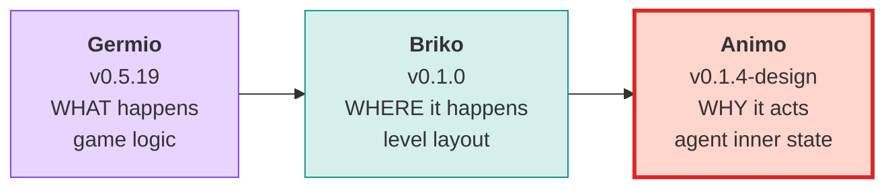

### 1.2 Library Identity

| Item                  | Value                        |
| --------------------- | ---------------------------- |
| Package name          | `com.studiomeowtoon.animo`   |
| GitHub (current)      | `github.com/hiroxpepe/animo` |
| GitHub (future)       | `github.com/meowtoon/animo`  |
| License               | MIT                          |
| Minimum Unity version | 2022.3                       |

---

## 2. G+B+A Stack Philosophy

The making of a game can be split into **three questions**. Each question is given to one library.

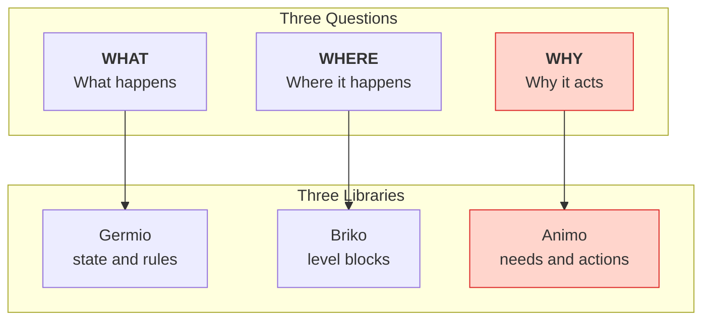

### 2.1 LLM-First Design

All three libraries take it for granted that **an LLM writes and changes the JSON files itself**. This sits at the heart of G+B+A.

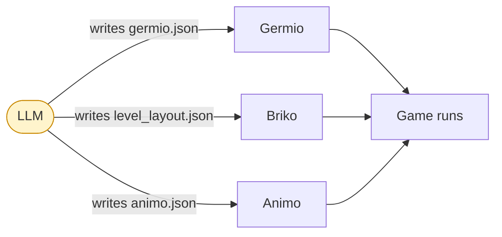

### 2.2 Inherited Design Rules

Animo holds to the same rules as Germio and Briko.

| Rule    | Content                                                                                              |
| ------- | ---------------------------------------------------------------------------------------------------- |
| **G16** | C# class names, JSON keys, Schema `$defs`, and the words an LLM sees all use the same name.          |
| **G17** | All visible JSON properties use `snake_case`.                                                        |
| **G18** | The layers of the namespace are fixed. What one layer needs from another never points the other way. |

### 2.3 Animo's Core Philosophy (re-defined in v0.1.1)

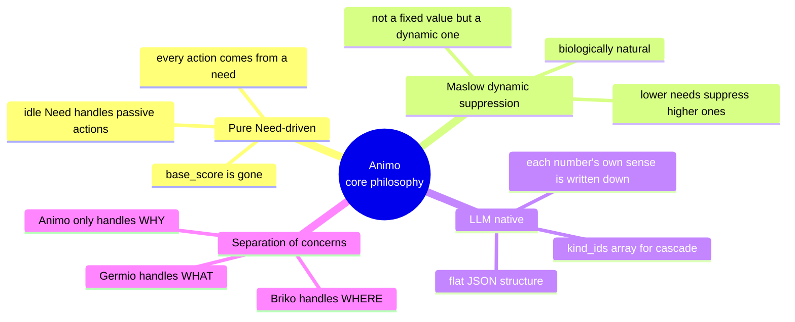

---

## 3. Architecture Overview

The build of Animo, from the inside, at a glance.

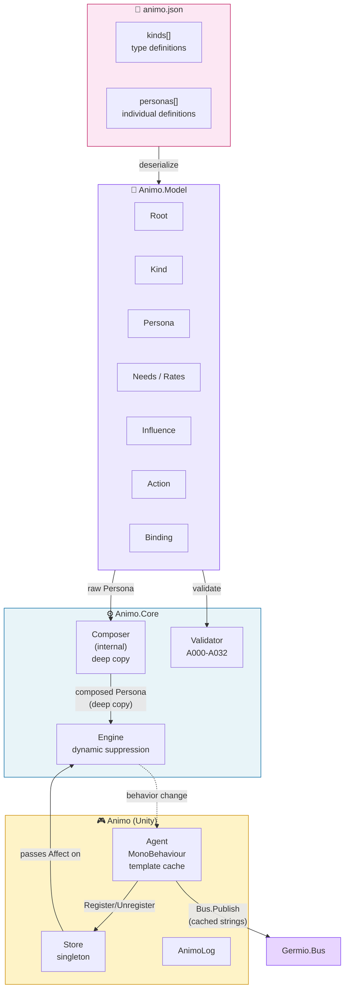

---

## 4. Namespace Hierarchy and Dependency Direction

**G18 holds firm.** A higher layer may use a lower layer. A lower
layer must not know of a higher one at all.

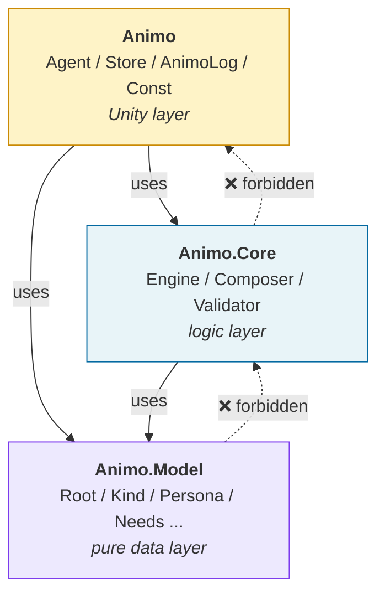

### 4.1 What Each Layer May Do

| Layer         | What it does                                              | What it may use             |
| ------------- | --------------------------------------------------------- | --------------------------- |
| `Animo.Model` | Plain data classes. Maps right onto the JSON's own shape. | nothing                     |
| `Animo.Core`  | The math and logic. Free of Unity. Easy to test.          | `Animo.Model`               |
| `Animo`       | Ties into Unity. MonoBehaviour, and the bridge to Germio. | `Animo.Core`, `Animo.Model` |

---

## 5. Full Class List

### 5.1 Class Cards (v0.1.4)

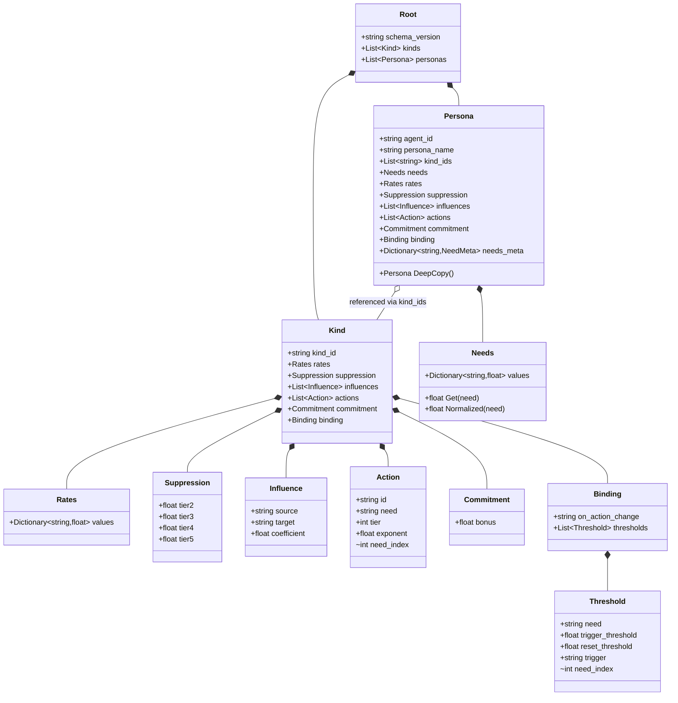

### 5.2 What Changed from v0.1.0

| Class                        | What changed                                                                                                                                                                                  |
| ---------------------------- | --------------------------------------------------------------------------------------------------------------------------------------------------------------------------------------------- |
| `Action`                     | Took away `base_score`, and made `need` a needed field (v0.1.1). Added the `internal int need_index` cache (v0.1.3).                                                                          |
| `Threshold`                  | Changed to a two-stage `trigger_threshold` / `reset_threshold` (v0.1.1). Added the `internal int need_index` cache (v0.1.3).                                                                  |
| `Needs`                      | ~~Added a `Clamp()` method (holds within [0, 100]) (v0.1.1).~~ Taken out in v0.1.5 (Q-S63) — dead since v0.1.2's move to the hot path's `float[] _needs` + `Mathf.Clamp` right at the source. |
| `Hysteresis` → `Commitment`  | The class's own name changed (v0.1.3). The field `decay` was taken out (v0.1.3).                                                                                                              |
| `Engine`                     | **Lock / Unlock added to its own API (v0.1.4)**                                                                                                                                               |
| `Animo.Tools.ScenarioRunner` | **A new class (v0.1.4)** — a simulator that runs with no real device at all.                                                                                                                  |
| `LockMode` enum              | **A new enum (v0.1.4)** — Hard / Soft.                                                                                                                                                        |

### 5.3 The Full Table of Classes

| Namespace     | Class            | What it does                                                                         | Who may see it |
| ------------- | ---------------- | ------------------------------------------------------------------------------------ | -------------- |
| `Animo.Model` | `Root`           | the root of the JSON                                                                 | public         |
| `Animo.Model` | `Kind`           | a type's own definition                                                              | public         |
| `Animo.Model` | `Persona`        | one, single definition                                                               | public         |
| `Animo.Model` | `Needs`          | the set of Need values (a JSON-bridge shape; v0.1.5 Q-S63 took out a dead `Clamp()`) | public         |
| `Animo.Model` | `Rates`          | how fast each Need changes                                                           | public         |
| `Animo.Model` | `Suppression`    | how much a tier holds another back (worked out live)                                 | public         |
| `Animo.Model` | `Influence`      | one Need's own effect on another                                                     | public         |
| `Animo.Model` | `Action`         | an act's own definition (needs a `need`; no `base_score`)                            | public         |
| `Animo.Model` | `Commitment`     | the bonus for staying with an act (never fades)                                      | public         |
| `Animo.Model` | `Binding`        | the tie to Germio                                                                    | public         |
| `Animo.Model` | `Threshold`      | a two-stage point that fires a signal                                                | public         |
| `Animo.Core`  | `Composer`       | puts a Kind together with a Persona (with a deep copy)                               | **internal**   |
| `Animo.Core`  | `Engine`         | the AI's own math (holding tiers back, live, plus Lock)                              | public         |
| `Animo.Core`  | `Validator`      | checks animo.json (A000–A039)                                                        | public         |
| `Animo.Core`  | `LockMode`       | an enum: Hard / Soft (v0.1.4)                                                        | public         |
| `Animo`       | `Agent`          | a MonoBehaviour holder (keeps its own template cache)                                | public         |
| `Animo`       | `Store`          | the one place every Agent is kept (a singleton)                                      | public         |
| `Animo`       | `AnimoLog`       | writes a record                                                                      | public         |
| `Animo`       | `Const`          | the fixed values of this domain                                                      | public static  |
| `Animo.Tools` | `ScenarioRunner` | a simulator with no real device (v0.1.4)                                             | public         |
| `Animo.Tools` | `TraceResult`    | what a simulation gave back (v0.1.4)                                                 | public         |
| `Animo.Tools` | `TraceFrame`     | a snapshot of state, for one frame (v0.1.4)                                          | public         |
| `Animo.Tools` | `AffectEvent`    | an Affect call, given a fixed time to fire (v0.1.4)                                  | public         |

---

## 6. animo.json Schema

### 6.1 Full Sample (v0.1.4)

```json
{
  "schema_version": "1.4",
  "kinds": [
    {
      "kind_id": "goblin",
      "rates": {
        "hunger": 2.0, "fatigue": 1.5, "fear": -2.0,
        "loneliness": 1.2, "confidence": -0.3,
        "curiosity": 0.8, "idle": 0.5, "frustration": -1.0
      },
      "suppression": {
        "tier2": 0.30, "tier3": 0.50, "tier4": 0.70, "tier5": 0.90
      },
      "influences": [
        { "source": "fear",        "target": "confidence", "coefficient": -0.60 },
        { "source": "fear",        "target": "curiosity",  "coefficient": -0.50 },
        { "source": "hunger",      "target": "fear",       "coefficient":  0.25 },
        { "source": "frustration", "target": "fear",       "coefficient":  0.30 },
        { "source": "frustration", "target": "confidence", "coefficient": -0.40 }
      ],
      "actions": [
        { "id": "Flee",       "need": "fear",      "tier": 2, "exponent": 2.5 },
        { "id": "SearchFood", "need": "hunger",    "tier": 1, "exponent": 1.8 },
        { "id": "Rest",       "need": "fatigue",   "tier": 1, "exponent": 1.5 },
        { "id": "Patrol",     "need": "idle",      "tier": 5, "exponent": 1.0 }
      ],
      "commitment": { "bonus": 10 },
      "binding": {
        "on_action_change": "animo_{agent_id}_{behavior}",
        "thresholds": [
          {
            "need": "fear",
            "trigger_threshold": 80,
            "reset_threshold": 70,
            "trigger": "animo_{agent_id}_fear_critical"
          }
        ]
      }
    },
    {
      "kind_id": "scout",
      "influences": [
        { "source": "fear", "target": "confidence", "coefficient": -0.30 }
      ],
      "actions": [
        { "id": "Socialize", "need": "loneliness", "tier": 3, "exponent": 1.3 }
      ]
    }
  ],
  "personas": [
    {
      "agent_id": "goblin_scout_01",
      "persona_name": "Goblin Scout — Timid Skirmisher",
      "kind_ids": ["goblin", "scout"],
      "needs": {
        "hunger": 40, "fatigue": 20, "fear": 55,
        "loneliness": 60, "confidence": 35,
        "curiosity": 45, "idle": 30, "frustration": 0
      }
    }
  ]
}
```

### 6.2 JSON Key List (G16 match)

| C# class      | JSON key      | Form                     |
| ------------- | ------------- | ------------------------ |
| `Root`        | —             | (root, no key)           |
| `Kind`        | `kinds`       | array (plural)           |
| `Persona`     | `personas`    | array (plural)           |
| `Needs`       | `needs`       | object                   |
| `Rates`       | `rates`       | object                   |
| `Suppression` | `suppression` | object                   |
| `Influence`   | `influences`  | array (plural)           |
| `Action`      | `actions`     | array (plural)           |
| `Commitment`  | `commitment`  | object                   |
| `Binding`     | `binding`     | an object (one, alone)   |
| `Threshold`   | `thresholds`  | array (inside `binding`) |

### 6.3 Fields That May Be Left Out

| Key                                    | May it be left out?                   | Default                                                                                                                     |
| -------------------------------------- | ------------------------------------- | --------------------------------------------------------------------------------------------------------------------------- |
| `actions[].need`                       | ❌ **required** (changed from v0.1.0) | —                                                                                                                           |
| `actions[].base_score`                 | — **removed** (v0.1.0 → v0.1.1)       | —                                                                                                                           |
| `commitment.bonus`                     | ✅                                    | `0.0` (v0.1.3: the `commitment` object itself can be omitted)                                                               |
| `commitment.decay`                     | — **removed** (v0.1.3)                | —                                                                                                                           |
| `binding.on_action_change`             | ✅                                    | engine default `animo_{agent_id}_{behavior}`                                                                                |
| `binding.thresholds[].reset_threshold` | ✅                                    | `Math.Max(0.0, trigger_threshold - 5.0)` (Q-S11; held at a floor of 0, so the reset can never sit past reach — see §11.3.4) |
| `kind_ids`                             | ✅                                    | empty array (no composition)                                                                                                |
| A Persona's own `rates`, and the rest  | ✅                                    | taken from the `Kind`                                                                                                       |

### 6.4 The schema_version, Brought Up to Date

`"1.3"` → `"1.4"`. **This carries no break at all** (nothing that
was there before stops working). It adds the `frustration` Need,
and the `Lock` API.

---

## 7. Kind × Persona Cascading

### 7.1 Idea: CSS-style Last-Wins Cascade

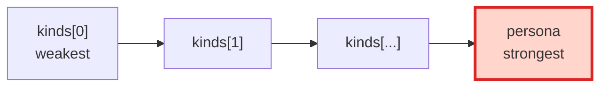

### 7.2 Rules for Putting Together (made clearer in v0.1.1)

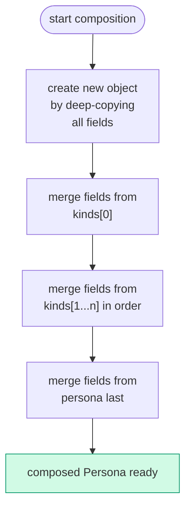

| Target                             | How they are merged                                                                        | Note                                                                                                        |
| ---------------------------------- | ------------------------------------------------------------------------------------------ | ----------------------------------------------------------------------------------------------------------- |
| Dictionary (`needs`, `rates`)      | the last one given wins, key by key                                                        | key by key                                                                                                  |
| Array (`actions`)                  | the Persona's own order is kept; the last one given wins (Q-S19) — see note below          | the last one given wins, on value; the Persona's own order comes first; only adding is ever allowed (Q-S61) |
| Array (`influences`)               | the Persona's own order is kept; the last one given wins (Q-S20) — see note below          | the last one given wins, on value; the Persona's own order comes first                                      |
| Array (`thresholds`)               | matched by the pair `(need, trigger_threshold)`, with a small allowed gap — see note below | (Q-S14 + Q-S43 + Q-S47) more than one threshold, on the same Need, is now allowed                           |
| Dictionary (`needs_meta`)          | the last one given wins, key by key (by the Need's own name)                               | (Q-S30) a Persona's own `needs_meta` writes over a Kind's own, key by key                                   |

**On `actions` (v0.1.5, Q-S19):** start from `persona.actions[]`, in
the order given; for each Kind action whose `id` does not show in
the Persona, add it at the end, in the Kind's own cascade order;
for each Kind action whose `id` *does* show in the Persona, drop
the Kind's own copy (the Persona's own value wins; its place stays
fixed by the Persona). Before Q-S19, the rule put the Kind first
("a known id writes over; a new id is added at the end"), which
let a Kind's own order quietly push out the LLM's own, intended
first choice — a straight clash with Q-S9's rule of breaking ties
by the order given. **(Q-S61: a Persona can NEVER take away a
Kind's own Action, merely by leaving it out — every Kind Action
whose `id` is missing from the Persona is still added, at the
end.)** This is by design: adding on is always allowed; taking
away is not — so a child Persona, built from a Kind, can never, by
accident, lose a fallback it truly needs (such as `Idle`), simply
by saying nothing about it. To write "use Kind A, but without one
of its Actions," split Kind A into a core part (with no such
Action) and an extra part (with it), and take only the part that
is needed — this keeps any true removal a plain, open choice, made
right in the JSON itself, where it can be seen and checked.

**On `influences` (v0.1.5, Q-S20):** the same shape as the
`actions` rule above — start from `persona.influences[]`, in the
order given, and add any Kind influence whose `(source, target)`
pair is not yet there, dropping any Kind copy whose pair matches
the Persona's own. Keeping the Persona's own order first is what
makes the steady topological sort of §8.6.2 give the same answer
every time: an edge with nothing else to decide it falls back to
the order the Persona gave.

**On `thresholds` (v0.1.5, Q-S14 + Q-S43 + Q-S47):** matched by the
pair `(need, trigger_threshold)`, with a small gap it is allowed
to be off by, in the `float`; the last one given wins. More than
one threshold, on the same Need, is now allowed (say,
`fear=50 → "alerted"`, `fear=80 → "panic"`); the paired key keeps
one Need's high point from quietly writing over its own, separate
low point. **Q-S47 (a fix on Q-S43)**: the `trigger_threshold`
half of the pair is compared with
`Math.Abs(a - b) < THRESHOLD_KEY_EPSILON` (set, by default, at
`0.01f`), never with a plain `==`. Before Q-S43, a Kind giving
`trigger_threshold: 80.0`, with a Persona setting it, instead, to
`80.0001` (or any small drift left over from a round trip through
IEEE-754), made two thresholds, close but not quite the same, both
fire at once — the write-over quietly turned into a second copy,
not a real change. **Q-S47 fixes a weak point in Q-S43's own
reason for its choice**: Q-S43 used `EPSILON = 0.5f`, on the claim
that "a writer's own gap between points is always 5 or more, by
A035 / Q-S15" — but A035's own gap of 5 sits between a `trigger`
and its `reset`, on the SAME threshold, and gives NO promise at
all about the gap between two, separate thresholds on the same
Need. A writer setting `fear=80.0 → alert` and `fear=80.4 → panic`
would have had both points folded into one, by Q-S43's own,
far-too-wide window. `0.01f` covers the real drift from IEEE-754
(about `1e-7`), with three whole orders of size to spare, while
still keeping any real difference a writer meant, down to a
hundredth of a Need's own unit. A new rule, **A039** (a Warning),
points out any pair sitting within `1.0f` of each other, so the
writer can say whether that was truly meant.

**On `needs_meta` (v0.1.5, Q-S30):** the last one given wins, key
by key (by the Need's own name) — a Persona's own `needs_meta`
writes over a Kind's own, key by key. A Kind giving `oxygen` at
tier 1 can be written over by a Persona giving `oxygen` at tier 2
(say, for a stronger, part-machine kind of Persona).

#### 7.3.1 Threshold compound-key EPSILON comparison (v0.1.5, Q-S43 + Q-S47)

The paired key `(need, trigger_threshold)`, used when joining `thresholds` together, compares its float half with `Math.Abs(diff) < THRESHOLD_KEY_EPSILON` (= `0.01f`, per Q-S47, a fix on Q-S43's own, first `0.5f`), never with a plain `==`. Example code, only to show the idea, for the merge:

| Step | What it does |
| --- | --- |
| 1 | Two thresholds are said to match should their `need` be the same, AND `Math.Abs(a.trigger_threshold - b.trigger_threshold) < THRESHOLD_KEY_EPSILON` (set at `0.01f`). |
| 2 | For each Persona threshold, go through the merged-so-far list, IN ORDER, and find the FIRST entry that matches (v0.1.5, Q-S85). |
| 3 | Should a match be found, the Persona's own threshold writes over that entry. Should no match be found, the Persona's own threshold is added to the end. |

**(v0.1.5, Q-S85) IMPORTANT: this match does NOT carry over.** Should
A=80.000, B=80.006, C=80.012, then A matches B (a gap of 0.006 <
0.01) and B matches C (a gap of 0.006 < 0.01), but A does NOT match
C (a gap of 0.012 ≥ 0.01). So that a merge gives the same result,
no matter the order it is given in, the merge holds to the rule of
**the first one found, wins**: the FIRST entry that matches, in the
merged-so-far list, is the one written over (a Persona wins over a
Kind). Any second match is left as it is, with no word given — A039
shows a Warning, for two thresholds sitting close, at check time,
but the merge is already done by then. This gives:

+ The same output, every time: the same input list gives the same
  output.
+ The Persona's own place kept first (a Persona's own match always
  writes over the first Kind threshold found).
+ The gap that does not carry over cannot spring a surprise that
  turns on order, such as "C folds into A, or C stays apart,
  resting only on whether B was worked through first."

The check, of whether one threshold matches another, runs once,
for each Persona threshold; since `thresholds` stays small (10 or less, in real use), this costs less than a lookup keyed by a
pair holding a float, which breaks easily.

**A fix on the reason behind Q-S47.** Q-S43 first used `EPSILON = 0.5f`, on the claim that *"a writer's own gap between points is always 5 or more, by A035 / Q-S15"*. Q-S47 catches that this reason mixed up two, different things: A035's own gap of 5 sits between **`trigger_threshold` and `reset_threshold`, on the same Threshold** (the hysteresis window), NOT between two, separate Thresholds, with different triggers, on the same Need. **The spec gives no promise at all** about the gap between two, separate thresholds. A writer setting `fear=80.0 → alert` and `fear=80.4 → panic` would have had both points folded into one, by Q-S43's own, far-too-wide `0.5f` window — quietly losing two points the writer meant to keep apart.

`0.01f` is the window, once fixed:

+ **Three whole orders of size, over the real drift from a JSON round trip through IEEE-754** (about `1e-7`, at the `[0, 100]` scale) — that small a drift can never cross this gap.
+ **Keeps any real difference the writer meant, down to a hundredth of a Need's own unit** — `80.0` and `80.4` no longer fold into one.
+ **A true, repeated point, given by both sides, still folds into one, as it should** — `80.0` and `80.0001` (the same point in mind, with only drift between them) merge to one (the Persona's own value wins).

**A new Validator rule, A039 (adding to Q-S47).** A Stage-2 Warning fires when two, separate thresholds, on the same Need, sit within `1.0f` of each other:

```text
For each composed Persona's binding.thresholds[]:
  Group by need.
  Within each group, sort by trigger_threshold ascending.
  For each adjacent pair, if (next.trigger_threshold - prev.trigger_threshold) <= 1.0f:
    Emit A039 Warning: "Sibling thresholds on Need `{need}` at
    triggers {a} and {b} are within 1.0f of each other — these
    may have been intended as the same milestone. If distinct,
    confirm; if not, remove one."
```

(v0.1.5, Q-S105: before Q-S105, this example code wrote `next.trigger - prev.trigger`, but `Threshold.trigger` is, in fact, the `string` field holding the event's own name; the real, `float` number field is `trigger_threshold`. Copied straight, this would have hit a "cannot take one string from another" build error. Q-S105 sets it right, everywhere in this example, to the one, clear `trigger_threshold`.)

A039 is a Warning, not an Error, since two points sitting close together CAN be truly meant that way (say, a stress curve that rises fast, and truly needs both `78 → murmur` and `79 → audible_panic`). The `1.0f` point, past which this Warning fires, sits on the safe side — well above the `0.01f` point where EPSILON folds two points into one, and well below where most writers, in practice, space their own points. A pair sitting in the quiet middle ground (`0.01f` to `1.0f`) is left as it is; only a pair close enough to raise doubt is shown to the writer.

### 7.4 An Example of Merging Two Objects

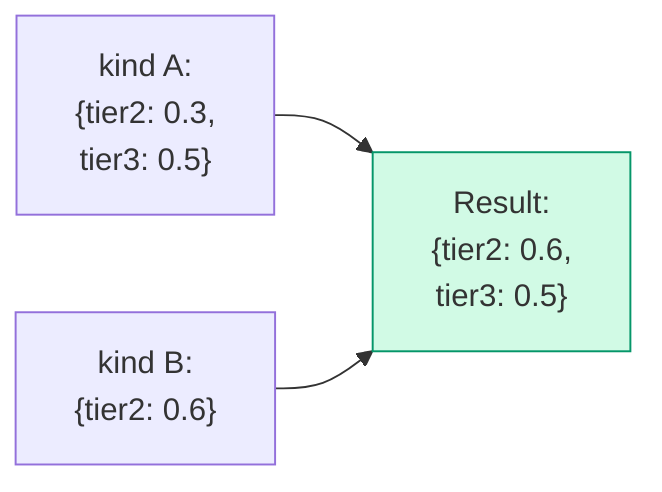

`tier2` is written over; `tier3` stays as it was. **Never the whole object, replaced as one.**

### 7.5 An Example of Merging Two Arrays

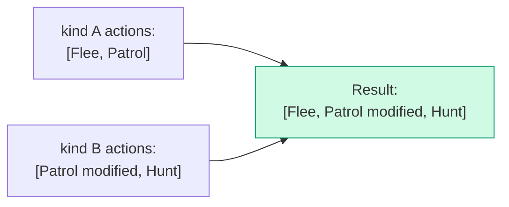

`Patrol` is replaced by kind B's own version. `Flee` stays as it was. `Hunt` is added.

### 7.6 An Example of More Than One Line of Descent: "Japanese × A-type × Male → Yamada Taro"

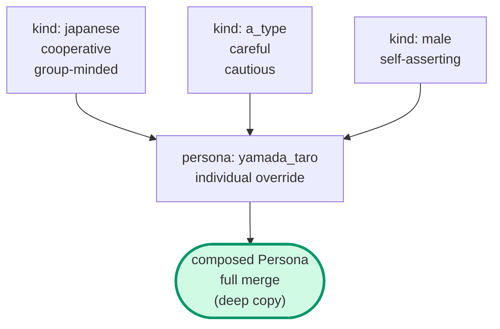

### 7.7 Working Out an Answer, and Doing the Math, Stand Apart

The LLM only writes the order of the `kind_ids` array. The real cascade math runs inside `Composer`.

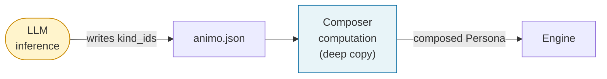

### 7.8 The Default Given to a Need Named, but Not Set (from Gemini's own point D-2)

If a `Kind` names a Need's own key in `rates`, `influences`, or `actions`, that is not set at all in the `Persona`'s own `needs`:

```text
The default value, for a Need's own key that is named but not set, is 0.0
```

The runtime gives a Warning (A020a/b/c), but the game keeps running, all the same. `Composer` adds `needs[missing_key] = 0.0` on its own.

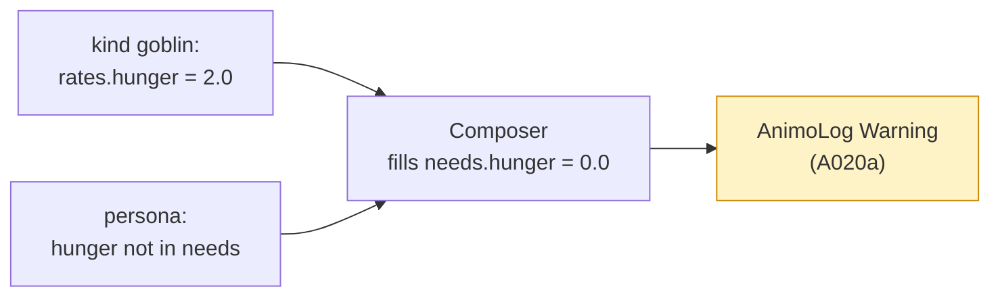

---

## 8. Engine Internal Design

### 8.1 Public API

| Kind        | Name                                                         | Purpose                                                                                                                                                                                                                            | Added                                                      |
| ----------- | ------------------------------------------------------------ | ---------------------------------------------------------------------------------------------------------------------------------------------------------------------------------------------------------------------------------- | ---------------------------------------------------------- |
| Constructor | `Engine(Persona persona)`                                    | takes a fully composed `Persona` from `Composer`                                                                                                                                                                                   | v0.1.0                                                     |
| Method      | `Affect(string need, float delta, bool force_reset = false)` | an outside push (see §8.7, §10.2). `NaN` delta and empty/null need throw; ±Inf delta clamps; unknown need warns + does nothing at all (v0.1.5)                                                                                     | v0.1.0                                                     |
| Property    | `behavior`                                                   | current action (string)                                                                                                                                                                                                            | v0.1.0                                                     |
| Method      | `Lock(float duration, LockMode mode = LockMode.Hard)`        | behavior lock (see §23). `duration = 0` is immediate Unlock; `duration < 0` throws; re-Lock replaces (v0.1.5)                                                                                                                      | **🆕 v0.1.4**                                              |
| Method      | `Unlock()`                                                   | release the lock; does nothing at all if not locked (v0.1.5)                                                                                                                                                                       | **🆕 v0.1.4**                                              |
| Property    | `is_locked`                                                  | lock state (bool)                                                                                                                                                                                                                  | **🆕 v0.1.4**                                              |
| Property    | `locked_behavior`                                            | locked action (string)                                                                                                                                                                                                             | **🆕 v0.1.4**                                              |
| Method      | `GetNeed(string need)`                                       | read the **effective** value of one Need (post-Influence-cascade per Q-S23). Returns `0.0` for unknown needs after a Warning. Read-only debug API; not for the hot path (use the cached `EffectiveNeeds` buffer in §15.4 instead). | **🆕 v0.1.5; its own sense fixed to `effective` in Q-S54** |
| Method      | `GetBaseNeed(string need)`                                   | read the **base** (pre-cascade) value of one Need. Stands beside `GetNeed`; inspector tools display both layers. Returns `0.0` for unknown needs after a Warning. Read-only debug API.                                             | **🆕 v0.1.5 (Q-S54)**                                      |

### 8.2 The 5 Steps of Live() (v0.1.3 + v0.1.4 Lock + v0.1.5 where the timer sits)

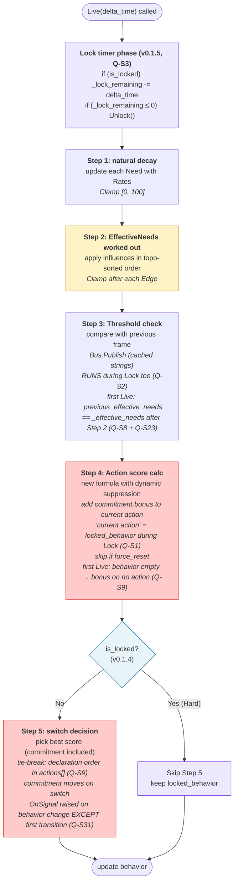

The **Lock timer stage (T0)** runs **before** Step 1, every frame. Placing the count-down right at the head means the Lock check, between Step 4 and Step 5, sees the *right-now* lock state, for this very frame: on the frame `_lock_remaining` reaches zero, the new `behavior` is picked by Step 5, in the **same** frame — with no wait of one frame, for the next `Live(delta_time)`. This matters, for a Zelda-like stop-in-place after a hit, or a chain of moves cut short (§19.1), where an output, one frame old, feels sticky, and wrong.

This also makes what `Lock(0)` (Q9) does, plain and steady: `Lock(duration: 0)` simply sets `_lock_remaining = 0`. Since `is_locked` is worked out fresh, each time, as `_lock_remaining > 0` (not held in its own, separate field), reading it right after gives `false`, at once — **no special path, inside `Lock`, is ever needed at all**. The Lock timer stage (T0), on the next `Live(delta_time)`, does nothing at all (it is at 0 already); doing nothing does not flip `is_locked`, since nothing crossed zero (it sat there, already). Before Q-S126, this same point could be read as "is_locked stays true, until the next Live(delta_time)", which would have called for `Lock` to treat `duration == 0` as a special case, and call `Unlock()` itself — but working the value out fresh, each time, means it never has to be added. (v0.1.5, Q-S126: this is only a point made clearer — the real build stays as it was; the test `LockEdgeCaseTests.Case01`, asking that `is_locked == false` right after `Lock(0)`, is already met, with no special path at all.)

#### 8.2.0a First Frame Contract (v0.1.5, Q-S8 + Q-S9)

The very first `Live(delta_time)`, right after `new Engine(persona)`, runs through the same five steps as any other frame — but two promises hold true only at this, the very first, start:

+ **Step 3 (Q-S8 + Q-S23)**: `_previous_effective_needs` was given its own, first values, in the Engine's own constructor, by running one Step 2 pass over the Needs at spawn (§15.6), so, on the very first `Live(delta_time)`, `_previous_effective_needs[i] == _effective_needs[i]`, for every single `i`. No Need is shown as having "risen this very frame", and no Threshold can fire when it should not. A Persona spawned with `fear: 80` does **not** cry out the moment the scene loads — only a real, true rise, after spawn, fires it. Q-S23 also closes a break in the chain: a rise in `_effective_needs`, driven by an Influence, now drives a Threshold's own firing too, fixing the §24.5.3 chain, from frustration to anger, that, before Q-S23, could never be seen by the Bus at all.
+ **Step 5 (Q-S9)**: `behavior` reads `""`, before the first `Live` ever runs (§8.1). Step 4's own `commitment.bonus` adds to no act, this frame at all (the "act right now" does not, in fact, exist yet). Every act competes on its own, plain score. If two or more acts tie at the highest score (exactly what happens when every Need reads `0.0` at spawn — every act's own `intensity` is `0`, so every act's own score is `0`), **the act whose own `id` comes first, in the persona's own `actions[]` array, wins**. This makes the act, at the moment of spawn, always the same, every time: put `Idle` (or whatever else is meant as the true default) at index 0 of `actions[]`.

#### 8.2.1 Step Changes by Version

| Step   | v0.1.2                        | v0.1.3                                     | v0.1.4                                   |
| ------ | ----------------------------- | ------------------------------------------ | ---------------------------------------- |
| Step 3 | Hysteresis decay (time)       | Threshold check                            | (same as v0.1.3)                         |
| Step 4 | add hysteresis_bonus          | add commitment.bonus (skip if force_reset) | (same as v0.1.3)                         |
| Step 5 | switch only if hysteresis = 0 | best score (commitment included)           | **skip if `is_locked` (Lock mechanism)** |

### 8.3 Maslow's Own Holding-Back, Worked Live (made sharper through v0.1.1, v0.1.2, v0.1.3)

#### 8.3.1 The Old Defect (up to v0.1.0)

The old formula:

```text
score = Pow(intensity, exp) × (1 - suppression[tier]) × 100 + base_score + hysteresis_bonus
```

`suppression[tier]` sat as a fixed value. So Maslow's own, core idea — "a low Need, still unmet, holds a higher one back" — **did not, in truth, work at all**.

#### 8.3.2 v0.1.1 Improvement

Made `suppression_amount` depend on the highest, made-even Need, from a lower tier:

```text
suppression_amount[tier] = suppression_factor[tier] × max_lower_tier_intensity
```

But, in v0.1.1, Hysteresis sat **outside** the holding-back. **Hysteresis broke Maslow's own, whole-or-nothing rule.**

#### 8.3.3 v0.1.2 Formula

Moved Hysteresis **inside** the holding-back:

```text
score = (Pow(intensity, exp) × 100 + hysteresis_bonus) × (1 - suppression_amount[tier])
```

#### 8.3.4 v0.1.3 Final Form — Reference Source Clarified

Gave `hysteresis_bonus` a new name: `commitment_bonus`:

```text
score = (Pow(intensity, exp) × 100 + commitment_bonus) × (1 - suppression_amount[tier])
```

And **stated, in plain words, where `max_lower_tier_intensity` truly comes from: EffectiveNeeds.**

```text
max_lower_tier_intensity = max(
    eff_needs[tier1 needs] / 100,
    eff_needs[tier2 needs] / 100,
    ...,
    eff_needs[(tier-1) needs] / 100
)
```

The set of "tier-N Needs" is read from
`Animo.Const.NEED_INDICES_BY_TIER` (v0.1.5, Q-S16). A standard Need
takes part, following the §13.3 table; a Need outside the
standard set (an A019 Warning) is left out. `frustration` sits at
tier 2, right alongside `fear`, and takes part, even where it has
no `Action` of its own at all.

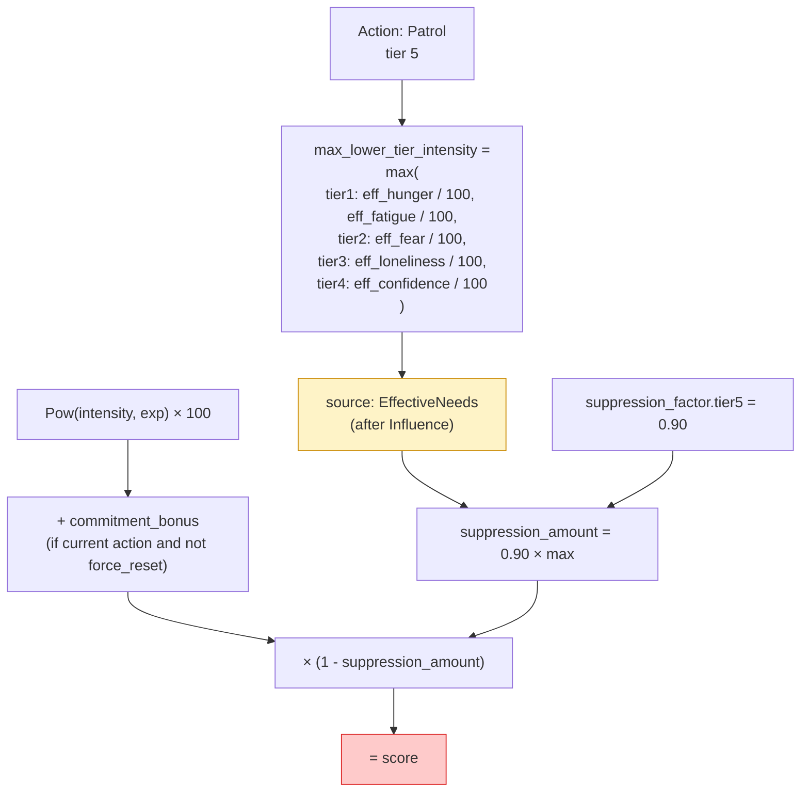

**Why EffectiveNeeds is the true source:**

+ It fits Animo's own core idea: "the final, inner state drives the act."
+ The `intensity` inside the score also reads from EffectiveNeeds (so the two stay in step).
+ A Need that an Influence has raised is still part of the true, inner state.
+ It keeps a builder from a real mistake, of reading the `_needs` array instead.

#### 8.3.5 Behavior Simulation with v0.1.3 Formula

Set up as: `Daydream` (idle, tier=5), `SearchFood` (hunger, tier=1, exp=1.8), `commitment.bonus = 50`, `suppression_factor.tier5 = 0.90`.

| State             | hunger | idle | suppression_amount | Daydream score    | SearchFood score | Choice            |
| ----------------- | ------ | ---- | ------------------ | ----------------- | ---------------- | ----------------- |
| peaceful          | 20     | 70   | 0.18               | (70+50)×0.82=98.4 | 6.9              | Daydream ✅       |
| a touch of hunger | 50     | 70   | 0.45               | (70+50)×0.55=66.0 | 32               | Daydream ✅       |
| serious hunger    | 70     | 70   | 0.63               | (70+50)×0.37=44.4 | 53               | **SearchFood ✅** |
| starving          | 100    | 70   | 0.90               | (70+50)×0.10=12.0 | 100              | SearchFood ✅     |

**"Eat, once hungry" wins, all on its own, even where the commitment stands high. Maslow's own rule holds firm.**

#### 8.3.6 Tier 1 Special Case

A tier-1 act has no lower tier at all. So `max_lower_tier_intensity = 0`, and `suppression_amount = 0`. Nothing holds it back at all. An act tied to real survival is always free to fire.

### 8.4 Full Utility Score Formula (v0.1.3 final, used in v0.1.4)

```text
score = (Pow(intensity, exponent) × 100 + commitment_bonus) × (1 - suppression_factor[tier] × max_lower_tier_intensity)
```

| Variable                   | Range   | Meaning                                                                                                |
| -------------------------- | ------- | ------------------------------------------------------------------------------------------------------ |
| `intensity`                | 0.0–1.0 | the Need's own strength, made even, after EffectiveNeeds                                               |
| `exponent`                 | 0.1–5.0 | the shape of the act's own curve of response                                                           |
| `suppression_factor[tier]` | 0.0–1.0 | the most this tier can ever be held back                                                               |
| `max_lower_tier_intensity` | 0.0–1.0 | the highest, evened-out EffectiveNeed, from a lower tier                                               |
| `commitment_bonus`         | 0.0–∞   | a bonus, added only to the act picked right now (never fades). Treated as 0, while `force_reset` runs. |

`base_score` was taken out in v0.1.1. `hysteresis_*` was given the new name `commitment_*`, in v0.1.3.

### 8.5 The Exponent's Own Curve of Feeling

#### 8.5.1 The Math

`Pow(intensity, exponent)`, with intensity set between 0 and 1: the curve's own shape rests on the exponent.

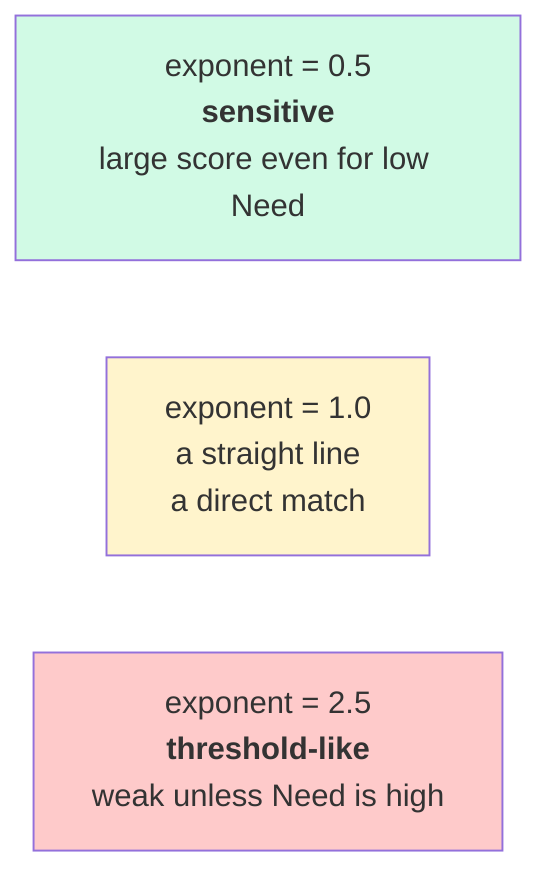

#### 8.5.2 Concrete Values

| intensity | exp=0.5 | exp=1.0 | exp=2.0 | exp=2.5 | exp=5.0 |
| --------- | ------- | ------- | ------- | ------- | ------- |
| 0.1       | 0.316   | 0.100   | 0.010   | 0.003   | 0.00001 |
| 0.3       | 0.548   | 0.300   | 0.090   | 0.049   | 0.002   |
| 0.5       | 0.707   | 0.500   | 0.250   | 0.177   | 0.031   |
| 0.7       | 0.837   | 0.700   | 0.490   | 0.410   | 0.168   |
| 0.9       | 0.949   | 0.900   | 0.810   | 0.768   | 0.590   |
| 1.0       | 1.000   | 1.000   | 1.000   | 1.000   | 1.000   |

#### 8.5.3 What This Means for the LLM

| Wanted behavior                | Use exponent |
| ------------------------------ | ------------ |
| sensitive, reacts early        | around 0.5   |
| direct, matched to the amount  | 1.0          |
| needs to be a bit high to fire | 2.0          |
| holds back, then bursts out    | 3.0–5.0      |

The full table stands in §18 (the LLM's own quick reference).

### 8.6 EffectiveNeeds Cascade (v0.1.2 final)

#### 8.6.1 Old Bug: Array-Order Dependence (v0.1.0)

In v0.1.0, each `influences` entry was worked through in the array's own order. A different order gave a different, real result.

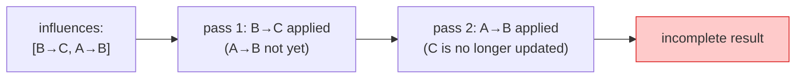

#### 8.6.2 The v0.1.2 Fix (replaces v0.1.1's own way of running through it again)

**The v0.1.1 way out (now taken away):** if a cycle turned up, run through it three times, in a row. This carried a real risk, in the math (a swing back and forth, or a drift with no end).

**The v0.1.2 way, in its final form, made sharper in v0.1.5 (Q-S20 → Q-S24):**

1. **Build the graph of EDGES, each depending on another** (v0.1.5, Q-S24): one point, for each `Influence` (an Edge), in the composed `influences[]`. For every pair of edges, `e1` and `e2`, add the rule `e1 ≺ e2`, where `e1.target == e2.source` (that is: `e1` writes into the very Need that `e2` reads from). **This is NOT the same as a graph of Needs, depending on one another** — a Need's own graph runs `source → target`, which would give back an order for *working through* each Need; that order would group together every edge that shares one `source`, quietly breaking the LLM's own `influences[]` array order, across different sources. Q-S20 gave its word that the array's own order was the one key to a steady result; only a graph, built at the level of the Edge, keeps that word true.
2. **A check for a cycle.** If the Edge's own graph holds a cycle, the Validator gives an **Error** (A025). The runtime never even starts. Note: a cycle, at the level of the Edge, is, in the math, the very same thing as a cycle at the level of the Need (a cycle in the Edge's own half-order is the same as a cycle in the Need's own source→target graph), so A025's own two-stage check (Q-S17) still fires right, no matter which way it is put.
3. **A steady sort, by depending-on, over the edges** (v0.1.5, Q-S20 + Q-S24): holds to every `e1 ≺ e2` rule, AND, for two edges with no tie of depending on each other, keeps the order the *composed* `influences[]` was given, in §7.3. That composed order itself keeps the Persona's own order first (Q-S19/S20), so the LLM's own, written order is the one, steady way to break a tie, between two edges with no other tie between them.
4. **One pass, alone, works through them**, in that order — one `_effective_needs[target] += coefficient * _effective_needs[source]`, for each edge, in the order the sort gave.
5. **Held within [0, 100], right after each Edge** (the next part below).

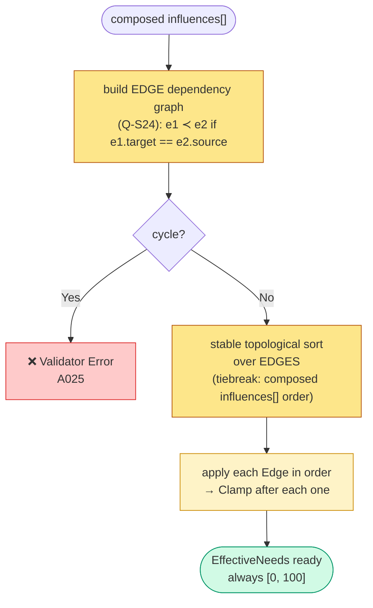

#### 8.6.3 Why Mid-Cascade Clamp Matters (v0.1.2 made this explicit)

For `A → B (-1.0)`, `B → C (+1.0)`, with A at 100 and B at 50:

| Clamp timing                                    | B mid-value        | effect on C      | C final              | Verdict  |
| ----------------------------------------------- | ------------------ | ---------------- | -------------------- | -------- |
| only after every pass, at the end               | -50 (for a moment) | passes on as -50 | wrongly brought down | ❌ a bug |
| **right after each Edge** (v0.1.2's own choice) | held at 0          | passes on as 0   | left as it was       | ✅ right |

**Why:** in a real, living thing, "nothing at all" can never push "something." A value below zero, part way through, must never be passed on.

#### 8.6.4 Cycle Detection → Error (replaces v0.1.1 iteration)

A cycle, such as `fear → confidence → fear`, is **turned down, as an Error, by Validator A025.**

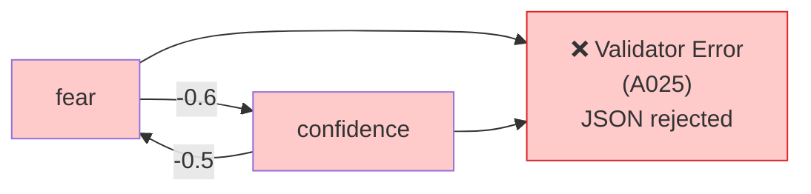

**Why:**

+ Running through it, again and again, with nothing to slow it down, is a real risk, in the math (a swing back and forth, or a drift with no end).
+ A rate of learning, α (in the style of PageRank), asks too much thinking of the LLM. Too much built, for too little gained.
+ A cycle is hard for a person, too, to make sense of ("A brings down B, B brings down A" feels like a loop with no end).
+ Look at this again, in v0.2, should a real, true need for it show up.

#### 8.6.4a Independent-Edge Order and Non-Commutativity (v0.1.5, Q-S20)

A sort by depending-on fixes the order set by what depends on what, but does NOT set any order at all between two edges with no tie between them. Taken together with the Clamp, part way through (§8.6.3), this means two edges, both aimed at the same Need, give a different, real answer, resting only on which one runs first:

```text
Setup: C = 90, X = 100, Y = 100
Edges: X → C (+0.5),  Y → C (-0.5)        // independent: no X→Y or Y→X dependency

Order X → Y:
  Apply X→C: C = clamp(90 + 50)     = 100  (saturates upward)
  Apply Y→C: C = clamp(100 - 50)    = 50

Order Y → X:
  Apply Y→C: C = clamp(90 - 50)     = 40
  Apply X→C: C = clamp(40 + 50)     = 90
```

A gap of 40 whole units, from the same graph, and the very same input. §25.2's own promise, of the same result every time (that ScenarioRunner can be run again, and again, with the same answer), falls apart, if a builder's own choice of sort is left free to decide this on its own.

**How this is settled (Q-S20 + Q-S24):** the sort, by depending-on, is **steady**, held against the *composed* `influences[]` order, AND the sort runs over **edges**, never over points (Q-S24, §8.6.2 step 1). The composed order, in its own turn, keeps the Persona's own order first, by §7.3 (Q-S19/S20). So:

| Source of order                                  | Provided by                                    | Determinism level                                                           |
| ------------------------------------------------ | ---------------------------------------------- | --------------------------------------------------------------------------- |
| A true tie of depending on (`X → Y → Z`)         | the `influences` graph                         | fixed, with no doubt at all (a cycle is caught in both stage 1 and stage 2) |
| Breaking a tie, where no tie of depending exists | the composed `influences[]` (Persona first)    | fixed, with no doubt, given the spec's own merge rule                       |
| The order it is finally worked through in        | a steady sort, by depending-on, over the above | fixed, with no doubt at all                                                 |

The LLM has exactly one thing it may set: the order of `influences[]`, in the JSON. Changing the JSON's own order changes the order things are worked through, and so, the real answer; changing anything else at all cannot.

**A matching rule (A037, §12.1):** where more than one edge writes into the same Need, give a **Warning**, saying that the real answer rests on the `influences[]` order, plus the Clamp, part way through. This shows the LLM's own writer a case where order matters, though the answer stays fixed each time, so the writer may choose, on purpose, to set a new order, or build it differently, to avoid the tie at all.

#### 8.6.5 Cascade Fix from Gemini

Reading from `eff` as the true source makes a chain, such as A→B→C, work as it should (already taken up, since v0.1.0):

The step, in words: work out `intensity`, from the source Need's own,
evened-out value; work it out, times the edge's own `coefficient`, and
by the source's own true value, to get `delta`; add `delta` to the
target Need, then hold the result within `[0, 100]`.

**(v0.1.5, Q-S116) Where the Clamp comes from.** The Engine lives
inside `Animo.Core`, whose own asmdef sets
`noEngineReferences: true`. `UnityEngine.Mathf` cannot be pointed
to at all, from here. The hot path's own Clamp must use
`System.Math.Clamp` (part of the BCL, since .NET Standard 2.1),
never `Mathf.Clamp`; a build using `Mathf.Clamp` inside
`Animo.Core` would fail, since the name `Mathf` does not exist,
there. The `Mathf.Clamp` form still stands, and is fine, inside
`Animo` (the layer that ties into Unity), where `UnityEngine` IS,
in fact, pointed to.

### 8.7 Affect() Behavior (force_reset re-defined in v0.1.3)

#### 8.7.1 Exact Meaning of force_reset (v0.1.3)

```text
force_reset: true → for ONE frame in the next Live(), do not add commitment_bonus to the current action.
                    (commitment itself is kept; just the protection is paused for one frame)
```

> **Not a switch, forced by hand. It is: "turn off the commitment's own defense, for one frame alone."**

#### 8.7.2 Flow

```mermaid
flowchart TB
  In(["Affect(need, delta, force_reset)"])
  Add["Needs[need] += delta<br/>Clamp [0, 100]"]
  Latch["_force_reset_pending |= force_reset<br/>(an OR, kept — never a plain set)<br/>(Q-S5, v0.1.5)"]
  Step4{"Live(delta_time) Step 4:<br/>_force_reset_pending?"}
  LockGate{"is_locked?<br/>(v0.1.5, Q-S10 + Q-S13)"}
  Skip["skip commitment_bonus<br/>for the current action<br/>(unlocked path only — Q-S13)"]
  Reset["After Step 4:<br/>_force_reset_pending = false<br/>(single clear point)"]
  Carry["keep _force_reset_pending<br/>(carry past Lock; commitment_bonus<br/>add proceeds normally on locked_behavior — Q-S13)<br/>(consume on first post-unlock Step 4)"]
  Keep["normal commitment_bonus add"]
  End(["Step 5: pure score competition<br/>(skipped while locked)"])
  In --> Add --> Latch --> Step4
  Step4 -->|"true"| LockGate
  LockGate -->|"unlocked"| Skip --> Reset --> End
  LockGate -->|"locked (Hard or Soft)"| Carry --> End
  Step4 -->|"false (default)"| Keep --> End
  style Latch fill:#e8f4f8,stroke:#0369a1
  style LockGate fill:#fde68a,stroke:#b45309
  style Skip fill:#fef3c7,stroke:#ca8a04
  style Reset fill:#ede9fe,stroke:#7c3aed
  style Carry fill:#fee2e2,stroke:#b91c1c
```

**How Q-S13 reads:** the `LockGate` stands **before** `Skip`, in the flow (not after, as Phase_2_4_6 had it, by mistake). While locked, neither the skip of the commitment's own bonus, nor the clearing of the flag, runs at all — Step 4 goes on as though `_force_reset_pending == false`, for as long as the lock holds, keeping true to `force_reset`'s own promise of "exactly **one frame**" (§8.7.1). The flag is honored on the very first Step 4, right after unlocking, where Skip and Reset run together, exactly once.

#### 8.7.2.1 The Promise, With More Than One Call (v0.1.5, Q-S5)

Where more than one `Affect` is called, within the same frame (a common case — more than one game system sends a push, each `Update`), the flag holds true to **an OR of its own past state**:

Inside `Engine.Affect`, the flag is set with an OR against its own
past state (`_force_reset_pending |= force_reset`), never with a
plain set (`_force_reset_pending = force_reset`) — a plain set
would be a bug, since it could clear a `true` set moments before.

A later call to `Affect(_, _, force_reset: false)` **must never clear** a `true` already held from before. The flag is cleared in exactly one place: right after Step 4, inside `Live(delta_time)` — **and only where the engine is not locked**. While it is Hard- or Soft-locked, the clear is held back, and the flag lives on, until the first Step 5, right after unlocking, takes it up (see §23.4.2). This makes "I called for a true, right-now need, this frame" stay true, until the engine *truly honors* it, no matter the order calls came in, or the state of the lock.

A real failure this flag stops from happening: should a game, in
one frame, call `Affect("fear", +30, force_reset: true)`, then, a
moment later in the same frame, call a routine tick such as
`Affect("hunger", +5)` (with no `force_reset` given), the OR keeps
the true, right-now flag alive — with no OR, that routine tick
would quietly wipe out fear's own, right-now flag, and the true,
right-now need would never fire, in Step 4, as it was meant to.

#### 8.7.3 When to Use force_reset

| Situation             | How it is used                                                                  |
| --------------------- | ------------------------------------------------------------------------------- |
| The player is seen    | `Affect("fear", +50, force_reset: true)` — react, even where the NPC holds firm |
| Damage was taken      | `Affect("fear", +30, force_reset: true)` — a quick reaction                     |
| A normal, slow change | `Affect("hunger", +5)` — no force_reset at all                                  |

#### 8.7.4 Staying True to the Core Idea

"Affect changes the inner state; it never picks the act." This stays true, still. `force_reset` is its own, separate, clearly-set way to break in. **It never forces a switch — it only turns off the commitment's own defense, for one frame.** The real switch still happens in Step 5, where scores compete.

### 8.8 Commitment Behavior (made permanent in v0.1.3)

```mermaid
sequenceDiagram
  autonumber
  participant T as Time
  participant E as Engine
  participant B as behavior
  Note over E,B: behavior = "Patrol"<br/>commitment.bonus = 10 (always)
  T->>E: Live(delta_time)
  Note over E: +10 added to Patrol score every frame<br/>commitment does not decay
  T->>E: Affect("fear", +50)
  Note over E: Flee score rises<br/>(commitment stays on Patrol)
  T->>E: Live(delta_time)
  Note over E: Step 4: Patrol score = pure + 10<br/>      Flee score = pure
  Note over E: Step 5: switch if Flee > (Patrol + 10)
  alt Flee score > Patrol + 10
    E->>E: behavior = "Flee"<br/>commitment moves to Flee
    Note over E: From now: Flee score = pure + 10
  else stay
    Note over E: keep Patrol
  end
```

#### 8.8.1 What Changed from v0.1.2

| Item                  | v0.1.2                                | v0.1.3                                                          |
| --------------------- | ------------------------------------- | --------------------------------------------------------------- |
| Its own name          | `hysteresis`                          | `commitment`                                                    |
| Over time             | `bonus -= decay × delta_time` (fades) | **stays fixed, for good** (never fades)                         |
| Below-zero guard      | `Max(0, ...)` was needed              | never needed (nothing fades)                                    |
| The switch's own rule | only where bonus = 0                  | **a plain score, competing on its own (commitment counted in)** |

#### 8.8.2 True Chattering Prevention (CSS-style hysteresis)

```mermaid
flowchart LR
  PatPat["In Patrol:<br/>Patrol+10, held against Flee"]
  Switch1["Flee score > Patrol+10"]
  FleeFlee["In Flee:<br/>Flee+10 vs Patrol"]
  Switch2["Patrol score > Flee+10<br/>(needs even higher Patrol)"]
  PatPat -->|"switch threshold: +10"| Switch1 --> FleeFlee
  FleeFlee -->|"return threshold: +10 the other way"| Switch2 --> PatPat
  style FleeFlee fill:#fecaca
  style PatPat fill:#fef3c7
```

This is the **two-stage point of true Hysteresis**, put to work on the switch between acts. Patrol→Flee needs a gap of +10, in the score; Flee→Patrol needs +10, the other way. **A real stop to chattering.**

### 8.9 Holding Needs Within Bounds (made fully clear in v0.1.2)

Every Need's own value sits **always within [0, 100]**:

```mermaid
flowchart TB
  Source(["points where Needs change"])
  Source --> P1["Live Step 1: after Rates"]
  Source --> P2["Affect call"]
  Source --> P3["Composer composition"]
  Source --> P4["Influence: after each Edge<br/>(made explicit in v0.1.2)"]
  P1 & P2 & P3 & P4 --> C["System.Math.Clamp(value, 0, 100)"]
  C --> R(["Need value finalized"])
  style C fill:#fef3c7,stroke:#ca8a04
  style P4 fill:#fecaca,stroke:#dc2626
```

This stops two bugs at once: `Pow(intensity, exp)` blowing up, where `intensity` climbs past 1.0, and a value below zero, part way through, passing on through the cascade

### 8.10 The Order the Engine's Constructor Must Run In

The Engine's own constructor must run through four stages, **in
this order**; changing the place of any two breaks one of the promises this
spec makes.

| Phase | What it does |
| --- | --- |
| **A** (Q-S27) | Build `_need_index`, and set aside slots for the standard Needs — the standard Needs sit at fixed slots 0..7 (§5.4); a Need, outside the standard set, from `_persona.needs`, is added, from slot 8 on. Set aside the `_effective_needs`, `_previous_effective_needs`, and `_needs` arrays, sized to fit; fill `_needs` with the true value, for each Need the Persona gives. (Q-S65: `_persona.needs` is a `Needs` class, holding a `Dictionary<string, float> values`, never a Dictionary on its own — read through `_persona.needs?.values`.) |
| **A.2** (Q-S30 + Q-S37) | A Need named only in `needs_meta` (its tier was given, but it was never put into `needs`) still needs a slot, so `_need_tier_indices` has somewhere to point. Rule A038 already gives a Warning for this; here, the slot is still given, rather than throwing an error. |
| **B** (Q-S37) | Bake `need_index` into each Action and Threshold (right after the deep copy, in `Agent.Awake`). This must come BEFORE Phase C, so `_need_tier_indices` can read `_need_index[meta.Key]`, and the hot path can read `action.need_index` right away. |
| **C** (Q-S30 + Q-S69) | Build the Persona's own `_need_tier_indices`. The field's own type is `Dictionary<int, int[]>` (§15.6 — the hot path needs `int[]`, with no waste of memory, for Step 4's own reading; a List costs more). While it is being built, a local `Dictionary<int, List<int>>`, as scratch space, is used, since the count, for each tier, grows, as a `needs_meta` Need joins; at the end, each List is turned into a plain `int[]`, and put into the real field. Step 1: start from the fixed, shared map (Q-S16). Step 2: widen with a Need outside the standard set, named in `needs_meta` (a standard Need is skipped here, since §13.3 already fixes its own tier). Step 3 (Q-S45 + Q-S56): give every Need, in the composed Persona, a call to `ApplyNonTierMetadata`, not only the ones named in `needs_meta` (v0.1.5 holds no field of this kind yet, so this pass has no true effect; a later version's own field, such as a rate of fading, would take hold here). Step 4 (§8.3.4) reads from this Persona's own `_need_tier_indices`, never from the fixed, shared `Const.NEED_INDICES_BY_TIER`, alone. |
| **D** (Q-S8 + Q-S23 + Q-S25) | Seed `_previous_effective_needs`, and each Threshold's own `is_above`, by running one Step 2 pass, over the Needs at spawn. |

The order stands as: **A (the index map, and setting aside the
arrays) → A.2 (slots for needs_meta-only Needs) → B (baking
need_index into Action and Threshold, Q-S37) → C (building
`_need_tier_indices`, Q-S30) → D (seeding each Threshold, from
Q-S8/Q-S23/Q-S25)**. Any change to this order breaks at least one
promise — running C before A.2, for one, would throw on
`_need_index[meta.Key]` for a needs_meta-only Need; running B
before A would have nothing at all to bake against.

The order stands as: **A (the index map, and setting aside the
arrays) → A.2 (slots for needs_meta-only Needs) → B (baking
need_index into Action and Threshold, Q-S37) → C (building
`_need_tier_indices`, Q-S30) → D (seeding each Threshold, from
Q-S8/Q-S23/Q-S25)**. Any change to this order breaks at least one
promise — running C before A.2, for one, would throw on
`_need_index[meta.Key]` for a needs_meta-only Need; running B
before A would have nothing at all to bake against.

---

## 9. Composer Responsibility and Deep Copy

### 9.1 Why a Dedicated Class

`Engine` should be an engine of plain math, and nothing else. Putting a Kind's own build-up (a step that turns one shape into another) inside `Engine` would mix two, separate jobs into one. `Composer` is set apart, on its own, so that:

+ `Engine` never needs to know of `Root` at all.
+ `Composer` is easy to test, standing on its own.
+ Even should the logic of putting-together grow harder later, `Engine` and `Store` are never touched.

### 9.2 A Deep Copy is Needed (from Gemini's own review, E-1)

#### 9.2.1 The Bug

Should a copy be made that only points back to the same data, while building, more than one Persona may share the very same `Kind` data. Should one Persona change a value, while running, that change reaches every other Persona too, with no wall between them. This is **one Persona's own data, ruining another's**.

```mermaid
flowchart LR
  K["kinds[goblin]<br/>actions = [Flee, Patrol]"]
  P1["persona A<br/>(a copy pointing back)"]
  P2["persona B<br/>(a copy pointing back)"]
  Bug["A edits its actions<br/>→ B is also affected!"]
  K --> P1
  K --> P2
  P1 -.->|"❌ shared reference"| Bug
  P2 -.->|"❌ shared reference"| Bug
  style Bug fill:#fecaca,stroke:#dc2626
```

#### 9.2.2 Solution: Deep Copy

```mermaid
flowchart LR
  K["kinds[goblin]"]
  P1["persona A<br/>(deep copy)<br/>independent instance"]
  P2["persona B<br/>(deep copy)<br/>independent instance"]
  K --> P1
  K --> P2
  style P1 fill:#d1fae5,stroke:#059669
  style P2 fill:#d1fae5,stroke:#059669
```

#### 9.2.3 Implementation Plan

| Step | What it does |
| --- | --- |
| 1 | make a whole, new Persona instance |
| 2 | build every reference-type field again, with `new` — Needs/Rates get a new Dictionary; Influence/Action get a new List, plus `new` for each item; Suppression/Commitment/Binding get a new instance |
| 3 | a value type is copied (C#'s own, default way of working) |
| 4 | work through `kind_ids[]` in order; merge in each Kind's own fields |
| 5 | merge in the persona's own fields, last |
| 6 | fill any Need key left out, with `0.0` |
| 7 | fill a `binding` left out, with a default Binding (Q-S7 + Q-S12): should the composed binding read null, build `new Binding { on_action_change = Const.DEFAULT_ON_ACTION_CHANGE, thresholds = new List<Threshold>() }`, so Agent.Awake's own String Cache (§15.5) can never break, on EITHER `binding` or `binding.thresholds`. Should the composed binding read as real, but its own `thresholds` reads null (a hand-built Persona), it too is set right, to an empty list. Validator A016 still gives a Warning, on the original JSON's own leaving-out. |
| 7b | for each threshold whose `reset_threshold` reads null (left out), set it to `Math.Max(0.0, trigger_threshold - 5.0)` (Q-S11). A034 has already turned down a value given, by hand, below zero. |
| 8 | drop a doubled `kind_ids`, keeping the last one seen (Q7) — Validator A033 gives a Warning; the cascade's own rule stays true (§7.3) |
| 9 | give back the whole, fully built, fully separate Persona |

### 9.3 How It Is Used, Step by Step

```mermaid
sequenceDiagram
  autonumber
  participant Store
  participant Composer
  participant Engine
  participant Persona as Raw Persona<br/>(from JSON)
  participant Root
  Store->>Composer: Compose(persona, root)
  Composer->>Persona: read kind_ids
  Composer->>Root: pull matching kinds[]
  Note over Composer: merge in order, last-wins<br/>everything is deep-copied<br/>fill missing Needs with 0.0<br/>fill missing binding with defaults (v0.1.5)
  Composer-->>Store: composed Persona (independent)
  Store->>Engine: new Engine(composed Persona)
  Engine-->>Engine: initialize internal state<br/>seed _previous_effective_needs from spawn Needs through one Step 2 pass (v0.1.5, Q-S8 + Q-S23)
```

### 9.4 Who May See It

`internal class Composer` — not seen at all, from outside. Only `Store` calls it.

---

## 10. Store API

### 10.1 Role

Holds all `Agent`s by `agent_id`. Acts as the entry point for `Affect` calls from outside.

### 10.2 What It Must Do

| Item                                                                                                             | Value                                                                                                                                                      |
| ---------------------------------------------------------------------------------------------------------------- | ---------------------------------------------------------------------------------------------------------------------------------------------------------- |
| Pattern                                                                                                          | singleton (kept in v0.1.4. Future DI is in TODO)                                                                                                           |
| Register on                                                                                                      | `Agent.Awake`                                                                                                                                              |
| Unregister on                                                                                                    | `Agent.OnDestroy`                                                                                                                                          |
| If `agent_id` not found at `Affect`                                                                              | `AnimoLog.Warning`, then keep going                                                                                                                        |
| If `agent_id` not found at `Unregister`                                                                          | `AnimoLog.Warning`, then keep going                                                                                                                        |
| If `agent_id` already registered (same instance) at `Register`                                                   | does nothing at all, with no word given — the same call, run again, gives the same result — v0.1.5, Q-S6                                                   |
| If `agent_id` already registered (different instance) at `Register`                                              | **`AnimoLog.Warning`**, does nothing at all, **original registration kept** — v0.1.5, Q-S6                                                                 |
| At `Unregister`, the dictionary entry's instance does NOT match `agent` (`!ReferenceEquals(_agents[id], agent)`) | **`AnimoLog.Warning`, does nothing at all** — v0.1.5, Q-S22 (the defense against "a second one's own end wiping out the first's own record"; matches Q-S6) |
| `Find` method                                                                                                    | `internal` — not public                                                                                                                                    |

#### 10.2.1 Why "Keep the First" on a Doubled Register (v0.1.5, Q-S6)

In Unity, `Awake` runs while the scene loads. Throwing an
`InvalidOperationException`, on a doubled register, would leave
the scene half-built. Writing over it, with no word given (the
last one wins), would make `Affect` send its call to the new
instance, while the *old* instance's own `Update` still drives an
old `behavior` — two ghosts, moving apart, step by step, in the
same place. "Keep the first, plus a Warning" lets the agent that
won the race own the channel, for as long as it lives; the second
one still shows in the log, and the scene lives on. This matches
the Store's own, standing way of working:
**never crash the scene; always write down the strange case; keep
going.**

#### 10.2.2 Why a Check of the Same Instance, on Unregister (v0.1.5, Q-S22)

Q-S6's own rule, "keep the first, on a doubled Register," opens a
harder-to-see risk, on the way out. Say `Agent A` registered
first, and `Agent B` (the same `agent_id`, a different instance)
was turned down by Q-S6, but still lives on, in the scene, all the
same. When the scene lets go of `Agent B`, Unity calls
`B.OnDestroy()`, which calls `Store.Instance.Unregister(B)`. A
plain build (`_agents.Remove(agent.agent_id)`) would remove the
entry pointing to the still-running `Agent A` — the second one's
own death wipes out the first's own registration, and every call
after, of `Affect("goblin_01", ...)`, warns "agent not found,"
while `A` runs on, with no word given, cut off from the Bus.

The fix: `Unregister(agent)` must check
`ReferenceEquals(_agents[id], agent)`, before it removes anything.
A different instance ⇒ a Warning, and does nothing at all; the
first one keeps its own registration.

`Unregister(IAnimoAgent agent)` (v0.1.5, Q-S81 — the argument's own
type is `IAnimoAgent`, matching `Register`, never the real, named
`Agent` class) checks `_agents.TryGetValue(agent.agent_id, ...)`.
Should a match be found, AND `ReferenceEquals(existing, agent)` be
true, remove it. Should a match be found, but the instance not be
the same (a second copy, turned down at Register, per Q-S6, but
still living, in the scene), write a Warning, and do nothing at all
— removing it would wipe out the first one's own record. Should no
match be found at all, write a different Warning, and do nothing.

This stands as the true match to Q-S6: Register keeps the list
safe *from* a second one pushing its way in; Unregister keeps the
list safe *from* a second one's own leaving. Both "keep the
first," by checking the real instance the list truly holds.

### 10.3 Public API

| Call | What it does |
| --- | --- |
| `Animo.Store.Instance.Register(agent: this)` | signs up an Agent |
| `Animo.Store.Instance.Unregister(agent: this)` | takes an Agent off the list |
| `Animo.Store.Instance.Affect(agent_id: "goblin_01", need: "fear", delta: +30f, force_reset: false)` | passes an Affect on, to the named Agent (called, most often, from Germio's own Executor) |

### 10.3.1 Affect Edge-Case Contract (v0.1.5)

`Engine.Affect(string need, float delta, bool force_reset = false)` and
the `Store.Instance.Affect(...)` call, which sends this on, both
hold to the same, one promise:

| Input                                       | What it does                                       | Why                                                                    |
| ------------------------------------------- | -------------------------------------------------- | ---------------------------------------------------------------------- |
| `need = null`                               | throw `ArgumentNullException`                      | breaks the `#nullable enable` rule; fails right away, with a loud word |
| `need = ""`                                 | throw `ArgumentException`                          | a wrong call to the API; fails right away, with a loud word            |
| `need` not in this Persona's composed Needs | write `AnimoLog.Warning`, then does nothing at all | adding a Need while running would break the cache of §15.2             |
| `delta = float.NaN`                         | throw `ArgumentException`                          | `NaN` would ruin the Need, on the next clamp, and pass on everywhere   |
| `delta = float.PositiveInfinity`            | apply, clamp to `100.0`                            | the value settles at its own, real top                                 |
| `delta = float.NegativeInfinity`            | apply, clamp to `0.0`                              | the value settles at its own, real floor                               |

The clamp is the same `[0, 100]` clamp used by Step 1; no path set apart from the rest.

### 10.4 Lifecycle

```mermaid
sequenceDiagram
  autonumber
  participant Unity
  participant Agent
  participant Cache as PersonaCache
  participant Store
  participant Engine
  Unity->>Agent: Awake()
  Agent->>Cache: GetComposed(template_id) — Q-S29
  Note over Cache: Validator + Composer ran ONCE per template<br/>(Q-S29 Flyweight)
  Cache-->>Agent: composed Persona (template, shared)
  Agent->>Agent: deep-copy template into _composed_persona
  Agent->>Agent: override agent_id with runtime-unique id<br/>(Q-S28: e.g. $"{template_id}_{GetInstanceID()}")
  Agent->>Store: Register(agent: this)
  Note over Store: _agents[agent_id] = agent (each instance has unique id)
  Agent->>Engine: new Engine(_composed_persona)
  Engine-->>Engine: cache template strings, using the agent_id now set in its place
  Note over Agent: sign up for Engine.OnSignal → Bus.Publish (Q-S26)
  Agent->>Engine: Live(delta_time: 0.0f) — Q-S34: seed initial behavior
  Engine-->>Agent: behavior = actions[0] (Q-S9 tie-break)<br/>OnSignal SILENT (Q-S31)
  Agent->>Engine: GetExpandedActionTrigger(behavior) — Q-S44 cold-path
  Engine-->>Agent: e.g. "animo_goblin_47291_idle"<br/>(template-expanded — same format as Bus path)
  Agent->>Agent: _animator?.Play(trigger) — direct push, no Bus
  loop every frame
    Unity->>Agent: Update()
    Agent->>Engine: Live(Time.deltaTime)
  end
  Note over Unity: scene change or destroy
  Unity->>Agent: OnDestroy()
  Agent->>Store: Unregister(agent: this) — Q-S22 instance check
```

#### 10.4.1 Why JSON `agent_id` is a TEMPLATE id, not a runtime id (v0.1.5, Q-S28)

In Unity, a designer spawns 100 goblins from the same ready-made
shape; each copy loads the very same `goblin_scout.json`. Before
Q-S28, every spawned `Agent` would call `Store.Register`, with
`agent_id = "goblin_scout_01"` (the JSON's own, plain value), and
Q-S6's own "keep the first" defense would turn down 99 of them. A
call from the game, of `Affect("goblin_scout_01", ...)`, would
only ever reach the first goblin; the other 99 become things cut
off from the Bus, with no way to send their own signal.

**The fix**: the JSON's own `agent_id` is a **template's own, kind-wide
name**, never a name for one, single, running thing. `Agent.Awake`
carries the job of giving out a name, unique to this one running
thing, *before* it registers. The way this is done:

`Agent` (v0.1.5, Q-S68) implements `IAnimoAgent`, so
`Store.Register(IAnimoAgent agent)` may take `this`. It holds
`_persona_template_id`, `_bus` (a `Germio.Bus?`), `_animator` (an
`Animator?`, added by Q-S75, since a host with a different View, or
none at all, must still build), `_composed_persona`, and `_engine`.

**`agent_id`** (Q-S68 + Q-S96): reads `_composed_persona?.agent_id`,
falling back to a `"<uninitialized>"` mark, should `Awake` have
failed before setting it — this stops `OnDestroy` from crashing,
on an Agent whose own `Awake` never finished.

**`Awake`**, in order:

| Step | What it does |
| --- | --- |
| 0 (Q-S112) | Should `_bus` be `null`, write one Warning, before signing up for anything — following §11.1's own promise. |
| 1 (Q-S29 + Q-S38 + Q-S111) | Call `PersonaCache.GetComposed`. Should this throw `PersonaTemplateRejectedException` (a mistake in one template's own JSON, or a Stage 2 fail), write an Error, turn `enabled = false`, and return — the rest of the scene lives on. Should it throw `PersonaCacheNotInitializedException` (a real, build-level break), let it pass on, with no catch at all — the scene SHOULD fail to load, so the true cause is seen. (Q-S144) The one, true rule for `AnimoLog.Error`: `PersonaCache` **only ever throws**, with no call to `AnimoLog` at all; `Agent.Awake`'s own catch block is the one, true place that calls `AnimoLog.Error`, and it calls it only once — should both sides write it down, the very same failure would be written down twice, over the same root cause. |
| 2 (Q-S64) | Make a deep copy: `_composed_persona = template.DeepCopy()` — so this Agent holds its own state, free to change (the cached template stays shared, and comes to no harm). |
| 3 (Q-S28 + Q-S59) | Put in place a value for `agent_id`, unique to this one, running thing: `$"{agent_id}_{GetInstanceID()}"`. This stays fixed only within one, single Unity session — a game played over a network must use its own, fixed source of id (say, a `NetworkObjectId`), never `GetInstanceID()`, for any message that crosses hosts. |
| 4 (Q-S6 + Q-S22) | Register with `Animo.Store.Instance` — now proven to be its own, one-of-a-kind id. |
| 5 | Build the Engine, from `_composed_persona`; join `Engine.OnSignal` to `_bus?.Publish`. |
| 6 (Q-S34 + Q-S44 + Q-S102) | Run `_engine.Live(delta_time: 0.0f)`, to work out the very first behavior, then push it, straight, to `_animator?.Play(stateName: _engine.behavior)` — the PLAIN act id, matching the state names an Animator Controller truly holds (never the spelled-out Bus form, which Unity's own Animator does not know at all). With no this step, every NPC would stand frozen, in a T-pose, until the second change in behavior. |

**`Update`** (Q-S80 + Q-S115): calls `_engine.Live(delta_time:
Time.deltaTime)`, each frame — with no this call, an NPC would
seed its own, first behavior, in `Awake`, then freeze forever.
Phase 3 may bring in an `ITimeProvider`, to free this from a hard
tie to `UnityEngine.Time`, for tests.

**`OnDestroy`** (Q-S96 + Q-S22): should `_composed_persona` be
`null` (Awake never finished), return, with no word at all — this
keeps the unload path quiet, for the case this is meant to cover.
Otherwise, calls `Animo.Store.Instance.Unregister(agent: this)`.

**Why override at Agent layer, not Engine ctor**:

+ The Engine pays no mind at all to what the content is; it should not know of Unity's own `GameObject.GetInstanceID()`, or any other way of giving a running thing its own, one name.
+ A different host (a server-side run, a test with no screen at all) may want a different way of giving a name, its own way (a UUID, a count, or an ECS's own thing-id). Keeping this choice at the host's own layer (`Agent` for Unity, `ScenarioRunner` for tests) lets each host pick its own way.
+ For a test that spawns one, single Persona, `ScenarioRunner` **also** puts the running-unique name in place — most often, `$"{agent_id}_run_{_sequence++}"`. **(a point made clear by Q-S50 + Q-S60)** Before Q-S42, the spec said tests "skip this step"; Q-S42 made it always run, but gave its reason as "no clash in Store.Register" — that reason held a mistake in its own type-thinking, caught in Q-S50: `Store.Register(IAnimoAgent agent)` needs a real `IAnimoAgent`, which `ScenarioRunner` never makes (it builds `Animo.Core.Engine` straight, with no MonoBehaviour wrapped around it at all). **`ScenarioRunner` never touches `Store` at all.** The runner holds one, single `Engine` instance, per `Run()` call (not a `Dictionary<string, Engine>` — Q-S60 fixes Q-S50's own, too-wide claim about a routing-Dictionary, which would only matter for a later, many-agent `Run()` API that does not exist, in v0.1.5; the current shape of `Run(string agent_id, ...)` takes only one template id, and `TimedAffectEvent` carries no field for which agent it targets, so a routing Dictionary would always hold exactly one entry). The runner's own, inner field is one, single `Engine _engine`; `Store` stays the one place Unity's own agents are kept, used only by `Animo.Agent : MonoBehaviour`. Q-S42's own running-unique name, on ScenarioRunner, serves a different end than avoiding a clash in Store: it lets `expanded_action_change` Bus messages carry a name, for each run, inside the trace's own output (so that many `Run()` calls, put together, can tell one frame's own events apart from another's). When v0.2 adds a many-agent `Run()` (say, `Run(IReadOnlyList<(string template_id, string agent_id_override)> agents, ...)`), the field turns into a `Dictionary<string, Engine>`, keyed by the override's own agent_id; the type changes only when the API does, never before.

**Why `{agent_id}` is spelled out AFTER the override, not before**:

+ Before Q-S28, the Engine's own constructor cache of template strings (`_cached_action_triggers`, §15.5) spelled out `{agent_id}` using the JSON's own value. After Q-S28, the override happens *first*, and only then does the Engine's own constructor read `_composed_persona.agent_id` (already made unique to this one, running thing). A Bus payload, such as `animo_goblin_scout_01_47291_flee`, carries the true, running instance's own id.
+ The order of these five steps (cache → deep copy → override → Register → the Engine's own constructor) truly matters: any other order lets the template's own id leak into a Bus signal, or brings on a clash at registration.

#### 10.4.2 What Goes Into the JSON's Own `agent_id`

The JSON's own `agent_id` should be a **name, at the level of the kind**, that names, with no doubt at all, which *Persona shape* it is — `"goblin_scout"`, `"shopkeeper_npc"`, `"mansion_maid"`. The rules A002 (snake_case) and A004 (each one its own, alone, across `personas[]`) still hold, at the JSON's own layer. The part added, to make each one unique, while running, is put on by the host's own layer, never written by hand, in the JSON.

##### 11.4.2.1 Where A002 Reaches: JSON-Writing Time ONLY (a point made clear by Q-S28)

A002 (snake_case, `^[a-z][a-z0-9_]*$`) holds true **only at the time the JSON is written**, never against the `agent_id`, set after Q-S28, while running. The way Q-S28 does this, `$"{template_id}_{GetInstanceID()}"`, gives values such as `goblin_scout_47291`, which hold digits, at the end — this is fully fine, since:

+ A002 already ran, while `PersonaCache.Initialize` (Q-S29) ran, against the JSON's own `agent_id` (`goblin_scout`, snake_case ✓).
+ A name, set while running, is used by `Store.Register` / `Store.Find`, only as a plain key into a Dictionary, with nothing seen inside it; no further check of its shape runs against it, ever again.
+ A Bus payload, spelled out with `{agent_id}` (say, `animo_goblin_scout_47291_flee`), passes right through to Germio, with no reading-again at all.

Should a host's own layer want a stricter, cleaner way to name a thing while running (say, all in small letters, with no Unity InstanceID at all), it may pick its own way. Engine and Validator put no fixed shape on a name given while running, at all.

### 10.5 How Affect Is Passed On

```mermaid
sequenceDiagram
  autonumber
  participant Germio as Germio.Executor
  participant Store as Animo.Store
  participant Agent
  participant Engine
  Germio->>Store: Affect(agent_id, need, delta)
  Store->>Store: Find(agent_id)
  alt agent exists
    Store->>Agent: get the matching Agent
    Agent->>Engine: Affect(need, delta, force_reset)
    Engine-->>Engine: update Needs (Clamp [0, 100])
  else not found
    Store-->>Store: AnimoLog.Warning("agent not found")
    Note over Store: do not stop the game
  end
```

---

### 10.6 PersonaCache (a Flyweight) — v0.1.5, Q-S29

#### 10.6.1 Why Reading the JSON + Validate + Compose Must Run PER-TEMPLATE, Never PER-AGENT

Before Q-S29, §5.3 (Task 4-1-c) said `Agent.Awake` runs: read the JSON → Validator → Composer → build the Engine. For 100 goblins, from the same ready-made shape, that means 100 readings of the JSON, 100 runs of A000-A037 (which take in a check for a cycle in the graph, at both Stage 1 and Stage 2 — Q-S17), and 100 deep copies, inside Composer. The time to load the scene grows, for no real reason at all: the JSON's own content is the very same, across every spawn.

**The fix**: bring in `Animo.PersonaCache` — a Flyweight cache, keyed by the template's own id (the JSON's own `agent_id`). The check, and the putting-together, run **exactly once**, for each template, for each session; each Agent then takes the composed Persona from the cache, and makes its own, deep copy of it, for its own state, free to change.

`PersonaCache` is a Flyweight cache, keyed by a template's own id.
The check, and the putting-together, run **exactly once**, for each
template, no matter how many Agents spawn from it. Safe across
threads, for how Unity is used, in the common case (`Awake` only
ever runs on the main thread).

| Member | What it does |
| --- | --- |
| `Initialize(Root root)` | called once, when the game first starts. Runs `Validator.Validate(root)`, and keeps the finding; should this hold an error, `AnimoLog.Error` writes it down, but the caller still decides whether to stop the scene's own load. Clears the cache. |
| `GetComposed(string template_id)` | a reader that composes only once. Should `Initialize` never have run, throws `PersonaCacheNotInitializedException` (Q-S111 — a build-level break, kept apart from a mistake in one template). Should no Persona hold this `template_id`, throws `PersonaTemplateRejectedException` (Q-S103 — never a broken, empty stand-in, which would crash later, further along). Otherwise, runs `Composer.Compose`, then `Validator.ValidateStage2` (folding its own finding into the whole); should Stage 2 hold an error, writes it down, and throws `InvalidOperationException` (Q-S38 — fail loud, but the caller may catch this, and turn off only the one Agent, keeping the scene alive). Once past all this, keeps the composed Persona in the cache, and gives it back. |
| `ClearForTesting()` | clears the cache, the Root, and the kept finding — for tests. |

The caller MUST make its own, deep copy of the Persona given back,
before it changes anything — `GetComposed` always gives back the
one, same, shared instance, for a given template.

#### 10.6.2 The Validator Runs ONCE; A025 / A035 / A036 / A040 Too (Q-S29 + Q-S113)

A025 (a check for a cycle) and the other Stage 2 rules (A035, trigger>reset; A036, composed actions[] not empty) all run while `PersonaCache.Initialize(root)` runs — exactly once, for each Root. Each `GetComposed(template_id)`, after that, is only a plain lookup, in a Dictionary, plus (only on the first call, for each template) one, single `Composer.Compose`. The real cost sits at the very start, not at each Agent's own spawn.

#### 10.6.3 What It Costs, Written Down

| Step                           | Before Q-S29                                          | After Q-S29                                                                                                         |
| ------------------------------ | ----------------------------------------------------- | ------------------------------------------------------------------------------------------------------------------- |
| 100 Agents spawning            | 100 × (read the JSON + Validate + Compose + DeepCopy) | 1 × (Validate) + N × (Compose, where N = the count of true, one-of-a-kind, shared shapes, ≤ 100) + 100 × (DeepCopy) |
| Time to load the scene (rough) | 100 × ~5-50 ms = 500-5000 ms                          | ~5-50 ms, one time only + 100 × ~0.1 ms = ~10-60 ms                                                                 |

The DeepCopy, for each Agent, cannot be done away with (each Agent needs its own `_persona.binding.thresholds[].is_above`, free to change, its own `_persona.agent_id`, set after Q-S28, and the rest); what is saved comes from folding the check-and-build work down to once per template, instead of once per Agent.

#### 10.6.4 How This Touches Q-S28

`PersonaCache.GetComposed` gives back the **template's own** Persona, with the **template's own** `agent_id`. The Agent's own Awake then runs DeepCopy, plus the override (Q-S28). The cache itself never sees a name unique to one, running thing — the cache is keyed, with no exception, on the template's own id, so all 100 goblins share the one, same, cached entry.

#### 10.6.5 Who Calls `PersonaCache.Initialize`? (the Bootstrapper pattern)

`PersonaCache.Initialize(root)` MUST be called once, for each scene — *before* any Agent's own Awake runs. The way this is done, in Unity, is one, single `MonoBehaviour`, with `[DefaultExecutionOrder(-1000)]` (or earlier still), that reads the JSON, and starts the cache:

`AnimoBootstrapper` is a `MonoBehaviour`, marked
`[DefaultExecutionOrder(-1000)]` (making sure its own `Awake` runs
before any Agent's own). It holds one field, `_animo_json`, a
`TextAsset`.

**`Awake`**: reads the JSON, through `Animo.Json.Parse` (a
stand-in for a JSON library — Newtonsoft, or `System.Text.Json`,
resting on the Phase 3 build), giving back a `Root`; then calls
`Animo.PersonaCache.Initialize(root: root)`. After this, every
Agent's own `Awake` may call, with no risk,
`PersonaCache.GetComposed(template_id)`.

**`OnDestroy`** (v0.1.5, Q-S58 + Q-S78 + Q-S118): clears BOTH
`PersonaCache` AND `Store`, on a scene's own unload — but ONLY
while the Editor sits, stopped, after a Play session (checked by
`if (!Application.isEditor || Application.isPlaying) return;`).

| Point | Why it matters |
| --- | --- |
| Q-S58 | Clearing only `PersonaCache`, and not `Store`, left `Store.Instance._agents` full of stale entries, under the Editor's own "Fast Play Mode" (which keeps static state, between runs) — corrupting how the Bus routes signals, on the run after. |
| Q-S78 | `Store.ResetForTesting()` is a static method; calling it through an instance (`Store.Instance.ResetForTesting()`) would fail to build, under C#'s own rule (CS0176). The right form is `Animo.Store.ResetForTesting()`, by the type's own name. |
| Q-S118 | With no guard, this clean-up ran on EVERY scene unload — even in a shipped game. An NPC held by `DontDestroyOnLoad` would live on, past the change, but its own entry in `Store` would be wiped — the NPC stays alive, but cut off, with no signal ever reaching it again. The guard limits the clean-up to the Editor, once stopped, after a Play session; a real game's own scene change is left untouched. |

For a test with no screen at all, or `ScenarioRunner`, the constructor `new ScenarioRunner(root)` calls `PersonaCache.Initialize` on its own, from within; a test never needs its own, separate bootstrapper.

For any host that does not run on Unity's own way of coming to life (a run on a server, or a tool run all at once, on many at a time), the host calls `PersonaCache.Initialize` once, at its own start, before it ever builds one, single Engine.

Should `PersonaCache.GetComposed` be called before `Initialize`, it throws `InvalidOperationException` — it fails, with a loud word, following the Master's own rule.

**(v0.1.5, Q-S130) Keeping one EditMode test's own world apart from another's.** The Q-S118 guard, held only for the Editor (`if (!Application.isEditor || Application.isPlaying) return;`), keeps the clean-up held only to *the Editor, after it stops* — the right gate, to keep real, running games safe (an NPC held by DontDestroyOnLoad lives on, past a change of scene). But, the NUnit EditMode test runner reports `Application.isEditor == true && Application.isPlaying == false`, while a test's own method runs. So, should an EditMode test build an `AnimoBootstrapper`, and set off its own `OnDestroy` (say, through `Object.DestroyImmediate`), the clean-up WOULD run, and wipe out `Store.Instance._agents`, part way through a test — with a real risk that one test's own state, left behind, might ruin another's, should other test groups have put their own Agents into the same Store, and the tests happened to run in the wrong order. The true fix is **discipline, on the test's own side, not a gate on the Bootstrapper's own side**:

1. Any test group that touches `Store` MUST call `Animo.Store.ResetForTesting()`, in `[SetUp]` (or use a shared base class). This makes each test give the same result, every time, no matter what an earlier test left behind.
2. A test group that checks `AnimoBootstrapper.OnDestroy` directly (say, `BootstrapperStoreCleanupTests`) MUST be kept apart: either run in its own assembly, or written down as one that expects an empty Store, and runs last, in the whole suite.
3. The Bootstrapper's own, Editor-only gate is **needed for a real game to run right**; do not make it less strong, just to fit the order tests happen to run in. The two concerns can be kept apart, each on its own: the Bootstrapper guards a real game's own change of scene; a test guards its own group, through SetUp and TearDown.

Before Q-S130, this discipline was never written down; it was only understood. Q-S130 puts it into the spec itself, so a future writer of tests need not find it again, the hard way, through tests that fail only sometimes, for no clear reason.

---

## 11. Binding Behavior

### 11.1 Bus Reference

The `Agent` (MonoBehaviour) holds the `Bus` link, through the Inspector. Neither `Store` nor `Engine` holds it. **The Engine gives word to any outside listener, through the `OnSignal` event (v0.1.5, Q-S26)**; `Agent` signs up for this, in `Awake`, and sends each payload on, to `Bus.Publish(signal_id)`.

```mermaid
flowchart LR
  Inspector["Unity Inspector<br/>_BUS field"]
  Agent["Animo.Agent<br/>(MonoBehaviour)"]
  Engine["Animo.Core.Engine"]
  Bus["Germio.Bus"]
  Inspector -.->|"SerializeField"| Agent
  Agent -->|"Bus.Publish(signal_id)"| Bus
  Engine -->|"OnSignal event<br/>(Q-S26)"| Agent
  style Bus fill:#e8d5ff,stroke:#7e3ff2
  style Engine fill:#e8f4f8,stroke:#0369a1
```

Should `Bus` be `null`: write a Warning once, then stay quiet. Animo can be used with no Germio at all (a real, true way to use it).

#### 11.1.1 Why the Engine Raises an Event, Rather Than Calling Bus Straight (Q-S26)

Before Q-S26, the §15.5 sample showed `_bus.Publish(signal_id: t.expanded_trigger)` *inside* the Engine. That call could never truly work, in the way the code was built, since §11.1 states, in plain words, that the Engine holds no Bus link at all, and `Engine.cs` has no Bus field, no event, and no way to be called back. A Threshold's own firing was shut inside the Engine, with no way out at all.

Q-S26 adds the missing wire, as a C# `event Action<string>? OnSignal`, on `Engine`. The Engine's own five-step loop raises it, whenever:

+ **Step 3** fires a Threshold (an `expanded_trigger` payload)
+ **Step 4 / Step 5** brings a `behavior` change to a close (an `expanded_action_change` payload, from `_cached_action_triggers`)

`Agent` signs up, once, in `Awake`:

`Agent` (a MonoBehaviour) signs up, once, in `Awake`: it builds the
Engine from the composed Persona, joins itself to `Engine.OnSignal`
(sending each signal on to `_bus?.Publish(signal_id: signal_id)`),
and registers itself with `Animo.Store.Instance`.

Engine stays a plain C# library — it knows only `string` messages, never `Germio.Bus`. A test can sign up a `MockBus`-style listener, straight, to `engine.OnSignal`, with no touch at all to Bus or Agent.

### 11.2 on_action_change Firing (template cache)

#### 11.2.1 The Old Problem: Per-Frame String Generation

In v0.1.0, every behavior change ran `string.Format` on the template. That makes waste, in memory, and sets off sudden jumps in the GC's own work.

#### 11.2.2 v0.1.1 Solution: Cache at Awake

```mermaid
sequenceDiagram
  autonumber
  participant Awake as Agent.Awake
  participant Cache as string cache
  participant Engine
  participant Bus
  Awake->>Awake: list all Action ids
  Awake->>Cache: build a string for each Action
  Note over Cache: "animo_goblin_01_flee"<br/>"animo_goblin_01_patrol"<br/>...
  loop every frame
    Engine-->>Awake: behavior changed
    Awake->>Cache: O(1) lookup
    Cache-->>Awake: cached string
    Awake->>Bus: Publish(cached)
  end
```

**Zero string allocation per frame.** All strings sent to `Bus.Publish` are pre-computed.

### 11.3 thresholds Firing (two-stage in v0.1.1)

#### 11.3.1 The Old Problem: Chattering (from Gemini's own review, I-3)

In v0.1.0, a single threshold (e.g. `threshold: 80`) was used. If the value swung between 79.9 and 80.1, the trigger fired every frame.

#### 11.3.2 Solution: Two-Stage Threshold

```mermaid
stateDiagram-v2
  [*] --> Below
  Below --> Below : need < trigger_threshold
  Below --> Above : need >= trigger_threshold (fire!)
  Above --> Above : need > reset_threshold
  Above --> Below : need <= reset_threshold (reset)
  note right of Above : Bus.Publish only once
  note right of Below : ready to fire again
```

Set `trigger_threshold = 80` and `reset_threshold = 70`: it fires at 80+, and re-arms only after the value drops below 70.

##### 12.3.2.1 What Must Be Built: One Bit of State, For Each Threshold (v0.1.5, Q-S25)

The change of states, above, has **two states (Below / Above), which means it needs one bit of state, for each Threshold**. Before Q-S25, this was missing from `Scripts/Data.cs` — `Threshold` had no `is_above` field at all, and `Engine` had no `_threshold_states` array. A plain check of crossing over (`prev < trigger && curr >= trigger`) chatters, right around `trigger`: a Need swinging between 75 and 85, with `trigger=80, reset=70`, fires every single frame it crosses over, though it never once reached `reset=70`, to be ready again. `reset_threshold` turns into **code that never runs**, the promises A023 / Q-S11 / A035 make, on the reset side, turn into nothing but show, and §11.3.1's own "old chattering bug" comes back, through the side door.

Q-S25 adds `internal bool is_above` to `Threshold`. Step 3 reads + writes this state per the §11.3.2 mermaid:

| Branch                                  | Condition                                       | Action                                               |
| --------------------------------------- | ----------------------------------------------- | ---------------------------------------------------- |
| Below state, value crosses up           | `!is_above && curr >= trigger_threshold`        | `is_above = true`; emit `OnSignal(expanded_trigger)` |
| Below state, value stays low            | `!is_above && curr < trigger_threshold`         | does nothing at all                                  |
| Above state, value drops to/below reset | `is_above && curr <= effective_reset_threshold` | `is_above = false`; **no fire** (re-arm only)        |
| Above state, value stays high           | `is_above && curr > effective_reset_threshold`  | does nothing at all (suppression of duplicate fires) |

`effective_reset_threshold = reset_threshold ?? Math.Max(0f, trigger_threshold - 5f)` (Q-S11 floor).

`is_above` is seeded in `Engine` constructor by reading the spawn-time `_effective_needs` (computed via the same single Step 2 pass that seeds `_previous_effective_needs` per Q-S8 + Q-S23): if the spawn-time effective Need is at or above `trigger_threshold`, `is_above` starts at `true` and the Threshold does **not** fire on the first `Live(delta_time)` (the §11.3.2 contract: "ready to fire again" is the rest state, not the spawn state when the value is already past trigger). This brings Q-S8's own goal, of "no false fire, on the first frame," together with Q-S25's own, true, right change of states.

#### 11.3.3 New JSON Structure

```json
{
  "thresholds": [
    {
      "need": "fear",
      "trigger_threshold": 80,
      "reset_threshold": 70,
      "trigger": "animo_{agent_id}_fear_critical"
    }
  ]
}
```

If `reset_threshold` is omitted, the default is `Math.Max(0.0, trigger_threshold - 5.0)` (v0.1.5, Q-S11).

#### 11.3.4 Why the `Math.Max(0, ...)` Floor (v0.1.5, Q-S11)

Need values are always Clamped to **`[0, 100]`** (§8.9). If
`reset_threshold` were ever allowed below `0`, the state machine in
§11.3.2 would reach a permanent `Above` trap: a Need that fires
once at, say, `trigger_threshold: 3.0` would have a default reset of
`-2.0`, and `Math.Clamp(need, 0, 100)` guarantees the value never
falls to `-2.0` — so the trigger could never be ready again.

The floor at `0.0` makes the Threshold, in the math, *always*
ready to fire again, so long as the Need can fall to `0`:

| `trigger_threshold` | computed default        | with floor (Q-S11)                   |
| ------------------- | ----------------------- | ------------------------------------ |
| `80.0`              | `75.0`                  | `75.0`                               |
| `10.0`              | `5.0`                   | `5.0`                                |
| `5.0`               | `0.0`                   | `0.0`                                |
| `3.0`               | `-2.0` ❌ never reached | **`0.0`** ✅ reached, at full fading |
| `1.0`               | `-4.0` ❌ never reached | **`0.0`** ✅ reached, at full fading |

**A matching Validator rule:** a `reset_threshold < 0`, given
by hand, is turned down, as an **A034 Error** (§12.1) — the
Composer's own floor only takes hold, where the field is *left
out*. A value below zero, put right into the JSON, is taken as
a likely mistake, and shown to the LLM's own writer, rather than
fixed with no word given.

**A matching Validator hint:** where the writer gives, by hand, a
`reset_threshold == trigger_threshold` (no gap at all, of
hysteresis), A023 already fires (§12.1), since the rule holds,
with no exception, to `trigger_threshold > reset_threshold`. No
further rule is needed, for that case.

### 11.4 Placeholders Allowed Inside a Template

| Rule | Field                      | Allowed                   |
| ---- | -------------------------- | ------------------------- |
| A014 | `binding.on_action_change` | `{agent_id}` `{behavior}` |
| A015 | `thresholds[].trigger`     | `{agent_id}`              |

Plain strings (no placeholders) are also allowed.

### 11.5 Template Expansion Flow

```mermaid
flowchart TB
  T["Template:<br/>animo_{agent_id}_{behavior}"]
  V1["agent_id = goblin_01"]
  V2["behavior = flee"]
  R["Result:<br/>animo_goblin_01_flee<br/>(pre-computed at Awake)"]
  T --> R
  V1 --> R
  V2 --> R
  R -->|"Bus.Publish"| Germio["Germio rule fires"]
  style R fill:#d1fae5,stroke:#059669
```

---

## 12. Validator Rules A000–A039

### 12.1 Full Rule List

| ID        | Content                                                                                                                                                                                                                                                                                                                                                    | Level                | Note                                                 |
| --------- | ---------------------------------------------------------------------------------------------------------------------------------------------------------------------------------------------------------------------------------------------------------------------------------------------------------------------------------------------------------- | -------------------- | ---------------------------------------------------- |
| **A000**  | `schema_version` exists and is not empty                                                                                                                                                                                                                                                                                                                   | Error                | —                                                    |
| **A001**  | `personas` exists and is not empty                                                                                                                                                                                                                                                                                                                         | Error                | —                                                    |
| **A002**  | `persona.agent_id` is snake_case, not empty, unique, ≤128 chars                                                                                                                                                                                                                                                                                            | Error                | —                                                    |
| **A003**  | `kind.kind_id` is snake_case, not empty, unique, ≤128 chars                                                                                                                                                                                                                                                                                                | Error                | —                                                    |
| **A004**  | All `persona.kind_ids` exist in `kinds`                                                                                                                                                                                                                                                                                                                    | Error                | —                                                    |
| **A005**  | All `needs` values are in 0.0 to 100.0                                                                                                                                                                                                                                                                                                                     | Error                | —                                                    |
| **A006**  | `suppression` keys are only `tier2`–`tier5`, values 0.0 to 1.0                                                                                                                                                                                                                                                                                             | Error                | —                                                    |
| **A007**  | `actions[].tier` is 1 to 5                                                                                                                                                                                                                                                                                                                                 | Error                | —                                                    |
| **A008**  | `actions[].exponent` is 0.1 to 5.0                                                                                                                                                                                                                                                                                                                         | Error                | —                                                    |
| **A009**  | `actions[].id` is not empty                                                                                                                                                                                                                                                                                                                                | Error                | —                                                    |
| **A010**  | `thresholds[].trigger_threshold` is in `(0.0, 100.0]` (truly above zero, up to 100). v0.1.5 Q-S15 closed the open way through, at `trigger == 0` — right at the Need clamp's own floor, a trigger of 0 fires every single frame the Need sits at 0, no matter the floor set for reset (Q-S11).                                                             | Error                | made stricter in v0.1.5 (Q-S15)                      |
| **A011a** | If no `kind_ids`, the Persona must have at least one `actions`                                                                                                                                                                                                                                                                                             | Error                | —                                                    |
| **A011b** | If `kind_ids` exists, `actions` may be omitted                                                                                                                                                                                                                                                                                                             | —                    | —                                                    |
| **A012**  | `influences[].coefficient` is -1.0 to 1.0                                                                                                                                                                                                                                                                                                                  | Error                | —                                                    |
| **A013**  | `rates` keys sit inside the `needs` keys, with none held apart                                                                                                                                                                                                                                                                                             | Warning              | —                                                    |
| **A014**  | `binding.on_action_change` placeholders only `{agent_id}` / `{behavior}`                                                                                                                                                                                                                                                                                   | Error                | —                                                    |
| **A015**  | `thresholds[].trigger` placeholders only `{agent_id}`                                                                                                                                                                                                                                                                                                      | Error                | —                                                    |
| **A016**  | `binding` is missing. Composer fills with a default value (`animo_{agent_id}_{behavior}` and the rest, from §6.3) so the state kept inside is never null, once the whole is put together. (v0.1.5, Q-S7.)                                                                                                                                                  | Warning              | —                                                    |
| **A017**  | ~~`hysteresis.bonus` ≤ `hysteresis.decay`~~                                                                                                                                                                                                                                                                                                                | **past its own use** | **🪦 taken out in v0.1.3** (no `decay` field at all) |
| **A018**  | `agent_id` / `kind_id` ≤ 128 chars (merged into A002/A003)                                                                                                                                                                                                                                                                                                 | Error                | —                                                    |
| **A019**  | A Need's own name looks like a spelling mistake of a standard need — see note below                                                                                                                                                                                                                                                                        |                      |                                                      |
| **A020a** | `kind.rates` key is not in the `needs` of the Persona pointing to it                                                                                                                                                                                                                                                                                       | Warning              | —                                                    |
| **A020b** | `kind.influences` source/target is not in `needs`                                                                                                                                                                                                                                                                                                          | Warning              | —                                                    |
| **A020c** | `kind.actions[].need` is not in `needs`                                                                                                                                                                                                                                                                                                                    | Warning              | —                                                    |
| **A021**  | `schema_version` must be `"1.3"` or `"1.4"`                                                                                                                                                                                                                                                                                                                | Error                | keeps v0.1.4 working with what came before           |
| **A022**  | `actions[].need` is required                                                                                                                                                                                                                                                                                                                               | Error                | v0.1.1                                               |
| **A023**  | `thresholds[].trigger_threshold > reset_threshold`                                                                                                                                                                                                                                                                                                         | Error                | v0.1.1                                               |
| **A024**  | If an Action uses `idle`, its tier should be 5                                                                                                                                                                                                                                                                                                             | Warning              | v0.1.1                                               |
| **A025**  | `influences` holds a cycle — runs in both check stages — see note below                                                                                                                                                                                                                                                                                    |                      |                                                      |
| **A026**  | The Utility formula keeps `commitment_bonus` inside suppression (v0.1.3 formula)                                                                                                                                                                                                                                                                           | —                    | info rule                                            |
| **A027**  | Influence applies clamp after each Edge (v0.1.2 spec)                                                                                                                                                                                                                                                                                                      | —                    | info rule                                            |
| **A028**  | `commitment.bonus < 0` is an Error; `commitment.bonus > 30` is a Warning (lock-in risk); ceiling at `50` (v0.1.5 range)                                                                                                                                                                                                                                    | Error / Warning      | v0.1.3, range made stricter in v0.1.5                |
| **A029**  | `commitment` is omitted but `actions` has 2+ items (chattering risk)                                                                                                                                                                                                                                                                                       | Warning              | v0.1.3                                               |
| **A030**  | No `actions` or `influences` use `frustration` (feedback design might be missing)                                                                                                                                                                                                                                                                          | Warning              | **🆕 v0.1.4**                                        |
| **A031**  | `Lock(duration)` exceeds `LOCK_DURATION_WARN_THRESHOLD` (30s)                                                                                                                                                                                                                                                                                              | Warning (runtime)    | **🆕 v0.1.4**                                        |
| **A032**  | Hint about a low-tier "fallback" action other than `idle`                                                                                                                                                                                                                                                                                                  | Info                 | **🆕 v0.1.4**                                        |
| **A033**  | `kind_ids` holds a doubled id. Composer drops one (keeping the **last** one seen, to hold true to §7.3's own last-wins cascade).                                                                                                                                                                                                                           | Warning              | **🆕 v0.1.5**                                        |
| **A034**  | `binding.thresholds[].reset_threshold < 0` (explicit user value). Composer's default, where the field is left out, already floors to `0` (§11.3.4); a value below zero, given by hand, is turned down, to bring a writer's own mistake to light.                                                                                                           | **Error**            | **🆕 v0.1.5 (Q-S11)**                                |
| **A035**  | After Composer fills a left-out default (Q-S11), the pair, given back, `(trigger_threshold, reset_threshold)`, must still hold true to `trigger > reset`, with no doubt at all. Catches the case, left over, of `trigger == reset`, that A023 (raw JSON alone) and A010 (the range alone) cannot see. Run as a **post-composition** check (§12.2 stage 2). | **Error**            | **🆕 v0.1.5 (Q-S15)**                                |
| **A036**  | After Composer cascade, the per-Persona `actions[]` list MUST hold at least one thing — see note below                                                                                                                                                                                                                                                     |                      |                                                      |
| **A037**  | Two or more `influences[]` entries write into the same Need — see note below                                                                                                                                                                                                                                                                               |                      |                                                      |
| **A038**  | A check of `needs_meta[need].tier` — see note below                                                                                                                                                                                                                                                                                                        |                      |                                                      |
| **A039**  | A Warning for two thresholds sitting close together — see note below                                                                                                                                                                                                                                                                                       |                      |                                                      |
| **A040**  | Composed `actions[].id` must be its own, alone, within a Persona — see note below                                                                                                                                                                                                                                                                          |                      |                                                      |

**More, on a few of the rules above:**

+ **A019**: A Need's own name, not known, looks like a spelling mistake of a standard need. **(v0.1.5, Q-S39 + Q-S124)** Runs in **stage 2**, against the COMPOSED Persona (after a Kind is merged in), never in stage 1. Why: a `needs_meta` given only on the Kind's own side would go unseen, by a stage-1 check of the Kind alone, giving a false warning ("oxygen looks like a mistake!") for a Need truly meant for one game's own kind, whose tier is given on the Persona's own side. A stage-2 check sees the merged `needs_meta`, and, in the right way, holds back A019, for any Need name that shows in the composed `needs_meta`. **(Q-S124)** The gathering of Need names covers the same union as A038's own "in use" check: `needs[]` ∪ `actions[].need` ∪ `influences[].source/target` ∪ `binding.thresholds[].need` ∪ `rates.keys()`. Before Q-S124, A019 only looked through `needs[]`/`actions`/`influences`, so a spelling mistake, in a Need's own name, shown only in `binding.thresholds[].need` (widened by Q-S49) or `rates` (widened by Q-S57), would pass by A019, unseen — by an odd turn, the very same gap A038 itself had grown out of, but A019 had never been brought up to match. | Warning              | extended v0.1.4 (8 needs); moved to stage 2 in v0.1.5 (Q-S39); coverage extended in Q-S124
+ **A025**: `influences` holds a cycle. Runs in BOTH check stages: stage 1, against the raw `kinds[]` / `persona.influences[]`, for an early warning; stage 2, against the composed (joined) `influences` graph (v0.1.5, Q-S17), so that a cycle made only by a Kind and Persona laid over each other (say, Kind `fear→confidence` + Persona `confidence→fear`) can never slip through to the running build.                                                                                                                                                                                                                                                                                                                                                                                                                                                                                                                                                                                                                                                                                                                                                                                                         | **Error**            | raised to an Error in v0.1.2; stage-2 added in v0.1.5 (Q-S17)
+ **A036**: After Composer cascade, the per-Persona `actions[]` list MUST hold at least one thing. Catches the case where `kind_ids` points to a Kind with an empty `actions[]`, and the Persona itself said nothing of `actions` (a real, allowed case, under A011b, in stage 1) — the put-together result is `[]`, and Step 5's own way of breaking a tie would throw `InvalidOperationException`, on the very first `Live(delta_time)`. Q6's own claim, that "A011a covers this same case, after putting-together," was false in its own build, since A011a runs only in stage 1; A036 closes this real gap.                                                                                                                                                                                                                                                                                                                                                                                                                                                                                                                                                                                                      | **Error**            | **🆕 v0.1.5 (Q-S18)**
+ **A037**: Two or more `influences[]` entries write into the same, one Need. With the Clamp part way through the cascade (§8.6.3), the real answer rests on the order those edges are worked through — an order that is always fixed the same way, by the composed `influences[]` (Q-S19/S20, Persona first), but the LLM's own writer may not see that changing the order changes the answer. A Warning, not an Error: this way of building it is fully allowed, and gives the same answer, each time; this is only a rule that gives a small push, to look again.                                                                                                                                                                                                                                                                                                                                                                                                                                                                                                                                                                                                                                                 | Warning              | **🆕 v0.1.5 (Q-S20)**
+ **A038**: A check of `needs_meta[need].tier` (Q-S30 + Q-S41 + Q-S49 + Q-S57). **Stage 1 (raw, per-Persona/Kind)**: a tier outside `[1, 5]` ⇒ **Error**. **Stage 2 (composed)**: a `needs_meta` entry, whose Need is *neither* in composed `needs[]` *nor* pointed to by composed `actions[].need` *nor* pointed to by composed `influences[].source/target` *nor* pointed to by composed `binding.thresholds[].need` *nor* keyed by composed `rates` ⇒ **Warning** (the metadata truly has nothing pointing to it). **Stage 1**: a `needs_meta` entry writing over a standard Need's own tier, with a value that does not match §13.3 ⇒ **Warning** (the §13.3 value still wins; the mismatch is shown). The "in use" union grew, bit by bit: Q-S41 widened it past `needs[]` (adding actions/influences); Q-S49 added `binding.thresholds[].need` (a signal-only Need pattern); **Q-S57 adds `rates`** (a pure-rate Need pattern — a Need that only moves, by fading, and is read by UI, never used in a score or a threshold, say, a slow `poison`). The fixed list of "in use" sites is `needs[]` ∪ `actions[].need` ∪ `influences[].source/target` ∪ `binding.thresholds[].need` ∪ `rates.keys()`.             | Error / Warning      | **🆕 v0.1.5 (Q-S30)**; relaxed in Q-S41; thresholds added in Q-S49; rates added in Q-S57
+ **A039**: A Warning for two thresholds sitting close together (Q-S47, Stage 2). Two thresholds, on the same Need, with `trigger_threshold` values **at, or within, `1.0f`** of each other, show a Warning, so the writer can say whether this was truly meant. (v0.1.5, Q-S122, `<=` with both ends counted: a pair at 78.0 and 79.0 — a gap of exactly 1.0 — also fires. Before Q-S122, the example code wrote a strict `<`, but the true sense of "within 1.0f" counts both ends.) The `1.0f` window sits on the safe side — well above the point where a merge folds two into one (Q-S47's own EPSILON, `0.01f`), well below the gap a writer, in real use, tends to leave. A039 keeps a writer from, by accident, making two thresholds that are, in the type's own sense, apart, but, in real use, cannot be told apart (both firing within the same tick of the run).                                                                                                                                                                                                                                                                                                                                        | Warning              | **🆕 v0.1.5 (Q-S47)**
+ **A040**: Composed `actions[].id` must be its own, alone, within a Persona (Q-S113, Stage 2). Before Q-S113, only A009 (`actions[].id` not empty) stood guard over this field — that each was its own, alone, was taken for granted, but never checked. An LLM's own writer, writing `[{id: "Flee", need: "fear"}, {id: "Flee", need: "hunger"}]`, would slip past Stage 1, and reach the Engine, where `_cached_action_triggers[action.id] = expanded;` (Q-S46) quietly writes over the first entry, with the second, with no word given. Even harder still, the debug API `GetActionScore("Flee")`, and any ask about behavior, fold onto one of the two, with no way to tell which; this breaks how `expanded_action_change` Bus messages are sent on. Stage 2, since Composer's own cascade can bring in a doubled name that a look at the Persona alone would miss (a Kind gives `Flee`; the Persona writes over a different act, also named `Flee`).                                                                                                                                                                                                                                                         | **Error**            | **🆕 v0.1.5 (Q-S113)**

### 12.2 Validation Flow

The Validator runs in **two stages** (v0.1.5, Q-S15, made wider in
Q-S17 / Q-S18). Stage 1 works on the raw `Root`, straight from
JSON; stage 2 works on the per-Persona, put-together result given
by `Composer`. Most rules live in stage 1, but a rule that rests
on what `Composer` joins together (a cycle through joined
`influences`, whether joined `actions` holds nothing at all, a
left-out default filled in) must live in stage 2.

```mermaid
flowchart TB
  Start(["read animo.json"])
  P1{"A000: schema_version?"}
  P2{"A021: version 1.3 / 1.4 / 1.5?"}
  P3["Stage 1: A001-A012 structure / range<br/>(raw Root)"]
  P4["A013-A018 consistency / format<br/>(A019 moved to Stage 2: Q-S39)"]
  P5["A020a/b/c cross-field<br/>(Kind × Persona)"]
  P6["A022-A029 action / commitment / threshold (raw)"]
  P7["A025 cycle (raw, early-warning)"]
  P8["A030-A034 v0.1.4 / v0.1.5 rules"]
  Compose["Composer.Compose(...)<br/>(per Persona)"]
  P9a["Stage 2: A025 cycle (composed influences)<br/>(v0.1.5, Q-S17)"]
  P9b["Stage 2: A036 composed actions[] non-empty<br/>(v0.1.5, Q-S18)"]
  P9c["Stage 2: A035 trigger > reset<br/>after omit-fill (v0.1.5, Q-S15)"]
  P9d["Stage 2: A019 typo check on composed Needs<br/>(v0.1.5, Q-S39 — sees needs_meta)"]
  P9e["Stage 2: A037 more-than-one-edge, same target<br/>(v0.1.5, Q-S20 — Warning)"]
  P9f["Stage 2: A038 needs_meta orphan check<br/>(v0.1.5, Q-S41 + Q-S49 + Q-S57 — sees actions/influences/thresholds/rates)"]
  P9g["Stage 2: A039 sibling threshold proximity<br/>(v0.1.5, Q-S47 — Warning at <= 1.0f apart, Q-S122 inclusive)"]
  Result(["ValidationResult<br/>(errors + warnings + info)"])
  Start --> P1
  P1 -->|"No"| Err(["fail fast"])
  P1 -->|"Yes"| P2
  P2 -->|"No"| Err
  P2 -->|"Yes"| P3
  P3 --> P4 --> P5 --> P6 --> P7 --> P8 --> Compose --> P9a --> P9b --> P9c --> P9d --> P9e --> P9f --> P9g --> Result
  P7 -->|"cycle in raw"| Err
  P9a -->|"cycle in composed"| Err
  P9b -->|"composed actions[] empty"| Err
  style Err fill:#fecaca,stroke:#dc2626
  style Result fill:#d1fae5,stroke:#059669
  style P7 fill:#fef3c7,stroke:#ca8a04
  style P8 fill:#fef3c7,stroke:#ca8a04
  style Compose fill:#e8f4f8,stroke:#0369a1
  style P9a fill:#fde68a,stroke:#b45309
  style P9b fill:#fde68a,stroke:#b45309
  style P9c fill:#fde68a,stroke:#b45309
```

**Why split apart.** A023 sees only the raw fields; a
`reset_threshold` left out reads `null`, and the check is stepped
past. The Composer fills the default *only after* (Q-S11). With no
check, after the parts are put together, the pair `trigger=0.0` +
a left-out `reset_threshold` turns into `(0.0, 0.0)`, once the
Composer fills the default, slipping past A010 + A023 + A034 all
at once, and setting off a fire-then-reset, every frame, once the
Need sits at the `[0, 100]` clamp's own floor. A035 closes this
hole, which shows only after the Composer runs. A010 (Q-S15) makes
stricter the `trigger > 0` line, as a matching step: a trigger of
0 holds no true sense at all, at the clamp, and is now an Error,
in stage 1.

**Why A025 runs in BOTH stages (Q-S17).** A cycle, seen only after joining, can be built only by joining two parts: `kinds[0].influences` states `fear → confidence`, the persona lays over it `confidence → fear`, and the two, together, make a true cycle that neither array holds, on its own. Stage 1's own A025 sees only the raw arrays — it says "no cycle". Stage 2 builds A025 again, against the composed `influences` graph, and turns down the cycle, seen only after joining, with the same Error. Stage 1 stays, as an early warning (so a raw JSON, plainly holding a cycle, still fails fast, and points the LLM at the right line); Stage 2 is the one, true gate, before the Engine ever sees the graph.

**Why the composed-actions holding-nothing case has its own rule (A036, Q-S18).**
A011a covers the *raw* "no kind_ids and no actions" case; A011b
writes down the true, allowed "kind_ids there, actions may be left out" pattern.
But, once put together, a persona that pointed only to Kinds with
an empty `actions[]` (or whose own `actions[]` was empty, with
nothing taken in) lands at the Engine with a persona that has no
acts at all — and Step 5's own way of breaking a tie (the for-loop,
fixed in place by Q-S52; before Q-S52, the spec's own words used the
short form `actions.First(...)`, Q-S9) throws, on the very first
`Live(delta_time)`. Q6's own record of choices claimed "A011a covers the
post-composition case too", but A011a runs in stage 1 only, so the
claim did not hold true, in the real build. A036 is the gate, after putting-together,
that makes Q6 true, in the real build: composed `actions[]` empty →
Error before Engine ever starts.

**Why A019 moved to Stage 2 (Q-S39).** A019's own Warning, for a spelling mistake ("oxygen looks like a spelling mistake of frustration"), was, at first, a Stage 1 rule, checked against `kinds[]` and `personas[]`, each on its own, on the raw JSON. With Q-S30 bringing in a `needs_meta`, for each Persona, to give a tier to a Need outside the standard set, a Persona truly using `oxygen`, as a tier-1 Need, would still set off a false A019, should the Kind it takes from name `oxygen` in its own `actions[]` — Stage 1's own check of the Kind never sees the Persona's own `needs_meta`. Moving A019 to Stage 2 (where it works on the Persona, once merged, after Composer) makes the metadata seen. Stage-2 A019: for each Need name that shows in composed `actions[].need`, `influences[].source`, `influences[].target`, or `needs[]`, give a spelling-mistake Warning, should the name be neither in `STANDARD_NEEDS`, nor in composed `needs_meta`. The check, of whether it is in `needs_meta`, is what makes Q-S30's own promise, that "a value given by hand keeps A019 quiet," true, in the real build.

### 12.2.1 Validator + ValidationResult API surface (v0.1.5, Q-S29 surfacing)

**`Validator`** (v0.1.5, Q-S15/Q-S17/Q-S18/Q-S30):

| Member | What it does |
| --- | --- |
| `Validate(Root root)` | Stage 1 — works on the raw Root. Runs A000-A034 and A038. |
| `ValidateStage2(Persona composed)` | Stage 2 — works on the composed Persona. Runs A019 (a check for a spelling mistake, against the composed needs_meta — Q-S39), A025 (a cycle, once composed), A035 (after fill-in, trigger>reset), A036 (composed actions[] holds something), A037 (more-than-one-edge, same target — Warning), A038's "needs_meta, with nothing pointing to it" check (Q-S41 + Q-S49 + Q-S57), A039 (a Warning, for two thresholds sitting close together — Q-S47), and A040 (composed actions[].id staying its own, alone — Q-S113, Error). A038's own tier-out-of-range stays a Stage 1 Error. Called by `PersonaCache.GetComposed` (Q-S29), and merged into the Initialize-time ValidationResult. |

**`ValidationResult`**:

| Member | What it does |
| --- | --- |
| `errors` / `warnings` / `infos` | lists of `ValidationFinding` |
| `has_errors` / `has_warnings` (bool) | worked out fresh, each time, from the list's own count — never a throw (Q-S149) |
| `HasRule(string rule_id)` | true where a finding names this rule |
| `Merge(ValidationResult other)` | folds another's findings into this one, keeping this one's own findings first — used by `PersonaCache.GetComposed`, to fold each template's own Stage 2 findings into the whole, at Initialize time (Q-S29) |

**(v0.1.5, Q-S74)** Every property here uses `snake_case`, to match
the rest of the Animo C# API's own surface.

`ValidateStage2` is also the path used by Phase 3 unit tests to assert
A025/A035/A036/A037, against composed test cases, with no need to run again
the full stage-1 sweep.

### 12.3 snake_case Rules (A002 / A003)

| Item                            | Rule                |
| ------------------------------- | ------------------- |
| First char                      | must be a letter    |
| Two marks, side by side (`__`)  | not allowed         |
| A mark, at the end (`_`)        | not allowed         |
| Max length                      | 128                 |

### 12.4 Template Validation Logic (A014 / A015)

```mermaid
flowchart TB
  In(["template string"])
  C1{"empty?"}
  C2{"matched braces?"}
  C3["extract placeholders<br/>all {xxx}"]
  C4{"all placeholders<br/>in allowed list?"}
  Pass(["✅ Pass"])
  Fail(["❌ Error"])
  In --> C1
  C1 -->|"Yes"| Fail
  C1 -->|"No"| C2
  C2 -->|"No"| Fail
  C2 -->|"Yes"| C3
  C3 --> C4
  C4 -->|"No"| Fail
  C4 -->|"Yes"| Pass
  style Pass fill:#d1fae5,stroke:#059669
  style Fail fill:#fecaca,stroke:#dc2626
```

A plain string (no placeholders) also passes.

### 12.5 Cycle Detection (A025 — Error since v0.1.2)

```mermaid
flowchart LR
  A["fear"]
  B["confidence"]
  C["loneliness"]
  A -->|"-0.6"| B
  B -->|"-0.5"| A
  C -->|"+0.3"| A
  Reject["❌ Validator Error<br/>JSON rejected"]
  A & B --> Reject
  style A fill:#fecaca
  style B fill:#fecaca
  style Reject fill:#fecaca,stroke:#dc2626
```

The `fear ⇄ confidence` two-way influence is a cycle. The Validator finds it during DAG construction and **rejects the JSON as an Error**.

**Change from v0.1.1:** the old way, of running through it three times, held a real risk, in the math. It was taken out. A cycle can no longer be run, at all. See §8.6.4.

### 12.6 JSON Schema vs Validator: Roles

**LLM-first design.** The JSON Schema covers types, structure, and value ranges. The LLM can read the schema, and give back a true, well-formed `animo.json`, straight away.

```mermaid
flowchart LR
  JSON["animo.json"]
  Schema["animo.schema.json<br/><b>type + structure + range</b><br/>minimum / maximum / pattern"]
  Validator["Animo.Core.Validator<br/><b>checks on true sense</b><br/>cross-field<br/>a check for a cycle"]
  JSON -->|"type / structure / range<br/>(LLM reads this)"| Schema
  JSON -->|"runtime semantic check"| Validator
  style Schema fill:#e8f4f8,stroke:#0369a1
  style Validator fill:#fef3c7,stroke:#ca8a04
```

| Check                                            | Schema | Validator |
| ------------------------------------------------ | ------ | --------- |
| Type (string / number / array)                   | ✅     | —         |
| `additionalProperties: false`                    | ✅     | —         |
| A range, of a number (0–100, 0.1–5.0)            | ✅     | —         |
| `pattern` (snake_case and the rest.)             | ✅     | —         |
| A doubled entry, found                           | —      | ✅        |
| Every reference holds true (`kind_ids` are real) | —      | ✅        |
| Cross-field (A020a/b/c)                          | —      | ✅        |
| A cycle, found (A025)                            | —      | ✅        |
| Template expansion check                         | —      | ✅        |

---

## 13. Animo.Const Domain Constants

### 13.1 Why "Const", Not "Env"

**`Env` would carry the sense of "the setting a build runs in".** Animo's own fixed values describe the AI engine's own domain, not the setting the game runs in. So we use `Const`.

| Use                                                         | Class name                   |
| ----------------------------------------------------------- | ---------------------------- |
| Runtime environment values (FPS, mode names, and the rest.) | `Env` (e.g. `Germio.Env`)    |
| Domain-defining values (need lists, and the rest.)          | `Const` (e.g. `Animo.Const`) |

No single, one naming style is forced, across libraries. **What it means matters more than being the same, everywhere.** This is the Germio / Briko culture.

### 13.2 Full Code (v0.1.4)

`Animo.Const` holds no `Env` in its own name, on purpose — these
are domain-defining values, not values for how the game is set to
run.

**The eight standard Needs**, in their own, fixed order (used by
A019's own check for a spelling mistake):

| Index | Constant | Need's own name |
| --- | --- | --- |
| 0 | `NEED_INDEX_HUNGER` | `hunger` |
| 1 | `NEED_INDEX_FATIGUE` | `fatigue` |
| 2 | `NEED_INDEX_FEAR` | `fear` |
| 3 | `NEED_INDEX_LONELINESS` | `loneliness` |
| 4 | `NEED_INDEX_CONFIDENCE` | `confidence` |
| 5 | `NEED_INDEX_CURIOSITY` | `curiosity` |
| 6 | `NEED_INDEX_IDLE` | `idle` |
| 7 | `NEED_INDEX_FRUSTRATION` | `frustration` |

`STANDARD_NEEDS` holds these eight names, in this same order; each
index is pre-worked-out, to keep the hot path free of any lookup
by string (v0.1.2). A Need made for one game is given its own
slot, when the Engine is built, through a Dictionary.

**`NEED_TIER_BY_NAME`** and **`NEED_INDICES_BY_TIER`** — read by
§8.3's own `max_lower_tier_intensity`; the true table stands at
§13.3, below. **(Q-S150)** Both are held as `IReadOnlyDictionary`,
never a plain Dictionary, free to change — a Dictionary, left open
to change, would let real code corrupt Maslow's own tier map,
while the game runs.

**Other fixed values:**

| Constant | Value | What it is for |
| --- | --- | --- |
| `MIN_NEED` / `MAX_NEED` | `0.0f` / `100.0f` | the range a Need's own value stays within |
| `MIN_EXPONENT` / `MAX_EXPONENT` | `0.1f` / `5.0f` | the range an act's own curve may take |
| `MIN_COEFFICIENT` / `MAX_COEFFICIENT` | `-1.0f` / `1.0f` | the range an Influence's own pull may take |
| `MIN_SUPPRESSION` / `MAX_SUPPRESSION` | `0.0f` / `1.0f` | the range a tier's own holding-back may take |
| `MIN_TIER` / `MAX_TIER` | `1` / `5` | the range a tier number may take |
| `MAX_ID_LENGTH` | `128` | the longest an id may be |
| `IDLE_TIER` | `5` | the tier the `idle` Need sits at |
| `DEFAULT_RESET_OFFSET` | `5.0f` | the gap Composer fills in, for a left-out `reset_threshold` |
| `DEFAULT_COMMITMENT_BONUS` | `0.0f` | the default, where `commitment.bonus` is left out |
| `COMMITMENT_BONUS_WARN_THRESHOLD` | `30.0f` | A028 fires a Warning, past this |
| `LOCK_DURATION_WARN_THRESHOLD` | `30.0f` | A031 fires a Warning, past this |
| `LOCK_DURATION_MAX` | `600.0f` (10 minutes) | the hard, top limit on a Lock's own duration |
| `SUPPORTED_SCHEMA_VERSIONS` | `{ "1.3", "1.4" }` | schema versions still taken |
| `CURRENT_SCHEMA_VERSION` | `"1.4"` | the version now in use |
| `TEMPLATE_PLACEHOLDERS_ACTION` | `{ "agent_id", "behavior" }` | the marks a template, for an act, may hold |
| `TEMPLATE_PLACEHOLDERS_THRESHOLD` | `{ "agent_id" }` | the mark a template, for a threshold, may hold |
| `DEFAULT_ON_ACTION_CHANGE` | `"animo_{agent_id}_{behavior}"` | the default template, for a Germio binding |

The v0.1.1 constant for running through a cycle, again and again
(`INFLUENCE_ITERATION_COUNT`), was taken out in v0.1.2, once a
cycle turned into an Error, and running through it was no longer done
at all.

### 13.3 The Standard Need → Tier Table

| Need | Tier | What it stands for |
| --- | --- | --- |
| hunger | 1 | a lack of the body's own needs |
| fatigue | 1 | a lack of the body's own needs |
| fear | 2 | safety |
| frustration | 2 | a build-up of failed acts (put on a level with fear) |
| loneliness | 3 | a social need |
| confidence | 4 | self-worth |
| curiosity | 5 | rising to your own full self |
| idle | 5 | a passive act |

A Need outside this standard set has no tier at all, and takes no
part in holding a higher tier back, unless a Persona or Kind gives
it one, by hand, through `needs_meta` (§7.8).

---

## 14. Coding Conventions

We follow Germio / Briko culture exactly.

### 14.1 Naming Rules

```mermaid
flowchart TB
  subgraph C1["Classes / types"]
    PascalCase["<b>PascalCase</b><br/>Engine / Persona / Action"]
  end
  subgraph C2["public properties (Unity GameDev)"]
    camelCase["<b>camelCase</b><br/>behavior / agentId"]
  end
  subgraph C3["JSON visible / private fields / arguments"]
    snake_case["<b>snake_case</b><br/>agent_id / kind_ids / _store"]
  end
  subgraph C4["SerializeField / Inspector"]
    ALLCAPS["<b>_ALL_CAPS</b><br/>_BUS / _PERSONA<br/>STUDIO MeowToon style"]
  end
  subgraph C5["constants"]
    UPPER_SNAKE["<b>UPPER_SNAKE</b><br/>MAX_ID_LENGTH"]
  end
  style PascalCase fill:#ede9fe
  style camelCase fill:#fef3c7
  style snake_case fill:#e8f4f8
  style ALLCAPS fill:#fce7f3
  style UPPER_SNAKE fill:#d1fae5
```

### 14.2 File Header Template

Every file's own header holds, in order: the copyright line, the
MIT License line, `#nullable enable`, a `using` line for what it
needs, and a `namespace` — say, `Animo.Core`. Inside the class, a
short summary, then an `<author>` tag, then the class's own body,
with its sections marked off: `Fields`, then `Constructor`, then
`public Methods [verb]`. Each constructor holds its own summary,
and a `<param>` tag, for each argument.

### 14.3 Required Items Checklist

| Item                          | Content                                                                                                                                                                       |
| ----------------------------- | ----------------------------------------------------------------------------------------------------------------------------------------------------------------------------- |
| Copyright header              | MIT License notice (`// Copyright (c) STUDIO MeowToon. All rights reserved.` + `// Licensed under the MIT License. See LICENSE in the project root for license information.`) |
| `#nullable enable`            | every .cs file                                                                                                                                                                |
| author tag                    | `<author>h.adachi (STUDIO MeowToon)</author>`                                                                                                                                 |
| A name given to each argument | must be given (the BCL, Unity's own API, and Newtonsoft stand apart, as exceptions)                                                                                           |
| Model file                    | `Data.cs` holds all `Animo.Model` classes                                                                                                                                     |
| Logging                       | use `AnimoLog.Write(message: ...)`                                                                                                                                            |
| **GC awareness**              | **No `new` in hot path (see §15)**                                                                                                                                            |

### 14.4 Named Parameters Examples

| Kind of call | Example | The rule |
| --- | --- | --- |
| Our own API | `Store.Instance.Affect(agent_id: "goblin_01", need: "fear", delta: +30f)` | a name is given, for each argument |
| Our own API | `AnimoLog.Write(message: "[Animo Engine] behavior changed")` | a name is given |
| Our own API | `new Engine(persona: composed_persona)` | a name is given |
| BCL / Unity API | `Mathf.Clamp(value, 0f, 1f)`, `Time.deltaTime`, `GetComponent<Rigidbody>()` | no name needed; these stand apart, as exceptions |
| Newtonsoft | `JsonConvert.DeserializeObject<Root>(json)` | no name needed; stands apart, as an exception |

---

## 15. Performance Design

### 15.1 Design Rule: Zero-Allocation, Zero-String-Hashing Hot Path

`Live(delta_time)` runs every frame. Hot path. We avoid three traps:

1. Making room, with `new` (sets off a sudden jump in the GC's own work).
2. Using `Dictionary<string, T>` keys (causes the CPU's own cache to miss, and costs time, working out the key).
3. **LINQ, on the hot path** (every `Where`, `First`, `OrderBy`, `Select` makes room for an `IEnumerator` + its own closure, per call — 100 NPCs × 60 fps × LINQ, each frame, comes to 6000 rooms made, each second, from one, single `.First()` line). **Not allowed, in `Live(delta_time)`, or any method it calls. (v0.1.5, Q-S52.)**

```mermaid
flowchart TB
  Bad1["❌ bad design 1<br/>new every frame"]
  Bad2["❌ bad design 2<br/>Dictionary string key"]
  Bad3["❌ bad design 3 (Q-S52)<br/>LINQ in Live (e.g. actions.First)"]
  Good1["✅ good design 1<br/>pre-allocated buffer"]
  Good2["✅ good design 2<br/>float[] + int index"]
  Good3["✅ good design 3 (Q-S52)<br/>for-loop with int index"]
  Bad1 --> GC["GC spike"]
  Bad2 --> Cache["CPU cache miss<br/>~30ns/lookup"]
  Bad3 --> EnumAlloc["IEnumerator alloc<br/>+ closure capture"]
  Good1 --> Stable1["GC stable"]
  Good2 --> Fast["~1-2ns/lookup<br/>15-20x faster"]
  Good3 --> ZeroAlloc["zero alloc<br/>raw array indexing"]
  Stable1 & Fast & ZeroAlloc --> Final["100 NPCs<br/>stable 60 fps"]
  style Bad1 fill:#fecaca
  style Bad2 fill:#fecaca
  style Bad3 fill:#fecaca
  style GC fill:#fecaca
  style Cache fill:#fecaca
  style EnumAlloc fill:#fecaca
  style Good1 fill:#d1fae5
  style Good2 fill:#d1fae5
  style Good3 fill:#d1fae5
  style Final fill:#d1fae5,stroke:#059669,stroke-width:3px
```

#### 15.1.1 Step 5 Tie-Break: Zero-Alloc For-Loop (v0.1.5, Q-S52)

The Q-S9 declaration-order tie-break is implemented as a single forward for-loop over `actions[]`, not LINQ:

| Step | What it does |
| --- | --- |
| 1 | Start `max_score` at negative infinity, and `selected_index` at `-1`. |
| 2 | Go through each act, IN ORDER, by a plain, whole-number index. |
| 3 | Should this act's own score be truly above `max_score`, with no doubt, set `max_score` to it, and `selected_index` to this act's own index. |
| 4 | `selected_index` now names the FIRST act whose own score equals the top score. On a frame where every score ties (say, at spawn, with every Need at 0), this gives `actions[0]`, exactly as Q-S9 promises. |

Note that `LINQ`, such as `actions.First(a => a.score == max_score)`, is not used — each call would make room for its own kind of loop-holder, on the hot path; with 100 agents, at 60 fps, that is 6,000 such rooms made, each second, from a single line — the very thing §15.1 forbids.

The strict `>` comparison naturally implements Q-S9's "first declared wins" rule: any later action whose score equals the current max does not update `selected_index`, so the **first index reaching the max value** is preserved. No LINQ, no allocation, no Dictionary, no closure. Phase 3 implementation MUST use this pattern (see test `Step5TieBreakZeroAllocTests`).

### 15.2 Need Storage: `float[]` Flat Array (final in v0.1.2)

#### 15.2.1 The Problem (from Gemini's own review)

`Dictionary<string, float>` is easy to use, but not good, on the hot path:

+ works out a number, from the string, on every touch
+ looks up a bucket
+ makes the CPU's own cache miss

100 agents × 10 needs × 60 fps = 60,000 lookups, each second. FPS falls.

#### 15.2.2 v0.1.2 Fix: Give an Index, at the Start

```mermaid
sequenceDiagram
  autonumber
  participant Comp as Composer.Compose
  participant Engine
  participant Index as Dictionary<string,int>
  participant Arr as float[] flat array
  Comp->>Engine: composed Persona (string keys)
  Engine->>Engine: in constructor
  Engine->>Index: register STANDARD_NEEDS at fixed indices first<br/>{ "hunger": 0, "fatigue": 1, "fear": 2, "loneliness": 3,<br/>  "confidence": 4, "curiosity": 5, "idle": 6, "frustration": 7 }<br/>(Q-S27: Const.NEED_INDEX_* are reserved slots)
  Engine->>Index: append non-standard Persona Needs at index ≥ STANDARD_NEEDS.Count<br/>e.g. add { "a story-own Need": 8 }
  Engine->>Arr: float[] needs (size = STANDARD_NEEDS.Count + non-standard count)
  Engine->>Arr: float[] effective_needs (size = same)
  Engine->>Arr: float[] previous_effective_needs (size = same) — Q-S23
  Note over Engine: from now, hot path uses int index<br/>direct float[] access (O(1))<br/>fear ALWAYS lives at NEED_INDEX_FEAR=2<br/>(Q-S27 stops IndexOutOfRange / cross-Need read)
```

**A string, on the outside. An int array, on the inside.** This matches Unity's own, standard way (`Animator.StringToHash`).

##### 16.2.2.1 A Fixed Slot, Held for Each Standard Need (v0.1.5, Q-S27)

Before Q-S27, this sequence diagram showed the Engine giving an index by the Persona's own order of Needs alone (`{ "hunger": 0, "fear": 2, ... }` was only an example, never a true promise). Together with Q-S16's own `Const.NEED_INDEX_FEAR = 2` and `NEED_INDICES_BY_TIER[2] = [NEED_INDEX_FEAR, NEED_INDEX_FRUSTRATION]`, this opened a real risk, in memory: a Persona that left out `fear` (say, a Persona with no fight in it at all) would have `_effective_needs[2]` either point to a different Need (a wrong reading, poisoning the logic — Maslow's own tier-2 reads `confidence`, thinking it is `fear`) or not be there at all (`_effective_needs[7]`, for `frustration` ⇒ `IndexOutOfRangeException`). The fixed `NEED_INDEX_*` values, and the Engine's own, freely-given index, held no promise at all, holding them together, as one.

Q-S27 sets aside **fixed slots `0..STANDARD_NEEDS.Count-1` (= 0..7), for the eight standard Needs**, no matter what the Persona states:

> **A sketch, only to show the idea.** The lines below show the slot-holding rule, on its own, apart from the rest. The **true, canonical build lives in the Engine's own constructor, at §8.10 PHASE A**, and joins with PHASE A.2 (giving a slot to a Need known only through needs_meta), PHASE B (baking need_index into Action / Threshold), PHASE C (building `_need_tier_indices`), and PHASE D (seeding a Threshold). Before Q-S88, a reader had two, side-by-side `_effective_needs = new float[...]` declarations to bring together (this sketch, and §8.10 PHASE A); Q-S88 marks these lines as only-to-show-the-idea, so there is no doubt at all about the one, true source.

| Step | What it does |
| --- | --- |
| 1 | Set aside a standard slot, for each of the eight standard Needs: `_need_index[Const.STANDARD_NEEDS[i]] = i`, so `hunger=0` through `frustration=7`. Each starts at a default of `0.0f`. |
| 2 | Add any Need outside the standard set (named by the Persona), from slot `8` on. |
| 3 | Fill in the true value, for each Need the Persona gives, writing over the `0.0` default, where the Persona names a standard Need too. |

After this:

+ `_effective_needs[NEED_INDEX_FEAR=2]` is **always** the fear value (or 0.0, should the Persona leave fear out). `NEED_INDICES_BY_TIER[2]` reads from a guaranteed-existing slot.
+ Needs outside the standard set (jealousy, curiosity_extra, and the rest) live at `index ≥ 8`.
+ The cost, in memory: `STANDARD_NEEDS.Count × 4` floats × 3 arrays = 96 bytes, extra, for each Engine, even for a Persona using only one Need. So small, it is nothing, at a scale of thousands of agents.
+ Maslow's own holding-back (§8.3.4) is now **always safe** — `NEED_INDICES_BY_TIER` never points outside the array, never reads from a wrongly-placed slot.

This is the "fixed slot" half of Q-S16's own promise. With no Q-S27, Q-S16's own `NEED_INDICES_BY_TIER` was a trap set for its own user: right in the words written down, but with no fixed act at all, in the real build.

#### 15.2.3 No Change, For the LLM

The JSON still uses string keys, like `"fear": 55`. The index stays on the inside, alone. The LLM works the same way, as always.

#### 15.2.4 The Open `Affect` API

`Affect(string need, float delta)` takes a string. It turns the string into an int index, once, then touches the array. **The cost of that turn is paid only once.**

### 15.3 The Rule of Caching First (set down in v0.1.3)

#### 15.3.1 The Design Rule

> **"Take away every string lookup, before it ever reaches the hot path."**

This is Animo's own, guiding rule, for speed. Every line, in `Live(delta_time)`, must use **no lookup, in a Dictionary keyed by a string, at all**.

#### 15.3.2 The Fix, Left Half-Done (v0.1.2)

In v0.1.2, `_needs` was made a `float[]`, but `Action.need` was still a string:

In v0.1.2, `_needs` was made a `float[]`, but `Action.need` was
still a string — Gemini's own trap: reading a Need's own value
would look like
`_effective_needs[_need_index[action.need]]`, which is a
Dictionary lookup, right back again, on the hot path.

#### 15.3.3 The v0.1.3 Fix: a need_index Cache (Q-S37 made clear, where it lives)

Add `internal int need_index` to both `Action` and `Threshold`.

**`Action`** holds `id`, `need`, `tier`, `exponent` (all set from
the JSON), plus `internal int need_index` (added in v0.1.3, for
the hot path).

**(v0.1.5, Q-S37) Where `need_index` is worked out: the Engine's own
constructor, never Composer.** Why not Composer: `PersonaCache.GetComposed`
(Q-S29) gives back one, shared template Persona. Had Composer
written `need_index` values into that shared template, those
values would match only ONE Engine's own array layout — but Q-S27
sets aside standard slots `0..7`, in EVERY Engine, with a Need
outside the standard set added, in the order the Persona names it.
Two Personas naming the same, outside-the-standard-set Needs, in a
different order, would need different indices, for those same
Needs. Baking the index in, at Composer's own side, before this
was fixed, risked one template's own indices being shared across
Engines with different layouts — a wrong-index read, or a read
past the array's own end. Why the Engine's own constructor, right
after the deep copy: the deep copy, in `Agent.Awake`'s own step
(2), gives this Engine its own Action and Threshold, free to change,
instances; the constructor's own standard-slot work has, by then,
just finished building the per-Persona `_need_index`. Working out
`need_index` there is true only to this one Engine, and simply
right.

The constructor's own step (Q-S37 + Q-S125): for each act, in
`_composed_persona.actions` (never null — an empty list, at its
least, matching the same, null-safe form thresholds already use,
since Q-S12/Q-S53/Q-S107), set `action.need_index` from
`_need_index[action.need]`. Do the same, for each threshold, in
`_composed_persona.binding?.thresholds`. The hot path, unchanged
since v0.1.3, then reads `_effective_needs[action.need_index]` —
a plain, direct read, by index, into the array.

The Composer's job is reduced to **shape composition** (Persona-first order, last-wins values, `(need, trigger_threshold)` compound key for thresholds, and the rest.); index baking is the Engine ctor's job. This split is what makes Q-S29's per-template Flyweight cache **safe across Engines that compute their own per-Persona array layouts**.

#### 15.3.4 Where to Apply

| Class       | Cached field                                  | Why                                                                                                                        |
| ----------- | --------------------------------------------- | -------------------------------------------------------------------------------------------------------------------------- |
| `Action`    | `internal int need_index`                     | needs `_effective_needs[]` in score calc                                                                                   |
| `Threshold` | `internal int need_index`                     | needs `_effective_needs[]` and `_previous_effective_needs[]` in threshold check (v0.1.5, Q-S23 — was `_needs[]` pre-Q-S23) |
| `Influence` | (sorted into a topo-ordered list by Composer) | Step 2 ordering                                                                                                            |

#### 15.3.5 For Future Extensions

Any new class that touches Needs in the hot path **must** follow Pre-cache Principle and cache `internal int need_index`. This applies to future `GroupMind` and the rest.

### 15.4 EffectiveNeeds Buffer Pre-Allocated (since v0.1.1)

```mermaid
sequenceDiagram
  autonumber
  participant Engine
  participant Buffer as _effective_needs<br/>float[]
  Note over Engine,Buffer: allocate once in constructor
  Engine->>Buffer: new float[need_count]
  loop every Live(delta_time)
    Engine->>Buffer: Array.Copy from _needs<br/>(no re-allocation)
    Engine->>Buffer: write into existing slots
  end
```

### 15.5 String Cache (since v0.1.1; ownership pinned in v0.1.5 by Q-S46 + Q-S53)

**Where each string is spelled out early (v0.1.5, Q-S46 + Q-S53):**
all string-cache work happens once, inside the Engine's own
constructor, never in `Agent.Awake`. Before Q-S46 and Q-S53, this
work sat in `Agent.Awake`, which broke `ScenarioRunner` (it builds
`Engine` straight, never through `Agent`) — the runner's own
`Threshold.expanded_trigger` stayed `""`, so every signal fired came
out empty. With the work moved into the constructor, both Unity's
own `Agent` and `ScenarioRunner` — and any future host — take up a
cache already filled.

The constructor's own steps:

| Step | What it does |
| --- | --- |
| 1 | Set `_cached_action_triggers` to a new, empty Dictionary. (Q-S14: no Dictionary, by Need, for thresholds — each Threshold keeps its own `expanded_trigger`, so more than one threshold, on the same Need, never write over each other.) |
| 2 | Read `template` from `_composed_persona.binding?.on_action_change`, falling back to `Const.DEFAULT_ON_ACTION_CHANGE` (Q-S7 — a Persona built by hand may still go around Composer). |
| 3 | For each act, spell out the template, with `{agent_id}` and `{behavior}` set in, and keep it in `_cached_action_triggers[action.id]` (Q-S125 — this null-safe form matches the one used for thresholds, below). |
| 4 | For each threshold, in `_composed_persona.binding?.thresholds` (never null; an empty list, at its least — Q-S12 + Q-S53), spell out its own `expanded_trigger`, with `{agent_id}` set in. |

**`OnBehaviorChanged(previous_behavior, new_behavior)`** — makes no
room for a string, at all, each frame. Gives word, through
`OnSignal` (Q-S26), never through `_bus` (the Engine holds no such
field). **(Q-S31)** The FIRST behavior, ever given, in the Engine's
whole life (the change from `""` to the first act, by Q-S9's own
tie-break) does NOT raise `OnSignal` — with no such rule, 100 NPCs,
spawning into a scene, would all, at once, send out 100
`animo_*_idle` signals, on frame 1, a storm right at the start. A
change AFTER the first frame still fires, as always.

**`GetExpandedActionTrigger(behavior)`** (Q-S44, a cold-path
reader) — gives back the same, spelled-out string
`OnBehaviorChanged` would send to Bus, for the named behavior. Used
by `Agent.Awake`'s own step (6), so the host's Animator state
matches every later change sent through the Bus. Falls back to the
plain behavior id, should the cache hold no entry.

**`Step3_Thresholds()`** — fires a Threshold, walking a list, never
a Dictionary (v0.1.5, Q-S23 + Q-S25 + Q-S26 + Q-S86 + Q-S107):

| Point | What it does |
| --- | --- |
| Q-S23 | Reads the evened-out Need, never the base Need — so a rise, driven by an Influence, is seen too. |
| Q-S25 | Runs a true Below/Above change of states, on each Threshold (§11.3.2); with no `is_above`, a plain crossing check chatters, right at `trigger`, and `reset_threshold` never runs at all. |
| Q-S26 | Fires through `OnSignal`, never through a `_bus` that does not exist, on the Engine. `Agent` sends it on to Bus. |
| Q-S86 | No waste, on the hot path: since Composer always fills `reset_threshold` (Q-S11), it is never null, by the time Step 3 runs; `t.reset_threshold!.Value` is read straight, with no null check thrown away, each frame. |
| Q-S107 | Reads `_persona.binding?.thresholds ?? Array.Empty<Threshold>()`, matching the same, null-safe form the constructor uses — a Persona built by hand, with no `binding` at all, can never crash `Live(delta_time)`. |

For each threshold: read the evened-out Need's own value
(`curr`), and the true `reset` (never null). Should the threshold
sit Below, and `curr` climb to, or past, `trigger_threshold`, turn
it to Above, and fire the signal. Should it sit Above, and `curr`
fall to, or below, `reset`, turn it back to Below (no fire, on the
way back — that is the whole point of hysteresis). After every
threshold is checked, copy `_effective_needs` into
`_previous_effective_needs`, ready for the next frame.

The one, true path is: the JSON leaves out `binding` → Composer fills a default `Binding` with both `on_action_change` and an empty `thresholds` list (Q-S7 + Q-S12) → `_persona.binding` and `_persona.binding.thresholds` are both non-null → the `??` stand-ins never fire. The `??` guards give a second layer of defense, so a Persona, built by hand, going around Composer, cannot crash `Awake`, on either the binding's own root, or the `thresholds` foreach.

### 15.6 Affected Classes

| Class       | Given room, ahead of time                                               | Version                                                             |
| ----------- | ----------------------------------------------------------------------- | ------------------------------------------------------------------- |
| `Engine`    | `_needs` `float[]`                                                      | v0.1.2                                                              |
| `Engine`    | `_effective_needs` `float[]`                                            | v0.1.2                                                              |
| `Engine`    | `_previous_effective_needs` `float[]` (for Threshold) — see note below  | v0.1.2, changed to effective in v0.1.5 (Q-S23)                      |
| `Engine`    | `_action_scores` `float[]`                                              | v0.1.2                                                              |
| `Engine`    | `_need_tier_indices` `Dictionary<int, int[]>` — see note below          | **New, in v0.1.5 (Q-S30); the one, fixed type held firm, by Q-S69** |
| `Engine`    | `_previous_behavior` `string` — see note below                          | **New, in v0.1.5 (Q-S31)**                                          |
| `Engine`    | `_need_index` `Dictionary<string, int>`                                 | at the very start only (v0.1.2)                                     |
| `Engine`    | `_action_id_to_index` `Dictionary<string, int>`                         | at the very start only (v0.1.2)                                     |
| `Action`    | `internal int need_index`                                               | **New, in v0.1.3 — the Rule of Caching First**                      |
| `Threshold` | `internal int need_index`                                               | **New, in v0.1.3 — the Rule of Caching First**                      |
| `Threshold` | `internal string expanded_trigger` — see note below                     | **New, in v0.1.5, Q-S14**                                           |
| `Engine`    | `_cached_action_triggers` `Dictionary<string, string>` — see note below | v0.1.1; who holds it, fixed in v0.1.5 (Q-S46)                       |
| `Engine`    | `_lock_remaining` `float` — see note below                              | v0.1.4; put into the spec by Q-S70                                  |

**More, on a few of the fields above:**

+ **`_previous_effective_needs`**: **Given its own, first values, in the Engine's own constructor, with the Needs at spawn, copied through one Step 2 pass** (v0.1.5, Q-S8 + Q-S23), so the very first `Live(delta_time)` does not see a false "0 -> spawn-value" rise, and Bus.Publish a storm of thresholds that fired for no true reason. Held against `_effective_needs`, at Step 3, **never** against `_needs` — so an Influence cascade (§8.6.5) drives a Threshold's own firing too, fixing the §24.5.3 break, where a chain from frustration to anger could never be seen by Bus. Never set back to zero.

+ **`_need_tier_indices`**: `Dictionary<int, int[]>`, one for each Persona — a copy of `Const.NEED_INDICES_BY_TIER`, widened with a Need, outside the standard set, from `needs_meta`. Read by §8.3.4's own `max_lower_tier_intensity`. Built once, in the constructor; never changed, while running. **(v0.1.5, Q-S69, keeping to one type)** Before Q-S69, the §8.10 PHASE C code wrote `_need_tier_indices = new Dictionary<int, List<int>>()`, and called `.Add()` — a type mismatched with this row's own `int[]` shape. Q-S69 keeps `int[]` (the hot path needs §15.1's own, no-waste, cache-friendly way, through Step 4), and uses a local `Dictionary<int, List<int>>`, as scratch space, while the constructor runs (a tier's own count grows, as a `needs_meta` Need, outside the standard set, joins); a last pass, at the end of PHASE C, turns each `List<int>` into a `new int[]`, for this field. One room made, for each tier, at construction time only.

+ **`_previous_behavior`**: `string` — starts at `""`. Held right beside the public `behavior` field. Step 5 reads `_previous_behavior`, before it sets the new value, then calls `OnBehaviorChanged(_previous_behavior, new_behavior)`, and, at the end, writes `_previous_behavior = new_behavior`, for the next frame. The Q-S31 promise, of a quiet, first change, checks `previous_behavior == ""` (the only time this holds true is the very first Step 5, of the Engine's whole life).

+ **`expanded_trigger`**: a string spelled out early, for each instance, with `{agent_id}` set in; replaces the Dictionary, by Need, that folded staged points into one.

+ **`_cached_action_triggers`**: `Dictionary<string, string>` — `binding.on_action_change`, spelled out early, with this Engine's own, running-unique `agent_id`. Built once, in the Engine's own constructor (after Q-S28's own override has set `_composed_persona.agent_id`); read by `OnBehaviorChanged` (§15.5) and `GetExpandedActionTrigger` (a Q-S44 cold-path reader). **(v0.1.5, Q-S46, made clear who holds it)** Before Q-S46, §15.6 listed this Dictionary as held by `Agent`, but §15.5's own, real code builds and reads it inside `Engine` — the Q-S44 `internal string GetExpandedActionTrigger` method, on `Engine`, could never have been built, had the cache lived on `Agent` (a MonoBehaviour has no way to reach into an Engine's own field). Q-S46 fixes the spec's own table, to match the real build: the cache lives on `Engine`.

+ **`_lock_remaining`**: `float` — a count-down timer, for the v0.1.4 Lock (§23). Brought down by `delta_time`, at the start of every `Live(delta_time)` (the **T0 timer stage**, §8.2); turns to Unlock, when `≤ 0`. Set to `0.0f`, in the Engine's own constructor (no Lock at spawn); set by `Lock(duration, mode)`, to the time asked for; cleared by `Unlock()`, or by running its own course. **(v0.1.5, Q-S70)** Before Q-S70, §8.2 / §23 used `_lock_remaining` in T0's own example code, but the field had no row at all, in this table, and no true declaration in `Scripts/Engine.cs` — a proven build error, for any Phase 3 build.

### 15.7 Composer Deep Copy: One-Time Cost

The deep copy is heavy. But it runs **only once in `Agent.Awake`**, not in the hot path. No problem.

### 15.8 CPU Cost Reference

| Operation                                     | Estimated cost                       |
| --------------------------------------------- | ------------------------------------ |
| `float[index]` access                         | ~1-2 ns                              |
| `Dictionary<string, float>[key]` access       | ~30 ns                               |
| `Mathf.Clamp`                                 | ~1 ns                                |
| 100 agents × 10 needs × 60 fps with `float[]` | ~12 μs/sec (so small, it is nothing) |
| Same with Dictionary                          | ~180 μs/sec (eats frame budget)      |

**With v0.1.2 design, Animo uses almost nothing of the frame budget.**

---

## 16. Repository Layout

```text
animo/
├─ package.json                      ← 🆕 v0.1.5 (Q-S77) Germio dependency
├─ Scripts/
│  ├─ Animo.asmdef                   ← 🆕 v0.1.5 (Q-S77) Germio reference
│  ├─ AssemblyInfo.cs                ← 🆕 v0.1.5 (Q-S32) InternalsVisibleTo
│  ├─ Data.cs                        ← all Animo.Model classes (incl. Q-S64 DeepCopy)
│  ├─ Engine.cs                      ← Animo.Core.Engine (dynamic suppression + Lock + Q-S86 Step3 zero-overhead)
│  ├─ Composer.cs                    ← Animo.Core.Composer (deep copy, internal; Q-S85 first-occurrence-wins)
│  ├─ Validator.cs                   ← Animo.Core.Validator (A000-A040; Q-S71 ValidateStage2 + Q-S72 Merge)
│  ├─ PersonaCache.cs                ← 🆕 v0.1.5 (Q-S29 + Q-S79) per-template Flyweight cache
│  ├─ Json.cs                        ← 🆕 v0.1.5 (Q-S76) Animo.Json.Parse facade
│  ├─ Agent.cs                       ← 🆕 v0.1.5 (Q-S83) Unity adapter (Q-S68 IAnimoAgent + Q-S75 _animator + Q-S80 Update + Q-S96 null-safe)
│  ├─ AnimoBootstrapper.cs           ← 🆕 v0.1.5 (Q-S97) Unity scene bootstrap (DefaultExecutionOrder -1000)
│  ├─ Store.cs                       ← Animo.Store (singleton; Q-S78 static ResetForTesting + Q-S81 IAnimoAgent Unregister)
│  ├─ AnimoLog.cs                    ← Animo.AnimoLog (Q-S73 Error)
│  ├─ Const.cs                       ← Animo.Const (idle and frustration Need)
│  └─ Tools/                         ← 🆕 v0.1.4 (now under Scripts/ per Q-S82)
│     ├─ Animo.Tools.asmdef          ← 🆕 v0.1.5 (Q-S82) references Animo
│     ├─ ScenarioRunner.cs           ← 🆕 v0.1.5 (Q-S82 + Q-S84 whole-number step count)
│     └─ TraceResult.cs              ← 🆕 v0.1.5 (Q-S82) TraceFrame + TraceResult
├─ Editor/
│  └─ Animo.Editor.asmdef
├─ animo-runner~/                    ← 🆕 .NET CLI project
│  ├─ Program.cs
│  └─ animo-runner.csproj
├─ Schemas/                          ← 🆕 v0.1.5 (Q-S89: schema_version 1.5 + needs_meta property)
│  └─ animo.schema.json              ← schema_version: 1.3 / 1.4 / 1.5
├─ examples/
│  ├─ goblin_scout.json
│  ├─ tanukichi.json
│  └─ shiori.json
├─ docs/
│  ├─ animo_spec_v0.1.4_EN.md     ← this file (reference)
│  ├─ animo_spec_v0.1.4_JP.md     ← Japanese version
│  ├─ design_overview.md
│  ├─ cascade_rules.md
│  ├─ validator_rules.md
│  ├─ binding_protocol.md
│  └─ llm_cheatsheet.md
├─ Tests~/
│  └─ EditModeTests/
│     ├─ ComposerTests.cs
│     ├─ EngineTests.cs           ← includes dynamic suppression tests
│     └─ ValidatorTests.cs
├─ package.json
├─ README.md
├─ CHANGELOG.md
└─ LICENSE
```

`animo-runner~/` and `Tests~/` end with `~` so Unity ignores them. They are CLI / test projects only.

---

## 17. package.json and Dependencies

```json
{
  "name": "com.studiomeowtoon.animo",
  "version": "0.1.4",
  "displayName": "Animo",
  "description": "Maslow-driven Utility AI engine for game agents. JSON-defined personas, Kind cascading inheritance, dynamic suppression, and Germio Bus integration. Part of the G+B+A stack.",
  "unity": "2022.3",
  "author": {
    "name": "STUDIO MeowToon",
    "url": "https://github.com/hiroxpepe/animo"
  },
  "keywords": [
    "unity", "ai", "utility-ai", "maslow",
    "llm", "germio", "agent", "npc"
  ],
  "dependencies": {
    "com.unity.nuget.newtonsoft-json": "3.2.1"
  }
}
```

### 17.1 Dependencies Today

```mermaid
flowchart LR
  Animo["com.studiomeowtoon.animo<br/>v0.1.4"]
  Newtonsoft["com.unity.nuget.newtonsoft-json<br/>3.2.1"]
  Animo -->|"required"| Newtonsoft
  style Animo fill:#ffd5cc,stroke:#dc2626
```

### 17.2 Things Depended On, Set for Later (once these two other libraries are put in a box, ready to ship)

```mermaid
flowchart LR
  Animo["com.studiomeowtoon.animo"]
  Germio["com.studiomeowtoon.germio"]
  Utilo["com.studiomeowtoon.utilo<br/>(shared base)"]
  Newtonsoft["newtonsoft-json"]
  Animo --> Germio
  Animo --> Utilo
  Animo --> Newtonsoft
  Germio --> Utilo
  Briko["com.studiomeowtoon.briko"] --> Germio
  Briko --> Utilo
  style Utilo fill:#d1fae5,stroke:#059669,stroke-width:3px
```

---

## 18. LLM Cheat Sheet

A quick reference for the LLM when editing `animo.json`. Distributed as `docs/llm_cheatsheet.md`.

### 18.1 exponent Sense Values

| Value   | What it does                     | Where to use it                           |
| ------- | -------------------------------- | ----------------------------------------- |
| 0.5     | reacts early                     | a monster quick to move, a careful person |
| 1.0     | a straight line                  | the usual case                            |
| 1.5     | a touch of a firm point          | a normal animal or NPC                    |
| 2.0     | a middle-strength firm point     | held in balance                           |
| 2.5     | fires only once the Need is high | a patient person                          |
| 3.0–5.0 | holds back, then bursts out      | one who fights, a calm person             |

### 18.2 coefficient Sense Values

| Value | Effect      | Example            |
| ----- | ----------- | ------------------ |
| ±0.1  | tiny        | "barely affects"   |
| ±0.3  | weak        | "somewhat related" |
| ±0.5  | medium      | "clearly affects"  |
| ±0.7  | strong      | "heavily affects"  |
| ±0.9  | very strong | "almost dominates" |
| ±1.0  | max         | "fully dependent"  |

### 18.3 rate Sense Values (for delta_time = 1 second)

| Value | Change per second | Feel                   |
| ----- | ----------------- | ---------------------- |
| 0.1   | 0.1               | full in a day          |
| 0.5   | 0.5               | changes in minutes     |
| 1.0   | 1.0               | full in 1-2 minutes    |
| 2.0   | 2.0               | full in under 1 minute |
| 5.0   | 5.0               | full in 20 seconds     |
| 10.0  | 10.0              | full in 10 seconds     |

### 18.4 suppression (factor) Sense Values

| Value | Effect                                             |
| ----- | -------------------------------------------------- |
| 0.0   | no dynamic suppression (Maslow off)                |
| 0.3   | light (high lower-need still leaves half of upper) |
| 0.5   | medium                                             |
| 0.7   | strong (high lower-need almost kills upper)        |
| 0.9   | very strong (close to full Maslow)                 |
| 1.0   | maximum (lower 100 fully kills upper)              |

### 18.5 commitment Sense Values (rewritten in v0.1.3)

`commitment.bonus` is added to the current action's score every frame. **It does not decay over time.**

| `commitment.bonus` | What it does                                                                               |
| ------------------ | ------------------------------------------------------------------------------------------ |
| 0                  | no commitment (an act switches by score alone — a real chattering risk)                    |
| 5                  | a light hold, on staying the same (keeps two close scores from trading places)             |
| 10                 | a normal hold, on staying the same (the way it is done, by default)                        |
| 20                 | holds firm (switches only where a clearly higher act shows up)                             |
| 30                 | holds very firm (the line where A028 gives its own Warning)                                |
| 50                 | needs `force_reset`, for a true, right-now need (a person, held frozen in a fighting mind) |

**v0.1.3 note:** the old `decay` field is gone. One less field to tune. Easier for the LLM.

### 18.6 frustration Sense Values (added in v0.1.4)

`frustration` is a Tier 2 standard Need that grows, once acts fail. The game calls `Affect("frustration", +X)`, from Germio (see §24).

| Use case                            | rate / Affect amount | Effect                                            |
| ----------------------------------- | -------------------- | ------------------------------------------------- |
| One small failure                   | `+5`                 | a small, ill feeling                              |
| A failure, more than once           | `+10–15`             | a middle-size, ill feeling                        |
| A big failure (a boss strikes back) | `+30`                | a strong, ill feeling, that switches the behavior |
| Success (sets frustration back)     | `-10 to -30`         | grows calm again                                  |
| Fading, over time (`rate`)          | `-1.0` to `-2.0`     | fades, given time                                 |

**Recommended `influences` use:**

```json
{ "source": "frustration", "target": "fear",       "coefficient":  0.40 }
{ "source": "frustration", "target": "confidence", "coefficient": -0.50 }
{ "source": "frustration", "target": "idle",       "coefficient":  0.30 }
```

Frustration spreads into "fear", "a fall in confidence", and "give up, and rest". True, in the mind, to how a person feels.

### 18.7 Lock duration Sense Values (added in v0.1.4)

`Engine.Lock(duration)` is called by the game (not by `animo.json`). Useful patterns to remember:

| `duration`       | Use case                                               |
| ---------------- | ------------------------------------------------------ |
| 0.3–0.5 sec      | a small reaction (a quick pull-back, a small hit)      |
| 1.0–2.0 sec      | a normal act of attack, or a skill                     |
| 3.0–5.0 sec      | a big move, or a boss's own, proven move               |
| 10+ sec          | a cut scene, a spoken line, or a special state         |
| 30+ sec          | A031's own Warning (a risk of running on, with no end) |
| 600 sec (10 min) | LOCK_DURATION_MAX, the hard, top limit                 |

**Choosing LockMode:**

+ **Hard**: must never switch (an act of attack, a cut scene)
+ **Soft**: keep the score working, on the inside, but freeze what is shown, on the outside (a spoken line, that may be broken into)

---

## 19. Application Examples

### 19.1 Zelda-Style (Monster AI)

```json
{
  "kinds": [
    { "kind_id": "monster",  "suppression": {...}, "rates": {...} },
    { "kind_id": "predator", "actions": [
      { "id": "Hunt",   "need": "hunger", "tier": 1, "exponent": 2.0 },
      { "id": "Ambush", "need": "fear",   "tier": 2, "exponent": 1.5 }
    ]},
    { "kind_id": "boss", "commitment": { "bonus": 30 } }
  ],
  "personas": [
    {
      "agent_id": "ganon",
      "kind_ids": ["monster", "predator", "boss"],
      "needs": { "hunger": 60, "fear": 20, "confidence": 90, "idle": 20, "frustration": 0 }
    }
  ]
}
```

### 19.2 Animal Crossing-Style (Village NPC)

```json
{
  "kinds": [
    { "kind_id": "villager", "actions": [
      { "id": "Socialize", "need": "loneliness", "tier": 3, "exponent": 1.3 },
      { "id": "Craft",     "need": "curiosity",  "tier": 5, "exponent": 1.0 },
      { "id": "Stroll",    "need": "idle",       "tier": 5, "exponent": 1.0 },
      { "id": "Rest",      "need": "fatigue",    "tier": 1, "exponent": 1.5 }
    ]},
    { "kind_id": "energetic",   "rates": { "loneliness": 3.0 } },
    { "kind_id": "introverted", "rates": { "loneliness": 0.5 } }
  ],
  "personas": [
    {
      "agent_id": "tanukichi",
      "kind_ids": ["villager", "energetic"],
      "needs": { "loneliness": 30, "curiosity": 80, "idle": 50, "frustration": 10 }
    }
  ]
}
```

### 19.3 Tokimeki-Style (Heroine Mind)

```json
{
  "kinds": [
    { "kind_id": "heroine", "actions": [
      { "id": "Confront", "need": "anger",       "tier": 2, "exponent": 2.0 },
      { "id": "Withdraw", "need": "loneliness",  "tier": 3, "exponent": 1.5 },
      { "id": "Demand",   "need": "longing",     "tier": 4, "exponent": 1.8 },
      { "id": "Sulk",     "need": "frustration", "tier": 2, "exponent": 1.5 },
      { "id": "Daydream", "need": "idle",        "tier": 5, "exponent": 1.0 }
    ]},
    { "kind_id": "anxious", "influences": [
      { "source": "loneliness",  "target": "anger",      "coefficient":  0.60 },
      { "source": "loneliness",  "target": "longing",    "coefficient":  0.80 },
      { "source": "frustration", "target": "anger",      "coefficient":  0.50 },
      { "source": "frustration", "target": "confidence", "coefficient": -0.40 }
    ]},
    { "kind_id": "a_type", "suppression": { "tier2": 0.10, "tier3": 0.20 } }
  ],
  "personas": [
    {
      "agent_id": "shiori",
      "kind_ids": ["heroine", "anxious", "a_type"],
      "needs": {
        "loneliness": 70, "longing": 65, "anger": 40,
        "jealousy": 50, "frustration": 30, "idle": 20
      }
    }
  ]
}
```

**v0.1.4 note:** Added `frustration` (a standard Need) and a `Sulk` Action. When the player breaks a promise, calling `Affect("frustration", +30)` raises `anger`, through the cascade. `Sulk` or `Confront` becomes more likely. Use `Lock(2.0)` to make a 2-second act of feeling put-out one that cannot be broken into.

### 19.4 Why It Works for Many Genres

```mermaid
mindmap
  root((Animo<br/>flexibility))
    Action.id is string
      Zelda Hunt/Ambush
      Animal Crossing Socialize/Craft
      Tokimeki Confront/Withdraw
    needs keys are free
      8 standard (idle and frustration included)
      genre custom: longing/jealousy
    kind_ids many-merge
      monster × predator × boss
      heroine × anxious × a_type
    Dynamic suppression = biological feel
      hungry agent ignores curiosity
      patrol only when peaceful and full
    Animo knows no genre
      no library bias
      LLM writes freely
```

---

## 20. LLM Tuning Workflow

### 20.1 Natural Language → animo.json → Live Game

```mermaid
sequenceDiagram
  autonumber
  participant Dev as Developer
  participant LLM
  participant JSON as animo.json
  participant Val as Validator
  participant Game
  Dev->>LLM: make the goblin more timid
  Note over LLM: reads cheat sheet
  LLM->>JSON: edits kinds[goblin].rates.fear
  JSON->>Val: validate (A000-A032)
  alt no errors
    Val-->>JSON: ✅ Pass
    JSON->>Game: hot-reload
    Game-->>Dev: behavior changes immediately
  else errors
    Val-->>LLM: rule_id + fix_suggestion
    LLM->>JSON: fix
  end
```

### 20.2 G+B+A Tuning Layers

```mermaid
flowchart TB
  Dev["Developer's natural language"]
  LLM["LLM"]
  G["germio.json<br/>rule changes<br/>(WHAT)"]
  B["level_layout.json<br/>level changes<br/>(WHERE)"]
  A["animo.json<br/>personality changes<br/>(WHY)"]
  Game(["game updates"])
  Dev --> LLM
  LLM --> G
  LLM --> B
  LLM --> A
  G --> Game
  B --> Game
  A --> Game
  style A fill:#ffd5cc,stroke:#dc2626,stroke-width:3px
```

---

## 21. TODO Notes

All TODOs collected during the design.

### 21.1 TODO Map

```mermaid
mindmap
  root((Animo<br/>future work))
    Logging integration
      GermioLog/BrikoLog/AnimoLog<br/>3 copies exist
      → integrate into UtiloLog
    Utilo new package
      shared logger
      ValidationResult
      ValidationLevel
      Location
    Germio packaging
      extract from stemic
      com.studiomeowtoon.germio
    Organization migration
      hiroxpepe → meowtoon
      G+B+A+U all moved
    GroupMind v2
      fear contagion
      group behavior
    Scene Context
      Store singleton → per-Scene
      consider DI
    JSON splitting
      kinds/ directory
      personas/ directory
      Validator merges them
    actions Dictionary
      reconsider in v0.2
    cyclic influences
      v0.1.2 makes them Errors
      learning rate alpha in v0.2
    Validator evolution
      A012 if composition changes
      A020 dedupe
    schema versioning
      "1.3" / "1.4" current
      "2.0" migration in v2
```

### 21.2 Bringing Logging Together (the first thing to do)

The 3 copies (`GermioLog`, `BrikoLog`, `AnimoLog`) merge into `UtiloLog`. See v0.1.0 notes for context.

### 21.3 Utilo Layout (planned)

```text
github.com/meowtoon/utilo
└─ Scripts/
   ├─ UtiloLog.cs           ← shared logger
   └─ Validation.cs         ← ValidationResult / ValidationLevel / Location
```

### 21.4 Things to Look At Again, in v0.2

| Item                                  | Note                                                                                                                                                                       |
| ------------------------------------- | -------------------------------------------------------------------------------------------------------------------------------------------------------------------------- |
| `actions` as Dictionary               | weigh what is gained and lost, array against Dictionary                                                                                                                    |
| `influences` as Dictionary            | the same                                                                                                                                                                   |
| Store DI                              | Scene Context support                                                                                                                                                      |
| JSON file splitting                   | for large games                                                                                                                                                            |
| `GroupMind`                           | fear spreading through a group, or a group's own behavior                                                                                                                  |
| A Need's own graph, holding a cycle   | v0.1.2 made these an Error. Should a true, real use show up, add a rate of learning, α (in the style of PageRank), for running through it, with an end it settles down to. |
| Branches of a Need (idle's own kinds) | a list, such as `idle_default`, `idle_mischief`, and the rest, for one kind of game                                                                                        |

### 21.5 Organization Migration Plan

```mermaid
flowchart LR
  subgraph Personal["github.com/hiroxpepe (personal)"]
    H1["stemic"]
    H2["briko"]
    H3["animo (new)"]
  end
  subgraph Org["github.com/meowtoon (organization)"]
    M1["stemic"]
    M2["briko"]
    M3["animo"]
    M4["germio (new)"]
    M5["utilo (new)"]
  end
  Personal -.->|"migrate"| Org
  style Org fill:#d1fae5,stroke:#059669,stroke-width:3px
```

### 21.6 Per-Product Notes

| Product            | Note                                                                                                                |
| ------------------ | ------------------------------------------------------------------------------------------------------------------- |
| `Germio.Env`       | Fine, as `Env`, for now. Should its own values grow, add `Germio.Const`, on its own.                                |
| `Briko`            | Has no fixed-values class yet. Decide `Env` against `Const`, by what it holds (no need for one, same way, for all). |
| `Animo.Const`      | `MAX_ID_LENGTH` and the rest. could move to Utilo later.                                                            |
| **Overall policy** | What it means matters more than being the same, everywhere.                                                         |

---

## 22. Design Decision History

### 22.1 v0.1.3 → v0.1.4 (An Answer to Gemini's Fourth Review — a Look at What is True)

| Item                          | v0.1.3                             | v0.1.4                                      | Reason                             |
| ----------------------------- | ---------------------------------- | ------------------------------------------- | ---------------------------------- |
| Standard Need count           | 7                                  | **8 (+ frustration)**                       | feedback loop (Wall 2)             |
| Failure handling              | not specified (NPC runs into wall) | **§24 feedback patterns**                   | runtime guide                      |
| Animation keeping in step     | not specified                      | **§23 LockBehavior + ways to keep in step** | fixes a switch that feels wrong    |
| Debug tools                   | not specified                      | **§25 ScenarioRunner / Behavior Trace**     | an answer, to things falling apart |
| Working with what came before | —                                  | **schema 1.3 still works**                  | breaks no JSON already in use      |

### 22.2 v0.1.2 → v0.1.3 (An Answer to Gemini's Third Review)

| Item                                   | v0.1.2                                                         | v0.1.3                                                              | Reason                                                                                                                 |
| -------------------------------------- | -------------------------------------------------------------- | ------------------------------------------------------------------- | ---------------------------------------------------------------------------------------------------------------------- |
| Class name                             | `Hysteresis`                                                   | **`Commitment`**                                                    | "Hysteresis" means a state that is held for good, in the field of engineering. v0.1.2's own fading did not match this. |
| The act, right now                     | fades, over time                                               | **a fixed bonus, always on**                                        | a true stop to chattering, through a two-stage build, in the way of CSS                                                |
| Step 5's own way of working            | held by two rules (wait for hysteresis = 0 + a check of score) | **one, single score, competing on its own (commitment counted in)** | pure Utility AI. Nothing that fights itself.                                                                           |
| `Action.need` internal                 | string + Dictionary lookup                                     | string + **`internal int need_index`**                              | Hot path string lookup eliminated                                                                                      |
| `Threshold.need` internal              | string + Dictionary lookup                                     | string + **`internal int need_index`**                              | same                                                                                                                   |
| `max_lower_tier_intensity` source      | unclear                                                        | **EffectiveNeeds, explicit**                                        | matches "final inner state drives action"                                                                              |
| `force_reset`, and what it truly means | forces a switch (a point not clearly made)                     | **skip commitment_bonus, for one frame**                            | a clean, clear way to break in                                                                                         |

### 22.3 v0.1.1 → v0.1.2 (Reply to Gemini's Second Critique)

| Item                           | v0.1.1                     | v0.1.2                     | Reason                                                                            |
| ------------------------------ | -------------------------- | -------------------------- | --------------------------------------------------------------------------------- |
| Hysteresis position in formula | outside suppression        | **inside suppression**     | Hysteresis was breaking Maslow's own, whole-or-nothing rule                       |
| Need storage                   | `Dictionary<string,float>` | **`float[]` + int index**  | the cost, in CPU time, of working a number from the string (a gap of 15-20 times) |
| Influence mid-clamp            | not specified              | **clamp after every Edge** | a value below zero, part way through, was passing to the next point               |
| Cycle (A025)                   | Warning + 3-pass iteration | **Error (rejected)**       | running through it again, with no slowing, is a real risk, in the math            |

### 22.4 v0.1.0 → v0.1.1 (confirmed in v0.1.1)

| Item                                  | v0.1.0                                 | v0.1.1                                           | Reason                                              |
| ------------------------------------- | -------------------------------------- | ------------------------------------------------ | --------------------------------------------------- |
| What suppression means                | a fixed value                          | worked out live (the highest, from a lower Tier) | to build Maslow's own, true way of working          |
| `base_score`                          | kept                                   | taken out                                        | a pure, Need-driven way of thought                  |
| `actions[].need`                      | may be left out                        | must be given                                    | since `base_score` was taken out                    |
| The `idle` Need                       | not named at all                       | added, as the standard, 7th one                  | gives "a passive act" its own Need                  |
| The order Influence is worked through | array order (a point not clearly made) | a sort, by depending-on                          | ends the bug where order changes the answer         |
| How Composer copies                   | not stated                             | a deep copy is needed                            | stops one Persona's own data from ruining another's |
| A Threshold's own firing              | one, single point                      | two stages (trigger/reset)                       | stops chattering                                    |
| Holding Needs within bounds           | not stated                             | forced to [0, 100]                               | stops the math running on, with no end              |
| Hysteresis, below zero                | not stated                             | `Max(0, ...)`                                    | stops a behavior running the wrong way              |
| A template's own strings              | not stated                             | worked out early, at Awake                       | avoids a sudden jump in the GC's own work           |
| The EffectiveNeeds buffer             | not stated                             | given room, ahead of time                        | avoids a sudden jump in the GC's own work           |
| `_ALL_CAPS` SerializeField            | taken up                               | kept (Gemini's own idea turned down)             | STUDIO MeowToon's own way                           |

### 22.5 Naming Evolution

```mermaid
flowchart LR
  subgraph Iter1["initial"]
    A1["AnimoEngine"]
    A2["AnimoNeeds"]
    A3["AnimoAgent"]
    A4["AnimoManager"]
  end
  subgraph Iter2["G16 applied"]
    B1["Engine"]
    B2["Needs"]
    B3["Agent"]
    B4["Backstage"]
  end
  subgraph Iter3["final v0.1.4"]
    C1["Engine"]
    C2["Needs"]
    C3["Agent"]
    C4["Store"]
  end
  Iter1 -->|"strip prefix"| Iter2
  Iter2 -->|"adjust feel"| Iter3
  style Iter3 fill:#d1fae5,stroke:#059669
```

### 22.6 Gemini Pro Critique Integration

#### First Round (v0.1.0 → v0.1.1)

| Critique                                              | Decision       | Where                                    |
| ----------------------------------------------------- | -------------- | ---------------------------------------- |
| Maslow's own holding-back was not working             | ✅ taken up    | §8.3 worked out live                     |
| `base_score` breaks the core way of thought           | ✅ taken up    | taken out; replaced by the `idle` Need   |
| The Influence array's own order changed the answer    | ✅ taken up    | §8.6 a sort, by depending-on             |
| Composer copied only a pointer, not the data          | ✅ taken up    | §9.2 a deep copy, now needed             |
| Threshold chattering                                  | ✅ taken up    | §11.3 a two-stage threshold              |
| No holding Needs within bounds                        | ✅ taken up    | §8.9 forced to [0, 100]                  |
| Hysteresis, below zero                                | ✅ taken up    | §8.8 Max(0, ...)                         |
| `Pow(intensity, exp)` explained                       | ✅ taken up    | §8.5 + §18's own quick reference         |
| An Action with no `need` at all                       | ✅ taken up    | §6.3 now must be given (A022)            |
| Object merge, field by field                          | ✅ taken up    | §7.3 written down                        |
| A Need's own name, not known                          | ✅ taken up    | §7.8 fill with 0.0                       |
| Making strings sets off the GC                        | ✅ taken up    | §15.5 keeping a string, worked out early |
| EffectiveNeeds's own new() sets off the GC            | ✅ taken up    | §15.4 given room, ahead of time          |
| JSON file splitting                                   | 📝 TODO        | §21.4 v0.2                               |
| The LLM's own quick reference                         | ✅ taken up    | a new chapter, §18                       |
| `_ALL_CAPS` feels strange                             | ❌ turned down | §14.1 kept, our own way                  |
| `actions` as Dictionary                               | 📝 TODO        | §21.4 v0.2                               |
| Store as one, single instance — a bad way of building | 📝 TODO        | §21.4 v0.2 DI                            |

#### Second Round (v0.1.1 → v0.1.2)

| Critique                       | Decision              | Where                                     |
| ------------------------------ | --------------------- | ----------------------------------------- |
| 1. Hysteresis breaks Maslow    | ✅ adopted            | §3.2 §8.4 formula rewrite                 |
| 2. Dictionary CPU trap         | ✅ adopted            | §3.3 §15.2 float[] + int index            |
| 3. 3-pass iteration is unsafe  | ✅ adopted (modified) | §13.3 §8.6 §12 Error (no learning rate α) |
| 4. Influence mid-clamp missing | ✅ adopted            | §3.4 §8.6 §8.9 clamp per Edge             |

#### Third Round (v0.1.2 → v0.1.3)

| Critique                                                                                    | Decision    | Where                                                                   |
| ------------------------------------------------------------------------------------------- | ----------- | ----------------------------------------------------------------------- |
| 1. Hysteresis stood against itself (Step 4/5) + a wrong use of the word (fading = Cooldown) | ✅ taken up | §3.2 §8.2 §8.8 new name, Commitment, held for good, Step 5 made simpler |
| 2. `Action.need`, a string, still sat on the hot path                                       | ✅ taken up | §3.3 §15.3 the Rule of Caching First / a need_index cache               |
| 3. Where `max_lower_tier_intensity` truly comes from, not stated clearly                    | ✅ taken up | §13.3 §8.3.4 EffectiveNeeds, stated in plain words                      |

#### Internal Decisions for v0.1.3

| Item                                         | Decision                                 | Where     |
| -------------------------------------------- | ---------------------------------------- | --------- |
| Validator A017                               | ✅ past its own use                      | §12.1     |
| A Warning, for too high a commitment.bonus   | ✅ A028 added                            | §12.1     |
| A Warning, for no commitment, with many acts | ✅ A029 added                            | §12.1     |
| A Threshold.need_index cache                 | ✅ taken up                              | §15.3     |
| A default value, for commitment              | ✅ 0.0 (no fixed number, out of nowhere) | §6.3      |
| What force_reset truly means                 | ✅ skip commitment_bonus, for one frame  | §3.4 §8.7 |

**Gemini Pro's own, three rounds all struck true. They earned an honest, real answer.**

#### Fourth Round (v0.1.3 → v0.1.4 — Reality Check)

The fourth round stood apart. Rather than pointing at holes in the design, it pointed at **three walls, faced by any Utility AI, once it must truly run**. Gemini first said the system stood at "a level fit to sell", then put forward these walls:

| Critique                                                                | Decision    | Where                                    |
| ----------------------------------------------------------------------- | ----------- | ---------------------------------------- |
| 1. Setting a value felt like a blind guess, with no true order at all   | ✅ taken up | §25 ScenarioRunner / a Trace of Behavior |
| 2. No way back, once things go wrong (an NPC keeps walking into a wall) | ✅ taken up | §24 + frustration as a standard Need     |
| 3. Animation not keeping in step                                        | ✅ taken up | §23 Lock / Unlock API                    |

#### Internal Decisions for v0.1.4

| Item                          | Decision                                      | Where           |
| ----------------------------- | --------------------------------------------- | --------------- |
| frustration's own tier        | ✅ Tier 2 (the same as fear)                  | §13.3           |
| What Lock does to Need math   | ✅ Need math goes on, only the behavior locks | §23             |
| Working with what came before | ✅ schema 1.3 / 1.4, both still work          | §3.3 §12 (A021) |
| Validator A030/A031/A032      | ✅ added                                      | §3.6 §12        |

**The fourth round did the most, to build up. It carried Animo across, from "design" to "a real, running build", by filling the gap left, on the working side.**

### 22.7 Discussion Time Budget

Twenty-six chapters, of talk on the design. The main matters, by their own weight:

```mermaid
pie title v0.1.4 work share
  "Lock / Unlock API design (Wall 3)" : 30
  "frustration Need + feedback patterns (Wall 2)" : 30
  "ScenarioRunner / Behavior Trace (Wall 1)" : 20
  "Validator A030/A031/A032 added" : 10
  "Backward compatibility (schema 1.3 / 1.4)" : 5
  "v0.1.3 spec carry-over and check" : 5
```

### 22.8 Final Evolution Graph

```mermaid
flowchart LR
  V100["v0.1.0<br/>initial design"]
  V110["v0.1.1<br/>Maslow dynamic<br/>base_score removed"]
  V120["v0.1.2<br/>Hysteresis inside suppression<br/>float[] storage<br/>cycle = Error"]
  V130["v0.1.3<br/>Commitment rename<br/>Pre-cache Principle<br/>force_reset re-defined"]
  V140["v0.1.4<br/>Lock API added<br/>frustration Need<br/>operational layer"]
  V100 -->|"Gemini critique 1"| V110
  V110 -->|"Gemini critique 2"| V120
  V120 -->|"Gemini critique 3"| V130
  V130 -->|"Gemini critique 4<br/>(Reality Check)"| V140
  V140 -->|"GO?"| V200["v0.2.0<br/>implementation phase"]
  style V140 fill:#ffd5cc,stroke:#dc2626,stroke-width:3px
  style V200 fill:#fef3c7,stroke:#ca8a04,stroke-dasharray: 5 5
```

---

## 23. Behavior Lock and Animation Sync

### 23.1 The Problem

Animo runs `Live(delta_time)`, every frame, and picks the best act. But a game holds **time windows where an act must not be switched, at all**: a 3-second attack, that cannot be broken into, an act of eating, a spoken line, and the rest.

```mermaid
sequenceDiagram
  autonumber
  participant Engine
  participant Agent
  participant Anim as Unity Animator
  Note over Anim: attack motion playing (2.3 sec left)
  Engine-->>Agent: behavior changed ("Flee")
  Agent->>Anim: play Flee motion
  Note over Anim: ❌ attack motion canceled<br/>NPC slides away weirdly
```

Up to v0.1.3, Animo had no answer for this.

### 23.2 Solution: Lock / Unlock API

Add a **behavior lock mechanism** to `Engine`.

| New member | What it does |
| --- | --- |
| `Lock(float duration, LockMode mode = LockMode.Hard)` | locks the behavior, for the given time |
| `Unlock()` | lets go of the lock |
| `is_locked` (bool) | whether a lock is now held |
| `locked_behavior` (string) | the act held, while locked |

#### 23.2.1 LockMode

| Mode   | Behavior                                                                                                                                                     |
| ------ | ------------------------------------------------------------------------------------------------------------------------------------------------------------ |
| `Hard` | During lock, behavior never changes. Step 5 is skipped.                                                                                                      |
| `Soft` | During lock, working out a Need, and giving it a score, still run. Only what is given back (behavior) is frozen. The newest score shows, at the next unlock. |

#### 23.2.2 Flow

```mermaid
sequenceDiagram
  autonumber
  participant Game
  participant Engine
  participant Agent
  participant Anim
  Game->>Anim: start attack motion (3 sec)
  Game->>Engine: Lock(duration: 3.0, mode: Hard)
  Note over Engine: is_locked = true<br/>locked_behavior = "Attack"
  loop locked (every frame)
    Game->>Engine: Live(delta_time)
    Note over Engine: Steps 1-4 run normally<br/>Step 5: skip switch<br/>behavior stays as "Attack"
  end
  Note over Engine: 3 sec passed: auto Unlock
  Engine-->>Engine: is_locked = false
  Game->>Engine: Live(delta_time)
  Note over Engine: Step 5 active again<br/>picks best action with built-up Needs
  Engine-->>Agent: behavior change (if any)
```

### 23.3 Design Principles

#### 23.3.1 "Need Calculation Never Stops"

Even when locked, Steps 1–4 (fading, an Influence's own pull, **a check of Threshold + Bus.Publish**, a score) keep running. **In a living thing, the inner state never freezes.** When the lock ends, all that has gathered shows, all at once.

This is why a Pause/Resume design was not taken up: the inner state must keep moving, through time.

**Step coverage table under Lock (v0.1.5, Q-S2):**

| Step                                              | Hard lock   | Soft lock   | unlocked             |
| ------------------------------------------------- | ----------- | ----------- | -------------------- |
| 1 — natural decay                                 | runs        | runs        | runs                 |
| 2 — EffectiveNeeds                                | runs        | runs        | runs                 |
| 3 — Threshold + Bus.Publish                       | **runs**    | **runs**    | runs                 |
| 4 — score (commitment.bonus on `locked_behavior`) | runs        | runs        | runs (on `behavior`) |
| 5 — switch decision                               | **skipped** | **skipped** | runs                 |

Put plainly: a hurt boss, inside a Hard-locked attack, must still send out `fear_critical`, once fear crosses its own point. Germio listens for that signal, to bring in allies, play a sound, or set off a cut scene. Skipping Step 3, under Lock, would break, with no word given, every system in the game that hangs off Animo's own Bus signals.

**(a design note, from Q-S62 — why Step 4 also runs, under a Hard lock):** Step 5 is the only step that uses Step 4's own score, to *switch*, and Step 5 is skipped, under a Hard lock. So why does Step 4 not also stop short? Three reasons make running Step 4 the right way to build it, though Step 5 does not use its result, this frame:

1. **`commitment.bonus` staying true, for the frame right after unlocking.** The moment the lock runs out, Step 5, in that very same `Live(delta_time)` call, reads `_action_scores[locked_behavior_index]`, to work out whether to keep the locked behavior, or switch (the commitment's own cushion is "a pull toward the act that was, only just, running"). Had Step 4 skipped its own math, the whole time the lock held, the score would be old; the choice, right after unlocking, would turn on whatever old frame happened to be the last, before the lock — breaking the whole "a smooth move, out of the lock" promise, in §23.2.
2. **A trace, that can be watched.** With Trace mode on (any `ScenarioRunner` run; see §25), `TraceFrame.action_scores` writes down every act's own score, each frame, including a frame under lock. A writer finds and fixes a Lock's own troubles ("why did the boss turn to Flee, one frame after unlocking?") by reading this trace; skipping Step 4 would leave blank, exactly the frames most worth a look.
3. **The same, five-step build, every time.** The five-step chain is a promise, written down; skipping a step, on the inside, only where the Lock state allows it, would bring in a branch that would need its own, fresh reason, for every feature that touches it, in the future (a Threshold under Lock, Affect while locked, and the rest). The build, as it stands — *skip only Step 5 (the switch)* — keeps the chain plain and clear, while still letting it be watched, and staying true, right after unlocking.

The cost is one, extra Step 4 pass, for each frame, for each locked agent. With 100 agents, at 60 fps, and about 10 acts each, that comes to 60,000 scores worked out, each second — so small, it is nothing, against what a modern CPU can give, and gone entirely, on a frame with no lock at all. The chain favors **being right, and able to be watched** over **a small, hard-won gain in speed, made only in one case**, in line with §15.1's own way of thought.

#### 23.3.2 "Lock is the Engine's Job"

Should this be left to the game's own side ("if (is_busy) ignore_behavior_change()"), every project would write the very same bug. With the Engine holding the lock as its own, this whole kind of bug is gone.

#### 23.3.3 "Auto-Release is the Default"

Based on time, through `duration`. A timer lets go, on its own. Calling `Unlock()` by hand is only for a true, right-now need.

### 23.4 Interaction with force_reset

| Situation           | force_reset's own flag                                                    | what can be seen                                                      |
| ------------------- | ------------------------------------------------------------------------- | --------------------------------------------------------------------- |
| The usual case      | held true, in Affect; taken up, and cleared, after Step 4                 | commitment_bonus skipped, for one frame                               |
| While locked (Hard) | held true, in Affect; **the clear is held back**; lives on, past the lock | the Need's own value still updates; the flag carries on (see §23.4.2) |
| While locked (Soft) | held true, in Affect; **the clear is held back**; lives on, past the lock | the Need's own value still updates; the flag carries on (see §23.4.2) |

How this is used, in real use, during a lock:

Say, part way through an attack, the player strikes, all at once: `engine.Affect(need: "fear", delta: +50, force_reset: true)` — the flag lives on, past the lock, and the Need's own value updates, at once; on unlocking, the first Step 5 sees no cushion, from commitment, so Flee can win, plainly.

### 23.4.1 commitment.bonus during Lock (v0.1.5, Q-S1)

Step 4's "add `commitment.bonus` to current action" uses **`locked_behavior`** as the current action while locked, in both Hard and Soft modes:

| State     | "current action" for Step 4 |
| --------- | --------------------------- |
| unlocked  | `behavior`                  |
| Hard lock | `locked_behavior`           |
| Soft lock | `locked_behavior`           |

**Why send the bonus through the *shown* act, not the score that leads, on the inside?** The Soft Lock's own goal is "the shown act is frozen, but the inner state keeps moving, so the newest score shows, at the next unlock." Had the bonus followed the inner leader, it would chase a mark the player cannot see, and at unlocking, the bonus would, all at once, be gone from that leader (since `behavior` is no longer it), bringing on a change that feels wrong, all at once. Sending it through the shown act keeps Step 4 the same, in its own build, across all three states; only what Step 5 *gives back* is different.

### 23.4.2 force_reset's Own Flag Lives Through the Lock (v0.1.5, Q-S10 → Q-S13)

While locked, **both** the clear, right after Step 4, *and*
the skip, of commitment-bonus, are held back. Step 4 goes on, as if the
flag stood at `false`, for the whole time locked; only the flag
itself (a `bool`) is kept, from frame to frame. The flag is honored,
on the first Step 4, right after unlocking:

| Step | What it does |
| --- | --- |
| Inside Step 4 | Should the flag be `true`, AND the engine be unlocked, skip `commitment_bonus`, for the act right now. In every other case (locked, or the flag `false`), add `commitment_bonus`, as always. |
| At the end of Step 4 | Should the engine be unlocked, clear the flag, back to `false`. Should it be locked, leave the flag as it stands. |

| State sequence         | Frame N (Affect+Lock)                                              | Frame N+1 .. unlock-1                 | First post-unlock frame                     |
| ---------------------- | ------------------------------------------------------------------ | ------------------------------------- | ------------------------------------------- |
| flag                   | set to `true`                                                      | stays `true` (the clear is held back) | taken up in Step 4, cleared after           |
| Step 4 commitment skip | **no** (skip held back; bonus added normally on `locked_behavior`) | **no** (same)                         | **yes** (on `behavior`)                     |
| Step 5                 | skipped (locked)                                                   | skipped (locked)                      | runs — no commitment cushion → Flee can win |

**Why "skip" is held back, all through the lock, too (Q-S13).** §8.7.1 promises
`force_reset` is a **one-frame** happening. Had the skip run every frame,
through a 5-second Soft Lock, at 60 fps, that would be 300 frames of
commitment-bonus taken away — a break lasting many frames, not one, single
break. Harder still, this can be seen, through a `ScenarioRunner` trace,
and any debug score record kept. Holding back both the skip and the clear,
together, while locked, keeps the promise true: nothing about this
right-now need is *taken up* until the engine can truly act on it
(the first Step 5, right after unlocking). Until then, the locked behavior gets
the normal cushion, from commitment, just as though no `Affect(force_reset:
true)` had been called at all, yet.

**Why the carrying-on is still needed.** With no keeping of the
flag, through the lock, a true, right-now push, that arrives while locked,
would be dropped, with no word given. The first Step 5, right after unlocking, would
weigh things with the whole cushion, from commitment, still whole, and the NPC would
refuse to switch to Flee, even though the game had, in plain words, asked for
a true, right-now break-in. The flag must live on, past the wall of the lock
— but its own *effect* (the skip + the clear) must wait, until the wall is gone.

**Why two branches, not one.** Q-S10 needed `if (!is_locked)`, only
at the flag's own clear. Q-S13 adds the same gate, at the skip itself.
Neither costs anything, on the hot path: Step 4 already branches on
`_force_reset_pending`, and `is_locked` is only one, single field, read.

**Multiple Affects during Lock.** Several `Affect(force_reset: true)`
calls across the locked window all OR-merge into the same surviving
latch; they do not stack. The first post-unlock Step 5 honors the
single emergency request, regardless of how many times it was raised
during the lock.

**More than one Affect, while locked.** Several `Affect(force_reset: true)`
calls, all through the locked window, all join, by OR, into the very same
flag; they do not build up, one on top of another. The first Step 5, right after unlocking, honors the
single, true, right-now ask, no matter how many times it was made,
while locked.

### 23.5 When to Use Lock, and When Not To

| ✅ Use Lock                                | ❌ Do not use Lock                                     |
| ------------------------------------------ | ------------------------------------------------------ |
| an animation that cannot be broken into    | a normal walk, or a still, waiting act                 |
| a skill, with a visual mark                | a small wait, before switching (use commitment.bonus)  |
| a cut scene                                | "I want to keep doing this act" (use commitment.bonus) |
| eating, a spoken line, a special-state act | a very short wait (< 0.2 sec)                          |

**Choosing between `commitment.bonus` and `Lock()`:**

+ `commitment.bonus` = "I would rather keep this act" (soft; a higher score can still write over it)
+ `Lock()` = "I must keep this act" (hard; cannot be switched, at all, in the real build)

### 23.5.1 Lock Edge-Case Contract (v0.1.5)

| Input / state                    | Behavior                                                                                                                                                      | Rationale                                                                                                                       |
| -------------------------------- | ------------------------------------------------------------------------------------------------------------------------------------------------------------- | ------------------------------------------------------------------------------------------------------------------------------- |
| `Lock(duration: 0)`              | an Unlock, at once; `is_locked` stays `false`                                                                                                                 | the same, in what can be seen, as never locking, at all                                                                         |
| `Lock(duration: -1)`             | throw `ArgumentException`                                                                                                                                     | a time below zero holds no true sense; fails, with a loud word                                                                  |
| `Lock(...)` while already locked | replace: the new duration writes over what was left; the new mode writes over the old; `locked_behavior` takes a new snapshot of the true, current `behavior` | the same, real result, each time; no build-up, with no word given, of duration                                                  |
| `Unlock()` while not locked      | does nothing at all (no exception, no Warning)                                                                                                                | run again, gives the same result; game code, built to be safe, should never crash                                               |
| Hard lock + `Affect(...)`        | `behavior` stays frozen; the named Need's own value **is** updated                                                                                            | Lock freezes *which act is picked*, not the Need's own state; the engine must keep true Needs, ready, for when the lock lets go |

### 23.6 Implementation Notes

#### 23.6.1 Validator A031

`Lock(duration: 30.0)`, past the point where a Warning fires, gets a Warning. 30 seconds, or more, locked, is, in most cases, a bug.

Should `duration` climb past `Const.LOCK_DURATION_WARN_THRESHOLD`,
`AnimoLog.Write` gives a Warning, marked `[A031]`, naming the
duration given. Should `duration` climb past
`Const.LOCK_DURATION_MAX`, it is held down, to that top limit.

#### 23.6.2 Auto-Release on Scene Unload

`Agent.OnDestroy` must call `Engine.Unlock()`, to be safe. Stops a lock's own state, left behind, once a scene changes.

#### 23.6.3 LLM Note

The LLM cannot call `Lock` from `animo.json` directly (API calls happen in code). But the cheat sheet (§18) tells the LLM about the "call Lock during attack motion" pattern.

---

## 24. Germio Feedback Loop

### 24.1 Problem: Animo Cannot See the Outside World

Animo decides actions from Needs. But it has no idea **what the outside world is like**.

Example:

+ Animo: "I'm hungry (hunger=90)" → `behavior = "SearchFood"`
+ Briko has no food anywhere.
+ → The NPC keeps producing "SearchFood" forever and runs into a wall.

```mermaid
flowchart LR
  Animo --> Decide["decide SearchFood"]
  Decide --> Game["game runs"]
  Game --> Result["no food found<br/>search failed"]
  Result -.->|"❌ never reaches Animo"| Animo
  style Result fill:#fecaca,stroke:#dc2626
```

### 24.2 Existing API: Affect Relay

`Store.Instance.Affect()` was already designed as the relay window for this. **The API is fine. What was missing was the patterns: "what to Affect in which case".**

### 24.3 Solution: Three Feedback Patterns

#### 24.3.1 Pattern A: Direct Need Feedback

The simplest. Apply the result directly to the matching Need.

| The game's own happening | The call made |
| --- | --- |
| The act succeeds (`SearchFood` finds food) | `Store.Instance.Affect(agent_id, "hunger", -50f)` — the Need is met |
| The act fails (`SearchFood` finds none) | `Store.Instance.Affect(agent_id, "hunger", +10f)` — the Need climbs, so a different act may be picked, on its own |

| For it                 | Against it                                                              |
| ---------------------- | ----------------------------------------------------------------------- |
| ✅ uses existing API   | ❌ cannot say "frustration" / "give up"                                 |
| ✅ simple, easy to see | ❌ should the same failure keep on, the Need sits fixed, at its own top |
| ✅ LLM reads it easily |                                                                         |

#### 24.3.2 Pattern B: frustration Need Feedback (recommended in v0.1.4)

Use `frustration` (the standard Need) as a buffer.

| The game's own happening | The call made |
| --- | --- |
| The act fails (`SearchFood` finds none) | `Store.Instance.Affect(agent_id, "frustration", +15f)` — frustration grows |
| The act succeeds (`SearchFood` finds food) | `Store.Instance.Affect(agent_id, "frustration", -10f)` — frustration eases |

In `animo.json`, frustration spreads to other Needs via influences:

```json
"influences": [
  { "source": "frustration", "target": "fear",       "coefficient":  0.40 },
  { "source": "frustration", "target": "confidence", "coefficient": -0.50 },
  { "source": "frustration", "target": "idle",       "coefficient":  0.30 }
]
```

| For it                                                                           | Against it                                                       |
| -------------------------------------------------------------------------------- | ---------------------------------------------------------------- |
| ✅ true, in the mind ("should I fail many times, I give up")                     | ✅ open to change, but the LLM may find it hard to pick the ties |
| ✅ spreads in more than one way (fear / a fall in confidence / give up and rest) | ❌ frustration's own rate must still be worked out               |
| ✅ sitting at Tier 2 holds back a higher Need                                    |                                                                  |

#### 24.3.3 Pattern C: Per-Action Cooldown (v0.2 candidate)

Take an act out of the score, for a while. Needs a new API:

A new call, `engine.SuppressAction(action_id: "SearchFood", duration: 30.0f)`, would hold back the failed act, for the given time.

| For it                             | Against it                                     |
| ---------------------------------- | ---------------------------------------------- |
| ✅ direct, and the same, each time | ❌ breaks the pure, Need-driven way of thought |
| ✅ feels like normal game logic    | ❌ goes against the design's own, true form    |

→ **Not taken up, in v0.1.4.** Look at this again, in v0.2.

### 24.4 Recommended Operational Pattern

```mermaid
flowchart TB
  subgraph Game["Germio / GameDev"]
    Action["Action runs"]
    Eval{"success?"}
    Success["success"]
    Fail["fail"]
  end
  subgraph Animo["Feedback to Animo"]
    AffectNeed["Affect: matching Need (Pattern A)"]
    AffectFrust["Affect: frustration (Pattern B)"]
  end
  Action --> Eval
  Eval -->|"Yes"| Success --> AffectNeed
  Eval -->|"No"| Fail --> AffectFrust
  AffectNeed -.->|"satisfies main need"| Animo
  AffectFrust -.->|"builds psychological buffer"| Animo
  style Success fill:#d1fae5
  style Fail fill:#fecaca
```

**Recommended: Pattern A on success, Pattern B on failure.**

### 24.5 Genre-Specific Examples

#### 24.5.1 Zelda-Style (Monster)

| Happening | Calls made |
| --- | --- |
| SearchFood succeeds | `Affect("hunger", -40)` |
| Hunt fails (the player turns it back) | `Affect("frustration", +20)`; `Affect("fear", +10)` |
| Flee succeeds (got away from the player) | `Affect("fear", -50)`; `Affect("confidence", +15)` |
| Flee fails (was run down) | `Affect("frustration", +10)`; `Affect("fear", +20, force_reset: true)` — a true panic |

#### 24.5.2 Animal Crossing-Style (NPC)

| Happening | Calls made |
| --- | --- |
| Socialize succeeds (the player answers) | `Affect("loneliness", -30)`; `Affect("confidence", +5)` |
| Socialize fails (the player pays no mind) | `Affect("frustration", +10)`; `Affect("confidence", -5)` |
| Craft finishes | `Affect("curiosity", -20)`; `Affect("idle", +15)` — a small, true content |
| Stroll (idle is met) | `Affect("idle", -10)` |

#### 24.5.3 Tokimeki-Style (Heroine)

| Happening | Calls made |
| --- | --- |
| The player favors this Persona | `Affect("loneliness", -20)`; `Affect("longing", -15)` |
| The player favors another heroine | `Affect("frustration", +30)`; `Affect("jealousy", +25)` |
| A date succeeds | `Affect("loneliness", -50)`; `Affect("confidence", +20)` |
| A promise is broken | `Affect("frustration", +40, force_reset: true)` — a true, right-now burst of feeling; `Affect("anger", +30)` |

### 24.6 Validator A030's Role

If `animo.json` does not reference `frustration` anywhere (not in `actions`, not in `influences`), the Validator gives a **Warning (A030)**:

```text
[A030] frustration Need is not referenced anywhere.
       Consider adding feedback patterns from Germio.
       See spec §24 for details.
```

This gives the LLM a small push, to add a way back, once things go wrong.

### 24.7 Design Rule: "Affect is the inner-state input. Lock is the action output."

```mermaid
flowchart LR
  Game["Germio / Game"]
  Game -->|"Affect: change inner state"| Animo
  Animo -->|"behavior notification"| Game
  Game -->|"Lock: freeze action"| Animo
  style Animo fill:#ffd5cc,stroke:#dc2626
```

`Affect` and `Lock` stand as a pair, each matching the other:

+ **`Affect`**: Game → Animo (inner state input)
+ **`Lock`**: Game → Animo (action constraint)
+ **`behavior`**: Animo → Game (action output)

These three cover all G+B+A interaction cases.

---

## 25. Test Harness and Simulator

### 25.1 Problem: Parameter Chaos

Utility AI is, at its own core, "every value touches every other one":

+ `kinds[]` composition
+ `influences` cascade
+ `suppression`, worked out live
+ `commitment` permanent bonus
+ `frustration` feedback

When all of these stack up, **a human cannot predict the behavior fully in their head**. The LLM can edit a value but cannot give its word on the result.

→ **A test harness is needed.**

### 25.2 Solution: Three Debug Tools

#### 25.2.1 ScenarioRunner (Offline Simulator)

A CLI tool that loads `animo.json` and runs an N-second simulation. Pure C# CLI, no Unity needed.

```bash
# 60-second simulation, output as CSV
animo-runner --persona goblin_scout_01 \
             --duration 60 \
             --delta_time 0.1 \
             --output trace.csv
```

Sample CSV:

```text
time, hunger, fear, idle, frustration, behavior, score
0.0,   40.0,  20.0, 50.0, 0.0,         Patrol,   45.0
0.1,   40.2,  19.7, 50.5, 0.0,         Patrol,   45.5
...
12.3,  62.1,  18.5, 56.2, 0.0,         SearchFood, 62.4
```

Open it in Excel or a chart tool. **You see at a glance "what action fired at what time."**

#### 25.2.2 Behavior Trace (Runtime Logging)

A debug mode that logs every step of `Engine.Live(delta_time)`.

Turning on `engine.SetTraceMode(TraceMode.Verbose)` makes
`AnimoLog` write a record, each frame, of the time, the
effective-Need values, each act's own score, and which act was
picked (say, at `t=12.3s`: `effective_needs={hunger:62, fear:18,
...}`, `scores={Patrol:45, SearchFood:62, Flee:14}`,
`selected="SearchFood"`, in place of `"Patrol"`).

Use this, while the game runs, to find the cause of an act that feels wrong.

#### 25.2.3 A Map, of How Much Change Follows (a v0.2 idea)

A tool, showing how often an act fires change, as one, single value moves, painted as colors on a map. Heavy, to build. Set aside, for v0.2.

### 25.3 ScenarioRunner API

**`AffectEvent`** (v0.1.5, Q-S67) — mirrors the same set of arguments as
`Engine.Affect(need, delta, force_reset)`:

| Field | What it holds |
| --- | --- |
| `need` | the target Need's own name |
| `delta` | the added change (a value below zero pushes toward 0, above zero toward 100, held within `[0, 100]`, per §5.5) |
| `force_reset` | mirrors §11.3.4's own true, right-now fire-and-clear promise — where `true`, the matching Threshold is made to fire, this same frame, even where the Need's own value stays in the Below band |

**`TimedAffectEvent`** (v0.1.5, Q-S4) — a timed way to send an
Affect into `ScenarioRunner`: holds `time` (a `float`) and `ev`
(an `AffectEvent`).

**`ScenarioRunner`**:

| Member | What it does |
| --- | --- |
| `ScenarioRunner(Root root)` | builds a runner from the given Root |
| `Run(agent_id, duration, delta_time = 0.1f, events = null, agent_id_override = null)` | gives back a `TraceResult`. `agent_id` is the template id, from the JSON. `events` is the list of timed Affects (v0.1.5). `agent_id_override` (Q-S42) gives a running-time, one-of-a-kind id; should this be left out, the runner makes its own, `$"{agent_id}_run_{_sequence++}"`, so many agents, run from the same template, never clash, at Store.Register (Q-S6). |

**`TraceResult`**:

| Member | What it holds |
| --- | --- |
| `frames` | a list of `TraceFrame` |
| `behavior_count` | how many times each behavior showed |
| `behavior_total_time` | how long, in all, each behavior held |
| `ToCsv()` / `ToJson()` | give back the trace, in that form |

**`TraceFrame`**: holds `time`, `needs`, `effective_needs`,
`action_scores`, and `behavior`, for one, single frame.

#### 25.3.1 Why a list, not a `Dictionary<float, _>` (v0.1.5, Q-S4 + Q-S33)

The runner moves time on, by `t += delta_time` (a float, added to, again and again).
After 100 steps, of `delta_time = 0.1f`, `t` reads `10.000003f`, or close to it — not
an exact `10.0f`. `Dictionary<float, _>.ContainsKey(10.0f)` then
gives back `false`, the event never fires, and the test passes, with no word given.
This is a known, ill-fitting way to build, in C#.

The list is sorted, by `time`, once, and the runner takes up its events
through a pointer, moving forward. Q-S33's own, first try used `<= duration + EPSILON`, with a small, allowed gap, but Q-S35 caught a fine point, where it ran past: when `duration` is a true, whole multiple of `delta_time`, the loop, widened by EPSILON, ran **one, extra `Live(delta_time)`**, past `duration`. The true, right form uses a strict `<`, on the outside, a check for the `delta_time`-wide window, on the inside, and one, last sweep, after the loop:

The runner's own `Run` method moves through five stages, in order
(v0.1.5, Q-S33 + Q-S35 + Q-S40 + Q-S51):

| Stage | What it does |
| --- | --- |
| 1. Check `delta_time` | (Q-S117) Should `delta_time <= 0.0f`, throw `ArgumentException`, right at the start. A `delta_time` of `0` or below would work out `duration / 0 = +Infinity`; turning that into an `int` gives `int.MinValue`, and the main loop's own count (`0 < int.MinValue`) would never run at all — `Run()` would give back an empty result, with no word given, at all, of what went wrong. |
| 2. Make `events` safe | (Q-S104) Should the caller give no `events` (a `null`), set it to an empty array, once, at the very start — every later step can then read `events.Count` or `events[next]`, with no risk of a null-reference error. |
| 3. Sweep events at, or before, `t = 0` | (Q-S55) Take up every event whose own `time` is `<= 0.0f`, before the Engine's own first `Live` call. Then call `engine.Live(delta_time: 0.0f)`, to seed the very first behavior (this matches Q-S34's own step, on the Unity side), and keep a trace frame, at `time: 0.0f` — the spawn state, now seen, after any t=0 event has been taken up. |
| 4. The main loop, with a whole-number count | (Q-S84 + Q-S98) The total number of steps is worked out ONCE, as `(int)System.Math.Round((double)duration / (double)delta_time)` (Q-S98: using `double`, not `float`, and `Math.Round`, not `Math.Floor`, since `float` division alone can drift below the true value by one whole step — say, `10.0f / 0.1f` gives `99.9999985...` in `float32`, which `Floor` would wrongly read as `99`, not `100`). The loop runs that many times; each step takes up any event due before the frame's own end, then calls `engine.Live(delta_time)`, and keeps a trace frame. |
| 5. Sweep events at `time == duration`, then a last frame | (Q-S40) Take up any event still waiting, whose own `time` is `<= duration`. Should at least one such event be taken up, call `engine.Live(delta_time: 0.0f)` once more (this moves no time forward, but still works out Steps 2-5, over the Needs just touched), and keep one, last trace frame, at `time: duration` — with no this step, a boundary event would change `_needs`, but never show in the trace at all (the mistake Gemini caught, at Q-S40). |

The count of time-moving `Live(delta_time)` calls, across the whole
run, is always exactly `floor(duration / delta_time)` — proven by
Q-S35, and made sound against `float`'s own drift by Q-S98.

Properties of the Q-S35/Q-S40 final form:

1. **Outer is strict `<`**: total time-advancing `Live(delta_time)` calls = `floor(duration / delta_time)` exactly. No over-shoot.
2. **The inner test is `time < current_time + delta_time`**: an event set for a time within the frame to come is taken up, right at the start of this frame. The `delta_time`-window is much wider than `1e-4`, so the small drift, from IEEE-754, changes nothing, at this check.
3. **A sweep, after the loop**: an event set for `time == duration` (or any time the loop did not reach) gets one, last pass, where it is taken up.
4. **(Q-S40) A last does-nothing Live + one frame kept**: where the sweep has taken up at least one event, run `Live(delta_time: 0.0f)` + keep one more `TraceFrame`, so the effect of Affect **can be seen, in the TraceResult given back**. Time does not move on (`current_time` stays at the last, `duration - delta_time` value, after the loop, but the frame is marked with the time `duration`).
5. **The order of events, set for the same time**: kept true, by the pointer, moving forward.
6. **A strong stand, against IEEE-754's own drift**: the `delta_time`-window, in step 2, already covers this drift, on its own; the sweep, after the loop, in step 3, is `<= duration` (both ends counted).

##### 26.3.1a A Worked Example: the edge, where time == duration (Q-S35 + Q-S40, seen in the trace)

```text
duration = 10.0f, delta_time = 0.1f
events = [{ time: 10.0f, ev: Affect(fear, +50, force_reset: true) }]

Q-S35 + Q-S40 final form trace:
  iteration 100 (current_time = 9.9 going in):
    outer: 9.9 < 10.0 → true → enter
    inner: events[0].time (10.0) < 9.9 + 0.1 → 10.0 < 10.0 → false → no consume
    Live(delta_time); RecordTraceFrame(10.0); current_time = 10.0
  outer iteration 101 test:
    10.0 < 10.0 → FALSE → exit loop
  Post-loop sweep:
    events[0].time (10.0) <= 10.0 → TRUE → CONSUME (engine.Affect)
    sweep_consumed_any = true; next++
  Q-S40 final observation:
    Live(delta_time: 0.0f);                  ← runs Steps 2-5 over post-Affect Needs
    RecordTraceFrame(time: 10.0);    ← BOUNDARY EVENT NOW VISIBLE IN TRACE
  Time-advancing Live calls: 100 (= floor(10.0 / 0.1)) — no over-shoot ✓
  Total TraceFrames recorded: 101 (100 in-loop + 1 boundary observation) ✓
  Boundary event honored AND observable ✓
```

Comparisons:

+ Before Q-S33: the 100th run through moved Live on, `current_time` = 10.0, the outer `10.0 < 10.0` false → the loop ends. No sweep, after the loop → the event is dropped, with no word given.
+ Q-S33's own `<= duration + EPSILON`: 101 time-moving Live calls (one run too many).
+ Q-S35, in its final form (before Q-S40): the event is taken up, but no Live, or TraceFrame, comes after — the event changed `_needs`, with no way to see it. **Gemini's own catch, at Q-S40**.
+ Q-S35 + Q-S40: the event is taken up, Live(0.0f) + one, last TraceFrame, the edge case seen, in TraceResult.frames.

### 25.4 Test Scenario Examples

#### 25.4.1 "Goblin Flees When Scared" Test

| Step | What it does |
| --- | --- |
| 1 | Build one event: at `time: 10.0f`, `Affect("fear", +50f, force_reset: true)`. |
| 2 | Run a `ScenarioRunner`, over a `goblin_scout_01`, for `duration: 30.0f`, with that event. |
| 3 | Check `result.frames[100].behavior` equals `"Flee"` (right after t=10s). |
| 4 | Check `result.behavior_total_time["Flee"]` is above `5.0f` (runs away for five seconds, or more). |

#### 25.4.2 "Maslow Suppression Works" Test

| Step | What it does |
| --- | --- |
| 1 | Build one event: at `time: 5.0f`, `Affect("hunger", +80f)` (a sudden hunger). |
| 2 | Run a `ScenarioRunner`, over a `goblin_scout_01`, for `duration: 20.0f`, with that event. |
| 3 | Check that, once hunger reaches 80, the behavior switches from `Patrol` (tier5) to `SearchFood` (tier1) — any frame past `time: 5.0f` should show `"SearchFood"` among its own acts. |

### 25.5 LLM Tuning Support

After the LLM edits `animo.json`, **automatically run ScenarioRunner and feed the result back to the LLM**:

```mermaid
sequenceDiagram
  autonumber
  participant Dev as Developer
  participant LLM
  participant Runner as ScenarioRunner
  participant Result as Trace result
  Dev->>LLM: make the goblin more timid
  LLM->>LLM: edits rates.fear, exponent, and the rest.
  LLM->>Runner: run with edited JSON
  Runner-->>Result: 60-second simulation
  Result-->>LLM: action firing frequency, timeline
  LLM->>Dev: "Flee firing rate increased by 40%"<br/>(verified answer)
```

The LLM **checks its own edit, before putting it forward**. What once fell apart becomes a setting of values, that can be proven true.

### 25.6 Repository Layout Addition

```text
animo/
├─ Scripts/                ← Unity runtime
├─ Tools/                  ← 🆕 v0.1.4
│  ├─ Animo.Tools.asmdef
│  ├─ ScenarioRunner.cs
│  └─ TraceResult.cs
├─ animo-runner~/          ← 🆕 .NET CLI project
│  ├─ Program.cs
│  └─ animo-runner.csproj
├─ Schemas/
├─ examples/
└─ docs/
```

`animo-runner~/` ends with `~` so Unity ignores it (same convention as `Tests~/`).

### 25.7 Test Strategy

| Layer             | Test                                                   |
| ----------------- | ------------------------------------------------------ |
| Unit              | `Composer` composition, `Validator` per-rule           |
| Bringing together | `Engine.Live`'s own behavior, how far `Affect` reaches |
| End-to-end        | Run N agents in Unity, measure FPS                     |

### 25.8 Answer to Gemini's Fourth Critique

> "Keeping the parameter balance of dozens of NPCs without breaking is extremely hard."

**Answer:** ScenarioRunner checks "not broken," by running the true build itself. The LLM edits → Runner runs → LLM reads the result → LLM edits again, should it be needed. **No guess, from a person, is ever needed.**

---

## 26. Threading Contract (v0.1.5)

### 26.1 Main-Thread Only

`Animo.Engine`, `Animo.Store`, and every `Animo.Agent` instance are
**main-thread only** in v0.1.5. Calling any public API
(`Engine.Live`, `Engine.Affect`, `Engine.Lock`, `Engine.Unlock`,
`Engine.GetNeed`, `Store.Instance.Affect`, `Store.Instance.Register`,
`Store.Instance.Unregister`) from a thread running behind the scenes gives **no fixed act, at all**.

### 26.2 Why

Animo is a Unity package, driven by `MonoBehaviour.Update()`, which Unity
gives its word will run on the main thread. Game code, in the way it is truly written, calls
`Affect` from `Update`, `OnTriggerEnter`, an animation's own happening, or a UI's own
readers of input — all on the main thread. Adding the weight of a lock, or a line-up, to the §15.1
hot path, with no waste of memory, to guard against a use no one, right now,
has, would put a cost on every true, right caller, for the good of
no one at all.

### 26.3 Calling from Workers / Job System / async

Should your game's own code work something out, on a worker (say, a
`Job.Execute`, or `await Task.Run`), carry the result back, to the main
thread, before calling Animo:

A common mistake: calling `Animo.Store.Instance.Affect(...)` right
inside `Task.Run`'s own work, on the worker thread itself — wrong,
since Affect must run on the main thread. The right way: work out
the value (say, `damage`) inside `Task.Run`, `await` its own
result, and only then call `Animo.Store.Instance.Affect(...)`, back
on the main thread.

In Unity, `await`, on a context that knows `UnityEngine`,
comes back to the main thread; in a context built by hand, use whatever
way your own project gives, for sending work to the main thread.

### 26.4 Future Direction

Joining DOTS / the Job System / Burst is **put down, for v1.0, and beyond**, as its own
piece of work. It will call for building, again, the flat array, in §15.2, that holds a Need, so it stands on a `NativeArray`, and for the Bus's own way of sending word, so it lines up, in order; that much work is too great, to fit inside v0.1.x.

---

## End

**Animo v0.1.5-design**, the spec, whole and complete.
When GO is given, the true build starts.

> "Germio asks **what**, Briko asks **where**, Animo asks **why**.
> Driven by Need alone. Maslow, alive. No fixed number, out of nowhere.
> Commitment, not Cooldown. No string, on the hot path.
> **Lock, once committed. Grow ill in mind, once failing. Trace, once things fall apart.**"
> — STUDIO MeowToon

---

> *Last updated: 2026-05-08 — STUDIO MeowToon — h.adachi*
