# Animo Specification

> **Maslow-driven Utility AI for Game Agents**
> **v0.1.4-design** / 2026-05-08
> STUDIO MeowToon — h.adachi
> github.com/hiroxpepe/animo

---

## About this document

This is the **English reference specification** for Animo.
It is written in **Simple English (ESL friendly)** style, so readers whose first language is not English can read it without trouble.

Style rules:
- Short sentences. One idea per sentence.
- Active voice. Avoid passive voice when possible.
- Technical terms (`Persona`, `Composer`, `EffectiveNeeds`, etc.) stay as they are.
- Avoid long modifier chains.
- Common verbs and nouns. Avoid rare words.

The Japanese version exists at `docs/animo_spec_v0.1.4_JP.md` for the original design discussion.
**This English version is the reference for implementation.**

---

## Table of Contents

1. [Project Overview](#1-project-overview)
2. [G+B+A Stack Philosophy](#2-gba-stack-philosophy)
3. [Changes from v0.1.3 to v0.1.4](#3-changes-from-v013-to-v014)
4. [Architecture Overview](#4-architecture-overview)
5. [Namespace Hierarchy and Dependency Direction](#5-namespace-hierarchy-and-dependency-direction)
6. [Full Class List](#6-full-class-list)
7. [animo.json Schema](#7-animojson-schema)
8. [Kind × Persona Cascading](#8-kind--persona-cascading)
9. [Engine Internal Design](#9-engine-internal-design)
10. [Composer Responsibility and Deep Copy](#10-composer-responsibility-and-deep-copy)
11. [Store API](#11-store-api)
12. [Binding Behavior](#12-binding-behavior)
13. [Validator Rules A000–A032](#13-validator-rules-a000a032)
14. [Animo.Const Domain Constants](#14-animoconst-domain-constants)
15. [Coding Conventions](#15-coding-conventions)
16. [Performance Design](#16-performance-design)
17. [Repository Layout](#17-repository-layout)
18. [package.json and Dependencies](#18-packagejson-and-dependencies)
19. [LLM Cheat Sheet](#19-llm-cheat-sheet)
20. [Application Examples](#20-application-examples)
21. [LLM Tuning Workflow](#21-llm-tuning-workflow)
22. [TODO Notes](#22-todo-notes)
23. [Design Decision History](#23-design-decision-history)
24. [Behavior Lock and Animation Sync](#24-behavior-lock-and-animation-sync)
25. [Germio Feedback Loop](#25-germio-feedback-loop)
26. [Test Harness and Simulator](#26-test-harness-and-simulator)

---

## 1. Project Overview

**Animo** is the third library in the **G+B+A stack** built by STUDIO MeowToon. It runs **Maslow's hierarchy of needs** as a Utility AI engine. It gives game agents (enemies, NPCs) an inner answer to: **"why does it act this way?"**

### 1.1 Position in the Stack

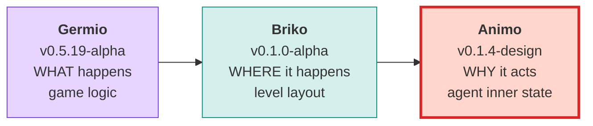

### 1.2 Library Identity

| Item | Value |
|---|---|
| Package name | `com.meowtoon.animo` |
| GitHub (current) | `github.com/hiroxpepe/animo` |
| GitHub (future) | `github.com/meowtoon/animo` |
| License | MIT |
| Minimum Unity version | 2022.3 |

---

## 2. G+B+A Stack Philosophy

Game development can be split into **three questions**. Each question gets one library.

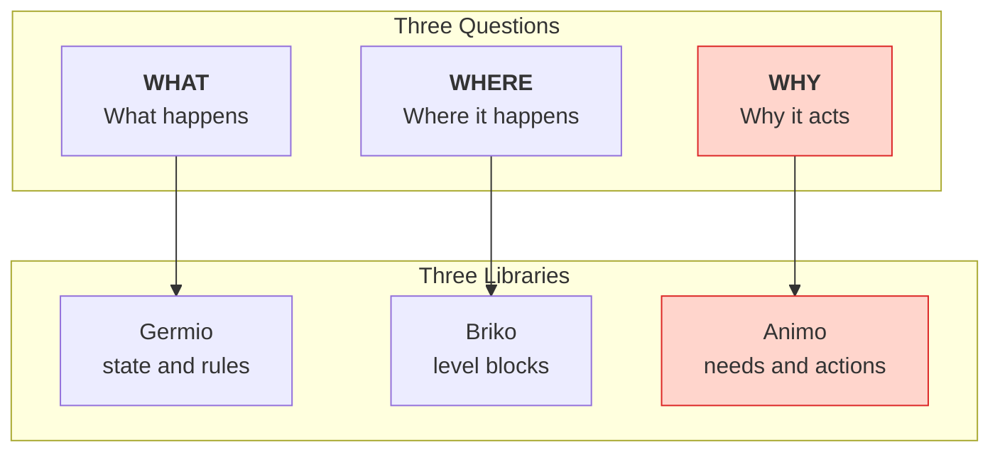

### 2.1 LLM-First Design

All three libraries assume that **an LLM writes and edits the JSON files directly**. This is the core of G+B+A.

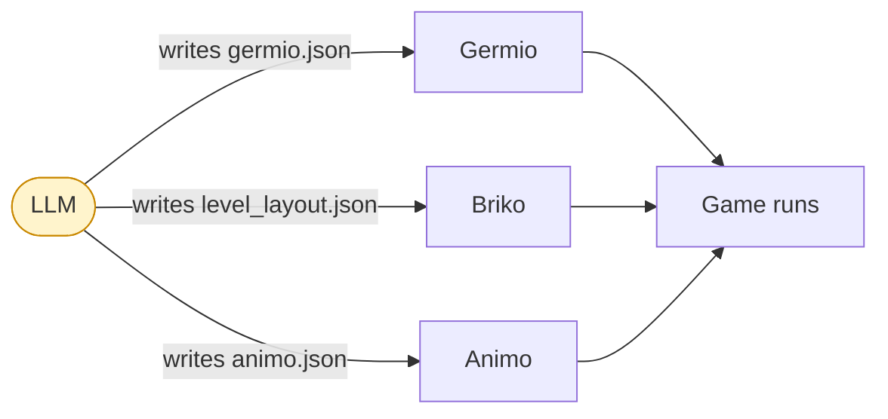

### 2.2 Inherited Design Rules

Animo follows the same rules as Germio and Briko.

| Rule | Content |
|---|---|
| **G16** | C# class names, JSON keys, Schema $defs, and LLM vocabulary all use the same name. |
| **G17** | All visible JSON properties use `snake_case`. |
| **G18** | Namespace layers are strict. The dependency direction never goes backward. |

### 2.3 Animo's Core Philosophy (re-defined in v0.1.1)

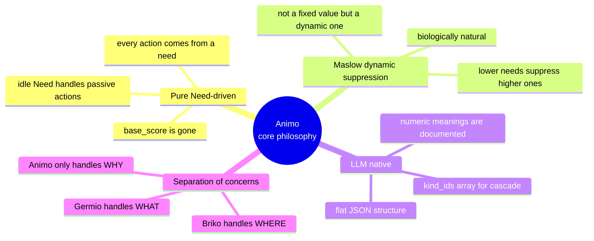

---

## 3. Changes from v0.1.3 to v0.1.4

### 3.1 Overview: Reality Check

Versions up to v0.1.3 polished **the design purity of Animo as a stand-alone system**. After three rounds of critique from Gemini Pro, the philosophy, math, and performance reached a commercial-grade level.

But the fourth critique was different. It pointed out **three operational walls that any Utility AI faces**:

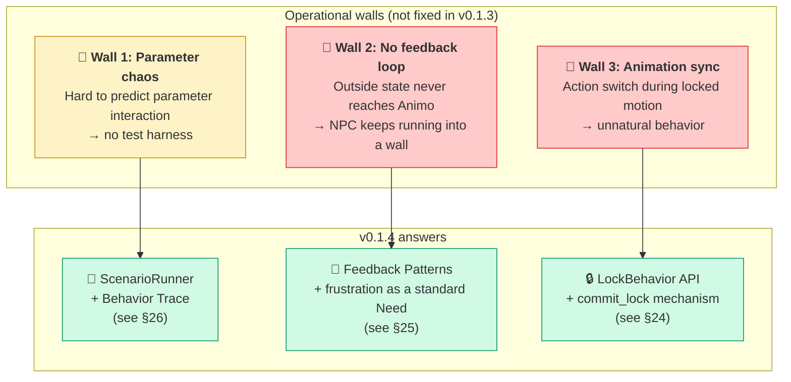

### 3.2 Main Changes (additive, not breaking)

| Change | v0.1.3 | v0.1.4 | Reason |
|---|---|---|---|
| **New Engine API** | — | `Lock(duration, mode)` / `Unlock()` added | behavior lock (Wall 3) |
| **Standard Need added** | 7 (hunger ... idle) | **8 (+ frustration)** | feedback pattern (Wall 2) |
| **New chapter §24** | — | Behavior Lock and Animation Sync | Wall 3 operational guide |
| **New chapter §25** | — | Germio Feedback Loop | Wall 2 operational guide |
| **New chapter §26** | — | Test Harness and Simulator | Wall 1 operational support |
| **Validator** | A000–A029 | **A000–A032** (A030/A031/A032 added) | for new Need / new API |
| schema_version | `"1.3"` | `"1.4"` | new Need + new fields |

### 3.3 Backward Compatibility

**v0.1.4 is fully backward compatible with v0.1.3.** Nothing is broken.

- An existing `animo.json` with `schema_version: 1.3` works after just changing the version field.
- The `frustration` Need is added, but if you don't mention it in JSON, the engine treats it as 0.0 (same as before).
- The `Lock()` API is brand new. Existing game code is not affected.

### 3.4 Engine API Extension

```csharp
// existing (v0.1.3)
public void Live(float dt);
public void Affect(string need, float delta, bool force_reset = false);
public string behavior { get; }

// 🆕 added in v0.1.4
public void Lock(float duration, LockMode mode = LockMode.Hard);
public void Unlock();
public bool is_locked { get; }
public string locked_behavior { get; }
```

See §24 for details.

### 3.5 Standard Need Extension

| Need | Tier | Use |
|---|---|---|
| hunger | 1 | physical lack |
| fatigue | 1 | physical lack |
| fear | 2 | safety |
| loneliness | 3 | social |
| confidence | 4 | esteem |
| curiosity | 5 | self-actualization |
| idle | 5 | passive action (added in v0.1.1) |
| **frustration** | **2** | **🆕 v0.1.4 — accumulated action failure** |

Why we put `frustration` at Tier 2 (same level as `fear`):

- Failure builds up as a mental threat, like discomfort.
- When it rises, it suppresses higher-tier Needs (loneliness, curiosity, etc.).
- In Maslow terms, this is "lack of safety" — the same mechanism as fear.
- LLMs can intuitively map a value to this position.

### 3.6 New Validator Rules

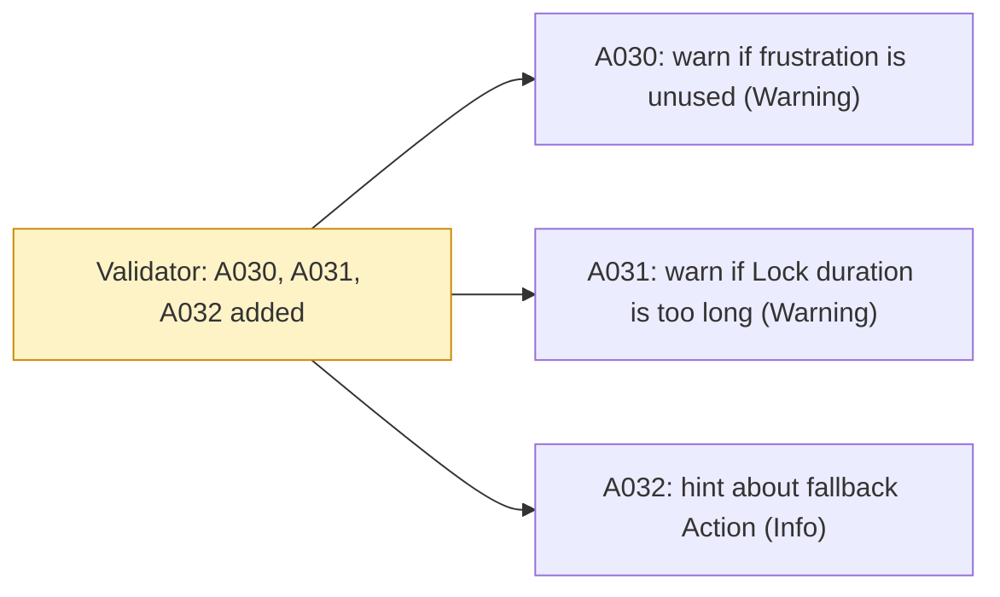

| ID | Rule | Level |
|---|---|---|
| A030 | If no `actions` or `influences` use `frustration`, the feedback design may be missing | Warning |
| A031 | `Lock(duration)` over 30 seconds risks runaway state | Warning (runtime) |
| A032 | Check that there is a low-tier "fallback" Action besides `idle` | Info |

### 3.7 Summary of the Fourth Critique Response

| Point | Response | Where |
|---|---|---|
| 1. Parameter tuning chaos | ✅ Adopted (test harness specified) | §26 |
| 2. Missing feedback loop | ✅ Adopted (frustration + pattern set) | §25 |
| 3. Animation sync | ✅ Adopted (Lock/Unlock API) | §24 |

**The fourth critique pointed at the operational layer, not at design holes. We answer by keeping the design pure and adding a thicker operational layer.**

---

## 4. Architecture Overview

The internal structure of Animo at a glance.

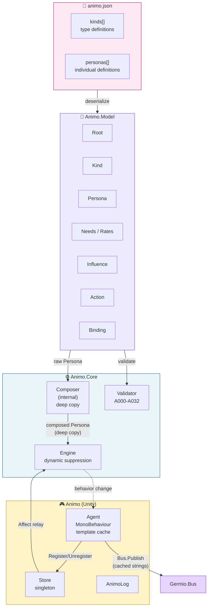

---

## 5. Namespace Hierarchy and Dependency Direction

**G18 is strict.** A higher layer can use a lower layer. A lower layer must not know about a higher one.

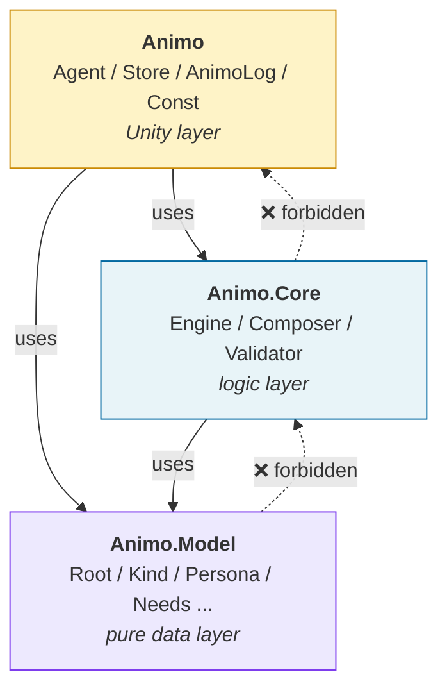

### 5.1 Layer Roles

| Layer | Role | Can depend on |
|---|---|---|
| `Animo.Model` | Pure data classes. Maps directly to the JSON structure. | nothing |
| `Animo.Core` | Calculation logic. Unity-free. Easy to test. | `Animo.Model` |
| `Animo` | Unity integration. MonoBehaviour and Germio bridge. | `Animo.Core`, `Animo.Model` |
---

## 6. Full Class List

### 6.1 Class Cards (v0.1.4)

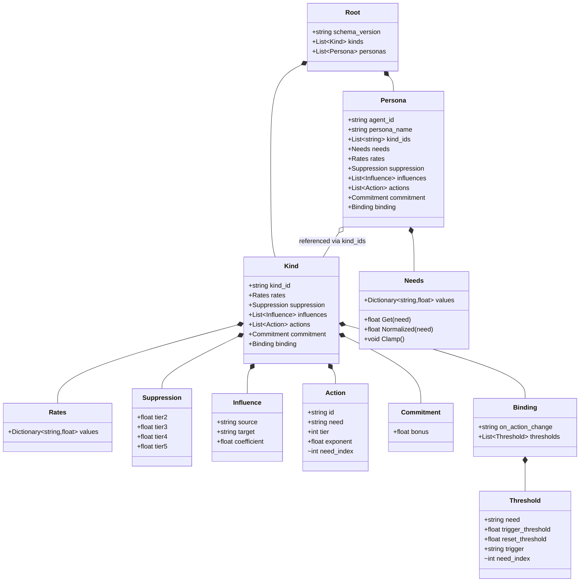

### 6.2 Diff from v0.1.0

| Class | Change |
|---|---|
| `Action` | Removed `base_score`, made `need` required (v0.1.1). Added `internal int need_index` cache (v0.1.3). |
| `Threshold` | Changed to two-stage `trigger_threshold` / `reset_threshold` (v0.1.1). Added `internal int need_index` cache (v0.1.3). |
| `Needs` | Added `Clamp()` method (forces [0, 100]) (v0.1.1). |
| `Hysteresis` → `Commitment` | Class name changed (v0.1.3). Field `decay` removed (v0.1.3). |
| `Engine` | **Lock / Unlock API added (v0.1.4)** |
| `Animo.Tools.ScenarioRunner` | **New class (v0.1.4)** — offline simulator. |
| `LockMode` enum | **New enum (v0.1.4)** — Hard / Soft. |

### 6.3 Full Class Table

| Namespace | Class | Role | Visibility |
|---|---|---|---|
| `Animo.Model` | `Root` | JSON root | public |
| `Animo.Model` | `Kind` | type definition | public |
| `Animo.Model` | `Persona` | individual definition | public |
| `Animo.Model` | `Needs` | need value set (Clamp possible) | public |
| `Animo.Model` | `Rates` | need change rates | public |
| `Animo.Model` | `Suppression` | tier suppression factors (dynamic calc) | public |
| `Animo.Model` | `Influence` | need-to-need effect | public |
| `Animo.Model` | `Action` | action definition (need required, no base_score) | public |
| `Animo.Model` | `Commitment` | action continuation bonus (permanent) | public |
| `Animo.Model` | `Binding` | Germio integration | public |
| `Animo.Model` | `Threshold` | two-stage threshold trigger | public |
| `Animo.Core` | `Composer` | Kind composition (deep copy) | **internal** |
| `Animo.Core` | `Engine` | AI calculation (dynamic suppression + Lock) | public |
| `Animo.Core` | `Validator` | animo.json validation (A000–A032) | public |
| `Animo.Core` | `LockMode` | enum: Hard / Soft (v0.1.4) | public |
| `Animo` | `Agent` | MonoBehaviour wrapper (template cache) | public |
| `Animo` | `Store` | window for all Agents (singleton) | public |
| `Animo` | `AnimoLog` | logger | public |
| `Animo` | `Const` | domain constants | public static |
| `Animo.Tools` | `ScenarioRunner` | offline simulator (v0.1.4) | public |
| `Animo.Tools` | `TraceResult` | simulation result (v0.1.4) | public |
| `Animo.Tools` | `TraceFrame` | per-frame state snapshot (v0.1.4) | public |
| `Animo.Tools` | `AffectEvent` | timed Affect injection (v0.1.4) | public |

---

## 7. animo.json Schema

### 7.1 Full Sample (v0.1.4)

```json
{
  "schema_version": "1.4",
  "kinds": [
    {
      "kind_id": "goblin",
      "rates": {
        "hunger": 2.0, "fatigue": 1.5, "fear": -2.0,
        "loneliness": 1.2, "confidence": -0.3,
        "curiosity": 0.8, "idle": 0.5, "frustration": -1.0
      },
      "suppression": {
        "tier2": 0.30, "tier3": 0.50, "tier4": 0.70, "tier5": 0.90
      },
      "influences": [
        { "source": "fear",        "target": "confidence", "coefficient": -0.60 },
        { "source": "fear",        "target": "curiosity",  "coefficient": -0.50 },
        { "source": "hunger",      "target": "fear",       "coefficient":  0.25 },
        { "source": "frustration", "target": "fear",       "coefficient":  0.30 },
        { "source": "frustration", "target": "confidence", "coefficient": -0.40 }
      ],
      "actions": [
        { "id": "Flee",       "need": "fear",      "tier": 2, "exponent": 2.5 },
        { "id": "SearchFood", "need": "hunger",    "tier": 1, "exponent": 1.8 },
        { "id": "Rest",       "need": "fatigue",   "tier": 1, "exponent": 1.5 },
        { "id": "Patrol",     "need": "idle",      "tier": 5, "exponent": 1.0 }
      ],
      "commitment": { "bonus": 10 },
      "binding": {
        "on_action_change": "animo_{agent_id}_{behavior}",
        "thresholds": [
          {
            "need": "fear",
            "trigger_threshold": 80,
            "reset_threshold": 70,
            "trigger": "animo_{agent_id}_fear_critical"
          }
        ]
      }
    },
    {
      "kind_id": "scout",
      "influences": [
        { "source": "fear", "target": "confidence", "coefficient": -0.30 }
      ],
      "actions": [
        { "id": "Socialize", "need": "loneliness", "tier": 3, "exponent": 1.3 }
      ]
    }
  ],
  "personas": [
    {
      "agent_id": "goblin_scout_01",
      "persona_name": "Goblin Scout — Timid Skirmisher",
      "kind_ids": ["goblin", "scout"],
      "needs": {
        "hunger": 40, "fatigue": 20, "fear": 55,
        "loneliness": 60, "confidence": 35,
        "curiosity": 45, "idle": 30, "frustration": 0
      }
    }
  ]
}
```

### 7.2 JSON Key List (G16 match)

| C# class | JSON key | Form |
|---|---|---|
| `Root` | — | (root, no key) |
| `Kind` | `kinds` | array (plural) |
| `Persona` | `personas` | array (plural) |
| `Needs` | `needs` | object |
| `Rates` | `rates` | object |
| `Suppression` | `suppression` | object |
| `Influence` | `influences` | array (plural) |
| `Action` | `actions` | array (plural) |
| `Commitment` | `commitment` | object |
| `Binding` | `binding` | object (singular) |
| `Threshold` | `thresholds` | array (inside `binding`) |

### 7.3 Optional Fields

| Key | Optional? | Default |
|---|---|---|
| `actions[].need` | ❌ **required** (changed from v0.1.0) | — |
| `actions[].base_score` | — **removed** (v0.1.0 → v0.1.1) | — |
| `commitment.bonus` | ✅ | `0.0` (v0.1.3: the `commitment` object itself can be omitted) |
| `commitment.decay` | — **removed** (v0.1.3) | — |
| `binding.on_action_change` | ✅ | engine default `animo_{agent_id}_{behavior}` |
| `binding.thresholds[].reset_threshold` | ✅ | `trigger_threshold - 5.0` |
| `kind_ids` | ✅ | empty array (no composition) |
| Persona-level `rates` etc. | ✅ | inherited from `Kind` |

### 7.4 schema_version Update

`"1.3"` → `"1.4"`. **Backward compatible** (no breaking changes). Adds support for the `frustration` Need and the `Lock` API. See §3 for details.

---

## 8. Kind × Persona Cascading

### 8.1 Idea: CSS-style Last-Wins Cascade

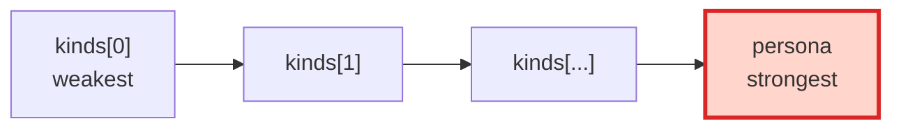

### 8.2 Composition Rules (clarified in v0.1.1)

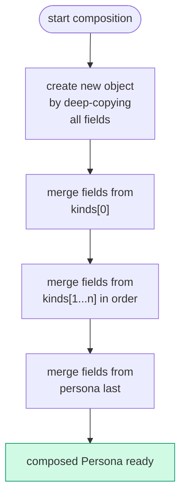

### 8.3 Merge Unit (from Gemini critique D-1)

| Target | Merge method | Note |
|---|---|---|
| Scalar values (`commitment.bonus`) | last-wins per field | only defined fields override |
| Object (`commitment` whole) | **last-wins per field (deep merge)** | (v0.1.3 only has `bonus`, but the rule applies if more fields are added) |
| Dictionary (`needs`, `rates`) | last-wins per key | per key |
| Array (`actions`) | match by `id`, last-wins | existing `id` overrides; new `id` appends |
| Array (`influences`) | match by `source`+`target`, last-wins | same |
| Array (`thresholds`) | match by `need`, last-wins | same |

### 8.4 Object Merge Example

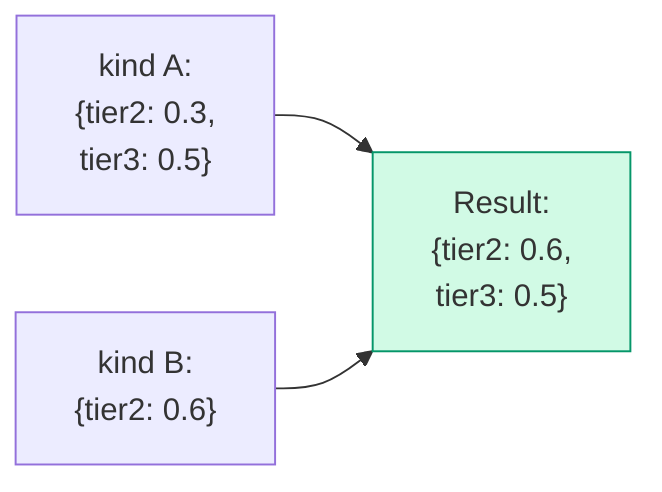

`tier2` is overwritten, `tier3` is kept. **Not a whole-object replace.**

### 8.5 Array Merge Example

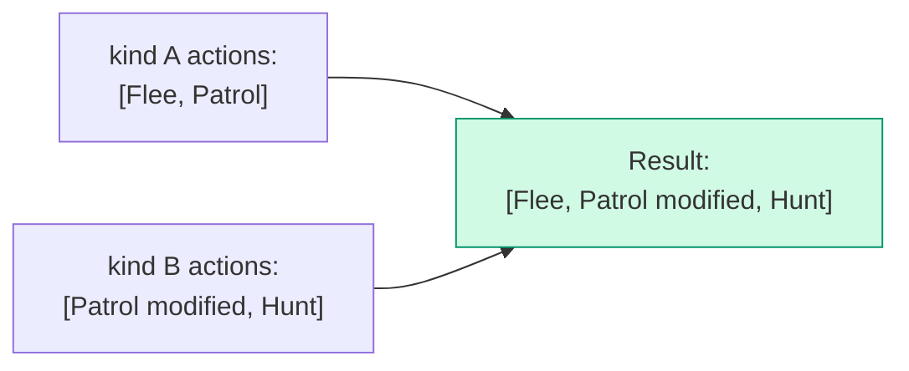

`Patrol` is replaced by kind B's version. `Flee` stays. `Hunt` is added.

### 8.6 Multiple Inheritance Example: "Japanese × A-type × Male → Yamada Taro"

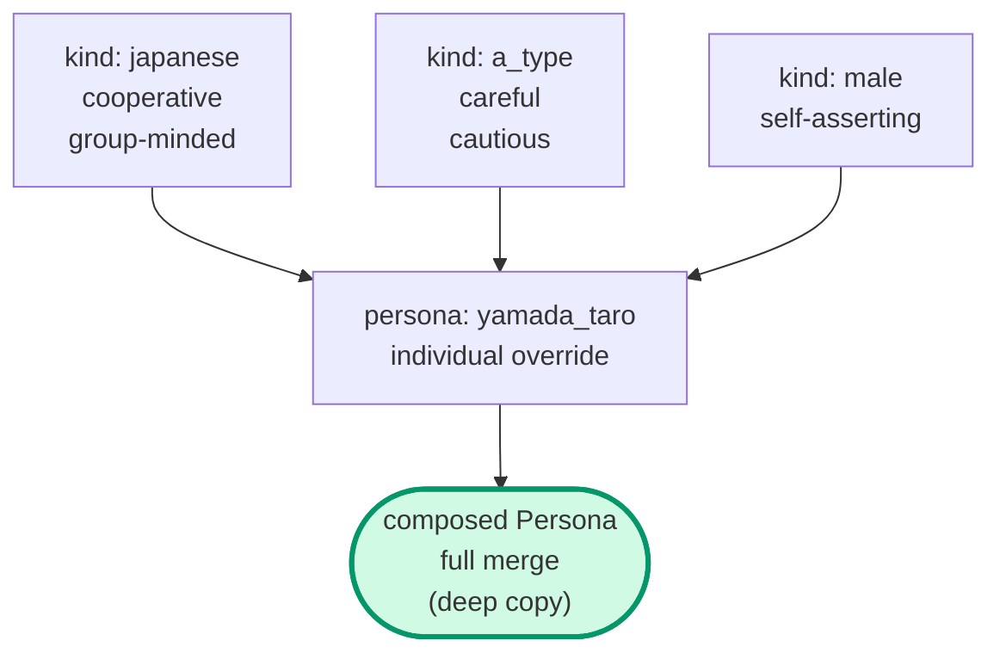

### 8.7 Inference and Computation Are Separated

The LLM only writes the `kind_ids` array order. The actual cascade math runs inside `Composer`.

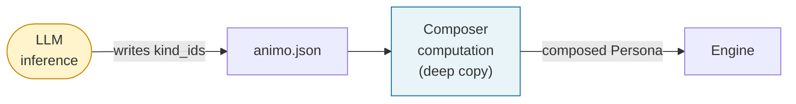

### 8.8 Implicit Need Default (from Gemini critique D-2)

If a `Kind` mentions a Need key in `rates`, `influences`, or `actions` that is not defined in the `Persona`'s `needs`:

```
Default value for an unmentioned Need key = 0.0
```

The runtime gives a Warning (A020a/b/c) but the game keeps running. `Composer` adds `needs[missing_key] = 0.0` for you.

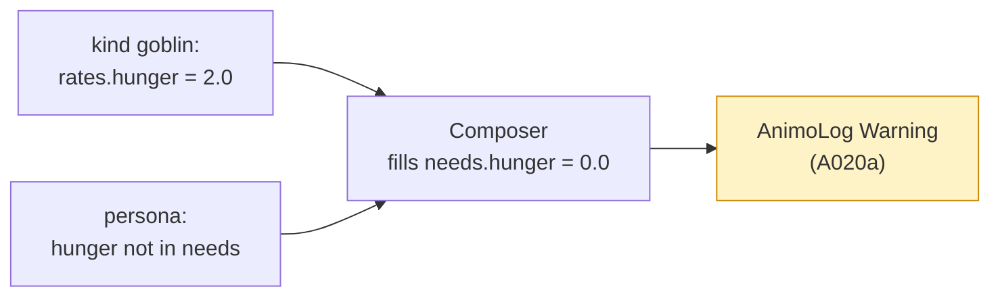

---

## 9. Engine Internal Design

### 9.1 Public API

| Kind | Name | Purpose | Added |
|---|---|---|---|
| Constructor | `Engine(Persona persona)` | takes a fully composed `Persona` from `Composer` | v0.1.0 |
| Method | `Live(float dt)` | advances time (5-step process) | v0.1.0 |
| Method | `Affect(string need, float delta, bool force_reset = false)` | external stimulus (see §9.7) | v0.1.0 |
| Property | `behavior` | current action (string) | v0.1.0 |
| Method | `Lock(float duration, LockMode mode = LockMode.Hard)` | behavior lock (see §24) | **🆕 v0.1.4** |
| Method | `Unlock()` | release the lock | **🆕 v0.1.4** |
| Property | `is_locked` | lock state (bool) | **🆕 v0.1.4** |
| Property | `locked_behavior` | locked action (string) | **🆕 v0.1.4** |

### 9.2 The 5 Steps of Live() (v0.1.3 + v0.1.4 Lock)

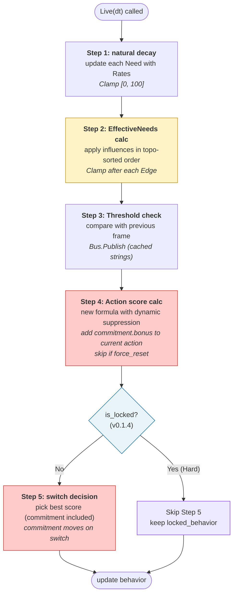

#### 9.2.1 Step Changes by Version

| Step | v0.1.2 | v0.1.3 | v0.1.4 |
|---|---|---|---|
| Step 3 | Hysteresis decay (time) | Threshold check | (same as v0.1.3) |
| Step 4 | add hysteresis_bonus | add commitment.bonus (skip if force_reset) | (same as v0.1.3) |
| Step 5 | switch only if hysteresis = 0 | best score (commitment included) | **skip if `is_locked` (Lock mechanism)** |

### 9.3 Maslow Dynamic Suppression (refined through v0.1.1, v0.1.2, v0.1.3)

#### 9.3.1 The Old Defect (up to v0.1.0)

The old formula:

```
score = Pow(intensity, exp) × (1 - suppression[tier]) × 100 + base_score + hysteresis_bonus
```

`suppression[tier]` was a fixed value. So Maslow's core idea — "lower needs suppress higher needs when not met" — **did not actually work**.

#### 9.3.2 v0.1.1 Improvement

Made `suppression_amount` depend on the maximum normalized Need from lower tiers:

```
suppression_amount[tier] = suppression_factor[tier] × max_lower_tier_intensity
```

But in v0.1.1, Hysteresis was **outside** the suppression. **Maslow's absoluteness was broken by Hysteresis.**

#### 9.3.3 v0.1.2 Formula

Moved Hysteresis **inside** the suppression:

```
score = (Pow(intensity, exp) × 100 + hysteresis_bonus) × (1 - suppression_amount[tier])
```

#### 9.3.4 v0.1.3 Final Form — Reference Source Clarified

Renamed `hysteresis_bonus` to `commitment_bonus`:

```
score = (Pow(intensity, exp) × 100 + commitment_bonus) × (1 - suppression_amount[tier])
```

And **made the source of `max_lower_tier_intensity` explicit: EffectiveNeeds.**

```
max_lower_tier_intensity = max(
    eff_needs[tier1 needs] / 100,
    eff_needs[tier2 needs] / 100,
    ...,
    eff_needs[(tier-1) needs] / 100
)
```

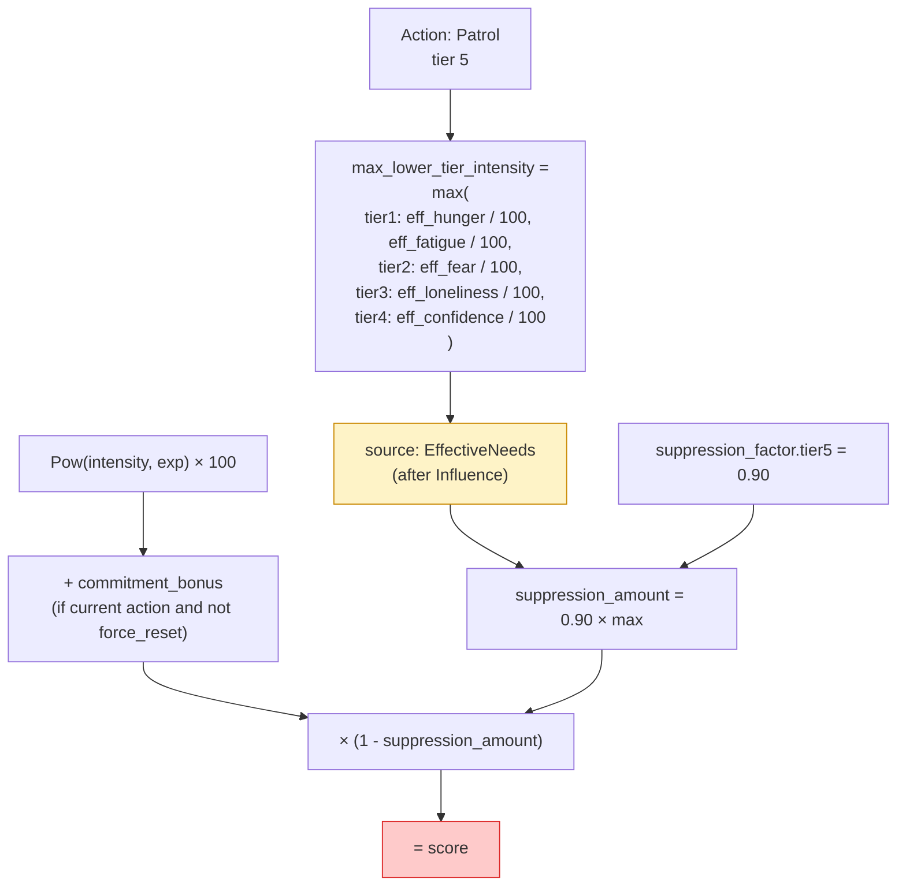

**Why EffectiveNeeds:**
- Matches Animo's philosophy "the final inner state drives action."
- `intensity` in score also uses EffectiveNeeds (consistency).
- Influence-amplified Needs are still part of the inner state.
- Prevents implementer bugs where `_needs` array might be used.

#### 9.3.5 Behavior Simulation with v0.1.3 Formula

Setup: `Daydream` (idle, tier=5), `SearchFood` (hunger, tier=1, exp=1.8), `commitment.bonus = 50`, `suppression_factor.tier5 = 0.90`.

| State | hunger | idle | suppression_amount | Daydream score | SearchFood score | Choice |
|---|---|---|---|---|---|---|
| peaceful | 20 | 70 | 0.18 | (70+50)×0.82=98.4 | 6.9 | Daydream ✅ |
| mild hunger | 50 | 70 | 0.45 | (70+50)×0.55=66.0 | 32 | Daydream ✅ |
| serious hunger | 70 | 70 | 0.63 | (70+50)×0.37=44.4 | 53 | **SearchFood ✅** |
| starving | 100 | 70 | 0.90 | (70+50)×0.10=12.0 | 100 | SearchFood ✅ |

**"Eat when hungry" wins naturally, even when commitment is high. Maslow holds.**

#### 9.3.6 Tier 1 Special Case

Tier 1 actions have no lower tier. So `max_lower_tier_intensity = 0`, and `suppression_amount = 0`. No suppression. Survival actions are always free to fire.

### 9.4 Full Utility Score Formula (v0.1.3 final, used in v0.1.4)

```
score = (Pow(intensity, exponent) × 100 + commitment_bonus) × (1 - suppression_factor[tier] × max_lower_tier_intensity)
```

| Variable | Range | Meaning |
|---|---|---|
| `intensity` | 0.0–1.0 | normalized need strength after EffectiveNeeds |
| `exponent` | 0.1–5.0 | shape of the action's response curve |
| `suppression_factor[tier]` | 0.0–1.0 | maximum suppression factor for this tier |
| `max_lower_tier_intensity` | 0.0–1.0 | max normalized EffectiveNeed from lower tiers |
| `commitment_bonus` | 0.0–∞ | bonus added only to the currently selected action (permanent). Treated as 0 during `force_reset`. |

`base_score` was removed in v0.1.1. `hysteresis_*` was renamed to `commitment_*` in v0.1.3.

### 9.5 Exponent Sensitivity Curve

#### 9.5.1 The Math

`Pow(intensity, exponent)` with intensity in 0–1: the curve shape depends on the exponent.

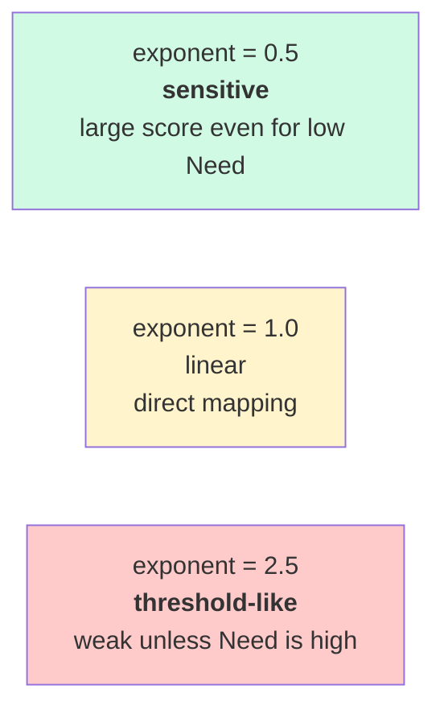

#### 9.5.2 Concrete Values

| intensity | exp=0.5 | exp=1.0 | exp=2.0 | exp=2.5 | exp=5.0 |
|---|---|---|---|---|---|
| 0.1 | 0.316 | 0.100 | 0.010 | 0.003 | 0.00001 |
| 0.3 | 0.548 | 0.300 | 0.090 | 0.049 | 0.002 |
| 0.5 | 0.707 | 0.500 | 0.250 | 0.177 | 0.031 |
| 0.7 | 0.837 | 0.700 | 0.490 | 0.410 | 0.168 |
| 0.9 | 0.949 | 0.900 | 0.810 | 0.768 | 0.590 |
| 1.0 | 1.000 | 1.000 | 1.000 | 1.000 | 1.000 |

#### 9.5.3 What This Means for the LLM

| Wanted behavior | Use exponent |
|---|---|
| sensitive, reacts early | around 0.5 |
| direct, proportional | 1.0 |
| needs to be a bit high to fire | 2.0 |
| holds back, then explodes | 3.0–5.0 |

The full table is in §19 (LLM Cheat Sheet).

### 9.6 EffectiveNeeds Cascade (v0.1.2 final)

#### 9.6.1 Old Bug: Array-Order Dependence (v0.1.0)

In v0.1.0, `influences` were applied in array order. Different orders gave different results.

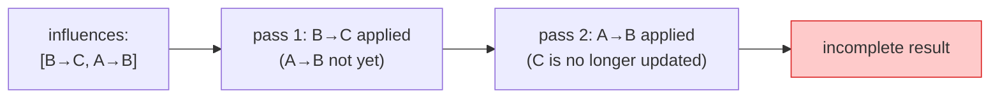

#### 9.6.2 v0.1.2 Solution (replaces v0.1.1 iteration)

**v0.1.1 compromise (now removed):** if a cycle was found, run 3-pass iteration. This was numerically risky (oscillation/divergence).

**v0.1.2 final approach:**

1. **Build dependency graph (DAG)** from `influences` `source → target`.
2. **Cycle detection.** If the graph is not a DAG, the Validator gives an **Error** (A025). The runtime never starts.
3. **Topological sort** to fix the order.
4. **Single-pass apply** in that order.
5. **Clamp [0, 100] after each Edge** (next section).

```mermaid
flowchart TB
  Start(["influences[]"])
  Build["build dependency graph"]
  Check{"cycle?"}
  Reject["❌ Validator Error<br/>A025"]
  Topo["topological sort"]
  Loop["apply each Edge in order<br/>→ Clamp after each one"]
  End(["EffectiveNeeds ready<br/>always [0, 100]"])
  Start --> Build --> Check
  Check -->|"Yes"| Reject
  Check -->|"No"| Topo --> Loop --> End
  style Reject fill:#fecaca,stroke:#dc2626
  style Loop fill:#fef3c7,stroke:#ca8a04
  style End fill:#d1fae5,stroke:#059669
```

#### 9.6.3 Why Mid-Cascade Clamp Matters (v0.1.2 made this explicit)

For `A → B (-1.0)`, `B → C (+1.0)` with A=100 and B=50:

| Clamp timing | B mid-value | effect on C | C final | Verdict |
|---|---|---|---|---|
| only after all passes | -50 (briefly) | propagates as -50 | unfairly lowered | ❌ bug |
| **after each Edge** (v0.1.2 chose this) | clamped to 0 | propagates as 0 | unaffected | ✅ correct |

**Reason:** in biology, "nothing" cannot push "something." Negative intermediate values must not propagate.

#### 9.6.4 Cycle Detection → Error (replaces v0.1.1 iteration)

A cycle like `fear → confidence → fear` is **rejected as an Error by Validator A025.**

```mermaid
flowchart LR
  A["fear"]
  B["confidence"]
  A -->|"-0.6"| B
  B -->|"-0.5"| A
  Reject["❌ Validator Error<br/>(A025)<br/>JSON rejected"]
  A --> Reject
  B --> Reject
  style A fill:#fecaca
  style B fill:#fecaca
  style Reject fill:#fecaca,stroke:#dc2626
```

**Why:**
- Iteration without damping is mathematically risky (oscillation/divergence).
- A learning-rate α (PageRank style) adds LLM cognitive load. Over-engineered.
- Cycles are hard to understand by humans too ("A reduces B, B reduces A" feels like an infinite loop).
- Reconsider in v0.2 if a use case appears.

#### 9.6.5 Cascade Fix from Gemini

Using `eff` as the source makes A→B→C chains work (already adopted in v0.1.0):

```csharp
// ✅ adopted since v0.1.0
float intensity = eff.Normalized(inf.source);
float delta     = inf.coefficient * intensity * eff.Get(inf.source);
// v0.1.2 added: clamp here
eff.Set(inf.target, Mathf.Clamp(eff.Get(inf.target) + delta, 0f, 100f));
```

### 9.7 Affect() Behavior (force_reset re-defined in v0.1.3)

#### 9.7.1 Exact Meaning of force_reset (v0.1.3)

```
force_reset: true → for ONE frame in the next Live(), do not add commitment_bonus to the current action.
                    (commitment itself is kept; just the protection is paused for one frame)
```

**Not a forced switch. It is "turn off commitment protection for one frame."**

#### 9.7.2 Flow

```mermaid
flowchart TB
  In(["Affect(need, delta, force_reset)"])
  Add["Needs[need] += delta<br/>Clamp [0, 100]"]
  Q{"force_reset?"}
  Flag["_force_reset_pending = true"]
  Skip["Live Step 4: skip commitment_bonus<br/>for the current action"]
  Reset["After Step 4: _force_reset_pending = false"]
  Keep["normal commitment_bonus add"]
  End(["Step 5: pure score competition"])
  In --> Add --> Q
  Q -->|"true"| Flag --> Skip --> Reset --> End
  Q -->|"false (default)"| Keep --> End
  style Q fill:#e8f4f8,stroke:#0369a1
  style Skip fill:#fef3c7,stroke:#ca8a04
```

#### 9.7.3 When to Use force_reset

| Situation | Usage |
|---|---|
| Player spotted | `Affect("fear", +50, force_reset: true)` — react even if NPC is stubborn |
| Took damage | `Affect("fear", +30, force_reset: true)` — quick reaction |
| Normal slow change | `Affect("hunger", +5)` — no force_reset |

#### 9.7.4 Philosophical Consistency

"Affect changes the inner state, not the action choice." This stays true. `force_reset` is a separate, well-defined interrupt mechanism. **It does not force a switch — it only disables commitment protection for one frame.** The actual switch still happens in Step 5 score competition.

### 9.8 Commitment Behavior (made permanent in v0.1.3)

```mermaid
sequenceDiagram
  autonumber
  participant T as Time
  participant E as Engine
  participant B as behavior
  Note over E,B: behavior = "Patrol"<br/>commitment.bonus = 10 (always)
  T->>E: Live(dt)
  Note over E: +10 added to Patrol score every frame<br/>commitment does not decay
  T->>E: Affect("fear", +50)
  Note over E: Flee score rises<br/>(commitment stays on Patrol)
  T->>E: Live(dt)
  Note over E: Step 4: Patrol score = pure + 10<br/>      Flee score = pure
  Note over E: Step 5: switch if Flee > (Patrol + 10)
  alt Flee score > Patrol + 10
    E->>E: behavior = "Flee"<br/>commitment moves to Flee
    Note over E: From now: Flee score = pure + 10
  else stay
    Note over E: keep Patrol
  end
```

#### 9.8.1 Diff from v0.1.2

| Item | v0.1.2 | v0.1.3 |
|---|---|---|
| Name | `hysteresis` | `commitment` |
| Time behavior | `bonus -= decay × dt` (decay) | **fixed value forever** (no decay) |
| Underflow guard | `Max(0, ...)` needed | not needed (no decay) |
| Switch logic | only when bonus = 0 | **pure score competition (commitment included)** |

#### 9.8.2 True Chattering Prevention (CSS-style hysteresis)

```mermaid
flowchart LR
  PatPat["In Patrol:<br/>Patrol+10 vs Flee"]
  Switch1["Flee score > Patrol+10"]
  FleeFlee["In Flee:<br/>Flee+10 vs Patrol"]
  Switch2["Patrol score > Flee+10<br/>(needs even higher Patrol)"]
  PatPat -->|"switch threshold: +10"| Switch1 --> FleeFlee
  FleeFlee -->|"return threshold: +10 the other way"| Switch2 --> PatPat
  style FleeFlee fill:#fecaca
  style PatPat fill:#fef3c7
```

This is the **two-stage threshold of true Hysteresis** applied to action switching. Patrol→Flee needs +10 score gap; Flee→Patrol needs +10 in the other direction. **Real chattering prevention.**

### 9.9 Needs Clamping (fully clarified in v0.1.2)

All Need values are **always [0, 100]**:

```mermaid
flowchart TB
  Source(["points where Needs change"])
  Source --> P1["Live Step 1: after Rates"]
  Source --> P2["Affect call"]
  Source --> P3["Composer composition"]
  Source --> P4["Influence: after each Edge<br/>(made explicit in v0.1.2)"]
  P1 & P2 & P3 & P4 --> C["Mathf.Clamp(value, 0, 100)"]
  C --> R(["Need value finalized"])
  style C fill:#fef3c7,stroke:#ca8a04
  style P4 fill:#fecaca,stroke:#dc2626
```

This stops two bugs at once: `Pow(intensity, exp)` exploding when `intensity` > 1.0, and negative middle values propagating in cascades.
---

## 10. Composer Responsibility and Deep Copy

### 10.1 Why a Dedicated Class

`Engine` should be a pure calculation engine. Putting Kind composition (a transformation step) inside `Engine` would mix two responsibilities. We split `Composer` out so:

- `Engine` does not need to know about `Root`.
- `Composer` is easy to test in isolation.
- Even if composition logic grows complex later, `Engine` and `Store` are not touched.

### 10.2 Deep Copy is Required (from Gemini critique E-1)

#### 10.2.1 The Bug

If we use shallow copy (reference copy) during composition, multiple Personas may share the same `Kind` data. If one Persona changes a runtime value, the change leaks to other Personas. This is **reference contamination**.

```mermaid
flowchart LR
  K["kinds[goblin]<br/>actions = [Flee, Patrol]"]
  P1["persona A<br/>(shallow copy)"]
  P2["persona B<br/>(shallow copy)"]
  Bug["A edits its actions<br/>→ B is also affected!"]
  K --> P1
  K --> P2
  P1 -.->|"❌ shared reference"| Bug
  P2 -.->|"❌ shared reference"| Bug
  style Bug fill:#fecaca,stroke:#dc2626
```

#### 10.2.2 Solution: Deep Copy

```mermaid
flowchart LR
  K["kinds[goblin]"]
  P1["persona A<br/>(deep copy)<br/>independent instance"]
  P2["persona B<br/>(deep copy)<br/>independent instance"]
  K --> P1
  K --> P2
  style P1 fill:#d1fae5,stroke:#059669
  style P2 fill:#d1fae5,stroke:#059669
```

#### 10.2.3 Implementation Plan

```csharp
internal static class Composer {
    internal static Persona Compose(Persona persona, Root root) {
        // 1. create a brand new Persona instance
        // 2. recreate every reference type field with `new`
        //    - Needs / Rates: new Dictionary
        //    - Influence / Action: new List, plus `new` for each item
        //    - Suppression / Commitment / Binding: new instance
        // 3. value types are copied (default C# behavior)
        // 4. process kind_ids[] in order; merge each Kind's fields
        // 5. merge persona's own fields last
        // 6. fill missing Need keys with 0.0
        // 7. return the fully composed, fully independent Persona
    }
}
```

### 10.3 Usage Flow

```mermaid
sequenceDiagram
  autonumber
  participant Store
  participant Composer
  participant Engine
  participant Persona as Raw Persona<br/>(from JSON)
  participant Root
  Store->>Composer: Compose(persona, root)
  Composer->>Persona: read kind_ids
  Composer->>Root: pull matching kinds[]
  Note over Composer: merge in order, last-wins<br/>everything is deep-copied<br/>fill missing Needs with 0.0
  Composer-->>Store: composed Persona (independent)
  Store->>Engine: new Engine(composed Persona)
  Engine-->>Engine: initialize internal state
```

### 10.4 Visibility

`internal class Composer` — not visible outside. Only `Store` calls it.

---

## 11. Store API

### 11.1 Role

Holds all `Agent`s by `agent_id`. Acts as the entry point for `Affect` calls from outside.

### 11.2 Specs

| Item | Value |
|---|---|
| Pattern | singleton (kept in v0.1.4. Future DI is in TODO) |
| Register on | `Agent.Awake` |
| Unregister on | `Agent.OnDestroy` |
| If `agent_id` not found | `AnimoLog.Warning`, then keep going |
| `Find` method | `internal` — not public |

### 11.3 Public API

```csharp
// Register
Animo.Store.Instance.Register(agent: this);

// Unregister
Animo.Store.Instance.Unregister(agent: this);

// Affect relay (called from Germio Executor)
Animo.Store.Instance.Affect(
    agent_id:    "goblin_01",
    need:        "fear",
    delta:       +30f,
    force_reset: false
);
```

### 11.4 Lifecycle

```mermaid
sequenceDiagram
  autonumber
  participant Unity
  participant Agent
  participant Store
  participant Engine
  Unity->>Agent: Awake()
  Agent->>Store: Register(agent: this)
  Note over Store: _agents[agent_id] = agent
  Agent->>Engine: new Engine(composed Persona)
  Note over Agent: cache template strings at startup
  loop every frame
    Unity->>Agent: Update()
    Agent->>Engine: Live(Time.deltaTime)
    Engine-->>Agent: behavior updated
    alt behavior changed
      Agent->>Agent: Bus.Publish using cached string
    end
  end
  Note over Unity: scene change or destroy
  Unity->>Agent: OnDestroy()
  Agent->>Store: Unregister(agent: this)
```

### 11.5 Affect Relay Flow

```mermaid
sequenceDiagram
  autonumber
  participant Germio as Germio.Executor
  participant Store as Animo.Store
  participant Agent
  participant Engine
  Germio->>Store: Affect(agent_id, need, delta)
  Store->>Store: Find(agent_id)
  alt agent exists
    Store->>Agent: get the matching Agent
    Agent->>Engine: Affect(need, delta, force_reset)
    Engine-->>Engine: update Needs (Clamp [0, 100])
  else not found
    Store-->>Store: AnimoLog.Warning("agent not found")
    Note over Store: do not stop the game
  end
```

---

## 12. Binding Behavior

### 12.1 Bus Reference

The `Agent` (MonoBehaviour) holds the `Bus` reference via Inspector. Neither `Store` nor `Engine` holds it.

```mermaid
flowchart LR
  Inspector["Unity Inspector<br/>_BUS field"]
  Agent["Animo.Agent<br/>(MonoBehaviour)"]
  Engine["Animo.Core.Engine"]
  Bus["Germio.Bus"]
  Inspector -.->|"SerializeField"| Agent
  Agent -->|"Publish on event"| Bus
  Engine -->|"behavior change"| Agent
  style Bus fill:#e8d5ff,stroke:#7e3ff2
```

If `Bus` is `null`: log a Warning once, then go silent. Animo can be used without Germio (a valid use case).

### 12.2 on_action_change Firing (template cache)

#### 12.2.1 The Old Problem: Per-Frame String Generation

In v0.1.0, every behavior change ran `string.Format` on the template. That makes garbage and triggers GC spikes.

#### 12.2.2 v0.1.1 Solution: Cache at Awake

```mermaid
sequenceDiagram
  autonumber
  participant Awake as Agent.Awake
  participant Cache as string cache
  participant Engine
  participant Bus
  Awake->>Awake: list all Action ids
  Awake->>Cache: build a string for each Action
  Note over Cache: "animo_goblin_01_flee"<br/>"animo_goblin_01_patrol"<br/>...
  loop every frame
    Engine-->>Awake: behavior changed
    Awake->>Cache: O(1) lookup
    Cache-->>Awake: cached string
    Awake->>Bus: Publish(cached)
  end
```

**Zero string allocation per frame.** All strings sent to `Bus.Publish` are pre-computed.

### 12.3 thresholds Firing (two-stage in v0.1.1)

#### 12.3.1 Old Problem: Chattering (Gemini critique I-3)

In v0.1.0, a single threshold (e.g. `threshold: 80`) was used. If the value swung between 79.9 and 80.1, the trigger fired every frame.

#### 12.3.2 Solution: Two-Stage Threshold

```mermaid
stateDiagram-v2
  [*] --> Below
  Below --> Below : need < trigger_threshold
  Below --> Above : need >= trigger_threshold (fire!)
  Above --> Above : need > reset_threshold
  Above --> Below : need <= reset_threshold (reset)
  note right of Above : Bus.Publish only once
  note right of Below : ready to fire again
```

Set `trigger_threshold = 80` and `reset_threshold = 70`: it fires at 80+, and re-arms only after the value drops below 70.

#### 12.3.3 New JSON Structure

```json
{
  "thresholds": [
    {
      "need": "fear",
      "trigger_threshold": 80,
      "reset_threshold": 70,
      "trigger": "animo_{agent_id}_fear_critical"
    }
  ]
}
```

If `reset_threshold` is omitted, the default is `trigger_threshold - 5.0`.

### 12.4 Allowed Template Placeholders

| Rule | Field | Allowed |
|---|---|---|
| A014 | `binding.on_action_change` | `{agent_id}` `{behavior}` |
| A015 | `thresholds[].trigger` | `{agent_id}` |

Plain strings (no placeholders) are also allowed.

### 12.5 Template Expansion Flow

```mermaid
flowchart TB
  T["Template:<br/>animo_{agent_id}_{behavior}"]
  V1["agent_id = goblin_01"]
  V2["behavior = flee"]
  R["Result:<br/>animo_goblin_01_flee<br/>(pre-computed at Awake)"]
  T --> R
  V1 --> R
  V2 --> R
  R -->|"Bus.Publish"| Germio["Germio rule fires"]
  style R fill:#d1fae5,stroke:#059669
```

---

## 13. Validator Rules A000–A032

### 13.1 Full Rule List

| ID | Content | Level | Note |
|---|---|---|---|
| **A000** | `schema_version` exists and is not empty | Error | — |
| **A001** | `personas` exists and is not empty | Error | — |
| **A002** | `persona.agent_id` is snake_case, not empty, unique, ≤128 chars | Error | — |
| **A003** | `kind.kind_id` is snake_case, not empty, unique, ≤128 chars | Error | — |
| **A004** | All `persona.kind_ids` exist in `kinds` | Error | — |
| **A005** | All `needs` values are in 0.0 to 100.0 | Error | — |
| **A006** | `suppression` keys are only `tier2`–`tier5`, values 0.0 to 1.0 | Error | — |
| **A007** | `actions[].tier` is 1 to 5 | Error | — |
| **A008** | `actions[].exponent` is 0.1 to 5.0 | Error | — |
| **A009** | `actions[].id` is not empty | Error | — |
| **A010** | `thresholds[].trigger_threshold` is 0.0 to 100.0 | Error | changed in v0.1.1 |
| **A011a** | If no `kind_ids`, the Persona must have at least one `actions` | Error | — |
| **A011b** | If `kind_ids` exists, `actions` may be omitted | — | — |
| **A012** | `influences[].coefficient` is -1.0 to 1.0 | Error | — |
| **A013** | `rates` keys are a subset of `needs` keys | Warning | — |
| **A014** | `binding.on_action_change` placeholders only `{agent_id}` / `{behavior}` | Error | — |
| **A015** | `thresholds[].trigger` placeholders only `{agent_id}` | Error | — |
| **A016** | `binding` is missing | Warning | — |
| **A017** | ~~`hysteresis.bonus` ≤ `hysteresis.decay`~~ | **deprecated** | **🪦 removed in v0.1.3** (no `decay` field) |
| **A018** | `agent_id` / `kind_id` ≤ 128 chars (merged into A002/A003) | Error | — |
| **A019** | Unknown `needs` key looks like a typo of a standard need | Warning | extended in v0.1.4 (8 needs) |
| **A020a** | `kind.rates` key is not in the referencing Persona's `needs` | Warning | — |
| **A020b** | `kind.influences` source/target is not in `needs` | Warning | — |
| **A020c** | `kind.actions[].need` is not in `needs` | Warning | — |
| **A021** | `schema_version` must be `"1.3"` or `"1.4"` | Error | v0.1.4 backward compat |
| **A022** | `actions[].need` is required | Error | v0.1.1 |
| **A023** | `thresholds[].trigger_threshold > reset_threshold` | Error | v0.1.1 |
| **A024** | If an Action uses `idle`, its tier should be 5 | Warning | v0.1.1 |
| **A025** | `influences` has a cycle | **Error** | escalated in v0.1.2 |
| **A026** | The Utility formula keeps `commitment_bonus` inside suppression (v0.1.3 formula) | — | info rule |
| **A027** | Influence applies clamp after each Edge (v0.1.2 spec) | — | info rule |
| **A028** | `commitment.bonus > 30` may cause action lock-in | Warning | v0.1.3 |
| **A029** | `commitment` is omitted but `actions` has 2+ items (chattering risk) | Warning | v0.1.3 |
| **A030** | No `actions` or `influences` use `frustration` (feedback design might be missing) | Warning | **🆕 v0.1.4** |
| **A031** | `Lock(duration)` exceeds `LOCK_DURATION_WARN_THRESHOLD` (30s) | Warning (runtime) | **🆕 v0.1.4** |
| **A032** | Hint about a low-tier "fallback" action other than `idle` | Info | **🆕 v0.1.4** |

### 13.2 Validation Flow

```mermaid
flowchart TB
  Start(["read animo.json"])
  P1{"A000: schema_version?"}
  P2{"A021: version 1.3 or 1.4?"}
  P3["A001-A012: structure / range"]
  P4["A013-A019: consistency / format"]
  P5["A020a/b/c: cross-field<br/>(Kind × Persona)"]
  P6["A022-A029: action / commitment"]
  P7["A025: cycle → Error"]
  P8["A030-A032: v0.1.4 rules"]
  Result(["ValidationResult<br/>(errors + warnings + info)"])
  Start --> P1
  P1 -->|"No"| Err(["fail fast"])
  P1 -->|"Yes"| P2
  P2 -->|"No"| Err
  P2 -->|"Yes"| P3
  P3 --> P4 --> P5 --> P6 --> P7 --> P8 --> Result
  P7 -->|"cycle found"| Err
  style Err fill:#fecaca,stroke:#dc2626
  style Result fill:#d1fae5,stroke:#059669
  style P7 fill:#fecaca,stroke:#dc2626
  style P8 fill:#fef3c7,stroke:#ca8a04
```

### 13.3 snake_case Rules (A002 / A003)

| Item | Rule |
|---|---|
| Allowed chars | `a-z` / `0-9` / `_` |
| First char | must be a letter |
| Double underscore | `__` not allowed |
| Trailing underscore | not allowed |
| Max length | 128 |

### 13.4 Template Validation Logic (A014 / A015)

```mermaid
flowchart TB
  In(["template string"])
  C1{"empty?"}
  C2{"matched braces?"}
  C3["extract placeholders<br/>all {xxx}"]
  C4{"all placeholders<br/>in allowed list?"}
  Pass(["✅ Pass"])
  Fail(["❌ Error"])
  In --> C1
  C1 -->|"Yes"| Fail
  C1 -->|"No"| C2
  C2 -->|"No"| Fail
  C2 -->|"Yes"| C3
  C3 --> C4
  C4 -->|"No"| Fail
  C4 -->|"Yes"| Pass
  style Pass fill:#d1fae5,stroke:#059669
  style Fail fill:#fecaca,stroke:#dc2626
```

A plain string (no placeholders) also passes.

### 13.5 Cycle Detection (A025 — Error since v0.1.2)

```mermaid
flowchart LR
  A["fear"]
  B["confidence"]
  C["loneliness"]
  A -->|"-0.6"| B
  B -->|"-0.5"| A
  C -->|"+0.3"| A
  Reject["❌ Validator Error<br/>JSON rejected"]
  A & B --> Reject
  style A fill:#fecaca
  style B fill:#fecaca
  style Reject fill:#fecaca,stroke:#dc2626
```

The `fear ⇄ confidence` two-way influence is a cycle. The Validator finds it during DAG construction and **rejects the JSON as an Error**.

**Change from v0.1.1:** the old 3-pass iteration was numerically risky. We removed it. Cycles are now non-runnable. See §9.6.4.

### 13.6 JSON Schema vs Validator: Roles

**LLM-first design.** The JSON Schema covers types, structure, and value ranges. The LLM can read the schema and produce a valid `animo.json` directly.

```mermaid
flowchart LR
  JSON["animo.json"]
  Schema["animo.schema.json<br/><b>type + structure + range</b><br/>minimum / maximum / pattern"]
  Validator["Animo.Core.Validator<br/><b>semantic checks</b><br/>cross-field<br/>cycle detection"]
  JSON -->|"type / structure / range<br/>(LLM reads this)"| Schema
  JSON -->|"runtime semantic check"| Validator
  style Schema fill:#e8f4f8,stroke:#0369a1
  style Validator fill:#fef3c7,stroke:#ca8a04
```

| Check | Schema | Validator |
|---|---|---|
| Type (string / number / array) | ✅ | — |
| Required fields | ✅ | — |
| `additionalProperties: false` | ✅ | — |
| Numeric ranges (0–100, 0.1–5.0) | ✅ | — |
| `pattern` (snake_case etc.) | ✅ | — |
| Duplicate detection | — | ✅ |
| Reference integrity (`kind_ids` exist) | — | ✅ |
| Cross-field (A020a/b/c) | — | ✅ |
| Cycle detection (A025) | — | ✅ |
| Template expansion check | — | ✅ |

---

## 14. Animo.Const Domain Constants

### 14.1 Why "Const", Not "Env"

**`Env` would mean "execution environment".** Animo's constants describe the AI engine's domain values, not environment settings. So we use `Const`.

| Use | Class name |
|---|---|
| Runtime environment values (FPS, mode names, etc.) | `Env` (e.g. `Germio.Env`) |
| Domain-defining values (need lists, etc.) | `Const` (e.g. `Animo.Const`) |

We do not force a single naming style across libraries. **Meaning beats uniformity.** This is the Germio / Briko culture.

### 14.2 Full Code (v0.1.4)

```csharp
// Copyright (c) STUDIO MeowToon. All rights reserved.
// Licensed under the MIT License. See LICENSE in the project root for license information.

namespace Animo {
    /// <summary>
    /// Animo domain constants.
    /// Not "Env" because these are domain values, not environment settings.
    /// </summary>
    /// <author>h.adachi (STUDIO MeowToon)</author>
    public static class Const {
#nullable enable

        // ============================================================
        // Standard needs (used by A019 typo detection)
        // ============================================================

        /// <summary>The 8 standard Maslow-derived needs (frustration added in v0.1.4).</summary>
        public static readonly string[] STANDARD_NEEDS = {
            "hunger", "fatigue", "fear",
            "loneliness", "confidence", "curiosity",
            "idle", "frustration"
        };

        // ============================================================
        // Standard Need indices (v0.1.2 — float[] flat array access)
        // ============================================================
        // Pre-computed indices for STANDARD_NEEDS to avoid string lookups
        // in hot path. Custom Need keys (e.g. "jealousy") are mapped at
        // Engine construction time via Dictionary<string, int>.

        public const int NEED_INDEX_HUNGER      = 0;
        public const int NEED_INDEX_FATIGUE     = 1;
        public const int NEED_INDEX_FEAR        = 2;
        public const int NEED_INDEX_LONELINESS  = 3;
        public const int NEED_INDEX_CONFIDENCE  = 4;
        public const int NEED_INDEX_CURIOSITY   = 5;
        public const int NEED_INDEX_IDLE        = 6;
        public const int NEED_INDEX_FRUSTRATION = 7;

        // ============================================================
        // Validator limits
        // ============================================================

        public const float MIN_NEED         =   0.0f;
        public const float MAX_NEED         = 100.0f;
        public const float MIN_EXPONENT     =   0.1f;
        public const float MAX_EXPONENT     =   5.0f;
        public const float MIN_COEFFICIENT  =  -1.0f;
        public const float MAX_COEFFICIENT  =   1.0f;
        public const float MIN_SUPPRESSION  =   0.0f;
        public const float MAX_SUPPRESSION  =   1.0f;
        public const int   MIN_TIER         =   1;
        public const int   MAX_TIER         =   5;
        public const int   MAX_ID_LENGTH    = 128;
        public const int   IDLE_TIER        =   5;

        // ============================================================
        // Threshold hysteresis (trigger / reset two-stage) defaults
        // ============================================================

        public const float DEFAULT_RESET_OFFSET = 5.0f;

        // ============================================================
        // Commitment defaults & validation thresholds (v0.1.3)
        // ============================================================

        /// <summary>Commitment bonus default when omitted in JSON.</summary>
        public const float DEFAULT_COMMITMENT_BONUS = 0.0f;

        /// <summary>A028: warn when commitment.bonus exceeds this value.</summary>
        public const float COMMITMENT_BONUS_WARN_THRESHOLD = 30.0f;

        // ============================================================
        // Lock mechanism (v0.1.4 — Behavior locking for animation sync)
        // ============================================================

        /// <summary>A031: warn when Lock duration exceeds this value (seconds).</summary>
        public const float LOCK_DURATION_WARN_THRESHOLD = 30.0f;

        /// <summary>Hard cap to prevent runaway lock state. -1 means no max.</summary>
        public const float LOCK_DURATION_MAX = 600.0f; // 10 minutes

        // ============================================================
        // Influence cascade
        // ============================================================
        // v0.1.2: cycles are now Errors, so the iteration constant
        // from v0.1.1 (INFLUENCE_ITERATION_COUNT) was removed.

        // ============================================================
        // Schema version support
        // ============================================================

        /// <summary>Supported schema versions (v0.1.4 keeps backward-compat with v0.1.3).</summary>
        public static readonly string[] SUPPORTED_SCHEMA_VERSIONS = { "1.3", "1.4" };
        public const string CURRENT_SCHEMA_VERSION = "1.4";

        // ============================================================
        // Template placeholders
        // ============================================================

        public static readonly string[] TEMPLATE_PLACEHOLDERS_ACTION = {
            "agent_id", "behavior"
        };
        public static readonly string[] TEMPLATE_PLACEHOLDERS_THRESHOLD = {
            "agent_id"
        };

        // ============================================================
        // Default Germio binding template
        // ============================================================

        public const string DEFAULT_ON_ACTION_CHANGE = "animo_{agent_id}_{behavior}";
    }
}
```

---

## 15. Coding Conventions

We follow Germio / Briko culture exactly.

### 15.1 Naming Rules

```mermaid
flowchart TB
  subgraph C1["Classes / types"]
    PascalCase["<b>PascalCase</b><br/>Engine / Persona / Action"]
  end
  subgraph C2["public properties (Unity GameDev)"]
    camelCase["<b>camelCase</b><br/>behavior / agentId"]
  end
  subgraph C3["JSON visible / private fields / parameters"]
    snake_case["<b>snake_case</b><br/>agent_id / kind_ids / _store"]
  end
  subgraph C4["SerializeField / Inspector"]
    ALLCAPS["<b>_ALL_CAPS</b><br/>_BUS / _PERSONA<br/>STUDIO MeowToon style"]
  end
  subgraph C5["constants"]
    UPPER_SNAKE["<b>UPPER_SNAKE</b><br/>MAX_ID_LENGTH"]
  end
  style PascalCase fill:#ede9fe
  style camelCase fill:#fef3c7
  style snake_case fill:#e8f4f8
  style ALLCAPS fill:#fce7f3
  style UPPER_SNAKE fill:#d1fae5
```

### 15.2 File Header Template

```csharp
// Copyright (c) STUDIO MeowToon. All rights reserved.
// Licensed under the MIT License. See LICENSE in the project root for license information.

#nullable enable

using System.Collections.Generic;

namespace Animo.Core {
    /// <summary>
    /// Brief description of the class.
    ///
    /// More detailed explanation. Reference G16/G17/G18 if relevant.
    /// </summary>
    /// <author>h.adachi (STUDIO MeowToon)</author>
    public class Engine {
#nullable enable

        ///////////////////////////////////////////////////////////////////////////////////////////////
        // Fields

        readonly Persona _persona;

        ///////////////////////////////////////////////////////////////////////////////////////////////
        // Constructor

        /// <summary>
        /// Constructs an Engine for the given fully-composed Persona.
        /// </summary>
        /// <param name="persona">The fully-composed Persona produced by Composer.</param>
        public Engine(Persona persona) {
            _persona = persona;
        }

        ///////////////////////////////////////////////////////////////////////////////////////////////
        // public Methods [verb]

        // ...
    }
}
```

### 15.3 Required Items Checklist

| Item | Content |
|---|---|
| Copyright header | MIT License notice (`// Copyright (c) STUDIO MeowToon. All rights reserved.` + `// Licensed under the MIT License. See LICENSE in the project root for license information.`) |
| `#nullable enable` | every .cs file |
| XML doc | required for every public class, method, property |
| author tag | `<author>h.adachi (STUDIO MeowToon)</author>` |
| Section comments | `// Fields`, `// Constructor`, `// public Methods [verb]`, etc. |
| Named parameters | required (BCL, Unity API, Newtonsoft are exceptions) |
| Model file | `Data.cs` holds all `Animo.Model` classes |
| Logging | use `AnimoLog.Write(message: ...)` |
| **GC awareness** | **No `new` in hot path (see §16)** |

### 15.4 Named Parameters Examples

```csharp
// ✅ correct — our own APIs use named parameters
Store.Instance.Affect(agent_id: "goblin_01", need: "fear", delta: +30f);
AnimoLog.Write(message: "[Animo Engine] behavior changed");
new Engine(persona: composed_persona);

// ✅ BCL / Unity API: positional is fine
Mathf.Clamp(value, 0f, 1f);
Time.deltaTime;
GetComponent<Rigidbody>();

// ✅ Newtonsoft: positional is fine
JsonConvert.DeserializeObject<Root>(json);
```
---

## 16. Performance Design

### 16.1 Design Rule: Zero-Allocation, Zero-String-Hashing Hot Path

`Live(dt)` runs every frame. Hot path. We avoid two traps:
1. Allocating with `new` (causes GC spikes).
2. Using `Dictionary<string, T>` keys (causes CPU cache misses and hash cost).

```mermaid
flowchart TB
  Bad1["❌ bad design 1<br/>new every frame"]
  Bad2["❌ bad design 2<br/>Dictionary string key"]
  Good1["✅ good design 1<br/>pre-allocated buffer"]
  Good2["✅ good design 2<br/>float[] + int index"]
  Bad1 --> GC["GC spike"]
  Bad2 --> Cache["CPU cache miss<br/>~30ns/lookup"]
  Good1 --> Stable1["GC stable"]
  Good2 --> Fast["~1-2ns/lookup<br/>15-20x faster"]
  Stable1 & Fast --> Final["100 NPCs<br/>stable 60 fps"]
  style Bad1 fill:#fecaca
  style Bad2 fill:#fecaca
  style GC fill:#fecaca
  style Cache fill:#fecaca
  style Good1 fill:#d1fae5
  style Good2 fill:#d1fae5
  style Final fill:#d1fae5,stroke:#059669,stroke-width:3px
```

### 16.2 Need Storage: `float[]` Flat Array (final in v0.1.2)

#### 16.2.1 The Problem (Gemini critique)

`Dictionary<string, float>` is convenient but bad for hot path:
- string hash on every access
- bucket lookup
- CPU cache miss

100 agents × 10 needs × 60 fps = 60,000 lookups per second. FPS drops.

#### 16.2.2 v0.1.2 Solution: Index at Startup

```mermaid
sequenceDiagram
  autonumber
  participant Comp as Composer.Compose
  participant Engine
  participant Index as Dictionary<string,int>
  participant Arr as float[] flat array
  Comp->>Engine: composed Persona (string keys)
  Engine->>Engine: in constructor
  Engine->>Index: register all Need keys with int index<br/>e.g. { "hunger": 0, "fear": 2, "frustration": 7, "jealousy": 8 }
  Engine->>Arr: float[] needs (size = key count)
  Engine->>Arr: float[] effective_needs (size = key count)
  Engine->>Arr: float[] previous_needs (size = key count)
  Note over Engine: from now, hot path uses int index<br/>direct float[] access (O(1))
```

**Outside is string. Inside is int array.** This matches Unity's standard pattern (`Animator.StringToHash`).

#### 16.2.3 No Change for the LLM

The JSON still uses string keys like `"fear": 55`. The index is internal only. The LLM works the same way.

#### 16.2.4 Public `Affect` API

`Affect(string need, float delta)` takes a string. It converts the string to an int index once, then accesses the array. **Conversion cost is paid once.**

### 16.3 Pre-cache Principle (established in v0.1.3)

#### 16.3.1 Design Rule

**"Eliminate every string lookup before reaching the hot path."**

This is Animo's meta-rule for performance. Every line in `Live(dt)` must use **no string-key Dictionary lookups**.

#### 16.3.2 The Half-Done Optimization (v0.1.2)

In v0.1.2 we made `_needs` a `float[]`, but `Action.need` was still a string:

```csharp
// v0.1.2 hot path (Gemini's trap)
foreach (var action in _actions) {
    float intensity = _effective_needs[_need_index[action.need]];
    //                                ^^^^^^^^^^^^^^^^^^^^^^^^^
    //                                ↑ Dictionary lookup is back!
}
```

#### 16.3.3 v0.1.3 Fix: need_index Cache

Add `internal int need_index` to both `Action` and `Threshold`.

```csharp
// Action.cs
public class Action {
    public string id { get; set; }
    public string need { get; set; }
    public int tier { get; set; }
    public float exponent { get; set; }
    internal int need_index { get; set; } // v0.1.3 added: hot path
}

// init in Composer or Engine constructor
foreach (var action in persona.actions) {
    action.need_index = need_to_index[action.need];
}

// hot path (v0.1.3)
foreach (var action in _actions) {
    float intensity = _effective_needs[action.need_index];
    //                                ^^^^^^^^^^^^^^^^^
    //                                ↑ pure array index access
}
```

#### 16.3.4 Where to Apply

| Class | Cached field | Why |
|---|---|---|
| `Action` | `internal int need_index` | needs `_effective_needs[]` in score calc |
| `Threshold` | `internal int need_index` | needs `_needs[]` in threshold check |
| `Influence` | (sorted into a topo-ordered list by Composer) | Step 2 ordering |

#### 16.3.5 For Future Extensions

Any new class that touches Needs in the hot path **must** follow Pre-cache Principle and cache `internal int need_index`. This applies to future `GroupMind` etc.

### 16.4 EffectiveNeeds Buffer Pre-Allocated (since v0.1.1)

```mermaid
sequenceDiagram
  autonumber
  participant Engine
  participant Buffer as _effective_needs<br/>float[]
  Note over Engine,Buffer: allocate once in constructor
  Engine->>Buffer: new float[need_count]
  loop every Live(dt)
    Engine->>Buffer: Array.Copy from _needs<br/>(no re-allocation)
    Engine->>Buffer: write into existing slots
  end
```

### 16.5 String Cache (since v0.1.1)

```csharp
// Once in Agent.Awake
void Awake() {
    _cached_action_triggers = new Dictionary<string, string>();
    foreach (var action in _persona.actions) {
        var expanded = _persona.binding.on_action_change
            .Replace("{agent_id}", _persona.agent_id)
            .Replace("{behavior}", action.id);
        _cached_action_triggers[action.id] = expanded;
    }
}

// Per-frame — no string allocation
void OnBehaviorChanged(string new_behavior) {
    var trigger = _cached_action_triggers[new_behavior];
    _bus.Publish(signal_id: trigger);
}
```

### 16.6 Affected Classes

| Class | Pre-allocated | Version |
|---|---|---|
| `Engine` | `_needs` `float[]` | v0.1.2 |
| `Engine` | `_effective_needs` `float[]` | v0.1.2 |
| `Engine` | `_previous_needs` `float[]` (for Threshold) | v0.1.2 |
| `Engine` | `_action_scores` `float[]` | v0.1.2 |
| `Engine` | `_need_index` `Dictionary<string, int>` | startup only (v0.1.2) |
| `Engine` | `_action_id_to_index` `Dictionary<string, int>` | startup only (v0.1.2) |
| `Action` | `internal int need_index` | **🆕 v0.1.3 — Pre-cache Principle** |
| `Threshold` | `internal int need_index` | **🆕 v0.1.3 — Pre-cache Principle** |
| `Agent` | `_cached_action_triggers` Dictionary | v0.1.1 |
| `Agent` | `_cached_threshold_triggers` Dictionary | v0.1.1 |

### 16.7 Composer Deep Copy: One-Time Cost

The deep copy is heavy. But it runs **only once in `Agent.Awake`**, not in the hot path. No problem.

### 16.8 CPU Cost Reference

| Operation | Estimated cost |
|---|---|
| `float[index]` access | ~1-2 ns |
| `Dictionary<string, float>[key]` access | ~30 ns |
| `Mathf.Clamp` | ~1 ns |
| `Mathf.Pow` | ~10 ns |
| 100 agents × 10 needs × 60 fps with `float[]` | ~12 μs/sec (negligible) |
| Same with Dictionary | ~180 μs/sec (eats frame budget) |

**With v0.1.2 design, Animo uses almost nothing of the frame budget.**

---

## 17. Repository Layout

```
animo/
├─ Scripts/
│  ├─ Animo.asmdef
│  ├─ Data.cs                     ← all Animo.Model classes
│  ├─ Engine.cs                   ← Animo.Core.Engine (dynamic suppression + Lock)
│  ├─ Composer.cs                 ← Animo.Core.Composer (deep copy, internal)
│  ├─ Validator.cs                ← Animo.Core.Validator (A000-A032)
│  ├─ Agent.cs                    ← Animo.Agent (template cache)
│  ├─ Store.cs                    ← Animo.Store (singleton)
│  ├─ AnimoLog.cs                 ← Animo.AnimoLog
│  └─ Const.cs                    ← Animo.Const (idle and frustration Need)
├─ Editor/
│  └─ Animo.Editor.asmdef
├─ Tools/                         ← 🆕 v0.1.4
│  ├─ Animo.Tools.asmdef
│  ├─ ScenarioRunner.cs
│  └─ TraceResult.cs
├─ animo-runner~/                 ← 🆕 .NET CLI project
│  ├─ Program.cs
│  └─ animo-runner.csproj
├─ schemas/
│  └─ animo.schema.json           ← schema_version: 1.3 / 1.4
├─ examples/
│  ├─ goblin_scout.json
│  ├─ tanukichi.json
│  └─ shiori.json
├─ docs/
│  ├─ animo_spec_v0.1.4_EN.md     ← this file (reference)
│  ├─ animo_spec_v0.1.4_JP.md     ← Japanese version
│  ├─ design_overview.md
│  ├─ cascade_rules.md
│  ├─ validator_rules.md
│  ├─ binding_protocol.md
│  └─ llm_cheatsheet.md
├─ Tests~/
│  └─ EditModeTests/
│     ├─ ComposerTests.cs
│     ├─ EngineTests.cs           ← includes dynamic suppression tests
│     └─ ValidatorTests.cs
├─ package.json
├─ README.md
├─ CHANGELOG.md
└─ LICENSE
```

`animo-runner~/` and `Tests~/` end with `~` so Unity ignores them. They are CLI / test projects only.

---

## 18. package.json and Dependencies

```json
{
  "name": "com.meowtoon.animo",
  "version": "0.1.4",
  "displayName": "Animo",
  "description": "Maslow-driven Utility AI engine for game agents. JSON-defined personas, Kind cascading inheritance, dynamic suppression, and Germio Bus integration. Part of the G+B+A stack.",
  "unity": "2022.3",
  "author": {
    "name": "STUDIO MeowToon",
    "url": "https://github.com/hiroxpepe/animo"
  },
  "keywords": [
    "unity", "ai", "utility-ai", "maslow",
    "llm", "germio", "agent", "npc"
  ],
  "dependencies": {
    "com.unity.nuget.newtonsoft-json": "3.2.1"
  }
}
```

### 18.1 Dependencies Today

```mermaid
flowchart LR
  Animo["com.meowtoon.animo<br/>v0.1.4"]
  Newtonsoft["com.unity.nuget.newtonsoft-json<br/>3.2.1"]
  Animo -->|"required"| Newtonsoft
  style Animo fill:#ffd5cc,stroke:#dc2626
```

### 18.2 Dependencies Planned (after Utilo / Germio packaging)

```mermaid
flowchart LR
  Animo["com.meowtoon.animo"]
  Germio["com.meowtoon.germio"]
  Utilo["com.meowtoon.utilo<br/>(shared base)"]
  Newtonsoft["newtonsoft-json"]
  Animo --> Germio
  Animo --> Utilo
  Animo --> Newtonsoft
  Germio --> Utilo
  Briko["com.meowtoon.briko"] --> Germio
  Briko --> Utilo
  style Utilo fill:#d1fae5,stroke:#059669,stroke-width:3px
```

---

## 19. LLM Cheat Sheet

A quick reference for the LLM when editing `animo.json`. Distributed as `docs/llm_cheatsheet.md`.

### 19.1 exponent Sense Values

| Value | Behavior | Use case |
|---|---|---|
| 0.5 | reacts early | nervous monster, careful character |
| 1.0 | linear | standard |
| 1.5 | mild threshold | normal animal / NPC |
| 2.0 | medium threshold | balanced |
| 2.5 | fires only at high Need | patient character |
| 3.0–5.0 | holds back, then explodes | warrior, calm character |

### 19.2 coefficient Sense Values

| Value | Effect | Example |
|---|---|---|
| ±0.1 | tiny | "barely affects" |
| ±0.3 | weak | "somewhat related" |
| ±0.5 | medium | "clearly affects" |
| ±0.7 | strong | "heavily affects" |
| ±0.9 | very strong | "almost dominates" |
| ±1.0 | max | "fully dependent" |

### 19.3 rate Sense Values (for dt = 1 second)

| Value | Change per second | Feel |
|---|---|---|
| 0.1 | 0.1 | full in a day |
| 0.5 | 0.5 | changes in minutes |
| 1.0 | 1.0 | full in 1-2 minutes |
| 2.0 | 2.0 | full in under 1 minute |
| 5.0 | 5.0 | full in 20 seconds |
| 10.0 | 10.0 | full in 10 seconds |

### 19.4 suppression (factor) Sense Values

| Value | Effect |
|---|---|
| 0.0 | no dynamic suppression (Maslow off) |
| 0.3 | light (high lower-need still leaves half of upper) |
| 0.5 | medium |
| 0.7 | strong (high lower-need almost kills upper) |
| 0.9 | very strong (close to full Maslow) |
| 1.0 | maximum (lower 100 fully kills upper) |

### 19.5 commitment Sense Values (rewritten in v0.1.3)

`commitment.bonus` is added to the current action's score every frame. **It does not decay over time.**

| `commitment.bonus` | Effect |
|---|---|
| 0 | no commitment (action switches by score alone — chattering risk) |
| 5 | light continuity (avoids close-score switching) |
| 10 | standard continuity (recommended default) |
| 20 | stubborn (only switches if a clearly higher action appears) |
| 30 | very stubborn (A028 Warning line) |
| 50 | needs `force_reset` for emergencies (a battle-mind frozen character) |

**v0.1.3 note:** the old `decay` field is gone. One less field to tune. Easier for the LLM.

### 19.6 frustration Sense Values (added in v0.1.4)

`frustration` is a Tier 2 standard Need that builds up when actions fail. The game calls `Affect("frustration", +X)` from Germio (see §25).

| Use case | rate / Affect amount | Effect |
|---|---|---|
| One small failure | `+5` | mild irritation |
| Repeated failure | `+10–15` | medium irritation |
| Critical failure (boss counter-attacks) | `+30` | strong irritation, switches behavior |
| Success (resets frustration) | `-10 to -30` | calms down |
| Natural decay (`rate`) | `-1.0` to `-2.0` | forget over time |

**Recommended `influences` use:**

```json
{ "source": "frustration", "target": "fear",       "coefficient":  0.40 }
{ "source": "frustration", "target": "confidence", "coefficient": -0.50 }
{ "source": "frustration", "target": "idle",       "coefficient":  0.30 }
```

Frustration spreads to "fear", "loss of confidence", and "give up and rest". Mentally believable.

### 19.7 Lock duration Sense Values (added in v0.1.4)

`Engine.Lock(duration)` is called by the game (not by `animo.json`). Useful patterns to remember:

| `duration` | Use case |
|---|---|
| 0.3–0.5 sec | small reaction (flinch, small hit) |
| 1.0–2.0 sec | normal attack motion / skill |
| 3.0–5.0 sec | big move / boss confirmed motion |
| 10+ sec | cutscene / dialogue / special state |
| 30+ sec | A031 Warning (runaway risk) |
| 600 sec (10 min) | LOCK_DURATION_MAX hard cap |

**Choosing LockMode:**
- **Hard**: must not switch (attack motion, cutscene)
- **Soft**: keep scoring inside, but freeze output (dialogue with possible interrupt)

---

## 20. Application Examples

### 20.1 Zelda-Style (Monster AI)

```json
{
  "kinds": [
    { "kind_id": "monster",  "suppression": {...}, "rates": {...} },
    { "kind_id": "predator", "actions": [
      { "id": "Hunt",   "need": "hunger", "tier": 1, "exponent": 2.0 },
      { "id": "Ambush", "need": "fear",   "tier": 2, "exponent": 1.5 }
    ]},
    { "kind_id": "boss", "commitment": { "bonus": 30 } }
  ],
  "personas": [
    {
      "agent_id": "ganon",
      "kind_ids": ["monster", "predator", "boss"],
      "needs": { "hunger": 60, "fear": 20, "confidence": 90, "idle": 20, "frustration": 0 }
    }
  ]
}
```

### 20.2 Animal Crossing-Style (Village NPC)

```json
{
  "kinds": [
    { "kind_id": "villager", "actions": [
      { "id": "Socialize", "need": "loneliness", "tier": 3, "exponent": 1.3 },
      { "id": "Craft",     "need": "curiosity",  "tier": 5, "exponent": 1.0 },
      { "id": "Stroll",    "need": "idle",       "tier": 5, "exponent": 1.0 },
      { "id": "Rest",      "need": "fatigue",    "tier": 1, "exponent": 1.5 }
    ]},
    { "kind_id": "energetic",   "rates": { "loneliness": 3.0 } },
    { "kind_id": "introverted", "rates": { "loneliness": 0.5 } }
  ],
  "personas": [
    {
      "agent_id": "tanukichi",
      "kind_ids": ["villager", "energetic"],
      "needs": { "loneliness": 30, "curiosity": 80, "idle": 50, "frustration": 10 }
    }
  ]
}
```

### 20.3 Tokimeki-Style (Heroine Mind)

```json
{
  "kinds": [
    { "kind_id": "heroine", "actions": [
      { "id": "Confront", "need": "anger",       "tier": 2, "exponent": 2.0 },
      { "id": "Withdraw", "need": "loneliness",  "tier": 3, "exponent": 1.5 },
      { "id": "Demand",   "need": "longing",     "tier": 4, "exponent": 1.8 },
      { "id": "Sulk",     "need": "frustration", "tier": 2, "exponent": 1.5 },
      { "id": "Daydream", "need": "idle",        "tier": 5, "exponent": 1.0 }
    ]},
    { "kind_id": "anxious", "influences": [
      { "source": "loneliness",  "target": "anger",      "coefficient":  0.60 },
      { "source": "loneliness",  "target": "longing",    "coefficient":  0.80 },
      { "source": "frustration", "target": "anger",      "coefficient":  0.50 },
      { "source": "frustration", "target": "confidence", "coefficient": -0.40 }
    ]},
    { "kind_id": "a_type", "suppression": { "tier2": 0.10, "tier3": 0.20 } }
  ],
  "personas": [
    {
      "agent_id": "shiori",
      "kind_ids": ["heroine", "anxious", "a_type"],
      "needs": {
        "loneliness": 70, "longing": 65, "anger": 40,
        "jealousy": 50, "frustration": 30, "idle": 20
      }
    }
  ]
}
```

**v0.1.4 note:** Added `frustration` (standard Need) and `Sulk` Action. When the player breaks a promise, calling `Affect("frustration", +30)` raises `anger` via cascade. `Sulk` or `Confront` becomes more likely. Use `Lock(2.0)` to make a 2-second sulking animation un-cancellable.

### 20.4 Why It Works for Many Genres

```mermaid
mindmap
  root((Animo<br/>flexibility))
    Action.id is string
      Zelda Hunt/Ambush
      Animal Crossing Socialize/Craft
      Tokimeki Confront/Withdraw
    needs keys are free
      8 standard (idle and frustration included)
      genre custom: longing/jealousy
    kind_ids multi-merge
      monster × predator × boss
      heroine × anxious × a_type
    Dynamic suppression = biological feel
      hungry agent ignores curiosity
      patrol only when peaceful and full
    Animo knows no genre
      no library bias
      LLM writes freely
```

---

## 21. LLM Tuning Workflow

### 21.1 Natural Language → animo.json → Live Game

```mermaid
sequenceDiagram
  autonumber
  participant Dev as Developer
  participant LLM
  participant JSON as animo.json
  participant Val as Validator
  participant Game
  Dev->>LLM: make the goblin more timid
  Note over LLM: reads cheat sheet
  LLM->>JSON: edits kinds[goblin].rates.fear
  JSON->>Val: validate (A000-A032)
  alt no errors
    Val-->>JSON: ✅ Pass
    JSON->>Game: hot-reload
    Game-->>Dev: behavior changes immediately
  else errors
    Val-->>LLM: rule_id + fix_suggestion
    LLM->>JSON: fix
  end
```

### 21.2 G+B+A Tuning Layers

```mermaid
flowchart TB
  Dev["Developer's natural language"]
  LLM["LLM"]
  G["germio.json<br/>rule changes<br/>(WHAT)"]
  B["level_layout.json<br/>level changes<br/>(WHERE)"]
  A["animo.json<br/>personality changes<br/>(WHY)"]
  Game(["game updates"])
  Dev --> LLM
  LLM --> G
  LLM --> B
  LLM --> A
  G --> Game
  B --> Game
  A --> Game
  style A fill:#ffd5cc,stroke:#dc2626,stroke-width:3px
```

---

## 22. TODO Notes

All TODOs collected during the design.

### 22.1 TODO Map

```mermaid
mindmap
  root((Animo<br/>future work))
    Logging integration
      GermioLog/BrikoLog/AnimoLog<br/>3 copies exist
      → integrate into UtiloLog
    Utilo new package
      shared logger
      ValidationResult
      ValidationLevel
      Location
    Germio packaging
      extract from stemic
      com.meowtoon.germio
    Organization migration
      hiroxpepe → meowtoon
      G+B+A+U all moved
    GroupMind v2
      fear contagion
      group behavior
    Scene Context
      Store singleton → per-Scene
      consider DI
    JSON splitting
      kinds/ directory
      personas/ directory
      Validator merges them
    actions Dictionary
      reconsider in v0.2
    cyclic influences
      v0.1.2 makes them Errors
      learning rate alpha in v0.2
    Validator evolution
      A012 if composition changes
      A020 dedupe
    schema versioning
      "1.3" / "1.4" current
      "2.0" migration in v2
```

### 22.2 Logging Integration (top priority)

The 3 copies (`GermioLog`, `BrikoLog`, `AnimoLog`) merge into `UtiloLog`. See v0.1.0 notes for context.

### 22.3 Utilo Layout (planned)

```
github.com/meowtoon/utilo
└─ Scripts/
   ├─ UtiloLog.cs           ← shared logger
   └─ Validation.cs         ← ValidationResult / ValidationLevel / Location
```

### 22.4 Items to Reconsider in v0.2

| Item | Note |
|---|---|
| `actions` as Dictionary | weigh array vs Dictionary trade-off |
| `influences` as Dictionary | same |
| Store DI | Scene Context support |
| JSON file splitting | for large games |
| `schema_version "2.0"` | migration plan |
| `GroupMind` | fear contagion / group behavior |
| Cyclic influences | v0.1.2 made them Errors. If a real use case appears, add learning-rate α (PageRank-style) for convergent iteration. |
| Need branches (idle variants) | catalog `idle_default`, `idle_mischief`, etc. per genre |

### 22.5 Organization Migration Plan

```mermaid
flowchart LR
  subgraph Personal["github.com/hiroxpepe (personal)"]
    H1["stemic"]
    H2["briko"]
    H3["animo (new)"]
  end
  subgraph Org["github.com/meowtoon (organization)"]
    M1["stemic"]
    M2["briko"]
    M3["animo"]
    M4["germio (new)"]
    M5["utilo (new)"]
  end
  Personal -.->|"migrate"| Org
  style Org fill:#d1fae5,stroke:#059669,stroke-width:3px
```

### 22.6 Per-Product Notes

| Product | Note |
|---|---|
| `Germio.Env` | OK as `Env` for now. If domain values grow, add `Germio.Const` separately. |
| `Briko` | No constant class yet. Decide `Env` vs `Const` based on content (no need to unify). |
| `Animo.Const` | `MAX_ID_LENGTH` etc. could move to Utilo later. |
| **Overall policy** | Meaning beats uniformity. |
---

## 23. Design Decision History

### 23.1 v0.1.3 → v0.1.4 (Reply to Gemini's Fourth Critique — Reality Check)

| Item | v0.1.3 | v0.1.4 | Reason |
|---|---|---|---|
| Standard Need count | 7 | **8 (+ frustration)** | feedback loop (Wall 2) |
| Engine API | Live / Affect only | **+ Lock / Unlock** | behavior lock (Wall 3) |
| Failure handling | not specified (NPC runs into wall) | **§25 feedback patterns** | runtime guide |
| Animation sync | not specified | **§24 LockBehavior + sync patterns** | fix unnatural switch |
| Debug tools | not specified | **§26 ScenarioRunner / Behavior Trace** | answer to chaos |
| Backward compat | — | **schema 1.3 still works** | does not break existing JSON |

### 23.2 v0.1.2 → v0.1.3 (Reply to Gemini's Third Critique)

| Item | v0.1.2 | v0.1.3 | Reason |
|---|---|---|---|
| Class name | `Hysteresis` | **`Commitment`** | "Hysteresis" means permanent state retention in engineering. v0.1.2's decay didn't match. |
| `decay` field | time decay | **removed** | Time decay is Cooldown (Action Fatigue), not Hysteresis. Misuse. |
| In-action behavior | decays over time | **fixed bonus, always on** | true chattering prevention via CSS-style two-stage |
| Step 5 logic | double control (wait for hysteresis = 0 + score check) | **single score competition (commitment included)** | pure Utility AI. No contradiction. |
| `Action.need` internal | string + Dictionary lookup | string + **`internal int need_index`** | Hot path string lookup eliminated |
| `Threshold.need` internal | string + Dictionary lookup | string + **`internal int need_index`** | same |
| `max_lower_tier_intensity` source | unclear | **EffectiveNeeds, explicit** | matches "final inner state drives action" |
| `force_reset` meaning | force switch (vague) | **skip commitment_bonus for one frame** | clean interrupt mechanism |

### 23.3 v0.1.1 → v0.1.2 (Reply to Gemini's Second Critique)

| Item | v0.1.1 | v0.1.2 | Reason |
|---|---|---|---|
| Hysteresis position in formula | outside suppression | **inside suppression** | Hysteresis was breaking Maslow's absoluteness |
| Need storage | `Dictionary<string,float>` | **`float[]` + int index** | string hash CPU cost (15-20× difference) |
| Influence mid-clamp | not specified | **clamp after every Edge** | negative middle values were leaking to next nodes |
| Cycle (A025) | Warning + 3-pass iteration | **Error (rejected)** | iteration without damping is mathematically risky |

### 23.4 v0.1.0 → v0.1.1 (confirmed in v0.1.1)

| Item | v0.1.0 | v0.1.1 | Reason |
|---|---|---|---|
| Suppression meaning | fixed value | dynamic (lower-Tier max) | implement Maslow's true mechanic |
| `base_score` | kept | removed | pure Need-driven philosophy |
| `actions[].need` | optional | required | because of base_score removal |
| `idle` Need | not mentioned | added as standard #7 | expresses "passive action" as a Need |
| Influence apply order | array order (vague) | topological sort | kill order-dependence bug |
| Composer copy mode | not specified | deep copy required | prevent reference contamination |
| Threshold firing | single threshold | two-stage (trigger/reset) | chattering prevention |
| Needs Clamping | not specified | force [0, 100] | prevent calculation runaway |
| Hysteresis underflow | not specified | `Max(0, ...)` | prevent reverse behavior |
| Template strings | not specified | pre-compute at Awake | avoid GC spikes |
| EffectiveNeeds buffer | not specified | pre-allocated | avoid GC spikes |
| `_ALL_CAPS` SerializeField | adopted | kept (rejected Gemini's suggestion) | STUDIO MeowToon style |

### 23.5 Naming Evolution

```mermaid
flowchart LR
  subgraph Iter1["initial"]
    A1["AnimoEngine"]
    A2["AnimoNeeds"]
    A3["AnimoAgent"]
    A4["AnimoManager"]
  end
  subgraph Iter2["G16 applied"]
    B1["Engine"]
    B2["Needs"]
    B3["Agent"]
    B4["Backstage"]
  end
  subgraph Iter3["final v0.1.4"]
    C1["Engine"]
    C2["Needs"]
    C3["Agent"]
    C4["Store"]
  end
  Iter1 -->|"strip prefix"| Iter2
  Iter2 -->|"adjust feel"| Iter3
  style Iter3 fill:#d1fae5,stroke:#059669
```

### 23.6 Gemini Pro Critique Integration

#### First Round (v0.1.0 → v0.1.1)

| Critique | Decision | Where |
|---|---|---|
| Maslow dynamic suppression not working | ✅ adopted | §9.3 dynamic calc |
| `base_score` breaks the philosophy | ✅ adopted | removed; replaced by `idle` Need |
| Influence array-order dependence | ✅ adopted | §9.6 topological sort |
| Composer shallow copy | ✅ adopted | §10.2 deep copy required |
| Threshold chattering | ✅ adopted | §12.3 two-stage threshold |
| Needs clamping missing | ✅ adopted | §9.9 force [0, 100] |
| Hysteresis underflow | ✅ adopted | §9.8 Max(0, ...) |
| `Pow(intensity, exp)` explanation | ✅ adopted | §9.5 + §19 cheat sheet |
| `need`-less Action | ✅ adopted | §7.3 required (A022) |
| Object merge per-field | ✅ adopted | §8.3 documented |
| Undefined Need fallback | ✅ adopted | §8.8 fill with 0.0 |
| String generation GC | ✅ adopted | §16.5 cache |
| EffectiveNeeds new() GC | ✅ adopted | §16.4 buffer pre-allocated |
| JSON file splitting | 📝 TODO | §22.4 v0.2 |
| LLM cheat sheet | ✅ adopted | new chapter §19 |
| `_ALL_CAPS` is unusual | ❌ rejected | §15.1 keep our style |
| `actions` as Dictionary | 📝 TODO | §22.4 v0.2 |
| Store singleton anti-pattern | 📝 TODO | §22.4 v0.2 DI |

#### Second Round (v0.1.1 → v0.1.2)

| Critique | Decision | Where |
|---|---|---|
| 1. Hysteresis breaks Maslow | ✅ adopted | §3.2 §9.4 formula rewrite |
| 2. Dictionary CPU trap | ✅ adopted | §3.3 §16.2 float[] + int index |
| 3. 3-pass iteration is unsafe | ✅ adopted (modified) | §3.5 §9.6 §13 Error (no learning rate α) |
| 4. Influence mid-clamp missing | ✅ adopted | §3.4 §9.6 §9.9 clamp per Edge |

#### Third Round (v0.1.2 → v0.1.3)

| Critique | Decision | Where |
|---|---|---|
| 1. Hysteresis self-contradiction (Step 4/5) + name misuse (decay = Cooldown) | ✅ adopted | §3.2 §9.2 §9.8 rename to Commitment, permanent, Step 5 simplified |
| 2. `Action.need` string remains in hot path | ✅ adopted | §3.3 §16.3 Pre-cache Principle / need_index cache |
| 3. `max_lower_tier_intensity` source unclear | ✅ adopted | §3.5 §9.3.4 EffectiveNeeds, made explicit |

#### Internal Decisions for v0.1.3

| Item | Decision | Where |
|---|---|---|
| Validator A017 | ✅ deprecated | §13.1 |
| commitment.bonus over-warning | ✅ A028 added | §13.1 |
| commitment-missing-with-many-actions warning | ✅ A029 added | §13.1 |
| Threshold.need_index cache | ✅ adopted | §16.3 |
| commitment default value | ✅ 0.0 (no magic number) | §7.3 |
| force_reset meaning | ✅ skip commitment_bonus for one frame | §3.4 §9.7 |

**Gemini Pro's three rounds were all on point. They deserved an honest answer.**

#### Fourth Round (v0.1.3 → v0.1.4 — Reality Check)

The fourth round was different. Instead of pointing at design holes, it pointed at **three operational walls of any Utility AI paradigm**. Gemini first stated the system was at "commercial-grade level", then put forward the operational walls:

| Critique | Decision | Where |
|---|---|---|
| 1. Parameter tuning chaos | ✅ adopted | §26 ScenarioRunner / Behavior Trace |
| 2. Missing feedback loop (NPC keeps running into a wall) | ✅ adopted | §25 + frustration as standard Need |
| 3. Animation sync problem | ✅ adopted | §24 Lock / Unlock API |

#### Internal Decisions for v0.1.4

| Item | Decision | Where |
|---|---|---|
| frustration tier | ✅ Tier 2 (same as fear) | §3.5 |
| Lock effect on Need calc | ✅ Need calc continues, only behavior locks | §24 |
| Backward compatibility | ✅ schema 1.3 / 1.4 both supported | §3.3 §13 (A021) |
| Validator A030/A031/A032 | ✅ added | §3.6 §13 |

**The fourth round was the most constructive. It bridged Animo from "design" to "production" by filling the operational gap.**

### 23.7 Discussion Time Budget

Twenty-six chapters of design discussion. Main topics by weight:

```mermaid
pie title v0.1.4 work share
  "Lock / Unlock API design (Wall 3)" : 30
  "frustration Need + feedback patterns (Wall 2)" : 30
  "ScenarioRunner / Behavior Trace (Wall 1)" : 20
  "Validator A030/A031/A032 added" : 10
  "Backward compatibility (schema 1.3 / 1.4)" : 5
  "v0.1.3 spec carry-over and check" : 5
```

### 23.8 Final Evolution Graph

```mermaid
flowchart LR
  V100["v0.1.0<br/>initial design"]
  V110["v0.1.1<br/>Maslow dynamic<br/>base_score removed"]
  V120["v0.1.2<br/>Hysteresis inside suppression<br/>float[] storage<br/>cycle = Error"]
  V130["v0.1.3<br/>Commitment rename<br/>Pre-cache Principle<br/>force_reset re-defined"]
  V140["v0.1.4<br/>Lock API added<br/>frustration Need<br/>operational layer"]
  V100 -->|"Gemini critique 1"| V110
  V110 -->|"Gemini critique 2"| V120
  V120 -->|"Gemini critique 3"| V130
  V130 -->|"Gemini critique 4<br/>(Reality Check)"| V140
  V140 -->|"GO?"| V200["v0.2.0<br/>implementation phase"]
  style V140 fill:#ffd5cc,stroke:#dc2626,stroke-width:3px
  style V200 fill:#fef3c7,stroke:#ca8a04,stroke-dasharray: 5 5
```

---

## 24. Behavior Lock and Animation Sync

### 24.1 The Problem

Animo runs `Live(dt)` every frame and picks the best action. But games have **time windows where you must not switch action**: a 3-second un-cancellable attack motion, an eating motion, a dialogue, etc.

```mermaid
sequenceDiagram
  autonumber
  participant Engine
  participant Agent
  participant Anim as Unity Animator
  Note over Anim: attack motion playing (2.3 sec left)
  Engine-->>Agent: behavior changed ("Flee")
  Agent->>Anim: play Flee motion
  Note over Anim: ❌ attack motion canceled<br/>NPC slides away weirdly
```

Up to v0.1.3, Animo had no answer for this.

### 24.2 Solution: Lock / Unlock API

Add a **behavior lock mechanism** to `Engine`.

```csharp
// new API
public void Lock(float duration, LockMode mode = LockMode.Hard);
public void Unlock();
public bool is_locked { get; }
public string locked_behavior { get; }
```

#### 24.2.1 LockMode

| Mode | Behavior |
|---|---|
| `Hard` | During lock, behavior never changes. Step 5 is skipped. |
| `Soft` | During lock, Need calculation and scoring still run. Only the output (behavior) is frozen. The latest score is reflected on next unlock. |

#### 24.2.2 Flow

```mermaid
sequenceDiagram
  autonumber
  participant Game
  participant Engine
  participant Agent
  participant Anim
  Game->>Anim: start attack motion (3 sec)
  Game->>Engine: Lock(duration: 3.0, mode: Hard)
  Note over Engine: is_locked = true<br/>locked_behavior = "Attack"
  loop locked (every frame)
    Game->>Engine: Live(dt)
    Note over Engine: Steps 1-4 run normally<br/>Step 5: skip switch<br/>behavior stays as "Attack"
  end
  Note over Engine: 3 sec passed: auto Unlock
  Engine-->>Engine: is_locked = false
  Game->>Engine: Live(dt)
  Note over Engine: Step 5 active again<br/>picks best action with built-up Needs
  Engine-->>Agent: behavior change (if any)
```

### 24.3 Design Principles

#### 24.3.1 "Need Calculation Never Stops"

Even when locked, Steps 1–4 (decay, influence, score) keep running. **In biology, the inner state never freezes.** When the lock ends, all the buildup is reflected at once.

This is why we did not adopt a Pause/Resume design: the inner state must keep moving in time.

#### 24.3.2 "Lock is the Engine's Job"

If we left this to the game side ("if (is_busy) ignore_behavior_change()"), every project would write the same bug. With Engine owning the lock, this bug class is gone.

#### 24.3.3 "Auto-Release is the Default"

Time-based with `duration`. A timer auto-releases. Manual `Unlock()` is for emergencies.

### 24.4 Interaction with force_reset

| Situation | force_reset effect |
|---|---|
| Normal | skip commitment_bonus for one frame (§9.7) |
| During Lock (Hard) | **ignored** (locked_behavior wins) |
| During Lock (Soft) | Need value updates, but behavior does not switch |

Typical usage during lock:

```csharp
// Mid-attack motion, player suddenly attacks
engine.Affect(need: "fear", delta: +50, force_reset: true);
// → ignored during lock, but Need value updates
// → on unlock, transitions to Flee naturally
```

### 24.5 When to Use Lock and When Not

| ✅ Use Lock | ❌ Do not use Lock |
|---|---|
| un-cancellable animation | normal walk / idle motion |
| skill with visual effect | small switch delay (use commitment.bonus) |
| cutscene | "I want to keep doing this action" (use commitment.bonus) |
| eating, dialogue, special-state animation | very short delay (< 0.2 sec) |

**Choosing between `commitment.bonus` and `Lock()`:**

- `commitment.bonus` = "I prefer to keep this action" (soft, can be overridden by score)
- `Lock()` = "I must keep this action" (hard, physically un-switchable)

### 24.6 Implementation Notes

#### 24.6.1 Validator A031

`Lock(duration: 30.0)` over the warn threshold gets a Warning. 30+ seconds locked is usually a bug.

```csharp
if (duration > Const.LOCK_DURATION_WARN_THRESHOLD) {
    AnimoLog.Write(message: $"[A031] Lock duration {duration}s exceeds warning threshold");
}
if (duration > Const.LOCK_DURATION_MAX) {
    duration = Const.LOCK_DURATION_MAX; // hard cap
}
```

#### 24.6.2 Auto-Release on Scene Unload

`Agent.OnDestroy` must call `Engine.Unlock()` to be safe. Prevents leftover lock state when scenes change.

#### 24.6.3 LLM Note

The LLM cannot call `Lock` from `animo.json` directly (API calls happen in code). But the cheat sheet (§19) tells the LLM about the "call Lock during attack motion" pattern.

---

## 25. Germio Feedback Loop

### 25.1 Problem: Animo Cannot See the Outside World

Animo decides actions from Needs. But it has no idea **what the outside world is like**.

Example:
- Animo: "I'm hungry (hunger=90)" → `behavior = "SearchFood"`
- Briko has no food anywhere.
- → The NPC keeps producing "SearchFood" forever and runs into a wall.

```mermaid
flowchart LR
  Animo --> Decide["decide SearchFood"]
  Decide --> Game["game runs"]
  Game --> Result["no food found<br/>search failed"]
  Result -.->|"❌ never reaches Animo"| Animo
  style Result fill:#fecaca,stroke:#dc2626
```

### 25.2 Existing API: Affect Relay

`Store.Instance.Affect()` was already designed as the relay window for this. **The API is fine. What was missing was the patterns: "what to Affect in which case".**

### 25.3 Solution: Three Feedback Patterns

#### 25.3.1 Pattern A: Direct Need Feedback

The simplest. Apply the result directly to the matching Need.

```csharp
// action succeeded → satisfy Need
if (action == "SearchFood" && found_food) {
    Store.Instance.Affect(agent_id, "hunger", -50f);
}

// action failed → push Need higher (will switch to other action naturally)
if (action == "SearchFood" && search_failed) {
    Store.Instance.Affect(agent_id, "hunger", +10f);
}
```

| Pros | Cons |
|---|---|
| ✅ uses existing API | ❌ cannot express "frustration" / "give up" |
| ✅ simple, intuitive | ❌ if same failure repeats, Need pegs at max |
| ✅ LLM reads it easily | |

#### 25.3.2 Pattern B: frustration Need Feedback (recommended in v0.1.4)

Use `frustration` (the standard Need) as a buffer.

```csharp
// action failed → frustration accumulates
if (action == "SearchFood" && search_failed) {
    Store.Instance.Affect(agent_id, "frustration", +15f);
}

// action succeeded → frustration eases
if (action == "SearchFood" && found_food) {
    Store.Instance.Affect(agent_id, "frustration", -10f);
}
```

In `animo.json`, frustration spreads to other Needs via influences:

```json
"influences": [
  { "source": "frustration", "target": "fear",       "coefficient":  0.40 },
  { "source": "frustration", "target": "confidence", "coefficient": -0.50 },
  { "source": "frustration", "target": "idle",       "coefficient":  0.30 }
]
```

| Pros | Cons |
|---|---|
| ✅ believable mind ("if I fail many times, I give up") | ✅ flexible, but the LLM may struggle to decide connections |
| ✅ varied propagation (fear / loss of confidence / give up and rest) | ❌ frustration's own rate must be designed |
| ✅ Tier 2 placement suppresses higher Needs | |

#### 25.3.3 Pattern C: Per-Action Cooldown (v0.2 candidate)

Temporarily exclude an action from scoring. Needs a new API:

```csharp
// suppress the failed action for a while
engine.SuppressAction(action_id: "SearchFood", duration: 30.0f);
```

| Pros | Cons |
|---|---|
| ✅ direct, predictable | ❌ breaks pure Need-driven philosophy |
| ✅ feels like normal game logic | ❌ goes against design purity |

→ **Not adopted in v0.1.4.** Reconsider in v0.2.

### 25.4 Recommended Operational Pattern

```mermaid
flowchart TB
  subgraph Game["Germio / GameDev"]
    Action["Action runs"]
    Eval{"success?"}
    Success["success"]
    Fail["fail"]
  end
  subgraph Animo["Feedback to Animo"]
    AffectNeed["Affect: matching Need (Pattern A)"]
    AffectFrust["Affect: frustration (Pattern B)"]
  end
  Action --> Eval
  Eval -->|"Yes"| Success --> AffectNeed
  Eval -->|"No"| Fail --> AffectFrust
  AffectNeed -.->|"satisfies main need"| Animo
  AffectFrust -.->|"builds psychological buffer"| Animo
  style Success fill:#d1fae5
  style Fail fill:#fecaca
```

**Recommended: Pattern A on success, Pattern B on failure.**

### 25.5 Genre-Specific Examples

#### 25.5.1 Zelda-Style (Monster)

```csharp
// SearchFood success
Affect("hunger", -40);

// Hunt failure (got countered by player)
Affect("frustration", +20);
Affect("fear", +10);

// Flee success (escaped from player)
Affect("fear", -50);
Affect("confidence", +15);

// Flee failure (got chased down)
Affect("frustration", +10);
Affect("fear", +20, force_reset: true); // panic
```

#### 25.5.2 Animal Crossing-Style (NPC)

```csharp
// Socialize success (player responded)
Affect("loneliness", -30);
Affect("confidence", +5);

// Socialize failure (player ignored)
Affect("frustration", +10);
Affect("confidence", -5);

// Craft completed
Affect("curiosity", -20);
Affect("idle", +15); // small satisfaction

// Stroll (idle satisfied)
Affect("idle", -10);
```

#### 25.5.3 Tokimeki-Style (Heroine)

```csharp
// Player favored this Persona
Affect("loneliness", -20);
Affect("longing", -15);

// Player favored another heroine
Affect("frustration", +30);
Affect("jealousy", +25);

// Date succeeded
Affect("loneliness", -50);
Affect("confidence", +20);

// Promise broken
Affect("frustration", +40, force_reset: true); // immediate emotional burst
Affect("anger", +30);
```

### 25.6 Validator A030's Role

If `animo.json` does not reference `frustration` anywhere (not in `actions`, not in `influences`), the Validator gives a **Warning (A030)**:

```
[A030] frustration Need is not referenced anywhere.
       Consider adding feedback patterns from Germio.
       See spec §25 for details.
```

This nudges the LLM to add a feedback pattern.

### 25.7 Design Rule: "Affect is the inner-state input. Lock is the action output."

```mermaid
flowchart LR
  Game["Germio / Game"]
  Game -->|"Affect: change inner state"| Animo
  Animo -->|"behavior notification"| Game
  Game -->|"Lock: freeze action"| Animo
  style Animo fill:#ffd5cc,stroke:#dc2626
```

`Affect` and `Lock` form a symmetric pair:
- **`Affect`**: Game → Animo (inner state input)
- **`Lock`**: Game → Animo (action constraint)
- **`behavior`**: Animo → Game (action output)

These three cover all G+B+A interaction cases.

---

## 26. Test Harness and Simulator

### 26.1 Problem: Parameter Chaos

Utility AI is, by nature, "every parameter interacts with every other one":

- `kinds[]` composition
- `influences` cascade
- `suppression` dynamic calculation
- `commitment` permanent bonus
- `frustration` feedback

When all of these stack up, **a human cannot predict the behavior fully in their head**. The LLM can edit parameters but cannot guarantee the result.

→ **A test harness is needed.**

### 26.2 Solution: Three Debug Tools

#### 26.2.1 ScenarioRunner (Offline Simulator)

A CLI tool that loads `animo.json` and runs an N-second simulation. Pure C# CLI, no Unity needed.

```bash
# 60-second simulation, output as CSV
animo-runner --persona goblin_scout_01 \
             --duration 60 \
             --dt 0.1 \
             --output trace.csv
```

Sample CSV:

```
time, hunger, fear, idle, frustration, behavior, score
0.0,   40.0,  20.0, 50.0, 0.0,         Patrol,   45.0
0.1,   40.2,  19.7, 50.5, 0.0,         Patrol,   45.5
...
12.3,  62.1,  18.5, 56.2, 0.0,         SearchFood, 62.4
```

Open it in Excel or a chart tool. **You see at a glance "what action fired at what time."**

#### 26.2.2 Behavior Trace (Runtime Logging)

A debug mode that logs every step of `Engine.Live(dt)`.

```csharp
engine.SetTraceMode(TraceMode.Verbose);
// → AnimoLog logs per frame:
// [Trace] t=12.3s effective_needs={hunger:62, fear:18, ...}
// [Trace]         scores={Patrol:45, SearchFood:62, Flee:14}
// [Trace]         selected="SearchFood" (was "Patrol")
```

Use this during gameplay to find the cause of a weird behavior.

#### 26.2.3 Sensitivity Map (v0.2 candidate)

A heatmap tool that shows how action firing frequency changes when a single parameter moves. Implementation is heavy. Postponed to v0.2.

### 26.3 ScenarioRunner API

```csharp
namespace Animo.Tools {
    public class ScenarioRunner {
        public ScenarioRunner(Root root);

        public TraceResult Run(
            string agent_id,
            float duration,
            float dt = 0.1f,
            Dictionary<float, AffectEvent> events = null  // timed Affect injection
        );
    }

    public class TraceResult {
        public List<TraceFrame> frames { get; }
        public Dictionary<string, int> behavior_count { get; }
        public Dictionary<string, float> behavior_total_time { get; }

        public string ToCsv();
        public string ToJson();
    }

    public class TraceFrame {
        public float time;
        public Dictionary<string, float> needs;
        public Dictionary<string, float> effective_needs;
        public Dictionary<string, float> action_scores;
        public string behavior;
    }
}
```

### 26.4 Test Scenario Examples

#### 26.4.1 "Goblin Flees When Scared" Test

```csharp
var events = new Dictionary<float, AffectEvent> {
    [10.0f] = new AffectEvent(need: "fear", delta: +50f, force_reset: true)
};

var runner = new ScenarioRunner(root);
var result = runner.Run(
    agent_id: "goblin_scout_01",
    duration: 30.0f,
    events: events
);

// expected behavior
Assert.Equal("Flee", result.frames[100].behavior);  // right after t=10s
Assert.True(result.behavior_total_time["Flee"] > 5.0f);  // flees for 5+ sec
```

#### 26.4.2 "Maslow Suppression Works" Test

```csharp
var events = new Dictionary<float, AffectEvent> {
    [5.0f] = new AffectEvent(need: "hunger", delta: +80f)  // sudden hunger
};

var result = runner.Run(agent_id: "goblin_scout_01", duration: 20.0f, events: events);

// after hunger=80, Patrol (tier5) → SearchFood (tier1) switch must happen
var post_event_frames = result.frames.Where(f => f.time > 5.0f);
Assert.Contains("SearchFood", post_event_frames.Select(f => f.behavior));
```

### 26.5 LLM Tuning Support

After the LLM edits `animo.json`, **automatically run ScenarioRunner and feed the result back to the LLM**:

```mermaid
sequenceDiagram
  autonumber
  participant Dev as Developer
  participant LLM
  participant Runner as ScenarioRunner
  participant Result as Trace result
  Dev->>LLM: make the goblin more timid
  LLM->>LLM: edits rates.fear, exponent, etc.
  LLM->>Runner: run with edited JSON
  Runner-->>Result: 60-second simulation
  Result-->>LLM: action firing frequency, timeline
  LLM->>Dev: "Flee firing rate increased by 40%"<br/>(verified answer)
```

The LLM **checks its own edit before suggesting**. Chaos becomes verifiable tuning.

### 26.6 Repository Layout Addition

```
animo/
├─ Scripts/                ← Unity runtime
├─ Tools/                  ← 🆕 v0.1.4
│  ├─ Animo.Tools.asmdef
│  ├─ ScenarioRunner.cs
│  └─ TraceResult.cs
├─ animo-runner~/          ← 🆕 .NET CLI project
│  ├─ Program.cs
│  └─ animo-runner.csproj
├─ schemas/
├─ examples/
└─ docs/
```

`animo-runner~/` ends with `~` so Unity ignores it (same convention as `Tests~/`).

### 26.7 Test Strategy

| Layer | Test |
|---|---|
| Unit | `Composer` composition, `Validator` per-rule |
| Integration | `Engine.Live` behavior, `Affect` propagation |
| **Scenario** | **Run ScenarioRunner for 60 seconds and assert expected outcomes** |
| End-to-end | Run N agents in Unity, measure FPS |

### 26.8 Answer to Gemini's Fourth Critique

> "Keeping the parameter balance of dozens of NPCs without breaking is extremely hard."

**Answer:** ScenarioRunner verifies "not broken" mechanically. The LLM edits → Runner runs → LLM reads the result → LLM edits again if needed. **No human prediction needed.**

---

## End

**Animo v0.1.4-design** specification, complete.
When GO is given, implementation starts.

> "Germio asks **what**, Briko asks **where**, Animo asks **why**.
> Pure Need-driven. Maslow alive. No magic numbers.
> Commitment, not Cooldown. No string in hot path.
> **Lock when committed. Frustrate when failing. Trace when chaos.**"
> — STUDIO MeowToon

---

*Last updated: 2026-05-08 — STUDIO MeowToon — h.adachi*
