# Animo 仕様書

> **Maslow-driven Utility AI for Game Agents**
> **v0.1.4-design** / 2026-05-08
> STUDIO MeowToon — h.adachi
> github.com/hiroxpepe/animo

---

## 目次

1. [プロジェクト概要](#1-プロジェクト概要)
2. [G+B+A スタック思想](#2-gba-スタック思想)
3. [v0.1.3 → v0.1.4 変更点](#3-v013--v014-変更点)
4. [アーキテクチャ全景](#4-アーキテクチャ全景)
5. [ネームスペース階層と依存方向](#5-ネームスペース階層と依存方向)
6. [クラス全一覧](#6-クラス全一覧)
7. [animo.json スキーマ](#7-animojson-スキーマ)
8. [Kind × Persona カスケーディング](#8-kind--persona-カスケーディング)
9. [Engine の内部設計](#9-engine-の内部設計)
10. [Composer の責務とディープコピー](#10-composer-の責務とディープコピー)
11. [Store API 仕様](#11-store-api-仕様)
12. [Binding 動作仕様](#12-binding-動作仕様)
13. [Validator ルール A000–A032](#13-validator-ルール-a000a032)
14. [Animo.Const ドメイン定数](#14-animoconst-ドメイン定数)
15. [コーディング規約](#15-コーディング規約)
16. [パフォーマンス設計](#16-パフォーマンス設計)
17. [リポジトリ構成](#17-リポジトリ構成)
18. [package.json と依存](#18-packagejson-と依存)
19. [LLM プロンプトのためのチートシート](#19-llm-プロンプトのためのチートシート)
20. [応用シミュレーション](#20-応用シミュレーション)
21. [LLM チューニングフロー](#21-llm-チューニングフロー)
22. [TODO メモ — 将来課題](#22-todo-メモ--将来課題)
23. [設計決定の履歴](#23-設計決定の履歴)
24. [行動ロックとアニメ同期](#24-行動ロックとアニメ同期)
25. [Germio フィードバックループ](#25-germio-フィードバックループ)
26. [テストハーネスとシミュレータ](#26-テストハーネスとシミュレータ)

---

## 1. プロジェクト概要

**Animo** は STUDIO MeowToon が開発する **G+B+A スタック**の3番目のピース。マズローの欲求段階説を Utility AI エンジンとして実装し、ゲームエージェント（敵・NPC）に「**なぜそう動くのか**」という内面を与えるライブラリ。

### 1.1 スタックの位置付け

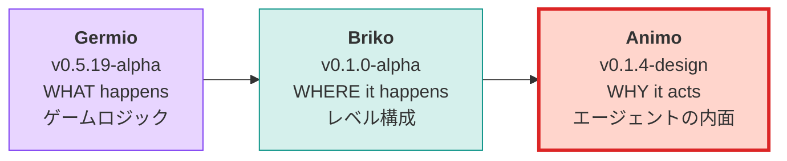

### 1.2 ライブラリ識別子

| 項目 | 値 |
|---|---|
| パッケージ名 | `com.meowtoon.animo` |
| GitHub（当面） | `github.com/hiroxpepe/animo` |
| GitHub（将来） | `github.com/meowtoon/animo` |
| ライセンス | MIT |
| Unity 最低バージョン | 2022.3 |

---

## 2. G+B+A スタック思想

ゲーム開発を **3つの問い**に分解し、それぞれを独立したライブラリで担当する。

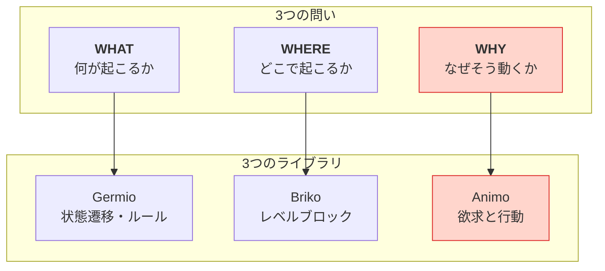

### 2.1 LLM ファースト設計

3 ライブラリすべてが **LLM が JSON を直接生成・編集する**ことを前提に設計されている。

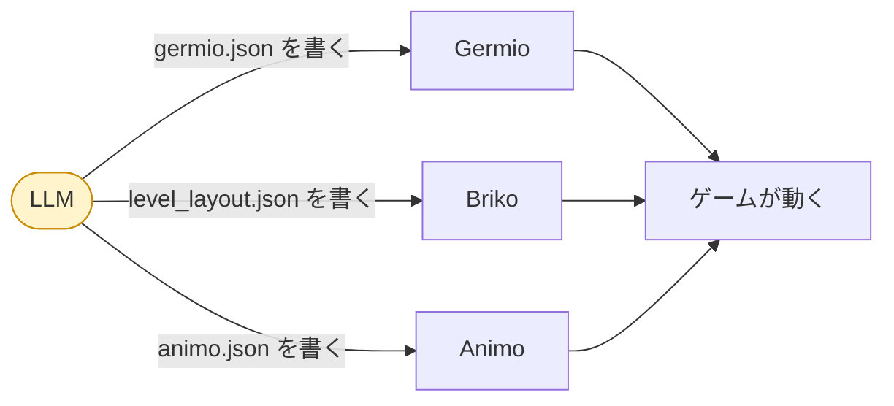

### 2.2 設計原則の継承

Animo は Germio・Briko の文化を踏襲する。

| 原則 | 内容 |
|---|---|
| **G16** | C# クラス名・JSON キー・Schema $defs・LLM 語彙を全層で同一名にする |
| **G17** | JSON 可視プロパティはすべて `snake_case` |
| **G18** | ネームスペース階層を厳守し依存方向を絶対に逆にしない |

### 2.3 Animo の核心思想（v0.1.1 で再定義）

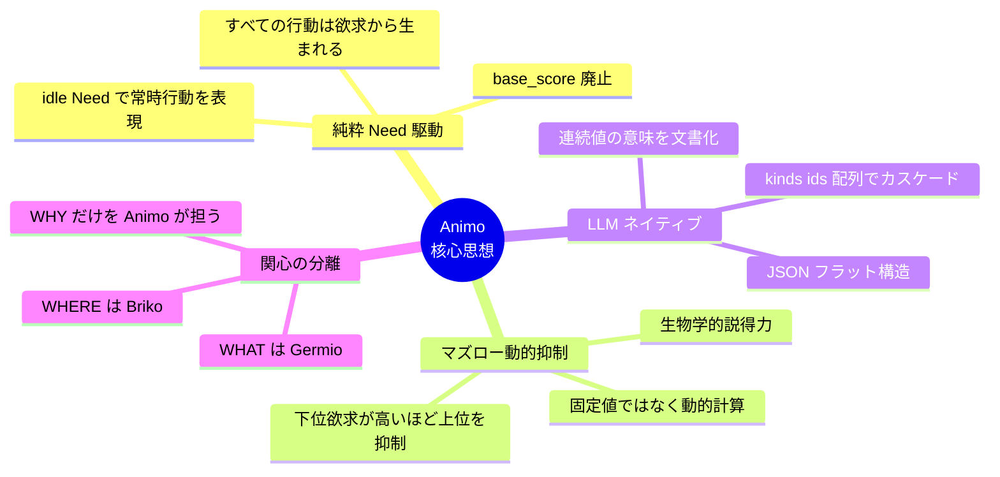

---

## 3. v0.1.3 → v0.1.4 変更点

### 3.1 概要：Reality Check への対応

v0.1.3 までは **Animo 単体としての設計純度**を磨き上げてきた。Gemini Pro の3度の批評で、思想・数学・パフォーマンスは商業レベルの完成度に到達した。

しかし第4回批評は別次元の指摘だった——「**Utility AI が現場運用に直面する3つの壁**」：

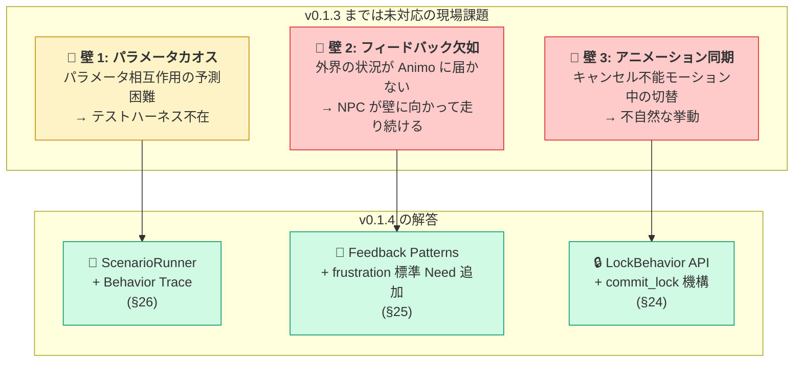

### 3.2 主な変更（破壊的でない・追加のみ）

| 変更 | v0.1.3 | v0.1.4 | 理由 |
|---|---|---|---|
| **Engine API 追加** | — | `Lock(duration, mode)` / `Unlock()` メソッド追加 | 行動ロック機構（壁3） |
| **標準 Need 追加** | 7 個（hunger〜idle） | **8 個（+ frustration）** | フィードバックパターン用（壁2） |
| **新章 §24** | — | 行動ロックとアニメ同期 | 壁3の運用パターン明文化 |
| **新章 §25** | — | Germio フィードバックループ | 壁2の運用パターン明文化 |
| **新章 §26** | — | テストハーネスとシミュレータ | 壁1の運用支援仕様 |
| **Validator** | A000–A029 | **A000–A032**（A030/A031/A032 追加） | 新 Need / 新 API 用 |
| schema_version | `"1.3"` | `"1.4"` | frustration 追加・新フィールド対応 |

### 3.3 後方互換性

**v0.1.4 は v0.1.3 から後方互換**（破壊的変更なし）。

- 既存の `animo.json` (`schema_version: 1.3`) は schema_version の更新だけで動作
- `frustration` Need は追加されたが、JSON で言及しなければ 0.0 として扱われる（既存挙動と同じ）
- `Lock()` API は新規追加。既存ゲームコードに影響なし

### 3.4 Engine API の拡張

```csharp
// 既存（v0.1.3）
public void Live(float dt);
public void Affect(string need, float delta, bool force_reset = false);
public string behavior { get; }

// 🆕 v0.1.4 追加
public void Lock(float duration, LockMode mode = LockMode.Hard);
public void Unlock();
public bool is_locked { get; }
public string locked_behavior { get; }
```

詳細は §24 参照。

### 3.5 標準 Need の拡張

| Need | Tier | 用途 |
|---|---|---|
| hunger | 1 | 生理的欠乏 |
| fatigue | 1 | 生理的欠乏 |
| fear | 2 | 安全 |
| loneliness | 3 | 社会的 |
| confidence | 4 | 承認・自尊 |
| curiosity | 5 | 自己実現 |
| idle | 5 | 常時行動（v0.1.1 追加） |
| **frustration** | **2** | **🆕 v0.1.4 — 行動失敗の蓄積** |

`frustration` を Tier2（fear と同階層）に置く根拠：

- 「失敗の蓄積」は心理的な脅威・不快として作用する
- 上昇すると上位 Need（loneliness / curiosity 等）を抑制する
- マズロー階層では「安全欲求の不充足」と同じ作用機序
- LLM が直感的にスコアを操作できる位置

### 3.6 Validator 追加ルール

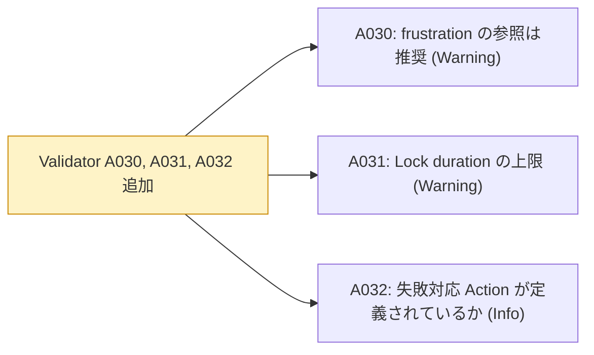

| ID | 内容 | 種別 |
|---|---|---|
| A030 | `frustration` を参照する `actions` または `influences` がない場合（フィードバック設計の欠如疑い） | Warning |
| A031 | `Lock(duration)` の duration が 30 秒を超える（暴走の恐れ） | Warning（実行時） |
| A032 | `actions` の中に `idle` 以外の「失敗時 fallback」となる Action があるか確認 | Info |

### 3.7 Gemini 第四批評の取り込み総括

| 指摘 | 対応 | 反映章 |
|---|---|---|
| 1. パラメータチューニングのカオス | ✅ 採用（テストハーネス仕様化） | §26 |
| 2. フィードバックループの欠如 | ✅ 採用（frustration 追加・パターン集） | §25 |
| 3. アニメーション同期問題 | ✅ 採用（Lock/Unlock API 追加） | §24 |

**Gemini Pro の四度目の批評は、Utility AI というパラダイム自体の運用課題を突いてきた。仕様純度を保ったまま、運用層を厚くすることで応える。**

---

## 4. アーキテクチャ全景

Animo の内部構造を一望する。

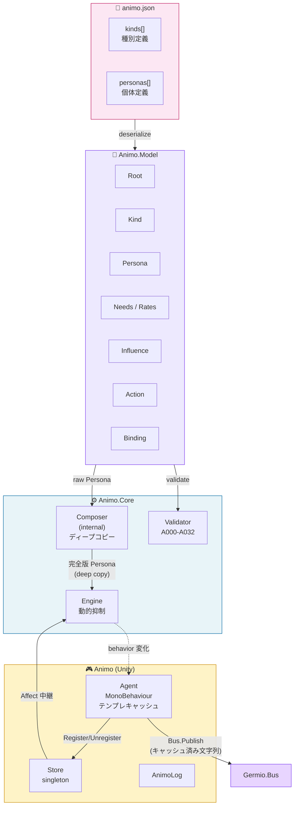

---

## 5. ネームスペース階層と依存方向

**G18 厳守。** 上位は下位に依存できるが、下位は上位を知ってはならない。

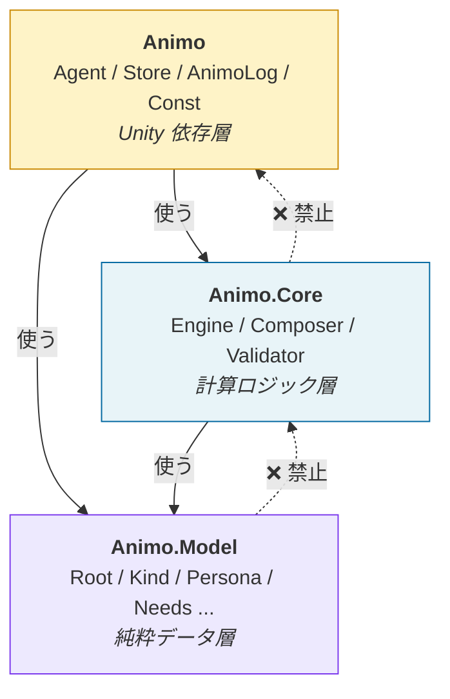

### 5.1 各層の責務

| 層 | 責務 | 依存可能 |
|---|---|---|
| `Animo.Model` | 純粋データクラス。`animo.json` の構造をそのまま表現 | なし |
| `Animo.Core` | 計算ロジック。Unity 非依存でテスト可能 | `Animo.Model` |
| `Animo` | Unity 統合層。MonoBehaviour と Germio 接続 | `Animo.Core` `Animo.Model` |

---

## 6. クラス全一覧

### 6.1 全クラスのカード（v0.1.4）

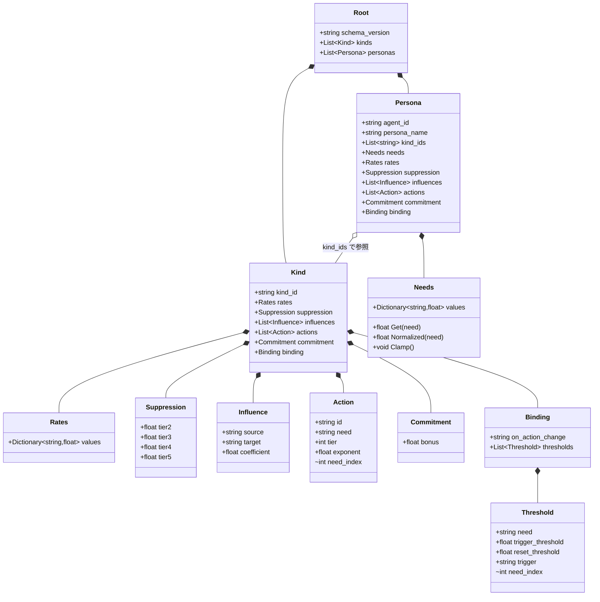

### 6.2 v0.1.0 からの差分

| クラス | 変更 |
|---|---|
| `Action` | `base_score` 削除・`need` 必須化 (v0.1.1)・`internal int need_index` キャッシュ追加 (v0.1.3) |
| `Threshold` | `threshold` → `trigger_threshold` / `reset_threshold` の二段閾値 (v0.1.1)・`internal int need_index` キャッシュ追加 (v0.1.3) |
| `Needs` | `Clamp()` メソッド追加（[0, 100] 強制） (v0.1.1) |
| `Hysteresis` → `Commitment` | クラス名変更 (v0.1.3)・`decay` フィールド削除 (v0.1.3) |
| `Engine` | **Lock / Unlock API 追加 (v0.1.4)** |
| `Animo.Tools.ScenarioRunner` | **新規追加 (v0.1.4)** — オフラインシミュレータ |
| `LockMode` enum | **新規追加 (v0.1.4)** — Hard / Soft |

### 6.3 全クラス表

| ネームスペース | クラス | 役割 | 公開度 |
|---|---|---|---|
| `Animo.Model` | `Root` | JSON ルート | public |
| `Animo.Model` | `Kind` | 種別定義 | public |
| `Animo.Model` | `Persona` | 個体定義 | public |
| `Animo.Model` | `Needs` | 欲求の値セット（Clamp 可能） | public |
| `Animo.Model` | `Rates` | 欲求の変化率 | public |
| `Animo.Model` | `Suppression` | 階層抑制係数（動的計算用） | public |
| `Animo.Model` | `Influence` | 欲求間の影響 | public |
| `Animo.Model` | `Action` | 行動定義（need 必須・base_score なし） | public |
| `Animo.Model` | `Commitment` | 行動継続ボーナス（永続） | public |
| `Animo.Model` | `Binding` | Germio との接続 | public |
| `Animo.Model` | `Threshold` | 二段閾値トリガー | public |
| `Animo.Core` | `Composer` | Kind 合成（ディープコピー） | **internal** |
| `Animo.Core` | `Engine` | AI 計算本体（動的抑制 + Lock 機構） | public |
| `Animo.Core` | `Validator` | animo.json 検証（A000–A032） | public |
| `Animo.Core` | `LockMode` | enum: Hard / Soft（v0.1.4） | public |
| `Animo` | `Agent` | MonoBehaviour ラッパー（テンプレキャッシュ） | public |
| `Animo` | `Store` | 全 Agent の窓口（シングルトン） | public |
| `Animo` | `AnimoLog` | ロガー | public |
| `Animo` | `Const` | ドメイン定数 | public static |
| `Animo.Tools` | `ScenarioRunner` | オフラインシミュレータ（v0.1.4） | public |
| `Animo.Tools` | `TraceResult` | シミュレーション結果（v0.1.4） | public |
| `Animo.Tools` | `TraceFrame` | フレーム単位の状態スナップショット（v0.1.4） | public |
| `Animo.Tools` | `AffectEvent` | 時刻指定 Affect 注入（v0.1.4） | public |

---

## 7. animo.json スキーマ

### 7.1 完全版サンプル（v0.1.1）

```json
{
  "schema_version": "1.4",
  "kinds": [
    {
      "kind_id": "goblin",
      "rates": {
        "hunger": 2.0, "fatigue": 1.5, "fear": -2.0,
        "loneliness": 1.2, "confidence": -0.3,
        "curiosity": 0.8, "idle": 0.5, "frustration": -1.0
      },
      "suppression": {
        "tier2": 0.30, "tier3": 0.50, "tier4": 0.70, "tier5": 0.90
      },
      "influences": [
        { "source": "fear",        "target": "confidence", "coefficient": -0.60 },
        { "source": "fear",        "target": "curiosity",  "coefficient": -0.50 },
        { "source": "hunger",      "target": "fear",       "coefficient":  0.25 },
        { "source": "frustration", "target": "fear",       "coefficient":  0.30 },
        { "source": "frustration", "target": "confidence", "coefficient": -0.40 }
      ],
      "actions": [
        { "id": "Flee",       "need": "fear",      "tier": 2, "exponent": 2.5 },
        { "id": "SearchFood", "need": "hunger",    "tier": 1, "exponent": 1.8 },
        { "id": "Rest",       "need": "fatigue",   "tier": 1, "exponent": 1.5 },
        { "id": "Patrol",     "need": "idle",      "tier": 5, "exponent": 1.0 }
      ],
      "commitment": { "bonus": 10 },
      "binding": {
        "on_action_change": "animo_{agent_id}_{behavior}",
        "thresholds": [
          {
            "need": "fear",
            "trigger_threshold": 80,
            "reset_threshold": 70,
            "trigger": "animo_{agent_id}_fear_critical"
          }
        ]
      }
    },
    {
      "kind_id": "scout",
      "influences": [
        { "source": "fear", "target": "confidence", "coefficient": -0.30 }
      ],
      "actions": [
        { "id": "Socialize", "need": "loneliness", "tier": 3, "exponent": 1.3 }
      ]
    }
  ],
  "personas": [
    {
      "agent_id": "goblin_scout_01",
      "persona_name": "Goblin Scout — Timid Skirmisher",
      "kind_ids": ["goblin", "scout"],
      "needs": {
        "hunger": 40, "fatigue": 20, "fear": 55,
        "loneliness": 60, "confidence": 35,
        "curiosity": 45, "idle": 30, "frustration": 0
      }
    }
  ]
}
```

### 7.2 JSON キー一覧（G16 一致）

| C# クラス | JSON キー | 個数 |
|---|---|---|
| `Root` | — | ルートのためキーなし |
| `Kind` | `kinds` | 配列（複数形） |
| `Persona` | `personas` | 配列（複数形） |
| `Needs` | `needs` | オブジェクト |
| `Rates` | `rates` | オブジェクト |
| `Suppression` | `suppression` | オブジェクト |
| `Influence` | `influences` | 配列（複数形） |
| `Action` | `actions` | 配列（複数形） |
| `Commitment` | `commitment` | オブジェクト |
| `Binding` | `binding` | 単数 |
| `Threshold` | `thresholds` | 配列（`binding` 内） |

### 7.3 オプション項目と省略可能性

| キー | 省略可? | デフォルト |
|---|---|---|
| `actions[].need` | ❌ **必須**（v0.1.0 から変更） | — |
| `actions[].base_score` | — **廃止**（v0.1.0 から削除） | — |
| `commitment.bonus` | ✅ | `0.0`（v0.1.3：`commitment` 自体を省略可） |
| `commitment.decay` | — **廃止**（v0.1.3 から削除） | — |
| `binding.on_action_change` | ✅ | エンジン固定 `animo_{agent_id}_{behavior}` |
| `binding.thresholds[].reset_threshold` | ✅ | `trigger_threshold - 5.0` |
| `kind_ids` | ✅ | 空配列（合成なし） |
| `persona.rates` 以下のフィールド | ✅ | `Kind` から継承 |

### 7.4 schema_version の更新

`"1.3"` → `"1.4"`。後方互換あり（破壊的変更なし）。`frustration` Need の追加と `Lock` API の追加に対応。詳細は §3 参照。

---

## 8. Kind × Persona カスケーディング

### 8.1 思想：CSS と同じ後勝ちカスケード

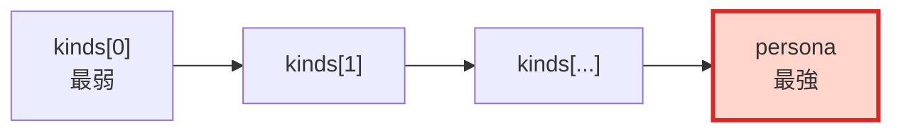

### 8.2 合成ルール（v0.1.1 で明文化）

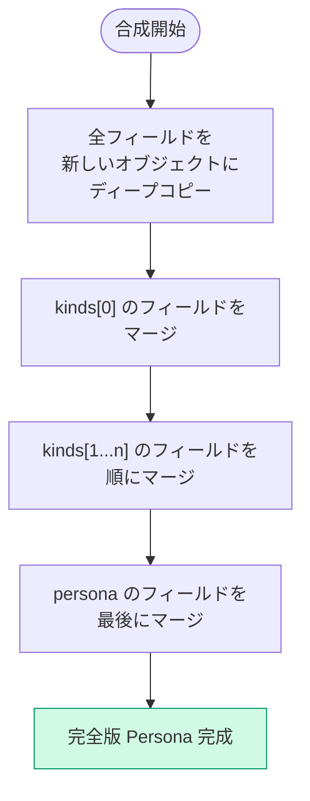

### 8.3 マージ単位の確定（Gemini D-1 対応）

| 対象 | 合成方法 | 備考 |
|---|---|---|
| スカラー値（`commitment.bonus`） | フィールド単位後勝ち | 値が定義されているフィールドのみ上書き |
| オブジェクト（`commitment` 全体） | **フィールド単位後勝ち（深いマージ）** | （v0.1.3 では `commitment` は `bonus` のみだが、将来的に他フィールドが増えた場合に該当） |
| Dictionary（`needs` `rates`） | キー単位で後勝ち | キー単位 |
| 配列（`actions`） | `id` で照合し後勝ち | 既存 `id` は上書き、新規 `id` は追加 |
| 配列（`influences`） | `source`+`target` で照合し後勝ち | 同 |
| 配列（`thresholds`） | `need` で照合し後勝ち | 同 |

### 8.4 オブジェクト合成の具体例

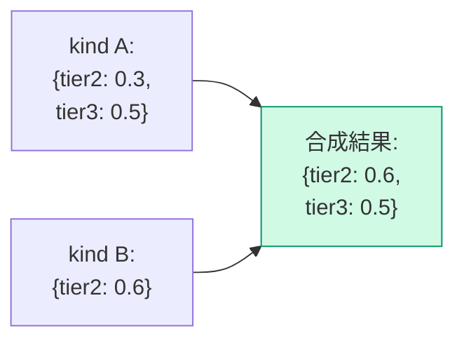

`tier2` のみ上書き、`tier3` は維持。**オブジェクト丸ごと置換ではない。**

### 8.5 配列合成の具体例

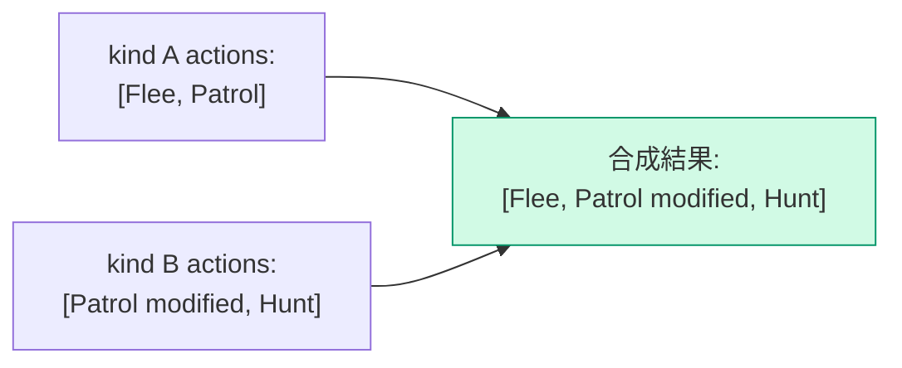

`Patrol` は kind B 版で上書き、`Flee` は維持、`Hunt` が追加。

### 8.6 多重継承の例：「日本人 × A型 × 男性 → 山田太郎」

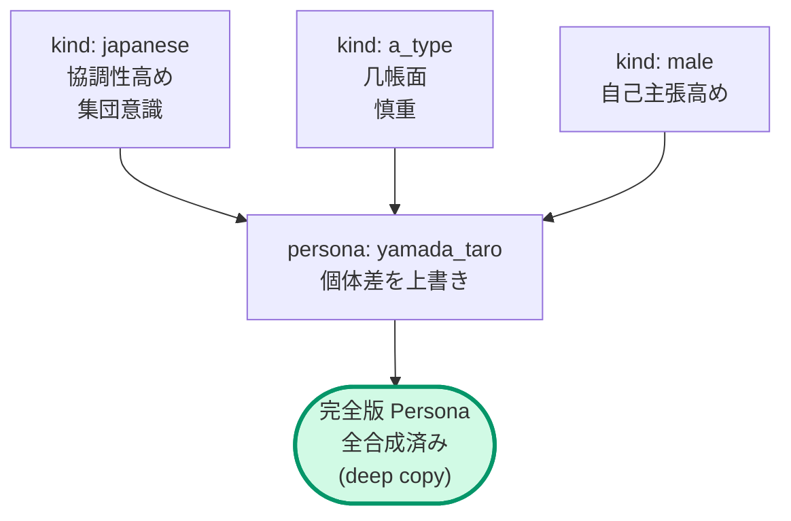

### 8.7 推論と演算の分離

LLM は `kind_ids` の配列順を書くだけ。後勝ちの合成計算は `Composer` が担当する。

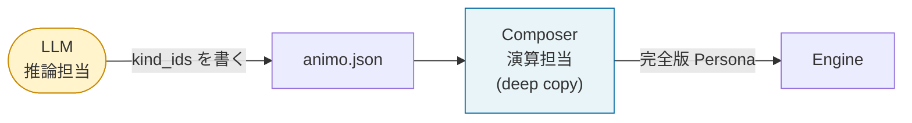

### 8.8 暗黙の Need 初期値（Gemini D-2 対応）

`Kind` の `rates` `influences` `actions` で言及されている Need キーが、`Persona` の `needs` に未定義の場合：

```
未定義 Need キーの初期値 = 0.0
```

ランタイムは Warning（A020a/b/c）を出すが、ゲームは止めない。`Composer` が暗黙的に `needs[missing_key] = 0.0` を生成する。

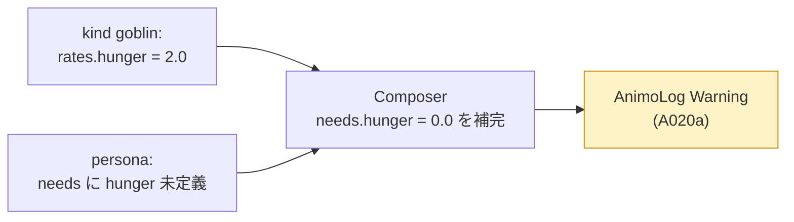

---

## 9. Engine の内部設計

### 9.1 公開 API

| 種別 | 名前 | 内容 | 追加 |
|---|---|---|---|
| コンストラクタ | `Engine(Persona persona)` | `Composer` が生成した完全版 `Persona` を受け取る | v0.1.0 |
| メソッド | `Live(float dt)` | 時間を進める（5ステップ処理） | v0.1.0 |
| メソッド | `Affect(string need, float delta, bool force_reset = false)` | 外部刺激を与える（§9.7） | v0.1.0 |
| プロパティ | `behavior` | 現在の行動（string） | v0.1.0 |
| メソッド | `Lock(float duration, LockMode mode = LockMode.Hard)` | 行動ロック（§24） | **🆕 v0.1.4** |
| メソッド | `Unlock()` | ロック解除 | **🆕 v0.1.4** |
| プロパティ | `is_locked` | ロック状態（bool） | **🆕 v0.1.4** |
| プロパティ | `locked_behavior` | ロック中の固定行動（string） | **🆕 v0.1.4** |

### 9.2 Live() の5ステップ（v0.1.3 改訂、v0.1.4 で Lock 対応）

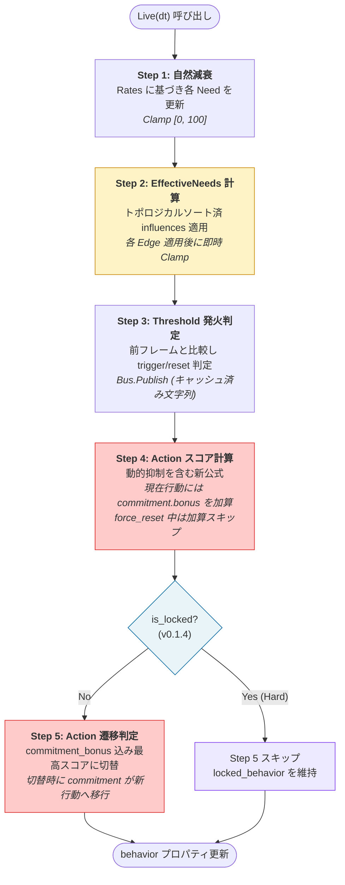

#### 9.2.1 v0.1.2 / v0.1.3 / v0.1.4 の変更点

| ステップ | v0.1.2 | v0.1.3 | v0.1.4 |
|---|---|---|---|
| Step 3 | Hysteresis 減衰（時間） | Threshold 発火判定 | （v0.1.3 と同じ） |
| Step 4 | hysteresis_bonus を加算 | commitment.bonus を加算（force_reset 中はスキップ） | （v0.1.3 と同じ） |
| Step 5 | hysteresis が 0 なら最高スコアに切替 | commitment_bonus 込みの最高スコアに切替 | **`is_locked` のとき Step 5 スキップ**（Lock 機構） |

### 9.3 マズロー動的抑制（v0.1.1 で導入、v0.1.2 で完成、v0.1.3 で参照元明文化）

#### 9.3.1 問題意識（v0.1.0 までの欠陥）

v0.1.0 までの計算式：

```
score = Pow(intensity, exp) × (1 - suppression[tier]) × 100 + base_score + hysteresis_bonus
```

`suppression[tier]` が固定値だったため、「下位欲求が満たされていないと上位が抑制される」というマズロー理論の核心が**機能していなかった**。

#### 9.3.2 v0.1.1 の改訂

`suppression_amount` を下位 Tier の最大正規化 Need に依存させた：

```
suppression_amount[tier] = suppression_factor[tier] × max_lower_tier_intensity
```

しかし v0.1.1 では Hysteresis が抑制の**外側**にあり、**マズロー絶対主義が Hysteresis に乗っ取られる**致命的バグが残っていた。

#### 9.3.3 v0.1.2 の公式

Hysteresis を抑制の**内側**に移動：

```
score = (Pow(intensity, exp) × 100 + hysteresis_bonus) × (1 - suppression_amount[tier])
```

#### 9.3.4 v0.1.3 の最終形 — 参照元の明文化と commitment への対応

`hysteresis_bonus` を `commitment_bonus` に置き換え：

```
score = (Pow(intensity, exp) × 100 + commitment_bonus) × (1 - suppression_amount[tier])
```

そして **`max_lower_tier_intensity` の参照元を明確に EffectiveNeeds に確定**：

```
max_lower_tier_intensity = max(
    eff_needs[tier1 needs] / 100,
    eff_needs[tier2 needs] / 100,
    ...,
    eff_needs[(tier-1) needs] / 100
)
```

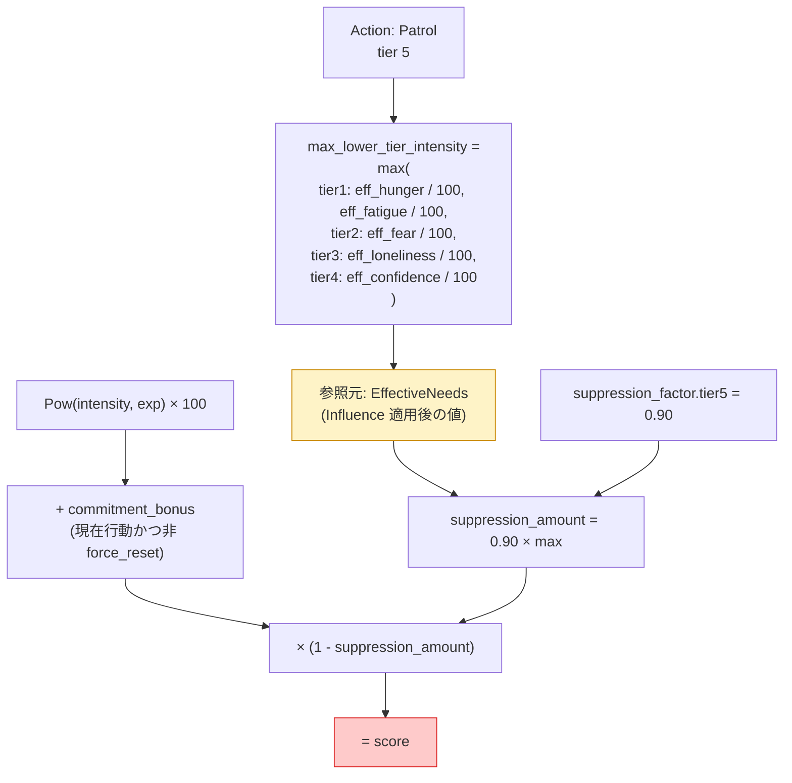

**EffectiveNeeds 参照の根拠：**
- Animo の哲学「最終的な内面が行動を駆動する」と一貫
- スコア計算の `intensity` も EffectiveNeeds を使う（一貫性）
- Influence で増幅された欲求も「現在の内面」として尊重
- 実装者が `_needs` 配列を参照するバグを防ぐ

#### 9.3.5 v0.1.3 公式の動作シミュレーション

`Daydream` (idle, tier=5)、`SearchFood` (hunger, tier=1, exp=1.8)、`commitment.bonus = 50`、`suppression_factor.tier5 = 0.90` の場合：

| 状態 | hunger | idle | suppression_amount | Daydream score | SearchFood score | 選択 |
|---|---|---|---|---|---|---|
| 平和 | 20 | 70 | 0.18 | (70+50)×0.82=98.4 | 6.9 | Daydream ✅ |
| 軽空腹 | 50 | 70 | 0.45 | (70+50)×0.55=66.0 | 32 | Daydream ✅ |
| 本格空腹 | 70 | 70 | 0.63 | (70+50)×0.37=44.4 | 53 | **SearchFood ✅** |
| 餓死寸前 | 100 | 70 | 0.90 | (70+50)×0.10=12.0 | 100 | SearchFood ✅ |

**「腹が減ったら食う」が commitment に邪魔されず自然発火する。マズロー絶対主義が貫かれる。**

#### 9.3.6 Tier1 の特例

Tier1 アクションには下位 Tier がない。`max_lower_tier_intensity = 0` として計算 → `suppression_amount = 0` → 抑制なし。最低限の生命維持欲求は常に発火可能。

### 9.4 Utility スコア計算式の完全形（v0.1.3 確定）

```
score = (Pow(intensity, exponent) × 100 + commitment_bonus) × (1 - suppression_factor[tier] × max_lower_tier_intensity)
```

| 変数 | 取りうる値 | 意味 |
|---|---|---|
| `intensity` | 0.0–1.0 | EffectiveNeeds 後の正規化された欲求強度 |
| `exponent` | 0.1–5.0 | Action の感度曲線形状 |
| `suppression_factor[tier]` | 0.0–1.0 | この tier に適用される最大抑制率 |
| `max_lower_tier_intensity` | 0.0–1.0 | 下位 tier 中の最大正規化 EffectiveNeeds（v0.1.3 で参照元明文化） |
| `commitment_bonus` | 0.0–∞ | 現在選択中 Action にのみ加算される維持ボーナス（永続）。`force_reset` 中は 0 扱い |

`base_score` は v0.1.1 で廃止済み。`hysteresis_*` は v0.1.3 で `commitment_*` に改名。

### 9.5 exponent の感度曲線（Gemini F-1 対応）

#### 9.5.1 数学的事実

`Pow(intensity, exponent)` は intensity が 0–1 のとき、exponent によって曲線が変わる：

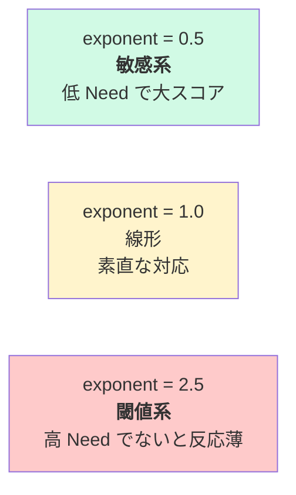

#### 9.5.2 具体的な値の対応

| intensity | exp=0.5 | exp=1.0 | exp=2.0 | exp=2.5 | exp=5.0 |
|---|---|---|---|---|---|
| 0.1 | 0.316 | 0.100 | 0.010 | 0.003 | 0.00001 |
| 0.3 | 0.548 | 0.300 | 0.090 | 0.049 | 0.002 |
| 0.5 | 0.707 | 0.500 | 0.250 | 0.177 | 0.031 |
| 0.7 | 0.837 | 0.700 | 0.490 | 0.410 | 0.168 |
| 0.9 | 0.949 | 0.900 | 0.810 | 0.768 | 0.590 |
| 1.0 | 1.000 | 1.000 | 1.000 | 1.000 | 1.000 |

#### 9.5.3 LLM への意味

| 求める挙動 | exponent の値 |
|---|---|
| すぐ反応する敏感な Action | 0.5 程度 |
| Need に比例（直感的） | 1.0 |
| ある程度高くないと発動しない | 2.0 |
| 限界まで我慢して爆発 | 3.0–5.0 |

このマッピングは章 19「LLM プロンプトのためのチートシート」に詳述。

### 9.6 EffectiveNeeds カスケード（v0.1.2 改訂）

#### 9.6.1 問題：配列順依存バグ（v0.1.0）

v0.1.0 では `influences` を配列順に適用していたため、依存順序によって結果が変わった。

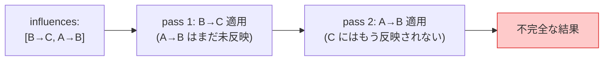

#### 9.6.2 v0.1.2 の解決策（v0.1.1 の反復計算を撤回）

**v0.1.1 の妥協（撤回）：** 循環参照時は3パス反復計算で近似 → 数値解析的に発散・振動する危険があった。

**v0.1.2 の確定方針：**

1. **依存グラフ構築（DAG）**：`influences` の `source → target` から有向グラフ生成
2. **循環検出**：DAG が成立しなければ Validator が **Error**（A025）として拒否。実行に到達しない
3. **トポロジカルソート**：DAG を順序確定
4. **単一パス適用**：各 Edge を順序通りに適用
5. **各 Edge 適用後に即時 Clamp**：中間値を [0, 100] に強制（次節）

```mermaid
flowchart TB
  Start(["influences[]"])
  Build["依存グラフ構築"]
  Check{"循環あり?"}
  Reject["❌ Validator Error<br/>A025"]
  Topo["トポロジカルソート"]
  Loop["各 Edge を順次適用<br/>→ 即時 Clamp"]
  End(["EffectiveNeeds 確定<br/>常に [0, 100]"])
  Start --> Build --> Check
  Check -->|"Yes"| Reject
  Check -->|"No"| Topo --> Loop --> End
  style Reject fill:#fecaca,stroke:#dc2626
  style Loop fill:#fef3c7,stroke:#ca8a04
  style End fill:#d1fae5,stroke:#059669
```

#### 9.6.3 中間 Clamp の重要性（v0.1.2 で明文化）

`A → B (-1.0)`、`B → C (+1.0)` の連鎖で A=100、B=50 のとき：

| Clamp タイミング | B の中間値 | C への影響 | C の最終値 | 評価 |
|---|---|---|---|---|
| 全パス後にだけ | 一時的に -50 | -50 として伝播 | 不当に下がる | ❌ バグ |
| **各 Edge 適用後**（v0.1.2 採用） | 0 にクランプ | 0 として伝播 | 影響なし | ✅ 生物的に正しい |

**根拠：** 「ないもの（負値）」が「あるもの（次の Need）」に影響するのは生物学的に不自然。中間状態の負値は伝播させない。

#### 9.6.4 循環参照の Error 化（v0.1.1 の反復計算を撤回）

`fear → confidence → fear` のような循環は **Validator A025 が Error として拒否**する。

```mermaid
flowchart LR
  A["fear"]
  B["confidence"]
  A -->|"-0.6"| B
  B -->|"-0.5"| A
  Reject["❌ Validator Error<br/>(A025)<br/>JSON 拒否"]
  A --> Reject
  B --> Reject
  style Reject fill:#fecaca,stroke:#dc2626
```

**根拠：**
- v0.1.1 の反復計算は減衰のないループで振動・発散する数学的危険性
- PageRank 流の収束保証（学習率 α）は LLM の認知負荷増・過剰設計
- 循環は人間の感覚としても直感的でない（「A が B を減らし、B が A を減らす」は無限ループ）
- 循環が必要な意図が出てきたら v0.2 で再検討

#### 9.6.5 Gemini fix のカスケード修正

`eff` を source にすることで A→B→C の連鎖が機能する（v0.1.0 で取り込み済み）：

```csharp
// ✅ v0.1.0 から導入済み
float intensity = eff.Normalized(inf.source);
float delta     = inf.coefficient * intensity * eff.Get(inf.source);
// v0.1.2 追加: ここで即時 Clamp
eff.Set(inf.target, Mathf.Clamp(eff.Get(inf.target) + delta, 0f, 100f));
```

### 9.7 Affect() の動作（v0.1.3 で force_reset 再定義）

#### 9.7.1 force_reset の v0.1.3 における正確な意味

```
force_reset: true → 次回 Live() のスコア計算で、現在行動の commitment_bonus を「1 フレームだけ」加算しない。
                    (commitment 自体は破棄せず、保護を一時的に無効化するだけ)
```

**強制切替ではなく「commitment による保護を1フレームだけ無効化する割り込み機能」。**

#### 9.7.2 動作フロー

```mermaid
flowchart TB
  In(["Affect(need, delta, force_reset)"])
  Add["Needs[need] += delta<br/>Clamp [0, 100]"]
  Q{"force_reset?"}
  Flag["_force_reset_pending = true"]
  Skip["Live Step 4: 現在行動の commitment_bonus 加算スキップ"]
  Reset["Step 4 終了後 _force_reset_pending = false"]
  Keep["通常通り commitment 加算"]
  End(["Step 5 で純粋スコア競争"])
  In --> Add --> Q
  Q -->|"true"| Flag --> Skip --> Reset --> End
  Q -->|"false (default)"| Keep --> End
  style Q fill:#e8f4f8,stroke:#0369a1
  style Skip fill:#fef3c7,stroke:#ca8a04
```

#### 9.7.3 force_reset の使い所

| シナリオ | 用法 |
|---|---|
| プレイヤーを発見 | `Affect("fear", +50, force_reset: true)` — 頑固な NPC でも反応 |
| 攻撃を受けた | `Affect("fear", +30, force_reset: true)` — 即時反応 |
| 通常の自然変化 | `Affect("hunger", +5)` — 通常呼び出し（force_reset 不要） |

#### 9.7.4 Animo 哲学との整合

「Affect は内面（Need）への影響であって、行動の決定ではない」という哲学は維持される。`force_reset` は別概念として明確に分離された割り込み機能。**強制的に行動を切り替えるのではなく、「commitment による保護を1フレーム解除する」だけ。** 切替するかどうかは依然として Step 5 のスコア競争に委ねられる。

### 9.8 Commitment の動作（v0.1.3 で永続化）

```mermaid
sequenceDiagram
  autonumber
  participant T as Time
  participant E as Engine
  participant B as behavior
  Note over E,B: behavior = "Patrol"<br/>commitment.bonus = 10 (常時)
  T->>E: Live(dt)
  Note over E: Patrol score に +10 常時加算<br/>commitment は減衰しない
  T->>E: Affect("fear", +50)
  Note over E: Flee score 上昇<br/>(commitment は Patrol に残る)
  T->>E: Live(dt)
  Note over E: Step 4: Patrol score = pure + 10<br/>      Flee score = pure
  Note over E: Step 5: Flee > (Patrol + 10) なら切替
  alt Flee score > Patrol + 10
    E->>E: behavior = "Flee"<br/>commitment が Flee に移行
    Note over E: Flee score = pure + 10 (これ以降)
  else 維持
    Note over E: Patrol 継続
  end
```

#### 9.8.1 v0.1.2 からの変更

| 項目 | v0.1.2 | v0.1.3 |
|---|---|---|
| 名前 | `hysteresis` | `commitment` |
| 時間挙動 | `bonus -= decay × dt` で減衰 | **永続的に固定値**（減衰なし） |
| アンダーフロー対策 | `Max(0, ...)` 必要 | 不要（減衰しないため） |
| 切替時の挙動 | bonus が 0 になっていた場合のみ切替可 | **常に純粋スコアで競争**（commitment 込み） |

#### 9.8.2 真のチャタリング防止（CSS ヒステリシス的構造）

```mermaid
flowchart LR
  PatPat["Patrol中:<br/>Patrol+10 vs Flee"]
  Switch1["Flee score が Patrol+10 を超える"]
  FleeFlee["Flee中:<br/>Flee+10 vs Patrol"]
  Switch2["Patrol score が Flee+10 を超える<br/>(=実質 Patrol 高得点必要)"]
  PatPat -->|"切替条件: +10 差"| Switch1 --> FleeFlee
  FleeFlee -->|"戻り条件: 逆方向 +10 差"| Switch2 --> PatPat
  style FleeFlee fill:#fecaca
  style PatPat fill:#fef3c7
```

これがまさに **Hysteresis の二段閾値構造** を Action 切替に適用したもの。Patrol→Flee は score +10 差で切替、Flee→Patrol は逆方向 +10 差まで戻らない。**真のチャタリング根絶。**

### 9.9 Needs の Clamping（v0.1.2 で完全明文化）

すべての Need の値は **常に [0, 100]** に強制される：

```mermaid
flowchart TB
  Source(["Need への変更が起きる場面"])
  Source --> P1["Live Step 1: rates 適用後"]
  Source --> P2["Affect 呼び出し時"]
  Source --> P3["Composer 合成時"]
  Source --> P4["Influence 各 Edge 適用後<br/>(v0.1.2 で明文化)"]
  P1 & P2 & P3 & P4 --> C["Mathf.Clamp(value, 0, 100)"]
  C --> R(["Need の値が確定"])
  style C fill:#fef3c7,stroke:#ca8a04
  style P4 fill:#fecaca,stroke:#dc2626
```

これによって `Pow(intensity, exp)` の `intensity` が 1.0 を超えてスコアが爆発する事故、および中間 Clamp 漏れによる連鎖伝播バグの両方を防ぐ。

---

## 10. Composer の責務とディープコピー

### 10.1 なぜ専用クラスか

`Engine` は純粋な計算エンジンであるべき。Kind 合成という「変換ロジック」を `Engine` の中に置くと責務が混在する。`Composer` を独立させることで：

- `Engine` が `Root` を知らずに済む
- `Composer` 単体テストが書ける
- 合成ロジックが複雑化しても `Engine` `Store` に影響しない

### 10.2 ディープコピー必須（Gemini E-1 対応）

#### 10.2.1 問題

シャローコピー（参照渡し）で合成すると、複数の Persona が同じ Kind を参照したとき、ランタイムでの内部書換えが他 Persona に伝染する**参照汚染バグ**が発生する。

```mermaid
flowchart LR
  K["kinds[goblin]<br/>actions = [Flee, Patrol]"]
  P1["persona A<br/>(shallow copy)"]
  P2["persona B<br/>(shallow copy)"]
  Bug["A の actions を編集<br/>→ B にも反映！"]
  K --> P1
  K --> P2
  P1 -.->|"❌ 共有参照"| Bug
  P2 -.->|"❌ 共有参照"| Bug
  style Bug fill:#fecaca,stroke:#dc2626
```

#### 10.2.2 解決：ディープコピー

```mermaid
flowchart LR
  K["kinds[goblin]"]
  P1["persona A<br/>(deep copy)<br/>独立インスタンス"]
  P2["persona B<br/>(deep copy)<br/>独立インスタンス"]
  K --> P1
  K --> P2
  style P1 fill:#d1fae5,stroke:#059669
  style P2 fill:#d1fae5,stroke:#059669
```

#### 10.2.3 実装方針

```csharp
internal static class Composer {
    internal static Persona Compose(Persona persona, Root root) {
        // 1. 完全に新しい Persona インスタンスを生成
        // 2. すべての参照型フィールドを new で再生成
        //    - Needs / Rates: new Dictionary
        //    - Influence / Action: new List + 各要素も new
        //    - Suppression / Hysteresis / Binding: new instance
        // 3. 値型はコピー（C# の値型挙動）
        // 4. kind_ids[] を順に処理。各 Kind のフィールドをマージ
        // 5. 最後に persona 自身のフィールドをマージ
        // 6. needs に未定義キーを 0.0 で補完
        // 7. 完全独立した完全版 Persona を返す
    }
}
```

### 10.3 利用フロー

```mermaid
sequenceDiagram
  autonumber
  participant Store
  participant Composer
  participant Engine
  participant Persona as Raw Persona<br/>(JSON 由来)
  participant Root
  Store->>Composer: Compose(persona, root)
  Composer->>Persona: kind_ids 取得
  Composer->>Root: kinds[] から該当 Kind を抽出
  Note over Composer: 配列順に後勝ちで合成<br/>すべてディープコピー<br/>未定義 Need を 0 で補完
  Composer-->>Store: 完全版 Persona (独立)
  Store->>Engine: new Engine(完全版 Persona)
  Engine-->>Engine: 内部状態を初期化
```

### 10.4 公開度

`internal class Composer` — 外部からは見えない。`Store` だけが呼ぶ。

---

## 11. Store API 仕様

### 11.1 役割

`agent_id` をキーに全 `Agent` を保持し、外部から `Affect` を届ける窓口。

### 11.2 仕様一覧

| 項目 | 内容 |
|---|---|
| パターン | シングルトン（v0.1.1 では維持。将来 DI 化を TODO へ） |
| 登録タイミング | `Agent.Awake` |
| 解除タイミング | `Agent.OnDestroy` |
| `agent_id` 未発見時 | `AnimoLog.Warning` を出して処理継続 |
| `Find` メソッド | `internal` — 外部非公開 |

### 11.3 公開 API

```csharp
// 登録
Animo.Store.Instance.Register(agent: this);

// 登録解除
Animo.Store.Instance.Unregister(agent: this);

// Affect 中継（Germio Executor から呼ばれる）
Animo.Store.Instance.Affect(
    agent_id:    "goblin_01",
    need:        "fear",
    delta:       +30f,
    force_reset: false
);
```

### 11.4 ライフサイクル

```mermaid
sequenceDiagram
  autonumber
  participant Unity
  participant Agent
  participant Store
  participant Engine
  Unity->>Agent: Awake()
  Agent->>Store: Register(agent: this)
  Note over Store: _agents[agent_id] = agent
  Agent->>Engine: new Engine(完全版 Persona)
  Note over Agent: 起動時にテンプレ文字列キャッシュ
  loop 毎フレーム
    Unity->>Agent: Update()
    Agent->>Engine: Live(Time.deltaTime)
    Engine-->>Agent: behavior 更新
    alt behavior が変化
      Agent->>Agent: キャッシュ済み文字列で Bus.Publish
    end
  end
  Note over Unity: シーン切替 or オブジェクト破棄
  Unity->>Agent: OnDestroy()
  Agent->>Store: Unregister(agent: this)
```

### 11.5 Affect 中継の流れ

```mermaid
sequenceDiagram
  autonumber
  participant Germio as Germio.Executor
  participant Store as Animo.Store
  participant Agent
  participant Engine
  Germio->>Store: Affect(agent_id, need, delta)
  Store->>Store: Find(agent_id)
  alt agent が存在する
    Store->>Agent: 該当 Agent 取得
    Agent->>Engine: Affect(need, delta, force_reset)
    Engine-->>Engine: Needs 更新（Clamp [0, 100]）
  else 存在しない
    Store-->>Store: AnimoLog.Warning("agent not found")
    Note over Store: ゲームは止めない
  end
```

---

## 12. Binding 動作仕様

### 12.1 Bus への参照

`Agent`（MonoBehaviour）が Inspector で `Bus` を受け取る。`Store` も `Engine` も `Bus` を直接持たない。

```mermaid
flowchart LR
  Inspector["Unity Inspector<br/>_BUS フィールド"]
  Agent["Animo.Agent<br/>(MonoBehaviour)"]
  Engine["Animo.Core.Engine"]
  Bus["Germio.Bus"]
  Inspector -.->|"SerializeField"| Agent
  Agent -->|"イベント時に Publish"| Bus
  Engine -->|"behavior 変化通知"| Agent
  style Bus fill:#e8d5ff,stroke:#7e3ff2
```

`Bus` が `null` のとき：`AnimoLog.Warning` を1回出して以後 Silent。Animo 単体使用も正当なユースケース。

### 12.2 on_action_change の発火（テンプレキャッシュ）

#### 12.2.1 問題：毎フレーム文字列生成 GC

v0.1.0 では behavior 変化のたびに `string.Format` でテンプレを展開していた。これは GC スパイクの原因。

#### 12.2.2 v0.1.1 の解決：起動時キャッシュ

```mermaid
sequenceDiagram
  autonumber
  participant Awake as Agent.Awake
  participant Cache as 文字列キャッシュ
  participant Engine
  participant Bus
  Awake->>Awake: 全 Action ID を列挙
  Awake->>Cache: 各 Action 用に展開済み文字列を作成
  Note over Cache: "animo_goblin_01_flee"<br/>"animo_goblin_01_patrol"<br/>...
  loop 毎フレーム
    Engine-->>Awake: behavior 変化
    Awake->>Cache: 即時取得（O(1)）
    Cache-->>Awake: キャッシュ済み文字列
    Awake->>Bus: Publish(cached)
  end
```

**毎フレームの文字列生成ゼロ。** Bus.Publish に渡す文字列は事前計算済み。

### 12.3 thresholds の発火（v0.1.1 ヒステリシス追加）

#### 12.3.1 問題：チャタリング（Gemini I-3 対応）

v0.1.0 は単一閾値 `threshold: 80` のみ。値が 79.9 ↔ 80.1 を行き来すると毎フレーム発火する。

#### 12.3.2 解決：二段閾値

```mermaid
stateDiagram-v2
  [*] --> Below
  Below --> Below : need < trigger_threshold
  Below --> Above : need >= trigger_threshold (発火!)
  Above --> Above : need > reset_threshold
  Above --> Below : need <= reset_threshold (リセット)
  note right of Above : Bus.Publish 1回のみ
  note right of Below : 再発火可能
```

`trigger_threshold = 80`、`reset_threshold = 70` のように設定すると、80 以上で発火、70 以下に下がるまで再発火しない。

#### 12.3.3 JSON 構造の変更

```json
{
  "thresholds": [
    {
      "need": "fear",
      "trigger_threshold": 80,
      "reset_threshold": 70,
      "trigger": "animo_{agent_id}_fear_critical"
    }
  ]
}
```

`reset_threshold` 省略時のデフォルトは `trigger_threshold - 5.0`。

### 12.4 テンプレート許容プレースホルダ

| ルール | フィールド | 許容プレースホルダ |
|---|---|---|
| A014 | `binding.on_action_change` | `{agent_id}` `{behavior}` |
| A015 | `thresholds[].trigger` | `{agent_id}` |

固定文字列（プレースホルダなし）も許容。

### 12.5 テンプレート展開フロー

```mermaid
flowchart TB
  T["テンプレ:<br/>animo_{agent_id}_{behavior}"]
  V1["agent_id = goblin_01"]
  V2["behavior = flee"]
  R["展開結果:<br/>animo_goblin_01_flee<br/>(Awake で事前計算)"]
  T --> R
  V1 --> R
  V2 --> R
  R -->|"Bus.Publish"| Germio["Germio ルール発火"]
  style R fill:#d1fae5,stroke:#059669
```

---

## 13. Validator ルール A000–A032

### 13.1 全ルール一覧

| ID | 内容 | 種別 | v0.1.1 で追加・変更 |
|---|---|---|---|
| **A000** | `schema_version` が存在し空でない | Error | — |
| **A001** | `personas` が存在し空でない | Error | — |
| **A002** | `persona.agent_id` が snake_case・空文字禁止・重複なし・128文字以下 | Error | — |
| **A003** | `kind.kind_id` が snake_case・空文字禁止・重複なし・128文字以下 | Error | — |
| **A004** | `persona.kind_ids` の全要素が `kinds` に存在する | Error | — |
| **A005** | `needs` の全値が 0.0 以上 100.0 以下 | Error | — |
| **A006** | `suppression` のキーが `tier2`–`tier5` のみ・値が 0.0 以上 1.0 以下 | Error | — |
| **A007** | `actions[].tier` が 1 以上 5 以下 | Error | — |
| **A008** | `actions[].exponent` が 0.1 以上 5.0 以下 | Error | — |
| **A009** | `actions[].id` が空文字でない | Error | — |
| **A010** | `thresholds[].trigger_threshold` が 0.0 以上 100.0 以下 | Error | **変更**（threshold → trigger_threshold） |
| **A011a** | `kind_ids` なしのとき Persona 単体で `actions` が最低1つ | Error | — |
| **A011b** | `kind_ids` ありのとき `actions` は省略可 | — | — |
| **A012** | `influences[].coefficient` が -1.0 以上 1.0 以下 | Error | — |
| **A013** | `rates` のキーが `needs` のキーのサブセット | Warning | — |
| **A014** | `binding.on_action_change` のプレースホルダが `{agent_id}` / `{behavior}` のみ | Error | — |
| **A015** | `thresholds[].trigger` のプレースホルダが `{agent_id}` のみ | Error | — |
| **A016** | `binding` がない | Warning | — |
| **A017** | ~~`hysteresis.bonus` が `hysteresis.decay` 以下~~ | **廃止** | **🪦 v0.1.3 で廃止**（`decay` フィールド消失） |
| **A018** | `agent_id` / `kind_id` が 128 文字以下（A002/A003 に統合） | Error | — |
| **A019** | 未知 `needs` キーが標準7欲求に類似（タイポ疑い） | Warning | **変更**（標準7欲求に拡張） |
| **A020a** | `kind.rates` キーが参照 Persona の `needs` に存在しない | Warning | — |
| **A020b** | `kind.influences` source/target が参照 Persona の `needs` に存在しない | Warning | — |
| **A020c** | `kind.actions[].need` が参照 Persona の `needs` に存在しない | Warning | — |
| **A021** | `schema_version` が `"1.3"` または `"1.4"` のみサポート | Error | **変更**（1.4 後方互換） |
| **A022** | `actions[].need` が必須 | Error | v0.1.1 |
| **A023** | `thresholds[].trigger_threshold > reset_threshold` | Error | v0.1.1 |
| **A024** | `idle` Need を使う Action の tier が 5 でない | Warning | v0.1.1 |
| **A025** | `influences` に循環参照あり | **Error** | v0.1.2 で重大化 |
| **A026** | Utility 公式の `commitment_bonus` は抑制内側で計算（v0.1.3 公式） | — | **変更**（hysteresis → commitment） |
| **A027** | Influence 適用時に各 Edge 後に Need を Clamp する（v0.1.2 仕様） | — | v0.1.2 |
| **A028** | `commitment.bonus > 30` のとき Warning（過剰コミットでロックインの恐れ） | Warning | v0.1.3 |
| **A029** | `commitment` 省略 かつ `actions` が 2 個以上のとき Warning（チャタリング懸念） | Warning | v0.1.3 |
| **A030** | `frustration` を参照する `actions` または `influences` が一切ない（フィードバック設計の欠如疑い） | Warning | **🆕 v0.1.4** |
| **A031** | `Lock(duration)` の duration が `LOCK_DURATION_WARN_THRESHOLD` (30秒) を超える | Warning（実行時） | **🆕 v0.1.4** |
| **A032** | `idle` 以外に「失敗時 fallback」となる低 tier Action があるか（推奨確認） | Info | **🆕 v0.1.4** |

### 13.2 検証フロー

```mermaid
flowchart TB
  Start(["animo.json 読込"])
  P1{"A000: schema_version 存在?"}
  P2{"A021: version 1.3 or 1.4?"}
  P3["A001-A012: 構造・範囲チェック"]
  P4["A013-A019: 整合性・形式チェック"]
  P5["A020a/b/c: Kind × Persona<br/>クロスフィールド検証"]
  P6["A022-A029: 行動・commitment 系"]
  P7["A025: 循環参照 → Error"]
  P8["A030-A032: v0.1.4 (frustration / Lock / fallback)"]
  Result(["ValidationResult<br/>(errors + warnings + info)"])
  Start --> P1
  P1 -->|"No"| Err(["即時 Error 終了"])
  P1 -->|"Yes"| P2
  P2 -->|"No"| Err
  P2 -->|"Yes"| P3
  P3 --> P4 --> P5 --> P6 --> P7 --> P8 --> Result
  P7 -->|"循環あり"| Err
  style Err fill:#fecaca,stroke:#dc2626
  style Result fill:#d1fae5,stroke:#059669
  style P7 fill:#fecaca,stroke:#dc2626
  style P8 fill:#fef3c7,stroke:#ca8a04
```

### 13.3 snake_case の定義（A002 / A003 共通）

| 項目 | 規則 |
|---|---|
| 使用可能文字 | `a-z` / `0-9` / `_` |
| 先頭文字 | 英字のみ |
| アンダースコア連続 | `__` 禁止 |
| 末尾アンダースコア | 禁止 |
| 上限文字数 | 128 |

### 13.4 テンプレート検証ロジック（A014 / A015）

```mermaid
flowchart TB
  In(["テンプレ文字列"])
  C1{"空文字?"}
  C2{"{ } 対応?"}
  C3["プレースホルダ抽出<br/>{xxx} を全部"]
  C4{"全プレースホルダが<br/>許容リスト内?"}
  Pass(["✅ Pass"])
  Fail(["❌ Error"])
  In --> C1
  C1 -->|"Yes"| Fail
  C1 -->|"No"| C2
  C2 -->|"No"| Fail
  C2 -->|"Yes"| C3
  C3 --> C4
  C4 -->|"No"| Fail
  C4 -->|"Yes"| Pass
  style Pass fill:#d1fae5,stroke:#059669
  style Fail fill:#fecaca,stroke:#dc2626
```

固定文字列（プレースホルダなし）も Pass。

### 13.5 循環参照検出（A025 — v0.1.2 で Error 化）

```mermaid
flowchart LR
  A["fear"]
  B["confidence"]
  C["loneliness"]
  A -->|"-0.6"| B
  B -->|"-0.5"| A
  C -->|"+0.3"| A
  Reject["❌ Validator Error<br/>JSON 拒否"]
  A & B --> Reject
  style A fill:#fecaca
  style B fill:#fecaca
  style Reject fill:#fecaca,stroke:#dc2626
```

`fear ⇄ confidence` の双方向影響は循環。Validator が DAG 構築時に検出して **Error として JSON を拒否**する。

**v0.1.1 からの変更：** 旧仕様の3パス反復計算は数学的に発散・振動する危険性があるため撤回。循環参照は実行不可とする。詳細は §9.6.4 参照。

### 13.6 JSON Schema と Validator の責務分離

**LLM ファースト設計**：JSON Schema は型・構造・範囲制限まで全て担当する。

```mermaid
flowchart LR
  JSON["animo.json"]
  Schema["animo.schema.json<br/><b>型 + 構造 + 範囲</b><br/>minimum / maximum / pattern"]
  Validator["Animo.Core.Validator<br/><b>意味の整合性</b><br/>Cross-field<br/>循環参照検出"]
  JSON -->|"型・構造・範囲<br/>(LLM が直接参照)"| Schema
  JSON -->|"実行時の意味検証"| Validator
  style Schema fill:#e8f4f8,stroke:#0369a1
  style Validator fill:#fef3c7,stroke:#ca8a04
```

| 検証内容 | Schema | Validator |
|---|---|---|
| 型（string / number / array） | ✅ | — |
| 必須フィールド | ✅ | — |
| `additionalProperties: false` | ✅ | — |
| 値の範囲（0–100, 0.1–5.0 等） | ✅ | — |
| `pattern`（snake_case 等） | ✅ | — |
| 重複検出 | — | ✅ |
| 参照整合性（`kind_ids` の存在） | — | ✅ |
| Cross-field（A020a/b/c） | — | ✅ |
| 循環参照検出（A025） | — | ✅ |
| テンプレート展開可能性 | — | ✅ |

---

## 14. Animo.Const ドメイン定数

### 14.1 命名根拠

**`Env` ではない。** `Env` は「実行環境設定」を表す語。Animo の定数は「AI エンジンのドメイン定義値」であり Environment ではない。

### 14.2 完全版コード（v0.1.1）

```csharp
// Copyright (c) STUDIO MeowToon. All rights reserved.
// Licensed under the MIT License. See LICENSE in the project root for license information.

namespace Animo {
    /// <summary>
    /// Animo domain constants.
    /// Not "Env" because these are domain values, not environment settings.
    /// </summary>
    /// <author>h.adachi (STUDIO MeowToon)</author>
    public static class Const {
#nullable enable

        // ============================================================
        // Standard needs (used by A019 typo detection)
        // ============================================================

        /// <summary>The 8 standard Maslow-derived needs (frustration added in v0.1.4).</summary>
        public static readonly string[] STANDARD_NEEDS = {
            "hunger", "fatigue", "fear",
            "loneliness", "confidence", "curiosity",
            "idle", "frustration"
        };

        // ============================================================
        // Standard Need indices (v0.1.2 — float[] flat array access)
        // ============================================================
        // Pre-computed indices for STANDARD_NEEDS to avoid string lookups
        // in hot path. Custom Need keys (e.g. "jealousy") are mapped at
        // Engine construction time via Dictionary<string, int>.

        public const int NEED_INDEX_HUNGER      = 0;
        public const int NEED_INDEX_FATIGUE     = 1;
        public const int NEED_INDEX_FEAR        = 2;
        public const int NEED_INDEX_LONELINESS  = 3;
        public const int NEED_INDEX_CONFIDENCE  = 4;
        public const int NEED_INDEX_CURIOSITY   = 5;
        public const int NEED_INDEX_IDLE        = 6;
        public const int NEED_INDEX_FRUSTRATION = 7;

        // ============================================================
        // Validator limits
        // ============================================================

        public const float MIN_NEED         =   0.0f;
        public const float MAX_NEED         = 100.0f;
        public const float MIN_EXPONENT     =   0.1f;
        public const float MAX_EXPONENT     =   5.0f;
        public const float MIN_COEFFICIENT  =  -1.0f;
        public const float MAX_COEFFICIENT  =   1.0f;
        public const float MIN_SUPPRESSION  =   0.0f;
        public const float MAX_SUPPRESSION  =   1.0f;
        public const int   MIN_TIER         =   1;
        public const int   MAX_TIER         =   5;
        public const int   MAX_ID_LENGTH    = 128;
        public const int   IDLE_TIER        =   5;

        // ============================================================
        // Threshold hysteresis (trigger / reset two-stage) defaults
        // ============================================================

        public const float DEFAULT_RESET_OFFSET = 5.0f;

        // ============================================================
        // Commitment defaults & validation thresholds (v0.1.3)
        // ============================================================

        /// <summary>Commitment bonus default when omitted in JSON.</summary>
        public const float DEFAULT_COMMITMENT_BONUS = 0.0f;

        /// <summary>A028: warn when commitment.bonus exceeds this value.</summary>
        public const float COMMITMENT_BONUS_WARN_THRESHOLD = 30.0f;

        // ============================================================
        // Lock mechanism (v0.1.4 — Behavior locking for animation sync)
        // ============================================================

        /// <summary>A031: warn when Lock duration exceeds this value (seconds).</summary>
        public const float LOCK_DURATION_WARN_THRESHOLD = 30.0f;

        /// <summary>Hard cap to prevent runaway lock state. -1 means no max.</summary>
        public const float LOCK_DURATION_MAX = 600.0f; // 10 minutes

        // ============================================================
        // Influence cascade
        // ============================================================
        // v0.1.2: 循環参照は Error として拒否する設計に変更したため、
        // 反復計算用の定数は削除した（v0.1.1 の INFLUENCE_ITERATION_COUNT 撤回）

        // ============================================================
        // Schema version support
        // ============================================================

        /// <summary>Supported schema versions (v0.1.4 keeps backward-compat with v0.1.3).</summary>
        public static readonly string[] SUPPORTED_SCHEMA_VERSIONS = { "1.3", "1.4" };
        public const string CURRENT_SCHEMA_VERSION = "1.4";

        // ============================================================
        // Template placeholders
        // ============================================================

        public static readonly string[] TEMPLATE_PLACEHOLDERS_ACTION = {
            "agent_id", "behavior"
        };
        public static readonly string[] TEMPLATE_PLACEHOLDERS_THRESHOLD = {
            "agent_id"
        };

        // ============================================================
        // Default Germio binding template
        // ============================================================

        public const string DEFAULT_ON_ACTION_CHANGE = "animo_{agent_id}_{behavior}";
    }
}
```

---

## 15. コーディング規約

Germio / Briko 文化を完全踏襲する。

### 15.1 命名規則

```mermaid
flowchart TB
  subgraph C1["クラス・型"]
    PascalCase["<b>PascalCase</b><br/>Engine / Persona / Action"]
  end
  subgraph C2["public プロパティ (Unity GameDev)"]
    camelCase["<b>camelCase</b><br/>behavior / agentId"]
  end
  subgraph C3["JSON 可視・private フィールド・パラメータ"]
    snake_case["<b>snake_case</b><br/>agent_id / kind_ids / _store"]
  end
  subgraph C4["SerializeField / Inspector"]
    ALLCAPS["<b>_ALL_CAPS</b><br/>_BUS / _PERSONA<br/>STUDIO MeowToon 規約"]
  end
  subgraph C5["定数"]
    UPPER_SNAKE["<b>UPPER_SNAKE</b><br/>MAX_ID_LENGTH"]
  end
  style PascalCase fill:#ede9fe
  style camelCase fill:#fef3c7
  style snake_case fill:#e8f4f8
  style ALLCAPS fill:#fce7f3
  style UPPER_SNAKE fill:#d1fae5
```

### 15.2 必須要素チェックリスト

| 項目 | 内容 |
|---|---|
| Copyright ヘッダー | MIT License 表記（`// Copyright (c) STUDIO MeowToon. All rights reserved.` + `// Licensed under the MIT License. See LICENSE in the project root for license information.`） |
| `#nullable enable` | 全 .cs ファイルに記述 |
| XML doc | 全 public クラス・メソッド・プロパティに必須 |
| author タグ | `<author>h.adachi (STUDIO MeowToon)</author>` |
| セクションコメント | `// Fields` `// Constructor` `// public Methods [verb]` 等 |
| Named parameters | 必須（BCL・Unity API・Newtonsoft 除外） |
| モデル集約 | `Data.cs` 1ファイルに `Animo.Model` 全クラス |
| ログ統一 | `AnimoLog.Write(message: ...)` |
| **GC 配慮** | **Hot path で `new` 禁止（章 16 参照）** |

### 15.3 Named parameters の例

```csharp
// ✅ 正しい — 自前 API は named parameters
Store.Instance.Affect(agent_id: "goblin_01", need: "fear", delta: +30f);
AnimoLog.Write(message: "[Animo Engine] behavior changed");
new Engine(persona: composed_persona);

// ✅ BCL / Unity API は named 不要
Mathf.Clamp(value, 0f, 1f);
Time.deltaTime;
GetComponent<Rigidbody>();

// ✅ Newtonsoft も named 不要
JsonConvert.DeserializeObject<Root>(json);
```

---

## 16. パフォーマンス設計（v0.1.2 で大幅強化、v0.1.3 で Pre-cache Principle 確立）

### 16.1 設計原則：ゼロアロケーション + ゼロ文字列ハッシュ Hot Path

`Live(dt)` は毎フレーム呼ばれる Hot Path。ここで以下の罠を全て排除する：
1. `new` によるアロケーション（GC スパイク）
2. `Dictionary<string, T>` の文字列キーアクセス（CPU キャッシュミス + ハッシュ計算コスト）

```mermaid
flowchart TB
  Bad1["❌ 悪い設計1<br/>毎フレーム new"]
  Bad2["❌ 悪い設計2<br/>Dictionary string key"]
  Good1["✅ 良い設計1<br/>事前確保バッファ"]
  Good2["✅ 良い設計2<br/>float[] + int index"]
  Bad1 --> GC["GC スパイク"]
  Bad2 --> Cache["CPU キャッシュミス<br/>~30ns/lookup"]
  Good1 --> Stable1["GC 安定"]
  Good2 --> Fast["~1-2ns/lookup<br/>15-20倍高速"]
  Stable1 & Fast --> Final["100体 NPC で<br/>安定 60fps"]
  style Bad1 fill:#fecaca
  style Bad2 fill:#fecaca
  style GC fill:#fecaca
  style Cache fill:#fecaca
  style Good1 fill:#d1fae5
  style Good2 fill:#d1fae5
  style Final fill:#d1fae5,stroke:#059669,stroke-width:3px
```

### 16.2 Need ストレージ：`float[]` フラット配列（v0.1.2 で確定）

#### 16.2.1 問題（Gemini 指摘）

`Dictionary<string, float>` は便利だが Hot Path で致命的：
- 文字列のハッシュ計算（毎アクセス）
- バケット検索
- メモリアクセスのキャッシュミス

100体 × 10 Need × 60fps = 60,000回/秒 の lookup で FPS が落ちる。

#### 16.2.2 v0.1.2 の解決：起動時インデックス化

```mermaid
sequenceDiagram
  autonumber
  participant Comp as Composer.Compose
  participant Engine
  participant Index as Dictionary<string,int>
  participant Arr as float[] flat array
  Comp->>Engine: 完全版 Persona (string keys)
  Engine->>Engine: コンストラクタで実行
  Engine->>Index: 全 Need キーを int index に登録<br/>例: { "hunger": 0, "fear": 2, "frustration": 7, "jealousy": 8 }
  Engine->>Arr: float[] needs (size = キー数)
  Engine->>Arr: float[] effective_needs (size = キー数)
  Engine->>Arr: float[] previous_needs (size = キー数)
  Note over Engine: 以降 Hot Path は int index で<br/>float[] にアクセス（O(1) 直接アクセス）
```

**インターフェース層は文字列、内部計算層は int 配列。** これは Unity 標準パターン（`Animator.StringToHash` と同じ思想）。

#### 16.2.3 LLM 視点に変化なし

JSON は依然として `"fear": 55` の文字列キー。インデックス化は内部実装のみ。LLM は何も変わらず動く。

#### 16.2.4 公開 API の `Affect`

外部から呼ばれる `Affect(string need, float delta)` は string を受け取り、内部で int index に変換してから配列にアクセス。**変換コストは1回のみ。**

### 16.3 Pre-cache Principle（v0.1.3 で確立）

#### 16.3.1 設計原則の明文化

**「Hot Path に到達する前に、すべての string lookup を消滅させる」**

これは Animo の Hot Path 最適化のメタ原則。`Live(dt)` 内で実行される全ロジックは、**string キーによる Dictionary lookup を一切含まない**ことを保証する。

#### 16.3.2 v0.1.2 の半端な最適化問題

v0.1.2 で `_needs` を `float[]` 化したが、`Action.need` は string のまま残っていた：

```csharp
// v0.1.2 の Hot Path（Gemini 指摘の罠）
foreach (var action in _actions) {
    float intensity = _effective_needs[_need_index[action.need]];
    //                                ^^^^^^^^^^^^^^^^^^^^^^^^^
    //                                ↑ Dictionary lookup が復活！
}
```

#### 16.3.3 v0.1.3 の徹底：need_index キャッシュ

`Action` クラス、`Threshold` クラスの両方に `internal int need_index` を追加。

```csharp
// Action.cs
public class Action {
    public string id { get; set; }
    public string need { get; set; }
    public int tier { get; set; }
    public float exponent { get; set; }
    internal int need_index { get; set; } // v0.1.3 追加: Hot Path 最適化
}

// Composer または Engine コンストラクタで初期化
foreach (var action in persona.actions) {
    action.need_index = need_to_index[action.need];
}

// Hot Path（v0.1.3）
foreach (var action in _actions) {
    float intensity = _effective_needs[action.need_index];
    //                                ^^^^^^^^^^^^^^^^^
    //                                ↑ 純粋な配列インデックスアクセス
}
```

#### 16.3.4 適用対象クラス

| クラス | キャッシュフィールド | 理由 |
|---|---|---|
| `Action` | `internal int need_index` | スコア計算で `_effective_needs[]` 参照 |
| `Threshold` | `internal int need_index` | 閾値判定で `_needs[]` 参照 |
| `Influence` | （source/target は Composer で事前にトポロジカルソート済リストに整理する設計） | Step 2 で順序付け |

#### 16.3.5 将来の拡張

新しいクラスが Hot Path で Need を参照する場合、必ず Pre-cache Principle に従って `internal int need_index` を持たせる。これは将来の `GroupMind` 等の拡張にも適用される設計原則。

### 16.3 EffectiveNeeds バッファの事前確保（v0.1.1 から継続）

```mermaid
sequenceDiagram
  autonumber
  participant Engine
  participant Buffer as _effective_needs<br/>float[]
  Note over Engine,Buffer: コンストラクタで1回だけ確保
  Engine->>Buffer: new float[need_count]
  loop 毎フレーム Live(dt)
    Engine->>Buffer: Array.Copy from _needs<br/>(再アロケーションなし)
    Engine->>Buffer: 既存スロットに値を書込
  end
```

### 16.4 文字列キャッシュ（v0.1.1 から継続）

```csharp
// Agent.Awake で1回だけ実行
void Awake() {
    _cached_action_triggers = new Dictionary<string, string>();
    foreach (var action in _persona.actions) {
        var expanded = _persona.binding.on_action_change
            .Replace("{agent_id}", _persona.agent_id)
            .Replace("{behavior}", action.id);
        _cached_action_triggers[action.id] = expanded;
    }
}

// 毎フレーム — string アロケーションなし
void OnBehaviorChanged(string new_behavior) {
    var trigger = _cached_action_triggers[new_behavior];
    _bus.Publish(signal_id: trigger);
}
```

### 16.5 影響を受けるクラス

| クラス | 事前確保するもの | バージョン |
|---|---|---|
| `Engine` | `_needs` `float[]` | v0.1.2 |
| `Engine` | `_effective_needs` `float[]` | v0.1.2 |
| `Engine` | `_previous_needs` `float[]`（Threshold 比較用） | v0.1.2 |
| `Engine` | `_action_scores` `float[]` | v0.1.2 |
| `Engine` | `_need_index` `Dictionary<string, int>` | 起動時のみ参照 (v0.1.2) |
| `Engine` | `_action_id_to_index` `Dictionary<string, int>` | 起動時のみ参照 (v0.1.2) |
| `Action` | `internal int need_index` | **🆕 v0.1.3 — Pre-cache Principle** |
| `Threshold` | `internal int need_index` | **🆕 v0.1.3 — Pre-cache Principle** |
| `Agent` | `_cached_action_triggers` Dictionary | v0.1.1 |
| `Agent` | `_cached_threshold_triggers` Dictionary | v0.1.1 |

### 16.6 Composer のディープコピーは1回限り

ディープコピーは重い処理だが、**`Agent.Awake` で1回だけ**実行されるため Hot Path には乗らない。問題なし。

### 16.7 CPU 計測の基準値（参考）

| 操作 | 推定コスト |
|---|---|
| `float[index]` アクセス | ~1-2 ns |
| `Dictionary<string, float>[key]` アクセス | ~30 ns |
| `Mathf.Clamp` | ~1 ns |
| `Mathf.Pow` | ~10 ns |
| 100体 × 10 Need × 60fps の `float[]` アクセス | ~12 μs/秒（無視可能） |
| 100体 × 10 Need × 60fps の Dictionary アクセス | ~180 μs/秒（蓄積するとフレームバジェットを圧迫） |

**v0.1.2 設計でフレームバジェットの大半を Animo 以外に使える。**

---

## 17. リポジトリ構成

```
animo/
├─ Scripts/
│  ├─ Animo.asmdef
│  ├─ Data.cs                     ← Animo.Model 全クラス集約
│  ├─ Engine.cs                   ← Animo.Core.Engine (動的抑制)
│  ├─ Composer.cs                 ← Animo.Core.Composer (deep copy, internal)
│  ├─ Validator.cs                ← Animo.Core.Validator (A000-A032)
│  ├─ Agent.cs                    ← Animo.Agent (テンプレキャッシュ)
│  ├─ Store.cs                    ← Animo.Store (singleton)
│  ├─ AnimoLog.cs                 ← Animo.AnimoLog
│  └─ Const.cs                    ← Animo.Const (idle Need 含む)
├─ Editor/
│  └─ Animo.Editor.asmdef
├─ schemas/
│  └─ animo.schema.json           ← schema_version: 1.3 / 1.4
├─ examples/
│  ├─ goblin_scout.json           ← ゼルダ系
│  ├─ tanukichi.json              ← どうぶつの森系
│  └─ shiori.json                 ← ときメモ系
├─ docs/
│  ├─ animo_spec_v0.1.1.md        ← 本仕様書
│  ├─ design_overview.md
│  ├─ cascade_rules.md
│  ├─ validator_rules.md
│  ├─ binding_protocol.md
│  └─ llm_cheatsheet.md           ← LLM 用感覚値マッピング
├─ Tests~/
│  └─ EditModeTests/
│     ├─ ComposerTests.cs
│     ├─ EngineTests.cs           ← 動的抑制テスト含む
│     └─ ValidatorTests.cs
├─ package.json
├─ README.md
├─ CHANGELOG.md
└─ LICENSE
```

---

## 18. package.json と依存

```json
{
  "name": "com.meowtoon.animo",
  "version": "0.1.4",
  "displayName": "Animo",
  "description": "Maslow-driven Utility AI engine for game agents. JSON-defined personas, Kind cascading inheritance, dynamic suppression, and Germio Bus integration. Part of the G+B+A stack.",
  "unity": "2022.3",
  "author": {
    "name": "STUDIO MeowToon",
    "url": "https://github.com/hiroxpepe/animo"
  },
  "keywords": [
    "unity", "ai", "utility-ai", "maslow",
    "llm", "germio", "agent", "npc"
  ],
  "dependencies": {
    "com.unity.nuget.newtonsoft-json": "3.2.1"
  }
}
```

### 18.1 依存関係（現在）

```mermaid
flowchart LR
  Animo["com.meowtoon.animo<br/>v0.1.4"]
  Newtonsoft["com.unity.nuget.newtonsoft-json<br/>3.2.1"]
  Animo -->|"必須"| Newtonsoft
  style Animo fill:#ffd5cc,stroke:#dc2626
```

### 18.2 依存関係（将来 — Utilo / Germio Package 化後）

```mermaid
flowchart LR
  Animo["com.meowtoon.animo"]
  Germio["com.meowtoon.germio"]
  Utilo["com.meowtoon.utilo<br/>(共通基盤)"]
  Newtonsoft["newtonsoft-json"]
  Animo --> Germio
  Animo --> Utilo
  Animo --> Newtonsoft
  Germio --> Utilo
  Briko["com.meowtoon.briko"] --> Germio
  Briko --> Utilo
  style Utilo fill:#d1fae5,stroke:#059669,stroke-width:3px
```

---

## 19. LLM プロンプトのためのチートシート

LLM が `animo.json` を編集するときに参照する感覚値マッピング表。`docs/llm_cheatsheet.md` に独立配布。

### 19.1 exponent の感覚値

| 値 | 挙動 | 使い所 |
|---|---|---|
| 0.5 | 即反応する敏感系 | 警戒モンスター・神経質キャラ |
| 1.0 | 線形・素直 | 標準的な反応 |
| 1.5 | やや閾値あり | 普通の動物・NPC |
| 2.0 | 中程度の閾値 | バランス型 |
| 2.5 | 限界点付近で発動 | 我慢強い性格 |
| 3.0–5.0 | 限界まで爆発しない | 戦士系・冷静沈着キャラ |

### 19.2 coefficient の感覚値

| 値 | 影響度 | 例 |
|---|---|---|
| ±0.1 | 微弱 | 「少し影響する」 |
| ±0.3 | 弱い | 「ある程度関連する」 |
| ±0.5 | 中程度 | 「明確に影響する」 |
| ±0.7 | 強い | 「大きく影響する」 |
| ±0.9 | 極めて強い | 「ほぼ支配する」 |
| ±1.0 | 最大 | 「完全に依存する」 |

### 19.3 rate の感覚値（dt = 1秒で）

| 値 | 1秒で変動する量 | 体感 |
|---|---|---|
| 0.1 | 0.1 | 1日かけて満タン |
| 0.5 | 0.5 | 数分かけて変動 |
| 1.0 | 1.0 | 1〜2分で満タン |
| 2.0 | 2.0 | 1分以内で限界 |
| 5.0 | 5.0 | 20秒で限界 |
| 10.0 | 10.0 | 10秒で限界 |

### 19.4 suppression（factor）の感覚値

| 値 | 効果 |
|---|---|
| 0.0 | 動的抑制なし（マズロー無視） |
| 0.3 | 軽い抑制（下位欲求が高くても上位は半分以上残る） |
| 0.5 | 中程度の抑制 |
| 0.7 | 強い抑制（下位欲求が高いと上位はほぼ消える） |
| 0.9 | 極めて強い抑制（マズロー忠実） |
| 1.0 | 最大抑制（下位 100 のとき上位完全消滅） |

### 19.5 commitment の感覚値（v0.1.3 改訂）

`commitment.bonus` は現在行動のスコアに常時加算される値。**時間で減衰しない。**

| `commitment.bonus` | 効果 |
|---|---|
| 0 | コミットメントなし（Action 切替がスコア差だけで起こる・チャタリング懸念あり） |
| 5 | 軽い継続性（接戦の行動切替を多少防ぐ） |
| 10 | 標準的な継続性（推奨デフォルト） |
| 20 | 頑固（明確に上位の行動が来ない限り切り替わらない） |
| 30 | 極めて頑固（A028 Warning ライン） |
| 50 | 緊急 force_reset 必要（戦闘中に思考停止の頑固キャラ） |

**v0.1.3 重要事項：** 旧 `decay` フィールドは廃止。チューニング箇所が1パラメータ減って LLM が扱いやすくなった。

### 19.6 frustration の感覚値（v0.1.4 追加）

`frustration` は行動失敗時に蓄積する Tier2 の標準 Need。Germio から `Affect("frustration", +X)` で入力される（§25 参照）。

| 用途 | rate / Affect 量 | 効果 |
|---|---|---|
| 単発の小さな失敗 | `+5` | 軽い苛立ち |
| 継続的な失敗 | `+10〜15` | 中程度の苛立ち |
| 致命的失敗（ボスにも反撃される） | `+30` | 強い苛立ち、他行動への切替誘発 |
| 成功時の解消 | `-10〜30` | 苛立ち解消 |
| 自然減衰 (`rate`) | `-1.0`〜`-2.0` | 時間経過で忘れる |

**influences での使い方（推奨）：**

```json
{ "source": "frustration", "target": "fear",       "coefficient":  0.40 }
{ "source": "frustration", "target": "confidence", "coefficient": -0.50 }
{ "source": "frustration", "target": "idle",       "coefficient":  0.30 }
```

苛立ちが「怖がる」「自信喪失」「諦めて休む」へ波及する。心理的に説得力のあるパターン。

### 19.7 Lock duration の感覚値（v0.1.4 追加）

`Engine.Lock(duration)` はゲーム側が呼ぶ API。LLM が `animo.json` 内で指定するものではないが、ゲーム実装パターンとして覚えておく：

| `duration` | 用途 |
|---|---|
| 0.3〜0.5 秒 | 短いリアクション（怯み・小さい攻撃モーション） |
| 1.0〜2.0 秒 | 通常攻撃モーション・スキル発動 |
| 3.0〜5.0 秒 | 大技・確定演出（ボス級） |
| 10 秒以上 | カットシーン・会話・特殊状態 |
| 30 秒以上 | A031 Warning（暴走の恐れ） |
| 600 秒（10 分） | LOCK_DURATION_MAX ハードキャップ |

**LockMode の選び方：**
- **Hard**：絶対切り替えてはいけない（攻撃モーション・カットシーン）
- **Soft**：内部スコア計算は続けたい（会話演出だが緊急なら立ち去り可能、解除時に最新行動へ自然遷移）

---

## 20. 応用シミュレーション

### 20.1 ゼルダ系（モンスター AI）

```json
{
  "kinds": [
    { "kind_id": "monster",  "suppression": {...}, "rates": {...} },
    { "kind_id": "predator", "actions": [
      { "id": "Hunt",   "need": "hunger", "tier": 1, "exponent": 2.0 },
      { "id": "Ambush", "need": "fear",   "tier": 2, "exponent": 1.5 }
    ]},
    { "kind_id": "boss", "commitment": { "bonus": 30 } }
  ],
  "personas": [
    {
      "agent_id": "ganon",
      "kind_ids": ["monster", "predator", "boss"],
      "needs": { "hunger": 60, "fear": 20, "confidence": 90, "idle": 20, "frustration": 0 }
    }
  ]
}
```

### 20.2 どうぶつの森系（村の住人）

```json
{
  "kinds": [
    { "kind_id": "villager", "actions": [
      { "id": "Socialize", "need": "loneliness", "tier": 3, "exponent": 1.3 },
      { "id": "Craft",     "need": "curiosity",  "tier": 5, "exponent": 1.0 },
      { "id": "Stroll",    "need": "idle",       "tier": 5, "exponent": 1.0 },
      { "id": "Rest",      "need": "fatigue",    "tier": 1, "exponent": 1.5 }
    ]},
    { "kind_id": "energetic",   "rates": { "loneliness": 3.0 } },
    { "kind_id": "introverted", "rates": { "loneliness": 0.5 } }
  ],
  "personas": [
    {
      "agent_id": "tanukichi",
      "kind_ids": ["villager", "energetic"],
      "needs": { "loneliness": 30, "curiosity": 80, "idle": 50, "frustration": 10 }
    }
  ]
}
```

### 20.3 ときメモ系（ヒロイン心理）

```json
{
  "kinds": [
    { "kind_id": "heroine", "actions": [
      { "id": "Confront", "need": "anger",       "tier": 2, "exponent": 2.0 },
      { "id": "Withdraw", "need": "loneliness",  "tier": 3, "exponent": 1.5 },
      { "id": "Demand",   "need": "longing",     "tier": 4, "exponent": 1.8 },
      { "id": "Sulk",     "need": "frustration", "tier": 2, "exponent": 1.5 },
      { "id": "Daydream", "need": "idle",        "tier": 5, "exponent": 1.0 }
    ]},
    { "kind_id": "anxious", "influences": [
      { "source": "loneliness",  "target": "anger",      "coefficient":  0.60 },
      { "source": "loneliness",  "target": "longing",    "coefficient":  0.80 },
      { "source": "frustration", "target": "anger",      "coefficient":  0.50 },
      { "source": "frustration", "target": "confidence", "coefficient": -0.40 }
    ]},
    { "kind_id": "a_type", "suppression": { "tier2": 0.10, "tier3": 0.20 } }
  ],
  "personas": [
    {
      "agent_id": "shiori",
      "kind_ids": ["heroine", "anxious", "a_type"],
      "needs": {
        "loneliness": 70, "longing": 65, "anger": 40,
        "jealousy": 50, "frustration": 30, "idle": 20
      }
    }
  ]
}
```

**v0.1.4 ポイント：** `frustration`（標準 Need）と `Sulk` Action を追加。プレイヤーが約束を破った時 `Affect("frustration", +30)` を呼ぶと、影響カスケードで `anger` も上がり、`Sulk` または `Confront` が選ばれやすくなる。`Lock(2.0)` で「拗ねる演出」を 2 秒キャンセル不能にする運用も可能。

### 20.4 応用が利く根拠

```mermaid
mindmap
  root((Animo<br/>応用力))
    Action.id が string
      ゼルダ Hunt/Ambush
      どう森 Socialize/Craft
      ときメモ Confront/Withdraw
    needs キーが自由
      標準 7 欲求 (idle 含む)
      ジャンル独自 longing/jealousy
    kind_ids 多重合成
      monster × predator × boss
      heroine × anxious × a_type
    動的抑制で生物的説得力
      腹ペコだと恋愛どころじゃない
      満腹で平和なときだけ Patrol
    Animo はジャンルを知らない
      ライブラリ汚染なし
      LLM が自由に書ける
```

---

## 21. LLM チューニングフロー

### 21.1 自然言語 → animo.json のリアルタイム反映

```mermaid
sequenceDiagram
  autonumber
  participant Dev as 開発者
  participant LLM
  participant JSON as animo.json
  participant Val as Validator
  participant Game
  Dev->>LLM: ゴブリンをもっと臆病にして
  Note over LLM: チートシート参照
  LLM->>JSON: kinds[goblin].rates.fear を編集
  JSON->>Val: 検証 (A000-A032)
  alt エラーなし
    Val-->>JSON: ✅ Pass
    JSON->>Game: ホットリロード
    Game-->>Dev: 即座に挙動変化
  else エラー
    Val-->>LLM: rule_id + fix_suggestion
    LLM->>JSON: 修正
  end
```

### 21.2 G+B+A のチューニング階層

```mermaid
flowchart TB
  Dev["開発者の自然言語指示"]
  LLM["LLM"]
  G["germio.json<br/>ルール変更<br/>(WHAT)"]
  B["level_layout.json<br/>地形変更<br/>(WHERE)"]
  A["animo.json<br/>性格変更<br/>(WHY)"]
  Game(["ゲームに反映"])
  Dev --> LLM
  LLM --> G
  LLM --> B
  LLM --> A
  G --> Game
  B --> Game
  A --> Game
  style A fill:#ffd5cc,stroke:#dc2626,stroke-width:3px
```

---

## 22. TODO メモ — 将来課題

設計検討の過程で記録された全 TODO を集約。

### 22.1 全 TODO の俯瞰

```mermaid
mindmap
  root((Animo<br/>将来課題))
    ログ統合
      GermioLog/BrikoLog/AnimoLog<br/>3本コピー存在
      → UtiloLog に統合
    Utilo 新設
      共通ロガー
      ValidationResult
      ValidationLevel
      Location
    Germio Package 化
      stemic から切り出し
      com.meowtoon.germio
    Organization 移管
      hiroxpepe → meowtoon
      G+B+A+U 全部移管
    GroupMind v2
      恐怖伝染
      集団行動
    Scene Context
      Store シングルトン → Scene 単位
      DI 化検討
    JSON 分割
      kinds/ ディレクトリ
      personas/ ディレクトリ
      Validator が結合
    actions Dictionary 化
      v0.2 で再検討
    循環参照
      v0.1.2 では Error
      意図的なケースが出たら
      学習率 α 導入を v0.2 で検討
    Validator 進化
      A012 合成方式変更時の見直し
      A020 重複抑制
    スキーマバージョン
      "1.3" / "1.4" 現在
      "2.0" 移行は v2 で検討
```

### 22.2 ログ統合（最優先）

`GermioLog` `BrikoLog` `AnimoLog` の3本のコピーを `UtiloLog` に統合する。詳細は v0.1.0 メモを参照。

### 22.3 Utilo の構成（将来）

```
github.com/meowtoon/utilo
└─ Scripts/
   ├─ UtiloLog.cs           ← 共通ロガー
   └─ Validation.cs         ← ValidationResult / ValidationLevel / Location
```

### 22.4 v0.2 で再検討する設計

| 項目 | 内容 |
|---|---|
| `actions` Dictionary 化 | 配列 vs Dictionary トレードオフを再評価 |
| `influences` Dictionary 化 | 同上 |
| Store の DI 化 | Scene Context に対応 |
| JSON ファイル分割 | 大規模ゲーム対応 |
| `schema_version "2.0"` | マイグレーション戦略 |
| `GroupMind` | 恐怖伝染・集団行動 |
| 循環参照のサポート | v0.1.2 で Error 化したが、意図的循環が必要なケースが出たら学習率 α 導入で収束保証付き反復計算を実装 |
| Need 分岐方向（idle 多様化） | `idle_default` `idle_mischief` などジャンル別 idle Need のカタログ化 |

### 22.5 Organization 移管計画

```mermaid
flowchart LR
  subgraph Personal["github.com/hiroxpepe (個人)"]
    H1["stemic"]
    H2["briko"]
    H3["animo (新設)"]
  end
  subgraph Org["github.com/meowtoon (Organization)"]
    M1["stemic"]
    M2["briko"]
    M3["animo"]
    M4["germio (新規)"]
    M5["utilo (新規)"]
  end
  Personal -.->|"移管"| Org
  style Org fill:#d1fae5,stroke:#059669,stroke-width:3px
```

### 22.6 各プロダクトへの懸念

| プロダクト | 懸念 |
|---|---|
| `Germio.Env` | 現状は `Env` で問題なし。将来ドメイン定義値が増えたら `Germio.Const` を新設し分離 |
| `Briko` | 定数クラス未存在。必要になったら内容で `Env` / `Const` を判断（統一不要） |
| `Animo.Const` | `MAX_ID_LENGTH` など Utilo 移管候補の定数あり |
| **全体方針** | 命名は一貫性より意味の正確さを優先する |

---

## 23. 設計決定の履歴

### 23.1 v0.1.3 → v0.1.4 の主要決定（Gemini Pro 第四批評への応答 — Reality Check）

| 検討項目 | v0.1.3 | v0.1.4 | 決定根拠 |
|---|---|---|---|
| 標準 Need | 7 個 | **8 個（+ frustration）** | フィードバックループ用（壁2） |
| Engine API | Live / Affect のみ | **+ Lock / Unlock** | 行動ロック機構（壁3） |
| 失敗時挙動 | 仕様なし（NPC が壁に向かい続ける） | **§25 フィードバックパターン集** | 現場運用ガイド明文化 |
| アニメ同期 | 仕様なし | **§24 LockBehavior + 同期パターン** | 不自然な切替の根本解決 |
| デバッグ手段 | 仕様なし | **§26 ScenarioRunner / Behavior Trace** | パラメータカオスへの対処 |
| 後方互換 | — | **schema_version 1.3 でも動作** | 既存 JSON を壊さない |

### 23.2 v0.1.2 → v0.1.3 の主要決定（Gemini Pro 第三批評への応答）

| 検討項目 | v0.1.2 | v0.1.3 | 決定根拠 |
|---|---|---|---|
| クラス名 | `Hysteresis` | **`Commitment`** | 工学的な Hysteresis は永続的状態保持。時間減衰する v0.1.2 の挙動と乖離していた |
| `decay` フィールド | 時間減衰係数 | **完全廃止** | 時間減衰は Hysteresis ではなく Cooldown（Action Fatigue）。誤用 |
| 行動継続中の挙動 | 時間で減衰 | **常時固定ボーナス** | 真のチャタリング根絶。CSS ヒステリシス的二段閾値構造 |
| Step 5 切替判定 | 二重制御（hysteresis 0 待ち + スコア比較） | **commitment 込み最高スコア競争** | 純粋 Utility AI ロジック。論理矛盾撤廃 |
| `Action.need` 内部表現 | string + Dictionary lookup | string + **`internal int need_index`** | Hot Path から string lookup 完全排除（Pre-cache Principle） |
| `Threshold.need` 内部表現 | string + Dictionary lookup | string + **`internal int need_index`** | 同上 |
| `max_lower_tier_intensity` 参照元 | 暗黙（曖昧） | **EffectiveNeeds** を明文化 | Animo 哲学「最終的な内面が行動を駆動」と一貫 |
| `force_reset` の意味 | 強制切替（曖昧） | **commitment_bonus を 1 フレーム無視** | 永続化と整合する割り込み機能として再定義 |

### 23.3 v0.1.1 → v0.1.2 の主要決定（Gemini Pro 第二批評への応答）

| 検討項目 | v0.1.1 | v0.1.2 | 決定根拠 |
|---|---|---|---|
| Utility 公式の Hysteresis 位置 | 抑制の外側 | **抑制の内側** | Hysteresis がマズロー絶対主義を貫通する致命的バグ |
| Need ストレージ | `Dictionary<string,float>` | **`float[]` + int index** | 文字列ハッシュ計算の CPU コスト（15-20倍差） |
| Influence 中間 Clamp | 仕様未明記 | **各 Edge 適用後に即時 Clamp** | 中間負値が次ノードに伝播するバグ |
| 循環参照（A025） | Warning + 3 パス反復 | **Error として拒否** | 反復計算は数学的に発散・振動する危険 |

### 23.4 v0.1.0 → v0.1.1 の主要決定（v0.1.1 で確定済み）

| 検討項目 | v0.1.0 | v0.1.1 | 決定根拠 |
|---|---|---|---|
| Suppression の意味 | 固定値 | 動的計算（下位 Tier max） | マズロー理論の本質を実装 |
| `base_score` の存続 | 維持 | 廃止 | 純粋 Need 駆動の貫徹 |
| `actions[].need` | オプション | 必須 | base_score 廃止に伴い |
| `idle` Need | 言及なし | 標準7番目に追加 | 「常時行動」を Need で表現 |
| Influence 適用順 | 配列順依存（曖昧） | トポロジカルソート | 順序依存バグ根絶 |
| Composer のコピー方式 | 仕様未明記 | ディープコピー必須 | 参照汚染防止 |
| Threshold 発火 | 単一閾値 | 二段閾値（trigger/reset） | チャタリング防止 |
| Needs Clamping | 仕様未明記 | [0, 100] 強制 | 計算暴走防止 |
| Hysteresis アンダーフロー | 仕様未明記 | Max(0, ...) | 逆転現象防止 |
| 文字列キャッシュ | 仕様未明記 | Awake で事前計算 | GC スパイク回避 |
| EffectiveNeeds バッファ | 仕様未明記 | 事前確保 | GC スパイク回避 |
| `_ALL_CAPS` SerializeField | 採用 | 維持（Gemini 反対も却下） | STUDIO MeowToon 規約 |

### 23.5 命名の進化

```mermaid
flowchart LR
  subgraph Iter1["初期案"]
    A1["AnimoEngine"]
    A2["AnimoNeeds"]
    A3["AnimoAgent"]
    A4["AnimoManager"]
  end
  subgraph Iter2["G16 反映"]
    B1["Engine"]
    B2["Needs"]
    B3["Agent"]
    B4["Backstage"]
  end
  subgraph Iter3["最終 v0.1.1"]
    C1["Engine"]
    C2["Needs"]
    C3["Agent"]
    C4["Store"]
  end
  Iter1 -->|"プレフィックス削除"| Iter2
  Iter2 -->|"温度感調整"| Iter3
  style Iter3 fill:#d1fae5,stroke:#059669
```

### 23.6 Gemini Pro 批判の取り込み一覧

#### 第一回批評（v0.1.0 → v0.1.1 で対応）

| 指摘 | 判断 | 反映先 |
|---|---|---|
| マズロー動的抑制が機能していない | ✅ 採用 | §9.3 動的計算実装 |
| `base_score` は思想破壊 | ✅ 採用 | 完全廃止・`idle` Need で代替 |
| Influence の配列順依存バグ | ✅ 採用 | §9.6 トポロジカルソート |
| Composer のシャローコピー | ✅ 採用 | §10.2 ディープコピー必須 |
| Threshold チャタリング | ✅ 採用 | §12.3 二段閾値 |
| Needs Clamping 漏れ | ✅ 採用 | §9.9 [0, 100] 強制 |
| Hysteresis アンダーフロー | ✅ 採用 | §9.8 Max(0, ...) |
| `Pow(intensity, exp)` 解説 | ✅ 採用 | §9.5 + §19 チートシート |
| `need` なし Action | ✅ 採用 | §7.3 必須化（A022） |
| オブジェクト合成のフィールドマージ | ✅ 採用 | §8.3 明文化 |
| 未定義 Need のフォールバック | ✅ 採用 | §8.8 0.0 補完 |
| 文字列生成 GC | ✅ 採用 | §16.4 キャッシュ |
| EffectiveNeeds new() GC | ✅ 採用 | §16.3 バッファ事前確保 |
| JSON 肥大化（分割） | 📝 TODO | §22.4 v0.2 検討 |
| LLM チートシート | ✅ 採用 | 新章 §19 |
| `_ALL_CAPS` 異端論 | ❌ 却下 | §15.1 規約堅守 |
| `actions` Dictionary 化 | 📝 TODO | §22.4 v0.2 検討 |
| Store シングルトンアンチパターン | 📝 TODO | §22.4 v0.2 DI 化検討 |

#### 第二回批評（v0.1.1 → v0.1.2 で対応）

| 指摘 | 判断 | 反映先 |
|---|---|---|
| 1. Hysteresis がマズロー貫通 | ✅ 採用 | §3.2 §9.4 公式再構築 |
| 2. Dictionary CPU 罠 | ✅ 採用 | §3.3 §16.2 float[] + int index |
| 3. 循環参照3パス反復は危険 | ✅ 修正採用 | §3.5 §9.6 §13 Error 化（学習率α は不採用） |
| 4. Influence 中間 Clamp 漏れ | ✅ 採用 | §3.4 §9.6 §9.9 各 Edge 適用後 Clamp |

#### 第三回批評（v0.1.2 → v0.1.3 で対応）

| 指摘 | 判断 | 反映先 |
|---|---|---|
| 1. Hysteresis 自己矛盾（Step 4/5 の二重制御）+ 名前誤用（時間減衰は Cooldown） | ✅ 採用 | §3.2 §9.2 §9.8 Commitment 改名・永続化・Step 5 単純化 |
| 2. Action.need が string で Hot Path に Dictionary lookup 残存 | ✅ 採用 | §3.3 §16.3 Pre-cache Principle 確立・need_index キャッシュ |
| 3. max_lower_tier_intensity の参照元が曖昧 | ✅ 採用 | §3.5 §9.3.4 EffectiveNeeds 参照を明文化 |

#### 派生検討（v0.1.3 内部）

| 検討項目 | 判断 | 反映先 |
|---|---|---|
| Validator A017 の扱い | ✅ 廃止 | §13.1 |
| commitment.bonus 過剰警告 | ✅ A028 新設 | §13.1 |
| commitment 不在 + 複数 Action の警告 | ✅ A029 新設 | §13.1 |
| Threshold.need_index キャッシュ | ✅ 採用 | §16.3 |
| commitment デフォルト値 | ✅ 0.0（魔法の数字を持たない） | §7.3 |
| force_reset の意味再定義 | ✅ commitment_bonus を 1 フレーム無視 | §3.4 §9.7 |

**Gemini Pro の三度の批評は、いずれも本質を突いていた。誠実に応える価値があった。**

#### 第四回批評（v0.1.3 → v0.1.4 で対応 — Reality Check）

第四回批評は、それまでの仕様の穴ではなく **「Utility AI が現場運用に直面する3つの壁」** を指摘してきた。Gemini はまず「商業レベルで使える」と認定した上で、運用の壁を提示した：

| 指摘 | 判断 | 反映先 |
|---|---|---|
| 1. パラメータチューニングのカオス | ✅ 採用 | §26 ScenarioRunner / Behavior Trace |
| 2. フィードバックループの欠如（NPC が壁に向かい続ける） | ✅ 採用 | §25 + frustration 標準 Need 追加 |
| 3. アニメーション同期問題 | ✅ 採用 | §24 Lock / Unlock API |

#### 派生検討（v0.1.4 内部）

| 検討項目 | 判断 | 反映先 |
|---|---|---|
| frustration の Tier 配置 | ✅ Tier2（fear と同階層） | §3.5 |
| Lock の Need 計算への影響 | ✅ Need 計算は継続・行動だけロック | §24 |
| 後方互換性 | ✅ schema 1.3 / 1.4 両対応 | §3.3 §13 (A021) |
| Validator A030/A031/A032 追加 | ✅ 採用 | §3.6 §13 |

**Gemini Pro の四度目の批評は最も建設的だった。Animo を「設計」から「商用」へ橋渡しする運用層の不備を埋めた。**

### 23.7 検討の総ターン数

23 章にわたる仕様検討で合意に至った主要トピック：

```mermaid
pie title v0.1.4 における重点配分
  "Lock / Unlock API 設計（壁3）" : 30
  "frustration Need + フィードバックパターン（壁2）" : 30
  "ScenarioRunner / Behavior Trace（壁1）" : 20
  "Validator A030/A031/A032 追加" : 10
  "後方互換性確保（schema 1.3 / 1.4）" : 5
  "v0.1.3 仕様の継承と検証" : 5
```

### 23.8 末筆の進化グラフ

```mermaid
flowchart LR
  V100["v0.1.0<br/>初期設計"]
  V110["v0.1.1<br/>マズロー動的化<br/>base_score 廃止"]
  V120["v0.1.2<br/>Hysteresis 内側化<br/>float[] ストレージ<br/>循環 Error 化"]
  V130["v0.1.3<br/>Commitment 改名<br/>Pre-cache Principle<br/>force_reset 再定義"]
  V140["v0.1.4<br/>Lock API 追加<br/>frustration Need<br/>運用層の確立"]
  V100 -->|"Gemini 第一批評"| V110
  V110 -->|"Gemini 第二批評"| V120
  V120 -->|"Gemini 第三批評"| V130
  V130 -->|"Gemini 第四批評<br/>(Reality Check)"| V140
  V140 -->|"GO？"| V200["v0.2.0<br/>実装フェーズ"]
  style V140 fill:#ffd5cc,stroke:#dc2626,stroke-width:3px
  style V200 fill:#fef3c7,stroke:#ca8a04,stroke-dasharray: 5 5
```

---

## 24. 行動ロックとアニメ同期

### 24.1 問題

Animo は毎フレーム `Live(dt)` で最適行動を計算する。だがゲームには「3秒キャンセル不能の攻撃モーション」「食事モーション中」「会話中」など、**行動切替を物理的に許可してはいけない時間**が存在する。

```mermaid
sequenceDiagram
  autonumber
  participant Engine
  participant Agent
  participant Anim as Unity Animator
  Note over Anim: 攻撃モーション再生中（残り 2.3 秒）
  Engine-->>Agent: behavior 変化通知 ("Flee")
  Agent->>Anim: Flee モーション再生命令
  Note over Anim: ❌ 攻撃モーションが中断され<br/>滑空する不審な NPC
```

これは v0.1.3 までの Animo では未対応だった。

### 24.2 解決策：Lock / Unlock API

Engine に**行動ロック機構**を追加する。

```csharp
// 新規 API
public void Lock(float duration, LockMode mode = LockMode.Hard);
public void Unlock();
public bool is_locked { get; }
public string locked_behavior { get; }
```

#### 24.2.1 LockMode の定義

| Mode | 挙動 |
|---|---|
| `Hard` | ロック中は behavior を絶対に変更しない。Step 5 をスキップ |
| `Soft` | ロック中も Need 計算・スコア計算は継続。behavior 出力だけが固定される（次のロック解除時に最新スコアを反映） |

#### 24.2.2 動作フロー

```mermaid
sequenceDiagram
  autonumber
  participant Game
  participant Engine
  participant Agent
  participant Anim
  Game->>Anim: 攻撃モーション開始（3秒）
  Game->>Engine: Lock(duration: 3.0, mode: Hard)
  Note over Engine: is_locked = true<br/>locked_behavior = "Attack"
  loop ロック中（毎フレーム）
    Game->>Engine: Live(dt)
    Note over Engine: Step 1-4 通常実行<br/>Step 5: 切替判定スキップ<br/>behavior は Attack のまま
  end
  Note over Engine: 3秒経過で自動 Unlock
  Engine-->>Engine: is_locked = false
  Game->>Engine: Live(dt)
  Note over Engine: Step 5 復活<br/>蓄積された Need で最適行動選択
  Engine-->>Agent: behavior 変化通知 (もしあれば)
```

### 24.3 設計原則

#### 24.3.1 「Need 計算は止めない」

ロック中も Step 1〜4（自然減衰・Influence・スコア計算）は継続する。**生物学的に「内面の動き」は止まらない。** ロック解除時に蓄積された変化が一気に反映される。

これは Pause/Resume 案を不採用とした理由：内面が時間とともに変化するのが Animo の哲学だから。

#### 24.3.2 「ロックは Engine の責務」

ゲーム側で `if (is_busy) ignore_behavior_change()` を書くと、全プロジェクトで同じバグを書く。Animo がロック責務を持つことで再発防止。

#### 24.3.3 「自動解除を基本」

`duration` で時間指定。タイマーで自動 Unlock。`Unlock()` の手動呼び出しは緊急用。

### 24.4 force_reset との関係

| 状況 | force_reset の挙動 |
|---|---|
| 通常時 | commitment_bonus を 1 フレーム無視（§9.7） |
| ロック中（Hard） | **無視される**（locked_behavior が優先） |
| ロック中（Soft） | Need 値は更新されるが behavior 切替は起きない |

ロック中に大きな刺激が来た場合の典型パターン：

```csharp
// 攻撃モーション中、プレイヤーが急襲
engine.Affect(need: "fear", delta: +50, force_reset: true);
// → ロック中は無視されるが、Need 値は更新される
// → ロック解除時に Flee へ自然遷移
```

### 24.5 ロックを使うべき場面と使うべきでない場面

| ✅ Lock を使う | ❌ Lock を使わない |
|---|---|
| キャンセル不能のアニメーション中 | 通常の歩行・待機モーション |
| 演出付きスキル発動中 | 単純な切替遅延（commitment.bonus で対応） |
| カットシーン中 | 「決まった行動を続けたい」（commitment.bonus で対応） |
| 食事・会話などの状態演出中 | 短時間（< 0.2 秒）の切替抑制 |

**`commitment.bonus` と `Lock()` の使い分け：**

- `commitment.bonus` = 「**できれば**続けたい」（柔らかい・スコアで負ければ切替）
- `Lock()` = 「**絶対に**続ける」（硬い・物理的に切替不能）

### 24.6 実装上の注意

#### 24.6.1 Validator A031

`Lock(duration: 30.0)` を超える呼び出しは Warning。30秒以上ロックする状況は通常異常。

```csharp
if (duration > Const.LOCK_DURATION_WARN_THRESHOLD) {
    AnimoLog.Write(message: $"[A031] Lock duration {duration}s exceeds warning threshold");
}
if (duration > Const.LOCK_DURATION_MAX) {
    duration = Const.LOCK_DURATION_MAX; // ハードキャップ
}
```

#### 24.6.2 シーン切替時の自動解除

`Agent.OnDestroy` で `Engine.Unlock()` が呼ばれることを保証。シーン破棄時のロック残留バグを防ぐ。

#### 24.6.3 LLM 視点での説明

LLM は `animo.json` から `Lock` を直接呼べない（API 呼び出しはコード側）。ただしチートシート（§19）に「攻撃モーション中は Lock を呼ぶ」というゲーム側の運用パターンを明記する。

---

## 25. Germio フィードバックループ

### 25.1 問題：Animo は外界が見えない

Animo は内面（Need）から行動を導出するが、**外界の状況**は知らない。

例：
- Animo: 「腹減った（hunger=90）」→ `behavior = "SearchFood"`
- Briko 上に「飯」が一切存在しない
- → NPC は永遠に SearchFood を出し続け、壁に向かって走り続ける

```mermaid
flowchart LR
  Animo --> Decide["SearchFood と決定"]
  Decide --> Game["ゲーム実行"]
  Game --> Result["飯がない<br/>探索失敗"]
  Result -.->|"❌ Animo に届かない"| Animo
  style Result fill:#fecaca,stroke:#dc2626
```

### 25.2 既存 API での解決：Affect 中継

実は v0.1.3 の `Store.Instance.Affect()` は既にこの中継窓口として設計されている。**問題は API 不在ではなく「何を Affect するか」のパターン不在。**

### 25.3 解決策：3つのフィードバックパターン

#### 25.3.1 パターンA：Need 直接フィードバック

最もシンプル。実行結果を直接該当 Need に反映する。

```csharp
// 行動成功 → Need 直接満足
if (action == "SearchFood" && found_food) {
    Store.Instance.Affect(agent_id, "hunger", -50f);
}

// 行動失敗 → Need さらに上昇（自然に他行動へ遷移）
if (action == "SearchFood" && search_failed) {
    Store.Instance.Affect(agent_id, "hunger", +10f);
}
```

| メリット | デメリット |
|---|---|
| ✅ 既存 API のみで動く | ❌ 失敗の「悔しさ」「諦め」が表現できない |
| ✅ シンプル・直感的 | ❌ 同じ失敗を繰り返すと Need が振り切れて他行動が選ばれにくい |
| ✅ LLM が読み解きやすい | |

#### 25.3.2 パターンB：frustration Need でフィードバック（v0.1.4 推奨）

`frustration`（標準 Need）を介して間接的にフィードバックする。

```csharp
// 行動失敗 → frustration 蓄積
if (action == "SearchFood" && search_failed) {
    Store.Instance.Affect(agent_id, "frustration", +15f);
}

// 行動成功 → frustration 軽減
if (action == "SearchFood" && found_food) {
    Store.Instance.Affect(agent_id, "frustration", -10f);
}
```

`animo.json` 側で frustration を influences で他 Need に波及させる：

```json
"influences": [
  { "source": "frustration", "target": "fear",       "coefficient":  0.40 },
  { "source": "frustration", "target": "confidence", "coefficient": -0.50 },
  { "source": "frustration", "target": "idle",       "coefficient":  0.30 }
]
```

| メリット | デメリット |
|---|---|
| ✅ 心理的に説得力（「何度も失敗したら諦める」が自然） | ❌ 設計の自由度が高い分、LLM がどう繋ぐか迷う |
| ✅ 多様な感情への波及（怖がる・自信喪失・諦めて休む） | ❌ frustration 自体の rate 設計が必要 |
| ✅ Tier2 配置で上位 Need を抑制 | |

#### 25.3.3 パターンC：行動別 Cooldown（v0.2 候補）

特定の行動を一時的にスコア計算から除外する。Animo に新 API が必要：

```csharp
// 失敗した行動を一時的に抑制
engine.SuppressAction(action_id: "SearchFood", duration: 30.0f);
```

| メリット | デメリット |
|---|---|
| ✅ 直接的・予測可能 | ❌ Need 駆動哲学から逸脱する |
| ✅ ゲームロジックに馴染む | ❌ Animo 純化思想に逆行 |

→ **v0.1.4 では採用しない。** v0.2 で再検討。

### 25.4 推奨運用パターン

```mermaid
flowchart TB
  subgraph Game["Germio / GameDev"]
    Action["Action 実行"]
    Eval{"成功？"}
    Success["成功"]
    Fail["失敗"]
  end
  subgraph Animo["Animo へのフィードバック"]
    AffectNeed["Affect: 該当 Need 直接（パターンA）"]
    AffectFrust["Affect: frustration（パターンB）"]
  end
  Action --> Eval
  Eval -->|"Yes"| Success --> AffectNeed
  Eval -->|"No"| Fail --> AffectFrust
  AffectNeed -.->|"主な需要を満たす"| Animo
  AffectFrust -.->|"心理的な反応を蓄積"| Animo
  style Success fill:#d1fae5
  style Fail fill:#fecaca
```

**推奨：成功時はパターンA、失敗時はパターンB の併用。**

### 25.5 ジャンル別フィードバックパターン例

#### 25.5.1 ゼルダ系（モンスター）

```csharp
// SearchFood 成功
Affect("hunger", -40);

// Hunt 失敗（プレイヤーに反撃された）
Affect("frustration", +20);
Affect("fear", +10);

// Flee 成功（プレイヤーを撒いた）
Affect("fear", -50);
Affect("confidence", +15);

// Flee 失敗（追跡された）
Affect("frustration", +10);
Affect("fear", +20, force_reset: true); // パニック
```

#### 25.5.2 どうぶつの森系（NPC）

```csharp
// Socialize 成功（プレイヤーが応答した）
Affect("loneliness", -30);
Affect("confidence", +5);

// Socialize 失敗（プレイヤーに無視された）
Affect("frustration", +10);
Affect("confidence", -5);

// Craft 完成
Affect("curiosity", -20);
Affect("idle", +15); // 達成感の小休止

// Stroll（idle の自然満足）
Affect("idle", -10);
```

#### 25.5.3 ときメモ系（ヒロイン）

```csharp
// プレイヤーが Persona に好意的反応
Affect("loneliness", -20);
Affect("longing", -15);

// プレイヤーが他のヒロインを優先
Affect("frustration", +30);
Affect("jealousy", +25);

// デート成功
Affect("loneliness", -50);
Affect("confidence", +20);

// 約束破られ
Affect("frustration", +40, force_reset: true); // 即時感情爆発
Affect("anger", +30);
```

### 25.6 Validator A030 の役割

`animo.json` で `frustration` を一切参照していない場合（actions にも influences にも出てこない）、Validator が **Warning（A030）** を出す：

```
[A030] frustration Need is not referenced anywhere.
       Consider adding feedback patterns from Germio.
       See spec §25 for details.
```

LLM が `animo.json` を生成する際の自然な誘導として機能する。

### 25.7 設計原則：「Affect は感情の入口、Lock は行動の出口」

```mermaid
flowchart LR
  Game["Germio / Game"]
  Game -->|"Affect: 内面に影響"| Animo
  Animo -->|"behavior 通知"| Game
  Game -->|"Lock: 行動を固定"| Animo
  style Animo fill:#ffd5cc,stroke:#dc2626
```

`Affect` と `Lock` は対称的な API：
- **`Affect`**: ゲーム → Animo（内面への入力）
- **`Lock`**: ゲーム → Animo（行動への制約）
- **`behavior`**: Animo → ゲーム（行動の出力）

この3つで G+B+A 連携の全パターンが表現できる。

---

## 26. テストハーネスとシミュレータ

### 26.1 問題：パラメータカオス

Utility AI は本質的に「全パラメータが相互作用するシステム」。

- `kinds[]` の合成
- `influences` のカスケード
- `suppression` の動的計算
- `commitment` の永続加算
- `frustration` のフィードバック

これらが重なると、**人間が頭の中で挙動を完全予測するのは不可能**。LLM もパラメータをいじることはできるが、結果を保証する責任は負わない。

→ **「テストハーネス（試験台）」が必要。**

### 26.2 解決策：3つのデバッグツール

#### 26.2.1 ScenarioRunner（オフラインシミュレータ）

`animo.json` を読み込んで、N 秒シミュレーションを実行する CLI ツール。Unity 不要・純粋な C# CLI。

```bash
# 60 秒シミュレーション、結果を CSV 出力
animo-runner --persona goblin_scout_01 \
             --duration 60 \
             --dt 0.1 \
             --output trace.csv
```

出力例（CSV）：

```
time, hunger, fear, idle, frustration, behavior, score
0.0,   40.0,  20.0, 50.0, 0.0,         Patrol,   45.0
0.1,   40.2,  19.7, 50.5, 0.0,         Patrol,   45.5
...
12.3,  62.1,  18.5, 56.2, 0.0,         SearchFood, 62.4
```

これを Excel やグラフ化ツールで可視化すれば、**「いつどの行動が選ばれたか」**を一目で確認できる。

#### 26.2.2 Behavior Trace（実行時ログ）

`Engine.Live(dt)` の各ステップで詳細ログを出力するデバッグモード。

```csharp
engine.SetTraceMode(TraceMode.Verbose);
// → AnimoLog に毎フレーム以下を出力：
// [Trace] t=12.3s effective_needs={hunger:62, fear:18, ...}
// [Trace]         scores={Patrol:45, SearchFood:62, Flee:14}
// [Trace]         selected="SearchFood" (was "Patrol")
```

ゲームプレイ中の異常挙動を Trace で原因特定。

#### 26.2.3 Sensitivity Map（v0.2 候補）

1パラメータを動かしたとき、行動発火頻度がどう変わるかをヒートマップで可視化する解析ツール。実装複雑なため v0.2 へ。

### 26.3 ScenarioRunner の API 設計

```csharp
namespace Animo.Tools {
    public class ScenarioRunner {
        public ScenarioRunner(Root root);

        public TraceResult Run(
            string agent_id,
            float duration,
            float dt = 0.1f,
            Dictionary<float, AffectEvent> events = null  // 時刻指定の Affect を注入
        );
    }

    public class TraceResult {
        public List<TraceFrame> frames { get; }
        public Dictionary<string, int> behavior_count { get; }
        public Dictionary<string, float> behavior_total_time { get; }

        public string ToCsv();
        public string ToJson();
    }

    public class TraceFrame {
        public float time;
        public Dictionary<string, float> needs;
        public Dictionary<string, float> effective_needs;
        public Dictionary<string, float> action_scores;
        public string behavior;
    }
}
```

### 26.4 テストシナリオ例

#### 26.4.1 「ゴブリンが空腹で逃げる」テスト

```csharp
var events = new Dictionary<float, AffectEvent> {
    [10.0f] = new AffectEvent(need: "fear", delta: +50f, force_reset: true)
};

var runner = new ScenarioRunner(root);
var result = runner.Run(
    agent_id: "goblin_scout_01",
    duration: 30.0f,
    events: events
);

// 期待動作
Assert.Equal("Flee", result.frames[100].behavior);  // t=10s 直後
Assert.True(result.behavior_total_time["Flee"] > 5.0f);  // 5秒以上は逃げる
```

#### 26.4.2 「マズロー抑制が機能している」テスト

```csharp
var events = new Dictionary<float, AffectEvent> {
    [5.0f] = new AffectEvent(need: "hunger", delta: +80f)  // 突然の空腹
};

var result = runner.Run(agent_id: "goblin_scout_01", duration: 20.0f, events: events);

// hunger=80 以降、Patrol（tier5）から SearchFood（tier1）へ切替が起きる
var post_event_frames = result.frames.Where(f => f.time > 5.0f);
Assert.Contains("SearchFood", post_event_frames.Select(f => f.behavior));
```

### 26.5 LLM チューニング支援

LLM が `animo.json` を編集した後、**自動で ScenarioRunner を実行して結果を返す**ワークフロー：

```mermaid
sequenceDiagram
  autonumber
  participant Dev as 開発者
  participant LLM
  participant Runner as ScenarioRunner
  participant Result as Trace 結果
  Dev->>LLM: ゴブリンを臆病にして
  LLM->>LLM: rates.fear, exponent 等を編集
  LLM->>Runner: 編集後の JSON で実行
  Runner-->>Result: 60 秒シミュレーション結果
  Result-->>LLM: 行動発火頻度・タイムライン
  LLM->>Dev: 「Flee の発火頻度が 40% 増えました」<br/>のような検証付き応答
```

これにより LLM は**自分の編集の結果を確認してから提案できる**。「カオス」が「検証可能なチューニング」に変わる。

### 26.6 リポジトリ構成への追加

```
animo/
├─ Scripts/                ← Unity ランタイム
├─ Tools/                  ← 🆕 v0.1.4 追加
│  ├─ Animo.Tools.asmdef
│  ├─ ScenarioRunner.cs
│  └─ TraceResult.cs
├─ animo-runner~/          ← 🆕 .NET CLI プロジェクト
│  ├─ Program.cs
│  └─ animo-runner.csproj
├─ schemas/
├─ examples/
└─ docs/
```

**`animo-runner~/` の `~` は Unity が無視するディレクトリ命名規則**（テストプロジェクトと同じ）。

### 26.7 自動テスト戦略

| レイヤー | テスト内容 |
|---|---|
| ユニット | `Composer` の合成・`Validator` の各ルール |
| 統合 | `Engine.Live` の挙動・`Affect` の影響伝播 |
| **シナリオ** | **ScenarioRunner で 60 秒シミュレーションし期待挙動と一致するか** |
| 実機 | Unity 上で N 体並列実行・FPS 計測 |

### 26.8 Gemini 第四批評の解答

> 「数十体のNPCのパラメータバランスを破綻させずに保つのは至難の業になる」

**解答：** ScenarioRunner で「破綻していない」を機械的に検証する。LLM が編集 → Runner 実行 → 結果を LLM が読む → 必要なら再編集。**人間の頭で予測する必要がない。**

---

## 完

**Animo v0.1.4-design** 仕様書、ここで完結。
GO がかかったら本実装に着手する。

> "Germio asks **what**, Briko asks **where**, Animo asks **why**.
> Pure Need-driven. Maslow alive. No magic numbers.
> Commitment, not Cooldown. No string in hot path.
> **Lock when committed. Frustrate when failing. Trace when chaos.**"
> — STUDIO MeowToon

---

*Last updated: 2026-05-08 — STUDIO MeowToon — h.adachi*
