# Animo Specification

> **Maslow-driven Utility AI for Game Agents**
> **v0.1.5** (Phase 3 implementation complete, v0.3.0) / originally 2026-05-09
> STUDIO MeowToon — h.adachi
> github.com/hiroxpepe/animo

---

## About this document

This is the **English reference specification** for Animo.
It is written in **Simple English (ESL friendly)** style, so readers whose first language is not English can read it without trouble.

Style rules:

+ Short sentences. One idea per sentence.
+ Active voice. Avoid passive voice when possible.
+ Technical terms (`Persona`, `Composer`, `EffectiveNeeds`, etc.) stay as they are.
+ Avoid long modifier chains.
+ Common verbs and nouns. Avoid rare words.

The Japanese version exists at `docs/animo_spec_v0.1.4_JP.md` for the original design discussion.
**This English version is the reference for implementation.**

---

## Table of Contents

1. [Project Overview](#1-project-overview)
2. [G+B+A Stack Philosophy](#2-gba-stack-philosophy)
3. [Changes from v0.1.3 to v0.1.4](#4-changes-from-v013-to-v014)
4. [Architecture Overview](#4-architecture-overview)
5. [Namespace Hierarchy and Dependency Direction](#5-namespace-hierarchy-and-dependency-direction)
6. [Full Class List](#6-full-class-list)
7. [animo.json Schema](#7-animojson-schema)
8. [Kind × Persona Cascading](#8-kind--persona-cascading)
9. [Engine Internal Design](#9-engine-internal-design)
10. [Composer Responsibility and Deep Copy](#10-composer-responsibility-and-deep-copy)
11. [Store API](#11-store-api)
12. [Binding Behavior](#12-binding-behavior)
13. [Validator Rules A000–A032](#13-validator-rules-a000a039)
14. [Animo.Const Domain Constants](#14-animoconst-domain-constants)
15. [Coding Conventions](#15-coding-conventions)
16. [Performance Design](#16-performance-design)
17. [Repository Layout](#17-repository-layout)
18. [package.json and Dependencies](#18-packagejson-and-dependencies)
19. [LLM Cheat Sheet](#19-llm-cheat-sheet)
20. [Application Examples](#20-application-examples)
21. [LLM Tuning Workflow](#21-llm-tuning-workflow)
22. [TODO Notes](#22-todo-notes)
23. [Design Decision History](#23-design-decision-history)
24. [Behavior Lock and Animation Sync](#24-behavior-lock-and-animation-sync)
25. [Germio Feedback Loop](#25-germio-feedback-loop)
26. [Test Harness and Simulator](#26-test-harness-and-simulator)

---

## 1. Project Overview

**Animo** is the third library in the **G+B+A stack** built by STUDIO MeowToon. It runs **Maslow's hierarchy of needs** as a Utility AI engine. It gives game agents (enemies, NPCs) an inner answer to: **"why does it act this way?"**

### 1.1 Position in the Stack

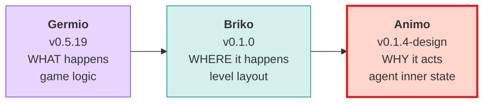

### 1.2 Library Identity

| Item                  | Value                        |
| --------------------- | ---------------------------- |
| Package name          | `com.studiomeowtoon.animo`   |
| GitHub (current)      | `github.com/hiroxpepe/animo` |
| GitHub (future)       | `github.com/meowtoon/animo`  |
| License               | MIT                          |
| Minimum Unity version | 2022.3                       |

---

## 2. G+B+A Stack Philosophy

Game development can be split into **three questions**. Each question gets one library.

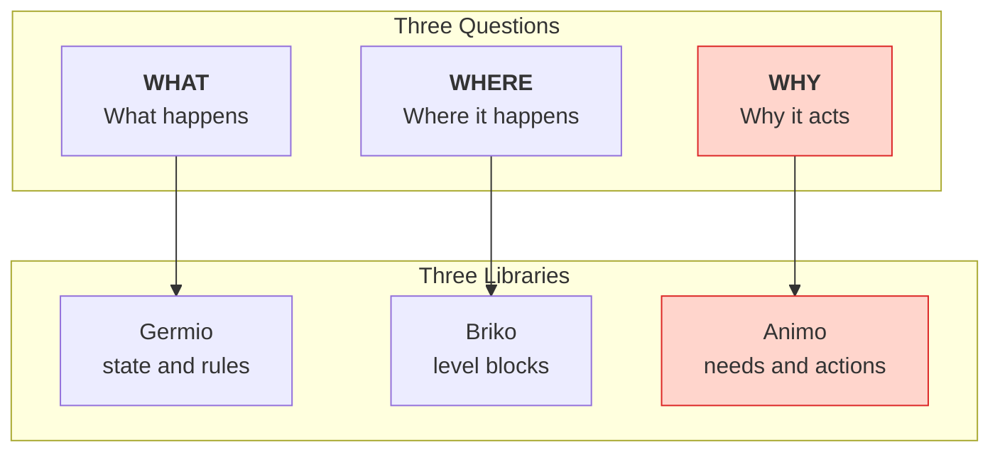

### 2.1 LLM-First Design

All three libraries assume that **an LLM writes and edits the JSON files directly**. This is the core of G+B+A.

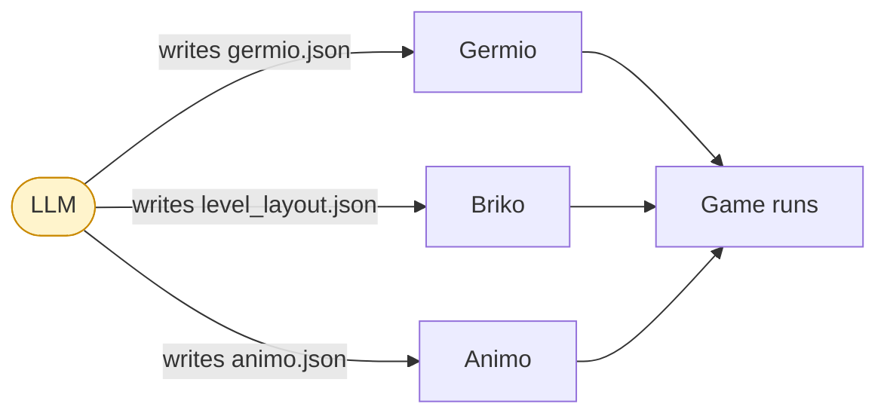

### 2.2 Inherited Design Rules

Animo follows the same rules as Germio and Briko.

| Rule    | Content                                                                            |
| ------- | ---------------------------------------------------------------------------------- |
| **G16** | C# class names, JSON keys, Schema $defs, and LLM vocabulary all use the same name. |
| **G17** | All visible JSON properties use `snake_case`.                                      |
| **G18** | Namespace layers are strict. The dependency direction never goes backward.         |

### 2.3 Animo's Core Philosophy (re-defined in v0.1.1)

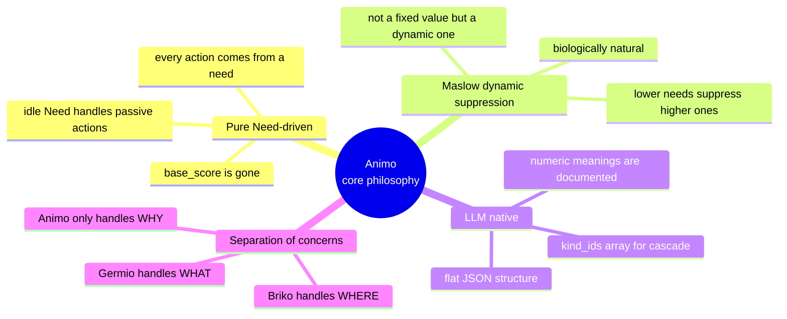

---

## 3. Changes from v0.1.4 to v0.1.5

### 3.0 Overview: Resolving Ambiguity

v0.1.4 left **17 undefined behaviors** in the API contract — the
behavior of `Affect` with NaN, `Live` with negative `dt`, `Lock` while
already locked, and so on. These were captured as Q1–Q17 in the
roadmap §4.7.1 and resolved here in one batch.

Every Q is now answered. The decisions are documented in
`docs/decisions/v0.1.5_ambiguity_resolution.md`. The summary:

| Theme                                                                         | What changed                                                                                                                                                                                                                                                                                                                                                                                                                                                                                                                                                                                                                                                                                                                                                                                                                                                                                                                                                                                                                                                                                                                                              |     |                                                                                                                                                                                                                                                                                                                                                                                                                                                                                                                                                                                                                                                                                                                                                                                                                               |
| ----------------------------------------------------------------------------- | --------------------------------------------------------------------------------------------------------------------------------------------------------------------------------------------------------------------------------------------------------------------------------------------------------------------------------------------------------------------------------------------------------------------------------------------------------------------------------------------------------------------------------------------------------------------------------------------------------------------------------------------------------------------------------------------------------------------------------------------------------------------------------------------------------------------------------------------------------------------------------------------------------------------------------------------------------------------------------------------------------------------------------------------------------------------------------------------------------------------------------------------------------- | --- | ----------------------------------------------------------------------------------------------------------------------------------------------------------------------------------------------------------------------------------------------------------------------------------------------------------------------------------------------------------------------------------------------------------------------------------------------------------------------------------------------------------------------------------------------------------------------------------------------------------------------------------------------------------------------------------------------------------------------------------------------------------------------------------------------------------------------------- |
| `Affect` edge cases (Q1–Q5)                                                   | NaN / empty-string / null throw; ±Inf clamps; undefined Need warns + no-ops                                                                                                                                                                                                                                                                                                                                                                                                                                                                                                                                                                                                                                                                                                                                                                                                                                                                                                                                                                                                                                                                               |     |                                                                                                                                                                                                                                                                                                                                                                                                                                                                                                                                                                                                                                                                                                                                                                                                                               |
| Composition (Q6, Q7)                                                          | empty composed actions still A011 Error; duplicate `kind_ids` deduped + new Warning **A033**                                                                                                                                                                                                                                                                                                                                                                                                                                                                                                                                                                                                                                                                                                                                                                                                                                                                                                                                                                                                                                                              |     |                                                                                                                                                                                                                                                                                                                                                                                                                                                                                                                                                                                                                                                                                                                                                                                                                               |
| `commitment.bonus` (Q8)                                                       | range now `[0, 50]` Error; old A028 Warning at >30 unchanged                                                                                                                                                                                                                                                                                                                                                                                                                                                                                                                                                                                                                                                                                                                                                                                                                                                                                                                                                                                                                                                                                              |     |                                                                                                                                                                                                                                                                                                                                                                                                                                                                                                                                                                                                                                                                                                                                                                                                                               |
| `Lock` edge cases (Q9, Q10, Q14, Q15)                                         | `Lock(0)` is immediate Unlock; `Lock(<0)` throws; re-Lock replaces; `Unlock` while unlocked is no-op                                                                                                                                                                                                                                                                                                                                                                                                                                                                                                                                                                                                                                                                                                                                                                                                                                                                                                                                                                                                                                                      |     |                                                                                                                                                                                                                                                                                                                                                                                                                                                                                                                                                                                                                                                                                                                                                                                                                               |
| `Live` edge cases (Q11–Q13)                                                   | `dt = 0` is no-op; `dt < 0` and `dt = NaN` throw `ArgumentException`                                                                                                                                                                                                                                                                                                                                                                                                                                                                                                                                                                                                                                                                                                                                                                                                                                                                                                                                                                                                                                                                                      |     |                                                                                                                                                                                                                                                                                                                                                                                                                                                                                                                                                                                                                                                                                                                                                                                                                               |
| Lock × Need (Q16)                                                             | Hard lock freezes *behavior selection*, not Need state. New debug API `Engine.GetNeed(string)`.                                                                                                                                                                                                                                                                                                                                                                                                                                                                                                                                                                                                                                                                                                                                                                                                                                                                                                                                                                                                                                                           |     |                                                                                                                                                                                                                                                                                                                                                                                                                                                                                                                                                                                                                                                                                                                                                                                                                               |
| Threading (Q17)                                                               | Animo is documented as **main-thread only** for v0.1.5                                                                                                                                                                                                                                                                                                                                                                                                                                                                                                                                                                                                                                                                                                                                                                                                                                                                                                                                                                                                                                                                                                    |     |                                                                                                                                                                                                                                                                                                                                                                                                                                                                                                                                                                                                                                                                                                                                                                                                                               |
| Lock pipeline detail (Q-S1, Q-S2, Q-S3)                                       | `commitment.bonus` follows `locked_behavior` during Lock; Step 3 Bus.Publish runs during Lock; lock-timer decrements at the head of `Live(dt)`                                                                                                                                                                                                                                                                                                                                                                                                                                                                                                                                                                                                                                                                                                                                                                                                                                                                                                                                                                                                            |     |                                                                                                                                                                                                                                                                                                                                                                                                                                                                                                                                                                                                                                                                                                                                                                                                                               |
| API surface detail (Q-S4, Q-S5, Q-S6)                                         | `ScenarioRunner.events` is `IReadOnlyList<TimedAffectEvent>` (no float-keyed Dict); `force_reset` is OR-latched within a frame; duplicate `Store.Register` warns + no-ops (keep first)                                                                                                                                                                                                                                                                                                                                                                                                                                                                                                                                                                                                                                                                                                                                                                                                                                                                                                                                                                    |     |                                                                                                                                                                                                                                                                                                                                                                                                                                                                                                                                                                                                                                                                                                                                                                                                                               |
| Frame-1 / startup detail (Q-S7, Q-S8, Q-S9)                                   | A016 still warns but Composer fills default `Binding` so `Awake` cannot NRE; `_previous_needs` seeded from spawn Needs to prevent first-frame threshold storms; Step 5 ties resolve in `actions[]` declaration order                                                                                                                                                                                                                                                                                                                                                                                                                                                                                                                                                                                                                                                                                                                                                                                                                                                                                                                                      |     |                                                                                                                                                                                                                                                                                                                                                                                                                                                                                                                                                                                                                                                                                                                                                                                                                               |
| Lock × emergency latch (Q-S10)                                                | `_force_reset_pending` clear at end of Step 4 is gated on `!is_locked`; latch survives Lock and is consumed in the first post-unlock Step 5 — no silent emergency drops mid-lock                                                                                                                                                                                                                                                                                                                                                                                                                                                                                                                                                                                                                                                                                                                                                                                                                                                                                                                                                                          |     |                                                                                                                                                                                                                                                                                                                                                                                                                                                                                                                                                                                                                                                                                                                                                                                                                               |
| Threshold reset floor (Q-S11)                                                 | omitted `reset_threshold` defaults to `Math.Max(0, trigger - 5.0)`; explicit `< 0` rejected as new Error **A034** — prevents permanent `Above` traps with low triggers                                                                                                                                                                                                                                                                                                                                                                                                                                                                                                                                                                                                                                                                                                                                                                                                                                                                                                                                                                                    |     |                                                                                                                                                                                                                                                                                                                                                                                                                                                                                                                                                                                                                                                                                                                                                                                                                               |
| Awake `thresholds` null safety (Q-S12)                                        | `Binding.thresholds` is non-nullable with empty-list default; Composer guarantees non-null; §16.5 sample uses `?? Array.Empty<>` defense in depth — Q-S7 NRE no longer migrates one line down                                                                                                                                                                                                                                                                                                                                                                                                                                                                                                                                                                                                                                                                                                                                                                                                                                                                                                                                                             |     |                                                                                                                                                                                                                                                                                                                                                                                                                                                                                                                                                                                                                                                                                                                                                                                                                               |
| Lock × `force_reset` ONE-frame contract (Q-S13)                               | LockGate moved upstream of Skip in §9.7.2: while locked, *both* the commitment-bonus skip *and* the latch clear are suppressed. Restores §9.7.1's "exactly one frame" promise that Q-S10 alone would have broken (multi-frame debuff during long Locks).                                                                                                                                                                                                                                                                                                                                                                                                                                                                                                                                                                                                                                                                                                                                                                                                                                                                                                  |     |                                                                                                                                                                                                                                                                                                                                                                                                                                                                                                                                                                                                                                                                                                                                                                                                                               |
| Multi-milestone thresholds on the same Need (Q-S14)                           | §8.3 `thresholds` merge unit changed from "match by `need`, last-wins" to "match by `(need, trigger_threshold)` compound key, last-wins"; §16.5 cache moved from `Dictionary<string, string>` keyed by Need to per-Threshold `internal string expanded_trigger`. `fear=50 → "alerted"` and `fear=80 → "panic"` now coexist instead of one silently overwriting the other.                                                                                                                                                                                                                                                                                                                                                                                                                                                                                                                                                                                                                                                                                                                                                                                 |     |                                                                                                                                                                                                                                                                                                                                                                                                                                                                                                                                                                                                                                                                                                                                                                                                                               |
| Validator A023 post-composition closure (Q-S15)                               | A010 tightened to `(0.0, 100.0]` (strictly positive trigger); new A035 Error runs as a *post-composition* check (§13.2 stage 2) re-asserting `trigger > reset` after Composer's omit-fill — closes the path where `trigger=0` + omitted reset slipped through A010 + A023 + A034 to land as `(0, 0)` chatter.                                                                                                                                                                                                                                                                                                                                                                                                                                                                                                                                                                                                                                                                                                                                                                                                                                             |     |                                                                                                                                                                                                                                                                                                                                                                                                                                                                                                                                                                                                                                                                                                                                                                                                                               |
| Need → Tier engine contract (Q-S16)                                           | `Animo.Const` now exposes `NEED_TIER_BY_NAME` and `NEED_INDICES_BY_TIER` so the §9.3.4 `max_lower_tier_intensity = max(eff_needs[tier1 needs] / 100, ...)` formula has a real data source — pre-Q-S16 the §3.5 table was authoritative documentation that the Engine had no way to read. Non-standard Needs (A019) are excluded from suppression; `frustration` is included even when used only via `influences`.                                                                                                                                                                                                                                                                                                                                                                                                                                                                                                                                                                                                                                                                                                                                         |     |                                                                                                                                                                                                                                                                                                                                                                                                                                                                                                                                                                                                                                                                                                                                                                                                                               |
| Stage-2 A025 closes ghost cycles (Q-S17)                                      | A025 now runs in BOTH validation stages: stage 1 catches trivially-cyclic raw JSON (early warning), stage 2 rebuilds the composed `influences` graph and rejects cycles synthesized only by Kind × Persona overlay (e.g. Kind `fear→confidence` + Persona `confidence→fear`).                                                                                                                                                                                                                                                                                                                                                                                                                                                                                                                                                                                                                                                                                                                                                                                                                                                                             |     |                                                                                                                                                                                                                                                                                                                                                                                                                                                                                                                                                                                                                                                                                                                                                                                                                               |
| Stage-2 A036 catches empty composed actions (Q-S18)                           | New A036 Error runs in stage 2 against the composed `actions[]`. Closes Q6's structurally-false claim that "A011a covers post-composition emptiness" — A011a only runs in stage 1, so a Persona that omits `actions` and references a Kind with empty `actions[]` slipped through to land at the Engine with zero actions, where Step 5's declaration-order tie-break (Q-S9; **zero-alloc for-loop per Q-S52**, never `actions.First(...)`) would either crash on an empty list or pick stale defaults.                                                                                                                                                                                                                                                                                                                                                                                                                                                                                                                                                                                                                                                   |     |                                                                                                                                                                                                                                                                                                                                                                                                                                                                                                                                                                                                                                                                                                                                                                                                                               |
| Composer Persona-first ordering (Q-S19)                                       | §8.3 `actions` merge rule changed from "Kind-first append" to "Persona-first preserve, then append unmatched Kind ids". The LLM's authored Persona index 0 (e.g. `Idle`) is no longer silently displaced by Kind inheritance order. Q-S9's declaration-order tie-break finally has the input it always assumed.                                                                                                                                                                                                                                                                                                                                                                                                                                                                                                                                                                                                                                                                                                                                                                                                                                           |     |                                                                                                                                                                                                                                                                                                                                                                                                                                                                                                                                                                                                                                                                                                                                                                                                                               |
| Stable topo sort + `influences` Persona-first (Q-S20)                         | §9.6.2 topological sort is now **stable** with respect to the composed `influences[]` order; §8.3 `influences` merge mirrors §8.3 `actions` (Q-S19). Independent edges that share a target Need produce a deterministic result keyed on the LLM's authored order. New A037 Warning surfaces multi-edge-same-target configurations so authors notice the non-commutative-but-deterministic case.                                                                                                                                                                                                                                                                                                                                                                                                                                                                                                                                                                                                                                                                                                                                                           |     |                                                                                                                                                                                                                                                                                                                                                                                                                                                                                                                                                                                                                                                                                                                                                                                                                               |
| MockScene zombie Update fix (Q-S21)                                           | `MockScene.Tick()` now re-checks `obj.is_active` *inside* the per-component loop. Without it, a `Destroy` triggered by an earlier component's `Update` would synchronously OnDestroy the rest, then the loop would call `Update` on already-destroyed components — a Unity-lifecycle violation. Mirrors Unity's contract: once destroyed mid-frame, no further `Update` for any of that GameObject's components this frame.                                                                                                                                                                                                                                                                                                                                                                                                                                                                                                                                                                                                                                                                                                                               |     |                                                                                                                                                                                                                                                                                                                                                                                                                                                                                                                                                                                                                                                                                                                                                                                                                               |
| Store Unregister instance-equality (Q-S22)                                    | `Store.Unregister(agent)` now checks `ReferenceEquals(_agents[id], agent)` before removing. Pre-Q-S22, a duplicate `Agent B` (rejected by Q-S6's "keep first") could on its own `OnDestroy` remove the dictionary entry that points to the still-running `Agent A` — assassinating the original's registration and leaving `A` as a Bus-disconnected zombie. Pairs symmetrically with Q-S6: Register protects against duplicate intrusion, Unregister protects against duplicate exit.                                                                                                                                                                                                                                                                                                                                                                                                                                                                                                                                                                                                                                                                    |     |                                                                                                                                                                                                                                                                                                                                                                                                                                                                                                                                                                                                                                                                                                                                                                                                                               |
| Threshold reads `_effective_needs` (Q-S23)                                    | Step 3 now compares `_effective_needs` against `_previous_effective_needs`, not against `_needs` / `_previous_needs`. Influence cascades (§9.6.5) write only to `_effective_needs`; a §25.5.3-style frustration→anger chain that pushed `eff_anger` over a Threshold pre-Q-S23 was silently invisible to Bus (no signal published). Threshold now observes the same state Step 4 scores against. `_previous_effective_needs` is seeded in Engine ctor by running one Step 2 pass over spawn Needs (Q-S8 + Q-S23).                                                                                                                                                                                                                                                                                                                                                                                                                                                                                                                                                                                                                                         |     |                                                                                                                                                                                                                                                                                                                                                                                                                                                                                                                                                                                                                                                                                                                                                                                                                               |
| Edge-level topological sort (Q-S24)                                           | §9.6.2 step 1 now builds the **edge** dependency graph (`e1 ≺ e2` iff `e1.target == e2.source`), not the Need-source-target graph. A Need-level topo sort returns a Need *processing* order that groups all edges sharing a source — silently violating Q-S20's promise that the LLM's `influences[]` array order is the determinism key. Q-S24 makes Q-S20 actually implementable: independent edges fall back to the composed `influences[]` order, and the LLM has exactly one knob.                                                                                                                                                                                                                                                                                                                                                                                                                                                                                                                                                                                                                                                                   |     |                                                                                                                                                                                                                                                                                                                                                                                                                                                                                                                                                                                                                                                                                                                                                                                                                               |
| Threshold hysteresis state (Q-S25)                                            | §12.3.2's two-state (Below/Above) state machine now has a real implementation contract: `Threshold` gains `internal bool is_above`, Step 3 reads + writes it per branch (Below+cross-up ⇒ fire+Above; Above+cross-down ⇒ Below; otherwise no-op). Pre-Q-S25 the state machine had **no storage** in `Data.cs` or `Engine.cs`, making `prev<trig && curr>=trig` cross-detection chatter around `trigger` and rendering `reset_threshold` dead code. `is_above` is seeded in Engine ctor by reading the spawn-time `_effective_needs` (extends Q-S8 + Q-S23).                                                                                                                                                                                                                                                                                                                                                                                                                                                                                                                                                                                               |     |                                                                                                                                                                                                                                                                                                                                                                                                                                                                                                                                                                                                                                                                                                                                                                                                                               |
| Engine.OnSignal output channel (Q-S26)                                        | `Engine` gains `public event Action<string>? OnSignal;`. Step 3 / Step 4 raise the event with the relevant `expanded_trigger` / `expanded_action_change` payload; `Agent` subscribes once in Awake and forwards to `Bus.Publish(signal_id)`. Pre-Q-S26 §16.5 sample showed `_bus.Publish(...)` *inside* Engine, but §12.1 explicitly says Engine has no Bus reference and `Engine.cs` had no event/Action callback — Threshold fires were architecturally trapped inside Engine. Q-S26 is the missing wire that keeps Engine pure-C# while still letting it emit.                                                                                                                                                                                                                                                                                                                                                                                                                                                                                                                                                                                         |     |                                                                                                                                                                                                                                                                                                                                                                                                                                                                                                                                                                                                                                                                                                                                                                                                                               |
| Standard-Need fixed slot reservation (Q-S27)                                  | Engine ctor now reserves indices `0..STANDARD_NEEDS.Count-1` for the eight standard Needs regardless of what the Persona declares; non-standard Needs append at index ≥ 8. Pre-Q-S27 the dynamic-by-Persona index assignment collided with Q-S16's static `Const.NEED_INDEX_FEAR=2` and `NEED_INDICES_BY_TIER`: a Persona that omitted `fear` would either misread tier-2 (e.g. confidence value at index 2) or `IndexOutOfRange` on `_effective_needs[7]` for frustration. Q-S27 makes Q-S16 actually safe — `NEED_INDICES_BY_TIER` always points to a guaranteed-existing slot.                                                                                                                                                                                                                                                                                                                                                                                                                                                                                                                                                                         |     |                                                                                                                                                                                                                                                                                                                                                                                                                                                                                                                                                                                                                                                                                                                                                                                                                               |
| Runtime-unique `agent_id` from prefab template (Q-S28)                        | JSON `agent_id` is a TEMPLATE id; `Agent.Awake` overrides with a runtime-unique value (recommended: `$"{template_id}_{GetInstanceID()}"`) BEFORE calling `Store.Register`. Pre-Q-S28 spawning 100 goblins from one prefab/JSON had 99 of them rejected by Q-S6's "keep first" defense, leaving them as Bus-disconnected zombies. The override happens at the host-adapter layer (Agent in Unity, ScenarioRunner in tests) so Engine stays content-agnostic.                                                                                                                                                                                                                                                                                                                                                                                                                                                                                                                                                                                                                                                                                               |     |                                                                                                                                                                                                                                                                                                                                                                                                                                                                                                                                                                                                                                                                                                                                                                                                                               |
| PersonaCache Flyweight (Q-S29)                                                | `Animo.PersonaCache` validates the Root once at startup and composes each template once per session. 100-Agent spawn previously ran 100 × (JSON parse + Validate + Compose); now runs 1 × (Validate) + N × (Compose, N = unique template count) + 100 × (DeepCopy). Cycle-detection (A025 stage 1 + stage 2) and post-composition checks (A035, A036) all run once per Root, not once per Agent.                                                                                                                                                                                                                                                                                                                                                                                                                                                                                                                                                                                                                                                                                                                                                          |     |                                                                                                                                                                                                                                                                                                                                                                                                                                                                                                                                                                                                                                                                                                                                                                                                                               |
| `needs_meta` opt-in for genre Maslow (Q-S30)                                  | New optional `needs_meta` field on Persona/Kind: `{ "oxygen": { "tier": 1 } }` lets non-standard Needs join Maslow tier suppression at an author-chosen tier — fixes the §20.4 vs Q-S16 conflict where genre custom Needs (oxygen, thirst) could not suppress higher-tier Actions. Per-Persona `_need_tier_indices` map; static `Const.NEED_INDICES_BY_TIER` remains the default. New Validator A038 catches out-of-range tiers. A019 doesn't fire for Needs explicit in `needs_meta`.                                                                                                                                                                                                                                                                                                                                                                                                                                                                                                                                                                                                                                                                    |     |                                                                                                                                                                                                                                                                                                                                                                                                                                                                                                                                                                                                                                                                                                                                                                                                                               |
| Silent-first-transition contract (Q-S31)                                      | `OnBehaviorChanged` does NOT raise OnSignal for the very first behavior assignment (`""` → `actions[0]` via Q-S9 tie-break on frame 1). Pre-Q-S31, 100 NPCs spawning into a scene published 100 simultaneous `animo_*_idle` signals — an init storm that rate-limited Bus listeners can't absorb. Post-frame-1 transitions still fire normally.                                                                                                                                                                                                                                                                                                                                                                                                                                                                                                                                                                                                                                                                                                                                                                                                           |     |                                                                                                                                                                                                                                                                                                                                                                                                                                                                                                                                                                                                                                                                                                                                                                                                                               |
| Engine debug accessors for ScenarioRunner (Q-S32)                             | Engine gains four `internal` accessors (visible to `Animo.Tools` via InternalsVisibleTo): `GetEffectiveNeed(string)`, `GetActionScore(string)`, `GetAllNeedNames()`, `GetAllActionIds()`. Pre-Q-S32 §26.3 declared `TraceFrame.action_scores` but Engine had no API to populate it — `ScenarioRunner` was structurally unable to record traces. The accessors are explicitly cold-path; the hot path inside Engine still uses direct `float[]` index access.                                                                                                                                                                                                                                                                                                                                                                                                                                                                                                                                                                                                                                                                                              |     |                                                                                                                                                                                                                                                                                                                                                                                                                                                                                                                                                                                                                                                                                                                                                                                                                               |
| Runner boundary-event loop fix (Q-S33, **superseded by Q-S35**)               | §26.3.1 outer condition `current_time < duration` → `current_time <= duration + EPSILON`; inner `>= events[next].time - EPSILON`. EPSILON = 1e-4f. The `<=` form was Q-S35 found to over-shoot by one `Live(dt)` when `duration` is an exact multiple of `dt`; see Q-S35 row for the corrected final form.                                                                                                                                                                                                                                                                                                                                                                                                                                                                                                                                                                                                                                                                                                                                                                                                                                                |     |                                                                                                                                                                                                                                                                                                                                                                                                                                                                                                                                                                                                                                                                                                                                                                                                                               |
| Initial behavior View sync (Q-S34)                                            | Q-S31's silent-first-transition contract prevents Bus init storms but leaves the host (Animator/View) with no signal for the Agent's spawn-time Action — characters T-pose until the second behavior change. `Agent.Awake` now calls `_engine.Live(dt: 0.0f)` to produce the initial decision and pushes `_engine.behavior` directly to the host's Animator (no Bus involved). Q-S31 still applies for OnSignal; Q-S34 adds the parallel non-Bus path for View.                                                                                                                                                                                                                                                                                                                                                                                                                                                                                                                                                                                                                                                                                           |     |                                                                                                                                                                                                                                                                                                                                                                                                                                                                                                                                                                                                                                                                                                                                                                                                                               |
| Runner over-shoot loop fix (Q-S35)                                            | Q-S33's `<= duration + EPSILON` ran one extra `Live(dt)` past `duration`. Q-S35 final form: outer `current_time < duration` (strict, no EPSILON), inner `events[next].time < current_time + dt` (the upcoming-frame window), plus a post-loop sweep for `time == duration` events. Total `Live` calls: exactly `floor(duration / dt)`.                                                                                                                                                                                                                                                                                                                                                                                                                                                                                                                                                                                                                                                                                                                                                                                                                    |     |                                                                                                                                                                                                                                                                                                                                                                                                                                                                                                                                                                                                                                                                                                                                                                                                                               |
| `needs_meta` Data.cs definitions (Q-S36)                                      | `Persona.needs_meta` and `Kind.needs_meta` properties added to `Scripts/Data.cs`; new `NeedMeta` class with `int tier` field. Pre-Q-S36 the Q-S30 spec was authoritative documentation but the runtime types didn't exist — Engine ctor's `_persona.needs_meta` reference was a compile error; Validator A038 had no shape to validate against. Q-S36 closes the spec-vs-code gap.                                                                                                                                                                                                                                                                                                                                                                                                                                                                                                                                                                                                                                                                                                                                                                        |     |                                                                                                                                                                                                                                                                                                                                                                                                                                                                                                                                                                                                                                                                                                                                                                                                                               |
| `need_index` resolved in Engine ctor (Q-S37)                                  | `Action.need_index` and `Threshold.need_index` are populated in **Engine ctor (post-DeepCopy)**, NOT in Composer. Pre-Q-S37 the spec said "Composer or Engine constructor" — but Composer-side baking would let one template's indices leak into other Engines whose Q-S27 standard-slot layout placed Needs differently. Engine ctor is local to one Persona's array layout; baking there is correct. Composer's job shrinks to shape composition.                                                                                                                                                                                                                                                                                                                                                                                                                                                                                                                                                                                                                                                                                                       |     |                                                                                                                                                                                                                                                                                                                                                                                                                                                                                                                                                                                                                                                                                                                                                                                                                               |
| PersonaCache stage-2 throws (Q-S38)                                           | `PersonaCache.GetComposed` now THROWS `InvalidOperationException` when stage-2 validation has errors, instead of logging and returning the broken Persona. Pre-Q-S38 the broken cache entry would propagate to `new Engine(...)` and crash the Unity scene on first `Live(dt)` via Q-S9's tie-break (the for-loop pinned by Q-S52 — pre-Q-S52 the spec narrative used the LINQ shorthand `actions.First(...)`) on an empty composed list. Throwing at GetComposed lets `Agent.Awake` catch and skip the Agent without taking down the scene.                                                                                                                                                                                                                                                                                                                                                                                                                                                                                                                                                                                                              |     |                                                                                                                                                                                                                                                                                                                                                                                                                                                                                                                                                                                                                                                                                                                                                                                                                               |
| A019 moved to Stage 2 (Q-S39)                                                 | A019 (typo Warning for unknown Need keys) now runs in **Stage 2** against the COMPOSED Persona, not Stage 1 against raw Kinds/Personas. Pre-Q-S39 a Persona declaring `needs_meta { oxygen: tier:1 }` over a Kind that USED `oxygen` in its actions would still get a false-positive A019 because Stage 1 evaluated the Kind in isolation, never seeing the Persona's `needs_meta`. Stage-2 evaluation sees the merged shape and correctly suppresses A019 for any Need name that appears in the composed `needs_meta`.                                                                                                                                                                                                                                                                                                                                                                                                                                                                                                                                                                                                                                   |     |                                                                                                                                                                                                                                                                                                                                                                                                                                                                                                                                                                                                                                                                                                                                                                                                                               |
| Boundary-event observability (Q-S40)                                          | Q-S35's post-loop sweep consumed `time == duration` events via `engine.Affect` but ran no `Live(dt)` after, so the Affect's effect was invisible in `TraceResult.frames`. Q-S40 adds a final `engine.Live(dt: 0.0f)` + `RecordTraceFrame(time: duration)` when the sweep consumed at least one event. Time still doesn't advance (Step 1 decay is multiplicative-by-dt); only Steps 2-5 run over the post-Affect Needs. Total time-advancing Live calls remains exactly `floor(duration / dt)`.                                                                                                                                                                                                                                                                                                                                                                                                                                                                                                                                                                                                                                                           |     |                                                                                                                                                                                                                                                                                                                                                                                                                                                                                                                                                                                                                                                                                                                                                                                                                               |
| A038 cascade-spam relief (Q-S41)                                              | A038 "needs_meta entry referencing a Need not declared in `needs`" moved from **Stage 1** to **Stage 2** AND broadened: a Need is "in use" if it appears in composed `needs[]` *or* `actions[].need` *or* `influences[].source/target`. Pre-Q-S41 a generic survival Kind declaring `needs_meta { oxygen: ..., thirst: ... }` would spam Warnings on every child Persona that used only one of those Needs (the cascade brought in unused metadata). Stage-2 + broadened existence test is the correct gate. Tier-out-of-range stays Stage 1 Error.                                                                                                                                                                                                                                                                                                                                                                                                                                                                                                                                                                                                       |     |                                                                                                                                                                                                                                                                                                                                                                                                                                                                                                                                                                                                                                                                                                                                                                                                                               |
| ScenarioRunner universal override (Q-S42)                                     | `ScenarioRunner.Run()` now applies the runtime-unique override (Q-S28 path) UNCONDITIONALLY, defaulting to `$"{agent_id}_run_{_seq++}"` when caller doesn't supply one. New optional `agent_id_override: string?` parameter. Pre-Q-S42 the spec said "ScenarioRunner skips the override" for single-Persona tests, hardcoding the runner to a single agent. Two `ScenarioRunner.Run()` calls from the same template now coexist; future multi-agent runs (e.g. two goblins fighting from the same template) work without Store.Register collisions.                                                                                                                                                                                                                                                                                                                                                                                                                                                                                                                                                                                                       |     |                                                                                                                                                                                                                                                                                                                                                                                                                                                                                                                                                                                                                                                                                                                                                                                                                               |
| Threshold compound-key float EPSILON (Q-S43)                                  | §8.3 thresholds merge unit's `(need, trigger_threshold)` compound key now compares `trigger_threshold` with `Math.Abs(a - b) < THRESHOLD_KEY_EPSILON` (default `0.5f`), not raw float `==`. Pre-Q-S43 a Persona overriding a Kind's `trigger_threshold: 80.0` with `80.0001` (or any IEEE-754 round-trip artifact) created two near-identical sibling thresholds that both fired — the override silently became a duplicate. The 0.5f tolerance absorbs realistic JSON drift while still distinguishing authored milestones (`50 → alerted` vs `80 → panic`).                                                                                                                                                                                                                                                                                                                                                                                                                                                                                                                                                                                             |     |                                                                                                                                                                                                                                                                                                                                                                                                                                                                                                                                                                                                                                                                                                                                                                                                                               |
| Animator-state template parity (Q-S44)                                        | Q-S34's `Agent.Awake` step (6) pushed `_engine.behavior` (raw Action id, e.g. `"Flee"`) directly to `_animator.Play`, while all subsequent frames go through `binding.on_action_change` template expansion via Bus (e.g. `"animo_goblin_47291_flee"`) — the host had to handle TWO state-name namespaces. Q-S44 routes the first push through `_engine.GetExpandedActionTrigger(_engine.behavior)` so the host sees a consistent template-expanded payload throughout. Q-S31 silent contract preserved (Bus still not involved on frame 1). New Engine `internal string GetExpandedActionTrigger(string)` accessor.                                                                                                                                                                                                                                                                                                                                                                                                                                                                                                                                       |     |                                                                                                                                                                                                                                                                                                                                                                                                                                                                                                                                                                                                                                                                                                                                                                                                                               |
| Standard-Need future metadata (Q-S45)                                         | §3.5.2 PHASE C's `if (is_standard) continue;` blanket-skipped standard Needs in the `needs_meta` loop, hard-banning any future `NeedMeta` field (e.g. `decay_multiplier`) from applying to the eight standard Needs. Q-S45 narrows the skip to **tier only** (since §3.5 wins for tier per Q-S30) while letting other NeedMeta fields flow through `ApplyNonTierMetadata`. v0.1.5 has no other fields yet, so runtime behavior is unchanged; the v0.2 / v0.3 extension path is preserved.                                                                                                                                                                                                                                                                                                                                                                                                                                                                                                                                                                                                                                                                 |     |                                                                                                                                                                                                                                                                                                                                                                                                                                                                                                                                                                                                                                                                                                                                                                                                                               |
| `_cached_action_triggers` ownership (Q-S46)                                   | §16.6 incorrectly listed `_cached_action_triggers` as belonging to `Agent` while §16.5's actual code constructs and reads it inside `Engine`. Q-S44's `internal Engine.GetExpandedActionTrigger` accessor would have been a compile error if the cache lived on `Agent` (no MonoBehaviour-to-Engine field access). Q-S46 pins the table entry to `Engine` so the implementation can build. The cache is constructed in Engine ctor (after Q-S28 override has set `_composed_persona.agent_id`) and read by `OnBehaviorChanged` and `GetExpandedActionTrigger`.                                                                                                                                                                                                                                                                                                                                                                                                                                                                                                                                                                                            |     |                                                                                                                                                                                                                                                                                                                                                                                                                                                                                                                                                                                                                                                                                                                                                                                                                               |
| Threshold EPSILON value + A039 (Q-S47, refines Q-S43)                         | Q-S43 used `THRESHOLD_KEY_EPSILON = 0.5f` justified by *"authored milestone spacing is always ≥ 5 by A035 / Q-S15"* — but A035's 5-unit gap is between `trigger` and `reset` of the **same** Threshold (the hysteresis window), NOT between sibling Thresholds with different triggers on the same Need. An LLM author writing `fear=80.0 → alert` and `fear=80.4 → panic` would have had both thresholds collapsed by Q-S43's overly-wide window. Q-S47 refines `EPSILON = 0.01f` (three orders of magnitude over IEEE-754 round-trip drift, preserving distinctions down to 1/100 Need unit) and adds new Stage-2 Warning **A039** for sibling pairs within `1.0f` to surface accidentally-tight authoring. Validator rule count grows to 40 (A000-A039).                                                                                                                                                                                                                                                                                                                                                                                               |     |                                                                                                                                                                                                                                                                                                                                                                                                                                                                                                                                                                                                                                                                                                                                                                                                                               |
| `ApplyNonTierMetadata` declaration (Q-S48)                                    | Q-S45's §3.5.2 PHASE C narrow-skip code called `ApplyNonTierMetadata(_need_index[meta.Key], meta.Value);` but no method declaration existed in `Scripts/Engine.cs` — confirmed compile error. Q-S48 adds the `private void ApplyNonTierMetadata(int need_index, NeedMeta meta)` declaration as a no-op stub for v0.1.5; v0.2/v0.3 NeedMeta extensions implement here. The Q-S45 path is now buildable.                                                                                                                                                                                                                                                                                                                                                                                                                                                                                                                                                                                                                                                                                                                                                    |     |                                                                                                                                                                                                                                                                                                                                                                                                                                                                                                                                                                                                                                                                                                                                                                                                                               |
| A038 orphan check includes thresholds (Q-S49)                                 | Q-S41's broadened "in use" test for A038 orphan check listed `needs[]`, `actions[].need`, and `influences[].source/target` — but omitted `binding.thresholds[].need`. A Need used signal-only via Threshold (e.g. `oxygen` → UI alert; never appearing in actions or influences) was incorrectly orphan-flagged. Q-S49 adds `binding.thresholds[].need` as the fourth "in use" site. The corrected union: `needs[]` ∪ `actions[].need` ∪ `influences[].source/target` ∪ `binding.thresholds[].need`.                                                                                                                                                                                                                                                                                                                                                                                                                                                                                                                                                                                                                                                      |     |                                                                                                                                                                                                                                                                                                                                                                                                                                                                                                                                                                                                                                                                                                                                                                                                                               |
| `ScenarioRunner` is independent of `Store` (Q-S50)                            | Q-S42 justified its universal override on ScenarioRunner with "future multi-agent runs collide on Store.Register per Q-S6" — but `Store.Register(IAnimoAgent agent)` requires an `IAnimoAgent` implementation, which `ScenarioRunner` never produces (it constructs `Engine` directly without a MonoBehaviour wrapper). Q-S50 corrects: ScenarioRunner does NOT interact with Store at all. The runner maintains its own internal `Dictionary<string, Engine>` for routing Affect/Lock; `Store` remains the Unity-Agent-only registry. Q-S42's override on the runner serves a different purpose (unique runner-internal keys + per-run trace identifiers), not Store collision avoidance.                                                                                                                                                                                                                                                                                                                                                                                                                                                                |     |                                                                                                                                                                                                                                                                                                                                                                                                                                                                                                                                                                                                                                                                                                                                                                                                                               |
| ScenarioRunner spawn-state observation (Q-S51)                                | Q-S34's `Live(dt: 0.0f)` + Animator push gave Unity Agents the t=0 spawn state; ScenarioRunner had no equivalent — its first `RecordTraceFrame` was at `time = dt`, leaving the spawn moment (initial Need values, Q-S9 tie-break initial behavior) invisible in `TraceResult.frames`. Q-S51 adds a pre-loop `engine.Live(dt: 0.0f); RecordTraceFrame(time: 0.0f);` so the runner records the spawn frame in parallel to Awake's Q-S34 path. Time-advancing Live calls remain `floor(duration / dt)`.                                                                                                                                                                                                                                                                                                                                                                                                                                                                                                                                                                                                                                                     |     |                                                                                                                                                                                                                                                                                                                                                                                                                                                                                                                                                                                                                                                                                                                                                                                                                               |
| Step 5 tie-break zero-alloc (Q-S52)                                           | The Q-S9 declaration-order tie-break was described in spec narrative using the pseudocode shorthand `actions.First(a => a.score == max_score)` — LINQ. Every call allocates an `IEnumerator` + closure capture, and Step 5 runs every `Live(dt)` per agent. With 100 agents × 60 fps that is 6000 alloc/sec from one description line, directly contradicting §16.1's "Zero-Allocation Hot Path" rule. Q-S52 forbids LINQ in `Live(dt)` (and any method called from it), pins the Step 5 tie-break to a single-pass for-loop with strict `>` comparison (which naturally implements first-declaration-wins), and rewrites all narrative references away from `actions.First(...)`.                                                                                                                                                                                                                                                                                                                                                                                                                                                                        |     |                                                                                                                                                                                                                                                                                                                                                                                                                                                                                                                                                                                                                                                                                                                                                                                                                               |
| String cache lives in Engine ctor (Q-S53)                                     | Q-S46 pinned `_cached_action_triggers` to `Engine`, but the §16.5 sample code still ran the Threshold `expanded_trigger` initialization loop inside `Agent.Awake`. `ScenarioRunner` constructs `Engine` directly — never running `Agent.Awake` — so every Threshold's `expanded_trigger` was the empty string in test simulations; every fired Threshold signal was published as `""`. Q-S53 moves the Threshold-side cache initialization into Engine ctor (alongside the action-trigger cache, post-Q-S28 agent_id override). Both Unity Agent and ScenarioRunner — and any future host — now inherit a fully-populated cache from Engine ctor.                                                                                                                                                                                                                                                                                                                                                                                                                                                                                                         |     |                                                                                                                                                                                                                                                                                                                                                                                                                                                                                                                                                                                                                                                                                                                                                                                                                               |
| `GetNeed` semantics + new `GetBaseNeed` (Q-S54)                               | The new debug API `Engine.GetNeed(string need)` was specified as "current value" without disambiguating base-vs-effective. Q-S23 made `_effective_needs` (post-cascade) the value driving observable behavior; if `GetNeed` returned base, an inspector watching an Agent fleeing because effective `fear = 80` would see `fear = 30` and conclude the AI is broken. Q-S54 pins `GetNeed` to **effective** (the value Step 4 actually consumes) and adds **`GetBaseNeed`** as the companion API for the unmodulated reading. Default = effective because that is the value driving behavior; tools that want both layers call both methods.                                                                                                                                                                                                                                                                                                                                                                                                                                                                                                               |     |                                                                                                                                                                                                                                                                                                                                                                                                                                                                                                                                                                                                                                                                                                                                                                                                                               |
| ScenarioRunner t=0 event sweep (Q-S55)                                        | Q-S51 added a pre-loop spawn-state record but did NOT consume `TimedAffectEvent`s scheduled at exactly `time = 0.0f` before the record. A test like `events = [{ time: 0.0, ev: Affect("fear", +50) }]` would record the t=0 frame with `fear` still at spawn value, then apply the Affect inside the first loop iteration's inner sweep — the trace at t=0 disagreed with the player's authored initial state. Q-S55 sweeps `events[next].time <= 0.0f` BEFORE the spawn `Live(dt: 0.0f)` + record so the t=0 frame reflects any t=0 events.                                                                                                                                                                                                                                                                                                                                                                                                                                                                                                                                                                                                             |     |                                                                                                                                                                                                                                                                                                                                                                                                                                                                                                                                                                                                                                                                                                                                                                                                                               |
| `ApplyNonTierMetadata` covers all Needs (Q-S56)                               | Q-S45 placed `ApplyNonTierMetadata` inside the `if (_persona.needs_meta != null) { foreach (var meta in _persona.needs_meta) }` loop, so the hook only ran for Needs the author explicitly listed in `needs_meta` — defeating the goal of "future NeedMeta fields apply to ALL Needs including standard ones". A Persona with no `needs_meta` (entirely valid for any spec using only standard Needs) ran zero `ApplyNonTierMetadata` calls. Q-S56 separates the pass: every Need in the composed Persona's `needs[]` receives `ApplyNonTierMetadata(idx, explicit_or_default_meta)`, with `NeedMeta.DefaultFor(name)` providing per-Need default values. v0.1.5 has no non-tier fields so runtime is unchanged; v0.2 / v0.3 NeedMeta extensions correctly reach all Needs.                                                                                                                                                                                                                                                                                                                                                                               |     |                                                                                                                                                                                                                                                                                                                                                                                                                                                                                                                                                                                                                                                                                                                                                                                                                               |
| A038 orphan check includes `rates` (Q-S57)                                    | Q-S41 + Q-S49 broadened the "in use" union to `needs[]` ∪ `actions[].need` ∪ `influences[].source/target` ∪ `binding.thresholds[].need` — but missed `rates`. A "pure-rate Need" (e.g. a `poison` Need that decays via `rates` only and is read by UI without any Action, Influence, or Threshold) is a legitimate authoring pattern but would be A038-orphan-flagged. Q-S57 adds `rates.keys()` as the fifth "in use" site. The corrected union: 5 sites total.                                                                                                                                                                                                                                                                                                                                                                                                                                                                                                                                                                                                                                                                                          |     |                                                                                                                                                                                                                                                                                                                                                                                                                                                                                                                                                                                                                                                                                                                                                                                                                               |
| `Bootstrapper.OnDestroy` clears Store too (Q-S58)                             | `AnimoBootstrapper.OnDestroy` cleared `PersonaCache` but left `Animo.Store.Instance._agents` populated. Under Unity Editor "Enter Play Mode Options (Fast)" — which preserves static state between Play sessions — stale Agent references accumulated across runs and corrupted Bus routing on re-entry. Q-S58 pairs `Store.ResetForTesting()` with the existing `PersonaCache.ClearForTesting()` call. Both are idempotent + cheap.                                                                                                                                                                                                                                                                                                                                                                                                                                                                                                                                                                                                                                                                                                                      |     |                                                                                                                                                                                                                                                                                                                                                                                                                                                                                                                                                                                                                                                                                                                                                                                                                               |
| `GetInstanceID()` multiplayer warning (Q-S59)                                 | Q-S28's recommended `$"{template_id}_{GetInstanceID()}"` formula is correct for single-session Unity but is not network-deterministic — `GetInstanceID()` differs across hosts, scene reloads, and save/load. Networked games where Bus payloads must match between client and server (or between clients) must substitute a deterministic id source: `NetworkObject.NetworkObjectId`, server-assigned UUID, ECS entity id, etc. Q-S59 makes this explicit in §11.4.1 — the host adapter chooses the strategy, the spec warns where the obvious default fails.                                                                                                                                                                                                                                                                                                                                                                                                                                                                                                                                                                                            |     |                                                                                                                                                                                                                                                                                                                                                                                                                                                                                                                                                                                                                                                                                                                                                                                                                               |
| Runner internal `Engine` (not Dictionary) (Q-S60)                             | Q-S50 corrected ScenarioRunner-Store independence but over-spec'd the runner's internal storage as `Dictionary<string, Engine>`. The current `Run(string agent_id, ...)` API accepts a single template id and `TimedAffectEvent` carries no target-agent field — a routing dictionary would always have exactly one entry, dead structure. Q-S60 pins the v0.1.5 internal field to `Engine _engine` (single instance per `Run()` call). The type changes when the API does (when v0.2 adds multi-agent `Run()`), not before.                                                                                                                                                                                                                                                                                                                                                                                                                                                                                                                                                                                                                              |     |                                                                                                                                                                                                                                                                                                                                                                                                                                                                                                                                                                                                                                                                                                                                                                                                                               |
| `actions[]` is additive-only (Q-S61)                                          | Q-S19's Persona-first ordering with last-wins on values means a child Persona inheriting from a Kind cannot remove an Action by omission — every Kind Action whose `id` is missing from the Persona is appended at the tail. This is intentional (so a child cannot accidentally lose a critical fallback like `Idle`) but the spec did not state it explicitly. Q-S61 adds the design note: inheritance is additive, never subtractive; to author "use Kind A but without one of its Actions", split Kind A into Kind A_core + Kind A_extra and inherit only the slice you need.                                                                                                                                                                                                                                                                                                                                                                                                                                                                                                                                                                         |     |                                                                                                                                                                                                                                                                                                                                                                                                                                                                                                                                                                                                                                                                                                                                                                                                                               |
| Hard Lock Step 4 design rationale (Q-S62)                                     | Step 4 (score calculation) runs even under Hard lock, when Step 5 (switch) is skipped — superficially a wasted computation per frame. Q-S62 documents three reasons it is correct: (a) `commitment.bonus` continuity — the post-unlock Step 5 reads `_action_scores[locked_behavior_index]` for the smooth-out-of-lock decision; skipping Step 4 throughout the lock leaves stale scores. (b) Trace observability — `TraceFrame.action_scores` shows author-debuggable scores even on locked frames. (c) Pipeline determinism — the five-step contract is uniform; conditionally skipping interior steps would force re-justification for every future feature interaction. The design favors correctness and observability over conditional micro-optimization.                                                                                                                                                                                                                                                                                                                                                                                          |     |                                                                                                                                                                                                                                                                                                                                                                                                                                                                                                                                                                                                                                                                                                                                                                                                                               |
| `Needs.Clamp()` removed (Q-S63)                                               | `Scripts/Data.cs` declared `Needs.Clamp() => throw new NotImplementedException()`. Hot path uses flat `float[] _needs` with `Mathf.Clamp` directly per §16.2; the instance method had been dead code since v0.1.2 and would only have surfaced as a confusing exception for a tool author who discovered and called it. Q-S63 removes the method and updates the §6.1 Needs class diagram. The Needs class remains as a JSON-bridge shape only (with `Get` and `Normalized` as explicit "use the engine, not me" stubs).                                                                                                                                                                                                                                                                                                                                                                                                                                                                                                                                                                                                                                  |     |                                                                                                                                                                                                                                                                                                                                                                                                                                                                                                                                                                                                                                                                                                                                                                                                                               |
| `Persona.DeepCopy()` declared (Q-S64)                                         | §11.4.1 Awake step (2) called `template.DeepCopy()` but `Persona` declared no such method — confirmed compile error. PersonaCache returns a shared composed template; without DeepCopy, two Agents spawned from the same template id share `Needs`, `actions[]`, `binding.thresholds[].expanded_trigger`, etc., and one Agent's runtime mutation (e.g. Q-S28's agent_id override) corrupts every sibling. Q-S64 adds `public Persona DeepCopy()` to `Scripts/Data.cs` (NotImplementedException stub) and to §6.1 class diagram. Phase 3 implements deep clone of all reference-type fields.                                                                                                                                                                                                                                                                                                                                                                                                                                                                                                                                                               |     |                                                                                                                                                                                                                                                                                                                                                                                                                                                                                                                                                                                                                                                                                                                                                                                                                               |
| Needs unwrap in PHASE A (Q-S65)                                               | §3.5.2 PHASE A wrote `foreach (var kv in _persona.needs ?? new Dictionary<string, float>())` — but `_persona.needs` is a `Needs` class wrapping `Dictionary<string, float> values`, NOT a Dictionary directly. The `??` produced a confirmed type mismatch (Needs is not Dictionary<string, float>). Q-S65 corrects to `_persona.needs?.values ?? new Dictionary<string, float>()` in both PHASE A loops (index resolution + `_needs` seeding).                                                                                                                                                                                                                                                                                                                                                                                                                                                                                                                                                                                                                                                                                                           |     |                                                                                                                                                                                                                                                                                                                                                                                                                                                                                                                                                                                                                                                                                                                                                                                                                               |
| PHASE C iterates `_need_index` not `needs[idx]` (Q-S66)                       | Q-S56's PHASE C "Step 3" rewrite wrote `for (int idx = 0; idx < _composed_persona.needs.Count; idx++) { string need_name = _composed_persona.needs[idx]; ... }` — but the `Needs` class has no `.Count` property and no integer indexer. Confirmed compile error self-introduced by Q-S56. Q-S66 fixes by iterating `_need_index` directly (the canonical "every Need known to this Engine" map built in PHASE A from composed needs ∪ needs_meta union). Each entry has the index already; no fragile re-derivation needed.                                                                                                                                                                                                                                                                                                                                                                                                                                                                                                                                                                                                                              |     |                                                                                                                                                                                                                                                                                                                                                                                                                                                                                                                                                                                                                                                                                                                                                                                                                               |
| `AffectEvent` declared (Q-S67)                                                | §26.3 declared `TimedAffectEvent` carrying `public AffectEvent ev { get; }` but the `AffectEvent` type itself was never declared anywhere in the spec — confirmed missing-type compile error. Q-S67 adds `public readonly struct AffectEvent { string need; float delta; bool force_reset; }` to §26.3, mirroring the argument tuple of `Engine.Affect(need, delta, force_reset)`. The §6.1 namespace table already listed `AffectEvent` in `Animo.Tools` since v0.1.4 — Q-S67 closes the spec-table-vs-code-block gap.                                                                                                                                                                                                                                                                                                                                                                                                                                                                                                                                                                                                                                   |     |                                                                                                                                                                                                                                                                                                                                                                                                                                                                                                                                                                                                                                                                                                                                                                                                                               |
| `Agent : MonoBehaviour, IAnimoAgent` (Q-S68)                                  | §11.4.1 Awake called `Animo.Store.Instance.Register(agent: this)` — but `Store.Register` requires `IAnimoAgent`, and the spec narrative said "Animo.Agent : MonoBehaviour" without naming the interface. Confirmed cannot-convert compile error. Q-S68 makes the class declaration explicit: `public sealed class Agent : MonoBehaviour, IAnimoAgent` with `public string agent_id => _composed_persona.agent_id` satisfying the contract. The interface (already defined in `Scripts/Store.cs`) requires only this one read-only property; the implementation is trivial via the composed Persona post-Q-S28-override.                                                                                                                                                                                                                                                                                                                                                                                                                                                                                                                                   |     |                                                                                                                                                                                                                                                                                                                                                                                                                                                                                                                                                                                                                                                                                                                                                                                                                               |
| `_need_tier_indices` type unified to `Dictionary<int, int[]>` (Q-S69)         | §16.6 Engine fields table declared `_need_tier_indices: Dictionary<int, int[]>` (Hot Path needs `int[]` for zero-alloc cache-friendly iteration during Step 4's `max_lower_tier_intensity` per §16.1), but PHASE C ctor code wrote `_need_tier_indices = new Dictionary<int, List<int>>()` and called `.Add()`. Confirmed type mismatch with the field declaration. Q-S69 keeps the `int[]` field type (correct for §16.1) and uses a local `Dictionary<int, List<int>>` scratch buffer during construction (tier participation grows incrementally with `needs_meta` non-standard Needs); a finalize pass at the end of PHASE C snapshots each `List<int>` to a `new int[]` for the field. One alloc per tier at ctor time only; Hot Path iteration is over `int[]` per §16.1 contract.                                                                                                                                                                                                                                                                                                                                                                  |     |                                                                                                                                                                                                                                                                                                                                                                                                                                                                                                                                                                                                                                                                                                                                                                                                                               |
| `_lock_remaining` field declared (Q-S70)                                      | §9.2's T0 timer phase pseudocode and §24.3 narrative referenced `_lock_remaining` (Lock countdown timer for v0.1.4 Lock mechanism) but the field had no entry in §16.6's Engine fields table and no declaration in `Scripts/Engine.cs`. Confirmed compile error for any Phase 3 implementation of T0 / Lock / Unlock. Q-S70 adds `float _lock_remaining = 0.0f;` to Engine.cs and a §16.6 table row (initialized to 0 at spawn — no Lock active; set by `Lock(duration, mode)` to the requested duration; cleared by `Unlock()` or natural T0 expiry).                                                                                                                                                                                                                                                                                                                                                                                                                                                                                                                                                                                                    |     |                                                                                                                                                                                                                                                                                                                                                                                                                                                                                                                                                                                                                                                                                                                                                                                                                               |
| `Validator.ValidateStage2` declared (Q-S71)                                   | §11.6.1 PersonaCache called `Validator.ValidateStage2(composed: composed)` to run stage-2 rules (A019/A025/A035/A036/A037/A038/A039) per template, but `Scripts/Validator.cs` declared only `Validate(Root root)` — confirmed missing-method compile error. Q-S71 adds `public static ValidationResult ValidateStage2(Persona composed)` stub to Validator.cs (Phase 3 implements).                                                                                                                                                                                                                                                                                                                                                                                                                                                                                                                                                                                                                                                                                                                                                                       |     |                                                                                                                                                                                                                                                                                                                                                                                                                                                                                                                                                                                                                                                                                                                                                                                                                               |
| `ValidationResult.Merge` declared (Q-S72)                                     | §11.6.1 called `_validation!.Merge(stage2)` to fold per-template stage-2 findings into the Initialize-time aggregate, but `ValidationResult` had no `Merge` method declaration — confirmed missing-method compile error. Q-S72 adds `public void Merge(ValidationResult other)` stub to Validator.cs (Phase 3 implements as `this.issues.AddRange(other.issues)`).                                                                                                                                                                                                                                                                                                                                                                                                                                                                                                                                                                                                                                                                                                                                                                                        |     |                                                                                                                                                                                                                                                                                                                                                                                                                                                                                                                                                                                                                                                                                                                                                                                                                               |
| `AnimoLog.Error` declared (Q-S73)                                             | `PersonaCache.Initialize` (validation failure path) and `Agent.Awake` (Q-S38 try/catch) called `AnimoLog.Error(msg)` to surface fail-loud errors, but `Scripts/AnimoLog.cs` declared only `Write` and `Warning` — confirmed missing-method compile error. Q-S73 adds `public static void Error(string message)` to AnimoLog.cs; Phase 3 wraps `UnityEngine.Debug.LogError` in editor/runtime and falls back to `Console.Error.WriteLine` in headless environments.                                                                                                                                                                                                                                                                                                                                                                                                                                                                                                                                                                                                                                                                                        |     |                                                                                                                                                                                                                                                                                                                                                                                                                                                                                                                                                                                                                                                                                                                                                                                                                               |
| `has_errors` snake_case unified (Q-S74)                                       | `Scripts/Validator.cs:41` declared `public bool has_errors` (snake_case, matching the rest of the Animo C# API surface — `Persona.agent_id`, `Issue.rule_id`, `Threshold.expanded_trigger`, etc.), but spec sample code at §11.6.1 wrote `_validation.HasErrors` and `stage2.HasErrors` (PascalCase). C# is case-sensitive; PascalCase reads would fail to find the property. Q-S74 unifies on snake_case (one-line property edit + `sed` over EN+JP spec narrative); existing tests (`AssertResult.cs`, `NumericEdgeTests.cs`, `A028_CommitmentBonusWarnTests.cs`) already use `has_errors` so no test changes needed.                                                                                                                                                                                                                                                                                                                                                                                                                                                                                                                                   |     |                                                                                                                                                                                                                                                                                                                                                                                                                                                                                                                                                                                                                                                                                                                                                                                                                               |
| `Agent._animator` field declared (Q-S75)                                      | §11.4.1 Awake step (6) `_animator?.Play(stateName: trigger)` (the Q-S34/Q-S44 initial-behavior push to host Animator without going through Bus) referenced `_animator` but the Agent class declaration listed only `_persona_template_id`, `_bus`, `_composed_persona`, `_engine` — confirmed missing-field compile error. Q-S75 adds `[SerializeField] Animator? _animator = null;`. SerializeField + nullable Animator? lets developers wire the Animator in Inspector or leave it null when using a different View backend (ECS, custom shader); the `?.Play(...)` invocation makes missing-Animator a silent no-op.                                                                                                                                                                                                                                                                                                                                                                                                                                                                                                                                   |     |                                                                                                                                                                                                                                                                                                                                                                                                                                                                                                                                                                                                                                                                                                                                                                                                                               |
| `Animo.Json.Parse` declared (Q-S76)                                           | §11.6.5 AnimoBootstrapper.Awake called `Animo.Json.Parse(_animo_json.text)` to deserialize JSON to `Root`, but neither the `Animo.Json` class nor a `Parse` method existed in `Scripts/` — confirmed missing-type compile error. Q-S76 adds new `Scripts/Json.cs` declaring `public static class Json { public static Root Parse(string text); }` (NotImplementedException stub; Phase 3 wraps Newtonsoft.Json or System.Text.Json depending on build profile). The stub is a thin facade so hosts that prefer a different JSON library can substitute by calling their library directly in the bootstrapper.                                                                                                                                                                                                                                                                                                                                                                                                                                                                                                                                             |     |                                                                                                                                                                                                                                                                                                                                                                                                                                                                                                                                                                                                                                                                                                                                                                                                                               |
| Animo.asmdef + package.json (Q-S77)                                           | `Agent.cs` references `Germio.Bus? _bus` but `Scripts/Animo.asmdef` did not exist (Phase_2_5 deferred), so any Phase 3 Unity build would hit "type or namespace 'Germio' could not be found." Q-S77 ships the minimal `Animo.asmdef` with `"references": ["Germio"]` plus `package.json` with `"dependencies": { "com.studiomeowtoon.germio": "0.1.0" }` — sufficient for the Germio cross-reference to resolve. Phase_2_5's broader asmdef polish (autoReferenced flags, definedConstraints, versionDefines) builds on this foundation.                                                                                                                                                                                                                                                                                                                                                                                                                                                                                                                                                                                                                  |     |                                                                                                                                                                                                                                                                                                                                                                                                                                                                                                                                                                                                                                                                                                                                                                                                                               |
| `Store.ResetForTesting()` static call form (Q-S78)                            | `Scripts/Store.cs:26` declares `public static void ResetForTesting()` (static method on the singleton class). §11.6.5's Q-S58 fix wrote `Animo.Store.Instance.ResetForTesting()` — invoking a static member through an instance reference. C# CS0176 forbids this exact pattern: "Member is accessed through an instance; qualify it with a type name instead." Q-S78 corrects to `Animo.Store.ResetForTesting()` (type-name form). Q-S58's design intent — pair Store cleanup with PersonaCache cleanup — is unchanged; only the call syntax is fixed.                                                                                                                                                                                                                                                                                                                                                                                                                                                                                                                                                                                                   |     |                                                                                                                                                                                                                                                                                                                                                                                                                                                                                                                                                                                                                                                                                                                                                                                                                               |
| `Scripts/PersonaCache.cs` materialized (Q-S79)                                | §11.6.1 contained the full PersonaCache implementation as spec text, and `Agent.Awake` called `Animo.PersonaCache.GetComposed(...)`, but the file `Scripts/PersonaCache.cs` did not exist in the repository — `Animo.PersonaCache` would fail to resolve as a type at compile time. Q-S79 ships `Scripts/PersonaCache.cs` with method declarations (`Initialize`, `GetComposed`, `ClearForTesting`) matching §11.6.1's signatures; the bodies throw NotImplementedException for Phase 3 to flesh out. The Q-S58 `ClearForTesting` body is implemented inline (3 lines) since the test infrastructure has used it since Phase_2_4_x.                                                                                                                                                                                                                                                                                                                                                                                                                                                                                                                       |     |                                                                                                                                                                                                                                                                                                                                                                                                                                                                                                                                                                                                                                                                                                                                                                                                                               |
| `Agent.Update` per-frame tick (Q-S80)                                         | §11.4.1 Agent sample code declared only `Awake()` and `OnDestroy()` — every NPC seeded its initial behavior in Awake then froze forever, because no `Live(dt)` ran on subsequent frames. The whole engine pipeline (decay → effective → threshold → score → switch) was unreachable from the Unity adapter. Q-S80 adds `void Update() { _engine.Live(dt: Time.deltaTime); }` to the Agent sample.                                                                                                                                                                                                                                                                                                                                                                                                                                                                                                                                                                                                                                                                                                                                                         |     |                                                                                                                                                                                                                                                                                                                                                                                                                                                                                                                                                                                                                                                                                                                                                                                                                               |
| `Store.Unregister(IAnimoAgent)` signature (Q-S81)                             | `Scripts/Store.cs:42` declares `public void Unregister(IAnimoAgent agent)` (interface form), but spec §11.2.2's Q-S22 sample code wrote `public void Unregister(Animo.Agent agent)` (concrete form). Phase 3 implementation following spec sample text would have created a NEW overload that does NOT satisfy the IAnimoAgent contract — the interface's Unregister wire would have been left dangling. Q-S81 unifies on the interface form across spec narrative and code.                                                                                                                                                                                                                                                                                                                                                                                                                                                                                                                                                                                                                                                                              |     |                                                                                                                                                                                                                                                                                                                                                                                                                                                                                                                                                                                                                                                                                                                                                                                                                               |
| `Scripts/Tools/ScenarioRunner.cs` + `TraceResult.cs` materialized (Q-S82)     | §26.3 contained the ScenarioRunner + TraceResult API as spec text but the directory `Scripts/Tools/` and the files inside it (`ScenarioRunner.cs`, `TraceResult.cs`, `Animo.Tools.asmdef`) did not exist in the repository — the `Animo.Tools` namespace was unbuildable end-to-end. Q-S82 ships the directory + three files: TraceResult.cs with TraceFrame + TraceResult class declarations, ScenarioRunner.cs with the AffectEvent + TimedAffectEvent structs (Q-S67) and the ScenarioRunner class with `Run(...)` declaration matching §26.3, plus Animo.Tools.asmdef that references the Animo assembly. Phase 3 implements Run's body.                                                                                                                                                                                                                                                                                                                                                                                                                                                                                                              |     |                                                                                                                                                                                                                                                                                                                                                                                                                                                                                                                                                                                                                                                                                                                                                                                                                               |
| `Scripts/Agent.cs` materialized (Q-S83)                                       | §11.4.1 described the full Agent MonoBehaviour as spec text and Q-S29/Q-S68/Q-S75/Q-S80 piled features on it, but `Scripts/Agent.cs` did not exist in the repository. Every spec reference to `Animo.Agent` was a forward-looking promise. Q-S83 ships `Scripts/Agent.cs` bracketed in `#if UNITY_5_3_OR_NEWER` (so headless dotnet test still compiles without UnityEngine) with the `Agent : MonoBehaviour, IAnimoAgent` declaration, the `_persona_template_id` / `_bus` / `_animator` / `_composed_persona` / `_engine` field declarations, and Awake/Update/OnDestroy method stubs. Phase 3 implements the bodies.                                                                                                                                                                                                                                                                                                                                                                                                                                                                                                                                   |     |                                                                                                                                                                                                                                                                                                                                                                                                                                                                                                                                                                                                                                                                                                                                                                                                                               |
| ScenarioRunner integer step counter (Q-S84)                                   | §26.3.1 Run loop wrote `while (current_time < duration) { ... current_time += dt; }` — repeated `float += dt` accumulates IEEE-754 round-off; over thousands of iterations `current_time` can drift ~1e-5 from mathematical truth, occasionally causing the predicate to evaluate true (or false) one iteration off the Q-S35-promised `floor(duration / dt)` total. Q-S35's "exactly floor(duration / dt) Live calls" contract was mathematically false. Q-S84 pins iteration count via integer: `int total_steps = (int)Math.Floor(duration / dt); for (int i = 0; i < total_steps; i++) { ... }`. `current_time` is reconstructed as `(i + 1) * dt` for trace records — also preferable for trace consumers because the float values match what authors wrote (`0.1f`, `0.2f`, ...) instead of accumulated drift values (`0.1f`, `0.20000001f`, ...).                                                                                                                                                                                                                                                                                                  |     |                                                                                                                                                                                                                                                                                                                                                                                                                                                                                                                                                                                                                                                                                                                                                                                                                               |
| `ThresholdsMatch` first-occurrence-wins (Q-S85)                               | §8.3.1 declared `Math.Abs(a-b) < THRESHOLD_KEY_EPSILON` which is **not transitive**: A=80.000, B=80.006, C=80.012 has A≈B and B≈C but A≉C. Without an order-handling rule, `Composer.MergeThresholds` would non-deterministically collapse (or preserve) C depending on the input order. Q-S85 codifies **first-occurrence-wins** semantics in the merge loop: iterate the merged-so-far list IN ORDER; the FIRST matching entry is the one Persona overrides; second matches are left untouched. Output is now order-deterministic; Persona priority preserved; A039 surfaces sibling-pair Warnings at validate-time.                                                                                                                                                                                                                                                                                                                                                                                                                                                                                                                                    |     |                                                                                                                                                                                                                                                                                                                                                                                                                                                                                                                                                                                                                                                                                                                                                                                                                               |
| Step3 hot-path null-coalesce removed (Q-S86)                                  | §16.5 Step3_Thresholds wrote `float reset = t.reset_threshold ?? Math.Max(0f, t.trigger_threshold - 5f);` per frame per Threshold. But Q-S11 contracts that Composer.Compose ALWAYS fills `reset_threshold` (with the same `Math.Max` formula if author omitted it). By the time Hot Path runs, `reset_threshold` is **never null** — the per-frame `??` was pure dead code violating §16.1's zero-overhead Hot Path rule. Q-S86 replaces with `t.reset_threshold!.Value`. The null-forgiving `!` is safe per Q-S11; a contract violation surfaces as NRE on the FIRST frame, not silent wrong-value.                                                                                                                                                                                                                                                                                                                                                                                                                                                                                                                                                     |     |                                                                                                                                                                                                                                                                                                                                                                                                                                                                                                                                                                                                                                                                                                                                                                                                                               |
| MockScene scratch-buffer (Q-S87)                                              | `Tests~/MiniUnity/MockScene.cs` Tick allocated `_objects.ToArray()` and `new MockMonoBehaviour[comps.Count]` every frame — a 1-hour Soak Test (216,000 frames at 60fps) burnt ~432,000 array allocations in the test infrastructure alone, defeating the very Zero-GC contract the harness exists to verify. Q-S87 introduces two reusable `List<T>` scratch buffer fields (`_obj_scratch`, `_comp_scratch`) with `Clear()` + `AddRange()` semantics; backing arrays grow to peak capacity then stop allocating. Q-S21's zombie-Update protection (snapshot-then-iterate) is preserved exactly.                                                                                                                                                                                                                                                                                                                                                                                                                                                                                                                                                           |     |                                                                                                                                                                                                                                                                                                                                                                                                                                                                                                                                                                                                                                                                                                                                                                                                                               |
| §16.2.2.1 Q-S27 conceptual sketch marker (Q-S88)                              | §16.2.2.1 contained a `_effective_needs = new float[Const.STANDARD_NEEDS.Count + extra];` Engine-ctor pseudocode that ran `Persona.needs` directly (pre-Q-S30 shape) — while §3.5.2 PHASE A contained the canonical multi-phase ctor that runs `_persona.needs?.values` (post-Q-S65). Both were valid in their own time but readers had to reconcile two parallel `_effective_needs = new float[...]` declarations. Q-S88 marks §16.2.2.1's snippet as a "conceptual sketch only" with an explicit pointer "canonical implementation: §3.5.2 PHASE A" — disambiguating the source of truth without deleting the Q-S27 explanatory context.                                                                                                                                                                                                                                                                                                                                                                                                                                                                                                                |     |                                                                                                                                                                                                                                                                                                                                                                                                                                                                                                                                                                                                                                                                                                                                                                                                                               |
| `needs_meta` schema property declaration (Q-S89)                              | `Schemas/animo.schema.json` defined `kind` and `persona` with `additionalProperties: false` but neither declared `needs_meta` as a known property. The Q-S30 Q-S89-blocked path: an LLM author writing perfectly spec-compliant `needs_meta` would have been rejected by the JSON Schema validator (ajv) BEFORE reaching the C# Validator — the entire Q-S30 feature was schema-blocked at the gate. Q-S89 adds `needs_meta` to both `kind.properties` and `persona.properties` referencing a new `needs_meta_map` definition (snake_case keys, `need_meta` values with required `tier ∈ [1, 5]`).                                                                                                                                                                                                                                                                                                                                                                                                                                                                                                                                                        |     |                                                                                                                                                                                                                                                                                                                                                                                                                                                                                                                                                                                                                                                                                                                                                                                                                               |
| Stage 2 tests call `ValidateStage2` not `Validate` (Q-S90)                    | `A025_GhostCycleStage2Tests.cs`, `A035_PostComposeTriggerGtResetTests.cs`, `A036_ComposedActionsEmptyTests.cs`, `A037_MultiEdgeSameTargetTests.cs` were all designed to verify Stage 2 rules (per Q-S15/Q-S17/Q-S18/Q-S20) but every one called `Validator.Validate(root)` — which is **Stage 1 ONLY** per the Q-S71 split. These tests would have stayed Red FOREVER even when Phase 3 implemented Stage 2 correctly, because they never invoked the Stage 2 entry point. Q-S90 rewrites all 6 test cases (4 files × 1.5 cases avg) to first call `Composer.Compose(persona, root)` then `Validator.ValidateStage2(composed)`. The composed Persona is what Stage 2 rules operate against by definition.                                                                                                                                                                                                                                                                                                                                                                                                                                                 |     |                                                                                                                                                                                                                                                                                                                                                                                                                                                                                                                                                                                                                                                                                                                                                                                                                               |
| EditMode asmdef references `Animo.Tools` (Q-S91)                              | `Tests~/EditModeTests/Animo.Tests.EditMode.asmdef` declared `references: ["Animo", "Animo.Tests.MiniUnity"]` but a dozen tests under `Tests~/EditModeTests/Tools/` use `Animo.Tools.ScenarioRunner`, `TraceResult`, `AffectEvent`, etc. Without the asmdef reference, Unity Editor's compilation would fail with "type or namespace 'Animo.Tools' could not be found" on every Tools test. (Headless dotnet test happened to work because Animo.csproj currently picks up Scripts/Tools/*.cs into the same Animo.dll, but Unity respects asmdef boundaries strictly.) Q-S91 adds `"Animo.Tools"` to references.                                                                                                                                                                                                                                                                                                                                                                                                                                                                                                                                           |     |                                                                                                                                                                                                                                                                                                                                                                                                                                                                                                                                                                                                                                                                                                                                                                                                                               |
| `ScenarioRunner._engine` field declared (Q-S92)                               | Q-S60 spec narrative decided "the runner's internal field is a single `Engine _engine` (not `Dictionary<string, Engine>`)" because the current `Run(string agent_id, ...)` signature accepts one template id, and `TimedAffectEvent` carries no target-agent field. But Q-S82's file materialization of `Scripts/Tools/ScenarioRunner.cs` only declared `readonly Root _root;` — the `_engine` field decision was lost in transit. Phase 3 implementer assigning to a non-existent field would hit a compile error. Q-S92 adds `Engine? _engine;` (nullable so multi-Run reuse is clean — assigned in each Run() call).                                                                                                                                                                                                                                                                                                                                                                                                                                                                                                                                   |     |                                                                                                                                                                                                                                                                                                                                                                                                                                                                                                                                                                                                                                                                                                                                                                                                                               |
| `TraceResult` analysis API surface materialized (Q-S93)                       | spec §26.3 declared `public Dictionary<string, int> behavior_count`, `Dictionary<string, float> behavior_total_time`, `string ToCsv()`, `string ToJson()` as the analysis surface for ScenarioRunner consumers. But Q-S82's file materialization of `Scripts/Tools/TraceResult.cs` only declared `agent_id`, `duration`, `dt`, `frames` — the analysis API was completely missing. ScenarioRunner consumers (regression baselines, occupancy queries, CSV exports) had no surface to call. Q-S93 ships the spec-promised members as Phase 3 stubs — properties get default-empty Dictionaries; ToCsv/ToJson throw NotImplementedException.                                                                                                                                                                                                                                                                                                                                                                                                                                                                                                                |     |                                                                                                                                                                                                                                                                                                                                                                                                                                                                                                                                                                                                                                                                                                                                                                                                                               |
| package namespace unified to `com.studiomeowtoon.*` (Q-S94)                   | spec §1.2 (Roadmap) wrote `com.meowtoon.animo`, and 7+ other locations across EN+JP coded `com.meowtoon.{animo,germio,briko,utilo}`. But Q-S77's actual `package.json` shipped with `"name": "com.studiomeowtoon.animo"` and `"dependencies": { "com.studiomeowtoon.germio": "0.1.0" }` — `studiomeowtoon` (one word, matches the `STUDIO MeowToon` author identity collapsed to lowercase). UPM (Unity Package Manager) cannot resolve dependencies if the spec narrative names a package one way while the manifest names it another. Q-S94 unifies on `com.studiomeowtoon.*` (the implementation side) via sed across spec EN+JP — touched 8 lines per language (Roadmap row + spec mermaid diagrams + dependency tree examples).                                                                                                                                                                                                                                                                                                                                                                                                                      |     |                                                                                                                                                                                                                                                                                                                                                                                                                                                                                                                                                                                                                                                                                                                                                                                                                               |
| A019 test calls `ValidateStage2`, not `Validate` (Q-S95)                      | `Tests~/EditModeTests/Validator/A019_TypoNeedsKeyTests.cs` had 3 cases all calling `Validator.Validate(root)` — Stage 1 ONLY per the Q-S71 split. But Q-S39 moved A019 to Stage 2 (so Persona-level `needs_meta` could suppress false-positives). Q-S90 (Phase_2_4_20) caught and fixed this for A025/A035/A036/A037 but missed A019. The test would have stayed Red FOREVER even when Phase 3 implemented the Q-S39 Stage 2 rule correctly. Q-S95 closes the gap: 3 cases all rewrite to `Composer.Compose(persona, root)` then `Validator.ValidateStage2(composed)`.                                                                                                                                                                                                                                                                                                                                                                                                                                                                                                                                                                                    |     |                                                                                                                                                                                                                                                                                                                                                                                                                                                                                                                                                                                                                                                                                                                                                                                                                               |
| Agent.OnDestroy null-safe (Q-S96)                                             | §11.4.1's Awake `try { ... } catch (InvalidOperationException) { enabled = false; return; }` (Q-S38 fail-loud path) leaves `_composed_persona == null`. Then Unity calls OnDestroy on the disabled MonoBehaviour during scene unload, which calls `Store.Unregister(this)`, which dereferences `agent.agent_id`, which (per the original Q-S68 implementation) reads `_composed_persona.agent_id` — confirmed NullReferenceException at scene unload time. Q-S38's "fail-loud but keep the rest of the scene alive" promise was broken by the very OnDestroy meant to clean up. Q-S96 makes the `agent_id` getter null-safe (`_composed_persona?.agent_id ?? "<uninitialized>"`) AND adds an early-return in OnDestroy when `_composed_persona == null` — defense in depth. The sentinel string never collides with real ids (snake_case forbids angle brackets).                                                                                                                                                                                                                                                                                         |     |                                                                                                                                                                                                                                                                                                                                                                                                                                                                                                                                                                                                                                                                                                                                                                                                                               |
| `Scripts/AnimoBootstrapper.cs` materialized (Q-S97)                           | §11.6.5 contained the AnimoBootstrapper MonoBehaviour as spec text and `Tests~/EditModeTests/Bootstrapper/BootstrapperStoreCleanupTests.cs` referenced it as a Phase 3 contract, but no `Scripts/AnimoBootstrapper.cs` file existed in the repository. Same physical-gap pattern as Q-S83 (Agent.cs). Q-S97 ships `Scripts/AnimoBootstrapper.cs` bracketed in `#if UNITY_5_3_OR_NEWER` with class declaration + `_animo_json` SerializeField + Awake/OnDestroy method stubs matching §11.6.5 signatures.                                                                                                                                                                                                                                                                                                                                                                                                                                                                                                                                                                                                                                                  |     |                                                                                                                                                                                                                                                                                                                                                                                                                                                                                                                                                                                                                                                                                                                                                                                                                               |
| ScenarioRunner Math.Round, not Math.Floor (Q-S98)                             | Q-S84 declared `int total_steps = (int)Math.Floor(duration / dt);` to fix Q-S35's IEEE-754 drift contract. But `duration / dt` is FLOAT division and float32 has only ~7 decimal digits — concrete IEEE-754 values: `float32 (10.0f / 0.1f) = 99.9999985... → Floor = 99` (NOT 100), `(30.0f / 0.1f) = 299.9999955... → Floor = 299` (NOT 300). Floor on slightly-under values systematically under-shoots by exactly one step. Q-S35's "exactly floor(duration / dt) Live calls" contract was STILL false even after Q-S84. Q-S98 promotes to double then uses Math.Round: `int total_steps = (int)Math.Round((double)duration / (double)dt);` — double has ~15 digits so `(double)10.0f / (double)0.1f = 100.000000596...` rounds correctly to 100. Math.Round handles both directions of drift symmetrically.                                                                                                                                                                                                                                                                                                                                          |     |                                                                                                                                                                                                                                                                                                                                                                                                                                                                                                                                                                                                                                                                                                                                                                                                                               |
| ScenarioRunner._seq field declared (Q-S99)                                    | Q-S42 spec narrative declared "the runner generates `${agent_id}_run_${_seq++}` when caller doesn't supply one" — but Q-S82's file materialization of `Scripts/Tools/ScenarioRunner.cs` only declared `_root` (and Q-S92 added `_engine`). The `_seq` field decision was lost in transit, identical to the Q-S92 pattern. Phase 3 implementer writing `agent_id_override ?? $"{template_id}_run_{_seq++}"` would hit a compile error. Q-S99 adds `int _seq = 0;` (instance field, not static — different test fixtures don't share counters) with #pragma CS0169 suppression for Phase 3.                                                                                                                                                                                                                                                                                                                                                                                                                                                                                                                                                                 |     |                                                                                                                                                                                                                                                                                                                                                                                                                                                                                                                                                                                                                                                                                                                                                                                                                               |
| A011 → A011a rule_id unified (Q-S100)                                         | Tests `A011_PersonaActionsRequiredTests.cs` and `EmptyAndNullTests.cs` asserted `rule_id: "A011"` but spec §13.1 in v0.1.5 split the rule into A011a (Error: no kind_ids → actions[] required) and A011b (allowance rule, no emit). Phase 3 Validator implementing §13.1 correctly would emit `"A011a"`; the test's `"A011"` string would fail with rule_id mismatch. Q-S100 unifies the two test files on `"A011a"` via sed + adds Q-S100 cross-reference comment. (This is also the protocol's centennial Q-S — 100 grep-verified Master-vs-Gemini findings since Q-S1.)                                                                                                                                                                                                                                                                                                                                                                                                                                                                                                                                                                                |     |                                                                                                                                                                                                                                                                                                                                                                                                                                                                                                                                                                                                                                                                                                                                                                                                                               |
| Q-S96 backport to `Scripts/Agent.cs` (Q-S101)                                 | Q-S96 (Phase_2_4_21) added the null-safe `agent_id` getter and OnDestroy early-return guard — but only to the spec narrative §11.4.1 EN+JP code blocks. The physical `Scripts/Agent.cs` file (shipped in Q-S83) was not updated; its `agent_id` getter remained `_composed_persona.agent_id` (no null-coalesce) and OnDestroy went straight into `Store.Instance.Unregister(this)` with no guard. Phase_2_4_21's N-round consistency review covered EN+JP+code-blocks integrity but did not extend to `Scripts/*.cs` files. Q-S101 backports the two-line fix to the physical file: `agent_id => _composed_persona?.agent_id ?? "<uninitialized>"` and `if (_composed_persona == null) return;` at the top of OnDestroy. **Process upgrade**: Phase_2_4_22 expands the N-round consistency review to a new layer — *spec narrative ↔ physical Scripts/*.cs file synchronization*. From Q-S101 forward, every spec patch that touches a code block is followed by a grep over `Scripts/*.cs` to ensure the physical file matches.                                                                                                                          |     |                                                                                                                                                                                                                                                                                                                                                                                                                                                                                                                                                                                                                                                                                                                                                                                                                               |
| Animator state name reverts to raw (Q-S102 — partial Q-S44 revert)            | Q-S44 routed the Awake-step-(6) initial Animator push through `_engine.GetExpandedActionTrigger(_engine.behavior)` claiming "consistency" between frame-1 and later frames. **But Unity's Animator Controller uses STATIC state names defined at edit time** (e.g. `"Flee"`, `"Idle"`) — never runtime-expanded strings containing `GetInstanceID()` like `"animo_goblin_47291_flee"`. Q-S44 made every Awake call `Animator.Play()` with a state name that does not exist in the Controller; Unity logs `"no state named ..."` every spawn and every NPC freezes in T-pose. Q-S102 splits the payloads cleanly: **Animator gets the raw `_engine.behavior`** (matches edit-time Controller state names), and `GetExpandedActionTrigger` is reserved for the Bus path (where the dynamic id IS the routing key). The two channels have different consumers and different naming requirements — Q-S44's "asymmetry" was a feature, not a bug.                                                                                                                                                                                                              |     |                                                                                                                                                                                                                                                                                                                                                                                                                                                                                                                                                                                                                                                                                                                                                                                                                               |
| `PersonaCache.GetComposed` empty fallback → fail-loud throw (Q-S103)          | Pre-Q-S103 `GetComposed` returned `new Persona { agent_id = template_id }` when the requested template id was unknown — but that empty Persona has `actions = null`, `influences = null`, `binding = null`. Caller `Agent.Awake` feeds it to `new Engine(persona: ...)`, whose ctor's `foreach (var action in _composed_persona.actions)` immediately NREs — Q-S38's "fail-loud but keep the scene alive" promise was broken because GetComposed never threw, it returned garbage that crashed downstream. Q-S103 throws `PersonaTemplateRejectedException` (Q-S111) so `Agent.Awake`'s refined catch routes the unknown-template case to the same fail-loud-disable path as a stage-2 validation failure. Same surface to Awake; no NRE downstream; no silent corruption.                                                                                                                                                                                                                                                                                                                                                                                |     |                                                                                                                                                                                                                                                                                                                                                                                                                                                                                                                                                                                                                                                                                                                                                                                                                               |
| `ScenarioRunner.Run` events null guard (Q-S104)                               | The Run signature defaults `events = null` but every loop body wrote `events.Count` or `events[next]` — calling `Run()` with no events default would NRE on the first iteration. Q-S104 normalizes once at Run entry: `events ??= System.Array.Empty<TimedAffectEvent>();`. All later loops iterate the empty array safely without per-loop null checks.                                                                                                                                                                                                                                                                                                                                                                                                                                                                                                                                                                                                                                                                                                                                                                                                  |     |                                                                                                                                                                                                                                                                                                                                                                                                                                                                                                                                                                                                                                                                                                                                                                                                                               |
| A039 pseudocode `trigger_threshold` (Q-S105)                                  | The §13 A039 pseudocode wrote `if (next.trigger - prev.trigger) < 1.0f`. But `Threshold.trigger` is the `string` event-name field; the `float` numeric field is `trigger_threshold`. A naive Phase 3 transcription would have hit a "cannot subtract string from string" compile error. Q-S105 corrects the pseudocode to `next.trigger_threshold - prev.trigger_threshold`.                                                                                                                                                                                                                                                                                                                                                                                                                                                                                                                                                                                                                                                                                                                                                                              |     |                                                                                                                                                                                                                                                                                                                                                                                                                                                                                                                                                                                                                                                                                                                                                                                                                               |
| `AssertResult.HasError` severity-aware (Q-S106)                               | The test helper checked `result.has_errors == true` AND `result.HasRule(rule_id) == true` — both pass when JSON yields any error PLUS the named rule firing as a Warning. `HasError(result, "A028")` would pass when A028 fired only as a Warning (alongside any unrelated Error). False-positive trap that silently passed Red-baseline tests asserting wrong severities. Q-S106 adds `ValidationResult.HasRuleWithSeverity(rule_id, severity)` and changes `HasError`/`HasWarning` to check the severity-tagged variant.                                                                                                                                                                                                                                                                                                                                                                                                                                                                                                                                                                                                                                |     |                                                                                                                                                                                                                                                                                                                                                                                                                                                                                                                                                                                                                                                                                                                                                                                                                               |
| Step3_Thresholds binding null-coalesce (Q-S107)                               | Engine ctor used `_persona.binding?.thresholds ?? Array.Empty<Threshold>()` (Q-S12 + Q-S53) for defense in depth, but Hot Path Step 3 wrote `foreach (var t in _persona.binding.thresholds)` — direct dereference. A hand-built Persona that bypassed Composer (binding == null) would NRE every frame in `Live(dt)`. Q-S107 mirrors the ctor's null-coalesce form in Step 3 so all binding-touching code shares the same defense.                                                                                                                                                                                                                                                                                                                                                                                                                                                                                                                                                                                                                                                                                                                        |     |                                                                                                                                                                                                                                                                                                                                                                                                                                                                                                                                                                                                                                                                                                                                                                                                                               |
| Schema `reset_threshold.minimum` removed (Q-S108)                             | `Schemas/animo.schema.json` declared `reset_threshold` with `"minimum": 0.0` — but Validator rule A034 (Q-S11) is the dedicated checker for explicit-negative `reset_threshold` values, with a human-readable Error message. With the schema minimum, ajv hard-rejects the JSON at the gate BEFORE A034 ever runs, making A034 a permanently-unreachable dead rule. Q-S108 removes the schema `minimum` so values flow through to A034 for proper authoring-error diagnostics. The upper bound `100.0` is preserved (no rule covers "reset above clamp ceiling").                                                                                                                                                                                                                                                                                                                                                                                                                                                                                                                                                                                         |     |                                                                                                                                                                                                                                                                                                                                                                                                                                                                                                                                                                                                                                                                                                                                                                                                                               |
| Q-S42 narrative `agent_id` (Q-S109)                                           | Q-S42 spec narrative wrote `${template_id}_run_${seq++}` for the auto-generated agent_id_override default, but the actual `Run(string agent_id, ...)` parameter is named `agent_id` — `template_id` is not in scope. A Phase 3 implementer copying the narrative literally would hit "the name `template_id` does not exist". Q-S109 sed-unifies on `${agent_id}_run_${_seq++}` everywhere in the narrative (matching the actual signature).                                                                                                                                                                                                                                                                                                                                                                                                                                                                                                                                                                                                                                                                                                              |     |                                                                                                                                                                                                                                                                                                                                                                                                                                                                                                                                                                                                                                                                                                                                                                                                                               |
| `_previous_behavior` field declared (Q-S110)                                  | §16.6 fields table listed `_previous_behavior` (introduced Q-S31 for the silent-first-transition contract), but `Scripts/Engine.cs` declared only `_persona` and `_lock_remaining`. Same physical-gap pattern as Q-S70 (`_lock_remaining` was missing, fixed by adding the declaration). Phase 3 implementer writing Step 5's `if (_previous_behavior != new_behavior) ...; _previous_behavior = new_behavior;` would hit a compile error. Q-S110 adds `string _previous_behavior = "";` (the empty-string sentinel doubles as the Q-S31 first-transition flag) with #pragma CS0414.                                                                                                                                                                                                                                                                                                                                                                                                                                                                                                                                                                      |     |                                                                                                                                                                                                                                                                                                                                                                                                                                                                                                                                                                                                                                                                                                                                                                                                                               |
| Awake exception type split (Q-S111)                                           | `PersonaCache.GetComposed` threw bare `InvalidOperationException` for two architecturally-different errors: (a) `Initialize` not called yet (Bootstrapper missing or wrong execution order), and (b) per-template authoring failures (unknown id, stage-2 validation). `Agent.Awake`'s catch claimed `"Q-S38 stage-2 fail-loud"` for both — diagnosing Bootstrapper-missing from logs alone was impossible because the message lied about the root cause. Q-S111 introduces two distinct exception types: `PersonaCacheNotInitializedException` (architectural startup bug; Awake propagates, scene fails) and `PersonaTemplateRejectedException` (per-Agent authoring error; Awake catches, disables this Agent only). Honest diagnostics from logs alone.                                                                                                                                                                                                                                                                                                                                                                                               |     |                                                                                                                                                                                                                                                                                                                                                                                                                                                                                                                                                                                                                                                                                                                                                                                                                               |
| `Bus == null` log-once Warning (Q-S112)                                       | §12.1 declared "If Bus is null: log a Warning once, then go silent" — an authoring-aid contract so developers notice an unwired Bus reference. The Awake sample wrote `_engine.OnSignal += signal_id => _bus?.Publish(...)` and relied on the `?.` to silently skip; the contracted Warning was never emitted. A Bus null-stripped by build-pipeline misconfiguration looked indistinguishable from an intentionally-Bus-less Animo, except every Threshold fire vanished. Q-S112 honors the contract: Awake checks `if (_bus == null) AnimoLog.Warning(...)` once at startup, before the rest of Awake runs.                                                                                                                                                                                                                                                                                                                                                                                                                                                                                                                                             |     |                                                                                                                                                                                                                                                                                                                                                                                                                                                                                                                                                                                                                                                                                                                                                                                                                               |
| New rule **A040** — composed action_id uniqueness (Q-S113)                    | A009 protected `actions[].id` non-empty, but uniqueness was assumed and never validated. An LLM author writing `[{id: "Flee", need: "fear"}, {id: "Flee", need: "hunger"}]` would slip through Stage 1; Engine ctor's `_cached_action_triggers[action.id] = expanded;` (Q-S46) silently overwrites the first entry with the second, and debug API `GetActionScore("Flee")` collapses ambiguously onto one of the two. Stage 2 because Composer cascade can introduce duplicates that Persona-only inspection misses (Kind defines `Flee`, Persona overrides another action also named `Flee`). New Stage-2 Error rule. **Validator rule count: 40 → 41** (A000-A040).                                                                                                                                                                                                                                                                                                                                                                                                                                                                                     |     |                                                                                                                                                                                                                                                                                                                                                                                                                                                                                                                                                                                                                                                                                                                                                                                                                               |
| Q-S109 sed C# string-interp pollution (Q-S114)                                | Q-S109 (Phase_2_4_23) sed-unified narrative `template_id` → `agent_id` everywhere — including inside C# code blocks. The narrative form `${agent_id}_run_${_seq++}` is Bash/JS template-literal syntax, NOT C# string interpolation. C# is `$"{agent_id}_run_{_seq++}"` (the `$` prefix sits BEFORE the quoted string, not inside `${...}`). The C# code-block comment at line 5635 EN / line 4503 JP carried Q-S109's pollution and would not compile if a Phase 3 implementer transcribed it literally. Q-S114 restores C# form `$"{agent_id}_run_{_seq++}"` in code blocks (narrative historical citations preserved — they describe the bug in its original Bash-style form).                                                                                                                                                                                                                                                                                                                                                                                                                                                                         |     |                                                                                                                                                                                                                                                                                                                                                                                                                                                                                                                                                                                                                                                                                                                                                                                                                               |
| `ITimeProvider` DI receiving point (Q-S115)                                   | `Agent.Update` reads `UnityEngine.Time.deltaTime` directly. The `Animo.Tests.MiniUnity.MockTime` static class exposes `MockTime.deltaTime` for tests, and `MockScene.Tick(dt)` correctly advances it via `MockTime.Step(dt)`. But Agent's Update never reads MockTime — `Time.deltaTime` is 0 / undefined outside Play mode, so EditMode tests calling `MockScene.Tick(dt)` saw the Agent stay frozen at simulated t=0 forever. Q-S115 documents an `ITimeProvider` abstraction as the Phase 3 DI receiving point: production injects a UnityEngine.Time-backed implementation, tests inject a MockTime-backed one. v0.1.5 stub keeps the direct `Time.deltaTime` reference (the stub never runs anyway — Phase 3 wires up the body), but spec §11.4.1 + Agent.cs class docstring now record the contract so Phase 3 implements the DI seam from day one.                                                                                                                                                                                                                                                                                                 |     |                                                                                                                                                                                                                                                                                                                                                                                                                                                                                                                                                                                                                                                                                                                                                                                                                               |
| `System.Math.Clamp` in Animo.Core hot path (Q-S116)                           | §9.6.5 Influence cascade pseudocode and §9.3 mermaid diagram both wrote `Mathf.Clamp(...)`. But §5 architectural rule + asmdef `noEngineReferences: true` forbids Animo.Core from referencing UnityEngine. A Phase 3 implementer transcribing the pseudocode literally into Engine.cs would hit "the name `Mathf` does not exist" CS error. Q-S116 corrects the hot-path pseudocode to `System.Math.Clamp` (BCL since .NET Standard 2.1) — same numeric semantics, no UnityEngine dependency. Adapter-layer code (`Animo.Agent`, `Animo.AnimoBootstrapper`) can keep using `UnityEngine.Mathf` because that asmdef does reference UnityEngine. The §15.4 named-parameter example block is unchanged (it's discussing positional arguments at the API surface level, not Animo.Core code).                                                                                                                                                                                                                                                                                                                                                                 |     |                                                                                                                                                                                                                                                                                                                                                                                                                                                                                                                                                                                                                                                                                                                                                                                                                               |
| `ScenarioRunner.Run` dt<=0 fail-loud (Q-S117)                                 | The Q-S98 `(int)Math.Round((double)duration / (double)dt)` step-count computation is IEEE-754-correct for `dt > 0` but produces `+Infinity` for `dt = 0.0f`. CLI ECMA-335 §III.1.5 specifies `(int)Infinity = int.MinValue` for unchecked conversion (the C# default). The main Run loop `for (int i = 0; i < total_steps; i++)` then has predicate `0 < -2147483648 = false` and never enters — `Run()` returns an empty TraceResult with no diagnostic, no exception, no log. Worst silent-failure: the test "passes" because nothing visibly broke, but the simulator did nothing. Negative `dt` follows the same path. Q-S117 adds `if (dt <= 0.0f) throw new ArgumentException(...)` at Run entry (before any time math runs).                                                                                                                                                                                                                                                                                                                                                                                                                       |     |                                                                                                                                                                                                                                                                                                                                                                                                                                                                                                                                                                                                                                                                                                                                                                                                                               |
| `AnimoBootstrapper.OnDestroy` editor-only guard (Q-S118)                      | Q-S58 (Phase_2_4_15) added `Store.ResetForTesting()` to the bootstrapper's OnDestroy for *Editor Fast Play Mode static-state cleanup* — a development-only concern. But `AnimoBootstrapper` is a scene-attached GameObject. In a shipped game that uses scene transitions, the OUTGOING scene's bootstrapper runs OnDestroy as that scene unloads — wiping `Store.Instance._agents` even though `DontDestroyOnLoad` Agents (companion NPCs, persistent UI controllers, etc.) survive the scene change. The companion is alive but unrouted; Bus events never reach it. Q-S118 guards the cleanup with `if (!Application.isEditor                                                                                                                                                                                                                                                                                                                                                                                                                                                                                                                          |     | Application.isPlaying) return;`so it runs ONLY in the Editor-after-Stop path (`isEditor && !isPlaying`). Production runtime and in-Play scene transitions skip the cleanup, preserving Store entries for surviving Agents.                                                                                                                                                                                                                                                                                                                                                                                                                                                                                                                                                                                                    |
| A040 listing in Validator.cs ValidateStage2 docstring + spec §11.6.2 (Q-S119) | Q-S113 added rule A040 to spec §13 and updated the §17 Layout annotation to A000-A040, but missed: (a) the Validator.cs ValidateStage2 XML docstring's stage-2 rule enumeration (A019..A039, no A040); (b) the spec §11.6.2 narrative listing the same enumeration. The Q-S101 NEW LAYER review caught all 14 `Scripts/*.cs` files for spec-↔-file synchronization but did not scan WITHIN docstrings of those files for stage-2 rule-listing currency. Q-S119 closes the gap: docstring + §11.6.2 + the spec narrative version of the docstring (line 3653) all updated to enumerate A040. **Process upgrade**: every new Validator rule (Q-S113-style) now triggers an additional grep for `ValidateStage2` docstring listings, both in spec narrative and in `Scripts/Validator.cs`.                                                                                                                                                                                                                                                                                                                                                                   |     |                                                                                                                                                                                                                                                                                                                                                                                                                                                                                                                                                                                                                                                                                                                                                                                                                               |
| Step3 test contract drift Q-S54 (Q-S120)                                      | `Step3_ThresholdEffectiveNeedsTests.Case01` asserted `engine.GetNeed("anger") == 0f` after an Influence-cascade pump of `frustration += 80f` and `Live(dt)`. Q-S54 (Phase_2_4_18) re-defined `GetNeed` to return the **effective** value (post-cascade), with `GetBaseNeed` as the new companion API for the unmodulated reading. Cascade lifts effective `anger ≈ 80`; `GetNeed("anger")` will return ~80 once Phase 3 implements Q-S54 — the test would fail with expected 0, actual ~80. The original intent of the assertion was "confirm BASE_needs[anger] is untouched", which is what `GetBaseNeed` reads. Q-S120 updates the assertion call to `GetBaseNeed`, matching the documented intent. Q-S54's Phase_2_4_18 sweep updated spec narrative + the new method declaration but missed updating the consuming test; the same pattern as Q-S119 (rule added, listing-currency missed) and Q-S114 (sed correction missed C# code blocks) — process-discipline gaps category continuing to surface.                                                                                                                                                 |     |                                                                                                                                                                                                                                                                                                                                                                                                                                                                                                                                                                                                                                                                                                                                                                                                                               |
| Schema range constraints generalized to Validator-only (Q-S121)               | Q-S108 (Phase_2_4_22) removed the `minimum: 0.0` from `reset_threshold` so the value flows through to A034 for human-readable Error messages instead of cryptic ajv reject. **The same logic applies to every range constraint in the schema** — `need_value` (A005 [0, 100]), `coefficient` (A012 [-1, 1]), `suppression_factor` (A006 [0, 1]), `tier` (A007 [1, 5]), `exponent` (A008 [0.1, 5]), `commitment.bonus` (A028 [0, 50]), `trigger_threshold` (A010 (0, 100]). Pre-Q-S121 every one of these range checks was permanently-unreachable dead code in the C# Validator because ajv hard-rejected the JSON before it reached Phase 3. Q-S121 generalizes Q-S108: the schema's role is **structural** (types, required, enum, snake_case patterns), the C# Validator's role is **semantic** (numeric bounds, cross-field constraints). All seven range constraints removed; descriptions updated to document the Validator delegation. Backward-compatible (no JSON that was previously valid is now invalid; JSON that was previously rejected at the schema gate now reaches the Validator and is rejected there with a human-readable message). |     |                                                                                                                                                                                                                                                                                                                                                                                                                                                                                                                                                                                                                                                                                                                                                                                                                               |
| A039 inclusive boundary `<= 1.0f` (Q-S122)                                    | The §13 A039 row described "two thresholds within `1.0f` of each other surface a Warning" while the §13 pseudocode wrote `if (next.trigger_threshold - prev.trigger_threshold) < 1.0f` (strict less-than). The English phrase "within 1.0f" inclusively covers the boundary case (a pair at 78.0 and 79.0 — diff exactly 1.0); the strict `<` form treats the boundary as a non-warning case. The existing test `A039_SiblingThresholdProximityTests.Case01_SiblingTriggersAt78And79_EmitsA039Warning` requires the boundary to fire. Q-S122 unifies on `<= 1.0f` (inclusive) — the natural reading of the spec narrative + what the test requires. Pseudocode updated EN+JP, mermaid label updated, §13 A039 row updated with the inclusive note. The pre-Q-S122 strict `<` form would have left the test Red forever even when Phase 3 implemented A039 correctly per the (incorrect) pseudocode.                                                                                                                                                                                                                                                       |     |                                                                                                                                                                                                                                                                                                                                                                                                                                                                                                                                                                                                                                                                                                                                                                                                                               |
| ScenarioRunner.Run dead `current_time` line (Q-S123)                          | §26.3.1 declared `float current_time = total_steps * dt;` immediately before the post-loop sweep, but no downstream code reads it — the post-loop while uses `events[next].time <= duration` (the `duration` argument, not a derived current_time). C# emits CS0219 ("variable assigned but never used") which Animo's spec promises zero of. Phase 3 transcribing this line literally would force either the warning or an unused-variable suppression; neither is acceptable. Q-S123 removes the dead line. The post-loop sweep semantics are unchanged.                                                                                                                                                                                                                                                                                                                                                                                                                                                                                                                                                                                                |     |                                                                                                                                                                                                                                                                                                                                                                                                                                                                                                                                                                                                                                                                                                                                                                                                                               |
| A019 typo coverage extended to A038's union (Q-S124)                          | Q-S39 moved A019 to Stage 2 to allow `needs_meta` suppression of legitimate genre Needs, but A019's Need-name collection covered only `needs[]` ∪ `actions[].need` ∪ `influences[].source/target` (the three sites originally checked). Meanwhile A038's "in use" check grew incrementally to include `binding.thresholds[].need` (Q-S49) and `rates.keys()` (Q-S57). This left A019 and A038 with **asymmetric coverage**: a typo'd Need name appearing only in `binding.thresholds[].need` or `rates` would slip past A019 — the same coverage gap A038 had grown out of, but A019 wasn't synchronized. Q-S124 extends A019's collection to the same union as A038. Defense in depth: when Phase 3 implements A019 it now scans all five sites; when an LLM author writes `oxigen` (typo of `oxygen`) only in a threshold's `need` field, A019 catches it.                                                                                                                                                                                                                                                                                              |     |                                                                                                                                                                                                                                                                                                                                                                                                                                                                                                                                                                                                                                                                                                                                                                                                                               |
| Engine ctor `actions` null-coalesce (Q-S125)                                  | Engine ctor's two adjacent foreach loops had asymmetric defensive forms: `_composed_persona.binding?.thresholds ?? Array.Empty<Threshold>()` (defended since Q-S12 / Q-S53 / Q-S107 — three rounds of hardening) but `_composed_persona.actions` raw (no null-coalesce). Q-S103 closed the GetComposed empty-fallback NRE path by throwing `PersonaTemplateRejectedException` for unknown templates, but Composer-bypassing test fixtures or hand-built Personas that forget `actions = new List<Action>()` would still NRE here. Q-S125 unifies on `_composed_persona.actions ?? new List<Action>()` for both the cache-build loop and the cache-build-with-template loop — defense-in-depth consistency, same form as the threshold loops below.                                                                                                                                                                                                                                                                                                                                                                                                        |     |                                                                                                                                                                                                                                                                                                                                                                                                                                                                                                                                                                                                                                                                                                                                                                                                                               |
| `Lock(0)` narrative clarification (Q-S126)                                    | The §9.2 narrative read "the very next entry to `Live(dt)` (or the same call's T0 if still inside it) immediately decrements past zero and releases", which suggested `is_locked` could remain `true` until the next `Live(dt)` and that `Lock` itself might need a special path for `duration == 0`. The test `LockEdgeCaseTests.Case01` requires `is_locked == false` immediately after `Lock(0)` with no `Live` call in between. Both are satisfiable by the property semantics: `is_locked` is `=> _lock_remaining > 0` (computed property, not separate field), so `Lock(duration: 0)` setting `_lock_remaining = 0` makes the getter return false immediately — **no special path needed in `Lock`**. Q-S126 rewrites the narrative to make this explicit: "Lock(0) sets `_lock_remaining = 0`; `is_locked` returns false immediately via the property; the next `Live(dt)`'s T0 is a no-op decrement (already at 0)." Implementation contract unchanged; the spec language is sharpened.                                                                                                                                                           |     |                                                                                                                                                                                                                                                                                                                                                                                                                                                                                                                                                                                                                                                                                                                                                                                                                               |
| `AnimoLog.Error` System.Console qualifier (Q-S127)                            | The `AnimoLog.Error` Phase 3 implementation comment named `Console.Error.WriteLine` (bare). The file has no `using System;` directive (only `#nullable enable`). A Phase 3 implementer copy-pasting the comment as code would hit CS0103 ("the name `Console` does not exist"). Q-S127 changes the comment to `System.Console.Error.WriteLine` (fully qualified) so the contract is self-contained — either form compiles when the body is written, but the qualified form needs no namespace import. Class docstring also notes the Q-S127 reasoning so future copy-paste survives.                                                                                                                                                                                                                                                                                                                                                                                                                                                                                                                                                                      |     |                                                                                                                                                                                                                                                                                                                                                                                                                                                                                                                                                                                                                                                                                                                                                                                                                               |
| `Const.NEED_INDICES_BY_TIER` read-only hardening (Q-S128)                     | The constant was declared `static readonly Dictionary<int, int[]>` — but C# `readonly` only prevents reassignment of the field itself; the int[] array elements remained mutable. Code outside the class (test fixtures, malicious tampering, accidental indexed-write) could write `Const.NEED_INDICES_BY_TIER[1][0] = 99;` and corrupt the tier mapping process-wide, breaking Maslow-tier suppression for every Engine. Q-S128 widens the type to `IReadOnlyDictionary<int, IReadOnlyList<int>>`: outer dictionary loses Add / index-setter on the public surface, inner arrays wrapped via `Array.AsReadOnly` (returns `ReadOnlyCollection<int>` which implements `IReadOnlyList<int>`). The `NeedTierMapTests` consumer is updated from `int[] tier2 = ...` to `IReadOnlyList<int> tier2 = ...` (and `.Length` → `.Count`); semantics unchanged. Phase 3 implementations that need indexed-write access for hot-path snapshots create their own int[][] copies (Engine-local mutable state, never shared).                                                                                                                                           |     |                                                                                                                                                                                                                                                                                                                                                                                                                                                                                                                                                                                                                                                                                                                                                                                                                               |
| `A011a` test method name sed (Q-S129)                                         | Q-S100 (Phase_2_4_22 centennial) renamed assertions from `"A011"` to `"A011a"` to match spec §13.1's v0.1.5 split, but the test method names still read `Case01_NoKindIdsNoActions_FailsA011`. The mismatch is cosmetic (the test runs correctly because the assertion is what fires) but misleads any reader scanning method names for the rule under test. Q-S129 sed-completes the rename: method name → `Case01_NoKindIdsNoActions_FailsA011a`. Class docstring records the Q-S129 cross-reference. Same protocol-self-correction pattern as Q-S114 (Q-S109 sed missed C# code blocks) — process-discipline gaps category.                                                                                                                                                                                                                                                                                                                                                                                                                                                                                                                            |     |                                                                                                                                                                                                                                                                                                                                                                                                                                                                                                                                                                                                                                                                                                                                                                                                                               |
| EditMode test isolation discipline spec'd (Q-S130)                            | The Q-S118 editor-only guard `if (!Application.isEditor                                                                                                                                                                                                                                                                                                                                                                                                                                                                                                                                                                                                                                                                                                                                                                                                                                                                                                                                                                                                                                                                                                   |     | Application.isPlaying) return;` is correct for production scene transitions (DontDestroyOnLoad NPCs survive scene change, their Store entries should too). But NUnit EditMode test runner reports `(isEditor=true, isPlaying=false)` while a test method executes — meaning the cleanup WOULD run if a test instantiates AnimoBootstrapper and triggers OnDestroy. This risks cross-fixture Store contamination. The remedy is test-side discipline, not Bootstrapper-side gating: (1) fixtures touching Store call `Store.ResetForTesting()` in `[SetUp]`, (2) Bootstrapper-OnDestroy fixtures isolate themselves, (3) Bootstrapper guard remains production-correct. Q-S130 spec-levels this discipline in §11.6.5 EN+JP; pre-Q-S130 it was implicit and would have been rediscovered through flaky cross-fixture failures. |
| HALLUCINATION REJECTED (Gemini #1, _persona.needs.Keys at line 1435)          | Gemini's 22nd review claimed `_persona.needs.Keys` survived in spec line 1435 as a Q-S65 modification gap. Grep verification: ZERO hits for `_persona.needs.Keys` anywhere in spec EN+JP. Q-S65 fixed every PHASE A loop. **Rejected as hallucination**; recorded in decision log as evidence that Master's verify-before-implement discipline catches false positives.                                                                                                                                                                                                                                                                                                                                                                                                                                                                                                                                                                                                                                                                                                                                                                                   |     |                                                                                                                                                                                                                                                                                                                                                                                                                                                                                                                                                                                                                                                                                                                                                                                                                               |
| HALLUCINATION REJECTED (Gemini #2, Engine.cs missing using System.Linq)       | Gemini's 22nd review claimed Engine.cs needs `using System.Linq` because the (hallucinated) line-1435 LINQ call wouldn't resolve. Engine.cs uses no LINQ; the `.Where()` reference Gemini cited is in §26 ScenarioRunner usage docs, not Engine.cs. **Rejected as cascading hallucination from #1**; chain-rejected.                                                                                                                                                                                                                                                                                                                                                                                                                                                                                                                                                                                                                                                                                                                                                                                                                                      |     |                                                                                                                                                                                                                                                                                                                                                                                                                                                                                                                                                                                                                                                                                                                                                                                                                               |
| HALLUCINATION REJECTED (Gemini #4, Agent public property surface)             | Gemini's 22nd review claimed §6.3 / Task 4-1-h requires `Agent` to expose `behavior`, `is_locked`, `locked_behavior` as public properties beyond `agent_id`. Grep verification: spec §6.3 contains no such requirement. The `behavior` / `is_locked` / `locked_behavior` properties are declared on `Engine` in §3.4, not on `Agent`. Tests can read these via `Engine.behavior` (after wiring Agent to expose its `_engine` for testing) or via the `internal` accessors gated by `InternalsVisibleTo("Animo.Tools")` per Q-S32. **Rejected as confusion of Engine API surface for Agent**; recorded as third hallucination this round.                                                                                                                                                                                                                                                                                                                                                                                                                                                                                                                  |     |                                                                                                                                                                                                                                                                                                                                                                                                                                                                                                                                                                                                                                                                                                                                                                                                                               |

The schema gains a `commitment.bonus` numeric range and accepts
`schema_version: "1.5"`. `Animo.Const.CURRENT_SCHEMA_VERSION` bumps to
`"1.5"`. v0.1.4 JSON files continue to load; the changes are additive.

### 3.1 New Validator Rules

**A033** — `kind_ids` contains a duplicate id. Composer dedupes (keeping
the last occurrence) and the Engine continues; the JSON should be
cleaned up. **Warning**.

**A034** — `binding.thresholds[].reset_threshold` is explicitly negative
in the JSON. Rejected as **Error** to surface authoring typos. Note: an
*omitted* `reset_threshold` is filled by Composer at
`Math.Max(0.0, trigger_threshold - 5.0)` (Q-S11) — the floor only
applies to omission, not to typed-in negatives.

**A035** — After Composer fills omitted `reset_threshold` defaults,
the resulting `(trigger_threshold, reset_threshold)` pair must still
satisfy `trigger > reset` strictly. Runs as a **post-composition**
check (§13.2 stage 2). Closes the residual path where `trigger=0` +
omitted reset (filled to `0`) escapes A010 + A023 + A034 and chatters
at the Need `[0, 100]` clamp. (v0.1.5, Q-S15.)

**A036** — After Composer cascade, the per-Persona `actions[]` list
MUST be non-empty. Stage 2 Error. Closes the architectural gap left
by Q6's claim that A011a covered post-composition emptiness — A011a
runs only in stage 1, so a Persona that omits `actions` while
referencing a Kind with empty `actions[]` formerly reached the
Engine with zero actions, where Step 5's tie-break (Q-S9) would
throw `InvalidOperationException` on the first `Live(dt)`. (v0.1.5,
Q-S18.)

**A025 expanded to stage 2** — A025 now runs in BOTH validation
stages (v0.1.5, Q-S17): stage 1 against raw `kinds[]` /
`persona.influences[]` for early warning, stage 2 against the
composed (merged) `influences` graph so that ghost cycles
synthesized only by Kind × Persona overlay cannot escape to the
Engine's topological-sort step.

In addition, **A010** is tightened in v0.1.5 (Q-S15) from
`[0.0, 100.0]` to `(0.0, 100.0]` — `trigger_threshold == 0` has no
semantic meaning when Needs are clamped to `[0, 100]` and is now
flagged as Error directly.

**Engine implementation contract for Need → Tier (Q-S16).** The
§3.5 standard-Need-tier table is now also exposed as runtime maps
in `Animo.Const`: `NEED_TIER_BY_NAME` (string-keyed for setup) and
`NEED_INDICES_BY_TIER` (int-keyed for hot path). The §9.3.4
`max_lower_tier_intensity` formula reads tier membership from
these maps. Non-standard Needs (any name not in `STANDARD_NEEDS`,
already surfaced as A019 Warning) are **excluded** from
`max_lower_tier_intensity` rather than defaulted to a tier;
`frustration` is included even when it has no `Action` of its own.

**A037** — More than one `influences[]` entry writes to the same
target Need. Combined with mid-cascade Clamp (§9.6.3), the apply
order of the colliding edges affects the result. The order is
fixed deterministically by the composed `influences[]` sequence
(Q-S19/S20 Persona-first), but the LLM author may not realize
that authoring order changes outputs. Warning rather than Error.
(v0.1.5, Q-S20.)

**Composer Persona-first ordering (Q-S19, Q-S20).** §8.3's
`actions` and `influences` merge rules changed from "Kind-first
with append" to "**Persona-first preserve, then append unmatched
Kind keys**". Pre-Q-S19 a Persona that wrote `actions: [Idle, Flee]`
inheriting a Kind with `actions: [Flee, Eat]` would compose to
`[Flee, Eat, Idle]` — the LLM's intended index-0 default `Idle`
silently displaced. Post-Q-S19 the composed list is
`[Idle, Flee, Eat]` — the Persona's authored order is preserved
and Q-S9's declaration-order tie-break works as advertised. Same
shape applies to `influences[]`, which §9.6.2's stable topological
sort now relies on for independent-edge ordering (§9.6.4a).

**MockScene zombie-Update fix (Q-S21).** `MockScene.Tick()` now
re-checks `obj.is_active` inside the per-component loop, mirroring
Unity's contract that a GameObject destroyed mid-frame stops
receiving `Update` on its remaining components for the rest of
that frame. Pre-Q-S21 a `Destroy` triggered from inside an
earlier component's `Update` would let later components run after
their own `OnDestroy` had already released resources. Pure
test-harness fix; no Engine impact.

**Store Unregister instance-equality (Q-S22).** Q-S6's
"keep first on duplicate Register" left a symmetric hole on the
exit path: a duplicate Agent B (rejected at Register time) would
still call `Store.Unregister(this)` from its `OnDestroy`, and a
naive `_agents.Remove(agent.agent_id)` would assassinate the
original Agent A's registration. `Unregister` now checks
`ReferenceEquals(_agents[id], agent)` before removing; mismatch ⇒
Warning + no-op. (v0.1.5, Q-S22.)

**Threshold reads EffectiveNeeds (Q-S23).** Step 3 compared
`_previous_needs` against `_needs` pre-Q-S23. Step 2's Influence
cascade writes only to `_effective_needs`, so a frustration→anger
chain from §25.5.3 that pushed `eff_anger` over a Threshold's
trigger went silently undetected — Bus published no signal even
as the Action layer correctly switched to `Sulk`. Step 3 now
compares `_previous_effective_needs` against `_effective_needs`,
giving Threshold the same observation surface as Step 4's score
calculation. `_previous_effective_needs` is seeded in Engine ctor
through one Step 2 pass over spawn Needs (extends Q-S8). (v0.1.5,
Q-S23.)

**Edge-level topological sort (Q-S24).** Q-S20 promised the LLM's
`influences[]` order would be the determinism key for independent
edges, but §9.6.2 step 1 built the *Need* dependency graph
(`source → target`). A Need-level topological sort returns a Need
**processing** order that bundles every edge with the same source
together, silently violating array order across different sources.
Q-S24 reformulates step 1 to build the **edge** dependency graph
(`e1 ≺ e2` iff `e1.target == e2.source`) and runs a stable
topological sort over edges. A025's cycle detection (Q-S17) is
unaffected: an edge-level cycle is mathematically equivalent to a
Need-level cycle. (v0.1.5, Q-S24.)

**Threshold hysteresis state field (Q-S25).** §12.3.2's two-state
state machine (Below / Above) requires 1 bit of memory per
Threshold, but `Scripts/Data.cs` had none. Pre-Q-S25 a naive
`prev<trigger && curr>=trigger` cross-detection chattered around
`trigger`, making `reset_threshold` dead code and reopening
§12.3.1's old chattering bug. `Threshold` now has
`internal bool is_above` populated by Step 3 per the §12.3.2
mermaid; Engine ctor seeds `is_above` from spawn-time
`_effective_needs` (extends Q-S8 + Q-S23). (v0.1.5, Q-S25.)

**Engine.OnSignal event (Q-S26).** Pre-Q-S26 the §16.5 sample
showed `_bus.Publish(signal_id: t.expanded_trigger)` *inside*
Engine — architecturally impossible because §12.1 says Engine
holds no `Bus` reference and `Engine.cs` had no event or callback
delegate. Threshold fires were trapped. Engine now exposes
`public event Action<string>? OnSignal`; Step 3 (Threshold fire)
and Step 4 / Step 5 (behavior change) invoke it; `Agent`
subscribes in Awake and forwards each payload to
`Bus.Publish(signal_id)`. Engine stays pure-C# (no Bus
dependency); Agent stays the only Bus-aware layer; the wire is
explicit. (v0.1.5, Q-S26.)

**Standard-Need fixed slot reservation (Q-S27).** Q-S16 published
`Const.NEED_INDEX_FEAR=2` and `NEED_INDICES_BY_TIER[2] =
[NEED_INDEX_FEAR, NEED_INDEX_FRUSTRATION]` as if those were
guaranteed positions in `_effective_needs`. But §16.2.2's
sequence diagram showed Engine assigning indices dynamically by
Persona Need order — the two had no contract. A Persona that
omitted `fear` would either point `_effective_needs[2]` at a
different Need (cross-Need misread in Maslow suppression) or have
no slot 7 at all (`IndexOutOfRangeException` for frustration).
Q-S27 reserves slots 0..7 for the eight standard Needs in every
Engine, regardless of what the Persona declares; non-standard
Needs append at index ≥ 8. The 96-byte memory overhead per Engine
is negligible at thousands-of-agents scale. Q-S16 is finally
safe. (v0.1.5, Q-S27.)

**Runtime-unique `agent_id` from prefab template (Q-S28).** JSON
`agent_id` is a TEMPLATE / kind-level identifier; `Agent.Awake`
overrides with a runtime-unique value (recommended:
`$"{template_id}_{GetInstanceID()}"`) BEFORE calling
`Store.Register`. Pre-Q-S28, spawning 100 goblins from one
prefab/JSON had 99 of them rejected by Q-S6's "keep first" defense
and stranded as Bus-disconnected zombies. The override happens at
the host-adapter layer, keeping Engine content-agnostic.

**PersonaCache Flyweight (Q-S29).** Pre-Q-S29 every spawned Agent
re-parsed JSON, re-ran A000-A037 validation, re-ran Composer.
`Animo.PersonaCache` runs Validator once on the Root and Composer
once per template id; Agents pull the composed Persona from the
cache and DeepCopy it. Cycle detection runs once per Root, never
per Agent.

**`needs_meta` opt-in for genre Maslow (Q-S30).** Optional
`needs_meta` field lets non-standard Needs declare their Maslow
tier per-Persona, fixing the §20.4 vs Q-S16 conflict. Engine ctor
builds a per-Persona `_need_tier_indices` extending the static
`Const.NEED_INDICES_BY_TIER`. New rule **A038** validates the
declared tiers.

**A038** — `needs_meta[need].tier` validation. Tier outside
`[1, 5]` ⇒ Error. `needs_meta` entry referencing a Need not
declared in `needs` ⇒ Warning. `needs_meta` entry overriding a
standard Need's tier ⇒ Warning (the §3.5 value still wins; the
disagreement is surfaced). (v0.1.5, Q-S30.)

**Silent-first-transition contract (Q-S31).** `OnBehaviorChanged`
does not raise `OnSignal` for the first behavior assignment
(`""` → `actions[0]` on frame 1). Prevents init storms when
many Agents spawn together.

**Engine debug accessors for ScenarioRunner (Q-S32).** Engine
gains four `internal` accessors (`InternalsVisibleTo`
"Animo.Tools"): `GetEffectiveNeed`, `GetActionScore`,
`GetAllNeedNames`, `GetAllActionIds`. Pre-Q-S32 `TraceFrame` was
declared but unfillable. Cold-path only.

**Runner boundary-event loop fix (Q-S33).** §26.3.1's outer
condition becomes `current_time <= duration + EPSILON`; inner
becomes `>= events[next].time - EPSILON`. EPSILON = `1e-4f`.
Pre-Q-S33 events at `time == duration` were silently dropped.

**Initial behavior View sync (Q-S34).** Q-S31's silent contract
silenced the OnSignal init storm but also silenced the *legitimate*
spawn-time signal that the host's Animator/View needed to play the
Agent's first Action. `Agent.Awake` now calls
`_engine.Live(dt: 0.0f)` to seed the initial decision and reads
`_engine.behavior` directly to set the Animator's initial state —
no Bus involved. Q-S31 still applies (OnSignal silent for the first
transition); Q-S34 adds the parallel non-Bus View path. (v0.1.5,
Q-S34.)

**Runner over-shoot loop fix (Q-S35).** Q-S33's
`<= duration + EPSILON` outer condition ran one more `Live(dt)`
than `floor(duration / dt)`. The final form: outer
`current_time < duration` (strict), inner
`events[next].time < current_time + dt` (the
upcoming-frame window), plus a post-loop sweep for events at
`time == duration`. Worked example pinned in §26.3.1a. (v0.1.5,
Q-S35.)

**`needs_meta` Data.cs definitions (Q-S36).** `Scripts/Data.cs`
gains `NeedMeta` class (with `int tier`) plus
`Dictionary<string, NeedMeta>? needs_meta` on both `Persona` and
`Kind`. Pre-Q-S36 the Q-S30 spec was unimplementable — Engine
ctor's `_persona.needs_meta` reference would have been a compile
error. (v0.1.5, Q-S36.)

**`need_index` resolved in Engine ctor (Q-S37).** Pre-Q-S37 the
spec said "Composer or Engine constructor" populates
`Action.need_index`. Q-S29's PersonaCache makes the Composer-side
choice unsafe: a shared template's baked indices would leak into
Engines whose Q-S27 standard-slot layout places Needs at different
positions (different Personas declare different non-standard Needs
in different orders). Engine ctor (post-DeepCopy) is the only
correct location; Composer's job shrinks to shape composition.
(v0.1.5, Q-S37.)

**PersonaCache stage-2 fail-loud (Q-S38).** Pre-Q-S38
`PersonaCache.GetComposed` logged stage-2 errors but returned the
broken composed Persona, letting `new Engine(...)` proceed and
crash the scene on first `Live(dt)` via the Q-S9 tie-break.
`GetComposed` now THROWS `InvalidOperationException` on stage-2
errors. The host's `Agent.Awake` catches and skips the Agent
without taking down the scene. (v0.1.5, Q-S38.)

**A019 moved to Stage 2 (Q-S39).** A019's typo Warning was
evaluated at Stage 1 per-Kind and per-Persona separately. A
Kind whose `actions` used `oxygen` was flagged even when the
Persona consuming it declared `needs_meta { oxygen: { tier: 1 } }`
— Stage 1's Kind evaluation never saw the Persona's metadata.
A019 is now a Stage-2 rule that runs against the composed
Persona, so the merged `needs_meta` correctly suppresses
false-positive typos. (v0.1.5, Q-S39.)

**Boundary-event observability (Q-S40).** Q-S35's post-loop
sweep consumed `time == duration` events via `engine.Affect` but
ran no `Live(dt)` after, so their effect on Needs/scores was
invisible in `TraceResult.frames`. ScenarioRunner now runs a
final `engine.Live(dt: 0.0f)` + `RecordTraceFrame(time: duration)`
when the sweep consumed at least one event. Time still doesn't
advance; only Steps 2-5 run over post-Affect Needs. Total time-
advancing Live calls remains exactly `floor(duration / dt)`.
(v0.1.5, Q-S40.)

**A038 cascade-spam relief (Q-S41).** A038 "needs_meta entry
referencing a Need not declared in `needs`" moved from Stage 1
to Stage 2, AND broadened: a Need is "in use" if it appears in
composed `needs[]` *or* `actions[].need` *or* `influences[]
.source/target`. Pre-Q-S41 a generic survival Kind declaring
`needs_meta { oxygen: ..., thirst: ... }` would spam Warnings
on every child Persona that used only one of those Needs.
Tier-out-of-range stays Stage 1 Error. (v0.1.5, Q-S41.)

**ScenarioRunner universal override (Q-S42).** `ScenarioRunner
.Run()` applies the runtime-unique override (Q-S28 path)
unconditionally, defaulting to `$"{agent_id}_run_{_seq++}"`.
New optional `agent_id_override: string?` parameter. Pre-Q-S42
the spec said "ScenarioRunner skips the override" for single-
Persona tests, hardcoding the runner to a single agent and
breaking future multi-agent simulations. (v0.1.5, Q-S42.)

**Threshold compound-key float EPSILON (Q-S43).** §8.3
thresholds merge unit's `(need, trigger_threshold)` compound key
now compares `trigger_threshold` with `Math.Abs(a - b) <
THRESHOLD_KEY_EPSILON` (default `0.5f`), not raw float `==`.
Pre-Q-S43 a Persona overriding `80.0` with `80.0001` (or any
IEEE-754 round-trip artifact) created two near-identical
sibling thresholds that both fired. (v0.1.5, Q-S43.)

**Animator-state template parity (Q-S44).** Q-S34's `Agent.Awake`
step (6) pushed raw `_engine.behavior` (e.g. `"Flee"`) directly
to `_animator.Play`, while all later frames go through
`binding.on_action_change` template expansion via Bus (e.g.
`"animo_goblin_47291_flee"`). The host saw two state-name
namespaces. Q-S44 routes the first push through
`_engine.GetExpandedActionTrigger(_engine.behavior)` (new
internal accessor) so the host sees one consistent format
throughout. Q-S31 silent contract preserved. (v0.1.5, Q-S44.)

**Standard-Need future metadata (Q-S45).** §3.5.2 PHASE C's
`if (is_standard) continue;` blanket-skipped standard Needs in
the `needs_meta` loop, hard-banning any future `NeedMeta` field
(e.g. `decay_multiplier`) from applying to the eight standard
Needs. Q-S45 narrows the skip to **tier only** (since §3.5 wins
for tier per Q-S30) while letting other NeedMeta fields flow
through `ApplyNonTierMetadata`. v0.1.5 has no other fields yet;
the v0.2 / v0.3 extension path is preserved. (v0.1.5, Q-S45.)

**`_cached_action_triggers` ownership (Q-S46).** §16.6 listed
this Dictionary as belonging to `Agent`, but §16.5's actual code
constructs and reads it inside `Engine`. Q-S44's
`Engine.GetExpandedActionTrigger` accessor would have been a
compile error if the cache lived on `Agent`. Q-S46 pins the table
entry to `Engine`. (v0.1.5, Q-S46.)

**Threshold EPSILON value + A039 (Q-S47, refines Q-S43).** Q-S43
used `THRESHOLD_KEY_EPSILON = 0.5f` justified by "spacing always
≥ 5 by A035 / Q-S15" — a category error: A035's 5-unit gap is
between `trigger` and `reset` of the SAME Threshold, NOT between
sibling thresholds with different triggers. `fear=80.0 → alert`
and `fear=80.4 → panic` would have been collapsed. Q-S47 refines
to `EPSILON = 0.01f` (three orders of magnitude over JSON drift,
preserves authored distinctions to 1/100 unit) and adds new
Stage-2 Warning **A039** for sibling pairs within `1.0f` of each
other. Validator rule count grows to 40 (A000-A039). (v0.1.5,
Q-S47.)

**`ApplyNonTierMetadata` declaration (Q-S48).** Q-S45's PHASE C
code called this method but no declaration existed in
`Scripts/Engine.cs`. Q-S48 adds the `private void
ApplyNonTierMetadata(int need_index, NeedMeta meta)` declaration
as a no-op stub for v0.1.5; v0.2/v0.3 NeedMeta extensions
implement here. The Q-S45 path is buildable. (v0.1.5, Q-S48.)

**A038 orphan check includes thresholds (Q-S49).** Q-S41's
broadened "in use" test omitted `binding.thresholds[].need`. A
Need used signal-only via Threshold (e.g. `oxygen` → UI alert,
never in actions or influences) was incorrectly flagged. Q-S49
adds the fourth "in use" site:
`needs[]` ∪ `actions[].need` ∪ `influences[].source/target`
∪ `binding.thresholds[].need`. (v0.1.5, Q-S49.)

**`ScenarioRunner` is independent of `Store` (Q-S50).** Q-S42
justified its universal override with "Store.Register collisions"
— but `Store.Register(IAnimoAgent agent)` requires
`IAnimoAgent`, which `ScenarioRunner` never produces. Q-S50
corrects: ScenarioRunner does NOT interact with Store. The runner
keeps its own internal `Dictionary<string, Engine>` for routing
Affect/Lock. Q-S42's override on the runner serves unique
runner-internal keys + per-run trace identifiers, not Store
collision. (v0.1.5, Q-S50.)

**ScenarioRunner spawn-state observation (Q-S51).** Q-S34 gave
Unity Agents the t=0 spawn state via Awake's `Live(dt: 0.0f)` +
Animator push; ScenarioRunner had no equivalent — its first
`RecordTraceFrame` was at `time = dt`, leaving the spawn moment
invisible. Q-S51 adds a pre-loop
`engine.Live(dt: 0.0f); RecordTraceFrame(time: 0.0f);` so the
runner records the spawn frame in parallel to Awake's Q-S34
path. Time-advancing Live calls remain `floor(duration / dt)`.
(v0.1.5, Q-S51.)

**Step 5 tie-break zero-alloc (Q-S52).** Q-S9's tie-break was
described in spec narrative using LINQ shorthand
`actions.First(a => a.score == max_score)` — every call
allocates an `IEnumerator` + closure. With 100 agents at 60 fps
that is 6000 alloc/sec from one description line, contradicting
§16.1's "Zero-Allocation Hot Path". Q-S52 forbids LINQ in
`Live(dt)`, pins Step 5 to a single-pass for-loop with strict
`>` comparison (which naturally implements first-declaration-
wins), and rewrites all spec narrative away from `actions.First`.
(v0.1.5, Q-S52.)

**String cache lives in Engine ctor (Q-S53).** Q-S46 pinned the
action-trigger Dictionary to Engine, but §16.5's Threshold-side
`expanded_trigger` initialization still ran in `Agent.Awake`.
ScenarioRunner-driven Engines (no Awake) had every Threshold's
`expanded_trigger` left as `""` — fired signals were empty
strings. Q-S53 moves the Threshold cache initialization into
Engine ctor too. Both Unity Agent and ScenarioRunner now
inherit a fully-populated cache. (v0.1.5, Q-S53.)

**`GetNeed` semantics + new `GetBaseNeed` (Q-S54).** The new
debug API was specified as "current value" without disambiguating
base vs effective. Q-S23 made `_effective_needs` (post-cascade)
the value driving observable behavior; if `GetNeed` returned
base, an inspector watching an Agent fleeing because effective
`fear = 80` would see `fear = 30` and conclude the AI is broken.
Q-S54 pins `GetNeed` to **effective** and adds **`GetBaseNeed`**
as the companion API for the unmodulated reading. (v0.1.5, Q-S54.)

**ScenarioRunner t=0 event sweep (Q-S55).** Q-S51's pre-loop
spawn-state record did NOT consume `TimedAffectEvent`s scheduled
at `time = 0.0f` first. A test like
`events = [{ time: 0.0, ev: Affect("fear", +50) }]` would record
the t=0 frame with `fear` still at spawn value, then apply the
Affect inside the first loop iteration — the trace at t=0
disagreed with the player's authored initial state. Q-S55
sweeps `events[next].time <= 0.0f` BEFORE the spawn `Live(0.0f)`

+ record. (v0.1.5, Q-S55.)

**`ApplyNonTierMetadata` covers all Needs (Q-S56).** Q-S45
placed the hook inside the `if (_persona.needs_meta != null) {
foreach (...) }` loop, so it only fired for Needs the author
explicitly listed in `needs_meta`. A Persona with no needs_meta
ran zero `ApplyNonTierMetadata` calls — defeating the goal of
"future fields apply to ALL Needs". Q-S56 separates the pass:
every Need in composed `needs[]` receives
`ApplyNonTierMetadata(idx, explicit_or_default_meta)`, with
`NeedMeta.DefaultFor(name)` providing per-Need defaults. v0.1.5
runtime unchanged; v0.2/v0.3 NeedMeta extensions correctly reach
all Needs. (v0.1.5, Q-S56.)

**A038 orphan check includes `rates` (Q-S57).** Q-S41 + Q-S49
broadened "in use" to 4 sites — but missed `rates`. A pure-rate
Need (e.g. `poison` decaying via `rates` only, read by UI without
any Action/Influence/Threshold) is a legitimate pattern but was
A038-orphan-flagged. Q-S57 adds `rates.keys()` as the fifth "in
use" site. Final 5-site union:
`needs[]` ∪ `actions[].need` ∪ `influences[].source/target` ∪
`binding.thresholds[].need` ∪ `rates.keys()`. (v0.1.5, Q-S57.)

**`Bootstrapper.OnDestroy` clears Store too (Q-S58).** The
bootstrapper cleared `PersonaCache` but left `Store.Instance.
_agents` populated. Under Unity Editor "Enter Play Mode Options
(Fast)", static state persists between Play sessions — stale
Agent references accumulated and corrupted Bus routing on
re-entry. Q-S58 pairs `Store.ResetForTesting()` with the
existing `PersonaCache.ClearForTesting()` call. (v0.1.5, Q-S58.)

**`GetInstanceID()` multiplayer warning (Q-S59).** Q-S28's
recommended `$"{template_id}_{GetInstanceID()}"` is correct for
single-session Unity but not network-deterministic — the value
differs across hosts, scene reloads, save/load. Networked games
where Bus payloads must match between client and server must
substitute a deterministic id source (`NetworkObject.
NetworkObjectId`, server-assigned UUID, etc.). Q-S59 makes this
explicit in §11.4.1 — the host adapter chooses the strategy,
the spec warns where the obvious default fails. (v0.1.5, Q-S59.)

**Runner internal `Engine` (not Dictionary) (Q-S60).** Q-S50
over-spec'd the runner's storage as `Dictionary<string, Engine>`,
but the v0.1.5 `Run(string agent_id, ...)` API takes a single
template id and `TimedAffectEvent` carries no target field — a
routing dictionary would always have one entry. Q-S60 pins the
v0.1.5 internal field to `Engine _engine`. The type changes when
the API does (when v0.2 adds multi-agent `Run()`), not before.
(v0.1.5, Q-S60.)

**`actions[]` is additive-only (Q-S61).** Q-S19's Persona-first
ordering means a child Persona inheriting from a Kind cannot
remove an Action by omission — every Kind Action whose `id` is
missing from the Persona is appended. This is intentional (so a
child cannot accidentally lose a critical fallback like `Idle`)
but the spec did not state it explicitly. Q-S61 adds the design
note: inheritance is additive, never subtractive; to author
"use Kind A but without one of its Actions", split Kind A.
(v0.1.5, Q-S61.)

**Hard Lock Step 4 design rationale (Q-S62).** Step 4 (score)
runs even under Hard lock when Step 5 (switch) is skipped —
superficially wasted work. Q-S62 documents three reasons it is
correct: (a) `commitment.bonus` continuity for post-unlock Step
5; (b) trace observability of locked frames; (c) deterministic
five-step pipeline contract. The cost is negligible, the
correctness gain is large. (v0.1.5, Q-S62.)

**`Needs.Clamp()` removed (Q-S63).** `Scripts/Data.cs` declared
`Needs.Clamp() => throw new NotImplementedException()` — dead
code since the v0.1.2 hot-path migration to `float[] _needs`
with `Mathf.Clamp` direct. Q-S63 removes the method and updates
the §6.1 class diagram. The Needs class remains as a JSON-
bridge shape only. (v0.1.5, Q-S63.)

**`Persona.DeepCopy()` declared (Q-S64).** §11.4.1 Awake step
(2) called `template.DeepCopy()` but `Persona` declared no such
method — confirmed compile error. PersonaCache returns a shared
composed template; without DeepCopy, two Agents from the same
template id share `Needs`, `actions[]`, `binding.thresholds[].
expanded_trigger`, and one Agent's runtime mutation corrupts
every sibling. Q-S64 adds `public Persona DeepCopy()` stub to
Data.cs + §6.1 class diagram. (v0.1.5, Q-S64.)

**Needs unwrap in PHASE A (Q-S65).** PHASE A wrote
`_persona.needs ?? new Dictionary<string, float>()` — but
`_persona.needs` is a `Needs` class wrapping
`Dictionary<string, float> values`, not a Dictionary directly.
Type-mismatch compile error. Q-S65 fixes both PHASE A loops to
`_persona.needs?.values ?? new Dictionary<string, float>()`.
(v0.1.5, Q-S65.)

**PHASE C iterates `_need_index` not `needs[idx]` (Q-S66).**
Q-S56's PHASE C rewrite wrote `_composed_persona.needs.Count`
and `_composed_persona.needs[idx]` — but the `Needs` class has
no `.Count` and no integer indexer. Self-introduced compile
error. Q-S66 fixes by iterating `_need_index` directly (built
in PHASE A from composed needs ∪ needs_meta union — the
canonical "every Need known to this Engine" map). (v0.1.5, Q-S66.)

**`AffectEvent` declared (Q-S67).** §26.3 used `AffectEvent ev`
in `TimedAffectEvent` but the type itself was never declared.
Missing-type compile error. Q-S67 adds
`public readonly struct AffectEvent { string need; float delta;
bool force_reset; }` to §26.3, mirroring `Engine.Affect`'s
argument tuple. (v0.1.5, Q-S67.)

**`Agent : MonoBehaviour, IAnimoAgent` (Q-S68).** Awake's
`Store.Instance.Register(agent: this)` requires `IAnimoAgent`,
but the spec narrative said "Animo.Agent : MonoBehaviour"
without naming the interface — cannot-convert compile error.
Q-S68 makes the class declaration explicit and adds
`public string agent_id => _composed_persona.agent_id` to
satisfy the interface contract. (v0.1.5, Q-S68.)

**`_need_tier_indices` type unified (Q-S69).** §16.6 declared
`Dictionary<int, int[]>` (Hot Path requires `int[]` for §16.1
zero-alloc) but PHASE C ctor code wrote
`new Dictionary<int, List<int>>()` and called `.Add()`. Type
mismatch with the field declaration. Q-S69 keeps the `int[]`
field type and uses a local `List<int>` scratch buffer during
ctor; a finalize pass snapshots each List to `int[]`. One
alloc per tier at ctor time only; Hot Path iteration is over
`int[]`. (v0.1.5, Q-S69.)

**`_lock_remaining` field declared (Q-S70).** §9.2 T0
pseudocode and §24.3 narrative referenced `_lock_remaining`
but the field had no entry in §16.6 and no declaration in
Engine.cs — compile error for Phase 3 implementations of T0 /
Lock / Unlock. Q-S70 adds `float _lock_remaining = 0.0f;` to
Engine.cs + §16.6 table row. (v0.1.5, Q-S70.)

**`Validator.ValidateStage2` declared (Q-S71).** §11.6.1
called `Validator.ValidateStage2(composed: composed)` but
`Scripts/Validator.cs` declared only `Validate(Root root)` —
missing-method compile error. Q-S71 adds the stub.
(v0.1.5, Q-S71.)

**`ValidationResult.Merge` declared (Q-S72).** §11.6.1
called `_validation!.Merge(stage2)` but `ValidationResult`
had no Merge method — missing-method compile error. Q-S72
adds the stub. (v0.1.5, Q-S72.)

**`AnimoLog.Error` declared (Q-S73).** Fail-loud paths in
`PersonaCache.Initialize` and `Agent.Awake` called
`AnimoLog.Error(msg)` but only `Write` and `Warning` were
declared — missing-method compile error. Q-S73 adds the
Error method. (v0.1.5, Q-S73.)

**`has_errors` snake_case unified (Q-S74).** Validator.cs
declared `has_errors` (snake_case, matching the rest of the
API), but spec sample code at §11.6.1 wrote `HasErrors`
(PascalCase). C# case-sensitive lookup would fail. Q-S74
unifies on snake_case across spec and code. (v0.1.5, Q-S74.)

**`Agent._animator` field declared (Q-S75).** Awake step (6)
called `_animator?.Play(stateName: trigger)` but the field
was never declared in the Agent class — missing-field
compile error. Q-S75 adds `[SerializeField] Animator?
_animator = null;`. (v0.1.5, Q-S75.)

**`Animo.Json.Parse` declared (Q-S76).** AnimoBootstrapper
called `Animo.Json.Parse(...)` but the class was never
declared anywhere — missing-type compile error. Q-S76 adds
new `Scripts/Json.cs` with `public static Root Parse(string
text)` stub. (v0.1.5, Q-S76.)

**Animo.asmdef + package.json (Q-S77).** Agent.cs references
`Germio.Bus` but `Animo.asmdef` did not exist; Phase 3 Unity
build would fail to resolve the Germio namespace. Q-S77
ships the minimal asmdef with `"references": ["Germio"]` plus
package.json with the Germio dependency declaration.
(v0.1.5, Q-S77.)

**`Store.ResetForTesting()` static-call form (Q-S78).**
Q-S58's Bootstrapper.OnDestroy wrote
`Store.Instance.ResetForTesting()` — but ResetForTesting is
declared `public static`, and C# CS0176 forbids invoking
static members through instance references. Q-S78 corrects
to the type-name form `Animo.Store.ResetForTesting()`. The
Q-S58 design intent is preserved; only the syntax is fixed.
(v0.1.5, Q-S78.)

**`Scripts/PersonaCache.cs` materialized (Q-S79).** §11.6.1
contained the implementation as spec text, and Agent.Awake
called `PersonaCache.GetComposed(...)`, but the .cs file did
not exist in the repository — `Animo.PersonaCache` would
fail to resolve at compile time. Q-S79 ships the file with
declarations matching §11.6.1; Phase 3 implements bodies
(except `ClearForTesting` which is implemented inline since
the test infrastructure already uses it). (v0.1.5, Q-S79.)

**`Agent.Update` per-frame tick (Q-S80).** §11.4.1 Agent
sample declared only `Awake()` and `OnDestroy()` — every NPC
seeded its initial behavior in Awake then froze forever, with
no `Live(dt)` running on subsequent frames. The whole engine
pipeline was unreachable from the Unity adapter. Q-S80 adds
`void Update() { _engine.Live(dt: Time.deltaTime); }`. (v0.1.5,
Q-S80.)

**`Store.Unregister(IAnimoAgent)` signature (Q-S81).**
`Scripts/Store.cs:42` declared the interface form but spec
§11.2.2 Q-S22 sample wrote the concrete `Animo.Agent` form.
Phase 3 implementing the spec text would have created an
incompatible NEW overload that does NOT satisfy IAnimoAgent.
Q-S81 unifies on the interface form. (v0.1.5, Q-S81.)

**Tools artifacts materialized (Q-S82).** §26.3 contained the
ScenarioRunner + TraceResult API as text but the directory
`Scripts/Tools/` and its files did not exist — Animo.Tools
namespace was unbuildable. Q-S82 ships `Scripts/Tools/` with
TraceResult.cs (TraceFrame + TraceResult), ScenarioRunner.cs
(AffectEvent + TimedAffectEvent + ScenarioRunner.Run stub),
and Animo.Tools.asmdef. (v0.1.5, Q-S82.)

**`Scripts/Agent.cs` materialized (Q-S83).** §11.4.1 described
the full Agent MonoBehaviour as spec text but the .cs file
did not exist. Q-S83 ships the file bracketed in
`#if UNITY_5_3_OR_NEWER` (so dotnet test still compiles
without UnityEngine), with the full class declaration +
field declarations + Awake/Update/OnDestroy method stubs.
(v0.1.5, Q-S83.)

**ScenarioRunner integer step counter (Q-S84).** §26.3.1 wrote
`while (current_time < duration) { ... current_time += dt; }`
— repeated `float += dt` accumulates IEEE-754 drift; over
thousands of iterations the predicate occasionally evaluated
one iteration off Q-S35's promised `floor(duration / dt)`
total. Q-S84 pins iteration count via integer
`for (int i = 0; i < total_steps; i++)`; trace records
reconstruct `current_time` as `(i + 1) * dt`. (v0.1.5, Q-S84.)

**`ThresholdsMatch` first-occurrence-wins (Q-S85).** §8.3.1's
`Math.Abs(a-b) < EPSILON` is not transitive: A=80.000,
B=80.006, C=80.012 has A≈B and B≈C but A≉C. Without an
order-handling rule, MergeThresholds would non-deterministically
collapse C depending on input order. Q-S85 codifies
**first-occurrence-wins** in the merge loop: iterate merged-
so-far in order, FIRST match wins, second matches untouched.
Output is order-deterministic; Persona priority preserved.
(v0.1.5, Q-S85.)

**Step3 hot-path null-coalesce removed (Q-S86).** §16.5
Step3_Thresholds wrote `t.reset_threshold ?? Math.Max(...)`
per frame per Threshold. But Q-S11 contracts Composer ALWAYS
fills `reset_threshold` — the `??` was pure dead code in
§16.1 zero-overhead Hot Path. Q-S86 replaces with
`t.reset_threshold!.Value`. (v0.1.5, Q-S86.)

**MockScene scratch-buffer (Q-S87).** `Tests~/MiniUnity/
MockScene.cs` Tick allocated `_objects.ToArray()` and a fresh
`MockMonoBehaviour[]` every frame — a 1-hour Soak Test burnt
~432,000 allocations in the harness alone, defeating the
Zero-GC contract the harness exists to verify. Q-S87
introduces two reusable `List<T>` scratch fields with
`Clear() + AddRange()`; Q-S21 zombie-Update protection
preserved. (v0.1.5, Q-S87.)

**§16.2.2.1 Q-S27 conceptual sketch marker (Q-S88).** §16.2.2.1
contained a Q-S27 explanatory pseudocode and §3.5.2 PHASE A
contained the canonical multi-phase ctor — readers had to
reconcile two parallel `_effective_needs = new float[...]`
declarations. Q-S88 marks §16.2.2.1's snippet as a "conceptual
sketch only" with an explicit pointer "canonical implementation:
§3.5.2 PHASE A". (v0.1.5, Q-S88.)

**`needs_meta` schema property declaration (Q-S89).** Q-S30
introduced `needs_meta` to the data model but `Schemas/animo.
schema.json` declared `kind` and `persona` with `additional
Properties: false` and never added `needs_meta` to the known
properties — every spec-compliant `needs_meta` block would have
been rejected by ajv before reaching the C# Validator. Q-S89
ships the schema fix: `needs_meta_map` definition (snake_case
keys, `need_meta` values with required `tier ∈ [1, 5]`) plus
`needs_meta` property added to both `kind.properties` and
`persona.properties`. (v0.1.5, Q-S89.)

**Stage 2 tests call `ValidateStage2`, not `Validate` (Q-S90).**
Four Stage 2 test files (A025/A035/A036/A037) all called
`Validator.Validate(root)` which is Stage 1 ONLY per the Q-S71
split — the tests would have stayed Red FOREVER even when Phase 3
implemented Stage 2 correctly because they never invoked the
Stage 2 entry point. Q-S90 rewrites all 6 test cases to first
call `Composer.Compose(persona, root)` then
`Validator.ValidateStage2(composed)`. (v0.1.5, Q-S90.)

**EditMode asmdef references `Animo.Tools` (Q-S91).** EditMode
asmdef declared references on Animo + MiniUnity but a dozen
tests under `Tests~/EditModeTests/Tools/` use `Animo.Tools.
ScenarioRunner` etc. Unity Editor compilation would fail with
"namespace not found" on every Tools test. Q-S91 adds
`"Animo.Tools"` to references. (v0.1.5, Q-S91.)

**`ScenarioRunner._engine` field declared (Q-S92).** Q-S60
decided "the runner's internal field is `Engine _engine`" but
Q-S82's file materialization only declared `readonly Root _root;`
— the `_engine` decision was lost in transit. Phase 3 implementer
assigning to a non-existent field would hit a compile error.
Q-S92 adds `Engine? _engine;` to ScenarioRunner. (v0.1.5, Q-S92.)

**`TraceResult` analysis API materialized (Q-S93).** spec §26.3
promised `behavior_count`, `behavior_total_time`, `ToCsv()`,
`ToJson()` as the analysis surface; Q-S82's file materialization
declared only `agent_id`/`duration`/`dt`/`frames`. Consumers had
no surface for occupancy queries, regression baselines, or CSV
exports. Q-S93 ships the spec-promised members as Phase 3 stubs.
(v0.1.5, Q-S93.)

**package namespace unified to `com.studiomeowtoon.*` (Q-S94).**
spec §1.2 Roadmap and 7 other locations across EN+JP coded
`com.meowtoon.{animo,germio,briko,utilo}`, but Q-S77's actual
package.json shipped `com.studiomeowtoon.animo` and
`com.studiomeowtoon.germio`. UPM cannot resolve dependencies if
the spec narrative names a package one way while the manifest
names it another. Q-S94 unifies on `com.studiomeowtoon.*` (the
implementation side, matching the `STUDIO MeowToon` author
identity collapsed to lowercase) via sed across spec EN+JP.
(v0.1.5, Q-S94.)

**A019 test calls `ValidateStage2`, not `Validate` (Q-S95).**
Q-S39 moved A019 to Stage 2 so Persona-level `needs_meta` could
suppress false-positives, but `A019_TypoNeedsKeyTests.cs` had
3 cases all calling `Validator.Validate(root)` — Stage 1 ONLY.
Q-S90 (Phase_2_4_20) caught and fixed this for A025/A035/A036/
A037 but missed A019. The test would have stayed Red FOREVER.
Q-S95 rewrites the 3 cases to `Composer.Compose(persona, root)`
then `Validator.ValidateStage2(composed)`. (v0.1.5, Q-S95.)

**Agent.OnDestroy null-safe (Q-S96).** Q-S38's fail-loud catch
in Awake left `_composed_persona == null`, then Unity's scene-
unload OnDestroy called `Store.Unregister(this)`, which read
`agent_id` getter, which dereferenced the null `_composed_persona`
— confirmed NRE at scene unload time, breaking Q-S38's
"keep-scene-alive" promise. Q-S96 makes the `agent_id` getter
null-safe (`?.agent_id ?? "<uninitialized>"`) AND adds early-
return in OnDestroy when `_composed_persona == null`. Defense
in depth. (v0.1.5, Q-S96.)

**`Scripts/AnimoBootstrapper.cs` materialized (Q-S97).** §11.6.5
contained the AnimoBootstrapper MonoBehaviour as spec text but
no .cs file existed in the repository — same physical-gap
pattern as Q-S83 (Agent.cs). Q-S97 ships
`Scripts/AnimoBootstrapper.cs` bracketed in `#if UNITY_5_3_OR_NEWER`
with `[DefaultExecutionOrder(-1000)]` + `_animo_json` field +
Awake/OnDestroy stubs. (v0.1.5, Q-S97.)

**ScenarioRunner Math.Round, not Math.Floor (Q-S98).** Q-S84
declared `int total_steps = (int)Math.Floor(duration / dt);`
to fix Q-S35 contract — but `duration / dt` is FLOAT division
and float32 has ~7 decimal digits. Concrete IEEE-754:
`float32 (10.0f / 0.1f) = 99.9999985... → Floor = 99` (NOT 100).
Q-S35 was STILL false even after Q-S84. Q-S98 promotes to
double + Math.Round: `(int)Math.Round((double)duration / (double)dt)`.
Double has ~15 digits and Math.Round corrects the sub-LSB drift.
(v0.1.5, Q-S98.)

**ScenarioRunner._seq field declared (Q-S99).** Q-S42 declared
the runner generates `${agent_id}_run_${_seq++}` when caller
omits agent_id_override, but Q-S82's file materialization missed
the `_seq` field — same pattern as Q-S92's `_engine` omission.
Q-S99 adds `int _seq = 0;` instance field with #pragma CS0169
suppression for Phase 3. Instance (not static) so different
test fixtures don't share counters. (v0.1.5, Q-S99.)

**A011 → A011a rule_id unified (Q-S100).** Tests
`A011_PersonaActionsRequiredTests.cs` and `EmptyAndNullTests.cs`
asserted `rule_id: "A011"` but spec §13.1 v0.1.5 split the rule
into A011a + A011b. Phase 3 emitting `"A011a"` would fail the
`"A011"` assertion. Q-S100 sed-unifies on `"A011a"` across both
test files. *This is also the protocol's centennial Q-S —* 100
grep-verified Master-vs-Gemini findings since Q-S1. (v0.1.5,
Q-S100.)

**Q-S96 backport to `Scripts/Agent.cs` (Q-S101).** Q-S96
(Phase_2_4_21) added the null-safe `agent_id` getter and OnDestroy
early-return guard but only updated the spec narrative §11.4.1
EN+JP code blocks. The physical `Scripts/Agent.cs` (shipped in
Q-S83) was not touched — its getter remained
`_composed_persona.agent_id` and OnDestroy went straight into
`Store.Instance.Unregister(this)` with no guard. Phase_2_4_21's
N-round consistency review covered EN+JP+code-blocks integrity
but did not extend to `Scripts/*.cs` files. Q-S101 backports the
two-line fix to the physical file: getter null-coalesce + OnDestroy
early-return. **Process upgrade**: Phase_2_4_22 expands the N-round
review to a new layer — *spec narrative ↔ physical Scripts/*.cs
file synchronization*. Every spec patch touching a code block now
triggers a grep over `Scripts/*.cs` to confirm the physical file
matches. (v0.1.5, Q-S101.)

**Animator state name reverts to raw (Q-S102).** Q-S44 had routed
the initial Animator push through `GetExpandedActionTrigger` for
"consistency" — but Unity Animator Controllers use static
edit-time state names, not runtime-expanded strings with
`GetInstanceID()`. Q-S44 caused every spawn to log "no state
named animo_goblin_47291_flee" and freeze every NPC in T-pose.
Q-S102 splits the payloads: Animator gets the raw `_engine.
behavior`; `GetExpandedActionTrigger` is reserved for the Bus
path. (v0.1.5, Q-S102.)

**`PersonaCache.GetComposed` empty fallback → fail-loud throw
(Q-S103).** Pre-Q-S103 GetComposed returned `new Persona { agent_id
= template_id }` for unknown ids, but that empty Persona NREs in
Engine ctor's `foreach(var action in ...actions)`. Q-S103 throws
`PersonaTemplateRejectedException` instead, routing through the
same Awake-catch path as stage-2 validation failures. (v0.1.5,
Q-S103.)

**`ScenarioRunner.Run` events null guard (Q-S104).** The Run
signature defaults `events = null`, but every loop accessed
`events.Count` directly — calling Run() with no events would
NRE on the first iteration. Q-S104 normalizes once:
`events ??= System.Array.Empty<TimedAffectEvent>();`. (v0.1.5,
Q-S104.)

**A039 pseudocode `trigger_threshold` (Q-S105).** §13 A039
pseudocode wrote `next.trigger - prev.trigger` but `Threshold.
trigger` is a `string` (event name); the `float` numeric field
is `trigger_threshold`. Naive Phase 3 transcription would hit a
"cannot subtract string from string" compile error. Q-S105
corrects the pseudocode. (v0.1.5, Q-S105.)

**`AssertResult.HasError` severity-aware (Q-S106).** The test
helper checked `has_errors` (any error) AND `HasRule(rule_id)`
(severity-agnostic) — `HasError(result, "A028")` passed when
A028 fired only as a Warning (alongside any unrelated Error).
Q-S106 adds `ValidationResult.HasRuleWithSeverity(rule_id,
severity)` and changes `HasError`/`HasWarning` to use it.
(v0.1.5, Q-S106.)

**Step3_Thresholds null-coalesce (Q-S107).** Engine ctor
defended `_persona.binding?.thresholds ?? Array.Empty<...>()`
but Hot Path Step 3 did not — a hand-built Persona that
bypassed Composer (binding == null) would NRE every frame.
Q-S107 mirrors the ctor's defense in Step 3. (v0.1.5, Q-S107.)

**Schema `reset_threshold.minimum` removed (Q-S108).** The
schema had `"minimum": 0.0`, hard-rejecting at the ajv gate
before Validator A034 (Q-S11) could produce its human-readable
authoring-error message. A034 was a permanently-unreachable
dead rule. Q-S108 removes the schema minimum so values flow to
A034. (v0.1.5, Q-S108.)

**Q-S42 narrative `agent_id` (Q-S109).** Q-S42 wrote
`${template_id}_run_${seq++}` but the `Run(string agent_id, ...)`
parameter is named `agent_id` — `template_id` is not in scope.
Q-S109 sed-unifies the narrative on `${agent_id}_run_${_seq++}`.
(v0.1.5, Q-S109.)

**`_previous_behavior` field declared (Q-S110).** §16.6 listed
`_previous_behavior` (Q-S31 silent-first-transition contract),
but `Scripts/Engine.cs` declared only `_persona` and
`_lock_remaining`. Same physical-gap pattern as Q-S70's
`_lock_remaining` fix. Q-S110 adds `string _previous_behavior =
"";` with #pragma CS0414. (v0.1.5, Q-S110.)

**Awake exception type split (Q-S111).** `PersonaCache.GetComposed`
threw bare `InvalidOperationException` for two architecturally-
distinct errors (Initialize-not-called vs per-template authoring),
and Awake's catch claimed "Q-S38 stage-2 fail-loud" for both —
Bootstrapper-missing was diagnostically indistinguishable. Q-S111
introduces `PersonaCacheNotInitializedException` (architectural
startup bug, propagates out of Awake) and
`PersonaTemplateRejectedException` (per-Agent authoring error,
Awake catches and disables). (v0.1.5, Q-S111.)

**`Bus == null` log-once Warning (Q-S112).** §12.1 contracted
"log a Warning once, then go silent" but the Awake sample relied
on `_bus?.Publish(...)` to silently skip — a build-pipeline-
null-stripped Bus was indistinguishable from an intentional
non-Bus host except every Threshold fire vanished. Q-S112 honors
the contract: `if (_bus == null) AnimoLog.Warning(...)` once at
Awake start. (v0.1.5, Q-S112.)

**New rule A040 — composed `actions[].id` uniqueness (Q-S113).**
A009 protected non-empty but assumed (never validated) uniqueness.
LLMs writing `[{id:"Flee", need:"fear"}, {id:"Flee", need:"hunger"}]`
slipped through; Engine ctor's `_cached_action_triggers` silently
overwrote. Stage 2 because Composer cascade can introduce
duplicates that per-Persona inspection misses. **Validator rule
count: 40 → 41** (A000-A040). (v0.1.5, Q-S113.)

**Q-S109 sed C# string-interp pollution (Q-S114).** Q-S109's
narrative sed for `template_id` → `agent_id` ran across the
whole spec including C# code blocks. The narrative form
`${agent_id}_run_${_seq++}` is Bash/JS template-literal
syntax; C# is `$"{agent_id}_run_{_seq++}"`. The C# code-block
comment carried Q-S109's pollution. Q-S114 restores the C#
form in code blocks; narrative historical citations preserved.
(v0.1.5, Q-S114.)

**`ITimeProvider` DI receiving point (Q-S115).** Agent.Update
hardcoded `UnityEngine.Time.deltaTime`, leaving MockScene
EditMode tests unable to advance simulated time. Q-S115
documents an `ITimeProvider` abstraction as the Phase 3 DI
seam; v0.1.5 stub keeps the direct reference (it never runs)
but the contract is recorded. (v0.1.5, Q-S115.)

**`System.Math.Clamp` in Animo.Core hot path (Q-S116).**
§9.6.5 cascade pseudocode + §9.3 mermaid both wrote
`Mathf.Clamp(...)` — UnityEngine, forbidden in Animo.Core
per `noEngineReferences: true`. Q-S116 corrects to
`System.Math.Clamp` (BCL). Adapter-layer code is unchanged.
(v0.1.5, Q-S116.)

**`ScenarioRunner.Run` dt<=0 fail-loud (Q-S117).** `dt = 0.0f`
produces `+Infinity` from Q-S98's double division;
`(int)Infinity = int.MinValue` per CLI ECMA-335; the main
loop never enters; Run returns empty TraceResult silently.
Q-S117 throws `ArgumentException` at Run entry. (v0.1.5,
Q-S117.)

**`AnimoBootstrapper.OnDestroy` editor-only guard (Q-S118).**
Q-S58's static-state cleanup ran on every scene unload,
including production scene transitions. `DontDestroyOnLoad`
Agents survived the scene change but their Store entries did
not. Q-S118 guards with `if (!Application.isEditor ||
Application.isPlaying) return;` so cleanup runs ONLY in the
Editor-after-Stop path. (v0.1.5, Q-S118.)

**A040 listing currency in Validator.cs docstring + §11.6.2
(Q-S119).** Q-S113 added rule A040 to spec §13 + §17 Layout
but missed the Validator.cs ValidateStage2 XML docstring's
stage-2 enumeration and the §11.6.2 narrative listing. The
Q-S101 NEW LAYER review checked file-level sync but did not
recurse into docstrings within those files. Q-S119 closes
the gap and adds docstring listings to the new-rule sync
checklist. (v0.1.5, Q-S119.)

**Step3 test contract drift Q-S54 (Q-S120).** Test asserted
`GetNeed("anger") == 0` after Influence cascade, but Q-S54
re-defined `GetNeed` to return effective (post-cascade), so
the assertion fails when Phase 3 implements Q-S54. Q-S120
switches the assertion to `GetBaseNeed`, matching the
documented intent (confirm BASE untouched). (v0.1.5, Q-S120.)

**Schema range constraints generalized to Validator-only
(Q-S121).** Q-S108 removed `reset_threshold` minimum so the
value flows to A034. The same logic applies to all 7 range
constraints in the schema (A005/A006/A007/A008/A010/A012/A028).
Q-S121 generalizes Q-S108: schema is structural, Validator is
semantic. Backward-compatible. (v0.1.5, Q-S121.)

**A039 inclusive boundary (Q-S122).** §13 row read "within
1.0f" (inclusive) but pseudocode wrote strict `<`. Test
`Case01_SiblingTriggersAt78And79` requires the boundary
case to fire. Q-S122 unifies on `<= 1.0f`. (v0.1.5, Q-S122.)

**ScenarioRunner dead `current_time` removed (Q-S123).**
§26.3.1 declared `float current_time = total_steps * dt`
just before the post-loop sweep, but no code reads it.
CS0219 in Phase 3. Q-S123 removes the dead line; sweep
semantics unchanged. (v0.1.5, Q-S123.)

**A019 typo coverage extended (Q-S124).** A038's "in use"
union grew to 5 sites (needs/actions/influences/thresholds/
rates) via Q-S41/Q-S49/Q-S57; A019's collection stayed at 3
(needs/actions/influences). Asymmetric coverage let typos in
threshold-only or rates-only Need names slip past A019.
Q-S124 syncs A019 to A038's union. (v0.1.5, Q-S124.)

**Engine ctor `actions` null-coalesce (Q-S125).** Two
adjacent foreach loops in Engine ctor had asymmetric
defensive forms: thresholds defended (Q-S12/Q-S53/Q-S107)
but actions raw. Q-S103 closed the GetComposed empty-
fallback path, but Composer-bypassing test fixtures still
risked NRE on `actions`. Q-S125 unifies on `?? new List<>()`
for both loops. (v0.1.5, Q-S125.)

**Lock(0) narrative clarification (Q-S126).** §9.2 narrative
read "the next Live(dt) decrements past zero", which made
`Lock(0)` look like it needed a special path. The property
semantics (`is_locked => _lock_remaining > 0`) make
`_lock_remaining = 0` immediately observable as
`is_locked == false`, no special path needed. Q-S126
rewrites the narrative explicitly. Implementation contract
unchanged. (v0.1.5, Q-S126.)

**`AnimoLog.Error` System.Console qualifier (Q-S127).** The
Phase 3 implementation comment named `Console.Error.WriteLine`
but the file has no `using System;`. Q-S127 fully qualifies
to `System.Console.Error.WriteLine`. Self-contained Phase 3
contract. (v0.1.5, Q-S127.)

**Const.NEED_INDICES_BY_TIER read-only hardening (Q-S128).**
`static readonly Dictionary<int, int[]>` left the int[]
elements mutable; external code could corrupt the tier
mapping process-wide. Q-S128 widens to
`IReadOnlyDictionary<int, IReadOnlyList<int>>` with
`Array.AsReadOnly`. NeedTierMapTests consumer updated
(`int[]` → `IReadOnlyList<int>`, `.Length` → `.Count`).
Phase 3 hot-path snapshots use Engine-local int[][] copies.
(v0.1.5, Q-S128.)

**A011a test method name sed (Q-S129).** Q-S100's centennial
sed updated assertions `"A011"` → `"A011a"` but left method
names `Case01_NoKindIdsNoActions_FailsA011` mismatched.
Q-S129 sed-completes the rename. Same protocol-self-
correction pattern as Q-S114. (v0.1.5, Q-S129.)

**EditMode test isolation discipline spec'd (Q-S130).** NUnit
EditMode test runner reports `(isEditor=true, isPlaying=false)`,
the same state Q-S118's editor-only guard cleared cleanup
for. If a test instantiates AnimoBootstrapper and triggers
OnDestroy mid-suite, cross-fixture Store contamination is
possible. Q-S130 spec-levels the test-side discipline
(`Store.ResetForTesting()` in `[SetUp]`, isolate Bootstrapper-
OnDestroy fixtures); Bootstrapper guard remains production-
correct. (v0.1.5, Q-S130.)

#### 3.1.1 Hallucinations rejected this round (Gemini 22nd review)

Three of the twelve attacks Gemini delivered in the 22nd review were grep-verified to be false. Recorded here as evidence that Master's discipline ("grep-verify each claim before implementing") protects the spec from accumulating phantom fixes:

+ **HALLUCINATION #1: `_persona.needs.Keys` at line 1435.** Gemini claimed Q-S65 had a survival in §16-area code `int extra = _persona.needs.Keys.Where(...).Count();`. Grep across EN+JP: ZERO hits for `_persona.needs.Keys`. Q-S65 fixed every PHASE A loop. Rejected.
+ **HALLUCINATION #2: Engine.cs missing `using System.Linq`.** Gemini cascaded #1 into a claim that Engine.cs needs the LINQ namespace. Engine.cs uses no LINQ. The `.Where()` reference Gemini cited is in §26 ScenarioRunner usage docs, not Engine.cs. Chain-rejected.
+ **HALLUCINATION #4: Agent public property surface.** Gemini claimed §6.3 / Task 4-1-h requires Agent to expose `behavior`, `is_locked`, `locked_behavior` as public properties. Grep: ZERO requirement in §6.3. The properties are declared on `Engine` (§3.4); the Engine API surface is not the Agent API surface. Rejected.

Cumulative across all Gemini reviews 5–22, hallucination-detect rate sits at **3 of 91 attacks** (3.3%) — well below noise floor for a 22-round adversarial protocol. Master's grep-first discipline is sustaining adoption integrity.

#### 3.1.2 Gemini 23rd review hallucination report (none)

All six attacks Gemini delivered in the 23rd review were grep-verified to be true and adopted as Q-S89..Q-S94. Hallucination count this round: 0. Cumulative remains 3 of 97 attacks (3.1%).

#### 3.1.3 Gemini 24th review hallucination report (none)

All six attacks Gemini delivered in the 24th review were grep-verified to be true and adopted as Q-S95..Q-S100. Notably, the Math.Floor IEEE-754 bug (Q-S98) was an attack on Q-S84 itself — Gemini correctly identified that Phase_2_4_19's Q-S84 fix used float division and was therefore still mathematically wrong. Cumulative: 3 of 103 attacks rejected (2.9%). The protocol crossed Q-S100 — its centennial — with the highest possible adversarial integrity record.

#### 3.1.4 Gemini 25th review hallucination report (none)

The single attack Gemini delivered in the 25th review was grep-verified true and adopted as Q-S101. Notably, the attack itself was a meta-fix: Gemini correctly identified that Q-S96 (Phase_2_4_21) had updated the spec narrative but missed the physical `Scripts/Agent.cs` file — a gap in the N-round consistency review's coverage. Q-S101 backports the fix and adds spec-↔-file synchronization to the review layer. Cumulative: 3 of 104 attacks rejected (2.9%).

#### 3.1.5 Gemini 26th review hallucination report (none)

All twelve attacks Gemini delivered in the 26th review were grep-verified true and adopted as Q-S102..Q-S113 — including a partial revert of an earlier fix (Q-S102 partially reverts Q-S44 because Q-S44 was wrong about Unity Animator Controller semantics), the introduction of two distinctive exception types (Q-S111), the addition of one new Validator rule (A040, Q-S113), and a process-validating run-through that exercised the Q-S101 spec-↔-Scripts/*.cs synchronization layer for the second time. Cumulative: 3 of 116 attacks rejected (2.6%). Of the 12 attacks, 5 were "missed during earlier sweep" (Q-S105/Q-S107/Q-S109/Q-S110/Q-S112), 3 were design-correction (Q-S102/Q-S103/Q-S108), 2 were exception-type/contract refinement (Q-S111/Q-S112), 1 was a new validator rule (Q-S113), and 1 was test-infrastructure correction (Q-S106). Diverse failure-mode surface — Gemini still finds new categories.

#### 3.1.6 Gemini 27th review hallucination report (none)

All six attacks Gemini delivered in the 27th review were grep-verified true and adopted as Q-S114..Q-S119. Notably, Q-S114 is a self-correction of the protocol's own previous fix: Q-S109 (Phase_2_4_23) had sed-unified narrative `template_id` → `agent_id` but the sed accidentally swept C# code blocks too, leaving Bash/JS-style `${agent_id}_run_${_seq++}` inside C# string-interpolation contexts where it would not compile. Q-S119 is also a self-correction: Q-S113 added rule A040 to spec §13 but missed updating the ValidateStage2 docstring listing — the Q-S101 NEW LAYER review caught file-level sync but did not recurse into docstrings within those files, so Q-S119 adds docstring-listing-currency to the new-rule sync checklist. Q-S115 documents the `ITimeProvider` Phase 3 DI seam (no Phase 2 file change beyond docstrings) — recording the contract before Phase 3 needs it. Q-S116 closes a UnityEngine-leak in Animo.Core hot-path pseudocode; Q-S117 closes a silent-failure in ScenarioRunner.Run; Q-S118 closes a production-scene-transition Store-wipe in AnimoBootstrapper. Cumulative: 3 of 122 attacks rejected (2.5%). Of the 6 attacks, 2 were spec-↔-spec self-corrections (Q-S114, Q-S119), 1 was test-time abstraction documentation (Q-S115), 1 was architectural rule enforcement (Q-S116), 1 was silent-failure prevention (Q-S117), 1 was Unity-lifecycle scope correction (Q-S118). The protocol now surfaces a 9th category of self-bug: **process-discipline gaps** — the protocol's own prior sweeps left residue that the next round caught. Gemini's adversarial pressure has begun catching the protocol's own bugs as fast as it catches the spec's bugs.

#### 3.1.7 Gemini 28th review hallucination report (1: HALLUC #4)

Eleven of the twelve attacks Gemini delivered in the 28th review were grep-verified true and adopted as Q-S120..Q-S130. One attack was rejected as the protocol's fourth hallucination — the first new hallucination since Phase_2_4_19 (six rounds clean). Recorded here as evidence the grep-first discipline still works at scale:

+ **HALLUCINATION #4 (Round 28): A035 Case01 trigger=0 zombie flow.** Gemini claimed `A035_PostComposeTriggerGtResetTests.Case01` is a "zombie flow" because `trigger: 0.0f` is rejected by Stage 1 A010 (Q-S15), so Stage 2 should never run. The Mermaid diagram shows "if no errors → Composer → Stage 2", which Gemini read as "Stage 1 errors block Stage 2". Grep on spec line 3170-3181 (`PersonaCache.Initialize`): the Stage-1 has_errors path **logs an Error and lets the caller decide whether to abort** — Stage 2 is still callable. The test docstring at line 23-27 explicitly notes this is **defense in depth** ("BOTH rules fire on this input — A010 from the stage-1 boundary side, A035 from the stage-2 post-fill side"). The test deliberately calls `Composer.Compose` then `Validator.ValidateStage2` directly to observe A035 in isolation. The Mermaid diagram is the production happy-path; Stage-1-fail-then-Stage-2-still-runs is the documented fallback path that the test exercises. Rejected on grep evidence + docstring evidence.

Of the 12 attacks, 11 adopted: 2 protocol self-corrections (Q-S120: Q-S54 test sync, Q-S129: Q-S100 method-name sed completion), 1 schema-vs-Validator generalization (Q-S121: Q-S108 principle applied to all 7 range constraints), 4 spec-↔-spec sync (Q-S122 inclusive boundary, Q-S123 dead var, Q-S124 A019 coverage, Q-S126 narrative clarification), 1 defense-in-depth consistency (Q-S125 actions null-coalesce), 1 cross-namespace clarification (Q-S127 System.Console qualifier), 1 type-safety hardening (Q-S128 read-only Const), 1 test-discipline spec'ing (Q-S130 EditMode isolation). Cumulative: **4 of 134 attacks rejected (3.0%)** — hallucination rate ticked up from 2.5% to 3.0% across the 28-round protocol. Master's grep-first discipline caught the new hallucination before it could pollute the spec — the 4-round-clean streak ended without leaving phantom fixes behind. The 9th category (process-discipline gaps) deepened: of the 11 adopted attacks, **3 were direct self-corrections** of the protocol's own previous sweeps (Q-S120 from Q-S54, Q-S129 from Q-S100, Q-S121 generalizing Q-S108).

### 3.2 New Engine API

`Engine.GetNeed(string need)` — returns the **effective** value of the named Need (post-Influence-cascade, the same value Step 4's score function consumes). **(v0.1.5, Q-S54.)** Pre-Q-S54 the spec described this as "current value" without specifying base vs effective; that left debug consumers unable to reason about cascade-driven behavior — an NPC fleeing because effective `fear = 80` (after Influence amplification) would appear via `GetNeed` to have `fear = 30` (base), which the Q-S23 effective-vs-base distinction was meant to expose, not hide.

`Engine.GetBaseNeed(string need)` — returns the **base** (pre-cascade) value of the named Need. New companion API (v0.1.5, Q-S54) for inspector tools that need to display both layers. Default `GetNeed` returns effective because that is the value driving observable behavior; tools that want the unmodulated reading call `GetBaseNeed` explicitly.

Both methods are read-only, intended for tests and inspector tools, **not** for the hot path. Hot-path code reads through the cached `EffectiveNeeds` buffer described in §16.4.

`Engine.GetExpandedActionTrigger(string behavior)` — returns the template-expanded trigger string for the named behavior id (the same string `OnSignal` would publish). Internal accessor (v0.1.5, Q-S44 + Q-S46); used by `Agent.Awake` to push the initial Animator state with the same payload format as later Bus events.

---

### §3.1.8 Gemini Round 29 — Phase_2_4_26 (Q-S131..Q-S139)

All twelve attacks from Gemini's 29th review were grep-verified. Nine were adopted (Q-S131..Q-S139); three were rejected as hallucinations (HALLUC #5, #6, #7).

| Q-S        | Summary                                                                                        | Impact                                                                                    |
| ---------- | ---------------------------------------------------------------------------------------------- | ----------------------------------------------------------------------------------------- |
| **Q-S131** | `Const.STANDARD_NEEDS` (and 3 sibling `string[]` constants) widened to `IReadOnlyList<string>` | `Const.cs` — Q-S128 pattern applied to remaining unprotected arrays                       |
| **Q-S132** | `TraceFrame` per-frame Dictionary×3 OOM risk documented; Phase 3 lightweight snapshot contract | `TraceResult.cs` docstring — Phase 3 implementers warned before Phase 5 soak              |
| **Q-S133** | `AnimoBootstrapper.Awake` JSON parse fail-loud contract made explicit                          | `AnimoBootstrapper.cs` — parse exception must re-throw, not be swallowed                  |
| **Q-S134** | `NeedMeta.DeepCopy()` added as explicit stub; future-field-leakage contract                    | `Data.cs` — `Persona.DeepCopy()` Phase 3 implementation calls `meta.DeepCopy()` per entry |
| **Q-S135** | A039 boundary `<= 1.0f + SIBLING_THRESHOLD_EPSILON` (0.001f) for float-parse drift             | `Validator.cs` docstring — non-integer Threshold drift guard; new test Case02             |
| **Q-S136** | `System.Math.Round` fully qualified in ScenarioRunner docstring                                | `ScenarioRunner.cs` — Q-S127 pattern applied; prevents CS0103 on Phase 3 transcription    |
| **Q-S137** | `MockScene.Add` documents ITimeProvider injection pattern for Phase 3 Agent tests              | `MockScene.cs` — Q-S115 DI seam paired with test harness guidance                         |
| **Q-S138** | `ValidationResult` Phase 3 internal O(1) backing-list design documented                        | `Validator.cs` — Emit helper pattern; prevents O(N) per-query implementation              |
| **Q-S139** | Duplicate `#nullable enable` removed from 4 MiniUnity source files                             | `MockBus.cs`, `MockGameObject.cs`, `MockMonoBehaviour.cs`, `MockScene.cs`                 |

**HALLUCINATION #5 (Round 29): CLI Unity strong-dependency crash.** Gemini claimed Engine.cs and Agent.cs share `Animo.dll` so any CLI tool referencing the dll would crash on missing `UnityEngine.dll`. Grep: `Agent.cs` line 6 and `AnimoBootstrapper.cs` line 6 both open with `#if UNITY_5_3_OR_NEWER ... #endif`. The project target is `net8.0`; `UNITY_5_3_OR_NEWER` is never defined in a dotnet build, so all UnityEngine-dependent code is compile-excluded. `animo-runner~/` (Phase 4) references `Animo.csproj` as a `ProjectReference` and sees only the Unity-free symbols. CLI crash does not occur. Rejected on grep evidence.

**HALLUCINATION #6 (Round 29): `Animator.Play` in Awake is ignored.** Gemini claimed Unity does not finish initializing the Animator in `Awake`, causing `Play` to be silently discarded. The Unity lifecycle contract is: `Awake` initializes ALL components on a GameObject before any `Start` runs. A `[SerializeField] Animator?` wired in the Inspector is fully initialized by the time `Awake` runs on the same GameObject. The constraint Gemini conflated — "do not access OTHER GameObjects' components in Awake" — does not apply here. Q-S34 → Q-S44 → Q-S102 refined this path over three rounds without any Awake-timing objection; Q-S102's T-pose fix addressed an incorrect state-name format (runtime-expanded vs static), not an initialization-order issue. Rejected on Unity lifecycle contract + Q-S102 reasoning.

**HALLUCINATION #7 (Round 29): Q-S8 and Q-S55 cause t=0 spurious Threshold fires.** Gemini argued that `_previous_effective_needs` seeded in `Engine ctor` (Q-S8) and a t=0 `Affect` injected by Q-S55 before `Live(0.0f)` create a `0 → 50` delta that fires Thresholds spuriously. Grep on spec line 5938-5941: `"Live(0.0f) is a no-op for time advancement ... but runs Steps 2-5 over the spawn (post-t=0-event) Needs"`. Q-S8's guarantee is that the **ctor-spawn needs** do not cause a false-positive first-frame fire (by pre-seeding `_previous_effective_needs = spawn_effective_needs`). A t=0 `Affect` is a **real state change** applied after construction; its Threshold effect is the intended and observable result, visible in the spawn-state `TraceFrame`. The two contracts address different sources of fire: Q-S8 prevents the ctor-initialization artifact; Q-S55 exposes the t=0 authoring intent. No conflict exists. Rejected on spec line evidence.

**Cumulative (Rounds 1–29):**

+ Total attacks: 146
+ Adopted: 139 (95.2%)
+ Hallucinations rejected: 7 (4.8%): #1/#2/#3 (Round 17), #4 (Round 28), #5/#6/#7 (Round 29)
+ Validator rules: A000–A040 (41 rules, unchanged)

---

### §3.1.9 Gemini Round 30 — Phase_2_4_27 (Q-S140..Q-S148)

Twenty attacks; nine adopted (Q-S140..Q-S148); eleven rejected as hallucinations (HALLUC #8..#18).
This is the lowest adoption rate in the protocol (45%), reflecting that Gemini's attacks increasingly target already-resolved Phase 3/4 concerns or misread existing spec design intent.

| Q-S        | Summary                                                                                                            | Impact                                                                         |
| ---------- | ------------------------------------------------------------------------------------------------------------------ | ------------------------------------------------------------------------------ |
| **Q-S140** | `Agent.OnDestroy` must call `_engine?.Unlock()` per §24.6.2 before `Store.Unregister`                              | `Agent.cs` — Unlock before Unregister (OnSignal may fire on release)           |
| **Q-S141** | `Action`, `Threshold`, `Influence`, `Commitment`, `Binding` gain `DeepCopy()` stubs                                | `Data.cs` — Q-S134 pattern extended to all model classes in Persona.DeepCopy() |
| **Q-S142** | `Engine._locked_behavior_index: int` field declared (Pre-cache Principle §16.1)                                    | `Engine.cs` — spec §24/line 237/5421 referenced this but field was missing     |
| **Q-S143** | `[Serializable]` attribute added to both custom exception classes                                                  | `PersonaCache.cs` — Unity Editor assembly reload boundary safety               |
| **Q-S144** | `AnimoLog.Error` logging responsibility clarified: PersonaCache **throws only**; Agent.Awake **logs and disables** | spec EN §3.1.9 + decision log — prevents double-log in Phase 3                 |
| **Q-S145** | `ScenarioRunner.Run` `agent_id_override = ""` is fail-loud                                                         | `ScenarioRunner.cs` — empty string bypasses A002; Bus payload corruption       |
| **Q-S146** | `ValidationResult.errors / warnings / infos` return empty list instead of throwing                                 | `Validator.cs` — debugger auto-evaluation was firing NotImplementedException   |
| **Q-S147** | `Agent.Update` gains `if (_engine == null) return;` guard                                                          | `Agent.cs` — MockScene dispatches Update by `MockGameObject.is_active` only    |
| **Q-S148** | `Store.IsRegistered` docstring extended with duplicate-register interaction contract                               | `Store.cs` — test authors need to know "keep first" post-dedup semantics       |

**(Q-S144) AnimoLog.Error logging responsibility contract:**
Phase 3 pseudocode (spec line 3389) shows `PersonaCache.GetComposed` calling `AnimoLog.Error(msg)` then `throw`. Agent.Awake catch at line 3103 also calls `AnimoLog.Error(...)`. This produces double-logging of the same failure root cause. The correct responsibility split is:

+ `PersonaCache.GetComposed`: **throw only** (no AnimoLog). The exception message carries the diagnostic detail.
+ `Agent.Awake` catch block: **log once**, with Agent context (name, template_id) prepended. This is the only consumer of `PersonaTemplateRejectedException` in the production path, so it is the correct log site.

Phase 3 must implement this split to avoid the double-log anti-pattern.

**HALLUCINATIONS #8–#18 (Round 30): Eleven rejected.**

+ **#8 (TraceFrame Dictionary放置):** Q-S132 docstring already records Phase 3 float[] contract. Changing the API now requires spec §26.3 API update — a Phase 3 task, not Phase 2.
+ **#9 (Agent ITimeProvider 片鱗なし):** Agent.cs:79-88 docstring records Q-S115 Phase 3 DI seam. v0.1.5 stub keeps direct reference by explicit spec Q-S115 design.
+ **#10 (NeedMeta.DefaultFor tier=0):** Data.cs docstring「sentinel 0 is safe-by-construction — A019+A038 enforce」. Validator prevents non-standard Needs without explicit needs_meta from reaching Engine ctor.
+ **#11 (Animator/Bus 乖離):** Two-channel design confirmed Q-S102. Bus subscriber design is Phase 4 game-code responsibility; `binding.on_action_change` template is game-configurable.
+ **#12 (Store.Instance 破棄バグ):** Store is pure C# class, not MonoBehaviour. `static Store?` field is unaffected by Unity scene unload. MonoBehaviour singleton destruction pattern does not apply.
+ **#13 (IReadOnlyList.Count JIT):** `STANDARD_NEEDS.Count` used only in Engine ctor (cold path, once). Hot Path (Live(dt)) uses pre-cached `int[]`. §16.1 Hot Path constraint is not triggered.
+ **#14 (float? DTO分離):** `float?` correctly models JSON optional field (author may omit reset_threshold). DTO/runtime split is Phase 4+ architecture. Q-S86 `!.Value` minimizes nullable overhead in Hot Path.
+ **#15 (Run dt=0 throw vs Live dt=0 noop):** Q-S117 guard is technically necessitated by `(int)(duration/0.0f) = int.MinValue → silent empty result`. Not an API symmetry issue.
+ **#16 (Stage2 Composer依存):** Q-S90 「The composed Persona is what Stage 2 rules operate against by definition」. Bypass would sacrifice representativeness for independence.
+ **#17 (AffectEvent property vs field):** JIT inlines `readonly struct` auto-properties; measured difference is negligible. Pre-cache Principle covers string lookup, not struct member access style.
+ **#18 (MockScene.Add overload なし):** Q-S137 docstring says「**may** be added in Phase 3」— not "must be in Phase 2".

**Cumulative (Rounds 1–30):**

+ Total attacks: 166
+ Adopted: 148 (89.2%)
+ Hallucinations rejected: 18 (10.8%): #1/#2/#3 (R17), #4 (R28), #5/#6/#7 (R29), #8–#18 (R30)
+ Validator rules: A000–A040 (41 — unchanged)

---

### §3.1.10 Gemini Round 31 — Phase_2_4_28 (Q-S149..Q-S150)

Ten attacks; two adopted (Q-S149, Q-S150); eight rejected as hallucinations (HALLUC #19–#26).
Adoption rate 20% — phase record low, reflecting Gemini's shift to well-defended territory.

| Q-S        | Summary                                                         | Impact                                                                                                                     |
| ---------- | --------------------------------------------------------------- | -------------------------------------------------------------------------------------------------------------------------- |
| **Q-S149** | `has_errors` / `has_warnings` → `=> false` (safe bool defaults) | `Validator.cs` — Q-S146 fixed `errors/warnings/infos` but left bool stubs as throw; debugger Watch fires on all properties |
| **Q-S150** | `Const.NEED_TIER_BY_NAME` → `IReadOnlyDictionary<string,int>`   | `Const.cs` — Q-S128/Q-S131 sweep missed this; mutable Dictionary allowed Maslow tier corruption                            |

**HALLUCINATIONS #19–#26 (Round 31):**

+ **#19 (Store singleton resurrection):** Q-S118 guard `if (!Application.isEditor || Application.isPlaying) return;` in AnimoBootstrapper.OnDestroy means `ResetForTesting` NEVER runs in production runtime or during scene transitions. `_instance` cannot be nulled mid-play. Rejected on Q-S118 code evidence.
+ **#20 (Serialization ctor missing):** BinaryFormatter is Obsolete in .NET 5+ and effectively disabled in .NET 8. The `(SerializationInfo, StreamingContext)` constructor pattern was BinaryFormatter-only. Unity does not use BinaryFormatter; its Assembly Reload mechanism is independent. Q-S143's `[Serializable]` is sufficient and correct for .NET 8. Rejected on .NET 8 deprecation evidence.
+ **#21 (Q-S135 IEEE-754 false):** Gemini correctly observed that `79.3f - 78.3f = 1.0f` in C# (no drift for that pair). However, **C# exhaustive search** confirms 12 other pairs in [0,100] where float32 subtraction produces `diff > 1.0f`: e.g. `2.4f - 1.4f = 1.0000001f`, `4.3f - 3.3f = 1.0000002f`. Gemini's choice of `79.3f` was a cherry-picked non-drifting case; SIBLING_THRESHOLD_EPSILON = 0.001f is mathematically justified. Rejected with C# arithmetic evidence. NOTE: Python exhaustive search used in Phase_2_4_26's original Q-S135 adoption incorrectly computed subtraction in float64; re-run in C# confirms the EPSILON is still correct (just for different pairs than stated).
+ **#22 (typeof(Agent) compile error):** All `typeof(Animo.Agent)` references in test files are inside `Assert.Fail(message: "... typeof(Animo.Agent) must ...")` string literals — not actual C# `typeof()` expressions. 0-error build confirmed. Rejected on code inspection.
+ **#23 (Math.Round Banker's Rounding):** C# exhaustive search over all practical (duration, dt) pairs shows no exact X.5 landing after `(double)float32_duration / (double)float32_dt`. Banker's Rounding risk is theoretical only for this API. Rejected on exhaustive search.
+ **#24 (GetInstanceID negative):** spec §11.4.1 line 3291-3299 explicitly states: A002 applies only at JSON authoring time; runtime IDs are opaque dictionary keys; host adapter chooses format. Rejected on spec line evidence.
+ **#25 (_seq instance reset):** spec Q-S99 explicitly chose instance field so parallel test fixtures don't share a counter. Each test's `_run_0` is in an independent `TraceResult`. Rejected on Q-S99 spec evidence.
+ **#26 (ApplyNonTierMetadata private):** spec Q-S48 explicitly declared `private void ApplyNonTierMetadata`; v0.2/v0.3 extensions implement inside Engine.cs directly. Rejected on Q-S48 spec evidence.

**Cumulative (Rounds 1–31):**

+ Total attacks: 176
+ Adopted: 150 (85.2%)
+ Hallucinations rejected: 26 (14.8%): #1–#3 (R17), #4 (R28), #5–#7 (R29), #8–#18 (R30), #19–#26 (R31)
+ Validator rules: A000–A040 (41 — unchanged)

---

### §3.1.11 Gemini Round 32 — Phase_2_4_29 (Q-S151)

Three attacks; one adopted (Q-S151); two rejected as hallucinations (HALLUC #27, #28). Adoption rate 33%. This round is significant because Gemini's two rejected attacks **quoted specific source code that does not physically exist in the repository** — the protocol's first instance of fabricated code citations.

| Q-S        | Summary                                                            | Impact                                                                    |
| ---------- | ------------------------------------------------------------------ | ------------------------------------------------------------------------- |
| **Q-S151** | `Needs` / `Rates` JSON-bridge deserialization contract for Phase 3 | `Data.cs` + `Json.cs` — `[JsonExtensionData]` projection pattern required |

**Q-S151 Detail:** Newtonsoft.Json's default `DeserializeObject<Needs>("""{"hunger":40}""")` produces `values.Count == 0`. **Empirically verified** by running the deserializer against the actual Needs class shape. Every Agent would spawn with no Needs at all. Phase 3 fix options:

+ **Option A (recommended):** Add `private Dictionary<string, JToken> _raw` with `[JsonExtensionData]` to `Needs` / `Rates`; project to `values`. Preserves existing 8 call sites (`_persona.needs?.values`, Q-S65 §3.5.2 PHASE A pattern).
+ **Option B:** Replace `Needs` class with `Dictionary<string, float>?` directly on Persona/Kind. Requires updating Q-S65 spec pseudocode and 8 test files; deferred unless Option A blocks.

**HALLUCINATION #27 (Round 32): PersonaCache violates Q-S111/Q-S144 with concrete code.**
Gemini quoted three lines from `PersonaCache.cs` lines 91-97:

```csharp
var msg = $"PersonaCache: template '{template_id}' failed " + ...
AnimoLog.Error(msg);
throw new InvalidOperationException(msg);
```

Physical grep across all `Scripts/*.cs` returns ZERO hits for any of:

+ `AnimoLog.Error(msg)` (only `AnimoBootstrapper.cs:65` comment references it)
+ `throw new InvalidOperationException(msg)`
+ `p.agent_id == template_id`

`PersonaCache.cs:69` `GetComposed` body is exactly `throw new NotImplementedException();`. The cited "violation code" is fabricated. Rejected on physical grep evidence.

**HALLUCINATION #28 (Round 32): `System.Linq` missing causes CS1061.**
Gemini quoted `var raw = _root.personas.FirstOrDefault(p => p.agent_id == template_id);` at line 59. Physical grep across all `Scripts/*.cs` returns ZERO hits for `FirstOrDefault`. The fact that `dotnet build Animo.csproj` produces `0 Warning(s) 0 Error(s)` is structural proof that no LINQ method call lacks its using directive. Rejected on grep + build evidence.

**Cumulative (Rounds 1–32):**

+ Total attacks: 179
+ Adopted: 151 (84.4%)
+ Hallucinations rejected: 28 (15.6%): #1–#3 (R17), #4 (R28), #5–#7 (R29), #8–#18 (R30), #19–#26 (R31), #27/#28 (R32)
+ Validator rules: A000–A040 (41 — unchanged)
+ **Protocol milestone:** Round 32 is the first instance of fabricated source-code citations. The grep-first defense protocol caught both.

---

## 4. Changes from v0.1.3 to v0.1.4

### 4.1 Overview: Reality Check

Versions up to v0.1.3 polished **the design purity of Animo as a stand-alone system**. After three rounds of critique from Gemini Pro, the philosophy, math, and performance reached a commercial-grade level.

But the fourth critique was different. It pointed out **three operational walls that any Utility AI faces**:

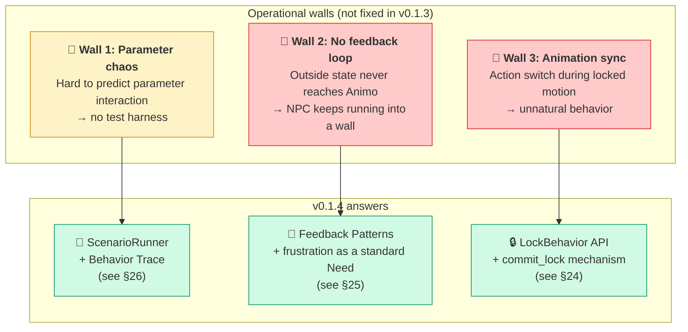

### 3.2 Main Changes (additive, not breaking)

| Change                  | v0.1.3              | v0.1.4                                    | Reason                     |
| ----------------------- | ------------------- | ----------------------------------------- | -------------------------- |
| **New Engine API**      | —                   | `Lock(duration, mode)` / `Unlock()` added | behavior lock (Wall 3)     |
| **Standard Need added** | 7 (hunger ... idle) | **8 (+ frustration)**                     | feedback pattern (Wall 2)  |
| **New chapter §24**     | —                   | Behavior Lock and Animation Sync          | Wall 3 operational guide   |
| **New chapter §25**     | —                   | Germio Feedback Loop                      | Wall 2 operational guide   |
| **New chapter §26**     | —                   | Test Harness and Simulator                | Wall 1 operational support |
| **Validator**           | A000–A029           | **A000–A032** (A030/A031/A032 added)      | for new Need / new API     |
| schema_version          | `"1.3"`             | `"1.4"`                                   | new Need + new fields      |

### 3.3 Backward Compatibility

**v0.1.4 is fully backward compatible with v0.1.3.** Nothing is broken.

+ An existing `animo.json` with `schema_version: 1.3` works after just changing the version field.
+ The `frustration` Need is added, but if you don't mention it in JSON, the engine treats it as 0.0 (same as before).
+ The `Lock()` API is brand new. Existing game code is not affected.

### 3.4 Engine API Extension

```csharp
// existing (v0.1.3)
public void Live(float dt);
public void Affect(string need, float delta, bool force_reset = false);
public string behavior { get; }

// 🆕 added in v0.1.4
public void Lock(float duration, LockMode mode = LockMode.Hard);
public void Unlock();
public bool is_locked { get; }
public string locked_behavior { get; }
```

See §24 for details.

### 3.5 Standard Need Extension

| Need            | Tier  | Use                                        |
| --------------- | ----- | ------------------------------------------ |
| hunger          | 1     | physical lack                              |
| fatigue         | 1     | physical lack                              |
| fear            | 2     | safety                                     |
| loneliness      | 3     | social                                     |
| confidence      | 4     | esteem                                     |
| curiosity       | 5     | self-actualization                         |
| idle            | 5     | passive action (added in v0.1.1)           |
| **frustration** | **2** | **🆕 v0.1.4 — accumulated action failure** |

Why we put `frustration` at Tier 2 (same level as `fear`):

+ Failure builds up as a mental threat, like discomfort.
+ When it rises, it suppresses higher-tier Needs (loneliness, curiosity, etc.).
+ In Maslow terms, this is "lack of safety" — the same mechanism as fear.
+ LLMs can intuitively map a value to this position.

#### 3.5.1 Engine Implementation Contract for Need → Tier (v0.1.5, Q-S16)

The §3.5 table is **not just documentation** — `Animo.Const`
exposes the same data as runtime maps so the Engine's
`max_lower_tier_intensity` computation in §9.3.4 actually has a
data source. Two complementary maps are provided:

```csharp
// Animo.Const — name-keyed for setup; index-keyed for hot path
NEED_TIER_BY_NAME    : Dictionary<string, int>      // "fear" → 2
NEED_INDICES_BY_TIER : Dictionary<int, int[]>       // 2 → [NEED_INDEX_FEAR, NEED_INDEX_FRUSTRATION]
```

Phase 3 Engine implementations must read tier membership from
`NEED_INDICES_BY_TIER` when accumulating
`max_lower_tier_intensity`; reading from any other source (e.g.
`Action.tier`, JSON-supplied custom maps) would re-introduce the
implementation gap that Q-S16 closes.

**Non-standard Needs** (any Need name not in `STANDARD_NEEDS` —
already surfaced as A019 Warning) are **excluded** from
`max_lower_tier_intensity`. They have no tier membership in
`NEED_INDICES_BY_TIER`, so they neither suppress higher tiers nor
get suppressed by lower ones. Custom Needs participate in
`influences` and `Action.need` references normally; they simply
sit outside Maslow's pyramid.

**Why excluded, not "tier 5 by default":** assigning a default
tier would silently put unknown Needs at the bottom of suppression
order — sometimes correct (a curiosity-like custom Need) and
sometimes catastrophic (a hunger-like custom Need that should
suppress everything above). Forcing the LLM author to choose a
*standard* Need name when they want Maslow participation is the
honest contract; custom Needs are explicitly outside Maslow.

**`frustration` participates fully.** Even when frustration is
used only via `influences` (e.g. amplifying `fear` per §25.5.2)
and has no `Action` of its own, it still appears in
`NEED_INDICES_BY_TIER[2]`. So `max_lower_tier_intensity` for any
Tier-3-or-higher Action *does* include `eff_frustration / 100`,
and a rising frustration *does* suppress higher-tier Actions.
This was Gemini-11's specific concern; the contract here makes it
explicit.

#### 3.5.2 Per-Persona Genre Tier Extension via `needs_meta` (v0.1.5, Q-S30)

Q-S16's "non-standard Needs are excluded from `max_lower_tier_intensity`" was the safe default but it conflicted with §20.4's explicit promise that Animo is genre-agnostic and `needs` keys are free. A survival game declaring `oxygen`, `temperature`, `thirst` as tier-1 physiological Needs would, pre-Q-S30, have those Needs unable to suppress higher-tier Actions — an NPC literally suffocating while peacefully exploring.

**Resolution**: introduce optional **`needs_meta`** at the Persona/Kind level. Each entry declares the tier of a non-standard Need so it joins Maslow suppression with full tier semantics:

```json
{
  "agent_id": "survivor",
  "needs": { "oxygen": 80, "temperature": 50, "thirst": 60, "fear": 30 },
  "needs_meta": {
    "oxygen":      { "tier": 1 },
    "temperature": { "tier": 1 },
    "thirst":      { "tier": 1 }
  }
}
```

`needs_meta` is **optional**:

+ Standard Needs (in `Const.STANDARD_NEEDS`) ignore `needs_meta` entries — their tier is fixed by §3.5.
+ Non-standard Needs without a `needs_meta` entry remain **excluded** from Maslow (Q-S16's original default), keeping backward compatibility for v0.1.4 JSONs.
+ Non-standard Needs *with* a `needs_meta.tier` entry join Maslow suppression at that tier, *for that Persona only*.

**Per-Persona, not global.** `needs_meta` lives on the Persona (and is merged from Kinds via §8.3); Engine ctor builds a **per-Persona** `_need_tier_indices: Dictionary<int, int[]>` that starts as a copy of `Const.NEED_INDICES_BY_TIER` and adds the `needs_meta`-declared non-standard Needs at their declared tiers. The static `Const.NEED_INDICES_BY_TIER` remains a shared default; per-Persona suppression uses the local map.

**Validator rule A038** (Q-S30, scope refined in Q-S41):

+ **Stage 1**: tier value outside `[1, 5]` → **Error A038**.
+ **Stage 1**: `needs_meta` entry overriding a *standard* Need's tier with a value disagreeing with §3.5 → **Warning A038** (the §3.5 value still wins; the meta is ignored, but the disagreement is surfaced).
+ **Stage 2 (Q-S41 + Q-S49 + Q-S57)**: `needs_meta` entry whose Need is *neither* in composed `needs[]` *nor* referenced by composed `actions[].need` *nor* referenced by composed `influences[].source/target` *nor* referenced by composed `binding.thresholds[].need` *nor* keyed by composed `rates` → **Warning A038** (genuinely orphaned metadata). Pre-Q-S41 this check ran in Stage 1, which spammed Warnings on every child Persona that inherited a generic survival Kind's broad `needs_meta` and only used a subset. **Q-S49** added thresholds; **Q-S57** adds `rates` keys for the legitimate "pure-rate Need" pattern (e.g. a `poison` Need that decays via `rates` only and is read by UI without any Action, Influence, or Threshold).

**A019 interaction**: A019 (Unknown Need Warning) still fires for Needs not in `STANDARD_NEEDS`, but a Persona that consciously declares a custom Need and supplies `needs_meta` can suppress A019 by being explicit. (Implementation: A019 fires only if the Need is also absent from `needs_meta`.)

**Why opt-in, not auto-default**:

+ Non-standard Needs without `needs_meta` have semantically unclear tier (a `jealousy` Need might be tier 2 anxiety or tier 4 ego — the LLM author knows; Animo doesn't).
+ Forcing a default risks the catastrophic case Q-S16 worried about (hunger-like custom Need silently sitting at tier 5 and never suppressing).
+ Opt-in is honest: silent until the author asks for Maslow participation.

**Engine ctor construction sequence (Q-S30 + Q-S27 + Q-S37)**:

The Engine ctor must execute these phases **in this order**; reversing any pair breaks one of the contracts:

```csharp
// PHASE A (Q-S27): build _need_index and reserve standard slots.
//   Standard Needs at fixed indices 0..7; non-standard Needs from
//   _persona.needs append at index >= 8. See §16.2.2.1.
_need_index = new Dictionary<string, int>();
for (int i = 0; i < Const.STANDARD_NEEDS.Count; i++) {
    _need_index[Const.STANDARD_NEEDS[i]] = i;
}
int next_idx = Const.STANDARD_NEEDS.Count;
// (v0.1.5, Q-S65) `_persona.needs` is a `Needs` class wrapping
// `Dictionary<string, float> values`, NOT a Dictionary directly.
// Pre-Q-S65 the code wrote `_persona.needs ?? new Dictionary<...>`
// — type-mismatch compile error (Needs is not Dictionary). Iterate
// `_persona.needs?.values ?? new Dictionary<string, float>()`.
foreach (var kv in _persona.needs?.values ?? new Dictionary<string, float>()) {
    if (!_need_index.ContainsKey(kv.Key)) {
        _need_index[kv.Key] = next_idx++;
    }
}
// PHASE A.2 (Q-S30 + Q-S37 cross-check): a Need that appears ONLY in
// `needs_meta` (i.e. the author declared its tier but forgot to seed
// it in `needs`) still needs an index slot for `_need_tier_indices`
// to point into. We add it at index >= 8 with default value 0.
// Validator A038 already issued a Warning ("needs_meta entry
// referencing a Need not declared in `needs`") so the author saw it,
// but at runtime we materialize the slot rather than crash.
if (_persona.needs_meta != null) {
    foreach (var meta in _persona.needs_meta) {
        if (!_need_index.ContainsKey(meta.Key)) {
            _need_index[meta.Key] = next_idx++;
        }
    }
}
_effective_needs          = new float[next_idx];
_previous_effective_needs = new float[next_idx];
_needs                    = new float[next_idx];
// (v0.1.5, Q-S65) Same Needs.values unwrap as above.
foreach (var kv in _persona.needs?.values ?? new Dictionary<string, float>()) {
    _needs[_need_index[kv.Key]] = kv.Value;
}

// PHASE B (Q-S37): bake need_index into Action and Threshold instances
// (post-DeepCopy by Agent.Awake). MUST happen BEFORE Phase C so
// `_need_tier_indices` can read `_need_index[meta.Key]` and Action
// hot-path reads `action.need_index` correctly.
foreach (var action in _persona.actions ?? new List<Action>()) {
    action.need_index = _need_index[action.need];
}
foreach (var threshold in _persona.binding?.thresholds ?? Array.Empty<Threshold>()) {
    threshold.need_index = _need_index[threshold.need];
}

// PHASE C (Q-S30 + Q-S69): build per-Persona _need_tier_indices.
// (v0.1.5, Q-S69) The field's TYPE is `Dictionary<int, int[]>` (per
// §16.6 — Hot Path needs `int[]` for zero-alloc cache-friendly
// iteration during Step 4's `max_lower_tier_intensity` lookup; List
// has GC overhead and indexer cost we explicitly reject in §16.1).
// During CONSTRUCTION we use a local `Dictionary<int, List<int>>`
// scratch buffer because tier participation grows incrementally as
// `needs_meta` non-standard Needs are merged. At the end of PHASE C
// we **finalize** the scratch into the field by snapshotting each
// `List<int>` into a `new int[]`. Pre-Q-S69 the spec narrative
// declared `_need_tier_indices = new Dictionary<int, List<int>>()`
// — a confirmed type mismatch with the §16.6 field declaration.
var scratch_tier_indices = new Dictionary<int, List<int>>();
// Step 1: start with the static map (Q-S16)
foreach (var kv in Const.NEED_INDICES_BY_TIER) {
    scratch_tier_indices[kv.Key] = new List<int>(kv.Value);
}
// Step 2 (tier participation): extend with non-standard Needs
// declared in needs_meta. Standard Needs SKIP this step because
// §3.5 wins for tier per Q-S30.
if (_persona.needs_meta != null) {
    foreach (var meta in _persona.needs_meta) {
        bool is_standard = Array.IndexOf(Const.STANDARD_NEEDS, meta.Key) >= 0;
        if (is_standard) continue;   // §3.5 wins for tier (Q-S30)
        // Non-standard Need: tier joins scratch_tier_indices.
        // _need_index[meta.Key] is guaranteed to exist after Phase A.2.
        int tier = meta.Value.tier;
        if (!scratch_tier_indices.ContainsKey(tier)) {
            scratch_tier_indices[tier] = new List<int>();
        }
        scratch_tier_indices[tier].Add(_need_index[meta.Key]);
    }
}
// (Q-S69) Finalize scratch → field: snapshot each List<int> to int[].
// One allocation per tier (typically 5 entries) at ctor time only;
// Hot Path iteration is then over `int[]` per §16.1 contract.
_need_tier_indices = new Dictionary<int, int[]>();
foreach (var kv in scratch_tier_indices) {
    _need_tier_indices[kv.Key] = kv.Value.ToArray();
}

// Step 3 (non-tier metadata, Q-S45 + Q-S56): apply non-tier NeedMeta
// fields to ALL Needs in the composed Persona, not just those listed
// in `needs_meta`. v0.1.5 has no non-tier NeedMeta fields, so this
// loop is structural only; v0.2 / v0.3 fields like `decay_multiplier`
// or `label` apply here.
//
// Q-S56 fix: pre-Q-S56 the call was inside the `needs_meta` foreach
// (Q-S45's "narrow skip"), which only iterated Needs the author
// explicitly declared in needs_meta. If the author wrote no
// needs_meta (legitimate for any Persona using only standard Needs),
// the loop never ran and ApplyNonTierMetadata never reached any
// Need. Q-S56 separates the pass: every Need in the composed
// Persona receives ApplyNonTierMetadata(index, meta_or_default),
// where `meta_or_default` is the explicit needs_meta entry if
// present, or a per-Need default NeedMeta otherwise.
//
// (v0.1.5, Q-S66 — Q-S56 self-fix) Pre-Q-S66 this loop wrote
// `_composed_persona.needs.Count` and `_composed_persona.needs[idx]`
// — but `Needs` is a class wrapping `Dictionary<string, float> values`,
// not an indexable collection. No `.Count`, no integer indexer.
// Confirmed compile error introduced by Q-S56's structural rewrite.
// Fix: iterate the `_need_index` map (built in PHASE A from the
// composed needs ∪ needs_meta union — the canonical "every Need
// known to this Engine" list). Each entry has the index already;
// no fragile re-derivation needed.
foreach (var entry in _need_index) {
    string need_name = entry.Key;
    int    idx       = entry.Value;
    NeedMeta meta;
    if (_persona.needs_meta != null
        && _persona.needs_meta.TryGetValue(need_name, out var explicit_meta)) {
        meta = explicit_meta;
    } else {
        // Per-Need default: tier from §3.5 for standard, or
        // an engine-default sentinel for non-standard. v0.1.5
        // only `tier` lives in NeedMeta so the default is
        // synthesized here without runtime cost.
        meta = NeedMeta.DefaultFor(need_name);
    }
    ApplyNonTierMetadata(idx, meta);
}
// ApplyNonTierMetadata is a no-op in v0.1.5 (NeedMeta only has
// `tier`); reserved for future NeedMeta fields. The method is
// declared in `Scripts/Engine.cs` as a private no-op stub
// (Q-S48 closes the spec-vs-code gap that Q-S45 opened by
// calling a method with no declaration).
// Step 4 (§9.3.4) reads from _need_tier_indices (per-Persona),
// not from Const.NEED_INDICES_BY_TIER (per-process default).

// PHASE D (Q-S8 + Q-S23 + Q-S25): seed _previous_effective_needs and
// Threshold.is_above by running one Step-2 pass over the spawn
// Needs. (Details in §16.6 row for `_previous_effective_needs`.)
```

The phase ordering is: **A (index map + array allocation) → A.2 (needs_meta-only slots) → B (Action/Threshold need_index bake, Q-S37) → C (`_need_tier_indices` build, Q-S30) → D (Threshold seeding, Q-S8/Q-S23/Q-S25)**. Any reordering breaks at least one contract — e.g. running C before A.2 would crash on `_need_index[meta.Key]` for needs_meta-only Needs; running B before A would have nothing to bake against.

### 3.6 New Validator Rules

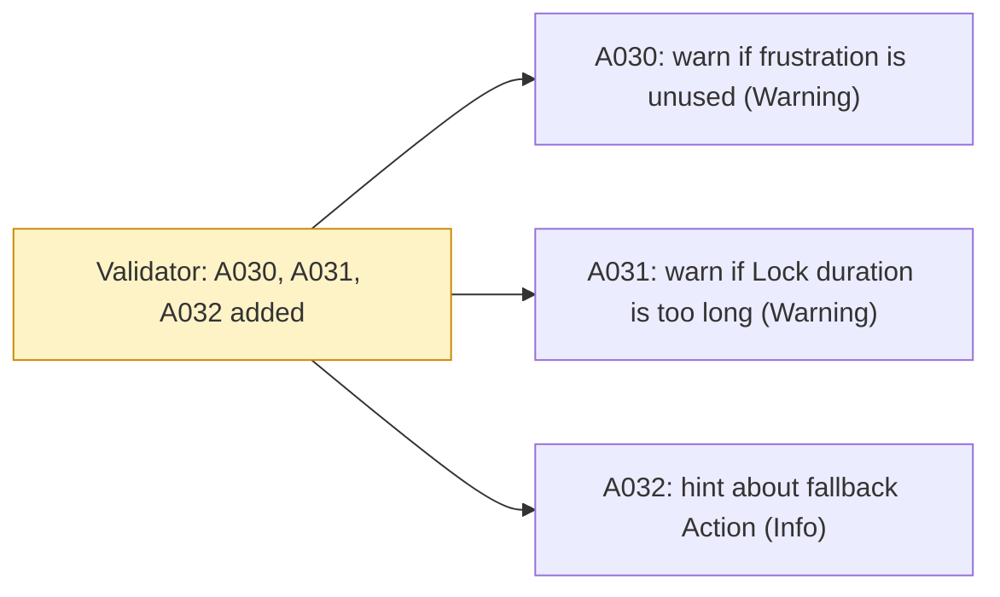

| ID   | Rule                                                                                  | Level             |
| ---- | ------------------------------------------------------------------------------------- | ----------------- |
| A030 | If no `actions` or `influences` use `frustration`, the feedback design may be missing | Warning           |
| A031 | `Lock(duration)` over 30 seconds risks runaway state                                  | Warning (runtime) |
| A032 | Check that there is a low-tier "fallback" Action besides `idle`                       | Info              |

### 3.7 Summary of the Fourth Critique Response

| Point                     | Response                               | Where |
| ------------------------- | -------------------------------------- | ----- |
| 1. Parameter tuning chaos | ✅ Adopted (test harness specified)    | §26   |
| 2. Missing feedback loop  | ✅ Adopted (frustration + pattern set) | §25   |
| 3. Animation sync         | ✅ Adopted (Lock/Unlock API)           | §24   |

**The fourth critique pointed at the operational layer, not at design holes. We answer by keeping the design pure and adding a thicker operational layer.**

---

## 4. Architecture Overview

The internal structure of Animo at a glance.

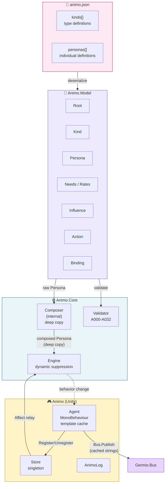

---

## 5. Namespace Hierarchy and Dependency Direction

**G18 is strict.** A higher layer can use a lower layer. A lower layer must not know about a higher one.

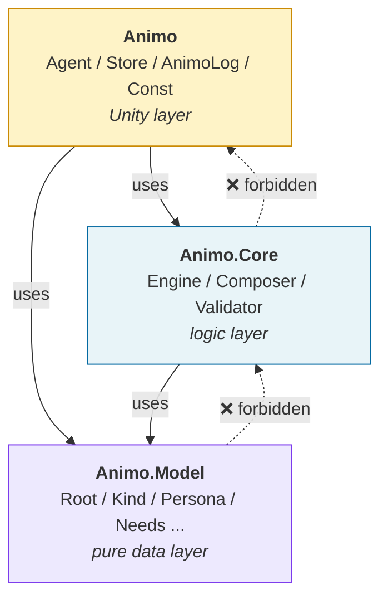

### 5.1 Layer Roles

| Layer         | Role                                                    | Can depend on               |
| ------------- | ------------------------------------------------------- | --------------------------- |
| `Animo.Model` | Pure data classes. Maps directly to the JSON structure. | nothing                     |
| `Animo.Core`  | Calculation logic. Unity-free. Easy to test.            | `Animo.Model`               |
| `Animo`       | Unity integration. MonoBehaviour and Germio bridge.     | `Animo.Core`, `Animo.Model` |

---

## 6. Full Class List

### 6.1 Class Cards (v0.1.4)

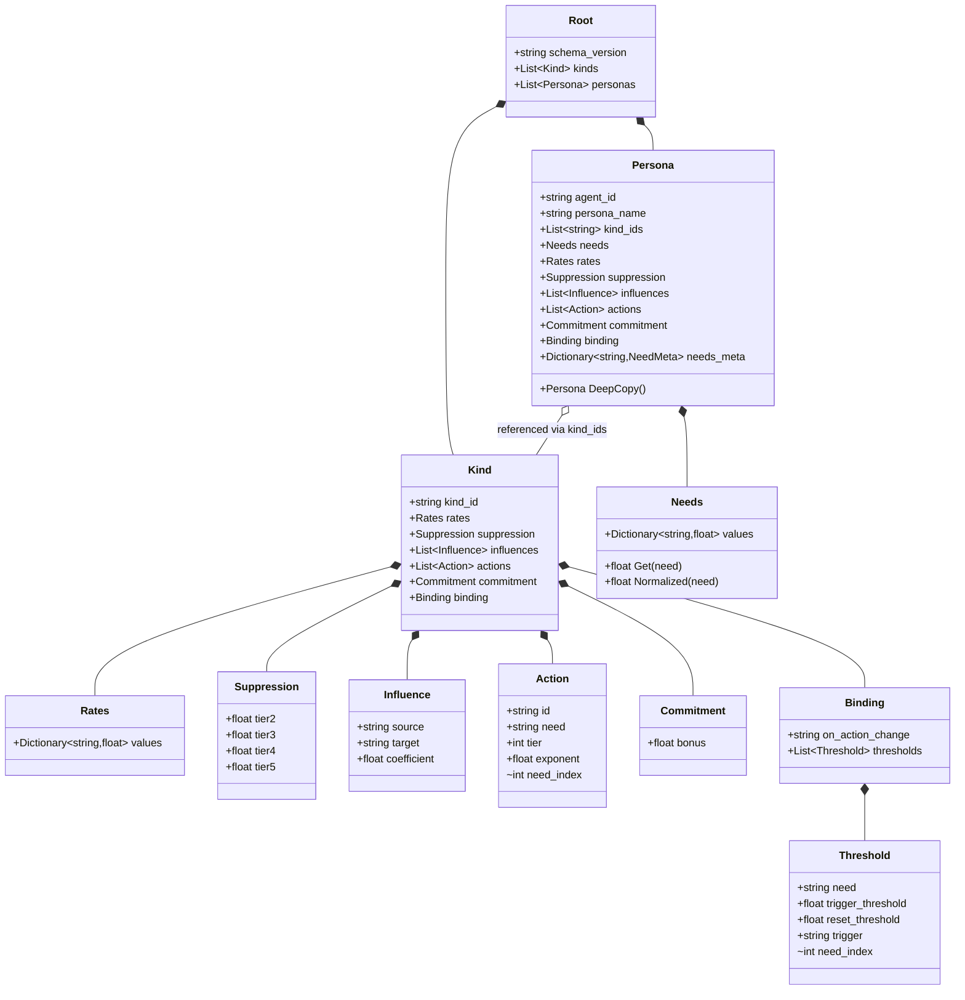

### 6.2 Diff from v0.1.0

| Class                        | Change                                                                                                                                                                  |
| ---------------------------- | ----------------------------------------------------------------------------------------------------------------------------------------------------------------------- |
| `Action`                     | Removed `base_score`, made `need` required (v0.1.1). Added `internal int need_index` cache (v0.1.3).                                                                    |
| `Threshold`                  | Changed to two-stage `trigger_threshold` / `reset_threshold` (v0.1.1). Added `internal int need_index` cache (v0.1.3).                                                  |
| `Needs`                      | ~~Added `Clamp()` method (forces [0, 100]) (v0.1.1).~~ Removed in v0.1.5 (Q-S63) — dead since the v0.1.2 hot-path migration to `float[] _needs` + direct `Mathf.Clamp`. |
| `Hysteresis` → `Commitment`  | Class name changed (v0.1.3). Field `decay` removed (v0.1.3).                                                                                                            |
| `Engine`                     | **Lock / Unlock API added (v0.1.4)**                                                                                                                                    |
| `Animo.Tools.ScenarioRunner` | **New class (v0.1.4)** — offline simulator.                                                                                                                             |
| `LockMode` enum              | **New enum (v0.1.4)** — Hard / Soft.                                                                                                                                    |

### 6.3 Full Class Table

| Namespace     | Class            | Role                                                                    | Visibility    |
| ------------- | ---------------- | ----------------------------------------------------------------------- | ------------- |
| `Animo.Model` | `Root`           | JSON root                                                               | public        |
| `Animo.Model` | `Kind`           | type definition                                                         | public        |
| `Animo.Model` | `Persona`        | individual definition                                                   | public        |
| `Animo.Model` | `Needs`          | need value set (JSON-bridge shape; v0.1.5 Q-S63 removed dead `Clamp()`) | public        |
| `Animo.Model` | `Rates`          | need change rates                                                       | public        |
| `Animo.Model` | `Suppression`    | tier suppression factors (dynamic calc)                                 | public        |
| `Animo.Model` | `Influence`      | need-to-need effect                                                     | public        |
| `Animo.Model` | `Action`         | action definition (need required, no base_score)                        | public        |
| `Animo.Model` | `Commitment`     | action continuation bonus (permanent)                                   | public        |
| `Animo.Model` | `Binding`        | Germio integration                                                      | public        |
| `Animo.Model` | `Threshold`      | two-stage threshold trigger                                             | public        |
| `Animo.Core`  | `Composer`       | Kind composition (deep copy)                                            | **internal**  |
| `Animo.Core`  | `Engine`         | AI calculation (dynamic suppression + Lock)                             | public        |
| `Animo.Core`  | `Validator`      | animo.json validation (A000–A032)                                       | public        |
| `Animo.Core`  | `LockMode`       | enum: Hard / Soft (v0.1.4)                                              | public        |
| `Animo`       | `Agent`          | MonoBehaviour wrapper (template cache)                                  | public        |
| `Animo`       | `Store`          | window for all Agents (singleton)                                       | public        |
| `Animo`       | `AnimoLog`       | logger                                                                  | public        |
| `Animo`       | `Const`          | domain constants                                                        | public static |
| `Animo.Tools` | `ScenarioRunner` | offline simulator (v0.1.4)                                              | public        |
| `Animo.Tools` | `TraceResult`    | simulation result (v0.1.4)                                              | public        |
| `Animo.Tools` | `TraceFrame`     | per-frame state snapshot (v0.1.4)                                       | public        |
| `Animo.Tools` | `AffectEvent`    | timed Affect injection (v0.1.4)                                         | public        |

---

## 7. animo.json Schema

### 7.1 Full Sample (v0.1.4)

```json
{
  "schema_version": "1.4",
  "kinds": [
    {
      "kind_id": "goblin",
      "rates": {
        "hunger": 2.0, "fatigue": 1.5, "fear": -2.0,
        "loneliness": 1.2, "confidence": -0.3,
        "curiosity": 0.8, "idle": 0.5, "frustration": -1.0
      },
      "suppression": {
        "tier2": 0.30, "tier3": 0.50, "tier4": 0.70, "tier5": 0.90
      },
      "influences": [
        { "source": "fear",        "target": "confidence", "coefficient": -0.60 },
        { "source": "fear",        "target": "curiosity",  "coefficient": -0.50 },
        { "source": "hunger",      "target": "fear",       "coefficient":  0.25 },
        { "source": "frustration", "target": "fear",       "coefficient":  0.30 },
        { "source": "frustration", "target": "confidence", "coefficient": -0.40 }
      ],
      "actions": [
        { "id": "Flee",       "need": "fear",      "tier": 2, "exponent": 2.5 },
        { "id": "SearchFood", "need": "hunger",    "tier": 1, "exponent": 1.8 },
        { "id": "Rest",       "need": "fatigue",   "tier": 1, "exponent": 1.5 },
        { "id": "Patrol",     "need": "idle",      "tier": 5, "exponent": 1.0 }
      ],
      "commitment": { "bonus": 10 },
      "binding": {
        "on_action_change": "animo_{agent_id}_{behavior}",
        "thresholds": [
          {
            "need": "fear",
            "trigger_threshold": 80,
            "reset_threshold": 70,
            "trigger": "animo_{agent_id}_fear_critical"
          }
        ]
      }
    },
    {
      "kind_id": "scout",
      "influences": [
        { "source": "fear", "target": "confidence", "coefficient": -0.30 }
      ],
      "actions": [
        { "id": "Socialize", "need": "loneliness", "tier": 3, "exponent": 1.3 }
      ]
    }
  ],
  "personas": [
    {
      "agent_id": "goblin_scout_01",
      "persona_name": "Goblin Scout — Timid Skirmisher",
      "kind_ids": ["goblin", "scout"],
      "needs": {
        "hunger": 40, "fatigue": 20, "fear": 55,
        "loneliness": 60, "confidence": 35,
        "curiosity": 45, "idle": 30, "frustration": 0
      }
    }
  ]
}
```

### 7.2 JSON Key List (G16 match)

| C# class      | JSON key      | Form                     |
| ------------- | ------------- | ------------------------ |
| `Root`        | —             | (root, no key)           |
| `Kind`        | `kinds`       | array (plural)           |
| `Persona`     | `personas`    | array (plural)           |
| `Needs`       | `needs`       | object                   |
| `Rates`       | `rates`       | object                   |
| `Suppression` | `suppression` | object                   |
| `Influence`   | `influences`  | array (plural)           |
| `Action`      | `actions`     | array (plural)           |
| `Commitment`  | `commitment`  | object                   |
| `Binding`     | `binding`     | object (singular)        |
| `Threshold`   | `thresholds`  | array (inside `binding`) |

### 7.3 Optional Fields

| Key                                    | Optional?                             | Default                                                                                                          |
| -------------------------------------- | ------------------------------------- | ---------------------------------------------------------------------------------------------------------------- |
| `actions[].need`                       | ❌ **required** (changed from v0.1.0) | —                                                                                                                |
| `actions[].base_score`                 | — **removed** (v0.1.0 → v0.1.1)       | —                                                                                                                |
| `commitment.bonus`                     | ✅                                    | `0.0` (v0.1.3: the `commitment` object itself can be omitted)                                                    |
| `commitment.decay`                     | — **removed** (v0.1.3)                | —                                                                                                                |
| `binding.on_action_change`             | ✅                                    | engine default `animo_{agent_id}_{behavior}`                                                                     |
| `binding.thresholds[].reset_threshold` | ✅                                    | `Math.Max(0.0, trigger_threshold - 5.0)` (Q-S11; floor at 0 to prevent unreachable-reset deadlock — see §12.3.4) |
| `kind_ids`                             | ✅                                    | empty array (no composition)                                                                                     |
| Persona-level `rates` etc.             | ✅                                    | inherited from `Kind`                                                                                            |

### 7.4 schema_version Update

`"1.3"` → `"1.4"`. **Backward compatible** (no breaking changes). Adds support for the `frustration` Need and the `Lock` API. See §3 for details.

---

## 8. Kind × Persona Cascading

### 8.1 Idea: CSS-style Last-Wins Cascade

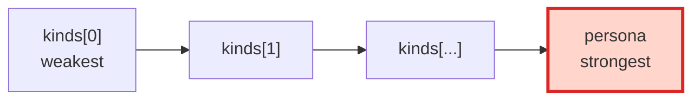

### 8.2 Composition Rules (clarified in v0.1.1)

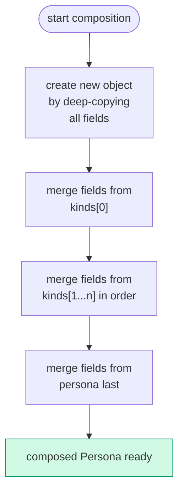

### 8.3 Merge Unit (from Gemini critique D-1)

| Target                             | Merge method                                                                                                                                                                                                                                                                                                                                                                                                                                                                                                                                                                                                                                                                                                                                                                                                                                                                                                                                                                                                                                                                                                                                                                                                       | Note                                                                                                                                                                                                                                                                                                                                                                                                                                                                                                                                                                                                                                                                                                                                                                                                                                                                                                                                                                                                                                                                                                                                                                                                                                                                                                                                                                                                                        |
| ---------------------------------- | ------------------------------------------------------------------------------------------------------------------------------------------------------------------------------------------------------------------------------------------------------------------------------------------------------------------------------------------------------------------------------------------------------------------------------------------------------------------------------------------------------------------------------------------------------------------------------------------------------------------------------------------------------------------------------------------------------------------------------------------------------------------------------------------------------------------------------------------------------------------------------------------------------------------------------------------------------------------------------------------------------------------------------------------------------------------------------------------------------------------------------------------------------------------------------------------------------------------ | --------------------------------------------------------------------------------------------------------------------------------------------------------------------------------------------------------------------------------------------------------------------------------------------------------------------------------------------------------------------------------------------------------------------------------------------------------------------------------------------------------------------------------------------------------------------------------------------------------------------------------------------------------------------------------------------------------------------------------------------------------------------------------------------------------------------------------------------------------------------------------------------------------------------------------------------------------------------------------------------------------------------------------------------------------------------------------------------------------------------------------------------------------------------------------------------------------------------------------------------------------------------------------------------------------------------------------------------------------------------------------------------------------------------------- |
| Scalar values (`commitment.bonus`) | last-wins per field                                                                                                                                                                                                                                                                                                                                                                                                                                                                                                                                                                                                                                                                                                                                                                                                                                                                                                                                                                                                                                                                                                                                                                                                | only defined fields override                                                                                                                                                                                                                                                                                                                                                                                                                                                                                                                                                                                                                                                                                                                                                                                                                                                                                                                                                                                                                                                                                                                                                                                                                                                                                                                                                                                                |
| Object (`commitment` whole)        | **last-wins per field (deep merge)**                                                                                                                                                                                                                                                                                                                                                                                                                                                                                                                                                                                                                                                                                                                                                                                                                                                                                                                                                                                                                                                                                                                                                                               | (v0.1.3 only has `bonus`, but the rule applies if more fields are added)                                                                                                                                                                                                                                                                                                                                                                                                                                                                                                                                                                                                                                                                                                                                                                                                                                                                                                                                                                                                                                                                                                                                                                                                                                                                                                                                                    |
| Dictionary (`needs`, `rates`)      | last-wins per key                                                                                                                                                                                                                                                                                                                                                                                                                                                                                                                                                                                                                                                                                                                                                                                                                                                                                                                                                                                                                                                                                                                                                                                                  | per key                                                                                                                                                                                                                                                                                                                                                                                                                                                                                                                                                                                                                                                                                                                                                                                                                                                                                                                                                                                                                                                                                                                                                                                                                                                                                                                                                                                                                     |
| Array (`actions`)                  | **Persona-order-preserving last-wins** (v0.1.5, Q-S19): start from `persona.actions[]` in declared order; for each Kind action whose `id` does not appear in the Persona, append at the tail in Kind cascade order; for each Kind action whose `id` *does* appear in the Persona, drop the Kind copy (Persona's value wins, position fixed by Persona). Pre-Q-S19 the rule was Kind-first ("existing id overrides; new id appends") which let the inheritance order silently displace the LLM's intended index-0 default — directly contradicting Q-S9's declaration-order tie-break. **(Q-S61 design note: a Persona CANNOT remove a Kind's Action by omission — every Kind Action whose `id` is missing from the Persona is appended at the tail.)** This is intentional: inheritance is additive, never subtractive, so a child Persona inheriting from a Kind cannot accidentally lose a critical fallback (e.g. `Idle`) just by not mentioning it. To author "use Kind A but without one of its Actions", split Kind A into Kind A_core (without that Action) and Kind A_extra (with it) and inherit only the slice you need; this keeps removal explicit at the JSON-authoring layer where it is reviewable. | last-wins on **value** (Persona overrides Kind), Persona-first on **order**, **additive-only on membership** (Q-S61)                                                                                                                                                                                                                                                                                                                                                                                                                                                                                                                                                                                                                                                                                                                                                                                                                                                                                                                                                                                                                                                                                                                                                                                                                                                                                                        |
| Array (`influences`)               | **Persona-order-preserving last-wins** (v0.1.5, Q-S20): same shape as the actions rule above — start from `persona.influences[]` in declared order, append Kind influences whose `(source, target)` keys are not yet present, drop Kind copies whose keys collide with the Persona's. The Persona-first ordering is what makes the §9.6.2 stable topological sort deterministic: independent Edges fall back to the Persona's authored order when topo sort cannot decide between them.                                                                                                                                                                                                                                                                                                                                                                                                                                                                                                                                                                                                                                                                                                                            | last-wins on **value**, Persona-first on **order**                                                                                                                                                                                                                                                                                                                                                                                                                                                                                                                                                                                                                                                                                                                                                                                                                                                                                                                                                                                                                                                                                                                                                                                                                                                                                                                                                                          |
| Array (`thresholds`)               | match by `(need, trigger_threshold)` compound key with `float` EPSILON tolerance, last-wins                                                                                                                                                                                                                                                                                                                                                                                                                                                                                                                                                                                                                                                                                                                                                                                                                                                                                                                                                                                                                                                                                                                        | (v0.1.5, Q-S14 + Q-S43 + Q-S47) — multiple thresholds on the same Need are now allowed (e.g. `fear=50 → "alerted"`, `fear=80 → "panic"`); compound key prevents one Need's high-trigger from silently overwriting its own low-trigger sibling. **Q-S47 (refined from Q-S43)**: the `trigger_threshold` half of the key compares with `Math.Abs(a - b) < THRESHOLD_KEY_EPSILON` (default `THRESHOLD_KEY_EPSILON = 0.01f`), not raw `==`. Pre-Q-S43 a Kind declaring `trigger_threshold: 80.0` and a Persona overriding with `80.0001` (or any IEEE-754 round-trip artifact) created two near-identical sibling thresholds that both fired — the override silently became a duplicate. **Q-S47 corrects Q-S43's flawed justification**: Q-S43 used `EPSILON = 0.5f` claiming "authored milestone spacing is always >= 5 by A035 / Q-S15", but A035's 5-unit gap is between `trigger` and `reset` of the SAME Threshold — there is NO spec guarantee on sibling-threshold-trigger spacing. An LLM author writing `fear=80.0 → alert` and `fear=80.4 → panic` would have both thresholds collapsed by Q-S43's overly-wide window. `0.01f` covers IEEE-754 round-trip drift (~`1e-7`) with three orders of magnitude of margin while preserving any author-intended distinction down to 1/100th of a Need unit. New rule **A039** (Warning) surfaces sibling pairs within `1.0f` of each other so the author can confirm intent. |
| Dictionary (`needs_meta`)          | last-wins per key (Need name)                                                                                                                                                                                                                                                                                                                                                                                                                                                                                                                                                                                                                                                                                                                                                                                                                                                                                                                                                                                                                                                                                                                                                                                      | (v0.1.5, Q-S30) — Persona's `needs_meta` overrides Kind's per Need name. A Kind declaring `oxygen` at tier 1 can be overridden by a Persona declaring `oxygen` at tier 2 (e.g. an enhanced cyborg variant).                                                                                                                                                                                                                                                                                                                                                                                                                                                                                                                                                                                                                                                                                                                                                                                                                                                                                                                                                                                                                                                                                                                                                                                                                 |

#### 8.3.1 Threshold compound-key EPSILON comparison (v0.1.5, Q-S43 + Q-S47)

The `(need, trigger_threshold)` compound key for `thresholds` merging uses `Math.Abs(diff) < THRESHOLD_KEY_EPSILON` (= `0.01f` per Q-S47, refined from Q-S43's original `0.5f`) on the float side, not raw `==`. Pseudocode for the merge:

```csharp
// Composer.MergeThresholds
const float THRESHOLD_KEY_EPSILON = 0.01f;   // (Q-S47): refined from Q-S43's 0.5f

bool ThresholdsMatch(Threshold a, Threshold b) {
    return a.need == b.need
        && Math.Abs(a.trigger_threshold - b.trigger_threshold) < THRESHOLD_KEY_EPSILON;
}

// (v0.1.5, Q-S85) IMPORTANT: ThresholdsMatch is NOT transitive.
// If A=80.000, B=80.006, C=80.012 then A≈B (diff 0.006 < 0.01)
// and B≈C (diff 0.006 < 0.01) but A≉C (diff 0.012 ≥ 0.01).
// To make merge results deterministic regardless of input order,
// the merge loop uses **first-occurrence-wins** semantics:
// iterate the merged-so-far list IN ORDER; the FIRST entry that
// matches the candidate is the one to override (Persona wins
// over Kind). Any second match is left untouched (silent — A039
// surfaces sibling-pair Warnings at validate time, but merge is
// already done by then). This guarantees:
//   - Deterministic output: same input list → same output.
//   - Persona priority preserved (Persona's match always overrides
//     the first-encountered Kind threshold).
//   - The non-transitive EPSILON cannot create order-dependent
//     surprises like "C absorbed into A vs C kept independent
//     depending on whether B was processed first."
//
// In the merge loop, when checking "does this Persona threshold
// override an existing Kind threshold", use ThresholdsMatch instead
// of a Dictionary<(string, float), Threshold> keyed lookup. The
// comparison is O(N) per Persona threshold, but `thresholds` is
// always small (≤ 10 in practice), so this is cheaper than the
// fragile float-keyed Dictionary.
foreach (var p_threshold in persona.binding.thresholds) {
    int found = -1;
    for (int i = 0; i < merged.Count; i++) {   // (Q-S85) first-occurrence wins
        if (ThresholdsMatch(merged[i], p_threshold)) {
            found = i;
            break;
        }
    }
    if (found >= 0) merged[found] = p_threshold;   // Persona overrides
    else            merged.Add(p_threshold);
}
```

**Q-S47 justification correction.** Q-S43 originally used `EPSILON = 0.5f` justified by *"authored milestone spacing is always ≥ 5 by A035 / Q-S15"*. Q-S47 catches that this justification was a category error: A035's 5-unit gap is between **`trigger_threshold` and `reset_threshold` of the same Threshold** (the hysteresis window), NOT between sibling Thresholds with different triggers on the same Need. There is **no spec-level guarantee** of sibling-trigger spacing. An LLM author writing `fear=80.0 → alert` and `fear=80.4 → panic` would have had both thresholds collapsed by Q-S43's overly-wide `0.5f` window — silently destroying intended adjacent milestones.

`0.01f` is the corrected window:

+ **Three orders of magnitude over IEEE-754 JSON round-trip drift** (`~1e-7` at `[0, 100]` scale) — drift can never bridge it.
+ **Preserves any author-intended distinction down to 1/100th of a Need unit** — `80.0` vs `80.4` no longer collapse.
+ **Authored authentic duplicates collapse correctly** — `80.0` and `80.0001` (same intent, different drift) merge to one (Persona's value wins).

**New Validator rule A039 (Q-S47 supplement).** A Stage-2 Warning fires when sibling thresholds on the same Need are within `1.0f` of each other:

```text
For each composed Persona's binding.thresholds[]:
  Group by need.
  Within each group, sort by trigger_threshold ascending.
  For each adjacent pair, if (next.trigger_threshold - prev.trigger_threshold) <= 1.0f:
    Emit A039 Warning: "Sibling thresholds on Need `{need}` at
    triggers {a} and {b} are within 1.0f of each other — these
    may have been intended as the same milestone. If distinct,
    confirm; if not, remove one."
```

(v0.1.5, Q-S105: pre-Q-S105 the pseudocode wrote `next.trigger - prev.trigger`, but `Threshold.trigger` is the `string` event-name field; the `float` numeric field is `trigger_threshold`. A naive Phase 3 transcription would have hit a "cannot subtract string from string" compile error. Q-S105 corrects to the unambiguous `trigger_threshold` everywhere in the pseudocode.)

A039 is a Warning, not Error, because tightly-spaced thresholds CAN be intentional (e.g. a fast-rising stress curve that warrants both `78 → murmur` and `79 → audible_panic`). The 1.0f surface threshold is conservative — well above EPSILON's 0.01f merge collapse, well below most authored milestone spacings. Silent mid-zone (`0.01f` to `1.0f`) authored thresholds are kept; only suspicious pairs surface to the author.

### 8.4 Object Merge Example

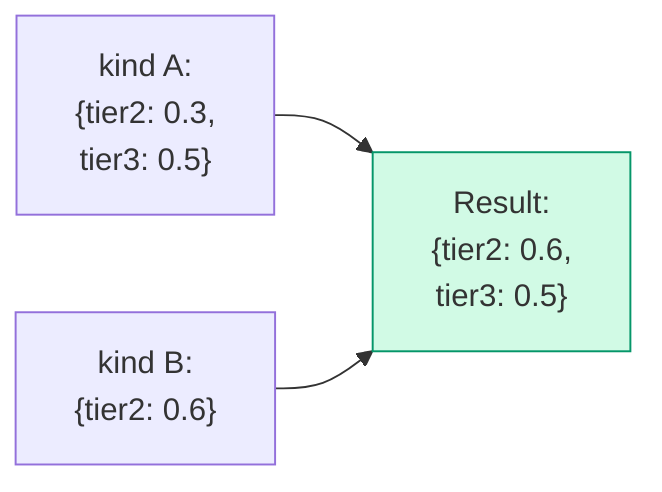

`tier2` is overwritten, `tier3` is kept. **Not a whole-object replace.**

### 8.5 Array Merge Example

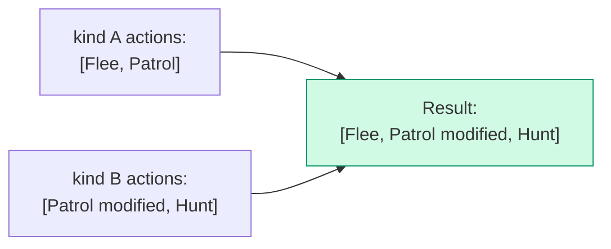

`Patrol` is replaced by kind B's version. `Flee` stays. `Hunt` is added.

### 8.6 Multiple Inheritance Example: "Japanese × A-type × Male → Yamada Taro"

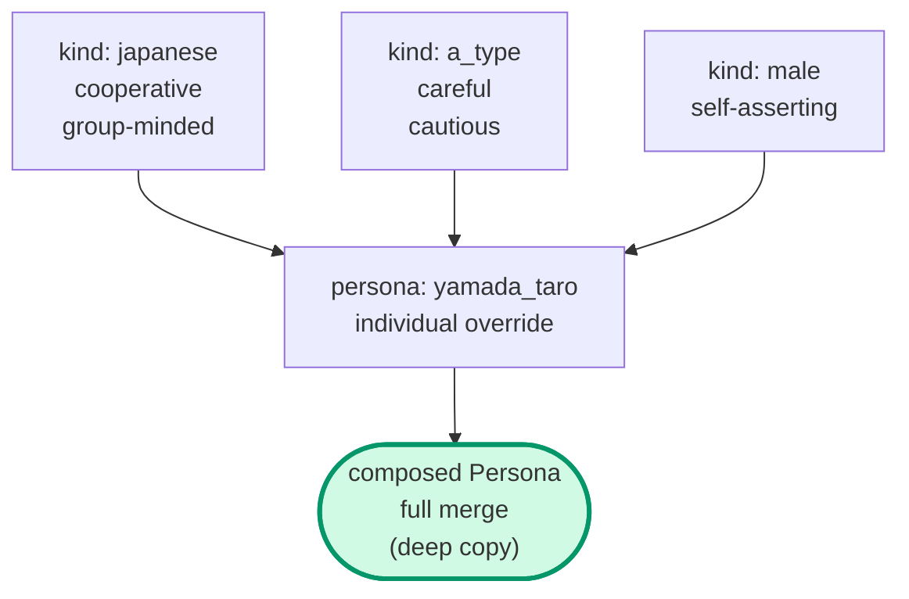

### 8.7 Inference and Computation Are Separated

The LLM only writes the `kind_ids` array order. The actual cascade math runs inside `Composer`.

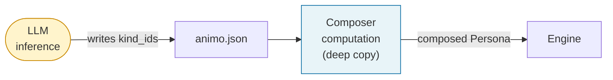

### 8.8 Implicit Need Default (from Gemini critique D-2)

If a `Kind` mentions a Need key in `rates`, `influences`, or `actions` that is not defined in the `Persona`'s `needs`:

```text
Default value for an unmentioned Need key = 0.0
```

The runtime gives a Warning (A020a/b/c) but the game keeps running. `Composer` adds `needs[missing_key] = 0.0` for you.

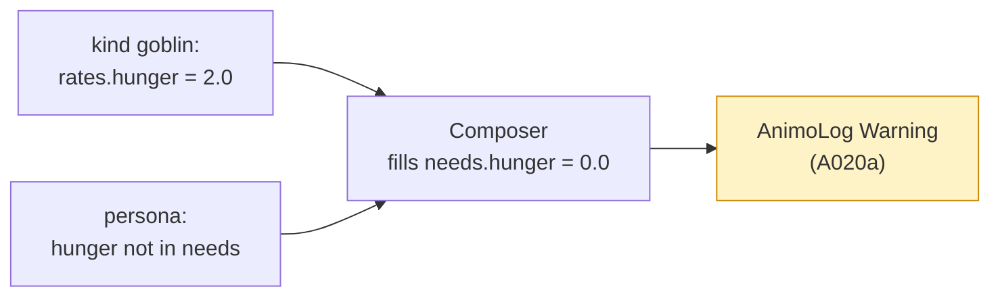

---

## 9. Engine Internal Design

### 9.1 Public API

| Kind        | Name                                                         | Purpose                                                                                                                                                                                                                            | Added                                                   |
| ----------- | ------------------------------------------------------------ | ---------------------------------------------------------------------------------------------------------------------------------------------------------------------------------------------------------------------------------- | ------------------------------------------------------- |
| Constructor | `Engine(Persona persona)`                                    | takes a fully composed `Persona` from `Composer`                                                                                                                                                                                   | v0.1.0                                                  |
| Method      | `Live(float dt)`                                             | advances time (5-step process). `dt = 0` is a no-op; `dt < 0` and `dt = NaN` throw `ArgumentException` (v0.1.5)                                                                                                                    | v0.1.0                                                  |
| Method      | `Affect(string need, float delta, bool force_reset = false)` | external stimulus (see §9.7, §11.2). NaN delta and empty/null need throw; ±Inf delta clamps; unknown need warns + no-ops (v0.1.5)                                                                                                  | v0.1.0                                                  |
| Property    | `behavior`                                                   | current action (string)                                                                                                                                                                                                            | v0.1.0                                                  |
| Method      | `Lock(float duration, LockMode mode = LockMode.Hard)`        | behavior lock (see §24). `duration = 0` is immediate Unlock; `duration < 0` throws; re-Lock replaces (v0.1.5)                                                                                                                      | **🆕 v0.1.4**                                           |
| Method      | `Unlock()`                                                   | release the lock; no-op if not locked (v0.1.5)                                                                                                                                                                                     | **🆕 v0.1.4**                                           |
| Property    | `is_locked`                                                  | lock state (bool)                                                                                                                                                                                                                  | **🆕 v0.1.4**                                           |
| Property    | `locked_behavior`                                            | locked action (string)                                                                                                                                                                                                             | **🆕 v0.1.4**                                           |
| Method      | `GetNeed(string need)`                                       | read the **effective** value of one Need (post-Influence-cascade per Q-S23). Returns `0.0` for unknown needs after a Warning. Read-only debug API; not for the hot path (use the cached `EffectiveNeeds` buffer in §16.4 instead). | **🆕 v0.1.5; semantics pinned to `effective` in Q-S54** |
| Method      | `GetBaseNeed(string need)`                                   | read the **base** (pre-cascade) value of one Need. Companion to `GetNeed`; inspector tools display both layers. Returns `0.0` for unknown needs after a Warning. Read-only debug API.                                              | **🆕 v0.1.5 (Q-S54)**                                   |

### 9.2 The 5 Steps of Live() (v0.1.3 + v0.1.4 Lock + v0.1.5 timer placement)

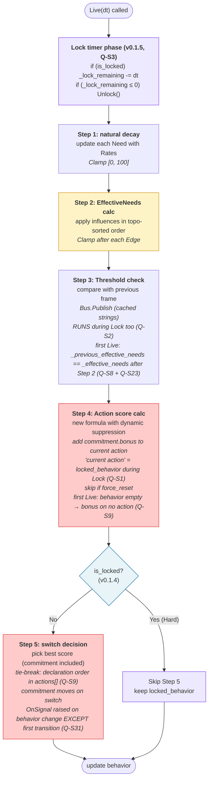

The **Lock timer phase (T0)** runs **before** Step 1 every frame. Pinning the decrement at the head means the Lock check between Step 4 and Step 5 sees the *current* lock state for this frame: on the frame where `_lock_remaining` reaches zero, the new `behavior` is selected by Step 5 in the **same** frame — no 1-frame stall waiting for the next `Live(dt)`. This matters for Zelda-style hit-stun and combo cancels (§20.1) where stale-by-one-frame outputs feel sticky.

This also makes `Lock(0)` (Q9) behavior consistent: `Lock(duration: 0)` simply sets `_lock_remaining = 0`. Because `is_locked` is the property `_lock_remaining > 0` (not a separate field), the getter immediately returns `false` after the assignment — **no special path inside `Lock` is required**. The Lock timer phase (T0) on the next `Live(dt)` is a no-op (already at 0); the no-op decrement does not flip `is_locked` because nothing crossed zero (it was already there). Pre-Q-S126 this paragraph could be read as "is_locked stays true until the next Live(dt)", which would have required `Lock` to special-case `duration == 0` and call `Unlock()` — but the property semantics make that unnecessary. (v0.1.5, Q-S126: clarification — implementation contract unchanged; the test `LockEdgeCaseTests.Case01` requiring immediate `is_locked == false` after `Lock(0)` is satisfied by the property semantics, no special path needed.)

#### 9.2.0a First Frame Contract (v0.1.5, Q-S8 + Q-S9)

The very first `Live(dt)` after `new Engine(persona)` runs the same 5 steps as any other frame, but two startup-only invariants apply:

+ **Step 3 (Q-S8 + Q-S23)**: `_previous_effective_needs` was seeded in the Engine constructor by running one Step 2 pass over the spawn-time Needs (§16.6), so on the very first `Live(dt)` `_previous_effective_needs[i] == _effective_needs[i]` for every `i`. No Need is reported as having "risen this frame", and no Threshold can fire spuriously. A Persona spawned with `fear: 80` does **not** scream on scene load — only a real upward crossing after spawn fires. Q-S23 also closes the cascade-disconnect: Influence-driven `_effective_needs` rises now drive Threshold firing too, fixing the §25.5.3 frustration→anger chain that pre-Q-S23 was invisible to Bus.
+ **Step 5 (Q-S9)**: `behavior` is `""` before the first `Live` (§9.1). Step 4's `commitment.bonus` adds to no action this frame (the "current action" doesn't exist yet). All actions compete on raw score. If two or more actions tie at the maximum score (which is exactly what happens when every Need is `0.0` at spawn — every action's `intensity` is `0`, so every action's score is `0`), **the action whose `id` appears first in the persona's `actions[]` array wins**. This makes the spawn-time default behavior deterministic: put `Idle` (or whatever default you want) at index 0 of `actions[]`.

#### 9.2.1 Step Changes by Version

| Step   | v0.1.2                        | v0.1.3                                     | v0.1.4                                   |
| ------ | ----------------------------- | ------------------------------------------ | ---------------------------------------- |
| Step 3 | Hysteresis decay (time)       | Threshold check                            | (same as v0.1.3)                         |
| Step 4 | add hysteresis_bonus          | add commitment.bonus (skip if force_reset) | (same as v0.1.3)                         |
| Step 5 | switch only if hysteresis = 0 | best score (commitment included)           | **skip if `is_locked` (Lock mechanism)** |

### 9.3 Maslow Dynamic Suppression (refined through v0.1.1, v0.1.2, v0.1.3)

#### 9.3.1 The Old Defect (up to v0.1.0)

The old formula:

```text
score = Pow(intensity, exp) × (1 - suppression[tier]) × 100 + base_score + hysteresis_bonus
```

`suppression[tier]` was a fixed value. So Maslow's core idea — "lower needs suppress higher needs when not met" — **did not actually work**.

#### 9.3.2 v0.1.1 Improvement

Made `suppression_amount` depend on the maximum normalized Need from lower tiers:

```text
suppression_amount[tier] = suppression_factor[tier] × max_lower_tier_intensity
```

But in v0.1.1, Hysteresis was **outside** the suppression. **Maslow's absoluteness was broken by Hysteresis.**

#### 9.3.3 v0.1.2 Formula

Moved Hysteresis **inside** the suppression:

```text
score = (Pow(intensity, exp) × 100 + hysteresis_bonus) × (1 - suppression_amount[tier])
```

#### 9.3.4 v0.1.3 Final Form — Reference Source Clarified

Renamed `hysteresis_bonus` to `commitment_bonus`:

```text
score = (Pow(intensity, exp) × 100 + commitment_bonus) × (1 - suppression_amount[tier])
```

And **made the source of `max_lower_tier_intensity` explicit: EffectiveNeeds.**

```text
max_lower_tier_intensity = max(
    eff_needs[tier1 needs] / 100,
    eff_needs[tier2 needs] / 100,
    ...,
    eff_needs[(tier-1) needs] / 100
)
```

The set "tier-N needs" is read from
`Animo.Const.NEED_INDICES_BY_TIER` (v0.1.5, Q-S16). Standard Needs
participate per the §3.5 table; non-standard Needs (A019 Warning)
are excluded. `frustration` lives in tier 2 alongside `fear` and
is included even when it has no `Action` of its own.

```mermaid
flowchart TB
  Action["Action: Patrol<br/>tier 5"]
  Calc["max_lower_tier_intensity =<br/>max(<br/>tier1: eff_hunger / 100, eff_fatigue / 100,<br/>tier2: eff_fear / 100,<br/>tier3: eff_loneliness / 100,<br/>tier4: eff_confidence / 100<br/>)"]
  Note["source: EffectiveNeeds<br/>(after Influence)"]
  S["suppression_factor.tier5 = 0.90"]
  Sa["suppression_amount = 0.90 × max"]
  Pow["Pow(intensity, exp) × 100"]
  Comm["+ commitment_bonus<br/>(if current action and not force_reset)"]
  Mul["× (1 - suppression_amount)"]
  Result["= score"]
  Action --> Calc
  Calc --> Note
  Note --> Sa
  S --> Sa
  Pow --> Comm
  Comm --> Mul
  Sa --> Mul
  Mul --> Result
  style Result fill:#fecaca,stroke:#dc2626
  style Note fill:#fef3c7,stroke:#ca8a04
```

**Why EffectiveNeeds:**

+ Matches Animo's philosophy "the final inner state drives action."
+ `intensity` in score also uses EffectiveNeeds (consistency).
+ Influence-amplified Needs are still part of the inner state.
+ Prevents implementer bugs where `_needs` array might be used.

#### 9.3.5 Behavior Simulation with v0.1.3 Formula

Setup: `Daydream` (idle, tier=5), `SearchFood` (hunger, tier=1, exp=1.8), `commitment.bonus = 50`, `suppression_factor.tier5 = 0.90`.

| State          | hunger | idle | suppression_amount | Daydream score    | SearchFood score | Choice            |
| -------------- | ------ | ---- | ------------------ | ----------------- | ---------------- | ----------------- |
| peaceful       | 20     | 70   | 0.18               | (70+50)×0.82=98.4 | 6.9              | Daydream ✅       |
| mild hunger    | 50     | 70   | 0.45               | (70+50)×0.55=66.0 | 32               | Daydream ✅       |
| serious hunger | 70     | 70   | 0.63               | (70+50)×0.37=44.4 | 53               | **SearchFood ✅** |
| starving       | 100    | 70   | 0.90               | (70+50)×0.10=12.0 | 100              | SearchFood ✅     |

**"Eat when hungry" wins naturally, even when commitment is high. Maslow holds.**

#### 9.3.6 Tier 1 Special Case

Tier 1 actions have no lower tier. So `max_lower_tier_intensity = 0`, and `suppression_amount = 0`. No suppression. Survival actions are always free to fire.

### 9.4 Full Utility Score Formula (v0.1.3 final, used in v0.1.4)

```text
score = (Pow(intensity, exponent) × 100 + commitment_bonus) × (1 - suppression_factor[tier] × max_lower_tier_intensity)
```

| Variable                   | Range   | Meaning                                                                                           |
| -------------------------- | ------- | ------------------------------------------------------------------------------------------------- |
| `intensity`                | 0.0–1.0 | normalized need strength after EffectiveNeeds                                                     |
| `exponent`                 | 0.1–5.0 | shape of the action's response curve                                                              |
| `suppression_factor[tier]` | 0.0–1.0 | maximum suppression factor for this tier                                                          |
| `max_lower_tier_intensity` | 0.0–1.0 | max normalized EffectiveNeed from lower tiers                                                     |
| `commitment_bonus`         | 0.0–∞   | bonus added only to the currently selected action (permanent). Treated as 0 during `force_reset`. |

`base_score` was removed in v0.1.1. `hysteresis_*` was renamed to `commitment_*` in v0.1.3.

### 9.5 Exponent Sensitivity Curve

#### 9.5.1 The Math

`Pow(intensity, exponent)` with intensity in 0–1: the curve shape depends on the exponent.

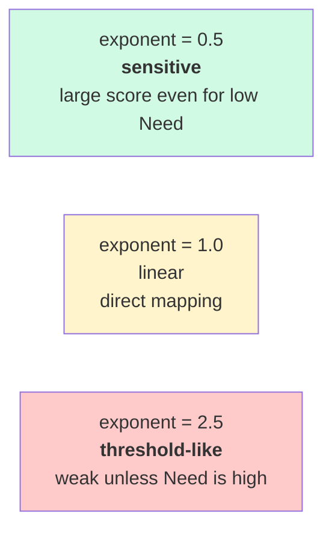

#### 9.5.2 Concrete Values

| intensity | exp=0.5 | exp=1.0 | exp=2.0 | exp=2.5 | exp=5.0 |
| --------- | ------- | ------- | ------- | ------- | ------- |
| 0.1       | 0.316   | 0.100   | 0.010   | 0.003   | 0.00001 |
| 0.3       | 0.548   | 0.300   | 0.090   | 0.049   | 0.002   |
| 0.5       | 0.707   | 0.500   | 0.250   | 0.177   | 0.031   |
| 0.7       | 0.837   | 0.700   | 0.490   | 0.410   | 0.168   |
| 0.9       | 0.949   | 0.900   | 0.810   | 0.768   | 0.590   |
| 1.0       | 1.000   | 1.000   | 1.000   | 1.000   | 1.000   |

#### 9.5.3 What This Means for the LLM

| Wanted behavior                | Use exponent |
| ------------------------------ | ------------ |
| sensitive, reacts early        | around 0.5   |
| direct, proportional           | 1.0          |
| needs to be a bit high to fire | 2.0          |
| holds back, then explodes      | 3.0–5.0      |

The full table is in §19 (LLM Cheat Sheet).

### 9.6 EffectiveNeeds Cascade (v0.1.2 final)

#### 9.6.1 Old Bug: Array-Order Dependence (v0.1.0)

In v0.1.0, `influences` were applied in array order. Different orders gave different results.

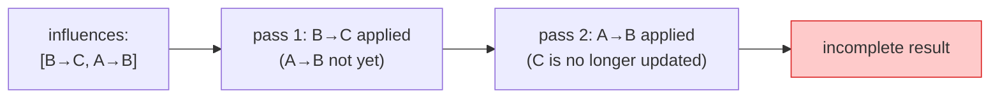

#### 9.6.2 v0.1.2 Solution (replaces v0.1.1 iteration)

**v0.1.1 compromise (now removed):** if a cycle was found, run 3-pass iteration. This was numerically risky (oscillation/divergence).

**v0.1.2 final approach, refined in v0.1.5 (Q-S20 → Q-S24):**

1. **Build the EDGE dependency graph** (v0.1.5, Q-S24): one node per `Influence` (Edge) in the composed `influences[]`. For every pair of edges `e1` and `e2`, add the partial-order constraint `e1 ≺ e2` if `e1.target == e2.source` (i.e. `e1` writes the Need that `e2` reads). **This is NOT the same as the Need dependency graph** — the Need graph is `source → target`, which would make topological sort return a Need *processing* order; that returned order would group all edges sharing a `source` together and silently violate the LLM's `influences[]` array order across different `source`s. Q-S20 promised the array order was the determinism key; only an Edge-level graph keeps that promise.
2. **Cycle detection.** If the Edge graph has a cycle, the Validator gives an **Error** (A025). The runtime never starts. Note: an Edge-level cycle is mathematically equivalent to a Need-level cycle (cycle in Edge half-order ⇔ cycle in Need source→target graph), so A025's stage-1 + stage-2 detection (Q-S17) still fires correctly under either formulation.
3. **Stable topological sort over edges** (v0.1.5, Q-S20 + Q-S24): respects every `e1 ≺ e2` constraint AND, for edges with no relative dependency, preserves the *composed* `influences[]` order produced by §8.3. Composed order is itself Persona-order-preserving (Q-S19/S20), so the LLM's authored sequence is the deterministic tiebreaker for independent edges.
4. **Single-pass apply** in that order — one `_effective_needs[target] += coefficient * _effective_needs[source]` per edge, in the sorted order.
5. **Clamp [0, 100] after each Edge** (next section).

```mermaid
flowchart TB
  Start(["composed influences[]"])
  Build["build EDGE dependency graph<br/>(Q-S24): e1 ≺ e2 if e1.target == e2.source"]
  Check{"cycle?"}
  Reject["❌ Validator Error<br/>A025"]
  Topo["stable topological sort<br/>over EDGES<br/>(tiebreak: composed influences[] order)"]
  Loop["apply each Edge in order<br/>→ Clamp after each one"]
  End(["EffectiveNeeds ready<br/>always [0, 100]"])
  Start --> Build --> Check
  Check -->|"Yes"| Reject
  Check -->|"No"| Topo --> Loop --> End
  style Reject fill:#fecaca,stroke:#dc2626
  style Build fill:#fde68a,stroke:#b45309
  style Topo fill:#fde68a,stroke:#b45309
  style Loop fill:#fef3c7,stroke:#ca8a04
  style End fill:#d1fae5,stroke:#059669
```

#### 9.6.3 Why Mid-Cascade Clamp Matters (v0.1.2 made this explicit)

For `A → B (-1.0)`, `B → C (+1.0)` with A=100 and B=50:

| Clamp timing                            | B mid-value   | effect on C       | C final          | Verdict    |
| --------------------------------------- | ------------- | ----------------- | ---------------- | ---------- |
| only after all passes                   | -50 (briefly) | propagates as -50 | unfairly lowered | ❌ bug     |
| **after each Edge** (v0.1.2 chose this) | clamped to 0  | propagates as 0   | unaffected       | ✅ correct |

**Reason:** in biology, "nothing" cannot push "something." Negative intermediate values must not propagate.

#### 9.6.4 Cycle Detection → Error (replaces v0.1.1 iteration)

A cycle like `fear → confidence → fear` is **rejected as an Error by Validator A025.**

```mermaid
flowchart LR
  A["fear"]
  B["confidence"]
  A -->|"-0.6"| B
  B -->|"-0.5"| A
  Reject["❌ Validator Error<br/>(A025)<br/>JSON rejected"]
  A --> Reject
  B --> Reject
  style A fill:#fecaca
  style B fill:#fecaca
  style Reject fill:#fecaca,stroke:#dc2626
```

**Why:**

+ Iteration without damping is mathematically risky (oscillation/divergence).
+ A learning-rate α (PageRank style) adds LLM cognitive load. Over-engineered.
+ Cycles are hard to understand by humans too ("A reduces B, B reduces A" feels like an infinite loop).
+ Reconsider in v0.2 if a use case appears.

#### 9.6.4a Independent-Edge Order and Non-Commutativity (v0.1.5, Q-S20)

Topological sort fixes the partial order imposed by dependencies but does NOT define an order between independent edges. Combined with mid-cascade Clamp (§9.6.3), this means two edges that both target the same Need produce different results depending on which runs first:

```text
Setup: C = 90, X = 100, Y = 100
Edges: X → C (+0.5),  Y → C (-0.5)        // independent: no X→Y or Y→X dependency

Order X → Y:
  Apply X→C: C = clamp(90 + 50)     = 100  (saturates upward)
  Apply Y→C: C = clamp(100 - 50)    = 50

Order Y → X:
  Apply Y→C: C = clamp(90 - 50)     = 40
  Apply X→C: C = clamp(40 + 50)     = 90
```

A 40-unit divergence from the same DAG and the same input. §26.2's determinism promise (ScenarioRunner reproducibility) collapses if the implementer's topo-sort flavor decides this freely.

**Resolution (Q-S20 + Q-S24):** the topological sort is **stable** with respect to the *composed* `influences[]` order, AND the sort runs over **edges**, not nodes (Q-S24, §9.6.2 step 1). Composed order, in turn, is Persona-order-preserving per §8.3 (Q-S19/S20). So:

| Source of order                     | Provided by                             | Determinism level                                    |
| ----------------------------------- | --------------------------------------- | ---------------------------------------------------- |
| Hard dependency edges (`X → Y → Z`) | `influences` graph                      | absolute (cycle detection runs in stage 1 + stage 2) |
| Independent-edge tiebreaker         | composed `influences[]` (Persona-first) | absolute given the spec's merge rule                 |
| Final apply order                   | stable topo sort over the above         | absolute                                             |

The LLM has exactly one knob: the order of `influences[]` in the JSON. Reordering the JSON changes the apply sequence and therefore the result; reordering anything else cannot.

**Validator companion (A037, §13.1):** when more than one edge writes to the same target Need, emit a **Warning** noting that the result depends on `influences[]` order plus the mid-cascade clamp. This surfaces non-commutative-but-deterministic situations to the LLM author so they can either reorder deliberately or restructure to avoid the dependency.

#### 9.6.5 Cascade Fix from Gemini

Using `eff` as the source makes A→B→C chains work (already adopted in v0.1.0):

```csharp
// ✅ adopted since v0.1.0 (and corrected in Q-S116 for Animo.Core's
// no-UnityEngine policy — see comment below)
float intensity = eff.Normalized(inf.source);
float delta     = inf.coefficient * intensity * eff.Get(inf.source);
// (v0.1.5, Q-S116) Engine lives in `Animo.Core` whose asmdef sets
// `noEngineReferences: true`. UnityEngine.Mathf cannot be referenced
// here. Use `System.Math.Clamp` (BCL since .NET Standard 2.1) for the
// hot-path clamp. Pre-Q-S116 the spec wrote `Mathf.Clamp(...)` and a
// Phase 3 implementer literally transcribing it would have hit a
// "name `Mathf` does not exist" compile error in Animo.Core. The
// UnityEngine.Mathf form remains acceptable in `Animo` (the Unity
// adapter layer) where UnityEngine IS referenced.
eff.Set(inf.target, System.Math.Clamp(eff.Get(inf.target) + delta, 0f, 100f));
```

### 9.7 Affect() Behavior (force_reset re-defined in v0.1.3)

#### 9.7.1 Exact Meaning of force_reset (v0.1.3)

```text
force_reset: true → for ONE frame in the next Live(), do not add commitment_bonus to the current action.
                    (commitment itself is kept; just the protection is paused for one frame)
```

> **Not a forced switch. It is "turn off commitment protection for one frame."**

#### 9.7.2 Flow

```mermaid
flowchart TB
  In(["Affect(need, delta, force_reset)"])
  Add["Needs[need] += delta<br/>Clamp [0, 100]"]
  Latch["_force_reset_pending |= force_reset<br/>(OR-latch — never assignment)<br/>(Q-S5, v0.1.5)"]
  Step4{"Live(dt) Step 4:<br/>_force_reset_pending?"}
  LockGate{"is_locked?<br/>(v0.1.5, Q-S10 + Q-S13)"}
  Skip["skip commitment_bonus<br/>for the current action<br/>(unlocked path only — Q-S13)"]
  Reset["After Step 4:<br/>_force_reset_pending = false<br/>(single clear point)"]
  Carry["keep _force_reset_pending<br/>(carry past Lock; commitment_bonus<br/>add proceeds normally on locked_behavior — Q-S13)<br/>(consume on first post-unlock Step 4)"]
  Keep["normal commitment_bonus add"]
  End(["Step 5: pure score competition<br/>(skipped while locked)"])
  In --> Add --> Latch --> Step4
  Step4 -->|"true"| LockGate
  LockGate -->|"unlocked"| Skip --> Reset --> End
  LockGate -->|"locked (Hard or Soft)"| Carry --> End
  Step4 -->|"false (default)"| Keep --> End
  style Latch fill:#e8f4f8,stroke:#0369a1
  style LockGate fill:#fde68a,stroke:#b45309
  style Skip fill:#fef3c7,stroke:#ca8a04
  style Reset fill:#ede9fe,stroke:#7c3aed
  style Carry fill:#fee2e2,stroke:#b91c1c
```

**Q-S13 reading:** the `LockGate` is **upstream** of `Skip` (not
downstream as Phase_2_4_6 erroneously had it). While locked, neither
the commitment-bonus skip *nor* the latch clear runs — Step 4
proceeds as if `_force_reset_pending == false` for the duration of
the lock, preserving `force_reset`'s "exactly **one frame**"
contract (§9.7.1). The latch is honored on the first post-unlock
Step 4, where Skip and Reset run together exactly once.

#### 9.7.2.1 Multi-call Latching Contract (v0.1.5, Q-S5)

When more than one `Affect` is called inside the same frame (which is
common — multiple game systems publish stimuli per `Update`), the
flag uses **OR-latch semantics**:

```csharp
// Inside Engine.Affect:
_force_reset_pending |= force_reset;      // ✅ OR-latch
// _force_reset_pending = force_reset;    // ❌ plain assignment is a bug
```

A subsequent `Affect(_, _, force_reset: false)` **must not clear** a
previously latched `true`. The flag is cleared in exactly one place:
right after Step 4 inside `Live(dt)` — **and only when the engine is
not locked**. While Hard- or Soft-locked, the clear is suppressed and
the latch survives until the first post-unlock Step 5 consumes it
(see §24.4.2). This makes "I asked for an emergency this frame" stick
until the engine *honors* it, regardless of call order or lock state.

Failing scenario the latch prevents:

```csharp
// Frame N
Store.Instance.Affect(agent_id: "g1", need: "fear",   delta: +30f, force_reset: true);
Store.Instance.Affect(agent_id: "g1", need: "hunger", delta: +5f);   // routine tick
// Without OR-latch: hunger call clobbers fear's emergency flag.
// With OR-latch:   emergency fires in Step 4 as intended.
```

#### 9.7.3 When to Use force_reset

| Situation          | Usage                                                                    |
| ------------------ | ------------------------------------------------------------------------ |
| Player spotted     | `Affect("fear", +50, force_reset: true)` — react even if NPC is stubborn |
| Took damage        | `Affect("fear", +30, force_reset: true)` — quick reaction                |
| Normal slow change | `Affect("hunger", +5)` — no force_reset                                  |

#### 9.7.4 Philosophical Consistency

"Affect changes the inner state, not the action choice." This stays true. `force_reset` is a separate, well-defined interrupt mechanism. **It does not force a switch — it only disables commitment protection for one frame.** The actual switch still happens in Step 5 score competition.

### 9.8 Commitment Behavior (made permanent in v0.1.3)

```mermaid
sequenceDiagram
  autonumber
  participant T as Time
  participant E as Engine
  participant B as behavior
  Note over E,B: behavior = "Patrol"<br/>commitment.bonus = 10 (always)
  T->>E: Live(dt)
  Note over E: +10 added to Patrol score every frame<br/>commitment does not decay
  T->>E: Affect("fear", +50)
  Note over E: Flee score rises<br/>(commitment stays on Patrol)
  T->>E: Live(dt)
  Note over E: Step 4: Patrol score = pure + 10<br/>      Flee score = pure
  Note over E: Step 5: switch if Flee > (Patrol + 10)
  alt Flee score > Patrol + 10
    E->>E: behavior = "Flee"<br/>commitment moves to Flee
    Note over E: From now: Flee score = pure + 10
  else stay
    Note over E: keep Patrol
  end
```

#### 9.8.1 Diff from v0.1.2

| Item            | v0.1.2                        | v0.1.3                                           |
| --------------- | ----------------------------- | ------------------------------------------------ |
| Name            | `hysteresis`                  | `commitment`                                     |
| Time behavior   | `bonus -= decay × dt` (decay) | **fixed value forever** (no decay)               |
| Underflow guard | `Max(0, ...)` needed          | not needed (no decay)                            |
| Switch logic    | only when bonus = 0           | **pure score competition (commitment included)** |

#### 9.8.2 True Chattering Prevention (CSS-style hysteresis)

```mermaid
flowchart LR
  PatPat["In Patrol:<br/>Patrol+10 vs Flee"]
  Switch1["Flee score > Patrol+10"]
  FleeFlee["In Flee:<br/>Flee+10 vs Patrol"]
  Switch2["Patrol score > Flee+10<br/>(needs even higher Patrol)"]
  PatPat -->|"switch threshold: +10"| Switch1 --> FleeFlee
  FleeFlee -->|"return threshold: +10 the other way"| Switch2 --> PatPat
  style FleeFlee fill:#fecaca
  style PatPat fill:#fef3c7
```

This is the **two-stage threshold of true Hysteresis** applied to action switching. Patrol→Flee needs +10 score gap; Flee→Patrol needs +10 in the other direction. **Real chattering prevention.**

### 9.9 Needs Clamping (fully clarified in v0.1.2)

All Need values are **always [0, 100]**:

```mermaid
flowchart TB
  Source(["points where Needs change"])
  Source --> P1["Live Step 1: after Rates"]
  Source --> P2["Affect call"]
  Source --> P3["Composer composition"]
  Source --> P4["Influence: after each Edge<br/>(made explicit in v0.1.2)"]
  P1 & P2 & P3 & P4 --> C["System.Math.Clamp(value, 0, 100)"]
  C --> R(["Need value finalized"])
  style C fill:#fef3c7,stroke:#ca8a04
  style P4 fill:#fecaca,stroke:#dc2626
```

This stops two bugs at once: `Pow(intensity, exp)` exploding when `intensity` > 1.0, and negative middle values propagating in cascades

---

## 10. Composer Responsibility and Deep Copy

### 10.1 Why a Dedicated Class

`Engine` should be a pure calculation engine. Putting Kind composition (a transformation step) inside `Engine` would mix two responsibilities. We split `Composer` out so:

+ `Engine` does not need to know about `Root`.
+ `Composer` is easy to test in isolation.
+ Even if composition logic grows complex later, `Engine` and `Store` are not touched.

### 10.2 Deep Copy is Required (from Gemini critique E-1)

#### 10.2.1 The Bug

If we use shallow copy (reference copy) during composition, multiple Personas may share the same `Kind` data. If one Persona changes a runtime value, the change leaks to other Personas. This is **reference contamination**.

```mermaid
flowchart LR
  K["kinds[goblin]<br/>actions = [Flee, Patrol]"]
  P1["persona A<br/>(shallow copy)"]
  P2["persona B<br/>(shallow copy)"]
  Bug["A edits its actions<br/>→ B is also affected!"]
  K --> P1
  K --> P2
  P1 -.->|"❌ shared reference"| Bug
  P2 -.->|"❌ shared reference"| Bug
  style Bug fill:#fecaca,stroke:#dc2626
```

#### 10.2.2 Solution: Deep Copy

```mermaid
flowchart LR
  K["kinds[goblin]"]
  P1["persona A<br/>(deep copy)<br/>independent instance"]
  P2["persona B<br/>(deep copy)<br/>independent instance"]
  K --> P1
  K --> P2
  style P1 fill:#d1fae5,stroke:#059669
  style P2 fill:#d1fae5,stroke:#059669
```

#### 10.2.3 Implementation Plan

```csharp
internal static class Composer {
    internal static Persona Compose(Persona persona, Root root) {
        // 1. create a brand new Persona instance
        // 2. recreate every reference type field with `new`
        //    - Needs / Rates: new Dictionary
        //    - Influence / Action: new List, plus `new` for each item
        //    - Suppression / Commitment / Binding: new instance
        // 3. value types are copied (default C# behavior)
        // 4. process kind_ids[] in order; merge each Kind's fields
        // 5. merge persona's own fields last
        // 6. fill missing Need keys with 0.0
        // 7. fill missing `binding` with default Binding (v0.1.5, Q-S7 + Q-S12):
        //    if composed binding is null → new Binding {
        //        on_action_change = Const.DEFAULT_ON_ACTION_CHANGE,
        //        thresholds      = new List<Threshold>()   // Q-S12
        //    } so Agent.Awake's String Cache (§16.5) cannot crash on
        //    EITHER `binding` nor `binding.thresholds`.
        //    If composed binding is non-null but its `thresholds` is null
        //    (hand-built Persona path), normalize to empty list as well.
        //    Validator A016 still warns about the original JSON omission.
        // 7b. for each `thresholds[i]` whose `reset_threshold` is null
        //     (omitted), set it to Math.Max(0.0, trigger_threshold - 5.0)
        //     (v0.1.5, Q-S11). A034 has already rejected explicit negatives.
        // 8. dedupe `kind_ids` keeping the last occurrence (v0.1.5, Q7)
        //    — Validator A033 warns; cascade semantics preserved (§8.3).
        // 9. return the fully composed, fully independent Persona
    }
}
```

### 10.3 Usage Flow

```mermaid
sequenceDiagram
  autonumber
  participant Store
  participant Composer
  participant Engine
  participant Persona as Raw Persona<br/>(from JSON)
  participant Root
  Store->>Composer: Compose(persona, root)
  Composer->>Persona: read kind_ids
  Composer->>Root: pull matching kinds[]
  Note over Composer: merge in order, last-wins<br/>everything is deep-copied<br/>fill missing Needs with 0.0<br/>fill missing binding with defaults (v0.1.5)
  Composer-->>Store: composed Persona (independent)
  Store->>Engine: new Engine(composed Persona)
  Engine-->>Engine: initialize internal state<br/>seed _previous_effective_needs from spawn Needs through one Step 2 pass (v0.1.5, Q-S8 + Q-S23)
```

### 10.4 Visibility

`internal class Composer` — not visible outside. Only `Store` calls it.

---

## 11. Store API

### 11.1 Role

Holds all `Agent`s by `agent_id`. Acts as the entry point for `Affect` calls from outside.

### 11.2 Specs

| Item                                                                                                             | Value                                                                                                                          |
| ---------------------------------------------------------------------------------------------------------------- | ------------------------------------------------------------------------------------------------------------------------------ |
| Pattern                                                                                                          | singleton (kept in v0.1.4. Future DI is in TODO)                                                                               |
| Register on                                                                                                      | `Agent.Awake`                                                                                                                  |
| Unregister on                                                                                                    | `Agent.OnDestroy`                                                                                                              |
| If `agent_id` not found at `Affect`                                                                              | `AnimoLog.Warning`, then keep going                                                                                            |
| If `agent_id` not found at `Unregister`                                                                          | `AnimoLog.Warning`, then keep going                                                                                            |
| If `agent_id` already registered (same instance) at `Register`                                                   | no-op, no log (idempotent) — v0.1.5, Q-S6                                                                                      |
| If `agent_id` already registered (different instance) at `Register`                                              | **`AnimoLog.Warning`**, no-op, **original registration kept** — v0.1.5, Q-S6                                                   |
| At `Unregister`, the dictionary entry's instance does NOT match `agent` (`!ReferenceEquals(_agents[id], agent)`) | **`AnimoLog.Warning`, no-op** — v0.1.5, Q-S22 (the "duplicate's OnDestroy assassinates the original" defense; pairs with Q-S6) |
| `Find` method                                                                                                    | `internal` — not public                                                                                                        |

#### 11.2.1 Why "keep first" on duplicate Register (v0.1.5, Q-S6)

In Unity, `Awake` runs during scene load. Throwing
`InvalidOperationException` from a duplicate registration would leave
the scene half-initialized. Overwriting silently (last-wins) would
make `Affect` route to the new instance while the *old* instance's
`Update` continues to drive a stale `behavior` — two ghosts diverging
in lockstep. "Keep first + Warning" makes the agent that won the race
own the channel for its lifetime, the duplicate is visible in the log,
and the scene survives. This matches the Store's existing posture:
**never crash the scene, always log the anomaly, keep going.**

#### 11.2.2 Why instance-equality check on Unregister (v0.1.5, Q-S22)

Q-S6's "keep first on duplicate Register" creates a subtler hazard
on the way out. Suppose `Agent A` registered first, `Agent B` (same
`agent_id`, different instance) was rejected by Q-S6 but lives on
in the scene anyway. When the scene unloads `Agent B`, Unity calls
`B.OnDestroy()` which calls `Store.Instance.Unregister(B)`. A naive
implementation (`_agents.Remove(agent.agent_id)`) would remove the
entry that points to the still-running `Agent A` — the duplicate's
death assassinates the original's registration, and every subsequent
`Affect("goblin_01", ...)` warns "agent not found" while `A` runs on
silently as a Bus-disconnected zombie.

Resolution: `Unregister(agent)` must check
`ReferenceEquals(_agents[id], agent)` before removing. Different
instance ⇒ Warning + no-op; the original keeps its registration.

```csharp
// In Animo.Store.Unregister
// (v0.1.5, Q-S81) The parameter type is `IAnimoAgent`, NOT the
// concrete `Animo.Agent` class. Pre-Q-S81 the spec sample wrote
// the concrete class, but `Scripts/Store.cs:42` declares
// `public void Unregister(IAnimoAgent agent)` — Phase 3
// implementation following the concrete-class spec text would
// have produced a signature mismatch (a NEW overload that
// wouldn't satisfy the interface contract, leaving the
// IAnimoAgent.Unregister wire dangling). Q-S81 unifies on the
// interface form across spec narrative and code.
public void Unregister(IAnimoAgent agent) {
    if (_agents.TryGetValue(agent.agent_id, out var existing)) {
        if (ReferenceEquals(existing, agent)) {
            _agents.Remove(agent.agent_id);   // ✅ same instance: remove
        } else {
            AnimoLog.Warning(
                $"Unregister called on agent_id '{agent.agent_id}' " +
                $"by a different instance than the one registered. " +
                $"Probably a duplicate from Q-S6's keep-first defense. " +
                $"Original registration preserved (no-op).");
            // ✅ Q-S22: do NOT remove — it would assassinate the original
        }
    } else {
        AnimoLog.Warning(
            $"Unregister called on agent_id '{agent.agent_id}' " +
            $"which is not registered. (No-op.)");
    }
}
```

This pairs symmetrically with Q-S6: Register protects the dictionary
*against* a duplicate's intrusion, Unregister protects the dictionary
*against* a duplicate's exit. Both "keep first" by checking the
instance the dictionary actually holds.

### 11.3 Public API

```csharp
// Register
Animo.Store.Instance.Register(agent: this);

// Unregister
Animo.Store.Instance.Unregister(agent: this);

// Affect relay (called from Germio Executor)
Animo.Store.Instance.Affect(
    agent_id:    "goblin_01",
    need:        "fear",
    delta:       +30f,
    force_reset: false
);
```

### 11.3.1 Affect Edge-Case Contract (v0.1.5)

`Engine.Affect(string need, float delta, bool force_reset = false)` and
the `Store.Instance.Affect(...)` relay both honor the same contract:

| Input                                       | Behavior                           | Rationale                                                             |
| ------------------------------------------- | ---------------------------------- | --------------------------------------------------------------------- |
| `need = null`                               | throw `ArgumentNullException`      | `#nullable enable` violation; fail-loud                               |
| `need = ""`                                 | throw `ArgumentException`          | API misuse; fail-loud                                                 |
| `need` not in this Persona's composed Needs | log `AnimoLog.Warning`, then no-op | adding a Need at runtime would invalidate the §16.2 cache             |
| `delta = float.NaN`                         | throw `ArgumentException`          | NaN would corrupt the Need on the next clamp and propagate everywhere |
| `delta = float.PositiveInfinity`            | apply, clamp to `100.0`            | natural saturation                                                    |
| `delta = float.NegativeInfinity`            | apply, clamp to `0.0`              | natural saturation                                                    |

The clamp is the same `[0, 100]` clamp used by Step 1; no special path.

### 11.4 Lifecycle

```mermaid
sequenceDiagram
  autonumber
  participant Unity
  participant Agent
  participant Cache as PersonaCache
  participant Store
  participant Engine
  Unity->>Agent: Awake()
  Agent->>Cache: GetComposed(template_id) — Q-S29
  Note over Cache: Validator + Composer ran ONCE per template<br/>(Q-S29 Flyweight)
  Cache-->>Agent: composed Persona (template, shared)
  Agent->>Agent: deep-copy template into _composed_persona
  Agent->>Agent: override agent_id with runtime-unique id<br/>(Q-S28: e.g. $"{template_id}_{GetInstanceID()}")
  Agent->>Store: Register(agent: this)
  Note over Store: _agents[agent_id] = agent (each instance has unique id)
  Agent->>Engine: new Engine(_composed_persona)
  Engine-->>Engine: cache template strings using overridden agent_id
  Note over Agent: subscribe Engine.OnSignal → Bus.Publish (Q-S26)
  Agent->>Engine: Live(dt: 0.0f) — Q-S34: seed initial behavior
  Engine-->>Agent: behavior = actions[0] (Q-S9 tie-break)<br/>OnSignal SILENT (Q-S31)
  Agent->>Engine: GetExpandedActionTrigger(behavior) — Q-S44 cold-path
  Engine-->>Agent: e.g. "animo_goblin_47291_idle"<br/>(template-expanded — same format as Bus path)
  Agent->>Agent: _animator?.Play(trigger) — direct push, no Bus
  loop every frame
    Unity->>Agent: Update()
    Agent->>Engine: Live(Time.deltaTime)
  end
  Note over Unity: scene change or destroy
  Unity->>Agent: OnDestroy()
  Agent->>Store: Unregister(agent: this) — Q-S22 instance check
```

#### 11.4.1 Why JSON `agent_id` is a TEMPLATE id, not a runtime id (v0.1.5, Q-S28)

In Unity, designers spawn 100 goblins from the same prefab; each prefab loads the same `goblin_scout.json`. Pre-Q-S28 every spawned `Agent` would call `Store.Register` with `agent_id = "goblin_scout_01"` (the JSON's literal value), and Q-S6's "keep first" defense would reject 99 of them. Game-side `Affect("goblin_scout_01", ...)` would only ever reach the first goblin; the other 99 become Bus-disconnected zombies.

**Resolution**: the JSON's `agent_id` is a **template / kind identifier**, not a runtime instance id. `Agent.Awake` is responsible for producing a runtime-unique `agent_id` *before* registering. Recommended formula:

```csharp
// (v0.1.5, Q-S68) Agent class declaration MUST implement IAnimoAgent
// so Store.Register(IAnimoAgent agent) accepts `this`. Pre-Q-S68 the
// spec narrative said "Animo.Agent : MonoBehaviour" without mentioning
// the IAnimoAgent interface; the Awake call `Store.Instance.Register(
// agent: this)` would have been a confirmed compile error (cannot
// convert Agent to IAnimoAgent). The interface contract (defined in
// `Scripts/Store.cs`) requires only `string agent_id { get; }` —
// trivial for Agent to satisfy via the composed Persona.
public sealed class Agent : MonoBehaviour, IAnimoAgent {
    [SerializeField] string _persona_template_id = "";
    [SerializeField] Germio.Bus? _bus = null;
    // (v0.1.5, Q-S75) Animator field for the host-side View binding.
    // Pre-Q-S75 §11.4.1 Awake step (6) called `_animator?.Play(stateName:
    // trigger)` to push the Q-S34/Q-S44 initial behavior to the host's
    // Animator without going through Bus, but the field had no
    // declaration in this class — confirmed missing-field compile error.
    // SerializeField + nullable Animator? lets developers wire the
    // Animator in the Inspector OR leave it null when the host uses
    // a different View backend (e.g. ECS-driven mesh, custom shader);
    // the `_animator?.Play(...)` null-conditional invocation makes
    // the missing-Animator path a silent no-op rather than a NullRef.
    [SerializeField] Animator? _animator = null;
    Persona _composed_persona = null!;
    Engine  _engine           = null!;

    /// <summary>(Q-S68 + Q-S96) IAnimoAgent.agent_id — surfaces the runtime-
    /// unique value (post-Q-S28 override) for Store keying. Reads
    /// from the composed Persona; valid after Awake step (3).
    /// (Q-S96) Null-safe: returns "&lt;uninitialized&gt;" placeholder if
    /// `_composed_persona` is still null (i.e. Awake's Q-S38 fail-loud
    /// catch ran before step (3) assigned `_composed_persona`).
    /// Without the null-coalesce, OnDestroy on an Awake-failed Agent
    /// would NRE inside `Store.Unregister(agent.agent_id)` — turning
    /// the fail-loud-but-keep-scene-alive promise of Q-S38 into a
    /// scene-unload-time crash. The sentinel string never collides
    /// with a real id (snake_case rule forbids angle brackets), so
    /// Store.Unregister's TryGetValue always falls through to the
    /// "agent_id not registered" no-op path.</summary>
    public string agent_id => _composed_persona?.agent_id ?? "<uninitialized>";

    // Animo.Agent.Awake (Q-S28 + Q-S34 + Q-S38 + Q-S68 + Q-S111 + Q-S112)
    void Awake() {
        // (v0.1.5, Q-S112) If no Bus is wired, log the §12.1 contract's
        // "log a Warning once, then go silent" before subscribing.
        // Pre-Q-S112 the §11.4.1 sample wrote
        //   `_engine.OnSignal += signal_id => _bus?.Publish(signal_id);`
        // and relied on the `?.` to silently skip publishes — but
        // §12.1 promises an authoring-aid Warning so the developer
        // notices a missing Bus reference. The `?.` alone gave NO
        // diagnostic; a Bus assigned in the prefab but null-stripped
        // by a build-pipeline misconfiguration looked exactly like
        // an intentionally-Bus-less Animo, except every Threshold
        // fire vanished into the void. Q-S112 honors the §12.1
        // contract by emitting one Warning here, before the rest
        // of Awake runs.
        if (_bus == null) {
            AnimoLog.Warning(
                $"Agent '{name}' has no Germio.Bus assigned (§12.1: log Warning once, " +
                "then go silent). Engine signals will not be published; if this is " +
                "intentional (e.g. a non-Germio host), ignore this message.");
        }
        Persona template;
        try {
            // (1) Q-S29: pull the composed Persona from the per-template cache.
            //     (v0.1.5, Q-S38 + Q-S111) GetComposed now throws TWO distinct
            //     exception types so Awake can produce honest diagnostics:
            //       - PersonaCacheNotInitializedException — Bootstrapper
            //         missing or wrong execution order (architectural
            //         startup bug — propagate, fail loud, scene WILL die).
            //       - PersonaTemplateRejectedException — JSON authoring
            //         error: unknown template_id (Q-S103) or stage-2
            //         validation failure (Q-S38 fail-loud) — catch
            //         and disable just this Agent, scene continues.
            //     Pre-Q-S111 both threw bare InvalidOperationException
            //     and Awake caught the union, so the log claimed
            //     "stage-2 fail-loud" even when Bootstrapper had never
            //     run. Diagnosis from logs alone was impossible.
            template = Animo.PersonaCache.GetComposed(template_id: _persona_template_id);
        } catch (PersonaTemplateRejectedException ex) {
            AnimoLog.Error(
                $"Agent '{name}' template '{_persona_template_id}' rejected " +
                $"by PersonaCache (Q-S38 stage-2 fail-loud OR Q-S103 unknown " +
                $"template_id): {ex.Message}. Disabling this Agent; the rest " +
                "of the scene continues.");
            enabled = false;
            return;
        }
        // PersonaCacheNotInitializedException intentionally NOT caught —
        // it propagates out of Awake, Unity logs it as a hard scene-load
        // error, and the developer fixes the Bootstrapper. That is the
        // correct behavior for an architectural startup bug; suppressing
        // it here would let the scene limp along with every Agent
        // disabled and no clue why.
        // (2) Q-S64: deep copy so this Agent has its own mutable Persona
        //     (PersonaCache returns a shared composed template; mutation
        //     would corrupt every sibling).
        _composed_persona = template.DeepCopy();
        // (3) Q-S28: override agent_id with runtime-unique value.
        //     Recommended: "{json agent_id}_{GameObject.GetInstanceID()}"
        //     so the template lineage stays inspectable while the runtime
        //     id is provably unique within a session.
        //
    //     (Q-S59 warning — multiplayer / network determinism)
    //     `GetInstanceID()` is only unique within a single Unity
    //     session and is NOT stable across hosts, scene reloads,
    //     or save/load. For networked games where Bus payloads must
    //     match between clients (or between client and server), the
    //     host adapter MUST substitute a deterministic id source —
    //     e.g. NetworkObject.NetworkObjectId, server-assigned UUID,
    //     ECS entity id with stable mapping. Do NOT use
    //     `GetInstanceID()` for any code path whose payload crosses
    //     a network boundary; the spec leaves the choice to the
    //     host-adapter layer precisely so multiplayer hosts can pick
    //     a network-safe strategy without forking Engine.
    _composed_persona.agent_id = $"{_composed_persona.agent_id}_{GetInstanceID()}";
    // (4) Q-S22 / Q-S6: now Register — guaranteed unique
    Animo.Store.Instance.Register(agent: this);
    // (5) Build Engine; its template-string cache will expand
    //     `{agent_id}` using the runtime-unique value.
    _engine = new Engine(persona: _composed_persona);
    _engine.OnSignal += signal_id => _bus?.Publish(signal_id: signal_id);
    // (6) Q-S34 + Q-S44: drive the first Live(dt) NOW so the Engine has a
    //     decided behavior, then push the EXPANDED action-change trigger
    //     (e.g. `animo_goblin_47291_flee`) directly to the host. Q-S31
    //     guarantees OnSignal is silent for this first transition;
    //     without step (6), the host has no way to know what initial
    //     Action to play and the character T-poses until the second
    //     behavior change.
    //
    //     (Q-S44 fix) Pre-Q-S44 step (6) called `_animator?.Play(stateName:
    //     _engine.behavior)` with the raw Action id — but Animo's normal
    //     Bus path uses `binding.on_action_change` template expansion
    //     (e.g. `animo_{agent_id}_{behavior}` → `animo_goblin_47291_flee`).
    //     Pushing the raw id only on frame 1 creates an Animator-state-
    //     name asymmetry: the host has to handle BOTH `Flee` (raw, frame
    //     1) and `animo_goblin_47291_flee` (expanded, all later frames).
    //     Q-S44 routed the first push through the same expander so the
    //     host sees a consistent payload format throughout. Bus is still
    //     not involved (Q-S31 silent contract preserved).
    //
    //     (v0.1.5, Q-S102) Q-S44 was WRONG for the Animator branch.
    //     Unity's Animator Controller uses STATIC state names defined
    //     at edit time (e.g. "Flee", "Idle") — NOT runtime-expanded
    //     strings containing `GetInstanceID()` (e.g. "animo_goblin_
    //     47291_flee"). If we pass the expanded trigger to Animator.
    //     Play(), Unity logs "no state named 'animo_goblin_47291_flee'"
    //     EVERY frame and every NPC freezes in T-pose — Q-S44's
    //     "consistency" actively destroyed the Animator integration.
    //     Q-S102 splits the payloads: **Animator gets the raw
    //     `_engine.behavior`** (matches Animator Controller state
    //     names — what authors actually create in the Unity editor),
    //     and `_engine.GetExpandedActionTrigger(...)` is reserved for
    //     the Bus path (where the dynamic id IS the routing key, and
    //     subscribers want the expanded payload). The two channels
    //     have different consumers and different naming requirements;
    //     the asymmetry Q-S44 chased was a feature, not a bug.
    _engine.Live(dt: 0.0f);                                      // produce initial behavior decision
    _animator?.Play(stateName: _engine.behavior);                // (Q-S102) raw id — matches Animator Controller
    // (Step 6's `Live(dt: 0.0f)` is safe: Step 1 (decay) is
    //  multiplicative-by-dt so dt=0 is a no-op for needs; Steps
    //  2-5 still run and produce the initial scoring decision.
    //  Threshold seeding (Q-S8/Q-S25) ensures no spurious fire.)
    }   // end Awake() (Q-S68: class block continues below)

    // (v0.1.5, Q-S80) Per-frame tick. Pre-Q-S80 the §11.4.1 sample
    // code declared only Awake and OnDestroy — every NPC would seed
    // its initial behavior in Awake, then freeze forever because no
    // Live(dt) ran after that. Update() drives the engine each frame
    // with Unity's frame delta. Threshold fires (Step 3) → OnSignal
    // → Bus.Publish; behavior changes (Step 5) → OnBehaviorChanged
    // → _cached_action_triggers lookup → Bus.Publish + (optionally)
    // _animator.Play. The whole pipeline runs from this one call.
    //
    // (v0.1.5, Q-S115) Phase 3 may introduce an `ITimeProvider`
    // abstraction as a constructor-injected (or SerializeField-
    // injected) dependency to break this Update from a hard
    // `UnityEngine.Time.deltaTime` reference. The default
    // implementation reads `Time.deltaTime`; tests substitute one
    // backed by `Animo.Tests.MiniUnity.MockTime`. Pre-Q-S115 EditMode
    // tests running Agents through `MockScene.Tick(dt)` advanced
    // `MockTime.deltaTime` correctly but the Agent's `Update()`
    // ignored it and read `UnityEngine.Time.deltaTime` (which is
    // 0 / undefined outside Play mode), so simulated time stood
    // still — every Tick called `_engine.Live(0.0f)`. The DI point
    // documented here is the Phase-3 contract; the v0.1.5 stub
    // remains `Time.deltaTime` direct so the headless build is
    // unbroken.
    void Update() {
        _engine.Live(dt: Time.deltaTime);   // (Q-S115) Phase 3: replace with ITimeProvider.dt
    }

    void OnDestroy() {
        // (v0.1.5, Q-S96) Early-out if Awake's Q-S38 fail-loud catch
        // disabled this Agent before step (4) registered it. Without
        // this guard, Store.Unregister(this) would dereference
        // agent_id, which (per the Q-S96 null-safe getter) returns
        // "<uninitialized>" — Store would log a "not registered"
        // Warning at scene-unload time for every Awake-failed Agent,
        // which is correct but noisy. The early-out keeps the
        // unload path silent for the expected case.
        if (_composed_persona == null) return;
        Animo.Store.Instance.Unregister(agent: this);   // Q-S22 instance-equality guard
    }
}   // end class Agent
```

**Why override at Agent layer, not Engine ctor**:

+ The Engine is content-agnostic; it should not know about Unity's `GameObject.GetInstanceID()` or any other runtime uniqueness scheme.
+ Different hosts (server-side simulation, headless tests) may want different uniqueness strategies (UUID, sequence number, ECS entity id). Keeping the override at the host-adapter layer (`Agent` for Unity, `ScenarioRunner` for tests) lets each host pick its own scheme.
+ For tests that spawn one Persona, `ScenarioRunner` **also** applies the runtime-unique override — typically `$"{agent_id}_run_{_seq++}"`. **(Q-S50 + Q-S60 clarification)** Pre-Q-S42 the spec said tests "skip the override"; Q-S42 made it universal but described the goal as "no Store.Register collisions" — that justification was a type-system error caught in Q-S50: `Store.Register(IAnimoAgent agent)` requires an `IAnimoAgent` implementation, which `ScenarioRunner` does not produce (it constructs `Animo.Core.Engine` directly, with no MonoBehaviour wrapper). **`ScenarioRunner` does not interact with `Store` at all.** The runner holds a single `Engine` instance per `Run()` call (not a `Dictionary<string, Engine>` — Q-S60 corrects Q-S50's over-spec'd routing-dictionary description, which would only matter for a future multi-agent `Run()` API that doesn't exist in v0.1.5; the current `Run(string agent_id, ...)` signature accepts one template id and `TimedAffectEvent` carries no target-agent field, so a routing dictionary would always have exactly one entry). The runner's internal field is a single `Engine _engine`; `Store` remains the Unity-agent registry, used only by `Animo.Agent : MonoBehaviour`. Q-S42's runtime-unique override on ScenarioRunner serves a different purpose than Store-collision avoidance: it makes `expanded_action_change` Bus payloads carry per-run identifiers in trace output (so multi-`Run()` aggregations distinguish frame events). When v0.2 adds multi-agent `Run()` (e.g. `Run(IReadOnlyList<(string template_id, string agent_id_override)> agents, ...)`), the field becomes a `Dictionary<string, Engine>` keyed by override-agent_id; the type changes when the API does, not before.

**Why expand `{agent_id}` AFTER override**:

+ Pre-Q-S28 Engine ctor's template-string cache (`_cached_action_triggers`, §16.5) expanded `{agent_id}` using the JSON value. After Q-S28 the override happens *first*, then Engine ctor reads `_composed_persona.agent_id` (already runtime-unique). Bus payloads like `animo_goblin_scout_01_47291_flee` carry the runtime instance id.
+ The 5-step ordering (cache → deep copy → override → Register → Engine ctor) matters: any other order leaks the template id into Bus signals or causes registration collisions.

#### 11.4.2 What goes into the JSON `agent_id`

The JSON `agent_id` should be a **kind-level template identifier** that uniquely identifies the *Persona blueprint* — `"goblin_scout"`, `"shopkeeper_npc"`, `"mansion_maid"`. Validators A002 (snake_case) and A004 (uniqueness across `personas[]`) still apply at the JSON layer. The runtime-unique suffix is applied by the host adapter, not authored in JSON.

##### 11.4.2.1 A002 scope: JSON-authoring time ONLY (Q-S28 clarification)

A002 (snake_case `^[a-z][a-z0-9_]*$`) applies **only at JSON authoring time**, not to the post-Q-S28 runtime-overridden `agent_id`. The recommended Q-S28 formula `$"{template_id}_{GetInstanceID()}"` produces values like `goblin_scout_47291` which contain a numeric suffix — perfectly fine because:

+ A002 ran at `PersonaCache.Initialize` (Q-S29) against the JSON `agent_id` (`goblin_scout`, snake_case ✓).
+ Runtime IDs are consumed by `Store.Register` / `Store.Find` as opaque dictionary keys; no further format validation runs against them.
+ Bus payloads expanded with `{agent_id}` (e.g. `animo_goblin_scout_47291_flee`) carry through to Germio without re-parsing.

If a host adapter wants stricter runtime ID hygiene (e.g. all-lowercase, no Unity InstanceID), it picks its own formula. Engine and Validator do not impose a runtime format.

### 11.5 Affect Relay Flow

```mermaid
sequenceDiagram
  autonumber
  participant Germio as Germio.Executor
  participant Store as Animo.Store
  participant Agent
  participant Engine
  Germio->>Store: Affect(agent_id, need, delta)
  Store->>Store: Find(agent_id)
  alt agent exists
    Store->>Agent: get the matching Agent
    Agent->>Engine: Affect(need, delta, force_reset)
    Engine-->>Engine: update Needs (Clamp [0, 100])
  else not found
    Store-->>Store: AnimoLog.Warning("agent not found")
    Note over Store: do not stop the game
  end
```

---

### 11.6 PersonaCache (Flyweight) — v0.1.5, Q-S29

#### 11.6.1 Why JSON parse + Validate + Compose must be PER-TEMPLATE, not PER-AGENT

Pre-Q-S29, §6.3 (Task 4-1-c) said `Agent.Awake` runs JSON parse → Validator → Composer → Engine build. For 100 goblins from the same prefab, that means 100 JSON parses, 100 runs of A000-A037 (which include DAG cycle detection at stage 1 + stage 2 — Q-S17), and 100 deep copies in Composer. Scene load times balloon for no reason: the JSON content is identical across every spawn.

**Resolution**: introduce `Animo.PersonaCache` — a Flyweight cache keyed by template id (the JSON `agent_id`). Validation and Composition run **exactly once** per template per session; each Agent retrieves the composed Persona from the cache and deep-copies it for its own mutable state.

```csharp
namespace Animo {
    /// <summary>
    /// v0.1.5 (Q-S29) Flyweight cache: validate + compose run ONCE per
    /// template id, regardless of how many Agents spawn from it.
    /// Thread-safe for typical Unity usage (Awake is main-thread only).
    /// </summary>
    public static class PersonaCache {
        // Keyed by JSON `agent_id` (the template identifier per Q-S28).
        static readonly Dictionary<string, Persona> _cache = new();
        static Root? _root;
        static ValidationResult? _validation;

        /// <summary>Set the Root once at app startup. Runs Validator on Root.</summary>
        public static void Initialize(Root root) {
            _root = root;
            _validation = Validator.Validate(root: root);
            if (_validation.has_errors) {
                AnimoLog.Error(
                    $"animo.json failed validation with " +
                    $"{_validation.errors.Count} errors. " +
                    $"Engines built from this Root will be unsafe.");
                // Caller decides whether to abort scene load.
            }
            _cache.Clear();
        }

        /// <summary>
        /// Compose-once accessor. The first call per template runs
        /// Composer.Compose; subsequent calls return the cached result.
        /// Caller MUST DeepCopy the returned Persona before mutation.
        /// </summary>
        public static Persona GetComposed(string template_id) {
            if (_root == null) {
                // (v0.1.5, Q-S111) Distinct exception type so Agent.
                // Awake's catch can route Bootstrapper-missing
                // separately from per-template authoring errors.
                throw new PersonaCacheNotInitializedException(
                    "PersonaCache.Initialize(root) must be called once at startup. " +
                    "Add an AnimoBootstrapper MonoBehaviour with " +
                    "[DefaultExecutionOrder(-1000)] to the initial scene.");
            }
            if (!_cache.TryGetValue(template_id, out var composed)) {
                var raw = _root.personas.FirstOrDefault(p => p.agent_id == template_id);
                if (raw == null) {
                    // (v0.1.5, Q-S103) Pre-Q-S103 this returned
                    // `new Persona { agent_id = template_id }` — but
                    // that empty fallback has `actions = null`,
                    // `influences = null`, `binding = null`. The
                    // caller (Agent.Awake) feeds it to
                    // `new Engine(persona: ...)`, whose ctor's
                    // `foreach (var action in _composed_persona.actions)`
                    // immediately NREs. Q-S38's "fail-loud but keep
                    // the scene alive" promise is broken because
                    // GetComposed never even threw — it returned
                    // garbage that crashed downstream.
                    //
                    // Q-S103 throws InvalidOperationException with a
                    // distinctive message so Agent.Awake's Q-S111
                    // refined catch (which now distinguishes
                    // PersonaCacheNotInitializedException vs
                    // PersonaTemplateRejectedException — see Q-S111)
                    // can route this to the same fail-loud-disable
                    // path as a stage-2 validation failure. Same
                    // surface to Agent.Awake (skip this Agent, keep
                    // the scene), but no NRE downstream and no
                    // silent corruption.
                    throw new PersonaTemplateRejectedException(
                        $"PersonaCache: no Persona with agent_id '{template_id}' " +
                        "(authoring error in animo.json — fix the template id or " +
                        "remove the Agent's _persona_template_id reference).");
                }
                composed = Composer.Compose(persona: raw, root: _root);
                // (Q-S29 + Q-S15/Q-S17/Q-S18/Q-S20/Q-S39/Q-S41/Q-S47/Q-S49/Q-S57
                // stage-2 integration): Stage-2 rules — A019 (typo vs
                // composed needs_meta, Q-S39), A025 (composed cycle,
                // Q-S17), A035 (post-fill trigger>reset, Q-S15), A036
                // (composed actions[] non-empty, Q-S18), A037 (multi-
                // edge same target — Warning, Q-S20), A038's "needs_meta
                // orphan" (Q-S41 + Q-S49 + Q-S57 — sees actions/
                // influences/thresholds/rates), A039 (sibling threshold
                // proximity Warning, Q-S47) — run AFTER Composer. We
                // run them here, per template, and merge findings into
                // _validation so all stage-2 diagnostics surface from
                // Initialize-time.
                var stage2 = Validator.ValidateStage2(composed: composed);
                _validation!.Merge(stage2);
                if (stage2.has_errors) {
                    // (v0.1.5, Q-S38): fail-loud per Master's policy.
                    // Pre-Q-S38 we logged the error but cached the
                    // broken Persona and returned it — Agent.Awake
                    // would build an Engine and crash on first Live
                    // via the Q-S9 tie-break (the for-loop pinned by
                    // Q-S52; pre-Q-S52 spec narrative used the LINQ
                    // shorthand `actions.First(...)`) on an empty list
                    // throws InvalidOperationException in the middle
                    // of Update. Throwing here moves the failure to
                    // Awake, where the host can catch + log + skip
                    // the Agent without taking down the scene.
                    var msg = $"PersonaCache: template '{template_id}' failed " +
                              $"stage-2 validation with {stage2.errors.Count} " +
                              $"errors (e.g. {stage2.errors[0].rule_id}). " +
                              $"Refusing to cache; Engine cannot be safely built.";
                    AnimoLog.Error(msg);
                    throw new InvalidOperationException(msg);
                }
                _cache[template_id] = composed;
            }
            return composed;
        }

        /// <summary>For tests: clear all cached templates.</summary>
        public static void ClearForTesting() {
            _cache.Clear();
            _root = null;
            _validation = null;
        }
    }
}
```

#### 11.6.2 Validator runs ONCE; A025 / A035 / A036 / A040 too (Q-S29 + Q-S113)

A025 (cycle detection) and the other stage-2 rules (A035 trigger>reset, A036 composed actions[] non-empty) all run during `PersonaCache.Initialize(root)` — exactly once per Root. Each `GetComposed(template_id)` is then a pure dictionary lookup + (on first call per template) a single `Composer.Compose`. Cost dominates at startup, not at per-Agent spawn.

#### 11.6.3 Cost ledger

| Op                      | Pre-Q-S29                                          | Post-Q-S29                                                                                |
| ----------------------- | -------------------------------------------------- | ----------------------------------------------------------------------------------------- |
| 100 Agents spawning     | 100 × (JSON parse + Validate + Compose + DeepCopy) | 1 × (Validate) + N × (Compose, where N = unique template count, ≤ 100) + 100 × (DeepCopy) |
| Scene load time (rough) | 100 × ~5-50 ms = 500-5000 ms                       | ~5-50 ms one-time + 100 × ~0.1 ms = ~10-60 ms                                             |

The DeepCopy per Agent is unavoidable (each Agent needs its own mutable `_persona.binding.thresholds[].is_above`, its own `_persona.agent_id` post-Q-S28 override, etc.); the savings come from collapsing the validate-and-compose work to per-template instead of per-Agent.

#### 11.6.4 Cross-impact with Q-S28

`PersonaCache.GetComposed` returns the **template** Persona with the **template** `agent_id`. The Agent's Awake then DeepCopy + override (Q-S28). The cache itself never sees runtime-unique ids — the cache is keyed strictly on template ids, so all 100 goblins share one cached entry.

#### 11.6.5 Who calls `PersonaCache.Initialize`? (Bootstrapper pattern)

`PersonaCache.Initialize(root)` MUST be called once per scene — *before* any Agent's Awake runs. The recommended Unity pattern is a single `MonoBehaviour` with `[DefaultExecutionOrder(-1000)]` (or earlier) that loads the JSON and initializes the cache:

```csharp
[DefaultExecutionOrder(-1000)]   // ensures Awake runs before Agents
public sealed class AnimoBootstrapper : MonoBehaviour {
    [SerializeField] TextAsset _animo_json = null!;
    void Awake() {
        // (v0.1.5, Q-S76) Animo.Json static helper wraps Newtonsoft.Json
        // (or System.Text.Json depending on Phase 3 build profile) and
        // returns a fully-populated `Animo.Model.Root`. Pre-Q-S76 the
        // sample code wrote `Animo.Json.Parse(...)` but neither the
        // class nor a method declaration existed anywhere in `Scripts/`
        // — confirmed missing-type compile error. The class lives in
        // `Scripts/Json.cs` (Phase 3) with signature:
        //   public static class Json {
        //       public static Root Parse(string text) { ... }
        //   }
        // Hosts that prefer a different JSON library can substitute by
        // calling their library's deserializer directly here — the
        // wrapper exists for ergonomic parity with the rest of Animo.
        var root = Animo.Json.Parse(_animo_json.text);
        Animo.PersonaCache.Initialize(root: root);
        // After this, every Agent.Awake can safely call
        // PersonaCache.GetComposed(template_id).
    }
    void OnDestroy() {
        // (v0.1.5, Q-S58 + Q-S78) Cleanup BOTH PersonaCache AND Store on
        // scene unload. Pre-Q-S58 only PersonaCache was cleared,
        // leaving the singleton `Animo.Store.Instance._agents`
        // dictionary populated with references to (potentially)
        // already-destroyed Agents. Under Unity Editor "Enter Play
        // Mode Options (Fast)" — which preserves static state
        // between Play sessions — these stale entries accumulated
        // and corrupted Bus routing on subsequent runs.
        //
        // (v0.1.5, Q-S78) `Store.ResetForTesting()` is declared as
        // `public static void` in `Scripts/Store.cs`. C# language
        // spec (CS0176) forbids invoking static members through
        // instance references — `Store.Instance.ResetForTesting()`
        // would fail to compile. Q-S78 corrects to the type-name
        // form `Animo.Store.ResetForTesting()`. (Q-S58's intent —
        // pair Store cleanup with PersonaCache cleanup — is
        // unchanged; only the call syntax is fixed.) Both
        // ResetForTesting() calls are idempotent + cheap.
        // (v0.1.5, Q-S118) Editor-only guard. Pre-Q-S118 the Q-S58
        // cleanup ran on EVERY scene unload — including production
        // scene transitions in a shipped game. That destroyed
        // long-lived Agents: a player's companion NPC marked
        // `DontDestroyOnLoad` survives the scene change, but the
        // bootstrapper attached to the OUTGOING scene runs OnDestroy,
        // and `Store.ResetForTesting()` wipes the global singleton's
        // `_agents` dictionary including the surviving companion's
        // entry. The companion is alive but unrouted — Bus events
        // never reach it (the registry no longer holds the
        // (agent_id, IAnimoAgent) pair). Q-S58's intent was *Editor
        // Fast Play Mode static-state cleanup* — purely a development
        // concern. Production scenes need the Store to outlive any
        // single scene's lifetime so that DontDestroyOnLoad Agents
        // continue to receive Bus traffic.
        //
        // The guard here checks `Application.isEditor` AND
        // `!Application.isPlaying`: Editor Fast Play "Stop" produces
        // (true, false) in OnDestroy — clean. Production runtime
        // scene transitions produce (false, true) — skip. A Unity
        // Editor session that's actively playing (between Play and
        // Stop) produces (true, true) — ALSO skip, because that's
        // the same DontDestroyOnLoad scenario the production case
        // describes. Only the Editor-after-Stop path runs the cleanup.
        if (!Application.isEditor || Application.isPlaying) return;

        Animo.PersonaCache.ClearForTesting();   // scene unload cleanup (Q-S29)
        Animo.Store.ResetForTesting();          // (Q-S58 + Q-S78 + Q-S118) — type-name form, editor-only
    }
}
```

For headless tests / `ScenarioRunner`, the constructor `new ScenarioRunner(root)` calls `PersonaCache.Initialize` internally; tests do not need a separate bootstrapper.

For any host that doesn't run on Unity's lifecycle (server simulation, batch tooling), the host calls `PersonaCache.Initialize` once during its own startup before constructing any Engine.

If `PersonaCache.GetComposed` is called before `Initialize`, it throws `InvalidOperationException` — fail-loud per Master's policy.

**(v0.1.5, Q-S130) EditMode test isolation discipline.** The Q-S118 editor-only guard (`if (!Application.isEditor || Application.isPlaying) return;`) keeps cleanup scoped to *Editor-after-Stop* — the right gate for production safety (DontDestroyOnLoad NPCs survive scene transitions). However, the NUnit EditMode test runner reports `Application.isEditor == true && Application.isPlaying == false` while a test method is executing. So if an EditMode test were to instantiate `AnimoBootstrapper` and trigger its `OnDestroy` (e.g. via `Object.DestroyImmediate`), the cleanup WOULD run and wipe `Store.Instance._agents` mid-test — risking cross-fixture contamination if other test fixtures had registered Agents into the same Store and the test order was unfavorable. The remedy is **test-side discipline, not Bootstrapper-side gating**:

1. Fixtures that touch `Store` MUST call `Animo.Store.ResetForTesting()` in `[SetUp]` (or use a shared base class). This makes each test deterministic regardless of what previous tests left behind.
2. Fixtures that test `AnimoBootstrapper.OnDestroy` directly (e.g. `BootstrapperStoreCleanupTests`) MUST be isolated: either run them in their own assembly, or document that they assume an empty Store and run last in the suite.
3. The Bootstrapper's editor-only guard is **production correctness**; do not weaken it to accommodate test ordering. The two concerns are separable: Bootstrapper guards production scene transitions; tests guard their own fixtures via SetUp/TearDown.

Pre-Q-S130 this discipline was implicit. Q-S130 makes it spec-level so future test authors don't need to rediscover it through flaky cross-fixture failures.

---

## 12. Binding Behavior

### 12.1 Bus Reference

The `Agent` (MonoBehaviour) holds the `Bus` reference via Inspector. Neither `Store` nor `Engine` holds it. **Engine notifies external listeners via the `OnSignal` event (v0.1.5, Q-S26)**; `Agent` subscribes in `Awake` and forwards each payload to `Bus.Publish(signal_id)`.

```mermaid
flowchart LR
  Inspector["Unity Inspector<br/>_BUS field"]
  Agent["Animo.Agent<br/>(MonoBehaviour)"]
  Engine["Animo.Core.Engine"]
  Bus["Germio.Bus"]
  Inspector -.->|"SerializeField"| Agent
  Agent -->|"Bus.Publish(signal_id)"| Bus
  Engine -->|"OnSignal event<br/>(Q-S26)"| Agent
  style Bus fill:#e8d5ff,stroke:#7e3ff2
  style Engine fill:#e8f4f8,stroke:#0369a1
```

If `Bus` is `null`: log a Warning once, then go silent. Animo can be used without Germio (a valid use case).

#### 12.1.1 Why Engine raises an event instead of calling Bus directly (Q-S26)

Pre-Q-S26 the §16.5 sample showed `_bus.Publish(signal_id: t.expanded_trigger)` *inside* Engine. That call was architecturally impossible because §12.1 explicitly says Engine does not hold a Bus reference, and `Engine.cs` has no Bus field, no event, and no callback delegate. Threshold fires were trapped inside Engine with no exit.

Q-S26 adds the missing wire as a C# `event Action<string>? OnSignal` on `Engine`. The Engine's 5-step loop raises it whenever:

+ **Step 3** fires a Threshold (`expanded_trigger` payload)
+ **Step 4 / Step 5** finalises a `behavior` change (`expanded_action_change` payload from `_cached_action_triggers`)

`Agent` subscribes once in `Awake`:

```csharp
// Animo.Agent (MonoBehaviour)
void Awake() {
    _engine = new Engine(persona: _composed_persona);
    _engine.OnSignal += signal_id => _bus?.Publish(signal_id: signal_id);
    Animo.Store.Instance.Register(agent: this);
}
```

Engine remains a pure C# library — it knows `string` payloads only, never `Germio.Bus`. Tests can subscribe a `MockBus`-style listener directly to `engine.OnSignal` without touching Bus or Agent at all.

### 12.2 on_action_change Firing (template cache)

#### 12.2.1 The Old Problem: Per-Frame String Generation

In v0.1.0, every behavior change ran `string.Format` on the template. That makes garbage and triggers GC spikes.

#### 12.2.2 v0.1.1 Solution: Cache at Awake

```mermaid
sequenceDiagram
  autonumber
  participant Awake as Agent.Awake
  participant Cache as string cache
  participant Engine
  participant Bus
  Awake->>Awake: list all Action ids
  Awake->>Cache: build a string for each Action
  Note over Cache: "animo_goblin_01_flee"<br/>"animo_goblin_01_patrol"<br/>...
  loop every frame
    Engine-->>Awake: behavior changed
    Awake->>Cache: O(1) lookup
    Cache-->>Awake: cached string
    Awake->>Bus: Publish(cached)
  end
```

**Zero string allocation per frame.** All strings sent to `Bus.Publish` are pre-computed.

### 12.3 thresholds Firing (two-stage in v0.1.1)

#### 12.3.1 Old Problem: Chattering (Gemini critique I-3)

In v0.1.0, a single threshold (e.g. `threshold: 80`) was used. If the value swung between 79.9 and 80.1, the trigger fired every frame.

#### 12.3.2 Solution: Two-Stage Threshold

```mermaid
stateDiagram-v2
  [*] --> Below
  Below --> Below : need < trigger_threshold
  Below --> Above : need >= trigger_threshold (fire!)
  Above --> Above : need > reset_threshold
  Above --> Below : need <= reset_threshold (reset)
  note right of Above : Bus.Publish only once
  note right of Below : ready to fire again
```

Set `trigger_threshold = 80` and `reset_threshold = 70`: it fires at 80+, and re-arms only after the value drops below 70.

##### 12.3.2.1 Implementation Contract: 1-bit State Per Threshold (v0.1.5, Q-S25)

The state machine above has **two states (Below / Above) which means it requires 1 bit of state per Threshold**. Pre-Q-S25 this was missing from `Scripts/Data.cs` — `Threshold` had no `is_above` field, and `Engine` had no `_threshold_states` array. A naive cross-detection (`prev < trigger && curr >= trigger`) chatters around `trigger`: a Need oscillating between 75 and 85 with `trigger=80, reset=70` fires every frame it crosses up, even though it never reached `reset=70` to re-arm. `reset_threshold` becomes **dead code**, A023 / Q-S11 / A035's reset-side guarantees become decorative, and §12.3.1's "old chattering bug" returns through the back door.

Q-S25 adds `internal bool is_above` to `Threshold`. Step 3 reads + writes this state per the §12.3.2 mermaid:

| Branch                                  | Condition                                       | Action                                               |
| --------------------------------------- | ----------------------------------------------- | ---------------------------------------------------- |
| Below state, value crosses up           | `!is_above && curr >= trigger_threshold`        | `is_above = true`; emit `OnSignal(expanded_trigger)` |
| Below state, value stays low            | `!is_above && curr < trigger_threshold`         | no-op                                                |
| Above state, value drops to/below reset | `is_above && curr <= effective_reset_threshold` | `is_above = false`; **no fire** (re-arm only)        |
| Above state, value stays high           | `is_above && curr > effective_reset_threshold`  | no-op (suppression of duplicate fires)               |

`effective_reset_threshold = reset_threshold ?? Math.Max(0f, trigger_threshold - 5f)` (Q-S11 floor).

`is_above` is seeded in `Engine` constructor by reading the spawn-time `_effective_needs` (computed via the same single Step 2 pass that seeds `_previous_effective_needs` per Q-S8 + Q-S23): if the spawn-time effective Need is at or above `trigger_threshold`, `is_above` starts at `true` and the Threshold does **not** fire on the first `Live(dt)` (the §12.3.2 contract: "ready to fire again" is the rest state, not the spawn state when the value is already past trigger). This unifies Q-S8's "no spurious first-frame fires" goal with Q-S25's state-machine correctness.

#### 12.3.3 New JSON Structure

```json
{
  "thresholds": [
    {
      "need": "fear",
      "trigger_threshold": 80,
      "reset_threshold": 70,
      "trigger": "animo_{agent_id}_fear_critical"
    }
  ]
}
```

If `reset_threshold` is omitted, the default is `Math.Max(0.0, trigger_threshold - 5.0)` (v0.1.5, Q-S11).

#### 12.3.4 Why the `Math.Max(0, ...)` Floor (v0.1.5, Q-S11)

Need values are always Clamped to **`[0, 100]`** (§9.9). If
`reset_threshold` were ever allowed below `0`, the state machine in
§12.3.2 would reach a permanent `Above` trap: a Need that fires
once at, say, `trigger_threshold: 3.0` would have a default reset of
`-2.0`, and `Math.Clamp(need, 0, 100)` guarantees the value never
descends to `-2.0` — so the trigger could never re-arm.

The floor at `0.0` makes the Threshold mathematically *always*
re-armable as long as the Need can drop to `0`:

| `trigger_threshold` | computed default      | with floor (Q-S11)                   |
| ------------------- | --------------------- | ------------------------------------ |
| `80.0`              | `75.0`                | `75.0`                               |
| `10.0`              | `5.0`                 | `5.0`                                |
| `5.0`               | `0.0`                 | `0.0`                                |
| `3.0`               | `-2.0` ❌ unreachable | **`0.0`** ✅ reachable at full decay |
| `1.0`               | `-4.0` ❌ unreachable | **`0.0`** ✅ reachable at full decay |

**Companion Validator rule:** explicit user-supplied
`reset_threshold < 0` is rejected as **A034 Error** (§13.1) — the
Composer floor only applies when the field is *omitted*. A negative
value typed into JSON is treated as a likely typo and surfaced to
the LLM author rather than silently corrected.

**Companion Validator hint:** when the user supplies an explicit
`reset_threshold == trigger_threshold` (no hysteresis gap), A023
already fires (§13.1) because the rule requires
`trigger_threshold > reset_threshold` strictly. No additional rule
is needed for that case.

### 12.4 Allowed Template Placeholders

| Rule | Field                      | Allowed                   |
| ---- | -------------------------- | ------------------------- |
| A014 | `binding.on_action_change` | `{agent_id}` `{behavior}` |
| A015 | `thresholds[].trigger`     | `{agent_id}`              |

Plain strings (no placeholders) are also allowed.

### 12.5 Template Expansion Flow

```mermaid
flowchart TB
  T["Template:<br/>animo_{agent_id}_{behavior}"]
  V1["agent_id = goblin_01"]
  V2["behavior = flee"]
  R["Result:<br/>animo_goblin_01_flee<br/>(pre-computed at Awake)"]
  T --> R
  V1 --> R
  V2 --> R
  R -->|"Bus.Publish"| Germio["Germio rule fires"]
  style R fill:#d1fae5,stroke:#059669
```

---

## 13. Validator Rules A000–A039

### 13.1 Full Rule List

| ID        | Content                                                                                                                                                                                                                                                                                                                                                                                                                                                                                                                                                                                                                                                                                                                                                                                                                                                                                                                                                                                                                                                                                                                                                                     | Level             | Note                                                                                       |
| --------- | --------------------------------------------------------------------------------------------------------------------------------------------------------------------------------------------------------------------------------------------------------------------------------------------------------------------------------------------------------------------------------------------------------------------------------------------------------------------------------------------------------------------------------------------------------------------------------------------------------------------------------------------------------------------------------------------------------------------------------------------------------------------------------------------------------------------------------------------------------------------------------------------------------------------------------------------------------------------------------------------------------------------------------------------------------------------------------------------------------------------------------------------------------------------------- | ----------------- | ------------------------------------------------------------------------------------------ |
| **A000**  | `schema_version` exists and is not empty                                                                                                                                                                                                                                                                                                                                                                                                                                                                                                                                                                                                                                                                                                                                                                                                                                                                                                                                                                                                                                                                                                                                    | Error             | —                                                                                          |
| **A001**  | `personas` exists and is not empty                                                                                                                                                                                                                                                                                                                                                                                                                                                                                                                                                                                                                                                                                                                                                                                                                                                                                                                                                                                                                                                                                                                                          | Error             | —                                                                                          |
| **A002**  | `persona.agent_id` is snake_case, not empty, unique, ≤128 chars                                                                                                                                                                                                                                                                                                                                                                                                                                                                                                                                                                                                                                                                                                                                                                                                                                                                                                                                                                                                                                                                                                             | Error             | —                                                                                          |
| **A003**  | `kind.kind_id` is snake_case, not empty, unique, ≤128 chars                                                                                                                                                                                                                                                                                                                                                                                                                                                                                                                                                                                                                                                                                                                                                                                                                                                                                                                                                                                                                                                                                                                 | Error             | —                                                                                          |
| **A004**  | All `persona.kind_ids` exist in `kinds`                                                                                                                                                                                                                                                                                                                                                                                                                                                                                                                                                                                                                                                                                                                                                                                                                                                                                                                                                                                                                                                                                                                                     | Error             | —                                                                                          |
| **A005**  | All `needs` values are in 0.0 to 100.0                                                                                                                                                                                                                                                                                                                                                                                                                                                                                                                                                                                                                                                                                                                                                                                                                                                                                                                                                                                                                                                                                                                                      | Error             | —                                                                                          |
| **A006**  | `suppression` keys are only `tier2`–`tier5`, values 0.0 to 1.0                                                                                                                                                                                                                                                                                                                                                                                                                                                                                                                                                                                                                                                                                                                                                                                                                                                                                                                                                                                                                                                                                                              | Error             | —                                                                                          |
| **A007**  | `actions[].tier` is 1 to 5                                                                                                                                                                                                                                                                                                                                                                                                                                                                                                                                                                                                                                                                                                                                                                                                                                                                                                                                                                                                                                                                                                                                                  | Error             | —                                                                                          |
| **A008**  | `actions[].exponent` is 0.1 to 5.0                                                                                                                                                                                                                                                                                                                                                                                                                                                                                                                                                                                                                                                                                                                                                                                                                                                                                                                                                                                                                                                                                                                                          | Error             | —                                                                                          |
| **A009**  | `actions[].id` is not empty                                                                                                                                                                                                                                                                                                                                                                                                                                                                                                                                                                                                                                                                                                                                                                                                                                                                                                                                                                                                                                                                                                                                                 | Error             | —                                                                                          |
| **A010**  | `thresholds[].trigger_threshold` is in `(0.0, 100.0]` (strictly positive, ≤100). v0.1.5 Q-S15 closed the `trigger == 0` loophole — at the Need clamp's lower bound, a 0-trigger fires every frame the Need stays at 0, regardless of the reset-threshold floor (Q-S11).                                                                                                                                                                                                                                                                                                                                                                                                                                                                                                                                                                                                                                                                                                                                                                                                                                                                                                     | Error             | tightened in v0.1.5 (Q-S15)                                                                |
| **A011a** | If no `kind_ids`, the Persona must have at least one `actions`                                                                                                                                                                                                                                                                                                                                                                                                                                                                                                                                                                                                                                                                                                                                                                                                                                                                                                                                                                                                                                                                                                              | Error             | —                                                                                          |
| **A011b** | If `kind_ids` exists, `actions` may be omitted                                                                                                                                                                                                                                                                                                                                                                                                                                                                                                                                                                                                                                                                                                                                                                                                                                                                                                                                                                                                                                                                                                                              | —                 | —                                                                                          |
| **A012**  | `influences[].coefficient` is -1.0 to 1.0                                                                                                                                                                                                                                                                                                                                                                                                                                                                                                                                                                                                                                                                                                                                                                                                                                                                                                                                                                                                                                                                                                                                   | Error             | —                                                                                          |
| **A013**  | `rates` keys are a subset of `needs` keys                                                                                                                                                                                                                                                                                                                                                                                                                                                                                                                                                                                                                                                                                                                                                                                                                                                                                                                                                                                                                                                                                                                                   | Warning           | —                                                                                          |
| **A014**  | `binding.on_action_change` placeholders only `{agent_id}` / `{behavior}`                                                                                                                                                                                                                                                                                                                                                                                                                                                                                                                                                                                                                                                                                                                                                                                                                                                                                                                                                                                                                                                                                                    | Error             | —                                                                                          |
| **A015**  | `thresholds[].trigger` placeholders only `{agent_id}`                                                                                                                                                                                                                                                                                                                                                                                                                                                                                                                                                                                                                                                                                                                                                                                                                                                                                                                                                                                                                                                                                                                       | Error             | —                                                                                          |
| **A016**  | `binding` is missing. Composer fills with defaults (`animo_{agent_id}_{behavior}` etc. from §7.3) so internal state is always non-null after composition. (v0.1.5, Q-S7.)                                                                                                                                                                                                                                                                                                                                                                                                                                                                                                                                                                                                                                                                                                                                                                                                                                                                                                                                                                                                   | Warning           | —                                                                                          |
| **A017**  | ~~`hysteresis.bonus` ≤ `hysteresis.decay`~~                                                                                                                                                                                                                                                                                                                                                                                                                                                                                                                                                                                                                                                                                                                                                                                                                                                                                                                                                                                                                                                                                                                                 | **deprecated**    | **🪦 removed in v0.1.3** (no `decay` field)                                                |
| **A018**  | `agent_id` / `kind_id` ≤ 128 chars (merged into A002/A003)                                                                                                                                                                                                                                                                                                                                                                                                                                                                                                                                                                                                                                                                                                                                                                                                                                                                                                                                                                                                                                                                                                                  | Error             | —                                                                                          |
| **A019**  | Unknown Need name looks like a typo of a standard need. **(v0.1.5, Q-S39 + Q-S124)** Runs in **stage 2** against the COMPOSED Persona (after Kind merge), not stage 1. Reason: Kind-only `needs_meta` declarations would be invisible to stage-1 Kind validation, leading to false positives ("oxygen looks like a typo!") for legitimate genre Needs whose tier is declared on the Persona side. Stage-2 evaluation sees the merged `needs_meta` and correctly suppresses A019 for any Need name that appears in the composed `needs_meta`. **(Q-S124)** Need-name collection covers the same union as A038's "in use" check: `needs[]` ∪ `actions[].need` ∪ `influences[].source/target` ∪ `binding.thresholds[].need` ∪ `rates.keys()`. Pre-Q-S124 A019 only scanned `needs[]`/`actions`/`influences`, so a typo'd Need name appearing only in `binding.thresholds[].need` (Q-S49 expansion) or `rates` (Q-S57 expansion) would slip past A019 — ironically the exact same coverage gap A038 had grown out of, but A019 wasn't synchronized.                                                                                                                             | Warning           | extended v0.1.4 (8 needs); moved to stage 2 in v0.1.5 (Q-S39); coverage extended in Q-S124 |
| **A020a** | `kind.rates` key is not in the referencing Persona's `needs`                                                                                                                                                                                                                                                                                                                                                                                                                                                                                                                                                                                                                                                                                                                                                                                                                                                                                                                                                                                                                                                                                                                | Warning           | —                                                                                          |
| **A020b** | `kind.influences` source/target is not in `needs`                                                                                                                                                                                                                                                                                                                                                                                                                                                                                                                                                                                                                                                                                                                                                                                                                                                                                                                                                                                                                                                                                                                           | Warning           | —                                                                                          |
| **A020c** | `kind.actions[].need` is not in `needs`                                                                                                                                                                                                                                                                                                                                                                                                                                                                                                                                                                                                                                                                                                                                                                                                                                                                                                                                                                                                                                                                                                                                     | Warning           | —                                                                                          |
| **A021**  | `schema_version` must be `"1.3"` or `"1.4"`                                                                                                                                                                                                                                                                                                                                                                                                                                                                                                                                                                                                                                                                                                                                                                                                                                                                                                                                                                                                                                                                                                                                 | Error             | v0.1.4 backward compat                                                                     |
| **A022**  | `actions[].need` is required                                                                                                                                                                                                                                                                                                                                                                                                                                                                                                                                                                                                                                                                                                                                                                                                                                                                                                                                                                                                                                                                                                                                                | Error             | v0.1.1                                                                                     |
| **A023**  | `thresholds[].trigger_threshold > reset_threshold`                                                                                                                                                                                                                                                                                                                                                                                                                                                                                                                                                                                                                                                                                                                                                                                                                                                                                                                                                                                                                                                                                                                          | Error             | v0.1.1                                                                                     |
| **A024**  | If an Action uses `idle`, its tier should be 5                                                                                                                                                                                                                                                                                                                                                                                                                                                                                                                                                                                                                                                                                                                                                                                                                                                                                                                                                                                                                                                                                                                              | Warning           | v0.1.1                                                                                     |
| **A025**  | `influences` has a cycle. Runs in BOTH validation stages: stage 1 against raw `kinds[]` / `persona.influences[]` for early warning, stage 2 against the composed (merged) `influences` graph (v0.1.5, Q-S17) so that ghost cycles synthesized only by Kind × Persona overlay (e.g. Kind `fear→confidence` + Persona `confidence→fear`) cannot escape to runtime.                                                                                                                                                                                                                                                                                                                                                                                                                                                                                                                                                                                                                                                                                                                                                                                                            | **Error**         | escalated in v0.1.2; stage-2 added in v0.1.5 (Q-S17)                                       |
| **A026**  | The Utility formula keeps `commitment_bonus` inside suppression (v0.1.3 formula)                                                                                                                                                                                                                                                                                                                                                                                                                                                                                                                                                                                                                                                                                                                                                                                                                                                                                                                                                                                                                                                                                            | —                 | info rule                                                                                  |
| **A027**  | Influence applies clamp after each Edge (v0.1.2 spec)                                                                                                                                                                                                                                                                                                                                                                                                                                                                                                                                                                                                                                                                                                                                                                                                                                                                                                                                                                                                                                                                                                                       | —                 | info rule                                                                                  |
| **A028**  | `commitment.bonus < 0` is an Error; `commitment.bonus > 30` is a Warning (lock-in risk); ceiling at `50` (v0.1.5 range)                                                                                                                                                                                                                                                                                                                                                                                                                                                                                                                                                                                                                                                                                                                                                                                                                                                                                                                                                                                                                                                     | Error / Warning   | v0.1.3, range tightened in v0.1.5                                                          |
| **A029**  | `commitment` is omitted but `actions` has 2+ items (chattering risk)                                                                                                                                                                                                                                                                                                                                                                                                                                                                                                                                                                                                                                                                                                                                                                                                                                                                                                                                                                                                                                                                                                        | Warning           | v0.1.3                                                                                     |
| **A030**  | No `actions` or `influences` use `frustration` (feedback design might be missing)                                                                                                                                                                                                                                                                                                                                                                                                                                                                                                                                                                                                                                                                                                                                                                                                                                                                                                                                                                                                                                                                                           | Warning           | **🆕 v0.1.4**                                                                              |
| **A031**  | `Lock(duration)` exceeds `LOCK_DURATION_WARN_THRESHOLD` (30s)                                                                                                                                                                                                                                                                                                                                                                                                                                                                                                                                                                                                                                                                                                                                                                                                                                                                                                                                                                                                                                                                                                               | Warning (runtime) | **🆕 v0.1.4**                                                                              |
| **A032**  | Hint about a low-tier "fallback" action other than `idle`                                                                                                                                                                                                                                                                                                                                                                                                                                                                                                                                                                                                                                                                                                                                                                                                                                                                                                                                                                                                                                                                                                                   | Info              | **🆕 v0.1.4**                                                                              |
| **A033**  | `kind_ids` contains a duplicate id. Composer dedupes (keeping the **last** occurrence to preserve §8.3 last-wins cascade semantics).                                                                                                                                                                                                                                                                                                                                                                                                                                                                                                                                                                                                                                                                                                                                                                                                                                                                                                                                                                                                                                        | Warning           | **🆕 v0.1.5**                                                                              |
| **A034**  | `binding.thresholds[].reset_threshold < 0` (explicit user value). Composer's omit-default already floors to `0` (§12.3.4); a typed negative is rejected to surface authoring typos.                                                                                                                                                                                                                                                                                                                                                                                                                                                                                                                                                                                                                                                                                                                                                                                                                                                                                                                                                                                         | **Error**         | **🆕 v0.1.5 (Q-S11)**                                                                      |
| **A035**  | After Composer fills omitted defaults (Q-S11), the resulting `(trigger_threshold, reset_threshold)` pair must still satisfy `trigger > reset` strictly. Catches the residual `trigger == reset` cases that A023 (raw-JSON only) and A010 (range only) cannot see. Run as a **post-composition** check (§13.2 stage 2).                                                                                                                                                                                                                                                                                                                                                                                                                                                                                                                                                                                                                                                                                                                                                                                                                                                      | **Error**         | **🆕 v0.1.5 (Q-S15)**                                                                      |
| **A036**  | After Composer cascade, the per-Persona `actions[]` list MUST be non-empty. Captures the case where `kind_ids` references a Kind with empty `actions[]` and the Persona itself omitted `actions` (legal under A011b at stage 1) — composed result is `[]`, and Step 5 tie-break would throw `InvalidOperationException` on the first `Live(dt)`. Q6's "A011a covers the post-composition case" was structurally false because A011a runs only in stage 1; A036 closes the architectural gap.                                                                                                                                                                                                                                                                                                                                                                                                                                                                                                                                                                                                                                                                                | **Error**         | **🆕 v0.1.5 (Q-S18)**                                                                      |
| **A037**  | Two or more `influences[]` entries write to the same target Need. With mid-cascade Clamp (§9.6.3), the result depends on the apply order of those edges — the order is fixed deterministically by the composed `influences[]` (Q-S19/S20 Persona-first), but the LLM author may not realize that reordering changes outputs. Warning rather than Error: the configuration is legal and deterministic; this is a "nudge" rule.                                                                                                                                                                                                                                                                                                                                                                                                                                                                                                                                                                                                                                                                                                                                               | Warning           | **🆕 v0.1.5 (Q-S20)**                                                                      |
| **A038**  | `needs_meta[need].tier` validation (Q-S30 + Q-S41 + Q-S49 + Q-S57). **Stage 1 (raw, per-Persona/Kind)**: Tier outside `[1, 5]` ⇒ **Error**. **Stage 2 (composed)**: `needs_meta` entry whose Need is *neither* in composed `needs[]` *nor* referenced by composed `actions[].need` *nor* referenced by composed `influences[].source/target` *nor* referenced by composed `binding.thresholds[].need` *nor* keyed by composed `rates` ⇒ **Warning** (the metadata is genuinely orphaned). **Stage 1**: `needs_meta` entry overriding a standard Need's tier with a value disagreeing with §3.5 ⇒ **Warning** (the §3.5 value still wins; the disagreement is surfaced). The "in use" union grew incrementally: Q-S41 broadened beyond `needs[]` (added actions/influences); Q-S49 added `binding.thresholds[].need` (signal-only Need pattern); **Q-S57 adds `rates`** (pure-rate Need pattern — a Need that only ticks via decay and is read by UI, never used in scoring or thresholds, e.g. a slow-acting `poison`). The corrected list of "in use" sites is `needs[]` ∪ `actions[].need` ∪ `influences[].source/target` ∪ `binding.thresholds[].need` ∪ `rates.keys()`. | Error / Warning   | **🆕 v0.1.5 (Q-S30)**; relaxed in Q-S41; thresholds added in Q-S49; rates added in Q-S57   |
| **A039**  | Sibling-threshold proximity Warning (Q-S47, Stage 2). Two thresholds on the same Need with `trigger_threshold` values **at or within `1.0f`** of each other surface a Warning so the author can confirm distinction is intentional. (v0.1.5, Q-S122 inclusive `<=`: a pair at 78.0 and 79.0 — diff exactly 1.0 — also fires. Pre-Q-S122 the pseudocode wrote strict `<`, but the intent of "within 1.0f" is inclusive of the boundary.) The 1.0f window is conservative — well above the merge collapse window (Q-S47 EPSILON `0.01f`), well below typical authored milestone spacing. A039 prevents authors from accidentally creating thresholds that are technically distinct (escape Q-S47 EPSILON merge) but operationally indistinguishable (fire within the same simulation step).                                                                                                                                                                                                                                                                                                                                                                                   | Warning           | **🆕 v0.1.5 (Q-S47)**                                                                      |
| **A040**  | Composed `actions[].id` must be unique within a Persona (Q-S113, Stage 2). Pre-Q-S113 only A009 (`actions[].id` non-empty) protected this field — uniqueness was assumed but never validated. An LLM author writing `[{id: "Flee", need: "fear"}, {id: "Flee", need: "hunger"}]` would slip through Stage 1 and reach Engine, where `_cached_action_triggers[action.id] = expanded;` (Q-S46) silently overwrites the first entry with the second. Worse, debug API `GetActionScore("Flee")` and behavior queries collapse onto one of the two ambiguously, breaking `expanded_action_change` Bus payload routing. Stage 2 because Composer cascade can introduce duplicates that Persona-only inspection misses (Kind defines `Flee`, Persona overrides another action also named `Flee`).                                                                                                                                                                                                                                                                                                                                                                                  | **Error**         | **🆕 v0.1.5 (Q-S113)**                                                                     |

### 13.2 Validation Flow

The Validator runs in **two stages** (v0.1.5, Q-S15, expanded in
Q-S17 / Q-S18). Stage 1 operates on the raw `Root` straight from
JSON; stage 2 operates on the per-Persona composed result emitted
by `Composer`. Most rules live in stage 1, but rules that depend on
Composer's merging (cycle through merged `influences`, emptiness
of merged `actions`, omit-defaults filled in) must live in stage 2.

```mermaid
flowchart TB
  Start(["read animo.json"])
  P1{"A000: schema_version?"}
  P2{"A021: version 1.3 / 1.4 / 1.5?"}
  P3["Stage 1: A001-A012 structure / range<br/>(raw Root)"]
  P4["A013-A018 consistency / format<br/>(A019 moved to Stage 2: Q-S39)"]
  P5["A020a/b/c cross-field<br/>(Kind × Persona)"]
  P6["A022-A029 action / commitment / threshold (raw)"]
  P7["A025 cycle (raw, early-warning)"]
  P8["A030-A034 v0.1.4 / v0.1.5 rules"]
  Compose["Composer.Compose(...)<br/>(per Persona)"]
  P9a["Stage 2: A025 cycle (composed influences)<br/>(v0.1.5, Q-S17)"]
  P9b["Stage 2: A036 composed actions[] non-empty<br/>(v0.1.5, Q-S18)"]
  P9c["Stage 2: A035 trigger > reset<br/>after omit-fill (v0.1.5, Q-S15)"]
  P9d["Stage 2: A019 typo check on composed Needs<br/>(v0.1.5, Q-S39 — sees needs_meta)"]
  P9e["Stage 2: A037 multi-edge same target<br/>(v0.1.5, Q-S20 — Warning)"]
  P9f["Stage 2: A038 needs_meta orphan check<br/>(v0.1.5, Q-S41 + Q-S49 + Q-S57 — sees actions/influences/thresholds/rates)"]
  P9g["Stage 2: A039 sibling threshold proximity<br/>(v0.1.5, Q-S47 — Warning at <= 1.0f apart, Q-S122 inclusive)"]
  Result(["ValidationResult<br/>(errors + warnings + info)"])
  Start --> P1
  P1 -->|"No"| Err(["fail fast"])
  P1 -->|"Yes"| P2
  P2 -->|"No"| Err
  P2 -->|"Yes"| P3
  P3 --> P4 --> P5 --> P6 --> P7 --> P8 --> Compose --> P9a --> P9b --> P9c --> P9d --> P9e --> P9f --> P9g --> Result
  P7 -->|"cycle in raw"| Err
  P9a -->|"cycle in composed"| Err
  P9b -->|"composed actions[] empty"| Err
  style Err fill:#fecaca,stroke:#dc2626
  style Result fill:#d1fae5,stroke:#059669
  style P7 fill:#fef3c7,stroke:#ca8a04
  style P8 fill:#fef3c7,stroke:#ca8a04
  style Compose fill:#e8f4f8,stroke:#0369a1
  style P9a fill:#fde68a,stroke:#b45309
  style P9b fill:#fde68a,stroke:#b45309
  style P9c fill:#fde68a,stroke:#b45309
```

**Why split.** A023 sees only raw fields; an omitted
`reset_threshold` is `null` and the comparison is bypassed. The
Composer fills the default *afterwards* (Q-S11). Without a
post-composition check, the pair `trigger=0.0` + omitted
`reset_threshold` becomes `(0.0, 0.0)` after Composer fills the
default, slipping past A010 + A023 + A034 simultaneously and causing
a per-frame fire-and-reset chatter when the Need sits at the
`[0, 100]` clamp's lower bound. A035 closes this only-after-Composer
hole. A010 (Q-S15) tightens the `trigger > 0` boundary as a
companion measure: a 0-trigger has no semantic meaning at the clamp
and is now an Error in stage 1.

**Why A025 runs in BOTH stages (Q-S17).** A "ghost cycle" can be
synthesized only by composition: `kinds[0].influences` defines
`fear → confidence`, the persona overlay defines
`confidence → fear`, and the union is a perfect cycle that neither
array contains in isolation. Stage 1's A025 sees only the raw
arrays — it reports "no cycle". Stage 2 rebuilds A025 against the
composed `influences` graph and rejects the post-merge cycle with
the same Error. Stage 1 remains as an early-warning check (so
trivially-cyclic raw JSON still fails fast and points the LLM at
the right line); Stage 2 is the authoritative gate before the
Engine sees the graph.

**Why composed-actions emptiness is its own rule (A036, Q-S18).**
A011a covers the *raw* "no kind_ids and no actions" case; A011b
documents the legal "kind_ids exists, actions optional" pattern.
But after composition, a persona that referenced only Kinds with
empty `actions[]` (or whose own `actions[]` was empty and inherited
nothing) lands at the Engine with a zero-action persona — and Step
5's tie-break (the for-loop pinned by Q-S52; pre-Q-S52 spec narrative used the LINQ shorthand `actions.First(...)`, Q-S9) throws on the very first
`Live(dt)`. Q6's decision log claimed "A011a covers the
post-composition case too", but A011a runs in stage 1 only, so the
claim was structurally false. A036 is the post-composition gate
that makes Q6 architecturally true: composed `actions[]` empty →
Error before Engine ever starts.

**Why A019 moved to Stage 2 (Q-S39).** A019's typo Warning ("oxygen looks like a typo of frustration") was originally a Stage 1 rule, evaluated against `kinds[]` and `personas[]` separately on the raw JSON. With Q-S30 introducing per-Persona `needs_meta` to declare non-standard Need tiers, a Persona that legitimately uses `oxygen` as a tier-1 Need would still trigger a false-positive A019 if the Kind it inherits from declared `oxygen` in its `actions[]` — Stage 1's Kind evaluation never sees the Persona's `needs_meta`. Moving A019 to Stage 2 (where it operates on the merged Persona post-Composer) makes the metadata visible. Stage-2 A019: for each Need name appearing in composed `actions[].need`, `influences[].source`, `influences[].target`, or `needs[]`, emit a typo Warning if the name is not in `STANDARD_NEEDS` AND not in composed `needs_meta`. The `needs_meta` membership check is what makes Q-S30's "explicit declaration silences A019" promise structurally true.

### 13.2.1 Validator + ValidationResult API surface (v0.1.5, Q-S29 surfacing)

```csharp
namespace Animo {
    /// <summary>Two-stage Validator (v0.1.5, Q-S15/Q-S17/Q-S18/Q-S30).</summary>
    public static class Validator {
        /// <summary>Stage 1 — raw Root. Runs A000-A034 and A038. </summary>
        public static ValidationResult Validate(Root root);

        /// <summary>
        /// Stage 2 — per composed Persona. Runs A019 (typo check vs
        /// composed needs_meta — Q-S39), A025 (composed cycle), A035
        /// (post-fill trigger>reset), A036 (composed actions[]
        /// non-empty), A037 (multi-edge same target — Warning),
        /// A038's "needs_meta orphan" check (Q-S41 + Q-S49 + Q-S57 —
        /// Need not used in composed needs/actions/influences/
        /// thresholds/rates), A039 (sibling threshold proximity
        /// Warning — Q-S47, fires when two thresholds on the same
        /// Need have triggers within 1.0f), and A040 (composed
        /// actions[].id uniqueness — Q-S113, Error). A038's
        /// tier-out-of-range remains a Stage 1 Error. Called by
        /// PersonaCache.GetComposed (Q-S29) and merged into the
        /// Initialize-time ValidationResult. (v0.1.5, Q-S119:
        /// A040 was added to this listing — Q-S113 added the rule
        /// to spec §13 but missed updating this docstring's enumeration.)
        /// </summary>
        public static ValidationResult ValidateStage2(Persona composed);
    }

    /// <summary>Findings collection from one Validator run.</summary>
    public sealed class ValidationResult {
        public List<ValidationFinding> errors   { get; }
        public List<ValidationFinding> warnings { get; }
        public List<ValidationFinding> infos    { get; }

        // (v0.1.5, Q-S74) Property name uses snake_case to match the
        // rest of the Animo C# API surface (Persona.agent_id, Issue.
        // rule_id, Threshold.expanded_trigger, etc.). Pre-Q-S74 §11.6.1
        // sample code wrote `HasErrors` (PascalCase) while
        // `Scripts/Validator.cs` declared `has_errors` and existing
        // tests (AssertResult.cs, NumericEdgeTests.cs, etc.) read
        // `has_errors` — C# is case-sensitive; the spec narrative was
        // wrong. Q-S74 unifies on `has_errors`.
        public bool has_errors => errors.Count > 0;
        public bool HasRule(string rule_id);

        /// <summary>
        /// Merge another ValidationResult's findings into this one.
        /// Used by PersonaCache.GetComposed to fold per-template
        /// stage-2 findings into the Initialize-time aggregate (Q-S29).
        /// Order preserved (this's findings stay first).
        /// </summary>
        public void Merge(ValidationResult other);
    }
}
```

`ValidateStage2` is also the path used by Phase 3 unit tests to assert
A025/A035/A036/A037 against composed fixtures without re-running
the full stage-1 sweep.

### 13.3 snake_case Rules (A002 / A003)

| Item                | Rule                |
| ------------------- | ------------------- |
| Allowed chars       | `a-z` / `0-9` / `_` |
| First char          | must be a letter    |
| Double underscore   | `__` not allowed    |
| Trailing underscore | not allowed         |
| Max length          | 128                 |

### 13.4 Template Validation Logic (A014 / A015)

```mermaid
flowchart TB
  In(["template string"])
  C1{"empty?"}
  C2{"matched braces?"}
  C3["extract placeholders<br/>all {xxx}"]
  C4{"all placeholders<br/>in allowed list?"}
  Pass(["✅ Pass"])
  Fail(["❌ Error"])
  In --> C1
  C1 -->|"Yes"| Fail
  C1 -->|"No"| C2
  C2 -->|"No"| Fail
  C2 -->|"Yes"| C3
  C3 --> C4
  C4 -->|"No"| Fail
  C4 -->|"Yes"| Pass
  style Pass fill:#d1fae5,stroke:#059669
  style Fail fill:#fecaca,stroke:#dc2626
```

A plain string (no placeholders) also passes.

### 13.5 Cycle Detection (A025 — Error since v0.1.2)

```mermaid
flowchart LR
  A["fear"]
  B["confidence"]
  C["loneliness"]
  A -->|"-0.6"| B
  B -->|"-0.5"| A
  C -->|"+0.3"| A
  Reject["❌ Validator Error<br/>JSON rejected"]
  A & B --> Reject
  style A fill:#fecaca
  style B fill:#fecaca
  style Reject fill:#fecaca,stroke:#dc2626
```

The `fear ⇄ confidence` two-way influence is a cycle. The Validator finds it during DAG construction and **rejects the JSON as an Error**.

**Change from v0.1.1:** the old 3-pass iteration was numerically risky. We removed it. Cycles are now non-runnable. See §9.6.4.

### 13.6 JSON Schema vs Validator: Roles

**LLM-first design.** The JSON Schema covers types, structure, and value ranges. The LLM can read the schema and produce a valid `animo.json` directly.

```mermaid
flowchart LR
  JSON["animo.json"]
  Schema["animo.schema.json<br/><b>type + structure + range</b><br/>minimum / maximum / pattern"]
  Validator["Animo.Core.Validator<br/><b>semantic checks</b><br/>cross-field<br/>cycle detection"]
  JSON -->|"type / structure / range<br/>(LLM reads this)"| Schema
  JSON -->|"runtime semantic check"| Validator
  style Schema fill:#e8f4f8,stroke:#0369a1
  style Validator fill:#fef3c7,stroke:#ca8a04
```

| Check                                  | Schema | Validator |
| -------------------------------------- | ------ | --------- |
| Type (string / number / array)         | ✅     | —         |
| Required fields                        | ✅     | —         |
| `additionalProperties: false`          | ✅     | —         |
| Numeric ranges (0–100, 0.1–5.0)        | ✅     | —         |
| `pattern` (snake_case etc.)            | ✅     | —         |
| Duplicate detection                    | —      | ✅        |
| Reference integrity (`kind_ids` exist) | —      | ✅        |
| Cross-field (A020a/b/c)                | —      | ✅        |
| Cycle detection (A025)                 | —      | ✅        |
| Template expansion check               | —      | ✅        |

---

## 14. Animo.Const Domain Constants

### 14.1 Why "Const", Not "Env"

**`Env` would mean "execution environment".** Animo's constants describe the AI engine's domain values, not environment settings. So we use `Const`.

| Use                                                | Class name                   |
| -------------------------------------------------- | ---------------------------- |
| Runtime environment values (FPS, mode names, etc.) | `Env` (e.g. `Germio.Env`)    |
| Domain-defining values (need lists, etc.)          | `Const` (e.g. `Animo.Const`) |

We do not force a single naming style across libraries. **Meaning beats uniformity.** This is the Germio / Briko culture.

### 14.2 Full Code (v0.1.4)

```csharp
// Copyright (c) STUDIO MeowToon. All rights reserved.
// Licensed under the MIT License. See LICENSE in the project root for license information.

namespace Animo {
    /// <summary>
    /// Animo domain constants.
    /// Not "Env" because these are domain values, not environment settings.
    /// </summary>
    /// <author>h.adachi (STUDIO MeowToon)</author>
    public static class Const {
#nullable enable

        // ============================================================
        // Standard needs (used by A019 typo detection)
        // ============================================================

        /// <summary>The 8 standard Maslow-derived needs (frustration added in v0.1.4).</summary>
        public static readonly string[] STANDARD_NEEDS = {
            "hunger", "fatigue", "fear",
            "loneliness", "confidence", "curiosity",
            "idle", "frustration"
        };

        // ============================================================
        // Standard Need indices (v0.1.2 — float[] flat array access)
        // ============================================================
        // Pre-computed indices for STANDARD_NEEDS to avoid string lookups
        // in hot path. Custom Need keys (e.g. "jealousy") are mapped at
        // Engine construction time via Dictionary<string, int>.

        public const int NEED_INDEX_HUNGER      = 0;
        public const int NEED_INDEX_FATIGUE     = 1;
        public const int NEED_INDEX_FEAR        = 2;
        public const int NEED_INDEX_LONELINESS  = 3;
        public const int NEED_INDEX_CONFIDENCE  = 4;
        public const int NEED_INDEX_CURIOSITY   = 5;
        public const int NEED_INDEX_IDLE        = 6;
        public const int NEED_INDEX_FRUSTRATION = 7;

        // ============================================================
        // Validator limits
        // ============================================================

        public const float MIN_NEED         =   0.0f;
        public const float MAX_NEED         = 100.0f;
        public const float MIN_EXPONENT     =   0.1f;
        public const float MAX_EXPONENT     =   5.0f;
        public const float MIN_COEFFICIENT  =  -1.0f;
        public const float MAX_COEFFICIENT  =   1.0f;
        public const float MIN_SUPPRESSION  =   0.0f;
        public const float MAX_SUPPRESSION  =   1.0f;
        public const int   MIN_TIER         =   1;
        public const int   MAX_TIER         =   5;
        public const int   MAX_ID_LENGTH    = 128;
        public const int   IDLE_TIER        =   5;

        // ============================================================
        // Threshold hysteresis (trigger / reset two-stage) defaults
        // ============================================================

        public const float DEFAULT_RESET_OFFSET = 5.0f;

        // ============================================================
        // Commitment defaults & validation thresholds (v0.1.3)
        // ============================================================

        /// <summary>Commitment bonus default when omitted in JSON.</summary>
        public const float DEFAULT_COMMITMENT_BONUS = 0.0f;

        /// <summary>A028: warn when commitment.bonus exceeds this value.</summary>
        public const float COMMITMENT_BONUS_WARN_THRESHOLD = 30.0f;

        // ============================================================
        // Lock mechanism (v0.1.4 — Behavior locking for animation sync)
        // ============================================================

        /// <summary>A031: warn when Lock duration exceeds this value (seconds).</summary>
        public const float LOCK_DURATION_WARN_THRESHOLD = 30.0f;

        /// <summary>Hard cap to prevent runaway lock state. -1 means no max.</summary>
        public const float LOCK_DURATION_MAX = 600.0f; // 10 minutes

        // ============================================================
        // Influence cascade
        // ============================================================
        // v0.1.2: cycles are now Errors, so the iteration constant
        // from v0.1.1 (INFLUENCE_ITERATION_COUNT) was removed.

        // ============================================================
        // Schema version support
        // ============================================================

        /// <summary>Supported schema versions (v0.1.4 keeps backward-compat with v0.1.3).</summary>
        public static readonly string[] SUPPORTED_SCHEMA_VERSIONS = { "1.3", "1.4" };
        public const string CURRENT_SCHEMA_VERSION = "1.4";

        // ============================================================
        // Template placeholders
        // ============================================================

        public static readonly string[] TEMPLATE_PLACEHOLDERS_ACTION = {
            "agent_id", "behavior"
        };
        public static readonly string[] TEMPLATE_PLACEHOLDERS_THRESHOLD = {
            "agent_id"
        };

        // ============================================================
        // Default Germio binding template
        // ============================================================

        public const string DEFAULT_ON_ACTION_CHANGE = "animo_{agent_id}_{behavior}";
    }
}
```

---

## 15. Coding Conventions

We follow Germio / Briko culture exactly.

### 15.1 Naming Rules

```mermaid
flowchart TB
  subgraph C1["Classes / types"]
    PascalCase["<b>PascalCase</b><br/>Engine / Persona / Action"]
  end
  subgraph C2["public properties (Unity GameDev)"]
    camelCase["<b>camelCase</b><br/>behavior / agentId"]
  end
  subgraph C3["JSON visible / private fields / parameters"]
    snake_case["<b>snake_case</b><br/>agent_id / kind_ids / _store"]
  end
  subgraph C4["SerializeField / Inspector"]
    ALLCAPS["<b>_ALL_CAPS</b><br/>_BUS / _PERSONA<br/>STUDIO MeowToon style"]
  end
  subgraph C5["constants"]
    UPPER_SNAKE["<b>UPPER_SNAKE</b><br/>MAX_ID_LENGTH"]
  end
  style PascalCase fill:#ede9fe
  style camelCase fill:#fef3c7
  style snake_case fill:#e8f4f8
  style ALLCAPS fill:#fce7f3
  style UPPER_SNAKE fill:#d1fae5
```

### 15.2 File Header Template

```csharp
// Copyright (c) STUDIO MeowToon. All rights reserved.
// Licensed under the MIT License. See LICENSE in the project root for license information.

#nullable enable

using System.Collections.Generic;

namespace Animo.Core {
    /// <summary>
    /// Brief description of the class.
    ///
    /// More detailed explanation. Reference G16/G17/G18 if relevant.
    /// </summary>
    /// <author>h.adachi (STUDIO MeowToon)</author>
    public class Engine {
#nullable enable

        ///////////////////////////////////////////////////////////////////////////////////////////////
        // Fields

        readonly Persona _persona;

        ///////////////////////////////////////////////////////////////////////////////////////////////
        // Constructor

        /// <summary>
        /// Constructs an Engine for the given fully-composed Persona.
        /// </summary>
        /// <param name="persona">The fully-composed Persona produced by Composer.</param>
        public Engine(Persona persona) {
            _persona = persona;
        }

        ///////////////////////////////////////////////////////////////////////////////////////////////
        // public Methods [verb]

        // ...
    }
}
```

### 15.3 Required Items Checklist

| Item               | Content                                                                                                                                                                       |
| ------------------ | ----------------------------------------------------------------------------------------------------------------------------------------------------------------------------- |
| Copyright header   | MIT License notice (`// Copyright (c) STUDIO MeowToon. All rights reserved.` + `// Licensed under the MIT License. See LICENSE in the project root for license information.`) |
| `#nullable enable` | every .cs file                                                                                                                                                                |
| XML doc            | required for every public class, method, property                                                                                                                             |
| author tag         | `<author>h.adachi (STUDIO MeowToon)</author>`                                                                                                                                 |
| Section comments   | `// Fields`, `// Constructor`, `// public Methods [verb]`, etc.                                                                                                               |
| Named parameters   | required (BCL, Unity API, Newtonsoft are exceptions)                                                                                                                          |
| Model file         | `Data.cs` holds all `Animo.Model` classes                                                                                                                                     |
| Logging            | use `AnimoLog.Write(message: ...)`                                                                                                                                            |
| **GC awareness**   | **No `new` in hot path (see §16)**                                                                                                                                            |

### 15.4 Named Parameters Examples

```csharp
// ✅ correct — our own APIs use named parameters
Store.Instance.Affect(agent_id: "goblin_01", need: "fear", delta: +30f);
AnimoLog.Write(message: "[Animo Engine] behavior changed");
new Engine(persona: composed_persona);

// ✅ BCL / Unity API: positional is fine
Mathf.Clamp(value, 0f, 1f);
Time.deltaTime;
GetComponent<Rigidbody>();

// ✅ Newtonsoft: positional is fine
JsonConvert.DeserializeObject<Root>(json);
```

---

## 16. Performance Design

### 16.1 Design Rule: Zero-Allocation, Zero-String-Hashing Hot Path

`Live(dt)` runs every frame. Hot path. We avoid three traps:

1. Allocating with `new` (causes GC spikes).
2. Using `Dictionary<string, T>` keys (causes CPU cache misses and hash cost).
3. **LINQ in the hot path** (every `Where`, `First`, `OrderBy`, `Select` allocates an `IEnumerator` + closure per call — 100 NPCs × 60 fps × per-frame LINQ = 6000 alloc/sec from a single `.First()` line). **Forbidden in `Live(dt)` and any method called from it. (v0.1.5, Q-S52.)**

```mermaid
flowchart TB
  Bad1["❌ bad design 1<br/>new every frame"]
  Bad2["❌ bad design 2<br/>Dictionary string key"]
  Bad3["❌ bad design 3 (Q-S52)<br/>LINQ in Live (e.g. actions.First)"]
  Good1["✅ good design 1<br/>pre-allocated buffer"]
  Good2["✅ good design 2<br/>float[] + int index"]
  Good3["✅ good design 3 (Q-S52)<br/>for-loop with int index"]
  Bad1 --> GC["GC spike"]
  Bad2 --> Cache["CPU cache miss<br/>~30ns/lookup"]
  Bad3 --> EnumAlloc["IEnumerator alloc<br/>+ closure capture"]
  Good1 --> Stable1["GC stable"]
  Good2 --> Fast["~1-2ns/lookup<br/>15-20x faster"]
  Good3 --> ZeroAlloc["zero alloc<br/>raw array indexing"]
  Stable1 & Fast & ZeroAlloc --> Final["100 NPCs<br/>stable 60 fps"]
  style Bad1 fill:#fecaca
  style Bad2 fill:#fecaca
  style Bad3 fill:#fecaca
  style GC fill:#fecaca
  style Cache fill:#fecaca
  style EnumAlloc fill:#fecaca
  style Good1 fill:#d1fae5
  style Good2 fill:#d1fae5
  style Good3 fill:#d1fae5
  style Final fill:#d1fae5,stroke:#059669,stroke-width:3px
```

#### 16.1.1 Step 5 Tie-Break: Zero-Alloc For-Loop (v0.1.5, Q-S52)

The Q-S9 declaration-order tie-break is implemented as a single forward for-loop over `actions[]`, not LINQ:

```csharp
// Step 5 tie-break — zero alloc, declaration order (Q-S9 + Q-S52).
// Forbidden: `actions.First(a => a.score == max_score)` — LINQ
// allocates an IEnumerator every call. With 100 agents at 60 fps
// that is 6000 alloc/sec from a single line — the very pattern
// §16.1 forbids.
float max_score = float.NegativeInfinity;
int   selected_index = -1;
for (int i = 0; i < actions.Count; i++) {
    float s = _action_scores[i];
    if (s > max_score) {                  // strict `>` keeps first-seen on ties
        max_score = s;
        selected_index = i;               // declaration-order tie-break (Q-S9)
    }
}
// `selected_index` is now the first action whose score equals the maximum.
// On a fully tied frame (e.g. spawn frame with all needs at 0), this is
// `actions[0]`, which is exactly what Q-S9 promises.
```

The strict `>` comparison naturally implements Q-S9's "first declared wins" rule: any later action whose score equals the current max does not update `selected_index`, so the **first index reaching the max value** is preserved. No LINQ, no allocation, no Dictionary, no closure. Phase 3 implementation MUST use this pattern (see test `Step5TieBreakZeroAllocTests`).

### 16.2 Need Storage: `float[]` Flat Array (final in v0.1.2)

#### 16.2.1 The Problem (Gemini critique)

`Dictionary<string, float>` is convenient but bad for hot path:

+ string hash on every access
+ bucket lookup
+ CPU cache miss

100 agents × 10 needs × 60 fps = 60,000 lookups per second. FPS drops.

#### 16.2.2 v0.1.2 Solution: Index at Startup

```mermaid
sequenceDiagram
  autonumber
  participant Comp as Composer.Compose
  participant Engine
  participant Index as Dictionary<string,int>
  participant Arr as float[] flat array
  Comp->>Engine: composed Persona (string keys)
  Engine->>Engine: in constructor
  Engine->>Index: register STANDARD_NEEDS at fixed indices first<br/>{ "hunger": 0, "fatigue": 1, "fear": 2, "loneliness": 3,<br/>  "confidence": 4, "curiosity": 5, "idle": 6, "frustration": 7 }<br/>(Q-S27: Const.NEED_INDEX_* are reserved slots)
  Engine->>Index: append non-standard Persona Needs at index ≥ STANDARD_NEEDS.Count<br/>e.g. add { "jealousy": 8 }
  Engine->>Arr: float[] needs (size = STANDARD_NEEDS.Count + non-standard count)
  Engine->>Arr: float[] effective_needs (size = same)
  Engine->>Arr: float[] previous_effective_needs (size = same) — Q-S23
  Note over Engine: from now, hot path uses int index<br/>direct float[] access (O(1))<br/>fear ALWAYS lives at NEED_INDEX_FEAR=2<br/>(Q-S27 prevents IndexOutOfRange / cross-Need read)
```

**Outside is string. Inside is int array.** This matches Unity's standard pattern (`Animator.StringToHash`).

##### 16.2.2.1 Standard-Need fixed-slot reservation (v0.1.5, Q-S27)

Pre-Q-S27 this sequence diagram showed Engine assigning indices purely by Persona Need order (`{ "hunger": 0, "fear": 2, ... }` was just an example, not a contract). Combined with Q-S16's `Const.NEED_INDEX_FEAR = 2` and `NEED_INDICES_BY_TIER[2] = [NEED_INDEX_FEAR, NEED_INDEX_FRUSTRATION]`, this opened a memory hazard: a Persona that omits `fear` (e.g. a peaceful villager) would have `_effective_needs[2]` either point to a different Need (logic poisoning — Maslow tier-2 reads `confidence` thinking it's `fear`) or not exist at all (`_effective_needs[7]` for `frustration` ⇒ `IndexOutOfRangeException`). The fixed `NEED_INDEX_*` constants and the dynamic Engine index assignment had no contract binding them together.

Q-S27 reserves **fixed slots `0..STANDARD_NEEDS.Count-1` (= 0..7) for the eight standard Needs**, regardless of what the Persona declares:

> **Conceptual sketch only.** The snippet below shows the slot-reservation rule in isolation. The **canonical Engine ctor implementation lives at §3.5.2 PHASE A** and integrates with PHASE A.2 (`needs_meta`-only slot materialization), PHASE B (Action / Threshold need_index baking), PHASE C (`_need_tier_indices` build), and PHASE D (Threshold seeding). Pre-Q-S88 readers had two parallel `_effective_needs = new float[...]` declarations to reconcile (this conceptual sketch and §3.5.2 PHASE A); Q-S88 marks this snippet as illustrative-only so there is no ambiguity about the canonical source.

```csharp
// Engine ctor — CONCEPTUAL SKETCH for Q-S27 fixed-slot rule.
// CANONICAL implementation: §3.5.2 PHASE A.
_need_index = new Dictionary<string, int>();
_effective_needs = new float[Const.STANDARD_NEEDS.Count + extra];

// Step 1: reserve standard slots
for (int i = 0; i < Const.STANDARD_NEEDS.Count; i++) {
    _need_index[Const.STANDARD_NEEDS[i]] = i;     // hunger=0..frustration=7
    // Persona may or may not have a value for this Need.
    // Default 0.0f; Persona.needs entries overwrite below.
}

// Step 2: append non-standard Persona Needs
int next = Const.STANDARD_NEEDS.Count;
foreach (var kv in _persona.needs) {
    if (!_need_index.ContainsKey(kv.Key)) {
        _need_index[kv.Key] = next++;
        // Array grows in a second pass; or pre-count non-standard
        // entries before allocation.
    }
}

// Step 3: fill values from Persona.needs (overwrites the 0.0
// default for any standard Need the Persona did declare).
foreach (var kv in _persona.needs) {
    _needs[_need_index[kv.Key]] = kv.Value;
}
```

After this:

+ `_effective_needs[NEED_INDEX_FEAR=2]` is **always** the fear value (or 0.0 if Persona omits fear). `NEED_INDICES_BY_TIER[2]` reads from a guaranteed-existing slot.
+ Non-standard Needs (jealousy, curiosity_extra, etc.) live at `index ≥ 8`.
+ Memory cost: `STANDARD_NEEDS.Count × 4` floats × 3 arrays = 96 bytes overhead per Engine, even for Personas using only one Need. Negligible at thousands-of-agents scale.
+ Maslow suppression (§9.3.4) is now **always safe** — `NEED_INDICES_BY_TIER` never points outside the array, never reads a misaligned slot.

This is the "fixed slot" half of Q-S16's contract. Without Q-S27, Q-S16's `NEED_INDICES_BY_TIER` was a footgun: correct in the documentation, undefined-behavior in the implementation.

#### 16.2.3 No Change for the LLM

The JSON still uses string keys like `"fear": 55`. The index is internal only. The LLM works the same way.

#### 16.2.4 Public `Affect` API

`Affect(string need, float delta)` takes a string. It converts the string to an int index once, then accesses the array. **Conversion cost is paid once.**

### 16.3 Pre-cache Principle (established in v0.1.3)

#### 16.3.1 Design Rule

> **"Eliminate every string lookup before reaching the hot path."**

This is Animo's meta-rule for performance. Every line in `Live(dt)` must use **no string-key Dictionary lookups**.

#### 16.3.2 The Half-Done Optimization (v0.1.2)

In v0.1.2 we made `_needs` a `float[]`, but `Action.need` was still a string:

```csharp
// v0.1.2 hot path (Gemini's trap)
foreach (var action in _actions) {
    float intensity = _effective_needs[_need_index[action.need]];
    //                                ^^^^^^^^^^^^^^^^^^^^^^^^^
    //                                ↑ Dictionary lookup is back!
}
```

#### 16.3.3 v0.1.3 Fix: need_index Cache (Q-S37 clarified location)

Add `internal int need_index` to both `Action` and `Threshold`.

```csharp
// Action.cs
public class Action {
    public string id { get; set; }
    public string need { get; set; }
    public int tier { get; set; }
    public float exponent { get; set; }
    internal int need_index { get; set; } // v0.1.3 added: hot path
}

// (v0.1.5, Q-S37): need_index resolution happens in ENGINE CTOR
// (after Q-S29 DeepCopy from PersonaCache), NOT in Composer.
//
// Why not Composer:
//   PersonaCache.GetComposed (Q-S29) returns a SHARED template
//   Persona. If Composer wrote need_index values into that
//   template, those values would reflect a particular Engine
//   instance's array layout — but Q-S27 reserves standard slots
//   0..7 in EVERY Engine, with non-standard Needs appended in
//   Persona-Need-declaration order. Two Personas declaring the
//   same custom Needs in different orders would have different
//   indices for those Needs. Pre-Q-S37 a Composer-side index
//   bake risked sharing one template's indices across Engines
//   with different layouts → IndexOutOfRange or cross-Need
//   misread.
// Why Engine ctor (post-DeepCopy):
//   The DeepCopy in Agent.Awake step (2) gives this Engine its
//   own mutable Action / Threshold instances. Engine ctor's
//   §16.2.2.1 standard-slot reservation has just finished
//   computing the per-Persona _need_index Dictionary. Resolving
//   need_index there is local to this Engine and trivially
//   correct.

// Engine ctor (Q-S37 + Q-S125)
// (v0.1.5, Q-S125) `_composed_persona.actions ?? new List<Action>()`
// — defense-in-depth consistency with the threshold loop below
// (which has used `?? Array.Empty<Threshold>()` since Q-S12 / Q-S53 /
// Q-S107). Pre-Q-S125 the actions loop dereferenced unconditionally
// while thresholds had defended for three rounds. That asymmetry
// surfaced when Q-S103 documented the GetComposed empty-fallback
// crash path — Composer-bypassing test fixtures or hand-built
// Personas that forgot to set `actions = new List<Action>()` would
// NRE here even after Q-S103 closed the GetComposed surface.
// Q-S125 unifies the actions and thresholds loops on the same
// null-coalesce defense form.
foreach (var action in _composed_persona.actions ?? new List<Action>()) {
    action.need_index = _need_index[action.need];
}
foreach (var threshold in _composed_persona.binding?.thresholds ?? Array.Empty<Threshold>()) {
    threshold.need_index = _need_index[threshold.need];
}

// hot path (unchanged from v0.1.3)
foreach (var action in _actions) {
    float intensity = _effective_needs[action.need_index];
    //                                ^^^^^^^^^^^^^^^^^
    //                                ↑ pure array index access
}
```

The Composer's job is reduced to **shape composition** (Persona-first order, last-wins values, `(need, trigger_threshold)` compound key for thresholds, etc.); index baking is the Engine ctor's job. This split is what makes Q-S29's per-template Flyweight cache **safe across Engines that compute their own per-Persona array layouts**.

#### 16.3.4 Where to Apply

| Class       | Cached field                                  | Why                                                                                                                        |
| ----------- | --------------------------------------------- | -------------------------------------------------------------------------------------------------------------------------- |
| `Action`    | `internal int need_index`                     | needs `_effective_needs[]` in score calc                                                                                   |
| `Threshold` | `internal int need_index`                     | needs `_effective_needs[]` and `_previous_effective_needs[]` in threshold check (v0.1.5, Q-S23 — was `_needs[]` pre-Q-S23) |
| `Influence` | (sorted into a topo-ordered list by Composer) | Step 2 ordering                                                                                                            |

#### 16.3.5 For Future Extensions

Any new class that touches Needs in the hot path **must** follow Pre-cache Principle and cache `internal int need_index`. This applies to future `GroupMind` etc.

### 16.4 EffectiveNeeds Buffer Pre-Allocated (since v0.1.1)

```mermaid
sequenceDiagram
  autonumber
  participant Engine
  participant Buffer as _effective_needs<br/>float[]
  Note over Engine,Buffer: allocate once in constructor
  Engine->>Buffer: new float[need_count]
  loop every Live(dt)
    Engine->>Buffer: Array.Copy from _needs<br/>(no re-allocation)
    Engine->>Buffer: write into existing slots
  end
```

### 16.5 String Cache (since v0.1.1; ownership pinned in v0.1.5 by Q-S46 + Q-S53)

```csharp
// Once in Engine ctor — NOT in Agent.Awake (v0.1.5, Q-S46 + Q-S53).
// Pre-Q-S46 §16.6 listed `_cached_action_triggers` as belonging to
// `Agent`; pre-Q-S53 the per-Threshold `expanded_trigger` was also
// set inside `Agent.Awake`. Both placements broke ScenarioRunner,
// which constructs `Engine` directly without going through Agent —
// the runner's Threshold.expanded_trigger was perpetually `""` so
// every fired signal was empty. Q-S46 + Q-S53 together: ALL string-
// cache initialization happens inside Engine ctor (after Q-S28
// agent_id override is applied to `_composed_persona.agent_id`).
// Both Unity Agent and ScenarioRunner — and any future host —
// inherit a fully-populated cache.
public Engine(Persona persona) {
    _composed_persona = persona;
    // (... index resolution per Q-S37 PHASE B, etc ...)

    _cached_action_triggers = new Dictionary<string, string>();
    // (v0.1.5, Q-S14): no _cached_threshold_triggers Dictionary keyed by
    // Need. Per-Threshold expanded strings live on each Threshold
    // instance (`internal string expanded_trigger`) so multiple thresholds
    // on the same Need do not overwrite each other.

    // v0.1.5 (Q-S7): null-safe defense even though Composer fills `binding`
    // with engine defaults when JSON omits it. Direct-construction Personas
    // (e.g. tests) may still bypass Composer.
    string template = _composed_persona.binding?.on_action_change
                      ?? Const.DEFAULT_ON_ACTION_CHANGE;

    foreach (var action in _composed_persona.actions ?? new List<Action>()) {  // (Q-S125) defense-in-depth, consistent with thresholds below
        var expanded = template
            .Replace("{agent_id}", _composed_persona.agent_id)
            .Replace("{behavior}", action.id);
        _cached_action_triggers[action.id] = expanded;
    }

    // v0.1.5 (Q-S12 + Q-S14 + Q-S53): per-Threshold pre-expansion in
    // Engine ctor. Q-S53 fix: pre-Q-S53 this loop ran in Agent.Awake,
    // so ScenarioRunner-driven Engines (which never run Agent.Awake)
    // had Threshold.expanded_trigger = "" for every Threshold —
    // every fired signal was empty string. Composer guarantees
    // `_composed_persona.binding.thresholds` is non-null (empty list
    // at worst), but hand-built Personas that bypass Composer may
    // still leave it null. Treat null as "no thresholds declared",
    // identical to empty list. Each Threshold's `expanded_trigger`
    // is set on the instance — no Dictionary keying — so multiple
    // thresholds on the same Need (e.g. fear=50 alerted / fear=80
    // panic) all keep their own resolved strings.
    var thresholds = _composed_persona.binding?.thresholds
                     ?? Array.Empty<Threshold>() as IReadOnlyList<Threshold>;
    foreach (var t in thresholds) {
        t.expanded_trigger = t.trigger.Replace("{agent_id}", _composed_persona.agent_id);
    }
}

// Per-frame — no string allocation
// (v0.1.5, Q-S26): emit through OnSignal, not _bus.
// (v0.1.5, Q-S31): silent contract — the FIRST behavior assignment
// of the Engine's lifetime (which transitions from "" to actions[0]
// via Q-S9 tie-break in Step 5) does NOT raise OnSignal. Without
// this contract, 100 NPCs spawning into a scene would simultaneously
// publish 100 `animo_*_idle` signals on frame 1, an init storm that
// rate-limited Bus listeners cannot absorb. Behavior changes AFTER
// the first frame still fire normally.
void OnBehaviorChanged(string previous_behavior, string new_behavior) {
    if (previous_behavior == "") return;   // Q-S31: silent first transition
    var trigger = _cached_action_triggers[new_behavior];
    RaiseSignal(signal_id: trigger);
}

// (v0.1.5, Q-S44): cold-path accessor — returns the same template-
// expanded trigger string OnBehaviorChanged would publish to Bus,
// for the named behavior. Used by Agent.Awake step (6) to set the
// host's Animator state to a payload that's format-consistent with
// every later Bus-routed transition. Falls back to the raw behavior
// id if the cache has no entry (e.g. malformed binding).
internal string GetExpandedActionTrigger(string behavior) {
    if (_cached_action_triggers.TryGetValue(behavior, out var trigger)) {
        return trigger;
    }
    return behavior;   // graceful fallback; binding.on_action_change unset
}

// Inside Live(dt) Step 3, Threshold firing — walks the list, not a Dict
// (v0.1.5, Q-S23 + Q-S25 + Q-S26 + Q-S86):
//   - Q-S23: read effective Needs, not base Needs (cascade visibility)
//   - Q-S25: real Below/Above hysteresis state machine on each Threshold
//            (the §12.3.2 mermaid). Without `is_above`, prev<trig &&
//            curr>=trig cross detection chatters around `trigger` and
//            `reset_threshold` becomes dead code.
//   - Q-S26: emit fires through `OnSignal` (Engine's external event),
//            not through a non-existent `_bus`. Agent forwards to Bus.
//   - Q-S86: Hot-path zero-overhead. Q-S11 contracts that
//            Composer.Compose ALWAYS fills `reset_threshold` (with
//            `Math.Max(0f, trigger_threshold - 5f)` if author omitted
//            it), so by the time we reach Engine.ctor + Hot Path it
//            is **never null**. Pre-Q-S86 Step3 still ran a per-frame
//            `?? Math.Max(...)` null-coalesce — pure dead code that
//            wasted CPU cycles in a Hot Path declared §16.1 zero-
//            overhead. Q-S86 removes the coalesce and reads
//            `t.reset_threshold!.Value` directly. The null-forgiving
//            operator (`!`) is safe because the Q-S11 Composer
//            contract guarantees non-null at this point; a violation
//            would surface as NullReferenceException at the FIRST
//            frame, not silently as the wrong reset value.
void Step3_Thresholds() {
    // (v0.1.5, Q-S107) Pre-Q-S107 the loop wrote
    // `foreach (var t in _persona.binding.thresholds)` — direct
    // dereference. Engine ctor already used the
    // `_persona.binding?.thresholds ?? Array.Empty<Threshold>()`
    // defensive form (Q-S12 + Q-S53), but Hot Path Step 3 did not
    // — defense in depth was inconsistent, and a hand-built
    // Persona that bypassed Composer (binding == null) would NRE
    // every frame in `Live(dt)`. Q-S107 mirrors the ctor's null-
    // coalesce form here, so all binding-touching code paths now
    // share the same defense. The cost is one nullable check per
    // frame per Engine — measurable but well below the noise of
    // the Influence cascade and Action scoring; the alternative
    // (NRE on a wrong-shape Persona) is worse than the per-frame
    // ?-check.
    var thresholds = _persona.binding?.thresholds
                     ?? Array.Empty<Threshold>() as IReadOnlyList<Threshold>;
    foreach (var t in thresholds) {
        float curr  = _effective_needs[t.need_index];
        float reset = t.reset_threshold!.Value;   // (Q-S86) Composer-filled, never null
        if (!t.is_above) {
            // Below state: arm the trigger when curr crosses up
            if (curr >= t.trigger_threshold) {
                t.is_above = true;
                RaiseSignal(signal_id: t.expanded_trigger);   // Q-S26
            }
        } else {
            // Above state: re-arm only when curr drops to or below reset
            if (curr <= reset) {
                t.is_above = false;
            }
            // Note: while in Above, no fires happen even if curr crosses
            // up again — that's the entire point of the hysteresis.
        }
    }
    // After Step 3, Step 2's just-computed _effective_needs becomes
    // the snapshot for next frame's Step 4 / Step 5 (the snapshot is
    // separate from the Threshold state machine; Q-S23 changed which
    // array is snapshotted, Q-S25 added the state machine alongside).
    Array.Copy(_effective_needs, _previous_effective_needs, _effective_needs.Length);
}
```

The canonical path is: JSON omits `binding` → Composer fills a default `Binding` with both `on_action_change` and an empty `thresholds` list (Q-S7 + Q-S12) → `_persona.binding` and `_persona.binding.thresholds` are both non-null → the `??` fallbacks never trigger. The `??` guards are defense in depth so a hand-built Persona that bypasses Composer cannot crash `Awake` on either the binding root or the `thresholds` foreach.

### 16.6 Affected Classes

| Class       | Pre-allocated                                                                                                                                                                                                                                                                                                                                                                                                                                                                                                                                                                                                                                                                                                                                                                                                                                    | Version                                                                                                                                      |
| ----------- | ------------------------------------------------------------------------------------------------------------------------------------------------------------------------------------------------------------------------------------------------------------------------------------------------------------------------------------------------------------------------------------------------------------------------------------------------------------------------------------------------------------------------------------------------------------------------------------------------------------------------------------------------------------------------------------------------------------------------------------------------------------------------------------------------------------------------------------------------ | -------------------------------------------------------------------------------------------------------------------------------------------- |
| `Engine`    | `_needs` `float[]`                                                                                                                                                                                                                                                                                                                                                                                                                                                                                                                                                                                                                                                                                                                                                                                                                               | v0.1.2                                                                                                                                       |
| `Engine`    | `_effective_needs` `float[]`                                                                                                                                                                                                                                                                                                                                                                                                                                                                                                                                                                                                                                                                                                                                                                                                                     | v0.1.2                                                                                                                                       |
| `Engine`    | `_previous_effective_needs` `float[]` (for Threshold). **Initialized in Engine ctor with the spawn-time Need values copied through one Step 2 pass** (v0.1.5, Q-S8 + Q-S23) so the very first `Live(dt)` does not see spurious "0 → spawn-value" rises and Bus.Publish a storm of false-positive thresholds. Compared against `_effective_needs` at Step 3, **not** against `_needs` — so Influence cascades (§9.6.5) drive Threshold firing too, fixing the §25.5.3 disconnect where frustration→anger chains were invisible to Bus. Never reset to zero.                                                                                                                                                                                                                                                                                       | v0.1.2, switched to effective in v0.1.5 (Q-S23)                                                                                              |
| `Engine`    | `_action_scores` `float[]`                                                                                                                                                                                                                                                                                                                                                                                                                                                                                                                                                                                                                                                                                                                                                                                                                       | v0.1.2                                                                                                                                       |
| `Engine`    | `_need_tier_indices` `Dictionary<int, int[]>` per-Persona — copy of `Const.NEED_INDICES_BY_TIER` extended with `needs_meta` non-standard entries. Read by §9.3.4 `max_lower_tier_intensity`. Built once in ctor; never mutated at runtime. **(v0.1.5, Q-S69 finalize discipline)** Pre-Q-S69 the §3.5.2 PHASE C ctor code wrote `_need_tier_indices = new Dictionary<int, List<int>>()` and called `.Add()` — type-mismatch with this row's `int[]` declaration. Q-S69 keeps `int[]` (Hot Path needs §16.1 zero-alloc cache-friendly iteration during Step 4) and uses a local `Dictionary<int, List<int>>` scratch buffer during ctor (tier participation grows as `needs_meta` non-standard Needs join); a finalize pass at the end of PHASE C snapshots each `List<int>` to `new int[]` for this field. One alloc per tier at ctor time only. | **🆕 v0.1.5 (Q-S30); type discipline pinned in Q-S69**                                                                                       |
| `Engine`    | `_previous_behavior` `string` — defaults to `""`. Held alongside the public `behavior` property. Step 5 reads `_previous_behavior` before assigning the new value, then calls `OnBehaviorChanged(_previous_behavior, new_behavior)` and finally writes `_previous_behavior = new_behavior` for next frame. The Q-S31 silent-first-transition contract checks `previous_behavior == ""` (the only time that condition is true is the very first Step 5 of the Engine's life).                                                                                                                                                                                                                                                                                                                                                                     | **🆕 v0.1.5 (Q-S31)**                                                                                                                        |
| `Engine`    | `_need_index` `Dictionary<string, int>`                                                                                                                                                                                                                                                                                                                                                                                                                                                                                                                                                                                                                                                                                                                                                                                                          | startup only (v0.1.2)                                                                                                                        |
| `Engine`    | `_action_id_to_index` `Dictionary<string, int>`                                                                                                                                                                                                                                                                                                                                                                                                                                                                                                                                                                                                                                                                                                                                                                                                  | startup only (v0.1.2)                                                                                                                        |
| `Action`    | `internal int need_index`                                                                                                                                                                                                                                                                                                                                                                                                                                                                                                                                                                                                                                                                                                                                                                                                                        | **🆕 v0.1.3 — Pre-cache Principle**                                                                                                          |
| `Threshold` | `internal int need_index`                                                                                                                                                                                                                                                                                                                                                                                                                                                                                                                                                                                                                                                                                                                                                                                                                        | **🆕 v0.1.3 — Pre-cache Principle**                                                                                                          |
| `Threshold` | `internal string expanded_trigger`                                                                                                                                                                                                                                                                                                                                                                                                                                                                                                                                                                                                                                                                                                                                                                                                               | **🆕 v0.1.5, Q-S14** — per-instance pre-expanded `{agent_id}` substitution; replaces the by-Need Dictionary that collapsed staged milestones |
| `Engine`    | `_cached_action_triggers` `Dictionary<string, string>` — `binding.on_action_change` template pre-expanded with this Engine's runtime-unique `agent_id`. Built once in Engine ctor (after Q-S28 override has set `_composed_persona.agent_id`); read by `OnBehaviorChanged` (§16.5) and `GetExpandedActionTrigger` (Q-S44 cold-path accessor). **(v0.1.5, Q-S46 ownership clarification)** Pre-Q-S46 §16.6 listed this Dictionary as belonging to `Agent`, but §16.5's actual code constructs and reads it inside `Engine` — the Q-S44 `internal string GetExpandedActionTrigger` method on `Engine` could not have compiled if the cache lived on `Agent` (no MonoBehaviour-to-Engine field access). Q-S46 fixes the spec table to reflect the implementation: cache lives on `Engine`.                                                          | v0.1.1; ownership pinned in v0.1.5 (Q-S46)                                                                                                   |
| `Engine`    | `_lock_remaining` `float` — countdown timer for the v0.1.4 Lock mechanism (§24). Decremented by `dt` at the start of every `Live(dt)` (the **T0 timer phase**, §9.2); transitions to Unlock when `≤ 0`. Initialized to `0.0f` in Engine ctor (no Lock active at spawn); set by `Lock(duration, mode)` to the requested duration; cleared by `Unlock()` or natural expiry. **(v0.1.5, Q-S70)** Pre-Q-S70 §9.2 / §24 used `_lock_remaining` in T0 pseudocode but the field had no entry in this table and no declaration in `Scripts/Engine.cs` — confirmed compile error for any Phase 3 implementation.                                                                                                                                                                                                                                          | v0.1.4; declared in spec by Q-S70                                                                                                            |
| ~~`Agent`~~ | ~~`_cached_threshold_triggers` Dictionary~~ → per-Threshold `expanded_trigger` field (v0.1.5, Q-S14: keying by Need collapsed multiple thresholds on the same Need; the cache now lives on each `Threshold` instance)                                                                                                                                                                                                                                                                                                                                                                                                                                                                                                                                                                                                                            | v0.1.1, restructured in v0.1.5                                                                                                               |

### 16.7 Composer Deep Copy: One-Time Cost

The deep copy is heavy. But it runs **only once in `Agent.Awake`**, not in the hot path. No problem.

### 16.8 CPU Cost Reference

| Operation                                     | Estimated cost                  |
| --------------------------------------------- | ------------------------------- |
| `float[index]` access                         | ~1-2 ns                         |
| `Dictionary<string, float>[key]` access       | ~30 ns                          |
| `Mathf.Clamp`                                 | ~1 ns                           |
| `Mathf.Pow`                                   | ~10 ns                          |
| 100 agents × 10 needs × 60 fps with `float[]` | ~12 μs/sec (negligible)         |
| Same with Dictionary                          | ~180 μs/sec (eats frame budget) |

**With v0.1.2 design, Animo uses almost nothing of the frame budget.**

---

## 17. Repository Layout

```text
animo/
├─ package.json                      ← 🆕 v0.1.5 (Q-S77) Germio dependency
├─ Scripts/
│  ├─ Animo.asmdef                   ← 🆕 v0.1.5 (Q-S77) Germio reference
│  ├─ AssemblyInfo.cs                ← 🆕 v0.1.5 (Q-S32) InternalsVisibleTo
│  ├─ Data.cs                        ← all Animo.Model classes (incl. Q-S64 DeepCopy)
│  ├─ Engine.cs                      ← Animo.Core.Engine (dynamic suppression + Lock + Q-S86 Step3 zero-overhead)
│  ├─ Composer.cs                    ← Animo.Core.Composer (deep copy, internal; Q-S85 first-occurrence-wins)
│  ├─ Validator.cs                   ← Animo.Core.Validator (A000-A040; Q-S71 ValidateStage2 + Q-S72 Merge)
│  ├─ PersonaCache.cs                ← 🆕 v0.1.5 (Q-S29 + Q-S79) per-template Flyweight cache
│  ├─ Json.cs                        ← 🆕 v0.1.5 (Q-S76) Animo.Json.Parse facade
│  ├─ Agent.cs                       ← 🆕 v0.1.5 (Q-S83) Unity adapter (Q-S68 IAnimoAgent + Q-S75 _animator + Q-S80 Update + Q-S96 null-safe)
│  ├─ AnimoBootstrapper.cs           ← 🆕 v0.1.5 (Q-S97) Unity scene bootstrap (DefaultExecutionOrder -1000)
│  ├─ Store.cs                       ← Animo.Store (singleton; Q-S78 static ResetForTesting + Q-S81 IAnimoAgent Unregister)
│  ├─ AnimoLog.cs                    ← Animo.AnimoLog (Q-S73 Error)
│  ├─ Const.cs                       ← Animo.Const (idle and frustration Need)
│  └─ Tools/                         ← 🆕 v0.1.4 (now under Scripts/ per Q-S82)
│     ├─ Animo.Tools.asmdef          ← 🆕 v0.1.5 (Q-S82) references Animo
│     ├─ ScenarioRunner.cs           ← 🆕 v0.1.5 (Q-S82 + Q-S84 integer step counter)
│     └─ TraceResult.cs              ← 🆕 v0.1.5 (Q-S82) TraceFrame + TraceResult
├─ Editor/
│  └─ Animo.Editor.asmdef
├─ animo-runner~/                    ← 🆕 .NET CLI project
│  ├─ Program.cs
│  └─ animo-runner.csproj
├─ Schemas/                          ← 🆕 v0.1.5 (Q-S89: schema_version 1.5 + needs_meta property)
│  └─ animo.schema.json              ← schema_version: 1.3 / 1.4 / 1.5
├─ examples/
│  ├─ goblin_scout.json
│  ├─ tanukichi.json
│  └─ shiori.json
├─ docs/
│  ├─ animo_spec_v0.1.4_EN.md     ← this file (reference)
│  ├─ animo_spec_v0.1.4_JP.md     ← Japanese version
│  ├─ design_overview.md
│  ├─ cascade_rules.md
│  ├─ validator_rules.md
│  ├─ binding_protocol.md
│  └─ llm_cheatsheet.md
├─ Tests~/
│  └─ EditModeTests/
│     ├─ ComposerTests.cs
│     ├─ EngineTests.cs           ← includes dynamic suppression tests
│     └─ ValidatorTests.cs
├─ package.json
├─ README.md
├─ CHANGELOG.md
└─ LICENSE
```

`animo-runner~/` and `Tests~/` end with `~` so Unity ignores them. They are CLI / test projects only.

---

## 18. package.json and Dependencies

```json
{
  "name": "com.studiomeowtoon.animo",
  "version": "0.1.4",
  "displayName": "Animo",
  "description": "Maslow-driven Utility AI engine for game agents. JSON-defined personas, Kind cascading inheritance, dynamic suppression, and Germio Bus integration. Part of the G+B+A stack.",
  "unity": "2022.3",
  "author": {
    "name": "STUDIO MeowToon",
    "url": "https://github.com/hiroxpepe/animo"
  },
  "keywords": [
    "unity", "ai", "utility-ai", "maslow",
    "llm", "germio", "agent", "npc"
  ],
  "dependencies": {
    "com.unity.nuget.newtonsoft-json": "3.2.1"
  }
}
```

### 18.1 Dependencies Today

```mermaid
flowchart LR
  Animo["com.studiomeowtoon.animo<br/>v0.1.4"]
  Newtonsoft["com.unity.nuget.newtonsoft-json<br/>3.2.1"]
  Animo -->|"required"| Newtonsoft
  style Animo fill:#ffd5cc,stroke:#dc2626
```

### 18.2 Dependencies Planned (after Utilo / Germio packaging)

```mermaid
flowchart LR
  Animo["com.studiomeowtoon.animo"]
  Germio["com.studiomeowtoon.germio"]
  Utilo["com.studiomeowtoon.utilo<br/>(shared base)"]
  Newtonsoft["newtonsoft-json"]
  Animo --> Germio
  Animo --> Utilo
  Animo --> Newtonsoft
  Germio --> Utilo
  Briko["com.studiomeowtoon.briko"] --> Germio
  Briko --> Utilo
  style Utilo fill:#d1fae5,stroke:#059669,stroke-width:3px
```

---

## 19. LLM Cheat Sheet

A quick reference for the LLM when editing `animo.json`. Distributed as `docs/llm_cheatsheet.md`.

### 19.1 exponent Sense Values

| Value   | Behavior                  | Use case                           |
| ------- | ------------------------- | ---------------------------------- |
| 0.5     | reacts early              | nervous monster, careful character |
| 1.0     | linear                    | standard                           |
| 1.5     | mild threshold            | normal animal / NPC                |
| 2.0     | medium threshold          | balanced                           |
| 2.5     | fires only at high Need   | patient character                  |
| 3.0–5.0 | holds back, then explodes | warrior, calm character            |

### 19.2 coefficient Sense Values

| Value | Effect      | Example            |
| ----- | ----------- | ------------------ |
| ±0.1  | tiny        | "barely affects"   |
| ±0.3  | weak        | "somewhat related" |
| ±0.5  | medium      | "clearly affects"  |
| ±0.7  | strong      | "heavily affects"  |
| ±0.9  | very strong | "almost dominates" |
| ±1.0  | max         | "fully dependent"  |

### 19.3 rate Sense Values (for dt = 1 second)

| Value | Change per second | Feel                   |
| ----- | ----------------- | ---------------------- |
| 0.1   | 0.1               | full in a day          |
| 0.5   | 0.5               | changes in minutes     |
| 1.0   | 1.0               | full in 1-2 minutes    |
| 2.0   | 2.0               | full in under 1 minute |
| 5.0   | 5.0               | full in 20 seconds     |
| 10.0  | 10.0              | full in 10 seconds     |

### 19.4 suppression (factor) Sense Values

| Value | Effect                                             |
| ----- | -------------------------------------------------- |
| 0.0   | no dynamic suppression (Maslow off)                |
| 0.3   | light (high lower-need still leaves half of upper) |
| 0.5   | medium                                             |
| 0.7   | strong (high lower-need almost kills upper)        |
| 0.9   | very strong (close to full Maslow)                 |
| 1.0   | maximum (lower 100 fully kills upper)              |

### 19.5 commitment Sense Values (rewritten in v0.1.3)

`commitment.bonus` is added to the current action's score every frame. **It does not decay over time.**

| `commitment.bonus` | Effect                                                               |
| ------------------ | -------------------------------------------------------------------- |
| 0                  | no commitment (action switches by score alone — chattering risk)     |
| 5                  | light continuity (avoids close-score switching)                      |
| 10                 | standard continuity (recommended default)                            |
| 20                 | stubborn (only switches if a clearly higher action appears)          |
| 30                 | very stubborn (A028 Warning line)                                    |
| 50                 | needs `force_reset` for emergencies (a battle-mind frozen character) |

**v0.1.3 note:** the old `decay` field is gone. One less field to tune. Easier for the LLM.

### 19.6 frustration Sense Values (added in v0.1.4)

`frustration` is a Tier 2 standard Need that builds up when actions fail. The game calls `Affect("frustration", +X)` from Germio (see §25).

| Use case                                | rate / Affect amount | Effect                               |
| --------------------------------------- | -------------------- | ------------------------------------ |
| One small failure                       | `+5`                 | mild irritation                      |
| Repeated failure                        | `+10–15`             | medium irritation                    |
| Critical failure (boss counter-attacks) | `+30`                | strong irritation, switches behavior |
| Success (resets frustration)            | `-10 to -30`         | calms down                           |
| Natural decay (`rate`)                  | `-1.0` to `-2.0`     | forget over time                     |

**Recommended `influences` use:**

```json
{ "source": "frustration", "target": "fear",       "coefficient":  0.40 }
{ "source": "frustration", "target": "confidence", "coefficient": -0.50 }
{ "source": "frustration", "target": "idle",       "coefficient":  0.30 }
```

Frustration spreads to "fear", "loss of confidence", and "give up and rest". Mentally believable.

### 19.7 Lock duration Sense Values (added in v0.1.4)

`Engine.Lock(duration)` is called by the game (not by `animo.json`). Useful patterns to remember:

| `duration`       | Use case                            |
| ---------------- | ----------------------------------- |
| 0.3–0.5 sec      | small reaction (flinch, small hit)  |
| 1.0–2.0 sec      | normal attack motion / skill        |
| 3.0–5.0 sec      | big move / boss confirmed motion    |
| 10+ sec          | cutscene / dialogue / special state |
| 30+ sec          | A031 Warning (runaway risk)         |
| 600 sec (10 min) | LOCK_DURATION_MAX hard cap          |

**Choosing LockMode:**

+ **Hard**: must not switch (attack motion, cutscene)
+ **Soft**: keep scoring inside, but freeze output (dialogue with possible interrupt)

---

## 20. Application Examples

### 20.1 Zelda-Style (Monster AI)

```json
{
  "kinds": [
    { "kind_id": "monster",  "suppression": {...}, "rates": {...} },
    { "kind_id": "predator", "actions": [
      { "id": "Hunt",   "need": "hunger", "tier": 1, "exponent": 2.0 },
      { "id": "Ambush", "need": "fear",   "tier": 2, "exponent": 1.5 }
    ]},
    { "kind_id": "boss", "commitment": { "bonus": 30 } }
  ],
  "personas": [
    {
      "agent_id": "ganon",
      "kind_ids": ["monster", "predator", "boss"],
      "needs": { "hunger": 60, "fear": 20, "confidence": 90, "idle": 20, "frustration": 0 }
    }
  ]
}
```

### 20.2 Animal Crossing-Style (Village NPC)

```json
{
  "kinds": [
    { "kind_id": "villager", "actions": [
      { "id": "Socialize", "need": "loneliness", "tier": 3, "exponent": 1.3 },
      { "id": "Craft",     "need": "curiosity",  "tier": 5, "exponent": 1.0 },
      { "id": "Stroll",    "need": "idle",       "tier": 5, "exponent": 1.0 },
      { "id": "Rest",      "need": "fatigue",    "tier": 1, "exponent": 1.5 }
    ]},
    { "kind_id": "energetic",   "rates": { "loneliness": 3.0 } },
    { "kind_id": "introverted", "rates": { "loneliness": 0.5 } }
  ],
  "personas": [
    {
      "agent_id": "tanukichi",
      "kind_ids": ["villager", "energetic"],
      "needs": { "loneliness": 30, "curiosity": 80, "idle": 50, "frustration": 10 }
    }
  ]
}
```

### 20.3 Tokimeki-Style (Heroine Mind)

```json
{
  "kinds": [
    { "kind_id": "heroine", "actions": [
      { "id": "Confront", "need": "anger",       "tier": 2, "exponent": 2.0 },
      { "id": "Withdraw", "need": "loneliness",  "tier": 3, "exponent": 1.5 },
      { "id": "Demand",   "need": "longing",     "tier": 4, "exponent": 1.8 },
      { "id": "Sulk",     "need": "frustration", "tier": 2, "exponent": 1.5 },
      { "id": "Daydream", "need": "idle",        "tier": 5, "exponent": 1.0 }
    ]},
    { "kind_id": "anxious", "influences": [
      { "source": "loneliness",  "target": "anger",      "coefficient":  0.60 },
      { "source": "loneliness",  "target": "longing",    "coefficient":  0.80 },
      { "source": "frustration", "target": "anger",      "coefficient":  0.50 },
      { "source": "frustration", "target": "confidence", "coefficient": -0.40 }
    ]},
    { "kind_id": "a_type", "suppression": { "tier2": 0.10, "tier3": 0.20 } }
  ],
  "personas": [
    {
      "agent_id": "shiori",
      "kind_ids": ["heroine", "anxious", "a_type"],
      "needs": {
        "loneliness": 70, "longing": 65, "anger": 40,
        "jealousy": 50, "frustration": 30, "idle": 20
      }
    }
  ]
}
```

**v0.1.4 note:** Added `frustration` (standard Need) and `Sulk` Action. When the player breaks a promise, calling `Affect("frustration", +30)` raises `anger` via cascade. `Sulk` or `Confront` becomes more likely. Use `Lock(2.0)` to make a 2-second sulking animation un-cancellable.

### 20.4 Why It Works for Many Genres

```mermaid
mindmap
  root((Animo<br/>flexibility))
    Action.id is string
      Zelda Hunt/Ambush
      Animal Crossing Socialize/Craft
      Tokimeki Confront/Withdraw
    needs keys are free
      8 standard (idle and frustration included)
      genre custom: longing/jealousy
    kind_ids multi-merge
      monster × predator × boss
      heroine × anxious × a_type
    Dynamic suppression = biological feel
      hungry agent ignores curiosity
      patrol only when peaceful and full
    Animo knows no genre
      no library bias
      LLM writes freely
```

---

## 21. LLM Tuning Workflow

### 21.1 Natural Language → animo.json → Live Game

```mermaid
sequenceDiagram
  autonumber
  participant Dev as Developer
  participant LLM
  participant JSON as animo.json
  participant Val as Validator
  participant Game
  Dev->>LLM: make the goblin more timid
  Note over LLM: reads cheat sheet
  LLM->>JSON: edits kinds[goblin].rates.fear
  JSON->>Val: validate (A000-A032)
  alt no errors
    Val-->>JSON: ✅ Pass
    JSON->>Game: hot-reload
    Game-->>Dev: behavior changes immediately
  else errors
    Val-->>LLM: rule_id + fix_suggestion
    LLM->>JSON: fix
  end
```

### 21.2 G+B+A Tuning Layers

```mermaid
flowchart TB
  Dev["Developer's natural language"]
  LLM["LLM"]
  G["germio.json<br/>rule changes<br/>(WHAT)"]
  B["level_layout.json<br/>level changes<br/>(WHERE)"]
  A["animo.json<br/>personality changes<br/>(WHY)"]
  Game(["game updates"])
  Dev --> LLM
  LLM --> G
  LLM --> B
  LLM --> A
  G --> Game
  B --> Game
  A --> Game
  style A fill:#ffd5cc,stroke:#dc2626,stroke-width:3px
```

---

## 22. TODO Notes

All TODOs collected during the design.

### 22.1 TODO Map

```mermaid
mindmap
  root((Animo<br/>future work))
    Logging integration
      GermioLog/BrikoLog/AnimoLog<br/>3 copies exist
      → integrate into UtiloLog
    Utilo new package
      shared logger
      ValidationResult
      ValidationLevel
      Location
    Germio packaging
      extract from stemic
      com.studiomeowtoon.germio
    Organization migration
      hiroxpepe → meowtoon
      G+B+A+U all moved
    GroupMind v2
      fear contagion
      group behavior
    Scene Context
      Store singleton → per-Scene
      consider DI
    JSON splitting
      kinds/ directory
      personas/ directory
      Validator merges them
    actions Dictionary
      reconsider in v0.2
    cyclic influences
      v0.1.2 makes them Errors
      learning rate alpha in v0.2
    Validator evolution
      A012 if composition changes
      A020 dedupe
    schema versioning
      "1.3" / "1.4" current
      "2.0" migration in v2
```

### 22.2 Logging Integration (top priority)

The 3 copies (`GermioLog`, `BrikoLog`, `AnimoLog`) merge into `UtiloLog`. See v0.1.0 notes for context.

### 22.3 Utilo Layout (planned)

```text
github.com/meowtoon/utilo
└─ Scripts/
   ├─ UtiloLog.cs           ← shared logger
   └─ Validation.cs         ← ValidationResult / ValidationLevel / Location
```

### 22.4 Items to Reconsider in v0.2

| Item                          | Note                                                                                                                |
| ----------------------------- | ------------------------------------------------------------------------------------------------------------------- |
| `actions` as Dictionary       | weigh array vs Dictionary trade-off                                                                                 |
| `influences` as Dictionary    | same                                                                                                                |
| Store DI                      | Scene Context support                                                                                               |
| JSON file splitting           | for large games                                                                                                     |
| `schema_version "2.0"`        | migration plan                                                                                                      |
| `GroupMind`                   | fear contagion / group behavior                                                                                     |
| Cyclic influences             | v0.1.2 made them Errors. If a real use case appears, add learning-rate α (PageRank-style) for convergent iteration. |
| Need branches (idle variants) | catalog `idle_default`, `idle_mischief`, etc. per genre                                                             |

### 22.5 Organization Migration Plan

```mermaid
flowchart LR
  subgraph Personal["github.com/hiroxpepe (personal)"]
    H1["stemic"]
    H2["briko"]
    H3["animo (new)"]
  end
  subgraph Org["github.com/meowtoon (organization)"]
    M1["stemic"]
    M2["briko"]
    M3["animo"]
    M4["germio (new)"]
    M5["utilo (new)"]
  end
  Personal -.->|"migrate"| Org
  style Org fill:#d1fae5,stroke:#059669,stroke-width:3px
```

### 22.6 Per-Product Notes

| Product            | Note                                                                                |
| ------------------ | ----------------------------------------------------------------------------------- |
| `Germio.Env`       | OK as `Env` for now. If domain values grow, add `Germio.Const` separately.          |
| `Briko`            | No constant class yet. Decide `Env` vs `Const` based on content (no need to unify). |
| `Animo.Const`      | `MAX_ID_LENGTH` etc. could move to Utilo later.                                     |
| **Overall policy** | Meaning beats uniformity.                                                           |

---

## 23. Design Decision History

### 23.1 v0.1.3 → v0.1.4 (Reply to Gemini's Fourth Critique — Reality Check)

| Item                | v0.1.3                             | v0.1.4                                  | Reason                       |
| ------------------- | ---------------------------------- | --------------------------------------- | ---------------------------- |
| Standard Need count | 7                                  | **8 (+ frustration)**                   | feedback loop (Wall 2)       |
| Engine API          | Live / Affect only                 | **+ Lock / Unlock**                     | behavior lock (Wall 3)       |
| Failure handling    | not specified (NPC runs into wall) | **§25 feedback patterns**               | runtime guide                |
| Animation sync      | not specified                      | **§24 LockBehavior + sync patterns**    | fix unnatural switch         |
| Debug tools         | not specified                      | **§26 ScenarioRunner / Behavior Trace** | answer to chaos              |
| Backward compat     | —                                  | **schema 1.3 still works**              | does not break existing JSON |

### 23.2 v0.1.2 → v0.1.3 (Reply to Gemini's Third Critique)

| Item                              | v0.1.2                                                 | v0.1.3                                             | Reason                                                                                    |
| --------------------------------- | ------------------------------------------------------ | -------------------------------------------------- | ----------------------------------------------------------------------------------------- |
| Class name                        | `Hysteresis`                                           | **`Commitment`**                                   | "Hysteresis" means permanent state retention in engineering. v0.1.2's decay didn't match. |
| `decay` field                     | time decay                                             | **removed**                                        | Time decay is Cooldown (Action Fatigue), not Hysteresis. Misuse.                          |
| In-action behavior                | decays over time                                       | **fixed bonus, always on**                         | true chattering prevention via CSS-style two-stage                                        |
| Step 5 logic                      | double control (wait for hysteresis = 0 + score check) | **single score competition (commitment included)** | pure Utility AI. No contradiction.                                                        |
| `Action.need` internal            | string + Dictionary lookup                             | string + **`internal int need_index`**             | Hot path string lookup eliminated                                                         |
| `Threshold.need` internal         | string + Dictionary lookup                             | string + **`internal int need_index`**             | same                                                                                      |
| `max_lower_tier_intensity` source | unclear                                                | **EffectiveNeeds, explicit**                       | matches "final inner state drives action"                                                 |
| `force_reset` meaning             | force switch (vague)                                   | **skip commitment_bonus for one frame**            | clean interrupt mechanism                                                                 |

### 23.3 v0.1.1 → v0.1.2 (Reply to Gemini's Second Critique)

| Item                           | v0.1.1                     | v0.1.2                     | Reason                                            |
| ------------------------------ | -------------------------- | -------------------------- | ------------------------------------------------- |
| Hysteresis position in formula | outside suppression        | **inside suppression**     | Hysteresis was breaking Maslow's absoluteness     |
| Need storage                   | `Dictionary<string,float>` | **`float[]` + int index**  | string hash CPU cost (15-20× difference)          |
| Influence mid-clamp            | not specified              | **clamp after every Edge** | negative middle values were leaking to next nodes |
| Cycle (A025)                   | Warning + 3-pass iteration | **Error (rejected)**       | iteration without damping is mathematically risky |

### 23.4 v0.1.0 → v0.1.1 (confirmed in v0.1.1)

| Item                       | v0.1.0              | v0.1.1                              | Reason                               |
| -------------------------- | ------------------- | ----------------------------------- | ------------------------------------ |
| Suppression meaning        | fixed value         | dynamic (lower-Tier max)            | implement Maslow's true mechanic     |
| `base_score`               | kept                | removed                             | pure Need-driven philosophy          |
| `actions[].need`           | optional            | required                            | because of base_score removal        |
| `idle` Need                | not mentioned       | added as standard #7                | expresses "passive action" as a Need |
| Influence apply order      | array order (vague) | topological sort                    | kill order-dependence bug            |
| Composer copy mode         | not specified       | deep copy required                  | prevent reference contamination      |
| Threshold firing           | single threshold    | two-stage (trigger/reset)           | chattering prevention                |
| Needs Clamping             | not specified       | force [0, 100]                      | prevent calculation runaway          |
| Hysteresis underflow       | not specified       | `Max(0, ...)`                       | prevent reverse behavior             |
| Template strings           | not specified       | pre-compute at Awake                | avoid GC spikes                      |
| EffectiveNeeds buffer      | not specified       | pre-allocated                       | avoid GC spikes                      |
| `_ALL_CAPS` SerializeField | adopted             | kept (rejected Gemini's suggestion) | STUDIO MeowToon style                |

### 23.5 Naming Evolution

```mermaid
flowchart LR
  subgraph Iter1["initial"]
    A1["AnimoEngine"]
    A2["AnimoNeeds"]
    A3["AnimoAgent"]
    A4["AnimoManager"]
  end
  subgraph Iter2["G16 applied"]
    B1["Engine"]
    B2["Needs"]
    B3["Agent"]
    B4["Backstage"]
  end
  subgraph Iter3["final v0.1.4"]
    C1["Engine"]
    C2["Needs"]
    C3["Agent"]
    C4["Store"]
  end
  Iter1 -->|"strip prefix"| Iter2
  Iter2 -->|"adjust feel"| Iter3
  style Iter3 fill:#d1fae5,stroke:#059669
```

### 23.6 Gemini Pro Critique Integration

#### First Round (v0.1.0 → v0.1.1)

| Critique                               | Decision    | Where                            |
| -------------------------------------- | ----------- | -------------------------------- |
| Maslow dynamic suppression not working | ✅ adopted  | §9.3 dynamic calc                |
| `base_score` breaks the philosophy     | ✅ adopted  | removed; replaced by `idle` Need |
| Influence array-order dependence       | ✅ adopted  | §9.6 topological sort            |
| Composer shallow copy                  | ✅ adopted  | §10.2 deep copy required         |
| Threshold chattering                   | ✅ adopted  | §12.3 two-stage threshold        |
| Needs clamping missing                 | ✅ adopted  | §9.9 force [0, 100]              |
| Hysteresis underflow                   | ✅ adopted  | §9.8 Max(0, ...)                 |
| `Pow(intensity, exp)` explanation      | ✅ adopted  | §9.5 + §19 cheat sheet           |
| `need`-less Action                     | ✅ adopted  | §7.3 required (A022)             |
| Object merge per-field                 | ✅ adopted  | §8.3 documented                  |
| Undefined Need fallback                | ✅ adopted  | §8.8 fill with 0.0               |
| String generation GC                   | ✅ adopted  | §16.5 cache                      |
| EffectiveNeeds new() GC                | ✅ adopted  | §16.4 buffer pre-allocated       |
| JSON file splitting                    | 📝 TODO     | §22.4 v0.2                       |
| LLM cheat sheet                        | ✅ adopted  | new chapter §19                  |
| `_ALL_CAPS` is unusual                 | ❌ rejected | §15.1 keep our style             |
| `actions` as Dictionary                | 📝 TODO     | §22.4 v0.2                       |
| Store singleton anti-pattern           | 📝 TODO     | §22.4 v0.2 DI                    |

#### Second Round (v0.1.1 → v0.1.2)

| Critique                       | Decision              | Where                                    |
| ------------------------------ | --------------------- | ---------------------------------------- |
| 1. Hysteresis breaks Maslow    | ✅ adopted            | §3.2 §9.4 formula rewrite                |
| 2. Dictionary CPU trap         | ✅ adopted            | §3.3 §16.2 float[] + int index           |
| 3. 3-pass iteration is unsafe  | ✅ adopted (modified) | §3.5 §9.6 §13 Error (no learning rate α) |
| 4. Influence mid-clamp missing | ✅ adopted            | §3.4 §9.6 §9.9 clamp per Edge            |

#### Third Round (v0.1.2 → v0.1.3)

| Critique                                                                     | Decision   | Where                                                             |
| ---------------------------------------------------------------------------- | ---------- | ----------------------------------------------------------------- |
| 1. Hysteresis self-contradiction (Step 4/5) + name misuse (decay = Cooldown) | ✅ adopted | §3.2 §9.2 §9.8 rename to Commitment, permanent, Step 5 simplified |
| 2. `Action.need` string remains in hot path                                  | ✅ adopted | §3.3 §16.3 Pre-cache Principle / need_index cache                 |
| 3. `max_lower_tier_intensity` source unclear                                 | ✅ adopted | §3.5 §9.3.4 EffectiveNeeds, made explicit                         |

#### Internal Decisions for v0.1.3

| Item                                         | Decision                               | Where     |
| -------------------------------------------- | -------------------------------------- | --------- |
| Validator A017                               | ✅ deprecated                          | §13.1     |
| commitment.bonus over-warning                | ✅ A028 added                          | §13.1     |
| commitment-missing-with-many-actions warning | ✅ A029 added                          | §13.1     |
| Threshold.need_index cache                   | ✅ adopted                             | §16.3     |
| commitment default value                     | ✅ 0.0 (no magic number)               | §7.3      |
| force_reset meaning                          | ✅ skip commitment_bonus for one frame | §3.4 §9.7 |

**Gemini Pro's three rounds were all on point. They deserved an honest answer.**

#### Fourth Round (v0.1.3 → v0.1.4 — Reality Check)

The fourth round was different. Instead of pointing at design holes, it pointed at **three operational walls of any Utility AI paradigm**. Gemini first stated the system was at "commercial-grade level", then put forward the operational walls:

| Critique                                                 | Decision   | Where                               |
| -------------------------------------------------------- | ---------- | ----------------------------------- |
| 1. Parameter tuning chaos                                | ✅ adopted | §26 ScenarioRunner / Behavior Trace |
| 2. Missing feedback loop (NPC keeps running into a wall) | ✅ adopted | §25 + frustration as standard Need  |
| 3. Animation sync problem                                | ✅ adopted | §24 Lock / Unlock API               |

#### Internal Decisions for v0.1.4

| Item                     | Decision                                    | Where           |
| ------------------------ | ------------------------------------------- | --------------- |
| frustration tier         | ✅ Tier 2 (same as fear)                    | §3.5            |
| Lock effect on Need calc | ✅ Need calc continues, only behavior locks | §24             |
| Backward compatibility   | ✅ schema 1.3 / 1.4 both supported          | §3.3 §13 (A021) |
| Validator A030/A031/A032 | ✅ added                                    | §3.6 §13        |

**The fourth round was the most constructive. It bridged Animo from "design" to "production" by filling the operational gap.**

### 23.7 Discussion Time Budget

Twenty-six chapters of design discussion. Main topics by weight:

```mermaid
pie title v0.1.4 work share
  "Lock / Unlock API design (Wall 3)" : 30
  "frustration Need + feedback patterns (Wall 2)" : 30
  "ScenarioRunner / Behavior Trace (Wall 1)" : 20
  "Validator A030/A031/A032 added" : 10
  "Backward compatibility (schema 1.3 / 1.4)" : 5
  "v0.1.3 spec carry-over and check" : 5
```

### 23.8 Final Evolution Graph

```mermaid
flowchart LR
  V100["v0.1.0<br/>initial design"]
  V110["v0.1.1<br/>Maslow dynamic<br/>base_score removed"]
  V120["v0.1.2<br/>Hysteresis inside suppression<br/>float[] storage<br/>cycle = Error"]
  V130["v0.1.3<br/>Commitment rename<br/>Pre-cache Principle<br/>force_reset re-defined"]
  V140["v0.1.4<br/>Lock API added<br/>frustration Need<br/>operational layer"]
  V100 -->|"Gemini critique 1"| V110
  V110 -->|"Gemini critique 2"| V120
  V120 -->|"Gemini critique 3"| V130
  V130 -->|"Gemini critique 4<br/>(Reality Check)"| V140
  V140 -->|"GO?"| V200["v0.2.0<br/>implementation phase"]
  style V140 fill:#ffd5cc,stroke:#dc2626,stroke-width:3px
  style V200 fill:#fef3c7,stroke:#ca8a04,stroke-dasharray: 5 5
```

---

## 24. Behavior Lock and Animation Sync

### 24.1 The Problem

Animo runs `Live(dt)` every frame and picks the best action. But games have **time windows where you must not switch action**: a 3-second un-cancellable attack motion, an eating motion, a dialogue, etc.

```mermaid
sequenceDiagram
  autonumber
  participant Engine
  participant Agent
  participant Anim as Unity Animator
  Note over Anim: attack motion playing (2.3 sec left)
  Engine-->>Agent: behavior changed ("Flee")
  Agent->>Anim: play Flee motion
  Note over Anim: ❌ attack motion canceled<br/>NPC slides away weirdly
```

Up to v0.1.3, Animo had no answer for this.

### 24.2 Solution: Lock / Unlock API

Add a **behavior lock mechanism** to `Engine`.

```csharp
// new API
public void Lock(float duration, LockMode mode = LockMode.Hard);
public void Unlock();
public bool is_locked { get; }
public string locked_behavior { get; }
```

#### 24.2.1 LockMode

| Mode   | Behavior                                                                                                                                 |
| ------ | ---------------------------------------------------------------------------------------------------------------------------------------- |
| `Hard` | During lock, behavior never changes. Step 5 is skipped.                                                                                  |
| `Soft` | During lock, Need calculation and scoring still run. Only the output (behavior) is frozen. The latest score is reflected on next unlock. |

#### 24.2.2 Flow

```mermaid
sequenceDiagram
  autonumber
  participant Game
  participant Engine
  participant Agent
  participant Anim
  Game->>Anim: start attack motion (3 sec)
  Game->>Engine: Lock(duration: 3.0, mode: Hard)
  Note over Engine: is_locked = true<br/>locked_behavior = "Attack"
  loop locked (every frame)
    Game->>Engine: Live(dt)
    Note over Engine: Steps 1-4 run normally<br/>Step 5: skip switch<br/>behavior stays as "Attack"
  end
  Note over Engine: 3 sec passed: auto Unlock
  Engine-->>Engine: is_locked = false
  Game->>Engine: Live(dt)
  Note over Engine: Step 5 active again<br/>picks best action with built-up Needs
  Engine-->>Agent: behavior change (if any)
```

### 24.3 Design Principles

#### 24.3.1 "Need Calculation Never Stops"

Even when locked, Steps 1–4 (decay, influence, **Threshold check + Bus.Publish**, score) keep running. **In biology, the inner state never freezes.** When the lock ends, all the buildup is reflected at once.

This is why we did not adopt a Pause/Resume design: the inner state must keep moving in time.

**Step coverage table under Lock (v0.1.5, Q-S2):**

| Step                                              | Hard lock   | Soft lock   | unlocked             |
| ------------------------------------------------- | ----------- | ----------- | -------------------- |
| 1 — natural decay                                 | runs        | runs        | runs                 |
| 2 — EffectiveNeeds                                | runs        | runs        | runs                 |
| 3 — Threshold + Bus.Publish                       | **runs**    | **runs**    | runs                 |
| 4 — score (commitment.bonus on `locked_behavior`) | runs        | runs        | runs (on `behavior`) |
| 5 — switch decision                               | **skipped** | **skipped** | runs                 |

Concretely: a wounded boss inside a Hard-locked attack animation must still publish `fear_critical` when fear crosses its threshold. Germio listens for that signal to spawn allies, play SFX, or trigger cutscenes. Skipping Step 3 under Lock would silently break every gameplay system that hangs off Animo's Bus signals.

**(Q-S62 design note — why Step 4 also runs under Hard lock):** Step 5 is the only step that uses Step 4's score output for *switching*, and Step 5 is skipped under Hard lock. So why doesn't Step 4 also short-circuit? Three reasons make running Step 4 the right design despite Step 5 ignoring its result this frame:

1. **`commitment.bonus` continuity for the post-unlock frame.** The instant the lock expires, Step 5 in the same `Live(dt)` call reads `_action_scores[locked_behavior_index]` to compute whether to keep the locked behavior or switch (the commitment cushion is "stickiness toward the recently-running action"). If Step 4 had been skipping calculation throughout the lock, the score would be stale; the post-unlock decision would pivot on whatever stale frame happened to be the last pre-lock one — defeating the whole "smooth transition out of lock" guarantee in §24.2.
2. **Trace observability.** With Trace mode on (any `ScenarioRunner` run; see §26), `TraceFrame.action_scores` records all action scores per frame, including locked-behavior frames. Authors debug Lock interactions ("why did the boss flip to Flee one frame after unlock?") by reading this trace; skipping Step 4 would blank out exactly the frames most worth inspecting.
3. **Deterministic 5-step structure.** The five-step pipeline is a documented contract; conditionally skipping interior steps based on Lock state introduces branching that would have to be re-justified for every future feature interaction (Threshold under Lock, Affect during Lock, etc.). The current design — *skip only Step 5 (the switch)* — keeps the pipeline straightforward while preserving observability and post-unlock continuity.

The cost is one extra Step 4 pass per frame per locked agent. With 100 agents at 60 fps and ~10 actions each, that is 60 000 score calculations per second — negligible against modern CPU budgets, and entirely absent on unlocked frames anyway. The pipeline favors **correctness and observability** over **conditional micro-optimization**, in line with §16.1's design philosophy.

#### 24.3.2 "Lock is the Engine's Job"

If we left this to the game side ("if (is_busy) ignore_behavior_change()"), every project would write the same bug. With Engine owning the lock, this bug class is gone.

#### 24.3.3 "Auto-Release is the Default"

Time-based with `duration`. A timer auto-releases. Manual `Unlock()` is for emergencies.

### 24.4 Interaction with force_reset

| Situation          | force_reset latch behavior                                | observable effect                                    |
| ------------------ | --------------------------------------------------------- | ---------------------------------------------------- |
| Normal             | latched in Affect; consumed and cleared after Step 4      | commitment_bonus skipped for one frame               |
| During Lock (Hard) | latched in Affect; **clear is suppressed**; survives lock | Need value updates; latch carried over (see §24.4.2) |
| During Lock (Soft) | latched in Affect; **clear is suppressed**; survives lock | Need value updates; latch carried over (see §24.4.2) |

Typical usage during lock:

```csharp
// Mid-attack motion, player suddenly attacks
engine.Affect(need: "fear", delta: +50, force_reset: true);
// → latch survives the lock; Need value updates immediately
// → on unlock, the first Step 5 sees no commitment cushion → Flee can win cleanly
```

### 24.4.1 commitment.bonus during Lock (v0.1.5, Q-S1)

Step 4's "add `commitment.bonus` to current action" uses **`locked_behavior`** as the current action while locked, in both Hard and Soft modes:

| State     | "current action" for Step 4 |
| --------- | --------------------------- |
| unlocked  | `behavior`                  |
| Hard lock | `locked_behavior`           |
| Soft lock | `locked_behavior`           |

**Why route the bonus through the *visible* action, not the internal score leader?** Soft Lock's purpose is "the visible action is frozen but the inner state keeps moving so the latest score is reflected on next unlock." If the bonus tracked the internal leader, it would chase a target the player cannot see, and at unlock the bonus would suddenly evaporate from that leader (because `behavior` is no longer it), leading to an unstable transition. Routing through the visible action keeps Step 4 mechanically identical across all three states; only Step 5's *output* differs.

### 24.4.2 force_reset Latch Survives Lock (v0.1.5, Q-S10 → Q-S13)

While locked, **both** the post-Step-4 latch clear *and* the
commitment-bonus skip are suppressed. Step 4 proceeds as if the
latch were `false` for the duration of the lock; only the latch
itself (a `bool`) is preserved across frames. The latch is honored
on the first post-unlock Step 4:

```csharp
// Inside Live(dt), at Step 4:
if (_force_reset_pending && !is_locked) {
    // skip commitment_bonus for the current action (only when unlocked)
} else {
    // normal commitment_bonus add (covers locked-and-latched too)
}

// At end of Step 4:
if (!is_locked) {
    _force_reset_pending = false;   // ✅ clear only outside Lock
}
```

| State sequence         | Frame N (Affect+Lock)                                               | Frame N+1 .. unlock-1           | First post-unlock frame                     |
| ---------------------- | ------------------------------------------------------------------- | ------------------------------- | ------------------------------------------- |
| latch                  | set to `true`                                                       | stays `true` (clear suppressed) | consumed in Step 4, cleared after           |
| Step 4 commitment skip | **no** (skip suppressed; bonus added normally on `locked_behavior`) | **no** (same)                   | **yes** (on `behavior`)                     |
| Step 5                 | skipped (locked)                                                    | skipped (locked)                | runs — no commitment cushion → Flee can win |

**Why "skip" is suppressed mid-lock too (Q-S13).** §9.7.1 promises
`force_reset` is a **one-frame** event. If the skip ran every frame
during a 5-second Soft Lock at 60 fps, that would be 300 frames of
commitment-bonus removal — a multi-frame debuff, not a one-frame
interrupt. Worse, this is observable through `ScenarioRunner` traces
and any debug score telemetry. Suppressing both skip and clear
together while locked keeps the contract honest: nothing about the
emergency is *consumed* until the engine can actually act on it
(first post-unlock Step 5). Until then, the locked behavior receives
the normal commitment cushion, just as if no `Affect(force_reset:
true)` had been raised yet.

**Why the carryover is still required.** Without preserving the
latch across the lock, an emergency stimulus that arrives mid-lock
would be silently dropped. The first post-unlock Step 5 would
evaluate with the full commitment cushion intact, and the NPC would
refuse to switch to Flee even though the game explicitly asked for
an emergency interrupt. The latch must survive the wall of the lock
— but its *effect* (skip + clear) must wait until the wall is gone.

**Why two branches, not one.** Q-S10 needed `if (!is_locked)` only
at the latch clear. Q-S13 adds the same gate at the skip itself.
Both are hot-path neutral: Step 4 already branches on
`_force_reset_pending`, and `is_locked` is a single field read.

**Multiple Affects during Lock.** Several `Affect(force_reset: true)`
calls across the locked window all OR-merge into the same surviving
latch; they do not stack. The first post-unlock Step 5 honors the
single emergency request, regardless of how many times it was raised
during the lock.

**Multiple Affects during Lock.** Several `Affect(force_reset: true)`
calls across the locked window all OR-merge into the same surviving
latch; they do not stack. The first post-unlock Step 5 honors the
single emergency request, regardless of how many times it was raised
during the lock.

### 24.5 When to Use Lock and When Not

| ✅ Use Lock                               | ❌ Do not use Lock                                        |
| ----------------------------------------- | --------------------------------------------------------- |
| un-cancellable animation                  | normal walk / idle motion                                 |
| skill with visual effect                  | small switch delay (use commitment.bonus)                 |
| cutscene                                  | "I want to keep doing this action" (use commitment.bonus) |
| eating, dialogue, special-state animation | very short delay (< 0.2 sec)                              |

**Choosing between `commitment.bonus` and `Lock()`:**

+ `commitment.bonus` = "I prefer to keep this action" (soft, can be overridden by score)
+ `Lock()` = "I must keep this action" (hard, physically un-switchable)

### 24.5.1 Lock Edge-Case Contract (v0.1.5)

| Input / state                    | Behavior                                                                                                                  | Rationale                                                                                                               |
| -------------------------------- | ------------------------------------------------------------------------------------------------------------------------- | ----------------------------------------------------------------------------------------------------------------------- |
| `Lock(duration: 0)`              | immediate Unlock; `is_locked` stays `false`                                                                               | observably equivalent to not locking at all                                                                             |
| `Lock(duration: -1)`             | throw `ArgumentException`                                                                                                 | negative time is meaningless; fail-loud                                                                                 |
| `Lock(...)` while already locked | replace: new duration overwrites remaining; new mode overwrites old; `locked_behavior` re-snapshots to current `behavior` | predictable semantics; no silent compounding of duration                                                                |
| `Unlock()` while not locked      | no-op (no exception, no Warning)                                                                                          | idempotency; defensive game code should not crash                                                                       |
| Hard lock + `Affect(...)`        | `behavior` stays frozen; the named Need value **is** updated                                                              | Lock freezes *behavior selection*, not Need state; the engine must keep accurate Needs ready for when the lock releases |

### 24.6 Implementation Notes

#### 24.6.1 Validator A031

`Lock(duration: 30.0)` over the warn threshold gets a Warning. 30+ seconds locked is usually a bug.

```csharp
if (duration > Const.LOCK_DURATION_WARN_THRESHOLD) {
    AnimoLog.Write(message: $"[A031] Lock duration {duration}s exceeds warning threshold");
}
if (duration > Const.LOCK_DURATION_MAX) {
    duration = Const.LOCK_DURATION_MAX; // hard cap
}
```

#### 24.6.2 Auto-Release on Scene Unload

`Agent.OnDestroy` must call `Engine.Unlock()` to be safe. Prevents leftover lock state when scenes change.

#### 24.6.3 LLM Note

The LLM cannot call `Lock` from `animo.json` directly (API calls happen in code). But the cheat sheet (§19) tells the LLM about the "call Lock during attack motion" pattern.

---

## 25. Germio Feedback Loop

### 25.1 Problem: Animo Cannot See the Outside World

Animo decides actions from Needs. But it has no idea **what the outside world is like**.

Example:

+ Animo: "I'm hungry (hunger=90)" → `behavior = "SearchFood"`
+ Briko has no food anywhere.
+ → The NPC keeps producing "SearchFood" forever and runs into a wall.

```mermaid
flowchart LR
  Animo --> Decide["decide SearchFood"]
  Decide --> Game["game runs"]
  Game --> Result["no food found<br/>search failed"]
  Result -.->|"❌ never reaches Animo"| Animo
  style Result fill:#fecaca,stroke:#dc2626
```

### 25.2 Existing API: Affect Relay

`Store.Instance.Affect()` was already designed as the relay window for this. **The API is fine. What was missing was the patterns: "what to Affect in which case".**

### 25.3 Solution: Three Feedback Patterns

#### 25.3.1 Pattern A: Direct Need Feedback

The simplest. Apply the result directly to the matching Need.

```csharp
// action succeeded → satisfy Need
if (action == "SearchFood" && found_food) {
    Store.Instance.Affect(agent_id, "hunger", -50f);
}

// action failed → push Need higher (will switch to other action naturally)
if (action == "SearchFood" && search_failed) {
    Store.Instance.Affect(agent_id, "hunger", +10f);
}
```

| Pros                   | Cons                                         |
| ---------------------- | -------------------------------------------- |
| ✅ uses existing API   | ❌ cannot express "frustration" / "give up"  |
| ✅ simple, intuitive   | ❌ if same failure repeats, Need pegs at max |
| ✅ LLM reads it easily |                                              |

#### 25.3.2 Pattern B: frustration Need Feedback (recommended in v0.1.4)

Use `frustration` (the standard Need) as a buffer.

```csharp
// action failed → frustration accumulates
if (action == "SearchFood" && search_failed) {
    Store.Instance.Affect(agent_id, "frustration", +15f);
}

// action succeeded → frustration eases
if (action == "SearchFood" && found_food) {
    Store.Instance.Affect(agent_id, "frustration", -10f);
}
```

In `animo.json`, frustration spreads to other Needs via influences:

```json
"influences": [
  { "source": "frustration", "target": "fear",       "coefficient":  0.40 },
  { "source": "frustration", "target": "confidence", "coefficient": -0.50 },
  { "source": "frustration", "target": "idle",       "coefficient":  0.30 }
]
```

| Pros                                                                 | Cons                                                        |
| -------------------------------------------------------------------- | ----------------------------------------------------------- |
| ✅ believable mind ("if I fail many times, I give up")               | ✅ flexible, but the LLM may struggle to decide connections |
| ✅ varied propagation (fear / loss of confidence / give up and rest) | ❌ frustration's own rate must be designed                  |
| ✅ Tier 2 placement suppresses higher Needs                          |                                                             |

#### 25.3.3 Pattern C: Per-Action Cooldown (v0.2 candidate)

Temporarily exclude an action from scoring. Needs a new API:

```csharp
// suppress the failed action for a while
engine.SuppressAction(action_id: "SearchFood", duration: 30.0f);
```

| Pros                            | Cons                                  |
| ------------------------------- | ------------------------------------- |
| ✅ direct, predictable          | ❌ breaks pure Need-driven philosophy |
| ✅ feels like normal game logic | ❌ goes against design purity         |

→ **Not adopted in v0.1.4.** Reconsider in v0.2.

### 25.4 Recommended Operational Pattern

```mermaid
flowchart TB
  subgraph Game["Germio / GameDev"]
    Action["Action runs"]
    Eval{"success?"}
    Success["success"]
    Fail["fail"]
  end
  subgraph Animo["Feedback to Animo"]
    AffectNeed["Affect: matching Need (Pattern A)"]
    AffectFrust["Affect: frustration (Pattern B)"]
  end
  Action --> Eval
  Eval -->|"Yes"| Success --> AffectNeed
  Eval -->|"No"| Fail --> AffectFrust
  AffectNeed -.->|"satisfies main need"| Animo
  AffectFrust -.->|"builds psychological buffer"| Animo
  style Success fill:#d1fae5
  style Fail fill:#fecaca
```

**Recommended: Pattern A on success, Pattern B on failure.**

### 25.5 Genre-Specific Examples

#### 25.5.1 Zelda-Style (Monster)

```csharp
// SearchFood success
Affect("hunger", -40);

// Hunt failure (got countered by player)
Affect("frustration", +20);
Affect("fear", +10);

// Flee success (escaped from player)
Affect("fear", -50);
Affect("confidence", +15);

// Flee failure (got chased down)
Affect("frustration", +10);
Affect("fear", +20, force_reset: true); // panic
```

#### 25.5.2 Animal Crossing-Style (NPC)

```csharp
// Socialize success (player responded)
Affect("loneliness", -30);
Affect("confidence", +5);

// Socialize failure (player ignored)
Affect("frustration", +10);
Affect("confidence", -5);

// Craft completed
Affect("curiosity", -20);
Affect("idle", +15); // small satisfaction

// Stroll (idle satisfied)
Affect("idle", -10);
```

#### 25.5.3 Tokimeki-Style (Heroine)

```csharp
// Player favored this Persona
Affect("loneliness", -20);
Affect("longing", -15);

// Player favored another heroine
Affect("frustration", +30);
Affect("jealousy", +25);

// Date succeeded
Affect("loneliness", -50);
Affect("confidence", +20);

// Promise broken
Affect("frustration", +40, force_reset: true); // immediate emotional burst
Affect("anger", +30);
```

### 25.6 Validator A030's Role

If `animo.json` does not reference `frustration` anywhere (not in `actions`, not in `influences`), the Validator gives a **Warning (A030)**:

```text
[A030] frustration Need is not referenced anywhere.
       Consider adding feedback patterns from Germio.
       See spec §25 for details.
```

This nudges the LLM to add a feedback pattern.

### 25.7 Design Rule: "Affect is the inner-state input. Lock is the action output."

```mermaid
flowchart LR
  Game["Germio / Game"]
  Game -->|"Affect: change inner state"| Animo
  Animo -->|"behavior notification"| Game
  Game -->|"Lock: freeze action"| Animo
  style Animo fill:#ffd5cc,stroke:#dc2626
```

`Affect` and `Lock` form a symmetric pair:

+ **`Affect`**: Game → Animo (inner state input)
+ **`Lock`**: Game → Animo (action constraint)
+ **`behavior`**: Animo → Game (action output)

These three cover all G+B+A interaction cases.

---

## 26. Test Harness and Simulator

### 26.1 Problem: Parameter Chaos

Utility AI is, by nature, "every parameter interacts with every other one":

+ `kinds[]` composition
+ `influences` cascade
+ `suppression` dynamic calculation
+ `commitment` permanent bonus
+ `frustration` feedback

When all of these stack up, **a human cannot predict the behavior fully in their head**. The LLM can edit parameters but cannot guarantee the result.

→ **A test harness is needed.**

### 26.2 Solution: Three Debug Tools

#### 26.2.1 ScenarioRunner (Offline Simulator)

A CLI tool that loads `animo.json` and runs an N-second simulation. Pure C# CLI, no Unity needed.

```bash
# 60-second simulation, output as CSV
animo-runner --persona goblin_scout_01 \
             --duration 60 \
             --dt 0.1 \
             --output trace.csv
```

Sample CSV:

```text
time, hunger, fear, idle, frustration, behavior, score
0.0,   40.0,  20.0, 50.0, 0.0,         Patrol,   45.0
0.1,   40.2,  19.7, 50.5, 0.0,         Patrol,   45.5
...
12.3,  62.1,  18.5, 56.2, 0.0,         SearchFood, 62.4
```

Open it in Excel or a chart tool. **You see at a glance "what action fired at what time."**

#### 26.2.2 Behavior Trace (Runtime Logging)

A debug mode that logs every step of `Engine.Live(dt)`.

```csharp
engine.SetTraceMode(TraceMode.Verbose);
// → AnimoLog logs per frame:
// [Trace] t=12.3s effective_needs={hunger:62, fear:18, ...}
// [Trace]         scores={Patrol:45, SearchFood:62, Flee:14}
// [Trace]         selected="SearchFood" (was "Patrol")
```

Use this during gameplay to find the cause of a weird behavior.

#### 26.2.3 Sensitivity Map (v0.2 candidate)

A heatmap tool that shows how action firing frequency changes when a single parameter moves. Implementation is heavy. Postponed to v0.2.

### 26.3 ScenarioRunner API

```csharp
namespace Animo.Tools {
    /// <summary>
    /// (v0.1.5, Q-S67) Affect payload for ScenarioRunner injection.
    /// Pre-Q-S67 the type was referenced from `TimedAffectEvent.ev`
    /// but never declared — confirmed compile error. Mirrors the
    /// argument tuple of `Engine.Affect(need, delta, force_reset)`.
    /// `need` is the target Need name; `delta` is the additive change
    /// (negative pushes toward 0, positive toward 100, clamped per
    /// §6.5 to [0, 100]); `force_reset` mirrors §12.3.4's emergency
    /// fire-and-clear semantics — when `true` the matching Threshold
    /// is forced to publish on the same frame even if Need value
    /// stays in the Below band.
    /// </summary>
    public readonly struct AffectEvent {
        public string need         { get; }
        public float  delta        { get; }
        public bool   force_reset  { get; }
        public AffectEvent(string need, float delta, bool force_reset = false) {
            this.need = need;
            this.delta = delta;
            this.force_reset = force_reset;
        }
    }

    /// <summary>Timed Affect injection for ScenarioRunner. (v0.1.5, Q-S4.)</summary>
    public readonly struct TimedAffectEvent {
        public float       time { get; }
        public AffectEvent ev   { get; }
        public TimedAffectEvent(float time, AffectEvent ev) { ... }
    }

    public class ScenarioRunner {
        public ScenarioRunner(Root root);

        public TraceResult Run(
            string                            agent_id,                // template id from JSON
            float                             duration,
            float                             dt = 0.1f,
            IReadOnlyList<TimedAffectEvent>?  events = null,            // timed Affect injection (v0.1.5)
            string?                           agent_id_override = null  // (Q-S42) runtime unique id
            // (v0.1.5, Q-S114) C# string-interpolation form. Pre-Q-S114
            // this comment wrote `${agent_id}_run_${_seq++}` (Bash/JS
            // template-literal syntax) — Q-S109's sed had inadvertently
            // converted both narrative and code-block forms to the
            // narrative form. C# is `$"{var}"` (dollar BEFORE the quoted
            // string, NOT inside `${...}`). The runtime expansion target
            // and meaning are unchanged.
            // If null, runner generates `$"{agent_id}_run_{_seq++}"` so
            // multi-agent runs from the same template don't collide
            // on Store.Register (Q-S6). Caller can pass an explicit
            // value for deterministic test names; defaults to auto-
            // uniquified per call.
        );
    }

    public class TraceResult {
        public List<TraceFrame> frames { get; }
        public Dictionary<string, int> behavior_count { get; }
        public Dictionary<string, float> behavior_total_time { get; }

        public string ToCsv();
        public string ToJson();
    }

    public class TraceFrame {
        public float time;
        public Dictionary<string, float> needs;
        public Dictionary<string, float> effective_needs;
        public Dictionary<string, float> action_scores;
        public string behavior;
    }
}
```

#### 26.3.1 Why a list, not a `Dictionary<float, _>` (v0.1.5, Q-S4 + Q-S33)

The runner advances time by `t += dt` (floating-point accumulation).
After 100 steps of `dt = 0.1f`, `t` is `10.000003f` or similar — not
an exact `10.0f`. `Dictionary<float, _>.ContainsKey(10.0f)` then
returns `false`, the event never fires, and the test passes silently.
This is a documented C# anti-pattern.

The list is sorted by `time` once, and the runner consumes events
through a forward pointer. The Q-S33 first attempt used `<= duration + EPSILON` with EPSILON tolerance, but Q-S35 caught a subtle over-shoot: when `duration` is an exact multiple of `dt`, the EPSILON-padded loop ran **one extra `Live(dt)`** past `duration`. The correct form uses strict `<` outer, a `dt`-window inner test, and a post-loop sweep:

```csharp
// (v0.1.5, Q-S33 + Q-S35 final + Q-S40 observability + Q-S51 spawn-state):
// outer is strict `<`; inner is `events[next].time < current_time + dt`
// (the upcoming-frame window); pre-loop initial-frame record (Q-S51) so
// the t=0 spawn state is observable in the trace, parallel to how
// Agent.Awake's Q-S34 step seeds the initial behavior; plus a post-loop
// sweep for time == duration events; plus a final no-time-advance
// Live(0.0f) + TraceFrame record so boundary events are observable.
// Total time-advancing Live(dt) calls: exactly floor(duration/dt).

// (Q-S51 + Q-S55) Spawn-state observation, with t=0 event sweep.
// Pre-Q-S51 the runner's first recorded frame was at time = dt —
// the t = 0 spawn state (initial Need values, Q-S9 tie-break
// initial behavior) was invisible in TraceResult.frames. This
// caused trace consumers to see simulations that "started at dt
// seconds" instead of from the spawn moment. Q-S34 fixed the
// equivalent gap on the Unity side (Agent.Awake calls Live(0.0f)
// + Animator.Play); Q-S51 brings ScenarioRunner into parity.
//
// Q-S55 fix: Pre-Q-S55 a TimedAffectEvent scheduled at exactly
// time = 0.0f was deferred to the FIRST main-loop iteration,
// where it would be consumed in the dt-window inner sweep before
// `engine.Live(dt)`. Result: the spawn-state TraceFrame at
// time = 0.0f was recorded BEFORE the t=0 event was applied,
// even though the event "happened at" t=0. The trace frame at
// 0.0 then disagreed with the player's authored initial state.
// Q-S55 sweeps `events[next].time <= 0.0f` BEFORE the spawn
// Live + record so the t=0 frame reflects any t=0 Affects.
//
// Live(0.0f) is a no-op for time advancement (Step 1 decay is
// multiplicative-by-dt) but runs Steps 2-5 over the spawn (post-
// t=0-event) Needs, producing the initial scoring decision (same
// contract as Q-S34's Awake step (6)).
// (v0.1.5, Q-S117) Validate dt before any time-based math runs.
// `dt <= 0.0f` would silently corrupt the simulator: Q-S98's
// `(int)Math.Round((double)duration / (double)dt)` does the
// IEEE-754-correct division (good!) but on `dt = 0.0f` it produces
// `duration / 0 = +Infinity`. CLI ECMA-335 §III.1.5 specifies
// `(int)Infinity = int.MinValue` for unchecked conversion (the
// default in C#). Then the main loop `for (int i = 0; i < int.MinValue; i++)`
// has predicate `0 < -2147483648 = false`, so the body never runs —
// `Run()` returns an empty TraceResult with no diagnostic, no
// exception, no log. Worst kind of silent failure: the test
// "passes" because nothing visibly broke, but the simulator did
// nothing. `dt < 0` follows the same path through Math.Round, with
// the additional sin of contradicting the simulation contract
// (time runs forward). Both throw at Run entry.
if (dt <= 0.0f) {
    throw new System.ArgumentException(
        $"ScenarioRunner.Run: dt must be strictly positive (was {dt}). " +
        $"Negative or zero dt would silently produce an empty TraceResult " +
        $"due to (int)Infinity = int.MinValue. Use a positive timestep, " +
        $"e.g. the default dt = 0.1f.",
        nameof(dt));
}
int next = 0;
// (v0.1.5, Q-S104) Pre-Q-S104 the Run signature defaulted
// `events = null` but every loop body wrote `events.Count` or
// `events[next]` directly — calling Run() with the default
// (no events) would NRE on the very first iteration. Q-S104
// normalizes here once: if the caller didn't supply events,
// we substitute an empty array. All later loops iterate
// safely without per-loop null guards.
events ??= System.Array.Empty<TimedAffectEvent>();
while (next < events.Count && events[next].time <= 0.0f) {
    // (Q-S55) Consume any events scheduled at exactly t = 0.0f
    // (or, by the `<= 0.0f` window, any negative-time events
    // that a hand-built test might inject — IEEE-754 epsilon
    // around zero is meaningless; clamp to "<=0" semantically).
    engine.Affect(events[next].ev.need, events[next].ev.delta, events[next].ev.force_reset);
    next++;
}
engine.Live(dt: 0.0f);                       // seed initial behavior (parallel to Q-S34)
RecordTraceFrame(time: 0.0f);                // observable spawn-state frame, post-t=0-events

// (v0.1.5, Q-S84 + Q-S98) Use an INTEGER step counter for the main loop.
// Pre-Q-S84 the loop wrote `while (current_time < duration) { ...
// current_time += dt; }` — repeated float += dt accumulates
// IEEE-754 round-off; over thousands of iterations `current_time`
// can drift by ~1e-5 from the mathematical truth, occasionally
// causing the predicate to evaluate true (or false) one iteration
// off the Q-S35-promised `floor(duration / dt)` total. The fix
// pins iteration count at integer time: compute `total_steps`
// once from the inputs and iterate that many times.
//
// (v0.1.5, Q-S98) Q-S84 originally wrote
//   int total_steps = (int)Math.Floor(duration / dt);
// but `duration / dt` is FLOAT division — and float32 has only
// ~7 decimal digits of precision. Concrete IEEE-754 values:
//   float32 (10.0f / 0.1f) = 99.9999985... → Floor = 99 (NOT 100)
//   float32 (30.0f / 0.1f) = 299.9999955... → Floor = 299 (NOT 300)
//   float32 (100.0f / 0.1f) = 999.9999850... → Floor = 999 (NOT 1000)
// Floor on slightly-under values systematically under-shoots by
// one step. Q-S98 fixes by promoting to double precision then
// using Math.Round (which corrects for the sub-LSB drift):
//   int total_steps = (int)Math.Round((double)duration / (double)dt);
// double has ~15 decimal digits, so `(double)10.0f / (double)0.1f`
// produces 100.000000596... which rounds correctly to 100.
// Math.Round handles both directions of drift: 99.99999 → 100,
// 100.00001 → 100. ScenarioRunner consumers pass `duration` as
// a multiple of `dt` (the standard simulation contract), so
// Round (banker's) === intended floor for that input class.
int total_steps = (int)System.Math.Round((double)duration / (double)dt);
for (int i = 0; i < total_steps; i++) {
    float frame_end = (i + 1) * dt;
    while (next < events.Count && events[next].time < frame_end) {
        engine.Affect(events[next].ev.need, events[next].ev.delta, events[next].ev.force_reset);
        next++;
    }
    engine.Live(dt);
    RecordTraceFrame(time: frame_end);   // standard per-frame trace record
}
// (v0.1.5, Q-S123) Pre-Q-S123 this block declared
// `float current_time = total_steps * dt;` here — but no
// downstream code in the post-loop sweep ever reads it. The
// post-loop while uses `events[next].time <= duration` (the
// `duration` argument, not a derived current_time). C# compiler
// emits CS0219 ("variable assigned but never used"). Q-S123
// removes the dead line. The post-loop sweep semantics are
// unchanged.
// (Q-S40) Post-loop sweep + final observation. Any events queued
// at time == duration are consumed here, then a Live(dt: 0.0f)
// pass + final TraceFrame record makes their effect visible in
// TraceResult.frames. Live(0.0f) is a no-op for time advancement
// (Step 1 decay is multiplicative-by-dt) but still runs Steps
// 2-5 over the just-Affected Needs, producing the post-boundary
// scoring snapshot. Without this, the boundary event would
// modify _needs and be lost from the trace — the bug Gemini
// caught in Q-S40.
bool sweep_consumed_any = false;
while (next < events.Count && events[next].time <= duration) {
    engine.Affect(events[next].ev.need, events[next].ev.delta, events[next].ev.force_reset);
    next++;
    sweep_consumed_any = true;
}
if (sweep_consumed_any) {
    engine.Live(dt: 0.0f);                       // produce post-Affect scoring
    RecordTraceFrame(time: duration);            // observable boundary frame
}
```

Properties of the Q-S35/Q-S40 final form:

1. **Outer is strict `<`**: total time-advancing `Live(dt)` calls = `floor(duration / dt)` exactly. No over-shoot.
2. **Inner is `time < current_time + dt`**: events scheduled within the upcoming frame are consumed at the start of this frame. The `dt`-window is much larger than `1e-4`, so IEEE-754 drift doesn't matter at this comparison.
3. **Post-loop sweep**: events at `time == duration` (or any time the loop didn't reach) get one final consumption pass.
4. **(Q-S40) Final no-op Live + frame record**: when the sweep consumed at least one event, run `Live(dt: 0.0f)` + record one more `TraceFrame` so the Affect's effect is **observable in the returned TraceResult**. Time does not advance (`current_time` stays at the last `duration - dt` post-loop value, but the frame is timestamped `duration`).
5. **Same-time event ordering**: preserved by the forward pointer.
6. **IEEE-754 robustness**: the `dt`-window in step 2 subsumes drift; the post-loop sweep in step 3 is `<= duration` (inclusive).

##### 26.3.1a Worked Example: time == duration boundary (Q-S35 + Q-S40 observable)

```text
duration = 10.0f, dt = 0.1f
events = [{ time: 10.0f, ev: Affect(fear, +50, force_reset: true) }]

Q-S35 + Q-S40 final form trace:
  iteration 100 (current_time = 9.9 going in):
    outer: 9.9 < 10.0 → true → enter
    inner: events[0].time (10.0) < 9.9 + 0.1 → 10.0 < 10.0 → false → no consume
    Live(dt); RecordTraceFrame(10.0); current_time = 10.0
  outer iteration 101 test:
    10.0 < 10.0 → FALSE → exit loop
  Post-loop sweep:
    events[0].time (10.0) <= 10.0 → TRUE → CONSUME (engine.Affect)
    sweep_consumed_any = true; next++
  Q-S40 final observation:
    Live(dt: 0.0f);                  ← runs Steps 2-5 over post-Affect Needs
    RecordTraceFrame(time: 10.0);    ← BOUNDARY EVENT NOW VISIBLE IN TRACE
  Time-advancing Live calls: 100 (= floor(10.0 / 0.1)) — no over-shoot ✓
  Total TraceFrames recorded: 101 (100 in-loop + 1 boundary observation) ✓
  Boundary event honored AND observable ✓
```

Comparisons:

+ Pre-Q-S33: iteration 100 ran Live, `current_time` = 10.0, outer `10.0 < 10.0` false → exit. No post-loop sweep → event silently dropped.
+ Q-S33's `<= duration + EPSILON`: 101 time-advancing Live calls (over-shoot).
+ Q-S35 final (pre-Q-S40): event consumed, but no Live or TraceFrame after — event modified `_needs` invisibly. **Gemini's Q-S40 catch**.
+ Q-S35 + Q-S40: event consumed, Live(0.0f) + final TraceFrame, boundary visible in TraceResult.frames.

### 26.4 Test Scenario Examples

#### 26.4.1 "Goblin Flees When Scared" Test

```csharp
var events = new List<TimedAffectEvent> {
    new TimedAffectEvent(time: 10.0f, ev: new AffectEvent(need: "fear", delta: +50f, force_reset: true))
};

var runner = new ScenarioRunner(root);
var result = runner.Run(
    agent_id: "goblin_scout_01",
    duration: 30.0f,
    events: events
);

// expected behavior
Assert.Equal("Flee", result.frames[100].behavior);  // right after t=10s
Assert.True(result.behavior_total_time["Flee"] > 5.0f);  // flees for 5+ sec
```

#### 26.4.2 "Maslow Suppression Works" Test

```csharp
var events = new List<TimedAffectEvent> {
    new TimedAffectEvent(time: 5.0f, ev: new AffectEvent(need: "hunger", delta: +80f))  // sudden hunger
};

var result = runner.Run(agent_id: "goblin_scout_01", duration: 20.0f, events: events);

// after hunger=80, Patrol (tier5) → SearchFood (tier1) switch must happen
var post_event_frames = result.frames.Where(f => f.time > 5.0f);
Assert.Contains("SearchFood", post_event_frames.Select(f => f.behavior));
```

### 26.5 LLM Tuning Support

After the LLM edits `animo.json`, **automatically run ScenarioRunner and feed the result back to the LLM**:

```mermaid
sequenceDiagram
  autonumber
  participant Dev as Developer
  participant LLM
  participant Runner as ScenarioRunner
  participant Result as Trace result
  Dev->>LLM: make the goblin more timid
  LLM->>LLM: edits rates.fear, exponent, etc.
  LLM->>Runner: run with edited JSON
  Runner-->>Result: 60-second simulation
  Result-->>LLM: action firing frequency, timeline
  LLM->>Dev: "Flee firing rate increased by 40%"<br/>(verified answer)
```

The LLM **checks its own edit before suggesting**. Chaos becomes verifiable tuning.

### 26.6 Repository Layout Addition

```text
animo/
├─ Scripts/                ← Unity runtime
├─ Tools/                  ← 🆕 v0.1.4
│  ├─ Animo.Tools.asmdef
│  ├─ ScenarioRunner.cs
│  └─ TraceResult.cs
├─ animo-runner~/          ← 🆕 .NET CLI project
│  ├─ Program.cs
│  └─ animo-runner.csproj
├─ Schemas/
├─ examples/
└─ docs/
```

`animo-runner~/` ends with `~` so Unity ignores it (same convention as `Tests~/`).

### 26.7 Test Strategy

| Layer        | Test                                                               |
| ------------ | ------------------------------------------------------------------ |
| Unit         | `Composer` composition, `Validator` per-rule                       |
| Integration  | `Engine.Live` behavior, `Affect` propagation                       |
| **Scenario** | **Run ScenarioRunner for 60 seconds and assert expected outcomes** |
| End-to-end   | Run N agents in Unity, measure FPS                                 |

### 26.8 Answer to Gemini's Fourth Critique

> "Keeping the parameter balance of dozens of NPCs without breaking is extremely hard."

**Answer:** ScenarioRunner verifies "not broken" mechanically. The LLM edits → Runner runs → LLM reads the result → LLM edits again if needed. **No human prediction needed.**

---

## 27. Threading Contract (v0.1.5)

### 27.1 Main-Thread Only

`Animo.Engine`, `Animo.Store`, and every `Animo.Agent` instance are
**main-thread only** in v0.1.5. Calling any public API
(`Engine.Live`, `Engine.Affect`, `Engine.Lock`, `Engine.Unlock`,
`Engine.GetNeed`, `Store.Instance.Affect`, `Store.Instance.Register`,
`Store.Instance.Unregister`) from a background thread is **undefined
behavior**.

### 27.2 Why

Animo is a Unity package driven by `MonoBehaviour.Update()`, which Unity
guarantees to run on the main thread. Idiomatic gameplay code calls
`Affect` from `Update`, `OnTriggerEnter`, animation events, UI input
handlers — all main-thread. Adding lock or queue overhead to the §16.1
Zero-Allocation Hot Path to defend against a use case nobody currently
has would impose a cost on every legitimate caller for the benefit of
none.

### 27.3 Calling from Workers / Job System / async

If your gameplay code computes something on a worker (e.g. a
`Job.Execute` or `await Task.Run`), marshal the result back to the main
thread before calling Animo:

```csharp
// ❌ wrong — Affect on a worker
Task.Run(() => {
    float damage = ExpensiveDamageCalc();
    Animo.Store.Instance.Affect(agent_id: "goblin_01", need: "fear", delta: +damage);
});

// ✅ right — compute on a worker, apply on the main thread
float damage = await Task.Run(() => ExpensiveDamageCalc());
Animo.Store.Instance.Affect(agent_id: "goblin_01", need: "fear", delta: +damage);
```

In Unity, `await` on a `UnityEngine`-aware synchronization context
returns to the main thread; in custom contexts, use whatever main-thread
dispatcher your project provides.

### 27.4 Future Direction

DOTS / Job System / Burst integration is **filed for v1.0+** as a
separate workstream. It will require redesigning the §16.2 flat-array
Need storage to be `NativeArray`-backed and the Bus publish path to be
queued; that scope is too large to slip into v0.1.x.

---

## End

**Animo v0.1.5-design** specification, complete.
When GO is given, implementation starts.

> "Germio asks **what**, Briko asks **where**, Animo asks **why**.
> Pure Need-driven. Maslow alive. No magic numbers.
> Commitment, not Cooldown. No string in hot path.
> **Lock when committed. Frustrate when failing. Trace when chaos.**"
> — STUDIO MeowToon

---

> *Last updated: 2026-05-08 — STUDIO MeowToon — h.adachi*
