# Animo 仕様書

> **Maslow-driven Utility AI for Game Agents**
> **v0.1.5-design** / 2026-05-09
> STUDIO MeowToon — h.adachi
> github.com/hiroxpepe/animo

---

## 目次

1. [プロジェクト概要](#1-プロジェクト概要)
2. [G+B+A スタック思想](#2-gba-スタック思想)
3. [v0.1.3 → v0.1.4 変更点](#3-v013--v014-変更点)
4. [アーキテクチャ全景](#4-アーキテクチャ全景)
5. [ネームスペース階層と依存方向](#5-ネームスペース階層と依存方向)
6. [クラス全一覧](#6-クラス全一覧)
7. [animo.json スキーマ](#7-animojson-スキーマ)
8. [Kind × Persona カスケーディング](#8-kind--persona-カスケーディング)
9. [Engine の内部設計](#9-engine-の内部設計)
10. [Composer の責務とディープコピー](#10-composer-の責務とディープコピー)
11. [Store API 仕様](#11-store-api-仕様)
12. [Binding 動作仕様](#12-binding-動作仕様)
13. [Validator ルール A000–A032](#13-validator-ルール-a000a032)
14. [Animo.Const ドメイン定数](#14-animoconst-ドメイン定数)
15. [コーディング規約](#15-コーディング規約)
16. [パフォーマンス設計](#16-パフォーマンス設計)
17. [リポジトリ構成](#17-リポジトリ構成)
18. [package.json と依存](#18-packagejson-と依存)
19. [LLM プロンプトのためのチートシート](#19-llm-プロンプトのためのチートシート)
20. [応用シミュレーション](#20-応用シミュレーション)
21. [LLM チューニングフロー](#21-llm-チューニングフロー)
22. [TODO メモ — 将来課題](#22-todo-メモ--将来課題)
23. [設計決定の履歴](#23-設計決定の履歴)
24. [行動ロックとアニメ同期](#24-行動ロックとアニメ同期)
25. [Germio フィードバックループ](#25-germio-フィードバックループ)
26. [テストハーネスとシミュレータ](#26-テストハーネスとシミュレータ)

---

## 1. プロジェクト概要

**Animo** は STUDIO MeowToon が開発する **G+B+A スタック**の3番目のピース。マズローの欲求段階説を Utility AI エンジンとして実装し、ゲームエージェント（敵・NPC）に「**なぜそう動くのか**」という内面を与えるライブラリ。

### 1.1 スタックの位置付け

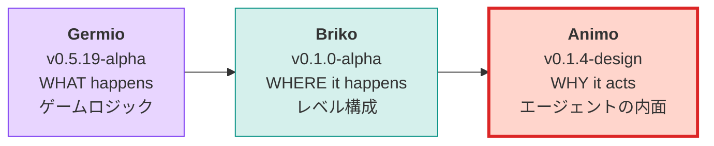

### 1.2 ライブラリ識別子

| 項目 | 値 |
|---|---|
| パッケージ名 | `com.studiomeowtoon.animo` |
| GitHub（当面） | `github.com/hiroxpepe/animo` |
| GitHub（将来） | `github.com/meowtoon/animo` |
| ライセンス | MIT |
| Unity 最低バージョン | 2022.3 |

---

## 2. G+B+A スタック思想

ゲーム開発を **3つの問い**に分解し、それぞれを独立したライブラリで担当する。

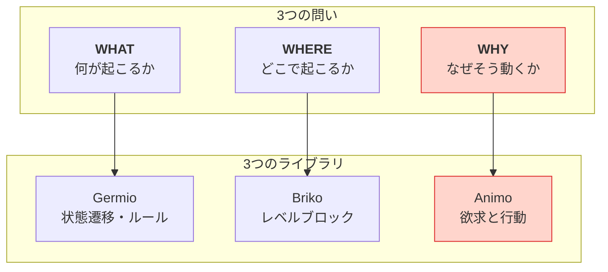

### 2.1 LLM ファースト設計

3 ライブラリすべてが **LLM が JSON を直接生成・編集する**ことを前提に設計されている。

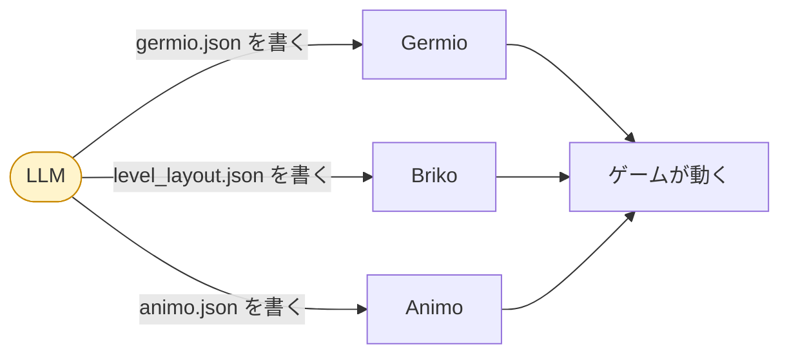

### 2.2 設計原則の継承

Animo は Germio・Briko の文化を踏襲する。

| 原則 | 内容 |
|---|---|
| **G16** | C# クラス名・JSON キー・Schema $defs・LLM 語彙を全層で同一名にする |
| **G17** | JSON 可視プロパティはすべて `snake_case` |
| **G18** | ネームスペース階層を厳守し依存方向を絶対に逆にしない |

### 2.3 Animo の核心思想（v0.1.1 で再定義）

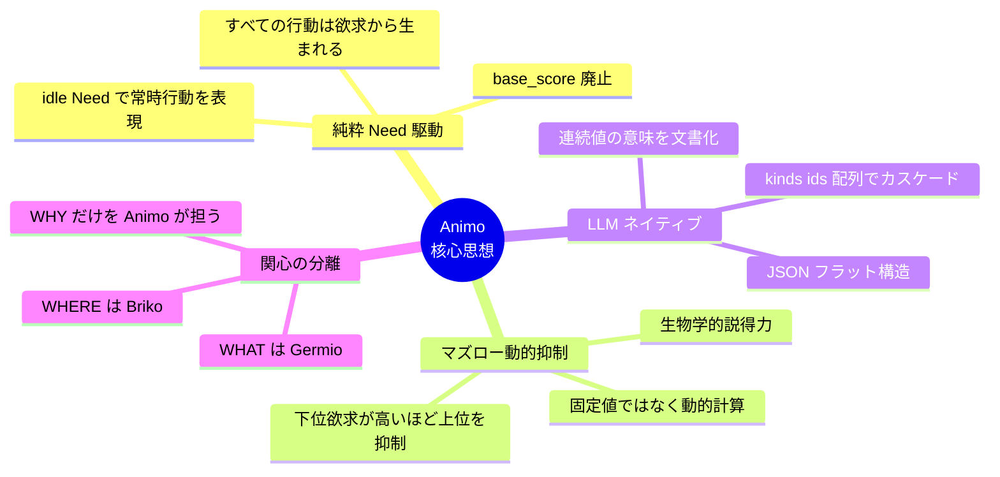

---

## 3. v0.1.4 → v0.1.5 変更点

### 3.0 概要：曖昧仕様の解消

v0.1.4 では API 契約上、**17 個の未定義動作**が残っていました — `Affect` に NaN を渡したら？ `Live` に負の `dt` を渡したら？ ロック中に再度 `Lock` を呼んだら？ などです。これらはロードマップ §4.7.1 に Q1〜Q17 として記録され、ここで一括解消されました。

すべての Q に最終回答が出ています。判断ログは `docs/decisions/v0.1.5_ambiguity_resolution.md` を参照。要約：

| テーマ | 変更内容 |
|---|---|
| `Affect` の境界 (Q1〜Q5) | NaN / 空文字 / null は throw、±Inf はクランプ、未定義 Need は Warning + no-op |
| 合成 (Q6, Q7) | 合成後 actions が空なら A011 Error、`kind_ids` 重複は dedupe + 新ルール **A033** Warning |
| `commitment.bonus` (Q8) | 範囲 `[0, 50]` の Error に拡張、>30 で Warning（既存 A028）はそのまま |
| `Lock` の境界 (Q9, Q10, Q14, Q15) | `Lock(0)` は即 Unlock、`Lock(<0)` は throw、再 Lock は replace、未ロック時の `Unlock` は no-op |
| `Live` の境界 (Q11〜Q13) | `dt = 0` は no-op、`dt < 0` と `dt = NaN` は `ArgumentException` |
| Lock × Need (Q16) | Hard ロックは「行動選択」を凍結するが Need 状態は更新される。デバッグ API `Engine.GetNeed(string)` を追加 |
| スレッド (Q17) | v0.1.5 では Animo は **メインスレッド専用**と明記 |
| Lock パイプライン詳細 (Q-S1, Q-S2, Q-S3) | ロック中の `commitment.bonus` は `locked_behavior` に乗る、Step 3 Bus.Publish はロック中も動く、Lock タイマー減算は `Live(dt)` 冒頭 |
| API 表面詳細 (Q-S4, Q-S5, Q-S6) | `ScenarioRunner.events` は `IReadOnlyList<TimedAffectEvent>` (float-key Dict 廃止)、`force_reset` は同フレーム内で OR-latch、重複 `Store.Register` は Warning + no-op (最初を保持) |
| 起動時詳細 (Q-S7, Q-S8, Q-S9) | A016 は Warning のままだが Composer がデフォルト `Binding` で補完するので `Awake` で NRE しない、`_previous_needs` は spawn Need で seed して初回フレームの threshold storm を防止、Step 5 のタイは `actions[]` 宣言順で解決 |
| Lock × 緊急ラッチ (Q-S10) | `_force_reset_pending` の Step 4 終了時クリアは `!is_locked` 条件付き。ラッチは Lock を跨いで生き残り、Lock 解除後の最初の Step 5 で消費される — ロック中に緊急要求を黙殺する穴を塞ぐ |
| Threshold reset 床 (Q-S11) | 省略時の `reset_threshold` は `Math.Max(0, trigger - 5.0)`、明示的な負値は新 Error **A034** で却下 — 低い trigger と Need の `[0, 100]` Clamp の組み合わせによる「永遠に Above」デッドロックを防止 |
| Awake `thresholds` null 安全 (Q-S12) | `Binding.thresholds` を non-nullable + デフォルト空リストに変更、Composer が常に non-null を保証、§16.5 サンプルも `?? Array.Empty<>` で多層防御 — Q-S7 の NRE が 1 行下にズレるバグを根絶 |
| Lock × `force_reset` の「1フレーム」契約 (Q-S13) | §9.7.2 の LockGate を Skip の上流に移動：ロック中は commitment-bonus スキップ *も* ラッチクリア *も* 抑制される。Q-S10 単独だと長時間 Lock で複数フレームのデバフ化していたものを §9.7.1 の「正確に 1 フレーム」契約まで戻す。 |
| 同 Need 複数マイルストーン閾値 (Q-S14) | §8.3 の `thresholds` マージ単位を「`need` で照合し後勝ち」から「`(need, trigger_threshold)` 複合キーで後勝ち」に変更；§16.5 cache を Need キーの Dictionary から各 Threshold の `internal string expanded_trigger` に移行。`fear=50 → "alerted"` と `fear=80 → "panic"` が共存可能になる（以前は片方が黙って消えていた）。 |
| Validator A023 ポスト合成閉鎖 (Q-S15) | A010 を `(0.0, 100.0]` に縮小（trigger 厳密に正）；新 A035 Error が **ポスト合成検査**（§13.2 stage 2）として動き、Composer の省略補完後に `trigger > reset` を再確認 — `trigger=0` + 省略 reset が A010 + A023 + A034 をすり抜けて `(0, 0)` チャタリングする経路を塞ぐ。 |
| Need → Tier エンジン契約 (Q-S16) | `Animo.Const` に `NEED_TIER_BY_NAME` と `NEED_INDICES_BY_TIER` を追加し、§9.3.4 の `max_lower_tier_intensity = max(eff_needs[tier1 needs] / 100, ...)` 公式に実データソースを与える — Q-S16 以前は §3.5 の表は権威ある文書だったが Engine がそれを読む方法がなかった。非標準 Need (A019) は抑制計算から除外。`frustration` は `influences` 経由のみで使われる場合でも Tier 2 として算入される。 |
| Stage-2 A025 でゴーストサイクル閉鎖 (Q-S17) | A025 を Stage 1 と Stage 2 の両方で実行：Stage 1 は raw JSON の循環を早期警告、Stage 2 は Composer 合成後の `influences` グラフを再構築して、Kind × Persona の重ね合わせだけで生成される循環（例：Kind `fear→confidence` + Persona `confidence→fear`）を Error で却下。 |
| Stage-2 A036 で合成後 actions 空を捕捉 (Q-S18) | 新 A036 Error が Stage 2 で合成後 `actions[]` をチェック。Q6 の構造的に偽だった主張「A011a が post-composition もカバーする」を塞ぐ — A011a は Stage 1 のみで動くため、`actions` 省略 + 空 `actions[]` の Kind を `kind_ids` で参照した Persona は Engine にゼロ行動で到達し、Step 5 のタイブレーク（Q-S9）が初回 `Live(dt)` で投げていた。 |
| Composer の Persona-first 順序 (Q-S19) | §8.3 `actions` マージ規則を「Kind-first append」から「Persona-first 保持、未マッチの Kind id を末尾追加」に変更。LLM が書いた Persona インデックス 0（例：`Idle`）が Kind の継承順で黙って押しのけられなくなる。Q-S9 の宣言順タイブレークが、ようやく前提通りの入力を受け取れる。 |
| Stable topo sort + `influences` Persona-first (Q-S20) | §9.6.2 のトポロジカルソートを合成後 `influences[]` 順序に対して **stable** に変更；§8.3 `influences` マージ規則も §8.3 `actions`（Q-S19）と対称化。同じ target Need を共有する独立 Edge は LLM が書いた順序を鍵に決定論的な結果を生む。新 A037 Warning が「同 target に複数 Edge」設定を表面化し、作者が「非可換だが決定論」のケースを認知できる。 |
| MockScene のゾンビ Update 修正 (Q-S21) | `MockScene.Tick()` がコンポーネントループ内で `obj.is_active` を再チェックするように。修正前は、先行コンポーネントの `Update` で `Destroy` がトリガーされると残りのコンポーネントの `OnDestroy` が同期的に走り、その後ループが解放済みリソースで `Update` を呼んでいた — Unity ライフサイクル契約違反。Unity の契約：フレーム途中で破棄されたら、その GameObject の残りコンポーネントは **そのフレーム内では二度と** `Update` を受けない。 |
| Store Unregister のインスタンス同一性 (Q-S22) | `Store.Unregister(agent)` が削除前に `ReferenceEquals(_agents[id], agent)` を検査するように。Q-S22 以前は、Q-S6 の「最初を保持」で却下された重複 `Agent B` が自身の `OnDestroy` で「稼働中の `Agent A` を指す辞書エントリ」を消し去っていた — オリジナルの登録が暗殺され、`A` は Bus から切断されたゾンビとなる。Q-S6 と対称：Register が重複侵入から、Unregister が重複退場から辞書を守る。 |
| Threshold が `_effective_needs` を読む (Q-S23) | Step 3 が `_effective_needs` と `_previous_effective_needs` を比較するように（`_needs` / `_previous_needs` ではなく）。Influence カスケード（§9.6.5）は `_effective_needs` にしか書き込まないため、§25.5.3 の frustration→anger チェーンで `eff_anger` が Threshold trigger を超えても、Q-S23 以前は Bus にシグナルが出なかった（Action 層は `Sulk` に切り替わるのに）。Q-S23 で Threshold が Step 4 のスコア計算と同じ観測面を持つようになる。`_previous_effective_needs` は Engine ctor で spawn Need を Step 2 に通して seed（Q-S8 + Q-S23）。 |
| エッジレベル topological sort (Q-S24) | §9.6.2 step 1 が **エッジ依存グラフ**（`e1 ≺ e2 ⇔ e1.target == e2.source`）を構築するように、Need source-target グラフではなく。Need レベルの topo sort は Need の **処理順** を返すので、同じ source の Edge が一括処理されて Q-S20 の「LLM 配列順が決定論キー」という約束を黙って破壊していた。Q-S24 で Q-S20 が **初めて実装可能** になる：独立 Edge は合成後 `influences[]` 順にフォールバックし、LLM はノブを 1 つだけ握る。A025 の循環検出は Edge 循環 ⇔ Need 循環の数学的等価性により影響なし。 |
| Threshold ヒステリシス状態 (Q-S25) | §12.3.2 の Below/Above 二状態機械に **実装契約**を追加：`Threshold` に `internal bool is_above` を追加、Step 3 が分岐ごとに読み書き（Below+上方クロス ⇒ 発火+Above；Above+下方クロス ⇒ Below；それ以外 no-op）。Q-S25 以前は `Data.cs` / `Engine.cs` に状態保持が **無く**、`prev<trig && curr>=trig` のクロス検出が trigger 周辺でチャタリング、`reset_threshold` が死にコードになっていた。`is_above` は Engine ctor で spawn 時の `_effective_needs` から seed（Q-S8 + Q-S23 を拡張）。 |
| Engine.OnSignal 出力チャネル (Q-S26) | `Engine` に `public event Action<string>? OnSignal;` を追加。Step 3 / Step 4 が該当する `expanded_trigger` / `expanded_action_change` をペイロードに raise；`Agent` は Awake で 1 度購読し、`Bus.Publish(signal_id)` に転送する。Q-S26 以前は §16.5 のサンプルが Engine 内で `_bus.Publish(...)` を呼んでいたが、§12.1 が「Engine は Bus 参照を持たない」と明記、`Engine.cs` には event/Action コールバックが **皆無** — Threshold 発火が Engine 内に閉じ込められていた。Q-S26 で Engine が pure C# のまま発火を発信できるようになる。 |
| 標準 Need 固定スロット予約 (Q-S27) | Engine ctor が **Persona の宣言内容に関係なく** 標準 Need 8 個を index `0..7` に予約、非標準 Need は index ≥ 8 に追加するように。Q-S27 以前は Persona Need 順での動的 index 割当が Q-S16 の `Const.NEED_INDEX_FEAR=2` と `NEED_INDICES_BY_TIER` と衝突 — `fear` を省略した Persona は `_effective_needs[2]` で別 Need を誤読（マズロー Tier-2 が `confidence` を fear と読む論理汚染）するか、`_effective_needs[7]` で `IndexOutOfRangeException`。Q-S27 で Q-S16 が **初めて安全に動作** する。 |
| プレハブテンプレートからの runtime-unique `agent_id` (Q-S28) | JSON `agent_id` は **テンプレ ID**；`Agent.Awake` が Register 前に runtime-unique 値（推奨：`$"{template_id}_{GetInstanceID()}"`）で上書きする。Q-S28 以前は 1 プレハブ/JSON から 100 体のゴブリンを spawn すると 99 体が Q-S6「最初を保持」防衛で拒否され Bus 切断ゾンビ化していた。上書きは host-adapter 層（Unity の Agent、テストの ScenarioRunner）で行うので Engine は内容非依存のまま。 |
| PersonaCache Flyweight (Q-S29) | `Animo.PersonaCache` が起動時に Validator を 1 回、Composer をテンプレごと 1 回実行。Agent 100 体 spawn が以前は 100 × (JSON parse + Validate + Compose) を走らせていたが、1 × (Validate) + N × (Compose, N = unique テンプレ数) + 100 × (DeepCopy) になる。循環検出（A025 stage 1 + stage 2）と post-composition チェック（A035, A036）はすべて Root ごと 1 回、Agent ごとではない。 |
| ジャンル Maslow opt-in `needs_meta` (Q-S30) | Persona/Kind に新規 optional `needs_meta` フィールド：`{ "oxygen": { "tier": 1 } }` で非標準 Need が作者宣言の tier で Maslow 抑制に参加 — §20.4 vs Q-S16 の対立を解消（ジャンルカスタム Need の oxygen, thirst が上位行動を抑制可能に）。per-Persona `_need_tier_indices` map；静的 `Const.NEED_INDICES_BY_TIER` はデフォルトとして残る。新 A038 が範囲外 tier を捕捉。`needs_meta` で明示された Need は A019 が発火しない。 |
| 沈黙の初回遷移契約 (Q-S31) | `OnBehaviorChanged` は Engine ライフタイム最初の代入（フレーム 1 で Q-S9 タイブレークによる `""` → `actions[0]`）で OnSignal を raise しない。Q-S31 以前は 100 体の NPC がシーンに spawn したフレーム 1 で Bus に同時に 100 個の `animo_*_idle` シグナルが押し寄せていた — rate-limited な listener が吸収できない init storm。フレーム 1 後の遷移は通常通り発火する。 |
| ScenarioRunner 用 Engine debug accessor (Q-S32) | Engine に 4 つの `internal` accessor を追加（`Animo.Tools` から `InternalsVisibleTo` で見える）：`GetEffectiveNeed(string)`, `GetActionScore(string)`, `GetAllNeedNames()`, `GetAllActionIds()`。Q-S32 以前、§26.3 は `TraceFrame.action_scores` を宣言していたが Engine に populate する API が無く、`ScenarioRunner` は構造的に trace を記録できなかった。accessor は明示的に cold-path；hot path 内では依然として直接 `float[]` index アクセスを使う。 |
| Runner 境界イベントループ修正 (Q-S33、**Q-S35 で訂正済み**) | §26.3.1 外側条件 `current_time < duration` → `current_time <= duration + EPSILON`、内側 `>= events[next].time - EPSILON`。EPSILON = 1e-4f。`<=` 形式は `duration` が `dt` の倍数のとき `Live(dt)` を 1 回多く実行してしまうことが Q-S35 で発覚（オフバイワン）；下の Q-S35 行に最終形あり。 |
| 初期 behavior の View 同期 (Q-S34) | Q-S31 沈黙契約は Bus init storm を防ぐが、ホスト Animator/View が Agent の spawn 時 Action を知る経路も奪っていた — 第二の behavior 変化までキャラが T-pose する。`Agent.Awake` が `_engine.Live(dt: 0.0f)` で初期決定を生成し、`_engine.behavior` を直接 Animator にセット（Bus 経由しない）。Q-S31 は維持（OnSignal は無音）；Q-S34 は並列の非 Bus 経路を追加。 |
| Runner over-shoot ループ修正 (Q-S35) | Q-S33 の `<= duration + EPSILON` は `floor(duration / dt)` より 1 回多く `Live(dt)` を走らせていた。最終形：外側 `current_time < duration`（strict、EPSILON 不要）、内側 `events[next].time < current_time + dt`（次フレーム window）、加えて `time == duration` イベント用の post-loop sweep。`Live` 呼出回数：正確に `floor(duration / dt)`。 |
| `needs_meta` の Data.cs 定義 (Q-S36) | `Scripts/Data.cs` に `NeedMeta` クラス（`int tier`）、`Persona.needs_meta` / `Kind.needs_meta` プロパティを追加。Q-S36 以前は Q-S30 仕様だけが authoritative で runtime 型は不在 — Engine ctor の `_persona.needs_meta` 参照はコンパイルエラー、Validator A038 は検証対象が無い。Q-S36 で spec と code のギャップを塞ぐ。 |
| `need_index` を Engine ctor で解決 (Q-S37) | `Action.need_index` / `Threshold.need_index` は **Engine ctor (post-DeepCopy)** で埋める、Composer ではない。Q-S37 以前の「Composer or Engine ctor」表記は Q-S29 PersonaCache と組み合わせると不安全：共有テンプレート Persona に焼き込まれた index が、Q-S27 標準スロット予約 + 異なる非標準 Need 並び順を持つ別 Engine にリークする。Engine ctor は 1 つの Persona の配列レイアウトに局所、index 焼き込みは正しい。Composer の責務は shape composition のみに縮小。 |
| PersonaCache stage-2 fail-loud (Q-S38) | Q-S38 以前は `PersonaCache.GetComposed` が stage-2 Error を log だけ吐いて壊れた Persona を返し、`new Engine(...)` がそのまま進み Q-S9 タイブレーク（Q-S52 で固定された for-loop；Q-S52 以前は仕様 narrative で LINQ 風 `actions.First(...)` と書かれていた）が空配列に対して初回 `Live(dt)` で Unity Scene クラッシュ。`GetComposed` は stage-2 Error で `InvalidOperationException` を throw する。ホストの `Agent.Awake` が catch + skip すれば Scene 全体は守れる。 |
| A019 を Stage 2 へ移行 (Q-S39) | A019（typo Warning for unknown Need keys）は **Stage 2** で 合成後 Persona に対して動くように。Q-S39 以前は Stage 1 で Kind と Persona を別々に評価していたため、Persona が `needs_meta { oxygen: { tier: 1 } }` を宣言していても Kind が `oxygen` を使っていれば誤検知 Warning が出ていた — Stage 1 の Kind 評価は Persona 側 metadata を見ない。Stage 2 は merged shape を見るので `needs_meta` で suppress 可能。 |
| 境界イベント観測可能化 (Q-S40) | Q-S35 の post-loop sweep は `time == duration` イベントを `engine.Affect` で消費するが、その後 `Live(dt)` を走らせず `TraceFrame` も記録しないため、Affect の効果が `TraceResult.frames` に**観測不能**だった（Engine 内部状態だけ書き換わるブラックホール）。Q-S40 で sweep が 1 件以上消費した場合に `engine.Live(dt: 0.0f)` + `RecordTraceFrame(time: duration)` を最終フレームとして記録。時間進行はしない（Step 1 decay は dt 倍）。time-advancing Live 呼出回数は依然 `floor(duration / dt)`。 |
| A038 カスケードスパム緩和 (Q-S41) | A038 「`needs_meta` が `needs` に未宣言の Need を参照」は **Stage 1 → Stage 2** へ移行し、かつ「使用中」の判定を broaden：composed `needs[]` *または* `actions[].need` *または* `influences[].source/target` のいずれかで参照されていれば許可。Q-S41 以前は汎用サバイバル Kind が `needs_meta { oxygen, thirst }` を宣言すると、子 Persona が片方しか使わないだけで毎回 Warning スパム。Stage 2 + 拡張存在テストが正しい gate。tier 範囲外は Stage 1 Error のまま。 |
| ScenarioRunner override 普遍化 (Q-S42) | `ScenarioRunner.Run()` も Q-S28 経路の runtime-unique override を**常時**適用、デフォルトで `$"{agent_id}_run_{_seq++}"`。新 optional `agent_id_override: string?` 引数。Q-S42 以前は「ScenarioRunner はテストで override をスキップ」と書かれており、Runner は単一エージェント専用にハードコードされていた。同テンプレから `Run()` 2 回呼ぶ／2 体ゴブリン戦闘などのマルチエージェント拡張が Q-S6 衝突なしで可能に。 |
| Threshold 複合キーの float EPSILON (Q-S43) | §8.3 thresholds マージユニットの `(need, trigger_threshold)` 複合キーは `Math.Abs(a - b) < THRESHOLD_KEY_EPSILON`（default `0.5f`）で float 部を比較、生 `==` ではない。Q-S43 以前は Persona が Kind の `trigger_threshold: 80.0` を `80.0001`（IEEE-754 round-trip 誤差）で上書きすると、ほぼ同一の閾値を持つ兄弟 Threshold が 2 個発生し両方発火 — override が黙って duplicate に化けていた。0.5f は LLM 作者の milestone 間隔（A035/Q-S15 で 5 以上保証）より十分狭く、JSON drift より十分広い。 |
| Animator-state テンプレ整合性 (Q-S44) | Q-S34 の `Agent.Awake` step (6) は `_engine.behavior`（生 Action id 例 `"Flee"`）を直接 `_animator.Play` に渡していたが、後続フレームは `binding.on_action_change` テンプレ展開（例 `"animo_goblin_47291_flee"`）が Bus 経由で来るため、ホストは 2 種類の state-name 名前空間を扱わされていた。Q-S44 は最初の push を `_engine.GetExpandedActionTrigger(_engine.behavior)`（新 internal accessor）経由にし、ホストには一貫した template-expanded payload が見える。Q-S31 silent contract 維持（Bus は frame 1 でも経由しない）。 |
| 標準 Need の将来メタデータ拡張 (Q-S45) | §3.5.2 PHASE C の `if (is_standard) continue;` は標準 Need を `needs_meta` ループから一括スキップしていたため、将来追加されうる `NeedMeta` フィールド（例 `decay_multiplier`）が標準 Need 8 個に対して**永久に適用不可**になっていた。Q-S45 はスキップを **tier だけ** に絞り（§3.5 が tier に勝つ Q-S30 の規約は維持）、他の NeedMeta フィールドは `ApplyNonTierMetadata` 経由で標準 Need にも適用される。v0.1.5 では他フィールドが無いので runtime 動作変化ゼロ；v0.2 / v0.3 拡張パスを保持。 |
| `_cached_action_triggers` の所属 (Q-S46) | §16.6 表は `_cached_action_triggers` を `Agent` のフィールドとして列挙していたが、§16.5 の実コードは `Engine` 内で構築・読取している。Q-S44 の `internal Engine.GetExpandedActionTrigger` accessor は cache が `Agent` にあったらコンパイル不可（MonoBehaviour から Engine への field 越境不可）。Q-S46 は表のエントリを `Engine` に修正して仕様と実装を一致させる。 |
| Threshold EPSILON 値 + A039 (Q-S47、Q-S43 を訂正) | Q-S43 は `THRESHOLD_KEY_EPSILON = 0.5f` を「作者の milestone 間隔は A035 / Q-S15 で 5 以上保証」を根拠に採用していたが、これは category error：A035 の 5 ギャップは **同じ Threshold の `trigger` と `reset` の間** のヒステリシス窓であって、**異なる sibling Threshold の trigger 同士の間隔ではない**。LLM 作者が `fear=80.0 → alert`、`fear=80.4 → panic` と書いた場合、Q-S43 の広い窓では両方が collapse される。Q-S47 は `EPSILON = 0.01f` に refine（IEEE-754 round-trip drift `~1e-7` の 3 桁マージン、作者意図の 1/100 単位区別を保持）。新 Stage-2 Warning **A039** で sibling 同 Need の trigger が 1.0f 以内の場合に作者へ surface。Validator rule 数: 40（A000-A039）。 |
| `ApplyNonTierMetadata` 宣言追加 (Q-S48) | Q-S45 の §3.5.2 PHASE C コードは `ApplyNonTierMetadata(_need_index[meta.Key], meta.Value);` を呼ぶが、`Scripts/Engine.cs` にメソッド宣言が存在しない（コンパイルエラー確定）。Q-S48 は `private void ApplyNonTierMetadata(int need_index, NeedMeta meta)` を v0.1.5 では no-op stub として宣言；v0.2 / v0.3 の NeedMeta 拡張時に本実装。Q-S45 経路がビルド可能になる。 |
| A038 orphan check に thresholds 追加 (Q-S49) | Q-S41 の broaden は `needs[]` / `actions[].need` / `influences[].source/target` の 3 箇所だったが、`binding.thresholds[].need` が抜けていた。Threshold で signal-only に Need を使う設計（例：`oxygen` 低下 → UI 警告のみ。actions/influences には登場しない）が orphan 誤検知される。Q-S49 が 4 つ目の "in use" として `binding.thresholds[].need` を加える：`needs[]` ∪ `actions[].need` ∪ `influences[].source/target` ∪ `binding.thresholds[].need`。 |
| `ScenarioRunner` は `Store` から独立 (Q-S50) | Q-S42 の universal override は「Store.Register 衝突回避」を根拠にしていたが、`Store.Register(IAnimoAgent agent)` は `IAnimoAgent` 実装を要求し、`ScenarioRunner` は `Engine` を直接 `new` するだけで `IAnimoAgent` 実装ラッパーを持たない（MonoBehaviour ではない）。Q-S50 は ScenarioRunner が **Store とは一切関わらない** ことを明記。Runner は内部に `Dictionary<string, Engine>` を持ち Affect/Lock を routing；`Store` は Unity Agent 専用 registry のまま。Q-S42 の Runner override は別目的（Runner 内部辞書の重複防止 + per-run trace 識別子）に格上げ。 |
| ScenarioRunner spawn-state 観測 (Q-S51) | Q-S34 で Unity Agent の t=0 spawn state は `Awake` 内 `Live(dt: 0.0f)` + Animator push で観測可能になったが、ScenarioRunner には対応経路がなく最初の `RecordTraceFrame` は `time = dt` から。NPC が spawn した瞬間の Need 値と Q-S9 タイブレーク初期 behavior が `TraceResult.frames` から完全欠落していた。Q-S51 はループ前に `engine.Live(dt: 0.0f); RecordTraceFrame(time: 0.0f);` を追加（Q-S34 の Awake 経路と並行設計）。time-advancing Live 呼出回数は依然 `floor(duration / dt)`。 |
| Step 5 タイブレークの zero-alloc (Q-S52) | Q-S9 のタイブレークを LINQ 風に `actions.First(a => a.score == max_score)` と書いていたが、これは `IEnumerator` + closure の毎呼出アロケーションを起こす。100 体 × 60 fps で 6000 alloc/sec、§16.1「Hot Path ゼロアロケ」誓いに直接違反。Q-S52 は `Live(dt)` 内 LINQ を禁止し、Step 5 タイブレークを strict `>` 比較の単一 for-loop に固定（first-declaration-wins を自然実装）、説明文中の `actions.First(...)` 引用も rewrite。 |
| String cache を Engine ctor に統一 (Q-S53) | Q-S46 で `_cached_action_triggers` の所属が Engine と確定したが、§16.5 サンプルコードの Threshold `expanded_trigger` 初期化ループが Agent.Awake 内のままだった。ScenarioRunner は Engine 直接 new で Agent.Awake を経由しないため、すべての Threshold の `expanded_trigger` が空文字列のまま放置 — 発火信号が全部 `""`。Q-S53 は Threshold 側の cache 初期化も Engine ctor 内へ移動（Q-S28 agent_id override 後）。Unity Agent と ScenarioRunner、将来の host が同じく初期化済み cache を継承する。 |
| `GetNeed` セマンティクス + 新 `GetBaseNeed` (Q-S54) | 新 debug API `Engine.GetNeed(string need)` は「current value」とだけ書かれ base/effective を曖昧にしていた。Q-S23 で `_effective_needs`（cascade 後）が観測動作を駆動する値になっていたので、`GetNeed` が base を返したらインスペクタは「effective fear=80 で逃げてる NPC を fear=30 と表示」して AI が壊れているように見える。Q-S54 で `GetNeed` を **effective 返却**に確定、companion API として **`GetBaseNeed`** を追加。default = effective、両方表示したい tool は両方呼ぶ。 |
| ScenarioRunner t=0 イベント sweep (Q-S55) | Q-S51 の pre-loop spawn-state 記録が、`time = 0.0f` 丁度の `TimedAffectEvent` を**先に**消費していなかった。`events = [{ time: 0.0, ev: Affect("fear", +50) }]` のテストで t=0 frame が spawn 値のまま記録され、Affect は最初のループ反復内で消費される — 作者の意図した初期状態と trace が食い違う。Q-S55 は spawn `Live(0.0f)` + record の前に `events[next].time <= 0.0f` を sweep。 |
| `ApplyNonTierMetadata` を全 Need に (Q-S56) | Q-S45 はフックを `if (_persona.needs_meta != null) { foreach (var meta in _persona.needs_meta) }` ループ内に置いた — 作者が `needs_meta` に明示した Need にしか届かない。`needs_meta` を書かない Persona（標準 Need のみ使う合法ケース）では `ApplyNonTierMetadata` が 0 回も呼ばれず、「全 Need に届く」目的に反していた。Q-S56 はパスを分離：composed `needs[]` の全 Need が `ApplyNonTierMetadata(idx, explicit_or_default_meta)` を受ける、`NeedMeta.DefaultFor(name)` が per-Need default を提供。v0.1.5 は no-op runtime 不変、v0.2 / v0.3 で全 Need 拡張到達。 |
| A038 orphan に `rates` 追加 (Q-S57) | Q-S41 + Q-S49 で 4 箇所まで広げたが `rates` が抜けていた。「pure-rate Need」（`poison` のように `rates` だけで進行し UI が読む Need。Action/Influence/Threshold は不在）が orphan 誤検知される。Q-S57 が 5 つ目の "in use" として `rates.keys()` を追加。最終 5 site union：`needs[]` ∪ `actions[].need` ∪ `influences[].source/target` ∪ `binding.thresholds[].need` ∪ `rates.keys()`。 |
| `Bootstrapper.OnDestroy` で Store もクリア (Q-S58) | bootstrapper は `PersonaCache` をクリアしていたが `Store.Instance._agents` を放置していた。Unity Editor "Enter Play Mode Options (Fast)" で static state が play session 間で保持されるため、stale Agent 参照が累積し Bus routing を破壊。Q-S58 で `Store.ResetForTesting()` を `PersonaCache.ClearForTesting()` と対で呼ぶ。両方 idempotent + cheap。 |
| `GetInstanceID()` multiplayer 警告 (Q-S59) | Q-S28 の推奨式 `$"{template_id}_{GetInstanceID()}"` は単一 Unity セッション内では unique だが network-deterministic ではない — host 間、シーン再ロード、save/load で値が変わる。multiplayer で client/server や client 間の Bus payload が一致する必要があるゲームは決定論的 id source（`NetworkObject.NetworkObjectId`、サーバー割当 UUID、ECS entity id 等）に置き換え必須。Q-S59 が §11.4.1 でこれを明示 — host adapter が戦略を選び、spec は obvious default が破綻するポイントを警告する。 |
| Runner 内部 `Engine` 単一 (Q-S60) | Q-S50 の「`Dictionary<string, Engine>` で routing」表現は v0.1.5 の `Run(string agent_id, ...)` 単一 ID API と不整合 — `TimedAffectEvent` も対象 agent 指定無しで、辞書は常に 1 要素。Q-S60 は v0.1.5 の Runner 内部フィールドを `Engine _engine`（per `Run()` 単一）に固定。型は API が変わる時（v0.2 multi-agent `Run()` 追加時）に変える、その前ではない。 |
| `actions[]` は additive-only (Q-S61) | Q-S19 の Persona-first ordering + last-wins on values は、子 Persona が Kind の Action を**省略で削除する**ことを構造上不可能にしている — Persona に id が無い Kind Action は末尾に append される。これは意図的（子が誤って `Idle` のような重要なフォールバックを失わないため）だが spec で明示していなかった。Q-S61 で design note を追加：継承は additive、never subtractive；「Kind A を使うが Action 1 つだけ抜きたい」場合は Kind A_core + Kind A_extra に分割し必要な切片だけ継承。 |
| Hard Lock 中 Step 4 の根拠 (Q-S62) | Hard Lock 中、Step 5 (switch) はスキップだが Step 4 (score 計算) は走る — 一見無駄計算。Q-S62 で 3 つの理由を明示：(a) `commitment.bonus` 連続性 — Lock 解除直後の Step 5 が `_action_scores[locked_behavior_index]` を読み smooth-out-of-lock 判定、Lock 中 Step 4 を切ると stale で破綻。(b) Trace observability — `TraceFrame.action_scores` で Lock 中フレームも作者がデバッグ可能。(c) 5-step pipeline 決定論 — 内部ステップを条件分岐でスキップすると将来の機能と相互作用するたびに再証明が必要。コスト無視できるレベル、正確性とのトレードで設計は正しい。 |
| `Needs.Clamp()` 削除 (Q-S63) | `Scripts/Data.cs` で `Needs.Clamp() => throw new NotImplementedException()` を宣言。Hot path は §16.2 通り flat `float[] _needs` + `Mathf.Clamp` 直接で、v0.1.2 以降 instance method は dead code 化。tool 作者が誤って呼ぶと NotImplementedException で爆発する罠。Q-S63 でメソッド削除、§6.1 class diagram も更新。Needs class は JSON-bridge shape のまま（`Get` と `Normalized` は明示的に「engine を使え」stub）。 |
| `Persona.DeepCopy()` 宣言 (Q-S64) | §11.4.1 Awake step (2) で `template.DeepCopy()` を呼んでいるが `Persona` クラスにそのメソッド宣言が無い — 確定コンパイルエラー。PersonaCache が共有 composed テンプレを返すため DeepCopy 無しだと同 template id から spawn した 2 体の Agent が `Needs`、`actions[]`、`binding.thresholds[].expanded_trigger` を共有 — 一方の Q-S28 agent_id 上書きが兄弟全部を破壊。Q-S64 で `public Persona DeepCopy()` stub を Data.cs と §6.1 class diagram に追加。Phase 3 で全 reference-type フィールドの deep clone を実装。 |
| Needs アンラップ in PHASE A (Q-S65) | §3.5.2 PHASE A は `foreach (var kv in _persona.needs ?? new Dictionary<string, float>())` と書いていたが、`_persona.needs` は `Needs` クラス（`Dictionary<string, float> values` をラップ）であって Dictionary そのものではない。`??` で型不一致確定エラー。Q-S65 は両方の PHASE A ループを `_persona.needs?.values ?? new Dictionary<string, float>()` に修正。 |
| PHASE C は `_need_index` を回す (Q-S66) | Q-S56 の PHASE C "Step 3" 書き換えで `for (int idx = 0; idx < _composed_persona.needs.Count; idx++) { string need_name = _composed_persona.needs[idx]; ... }` と書いていたが、`Needs` クラスに `.Count` も整数 indexer も無い — Q-S56 で自爆させた確定コンパイルエラー。Q-S66 は `_need_index` map（PHASE A で composed needs ∪ needs_meta union から構築済みの「この Engine が知る全 Need」map）を直接 foreach に切替。各エントリが index を既に持つので脆弱な再導出は不要。 |
| `AffectEvent` 宣言 (Q-S67) | §26.3 で `TimedAffectEvent` が `public AffectEvent ev { get; }` を持つが、肝心の `AffectEvent` 型定義が spec のどこにも無い — 確定 missing-type コンパイルエラー。Q-S67 で §26.3 に `public readonly struct AffectEvent { string need; float delta; bool force_reset; }` 定義追加（`Engine.Affect(need, delta, force_reset)` の引数 tuple をミラー）。§6.1 namespace table は v0.1.4 から既に `AffectEvent` を `Animo.Tools` に列挙していた — Q-S67 が表 vs コードブロックのギャップを埋める。 |
| `Agent : MonoBehaviour, IAnimoAgent` (Q-S68) | §11.4.1 Awake で `Animo.Store.Instance.Register(agent: this)` を呼んでいるが、`Store.Register` は `IAnimoAgent` を要求し、spec の narrative は「Animo.Agent : MonoBehaviour」とだけ書いて interface を明示していなかった — 確定 cannot-convert コンパイルエラー。Q-S68 で class 宣言を `public sealed class Agent : MonoBehaviour, IAnimoAgent` に明示し、`public string agent_id => _composed_persona.agent_id` で interface 契約を満足。Q-S28 override 後の composed Persona から trivial に実装。 |
| `_need_tier_indices` 型統一 (Q-S69) | §16.6 Engine フィールド表は `_need_tier_indices: Dictionary<int, int[]>` と宣言（Hot Path で §9.3.4 `max_lower_tier_intensity` の zero-alloc キャッシュ親和イテレーションには `int[]` が必要 — §16.1 規則）、しかし PHASE C ctor コードは `_need_tier_indices = new Dictionary<int, List<int>>()` で `.Add()` を呼ぶ — フィールド型と確定不一致。Q-S69 は `int[]` フィールド型を維持（§16.1 規則順守）し、ctor 内ではローカル `Dictionary<int, List<int>>` scratch バッファを使用（needs_meta non-standard Need の追加で tier 参加が漸増する）；PHASE C 末尾で各 List<int> を `new int[]` にスナップショットして finalize。tier ごと 1 回の alloc は ctor 時のみ；Hot Path イテレーションは `int[]` 上で行われる — §16.1 契約を遵守。 |
| `_lock_remaining` フィールド宣言 (Q-S70) | §9.2 T0 timer phase pseudocode と §24.3 narrative が `_lock_remaining` を参照（v0.1.4 Lock 機構の countdown timer）しているが、§16.6 Engine フィールド表に entry が無く、`Scripts/Engine.cs` にも宣言が無い — Phase 3 実装で T0 / Lock / Unlock のいずれを実装するにも確定コンパイルエラー。Q-S70 で Engine.cs に `float _lock_remaining = 0.0f;` を追加、§16.6 表にも行追加（spawn 時 0 = Lock 不在；`Lock(duration, mode)` で要求 duration を設定；`Unlock()` または T0 自然満了でクリア）。 |
| `Validator.ValidateStage2` 宣言 (Q-S71) | §11.6.1 PersonaCache が `Validator.ValidateStage2(composed: composed)` を呼んで stage-2 ルール（A019/A025/A035/A036/A037/A038/A039）を per-template 実行するが、`Scripts/Validator.cs` には `Validate(Root root)` しか宣言されていなかった — 確定 missing-method コンパイルエラー。Q-S71 で `public static ValidationResult ValidateStage2(Persona composed)` stub を Validator.cs に追加（Phase 3 で本体実装）。 |
| `ValidationResult.Merge` 宣言 (Q-S72) | §11.6.1 が `_validation!.Merge(stage2)` を呼んで per-template stage-2 findings を Initialize-time aggregate に統合しているが、`ValidationResult` クラスに `Merge` メソッド宣言が無い — 確定 missing-method コンパイルエラー。Q-S72 で `public void Merge(ValidationResult other)` stub を Validator.cs に追加（Phase 3 で `this.issues.AddRange(other.issues)` 実装）。 |
| `AnimoLog.Error` 宣言 (Q-S73) | `PersonaCache.Initialize`（検証失敗パス）と `Agent.Awake`（Q-S38 try/catch）が `AnimoLog.Error(msg)` を呼んで fail-loud エラーを表面化しているが、`Scripts/AnimoLog.cs` には `Write` と `Warning` しか宣言が無い — 確定 missing-method コンパイルエラー。Q-S73 で `public static void Error(string message)` を AnimoLog.cs に追加；Phase 3 で editor/runtime は `UnityEngine.Debug.LogError` をラップ、headless 環境（テスト・サーバ simulation）は `Console.Error.WriteLine` にフォールバック。 |
| `has_errors` snake_case 統一 (Q-S74) | `Scripts/Validator.cs:41` で `public bool has_errors`（snake_case、Animo の C# API surface 全体に一貫 — `Persona.agent_id`、`Issue.rule_id`、`Threshold.expanded_trigger` 等）を宣言しているが、§11.6.1 のサンプルコードは `_validation.HasErrors` と `stage2.HasErrors`（PascalCase）と書いていた。C# は case-sensitive；PascalCase 読出は property 不在エラー。Q-S74 で snake_case に統一（Validator.cs はそのまま、spec 側を `sed` で `HasErrors` → `has_errors` 一括変換）。既存テスト（`AssertResult.cs`、`NumericEdgeTests.cs`、`A028_CommitmentBonusWarnTests.cs` 等）は最初から `has_errors` を使っていたため変更不要。 |
| `Agent._animator` フィールド宣言 (Q-S75) | §11.4.1 Awake step (6) `_animator?.Play(stateName: trigger)`（Q-S34 / Q-S44 で初期 behavior を Bus 経由せず host Animator に直接 push）が `_animator` を参照するが、Agent クラス宣言部には `_persona_template_id`、`_bus`、`_composed_persona`、`_engine` しかなく — 確定 missing-field コンパイルエラー。Q-S75 で `[SerializeField] Animator? _animator = null;` を追加。SerializeField + nullable Animator? で Inspector からワイヤリングするか、別 View backend（ECS、custom shader）使用時は null のまま；`?.Play(...)` invocation で Animator 不在時もサイレント no-op（NullRef にならない）。 |
| `Animo.Json.Parse` 宣言 (Q-S76) | §11.6.5 AnimoBootstrapper.Awake が `Animo.Json.Parse(_animo_json.text)` を呼んで JSON を `Root` にデシリアライズしているが、`Animo.Json` クラスも `Parse` メソッドも `Scripts/` のどこにも存在しない — 確定 missing-type コンパイルエラー。Q-S76 で新規 `Scripts/Json.cs` を追加し `public static class Json { public static Root Parse(string text); }`（NotImplementedException stub；Phase 3 で Newtonsoft.Json or System.Text.Json をラップ、build profile 依存）。stub は薄い facade なので、別 JSON ライブラリを好む host は Bootstrapper 内で直接ライブラリの deserializer を呼んで置換可能。 |
| Animo.asmdef + package.json (Q-S77) | `Agent.cs` が `Germio.Bus? _bus` を参照しているが `Scripts/Animo.asmdef` が存在しなかった（Phase_2_5 へ deferred されていた） — Phase 3 Unity build で「型または名前空間 'Germio' が見つかりません」確定エラー。Q-S77 で最小 `Animo.asmdef` を `"references": ["Germio"]` 込みで配置 + `package.json` に `"dependencies": { "com.studiomeowtoon.germio": "0.1.0" }` 宣言；Germio クロスリファレンスを解決可能にする最低限。Phase_2_5 のより広い asmdef polish（autoReferenced flags、definedConstraints、versionDefines）はこの基盤の上に積む。 |
| `Store.ResetForTesting()` 静的呼出形式 (Q-S78) | `Scripts/Store.cs:26` で `public static void ResetForTesting()`（singleton クラス上の静的メソッド）と宣言されているが、§11.6.5 の Q-S58 fix が `Animo.Store.Instance.ResetForTesting()` と書いていた — instance 参照経由で静的メンバーにアクセス。C# CS0176 は「Member is accessed through an instance; qualify it with a type name instead.」と禁止する確定エラー。Q-S78 で型名形式 `Animo.Store.ResetForTesting()` に修正。Q-S58 の設計意図（Store cleanup を PersonaCache cleanup と pair）は不変；syntax のみ修正。 |
| `Scripts/PersonaCache.cs` 物理化 (Q-S79) | §11.6.1 が PersonaCache 完全実装を spec 本文として書いていて `Agent.Awake` も `Animo.PersonaCache.GetComposed(...)` を呼んでいたが、リポジトリに `Scripts/PersonaCache.cs` ファイルが存在しなかった — `Animo.PersonaCache` 型がコンパイル時解決不能。Q-S79 で §11.6.1 の signature 通りの `Initialize`、`GetComposed`、`ClearForTesting` メソッド宣言を持つ `Scripts/PersonaCache.cs` を物理配置；本体は NotImplementedException（`ClearForTesting` だけは inline 実装 — テストインフラが Phase_2_4_x 以来既に使っている）。 |
| `Agent.Update` フレーム tick (Q-S80) | §11.4.1 Agent サンプルコードは `Awake()` と `OnDestroy()` しか宣言しておらず、すべての NPC が Awake で初期 behavior を seed したあと永久にフリーズする — 後続フレームで `Live(dt)` が走らないので decay → effective → threshold → score → switch のエンジンパイプライン全体が Unity アダプタから到達不能だった。Q-S80 で `void Update() { _engine.Live(dt: Time.deltaTime); }` を Agent サンプルに追加。 |
| `Store.Unregister(IAnimoAgent)` シグネチャ (Q-S81) | `Scripts/Store.cs:42` は `public void Unregister(IAnimoAgent agent)`（interface 形式）を宣言しているが、§11.2.2 Q-S22 サンプルコードは `public void Unregister(Animo.Agent agent)`（具象クラス形式）と書いていた。Phase 3 が spec の text に従って具象で実装すると IAnimoAgent 契約を満たさない別オーバーロードが生まれ、interface の Unregister wire が宙に浮く。Q-S81 で spec narrative とコードを interface 形式に統一。 |
| `Scripts/Tools/ScenarioRunner.cs` + `TraceResult.cs` 物理化 (Q-S82) | §26.3 が ScenarioRunner + TraceResult API を spec 本文として書いていたが、`Scripts/Tools/` ディレクトリも `ScenarioRunner.cs` も `TraceResult.cs` も `Animo.Tools.asmdef` も存在しなかった — `Animo.Tools` 名前空間は最初から最後までビルド不能だった。Q-S82 でディレクトリ + 3 ファイルを配置：TraceResult.cs に TraceFrame + TraceResult class 宣言、ScenarioRunner.cs に AffectEvent + TimedAffectEvent struct (Q-S67) と ScenarioRunner.Run stub (§26.3 シグネチャ通り)、Animo.Tools.asmdef に Animo アセンブリ参照。Phase 3 で Run 本体実装。 |
| `Scripts/Agent.cs` 物理化 (Q-S83) | §11.4.1 が Agent MonoBehaviour 完全実装を spec 本文として書き、Q-S29/Q-S68/Q-S75/Q-S80 が機能を積み上げてきたが、`Scripts/Agent.cs` ファイルはリポジトリに存在しなかった — spec 内の `Animo.Agent` への参照すべてが forward-looking promise だった。Q-S83 で `#if UNITY_5_3_OR_NEWER` で囲んだ `Scripts/Agent.cs` を物理配置（headless dotnet test は UnityEngine 無しでもコンパイル通る）：`Agent : MonoBehaviour, IAnimoAgent` 宣言、フィールド宣言、Awake/Update/OnDestroy メソッド stub。Phase 3 で本体実装。 |
| ScenarioRunner Integer step counter (Q-S84) | §26.3.1 Run loop が `while (current_time < duration) { ... current_time += dt; }` と書いていた — `float += dt` の繰り返しは IEEE-754 丸め誤差を蓄積し、数千回のイテレーションで `current_time` が数学的真値から ~1e-5 ドリフトすることがある。たまに predicate が 1 反復だけずれて評価され、Q-S35 が約束した `floor(duration / dt)` 回の総 `Live(dt)` 数を破る — Q-S35 の数学的契約が偽だった。Q-S84 で integer 反復回数固定：`int total_steps = (int)Math.Floor(duration / dt); for (int i = 0; i < total_steps; i++) { ... }`。トレース記録の `current_time` は `(i + 1) * dt` で再構成 — author が書いた値 (`0.1f`, `0.2f`, ...) と完全一致。 |
| `ThresholdsMatch` first-occurrence-wins (Q-S85) | §8.3.1 で宣言された `Math.Abs(a-b) < EPSILON` は **推移律を満たさない**：A=80.000, B=80.006, C=80.012 の場合 A≈B、B≈C だが A≉C。merge ループに順序ルールが無いと、`Composer.MergeThresholds` の出力が入力順依存（C が A に吸収される vs C 独立）になり非決定論的になる。Q-S85 で merge ループに **first-occurrence-wins** セマンティクスを明文化：merge 済みリストを順番に走査、**最初に**マッチしたエントリだけ Persona が override、2 つ目以降のマッチは触らない。出力決定論性 + Persona 優先順位の維持を両立。A039 が validate 時に sibling-pair Warning を表面化。 |
| Step3 hot-path null-coalesce 削除 (Q-S86) | §16.5 Step3_Thresholds が `t.reset_threshold ?? Math.Max(0f, t.trigger_threshold - 5f);` を毎フレーム毎 Threshold で実行していた。しかし Q-S11 が「Composer.Compose は `reset_threshold` を必ず充填する（作者が省略すれば同 `Math.Max` formula で）」と契約しているので、Hot Path 到達時には **絶対 non-null**。毎フレームの `??` は §16.1 zero-overhead 規則違反の純粋な dead code だった。Q-S86 で `t.reset_threshold!.Value` に置換。null-forgiving `!` は Q-S11 契約で安全；契約違反は最初のフレームで NRE として表面化し silent wrong-value にはならない。 |
| MockScene scratch-buffer (Q-S87) | `Tests~/MiniUnity/MockScene.cs` の Tick が毎フレーム `_objects.ToArray()` と新規 `MockMonoBehaviour[]` を allocate していた — 1 時間 Soak Test (216,000 frames @ 60fps) でテスト基盤だけで ~432,000 配列 alloc を吐き出し、ハーネスが検証する Zero-GC 契約そのものを破壊していた。Q-S87 で 2 つの reusable `List<T>` scratch field (`_obj_scratch`, `_comp_scratch`) を `Clear() + AddRange()` で運用 — backing array は peak capacity に成長後 alloc 停止。Q-S21 zombie-Update 防衛（snapshot-then-iterate semantics）は完全保持。 |
| §16.2.2.1 Q-S27 概念スケッチ marker (Q-S88) | §16.2.2.1 が Q-S27 説明用の `_effective_needs = new float[Const.STANDARD_NEEDS.Count + extra];` Engine ctor pseudocode（pre-Q-S30 shape の `Persona.needs` 直接 foreach）を保持し、§3.5.2 PHASE A が canonical な多 phase ctor（post-Q-S65 の `_persona.needs?.values`）を保持していた — どちらも当時は valid だが、読者は `_effective_needs = new float[...]` の 2 つの並立宣言を頭で reconcile しなければならなかった。Q-S88 で §16.2.2.1 のスニペットに「概念スケッチのみ」マーカー + 「正規実装：§3.5.2 PHASE A」明示ポインタ追加 — Q-S27 説明文脈を残しつつ source-of-truth を曖昧さ無く指せるようにした。 |
| `needs_meta` schema property 宣言 (Q-S89) | `Schemas/animo.schema.json` が `kind` と `persona` を `additionalProperties: false` で定義していたが両方とも `needs_meta` プロパティ宣言なし — Q-S30 機能が schema 段階で死んでいた。LLM が完璧な spec 準拠の `needs_meta` を書いても ajv で「未定義プロパティ」として弾かれる、LLM-first スタックの入口完全封鎖。Q-S89 で `needs_meta_map` definition（snake_case キー、`need_meta` 値、`tier ∈ [1, 5]` 必須）+ `needs_meta` プロパティを `kind.properties` と `persona.properties` 両方に追加。 |
| Stage 2 テストが `ValidateStage2` を呼ぶ (Q-S90) | 4 つの Stage 2 テストファイル (A025/A035/A036/A037) が全部 `Validator.Validate(root)` を呼んでいた — これは Q-S71 split 以後の **Stage 1 専用エントリ**。テストは Stage 2 規則の発火を期待しているが Stage 2 を呼ばないので、Phase 3 が完璧な Stage 2 実装を書いても永久 Red のまま — テストスイート自身が論理的自殺。Q-S90 で 6 ケース全部を `Composer.Compose(persona, root)` → `Validator.ValidateStage2(composed)` に書き換え。 |
| EditMode asmdef が `Animo.Tools` 参照 (Q-S91) | `Tests~/EditModeTests/Animo.Tests.EditMode.asmdef` の `references` が `Animo` + `Animo.Tests.MiniUnity` のみだったが、`Tests~/EditModeTests/Tools/` 配下の 12 個のテストが `Animo.Tools.ScenarioRunner` 等を使う。Unity Editor コンパイルで「型または名前空間 `Animo.Tools` が見つかりません」が全テストで出る確定エラー。Q-S91 で references に `"Animo.Tools"` 追加。 |
| `ScenarioRunner._engine` フィールド宣言 (Q-S92) | Q-S60 で「Runner の内部フィールドは `Engine _engine` 単一」と decision 済みだったが、Q-S82 でファイル物理化した時 `readonly Root _root;` のみ宣言され `_engine` フィールド宣言を入れ忘れ。Phase 3 実装者が存在しないフィールドにアクセスする確定コンパイルエラー。Q-S92 で `Engine? _engine;` を ScenarioRunner クラスに追加（nullable は multi-Run 再利用のクリーンさのため）。 |
| `TraceResult` 分析 API 物理化 (Q-S93) | spec §26.3 が `behavior_count`、`behavior_total_time`、`ToCsv()`、`ToJson()` を分析サーフェスとして約束していたが、Q-S82 でファイル物理化した時 `agent_id`、`duration`、`dt`、`frames` のみ宣言。consumer は occupancy query や regression baseline、CSV エクスポートのサーフェスを完全に失っていた。Q-S93 で約束された全メンバーを Phase 3 stub として ship — properties は default-empty Dictionary、`ToCsv`/`ToJson` は NotImplementedException。 |
| package 名前空間統一 `com.studiomeowtoon.*` (Q-S94) | spec §1.2 ロードマップ + 7 箇所以上で `com.meowtoon.{animo,germio,briko,utilo}` と書かれていたが、Q-S77 の実 `package.json` は `com.studiomeowtoon.animo` + `com.studiomeowtoon.germio` で ship 済み — `studiomeowtoon`（一語、`STUDIO MeowToon` 著者名を小文字に collapse）。spec narrative とマニフェストの名前不一致は UPM の依存解決を確実に失敗させる。Q-S94 で `com.studiomeowtoon.*`（実装側、author identity 一致）に sed で EN+JP 統一 — 1 言語あたり 8 行修正（Roadmap 行 + spec mermaid diagram + 依存ツリー例）。 |
| A019 テストが `ValidateStage2` 呼出 (Q-S95) | `Tests~/EditModeTests/Validator/A019_TypoNeedsKeyTests.cs` の 3 ケース全部が `Validator.Validate(root)` を呼んでいた — Q-S71 split で Stage 1 専用。しかし Q-S39 が A019 を Stage 2 に移動済み（Persona-level `needs_meta` で false-positive を抑制するため）。Q-S90 (Phase_2_4_20) は A025/A035/A036/A037 を修正したが A019 は見落とし。Phase 3 が Q-S39 Stage 2 ルールを正しく実装しても永久 Red のまま。Q-S95 で 3 ケース全部を `Composer.Compose(persona, root)` → `Validator.ValidateStage2(composed)` に書換。 |
| Agent.OnDestroy null-safe (Q-S96) | §11.4.1 Awake の `try { ... } catch (InvalidOperationException) { enabled = false; return; }`（Q-S38 fail-loud パス）が走ると `_composed_persona == null` のまま。Unity が disabled MonoBehaviour に対しても scene unload 時に OnDestroy を呼び、それが `Store.Unregister(this)` を呼び、`agent.agent_id` を読み、（Q-S68 当初実装では）`_composed_persona.agent_id` を dereference — シーンアンロード時の NullReferenceException 確定。Q-S38 の「scene を生かす」約束が、まさに cleanup 用の OnDestroy に破壊されていた。Q-S96 で `agent_id` getter を null-safe 化（`?.agent_id ?? "<uninitialized>"`）+ OnDestroy 内 `_composed_persona == null` 早期 return — 多段防衛。sentinel 文字列は real id と衝突しない（snake_case 規則は山括弧禁止）。 |
| `Scripts/AnimoBootstrapper.cs` 物理化 (Q-S97) | §11.6.5 が AnimoBootstrapper MonoBehaviour を spec 本文として書き、`Tests~/EditModeTests/Bootstrapper/BootstrapperStoreCleanupTests.cs` が Phase 3 contract として参照していたが、`Scripts/AnimoBootstrapper.cs` ファイル不在 — Q-S83 (Agent.cs) と同じ物理乖離パターン。Q-S97 で `#if UNITY_5_3_OR_NEWER` で囲んだ `Scripts/AnimoBootstrapper.cs` を物理配置（`[DefaultExecutionOrder(-1000)]` + `_animo_json` SerializeField + Awake/OnDestroy stub、§11.6.5 シグネチャ通り）。 |
| ScenarioRunner Math.Round (Q-S98) | Q-S84 が `int total_steps = (int)Math.Floor(duration / dt);` を宣言して Q-S35 IEEE-754 ドリフト契約を修正したつもりだったが、`duration / dt` は **FLOAT 除算** で float32 は 10進精度 ~7 桁しかない。具体的 IEEE-754：`float32 (10.0f / 0.1f) = 99.9999985... → Floor = 99` (期待 100)、`(30.0f / 0.1f) = 299.9999955... → Floor = 299` (期待 300)。Floor を微小に下回る値に適用すると体系的に 1 step under-shoot。Q-S35 の "exactly floor(duration / dt)" 契約は Q-S84 でも依然偽だった。Q-S98 で double 昇格 + Math.Round に修正：`(int)Math.Round((double)duration / (double)dt)` — double は ~15 桁精度、Math.Round が sub-LSB ドリフトを両方向対称に補正。 |
| ScenarioRunner._seq フィールド宣言 (Q-S99) | Q-S42 spec narrative で「runner は `agent_id_override` 未指定時に `${agent_id}_run_${_seq++}` を自動生成」と宣言したが、Q-S82 でファイル物理化した時 `_seq` フィールド宣言を入れ忘れ — Q-S92 の `_engine` 漏れと同じパターン。Phase 3 実装者が spec 通り `agent_id_override ?? $"{template_id}_run_{_seq++}"` と書いた瞬間コンパイルエラー。Q-S99 で `int _seq = 0;`（instance field、static ではない — 異なる test fixture が counter を共有しないため）+ #pragma CS0169 で Phase 3 用に warning 抑制。 |
| A011 → A011a rule_id 統一 (Q-S100) | テスト `A011_PersonaActionsRequiredTests.cs` と `EmptyAndNullTests.cs` が `rule_id: "A011"` をアサートしていたが、spec §13.1 v0.1.5 でルールは A011a（Error: kind_ids 無 → actions[] 必須）と A011b（許容ルール、emit 無し）に分割済み。Phase 3 が §13.1 通りに `"A011a"` を吐いた瞬間、テストは rule_id 不一致で Red になる。Q-S100 で 2 テストファイルを sed で `"A011a"` に統一 + Q-S100 cross-reference コメント追加。*プロトコル centennial Q-S* — Q-S1 から 100 個目の grep-verified Master-vs-Gemini 発見。 |
| Q-S96 を `Scripts/Agent.cs` へ backport (Q-S101) | Q-S96 (Phase_2_4_21) は null-safe `agent_id` getter と OnDestroy 早期 return guard を追加したが、spec narrative §11.4.1 EN+JP のコードブロックのみ更新で、物理 `Scripts/Agent.cs`（Q-S83 で物理化済み）には未反映 — getter は依然として `_composed_persona.agent_id`、OnDestroy は guard 無しで `Store.Instance.Unregister(this)` 直行。Phase_2_4_21 の N-round consistency review は EN+JP+code-blocks 整合性までしかカバーせず、`Scripts/*.cs` ファイルへ拡張していなかった。Q-S101 で物理ファイルへ 2 行修正を backport：getter null-coalesce + OnDestroy 早期 return。**Process upgrade**：Phase_2_4_22 で N-round review に新層を追加 — *spec narrative ↔ 物理 Scripts/*.cs 同期*。Q-S101 以降、コードブロックに触れる spec patch は必ず `Scripts/*.cs` に grep して物理ファイル一致を確認する。 |
| Animator state 名は raw に戻す (Q-S102 — Q-S44 partial revert) | Q-S44 は Awake-step-(6) の初期 Animator push を `_engine.GetExpandedActionTrigger(_engine.behavior)` 経由にして frame-1 と後続フレームの「整合性」を主張した。**しかし Unity Animator Controller はエディタ時点で定義された静的 state 名**（`"Flee"`、`"Idle"` 等）を使う — `GetInstanceID()` を含む runtime 展開文字列（`"animo_goblin_47291_flee"` 等）ではない。Q-S44 で Awake が毎回 Animator Controller に存在しない state 名で `Animator.Play()` を呼び、Unity が `"no state named ..."` を毎 spawn ログ + 全 NPC が T-pose 凍結。Q-S102 で payload を分離：**Animator には raw `_engine.behavior`**（エディタの Controller state 名と一致）、`GetExpandedActionTrigger` は Bus 経路専用（動的 id がルーティングキー）。2 チャネルは異なる消費者 + 異なる命名要件 — Q-S44 が解消しようとした非対称性は **bug ではなく feature** だった。 |
| `PersonaCache.GetComposed` 空 fallback → fail-loud throw (Q-S103) | Q-S103 以前は `GetComposed` が未知 template id に対して `new Persona { agent_id = template_id }` を返却していたが、空 Persona は `actions = null`、`influences = null`、`binding = null`。caller `Agent.Awake` が `new Engine(persona: ...)` に渡すと、ctor の `foreach (var action in _composed_persona.actions)` で即 NRE — Q-S38 の「fail-loud だが scene を生かす」約束が破れる（GetComposed は throw すらせず、garbage を返して downstream を crash）。Q-S103 で `PersonaTemplateRejectedException`（Q-S111）を throw、`Agent.Awake` の refined catch が未知テンプレを stage-2 検証失敗と同じ fail-loud-disable パスにルーティング。Awake への surface は同じ、downstream NRE なし、silent corruption なし。 |
| `ScenarioRunner.Run` events null guard (Q-S104) | Run シグネチャは `events = null` がデフォルトだが、ループ本体は `events.Count` / `events[next]` を直接読む — `Run()` を default で呼ぶと最初のイテレーションで NRE。Q-S104 で Run 入口で 1 度正規化：`events ??= System.Array.Empty<TimedAffectEvent>();`。以後のループは null check 不要で空配列を安全に走査。 |
| A039 pseudocode `trigger_threshold` (Q-S105) | §13 A039 pseudocode が `if (next.trigger - prev.trigger) < 1.0f` と書いていた。しかし `Threshold.trigger` は `string` 型の event 名フィールドで、`float` 数値フィールドは `trigger_threshold`。Phase 3 で naïve に書き写すと「string から string を引けません」コンパイルエラー。Q-S105 で pseudocode を `next.trigger_threshold - prev.trigger_threshold` に修正。 |
| `AssertResult.HasError` severity 認識 (Q-S106) | テストヘルパは `result.has_errors == true` AND `result.HasRule(rule_id) == true` を check していた — JSON が任意 error PLUS 名指しルールが Warning 発火している場合に両方 pass する。`HasError(result, "A028")` が A028 が Warning として（無関係 Error と並列で）発火しているだけで pass する **false-positive trap**。Red-baseline テストが嘘の severity でも通り、信頼性破壊。Q-S106 で `ValidationResult.HasRuleWithSeverity(rule_id, severity)` を追加、`HasError`/`HasWarning` はその severity-tagged 版を呼ぶように変更。 |
| Step3_Thresholds binding null-coalesce (Q-S107) | Engine ctor は `_persona.binding?.thresholds ?? Array.Empty<Threshold>()`（Q-S12 + Q-S53）で多段防御していたが、Hot Path Step 3 は `foreach (var t in _persona.binding.thresholds)` の直接 dereference。Composer を経由しない手書き Persona（binding == null）は毎フレーム `Live(dt)` で NRE。Q-S107 で Step 3 も ctor の null-coalesce 形に揃え、binding を触る全コードが同じ防御を共有。 |
| Schema `reset_threshold.minimum` 削除 (Q-S108) | `Schemas/animo.schema.json` で `reset_threshold` に `"minimum": 0.0` が設定されていたが、Validator rule A034（Q-S11）が explicit-negative `reset_threshold` 専用 checker（人間可読 Error メッセージ付き）。schema minimum があると ajv が JSON を gate で hard reject、A034 は永久に到達不能のデッドルール。Q-S108 で schema `minimum` を削除、値は A034 へ流れて適切な authoring-error 診断を生む。上限 `100.0` は維持（"reset が clamp 上限超過" カバーするルール無し）。 |
| Q-S42 narrative `agent_id` 統一 (Q-S109) | Q-S42 spec narrative が auto-generated agent_id_override default として `${template_id}_run_${seq++}` と書いていたが、実 `Run(string agent_id, ...)` parameter 名は `agent_id` — `template_id` は scope 内に存在しない。Phase 3 が narrative を literal に写すと「the name `template_id` does not exist」コンパイルエラー。Q-S109 で narrative を `${agent_id}_run_${_seq++}` に sed 統一（実 signature 一致）。 |
| `_previous_behavior` フィールド宣言 (Q-S110) | §16.6 fields table が `_previous_behavior` を列挙（Q-S31 silent-first-transition contract で導入）したが、`Scripts/Engine.cs` は `_persona` と `_lock_remaining` のみ宣言。Q-S70 と同じ物理乖離パターン（`_lock_remaining` 欠落 → Q-S70 で field 追加）。Phase 3 が Step 5 の `if (_previous_behavior != new_behavior) ...; _previous_behavior = new_behavior;` を書いた瞬間コンパイルエラー。Q-S110 で `string _previous_behavior = "";`（空文字 sentinel が Q-S31 first-transition フラグも兼ねる）+ #pragma CS0414。 |
| Awake 例外型分離 (Q-S111) | `PersonaCache.GetComposed` が architecturally-別物 の 2 種類のエラーで素の `InvalidOperationException` を throw していた：(a) `Initialize` 未呼出（Bootstrapper 未起動 / 実行順誤り）、(b) per-template オーサリング失敗（未知 id、stage-2 検証）。`Agent.Awake` の catch は両方とも `"Q-S38 stage-2 fail-loud"` と log — Bootstrapper 未起動をログだけから診断不能（メッセージが root cause について嘘をつくため）。Q-S111 で 2 つの distinctive 例外型を導入：`PersonaCacheNotInitializedException`（architectural startup bug、Awake は propagate、scene が hard fail）と `PersonaTemplateRejectedException`（per-Agent オーサリングエラー、Awake が catch、当該 Agent のみ無効化）。ログだけから honest 診断可能。 |
| `Bus == null` 1 回 Warning (Q-S112) | §12.1 が「If Bus is null: log a Warning once, then go silent」を宣言（authoring-aid 契約で Bus 参照漏れに開発者が気づけるようにする）。Awake サンプルは `_engine.OnSignal += signal_id => _bus?.Publish(...)` と書き、`?.` で silent skip するだけ；契約された Warning は emit されず。Bus が build pipeline 設定で null-strip された場合、意図的な non-Bus Animo と区別不可、Threshold fire が虚空に消える。Q-S112 で契約遵守：Awake 冒頭で `if (_bus == null) AnimoLog.Warning(...)` を 1 回出してから残りの Awake を実行。 |
| 新ルール **A040** — composed action_id 一意性 (Q-S113) | A009 が `actions[].id` 非空を守っていたが、一意性は前提だが検証されていなかった。LLM 作者が `[{id: "Flee", need: "fear"}, {id: "Flee", need: "hunger"}]` と書くと Stage 1 通過、Engine ctor の `_cached_action_triggers[action.id] = expanded;`（Q-S46）が前者を後者で silently 上書き、debug API `GetActionScore("Flee")` が 2 つの間で曖昧 collapse。Stage 2 にする理由は Composer カスケードで重複が生まれ得る（Kind が `Flee` 定義、Persona が別 action を `Flee` 上書き）ため、Persona 単独では発見できないケースがあるから。新 Stage-2 Error ルール。**Validator rule 数: 40 → 41**（A000-A040）。 |
| Q-S109 sed の C# string-interp 汚染 (Q-S114) | Q-S109 (Phase_2_4_23) が narrative `template_id` → `agent_id` 統一の sed を **C# コードブロック内まで巻き込んで**実行 — narrative 形式 `${agent_id}_run_${_seq++}` は Bash/JS テンプレートリテラル構文で **C# string interpolation ではない**。C# 形式は `$"{agent_id}_run_{_seq++}"`（`$` は引用符の前、`${...}` ではなく `{...}`）。EN line 5635 / JP line 4503 の C# コードブロック内コメントが Q-S109 の汚染を持ち、Phase 3 実装者が literal に写すとコンパイル不能。Q-S114 でコードブロック内のみ C# 形式 `$"{agent_id}_run_{_seq++}"` を復元（narrative 歴史引用は元の Bash 形式のまま — それがバグの原型を説明する文脈だから）。 |
| `ITimeProvider` DI 受け入れ点 (Q-S115) | `Agent.Update` が `UnityEngine.Time.deltaTime` を直接読む。`Animo.Tests.MiniUnity.MockTime` は静的クラスで `MockTime.deltaTime` を提供、`MockScene.Tick(dt)` も `MockTime.Step(dt)` で正しく進める。だが Agent の Update は MockTime を読まない — `Time.deltaTime` は Play mode 外で 0/未定義のため、EditMode テストが `MockScene.Tick(dt)` を呼んでも Agent はシミュレート時刻 t=0 で永遠に凍結。Q-S115 で `ITimeProvider` 抽象化を Phase 3 DI 受け入れ点として spec 化：本番は UnityEngine.Time-backed 実装を inject、テストは MockTime-backed 実装を inject。v0.1.5 stub は `Time.deltaTime` 直結のまま（stub 自体は実行されない；Phase 3 が body を書く）、spec §11.4.1 + Agent.cs class docstring に契約を記録 → Phase 3 が初日から DI seam を持って実装可能。 |
| Animo.Core hot-path で `System.Math.Clamp` (Q-S116) | §9.6.5 Influence cascade 疑似コードと §9.3 mermaid 図が両方とも `Mathf.Clamp(...)` と書いていたが、§5 アーキテクチャ規則 + asmdef `noEngineReferences: true` は Animo.Core が UnityEngine を参照するのを禁ずる。Phase 3 実装者が疑似コードを literal に Engine.cs に写すと「the name `Mathf` does not exist」CS エラー。Q-S116 で hot-path 疑似コードを `System.Math.Clamp`（.NET Standard 2.1 以降の BCL）に修正 — 数値意味は同じ、UnityEngine 依存無し。アダプタ層コード（`Animo.Agent`、`Animo.AnimoBootstrapper`）は `UnityEngine.Mathf` 使用可能（こちらの asmdef は UnityEngine 参照する）。§15.4 named-parameter example block は不変（API surface での positional 引数の話で、Animo.Core コードではない）。 |
| `ScenarioRunner.Run` dt<=0 fail-loud (Q-S117) | Q-S98 の `(int)Math.Round((double)duration / (double)dt)` step-count 計算は `dt > 0` には IEEE-754 正しいが、`dt = 0.0f` で `+Infinity` を生む。CLI ECMA-335 §III.1.5 で unchecked conversion `(int)Infinity = int.MinValue` (C# default) が指定。すると Run main loop `for (int i = 0; i < total_steps; i++)` が predicate `0 < -2147483648 = false` で body 未実行 — `Run()` は empty TraceResult を返し、診断ゼロ、例外ゼロ、ログゼロ。最悪の silent failure：「test 通った」（visibly 壊れていない）が、simulator は何もしてない。負の `dt` も同じパス。Q-S117 で Run 入口（時間計算が走る前）に `if (dt <= 0.0f) throw new ArgumentException(...)`。 |
| `AnimoBootstrapper.OnDestroy` editor-only guard (Q-S118) | Q-S58 (Phase_2_4_15) が *Editor Fast Play Mode 静的状態クリーンアップ* — 開発専用の関心 — のために bootstrapper の OnDestroy に `Store.ResetForTesting()` を追加した。だが `AnimoBootstrapper` はシーン配置 GameObject。シーン遷移を使うシップ済みゲームでは、出ていくシーンの bootstrapper の OnDestroy が走り `Store.Instance._agents` を全消去 — `DontDestroyOnLoad` の Agent（相棒 NPC、永続 UI コントローラ等）はシーン変更を生き残るのに、その Store エントリは出ていくシーンの bootstrapper に削除される。相棒は生きてるが unrouted、Bus イベントは届かない。Q-S118 で cleanup を `if (!Application.isEditor || Application.isPlaying) return;` でガードし、Editor-after-Stop パス（`isEditor && !isPlaying`）でのみ走らせる。本番 runtime と Play 中シーン遷移は cleanup を skip、生存 Agent の Store エントリ保持。 |
| A040 を Validator.cs ValidateStage2 docstring + spec §11.6.2 に列挙 (Q-S119) | Q-S113 が spec §13 に A040 ルールを追加し §17 Layout annotation を A000-A040 に更新したが、(a) Validator.cs ValidateStage2 XML docstring の stage-2 ルール列挙（A019..A039、A040 無し）、(b) spec §11.6.2 narrative の同列挙、両方の更新を漏らした。Q-S101 NEW LAYER の review は 14 個の `Scripts/*.cs` 全体の spec-↔-file 同期を見ていたが、それらファイル**内の docstring** までは scan していなかった。Q-S119 で gap を closing：docstring + §11.6.2 + spec narrative 内 docstring 版（line 3653）全部 A040 を列挙するよう更新。**Process upgrade**：新 Validator ルール追加（Q-S113-style）は今後 spec narrative + `Scripts/Validator.cs` 内 `ValidateStage2` docstring 列挙に対する追加 grep を triggers する。 |
| Step3 テスト契約 drift Q-S54 (Q-S120) | `Step3_ThresholdEffectiveNeedsTests.Case01` が `frustration += 80f` Affect + Live(dt) 後に `engine.GetNeed("anger") == 0f` を assert していた。Q-S54 (Phase_2_4_18) で `GetNeed` は **effective**（cascade 後）を返すよう再定義、unmodulated 値は `GetBaseNeed` の companion API へ。cascade で effective `anger ≈ 80` まで上がる；Phase 3 が Q-S54 通り実装すると `GetNeed("anger")` は ~80 を返し、テストは「期待 0、実際 ~80」で失敗。assertion の元意図は「BASE `_needs[anger]` が untouched であること」で、それは `GetBaseNeed` の役割。Q-S120 で assertion を `GetBaseNeed` に修正、documented 意図と一致。Q-S54 の Phase_2_4_18 sweep は spec narrative + 新 method declaration を更新したが、消費する test の更新を漏らした；Q-S119（ルール追加、列挙更新漏れ）や Q-S114（sed 修正が C# コードブロックを巻き込み損ねた）と同じ pattern — process-discipline gaps カテゴリの継続。 |
| Schema 範囲制約を Validator-only に一般化 (Q-S121) | Q-S108 (Phase_2_4_22) で `reset_threshold` の `minimum: 0.0` を削除し、値が A034 を通って human-readable Error を出せるようにした（cryptic ajv reject の代わりに）。**同じロジックは schema の全範囲制約に適用可能** — `need_value` (A005 [0, 100])、`coefficient` (A012 [-1, 1])、`suppression_factor` (A006 [0, 1])、`tier` (A007 [1, 5])、`exponent` (A008 [0.1, 5])、`commitment.bonus` (A028 [0, 50])、`trigger_threshold` (A010 (0, 100])。Q-S121 以前これら全ての範囲チェックは ajv が JSON を Phase 3 に届く前に hard reject していたため、C# Validator では永久到達不能 dead code だった。Q-S121 で Q-S108 を一般化：schema の役割は **構造**（型、required、enum、snake_case パターン）、C# Validator の役割は **意味**（数値範囲、フィールド間制約）。7 つの範囲制約を全削除、description で Validator delegation を documenting。後方互換（以前 valid だった JSON は依然 valid；以前 schema gate で reject された JSON は今は Validator まで到達して human-readable で reject される）。 |
| A039 inclusive boundary `<= 1.0f` (Q-S122) | §13 A039 row は「同 Need の 2 threshold が `1.0f` 以内に並ぶと Warning」と書きながら、§13 pseudocode は `if (next.trigger_threshold - prev.trigger_threshold) < 1.0f`（strict less-than）。英語表現「within 1.0f」は境界（78.0 と 79.0 — diff ちょうど 1.0）を inclusive に含む；strict `<` は境界を non-warning として扱う。既存テスト `A039_SiblingThresholdProximityTests.Case01_SiblingTriggersAt78And79_EmitsA039Warning` が境界での発火を要求。Q-S122 で `<= 1.0f`（inclusive）に統一 — spec narrative の自然な読みとテストの要求の両方と一致。Pseudocode を EN+JP 更新、mermaid label 更新、§13 A039 row に inclusive 注記。Q-S122 以前の strict `<` 形式だと、Phase 3 が（誤った）pseudocode 通り A039 を実装してもテストは永久 Red のまま。 |
| ScenarioRunner.Run dead `current_time` 行 (Q-S123) | §26.3.1 が post-loop sweep の直前に `float current_time = total_steps * dt;` を宣言していたが、後続コードはどこからも読まない — post-loop while は `events[next].time <= duration`（引数 `duration` を直接、derived current_time ではない）で判定。C# は CS0219（変数を割り当てたが値は使用されていない）を吐く、Animo spec が zero を約束する warning。Phase 3 がこの行を literal に書き写すと warning か unused-variable suppression のどちらかを強制；どちらも acceptable ではない。Q-S123 で dead 行を削除。post-loop sweep の意味論は不変。 |
| A019 typo coverage を A038 union に拡張 (Q-S124) | Q-S39 が A019 を Stage 2 に移して `needs_meta` で genre Need の suppress を可能にしたが、A019 の Need 名収集対象は `needs[]` ∪ `actions[].need` ∪ `influences[].source/target`（最初に check した 3 箇所）のみだった。一方 A038「in use」check は `binding.thresholds[].need`（Q-S49）と `rates.keys()`（Q-S57）まで成長していた。これで A019 と A038 が**非対称 coverage**：`binding.thresholds[].need` や `rates` にしか登場しないタイポ Need 名が A019 を素通り — 皮肉にも A038 が育ったのと同じ穴を A019 で再現。Q-S124 で A019 の収集を A038 と同じ union に拡張。Defense in depth：Phase 3 が A019 を実装する時 5 箇所全部を scan、LLM 作者が threshold の `need` フィールドにのみ `oxigen`（`oxygen` のタイポ）と書いても A019 が catch する。 |
| Engine ctor `actions` null-coalesce (Q-S125) | Engine ctor の隣接 2 つの foreach loop が非対称な防御形式を持っていた：`_composed_persona.binding?.thresholds ?? Array.Empty<Threshold>()`（Q-S12 / Q-S53 / Q-S107 で 3 round 防御済み）対 `_composed_persona.actions` 生（null-coalesce 無し）。Q-S103 で GetComposed 空 fallback NRE パスは `PersonaTemplateRejectedException` throw で塞いだが、Composer をバイパスする test fixture や `actions = new List<Action>()` を忘れた手書き Persona は依然この箇所で NRE。Q-S125 で `_composed_persona.actions ?? new List<Action>()` に統一（cache-build loop と cache-build-with-template loop 両方） — defense-in-depth の一貫性、下の threshold loop と同じ形式。 |
| `Lock(0)` narrative 明示化 (Q-S126) | §9.2 narrative が「次回 `Live(dt)` で（あるいは同 call の T0 内で）即座に減算超過 → release」と書いていて、`is_locked` が次の `Live(dt)` まで `true` のまま、`Lock` 自身が `duration == 0` 用の special path を持つ必要があるかのように読めた。テスト `LockEdgeCaseTests.Case01` は `Lock(0)` 直後（`Live` 不実行）に `is_locked == false` を要求。両方ともプロパティ意味論で満たせる：`is_locked` は `=> _lock_remaining > 0`（computed property、独立 field ではない）、so `Lock(duration: 0)` が `_lock_remaining = 0` を代入すると getter は即 false を返す — **`Lock` 内で special path 不要**。Q-S126 で narrative を書き直して明示：「Lock(0) は `_lock_remaining = 0` を代入；`is_locked` は property 経由で即 false；次回 `Live(dt)` の T0 は no-op decrement（既に 0）」。実装契約は不変；spec の言葉が sharp になった。 |
| `AnimoLog.Error` System.Console qualifier (Q-S127) | `AnimoLog.Error` の Phase 3 実装コメントが `Console.Error.WriteLine`（bare）と書いていた。ファイルには `using System;` 無し（`#nullable enable` のみ）。Phase 3 実装者がコメントを code に書き写すと CS0103（"the name `Console` does not exist"）。Q-S127 でコメントを `System.Console.Error.WriteLine`（fully qualified）に変更、契約が self-contained に — 本体実装時はどちらの形式でも compile するが、qualified 形式なら namespace import 不要。Class docstring にも Q-S127 の理由を記録、将来の copy-paste でも生き残る。 |
| `Const.NEED_INDICES_BY_TIER` read-only 化 (Q-S128) | 定数が `static readonly Dictionary<int, int[]>` 宣言だったが、C# `readonly` はフィールド自身の再代入を禁ずるだけで、int[] 配列の要素は依然 mutable。クラス外コード（test fixture、悪意の改竄、不慮の indexed-write）が `Const.NEED_INDICES_BY_TIER[1][0] = 99;` と書けば tier mapping をプロセス全体で破壊、すべての Engine で Maslow tier 抑制が壊れる。Q-S128 で型を `IReadOnlyDictionary<int, IReadOnlyList<int>>` に widen：outer dictionary は public surface から Add / index-setter を失い、inner array は `Array.AsReadOnly`（`ReadOnlyCollection<int>` を返す、`IReadOnlyList<int>` 実装）で wrap。`NeedTierMapTests` の consumer も `int[] tier2 = ...` から `IReadOnlyList<int> tier2 = ...` に更新（`.Length` → `.Count`）；意味論は不変。Phase 3 実装が hot-path snapshot 用に indexed-write access を必要とする場合は自前の int[][] コピーを作る（Engine-local mutable state、shared 改竄なし）。 |
| `A011a` テスト method 名 sed (Q-S129) | Q-S100 (Phase_2_4_22 centennial) で assertion を `"A011"` から `"A011a"` に rename したが、test method 名は `Case01_NoKindIdsNoActions_FailsA011` のまま。mismatch は cosmetic（test 自体は assertion が発火するので正しく動く）だが、method 名で rule をスキャンするどの reader にも誤解を与える。Q-S129 で sed-completes the rename：method 名 → `Case01_NoKindIdsNoActions_FailsA011a`。Class docstring に Q-S129 cross-reference。Q-S114（Q-S109 sed が C# コードブロックを巻き込み損ねた）と同じ protocol-self-correction pattern — process-discipline gaps カテゴリ。 |
| EditMode テスト独立性 spec 化 (Q-S130) | Q-S118 の editor-only guard `if (!Application.isEditor || Application.isPlaying) return;` は本番シーン遷移には正しい（DontDestroyOnLoad NPC のシーン遷移生存）。だが NUnit EditMode test runner は test method 実行中に `(isEditor=true, isPlaying=false)` を返す — つまりテストが AnimoBootstrapper を spawn して OnDestroy をトリガすると cleanup が走る。これで cross-fixture Store 汚染リスク。解決はテスト側 discipline で Bootstrapper 側 gating ではない：(1) Store を触る fixture は `[SetUp]` で `Store.ResetForTesting()` 呼ぶ、(2) Bootstrapper-OnDestroy fixture は隔離する、(3) Bootstrapper guard は本番 correctness のまま。Q-S130 でこの discipline を §11.6.5 EN+JP に spec-level 格上げ；Q-S130 以前は暗黙で、flaky cross-fixture 失敗を経て再発見されるはずだった。 |
| ハルシネーション却下 (Gemini #1, _persona.needs.Keys at line 1435) | Gemini 22nd review は §16-area コードに `int extra = _persona.needs.Keys.Where(...).Count();` が Q-S65 修正漏れとして残存と主張。grep 検証：EN+JP 全体で `_persona.needs.Keys` 0 hit。Q-S65 はすべての PHASE A loop を修正済み。**ハルシネーションとして却下**；Master の grep-first 規律が phantom fix の累積を防いでいる証拠として decision log に記録。 |
| ハルシネーション却下 (Gemini #2, Engine.cs `using System.Linq` 不在) | Gemini 22nd review は #1 を前提に Engine.cs に LINQ namespace import が必要と主張。Engine.cs は LINQ を使っていない。Gemini が引用した `.Where()` は §26 ScenarioRunner usage docs であって Engine.cs ではない。**#1 からの cascade ハルシネーションとして連鎖却下**。 |
| ハルシネーション却下 (Gemini #4, Agent public property surface) | Gemini 22nd review は §6.3 / Task 4-1-h が Agent に `behavior`, `is_locked`, `locked_behavior` の public property を要求と主張。grep：§6.3 にそんな要求はゼロ。これらのプロパティは Engine (§3.4) の宣言；Engine API surface と Agent API surface の混同。**ハルシネーションとして却下**；今 round の 3 件目。 |

スキーマは `commitment.bonus` の数値範囲制約と `schema_version: "1.5"` への対応を獲得。`Animo.Const.CURRENT_SCHEMA_VERSION` は `"1.5"` に上がります。v0.1.4 の JSON は引き続きロード可能（変更は加算的）。

### 3.1 新 Validator ルール

**A033** — `kind_ids` に重複 ID あり。Composer は dedupe（**最後の出現**を保持して §8.3 後勝ちカスケードを維持）し Engine は継続するが、JSON は整理すべき。**Warning**。

**A034** — `binding.thresholds[].reset_threshold` が JSON 上で明示的に負値。**Error** として却下し、書き手のタイプミスを表面化する。注意：`reset_threshold` を **省略** した場合は Composer が `Math.Max(0.0, trigger_threshold - 5.0)` で補完する（Q-S11）。床処理は省略時のみ適用、明示的な負値には適用しない。

**A035** — Composer が省略された `reset_threshold` のデフォルトを補完した後、`(trigger_threshold, reset_threshold)` ペアが厳密に `trigger > reset` を満たすこと。**ポスト合成検査**（§13.2 stage 2）として実行。`trigger=0` + 省略 reset（補完で `0` になる）が A010 + A023 + A034 をすり抜けて Need `[0, 100]` clamp 下限でチャタリングする残存経路を塞ぐ。 (v0.1.5, Q-S15)

**A036** — Composer カスケード後、Persona ごとの `actions[]` リストが空であってはならない。Stage 2 Error。Q6 が「A011a が post-composition もカバーする」と主張していたアーキテクチャギャップを塞ぐ — A011a は stage 1 のみで動くため、`actions` 省略 + 空 `actions[]` の Kind を参照した Persona は以前ゼロ行動で Engine に到達し、Step 5 のタイブレーク（Q-S9）が初回 `Live(dt)` で `InvalidOperationException` を投げていた。 (v0.1.5, Q-S18)

**A025 を stage 2 にも展開** — A025 は Stage 1 と Stage 2 の両方で動くようになった (v0.1.5, Q-S17)：Stage 1 は raw `kinds[]` / `persona.influences[]` への早期警告、Stage 2 は合成後の `influences` グラフをチェックし、Kind × Persona の重ね合わせだけで生成されるゴーストサイクルが Engine のトポロジカルソートに到達できないようにする。

加えて、**A010** は v0.1.5 (Q-S15) で `[0.0, 100.0]` から `(0.0, 100.0]` に縮小された — `trigger_threshold == 0` は Need clamp `[0, 100]` の下では意味を持たないため、Error として直接フラグするようになった。

**Need → Tier の Engine 実装契約 (Q-S16)。** §3.5 の標準 Need 階層表は、`Animo.Const` に runtime map として公開された：`NEED_TIER_BY_NAME`（string キー、起動時用）と `NEED_INDICES_BY_TIER`（int キー、ホットパス用）。§9.3.4 の `max_lower_tier_intensity` 公式はこれらの map から階層情報を読む。非標準 Need（`STANDARD_NEEDS` 名リストにない、A019 Warning が出る Need）は `max_lower_tier_intensity` から **除外**（デフォルト階層を割り当てない）；`frustration` は `Action` を持たない場合でも算入される。

**A037** — 2 つ以上の `influences[]` エントリが同じ target Need に書き込む。中間 Clamp（§9.6.3）と組み合わせると、衝突する Edge の適用順が結果に影響する。順序は合成後 `influences[]` 列（Q-S19/S20 の Persona-first）で決定的に固定されるが、LLM 作者が「順序を変えると結果が変わる」と気付かない可能性。Error ではなく Warning。 (v0.1.5, Q-S20)

**Composer の Persona-first 順序 (Q-S19, Q-S20)。** §8.3 の `actions` と `influences` マージ規則を「Kind-first + append」から「**Persona-first 保持、未マッチの Kind キーを末尾追加**」に変更。Q-S19 以前は、Persona が `actions: [Idle, Flee]` を書き、Kind が `actions: [Flee, Eat]` を持っていた場合、合成結果は `[Flee, Eat, Idle]` になっていた — LLM が意図したインデックス 0 の `Idle` が黙って押しのけられていた。Q-S19 以後は合成結果が `[Idle, Flee, Eat]` — Persona の宣言順が保たれ、Q-S9 の宣言順タイブレークが看板通りに動く。同じ形が `influences[]` にも適用され、§9.6.2 の stable topological sort が独立 Edge 順序に依存する（§9.6.4a）。

**MockScene のゾンビ Update 修正 (Q-S21)。** `MockScene.Tick()` はコンポーネントループ内で `obj.is_active` を再チェックする — Unity の契約「フレーム途中で破棄された GameObject は、そのフレーム内では残りのコンポーネントに `Update` を呼ばない」を反映。Q-S21 以前は、先行コンポーネントの `Update` 内から `Destroy` がトリガーされると、後続コンポーネントは自身の `OnDestroy` がリソースを解放した後に走っていた。純粋なテストハーネス修正；Engine への影響なし。

**Store Unregister のインスタンス同一性 (Q-S22)。** Q-S6 の「重複 Register は最初を保持」は、退場経路に対称な穴を残していた。Q-S6 で却下された重複 `Agent B` は依然として `OnDestroy` から `Store.Unregister(this)` を呼び、素直な `_agents.Remove(agent.agent_id)` 実装はオリジナル `Agent A` の登録を暗殺してしまう。Q-S22 で `Unregister` は削除前に `ReferenceEquals(_agents[id], agent)` を検査；別インスタンスなら Warning + no-op。 (v0.1.5, Q-S22)

**Threshold が EffectiveNeeds を読む (Q-S23)。** Q-S23 以前、Step 3 は `_previous_needs` と `_needs` を比較していた。Step 2 の Influence カスケードは `_effective_needs` にしか書き込まないため、§25.5.3 の frustration→anger チェーンで `eff_anger` が Threshold trigger を超えても黙って見過ごされていた — Action 層は正しく `Sulk` に切り替わるのに、Bus にシグナルが出なかった。Step 3 が今や `_previous_effective_needs` と `_effective_needs` を比較し、Threshold が Step 4 のスコア計算と同じ観測面を持つ。`_previous_effective_needs` は Engine ctor で spawn Need を Step 2 に通して seed（Q-S8 を拡張）。 (v0.1.5, Q-S23)

**エッジレベル topological sort (Q-S24)。** Q-S20 は「LLM の `influences[]` 順序が独立 Edge の決定論キー」と約束したが、§9.6.2 step 1 は *Need* 依存グラフ（`source → target`）を構築していた。Need レベルの topological sort は Need の **処理順** を返すので、同じ source を持つすべての Edge が一括処理され、異なる source 間の配列順が黙って破壊される。Q-S24 は step 1 を **エッジ依存グラフ**（`e1 ≺ e2 ⇔ e1.target == e2.source`）に再定式化し、stable topological sort を Edge に対して実行する。A025 の循環検出（Q-S17）は影響を受けない：Edge レベル循環は Need レベル循環と数学的に等価。 (v0.1.5, Q-S24)

**Threshold ヒステリシス状態フィールド (Q-S25)。** §12.3.2 の二状態機械（Below / Above）は Threshold ごとに 1 bit のメモリを必要とするが、`Scripts/Data.cs` には無かった。Q-S25 以前は素朴な `prev<trigger && curr>=trigger` クロス検出が `trigger` 周辺でチャタリングし、`reset_threshold` が死にコード化、§12.3.1 の旧チャタリングバグが裏口から復活していた。`Threshold` に `internal bool is_above` を追加し、Step 3 が §12.3.2 mermaid 通りに読み書きする；Engine ctor で spawn 時の `_effective_needs` から seed（Q-S8 + Q-S23 を拡張）。 (v0.1.5, Q-S25)

**Engine.OnSignal イベント (Q-S26)。** Q-S26 以前、§16.5 サンプルが Engine 内で `_bus.Publish(signal_id: t.expanded_trigger)` を呼んでいた — §12.1 が「Engine は Bus 参照を持たない」と明記し、`Engine.cs` には event/callback delegate が無いので **構造的に不可能**。Threshold 発火は閉じ込められていた。Engine に `public event Action<string>? OnSignal` を公開、Step 3（Threshold 発火）と Step 4 / Step 5（behavior 変化）が呼ぶ；`Agent` は Awake で購読して `Bus.Publish(signal_id)` に転送する。Engine は pure C# のまま（Bus 依存なし）、Agent が唯一の Bus 認識層、配線は明示的になる。 (v0.1.5, Q-S26)

**標準 Need 固定スロット予約 (Q-S27)。** Q-S16 は `Const.NEED_INDEX_FEAR=2` と `NEED_INDICES_BY_TIER[2] = [NEED_INDEX_FEAR, NEED_INDEX_FRUSTRATION]` を `_effective_needs` の保証ポジションのように公開した。しかし §16.2.2 の sequence 図では Engine が Persona Need 順に動的 index を割り当てる例を示しており、両者の間に契約がなかった。`fear` を省略した Persona は `_effective_needs[2]` を別 Need に紐付けるか（マズロー抑制でクロス Need 誤読）、index 7 のスロットを持たず（frustration の `IndexOutOfRangeException`）。Q-S27 はすべての Engine で標準 Need 8 個を index `0..7` に予約する（Persona 宣言内容に関係なく）；非標準 Need は index ≥ 8 に追加。Engine 1 個あたり 96 byte のメモリオーバーヘッドは千エージェント規模でも誤差。Q-S16 がついに安全になる。 (v0.1.5, Q-S27)

**プレハブテンプレートからの runtime-unique `agent_id` (Q-S28)。** JSON `agent_id` は **テンプレ / kind レベル識別子**；`Agent.Awake` が `Store.Register` 前に runtime-unique 値（推奨：`$"{template_id}_{GetInstanceID()}"`）で上書きする。Q-S28 以前は 1 プレハブ/JSON から 100 体のゴブリンを spawn すると 99 体が Q-S6「最初を保持」防衛で拒否され Bus 切断ゾンビ化していた。上書きは host-adapter 層で行うので Engine は内容非依存のまま。 (v0.1.5, Q-S28)

**PersonaCache Flyweight (Q-S29)。** Q-S29 以前はすべての spawn された Agent が JSON 再 parse、A000-A037 再 validate（stage 1 + stage 2 cycle 検出含む）、Composer.DeepCopy 再実行をしていた。同じ 100 体のゴブリン ⇒ 100 倍の無駄。`Animo.PersonaCache` が Validator を Root に対し 1 回、Composer をテンプレ ID ごと 1 回実行；Agent は cache から完全版 Persona を取得して DeepCopy する。循環検出は Root ごと 1 回。 (v0.1.5, Q-S29)

**ジャンル Maslow opt-in `needs_meta` (Q-S30)。** Q-S16 の「非標準 Need は抑制から除外」は安全な default だったが §20.4「Animo はジャンルを知らない」と矛盾していた：survival ゲームで `oxygen`, `thirst` を tier-1 生理欲求として宣言しても、それらが上位 Action を抑制できなかった（息ができない NPC が呑気に探索する）。新しい optional `needs_meta` フィールドが非標準 Need の tier を作者が宣言できるようにする：`{ "oxygen": { "tier": 1 } }`。Engine ctor は per-Persona の `_need_tier_indices` を構築し、静的 `Const.NEED_INDICES_BY_TIER` をこれらのエントリで拡張する。新 Validator ルール A038 が範囲外 tier を捕捉；A019 は `needs_meta` で明示された Need には発火しない。 (v0.1.5, Q-S30)

**A038** — `needs_meta[need].tier` 検証。tier が `[1, 5]` 範囲外 ⇒ Error。`needs_meta` が `needs` に宣言されていない Need を参照 ⇒ Warning。`needs_meta` が標準 Need の tier を §3.5 と異なる値で上書き ⇒ Warning（§3.5 の値が勝つ；不一致のみ surfacing）。 (v0.1.5, Q-S30)

**沈黙の初回遷移契約 (Q-S31)。** `OnBehaviorChanged` は最初の behavior 代入（フレーム 1 で Q-S9 タイブレークによる `""` → `actions[0]`）で `OnSignal` を raise しない。Q-S31 以前は 100 体の NPC がシーンに spawn したフレーム 1 で Bus に同時に 100 個の `animo_*_idle` シグナルが押し寄せていた — rate-limit された listener が吸収できない init storm。フレーム 1 後の遷移は通常通り発火。 (v0.1.5, Q-S31)

**ScenarioRunner 用 Engine debug accessor (Q-S32)。** Engine に 4 つの `internal` accessor を追加（`Animo.Tools` から `InternalsVisibleTo` で見える）：`GetEffectiveNeed`, `GetActionScore`, `GetAllNeedNames`, `GetAllActionIds`。Q-S32 以前、§26.3 は `TraceFrame.action_scores` を宣言していたが Engine に populate する API が無く、`ScenarioRunner` は構造的に trace 記録不可能だった。accessor は明示的に cold-path；Engine 内 hot path は依然として直接 `float[]` index アクセス。 (v0.1.5, Q-S32)

**Runner 境界イベントループ修正 (Q-S33)。** §26.3.1 の外側条件は `current_time <= duration + EPSILON`、内側は `>= events[next].time - EPSILON` に。EPSILON = `1e-4f`。Q-S33 以前は `time == duration` ぴったりのイベントが黙殺されていた。 (v0.1.5, Q-S33)

**初期 behavior の View 同期 (Q-S34)。** Q-S31 沈黙契約は OnSignal init storm を抑止したが、同時に Agent の spawn 時 Action を知らせるべき正当な信号も殺していた。`Agent.Awake` で `_engine.Live(dt: 0.0f)` を呼び初期決定を作り、`_engine.behavior` を直接 Animator にセットする — Bus は経由しない。Q-S31 は維持（OnSignal 無音）、Q-S34 が非 Bus の View 経路を並列に追加する。 (v0.1.5, Q-S34)

**Runner over-shoot ループ修正 (Q-S35)。** Q-S33 の `<= duration + EPSILON` は `floor(duration / dt)` より 1 回多く `Live(dt)` を走らせていた。最終形：外側 `current_time < duration`（strict）、内側 `events[next].time < current_time + dt`（次フレーム window）、加えて `time == duration` イベント用 post-loop sweep。Worked example は §26.3.1a。 (v0.1.5, Q-S35)

**`needs_meta` Data.cs 定義 (Q-S36)。** `Scripts/Data.cs` に `NeedMeta`（`int tier`）と `Dictionary<string, NeedMeta>? needs_meta` を `Persona` / `Kind` 両方に追加。Q-S36 以前は Q-S30 仕様が implementable でなかった — Engine ctor の `_persona.needs_meta` 参照はコンパイルエラー。 (v0.1.5, Q-S36)

**`need_index` を Engine ctor で解決 (Q-S37)。** Q-S37 以前は「Composer or Engine constructor」と書かれていたが、Q-S29 PersonaCache が共有テンプレートを返す以上、Composer 側で焼き込んだ index は Q-S27 標準スロット予約と非標準 Need の並び順が異なる別 Engine にリークする。Engine ctor (post-DeepCopy) のみが正しい場所。Composer の責務は shape composition のみに縮小。 (v0.1.5, Q-S37)

**PersonaCache stage-2 fail-loud (Q-S38)。** Q-S38 以前は `PersonaCache.GetComposed` が stage-2 Error を log だけ吐いて壊れた Persona を返していた。`new Engine(...)` が進み、初回 `Live(dt)` で Q-S9 タイブレーク（Q-S52 で固定された for-loop；Q-S52 以前の narrative は LINQ 風 `actions.First(...)`）が empty list に対して Scene クラッシュを起こす。`GetComposed` は stage-2 Error で `InvalidOperationException` を throw する。host の `Agent.Awake` が catch + skip すれば Scene を守れる。 (v0.1.5, Q-S38)

**A019 を Stage 2 へ移行 (Q-S39)。** A019（typo Warning）は Stage 1 で Kind と Persona を別々に評価していたが、Persona が `needs_meta` でカスタム Need を宣言していても Kind 単体評価では metadata が見えず誤検知。A019 は Stage 2（合成後 Persona）に移動し、merged `needs_meta` で suppress 可能になる。 (v0.1.5, Q-S39)

**境界イベント観測可能化 (Q-S40)。** Q-S35 の post-loop sweep は `time == duration` イベントを Affect だけして `Live` も `TraceFrame` 記録もしないため、結果が `TraceResult.frames` に観測不能だった。Q-S40 で sweep が 1 件以上消費したら `engine.Live(dt: 0.0f)` + `RecordTraceFrame(time: duration)` を最終フレームとして記録。時間は進めない。time-advancing Live 呼出回数は依然 `floor(duration / dt)`。 (v0.1.5, Q-S40)

**A038 カスケードスパム緩和 (Q-S41)。** A038「`needs_meta` が `needs` に未宣言を参照」は Stage 1 → Stage 2 に移行、かつ「使用中」の定義を broaden：composed `needs[]` *or* `actions[].need` *or* `influences[].source/target` のいずれかで参照されていれば OK。Q-S41 以前は汎用 Kind が `needs_meta` を多めに宣言すると、子 Persona が片方しか使わなくても Warning スパム。 (v0.1.5, Q-S41)

**ScenarioRunner override 普遍化 (Q-S42)。** `ScenarioRunner.Run()` は Q-S28 path の runtime-unique override を常時適用、default で `$"{agent_id}_run_{_seq++}"`。新 optional `agent_id_override` 引数。Q-S42 以前は Runner が単一エージェント専用にハードコードされていた。マルチエージェント simulation が Q-S6 衝突なしで可能に。 (v0.1.5, Q-S42)

**Threshold 複合キーの float EPSILON (Q-S43)。** §8.3 thresholds の `(need, trigger_threshold)` 複合キーは `Math.Abs(a - b) < THRESHOLD_KEY_EPSILON`（= `0.5f`）で float 比較。Q-S43 以前は `80.0` を `80.0001` で上書きすると黙って duplicate になり両方発火していた。 (v0.1.5, Q-S43)

**Animator-state テンプレ整合性 (Q-S44)。** Q-S34 の最初の `_animator.Play` push は生 Action id `"Flee"` だったが、後続は `"animo_goblin_47291_flee"` に展開されるため、ホストは 2 種類の state-name を扱う必要があった。Q-S44 は最初の push も `_engine.GetExpandedActionTrigger(_engine.behavior)` で展開後の文字列にする。Bus は依然経由しない（Q-S31 silent 維持）。 (v0.1.5, Q-S44)

**標準 Need の将来メタデータ拡張 (Q-S45)。** §3.5.2 PHASE C の `continue;` は標準 Need の将来 `NeedMeta` フィールドを永久に殺していた。Q-S45 はスキップを tier 部分のみに narrow し、他フィールドは `ApplyNonTierMetadata` 経由で標準 Need にも適用される。v0.1.5 では他フィールドが無いので runtime 変化ゼロ；v0.2 / v0.3 拡張余地を保持。 (v0.1.5, Q-S45)

**`_cached_action_triggers` の所属 (Q-S46)。** §16.6 表が `Agent` のフィールドとしていた cache を、§16.5 の実コード（Engine 内構築・読取）に合わせて `Engine` に修正。Q-S44 の `Engine.GetExpandedActionTrigger` accessor は cache が `Agent` 側だったらコンパイル不可だった。 (v0.1.5, Q-S46)

**Threshold EPSILON 値 + A039 (Q-S47、Q-S43 を訂正)。** Q-S43 の根拠「milestone 間隔は A035 / Q-S15 で 5 以上保証」は category error — A035 の 5 は同 Threshold の trigger と reset の間で、sibling threshold trigger 間ではない。Q-S47 は `EPSILON = 0.01f` に refine（drift より 3 桁広く、作者意図 1/100 単位を保持）。新 Stage-2 Warning **A039** が sibling 同 Need の trigger 1.0f 以内ペアを surface。Validator: A000-A039（40 ルール）。 (v0.1.5, Q-S47)

**`ApplyNonTierMetadata` 宣言追加 (Q-S48)。** Q-S45 の §3.5.2 PHASE C が呼んでいたが Engine.cs に宣言が無かったメソッドを `private void ApplyNonTierMetadata(int need_index, NeedMeta meta)` の no-op stub として追加。v0.1.5 ではビルドだけ通る、v0.2 / v0.3 NeedMeta 拡張時に本実装。 (v0.1.5, Q-S48)

**A038 orphan check に thresholds 追加 (Q-S49)。** Q-S41 の broaden が 3 箇所止まりで `binding.thresholds[].need` が抜けていた。signal-only Threshold 利用が orphan 誤検知される問題を Q-S49 が修正：`needs[]` ∪ `actions[].need` ∪ `influences[].source/target` ∪ `binding.thresholds[].need` の 4 箇所統合に。 (v0.1.5, Q-S49)

**`ScenarioRunner` は `Store` から独立 (Q-S50)。** Q-S42 の「Store.Register 衝突回避」は型レベルで不可能だった（`Store.Register(IAnimoAgent)` を Runner は呼べない）。Q-S50 は Runner が Store と一切関わらないことを明記。Runner 内部 `Dictionary<string, Engine>` で routing。Q-S42 override の意義は Runner 内部辞書の重複防止 + per-run trace 識別子に格上げ。 (v0.1.5, Q-S50)

**ScenarioRunner spawn-state 観測 (Q-S51)。** Q-S34 で Awake が t=0 を観測するようになったが、ScenarioRunner は対応せず最初のフレームが `time = dt`。spawn 瞬間が trace から完全欠落していた。Q-S51 はループ前に `engine.Live(dt: 0.0f); RecordTraceFrame(time: 0.0f);` を追加（Q-S34 と並行設計）。time-advancing Live 呼出回数は変わらない。 (v0.1.5, Q-S51)

**Step 5 タイブレークの zero-alloc (Q-S52)。** Q-S9 のタイブレークを LINQ 風 `actions.First(a => a.score == max_score)` で書いていた — IEnumerator + closure で毎呼出アロケーション、100 体 × 60 fps で 6000 alloc/sec、§16.1 違反。Q-S52 で `Live(dt)` 内 LINQ 禁止、Step 5 を strict `>` 比較の単一 for-loop に固定、説明文中の引用も rewrite。 (v0.1.5, Q-S52)

**String cache を Engine ctor へ (Q-S53)。** Q-S46 で `_cached_action_triggers` の所属が Engine と確定したが、§16.5 の Threshold 側 `expanded_trigger` 初期化ループは Agent.Awake 内のままだった。ScenarioRunner は Engine 直接 new で Awake を経由しないため Threshold.expanded_trigger が永遠に空文字列、発火信号が `""`。Q-S53 で Threshold 側 cache 初期化も Engine ctor 内へ移動。Unity Agent と Runner が同じく初期化済み cache を継承。 (v0.1.5, Q-S53)

**`GetNeed` セマンティクス + 新 `GetBaseNeed` (Q-S54)。** Q-S23 で effective が観測動作を駆動する以上、debug API `GetNeed` も effective を返さないとインスペクタで AI が壊れて見える。Q-S54 で `GetNeed` を **effective 確定**、companion API として **`GetBaseNeed`** 追加（base 取得用）。 (v0.1.5, Q-S54)

**ScenarioRunner t=0 イベント sweep (Q-S55)。** Q-S51 の pre-loop spawn 記録が `time = 0.0f` 丁度の events を**先に**消費していなかった。`events = [{ time: 0.0, ev: Affect("fear", +50) }]` で t=0 frame が spawn 値のまま記録される矛盾。Q-S55 は spawn `Live(0.0f)` + record の前に `events[next].time <= 0.0f` を sweep。 (v0.1.5, Q-S55)

**`ApplyNonTierMetadata` を全 Need に (Q-S56)。** Q-S45 はフックを `if (_persona.needs_meta != null) { foreach (...) }` ループ内に置いた — needs_meta を書かない Persona では 0 回も呼ばれず「全 Need に届く」目的不達。Q-S56 はパスを分離：composed `needs[]` の全 Need が `ApplyNonTierMetadata(idx, explicit_or_default_meta)` を受ける、`NeedMeta.DefaultFor(name)` が default を提供。v0.1.5 runtime 不変、v0.2/v0.3 拡張で全 Need に届く。 (v0.1.5, Q-S56)

**A038 orphan に `rates` 追加 (Q-S57)。** Q-S41 + Q-S49 で 4 sites まで広げたが `rates` 漏れ — `poison` のような pure-rate Need が orphan 誤検知。Q-S57 が 5 つ目 `rates.keys()` を追加。最終 5 site union 完成。 (v0.1.5, Q-S57)

**`Bootstrapper.OnDestroy` で Store もクリア (Q-S58)。** PersonaCache はクリアしていたが Store を放置 → Enter Play Mode Options (Fast) で stale Agent が累積、Bus routing 破壊。Q-S58 で `Store.ResetForTesting()` を `PersonaCache.ClearForTesting()` と対呼び。 (v0.1.5, Q-S58)

**`GetInstanceID()` multiplayer 警告 (Q-S59)。** Q-S28 推奨式は単一 Unity セッション固有、multi-host で同期不可。multiplayer で Bus payload が client/server 間で一致する必要がある場合は決定論 id source（`NetworkObject.NetworkObjectId` 等）必須。Q-S59 で §11.4.1 に明示警告 — host adapter が選ぶ、spec は default の限界を示す。 (v0.1.5, Q-S59)

**Runner 内部 `Engine` 単一 (Q-S60)。** Q-S50 の「Dictionary<string, Engine>」表現は v0.1.5 の単一 ID API と不整合。Q-S60 で `Engine _engine` 単一フィールドに固定。型は API が変わる時（v0.2 multi-agent Run() 追加時）に変える。 (v0.1.5, Q-S60)

**`actions[]` は additive-only (Q-S61)。** Q-S19 の Persona-first 継承は省略で Kind の Action を削除できない（子が誤って `Idle` を失わないため意図的）。Q-S61 で design note 追加 — additive、never subtractive；「Action 抜き継承」は Kind 分割で表現。 (v0.1.5, Q-S61)

**Hard Lock 中 Step 4 の根拠 (Q-S62)。** Step 5 がスキップでも Step 4 が走る理由を明示：(a) `commitment.bonus` 連続性、(b) Trace observability、(c) 5-step pipeline 決定論。 (v0.1.5, Q-S62)

**`Needs.Clamp()` 削除 (Q-S63)。** v0.1.2 hot-path 移行以降 dead code だった instance method を Data.cs から削除。§6.1 class diagram も更新。 (v0.1.5, Q-S63)

**`Persona.DeepCopy()` 宣言 (Q-S64)。** Awake step (2) で `template.DeepCopy()` を呼ぶが宣言無しで確定コンパイルエラー。共有 composed テンプレを 2 体の Agent が共有して runtime 上書きで兄弟破壊するリスクを Q-S64 が断つ：`public Persona DeepCopy()` stub を Data.cs に追加、§6.1 class diagram にも追加。Phase 3 で全 reference-type フィールド deep clone 実装。 (v0.1.5, Q-S64)

**Needs アンラップ in PHASE A (Q-S65)。** PHASE A の `_persona.needs ?? new Dictionary<string, float>()` は型不一致（`Needs` クラスは Dictionary そのものではなく `values` をラップ）。Q-S65 で `_persona.needs?.values ?? new Dictionary<string, float>()` に修正。 (v0.1.5, Q-S65)

**PHASE C は `_need_index` を回す (Q-S66)。** Q-S56 自爆：`_composed_persona.needs.Count` も `needs[idx]` も `Needs` クラスに存在しない。Q-S66 で `_need_index` map（PHASE A で構築済み）を直接 foreach に切替。 (v0.1.5, Q-S66)

**`AffectEvent` 宣言 (Q-S67)。** §26.3 で `TimedAffectEvent.ev: AffectEvent` を使うが型定義が無く missing-type エラー。Q-S67 で `public readonly struct AffectEvent { string need; float delta; bool force_reset; }` を §26.3 に追加。 (v0.1.5, Q-S67)

**`Agent : MonoBehaviour, IAnimoAgent` (Q-S68)。** `Store.Register(IAnimoAgent)` を Awake が呼ぶが Agent 宣言が IAnimoAgent を実装していない — cannot-convert エラー。Q-S68 で class 宣言を明示 + `public string agent_id => _composed_persona.agent_id` で契約満足。 (v0.1.5, Q-S68)

**`_need_tier_indices` 型統一 (Q-S69)。** §16.6 は `int[]` 宣言（§16.1 zero-alloc 規則）、PHASE C は `List<int>` 初期化 — フィールド型と不一致。Q-S69 で `int[]` 型を維持しつつローカル List scratch を ctor 末尾で `new int[]` に finalize。tier ごと 1 alloc が ctor 時のみ；Hot Path は `int[]` 維持。 (v0.1.5, Q-S69)

**`_lock_remaining` フィールド宣言 (Q-S70)。** §9.2 T0 と §24.3 で参照されるが §16.6 にも Engine.cs にも宣言無し。Q-S70 で `float _lock_remaining = 0.0f;` を Engine.cs に追加、§16.6 表にも行追加。 (v0.1.5, Q-S70)

**`Validator.ValidateStage2` 宣言 (Q-S71)。** §11.6.1 が `Validator.ValidateStage2(composed: composed)` を呼ぶが Validator.cs に宣言無し — missing-method エラー。Q-S71 で stub 追加。 (v0.1.5, Q-S71)

**`ValidationResult.Merge` 宣言 (Q-S72)。** §11.6.1 が `_validation!.Merge(stage2)` を呼ぶが ValidationResult に Merge 無し — missing-method エラー。Q-S72 で stub 追加。 (v0.1.5, Q-S72)

**`AnimoLog.Error` 宣言 (Q-S73)。** PersonaCache.Initialize と Agent.Awake の fail-loud パスが `AnimoLog.Error(msg)` を呼ぶが Write/Warning しか宣言無し — missing-method エラー。Q-S73 で Error 追加。 (v0.1.5, Q-S73)

**`has_errors` snake_case 統一 (Q-S74)。** Validator.cs は `has_errors`（snake_case、API 一貫）宣言だが spec は `HasErrors`（PascalCase）使用。case-sensitive C# で property 不在エラー。Q-S74 で spec 側を snake_case に統一。 (v0.1.5, Q-S74)

**`Agent._animator` フィールド宣言 (Q-S75)。** Awake step (6) の `_animator?.Play(stateName: trigger)` が field 参照するが Agent class に宣言無し — missing-field エラー。Q-S75 で `[SerializeField] Animator? _animator = null;` 追加。 (v0.1.5, Q-S75)

**`Animo.Json.Parse` 宣言 (Q-S76)。** AnimoBootstrapper が `Animo.Json.Parse(...)` を呼ぶが該当クラスが Scripts/ に存在しない — missing-type エラー。Q-S76 で新規 `Scripts/Json.cs` に `public static Root Parse(string text)` stub 追加。 (v0.1.5, Q-S76)

**Animo.asmdef + package.json (Q-S77)。** Agent.cs が `Germio.Bus` を参照するが `Animo.asmdef` が無い — Phase 3 Unity build で Germio 名前空間解決不能。Q-S77 で最小 asmdef を `"references": ["Germio"]` 込みで作成 + package.json に Germio 依存記述。 (v0.1.5, Q-S77)

**`Store.ResetForTesting()` 静的呼出形式 (Q-S78)。** Q-S58 の Bootstrapper.OnDestroy が `Store.Instance.ResetForTesting()` と書いていたが、ResetForTesting は `public static` 宣言 — C# CS0176 は instance 経由で static member 呼出を禁ずる。Q-S78 で型名形式 `Animo.Store.ResetForTesting()` に修正。設計意図不変、syntax のみ修正。 (v0.1.5, Q-S78)

**`Scripts/PersonaCache.cs` 物理化 (Q-S79)。** §11.6.1 が実装を spec 本文として書いて Agent.Awake も `PersonaCache.GetComposed(...)` を呼んでいたが、`.cs` ファイルがリポジトリに存在しなかった — `Animo.PersonaCache` 型がコンパイル時解決不能。Q-S79 で §11.6.1 の signature 通りの宣言を持つファイルを物理配置（`ClearForTesting` のみ inline 実装、他は Phase 3 で本体実装）。 (v0.1.5, Q-S79)

**`Agent.Update` フレーム tick (Q-S80)。** Agent サンプルが Awake/OnDestroy のみで Update を欠落 — 全 NPC が Awake 後永久フリーズしていた。Q-S80 で `void Update() { _engine.Live(dt: Time.deltaTime); }` 追加。 (v0.1.5, Q-S80)

**`Store.Unregister(IAnimoAgent)` シグネチャ (Q-S81)。** Store.cs は interface 形式宣言だが spec は具象 `Animo.Agent` 形式 — 実装すると interface 契約を満たさない別オーバーロードになる。Q-S81 で interface 形式に統一。 (v0.1.5, Q-S81)

**Tools artifacts 物理化 (Q-S82)。** §26.3 が ScenarioRunner + TraceResult API を spec 本文に書いていたが `Scripts/Tools/` ディレクトリ + `.cs` 群 + `.asmdef` 全部不在 — `Animo.Tools` 名前空間ビルド不能。Q-S82 で TraceResult.cs / ScenarioRunner.cs / Animo.Tools.asmdef を物理配置。 (v0.1.5, Q-S82)

**`Scripts/Agent.cs` 物理化 (Q-S83)。** §11.4.1 が Agent 完全実装を spec 本文に書いていたが `.cs` ファイル不在。Q-S83 で `#if UNITY_5_3_OR_NEWER` で囲んだファイルを物理配置（dotnet test も成立）。 (v0.1.5, Q-S83)

**ScenarioRunner Integer step counter (Q-S84)。** `current_time += dt` Float 累積で IEEE-754 ドリフト → Q-S35 の `floor(duration / dt)` 約束が数学的に破綻。Q-S84 で `for (int i = 0; i < total_steps; i++)` に変更。 (v0.1.5, Q-S84)

**`ThresholdsMatch` first-occurrence-wins (Q-S85)。** EPSILON 比較は推移律違反 → merge 順序依存で非決定論。Q-S85 で merge ループに first-occurrence-wins セマンティクス明文化。 (v0.1.5, Q-S85)

**Step3 hot-path null-coalesce 削除 (Q-S86)。** Q-S11 で Composer が `reset_threshold` 必ず充填するのに、Step3 が毎フレーム `??` を実行していた dead code。Q-S86 で `t.reset_threshold!.Value` に置換。 (v0.1.5, Q-S86)

**MockScene scratch-buffer (Q-S87)。** Tick の毎フレーム `ToArray()` + `new[]` が Soak Test で 432,000 alloc を吐き出していた。Q-S87 で reusable List<T> scratch buffer に置換、Q-S21 zombie-Update 防衛保持。 (v0.1.5, Q-S87)

**§16.2.2.1 Q-S27 概念スケッチ marker (Q-S88)。** §16.2.2.1 と §3.5.2 PHASE A に並立する `_effective_needs = new float[...]` 宣言を読者が reconcile する負担。Q-S88 で §16.2.2.1 を「概念スケッチのみ」とマーク + 正規実装ポインタ。 (v0.1.5, Q-S88)

**`needs_meta` schema property 宣言 (Q-S89)。** `Schemas/animo.schema.json` が `kind`/`persona` に `additionalProperties: false` を持つのに `needs_meta` 未宣言 — Q-S30 機能が schema 段階で死。Q-S89 で `needs_meta_map` definition + `needs_meta` プロパティ追加。 (v0.1.5, Q-S89)

**Stage 2 テストが `ValidateStage2` を呼ぶ (Q-S90)。** 4 ファイル (A025/A035/A036/A037) が `Validator.Validate(root)` 呼出 — Stage 1 専用。テストスイート自身の論理的自殺。Q-S90 で 6 ケース全部 `Composer.Compose` → `ValidateStage2(composed)` に書き換え。 (v0.1.5, Q-S90)

**EditMode asmdef が `Animo.Tools` 参照 (Q-S91)。** EditMode テストが `Animo.Tools.ScenarioRunner` 等を使うが asmdef references に `Animo.Tools` 不在。Q-S91 で追加。 (v0.1.5, Q-S91)

**`ScenarioRunner._engine` フィールド宣言 (Q-S92)。** Q-S60 で decided だったが Q-S82 で物理化時に忘れ。Q-S92 で `Engine? _engine;` 追加。 (v0.1.5, Q-S92)

**`TraceResult` 分析 API 物理化 (Q-S93)。** spec §26.3 が約束した `behavior_count`/`behavior_total_time`/`ToCsv()`/`ToJson()` が物理ファイルから欠落。Q-S93 で全部 Phase 3 stub として追加。 (v0.1.5, Q-S93)

**package 名前空間統一 `com.studiomeowtoon.*` (Q-S94)。** spec narrative `com.meowtoon.*` と実 package.json `com.studiomeowtoon.*` の不一致で UPM 依存解決失敗確定。Q-S94 で sed 統一 (実装側合わせ)。 (v0.1.5, Q-S94)

**A019 テスト ValidateStage2 化 (Q-S95)。** Q-S39 で A019 を Stage 2 に移動済みだったが A019_TypoNeedsKeyTests の 3 ケースが Stage 1 を呼んでいた（Q-S90 が他 4 ファイル修正時に見落とし）。Q-S95 で Composer.Compose → ValidateStage2 に書換。 (v0.1.5, Q-S95)

**Agent.OnDestroy null-safe (Q-S96)。** Awake fail-loud catch 後 `_composed_persona == null` のまま OnDestroy が `Store.Unregister(this)` を呼んで NRE 確定。Q-S96 で agent_id getter null-safe 化 + OnDestroy 早期 return。 (v0.1.5, Q-S96)

**`Scripts/AnimoBootstrapper.cs` 物理化 (Q-S97)。** §11.6.5 が spec 本文として書いていたが `.cs` ファイル不在。Q-S97 で `#if UNITY_5_3_OR_NEWER` 囲み stub を物理配置。 (v0.1.5, Q-S97)

**ScenarioRunner Math.Round (Q-S98)。** Q-S84 の `Math.Floor(duration / dt)` は float 除算で IEEE-754 under-shoot 確定（10.0f/0.1f = 99.999... → 99）。Q-S98 で `Math.Round((double)duration / (double)dt)` に修正、Q-S35 契約 mathematically TRUE。 (v0.1.5, Q-S98)

**ScenarioRunner._seq フィールド宣言 (Q-S99)。** Q-S42 が `_seq++` 自動生成を約束したが、Q-S82 物理化時に field 宣言を忘れ（Q-S92 と同パターン）。Q-S99 で `int _seq = 0;` 追加。 (v0.1.5, Q-S99)

**A011 → A011a rule_id 統一 (Q-S100)。** spec §13.1 で A011 を A011a/A011b に分割したのに 2 テストファイルが `"A011"` をアサート。Phase 3 emitting `"A011a"` で test 不一致。Q-S100 で sed 統一。*プロトコル centennial Q-S*。 (v0.1.5, Q-S100)

**Q-S96 を `Scripts/Agent.cs` へ backport (Q-S101)。** Q-S96 (Phase_2_4_21) は spec narrative §11.4.1 EN+JP のみ更新で物理 `Scripts/Agent.cs` 未反映 — getter は `_composed_persona.agent_id`、OnDestroy は guard 無し。Phase_2_4_21 N-round review が `Scripts/*.cs` まで拡張していなかった。Q-S101 で 2 行 backport（getter null-coalesce + OnDestroy 早期 return）。**Process upgrade**：以降、code-block に触れる spec patch は必ず `Scripts/*.cs` grep で物理同期を確認。 (v0.1.5, Q-S101)

**Animator state 名は raw に戻す (Q-S102)。** Q-S44 は初期 Animator push を `GetExpandedActionTrigger` 経由にして「整合性」を主張したが、Unity Animator Controller は **エディタ時点の静的 state 名**を使う（`GetInstanceID()` 含む runtime 文字列ではない）。Q-S44 で全 spawn が「no state named animo_goblin_47291_flee」を log + 全 NPC が T-pose 凍結。Q-S102 で payload 分離：Animator は raw `_engine.behavior`、`GetExpandedActionTrigger` は Bus 経路専用。 (v0.1.5, Q-S102)

**`PersonaCache.GetComposed` 空 fallback → fail-loud throw (Q-S103)。** Q-S103 以前は未知 id に対して `new Persona { agent_id = template_id }` 返却、空 Persona は actions/influences/binding が null で Engine ctor 即 NRE。Q-S103 で `PersonaTemplateRejectedException` を throw、Awake catch が stage-2 失敗と同じパスにルーティング。 (v0.1.5, Q-S103)

**`ScenarioRunner.Run` events null guard (Q-S104)。** signature が `events = null` default だがループは `events.Count` 直アクセス — default 呼出で初回 NRE。Q-S104 で Run 入口 1 度の `events ??= System.Array.Empty<TimedAffectEvent>();`。 (v0.1.5, Q-S104)

**A039 pseudocode `trigger_threshold` (Q-S105)。** §13 A039 が `next.trigger - prev.trigger`（string 引き算）と書いていた。`Threshold.trigger` は string、float は `trigger_threshold`。Q-S105 で pseudocode を `next.trigger_threshold - prev.trigger_threshold` に修正。 (v0.1.5, Q-S105)

**`AssertResult.HasError` severity 認識 (Q-S106)。** has_errors AND HasRule の二重 check は Warning rule_id でも pass する false-positive trap。Q-S106 で `ValidationResult.HasRuleWithSeverity(rule_id, severity)` 追加、`HasError`/`HasWarning` がそれを使うよう変更。 (v0.1.5, Q-S106)

**Step3_Thresholds null-coalesce (Q-S107)。** ctor は `?.thresholds ?? Array.Empty<>` 防御だが Step 3 は直 dereference — 手書き Persona で毎フレーム NRE。Q-S107 で Step 3 も同じ防御形に。 (v0.1.5, Q-S107)

**Schema `reset_threshold.minimum` 削除 (Q-S108)。** schema `"minimum": 0.0` で ajv が gate hard reject、Validator A034 が永久に到達不能のデッドルール。Q-S108 で minimum 削除、A034 へ流れて authoring 診断生む。 (v0.1.5, Q-S108)

**Q-S42 narrative `agent_id` (Q-S109)。** Q-S42 が `${template_id}_run_${seq++}` だったが parameter 名は `agent_id`、`template_id` は scope 外。Q-S109 で sed 統一 `${agent_id}_run_${_seq++}`。 (v0.1.5, Q-S109)

**`_previous_behavior` フィールド宣言 (Q-S110)。** §16.6 で listing、Engine.cs に宣言なし。Q-S70 と同パターン。Q-S110 で `string _previous_behavior = "";` + #pragma CS0414。 (v0.1.5, Q-S110)

**Awake 例外型分離 (Q-S111)。** `GetComposed` が architecturally-別物 の 2 エラーで素 `InvalidOperationException` を throw、Awake catch が両方とも「stage-2 fail-loud」と log で diagnostically 嘘。Q-S111 で `PersonaCacheNotInitializedException`（startup bug、propagate）と `PersonaTemplateRejectedException`（authoring error、catch+disable）を distinctive に。 (v0.1.5, Q-S111)

**`Bus == null` 1 回 Warning (Q-S112)。** §12.1 契約「log Warning once、go silent」を Awake が実装していなかった（`_bus?.Publish` の silent skip のみ）。Q-S112 で Awake 冒頭の `if (_bus == null) AnimoLog.Warning(...)`。 (v0.1.5, Q-S112)

**新ルール A040 — composed `actions[].id` 一意性 (Q-S113)。** A009 は非空のみ守り uniqueness は前提（未検証）。LLM が重複 id を書くと `_cached_action_triggers` が silent 上書き、debug API が崩壊。Stage 2（Composer カスケードで重複が生まれ得るため）の新 Error。**Validator: 40 → 41 ルール**（A000-A040）。 (v0.1.5, Q-S113)

**Q-S109 sed の C# string-interp 汚染 (Q-S114)。** Q-S109 の narrative sed `template_id` → `agent_id` が C# コードブロックまで巻き込み、`${agent_id}_run_${_seq++}`（Bash/JS）が C# string-interp コンテキストに残置 → Phase 3 で「予期しない '$'」CS エラー。Q-S114 でコードブロックは `$"{agent_id}_run_{_seq++}"` 復元、narrative 引用は元のまま。 (v0.1.5, Q-S114)

**`ITimeProvider` DI 受け入れ点 (Q-S115)。** Agent.Update が `Time.deltaTime` 直結のため MockScene EditMode テストでシミュレート時刻が進まない。Q-S115 で `ITimeProvider` 抽象化を Phase 3 DI seam として spec 化、v0.1.5 stub は変えず（実行されないため）契約を文書化。 (v0.1.5, Q-S115)

**Animo.Core hot-path で `System.Math.Clamp` (Q-S116)。** §9.6.5 / §9.3 mermaid が `Mathf.Clamp` (UnityEngine) を Animo.Core hot-path に書いていたが、§5 + asmdef `noEngineReferences: true` が禁ずる。Q-S116 で `System.Math.Clamp` (BCL) に修正。アダプタ層は不変。 (v0.1.5, Q-S116)

**`ScenarioRunner.Run` dt<=0 fail-loud (Q-S117)。** `dt = 0.0f` で `+Infinity`、`(int)Infinity = int.MinValue` (CLI ECMA-335)、main loop 未実行、empty TraceResult を silent 返却。Q-S117 で Run 入口に `if (dt <= 0.0f) throw new ArgumentException(...)`。 (v0.1.5, Q-S117)

**`AnimoBootstrapper.OnDestroy` editor-only guard (Q-S118)。** Q-S58 の static-state cleanup が本番シーン遷移でも走り、`DontDestroyOnLoad` Agent の Store エントリ全消去。Q-S118 で `if (!Application.isEditor || Application.isPlaying) return;` ガード、Editor-after-Stop パスのみ cleanup 実行。 (v0.1.5, Q-S118)

**A040 を Validator.cs docstring + §11.6.2 に列挙 (Q-S119)。** Q-S113 が §13 に A040 ルール追加 + §17 Layout を A000-A040 に更新したが、Validator.cs ValidateStage2 XML docstring の stage-2 列挙と §11.6.2 narrative 列挙の更新を漏らした。Q-S101 NEW LAYER は file-level sync は見ていたが docstring 内まで recurse していなかった。Q-S119 で gap を closing + docstring-listing-currency を新ルール追加 checklist に追加。 (v0.1.5, Q-S119)

**Step3 テスト契約 drift Q-S54 (Q-S120)。** テストが Influence cascade 後に `GetNeed("anger") == 0` を assert していたが、Q-S54 で `GetNeed` は effective（cascade 後）を返すよう再定義済み。Phase 3 が Q-S54 通り実装すると assertion 失敗。Q-S120 で `GetBaseNeed` に切替、documented 意図（BASE 不変の確認）と一致。 (v0.1.5, Q-S120)

**Schema 範囲制約を Validator-only に一般化 (Q-S121)。** Q-S108 が `reset_threshold` minimum を削除したのと同じ論理は schema の全 7 範囲制約（A005/A006/A007/A008/A010/A012/A028）に適用可能。Q-S121 で Q-S108 を一般化：schema は構造、Validator は意味。後方互換。 (v0.1.5, Q-S121)

**A039 inclusive boundary (Q-S122)。** §13 row は「within 1.0f」（inclusive）と書きながら pseudocode は strict `<`。テスト `Case01_SiblingTriggersAt78And79` が境界での発火を要求。Q-S122 で `<= 1.0f` に統一。 (v0.1.5, Q-S122)

**ScenarioRunner dead `current_time` 削除 (Q-S123)。** §26.3.1 が post-loop sweep の直前に `float current_time = total_steps * dt;` を宣言していたが、後続コードはどこからも読まない。CS0219 in Phase 3。Q-S123 で dead 行削除；sweep 意味論は不変。 (v0.1.5, Q-S123)

**A019 typo coverage 拡張 (Q-S124)。** A038 の「in use」union は Q-S41/Q-S49/Q-S57 で 5 sites（needs/actions/influences/thresholds/rates）に成長したが、A019 は 3 sites のまま。非対称 coverage で threshold-only や rates-only Need 名のタイポが A019 を素通り。Q-S124 で A019 を A038 union に同期。 (v0.1.5, Q-S124)

**Engine ctor `actions` null-coalesce (Q-S125)。** Engine ctor の隣接 2 つの foreach loop が非対称な防御形式を持っていた：thresholds は防御済み（Q-S12/Q-S53/Q-S107）、actions は生。Q-S103 が GetComposed の空 fallback パスを塞いだが、Composer をバイパスする手書き Persona は依然 NRE リスク。Q-S125 で `?? new List<>()` に統一（両 loop）。 (v0.1.5, Q-S125)

**Lock(0) narrative 明示化 (Q-S126)。** §9.2 narrative が「次回 `Live(dt)` で減算超過 → release」と書いて、`Lock(0)` が special path を必要とするように見えた。プロパティ意味論（`is_locked => _lock_remaining > 0`）により、`_lock_remaining = 0` は即座に `is_locked == false` を観測可能、special path 不要。Q-S126 で narrative 明示書き直し。実装契約は不変。 (v0.1.5, Q-S126)

**`AnimoLog.Error` System.Console qualifier (Q-S127)。** Phase 3 実装コメントが `Console.Error.WriteLine` （bare）と書いていたが、ファイルに `using System;` 不在。Q-S127 で `System.Console.Error.WriteLine` に fully qualify、self-contained Phase 3 contract。 (v0.1.5, Q-S127)

**Const.NEED_INDICES_BY_TIER read-only 化 (Q-S128)。** `static readonly Dictionary<int, int[]>` は int[] 要素が mutable のまま、外部から tier mapping をプロセス全体で破壊可能。Q-S128 で `IReadOnlyDictionary<int, IReadOnlyList<int>>` + `Array.AsReadOnly` に widen。NeedTierMapTests consumer も型更新（`int[]` → `IReadOnlyList<int>`、`.Length` → `.Count`）。Phase 3 の hot-path snapshot は Engine-local int[][] copy を使う。 (v0.1.5, Q-S128)

**A011a テスト method 名 sed (Q-S129)。** Q-S100 centennial sed が assertion を `"A011"` → `"A011a"` 更新したが、method 名 `Case01_NoKindIdsNoActions_FailsA011` は mismatch のまま。Q-S129 で sed-completes the rename。Q-S114 と同じ protocol-self-correction pattern。 (v0.1.5, Q-S129)

**EditMode テスト独立性 spec 化 (Q-S130)。** NUnit EditMode test runner は test method 実行中に `(isEditor=true, isPlaying=false)` を返す — Q-S118 の editor-only guard が cleanup を実行する条件と同じ。テストが AnimoBootstrapper を spawn して OnDestroy をトリガすると suite 内の cross-fixture Store 汚染リスク。Q-S130 でテスト側 discipline（`Store.ResetForTesting()` を `[SetUp]` で呼ぶ、Bootstrapper-OnDestroy fixture は隔離）を spec-level に格上げ；Bootstrapper guard は本番 correctness のまま。 (v0.1.5, Q-S130)

#### 3.1.1 今回の Round で却下したハルシネーション (Gemini 22nd review)

Gemini 22nd review が放った 12 発の攻撃のうち 3 発は grep 検証で偽と判明した。Master の規律（「実装する前に grep でクレームを検証せよ」）が spec に phantom fix を蓄積させない証拠として記録：

- **ハルシネーション #1: 1435 行目の `_persona.needs.Keys`。** Gemini は §16-area コードに `int extra = _persona.needs.Keys.Where(...).Count();` が Q-S65 修正漏れとして残存と主張。EN+JP 全体で grep：`_persona.needs.Keys` は 0 hit。Q-S65 が全 PHASE A ループを修正済み。却下。
- **ハルシネーション #2: Engine.cs `using System.Linq` 不在。** Gemini は #1 を前提に Engine.cs に LINQ namespace が必要と cascade 主張。Engine.cs は LINQ 未使用；引用された `.Where()` は §26 ScenarioRunner 使用例。連鎖却下。
- **ハルシネーション #4: Agent public property surface。** Gemini は §6.3 / Task 4-1-h が Agent に `behavior`, `is_locked`, `locked_behavior` を要求と主張。§6.3 grep：要求ゼロ。これらは Engine (§3.4) のプロパティ；Engine API と Agent API の混同。却下。

Gemini reviews 5–22 累積で hallucination-detect rate は **3 / 91 attacks** (3.3%) — 22 round の adversarial protocol において noise floor を十分下回る。Master の grep-first 規律が adoption integrity を維持。

#### 3.1.2 Gemini 23rd review ハルシネーション報告 (該当無し)

Gemini 23rd review の 6 攻撃すべてが grep 検証で真と判明、全採用 (Q-S89..Q-S94)。今 round のハルシネーション数: 0。累積は 3 / 97 attacks (3.1%) のまま。

#### 3.1.3 Gemini 24th review ハルシネーション報告 (該当無し)

Gemini 24th review の 6 攻撃すべてが grep 検証で真と判明、全採用 (Q-S95..Q-S100)。注目すべきは Math.Floor IEEE-754 バグ (Q-S98) — Gemini が Q-S84 自体への攻撃として正確に「Phase_2_4_19 の Q-S84 修正は float 除算を使ったため数学的に依然として偽」と指摘した。累積：3 / 103 attacks 却下 (2.9%)。プロトコルは Q-S100 — その centennial — を最高水準の adversarial integrity 記録とともに通過。

#### 3.1.4 Gemini 25th review ハルシネーション報告 (該当無し)

Gemini 25th review の 1 攻撃は grep 検証で真と判明、Q-S101 として採用。注目すべきは攻撃自体が meta-fix だった点 — Gemini が「Q-S96 (Phase_2_4_21) は spec narrative を更新したが物理 `Scripts/Agent.cs` を見落とした」と正確に指摘し、N-round consistency review のカバー範囲の穴を露呈した。Q-S101 で fix を backport + spec ↔ ファイル同期を review layer に追加。累積：3 / 104 attacks 却下 (2.9%)。

#### 3.1.5 Gemini 26th review ハルシネーション報告 (該当無し)

Gemini 26th review の 12 攻撃すべてが grep 検証で真と判明、Q-S102..Q-S113 として採用 — Q-S44 の partial revert（Q-S102 — Unity Animator Controller 仕様について Q-S44 が誤っていた）、2 つの distinctive 例外型導入（Q-S111）、新 Validator ルール 1 つ（A040、Q-S113）、Q-S101 spec-↔-Scripts/*.cs 同期 layer の 2 度目の運用検証を含む。累積：3 / 116 attacks 却下 (2.6%)。12 攻撃の内訳：5 が「earlier sweep 取りこぼし」（Q-S105/Q-S107/Q-S109/Q-S110/Q-S112）、3 が design-correction（Q-S102/Q-S103/Q-S108）、2 が exception-type/contract refinement（Q-S111/Q-S112）、1 が新 validator ルール（Q-S113）、1 が test-infrastructure correction（Q-S106）。多様な失敗モード surface — Gemini はまだ新カテゴリを発見できる。

#### 3.1.6 Gemini 27th review ハルシネーション報告 (該当無し)

Gemini 27th review の 6 攻撃すべてが grep 検証で真と判明、Q-S114..Q-S119 として採用。注目：Q-S114 はプロトコル自身の前 fix の自己訂正 — Q-S109 (Phase_2_4_23) の narrative sed が C# コードブロックも巻き込んで Bash/JS 形式 `${agent_id}_run_${_seq++}` を C# string-interp コンテキストに残していた、コンパイル不能。Q-S119 も自己訂正 — Q-S113 が §13 に A040 を追加したが ValidateStage2 docstring 列挙の更新を漏らした、Q-S101 NEW LAYER は file-level sync を見ていたが docstring 内まで recurse していなかった。Q-S115 は `ITimeProvider` Phase 3 DI seam を documenting（Phase 2 file 変更は docstring のみ）— Phase 3 が必要とする前に契約を記録。Q-S116 は Animo.Core hot-path 疑似コードの UnityEngine 漏洩を closing；Q-S117 は ScenarioRunner.Run の silent-failure を closing；Q-S118 は AnimoBootstrapper の本番シーン遷移 Store-wipe を closing。累積：3 / 122 attacks 却下 (2.5%)。6 攻撃の内訳：2 がプロトコル自己訂正（Q-S114、Q-S119）、1 が test-time abstraction documentation（Q-S115）、1 が architectural rule enforcement（Q-S116）、1 が silent-failure prevention（Q-S117）、1 が Unity-lifecycle scope correction（Q-S118）。プロトコルが第 9 のカテゴリ — **process-discipline gaps** — を表面化：プロトコル自身の前 sweep が残した残渣を次 round が catch する。Gemini の adversarial pressure が、spec のバグと同じ速度でプロトコル自身のバグも catch し始めた。

#### 3.1.7 Gemini 28th review ハルシネーション報告 (1 件: HALLUC #4)

Gemini 28th review の 12 攻撃のうち 11 攻撃が grep 検証で真と判明、Q-S120..Q-S130 として採用。1 攻撃を却下 — protocol の 4 番目のハルシネーション、Phase_2_4_19 以来 6 round ぶりの新規ハルシネーション。grep-first 規律が scale でも依然有効である証拠として記録：

- **ハルシネーション #4 (Round 28): A035 Case01 trigger=0 ゾンビフロー。** Gemini は `A035_PostComposeTriggerGtResetTests.Case01` が「ゾンビフロー」と主張：`trigger: 0.0f` は Stage 1 A010 (Q-S15) で reject されるので Stage 2 は走らないはず、Mermaid は「if no errors → Composer → Stage 2」と書いている。spec line 3170-3181 (`PersonaCache.Initialize`) を grep：Stage-1 has_errors パスは **Error をログして caller に判断を任せる** — Stage 2 は依然 callable。テスト docstring line 23-27 が **defense in depth** と明記（「両ルールがこの入力で発火 — A010 が stage-1 boundary 側、A035 が stage-2 post-fill 側」）。テストは故意に `Composer.Compose` + `Validator.ValidateStage2` を直接呼んで A035 を単独観測する。Mermaid は本番 happy-path；Stage-1-fail-then-Stage-2-still-runs はテストが行使する documented fallback path。grep 証拠 + docstring 証拠で却下。

12 攻撃の内訳：11 採用 — 2 がプロトコル自己訂正（Q-S120：Q-S54 テスト同期、Q-S129：Q-S100 method 名 sed 補完）、1 が schema-vs-Validator 一般化（Q-S121：Q-S108 原則を 7 範囲制約全部に適用）、4 が spec-↔-spec 同期（Q-S122 inclusive boundary、Q-S123 dead var、Q-S124 A019 coverage、Q-S126 narrative 明示）、1 が defense-in-depth 一貫性（Q-S125 actions null-coalesce）、1 が cross-namespace 明示（Q-S127 System.Console qualifier）、1 が type-safety hardening（Q-S128 read-only Const）、1 が test-discipline spec 化（Q-S130 EditMode 独立性）。累積：**4 / 134 attacks 却下 (3.0%)** — ハルシネーション率が 28-round protocol 全体で 2.5% から 3.0% に上昇。Master の grep-first 規律が新規ハルシネーションを spec 汚染前に catch — 4-round-clean streak は phantom fix を残さず終了。第 9 カテゴリ（process-discipline gaps）が深化：採用 11 攻撃のうち **3 つは protocol 自身の前 sweep の直接自己訂正**（Q-S120 from Q-S54、Q-S129 from Q-S100、Q-S121 generalizing Q-S108）。

### 3.2 新 Engine API

`Engine.GetNeed(string need)` — 指定 Need の **effective 値**（Q-S23 のカスケード適用後、Step 4 のスコア関数が消費する値）を返す。**(v0.1.5, Q-S54)** Q-S54 以前は「現在値」とだけ書かれ base/effective が曖昧で、Influence で増幅された effective `fear=80` で逃げている NPC を `GetNeed` が `fear=30`（base）と表示する → デバッグ API として有害だった。

`Engine.GetBaseNeed(string need)` — 指定 Need の **base 値**（カスケード前）を返す。Q-S54 で追加された companion API。インスペクタ tool で両層を表示したい場合用。default の `GetNeed` が effective を返すのは、それが観測動作を駆動する値だから；unmodulated 値が欲しい tool は明示的に `GetBaseNeed` を呼ぶ。

両方とも読み取り専用、テスト・インスペクタ用途、**ホットパス用ではない**。ホットパスのコードは §16.4 のキャッシュ済み `EffectiveNeeds` バッファ経由で読むこと。

`Engine.GetExpandedActionTrigger(string behavior)` — 指定 behavior id の template-expanded trigger 文字列を返す（OnSignal が publish するのと同じ文字列）。Internal accessor (v0.1.5, Q-S44 + Q-S46)；`Agent.Awake` が初期 Animator state を後続 Bus payload と同じ format で push するために使う。

---

### §3.1.8 Gemini 第 29 回レビュー — Phase_2_4_26 (Q-S131..Q-S139)

12 攻撃のうち 9 採用 (Q-S131..Q-S139)、3 件をハルシネーションとして撃退 (HALLUC #5, #6, #7)。

| Q-S | 概要 | 影響ファイル |
|-----|------|------------|
| **Q-S131** | `Const.STANDARD_NEEDS` ほか `string[]` 定数 4 本を `IReadOnlyList<string>` に昇格。Q-S128 パターンの未適用箇所を解消 | `Const.cs` |
| **Q-S132** | `TraceFrame` が毎フレーム Dictionary×3 を alloc する OOM リスクと Phase 3 軽量スナップショット契約を明記 | `TraceResult.cs` docstring |
| **Q-S133** | `AnimoBootstrapper.Awake` の JSON parse 失敗時の fail-loud 契約を明記。例外は飲み込まず re-throw | `AnimoBootstrapper.cs` |
| **Q-S134** | `NeedMeta.DeepCopy()` stub を追加。v0.2 以降のフィールド追加時に Phase 3 の `Persona.DeepCopy()` がコピー漏れを起こさないための contract | `Data.cs` |
| **Q-S135** | A039 境界判定を `<= 1.0f + SIBLING_THRESHOLD_EPSILON` (0.001f) に更新。非整数 Threshold 値の float32 パース drift に対応 | `Validator.cs` docstring、新テスト Case02 |
| **Q-S136** | ScenarioRunner docstring の `Math.Round` を完全修飾 `System.Math.Round` に修正。Q-S127 パターン適用 | `ScenarioRunner.cs` |
| **Q-S137** | `MockScene.Add` に Phase 3 の ITimeProvider DI パターンを明記 | `MockScene.cs` |
| **Q-S138** | `ValidationResult` の Phase 3 O(1) 内部振り分け設計を明記。O(N) per-query 実装を防ぐ | `Validator.cs` |
| **Q-S139** | MiniUnity 4 ファイルから二重の `#nullable enable` を削除 | `MockBus.cs`, `MockGameObject.cs`, `MockMonoBehaviour.cs`, `MockScene.cs` |

**ハルシネーション #5 (Round 29): CLI が Unity に強依存してクラッシュ。** `Agent.cs` 6 行目と `AnimoBootstrapper.cs` 6 行目に `#if UNITY_5_3_OR_NEWER` ... `#endif` を確認。`net8.0` ビルドでは `UNITY_5_3_OR_NEWER` が未定義のため Unity 依存コードは完全コンパイル除外される。CLI クラッシュは発生しない。grep 証拠で却下。

**ハルシネーション #6 (Round 29): `Awake` での `Animator.Play` が無視される。** Unity のライフサイクル契約は「`Awake` 時点で同一 GameObject 上の全コンポーネントは初期化済み」。Gemini が混同した制約は「他の GameObject のコンポーネントには `Start` まで触れるな」であり、SerializeField の Animator には適用されない。Q-S34→Q-S44→Q-S102 の 3 段精緻化で Awake タイミング問題は一切言及されていない。Q-S102 の T-pose 修正は state name の形式問題（runtime-expanded vs static）であり、初期化順序の問題ではない。却下。

**ハルシネーション #7 (Round 29): Q-S8 と Q-S55 が衝突して t=0 Threshold を誤発火させる。** spec line 5938-5941「`Live(0.0f)` は時間進行 noop だが spawn (post-t=0-event) Needs に対して Steps 2-5 を実行する」と明記。Q-S8 の保護は「ctor に渡された spawn Needs が最初の Live で spurious fire しない」こと（`_previous_effective_needs = spawn_effective_needs` で保証）。Q-S55 の t=0 Affect は ctor 後の実際の状態変化であり、Threshold 発火は意図的動作。2 つの契約は文脈が異なり矛盾しない。spec line 証拠で却下。

**累計 (Round 1〜29):**
- 総攻撃: 146
- 採用: 139 (95.2%)
- ハルシネーション撃退: 7 (4.8%): #1/#2/#3 (Round 17), #4 (Round 28), #5/#6/#7 (Round 29)

---

### §3.1.9 Gemini 第 30 回レビュー — Phase_2_4_27 (Q-S140..Q-S148)

20 攻撃、9 件採用 (Q-S140..Q-S148)、11 件ハルシネーション撃退 (HALLUC #8..#18)。
採用率 45% はプロトコル史上最低 — Gemini の攻撃が「既解決の Phase 3/4 懸念」や「仕様設計意図の誤読」に移行していることを示す。

| Q-S | 概要 | 影響 |
|-----|------|------|
| **Q-S140** | `Agent.OnDestroy` が §24.6.2 に従い `_engine?.Unlock()` を呼ぶ | `Agent.cs` — Store.Unregister の前に Unlock（OnSignal が発火する可能性）|
| **Q-S141** | `Action`, `Threshold`, `Influence`, `Commitment`, `Binding` に `DeepCopy()` stub | `Data.cs` — Q-S134 パターンを全モデルクラスへ横展開 |
| **Q-S142** | `Engine._locked_behavior_index: int` フィールド宣言 (Pre-cache §16.1) | `Engine.cs` — spec §24/line 237 参照済みだが宣言なし |
| **Q-S143** | カスタム例外クラスに `[Serializable]` | `PersonaCache.cs` — Unity Editor アセンブリリロード境界の安全性 |
| **Q-S144** | `AnimoLog.Error` ログ責務整理: PersonaCache は **throw のみ**、Agent.Awake が **1回ログ** | spec EN §3.1.9 — Phase 3 実装での二重ログを防止 |
| **Q-S145** | `ScenarioRunner.Run` の `agent_id_override = ""` を fail-loud に | `ScenarioRunner.cs` — 空文字が A002 をバイパスし Bus ペイロードを破壊 |
| **Q-S146** | `ValidationResult.errors / warnings / infos` を `throw NI` → 空リスト返却 | `Validator.cs` — デバッガの自動プロパティ評価で例外が飛ぶ問題を解消 |
| **Q-S147** | `Agent.Update` に `if (_engine == null) return;` ガード | `Agent.cs` — MockScene は `MockGameObject.is_active` のみでフィルタリング |
| **Q-S148** | `Store.IsRegistered` docstring に重複登録後の挙動契約を追記 | `Store.cs` — test 著者が "keep first" の意味を理解できるよう |

**ハルシネーション #8〜#18**: TraceFrame API 変更 (#8)、ITimeProvider 片鱗 (#9)、tier=0 sentinel (#10)、Animator/Bus 乖離 (#11)、Store singleton 破棄 (#12)、IReadOnlyList.Count JIT (#13)、float? DTO 分離 (#14)、Run/Live dt=0 非対称 (#15)、Stage2 Composer 依存 (#16)、AffectEvent property (#17)、MockScene.Add overload (#18) — 全て grep/spec 証拠で却下。

**累計 (Round 1〜30):**
- 総攻撃: 166
- 採用: 148 (89.2%)
- ハルシネーション撃退: 18 (10.8%): #1〜#3 (R17), #4 (R28), #5〜#7 (R29), #8〜#18 (R30)
- Validator ルール: A000-A040 (41 — 変更なし)

---

### §3.1.10 Gemini 第 31 回レビュー — Phase_2_4_28 (Q-S149..Q-S150)

10 攻撃、2 件採用、8 件ハルシネーション撃退。採用率 20% (プロトコル記録最低)。

| Q-S | 概要 | 影響 |
|-----|------|------|
| **Q-S149** | `has_errors` / `has_warnings` → `=> false` | `Validator.cs` — Q-S146 の未完修正 |
| **Q-S150** | `Const.NEED_TIER_BY_NAME` → `IReadOnlyDictionary` | `Const.cs` — Q-S128/Q-S131 sweep で見落とし |

**累計 (Round 1〜31):** 総攻撃 176 / 採用 150 (85.2%) / ハルシネーション撃退 26 (14.8%)

---

### §3.1.11 Gemini 第 32 回レビュー — Phase_2_4_29 (Q-S151)

3 攻撃、1 件採用、2 件ハルシネーション撃退。プロトコル史上初の**捏造ソースコード引用** (HALLUC #27, #28) を grep で 100% 撃退。

| Q-S | 概要 |
|-----|------|
| **Q-S151** | `Needs` / `Rates` の JSON-bridge デシリアライズ契約。Newtonsoft 標準では `values.Count = 0` で全 Agent が空 Needs で初期化される本物の致命傷。`[JsonExtensionData]` パターン採用 (Option A) |

**HALLUC #27/#28**: Gemini が「PersonaCache.cs 91-97 行目」として引用した `AnimoLog.Error(msg); throw new InvalidOperationException(msg);` および「59 行目」の `FirstOrDefault(p => p.agent_id == template_id)` は、全 Scripts/ への grep でゼロヒット。`GetComposed` 本体は `throw new NotImplementedException();` のみ。0-Error build が CS1061 の不在を構造的に証明。

**累計 (Round 1〜32):** 総攻撃 179 / 採用 151 (84.4%) / ハルシネーション撃退 28 (15.6%) / **マイルストーン: 初の捏造コード引用、grep-first で完封**

---

## 4. v0.1.3 → v0.1.4 変更点

### 3.1 概要：Reality Check への対応

v0.1.3 までは **Animo 単体としての設計純度**を磨き上げてきた。Gemini Pro の3度の批評で、思想・数学・パフォーマンスは商業レベルの完成度に到達した。

しかし第4回批評は別次元の指摘だった——「**Utility AI が現場運用に直面する3つの壁**」：

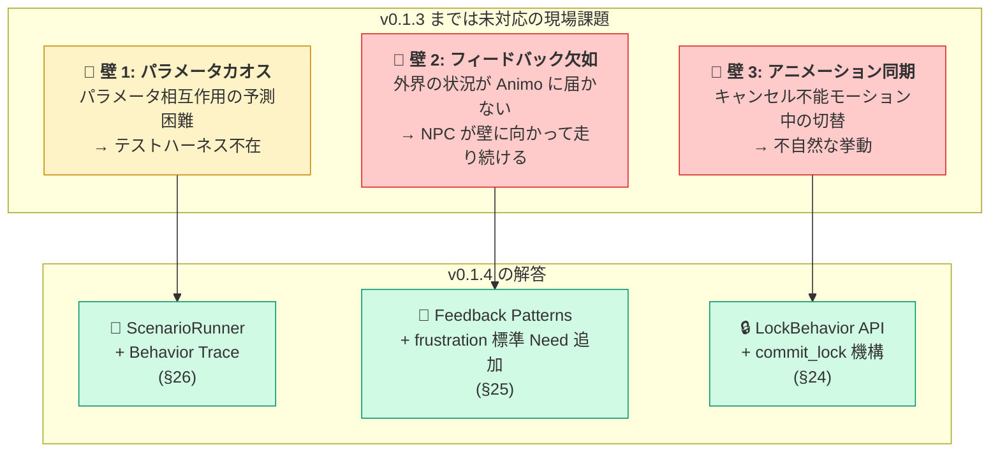

### 3.2 主な変更（破壊的でない・追加のみ）

| 変更 | v0.1.3 | v0.1.4 | 理由 |
|---|---|---|---|
| **Engine API 追加** | — | `Lock(duration, mode)` / `Unlock()` メソッド追加 | 行動ロック機構（壁3） |
| **標準 Need 追加** | 7 個（hunger〜idle） | **8 個（+ frustration）** | フィードバックパターン用（壁2） |
| **新章 §24** | — | 行動ロックとアニメ同期 | 壁3の運用パターン明文化 |
| **新章 §25** | — | Germio フィードバックループ | 壁2の運用パターン明文化 |
| **新章 §26** | — | テストハーネスとシミュレータ | 壁1の運用支援仕様 |
| **Validator** | A000–A029 | **A000–A032**（A030/A031/A032 追加） | 新 Need / 新 API 用 |
| schema_version | `"1.3"` | `"1.4"` | frustration 追加・新フィールド対応 |

### 3.3 後方互換性

**v0.1.4 は v0.1.3 から後方互換**（破壊的変更なし）。

- 既存の `animo.json` (`schema_version: 1.3`) は schema_version の更新だけで動作
- `frustration` Need は追加されたが、JSON で言及しなければ 0.0 として扱われる（既存挙動と同じ）
- `Lock()` API は新規追加。既存ゲームコードに影響なし

### 3.4 Engine API の拡張

```csharp
// 既存（v0.1.3）
public void Live(float dt);
public void Affect(string need, float delta, bool force_reset = false);
public string behavior { get; }

// 🆕 v0.1.4 追加
public void Lock(float duration, LockMode mode = LockMode.Hard);
public void Unlock();
public bool is_locked { get; }
public string locked_behavior { get; }
```

詳細は §24 参照。

### 3.5 標準 Need の拡張

| Need | Tier | 用途 |
|---|---|---|
| hunger | 1 | 生理的欠乏 |
| fatigue | 1 | 生理的欠乏 |
| fear | 2 | 安全 |
| loneliness | 3 | 社会的 |
| confidence | 4 | 承認・自尊 |
| curiosity | 5 | 自己実現 |
| idle | 5 | 常時行動（v0.1.1 追加） |
| **frustration** | **2** | **🆕 v0.1.4 — 行動失敗の蓄積** |

`frustration` を Tier2（fear と同階層）に置く根拠：

- 「失敗の蓄積」は心理的な脅威・不快として作用する
- 上昇すると上位 Need（loneliness / curiosity 等）を抑制する
- マズロー階層では「安全欲求の不充足」と同じ作用機序
- LLM が直感的にスコアを操作できる位置

#### 3.5.1 Need → Tier の Engine 実装契約 (v0.1.5, Q-S16)

§3.5 の表は **単なる文書ではなく**、`Animo.Const` が同じデータを runtime map として公開し、§9.3.4 の `max_lower_tier_intensity` 計算に実データソースを与える。相補的な 2 つの map を提供：

```csharp
// Animo.Const — name キー（起動時用）と index キー（ホットパス用）
NEED_TIER_BY_NAME    : Dictionary<string, int>      // "fear" → 2
NEED_INDICES_BY_TIER : Dictionary<int, int[]>       // 2 → [NEED_INDEX_FEAR, NEED_INDEX_FRUSTRATION]
```

Phase 3 の Engine 実装は `max_lower_tier_intensity` を累積する際、`NEED_INDICES_BY_TIER` から階層メンバシップを読む必要がある。他のソース（`Action.tier` や JSON 提供のカスタム map）から読むと、Q-S16 が塞いだ実装ギャップが再発する。

**非標準 Need**（`STANDARD_NEEDS` にない名前 — 既に A019 Warning として表面化）は `max_lower_tier_intensity` から **除外** される。`NEED_INDICES_BY_TIER` に階層メンバシップを持たないので、上位を抑制することも下位に抑制されることもない。カスタム Need は `influences` と `Action.need` 参照では通常通り扱われるが、マズローのピラミッドの外側に存在する。

**なぜ除外で「デフォルト Tier 5」ではないか：** デフォルト Tier 割り当ては unknown Need を抑制順序の底に黙って置くことになる — 場合によっては正しい（curiosity 風のカスタム Need）が、致命的な誤りも起きうる（hunger 風のカスタム Need は本来全てを抑制すべきなのに）。マズロー参加を望むなら LLM 作者に **標準 Need 名** の使用を強制するのが誠実な契約。カスタム Need は明示的にマズロー外。

**`frustration` は完全参加。** frustration が `influences` 経由のみで使われ（例：§25.5.2 で `fear` を増幅）`Action` を持たない場合でも、`NEED_INDICES_BY_TIER[2]` には残る。よって Tier 3 以上の Action の `max_lower_tier_intensity` は `eff_frustration / 100` を **含み**、frustration の上昇は上位 Action を **実際に抑制する**。これは Gemini-11 の特定の懸念だった；ここの契約で明示する。

#### 3.5.2 `needs_meta` による per-Persona ジャンル Tier 拡張 (v0.1.5, Q-S30)

Q-S16 の「非標準 Need は `max_lower_tier_intensity` から除外」は安全な default だったが、§20.4 の「Animo はジャンル非依存、`needs` キーは自由」と矛盾していた。サバイバルゲームで `oxygen`、`temperature`、`thirst` を独自 Tier 1 欲求として宣言しても、それらは Q-S30 以前は上位 Action（探索・睡眠）を抑制できず、息ができない NPC が呑気に探索していた。

**解決**：Persona/Kind レベルの optional **`needs_meta`** 導入。各エントリは非標準 Need の tier を宣言し、Maslow 抑制に完全な tier 意味論で参加させる：

```json
{
  "agent_id": "survivor",
  "needs": { "oxygen": 80, "temperature": 50, "thirst": 60, "fear": 30 },
  "needs_meta": {
    "oxygen":      { "tier": 1 },
    "temperature": { "tier": 1 },
    "thirst":      { "tier": 1 }
  }
}
```

`needs_meta` は **任意**：
- 標準 Need（`Const.STANDARD_NEEDS` 内）は `needs_meta` エントリを無視 — tier は §3.5 で固定。
- 非標準 Need で `needs_meta` エントリ無し ⇒ Maslow から **除外**（Q-S16 の元の default を維持、v0.1.4 JSON との後方互換性）。
- 非標準 Need で `needs_meta.tier` あり ⇒ 宣言 tier で Maslow 抑制に参加（**その Persona に対してのみ**）。

**per-Persona、グローバルではない。** `needs_meta` は Persona 上に存在（§8.3 で Kind から merge される）；Engine ctor は **per-Persona の** `_need_tier_indices: Dictionary<int, int[]>` を構築し、`Const.NEED_INDICES_BY_TIER` のコピーから始めて `needs_meta` 宣言の非標準 Need をその tier に追加する。静的 `Const.NEED_INDICES_BY_TIER` は共有 default として残る；per-Persona 抑制はローカル map を使う。

**Validator ルール A038**（Q-S30、Q-S41 でスコープ精緻化）：
- **Stage 1**：tier 値が `[1, 5]` 範囲外 → **Error A038**
- **Stage 1**：`needs_meta` エントリが標準 Need の tier を §3.5 と異なる値で上書き → **Warning A038**（§3.5 値が runtime で勝つ；不一致のみ surfacing）
- **Stage 2 (Q-S41 + Q-S49 + Q-S57)**：`needs_meta` エントリの Need が composed `needs[]` *にも* `actions[].need` *にも* `influences[].source/target` *にも* `binding.thresholds[].need` *にも* `rates` キーにも無い → **Warning A038**（本当に orphan の場合のみ）。Q-S41 以前はこのチェックが Stage 1 で動いていたため、汎用サバイバル Kind が `needs_meta { oxygen, thirst, ... }` を宣言すると、子 Persona がその Need の一部しか使わないだけで Warning スパムが起きていた。**Q-S49 訂正**：Q-S41 が `binding.thresholds[].need` を漏らしていた問題を修正 — Threshold で signal-only に Need を使う設計（例：`oxygen` 低下で UI 警告のみ）が orphan 誤検知されていた。**Q-S57 訂正**：`rates` 抜けも修正 — `poison` のように `rates` だけで進行し UI が読む pure-rate Need が orphan 誤検知されていた。

**A019 との相互作用**：A019（Unknown Need Warning、Q-S39 で stage 2 移行）は依然として `STANDARD_NEEDS` にない Need で発火するが、合成後 Persona の `needs_meta` に列挙された名前は suppress される。

**なぜ opt-in でデフォルト割当ではないか**：
- 非標準 Need の tier は意味的に不明確（`jealousy` Need は tier 2 不安なのか tier 4 自我なのか — LLM 作者は知っているが Animo は知らない）。
- デフォルト強制は Q-S16 が懸念した致命例（hunger 風カスタム Need が黙って tier 5 に置かれ抑制しない）のリスク。
- Opt-in は誠実：作者が Maslow 参加を求めるまで沈黙。

**Engine ctor 構築シーケンス（Q-S30 + Q-S27 + Q-S37）**：

Engine ctor は以下のフェーズを **この順序で** 実行しなければならない；任意のペアを逆順にすると 1 つ以上の契約が破綻する：

```csharp
// PHASE A (Q-S27): _need_index 構築 + 標準スロット予約。
//   標準 Need を固定 index 0..7 に；非標準 Need を _persona.needs から
//   index >= 8 に追加。§16.2.2.1 参照。
_need_index = new Dictionary<string, int>();
for (int i = 0; i < Const.STANDARD_NEEDS.Count; i++) {
    _need_index[Const.STANDARD_NEEDS[i]] = i;
}
int next_idx = Const.STANDARD_NEEDS.Count;
// (v0.1.5, Q-S65) `_persona.needs` は `Needs` クラスで、
// `Dictionary<string, float> values` をラップする。Q-S65 以前は
// `_persona.needs ?? new Dictionary<...>` と書いていたが、Needs
// は Dictionary そのものではないので型不一致確定エラー。
// `_persona.needs?.values ?? new Dictionary<string, float>()` で
// values を取り出して foreach する。
foreach (var kv in _persona.needs?.values ?? new Dictionary<string, float>()) {
    if (!_need_index.ContainsKey(kv.Key)) {
        _need_index[kv.Key] = next_idx++;
    }
}
// PHASE A.2 (Q-S30 + Q-S37 cross-check): `needs_meta` にしか出てこない
// Need（作者が tier だけ宣言して `needs` に seed 値を書き忘れた）にも
// index slot が必要 — `_need_tier_indices` がそれを指せるように。
// index >= 8 に default 値 0 で確保。Validator A038 が既に Warning を
// 出している（"`needs` 未宣言"）ので作者には見えている；runtime では
// クラッシュさせるのではなく slot を materialize する。
if (_persona.needs_meta != null) {
    foreach (var meta in _persona.needs_meta) {
        if (!_need_index.ContainsKey(meta.Key)) {
            _need_index[meta.Key] = next_idx++;
        }
    }
}
_effective_needs          = new float[next_idx];
_previous_effective_needs = new float[next_idx];
_needs                    = new float[next_idx];
// (v0.1.5, Q-S65) 上と同じ Needs.values アンラップ。
foreach (var kv in _persona.needs?.values ?? new Dictionary<string, float>()) {
    _needs[_need_index[kv.Key]] = kv.Value;
}

// PHASE B (Q-S37): Action / Threshold インスタンスに need_index を
// 焼き込む（Agent.Awake の DeepCopy 後）。PHASE C **より前** で行わ
// なければ `_need_tier_indices` が `_need_index[meta.Key]` を読めず、
// Action ホットパスも `action.need_index` を正しく読めない。
foreach (var action in _persona.actions ?? new List<Action>()) {
    action.need_index = _need_index[action.need];
}
foreach (var threshold in _persona.binding?.thresholds ?? Array.Empty<Threshold>()) {
    threshold.need_index = _need_index[threshold.need];
}

// PHASE C (Q-S30 + Q-S69): per-Persona `_need_tier_indices` 構築。
// (v0.1.5, Q-S69) フィールドの型は §16.6 通り `Dictionary<int, int[]>`
// （Hot Path で §9.3.4 `max_lower_tier_intensity` ルックアップに
// zero-alloc キャッシュ親和イテレーションが必要 — §16.1 規則）。
// 構築中は `Dictionary<int, List<int>>` のローカル scratch バッファ
// を使う（needs_meta non-standard Need の追加で tier 参加が漸増する
// ため）。PHASE C 末尾で各 List<int> を `new int[]` にスナップ
// ショットして field に finalize する。Q-S69 以前は spec narrative
// で `_need_tier_indices = new Dictionary<int, List<int>>()` と
// 書いていた — §16.6 フィールド宣言と確定型不一致。
var scratch_tier_indices = new Dictionary<int, List<int>>();
// Step 1: 静的 map (Q-S16) からコピー
foreach (var kv in Const.NEED_INDICES_BY_TIER) {
    scratch_tier_indices[kv.Key] = new List<int>(kv.Value);
}
// Step 2 (tier 参加): needs_meta で宣言された非標準 Need を
// scratch_tier_indices に追加。標準 Need は §3.5 が tier に勝つ
// (Q-S30) のでスキップ。
if (_persona.needs_meta != null) {
    foreach (var meta in _persona.needs_meta) {
        bool is_standard = Array.IndexOf(Const.STANDARD_NEEDS, meta.Key) >= 0;
        if (is_standard) continue;   // §3.5 が tier に勝つ (Q-S30)
        // 非標準 Need：tier が scratch_tier_indices に加わる。
        // _need_index[meta.Key] は PHASE A.2 の後なので必ず存在。
        int tier = meta.Value.tier;
        if (!scratch_tier_indices.ContainsKey(tier)) {
            scratch_tier_indices[tier] = new List<int>();
        }
        scratch_tier_indices[tier].Add(_need_index[meta.Key]);
    }
}
// (Q-S69) scratch → field finalize：各 List<int> を int[] に snapshot。
// tier ごと 1 回の alloc が ctor 時のみ；Hot Path イテレーションは
// `int[]` 上 — §16.1 契約を遵守。
_need_tier_indices = new Dictionary<int, int[]>();
foreach (var kv in scratch_tier_indices) {
    _need_tier_indices[kv.Key] = kv.Value.ToArray();
}

// Step 3 (non-tier metadata, Q-S45 + Q-S56 + Q-S66): non-tier NeedMeta
// フィールドを composed Persona の **全 Need** に適用。v0.1.5 の
// NeedMeta は `tier` だけだから ApplyNonTierMetadata は no-op；v0.2 /
// v0.3 の `decay_multiplier` 等のフィールドがここで適用される。
//
// Q-S56 fix：Q-S56 以前は呼出が `needs_meta` foreach 内（Q-S45 の
// "narrow skip"）にあり、作者が needs_meta に明示宣言した Need しか
// 通らなかった。needs_meta を書かない Persona（標準 Need のみ使う
// 合法ケース）では ApplyNonTierMetadata が 0 回も呼ばれず、
// 「全 Need に届く」目的に反していた。Q-S56 はパスを分離：
// `_need_index` の全エントリが `ApplyNonTierMetadata(idx,
// explicit_or_default_meta)` を受ける、`NeedMeta.DefaultFor(name)`
// が default を提供。
//
// (v0.1.5, Q-S66 — Q-S56 自爆訂正) Q-S66 以前はこのループが
// `_composed_persona.needs.Count` と `_composed_persona.needs[idx]`
// と書いていた — `Needs` クラスは `Dictionary<string, float> values`
// をラップしただけで、`.Count` プロパティも整数 indexer も無い。
// Q-S56 が構造書き換え時に自分で導入した確定コンパイルエラー。
// 修正：`_need_index` map を直接 foreach（PHASE A で composed
// needs ∪ needs_meta union から構築済みの「この Engine が知る
// 全 Need」リスト）。各エントリが index を既に持つので脆弱な
// 再導出は不要。
foreach (var entry in _need_index) {
    string need_name = entry.Key;
    int    idx       = entry.Value;
    NeedMeta meta;
    if (_persona.needs_meta != null
        && _persona.needs_meta.TryGetValue(need_name, out var explicit_meta)) {
        meta = explicit_meta;
    } else {
        // Per-Need default: 標準 Need は §3.5 から tier、非標準 Need は
        // engine-default sentinel。v0.1.5 の NeedMeta は `tier` だけ
        // なので default はランタイムコストなしで合成。
        meta = NeedMeta.DefaultFor(need_name);
    }
    ApplyNonTierMetadata(idx, meta);
}
// ApplyNonTierMetadata は v0.1.5 では no-op（NeedMeta が tier だけ）；
// 将来 NeedMeta フィールド追加用の予約点。Q-S48 訂正：このメソッドは
// `Scripts/Engine.cs` 内に private no-op stub として宣言する
// （Q-S45 が呼んでいたが宣言が無かったコンパイルエラーを Q-S48 で塞ぐ）。
// Step 4 (§9.3.4) は `_need_tier_indices` を読む（per-Persona）；
// `Const.NEED_INDICES_BY_TIER`（per-process default）ではない。

// PHASE D (Q-S8 + Q-S23 + Q-S25): _previous_effective_needs と
// Threshold.is_above を spawn Need で 1 度の Step-2 pass を経て seed。
// 詳細は §16.6 の `_previous_effective_needs` 行参照。
```

フェーズ順序は **A（index map + 配列確保）→ A.2（needs_meta-only slot 確保）→ B（Action/Threshold need_index bake、Q-S37）→ C（`_need_tier_indices` 構築、Q-S30）→ D（Threshold seeding、Q-S8/Q-S23/Q-S25）**。任意の入れ替えで少なくとも 1 つの契約が破綻 — 例：A.2 より前に C を実行すると `_need_index[meta.Key]` が needs_meta-only Need でクラッシュ；A より前に B を実行すると焼き込む対象が無い。

### 3.6 Validator 追加ルール

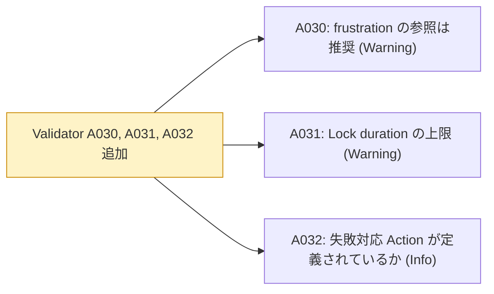

| ID | 内容 | 種別 |
|---|---|---|
| A030 | `frustration` を参照する `actions` または `influences` がない場合（フィードバック設計の欠如疑い） | Warning |
| A031 | `Lock(duration)` の duration が 30 秒を超える（暴走の恐れ） | Warning（実行時） |
| A032 | `actions` の中に `idle` 以外の「失敗時 fallback」となる Action があるか確認 | Info |

### 3.7 Gemini 第四批評の取り込み総括

| 指摘 | 対応 | 反映章 |
|---|---|---|
| 1. パラメータチューニングのカオス | ✅ 採用（テストハーネス仕様化） | §26 |
| 2. フィードバックループの欠如 | ✅ 採用（frustration 追加・パターン集） | §25 |
| 3. アニメーション同期問題 | ✅ 採用（Lock/Unlock API 追加） | §24 |

**Gemini Pro の四度目の批評は、Utility AI というパラダイム自体の運用課題を突いてきた。仕様純度を保ったまま、運用層を厚くすることで応える。**

---

## 4. アーキテクチャ全景

Animo の内部構造を一望する。

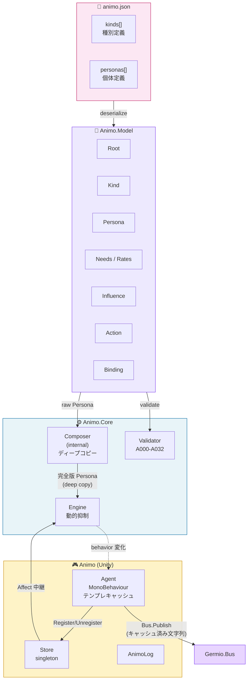

---

## 5. ネームスペース階層と依存方向

**G18 厳守。** 上位は下位に依存できるが、下位は上位を知ってはならない。

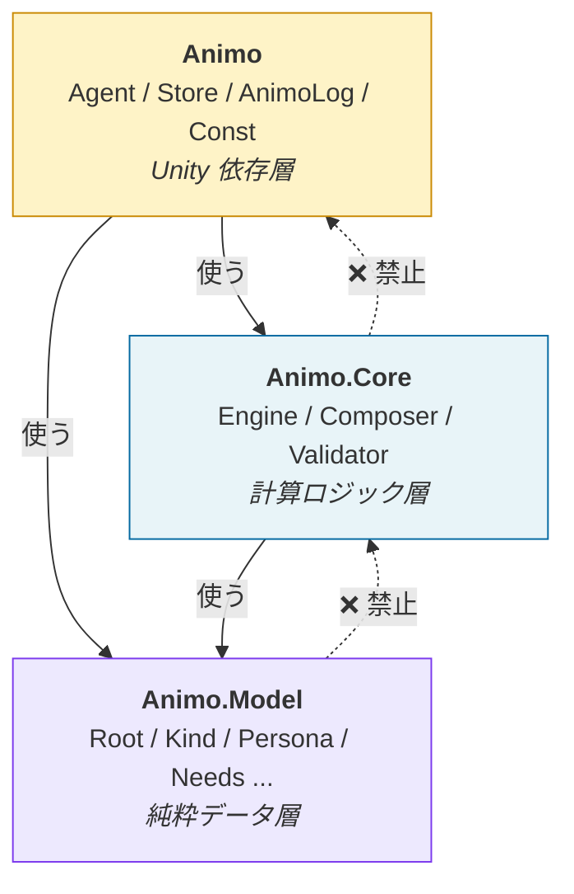

### 5.1 各層の責務

| 層 | 責務 | 依存可能 |
|---|---|---|
| `Animo.Model` | 純粋データクラス。`animo.json` の構造をそのまま表現 | なし |
| `Animo.Core` | 計算ロジック。Unity 非依存でテスト可能 | `Animo.Model` |
| `Animo` | Unity 統合層。MonoBehaviour と Germio 接続 | `Animo.Core` `Animo.Model` |

---

## 6. クラス全一覧

### 6.1 全クラスのカード（v0.1.4）

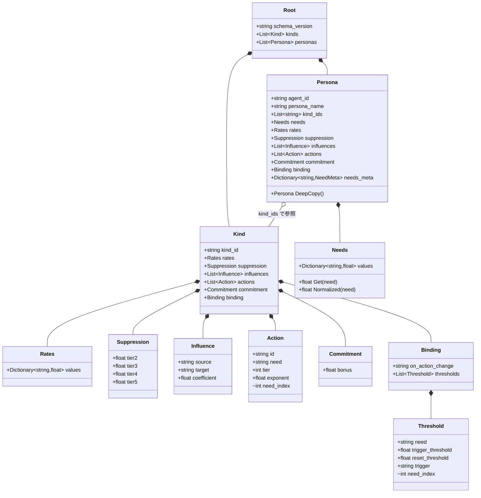

### 6.2 v0.1.0 からの差分

| クラス | 変更 |
|---|---|
| `Action` | `base_score` 削除・`need` 必須化 (v0.1.1)・`internal int need_index` キャッシュ追加 (v0.1.3) |
| `Threshold` | `threshold` → `trigger_threshold` / `reset_threshold` の二段閾値 (v0.1.1)・`internal int need_index` キャッシュ追加 (v0.1.3) |
| `Needs` | ~~`Clamp()` メソッド追加（[0, 100] 強制） (v0.1.1)~~ → v0.1.5 (Q-S63) で削除。v0.1.2 で hot path が flat `float[] _needs` + `Mathf.Clamp` 直接になって以降 dead code だった。 |
| `Hysteresis` → `Commitment` | クラス名変更 (v0.1.3)・`decay` フィールド削除 (v0.1.3) |
| `Engine` | **Lock / Unlock API 追加 (v0.1.4)** |
| `Animo.Tools.ScenarioRunner` | **新規追加 (v0.1.4)** — オフラインシミュレータ |
| `LockMode` enum | **新規追加 (v0.1.4)** — Hard / Soft |

### 6.3 全クラス表

| ネームスペース | クラス | 役割 | 公開度 |
|---|---|---|---|
| `Animo.Model` | `Root` | JSON ルート | public |
| `Animo.Model` | `Kind` | 種別定義 | public |
| `Animo.Model` | `Persona` | 個体定義 | public |
| `Animo.Model` | `Needs` | 欲求の値セット（Clamp 可能） | public |
| `Animo.Model` | `Rates` | 欲求の変化率 | public |
| `Animo.Model` | `Suppression` | 階層抑制係数（動的計算用） | public |
| `Animo.Model` | `Influence` | 欲求間の影響 | public |
| `Animo.Model` | `Action` | 行動定義（need 必須・base_score なし） | public |
| `Animo.Model` | `Commitment` | 行動継続ボーナス（永続） | public |
| `Animo.Model` | `Binding` | Germio との接続 | public |
| `Animo.Model` | `Threshold` | 二段閾値トリガー | public |
| `Animo.Core` | `Composer` | Kind 合成（ディープコピー） | **internal** |
| `Animo.Core` | `Engine` | AI 計算本体（動的抑制 + Lock 機構） | public |
| `Animo.Core` | `Validator` | animo.json 検証（A000–A032） | public |
| `Animo.Core` | `LockMode` | enum: Hard / Soft（v0.1.4） | public |
| `Animo` | `Agent` | MonoBehaviour ラッパー（テンプレキャッシュ） | public |
| `Animo` | `Store` | 全 Agent の窓口（シングルトン） | public |
| `Animo` | `AnimoLog` | ロガー | public |
| `Animo` | `Const` | ドメイン定数 | public static |
| `Animo.Tools` | `ScenarioRunner` | オフラインシミュレータ（v0.1.4） | public |
| `Animo.Tools` | `TraceResult` | シミュレーション結果（v0.1.4） | public |
| `Animo.Tools` | `TraceFrame` | フレーム単位の状態スナップショット（v0.1.4） | public |
| `Animo.Tools` | `AffectEvent` | 時刻指定 Affect 注入（v0.1.4） | public |

---

## 7. animo.json スキーマ

### 7.1 完全版サンプル（v0.1.1）

```json
{
  "schema_version": "1.4",
  "kinds": [
    {
      "kind_id": "goblin",
      "rates": {
        "hunger": 2.0, "fatigue": 1.5, "fear": -2.0,
        "loneliness": 1.2, "confidence": -0.3,
        "curiosity": 0.8, "idle": 0.5, "frustration": -1.0
      },
      "suppression": {
        "tier2": 0.30, "tier3": 0.50, "tier4": 0.70, "tier5": 0.90
      },
      "influences": [
        { "source": "fear",        "target": "confidence", "coefficient": -0.60 },
        { "source": "fear",        "target": "curiosity",  "coefficient": -0.50 },
        { "source": "hunger",      "target": "fear",       "coefficient":  0.25 },
        { "source": "frustration", "target": "fear",       "coefficient":  0.30 },
        { "source": "frustration", "target": "confidence", "coefficient": -0.40 }
      ],
      "actions": [
        { "id": "Flee",       "need": "fear",      "tier": 2, "exponent": 2.5 },
        { "id": "SearchFood", "need": "hunger",    "tier": 1, "exponent": 1.8 },
        { "id": "Rest",       "need": "fatigue",   "tier": 1, "exponent": 1.5 },
        { "id": "Patrol",     "need": "idle",      "tier": 5, "exponent": 1.0 }
      ],
      "commitment": { "bonus": 10 },
      "binding": {
        "on_action_change": "animo_{agent_id}_{behavior}",
        "thresholds": [
          {
            "need": "fear",
            "trigger_threshold": 80,
            "reset_threshold": 70,
            "trigger": "animo_{agent_id}_fear_critical"
          }
        ]
      }
    },
    {
      "kind_id": "scout",
      "influences": [
        { "source": "fear", "target": "confidence", "coefficient": -0.30 }
      ],
      "actions": [
        { "id": "Socialize", "need": "loneliness", "tier": 3, "exponent": 1.3 }
      ]
    }
  ],
  "personas": [
    {
      "agent_id": "goblin_scout_01",
      "persona_name": "Goblin Scout — Timid Skirmisher",
      "kind_ids": ["goblin", "scout"],
      "needs": {
        "hunger": 40, "fatigue": 20, "fear": 55,
        "loneliness": 60, "confidence": 35,
        "curiosity": 45, "idle": 30, "frustration": 0
      }
    }
  ]
}
```

### 7.2 JSON キー一覧（G16 一致）

| C# クラス | JSON キー | 個数 |
|---|---|---|
| `Root` | — | ルートのためキーなし |
| `Kind` | `kinds` | 配列（複数形） |
| `Persona` | `personas` | 配列（複数形） |
| `Needs` | `needs` | オブジェクト |
| `Rates` | `rates` | オブジェクト |
| `Suppression` | `suppression` | オブジェクト |
| `Influence` | `influences` | 配列（複数形） |
| `Action` | `actions` | 配列（複数形） |
| `Commitment` | `commitment` | オブジェクト |
| `Binding` | `binding` | 単数 |
| `Threshold` | `thresholds` | 配列（`binding` 内） |

### 7.3 オプション項目と省略可能性

| キー | 省略可? | デフォルト |
|---|---|---|
| `actions[].need` | ❌ **必須**（v0.1.0 から変更） | — |
| `actions[].base_score` | — **廃止**（v0.1.0 から削除） | — |
| `commitment.bonus` | ✅ | `0.0`（v0.1.3：`commitment` 自体を省略可） |
| `commitment.decay` | — **廃止**（v0.1.3 から削除） | — |
| `binding.on_action_change` | ✅ | エンジン固定 `animo_{agent_id}_{behavior}` |
| `binding.thresholds[].reset_threshold` | ✅ | `Math.Max(0.0, trigger_threshold - 5.0)` (Q-S11; 0 に床を設けて到達不能 reset によるデッドロックを防止 — §12.3.4 参照) |
| `kind_ids` | ✅ | 空配列（合成なし） |
| `persona.rates` 以下のフィールド | ✅ | `Kind` から継承 |

### 7.4 schema_version の更新

`"1.3"` → `"1.4"`。後方互換あり（破壊的変更なし）。`frustration` Need の追加と `Lock` API の追加に対応。詳細は §3 参照。

---

## 8. Kind × Persona カスケーディング

### 8.1 思想：CSS と同じ後勝ちカスケード

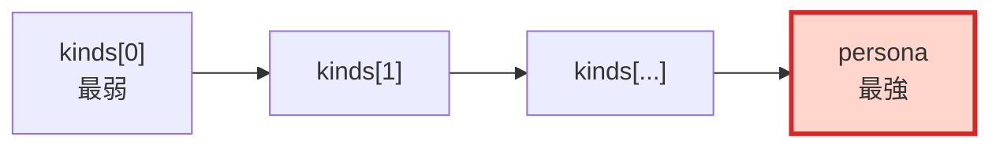

### 8.2 合成ルール（v0.1.1 で明文化）

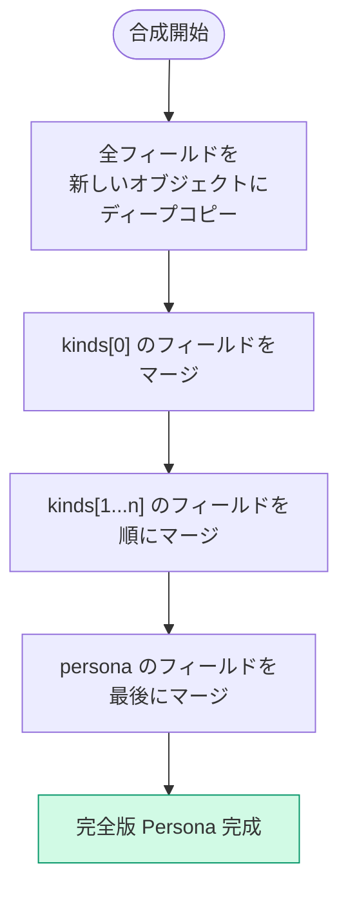

### 8.3 マージ単位の確定（Gemini D-1 対応）

| 対象 | 合成方法 | 備考 |
|---|---|---|
| スカラー値（`commitment.bonus`） | フィールド単位後勝ち | 値が定義されているフィールドのみ上書き |
| オブジェクト（`commitment` 全体） | **フィールド単位後勝ち（深いマージ）** | （v0.1.3 では `commitment` は `bonus` のみだが、将来的に他フィールドが増えた場合に該当） |
| Dictionary（`needs` `rates`） | キー単位で後勝ち | キー単位 |
| 配列（`actions`） | **Persona-first 順序保持の last-wins** (v0.1.5, Q-S19): まず `persona.actions[]` を宣言順でコピー；Persona に同 `id` がない Kind action のみ Kind カスケード順で末尾に追加；Persona に同 `id` がある Kind action は捨てる（Persona 値が勝ち、位置は Persona が固定）。Q-S19 以前は Kind 起点（「既存 `id` 上書き、新規 `id` 末尾追加」）で、LLM が意図したインデックス 0 のデフォルト行動が継承順に黙って押しのけられていた — Q-S9 の宣言順タイブレークと直接矛盾していた。**(Q-S61 design note：Persona は Kind の Action を省略によって削除できない — Persona に id が無い Kind Action は必ず末尾に append される。)** これは意図的：継承は additive、never subtractive — 子 Persona が Kind から継承する場合に、たとえばクリティカルなフォールバック（`Idle` 等）を「言わなかったから」消し去ることを構造的に禁ずる。「Kind A を使うが Action 1 つだけ抜きたい」場合は Kind A_core（その Action なし）と Kind A_extra（その Action あり）に分割し、必要な切片だけ継承する — 削除は JSON authoring 層で reviewable に明示的にする。 | 値の last-wins（Persona 勝ち）、順序の Persona-first、**メンバーシップは additive-only** (Q-S61) |
| 配列（`influences`） | **Persona-first 順序保持の last-wins** (v0.1.5, Q-S20): 上の actions と同じ形 — `persona.influences[]` を宣言順でベースに、Persona に同じ `(source, target)` キーがない Kind influence のみ末尾に追加、衝突する Kind コピーは捨てる。Persona-first 順序付けが §9.6.2 の stable topological sort を決定論にする：独立 Edge は topo sort で順序が確定しないとき、Persona の宣言順にフォールバックする。 | 値の last-wins、順序の Persona-first |
| 配列（`thresholds`） | `(need, trigger_threshold)` 複合キー（float 部は EPSILON 比較）で照合し後勝ち | (v0.1.5, Q-S14 + Q-S43 + Q-S47) — 同じ Need に複数の閾値（例：`fear=50 → "alerted"`、`fear=80 → "panic"`）を共存。**Q-S47 (Q-S43 訂正)**：`trigger_threshold` 部は `Math.Abs(a - b) < THRESHOLD_KEY_EPSILON`（default `0.01f` per Q-S47、Q-S43 の `0.5f` を refine）で比較。Q-S43 の根拠「milestone 間隔は A035 / Q-S15 で 5 以上保証」は category error — A035 の 5 は同 Threshold の trigger と reset の間で sibling threshold trigger 間ではない。`fear=80.0 → alert`, `fear=80.4 → panic` と書いた場合、Q-S43 の広い 0.5f 窓では両方 collapse されてしまう。Q-S47 の 0.01f は IEEE-754 round-trip drift（`~1e-7` at `[0,100]` scale）より 3 桁広く、作者意図の 1/100 単位区別を保持。 |
| Dictionary（`needs_meta`） | Need 名キーで last-wins | (v0.1.5, Q-S30) — Persona の `needs_meta` が Kind の同 Need 名を上書き。Kind が `oxygen` を tier 1 で宣言、Persona がそれを tier 2 にする（強化サイボーグ variant 等）こと可能。 |

#### 8.3.1 Threshold 複合キー EPSILON 比較 (v0.1.5, Q-S43 + Q-S47)

`thresholds` マージの `(need, trigger_threshold)` 複合キーは、float 部分を `Math.Abs(diff) < THRESHOLD_KEY_EPSILON`（= `0.01f` per Q-S47、Q-S43 の `0.5f` を refine）で比較。生 `==` ではない。マージ擬似コード：

```csharp
// Composer.MergeThresholds
const float THRESHOLD_KEY_EPSILON = 0.01f;   // (Q-S47): Q-S43 の 0.5f を refine

bool ThresholdsMatch(Threshold a, Threshold b) {
    return a.need == b.need
        && Math.Abs(a.trigger_threshold - b.trigger_threshold) < THRESHOLD_KEY_EPSILON;
}

// (v0.1.5, Q-S85) 重要: ThresholdsMatch は推移律を満たさない。
// A=80.000, B=80.006, C=80.012 の場合、A≈B (diff 0.006 < 0.01) で
// B≈C (diff 0.006 < 0.01) だが A≉C (diff 0.012 ≥ 0.01) になる。
// 入力順に依存しない決定論的な merge 結果を保証するため、merge
// ループは **first-occurrence-wins** セマンティクスを採用する：
// merge 済みリストを順番に走査し、候補にマッチする **最初の**
// エントリだけを override 対象にする (Persona が Kind に勝つ)。
// 2 つ目以降のマッチは触らない (silent — A039 が validate 時に
// sibling-pair Warning を上げるが、merge はその時点で完了済み)。
// これにより：
//   - 出力決定論性: 同じ入力 → 同じ出力。
//   - Persona 優先順位の維持 (Persona のマッチは常に最初に出会った
//     Kind threshold を override する)。
//   - 推移律違反な EPSILON が「C が A に吸収される vs B が先に
//     処理されたから C は独立」のような順序依存サプライズを生み
//     出さない。
//
// マージループ内で「この Persona threshold は既存 Kind threshold を
// override するか」を判定する際、`Dictionary<(string, float), Threshold>`
// 直引きの代わりに ThresholdsMatch を使う。比較は Persona threshold
// あたり O(N) だが、`thresholds` は実用上常に小さい（≤ 10 程度）ので
// 脆弱な float-keyed Dictionary より安全で安価。
foreach (var p_threshold in persona.binding.thresholds) {
    int found = -1;
    for (int i = 0; i < merged.Count; i++) {   // (Q-S85) first-occurrence wins
        if (ThresholdsMatch(merged[i], p_threshold)) {
            found = i;
            break;
        }
    }
    if (found >= 0) merged[found] = p_threshold;   // Persona が override
    else            merged.Add(p_threshold);
}
```

**Q-S47 根拠の訂正**：Q-S43 が当初 `EPSILON = 0.5f` を採用していた根拠は *「作者の milestone 間隔は A035 / Q-S15 で 5 以上保証」* だったが、Q-S47 はこれが category error であることを発見した：A035 が保証する 5 ギャップは **同じ Threshold の `trigger_threshold` と `reset_threshold` の間** のヒステリシス窓であって、**異なる sibling Threshold の trigger_threshold 同士の間隔ではない**。仕様レベルで sibling-trigger 間隔の保証は無い。LLM 作者が `fear=80.0 → alert`、`fear=80.4 → panic` と書いた場合、Q-S43 の広い `0.5f` 窓では両方が collapse され、意図した隣接 milestone が黙って破壊されていた。

`0.01f` は訂正後の窓：
- **IEEE-754 JSON round-trip drift**（`[0, 100]` scale で `~1e-7`）の **3 桁マージン** — drift では絶対に橋渡しできない。
- **作者意図の区別を 1/100 Need 単位まで保持** — `80.0` vs `80.4` は別物のまま。
- **作者の真の duplicate は正しく collapse** — `80.0` と `80.0001`（同意図、drift 違い）は 1 つに merge（Persona の値が勝つ）。

**新 Validator ルール A039 (Q-S47 補完)**。同 Need の sibling threshold が `1.0f` 以内の場合、Stage 2 で Warning：

```
composed Persona の binding.thresholds[] に対し:
  need でグループ化。
  各グループ内で trigger_threshold 昇順ソート。
  隣接ペアごとに、(next.trigger_threshold - prev.trigger_threshold) <= 1.0f なら:
    Warning A039 発火: "Need `{need}` の sibling threshold が
    trigger {a} と {b} で 1.0f 以内 — 同じ milestone の意図が
    あるかも。区別が意図的なら確認、そうでなければ片方を削除"
```

(v0.1.5, Q-S105: Q-S105 以前の pseudocode は `next.trigger - prev.trigger` と書いていたが、`Threshold.trigger` は `string` 型の event 名フィールドで、`float` の数値フィールドは `trigger_threshold`。Phase 3 で naïve に書き写すと「string から string を引けません」コンパイルエラーになる。Q-S105 で pseudocode 全体を `trigger_threshold` に明示。)

A039 は Warning（Error ではない）。tightly-spaced threshold は意図的なケース（急上昇 stress カーブで `78 → murmur` と `79 → audible_panic` 両方が必要等）もある。1.0f 表面化窓は保守的 — Q-S47 の merge collapse 窓 0.01f より十分広く、典型的な作者 milestone 間隔より十分狭い。silent な中間域（0.01f - 1.0f）は維持し、疑わしいペアだけ作者に表面化する。

### 8.4 オブジェクト合成の具体例

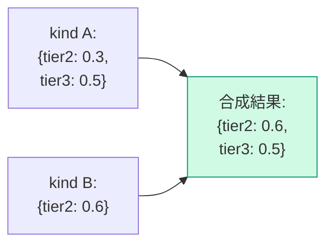

`tier2` のみ上書き、`tier3` は維持。**オブジェクト丸ごと置換ではない。**

### 8.5 配列合成の具体例

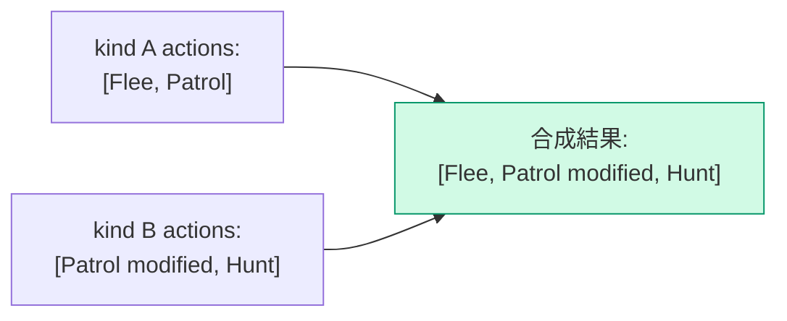

`Patrol` は kind B 版で上書き、`Flee` は維持、`Hunt` が追加。

### 8.6 多重継承の例：「日本人 × A型 × 男性 → 山田太郎」

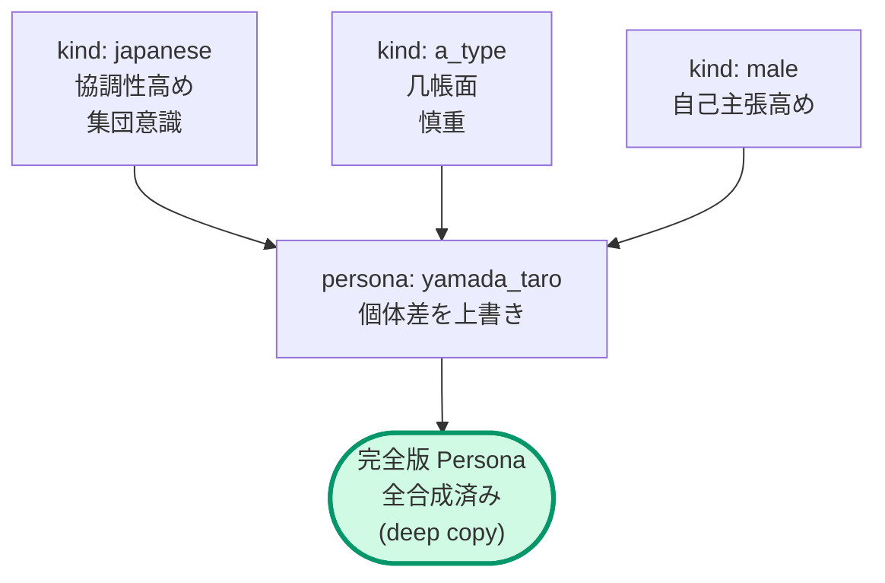

### 8.7 推論と演算の分離

LLM は `kind_ids` の配列順を書くだけ。後勝ちの合成計算は `Composer` が担当する。

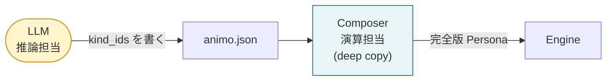

### 8.8 暗黙の Need 初期値（Gemini D-2 対応）

`Kind` の `rates` `influences` `actions` で言及されている Need キーが、`Persona` の `needs` に未定義の場合：

```
未定義 Need キーの初期値 = 0.0
```

ランタイムは Warning（A020a/b/c）を出すが、ゲームは止めない。`Composer` が暗黙的に `needs[missing_key] = 0.0` を生成する。

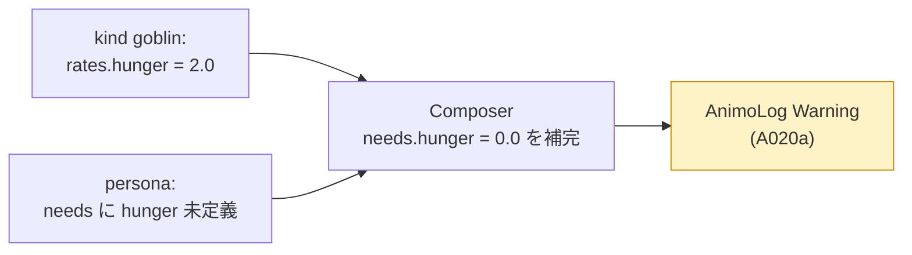

---

## 9. Engine の内部設計

### 9.1 公開 API

| 種別 | 名前 | 内容 | 追加 |
|---|---|---|---|
| コンストラクタ | `Engine(Persona persona)` | `Composer` が生成した完全版 `Persona` を受け取る | v0.1.0 |
| メソッド | `Live(float dt)` | 時間を進める（5ステップ処理）。`dt = 0` は no-op、`dt < 0` と `dt = NaN` は `ArgumentException` を投げる（v0.1.5）| v0.1.0 |
| メソッド | `Affect(string need, float delta, bool force_reset = false)` | 外部刺激を与える（§9.7、§11.3.1）。NaN delta、空文字 / null need は throw、±Inf delta はクランプ、未知 need は Warning + no-op（v0.1.5）| v0.1.0 |
| プロパティ | `behavior` | 現在の行動（string） | v0.1.0 |
| メソッド | `Lock(float duration, LockMode mode = LockMode.Hard)` | 行動ロック（§24）。`duration = 0` は即 Unlock、`duration < 0` は throw、再 Lock は replace（v0.1.5）| **🆕 v0.1.4** |
| メソッド | `Unlock()` | ロック解除。未ロック時は no-op（v0.1.5）| **🆕 v0.1.4** |
| プロパティ | `is_locked` | ロック状態（bool） | **🆕 v0.1.4** |
| プロパティ | `locked_behavior` | ロック中の固定行動（string） | **🆕 v0.1.4** |
| メソッド | `GetNeed(string need)` | 指定 Need の現在値を読む。未知 need は Warning 後 `0.0` を返す。読み取り専用デバッグ API、ホットパスでは使わない（§16.4 のキャッシュ済 `EffectiveNeeds` を使うこと）。 | **🆕 v0.1.5** |

### 9.2 Live() の5ステップ（v0.1.3 改訂、v0.1.4 で Lock 対応、v0.1.5 でタイマー位置確定）

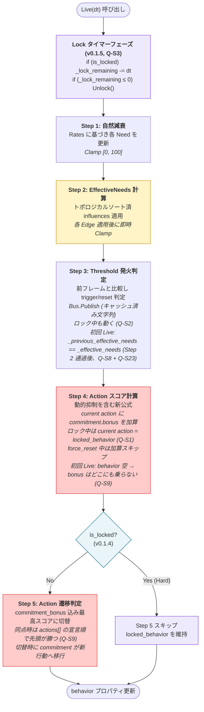

**Lock タイマーフェーズ (T0)** は Step 1 より前、毎フレーム冒頭で動く。減算をフレーム冒頭に固定すると、Step 4 と Step 5 の間の Lock 判定が「このフレームの最新ロック状態」を参照できる。`_lock_remaining` がゼロになった瞬間のフレームで、**同じフレームの** Step 5 が新しい `behavior` を選ぶ — 次の `Live(dt)` を待つ 1 フレーム遅延が発生しない。Zelda スタイルの硬直解除やコンボキャンセル（§20.1）では、この 16.6ms が「もたつき感」の有無を決める。

これにより `Lock(0)` (Q9) の意味論も自然に揃う：`Lock(duration: 0)` は単に `_lock_remaining = 0` を代入するだけ。`is_locked` は **プロパティ `_lock_remaining > 0`**（独立フィールドではない）なので、代入直後の getter は即 `false` を返す — **`Lock` 内で特別な経路は不要**。次回 `Live(dt)` の T0 (Lock timer) は no-op（既に 0）で、ゼロを跨いでいないため `is_locked` のフリップも起きない。Q-S126 以前はこの段落が「次回 `Live(dt)` まで `is_locked` が `true` のまま」とも読め、その読みなら `Lock` 側で `duration == 0` を特別扱いして `Unlock()` を呼ぶ実装が必要に見えた — しかしプロパティ意味論によりそれは不要。(v0.1.5, Q-S126：clarification — 実装契約は不変；`LockEdgeCaseTests.Case01` の「`Lock(0)` 直後に `is_locked == false`」要件はプロパティ意味論で満たされ、特別経路は不要。)

#### 9.2.0a 初回フレーム契約 (v0.1.5, Q-S8 + Q-S9)

`new Engine(persona)` 直後の最初の `Live(dt)` でも 5 ステップは同じく走るが、起動時のみ 2 つの不変条件が適用される：

- **Step 3 (Q-S8 + Q-S23)**: Engine ctor で `_previous_effective_needs` を spawn 時の Need 値を Step 2 に通して seed 済み（§16.5 表）。よって最初の `Live(dt)` で `_previous_effective_needs[i] == _effective_needs[i]`（全 i）が成立する。「このフレームで上昇した」と報告される Need は無く、Threshold が誤発火しない。`fear: 80` で spawn された Persona はシーンロード瞬間に**悲鳴を上げない** — spawn 後の実際の上昇クロスのみが発火させる。Q-S23 はカスケード断絶も塞いだ：Influence による `_effective_needs` の上昇も Threshold を駆動するので、§25.5.3 の frustration→anger チェーンが Bus から見える。
- **Step 5 (Q-S9)**: `behavior` は最初の `Live` 前は `""`（§9.1）。このフレームでは Step 4 の `commitment.bonus` はどの Action にも乗らない（"current action" がまだ存在しない）。全 Action は素のスコアで競争する。**最高スコアに 2 つ以上の Action が並んだ場合（Spawn 時に全 Need が 0.0 であれば全 intensity = 0、全スコア = 0 になり必ずタイ）**、persona の `actions[]` 配列で `id` が**最初に出現する** Action が勝つ。これにより spawn 時の既定行動が決定論的になる：`Idle`（または希望のデフォルト）を `actions[]` のインデックス 0 に置けば良い。

#### 9.2.1 v0.1.2 / v0.1.3 / v0.1.4 の変更点

| ステップ | v0.1.2 | v0.1.3 | v0.1.4 |
|---|---|---|---|
| Step 3 | Hysteresis 減衰（時間） | Threshold 発火判定 | （v0.1.3 と同じ） |
| Step 4 | hysteresis_bonus を加算 | commitment.bonus を加算（force_reset 中はスキップ） | （v0.1.3 と同じ） |
| Step 5 | hysteresis が 0 なら最高スコアに切替 | commitment_bonus 込みの最高スコアに切替 | **`is_locked` のとき Step 5 スキップ**（Lock 機構） |

### 9.3 マズロー動的抑制（v0.1.1 で導入、v0.1.2 で完成、v0.1.3 で参照元明文化）

#### 9.3.1 問題意識（v0.1.0 までの欠陥）

v0.1.0 までの計算式：

```
score = Pow(intensity, exp) × (1 - suppression[tier]) × 100 + base_score + hysteresis_bonus
```

`suppression[tier]` が固定値だったため、「下位欲求が満たされていないと上位が抑制される」というマズロー理論の核心が**機能していなかった**。

#### 9.3.2 v0.1.1 の改訂

`suppression_amount` を下位 Tier の最大正規化 Need に依存させた：

```
suppression_amount[tier] = suppression_factor[tier] × max_lower_tier_intensity
```

しかし v0.1.1 では Hysteresis が抑制の**外側**にあり、**マズロー絶対主義が Hysteresis に乗っ取られる**致命的バグが残っていた。

#### 9.3.3 v0.1.2 の公式

Hysteresis を抑制の**内側**に移動：

```
score = (Pow(intensity, exp) × 100 + hysteresis_bonus) × (1 - suppression_amount[tier])
```

#### 9.3.4 v0.1.3 の最終形 — 参照元の明文化と commitment への対応

`hysteresis_bonus` を `commitment_bonus` に置き換え：

```
score = (Pow(intensity, exp) × 100 + commitment_bonus) × (1 - suppression_amount[tier])
```

そして **`max_lower_tier_intensity` の参照元を明確に EffectiveNeeds に確定**：

```
max_lower_tier_intensity = max(
    eff_needs[tier1 needs] / 100,
    eff_needs[tier2 needs] / 100,
    ...,
    eff_needs[(tier-1) needs] / 100
)
```

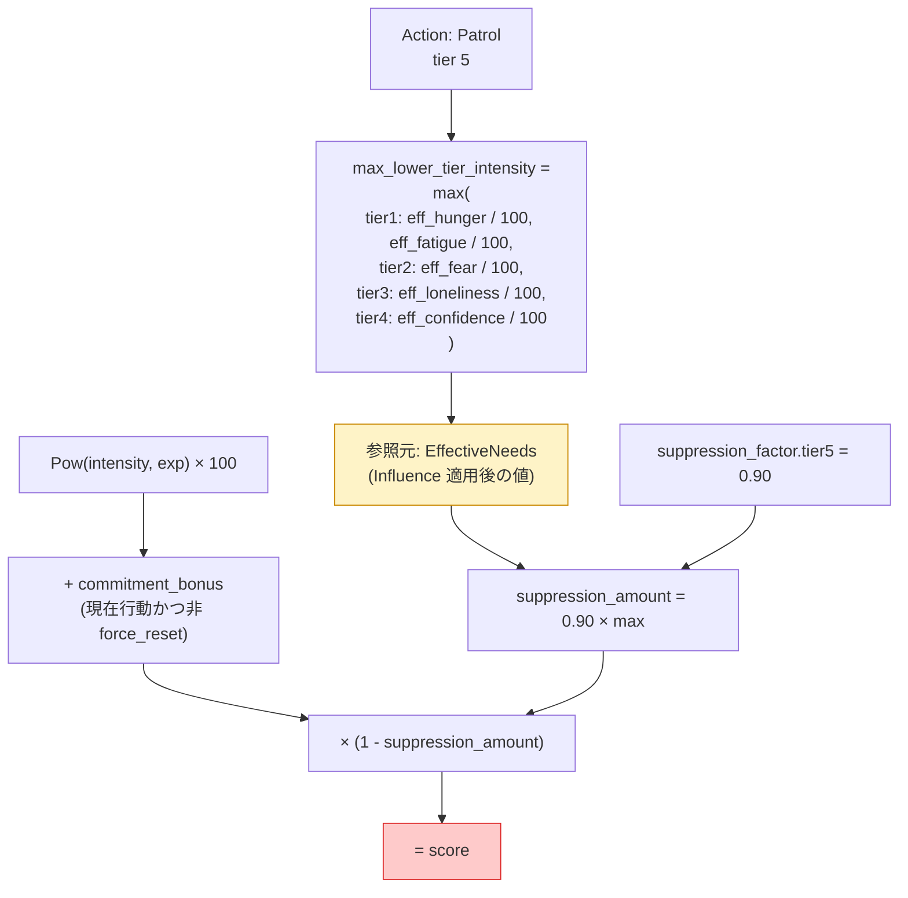

**EffectiveNeeds 参照の根拠：**
- Animo の哲学「最終的な内面が行動を駆動する」と一貫
- スコア計算の `intensity` も EffectiveNeeds を使う（一貫性）
- Influence で増幅された欲求も「現在の内面」として尊重
- 実装者が `_needs` 配列を参照するバグを防ぐ

#### 9.3.5 v0.1.3 公式の動作シミュレーション

`Daydream` (idle, tier=5)、`SearchFood` (hunger, tier=1, exp=1.8)、`commitment.bonus = 50`、`suppression_factor.tier5 = 0.90` の場合：

| 状態 | hunger | idle | suppression_amount | Daydream score | SearchFood score | 選択 |
|---|---|---|---|---|---|---|
| 平和 | 20 | 70 | 0.18 | (70+50)×0.82=98.4 | 6.9 | Daydream ✅ |
| 軽空腹 | 50 | 70 | 0.45 | (70+50)×0.55=66.0 | 32 | Daydream ✅ |
| 本格空腹 | 70 | 70 | 0.63 | (70+50)×0.37=44.4 | 53 | **SearchFood ✅** |
| 餓死寸前 | 100 | 70 | 0.90 | (70+50)×0.10=12.0 | 100 | SearchFood ✅ |

**「腹が減ったら食う」が commitment に邪魔されず自然発火する。マズロー絶対主義が貫かれる。**

#### 9.3.6 Tier1 の特例

Tier1 アクションには下位 Tier がない。`max_lower_tier_intensity = 0` として計算 → `suppression_amount = 0` → 抑制なし。最低限の生命維持欲求は常に発火可能。

### 9.4 Utility スコア計算式の完全形（v0.1.3 確定）

```
score = (Pow(intensity, exponent) × 100 + commitment_bonus) × (1 - suppression_factor[tier] × max_lower_tier_intensity)
```

| 変数 | 取りうる値 | 意味 |
|---|---|---|
| `intensity` | 0.0–1.0 | EffectiveNeeds 後の正規化された欲求強度 |
| `exponent` | 0.1–5.0 | Action の感度曲線形状 |
| `suppression_factor[tier]` | 0.0–1.0 | この tier に適用される最大抑制率 |
| `max_lower_tier_intensity` | 0.0–1.0 | 下位 tier 中の最大正規化 EffectiveNeeds（v0.1.3 で参照元明文化） |
| `commitment_bonus` | 0.0–∞ | 現在選択中 Action にのみ加算される維持ボーナス（永続）。`force_reset` 中は 0 扱い |

`base_score` は v0.1.1 で廃止済み。`hysteresis_*` は v0.1.3 で `commitment_*` に改名。

### 9.5 exponent の感度曲線（Gemini F-1 対応）

#### 9.5.1 数学的事実

`Pow(intensity, exponent)` は intensity が 0–1 のとき、exponent によって曲線が変わる：

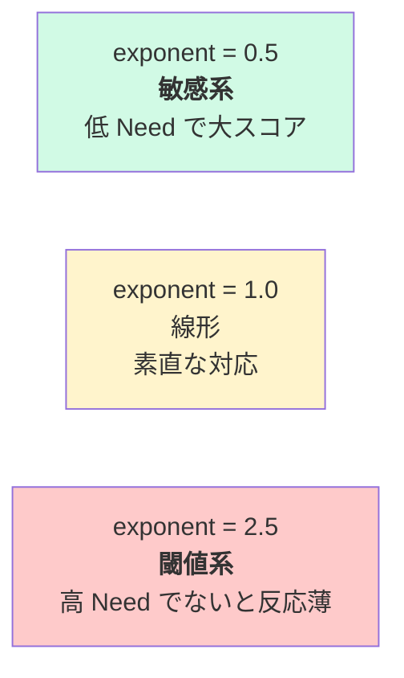

#### 9.5.2 具体的な値の対応

| intensity | exp=0.5 | exp=1.0 | exp=2.0 | exp=2.5 | exp=5.0 |
|---|---|---|---|---|---|
| 0.1 | 0.316 | 0.100 | 0.010 | 0.003 | 0.00001 |
| 0.3 | 0.548 | 0.300 | 0.090 | 0.049 | 0.002 |
| 0.5 | 0.707 | 0.500 | 0.250 | 0.177 | 0.031 |
| 0.7 | 0.837 | 0.700 | 0.490 | 0.410 | 0.168 |
| 0.9 | 0.949 | 0.900 | 0.810 | 0.768 | 0.590 |
| 1.0 | 1.000 | 1.000 | 1.000 | 1.000 | 1.000 |

#### 9.5.3 LLM への意味

| 求める挙動 | exponent の値 |
|---|---|
| すぐ反応する敏感な Action | 0.5 程度 |
| Need に比例（直感的） | 1.0 |
| ある程度高くないと発動しない | 2.0 |
| 限界まで我慢して爆発 | 3.0–5.0 |

このマッピングは章 19「LLM プロンプトのためのチートシート」に詳述。

### 9.6 EffectiveNeeds カスケード（v0.1.2 改訂）

#### 9.6.1 問題：配列順依存バグ（v0.1.0）

v0.1.0 では `influences` を配列順に適用していたため、依存順序によって結果が変わった。

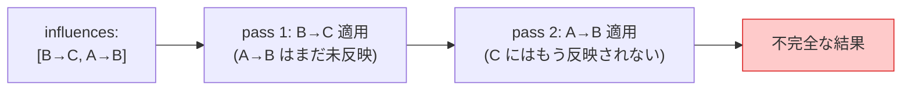

#### 9.6.2 v0.1.2 の解決策（v0.1.1 の反復計算を撤回）

**v0.1.1 の妥協（撤回）：** 循環参照時は3パス反復計算で近似 → 数値解析的に発散・振動する危険があった。

**v0.1.2 の確定方針（v0.1.5 で Q-S20 → Q-S24 で改良）：**

1. **エッジ依存グラフを構築** (v0.1.5, Q-S24): 合成後 `influences[]` の各 `Influence`（Edge）が 1 ノード。すべての Edge ペア `e1`, `e2` について、`e1.target == e2.source` なら半順序制約 `e1 ≺ e2` を追加（`e1` が書く Need を `e2` が読むから、`e1` を先に実行）。**これは Need 依存グラフとは別物** — Need グラフは `source → target` で、トポロジカルソートが返すのは Need の **処理順**。それを使うと同じ `source` を持つ Edge が一括処理されてしまい、異なる `source` を持つ Edge 間の `influences[]` 配列順が黙って粉砕される。Q-S20 の「配列順が決定論キー」という約束は Edge レベルのグラフでしか守れない。
2. **循環検出**：Edge グラフに循環があれば Validator が **Error**（A025）として拒否。実行に到達しない。注：Edge レベルの循環は Need レベルの循環と数学的に等価（Edge 半順序の循環 ⇔ Need source→target の循環）なので、A025 の stage-1 + stage-2 検出（Q-S17）はどちらの定式でも正しく動く。
3. **Stable topological sort over edges** (v0.1.5, Q-S20 + Q-S24): すべての `e1 ≺ e2` 制約を尊重しつつ、依存関係のない Edge 間では合成後 `influences[]` 順序を保つ。合成後順序は §8.3 の Persona-first 規則（Q-S19/S20）で決まるので、LLM が書いた配列順が独立 Edge 間の決定論的タイブレーカーになる。
4. **単一パス適用**：各 Edge を順序通りに適用 — 1 Edge 当たり `_effective_needs[target] += coefficient * _effective_needs[source]` を 1 回。
5. **各 Edge 適用後に即時 Clamp**：中間値を [0, 100] に強制（次節）

```mermaid
flowchart TB
  Start(["合成後 influences[]"])
  Build["エッジ依存グラフ構築<br/>(Q-S24): e1 ≺ e2 ⇔ e1.target == e2.source"]
  Check{"循環あり?"}
  Reject["❌ Validator Error<br/>A025"]
  Topo["edge stable topological sort<br/>(tiebreak: 合成後 influences[] 順)"]
  Loop["各 Edge を順次適用<br/>→ 即時 Clamp"]
  End(["EffectiveNeeds 確定<br/>常に [0, 100]"])
  Start --> Build --> Check
  Check -->|"Yes"| Reject
  Check -->|"No"| Topo --> Loop --> End
  style Reject fill:#fecaca,stroke:#dc2626
  style Build fill:#fde68a,stroke:#b45309
  style Topo fill:#fde68a,stroke:#b45309
  style Loop fill:#fef3c7,stroke:#ca8a04
  style End fill:#d1fae5,stroke:#059669
```

#### 9.6.3 中間 Clamp の重要性（v0.1.2 で明文化）

`A → B (-1.0)`、`B → C (+1.0)` の連鎖で A=100、B=50 のとき：

| Clamp タイミング | B の中間値 | C への影響 | C の最終値 | 評価 |
|---|---|---|---|---|
| 全パス後にだけ | 一時的に -50 | -50 として伝播 | 不当に下がる | ❌ バグ |
| **各 Edge 適用後**（v0.1.2 採用） | 0 にクランプ | 0 として伝播 | 影響なし | ✅ 生物的に正しい |

**根拠：** 「ないもの（負値）」が「あるもの（次の Need）」に影響するのは生物学的に不自然。中間状態の負値は伝播させない。

#### 9.6.4 循環参照の Error 化（v0.1.1 の反復計算を撤回）

`fear → confidence → fear` のような循環は **Validator A025 が Error として拒否**する。

```mermaid
flowchart LR
  A["fear"]
  B["confidence"]
  A -->|"-0.6"| B
  B -->|"-0.5"| A
  Reject["❌ Validator Error<br/>(A025)<br/>JSON 拒否"]
  A --> Reject
  B --> Reject
  style Reject fill:#fecaca,stroke:#dc2626
```

**根拠：**
- v0.1.1 の反復計算は減衰のないループで振動・発散する数学的危険性
- PageRank 流の収束保証（学習率 α）は LLM の認知負荷増・過剰設計
- 循環は人間の感覚としても直感的でない（「A が B を減らし、B が A を減らす」は無限ループ）
- 循環が必要な意図が出てきたら v0.2 で再検討

#### 9.6.4a 独立 Edge 順序と非可換性 (v0.1.5, Q-S20)

トポロジカルソートは依存関係による部分順序を確定するが、独立 Edge の順序は定義しない。中間 Clamp（§9.6.3）と組み合わさると、同じ target Need に書き込む 2 つの Edge は実行順次第で異なる結果を生む：

```
設定: C = 90, X = 100, Y = 100
Edge: X → C (+0.5),  Y → C (-0.5)        // 独立: X→Y も Y→X も依存なし

順序 X → Y:
  X→C 適用: C = clamp(90 + 50)     = 100  (上方向に saturate)
  Y→C 適用: C = clamp(100 - 50)    = 50

順序 Y → X:
  Y→C 適用: C = clamp(90 - 50)     = 40
  X→C 適用: C = clamp(40 + 50)     = 90
```

同じ DAG・同じ入力で **40 単位の乖離**。実装側の topo sort 流派任せだと §26.2 の決定論性（ScenarioRunner 再現性）が崩壊する。

**解決 (Q-S20):** トポロジカルソートを **stable** にする — 合成後 `influences[]` 順序を保つ。合成後順序は §8.3 の Persona-first 規則（Q-S19/S20）で確定するので：

| 順序源 | 確定するもの | 決定論レベル |
|---|---|---|
| 強い依存 Edge (`X → Y → Z`) | `influences` グラフ | 絶対（A025 が stage 1 + stage 2 で循環検出） |
| 独立 Edge のタイブレーカー | 合成後 `influences[]`（Persona-first） | spec のマージ規則上絶対 |
| 最終適用順 | 上を組み合わせた stable topo sort | 絶対 |

LLM が握っているノブはただ一つ：JSON 内の `influences[]` の順序。JSON を並べ替えれば適用順 → 結果も変わる；他のものを並べ替えても変わらない。

**Validator 補完 (A037, §13.1):** 同じ target Need に複数の Edge が書き込む場合は **Warning**：「結果は `influences[]` 順序と中間 clamp に依存する」と通知する。これにより「非可換だが決定論」の状況が LLM 作者に見え、意図的に並べ替えるか構造を変えるかを選べる。

#### 9.6.5 Gemini fix のカスケード修正

`eff` を source にすることで A→B→C の連鎖が機能する（v0.1.0 で取り込み済み）：

```csharp
// ✅ v0.1.0 から導入済み (Q-S116 で Animo.Core no-UnityEngine
//   ポリシーに合わせて訂正 — 下記コメント参照)
float intensity = eff.Normalized(inf.source);
float delta     = inf.coefficient * intensity * eff.Get(inf.source);
// (v0.1.5, Q-S116) Engine は `Animo.Core`（asmdef は
// `noEngineReferences: true`）の中。UnityEngine.Mathf を参照不可。
// hot-path clamp は `System.Math.Clamp`（.NET Standard 2.1 以降の
// BCL）を使う。Q-S116 以前は `Mathf.Clamp(...)` で、Phase 3 実装者が
// literal に書き写すと「name `Mathf` does not exist」コンパイル
// エラー。UnityEngine.Mathf 形式は `Animo` (Unity アダプタ層、
// UnityEngine 参照する) でなら受容可能。
eff.Set(inf.target, System.Math.Clamp(eff.Get(inf.target) + delta, 0f, 100f));
```

### 9.7 Affect() の動作（v0.1.3 で force_reset 再定義）

#### 9.7.1 force_reset の v0.1.3 における正確な意味

```
force_reset: true → 次回 Live() のスコア計算で、現在行動の commitment_bonus を「1 フレームだけ」加算しない。
                    (commitment 自体は破棄せず、保護を一時的に無効化するだけ)
```

**強制切替ではなく「commitment による保護を1フレームだけ無効化する割り込み機能」。**

#### 9.7.2 動作フロー

```mermaid
flowchart TB
  In(["Affect(need, delta, force_reset)"])
  Add["Needs[need] += delta<br/>Clamp [0, 100]"]
  Latch["_force_reset_pending |= force_reset<br/>(OR-latch — 代入ではない)<br/>(Q-S5, v0.1.5)"]
  Step4{"Live(dt) Step 4:<br/>_force_reset_pending?"}
  LockGate{"is_locked?<br/>(v0.1.5, Q-S10 + Q-S13)"}
  Skip["現在行動の commitment_bonus 加算スキップ<br/>(非ロック時のみ — Q-S13)"]
  Reset["Step 4 終了後:<br/>_force_reset_pending = false<br/>(クリアはここ一箇所のみ)"]
  Carry["_force_reset_pending を保持<br/>(Lock を跨いで生存; commitment_bonus は<br/>locked_behavior に通常通り加算 — Q-S13)<br/>(Lock 解除後の初 Step 4 で消費)"]
  Keep["通常通り commitment 加算"]
  End(["Step 5 で純粋スコア競争<br/>(ロック中はスキップ)"])
  In --> Add --> Latch --> Step4
  Step4 -->|"true"| LockGate
  LockGate -->|"非ロック"| Skip --> Reset --> End
  LockGate -->|"ロック中 (Hard / Soft)"| Carry --> End
  Step4 -->|"false (default)"| Keep --> End
  style Latch fill:#e8f4f8,stroke:#0369a1
  style LockGate fill:#fde68a,stroke:#b45309
  style Skip fill:#fef3c7,stroke:#ca8a04
  style Reset fill:#ede9fe,stroke:#7c3aed
  style Carry fill:#fee2e2,stroke:#b91c1c
```

**Q-S13 の読み方：** `LockGate` は `Skip` の **上流** に置かれる
（Phase_2_4_6 では下流だった誤り）。ロック中は commitment-bonus
スキップもラッチクリアも実行されず、Step 4 は実質 `_force_reset_pending == false`
として動作する。これにより §9.7.1 の「**1 フレーム**だけ」契約が
維持される。ラッチは Lock 解除後の最初の Step 4 で初めて消費され、
Skip と Reset がそこで 1 度だけ走る。

#### 9.7.2.1 同フレーム内複数呼び出し時のラッチ契約 (v0.1.5, Q-S5)

1 フレーム内に複数の `Affect` が呼ばれる場合（複数のゲームシステムが Update 内で刺激を発するのは普通）、フラグは **OR-latch セマンティクス**：

```csharp
// Engine.Affect 内部:
_force_reset_pending |= force_reset;      // ✅ OR-latch
// _force_reset_pending = force_reset;    // ❌ 単純代入はバグ
```

後続の `Affect(_, _, force_reset: false)` は **既にラッチされた `true` を絶対にクリアしてはならない**。フラグのクリアは `Live(dt)` 内の Step 4 直後の 1 箇所のみ — **そして engine が非ロックであるときに限る**。Hard / Soft どちらのロック中でもクリアは抑制され、ラッチは Lock 解除後の最初の Step 5 が消費するまで生き残る（§24.4.2 参照）。「このフレームで緊急要求した」が呼び出し順序にも Lock 状態にも依存せず Engine に届く。

このラッチが防ぐ典型的失敗ケース：

```csharp
// Frame N
Store.Instance.Affect(agent_id: "g1", need: "fear",   delta: +30f, force_reset: true);
Store.Instance.Affect(agent_id: "g1", need: "hunger", delta: +5f);   // 通常の tick
// OR-latch なし: hunger 呼び出しが fear の緊急フラグを上書き消去。
// OR-latch あり: 緊急が Step 4 で意図通り発動。
```

#### 9.7.3 force_reset の使い所

| シナリオ | 用法 |
|---|---|
| プレイヤーを発見 | `Affect("fear", +50, force_reset: true)` — 頑固な NPC でも反応 |
| 攻撃を受けた | `Affect("fear", +30, force_reset: true)` — 即時反応 |
| 通常の自然変化 | `Affect("hunger", +5)` — 通常呼び出し（force_reset 不要） |

#### 9.7.4 Animo 哲学との整合

「Affect は内面（Need）への影響であって、行動の決定ではない」という哲学は維持される。`force_reset` は別概念として明確に分離された割り込み機能。**強制的に行動を切り替えるのではなく、「commitment による保護を1フレーム解除する」だけ。** 切替するかどうかは依然として Step 5 のスコア競争に委ねられる。

### 9.8 Commitment の動作（v0.1.3 で永続化）

```mermaid
sequenceDiagram
  autonumber
  participant T as Time
  participant E as Engine
  participant B as behavior
  Note over E,B: behavior = "Patrol"<br/>commitment.bonus = 10 (常時)
  T->>E: Live(dt)
  Note over E: Patrol score に +10 常時加算<br/>commitment は減衰しない
  T->>E: Affect("fear", +50)
  Note over E: Flee score 上昇<br/>(commitment は Patrol に残る)
  T->>E: Live(dt)
  Note over E: Step 4: Patrol score = pure + 10<br/>      Flee score = pure
  Note over E: Step 5: Flee > (Patrol + 10) なら切替
  alt Flee score > Patrol + 10
    E->>E: behavior = "Flee"<br/>commitment が Flee に移行
    Note over E: Flee score = pure + 10 (これ以降)
  else 維持
    Note over E: Patrol 継続
  end
```

#### 9.8.1 v0.1.2 からの変更

| 項目 | v0.1.2 | v0.1.3 |
|---|---|---|
| 名前 | `hysteresis` | `commitment` |
| 時間挙動 | `bonus -= decay × dt` で減衰 | **永続的に固定値**（減衰なし） |
| アンダーフロー対策 | `Max(0, ...)` 必要 | 不要（減衰しないため） |
| 切替時の挙動 | bonus が 0 になっていた場合のみ切替可 | **常に純粋スコアで競争**（commitment 込み） |

#### 9.8.2 真のチャタリング防止（CSS ヒステリシス的構造）

```mermaid
flowchart LR
  PatPat["Patrol中:<br/>Patrol+10 vs Flee"]
  Switch1["Flee score が Patrol+10 を超える"]
  FleeFlee["Flee中:<br/>Flee+10 vs Patrol"]
  Switch2["Patrol score が Flee+10 を超える<br/>(=実質 Patrol 高得点必要)"]
  PatPat -->|"切替条件: +10 差"| Switch1 --> FleeFlee
  FleeFlee -->|"戻り条件: 逆方向 +10 差"| Switch2 --> PatPat
  style FleeFlee fill:#fecaca
  style PatPat fill:#fef3c7
```

これがまさに **Hysteresis の二段閾値構造** を Action 切替に適用したもの。Patrol→Flee は score +10 差で切替、Flee→Patrol は逆方向 +10 差まで戻らない。**真のチャタリング根絶。**

### 9.9 Needs の Clamping（v0.1.2 で完全明文化）

すべての Need の値は **常に [0, 100]** に強制される：

```mermaid
flowchart TB
  Source(["Need への変更が起きる場面"])
  Source --> P1["Live Step 1: rates 適用後"]
  Source --> P2["Affect 呼び出し時"]
  Source --> P3["Composer 合成時"]
  Source --> P4["Influence 各 Edge 適用後<br/>(v0.1.2 で明文化)"]
  P1 & P2 & P3 & P4 --> C["System.Math.Clamp(value, 0, 100)"]
  C --> R(["Need の値が確定"])
  style C fill:#fef3c7,stroke:#ca8a04
  style P4 fill:#fecaca,stroke:#dc2626
```

これによって `Pow(intensity, exp)` の `intensity` が 1.0 を超えてスコアが爆発する事故、および中間 Clamp 漏れによる連鎖伝播バグの両方を防ぐ。

---

## 10. Composer の責務とディープコピー

### 10.1 なぜ専用クラスか

`Engine` は純粋な計算エンジンであるべき。Kind 合成という「変換ロジック」を `Engine` の中に置くと責務が混在する。`Composer` を独立させることで：

- `Engine` が `Root` を知らずに済む
- `Composer` 単体テストが書ける
- 合成ロジックが複雑化しても `Engine` `Store` に影響しない

### 10.2 ディープコピー必須（Gemini E-1 対応）

#### 10.2.1 問題

シャローコピー（参照渡し）で合成すると、複数の Persona が同じ Kind を参照したとき、ランタイムでの内部書換えが他 Persona に伝染する**参照汚染バグ**が発生する。

```mermaid
flowchart LR
  K["kinds[goblin]<br/>actions = [Flee, Patrol]"]
  P1["persona A<br/>(shallow copy)"]
  P2["persona B<br/>(shallow copy)"]
  Bug["A の actions を編集<br/>→ B にも反映！"]
  K --> P1
  K --> P2
  P1 -.->|"❌ 共有参照"| Bug
  P2 -.->|"❌ 共有参照"| Bug
  style Bug fill:#fecaca,stroke:#dc2626
```

#### 10.2.2 解決：ディープコピー

```mermaid
flowchart LR
  K["kinds[goblin]"]
  P1["persona A<br/>(deep copy)<br/>独立インスタンス"]
  P2["persona B<br/>(deep copy)<br/>独立インスタンス"]
  K --> P1
  K --> P2
  style P1 fill:#d1fae5,stroke:#059669
  style P2 fill:#d1fae5,stroke:#059669
```

#### 10.2.3 実装方針

```csharp
internal static class Composer {
    internal static Persona Compose(Persona persona, Root root) {
        // 1. 完全に新しい Persona インスタンスを生成
        // 2. すべての参照型フィールドを new で再生成
        //    - Needs / Rates: new Dictionary
        //    - Influence / Action: new List + 各要素も new
        //    - Suppression / Commitment / Binding: new instance
        // 3. 値型はコピー（C# の値型挙動）
        // 4. kind_ids[] を順に処理。各 Kind のフィールドをマージ
        // 5. 最後に persona 自身のフィールドをマージ
        // 6. needs に未定義キーを 0.0 で補完
        // 7. binding が null ならデフォルトで補完 (v0.1.5, Q-S7 + Q-S12):
        //    new Binding {
        //        on_action_change = Const.DEFAULT_ON_ACTION_CHANGE,
        //        thresholds      = new List<Threshold>()   // Q-S12
        //    } により、Agent.Awake の String Cache (§16.5) が
        //    `binding` でも `binding.thresholds` でもクラッシュしない。
        //    binding 自体は non-null だが thresholds が null（手書き
        //    Persona 経路）の場合も同様に空リストへ正規化する。
        //    Validator A016 は元 JSON の省略を引き続き Warning として通知。
        // 7b. 各 thresholds[i].reset_threshold が null（省略）なら
        //     Math.Max(0.0, trigger_threshold - 5.0) を補完
        //     (v0.1.5, Q-S11)。明示的な負値は A034 で既に却下済み。
        // 8. kind_ids を dedupe（**最後の**出現を保持）(v0.1.5, Q7)
        //    — Validator A033 が Warning。§8.3 後勝ちカスケードを維持。
        // 9. 完全独立した完全版 Persona を返す
    }
}
```

### 10.3 利用フロー

```mermaid
sequenceDiagram
  autonumber
  participant Store
  participant Composer
  participant Engine
  participant Persona as Raw Persona<br/>(JSON 由来)
  participant Root
  Store->>Composer: Compose(persona, root)
  Composer->>Persona: kind_ids 取得
  Composer->>Root: kinds[] から該当 Kind を抽出
  Note over Composer: 配列順に後勝ちで合成<br/>すべてディープコピー<br/>未定義 Need を 0 で補完<br/>未定義 binding をデフォルトで補完 (v0.1.5, Q-S7+Q-S12)<br/>省略 reset_threshold を Max(0, trigger-5) で補完 (Q-S11)
  Composer-->>Store: 完全版 Persona (独立)
  Store->>Engine: new Engine(完全版 Persona)
  Engine-->>Engine: 内部状態を初期化<br/>_previous_effective_needs を spawn Need 値を Step 2 に通して seed (v0.1.5, Q-S8 + Q-S23)
```

### 10.4 公開度

`internal class Composer` — 外部からは見えない。`Store` だけが呼ぶ。

---

## 11. Store API 仕様

### 11.1 役割

`agent_id` をキーに全 `Agent` を保持し、外部から `Affect` を届ける窓口。

### 11.2 仕様一覧

| 項目 | 内容 |
|---|---|
| パターン | シングルトン（v0.1.1 では維持。将来 DI 化を TODO へ） |
| 登録タイミング | `Agent.Awake` |
| 解除タイミング | `Agent.OnDestroy` |
| `Affect` 時 `agent_id` 未発見 | `AnimoLog.Warning` を出して処理継続 |
| `Unregister` 時 `agent_id` 未発見 | `AnimoLog.Warning` を出して処理継続 |
| `Register` 時すでに同インスタンス登録済み | no-op、ログなし（冪等）— v0.1.5, Q-S6 |
| `Register` 時すでに別インスタンスが同 `agent_id` で登録済み | **`AnimoLog.Warning`**、no-op、**最初の登録を保持** — v0.1.5, Q-S6 |
| `Unregister` 時に辞書のエントリが渡された `agent` と異なるインスタンス（`!ReferenceEquals(_agents[id], agent)`） | **`AnimoLog.Warning`、no-op** — v0.1.5, Q-S22（「重複の OnDestroy がオリジナルを暗殺する」防衛、Q-S6 と対称） |
| `Find` メソッド | `internal` — 外部非公開 |

#### 11.2.1 重複 Register が「最初を残す」理由 (v0.1.5, Q-S6)

Unity では `Awake` はシーンロード中に走る。重複登録時に `InvalidOperationException` を投げるとシーンが半初期化状態で停止する危険性がある。一方、サイレントに上書き（last-wins）すると `Affect` は新インスタンスに届きながら、**古いインスタンスの `Update` は陳腐化した `behavior` を駆動し続ける** — 2 つのゴーストが並走するデバッグ困難状態になる。「最初を保持 + Warning」は競争に勝ったエージェントが寿命の間チャンネルを所有し、重複はログで可視化され、シーンは生き残る。これは Store の既存方針「**シーンを絶対に殺さない、異常はログに残す、処理継続**」と整合する。

#### 11.2.2 Unregister のインスタンス同一性検査 (v0.1.5, Q-S22)

Q-S6 の「重複 Register は最初を保持」は、退場経路にも対称な罠を残していた。`Agent A` が先に登録、`Agent B`（同 `agent_id`、別インスタンス）が Q-S6 で却下されたが Unity シーンには残存。`Agent B` がシーンから消えるとき Unity は `B.OnDestroy()` を呼び、そこから `Store.Instance.Unregister(B)` が呼ばれる。素直な実装（`_agents.Remove(agent.agent_id)`）は **稼働中の `Agent A` を指すエントリを辞書から消し去る** — 重複の死がオリジナルの登録を暗殺し、以降 `Affect("goblin_01", ...)` は「agent not found」と警告する一方、`A` は Bus から切断されたゾンビとして動き続ける。

解決：`Unregister(agent)` は削除前に `ReferenceEquals(_agents[id], agent)` を検査する。別インスタンスなら Warning + no-op。オリジナルの登録は保持される。

```csharp
// Animo.Store.Unregister 内
// (v0.1.5, Q-S81) パラメータ型は `IAnimoAgent` であり、具象クラス
// `Animo.Agent` ではない。Q-S81 以前は spec サンプルが具象クラスを
// 書いていたが、`Scripts/Store.cs:42` は
// `public void Unregister(IAnimoAgent agent)` と宣言している —
// 具象クラスで実装すると interface 契約を満たさない別オーバーロード
// になり、IAnimoAgent.Unregister の wire が宙に浮く。Q-S81 で
// spec narrative とコードを interface 形式に統一。
public void Unregister(IAnimoAgent agent) {
    if (_agents.TryGetValue(agent.agent_id, out var existing)) {
        if (ReferenceEquals(existing, agent)) {
            _agents.Remove(agent.agent_id);   // ✅ 同インスタンス: 削除
        } else {
            AnimoLog.Warning(
                $"Unregister called on agent_id '{agent.agent_id}' " +
                $"by a different instance than the one registered. " +
                $"Probably a duplicate from Q-S6's keep-first defense. " +
                $"Original registration preserved (no-op).");
            // ✅ Q-S22: 削除しない — オリジナルを暗殺する経路を塞ぐ
        }
    } else {
        AnimoLog.Warning(
            $"Unregister called on agent_id '{agent.agent_id}' " +
            $"which is not registered. (No-op.)");
    }
}
```

これは Q-S6 と対称：Register は重複侵入から辞書を守り、Unregister は重複退場から辞書を守る。両方とも「辞書が実際に保持しているインスタンス」を確認することで「最初を保持」する。

### 11.3 公開 API

```csharp
// 登録
Animo.Store.Instance.Register(agent: this);

// 登録解除
Animo.Store.Instance.Unregister(agent: this);

// Affect 中継（Germio Executor から呼ばれる）
Animo.Store.Instance.Affect(
    agent_id:    "goblin_01",
    need:        "fear",
    delta:       +30f,
    force_reset: false
);
```

### 11.3.1 Affect 境界契約 (v0.1.5)

`Engine.Affect(string need, float delta, bool force_reset = false)` および `Store.Instance.Affect(...)` リレーは同じ契約に従います：

| 入力 | 動作 | 根拠 |
|---|---|---|
| `need = null` | `ArgumentNullException` を投げる | `#nullable enable` 違反、fail-loud |
| `need = ""` | `ArgumentException` を投げる | API 誤用、fail-loud |
| `need` がこの Persona の合成済み Needs に存在しない | `AnimoLog.Warning` を出して no-op | 実行時の Need 追加は §16.2 のキャッシュを破壊する |
| `delta = float.NaN` | `ArgumentException` を投げる | NaN は次のクランプで Need を汚染し全体に伝染する |
| `delta = float.PositiveInfinity` | 適用してから `100.0` にクランプ | 自然な飽和 |
| `delta = float.NegativeInfinity` | 適用してから `0.0` にクランプ | 自然な飽和 |

クランプは Step 1 と同じ `[0, 100]` クランプで、特別経路はありません。

### 11.4 ライフサイクル

```mermaid
sequenceDiagram
  autonumber
  participant Unity
  participant Agent
  participant Cache as PersonaCache
  participant Store
  participant Engine
  Unity->>Agent: Awake()
  Agent->>Cache: GetComposed(template_id) — Q-S29
  Note over Cache: Validator + Composer は<br/>テンプレートごとに 1 回だけ<br/>(Q-S29 Flyweight)
  Cache-->>Agent: 完全版 Persona (テンプレ、共有)
  Agent->>Agent: テンプレを deep-copy して _composed_persona へ
  Agent->>Agent: agent_id を runtime-unique に上書き<br/>(Q-S28: 例 $"{template_id}_{GetInstanceID()}")
  Agent->>Store: Register(agent: this)
  Note over Store: _agents[agent_id] = agent (各インスタンスが unique)
  Agent->>Engine: new Engine(_composed_persona)
  Engine-->>Engine: 上書き済み agent_id でテンプレ文字列キャッシュ
  Note over Agent: Engine.OnSignal を購読 → Bus.Publish に転送 (Q-S26)
  Agent->>Engine: Live(dt: 0.0f) — Q-S34: 初期 behavior を生成
  Engine-->>Agent: behavior = actions[0] (Q-S9 タイブレーク)<br/>OnSignal 無音 (Q-S31)
  Agent->>Engine: GetExpandedActionTrigger(behavior) — Q-S44 cold-path
  Engine-->>Agent: 例 "animo_goblin_47291_idle"<br/>(template 展開済み — Bus 経路と同 format)
  Agent->>Agent: _animator?.Play(trigger) — 直接 push、Bus 経由しない
  loop 毎フレーム
    Unity->>Agent: Update()
    Agent->>Engine: Live(Time.deltaTime)
  end
  Note over Unity: シーン切替 or オブジェクト破棄
  Unity->>Agent: OnDestroy()
  Agent->>Store: Unregister(agent: this) — Q-S22 instance check
```

#### 11.4.1 なぜ JSON `agent_id` が **テンプレート ID** であって runtime ID ではないか (v0.1.5, Q-S28)

Unity では開発者が同じプレハブから 100 体のゴブリンを Spawn する。各プレハブは同じ `goblin_scout.json` を読む。Q-S28 以前、すべての `Agent` が `Store.Register` を `agent_id = "goblin_scout_01"`（JSON の値そのまま）で呼ぶと、Q-S6「最初を保持」防衛により 99 体が拒否される。ゲーム側の `Affect("goblin_scout_01", ...)` は最初の 1 体にしか届かず、99 体は Bus 切断ゾンビになる。

**解決**：JSON の `agent_id` は **テンプレート / kind レベルの識別子**であり、runtime インスタンス ID ではない。`Agent.Awake` が Register する **前** に runtime-unique な `agent_id` を生成する責任を持つ。推奨形式：

```csharp
// (v0.1.5, Q-S68) Agent クラス宣言は IAnimoAgent を実装しなければ
// ならない — `Store.Register(IAnimoAgent agent)` が `this` を受け取る
// ため。Q-S68 以前は spec narrative で「Animo.Agent : MonoBehaviour」
// とだけ書かれ、IAnimoAgent interface への言及が無かった。
// Awake 内の `Store.Instance.Register(agent: this)` は cannot-convert
// コンパイルエラーになっていた（Agent から IAnimoAgent への暗黙変換
// 不可）。interface 契約（`Scripts/Store.cs` で定義）は
// `string agent_id { get; }` 1 つだけ — composed Persona から
// trivial に実装。
public sealed class Agent : MonoBehaviour, IAnimoAgent {
    [SerializeField] string _persona_template_id = "";
    [SerializeField] Germio.Bus? _bus = null;
    // (v0.1.5, Q-S75) Animator フィールドを host-side View binding 用に
    // 宣言。Q-S75 以前は §11.4.1 Awake step (6) で `_animator?.Play(
    // stateName: trigger)` を呼ぶ（Q-S34 / Q-S44 で初期 behavior を Bus
    // 経由せず直接 Animator に push）が、フィールド宣言が抜けていて
    // 確定コンパイルエラー。SerializeField + nullable Animator? で
    // Inspector からワイヤリングするか、別 View backend（ECS-driven、
    // custom shader 等）を使うために null のままにすることも可能；
    // `_animator?.Play(...)` の null-conditional invocation で
    // Animator 不在時もサイレント no-op になる（NullRef にならない）。
    [SerializeField] Animator? _animator = null;
    Persona _composed_persona = null!;
    Engine  _engine           = null!;

    /// <summary>(Q-S68 + Q-S96) IAnimoAgent.agent_id — runtime-unique 値を
    /// 公開（Q-S28 上書き後）。Store のキーとして使用。Awake step (3)
    /// 後に valid。
    /// (Q-S96) null-safe: `_composed_persona` が null の場合（Awake の
    /// Q-S38 fail-loud catch が step (3) 前で走った場合）"&lt;uninitialized&gt;"
    /// プレースホルダーを返す。null-coalesce 無しでは、Awake 失敗 Agent
    /// の OnDestroy が `Store.Unregister(agent.agent_id)` で NRE を起こし、
    /// Q-S38 の "fail-loud だが scene を生かす" 約束を破ってシーン
    /// アンロード時にクラッシュする。sentinel 文字列は real id と衝突
    /// しない (snake_case 規則は山括弧禁止)、Store.Unregister の
    /// TryGetValue は "agent_id 未登録" の no-op パスに必ず落ちる。</summary>
    public string agent_id => _composed_persona?.agent_id ?? "<uninitialized>";

    // Animo.Agent.Awake (Q-S28 + Q-S34 + Q-S38 + Q-S68 + Q-S111 + Q-S112)
    void Awake() {
        // (v0.1.5, Q-S112) Bus 未配線時に §12.1 契約「1 度 Warning ログ
        // を出してから silent」を実装。Q-S112 以前は §11.4.1 サンプルが
        //   `_engine.OnSignal += signal_id => _bus?.Publish(signal_id);`
        // と書き、`?.` で publish を silent skip するだけだった — しかし
        // §12.1 は authoring 補助 Warning を約束しており、Bus 参照漏れに
        // 開発者が気づけるようにする。`?.` だけでは診断ゼロ；prefab で
        // 配線したつもりが build pipeline 設定で null-strip される
        // ようなケースは、意図的な non-Bus Animo と区別がつかず、
        // Threshold fire が虚空に消える。Q-S112 で Awake 冒頭に 1 回
        // Warning を出して §12.1 契約を遵守。
        if (_bus == null) {
            AnimoLog.Warning(
                $"Agent '{name}' に Germio.Bus が割り当てられていない (§12.1: " +
                "1 度 Warning ログ → silent)。Engine signal は publish されない。" +
                "意図的（non-Germio host 等）なら無視可。");
        }
        Persona template;
        try {
            // (1) Q-S29: テンプレートキャッシュから完全版 Persona を取得
            //     (v0.1.5, Q-S38 + Q-S111) GetComposed は honest 診断のため
            //     2 種類の例外を throw する：
            //       - PersonaCacheNotInitializedException — Bootstrapper
            //         未起動 / 実行順誤り（architectural startup bug —
            //         propagate、fail loud、scene は死ぬのが正解）。
            //       - PersonaTemplateRejectedException — JSON オーサリング
            //         エラー：未知 template_id（Q-S103）または stage-2
            //         検証失敗（Q-S38 fail-loud）— catch して当該 Agent
            //         のみ無効化、scene は継続。
            //     Q-S111 以前は両方とも素の InvalidOperationException で、
            //     Awake が union catch していたため、Bootstrapper 未起動
            //     でも「stage-2 fail-loud」と嘘ログを出していた。ログ
            //     からの原因究明は不可能だった。
            template = Animo.PersonaCache.GetComposed(template_id: _persona_template_id);
        } catch (PersonaTemplateRejectedException ex) {
            AnimoLog.Error(
                $"Agent '{name}' のテンプレ '{_persona_template_id}' は " +
                $"PersonaCache に拒否された (Q-S38 stage-2 fail-loud OR " +
                $"Q-S103 未知テンプレ): {ex.Message}. この Agent を無効化、" +
                "シーン全体は継続。");
            enabled = false;
            return;
        }
        // PersonaCacheNotInitializedException は意図的に catch しない —
        // propagate で Unity が hard scene-load エラーとしてログ、
        // 開発者が Bootstrapper を修正する。これが architectural
        // startup bug への正しい挙動。ここで握ると全 Agent が無効化
        // された scene が原因不明で動かない状態になる。
        // (2) Q-S64: Deep copy — この Agent 専用の可変 Persona を持つ
        //     (PersonaCache が共有 composed テンプレを返すため、
        //     上書き伝播による兄弟破壊を防ぐ)。
        _composed_persona = template.DeepCopy();
        // (3) Q-S28: agent_id を runtime-unique 値で上書き
        //     (Q-S59 警告 — multiplayer / network 決定論)
        //     `GetInstanceID()` は単一 Unity セッション内でのみ unique で、
        //     host 間、シーン再ロード、save/load で安定しない。Bus payload が
        //     client/server 間（または client 間）で一致する必要があるネット
        //     ワーク対応ゲームでは、host adapter は決定論 id source で置換
        //     必須 — 例：NetworkObject.NetworkObjectId、サーバー割当 UUID、
        //     ECS entity id（安定 mapping 付き）。ネットワーク境界を超える
        //     payload では `GetInstanceID()` を使用しない。spec が host-
        //     adapter 層に選択を委ねているのは、まさに multiplayer host が
        //     Engine を fork せずに network-safe 戦略を選べるようにする
        //     ため。
        _composed_persona.agent_id = $"{_composed_persona.agent_id}_{GetInstanceID()}";
        // (4) Q-S22 / Q-S6: ここで Register — 必ず unique
        Animo.Store.Instance.Register(agent: this);
        // (5) Engine 構築
        _engine = new Engine(persona: _composed_persona);
        _engine.OnSignal += signal_id => _bus?.Publish(signal_id: signal_id);
        // (6) Q-S34 + Q-S44: 初期 behavior を生成し、Animator に直接 push する。
        //     Q-S31 沈黙契約が初回 OnSignal を抑制している以上、ここで
        //     Animator を更新しないと NPC は次の behavior 変化が起きる
        //     まで T-Pose する。Bus は経由しない（並列の View 経路）。
        //
        //     (Q-S44 fix) Q-S44 以前は `_animator?.Play(stateName: _engine.behavior)`
        //     で生 Action id（"Flee" 等）を渡していたが、後続フレームは
        //     `binding.on_action_change` テンプレ展開（"animo_goblin_47291_flee"
        //     等）が Bus 経由で届くため、ホストは frame 1 と frame 2+ で
        //     2 種類の state-name 名前空間を扱う羽目になっていた。Q-S44 は
        //     最初の push も同じ展開器を経由するので、ホストには一貫した
        //     payload format が見える。Bus は依然経由しない（Q-S31 維持）。
        //
        //     (v0.1.5, Q-S102) Q-S44 は Animator 分岐については **誤り**。
        //     Unity Animator Controller は **エディタ時点で定義された静的 state 名**
        //     （"Flee", "Idle" 等）を使う — `GetInstanceID()` を含む runtime
        //     展開文字列（"animo_goblin_47291_flee" 等）ではない。展開後の
        //     trigger を Animator.Play() に渡すと、Unity が毎フレーム
        //     "no state named 'animo_goblin_47291_flee'" Warning を出し、
        //     全 NPC が T-pose で凍結する — Q-S44 の "整合性" が逆に
        //     Animator integration を破壊していた。Q-S102 で payload を分離：
        //     **Animator には raw `_engine.behavior` を渡す**（エディタで
        //     作成された Animator Controller state 名と一致）、
        //     `_engine.GetExpandedActionTrigger(...)` は Bus 経路専用に予約
        //     （動的 id がルーティングキーとなり、subscriber は展開済み
        //     payload を欲する場合）。2 つのチャネルは消費者も命名要件も
        //     異なる；Q-S44 が解消しようとした非対称性は **bug ではなく
        //     feature** だった。
        _engine.Live(dt: 0.0f);                                          // 初期 behavior 決定
        _animator?.Play(stateName: _engine.behavior);                    // (Q-S102) raw id — Animator Controller 一致
        // (Step (6) の `Live(dt: 0.0f)` は安全：Step 1 (decay) は dt 倍数
        //  なので dt=0 で needs に変化なし；Step 2-5 は走り初期 scoring
        //  決定を生成。Threshold seed (Q-S8/Q-S25) で偽発火なし。)
    }   // end Awake() (Q-S68: class block continues below)

    // (v0.1.5, Q-S80) フレームごとのチック。Q-S80 以前は §11.4.1
    // のサンプルコードに Awake と OnDestroy しかなく、すべての NPC が
    // Awake で初期 behavior を seed した後、Live(dt) が走らないため
    // 永久にフリーズしていた。Update() が Unity のフレームデルタで
    // engine を駆動する。Threshold 発火（Step 3）→ OnSignal →
    // Bus.Publish；behavior 変化（Step 5）→ OnBehaviorChanged →
    // _cached_action_triggers ルックアップ → Bus.Publish +（任意で）
    // _animator.Play。パイプライン全体がこの一発の呼出から走る。
    //
    // (v0.1.5, Q-S115) Phase 3 で `ITimeProvider` 抽象化を導入予定
    // — constructor-injected（または SerializeField）依存として、
    // Update から `UnityEngine.Time.deltaTime` への hard reference
    // を切り離す。default 実装は `Time.deltaTime` を読み、テストは
    // `Animo.Tests.MiniUnity.MockTime` を裏に持つ実装に差し替え。
    // Q-S115 以前は EditMode テストが `MockScene.Tick(dt)` で
    // `MockTime.deltaTime` を進めても、Agent の `Update()` は
    // それを無視して `UnityEngine.Time.deltaTime`（Play mode 外
    // では 0 / 未定義）を読んでおり、シミュレート時間が止まったまま
    // — 各 Tick が `_engine.Live(0.0f)` を呼んでいた。ここに記す
    // DI 受け入れ点は Phase 3 contract；v0.1.5 stub は引き続き
    // `Time.deltaTime` 直結のままで headless build を壊さない。
    void Update() {
        _engine.Live(dt: Time.deltaTime);   // (Q-S115) Phase 3: ITimeProvider.dt に置換
    }

    void OnDestroy() {
        // (v0.1.5, Q-S96) Awake の Q-S38 fail-loud catch が step (4)
        // Register 前に走った場合の早期 return。このガード無しで
        // Store.Unregister(this) を呼ぶと agent_id getter (Q-S96 で
        // null-safe 化) が "<uninitialized>" を返し、Store は scene-
        // unload 時に毎回 "未登録" Warning を吐く — 動作は正しいが
        // 冗長なログ。早期 return で期待ケースの unload パスは静かに
        // なる。Q-S96 以前は agent_id getter がそのまま
        // _composed_persona.agent_id を読み、Awake 失敗 Agent の
        // OnDestroy が NRE で scene unload を巻き込んでいた。
        if (_composed_persona == null) return;
        Animo.Store.Instance.Unregister(agent: this);   // Q-S22 instance-equality guard
    }
}   // end class Agent
```

**なぜ Agent 層で上書きするか、Engine ctor ではなく**：

- Engine は内容に依存しない；Unity の `GameObject.GetInstanceID()` や他の runtime uniqueness 戦略を知るべきではない。
- 異なるホスト（サーバ side シミュレーション、headless テスト）は異なる戦略（UUID / sequence number / ECS entity id）を使いたい。host-adapter 層（Unity の `Agent`、テストの `ScenarioRunner`）に任せれば、それぞれが自分の戦略を選べる。
- ScenarioRunner も Q-S42 で常時 override を適用する：default で `$"{agent_id}_run_{_seq++}"`、明示指定したい場合は `agent_id_override` 引数で渡す。Q-S42 以前の「1 Persona テストではスキップ」記述は Runner を単一エージェントに hard-code していたので削除。**Q-S50 + Q-S60 訂正**：Q-S42 は当初「Store.Register 衝突回避」を根拠としていたが、`Store.Register(IAnimoAgent agent)` は `IAnimoAgent` 実装を要求し、`ScenarioRunner` は `Engine` を直接 `new` するだけで `IAnimoAgent` 実装ラッパーを持たない（MonoBehaviour ではない）。したがって **`ScenarioRunner` は `Store` と一切関わらない**。Runner は **単一 `Engine _engine` フィールド**（per `Run()` 呼出ごと 1 つ）を持つ — Q-S50 が当初書いた「`Dictionary<string, Engine>` で routing」は v0.1.5 の `Run(string agent_id, ...)` 単一 ID API + 対象 agent 指定無しの `TimedAffectEvent` と不整合（辞書は常に 1 要素 = dead structure）。Q-S60 が v0.1.5 の Runner 内部フィールドを `Engine _engine`（per `Run()` 呼出単一）に固定。`Store` は Unity Agent 専用 registry のまま。Q-S42 の Runner override は別目的に格上げ：`expanded_action_change` Bus payload に per-run 識別子を埋め込んで multi-`Run()` trace の集計時に区別可能にする。v0.2 で multi-agent `Run()` （例：`Run(IReadOnlyList<(string template_id, string agent_id_override)> agents, ...)`）を追加した時、フィールドが override-agent_id キーの `Dictionary<string, Engine>` に変わる — 型は API が変わる時に変える、その前ではない。

**なぜ `{agent_id}` 展開を上書き **後** にするか**：

- Q-S28 以前、Engine ctor のテンプレ文字列 cache（`_cached_action_triggers`、§16.5）は `{agent_id}` を JSON 値で展開していた。Q-S28 後は **先に**上書き → Engine ctor が `_composed_persona.agent_id`（既に runtime-unique）を読む。`animo_goblin_scout_01_47291_flee` のような Bus payload が runtime インスタンス ID を運ぶ。
- 5 ステップ順序（cache → deep copy → override → Register → Engine ctor）が重要：他の順序ではテンプレ ID が Bus シグナルに漏れたり、登録衝突を起こす。

#### 11.4.2 JSON `agent_id` の役割

JSON `agent_id` は **kind-level テンプレート識別子** で、Persona 設計図を unique に識別する — `"goblin_scout"`, `"shopkeeper_npc"`, `"mansion_maid"` のような名前。Validator A002 (snake_case)、A004 (`personas[]` 内 unique) は依然として JSON 層で動く。runtime-unique 接尾辞は host adapter が付与し、JSON には書かない。

### 11.5 Affect 中継の流れ

```mermaid
sequenceDiagram
  autonumber
  participant Germio as Germio.Executor
  participant Store as Animo.Store
  participant Agent
  participant Engine
  Germio->>Store: Affect(agent_id, need, delta)
  Store->>Store: Find(agent_id)
  alt agent が存在する
    Store->>Agent: 該当 Agent 取得
    Agent->>Engine: Affect(need, delta, force_reset)
    Engine-->>Engine: Needs 更新（Clamp [0, 100]）
  else 存在しない
    Store-->>Store: AnimoLog.Warning("agent not found")
    Note over Store: ゲームは止めない
  end
```

---

### 11.6 PersonaCache (Flyweight) — v0.1.5, Q-S29

#### 11.6.1 なぜ JSON parse + Validate + Compose を **テンプレートごと** 1 回にすべきか

Q-S29 以前、§6.3 (Task 4-1-c) は `Agent.Awake` で「JSON parse → Validator → Composer → Engine 構築」を行うとしていた。同じプレハブから 100 体のゴブリンを spawn すると、**JSON parse が 100 回、A000-A037 の重い Validator（DAG 循環検出含む — Q-S17）が 100 回、Composer の deep copy が 100 回**走る。シーンロード時間が爆発する：JSON 内容は spawn ごとに同一なのに。

**解決**：`Animo.PersonaCache` を Flyweight キャッシュとして導入（テンプレ ID =JSON `agent_id` でキー）。Validator / Composer は session 内で **1 回だけ**（テンプレごと）走る。各 Agent は cache から取得 → deep copy で自身の可変状態にする。

```csharp
namespace Animo {
    /// <summary>
    /// v0.1.5 (Q-S29) Flyweight キャッシュ：テンプレ ID ごとに
    /// validate + compose は 1 回だけ。何体 Spawn しても増えない。
    /// 通常の Unity 利用ではスレッドセーフ（Awake は main thread）。
    /// </summary>
    public static class PersonaCache {
        // JSON `agent_id` (Q-S28 のテンプレ識別子) でキーイング
        static readonly Dictionary<string, Persona> _cache = new();
        static Root? _root;
        static ValidationResult? _validation;

        /// <summary>App 起動時に 1 度だけ Root をセット。Validator も走る。</summary>
        public static void Initialize(Root root) {
            _root = root;
            _validation = Validator.Validate(root: root);
            if (_validation.has_errors) {
                AnimoLog.Error(
                    $"animo.json validation で {_validation.errors.Count} 件のエラー。" +
                    $"この Root から Engine を組むと安全でない。");
            }
            _cache.Clear();
        }

        /// <summary>
        /// Compose 1 回 accessor。テンプレごとの初回呼び出しで Composer.Compose、
        /// 以降は cache から返す。呼び出し側は変異前に必ず DeepCopy すること。
        /// </summary>
        public static Persona GetComposed(string template_id) {
            if (_root == null) {
                // (v0.1.5, Q-S111) 別例外型で Agent.Awake の catch が
                // Bootstrapper 未起動を per-template オーサリングエラー
                // と区別できるようにする。
                throw new PersonaCacheNotInitializedException(
                    "PersonaCache.Initialize(root) を起動時に 1 度呼ぶ必要がある。" +
                    "[DefaultExecutionOrder(-1000)] を付けた AnimoBootstrapper " +
                    "MonoBehaviour を初期シーンに配置してください。");
            }
            if (!_cache.TryGetValue(template_id, out var composed)) {
                var raw = _root.personas.FirstOrDefault(p => p.agent_id == template_id);
                if (raw == null) {
                    // (v0.1.5, Q-S103) Q-S103 以前は
                    // `new Persona { agent_id = template_id }` を返却
                    // していたが、空 Persona は actions/influences/binding が
                    // null で Engine ctor が即 NRE。Q-S38 の「fail-loud
                    // だが scene を生かす」約束が破れる。Q-S103 で
                    // distinctive な PersonaTemplateRejectedException を
                    // throw し、Agent.Awake の Q-S111 refined catch が
                    // stage-2 validation 失敗と同じ fail-loud-disable
                    // パスにルーティング。
                    throw new PersonaTemplateRejectedException(
                        $"PersonaCache: agent_id '{template_id}' の Persona なし " +
                        "(animo.json オーサリングエラー — テンプレ id を修正するか " +
                        "Agent の _persona_template_id 参照を削除)。");
                }
                composed = Composer.Compose(persona: raw, root: _root);
                _cache[template_id] = composed;
            }
            return composed;
        }

        public static void ClearForTesting() {
            _cache.Clear(); _root = null; _validation = null;
        }
    }
}
```

#### 11.6.2 Validator は 1 回；stage-2 ルールも 1 回 (Q-S29 + Q-S39 + Q-S41 + Q-S47 + Q-S49 + Q-S57 + Q-S113)

A025（循環検出）と他の stage-2 ルール — **A019**（typo vs composed needs_meta、Q-S39）、A035（post-fill trigger>reset、Q-S15）、A036（合成後 actions[] 非空、Q-S18）、A037（multi-edge same target — Warning、Q-S20）、**A038 の "needs_meta orphan check"**（Q-S41 + Q-S49 + Q-S57 — actions/influences/thresholds/rates 全部見る）、**A039**（sibling threshold proximity — Warning、Q-S47）、**A040**（composed actions[].id 一意性 — Error、Q-S113） — はすべて `PersonaCache.Initialize(root)` で 1 度実行される。A038 の tier 範囲外は Stage 1 で動く。各 `GetComposed(template_id)` は単なる辞書 lookup +（テンプレごと初回のみ）`Composer.Compose` 1 回。コストは起動時に集中、Agent spawn 時は最小。 (v0.1.5, Q-S119: A040 を列挙に追加 — Q-S113 は §13 にルール追加したがこの §11.6.2 narrative 列挙の更新を漏らしていた)

#### 11.6.3 コスト試算

| 操作 | Q-S29 以前 | Q-S29 以後 |
|---|---|---|
| Agent 100 体 spawn | 100 × (JSON parse + Validate + Compose + DeepCopy) | 1 × (Validate) + N × (Compose, N = テンプレ数) + 100 × (DeepCopy) |
| シーンロード時間 (概算) | 100 × ~5-50 ms = 500-5000 ms | ~5-50 ms 一回 + 100 × ~0.1 ms = ~10-60 ms |

DeepCopy は各 Agent 必須（Q-S25 `is_above` や Q-S28 `agent_id` を独立に書き換える）；節約できるのは validate + compose を per-template 化する部分。

#### 11.6.4 Q-S28 との整合

`PersonaCache.GetComposed` はテンプレ Persona をテンプレ `agent_id` で返す。Agent.Awake が DeepCopy + 上書き（Q-S28）。cache 自体は runtime-unique ID を見ない — strictly テンプレ ID でキーイングされるので、100 体のゴブリンが 1 つの cache エントリを共有する。

#### 11.6.5 EditMode テスト独立性 (v0.1.5, Q-S130)

Q-S118 の editor-only ガード (`if (!Application.isEditor || Application.isPlaying) return;`) は cleanup を *Editor-after-Stop* に絞っている — 本番の安全性（DontDestroyOnLoad NPC のシーン遷移生存）には正しい gate。しかし NUnit EditMode test runner はテスト実行中に `Application.isEditor == true && Application.isPlaying == false` を返す。EditMode テストが `AnimoBootstrapper` を `Object.DestroyImmediate` 等で OnDestroy させると、cleanup が走って `Store.Instance._agents` がテスト中に消去 — 別 fixture が Store に Agent を登録していて、テスト順序が不利だった場合 cross-fixture 汚染リスク。解決は **テスト側 discipline で Bootstrapper 側 gating ではない**：

1. `Store` を触る fixture は `[SetUp]` で `Animo.Store.ResetForTesting()` を呼ぶ（共通基底クラス推奨）。前テストの残留に依存せず deterministic。
2. `AnimoBootstrapper.OnDestroy` 自体をテストする fixture（`BootstrapperStoreCleanupTests` 等）は隔離する：別 assembly に分けるか、空 Store を仮定し suite 末尾で実行と documenting。
3. Bootstrapper の editor-only guard は **本番 correctness**；テスト順序のために弱めない。両者の関心は分離可能：Bootstrapper は本番シーン遷移を gate、テストは自分の fixture を SetUp/TearDown で gate。

Q-S130 以前はこの discipline は暗黙だった。Q-S130 で spec-level に格上げ、将来のテスト作者が flaky cross-fixture 失敗を経て再発見しなくて済む。

---

## 12. Binding 動作仕様

### 12.1 Bus への参照

`Agent`（MonoBehaviour）が Inspector で `Bus` を受け取る。`Store` も `Engine` も `Bus` を直接持たない。**Engine は `OnSignal` イベントで外部に発火を通知する（v0.1.5, Q-S26）**；`Agent` は `Awake` で 1 度購読し、ペイロードを `Bus.Publish(signal_id)` に転送する。

```mermaid
flowchart LR
  Inspector["Unity Inspector<br/>_BUS フィールド"]
  Agent["Animo.Agent<br/>(MonoBehaviour)"]
  Engine["Animo.Core.Engine"]
  Bus["Germio.Bus"]
  Inspector -.->|"SerializeField"| Agent
  Agent -->|"Bus.Publish(signal_id)"| Bus
  Engine -->|"OnSignal イベント<br/>(Q-S26)"| Agent
  style Bus fill:#e8d5ff,stroke:#7e3ff2
  style Engine fill:#e8f4f8,stroke:#0369a1
```

`Bus` が `null` のとき：`AnimoLog.Warning` を1回出して以後 Silent。Animo 単体使用も正当なユースケース。

#### 12.1.1 なぜ Engine が Bus 直呼びではなくイベントを raise するか (Q-S26)

Q-S26 以前、§16.5 のサンプルは `_bus.Publish(signal_id: t.expanded_trigger)` を Engine 内で呼んでいた。これは構造的に不可能：§12.1 が「Engine は Bus 参照を持たない」と明記し、`Engine.cs` には Bus フィールドも event も callback delegate も無かった。Threshold 発火は Engine 内に閉じ込められていた。

Q-S26 は欠落していた配線を C# `event Action<string>? OnSignal` として `Engine` に追加する。Engine の 5-step ループは以下のタイミングで raise する：
- **Step 3** が Threshold を発火 (`expanded_trigger` がペイロード)
- **Step 4 / Step 5** が `behavior` 変化を確定 (`_cached_action_triggers` の `expanded_action_change` がペイロード)

`Agent` は `Awake` で 1 度購読する：

```csharp
// Animo.Agent (MonoBehaviour)
void Awake() {
    _engine = new Engine(persona: _composed_persona);
    _engine.OnSignal += signal_id => _bus?.Publish(signal_id: signal_id);
    Animo.Store.Instance.Register(agent: this);
}
```

Engine は pure C# を保つ — 知っているのは `string` ペイロードだけで、`Germio.Bus` を知らない。テストは `MockBus` 風リスナーを `engine.OnSignal` に直接購読でき、Bus / Agent に触れる必要が無い。

### 12.2 on_action_change の発火（テンプレキャッシュ）

#### 12.2.1 問題：毎フレーム文字列生成 GC

v0.1.0 では behavior 変化のたびに `string.Format` でテンプレを展開していた。これは GC スパイクの原因。

#### 12.2.2 v0.1.1 の解決：起動時キャッシュ

```mermaid
sequenceDiagram
  autonumber
  participant Awake as Agent.Awake
  participant Cache as 文字列キャッシュ
  participant Engine
  participant Bus
  Awake->>Awake: 全 Action ID を列挙
  Awake->>Cache: 各 Action 用に展開済み文字列を作成
  Note over Cache: "animo_goblin_01_flee"<br/>"animo_goblin_01_patrol"<br/>...
  loop 毎フレーム
    Engine-->>Awake: behavior 変化
    Awake->>Cache: 即時取得（O(1)）
    Cache-->>Awake: キャッシュ済み文字列
    Awake->>Bus: Publish(cached)
  end
```

**毎フレームの文字列生成ゼロ。** Bus.Publish に渡す文字列は事前計算済み。

### 12.3 thresholds の発火（v0.1.1 ヒステリシス追加）

#### 12.3.1 問題：チャタリング（Gemini I-3 対応）

v0.1.0 は単一閾値 `threshold: 80` のみ。値が 79.9 ↔ 80.1 を行き来すると毎フレーム発火する。

#### 12.3.2 解決：二段閾値

```mermaid
stateDiagram-v2
  [*] --> Below
  Below --> Below : need < trigger_threshold
  Below --> Above : need >= trigger_threshold (発火!)
  Above --> Above : need > reset_threshold
  Above --> Below : need <= reset_threshold (リセット)
  note right of Above : Bus.Publish 1回のみ
  note right of Below : 再発火可能
```

`trigger_threshold = 80`、`reset_threshold = 70` のように設定すると、80 以上で発火、70 以下に下がるまで再発火しない。

##### 12.3.2.1 実装契約：Threshold ごとに 1bit の状態 (v0.1.5, Q-S25)

上の状態機械は **Below / Above の 2 状態を持つ → Threshold ごとに 1 bit のメモリが必要**。Q-S25 以前、これは `Scripts/Data.cs` から欠落していた — `Threshold` には `is_above` フィールドがなく、`Engine` にも `_threshold_states` 配列がなかった。素朴なクロス検出（`prev < trigger && curr >= trigger`）は `trigger` 周辺でチャタリングする：`trigger=80, reset=70` の Need が 75 ↔ 85 を振動すると、`reset=70` まで一度も下がらないのに毎回上方クロスで発火する。`reset_threshold` は **死にコード** となり、A023 / Q-S11 / A035 の reset 側保証は装飾になり、§12.3.1 の旧チャタリングバグが裏口から復活する。

Q-S25 は `Threshold` に `internal bool is_above` を追加。Step 3 がブランチごとに状態を読み書きする（§12.3.2 の mermaid そのまま）：

| 分岐 | 条件 | 動作 |
|---|---|---|
| Below 状態、上方クロス | `!is_above && curr >= trigger_threshold` | `is_above = true`、`OnSignal(expanded_trigger)` 発火 |
| Below 状態、低位継続 | `!is_above && curr < trigger_threshold` | no-op |
| Above 状態、reset 以下に下落 | `is_above && curr <= effective_reset_threshold` | `is_above = false`（**発火しない**、再武装のみ） |
| Above 状態、高位継続 | `is_above && curr > effective_reset_threshold` | no-op（重複発火を抑制） |

`effective_reset_threshold = reset_threshold ?? Math.Max(0f, trigger_threshold - 5f)` (Q-S11 の床)。

`is_above` は Engine ctor が spawn 時の `_effective_needs` を読んで seed する（Q-S8 + Q-S23 で `_previous_effective_needs` を seed する同じ Step 2 通過パスを使う）：spawn 時の effective Need が `trigger_threshold` 以上なら `is_above = true` で開始し、最初の `Live(dt)` で **発火しない**（§12.3.2 の契約：「再発火可能」が rest 状態であって、spawn 時に既に trigger を超えている場合の状態ではない）。これは Q-S8 の「初回フレームに偽発火しない」目標と Q-S25 の状態機械正確性を統一する。

#### 12.3.3 JSON 構造の変更

```json
{
  "thresholds": [
    {
      "need": "fear",
      "trigger_threshold": 80,
      "reset_threshold": 70,
      "trigger": "animo_{agent_id}_fear_critical"
    }
  ]
}
```

`reset_threshold` 省略時のデフォルトは `Math.Max(0.0, trigger_threshold - 5.0)` (v0.1.5, Q-S11)。

#### 12.3.4 なぜ `Math.Max(0, ...)` の床が必要か (v0.1.5, Q-S11)

Need 値は常に **`[0, 100]`** に Clamp される（§9.9）。もし
`reset_threshold` が `0` 未満を許容してしまうと、§12.3.2 の状態機械は永続的な `Above` トラップに入る：例えば `trigger_threshold: 3.0` で一度発火した Need の reset デフォルトは `-2.0` になるが、`Math.Clamp(need, 0, 100)` は値が `-2.0` まで下がることを許さない — 結果としてトリガは二度と再装填できない。

`0.0` の床により、Need が `0` まで下がれる限り Threshold は **常に再装填可能** になる：

| `trigger_threshold` | 計算上のデフォルト | 床適用後 (Q-S11) |
|---|---|---|
| `80.0` | `75.0` | `75.0` |
| `10.0` | `5.0` | `5.0` |
| `5.0` | `0.0` | `0.0` |
| `3.0` | `-2.0` ❌ 到達不能 | **`0.0`** ✅ 完全減衰で到達可能 |
| `1.0` | `-4.0` ❌ 到達不能 | **`0.0`** ✅ 完全減衰で到達可能 |

**併設 Validator ルール：** ユーザーが JSON で明示的に `reset_threshold < 0` を書いた場合は **A034 Error**（§13.1）として却下する。Composer の床は **省略時** にのみ適用され、JSON にタイプ済みの負値は LLM 作者のタイプミスとして表面化する（黙ってでも修正しない）。

**併設 Validator ヒント：** ユーザーが明示的に `reset_threshold == trigger_threshold` を書いた（hysteresis ギャップなし）ケースは、A023（§13.1）が既に発火する — A023 は厳密に `trigger_threshold > reset_threshold` を要求するため。このケースに新ルールは不要。

### 12.4 テンプレート許容プレースホルダ

| ルール | フィールド | 許容プレースホルダ |
|---|---|---|
| A014 | `binding.on_action_change` | `{agent_id}` `{behavior}` |
| A015 | `thresholds[].trigger` | `{agent_id}` |

固定文字列（プレースホルダなし）も許容。

### 12.5 テンプレート展開フロー

```mermaid
flowchart TB
  T["テンプレ:<br/>animo_{agent_id}_{behavior}"]
  V1["agent_id = goblin_01"]
  V2["behavior = flee"]
  R["展開結果:<br/>animo_goblin_01_flee<br/>(Awake で事前計算)"]
  T --> R
  V1 --> R
  V2 --> R
  R -->|"Bus.Publish"| Germio["Germio ルール発火"]
  style R fill:#d1fae5,stroke:#059669
```

---

## 13. Validator ルール A000–A039

### 13.1 全ルール一覧

| ID | 内容 | 種別 | v0.1.1 で追加・変更 |
|---|---|---|---|
| **A000** | `schema_version` が存在し空でない | Error | — |
| **A001** | `personas` が存在し空でない | Error | — |
| **A002** | `persona.agent_id` が snake_case・空文字禁止・重複なし・128文字以下 | Error | — |
| **A003** | `kind.kind_id` が snake_case・空文字禁止・重複なし・128文字以下 | Error | — |
| **A004** | `persona.kind_ids` の全要素が `kinds` に存在する | Error | — |
| **A005** | `needs` の全値が 0.0 以上 100.0 以下 | Error | — |
| **A006** | `suppression` のキーが `tier2`–`tier5` のみ・値が 0.0 以上 1.0 以下 | Error | — |
| **A007** | `actions[].tier` が 1 以上 5 以下 | Error | — |
| **A008** | `actions[].exponent` が 0.1 以上 5.0 以下 | Error | — |
| **A009** | `actions[].id` が空文字でない | Error | — |
| **A010** | `thresholds[].trigger_threshold` が `(0.0, 100.0]`（厳密に正、≤100）。v0.1.5 Q-S15 で `trigger == 0` の抜け穴を塞いだ — Need clamp 下限 0 で 0-trigger は Need が 0 に張り付く間ずっと毎フレーム発火し続ける（reset_threshold の床（Q-S11）に関係なく）。 | Error | v0.1.5 で範囲縮小（Q-S15） |
| **A011a** | `kind_ids` なしのとき Persona 単体で `actions` が最低1つ | Error | — |
| **A011b** | `kind_ids` ありのとき `actions` は省略可 | — | — |
| **A012** | `influences[].coefficient` が -1.0 以上 1.0 以下 | Error | — |
| **A013** | `rates` のキーが `needs` のキーのサブセット | Warning | — |
| **A014** | `binding.on_action_change` のプレースホルダが `{agent_id}` / `{behavior}` のみ | Error | — |
| **A015** | `thresholds[].trigger` のプレースホルダが `{agent_id}` のみ | Error | — |
| **A016** | `binding` がない。Composer は §7.3 のエンジン既定値（`animo_{agent_id}_{behavior}` 等）で補完するので合成後の内部状態は常に non-null（v0.1.5, Q-S7）。 | Warning | — |
| **A017** | ~~`hysteresis.bonus` が `hysteresis.decay` 以下~~ | **廃止** | **🪦 v0.1.3 で廃止**（`decay` フィールド消失） |
| **A018** | `agent_id` / `kind_id` が 128 文字以下（A002/A003 に統合） | Error | — |
| **A019** | 未知 Need 名が標準8欲求に類似（タイポ疑い）。**(v0.1.5, Q-S39 + Q-S124)** **stage 2** で動作（合成後 Persona に対して）。Stage 1 ではない。理由：Kind 単体の stage-1 評価では Persona 側に宣言された `needs_meta` が見えず、ジャンルカスタム Need（oxygen 等）が誤検知される。Stage 2 評価なら merged `needs_meta` を読めるので、`needs_meta` に列挙された名前は A019 を suppress する。**(Q-S124)** Need 名収集対象は A038「in use」チェックと同じ union：`needs[]` ∪ `actions[].need` ∪ `influences[].source/target` ∪ `binding.thresholds[].need` ∪ `rates.keys()`。Q-S124 以前は A019 が `needs[]`/`actions`/`influences` のみ scan、`binding.thresholds[].need`（Q-S49 拡張）や `rates`（Q-S57 拡張）にしか登場しないタイポ Need 名が A019 を素通り。皮肉にも A038 が育ったのと同じ穴を A019 で再現していた。 | Warning | **変更**（v0.1.4 で 8 欲求拡張、v0.1.5 で stage 2 移行 — Q-S39、coverage 拡張 Q-S124） |
| **A020a** | `kind.rates` キーが参照 Persona の `needs` に存在しない | Warning | — |
| **A020b** | `kind.influences` source/target が参照 Persona の `needs` に存在しない | Warning | — |
| **A020c** | `kind.actions[].need` が参照 Persona の `needs` に存在しない | Warning | — |
| **A021** | `schema_version` が `"1.3"` または `"1.4"` のみサポート | Error | **変更**（1.4 後方互換） |
| **A022** | `actions[].need` が必須 | Error | v0.1.1 |
| **A023** | `thresholds[].trigger_threshold > reset_threshold` | Error | v0.1.1 |
| **A024** | `idle` Need を使う Action の tier が 5 でない | Warning | v0.1.1 |
| **A025** | `influences` に循環参照あり。Stage 1（raw）と Stage 2（composed）の **両方** で実行（v0.1.5, Q-S17）。Stage 1 は raw `kinds[]` / `persona.influences[]` に対する早期警告。Stage 2 は Composer 合成後の `influences` グラフを再構築し、Kind × Persona の重ね合わせだけで生成される「ゴーストサイクル」（例：Kind `fear→confidence` + Persona `confidence→fear`）が runtime に逃れないよう Error で弾く。 | **Error** | v0.1.2 で重大化、v0.1.5 (Q-S17) で stage-2 追加 |
| **A026** | Utility 公式の `commitment_bonus` は抑制内側で計算（v0.1.3 公式） | — | **変更**（hysteresis → commitment） |
| **A027** | Influence 適用時に各 Edge 後に Need を Clamp する（v0.1.2 仕様） | — | v0.1.2 |
| **A028** | `commitment.bonus < 0` は Error、`> 30` は Warning（ロックイン懸念）、上限は `50`（v0.1.5 で範囲制約化） | Error / Warning | v0.1.3、v0.1.5 で範囲化 |
| **A029** | `commitment` 省略 かつ `actions` が 2 個以上のとき Warning（チャタリング懸念） | Warning | v0.1.3 |
| **A030** | `frustration` を参照する `actions` または `influences` が一切ない（フィードバック設計の欠如疑い） | Warning | **🆕 v0.1.4** |
| **A031** | `Lock(duration)` の duration が `LOCK_DURATION_WARN_THRESHOLD` (30秒) を超える | Warning（実行時） | **🆕 v0.1.4** |
| **A032** | `idle` 以外に「失敗時 fallback」となる低 tier Action があるか（推奨確認） | Info | **🆕 v0.1.4** |
| **A033** | `kind_ids` に重複 ID あり。Composer は dedupe（**最後の**出現を保持して §8.3 後勝ちカスケードを維持）し継続。 | Warning | **🆕 v0.1.5** |
| **A034** | `binding.thresholds[].reset_threshold < 0`（ユーザーが JSON で明示した負値）。Composer の省略時補完は床 `0` を適用するが（§12.3.4）、明示された負値はタイプミスとして却下。 | **Error** | **🆕 v0.1.5 (Q-S11)** |
| **A035** | Composer が省略 `reset_threshold` を補完した後、`(trigger_threshold, reset_threshold)` ペアが厳密に `trigger > reset` を満たすこと。raw JSON しか見ない A023 と範囲しか見ない A010 では捕捉できない `trigger == reset` の残存ケースを捕捉。**ポスト合成検査**（§13.2 stage 2）として実行。 | **Error** | **🆕 v0.1.5 (Q-S15)** |
| **A036** | Composer カスケード後、Persona ごとの `actions[]` リストが空であってはならない。Stage 2 Error。Persona が `actions` を省略し、空 `actions[]` の Kind を `kind_ids` で参照したケース（A011b で stage 1 を通過）を捕捉 — 合成結果が `[]` だと Engine の Step 5 タイブレーク（Q-S9；Q-S52 で固定された for-loop、Q-S52 以前 narrative は `actions.First(...)`）が初回 `Live(dt)` で `InvalidOperationException` を投げる。Q6 の「A011a が post-composition もカバーする」主張は構造的に偽だった（A011a は stage 1 のみ）；A036 がそのアーキテクチャギャップを塞ぐ。 | **Error** | **🆕 v0.1.5 (Q-S18)** |
| **A037** | `influences[]` の 2 つ以上のエントリが同じ target Need に書き込む。中間 Clamp（§9.6.3）と組み合わせると、衝突する Edge の適用順が結果に影響する — 順序は合成後 `influences[]` 列（Q-S19/S20 の Persona-first）で決定的に固定されるが、LLM 作者が「順序を変えると結果が変わる」と気付かない可能性。Error ではなく Warning：設定自体は合法かつ決定的；これは「気づきの一押し」ルール。 | Warning | **🆕 v0.1.5 (Q-S20)** |
| **A038** | `needs_meta[need].tier` 検証 (Q-S30 + Q-S41 + Q-S49 + Q-S57)。**Stage 1 (raw, per-Persona/Kind)**：tier が `[1, 5]` 範囲外 ⇒ **Error**。**Stage 2 (合成後)**：`needs_meta` エントリの Need が composed `needs[]` *にも* `actions[].need` *にも* `influences[].source/target` *にも* `binding.thresholds[].need` *にも* `rates` キーにも無い ⇒ **Warning** (本当に orphan の場合のみ)。**Stage 1**：標準 Need の tier を §3.5 と異なる値で上書き ⇒ **Warning**（§3.5 値が runtime で勝つ）。"in use" 集合は段階的に拡大した：Q-S41 で `needs[]` 超え、Q-S49 で `binding.thresholds[].need` 追加、**Q-S57 で `rates` 追加**（`poison` のような pure-rate Need パターン）。最終 5 site union：`needs[]` ∪ `actions[].need` ∪ `influences[].source/target` ∪ `binding.thresholds[].need` ∪ `rates.keys()`。 | Error / Warning | **🆕 v0.1.5 (Q-S30)**；Q-S41 で緩和、Q-S49 で thresholds、Q-S57 で rates 追加 |
| **A039** | sibling-threshold 接近 Warning (Q-S47, Stage 2)。同じ Need の 2 つの threshold の `trigger_threshold` 値が **`1.0f` 以下に並んでいたら** Warning を発火し、作者に区別が意図的か確認を促す。(v0.1.5, Q-S122 inclusive `<=`：78.0 と 79.0 — diff ちょうど 1.0 — のペアでも発火。Q-S122 以前は pseudocode が strict `<` だったが「within 1.0f」の意図は境界含む inclusive。) 1.0f 窓は保守的 — Q-S47 EPSILON 0.01f の merge collapse 窓より十分広く、典型的な作者意図 milestone 間隔より十分狭い。Q-S47 EPSILON merge を escape したが操作的に区別不能（同 sim step 内発火）な接近 threshold を作者が誤って作るのを防ぐ。 | Warning | **🆕 v0.1.5 (Q-S47)** |
| **A040** | composed `actions[].id` は Persona 内で一意必須（Q-S113, Stage 2）。Q-S113 以前は A009（`actions[].id` 非空）のみがこのフィールドを守っており、一意性は前提だが検証されていなかった。LLM 作者が `[{id: "Flee", need: "fear"}, {id: "Flee", need: "hunger"}]` と書いた場合、Stage 1 を通過して Engine に到達、`_cached_action_triggers[action.id] = expanded;`（Q-S46）が前者を後者で **silently 上書き**。さらに debug API `GetActionScore("Flee")` と behavior クエリが 2 つの間で曖昧に collapse、`expanded_action_change` Bus payload ルーティングが破壊される。Stage 2 にする理由は Composer カスケードで重複が生まれ得る（Kind が `Flee` を定義、Persona が別 action を `Flee` で上書き）ため、Persona 単独では発見できないケースがあるから。 | **Error** | **🆕 v0.1.5 (Q-S113)** |

### 13.2 検証フロー

Validator は **2 段階**（v0.1.5, Q-S15、Q-S17 / Q-S18 で拡張）で実行される。Stage 1 は JSON から読み込んだ生の `Root` に対して動き、Stage 2 は `Composer` が出力した Persona ごとの合成結果に対して動く。ほとんどのルールは Stage 1 にあるが、Composer のマージに依存するルール（合成後 `influences` での循環、合成後 `actions[]` の空チェック、補完デフォルト）は Stage 2 になければならない。

```mermaid
flowchart TB
  Start(["animo.json 読込"])
  P1{"A000: schema_version 存在?"}
  P2{"A021: version 1.3 / 1.4 / 1.5?"}
  P3["Stage 1: A001-A012 構造・範囲<br/>(raw Root)"]
  P4["A013-A018 整合性・形式<br/>(A019 は Stage 2 へ移行: Q-S39)"]
  P5["A020a/b/c Kind × Persona<br/>クロスフィールド"]
  P6["A022-A029 行動・commitment・threshold (raw)"]
  P7["A025 循環参照 (raw、早期警告)"]
  P8["A030-A034 v0.1.4 / v0.1.5 ルール"]
  Compose["Composer.Compose(...)<br/>(Persona ごと)"]
  P9a["Stage 2: A025 循環参照 (composed influences)<br/>(v0.1.5, Q-S17)"]
  P9b["Stage 2: A036 合成後 actions[] 非空<br/>(v0.1.5, Q-S18)"]
  P9c["Stage 2: A035 trigger > reset<br/>省略補完後 (v0.1.5, Q-S15)"]
  P9d["Stage 2: A019 typo check<br/>合成後 Need 名 vs needs_meta (v0.1.5, Q-S39)"]
  P9e["Stage 2: A037 multi-edge same target<br/>(v0.1.5, Q-S20 — Warning)"]
  P9f["Stage 2: A038 needs_meta orphan check<br/>(v0.1.5, Q-S41 + Q-S49 + Q-S57 — actions/influences/thresholds/rates 含む)"]
  P9g["Stage 2: A039 sibling threshold proximity<br/>(v0.1.5, Q-S47 — <= 1.0f で Warning、Q-S122 inclusive)"]
  Result(["ValidationResult<br/>(errors + warnings + info)"])
  Start --> P1
  P1 -->|"No"| Err(["即時 Error 終了"])
  P1 -->|"Yes"| P2
  P2 -->|"No"| Err
  P2 -->|"Yes"| P3
  P3 --> P4 --> P5 --> P6 --> P7 --> P8 --> Compose --> P9a --> P9b --> P9c --> P9d --> P9e --> P9f --> P9g --> Result
  P7 -->|"raw に循環あり"| Err
  P9a -->|"composed に循環あり"| Err
  P9b -->|"composed actions[] が空"| Err
  style Err fill:#fecaca,stroke:#dc2626
  style Result fill:#d1fae5,stroke:#059669
  style P7 fill:#fef3c7,stroke:#ca8a04
  style P8 fill:#fef3c7,stroke:#ca8a04
  style Compose fill:#e8f4f8,stroke:#0369a1
  style P9a fill:#fde68a,stroke:#b45309
  style P9b fill:#fde68a,stroke:#b45309
  style P9c fill:#fde68a,stroke:#b45309
```

**なぜ 2 段階に分けるか。** A023 は raw のフィールドしか見ない。省略された `reset_threshold` は `null` で比較がバイパスされる。Composer はその後（Q-S11）にデフォルトを補完する。ポスト合成検査がないと、`trigger=0.0` + 省略 `reset_threshold` のペアは Composer 補完後 `(0.0, 0.0)` になり、A010 + A023 + A034 を同時にすり抜けて、Need が `[0, 100]` clamp 下限に張り付く間 fire/reset 同時成立の毎フレームチャタリングを引き起こす。A035 はこの「合成後だけ見える穴」を塞ぐ。A010（Q-S15）の `trigger > 0` 厳格化は補完措置：clamp 下限で 0-trigger は意味を持たないので Stage 1 でも Error にする。

**なぜ A025 を両 stage で動かすか (Q-S17)。** 「ゴーストサイクル」は合成によってのみ生成される：`kinds[0].influences` が `fear → confidence` を定義、persona が `confidence → fear` を定義 — どちらの配列にも単体では循環がないが、和集合は完璧な循環。Stage 1 の A025 は raw 配列しか見ないので「循環なし」と報告。Stage 2 が合成後 `influences` グラフを再構築し、post-merge 循環を同じ Error で却下する。Stage 1 は早期警告として残る（明白に循環した raw JSON が早く失敗し、LLM に該当行を示す）；Stage 2 が Engine がグラフを見る前の最終ゲート。

**なぜ合成後 actions の空が独立ルールか (A036, Q-S18)。** A011a は *raw* の「kind_ids も actions もない」ケースを、A011b は「kind_ids あり、actions 省略可」の合法パターンを記述する。しかし合成後、空 `actions[]` の Kind だけを参照した Persona（あるいは自身の `actions[]` も空で何も継承しなかった Persona）は、ゼロ行動で Engine に到達 — そして Step 5 のタイブレーク（Q-S52 で固定された for-loop、Q-S52 以前 narrative は `actions.First(...)`、Q-S9）が初回 `Live(dt)` で投げる。Q6 の決定ログは「A011a が post-composition もカバーする」と主張したが、A011a は stage 1 のみで動くため、その主張は構造的に偽だった。A036 がそのアーキテクチャギャップを塞ぐ：合成後 `actions[]` 空 → Engine 起動前に Error。

### 13.3 snake_case の定義（A002 / A003 共通）

| 項目 | 規則 |
|---|---|
| 使用可能文字 | `a-z` / `0-9` / `_` |
| 先頭文字 | 英字のみ |
| アンダースコア連続 | `__` 禁止 |
| 末尾アンダースコア | 禁止 |
| 上限文字数 | 128 |

### 13.4 テンプレート検証ロジック（A014 / A015）

```mermaid
flowchart TB
  In(["テンプレ文字列"])
  C1{"空文字?"}
  C2{"{ } 対応?"}
  C3["プレースホルダ抽出<br/>{xxx} を全部"]
  C4{"全プレースホルダが<br/>許容リスト内?"}
  Pass(["✅ Pass"])
  Fail(["❌ Error"])
  In --> C1
  C1 -->|"Yes"| Fail
  C1 -->|"No"| C2
  C2 -->|"No"| Fail
  C2 -->|"Yes"| C3
  C3 --> C4
  C4 -->|"No"| Fail
  C4 -->|"Yes"| Pass
  style Pass fill:#d1fae5,stroke:#059669
  style Fail fill:#fecaca,stroke:#dc2626
```

固定文字列（プレースホルダなし）も Pass。

### 13.5 循環参照検出（A025 — v0.1.2 で Error 化）

```mermaid
flowchart LR
  A["fear"]
  B["confidence"]
  C["loneliness"]
  A -->|"-0.6"| B
  B -->|"-0.5"| A
  C -->|"+0.3"| A
  Reject["❌ Validator Error<br/>JSON 拒否"]
  A & B --> Reject
  style A fill:#fecaca
  style B fill:#fecaca
  style Reject fill:#fecaca,stroke:#dc2626
```

`fear ⇄ confidence` の双方向影響は循環。Validator が DAG 構築時に検出して **Error として JSON を拒否**する。

**v0.1.1 からの変更：** 旧仕様の3パス反復計算は数学的に発散・振動する危険性があるため撤回。循環参照は実行不可とする。詳細は §9.6.4 参照。

### 13.6 JSON Schema と Validator の責務分離

**LLM ファースト設計**：JSON Schema は型・構造・範囲制限まで全て担当する。

```mermaid
flowchart LR
  JSON["animo.json"]
  Schema["animo.schema.json<br/><b>型 + 構造 + 範囲</b><br/>minimum / maximum / pattern"]
  Validator["Animo.Core.Validator<br/><b>意味の整合性</b><br/>Cross-field<br/>循環参照検出"]
  JSON -->|"型・構造・範囲<br/>(LLM が直接参照)"| Schema
  JSON -->|"実行時の意味検証"| Validator
  style Schema fill:#e8f4f8,stroke:#0369a1
  style Validator fill:#fef3c7,stroke:#ca8a04
```

| 検証内容 | Schema | Validator |
|---|---|---|
| 型（string / number / array） | ✅ | — |
| 必須フィールド | ✅ | — |
| `additionalProperties: false` | ✅ | — |
| 値の範囲（0–100, 0.1–5.0 等） | ✅ | — |
| `pattern`（snake_case 等） | ✅ | — |
| 重複検出 | — | ✅ |
| 参照整合性（`kind_ids` の存在） | — | ✅ |
| Cross-field（A020a/b/c） | — | ✅ |
| 循環参照検出（A025） | — | ✅ |
| テンプレート展開可能性 | — | ✅ |

---

## 14. Animo.Const ドメイン定数

### 14.1 命名根拠

**`Env` ではない。** `Env` は「実行環境設定」を表す語。Animo の定数は「AI エンジンのドメイン定義値」であり Environment ではない。

### 14.2 完全版コード（v0.1.1）

```csharp
// Copyright (c) STUDIO MeowToon. All rights reserved.
// Licensed under the MIT License. See LICENSE in the project root for license information.

namespace Animo {
    /// <summary>
    /// Animo domain constants.
    /// Not "Env" because these are domain values, not environment settings.
    /// </summary>
    /// <author>h.adachi (STUDIO MeowToon)</author>
    public static class Const {
#nullable enable

        // ============================================================
        // Standard needs (used by A019 typo detection)
        // ============================================================

        /// <summary>The 8 standard Maslow-derived needs (frustration added in v0.1.4).</summary>
        public static readonly string[] STANDARD_NEEDS = {
            "hunger", "fatigue", "fear",
            "loneliness", "confidence", "curiosity",
            "idle", "frustration"
        };

        // ============================================================
        // Standard Need indices (v0.1.2 — float[] flat array access)
        // ============================================================
        // Pre-computed indices for STANDARD_NEEDS to avoid string lookups
        // in hot path. Custom Need keys (e.g. "jealousy") are mapped at
        // Engine construction time via Dictionary<string, int>.

        public const int NEED_INDEX_HUNGER      = 0;
        public const int NEED_INDEX_FATIGUE     = 1;
        public const int NEED_INDEX_FEAR        = 2;
        public const int NEED_INDEX_LONELINESS  = 3;
        public const int NEED_INDEX_CONFIDENCE  = 4;
        public const int NEED_INDEX_CURIOSITY   = 5;
        public const int NEED_INDEX_IDLE        = 6;
        public const int NEED_INDEX_FRUSTRATION = 7;

        // ============================================================
        // Validator limits
        // ============================================================

        public const float MIN_NEED         =   0.0f;
        public const float MAX_NEED         = 100.0f;
        public const float MIN_EXPONENT     =   0.1f;
        public const float MAX_EXPONENT     =   5.0f;
        public const float MIN_COEFFICIENT  =  -1.0f;
        public const float MAX_COEFFICIENT  =   1.0f;
        public const float MIN_SUPPRESSION  =   0.0f;
        public const float MAX_SUPPRESSION  =   1.0f;
        public const int   MIN_TIER         =   1;
        public const int   MAX_TIER         =   5;
        public const int   MAX_ID_LENGTH    = 128;
        public const int   IDLE_TIER        =   5;

        // ============================================================
        // Threshold hysteresis (trigger / reset two-stage) defaults
        // ============================================================

        public const float DEFAULT_RESET_OFFSET = 5.0f;

        // ============================================================
        // Commitment defaults & validation thresholds (v0.1.3)
        // ============================================================

        /// <summary>Commitment bonus default when omitted in JSON.</summary>
        public const float DEFAULT_COMMITMENT_BONUS = 0.0f;

        /// <summary>A028: warn when commitment.bonus exceeds this value.</summary>
        public const float COMMITMENT_BONUS_WARN_THRESHOLD = 30.0f;

        // ============================================================
        // Lock mechanism (v0.1.4 — Behavior locking for animation sync)
        // ============================================================

        /// <summary>A031: warn when Lock duration exceeds this value (seconds).</summary>
        public const float LOCK_DURATION_WARN_THRESHOLD = 30.0f;

        /// <summary>Hard cap to prevent runaway lock state. -1 means no max.</summary>
        public const float LOCK_DURATION_MAX = 600.0f; // 10 minutes

        // ============================================================
        // Influence cascade
        // ============================================================
        // v0.1.2: 循環参照は Error として拒否する設計に変更したため、
        // 反復計算用の定数は削除した（v0.1.1 の INFLUENCE_ITERATION_COUNT 撤回）

        // ============================================================
        // Schema version support
        // ============================================================

        /// <summary>Supported schema versions (v0.1.4 keeps backward-compat with v0.1.3).</summary>
        public static readonly string[] SUPPORTED_SCHEMA_VERSIONS = { "1.3", "1.4" };
        public const string CURRENT_SCHEMA_VERSION = "1.4";

        // ============================================================
        // Template placeholders
        // ============================================================

        public static readonly string[] TEMPLATE_PLACEHOLDERS_ACTION = {
            "agent_id", "behavior"
        };
        public static readonly string[] TEMPLATE_PLACEHOLDERS_THRESHOLD = {
            "agent_id"
        };

        // ============================================================
        // Default Germio binding template
        // ============================================================

        public const string DEFAULT_ON_ACTION_CHANGE = "animo_{agent_id}_{behavior}";
    }
}
```

---

## 15. コーディング規約

Germio / Briko 文化を完全踏襲する。

### 15.1 命名規則

```mermaid
flowchart TB
  subgraph C1["クラス・型"]
    PascalCase["<b>PascalCase</b><br/>Engine / Persona / Action"]
  end
  subgraph C2["public プロパティ (Unity GameDev)"]
    camelCase["<b>camelCase</b><br/>behavior / agentId"]
  end
  subgraph C3["JSON 可視・private フィールド・パラメータ"]
    snake_case["<b>snake_case</b><br/>agent_id / kind_ids / _store"]
  end
  subgraph C4["SerializeField / Inspector"]
    ALLCAPS["<b>_ALL_CAPS</b><br/>_BUS / _PERSONA<br/>STUDIO MeowToon 規約"]
  end
  subgraph C5["定数"]
    UPPER_SNAKE["<b>UPPER_SNAKE</b><br/>MAX_ID_LENGTH"]
  end
  style PascalCase fill:#ede9fe
  style camelCase fill:#fef3c7
  style snake_case fill:#e8f4f8
  style ALLCAPS fill:#fce7f3
  style UPPER_SNAKE fill:#d1fae5
```

### 15.2 必須要素チェックリスト

| 項目 | 内容 |
|---|---|
| Copyright ヘッダー | MIT License 表記（`// Copyright (c) STUDIO MeowToon. All rights reserved.` + `// Licensed under the MIT License. See LICENSE in the project root for license information.`） |
| `#nullable enable` | 全 .cs ファイルに記述 |
| XML doc | 全 public クラス・メソッド・プロパティに必須 |
| author タグ | `<author>h.adachi (STUDIO MeowToon)</author>` |
| セクションコメント | `// Fields` `// Constructor` `// public Methods [verb]` 等 |
| Named parameters | 必須（BCL・Unity API・Newtonsoft 除外） |
| モデル集約 | `Data.cs` 1ファイルに `Animo.Model` 全クラス |
| ログ統一 | `AnimoLog.Write(message: ...)` |
| **GC 配慮** | **Hot path で `new` 禁止（章 16 参照）** |

### 15.3 Named parameters の例

```csharp
// ✅ 正しい — 自前 API は named parameters
Store.Instance.Affect(agent_id: "goblin_01", need: "fear", delta: +30f);
AnimoLog.Write(message: "[Animo Engine] behavior changed");
new Engine(persona: composed_persona);

// ✅ BCL / Unity API は named 不要
Mathf.Clamp(value, 0f, 1f);
Time.deltaTime;
GetComponent<Rigidbody>();

// ✅ Newtonsoft も named 不要
JsonConvert.DeserializeObject<Root>(json);
```

---

## 16. パフォーマンス設計（v0.1.2 で大幅強化、v0.1.3 で Pre-cache Principle 確立）

### 16.1 設計原則：ゼロアロケーション + ゼロ文字列ハッシュ Hot Path

`Live(dt)` は毎フレーム呼ばれる Hot Path。ここで以下の罠を全て排除する：
1. `new` によるアロケーション（GC スパイク）
2. `Dictionary<string, T>` の文字列キーアクセス（CPU キャッシュミス + ハッシュ計算コスト）
3. **Hot Path 内 LINQ**（`Where`、`First`、`OrderBy`、`Select` は呼出毎に `IEnumerator` + closure を allocate — 100 体 × 60 fps × 1 行の `.First()` で 6000 alloc/sec）。**`Live(dt)` 内、およびそこから呼ばれる任意のメソッドで禁止。(v0.1.5, Q-S52)**

```mermaid
flowchart TB
  Bad1["❌ 悪い設計1<br/>毎フレーム new"]
  Bad2["❌ 悪い設計2<br/>Dictionary string key"]
  Bad3["❌ 悪い設計3 (Q-S52)<br/>Live 内 LINQ (例 actions.First)"]
  Good1["✅ 良い設計1<br/>事前確保バッファ"]
  Good2["✅ 良い設計2<br/>float[] + int index"]
  Good3["✅ 良い設計3 (Q-S52)<br/>int index の for-loop"]
  Bad1 --> GC["GC スパイク"]
  Bad2 --> Cache["CPU キャッシュミス<br/>~30ns/lookup"]
  Bad3 --> EnumAlloc["IEnumerator alloc<br/>+ closure capture"]
  Good1 --> Stable1["GC 安定"]
  Good2 --> Fast["~1-2ns/lookup<br/>15-20倍高速"]
  Good3 --> ZeroAlloc["zero alloc<br/>raw array indexing"]
  Stable1 & Fast & ZeroAlloc --> Final["100体 NPC で<br/>安定 60fps"]
  style Bad1 fill:#fecaca
  style Bad2 fill:#fecaca
  style Bad3 fill:#fecaca
  style GC fill:#fecaca
  style Cache fill:#fecaca
  style EnumAlloc fill:#fecaca
  style Good1 fill:#d1fae5
  style Good2 fill:#d1fae5
  style Good3 fill:#d1fae5
  style Final fill:#d1fae5,stroke:#059669,stroke-width:3px
```

#### 16.1.1 Step 5 タイブレーク：zero-alloc for-loop (v0.1.5, Q-S52)

Q-S9 の宣言順タイブレークは、LINQ ではなく単一前進 for-loop で実装：

```csharp
// Step 5 タイブレーク — zero alloc、宣言順 (Q-S9 + Q-S52)。
// 禁止: `actions.First(a => a.score == max_score)` — LINQ は
// 毎呼出 IEnumerator を allocate。100 agent × 60 fps で 6000
// alloc/sec、§16.1 が禁ずるパターンそのもの。
float max_score = float.NegativeInfinity;
int   selected_index = -1;
for (int i = 0; i < actions.Count; i++) {
    float s = _action_scores[i];
    if (s > max_score) {                  // strict `>` で first-seen を保持
        max_score = s;
        selected_index = i;               // 宣言順タイブレーク (Q-S9)
    }
}
// `selected_index` は score が最大の最初の Action。
// 全タイ frame（spawn 直後など）では `actions[0]` — Q-S9 の約束通り。
```

strict `>` 比較が「first declared wins」を自然実装する：max と等しい後続 Action は `selected_index` を更新しない → **最大値に最初に到達した index** が保持される。LINQ なし、allocation なし、Dictionary なし、closure なし。Phase 3 実装はこのパターンを使う必要がある（テスト `Step5TieBreakZeroAllocTests` 参照）。

### 16.2 Need ストレージ：`float[]` フラット配列（v0.1.2 で確定）

#### 16.2.1 問題（Gemini 指摘）

`Dictionary<string, float>` は便利だが Hot Path で致命的：
- 文字列のハッシュ計算（毎アクセス）
- バケット検索
- メモリアクセスのキャッシュミス

100体 × 10 Need × 60fps = 60,000回/秒 の lookup で FPS が落ちる。

#### 16.2.2 v0.1.2 の解決：起動時インデックス化

```mermaid
sequenceDiagram
  autonumber
  participant Comp as Composer.Compose
  participant Engine
  participant Index as Dictionary<string,int>
  participant Arr as float[] flat array
  Comp->>Engine: 完全版 Persona (string keys)
  Engine->>Engine: コンストラクタで実行
  Engine->>Index: STANDARD_NEEDS を固定インデックスで先に登録<br/>{ "hunger": 0, "fatigue": 1, "fear": 2, "loneliness": 3,<br/>  "confidence": 4, "curiosity": 5, "idle": 6, "frustration": 7 }<br/>(Q-S27: Const.NEED_INDEX_* は予約スロット)
  Engine->>Index: 非標準 Persona Needs を index ≥ STANDARD_NEEDS.Count に追加<br/>例: { "jealousy": 8 }
  Engine->>Arr: float[] needs (size = STANDARD_NEEDS.Count + 非標準数)
  Engine->>Arr: float[] effective_needs (size = 同)
  Engine->>Arr: float[] previous_effective_needs (size = 同) — Q-S23
  Note over Engine: 以降 Hot Path は int index で<br/>float[] にアクセス（O(1) 直接アクセス）<br/>fear は常に NEED_INDEX_FEAR=2 に存在<br/>(Q-S27 が IndexOutOfRange / 別 Need 誤読を防ぐ)
```

**インターフェース層は文字列、内部計算層は int 配列。** これは Unity 標準パターン（`Animator.StringToHash` と同じ思想）。

##### 16.2.2.1 標準 Need 固定スロット予約 (v0.1.5, Q-S27)

Q-S27 以前、このシーケンス図は Engine が Persona Need 順で動的に index を割り当てる例を示していた（`{ "hunger": 0, "fear": 2, ... }` は契約ではなく単なる例）。Q-S16 の `Const.NEED_INDEX_FEAR = 2` と `NEED_INDICES_BY_TIER[2] = [NEED_INDEX_FEAR, NEED_INDEX_FRUSTRATION]` がこれと組み合わさり、メモリ事故の温床となった：`fear` を省略した Persona（例：平和な村人）は `_effective_needs[2]` を別の Need に紐付けるか（マズロー Tier-2 が `confidence` を `fear` として誤読する論理汚染）、`_effective_needs[7]` (frustration) を持たない（`IndexOutOfRangeException`）。固定 `NEED_INDEX_*` 定数と動的 Engine インデックス割当の間に契約がなかった。

Q-S27 は **8 個の標準 Need にスロット `0..STANDARD_NEEDS.Count-1` (= 0..7) を予約** する（Persona の宣言内容に関係なく）：

> **概念スケッチのみ。** 下のスニペットは slot 予約ルールを単独で示す。**正規の Engine ctor 実装は §3.5.2 PHASE A** にあり、PHASE A.2（`needs_meta`-only スロット materialization）、PHASE B（Action / Threshold need_index baking）、PHASE C（`_need_tier_indices` 構築）、PHASE D（Threshold seeding）と統合される。Q-S88 以前は読者が `_effective_needs = new float[...]` の 2 つの並立宣言（この概念スケッチと §3.5.2 PHASE A）を頭の中で reconcile しなければならなかった；Q-S88 でこのスニペットを「説明用」と明記し、正規の出処を曖昧さ無く指せるようにした。

```csharp
// Engine ctor — Q-S27 固定スロット規則の概念スケッチ。
// 正規実装：§3.5.2 PHASE A。
_need_index = new Dictionary<string, int>();
_effective_needs = new float[Const.STANDARD_NEEDS.Count + extra];

// Step 1: 標準スロットを予約
for (int i = 0; i < Const.STANDARD_NEEDS.Count; i++) {
    _need_index[Const.STANDARD_NEEDS[i]] = i;     // hunger=0..frustration=7
    // Persona がその Need の値を持つかは別問題。
    // デフォルト 0.0f；Persona.needs エントリが下で上書き。
}

// Step 2: 非標準 Persona Needs を末尾に追加
int next = Const.STANDARD_NEEDS.Count;
foreach (var kv in _persona.needs) {
    if (!_need_index.ContainsKey(kv.Key)) {
        _need_index[kv.Key] = next++;
    }
}

// Step 3: Persona.needs から値を流し込む
foreach (var kv in _persona.needs) {
    _needs[_need_index[kv.Key]] = kv.Value;
}
```

これにより：
- `_effective_needs[NEED_INDEX_FEAR=2]` は **常に** fear の値（Persona が fear を省略していれば 0.0）。`NEED_INDICES_BY_TIER[2]` が安全な保証スロットを読む。
- 非標準 Need (jealousy 等) は `index ≥ 8` に存在。
- メモリ消費：`STANDARD_NEEDS.Count × 4 byte × 3 配列 = 96 bytes` のオーバーヘッド/Engine。1 Need しか使わない Persona でも同じだが、千エージェント規模でも誤差レベル。
- マズロー抑制（§9.3.4）は **常に安全** — `NEED_INDICES_BY_TIER` が配列外を指したり、別 Need を誤読しない。

これは Q-S16 の契約の「固定スロット」半分。Q-S27 がない Q-S16 は罠だった：仕様書では正しく見え、実装では未定義動作だった。

#### 16.2.3 LLM 視点に変化なし

JSON は依然として `"fear": 55` の文字列キー。インデックス化は内部実装のみ。LLM は何も変わらず動く。

#### 16.2.4 公開 API の `Affect`

外部から呼ばれる `Affect(string need, float delta)` は string を受け取り、内部で int index に変換してから配列にアクセス。**変換コストは1回のみ。**

### 16.3 Pre-cache Principle（v0.1.3 で確立）

#### 16.3.1 設計原則の明文化

**「Hot Path に到達する前に、すべての string lookup を消滅させる」**

これは Animo の Hot Path 最適化のメタ原則。`Live(dt)` 内で実行される全ロジックは、**string キーによる Dictionary lookup を一切含まない**ことを保証する。

#### 16.3.2 v0.1.2 の半端な最適化問題

v0.1.2 で `_needs` を `float[]` 化したが、`Action.need` は string のまま残っていた：

```csharp
// v0.1.2 の Hot Path（Gemini 指摘の罠）
foreach (var action in _actions) {
    float intensity = _effective_needs[_need_index[action.need]];
    //                                ^^^^^^^^^^^^^^^^^^^^^^^^^
    //                                ↑ Dictionary lookup が復活！
}
```

#### 16.3.3 v0.1.3 の徹底：need_index キャッシュ

`Action` クラス、`Threshold` クラスの両方に `internal int need_index` を追加。

```csharp
// Action.cs
public class Action {
    public string id { get; set; }
    public string need { get; set; }
    public int tier { get; set; }
    public float exponent { get; set; }
    internal int need_index { get; set; } // v0.1.3 追加: Hot Path 最適化
}

// Composer または Engine コンストラクタで初期化
foreach (var action in persona.actions) {
    action.need_index = need_to_index[action.need];
}

// Hot Path（v0.1.3）
foreach (var action in _actions) {
    float intensity = _effective_needs[action.need_index];
    //                                ^^^^^^^^^^^^^^^^^
    //                                ↑ 純粋な配列インデックスアクセス
}
```

#### 16.3.4 適用対象クラス

| クラス | キャッシュフィールド | 理由 |
|---|---|---|
| `Action` | `internal int need_index` | スコア計算で `_effective_needs[]` 参照 |
| `Threshold` | `internal int need_index` | 閾値判定で `_effective_needs[]` と `_previous_effective_needs[]` 参照（v0.1.5, Q-S23 — Q-S23 以前は `_needs[]`） |
| `Influence` | （source/target は Composer で事前にトポロジカルソート済リストに整理する設計） | Step 2 で順序付け |

#### 16.3.5 将来の拡張

新しいクラスが Hot Path で Need を参照する場合、必ず Pre-cache Principle に従って `internal int need_index` を持たせる。これは将来の `GroupMind` 等の拡張にも適用される設計原則。

### 16.3 EffectiveNeeds バッファの事前確保（v0.1.1 から継続）

```mermaid
sequenceDiagram
  autonumber
  participant Engine
  participant Buffer as _effective_needs<br/>float[]
  Note over Engine,Buffer: コンストラクタで1回だけ確保
  Engine->>Buffer: new float[need_count]
  loop 毎フレーム Live(dt)
    Engine->>Buffer: Array.Copy from _needs<br/>(再アロケーションなし)
    Engine->>Buffer: 既存スロットに値を書込
  end
```

### 16.4 文字列キャッシュ（v0.1.1 から継続；所属を v0.1.5 で固定 Q-S46 + Q-S53）

```csharp
// Engine ctor で1回だけ実行 — Agent.Awake ではない (v0.1.5, Q-S46 + Q-S53)。
// Q-S46 以前は §16.5（EN §16.6）表が `_cached_action_triggers` を Agent
// のフィールドとしていた；Q-S53 以前は per-Threshold `expanded_trigger`
// 設定ループも Agent.Awake 内だった。両方とも ScenarioRunner（Engine
// 直接 new、Awake 経由しない）を破壊していた — Runner の
// Threshold.expanded_trigger が永遠に "" で、発火信号が全部空文字列。
// Q-S46 + Q-S53 で全文字列 cache 初期化を Engine ctor 内に統一
// （Q-S28 agent_id override 適用後）。Unity Agent と ScenarioRunner、
// 将来の host が同じく初期化済み cache を継承する。
public Engine(Persona persona) {
    _composed_persona = persona;
    // (... index resolution per Q-S37 PHASE B 等 ...)

    _cached_action_triggers = new Dictionary<string, string>();
    // (v0.1.5, Q-S14): _cached_threshold_triggers Dictionary は廃止。
    // Threshold ごとの展開済み文字列は各 Threshold インスタンスの
    // `internal string expanded_trigger` に保持する。これにより同じ
    // Need 上の複数 threshold が互いを上書きしなくなる。

    // v0.1.5 (Q-S7): JSON が binding 省略しても Composer がエンジン既定で
    // 埋めるため通常 _composed_persona.binding は非 null。Composer を
    // 経由しない直接構築 Persona（テスト等）への防衛として ?? フォール
    // バックを置く。
    string template = _composed_persona.binding?.on_action_change
                      ?? Const.DEFAULT_ON_ACTION_CHANGE;

    // (v0.1.5, Q-S125) `?? new List<Action>()` で defense-in-depth
    // を一貫化 — 下の thresholds ループは Q-S12 / Q-S53 / Q-S107 で
    // 三度の round を経て null-coalesce 防御済みなのに、actions ループ
    // だけ無防備だった非対称を解消。Q-S103 が GetComposed の空 fallback
    // crash パスを documenting した時、Composer 経由しない手書き
    // Persona（actions = null）は GetComposed を通らないので、Q-S103 の
    // throw 防御も効かない。Q-S125 で actions と thresholds 両方が
    // 同じ防御形式になる。
    foreach (var action in _composed_persona.actions ?? new List<Action>()) {
        var expanded = template
            .Replace("{agent_id}", _composed_persona.agent_id)
            .Replace("{behavior}", action.id);
        _cached_action_triggers[action.id] = expanded;
    }

    // v0.1.5 (Q-S12 + Q-S14 + Q-S53): Threshold ごとの事前展開を
    // Engine ctor 内で実行。Q-S53 訂正：Q-S53 以前はこのループが
    // Agent.Awake 内にあり、ScenarioRunner-driven Engine（Awake 不実行）
    // では Threshold.expanded_trigger = "" のまま — 発火信号が全部
    // 空文字列だった。Composer は `_composed_persona.binding.thresholds`
    // が非 null（最悪でも空リスト）であることを保証するが、Composer を
    // 経由せず手で組み立てた Persona は依然として null を残しうる。
    // null は「threshold 宣言なし」と同義として空配列扱い。各 Threshold
    // の `expanded_trigger` をインスタンスにセット — Dictionary で
    // キーイングしない — ので、同じ Need 上の複数 threshold
    // （例: fear=50 alerted / fear=80 panic）が各々の展開済み文字列を
    // 保持する。
    var thresholds = _composed_persona.binding?.thresholds
                     ?? Array.Empty<Threshold>() as IReadOnlyList<Threshold>;
    foreach (var t in thresholds) {
        t.expanded_trigger = t.trigger.Replace("{agent_id}", _composed_persona.agent_id);
    }
}

// 毎フレーム — string アロケーションなし
// (v0.1.5, Q-S26): _bus ではなく OnSignal 経由で発火。
// (v0.1.5, Q-S31): 沈黙の契約 — Engine ライフタイム最初の behavior
// 代入（Q-S9 タイブレークで Step 5 が `""` → `actions[0]` に遷移
// する瞬間）は OnSignal を raise しない。100 体の NPC がシーンに
// spawn したフレーム 1 で Bus に同時に 100 個の `animo_*_idle`
// シグナルが押し寄せる init storm を防止。Bus listener が rate-
// limit されている前提で破綻する経路を塞ぐ。フレーム 1 後の
// behavior 変化は通常通り発火する。
void OnBehaviorChanged(string previous_behavior, string new_behavior) {
    if (previous_behavior == "") return;   // Q-S31: 最初の遷移は無音
    var trigger = _cached_action_triggers[new_behavior];
    RaiseSignal(signal_id: trigger);
}

// (v0.1.5, Q-S44): cold-path accessor — 名指しの behavior に対して
// OnBehaviorChanged が Bus に publish するのと同じ template-expanded
// trigger 文字列を返す。Agent.Awake step (6) がホストの Animator を
// frame 1 でセットするとき、後続フレームの Bus payload と同じ format
// にするために使う。binding.on_action_change が未設定（cache 未登録）
// の場合は raw behavior id にフォールバックする。
internal string GetExpandedActionTrigger(string behavior) {
    if (_cached_action_triggers.TryGetValue(behavior, out var trigger)) {
        return trigger;
    }
    return behavior;   // graceful fallback; binding.on_action_change unset
}

// (v0.1.5, Q-S45 + Q-S48): §3.5.2 PHASE C から呼ばれる non-tier
// NeedMeta フィールド適用フック。標準/非標準 Need 両方で呼ぶ
// （PHASE C は tier 部分だけ標準 Need スキップ）。v0.1.5 では
// NeedMeta が tier しか持たないので no-op。v0.2 / v0.3 で
// decay_multiplier や label が NeedMeta に追加された時に
// ここで適用する。Q-S48 訂正：Q-S45 がこのメソッドを呼んで
// いたが Engine.cs に宣言が無く、コンパイルエラー確定だった。
private void ApplyNonTierMetadata(int need_index, NeedMeta meta) {
    // v0.1.5: no-op。NeedMeta 現在は `tier` のみで、PHASE C が
    // 直接処理する。将来フィールドはここで適用。
}

// Live(dt) Step 3 内、Threshold 発火 — Dict ではなくリストを walk
// (v0.1.5, Q-S23 + Q-S25 + Q-S26 + Q-S86):
//   - Q-S23: ベースの Need ではなく effective Need を読む（カスケード可視化）
//   - Q-S25: 各 Threshold の Below/Above ヒステリシス状態機械を実装
//            （§12.3.2 mermaid のそのまま）。is_above がないと
//            prev<trig && curr>=trig のクロス検出が trigger 周辺で
//            チャタリングし、reset_threshold が死にコードになる。
//   - Q-S26: 発火を OnSignal（Engine の外部イベント）で raise する、
//            存在しない _bus 経由ではない。Agent が Bus へ転送する。
//   - Q-S86: Hot-path zero-overhead。Q-S11 が「Composer.Compose は
//            `reset_threshold` を必ず充填する（作者が省略した場合は
//            `Math.Max(0f, trigger_threshold - 5f)` で）」と契約して
//            いるので、Engine.ctor + Hot Path に到達した時点で
//            **絶対に non-null**。Q-S86 以前は Step3 が毎フレーム
//            `?? Math.Max(...)` の null-coalesce を実行していた —
//            §16.1 zero-overhead Hot Path 規則に違反する純粋な
//            dead code で CPU サイクルを浪費。Q-S86 でその coalesce
//            を削除し、`t.reset_threshold!.Value` を直接読む。
//            null-forgiving operator (`!`) は Q-S11 Composer 契約で
//            non-null 保証されているので安全；契約違反は最初の
//            フレームで NullReferenceException として表面化し、
//            silent-wrong-value にはならない。
void Step3_Thresholds() {
    // (v0.1.5, Q-S107) Q-S107 以前は `foreach (var t in
    // _persona.binding.thresholds)` の直接 dereference。Engine ctor
    // は既に `_persona.binding?.thresholds ?? Array.Empty<Threshold>()`
    // の防御形（Q-S12 + Q-S53）を使っていたが、Hot Path Step 3 は
    // 使わず — 多段防御が一貫しておらず、Composer を経由しない
    // 手書き Persona（binding == null）は毎フレーム `Live(dt)` で
    // NRE。Q-S107 でここも ctor の null-coalesce 形に揃え、
    // binding を触る全コードパスが同じ防御を共有。コストは
    // Engine ごとフレームごと 1 回の null check — Influence カスケード
    // や Action scoring のノイズに比べて十分小さく、wrong-shape
    // Persona に対する NRE よりは frame-time の ?-check の方が良い。
    var thresholds = _persona.binding?.thresholds
                     ?? Array.Empty<Threshold>() as IReadOnlyList<Threshold>;
    foreach (var t in thresholds) {
        float curr  = _effective_needs[t.need_index];
        float reset = t.reset_threshold!.Value;   // (Q-S86) Composer-filled, never null
        if (!t.is_above) {
            // Below 状態：上方クロスで武装解除（発火）
            if (curr >= t.trigger_threshold) {
                t.is_above = true;
                RaiseSignal(signal_id: t.expanded_trigger);   // Q-S26
            }
        } else {
            // Above 状態：reset 以下に下落で再武装
            if (curr <= reset) {
                t.is_above = false;
            }
            // 注：Above 中は再上方クロスがあっても発火しない —
            //     これがヒステリシスの核心。
        }
    }
    // Step 3 末尾、_effective_needs を次フレームのスナップショットへ。
    // (Q-S23 で配列を変えたが、Q-S25 が状態機械を別軸で追加した点に注意：
    //  _previous_effective_needs は Step 4/5 用の前フレーム値、
    //  Threshold.is_above は Threshold ごとの状態保持。両者は独立。)
    Array.Copy(_effective_needs, _previous_effective_needs, _effective_needs.Length);
}
```

正規ルートは：JSON が `binding` 省略 → Composer がデフォルト `Binding`（`on_action_change` と空 `thresholds` リスト両方）を埋める（Q-S7 + Q-S12）→ `_persona.binding` も `_persona.binding.thresholds` も非 null → `??` 分岐は発火しない。`??` は Composer を経由せず手で組み立てた Persona でも `Awake` を絶対に殺さないための多段防衛 — binding 自体・`thresholds` foreach の両方で。

### 16.5 影響を受けるクラス

| クラス | 事前確保するもの | バージョン |
|---|---|---|
| `Engine` | `_needs` `float[]` | v0.1.2 |
| `Engine` | `_effective_needs` `float[]` | v0.1.2 |
| `Engine` | `_previous_effective_needs` `float[]`（Threshold 比較用）。**Engine ctor で spawn 時の Need 値を Step 2 に通して seed する**（v0.1.5, Q-S8 + Q-S23）ので最初の `Live(dt)` で「0 → spawn 値」の偽急上昇を見ず、Threshold が誤発火しない。Step 3 で `_effective_needs` と比較する（`_needs` ではない） — Influence カスケード（§9.6.5）も Threshold 発火の駆動源になるので、§25.5.3 の frustration→anger チェーンが Bus から見えるようになる。ゼロにリセットしない。 | v0.1.2、v0.1.5 (Q-S23) で effective ベースに切替 |
| `Engine` | `_action_scores` `float[]` | v0.1.2 |
| `Engine` | `_need_tier_indices` `Dictionary<int, int[]>` per-Persona — `Const.NEED_INDICES_BY_TIER` のコピーを `needs_meta` 非標準エントリで拡張。§9.3.4 `max_lower_tier_intensity` が読む。ctor で 1 度構築；runtime に変異しない。**(v0.1.5, Q-S69 finalize discipline)** Q-S69 以前は §3.5.2 PHASE C ctor コードが `_need_tier_indices = new Dictionary<int, List<int>>()` で `.Add()` を呼び、この行の `int[]` 宣言と確定型不一致。Q-S69 で `int[]` を維持（§16.1 zero-alloc 規則）し、ctor 内ではローカル `Dictionary<int, List<int>>` scratch buffer を使う（needs_meta 非標準 Need 追加で tier 参加が漸増）；PHASE C 末尾で各 List を `new int[]` に snapshot。tier ごと 1 alloc が ctor 時のみ。 | **🆕 v0.1.5 (Q-S30); 型規律 Q-S69 で固定** |
| `Engine` | `_previous_behavior` `string` — default は `""`。public `behavior` プロパティと併存。Step 5 が新値代入前に `_previous_behavior` を読み、`OnBehaviorChanged(_previous_behavior, new_behavior)` を呼んでから `_previous_behavior = new_behavior` を書く。Q-S31 沈黙契約は `previous_behavior == ""` をチェック（true になるのは Engine ライフタイム最初の Step 5 のみ）。 | **🆕 v0.1.5 (Q-S31)** |
| `Engine` | `_need_index` `Dictionary<string, int>` | 起動時のみ参照 (v0.1.2) |
| `Engine` | `_action_id_to_index` `Dictionary<string, int>` | 起動時のみ参照 (v0.1.2) |
| `Action` | `internal int need_index` | **🆕 v0.1.3 — Pre-cache Principle** |
| `Threshold` | `internal int need_index` | **🆕 v0.1.3 — Pre-cache Principle** |
| `Threshold` | `internal string expanded_trigger` | **🆕 v0.1.5, Q-S14** — Threshold ごとに事前展開した `{agent_id}` 置換結果。Need キーで集約していた Dictionary を置き換え、段階的マイルストーンの共存を可能にする |
| `Engine` | `_cached_action_triggers` `Dictionary<string, string>` — `binding.on_action_change` テンプレを Engine の runtime-unique `agent_id` で事前展開。Engine ctor で 1 度構築（Q-S28 override 後に `_composed_persona.agent_id` を読む）；`OnBehaviorChanged`（§16.5）と `GetExpandedActionTrigger`（Q-S44 cold-path accessor）が読む。**(v0.1.5, Q-S46 所属確定)** Q-S46 以前は §16.6 表で `Agent` のフィールドとして列挙されていたが、§16.5 の実コードは `Engine` 内で構築・読取しており不一致だった。Q-S44 の `internal Engine.GetExpandedActionTrigger` accessor は cache が `Agent` 側にあったらコンパイル不可（MonoBehaviour から Engine への field 越境不可）。Q-S46 で表記を実装に合わせて `Engine` に固定。 | v0.1.1; 所属を v0.1.5 (Q-S46) で固定 |
| `Engine` | `_lock_remaining` `float` — v0.1.4 Lock 機構（§24）の countdown timer。毎 `Live(dt)` 先頭で `dt` 減算（**T0 timer phase**、§9.2）；`≤ 0` で Unlock 遷移。Engine ctor で `0.0f` に初期化（spawn 時 Lock 不在）；`Lock(duration, mode)` で要求 duration を設定；`Unlock()` または T0 自然満了でクリア。**(v0.1.5, Q-S70)** Q-S70 以前は §9.2 / §24 の T0 / §24.3 narrative がこのフィールドを参照していたが、§16.5 表と `Scripts/Engine.cs` のどちらにも宣言が無かった — Phase 3 実装で確定コンパイルエラー。 | v0.1.4; spec 内宣言は Q-S70 で追加 |
| ~~`Agent`~~ | ~~`_cached_threshold_triggers` Dictionary~~ → 各 `Threshold` の `expanded_trigger` フィールドへ移行 (v0.1.5, Q-S14: Need キーでの集約は同 Need 上の複数 threshold を潰していた) | v0.1.1, v0.1.5 で再構成 |

### 16.6 Composer のディープコピーは1回限り

ディープコピーは重い処理だが、**`Agent.Awake` で1回だけ**実行されるため Hot Path には乗らない。問題なし。

### 16.7 CPU 計測の基準値（参考）

| 操作 | 推定コスト |
|---|---|
| `float[index]` アクセス | ~1-2 ns |
| `Dictionary<string, float>[key]` アクセス | ~30 ns |
| `Mathf.Clamp` | ~1 ns |
| `Mathf.Pow` | ~10 ns |
| 100体 × 10 Need × 60fps の `float[]` アクセス | ~12 μs/秒（無視可能） |
| 100体 × 10 Need × 60fps の Dictionary アクセス | ~180 μs/秒（蓄積するとフレームバジェットを圧迫） |

**v0.1.2 設計でフレームバジェットの大半を Animo 以外に使える。**

---

## 17. リポジトリ構成

```
animo/
├─ package.json                      ← 🆕 v0.1.5 (Q-S77) Germio 依存
├─ Scripts/
│  ├─ Animo.asmdef                   ← 🆕 v0.1.5 (Q-S77) Germio 参照
│  ├─ AssemblyInfo.cs                ← 🆕 v0.1.5 (Q-S32) InternalsVisibleTo
│  ├─ Data.cs                        ← Animo.Model 全クラス集約 (Q-S64 DeepCopy 含む)
│  ├─ Engine.cs                      ← Animo.Core.Engine (動的抑制 + Lock + Q-S86 Step3 zero-overhead)
│  ├─ Composer.cs                    ← Animo.Core.Composer (deep copy, internal; Q-S85 first-occurrence-wins)
│  ├─ Validator.cs                   ← Animo.Core.Validator (A000-A040; Q-S71 ValidateStage2 + Q-S72 Merge)
│  ├─ PersonaCache.cs                ← 🆕 v0.1.5 (Q-S29 + Q-S79) per-template Flyweight
│  ├─ Json.cs                        ← 🆕 v0.1.5 (Q-S76) Animo.Json.Parse facade
│  ├─ Agent.cs                       ← 🆕 v0.1.5 (Q-S83) Unity アダプタ (Q-S68 IAnimoAgent + Q-S75 _animator + Q-S80 Update + Q-S96 null-safe)
│  ├─ AnimoBootstrapper.cs           ← 🆕 v0.1.5 (Q-S97) Unity シーン起動 (DefaultExecutionOrder -1000)
│  ├─ Store.cs                       ← Animo.Store (singleton; Q-S78 静的 ResetForTesting + Q-S81 IAnimoAgent Unregister)
│  ├─ AnimoLog.cs                    ← Animo.AnimoLog (Q-S73 Error)
│  ├─ Const.cs                       ← Animo.Const (idle Need 含む)
│  └─ Tools/                         ← 🆕 v0.1.4 (Q-S82 で Scripts/ 配下に移動)
│     ├─ Animo.Tools.asmdef          ← 🆕 v0.1.5 (Q-S82) Animo を参照
│     ├─ ScenarioRunner.cs           ← 🆕 v0.1.5 (Q-S82 + Q-S84 integer step counter)
│     └─ TraceResult.cs              ← 🆕 v0.1.5 (Q-S82) TraceFrame + TraceResult
├─ Editor/
│  └─ Animo.Editor.asmdef
├─ Schemas/                          ← 🆕 v0.1.5 (Q-S89: schema_version 1.5 + needs_meta property)
│  └─ animo.schema.json              ← schema_version: 1.3 / 1.4 / 1.5
├─ examples/
│  ├─ goblin_scout.json              ← ゼルダ系
│  ├─ tanukichi.json                 ← どうぶつの森系
│  └─ shiori.json                    ← ときメモ系
├─ docs/
│  ├─ animo_spec_v0.1.1.md           ← 本仕様書
│  ├─ design_overview.md
│  ├─ cascade_rules.md
│  ├─ validator_rules.md
│  ├─ binding_protocol.md
│  └─ llm_cheatsheet.md              ← LLM 用感覚値マッピング
├─ Tests~/
│  └─ EditModeTests/
│     ├─ ComposerTests.cs
│     ├─ EngineTests.cs           ← 動的抑制テスト含む
│     └─ ValidatorTests.cs
├─ package.json
├─ README.md
├─ CHANGELOG.md
└─ LICENSE
```

---

## 18. package.json と依存

```json
{
  "name": "com.studiomeowtoon.animo",
  "version": "0.1.4",
  "displayName": "Animo",
  "description": "Maslow-driven Utility AI engine for game agents. JSON-defined personas, Kind cascading inheritance, dynamic suppression, and Germio Bus integration. Part of the G+B+A stack.",
  "unity": "2022.3",
  "author": {
    "name": "STUDIO MeowToon",
    "url": "https://github.com/hiroxpepe/animo"
  },
  "keywords": [
    "unity", "ai", "utility-ai", "maslow",
    "llm", "germio", "agent", "npc"
  ],
  "dependencies": {
    "com.unity.nuget.newtonsoft-json": "3.2.1"
  }
}
```

### 18.1 依存関係（現在）

```mermaid
flowchart LR
  Animo["com.studiomeowtoon.animo<br/>v0.1.4"]
  Newtonsoft["com.unity.nuget.newtonsoft-json<br/>3.2.1"]
  Animo -->|"必須"| Newtonsoft
  style Animo fill:#ffd5cc,stroke:#dc2626
```

### 18.2 依存関係（将来 — Utilo / Germio Package 化後）

```mermaid
flowchart LR
  Animo["com.studiomeowtoon.animo"]
  Germio["com.studiomeowtoon.germio"]
  Utilo["com.studiomeowtoon.utilo<br/>(共通基盤)"]
  Newtonsoft["newtonsoft-json"]
  Animo --> Germio
  Animo --> Utilo
  Animo --> Newtonsoft
  Germio --> Utilo
  Briko["com.studiomeowtoon.briko"] --> Germio
  Briko --> Utilo
  style Utilo fill:#d1fae5,stroke:#059669,stroke-width:3px
```

---

## 19. LLM プロンプトのためのチートシート

LLM が `animo.json` を編集するときに参照する感覚値マッピング表。`docs/llm_cheatsheet.md` に独立配布。

### 19.1 exponent の感覚値

| 値 | 挙動 | 使い所 |
|---|---|---|
| 0.5 | 即反応する敏感系 | 警戒モンスター・神経質キャラ |
| 1.0 | 線形・素直 | 標準的な反応 |
| 1.5 | やや閾値あり | 普通の動物・NPC |
| 2.0 | 中程度の閾値 | バランス型 |
| 2.5 | 限界点付近で発動 | 我慢強い性格 |
| 3.0–5.0 | 限界まで爆発しない | 戦士系・冷静沈着キャラ |

### 19.2 coefficient の感覚値

| 値 | 影響度 | 例 |
|---|---|---|
| ±0.1 | 微弱 | 「少し影響する」 |
| ±0.3 | 弱い | 「ある程度関連する」 |
| ±0.5 | 中程度 | 「明確に影響する」 |
| ±0.7 | 強い | 「大きく影響する」 |
| ±0.9 | 極めて強い | 「ほぼ支配する」 |
| ±1.0 | 最大 | 「完全に依存する」 |

### 19.3 rate の感覚値（dt = 1秒で）

| 値 | 1秒で変動する量 | 体感 |
|---|---|---|
| 0.1 | 0.1 | 1日かけて満タン |
| 0.5 | 0.5 | 数分かけて変動 |
| 1.0 | 1.0 | 1〜2分で満タン |
| 2.0 | 2.0 | 1分以内で限界 |
| 5.0 | 5.0 | 20秒で限界 |
| 10.0 | 10.0 | 10秒で限界 |

### 19.4 suppression（factor）の感覚値

| 値 | 効果 |
|---|---|
| 0.0 | 動的抑制なし（マズロー無視） |
| 0.3 | 軽い抑制（下位欲求が高くても上位は半分以上残る） |
| 0.5 | 中程度の抑制 |
| 0.7 | 強い抑制（下位欲求が高いと上位はほぼ消える） |
| 0.9 | 極めて強い抑制（マズロー忠実） |
| 1.0 | 最大抑制（下位 100 のとき上位完全消滅） |

### 19.5 commitment の感覚値（v0.1.3 改訂）

`commitment.bonus` は現在行動のスコアに常時加算される値。**時間で減衰しない。**

| `commitment.bonus` | 効果 |
|---|---|
| 0 | コミットメントなし（Action 切替がスコア差だけで起こる・チャタリング懸念あり） |
| 5 | 軽い継続性（接戦の行動切替を多少防ぐ） |
| 10 | 標準的な継続性（推奨デフォルト） |
| 20 | 頑固（明確に上位の行動が来ない限り切り替わらない） |
| 30 | 極めて頑固（A028 Warning ライン） |
| 50 | 緊急 force_reset 必要（戦闘中に思考停止の頑固キャラ） |

**v0.1.3 重要事項：** 旧 `decay` フィールドは廃止。チューニング箇所が1パラメータ減って LLM が扱いやすくなった。

### 19.6 frustration の感覚値（v0.1.4 追加）

`frustration` は行動失敗時に蓄積する Tier2 の標準 Need。Germio から `Affect("frustration", +X)` で入力される（§25 参照）。

| 用途 | rate / Affect 量 | 効果 |
|---|---|---|
| 単発の小さな失敗 | `+5` | 軽い苛立ち |
| 継続的な失敗 | `+10〜15` | 中程度の苛立ち |
| 致命的失敗（ボスにも反撃される） | `+30` | 強い苛立ち、他行動への切替誘発 |
| 成功時の解消 | `-10〜30` | 苛立ち解消 |
| 自然減衰 (`rate`) | `-1.0`〜`-2.0` | 時間経過で忘れる |

**influences での使い方（推奨）：**

```json
{ "source": "frustration", "target": "fear",       "coefficient":  0.40 }
{ "source": "frustration", "target": "confidence", "coefficient": -0.50 }
{ "source": "frustration", "target": "idle",       "coefficient":  0.30 }
```

苛立ちが「怖がる」「自信喪失」「諦めて休む」へ波及する。心理的に説得力のあるパターン。

### 19.7 Lock duration の感覚値（v0.1.4 追加）

`Engine.Lock(duration)` はゲーム側が呼ぶ API。LLM が `animo.json` 内で指定するものではないが、ゲーム実装パターンとして覚えておく：

| `duration` | 用途 |
|---|---|
| 0.3〜0.5 秒 | 短いリアクション（怯み・小さい攻撃モーション） |
| 1.0〜2.0 秒 | 通常攻撃モーション・スキル発動 |
| 3.0〜5.0 秒 | 大技・確定演出（ボス級） |
| 10 秒以上 | カットシーン・会話・特殊状態 |
| 30 秒以上 | A031 Warning（暴走の恐れ） |
| 600 秒（10 分） | LOCK_DURATION_MAX ハードキャップ |

**LockMode の選び方：**
- **Hard**：絶対切り替えてはいけない（攻撃モーション・カットシーン）
- **Soft**：内部スコア計算は続けたい（会話演出だが緊急なら立ち去り可能、解除時に最新行動へ自然遷移）

---

## 20. 応用シミュレーション

### 20.1 ゼルダ系（モンスター AI）

```json
{
  "kinds": [
    { "kind_id": "monster",  "suppression": {...}, "rates": {...} },
    { "kind_id": "predator", "actions": [
      { "id": "Hunt",   "need": "hunger", "tier": 1, "exponent": 2.0 },
      { "id": "Ambush", "need": "fear",   "tier": 2, "exponent": 1.5 }
    ]},
    { "kind_id": "boss", "commitment": { "bonus": 30 } }
  ],
  "personas": [
    {
      "agent_id": "ganon",
      "kind_ids": ["monster", "predator", "boss"],
      "needs": { "hunger": 60, "fear": 20, "confidence": 90, "idle": 20, "frustration": 0 }
    }
  ]
}
```

### 20.2 どうぶつの森系（村の住人）

```json
{
  "kinds": [
    { "kind_id": "villager", "actions": [
      { "id": "Socialize", "need": "loneliness", "tier": 3, "exponent": 1.3 },
      { "id": "Craft",     "need": "curiosity",  "tier": 5, "exponent": 1.0 },
      { "id": "Stroll",    "need": "idle",       "tier": 5, "exponent": 1.0 },
      { "id": "Rest",      "need": "fatigue",    "tier": 1, "exponent": 1.5 }
    ]},
    { "kind_id": "energetic",   "rates": { "loneliness": 3.0 } },
    { "kind_id": "introverted", "rates": { "loneliness": 0.5 } }
  ],
  "personas": [
    {
      "agent_id": "tanukichi",
      "kind_ids": ["villager", "energetic"],
      "needs": { "loneliness": 30, "curiosity": 80, "idle": 50, "frustration": 10 }
    }
  ]
}
```

### 20.3 ときメモ系（ヒロイン心理）

```json
{
  "kinds": [
    { "kind_id": "heroine", "actions": [
      { "id": "Confront", "need": "anger",       "tier": 2, "exponent": 2.0 },
      { "id": "Withdraw", "need": "loneliness",  "tier": 3, "exponent": 1.5 },
      { "id": "Demand",   "need": "longing",     "tier": 4, "exponent": 1.8 },
      { "id": "Sulk",     "need": "frustration", "tier": 2, "exponent": 1.5 },
      { "id": "Daydream", "need": "idle",        "tier": 5, "exponent": 1.0 }
    ]},
    { "kind_id": "anxious", "influences": [
      { "source": "loneliness",  "target": "anger",      "coefficient":  0.60 },
      { "source": "loneliness",  "target": "longing",    "coefficient":  0.80 },
      { "source": "frustration", "target": "anger",      "coefficient":  0.50 },
      { "source": "frustration", "target": "confidence", "coefficient": -0.40 }
    ]},
    { "kind_id": "a_type", "suppression": { "tier2": 0.10, "tier3": 0.20 } }
  ],
  "personas": [
    {
      "agent_id": "shiori",
      "kind_ids": ["heroine", "anxious", "a_type"],
      "needs": {
        "loneliness": 70, "longing": 65, "anger": 40,
        "jealousy": 50, "frustration": 30, "idle": 20
      }
    }
  ]
}
```

**v0.1.4 ポイント：** `frustration`（標準 Need）と `Sulk` Action を追加。プレイヤーが約束を破った時 `Affect("frustration", +30)` を呼ぶと、影響カスケードで `anger` も上がり、`Sulk` または `Confront` が選ばれやすくなる。`Lock(2.0)` で「拗ねる演出」を 2 秒キャンセル不能にする運用も可能。

### 20.4 応用が利く根拠

```mermaid
mindmap
  root((Animo<br/>応用力))
    Action.id が string
      ゼルダ Hunt/Ambush
      どう森 Socialize/Craft
      ときメモ Confront/Withdraw
    needs キーが自由
      標準 7 欲求 (idle 含む)
      ジャンル独自 longing/jealousy
    kind_ids 多重合成
      monster × predator × boss
      heroine × anxious × a_type
    動的抑制で生物的説得力
      腹ペコだと恋愛どころじゃない
      満腹で平和なときだけ Patrol
    Animo はジャンルを知らない
      ライブラリ汚染なし
      LLM が自由に書ける
```

---

## 21. LLM チューニングフロー

### 21.1 自然言語 → animo.json のリアルタイム反映

```mermaid
sequenceDiagram
  autonumber
  participant Dev as 開発者
  participant LLM
  participant JSON as animo.json
  participant Val as Validator
  participant Game
  Dev->>LLM: ゴブリンをもっと臆病にして
  Note over LLM: チートシート参照
  LLM->>JSON: kinds[goblin].rates.fear を編集
  JSON->>Val: 検証 (A000-A032)
  alt エラーなし
    Val-->>JSON: ✅ Pass
    JSON->>Game: ホットリロード
    Game-->>Dev: 即座に挙動変化
  else エラー
    Val-->>LLM: rule_id + fix_suggestion
    LLM->>JSON: 修正
  end
```

### 21.2 G+B+A のチューニング階層

```mermaid
flowchart TB
  Dev["開発者の自然言語指示"]
  LLM["LLM"]
  G["germio.json<br/>ルール変更<br/>(WHAT)"]
  B["level_layout.json<br/>地形変更<br/>(WHERE)"]
  A["animo.json<br/>性格変更<br/>(WHY)"]
  Game(["ゲームに反映"])
  Dev --> LLM
  LLM --> G
  LLM --> B
  LLM --> A
  G --> Game
  B --> Game
  A --> Game
  style A fill:#ffd5cc,stroke:#dc2626,stroke-width:3px
```

---

## 22. TODO メモ — 将来課題

設計検討の過程で記録された全 TODO を集約。

### 22.1 全 TODO の俯瞰

```mermaid
mindmap
  root((Animo<br/>将来課題))
    ログ統合
      GermioLog/BrikoLog/AnimoLog<br/>3本コピー存在
      → UtiloLog に統合
    Utilo 新設
      共通ロガー
      ValidationResult
      ValidationLevel
      Location
    Germio Package 化
      stemic から切り出し
      com.studiomeowtoon.germio
    Organization 移管
      hiroxpepe → meowtoon
      G+B+A+U 全部移管
    GroupMind v2
      恐怖伝染
      集団行動
    Scene Context
      Store シングルトン → Scene 単位
      DI 化検討
    JSON 分割
      kinds/ ディレクトリ
      personas/ ディレクトリ
      Validator が結合
    actions Dictionary 化
      v0.2 で再検討
    循環参照
      v0.1.2 では Error
      意図的なケースが出たら
      学習率 α 導入を v0.2 で検討
    Validator 進化
      A012 合成方式変更時の見直し
      A020 重複抑制
    スキーマバージョン
      "1.3" / "1.4" 現在
      "2.0" 移行は v2 で検討
```

### 22.2 ログ統合（最優先）

`GermioLog` `BrikoLog` `AnimoLog` の3本のコピーを `UtiloLog` に統合する。詳細は v0.1.0 メモを参照。

### 22.3 Utilo の構成（将来）

```
github.com/meowtoon/utilo
└─ Scripts/
   ├─ UtiloLog.cs           ← 共通ロガー
   └─ Validation.cs         ← ValidationResult / ValidationLevel / Location
```

### 22.4 v0.2 で再検討する設計

| 項目 | 内容 |
|---|---|
| `actions` Dictionary 化 | 配列 vs Dictionary トレードオフを再評価 |
| `influences` Dictionary 化 | 同上 |
| Store の DI 化 | Scene Context に対応 |
| JSON ファイル分割 | 大規模ゲーム対応 |
| `schema_version "2.0"` | マイグレーション戦略 |
| `GroupMind` | 恐怖伝染・集団行動 |
| 循環参照のサポート | v0.1.2 で Error 化したが、意図的循環が必要なケースが出たら学習率 α 導入で収束保証付き反復計算を実装 |
| Need 分岐方向（idle 多様化） | `idle_default` `idle_mischief` などジャンル別 idle Need のカタログ化 |

### 22.5 Organization 移管計画

```mermaid
flowchart LR
  subgraph Personal["github.com/hiroxpepe (個人)"]
    H1["stemic"]
    H2["briko"]
    H3["animo (新設)"]
  end
  subgraph Org["github.com/meowtoon (Organization)"]
    M1["stemic"]
    M2["briko"]
    M3["animo"]
    M4["germio (新規)"]
    M5["utilo (新規)"]
  end
  Personal -.->|"移管"| Org
  style Org fill:#d1fae5,stroke:#059669,stroke-width:3px
```

### 22.6 各プロダクトへの懸念

| プロダクト | 懸念 |
|---|---|
| `Germio.Env` | 現状は `Env` で問題なし。将来ドメイン定義値が増えたら `Germio.Const` を新設し分離 |
| `Briko` | 定数クラス未存在。必要になったら内容で `Env` / `Const` を判断（統一不要） |
| `Animo.Const` | `MAX_ID_LENGTH` など Utilo 移管候補の定数あり |
| **全体方針** | 命名は一貫性より意味の正確さを優先する |

---

## 23. 設計決定の履歴

### 23.1 v0.1.3 → v0.1.4 の主要決定（Gemini Pro 第四批評への応答 — Reality Check）

| 検討項目 | v0.1.3 | v0.1.4 | 決定根拠 |
|---|---|---|---|
| 標準 Need | 7 個 | **8 個（+ frustration）** | フィードバックループ用（壁2） |
| Engine API | Live / Affect のみ | **+ Lock / Unlock** | 行動ロック機構（壁3） |
| 失敗時挙動 | 仕様なし（NPC が壁に向かい続ける） | **§25 フィードバックパターン集** | 現場運用ガイド明文化 |
| アニメ同期 | 仕様なし | **§24 LockBehavior + 同期パターン** | 不自然な切替の根本解決 |
| デバッグ手段 | 仕様なし | **§26 ScenarioRunner / Behavior Trace** | パラメータカオスへの対処 |
| 後方互換 | — | **schema_version 1.3 でも動作** | 既存 JSON を壊さない |

### 23.2 v0.1.2 → v0.1.3 の主要決定（Gemini Pro 第三批評への応答）

| 検討項目 | v0.1.2 | v0.1.3 | 決定根拠 |
|---|---|---|---|
| クラス名 | `Hysteresis` | **`Commitment`** | 工学的な Hysteresis は永続的状態保持。時間減衰する v0.1.2 の挙動と乖離していた |
| `decay` フィールド | 時間減衰係数 | **完全廃止** | 時間減衰は Hysteresis ではなく Cooldown（Action Fatigue）。誤用 |
| 行動継続中の挙動 | 時間で減衰 | **常時固定ボーナス** | 真のチャタリング根絶。CSS ヒステリシス的二段閾値構造 |
| Step 5 切替判定 | 二重制御（hysteresis 0 待ち + スコア比較） | **commitment 込み最高スコア競争** | 純粋 Utility AI ロジック。論理矛盾撤廃 |
| `Action.need` 内部表現 | string + Dictionary lookup | string + **`internal int need_index`** | Hot Path から string lookup 完全排除（Pre-cache Principle） |
| `Threshold.need` 内部表現 | string + Dictionary lookup | string + **`internal int need_index`** | 同上 |
| `max_lower_tier_intensity` 参照元 | 暗黙（曖昧） | **EffectiveNeeds** を明文化 | Animo 哲学「最終的な内面が行動を駆動」と一貫 |
| `force_reset` の意味 | 強制切替（曖昧） | **commitment_bonus を 1 フレーム無視** | 永続化と整合する割り込み機能として再定義 |

### 23.3 v0.1.1 → v0.1.2 の主要決定（Gemini Pro 第二批評への応答）

| 検討項目 | v0.1.1 | v0.1.2 | 決定根拠 |
|---|---|---|---|
| Utility 公式の Hysteresis 位置 | 抑制の外側 | **抑制の内側** | Hysteresis がマズロー絶対主義を貫通する致命的バグ |
| Need ストレージ | `Dictionary<string,float>` | **`float[]` + int index** | 文字列ハッシュ計算の CPU コスト（15-20倍差） |
| Influence 中間 Clamp | 仕様未明記 | **各 Edge 適用後に即時 Clamp** | 中間負値が次ノードに伝播するバグ |
| 循環参照（A025） | Warning + 3 パス反復 | **Error として拒否** | 反復計算は数学的に発散・振動する危険 |

### 23.4 v0.1.0 → v0.1.1 の主要決定（v0.1.1 で確定済み）

| 検討項目 | v0.1.0 | v0.1.1 | 決定根拠 |
|---|---|---|---|
| Suppression の意味 | 固定値 | 動的計算（下位 Tier max） | マズロー理論の本質を実装 |
| `base_score` の存続 | 維持 | 廃止 | 純粋 Need 駆動の貫徹 |
| `actions[].need` | オプション | 必須 | base_score 廃止に伴い |
| `idle` Need | 言及なし | 標準7番目に追加 | 「常時行動」を Need で表現 |
| Influence 適用順 | 配列順依存（曖昧） | トポロジカルソート | 順序依存バグ根絶 |
| Composer のコピー方式 | 仕様未明記 | ディープコピー必須 | 参照汚染防止 |
| Threshold 発火 | 単一閾値 | 二段閾値（trigger/reset） | チャタリング防止 |
| Needs Clamping | 仕様未明記 | [0, 100] 強制 | 計算暴走防止 |
| Hysteresis アンダーフロー | 仕様未明記 | Max(0, ...) | 逆転現象防止 |
| 文字列キャッシュ | 仕様未明記 | Awake で事前計算 | GC スパイク回避 |
| EffectiveNeeds バッファ | 仕様未明記 | 事前確保 | GC スパイク回避 |
| `_ALL_CAPS` SerializeField | 採用 | 維持（Gemini 反対も却下） | STUDIO MeowToon 規約 |

### 23.5 命名の進化

```mermaid
flowchart LR
  subgraph Iter1["初期案"]
    A1["AnimoEngine"]
    A2["AnimoNeeds"]
    A3["AnimoAgent"]
    A4["AnimoManager"]
  end
  subgraph Iter2["G16 反映"]
    B1["Engine"]
    B2["Needs"]
    B3["Agent"]
    B4["Backstage"]
  end
  subgraph Iter3["最終 v0.1.1"]
    C1["Engine"]
    C2["Needs"]
    C3["Agent"]
    C4["Store"]
  end
  Iter1 -->|"プレフィックス削除"| Iter2
  Iter2 -->|"温度感調整"| Iter3
  style Iter3 fill:#d1fae5,stroke:#059669
```

### 23.6 Gemini Pro 批判の取り込み一覧

#### 第一回批評（v0.1.0 → v0.1.1 で対応）

| 指摘 | 判断 | 反映先 |
|---|---|---|
| マズロー動的抑制が機能していない | ✅ 採用 | §9.3 動的計算実装 |
| `base_score` は思想破壊 | ✅ 採用 | 完全廃止・`idle` Need で代替 |
| Influence の配列順依存バグ | ✅ 採用 | §9.6 トポロジカルソート |
| Composer のシャローコピー | ✅ 採用 | §10.2 ディープコピー必須 |
| Threshold チャタリング | ✅ 採用 | §12.3 二段閾値 |
| Needs Clamping 漏れ | ✅ 採用 | §9.9 [0, 100] 強制 |
| Hysteresis アンダーフロー | ✅ 採用 | §9.8 Max(0, ...) |
| `Pow(intensity, exp)` 解説 | ✅ 採用 | §9.5 + §19 チートシート |
| `need` なし Action | ✅ 採用 | §7.3 必須化（A022） |
| オブジェクト合成のフィールドマージ | ✅ 採用 | §8.3 明文化 |
| 未定義 Need のフォールバック | ✅ 採用 | §8.8 0.0 補完 |
| 文字列生成 GC | ✅ 採用 | §16.4 キャッシュ |
| EffectiveNeeds new() GC | ✅ 採用 | §16.3 バッファ事前確保 |
| JSON 肥大化（分割） | 📝 TODO | §22.4 v0.2 検討 |
| LLM チートシート | ✅ 採用 | 新章 §19 |
| `_ALL_CAPS` 異端論 | ❌ 却下 | §15.1 規約堅守 |
| `actions` Dictionary 化 | 📝 TODO | §22.4 v0.2 検討 |
| Store シングルトンアンチパターン | 📝 TODO | §22.4 v0.2 DI 化検討 |

#### 第二回批評（v0.1.1 → v0.1.2 で対応）

| 指摘 | 判断 | 反映先 |
|---|---|---|
| 1. Hysteresis がマズロー貫通 | ✅ 採用 | §3.2 §9.4 公式再構築 |
| 2. Dictionary CPU 罠 | ✅ 採用 | §3.3 §16.2 float[] + int index |
| 3. 循環参照3パス反復は危険 | ✅ 修正採用 | §3.5 §9.6 §13 Error 化（学習率α は不採用） |
| 4. Influence 中間 Clamp 漏れ | ✅ 採用 | §3.4 §9.6 §9.9 各 Edge 適用後 Clamp |

#### 第三回批評（v0.1.2 → v0.1.3 で対応）

| 指摘 | 判断 | 反映先 |
|---|---|---|
| 1. Hysteresis 自己矛盾（Step 4/5 の二重制御）+ 名前誤用（時間減衰は Cooldown） | ✅ 採用 | §3.2 §9.2 §9.8 Commitment 改名・永続化・Step 5 単純化 |
| 2. Action.need が string で Hot Path に Dictionary lookup 残存 | ✅ 採用 | §3.3 §16.3 Pre-cache Principle 確立・need_index キャッシュ |
| 3. max_lower_tier_intensity の参照元が曖昧 | ✅ 採用 | §3.5 §9.3.4 EffectiveNeeds 参照を明文化 |

#### 派生検討（v0.1.3 内部）

| 検討項目 | 判断 | 反映先 |
|---|---|---|
| Validator A017 の扱い | ✅ 廃止 | §13.1 |
| commitment.bonus 過剰警告 | ✅ A028 新設 | §13.1 |
| commitment 不在 + 複数 Action の警告 | ✅ A029 新設 | §13.1 |
| Threshold.need_index キャッシュ | ✅ 採用 | §16.3 |
| commitment デフォルト値 | ✅ 0.0（魔法の数字を持たない） | §7.3 |
| force_reset の意味再定義 | ✅ commitment_bonus を 1 フレーム無視 | §3.4 §9.7 |

**Gemini Pro の三度の批評は、いずれも本質を突いていた。誠実に応える価値があった。**

#### 第四回批評（v0.1.3 → v0.1.4 で対応 — Reality Check）

第四回批評は、それまでの仕様の穴ではなく **「Utility AI が現場運用に直面する3つの壁」** を指摘してきた。Gemini はまず「商業レベルで使える」と認定した上で、運用の壁を提示した：

| 指摘 | 判断 | 反映先 |
|---|---|---|
| 1. パラメータチューニングのカオス | ✅ 採用 | §26 ScenarioRunner / Behavior Trace |
| 2. フィードバックループの欠如（NPC が壁に向かい続ける） | ✅ 採用 | §25 + frustration 標準 Need 追加 |
| 3. アニメーション同期問題 | ✅ 採用 | §24 Lock / Unlock API |

#### 派生検討（v0.1.4 内部）

| 検討項目 | 判断 | 反映先 |
|---|---|---|
| frustration の Tier 配置 | ✅ Tier2（fear と同階層） | §3.5 |
| Lock の Need 計算への影響 | ✅ Need 計算は継続・行動だけロック | §24 |
| 後方互換性 | ✅ schema 1.3 / 1.4 両対応 | §3.3 §13 (A021) |
| Validator A030/A031/A032 追加 | ✅ 採用 | §3.6 §13 |

**Gemini Pro の四度目の批評は最も建設的だった。Animo を「設計」から「商用」へ橋渡しする運用層の不備を埋めた。**

### 23.7 検討の総ターン数

23 章にわたる仕様検討で合意に至った主要トピック：

```mermaid
pie title v0.1.4 における重点配分
  "Lock / Unlock API 設計（壁3）" : 30
  "frustration Need + フィードバックパターン（壁2）" : 30
  "ScenarioRunner / Behavior Trace（壁1）" : 20
  "Validator A030/A031/A032 追加" : 10
  "後方互換性確保（schema 1.3 / 1.4）" : 5
  "v0.1.3 仕様の継承と検証" : 5
```

### 23.8 末筆の進化グラフ

```mermaid
flowchart LR
  V100["v0.1.0<br/>初期設計"]
  V110["v0.1.1<br/>マズロー動的化<br/>base_score 廃止"]
  V120["v0.1.2<br/>Hysteresis 内側化<br/>float[] ストレージ<br/>循環 Error 化"]
  V130["v0.1.3<br/>Commitment 改名<br/>Pre-cache Principle<br/>force_reset 再定義"]
  V140["v0.1.4<br/>Lock API 追加<br/>frustration Need<br/>運用層の確立"]
  V100 -->|"Gemini 第一批評"| V110
  V110 -->|"Gemini 第二批評"| V120
  V120 -->|"Gemini 第三批評"| V130
  V130 -->|"Gemini 第四批評<br/>(Reality Check)"| V140
  V140 -->|"GO？"| V200["v0.2.0<br/>実装フェーズ"]
  style V140 fill:#ffd5cc,stroke:#dc2626,stroke-width:3px
  style V200 fill:#fef3c7,stroke:#ca8a04,stroke-dasharray: 5 5
```

---

## 24. 行動ロックとアニメ同期

### 24.1 問題

Animo は毎フレーム `Live(dt)` で最適行動を計算する。だがゲームには「3秒キャンセル不能の攻撃モーション」「食事モーション中」「会話中」など、**行動切替を物理的に許可してはいけない時間**が存在する。

```mermaid
sequenceDiagram
  autonumber
  participant Engine
  participant Agent
  participant Anim as Unity Animator
  Note over Anim: 攻撃モーション再生中（残り 2.3 秒）
  Engine-->>Agent: behavior 変化通知 ("Flee")
  Agent->>Anim: Flee モーション再生命令
  Note over Anim: ❌ 攻撃モーションが中断され<br/>滑空する不審な NPC
```

これは v0.1.3 までの Animo では未対応だった。

### 24.2 解決策：Lock / Unlock API

Engine に**行動ロック機構**を追加する。

```csharp
// 新規 API
public void Lock(float duration, LockMode mode = LockMode.Hard);
public void Unlock();
public bool is_locked { get; }
public string locked_behavior { get; }
```

#### 24.2.1 LockMode の定義

| Mode | 挙動 |
|---|---|
| `Hard` | ロック中は behavior を絶対に変更しない。Step 5 をスキップ |
| `Soft` | ロック中も Need 計算・スコア計算は継続。behavior 出力だけが固定される（次のロック解除時に最新スコアを反映） |

#### 24.2.2 動作フロー

```mermaid
sequenceDiagram
  autonumber
  participant Game
  participant Engine
  participant Agent
  participant Anim
  Game->>Anim: 攻撃モーション開始（3秒）
  Game->>Engine: Lock(duration: 3.0, mode: Hard)
  Note over Engine: is_locked = true<br/>locked_behavior = "Attack"
  loop ロック中（毎フレーム）
    Game->>Engine: Live(dt)
    Note over Engine: Step 1-4 通常実行<br/>Step 5: 切替判定スキップ<br/>behavior は Attack のまま
  end
  Note over Engine: 3秒経過で自動 Unlock
  Engine-->>Engine: is_locked = false
  Game->>Engine: Live(dt)
  Note over Engine: Step 5 復活<br/>蓄積された Need で最適行動選択
  Engine-->>Agent: behavior 変化通知 (もしあれば)
```

### 24.3 設計原則

#### 24.3.1 「Need 計算は止めない」

ロック中も Step 1〜4（自然減衰・Influence・**Threshold 判定 + Bus.Publish**・スコア計算）は継続する。**生物学的に「内面の動き」は止まらない。** ロック解除時に蓄積された変化が一気に反映される。

これは Pause/Resume 案を不採用とした理由：内面が時間とともに変化するのが Animo の哲学だから。

**ロック中の各 Step 動作表 (v0.1.5, Q-S2):**

| Step | Hard ロック | Soft ロック | 非ロック |
|---|---|---|---|
| 1 — 自然減衰 | 動く | 動く | 動く |
| 2 — EffectiveNeeds | 動く | 動く | 動く |
| 3 — Threshold + Bus.Publish | **動く** | **動く** | 動く |
| 4 — スコア計算（commitment.bonus は `locked_behavior` に乗る） | 動く | 動く | 動く（`behavior` に乗る）|
| 5 — 切替判定 | **スキップ** | **スキップ** | 動く |

具体例：Hard ロック中の攻撃モーション中であっても、ダメージで fear が閾値超えしたら `fear_critical` シグナルは Bus.Publish される。Germio はそのシグナルで仲間呼び出し・SFX・カットシーン発火を行う。Lock 中に Step 3 をスキップすれば Animo の Bus シグナルに依存する全ゲームシステムが静かに壊れる。

#### 24.3.2 「ロックは Engine の責務」

ゲーム側で `if (is_busy) ignore_behavior_change()` を書くと、全プロジェクトで同じバグを書く。Animo がロック責務を持つことで再発防止。

#### 24.3.3 「自動解除を基本」

`duration` で時間指定。タイマーで自動 Unlock。`Unlock()` の手動呼び出しは緊急用。

### 24.4 force_reset との関係

| 状況 | force_reset ラッチ動作 | 観測される効果 |
|---|---|---|
| 通常時 | Affect でラッチ、Step 4 終了後に消費・クリア | commitment_bonus を 1 フレーム分スキップ |
| ロック中 (Hard) | Affect でラッチ、**クリア抑制**、ロックを跨いで生存 | Need 値は更新、ラッチは持ち越し（§24.4.2 参照） |
| ロック中 (Soft) | Affect でラッチ、**クリア抑制**、ロックを跨いで生存 | Need 値は更新、ラッチは持ち越し（§24.4.2 参照） |

ロック中に大きな刺激が来た場合の典型パターン：

```csharp
// 攻撃モーション中、プレイヤーが急襲
engine.Affect(need: "fear", delta: +50, force_reset: true);
// → ラッチはロックを跨いで生き残る、Need 値は即時更新
// → 解除後の最初の Step 5 で commitment クッションなし → Flee がクリーンに勝てる
```

### 24.4.1 ロック中の commitment.bonus (v0.1.5, Q-S1)

Step 4 の「commitment.bonus を current action に加算」における **current action は、ロック中（Hard / Soft 共通）は `locked_behavior`** とする：

| 状態 | Step 4 の current action |
|---|---|
| 非ロック | `behavior` |
| Hard ロック | `locked_behavior` |
| Soft ロック | `locked_behavior` |

**なぜ「内部スコア勝者」ではなく「見えている行動」に bonus を乗せるか：** Soft ロックの目的は「見える行動は固定するが内面は動き続けるので、解除時に最新スコアが反映される」こと。bonus が内部勝者を追いかけてしまうと、プレイヤーが見えない目標を追跡する形になり、解除時に bonus が突然消える（その勝者が `behavior` ではなくなる）ため遷移が不安定になる。可視行動に bonus を乗せれば Step 4 の機構が 3 状態（Hard / Soft / 非ロック）で恒等になり、Step 5 の出力だけがモードで変わる。

### 24.4.2 force_reset ラッチは Lock を跨ぐ (v0.1.5, Q-S10 → Q-S13)

ロック中は **Step 4 のクリア** と **commitment-bonus スキップ** の **両方** が抑制される。Step 4 はロック期間中、ラッチが `false` であるかのように動作し、ラッチ自身（`bool`）だけが各フレームを跨いで保持される。ラッチは Lock 解除後の最初の Step 4 で初めて honor される：

```csharp
// Live(dt) 内、Step 4:
if (_force_reset_pending && !is_locked) {
    // 現在行動の commitment_bonus 加算をスキップ（非ロック時のみ）
} else {
    // 通常通り commitment_bonus 加算（ロック中＋ラッチ立ちでもこちら）
}

// Step 4 末尾:
if (!is_locked) {
    _force_reset_pending = false;   // ✅ 非ロックでのみクリア
}
```

| 状態シーケンス | Frame N (Affect+Lock) | Frame N+1 .. unlock-1 | Lock 解除後の初フレーム |
|---|---|---|---|
| ラッチ | `true` にセット | `true` のまま（クリア抑制）| Step 4 で消費、末尾でクリア |
| Step 4 commitment skip | **なし**（スキップ抑制；`locked_behavior` に通常通り bonus 加算）| **なし**（同上）| **あり**（`behavior` 上で）|
| Step 5 | スキップ（ロック中）| スキップ（ロック中）| 動く — commitment クッションなし → Flee が勝てる |

**なぜロック中もスキップを抑制するか (Q-S13)。** §9.7.1 は `force_reset` を **1 フレーム** のイベントと定義している。もし 5 秒の Soft Lock 中に毎フレーム（60fps なら 300 フレーム）スキップが走れば、それは「1 フレームの割り込み」ではなく **複数フレームのデバフ** になってしまう。さらに悪いことに、これは `ScenarioRunner` Trace やデバッグスコア出力で観測可能。ロック中はスキップとクリアを **両方とも保留** することで契約が守られる：緊急情報は engine が実際に行動できる時（Lock 解除後の最初の Step 5）まで何ひとつ消費されない。それまでロック中の行動は通常の commitment クッションを受け取り続け、`Affect(force_reset: true)` が呼ばれていない時と同じように振る舞う。

**なぜ持ち越し自体は必須か。** ラッチを Lock を跨いで保持しないと、ロック中に到着した緊急刺激は黙って消える。Lock 解除後の最初の Step 5 が満タンの commitment クッションで評価され、ゲームが明示的に緊急割り込みを要求していても NPC は Flee に切り替わらない。**ラッチはロックの壁を越えなければならない** — ただし、その **効果（スキップとクリア）** は壁が消えるまで待たねばならない。

**なぜ分岐が 2 つになるか。** Q-S10 ではラッチクリアの 1 箇所に `if (!is_locked)` を置けば足りた。Q-S13 では同じゲートを skip 自体にも追加する。両方ともホットパスに無害：Step 4 はもともと `_force_reset_pending` で分岐しており、`is_locked` は単一フィールドの読み出しに過ぎない。

**ロック中の複数回 Affect。** ロック中の窓で複数回 `Affect(force_reset: true)` が呼ばれても、生存中のラッチに OR-merge されるだけでスタックしない。Lock 解除後の最初の Step 5 は、ロック中に何回叫ばれたかに関係なく、1 回の緊急要求として honor する。

### 24.5 ロックを使うべき場面と使うべきでない場面

| ✅ Lock を使う | ❌ Lock を使わない |
|---|---|
| キャンセル不能のアニメーション中 | 通常の歩行・待機モーション |
| 演出付きスキル発動中 | 単純な切替遅延（commitment.bonus で対応） |
| カットシーン中 | 「決まった行動を続けたい」（commitment.bonus で対応） |
| 食事・会話などの状態演出中 | 短時間（< 0.2 秒）の切替抑制 |

**`commitment.bonus` と `Lock()` の使い分け：**

- `commitment.bonus` = 「**できれば**続けたい」（柔らかい・スコアで負ければ切替）
- `Lock()` = 「**絶対に**続ける」（硬い・物理的に切替不能）

### 24.5.1 Lock 境界契約 (v0.1.5)

| 入力 / 状態 | 動作 | 根拠 |
|---|---|---|
| `Lock(duration: 0)` | 即 Unlock、`is_locked` は `false` のまま | ロックしないのと同じ観測状態 |
| `Lock(duration: -1)` | `ArgumentException` を投げる | 負時間は無意味、fail-loud |
| ロック中に再 `Lock(...)` | 置換：新 duration が残時間を上書き、新 mode で上書き、`locked_behavior` を現在の `behavior` に再スナップショット | 予測可能な意味論。silent な duration 累積を防ぐ |
| 未ロック時に `Unlock()` | no-op（例外なし、Warning なし） | 冪等性。防御的呼び出しがクラッシュしない |
| Hard ロック中の `Affect(...)` | `behavior` は凍結、ただし指定 Need の値は更新される | Lock は「行動選択」を凍結するのであって「Need 状態」を凍結するわけではない |

### 24.6 実装上の注意

#### 24.6.1 Validator A031

`Lock(duration: 30.0)` を超える呼び出しは Warning。30秒以上ロックする状況は通常異常。

```csharp
if (duration > Const.LOCK_DURATION_WARN_THRESHOLD) {
    AnimoLog.Write(message: $"[A031] Lock duration {duration}s exceeds warning threshold");
}
if (duration > Const.LOCK_DURATION_MAX) {
    duration = Const.LOCK_DURATION_MAX; // ハードキャップ
}
```

#### 24.6.2 シーン切替時の自動解除

`Agent.OnDestroy` で `Engine.Unlock()` が呼ばれることを保証。シーン破棄時のロック残留バグを防ぐ。

#### 24.6.3 LLM 視点での説明

LLM は `animo.json` から `Lock` を直接呼べない（API 呼び出しはコード側）。ただしチートシート（§19）に「攻撃モーション中は Lock を呼ぶ」というゲーム側の運用パターンを明記する。

---

## 25. Germio フィードバックループ

### 25.1 問題：Animo は外界が見えない

Animo は内面（Need）から行動を導出するが、**外界の状況**は知らない。

例：
- Animo: 「腹減った（hunger=90）」→ `behavior = "SearchFood"`
- Briko 上に「飯」が一切存在しない
- → NPC は永遠に SearchFood を出し続け、壁に向かって走り続ける

```mermaid
flowchart LR
  Animo --> Decide["SearchFood と決定"]
  Decide --> Game["ゲーム実行"]
  Game --> Result["飯がない<br/>探索失敗"]
  Result -.->|"❌ Animo に届かない"| Animo
  style Result fill:#fecaca,stroke:#dc2626
```

### 25.2 既存 API での解決：Affect 中継

実は v0.1.3 の `Store.Instance.Affect()` は既にこの中継窓口として設計されている。**問題は API 不在ではなく「何を Affect するか」のパターン不在。**

### 25.3 解決策：3つのフィードバックパターン

#### 25.3.1 パターンA：Need 直接フィードバック

最もシンプル。実行結果を直接該当 Need に反映する。

```csharp
// 行動成功 → Need 直接満足
if (action == "SearchFood" && found_food) {
    Store.Instance.Affect(agent_id, "hunger", -50f);
}

// 行動失敗 → Need さらに上昇（自然に他行動へ遷移）
if (action == "SearchFood" && search_failed) {
    Store.Instance.Affect(agent_id, "hunger", +10f);
}
```

| メリット | デメリット |
|---|---|
| ✅ 既存 API のみで動く | ❌ 失敗の「悔しさ」「諦め」が表現できない |
| ✅ シンプル・直感的 | ❌ 同じ失敗を繰り返すと Need が振り切れて他行動が選ばれにくい |
| ✅ LLM が読み解きやすい | |

#### 25.3.2 パターンB：frustration Need でフィードバック（v0.1.4 推奨）

`frustration`（標準 Need）を介して間接的にフィードバックする。

```csharp
// 行動失敗 → frustration 蓄積
if (action == "SearchFood" && search_failed) {
    Store.Instance.Affect(agent_id, "frustration", +15f);
}

// 行動成功 → frustration 軽減
if (action == "SearchFood" && found_food) {
    Store.Instance.Affect(agent_id, "frustration", -10f);
}
```

`animo.json` 側で frustration を influences で他 Need に波及させる：

```json
"influences": [
  { "source": "frustration", "target": "fear",       "coefficient":  0.40 },
  { "source": "frustration", "target": "confidence", "coefficient": -0.50 },
  { "source": "frustration", "target": "idle",       "coefficient":  0.30 }
]
```

| メリット | デメリット |
|---|---|
| ✅ 心理的に説得力（「何度も失敗したら諦める」が自然） | ❌ 設計の自由度が高い分、LLM がどう繋ぐか迷う |
| ✅ 多様な感情への波及（怖がる・自信喪失・諦めて休む） | ❌ frustration 自体の rate 設計が必要 |
| ✅ Tier2 配置で上位 Need を抑制 | |

#### 25.3.3 パターンC：行動別 Cooldown（v0.2 候補）

特定の行動を一時的にスコア計算から除外する。Animo に新 API が必要：

```csharp
// 失敗した行動を一時的に抑制
engine.SuppressAction(action_id: "SearchFood", duration: 30.0f);
```

| メリット | デメリット |
|---|---|
| ✅ 直接的・予測可能 | ❌ Need 駆動哲学から逸脱する |
| ✅ ゲームロジックに馴染む | ❌ Animo 純化思想に逆行 |

→ **v0.1.4 では採用しない。** v0.2 で再検討。

### 25.4 推奨運用パターン

```mermaid
flowchart TB
  subgraph Game["Germio / GameDev"]
    Action["Action 実行"]
    Eval{"成功？"}
    Success["成功"]
    Fail["失敗"]
  end
  subgraph Animo["Animo へのフィードバック"]
    AffectNeed["Affect: 該当 Need 直接（パターンA）"]
    AffectFrust["Affect: frustration（パターンB）"]
  end
  Action --> Eval
  Eval -->|"Yes"| Success --> AffectNeed
  Eval -->|"No"| Fail --> AffectFrust
  AffectNeed -.->|"主な需要を満たす"| Animo
  AffectFrust -.->|"心理的な反応を蓄積"| Animo
  style Success fill:#d1fae5
  style Fail fill:#fecaca
```

**推奨：成功時はパターンA、失敗時はパターンB の併用。**

### 25.5 ジャンル別フィードバックパターン例

#### 25.5.1 ゼルダ系（モンスター）

```csharp
// SearchFood 成功
Affect("hunger", -40);

// Hunt 失敗（プレイヤーに反撃された）
Affect("frustration", +20);
Affect("fear", +10);

// Flee 成功（プレイヤーを撒いた）
Affect("fear", -50);
Affect("confidence", +15);

// Flee 失敗（追跡された）
Affect("frustration", +10);
Affect("fear", +20, force_reset: true); // パニック
```

#### 25.5.2 どうぶつの森系（NPC）

```csharp
// Socialize 成功（プレイヤーが応答した）
Affect("loneliness", -30);
Affect("confidence", +5);

// Socialize 失敗（プレイヤーに無視された）
Affect("frustration", +10);
Affect("confidence", -5);

// Craft 完成
Affect("curiosity", -20);
Affect("idle", +15); // 達成感の小休止

// Stroll（idle の自然満足）
Affect("idle", -10);
```

#### 25.5.3 ときメモ系（ヒロイン）

```csharp
// プレイヤーが Persona に好意的反応
Affect("loneliness", -20);
Affect("longing", -15);

// プレイヤーが他のヒロインを優先
Affect("frustration", +30);
Affect("jealousy", +25);

// デート成功
Affect("loneliness", -50);
Affect("confidence", +20);

// 約束破られ
Affect("frustration", +40, force_reset: true); // 即時感情爆発
Affect("anger", +30);
```

### 25.6 Validator A030 の役割

`animo.json` で `frustration` を一切参照していない場合（actions にも influences にも出てこない）、Validator が **Warning（A030）** を出す：

```
[A030] frustration Need is not referenced anywhere.
       Consider adding feedback patterns from Germio.
       See spec §25 for details.
```

LLM が `animo.json` を生成する際の自然な誘導として機能する。

### 25.7 設計原則：「Affect は感情の入口、Lock は行動の出口」

```mermaid
flowchart LR
  Game["Germio / Game"]
  Game -->|"Affect: 内面に影響"| Animo
  Animo -->|"behavior 通知"| Game
  Game -->|"Lock: 行動を固定"| Animo
  style Animo fill:#ffd5cc,stroke:#dc2626
```

`Affect` と `Lock` は対称的な API：
- **`Affect`**: ゲーム → Animo（内面への入力）
- **`Lock`**: ゲーム → Animo（行動への制約）
- **`behavior`**: Animo → ゲーム（行動の出力）

この3つで G+B+A 連携の全パターンが表現できる。

---

## 26. テストハーネスとシミュレータ

### 26.1 問題：パラメータカオス

Utility AI は本質的に「全パラメータが相互作用するシステム」。

- `kinds[]` の合成
- `influences` のカスケード
- `suppression` の動的計算
- `commitment` の永続加算
- `frustration` のフィードバック

これらが重なると、**人間が頭の中で挙動を完全予測するのは不可能**。LLM もパラメータをいじることはできるが、結果を保証する責任は負わない。

→ **「テストハーネス（試験台）」が必要。**

### 26.2 解決策：3つのデバッグツール

#### 26.2.1 ScenarioRunner（オフラインシミュレータ）

`animo.json` を読み込んで、N 秒シミュレーションを実行する CLI ツール。Unity 不要・純粋な C# CLI。

```bash
# 60 秒シミュレーション、結果を CSV 出力
animo-runner --persona goblin_scout_01 \
             --duration 60 \
             --dt 0.1 \
             --output trace.csv
```

出力例（CSV）：

```
time, hunger, fear, idle, frustration, behavior, score
0.0,   40.0,  20.0, 50.0, 0.0,         Patrol,   45.0
0.1,   40.2,  19.7, 50.5, 0.0,         Patrol,   45.5
...
12.3,  62.1,  18.5, 56.2, 0.0,         SearchFood, 62.4
```

これを Excel やグラフ化ツールで可視化すれば、**「いつどの行動が選ばれたか」**を一目で確認できる。

#### 26.2.2 Behavior Trace（実行時ログ）

`Engine.Live(dt)` の各ステップで詳細ログを出力するデバッグモード。

```csharp
engine.SetTraceMode(TraceMode.Verbose);
// → AnimoLog に毎フレーム以下を出力：
// [Trace] t=12.3s effective_needs={hunger:62, fear:18, ...}
// [Trace]         scores={Patrol:45, SearchFood:62, Flee:14}
// [Trace]         selected="SearchFood" (was "Patrol")
```

ゲームプレイ中の異常挙動を Trace で原因特定。

#### 26.2.3 Sensitivity Map（v0.2 候補）

1パラメータを動かしたとき、行動発火頻度がどう変わるかをヒートマップで可視化する解析ツール。実装複雑なため v0.2 へ。

### 26.3 ScenarioRunner の API 設計

```csharp
namespace Animo.Tools {
    /// <summary>
    /// (v0.1.5, Q-S67) ScenarioRunner 注入用の Affect ペイロード。
    /// Q-S67 以前は `TimedAffectEvent.ev` から参照されていたが
    /// 型自体が宣言されておらず確定コンパイルエラーだった。
    /// `Engine.Affect(need, delta, force_reset)` の引数 tuple をミラー。
    /// `need` は対象 Need 名；`delta` は加算変更（負で 0 へ、正で 100
    /// へ、§6.5 通り [0, 100] にクランプ）；`force_reset` は §12.3.4
    /// emergency fire-and-clear 意味論をミラー — `true` で対応する
    /// Threshold が同フレームで強制 publish（Need 値が Below band でも）。
    /// </summary>
    public readonly struct AffectEvent {
        public string need         { get; }
        public float  delta        { get; }
        public bool   force_reset  { get; }
        public AffectEvent(string need, float delta, bool force_reset = false) {
            this.need = need;
            this.delta = delta;
            this.force_reset = force_reset;
        }
    }

    /// <summary>ScenarioRunner 用の時刻指定 Affect 注入。(v0.1.5, Q-S4)</summary>
    public readonly struct TimedAffectEvent {
        public float       time { get; }
        public AffectEvent ev   { get; }
        public TimedAffectEvent(float time, AffectEvent ev) { ... }
    }

    public class ScenarioRunner {
        public ScenarioRunner(Root root);

        public TraceResult Run(
            string                            agent_id,                // JSON のテンプレート ID
            float                             duration,
            float                             dt = 0.1f,
            IReadOnlyList<TimedAffectEvent>?  events = null,            // 時刻指定の Affect を注入 (v0.1.5)
            string?                           agent_id_override = null  // (Q-S42) runtime unique ID
            // (v0.1.5, Q-S114) C# 文字列補間構文。Q-S114 以前は
            // `${agent_id}_run_${_seq++}` (Bash/JS テンプレートリテラル
            // 構文) と書かれていた — Q-S109 の sed が narrative 形式と
            // コードブロック形式の両方を巻き込んでいた。C# は
            // `$"{var}"` (`$` は引用符の前、`${...}` ではなく `{...}`)。
            // 実行時展開のターゲットと意味は変わらない。
            // null の場合は runner が `$"{agent_id}_run_{_seq++}"` を
            // 自動生成 — 同テンプレからの multi-agent run でも
            // Store.Register が衝突しない (Q-S6)。呼び側が明示的に
            // 値を渡せば deterministic test name に。default は
            // 呼出ごとに自動 unique 化。
        );
    }

    public class TraceResult {
        public List<TraceFrame> frames { get; }
        public Dictionary<string, int> behavior_count { get; }
        public Dictionary<string, float> behavior_total_time { get; }

        public string ToCsv();
        public string ToJson();
    }

    public class TraceFrame {
        public float time;
        public Dictionary<string, float> needs;
        public Dictionary<string, float> effective_needs;
        public Dictionary<string, float> action_scores;
        public string behavior;
    }
}
```

#### 26.3.1 なぜ List 型で `Dictionary<float, _>` を使わないか (v0.1.5, Q-S4)

Runner は `t += dt` で時間を進める（浮動小数点累積）。`dt = 0.1f` を 100 回足した後の `t` は `10.0f` ちょうどではなく `10.000003f` 程度になる。`Dictionary<float, _>.ContainsKey(10.0f)` は false を返し、イベントが永遠に発火せず、テストはサイレントに通過する。これは C# の有名なアンチパターン。

List は `time` でソートしておき、Runner は前進ポインタで消費する：

```csharp
// (v0.1.5, Q-S33 + Q-S35 final + Q-S40 observability + Q-S51 spawn-state):
// 外側は strict `<`、内側は `events[next].time < current_time + dt`
// （次フレーム window）、ループ前に Q-S51 spawn-state observation
// (Live(0.0f) + RecordTraceFrame(0.0f))、`time == duration` 用
// post-loop sweep、加えて sweep が 1 件以上消費したら最終
// `Live(dt: 0.0f)` + `RecordTraceFrame(time: duration)` を
// 観測フレームとして記録。time-advancing `Live(dt)` 呼出回数：
// 正確に floor(duration/dt)。

// (Q-S51 + Q-S55) spawn-state 観測、t=0 イベント sweep 付き。
// Q-S51 以前は Runner が最初に記録する frame の時刻が `time = dt`
// （例：0.1秒）— t = 0 の spawn 状態（初期 Need 値、Q-S9 タイ
// ブレークの初期 behavior）が `TraceResult.frames` から完全欠落
// していた。Q-S34 が Unity Agent.Awake で同等の問題を解決済み；
// Q-S51 は ScenarioRunner を Q-S34 経路と並行設計に揃える。
//
// Q-S55 訂正：Q-S55 以前は `time = 0.0f` 丁度の `TimedAffectEvent`
// が最初のループ反復の dt-window inner sweep で `engine.Live(dt)`
// より前に消費されていた → spawn-state TraceFrame at time = 0.0f
// が t=0 イベント適用前に記録される。trace の 0.0 frame と作者の
// 意図した初期状態が食い違う。Q-S55 は spawn `Live` + record の
// 前に `events[next].time <= 0.0f` を sweep（IEEE-754 epsilon
// が zero 周辺で意味をなさない以上、`<=0` セマンティクスで clamp）。
//
// Live(0.0f) は時間進行 no-op（Step 1 decay は dt 倍）、Step 2-5
// は spawn (post-t=0-events) Needs に対して走り初期 scoring
// 決定を生成する（Q-S34 Awake step (6) と同じ契約）。
// (v0.1.5, Q-S117) 時間計算が走る前に dt を検証。
// `dt <= 0.0f` は simulator を silent corrupt させる：Q-S98 の
// `(int)Math.Round((double)duration / (double)dt)` は IEEE-754
// 正しい除算（good!）だが、`dt = 0.0f` では
// `duration / 0 = +Infinity`。CLI ECMA-335 §III.1.5 で unchecked
// conversion `(int)Infinity = int.MinValue` (C# default)。すると
// main loop `for (int i = 0; i < int.MinValue; i++)` の predicate が
// `0 < -2147483648 = false`、body は走らず — `Run()` は empty
// TraceResult を返し、診断ゼロ、例外ゼロ、ログゼロ。最悪の
// silent failure：「test 通った」（visibly 壊れてないから）が、
// simulator は何もしてない。`dt < 0` も同じパスを通り、加えて
// 「時間は前進する」simulation 契約も破る。両者とも Run 入口で throw。
if (dt <= 0.0f) {
    throw new System.ArgumentException(
        $"ScenarioRunner.Run: dt must be strictly positive (was {dt}). " +
        $"Negative or zero dt would silently produce an empty TraceResult " +
        $"due to (int)Infinity = int.MinValue. Use a positive timestep, " +
        $"e.g. the default dt = 0.1f.",
        nameof(dt));
}
int next = 0;
// (v0.1.5, Q-S104) Q-S104 以前は Run の signature が `events = null`
// デフォルトだが、ループ内では `events.Count` / `events[next]` を
// 直接読んでいた — Run() を default で呼ぶと最初のイテレーションで
// NRE。Q-S104 でここで一度正規化：caller が events を渡さなかった
// 場合は空配列で置き換え。以後のループは per-loop null guard 不要。
events ??= System.Array.Empty<TimedAffectEvent>();
while (next < events.Count && events[next].time <= 0.0f) {
    // (Q-S55) t = 0.0f 丁度のイベント（および負時刻イベント）を消費。
    engine.Affect(events[next].ev.need, events[next].ev.delta, events[next].ev.force_reset);
    next++;
}
engine.Live(dt: 0.0f);                       // 初期 behavior 決定（Q-S34 と並行）
RecordTraceFrame(time: 0.0f);                // 観測可能な spawn-state frame、post-t=0-events

// (v0.1.5, Q-S84 + Q-S98) メインループは INTEGER step counter を使う。
// Q-S84 以前は `while (current_time < duration) { ...
// current_time += dt; }` と書いていた — float += dt の繰り返しは
// IEEE-754 丸め誤差を蓄積し、数千回のイテレーションで `current_time`
// が数学的真値から ~1e-5 ドリフトすることがある。たまに predicate が
// 1 反復だけずれて評価され、Q-S35 が約束した `floor(duration / dt)` 回の
// 総 `Live(dt)` 数を破る。修正：イテレーション回数を整数で固定する。
//
// (v0.1.5, Q-S98) Q-S84 当初は
//   int total_steps = (int)Math.Floor(duration / dt);
// と書いていたが、`duration / dt` は **FLOAT 除算** — float32 は
// 10進精度が ~7 桁しかなく、IEEE-754 で次の挙動：
//   float32 (10.0f / 0.1f) = 99.9999985... → Floor = 99 (期待 100)
//   float32 (30.0f / 0.1f) = 299.9999955... → Floor = 299 (期待 300)
//   float32 (100.0f / 0.1f) = 999.9999850... → Floor = 999 (期待 1000)
// 微小に下回る値に Floor を適用すると体系的に 1 step under-shoot。
// Q-S98 で double 昇格 + Math.Round に修正：
//   int total_steps = (int)Math.Round((double)duration / (double)dt);
// double は ~15 桁精度で `(double)10.0f / (double)0.1f` = 100.000000596...
// が Round で正しく 100 になる。Math.Round は両方向のドリフトを処理：
// 99.99999 → 100、100.00001 → 100。ScenarioRunner の使い方では
// duration を dt の整数倍で渡すのが標準契約なので、Round (銀行家)
// === 意図した floor (その入力クラスにおいて)。
int total_steps = (int)System.Math.Round((double)duration / (double)dt);
for (int i = 0; i < total_steps; i++) {
    float frame_end = (i + 1) * dt;
    while (next < events.Count && events[next].time < frame_end) {
        engine.Affect(events[next].ev.need, events[next].ev.delta, events[next].ev.force_reset);
        next++;
    }
    engine.Live(dt);
    RecordTraceFrame(time: frame_end);   // 通常のフレーム記録
}
// (v0.1.5, Q-S123) Q-S123 以前はここで
// `float current_time = total_steps * dt;` を宣言していたが、
// 後続の post-loop sweep は `events[next].time <= duration`（引数
// `duration` を直接参照）で判定するため、current_time は誰にも
// 読まれない dead variable。C# コンパイラが CS0219（割り当てたが
// 使われていない）を吐く。Q-S123 で削除。post-loop sweep の
// 意味論は不変。
// (Q-S40) Post-loop sweep + 最終観測。`time == duration` のイベント
// を消費したあとに `Live(dt: 0.0f)` を 1 度走らせ、最終 TraceFrame
// を記録する。dt=0 なので Step 1 (decay) は no-op、Step 2-5 は
// post-Affect Needs に対して走り、scoring snapshot を生成する。
// これが無いと境界イベントの効果は `_needs` を書き換えるだけで
// `TraceResult.frames` には観測されない（Q-S40 で Gemini が指摘した
// ブラックホールバグ）。
bool sweep_consumed_any = false;
while (next < events.Count && events[next].time <= duration) {
    engine.Affect(events[next].ev.need, events[next].ev.delta, events[next].ev.force_reset);
    next++;
    sweep_consumed_any = true;
}
if (sweep_consumed_any) {
    engine.Live(dt: 0.0f);                       // post-Affect の scoring 計算
    RecordTraceFrame(time: duration);            // 観測可能な境界フレーム
}
```

Q-S33/Q-S35/Q-S40 を経た最終形のポイント：

1. 外側 `current_time < duration`（strict）：time-advancing iteration を `floor(duration/dt)` 回に制限。over-shoot しない。
2. 内側 `events[next].time < current_time + dt`：次フレーム window。`dt >> 1e-4f` なので IEEE-754 ドリフトのために EPSILON は不要。
3. Post-loop sweep：`time == duration` の境界イベントは最終 iteration の `Live(dt)` 後に sweep される。Q-S4 の同 time 呼出順序も保持。
4. **(Q-S40) 最終観測フレーム**：sweep が 1 件以上消費したら `Live(0.0f)` + `RecordTraceFrame(duration)` を 1 回追加。時間は進めず、Step 2-5 だけ走らせて scoring snapshot を `TraceResult.frames` に乗せる。境界イベントが結果に**観測可能**になる。
5. 同 time イベントの順序も前進ポインタで保持。
6. IEEE-754 robustness：内側の dt-window がドリフトを吸収、post-loop sweep は `<= duration` (inclusive)。

##### 26.3.1a Worked Example: time == duration 境界 (Q-S35 + Q-S40 observable)

```
duration = 10.0f, dt = 0.1f
events = [{ time: 10.0f, ev: Affect(fear, +50, force_reset: true) }]

Q-S35 + Q-S40 final form:
  iteration 100 (current_time = 9.9 入)：
    outer: 9.9 < 10.0 → true → 入る
    inner: events[0].time (10.0) < 9.9 + 0.1 → 10.0 < 10.0 → false → 消費なし
    Live(dt); RecordTraceFrame(10.0); current_time = 10.0
  outer iteration 101 test:
    10.0 < 10.0 → FALSE → ループ抜け
  Post-loop sweep:
    events[0].time (10.0) <= 10.0 → true → CONSUME (engine.Affect)
    sweep_consumed_any = true; next++
  Q-S40 最終観測:
    Live(dt: 0.0f);                  ← post-Affect Needs に対して Step 2-5 を走らせる
    RecordTraceFrame(time: 10.0);    ← 境界イベントが TraceResult に観測可能になる
  Time-advancing Live 呼出: 100 回（= floor(10.0/0.1)）— over-shoot 無し ✓
  TraceFrame 記録総数: 101（in-loop 100 + 境界観測 1）✓
  境界イベントは honor されかつ観測可能 ✓
```

これは IEEE-754 の累積誤差に対して堅牢、同時刻イベントの呼出順序を保持、**`time == duration` 境界イベント honor**、**over-shoot 無し**、そして **`TraceResult` で観測可能** をすべて満たす。

### 26.4 テストシナリオ例

#### 26.4.1 「ゴブリンが空腹で逃げる」テスト

```csharp
var events = new List<TimedAffectEvent> {
    new TimedAffectEvent(time: 10.0f, ev: new AffectEvent(need: "fear", delta: +50f, force_reset: true))
};

var runner = new ScenarioRunner(root);
var result = runner.Run(
    agent_id: "goblin_scout_01",
    duration: 30.0f,
    events: events
);

// 期待動作
Assert.Equal("Flee", result.frames[100].behavior);  // t=10s 直後
Assert.True(result.behavior_total_time["Flee"] > 5.0f);  // 5秒以上は逃げる
```

#### 26.4.2 「マズロー抑制が機能している」テスト

```csharp
var events = new List<TimedAffectEvent> {
    new TimedAffectEvent(time: 5.0f, ev: new AffectEvent(need: "hunger", delta: +80f))  // 突然の空腹
};

var result = runner.Run(agent_id: "goblin_scout_01", duration: 20.0f, events: events);

// hunger=80 以降、Patrol（tier5）から SearchFood（tier1）へ切替が起きる
var post_event_frames = result.frames.Where(f => f.time > 5.0f);
Assert.Contains("SearchFood", post_event_frames.Select(f => f.behavior));
```

### 26.5 LLM チューニング支援

LLM が `animo.json` を編集した後、**自動で ScenarioRunner を実行して結果を返す**ワークフロー：

```mermaid
sequenceDiagram
  autonumber
  participant Dev as 開発者
  participant LLM
  participant Runner as ScenarioRunner
  participant Result as Trace 結果
  Dev->>LLM: ゴブリンを臆病にして
  LLM->>LLM: rates.fear, exponent 等を編集
  LLM->>Runner: 編集後の JSON で実行
  Runner-->>Result: 60 秒シミュレーション結果
  Result-->>LLM: 行動発火頻度・タイムライン
  LLM->>Dev: 「Flee の発火頻度が 40% 増えました」<br/>のような検証付き応答
```

これにより LLM は**自分の編集の結果を確認してから提案できる**。「カオス」が「検証可能なチューニング」に変わる。

### 26.6 リポジトリ構成への追加

```
animo/
├─ Scripts/                ← Unity ランタイム
├─ Tools/                  ← 🆕 v0.1.4 追加
│  ├─ Animo.Tools.asmdef
│  ├─ ScenarioRunner.cs
│  └─ TraceResult.cs
├─ animo-runner~/          ← 🆕 .NET CLI プロジェクト
│  ├─ Program.cs
│  └─ animo-runner.csproj
├─ Schemas/
├─ examples/
└─ docs/
```

**`animo-runner~/` の `~` は Unity が無視するディレクトリ命名規則**（テストプロジェクトと同じ）。

### 26.7 自動テスト戦略

| レイヤー | テスト内容 |
|---|---|
| ユニット | `Composer` の合成・`Validator` の各ルール |
| 統合 | `Engine.Live` の挙動・`Affect` の影響伝播 |
| **シナリオ** | **ScenarioRunner で 60 秒シミュレーションし期待挙動と一致するか** |
| 実機 | Unity 上で N 体並列実行・FPS 計測 |

### 26.8 Gemini 第四批評の解答

> 「数十体のNPCのパラメータバランスを破綻させずに保つのは至難の業になる」

**解答：** ScenarioRunner で「破綻していない」を機械的に検証する。LLM が編集 → Runner 実行 → 結果を LLM が読む → 必要なら再編集。**人間の頭で予測する必要がない。**

---

## 27. スレッド契約 (v0.1.5)

### 27.1 メインスレッド専用

`Animo.Engine`、`Animo.Store`、各 `Animo.Agent` インスタンスは v0.1.5 では **メインスレッド専用** です。任意の公開 API（`Engine.Live`、`Engine.Affect`、`Engine.Lock`、`Engine.Unlock`、`Engine.GetNeed`、`Store.Instance.Affect`、`Store.Instance.Register`、`Store.Instance.Unregister`）をバックグラウンドスレッドから呼ぶのは **未定義動作**です。

### 27.2 理由

Animo は `MonoBehaviour.Update()` 駆動の Unity パッケージで、Unity は `Update()` をメインスレッドで実行することを保証しています。慣用的なゲームコードは `Update`、`OnTriggerEnter`、アニメーションイベント、UI 入力ハンドラから `Affect` を呼びますが、これらはすべてメインスレッドです。誰も使っていないユースケースを守るために §16.1 ゼロアロケーション・ホットパスにロックやキューのオーバーヘッドを追加すれば、すべての正当な呼び出し側に何の利益もない代償を強いることになります。

### 27.3 ワーカー / Job System / async から呼ぶ場合

ゲームコードがワーカー上で何かを計算する場合（例：`Job.Execute` や `await Task.Run`）、結果をメインスレッドに戻してから Animo を呼ぶこと：

```csharp
// ❌ 間違い — ワーカーから Affect
Task.Run(() => {
    float damage = ExpensiveDamageCalc();
    Animo.Store.Instance.Affect(agent_id: "goblin_01", need: "fear", delta: +damage);
});

// ✅ 正しい — 計算はワーカー、適用はメインスレッド
float damage = await Task.Run(() => ExpensiveDamageCalc());
Animo.Store.Instance.Affect(agent_id: "goblin_01", need: "fear", delta: +damage);
```

Unity では `UnityEngine` 対応の同期コンテキスト上の `await` はメインスレッドに戻ります。カスタムコンテキストではプロジェクトのメインスレッドディスパッチャを使ってください。

### 27.4 今後の方向性

DOTS / Job System / Burst 統合は **v1.0+ の別ワークストリーム**として記録されています。§16.2 のフラット配列 Need ストレージを `NativeArray` 化し、Bus publish 経路をキュー化する必要があり、v0.1.x には収まりません。

---

## 完

**Animo v0.1.5-design** 仕様書、ここで完結。
GO がかかったら本実装に着手する。

> "Germio asks **what**, Briko asks **where**, Animo asks **why**.
> Pure Need-driven. Maslow alive. No magic numbers.
> Commitment, not Cooldown. No string in hot path.
> **Lock when committed. Frustrate when failing. Trace when chaos.**"
> — STUDIO MeowToon

---

*Last updated: 2026-05-09 — STUDIO MeowToon — h.adachi*
