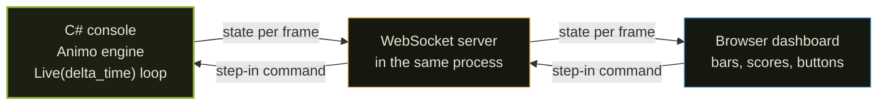
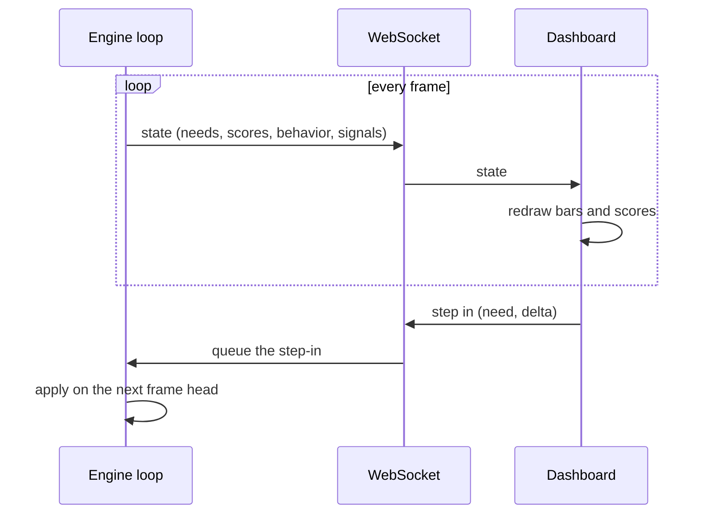
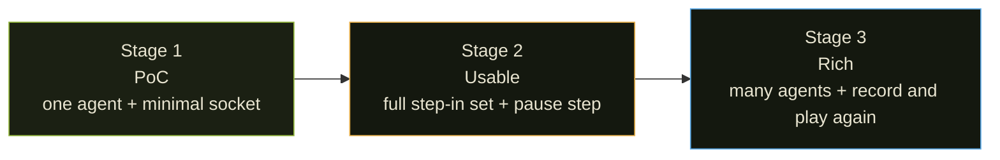

# Live Monitor Plan

> A plan for a tool that watches a running Animo engine live and lets you reach
> in and change it while it runs. This is a design note, not built code. It is
> written in the project writing standard, so a reader whose first language is
> not English can follow it.

---

## Why

Green tests prove the engine is right, but they do not show what an agent
*feels like* as it runs. A goblin that flees when fear crosses the line is only
a row of numbers in a test log. You cannot watch the needs rise and fall, and
you cannot poke the agent to see how it answers.

The live monitor closes that gap. A C# engine runs the same loop it would run
inside a game. A browser dashboard shows every need, every action score, and
the chosen behavior as they change, frame by frame. And you can push a need up
or down at any moment and watch the agent answer — the way a designer tunes a
character by feel, not by re-reading a table.

---

## The shape

Three parts, joined by one live link.

+ **The engine** is a plain C# console program. It builds one (or many) agents
  from a persona file and runs `Live(delta_time)` in a loop, the same call a game makes
  every frame. Console, not Unity: it is the smallest thing that runs the real
  engine.
+ **The server** is a WebSocket endpoint inside the same process. It pushes the
  agent state out each frame and takes step-in commands in. WebSocket, not HTTP
  polling, because a frame loop needs a low-delay two-way link.
+ **The dashboard** is a browser page. It draws the needs as bars and the action
  scores as a race, and it carries buttons that send step-in commands back.

---

## The live link

Two flows run at once over the one socket.

+ **Out (engine to dashboard):** each frame the engine sends a small state
  message — the raw needs, the effective needs, the action scores, the chosen
  behavior, and any signals that fired. The dashboard redraws from it.
+ **In (dashboard to engine):** a button sends a step-in command. The server
  hands it to the engine, which applies it at the head of the next frame, so the
  change lands cleanly inside the loop, never in the middle of a step.

---

## What you can do to a running agent

The step-in set mirrors the engine public API, so nothing new has to be made:

+ **Affect** a need — push `fear` up by 40, drop `hunger` by 50, and watch the
  behavior answer.
+ **Lock** the agent — hold its behavior for a set time, in hard or soft mode.
+ **Unlock** — let go of the lock at once.
+ **Pause and step** — hold the loop, then move one frame at a time to read a
  hard moment closely.
+ **Change delta_time** — run slow to look at, or fast to soak.

---

## Stages

+ **Stage 1 — PoC.** One agent from a persona file. The engine loop, a minimal
  WebSocket that pushes state, and a dashboard that draws the bars. No step-in
  yet — just prove the live link.
+ **Stage 2 — Usable.** The full step-in set (Affect, Lock, Unlock), plus
  pause, step, and delta_time control. This is the point where a designer can tune an
  agent by feel.
+ **Stage 3 — Rich.** Many agents at once, a picker to watch each one, and a
  record-and-play-again mode so a run can be saved and looked at again.

---

## Open questions

These are settled before build, not now:

+ **Message shape.** The fields of the state message and the step-in message,
  and whether they are JSON or a tighter form.
+ **Frame rate over the wire.** Whether every frame goes out, or a capped rate,
  so a fast loop does not flood the socket.
+ **Where the dashboard lives.** Served by the same process, or a static page
  that connects to it.
+ **The move to Unity later.** The console engine and the Unity engine are the
  same code, so the monitor should join to a Unity run too; the plan keeps that
  door open but does not build it yet.
