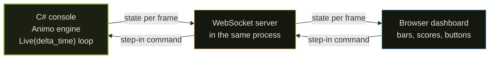
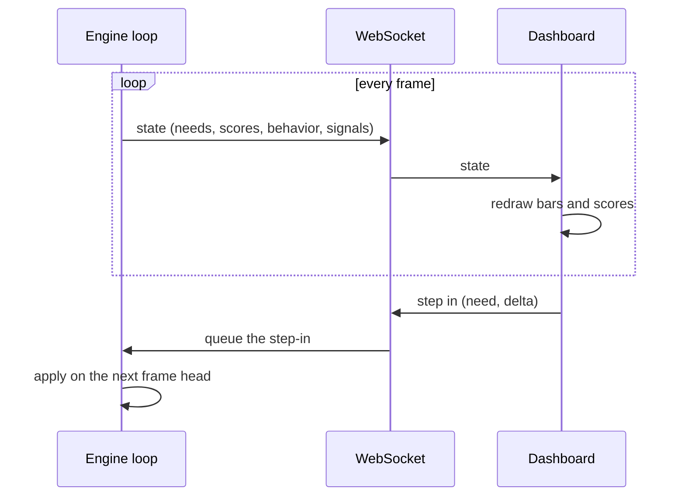

# Live Monitor Spec

> A tool that watches a running Animo engine live and lets a person reach
> in and change it while it runs. This was a design note; the tool it
> planned is now built. This document is kept as a record of the shape
> and the reasons behind it, and to hold the one open point still left.
> It is written in the project writing standard, so a reader whose first
> language is not English can follow it.

---

## Why

Green tests prove the engine is right, but they do not show what an agent
*feels like* as it runs. A goblin that flees when fear crosses the line is only
a row of numbers in a test log. A person could not watch the needs rise and
fall, or poke the agent to see how it answers.

The live monitor closed that gap. A C# engine runs the same loop it would run
inside a game. A browser dashboard shows every need, every action score, and
the chosen behavior as they change, frame by frame. A person can push a need up
or down at any moment and watch the agent answer — the way a designer tunes a
character by feel, not by re-reading a table.

---

## The shape, as built

Three parts, joined by one live link.

+ **The engine** (`MonitorLoop.cs`) is a plain C# console program. It builds
  one or many agents (`MonitorSet.cs` holds more than one) from a persona
  file and runs `Live(delta_time)` in a loop, the same call a game makes
  every frame.
+ **The server** (`MonitorServer.cs`) is a WebSocket endpoint inside the
  same process. It pushes the agent state out each frame and takes
  step-in commands in through `StepInReader.cs`.
+ **The dashboard** (`Monitor/dashboard.html`) is a browser page. It
  draws the needs as bars and the action scores as a race, and it
  carries buttons that send step-in commands back. It also switches its
  own chrome (headings, buttons) between English and Japanese from a
  small, built-in word set.
+ **Recording** (`Recording.cs`) saves a run, so it can be looked at
  again later, matching what Stage 3 below called for.

---

## The live link

Two flows run at once over the one socket.

+ **Out (engine to dashboard):** each frame the engine sends a small state
  message — the raw needs, the effective needs, the action scores, the chosen
  behavior, and any signals that fired. The dashboard redraws from it.
+ **In (dashboard to engine):** a button sends a step-in command. The server
  hands it to the engine, which applies it at the head of the next frame, so the
  change lands cleanly inside the loop, never in the middle of a step.

---

## What a person can do to a running agent

+ **Affect** a need — push `fear` up by 40, drop `hunger` by 50, and watch the
  behavior answer.
+ **Lock** the agent — hold its behavior for a set time, in hard or soft mode.
+ **Unlock** — let go of the lock at once.
+ **Pause and step** — hold the loop, then move one frame at a time to read a
  hard moment closely.
+ **Change delta_time** — run slow to look at, or fast to soak.

---

## Stages — all three built

+ **Stage 1 — PoC.** Done: one agent from a persona file, the engine
  loop, a WebSocket that pushes state, and a dashboard that draws bars.
+ **Stage 2 — Usable.** Done: the full step-in set (Affect, Lock,
  Unlock), plus pause, step, and delta_time control.
+ **Stage 3 — Rich.** Done: many agents at once through `MonitorSet`,
  and a record-and-play-again mode through `Recording.cs`.

---

## Still open: labels on a need or an action have no language of their own

This is the one point from the first design pass that the build did not
close, and it still holds true today.

The dashboard's own chrome (its headings, its buttons) switches
language from a small, built-in word set. The data itself does not: a
need name such as `hunger` and an action name such as `Socialize` (see
`examples/tanukichi.json`) come straight from the persona file's own
field names, with no display form given anywhere. So a need or action
name stays in English even when the dashboard chrome is set to
Japanese, and a reader who is still learning the field names cannot
read it in their own tongue.

**A way to close it**: let a persona file carry a display name for
each need and each action, in each language it wants to support (a
small object next to each need/action entry, say `display_name: { en:
"...", jp: "..." }`). The monitor would read this at load time and show
it when that language is picked, and fall back to the raw key when a
display name is missing, so an older persona file with none still
works with no change. This needs a small schema addition on the
persona file's own shape, and a short read path in the monitor; both
are small, but need their own design pass before being built, since
every persona file already in the repository would need the same new
field added, by hand or by a script, to gain full use of it.
