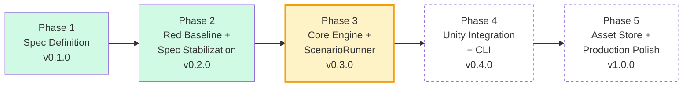
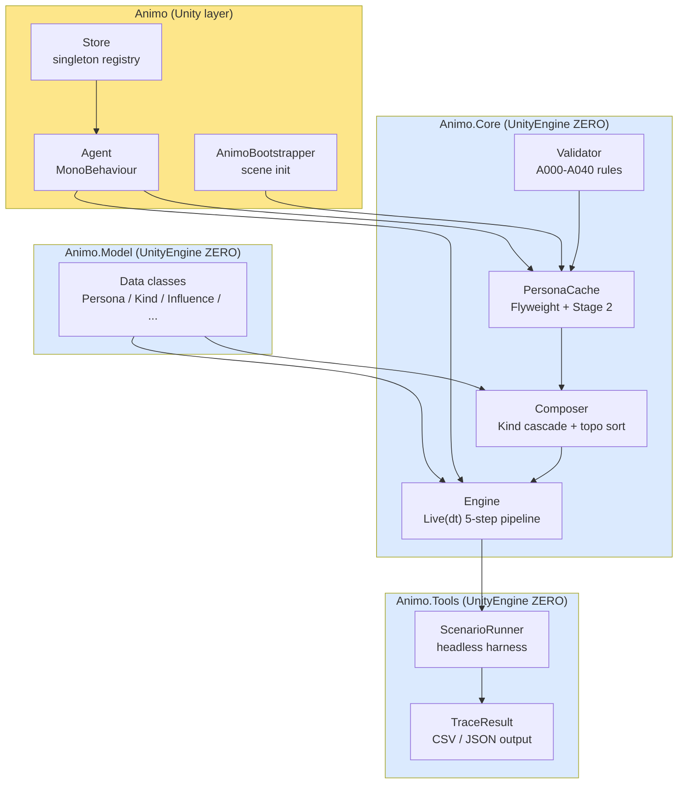
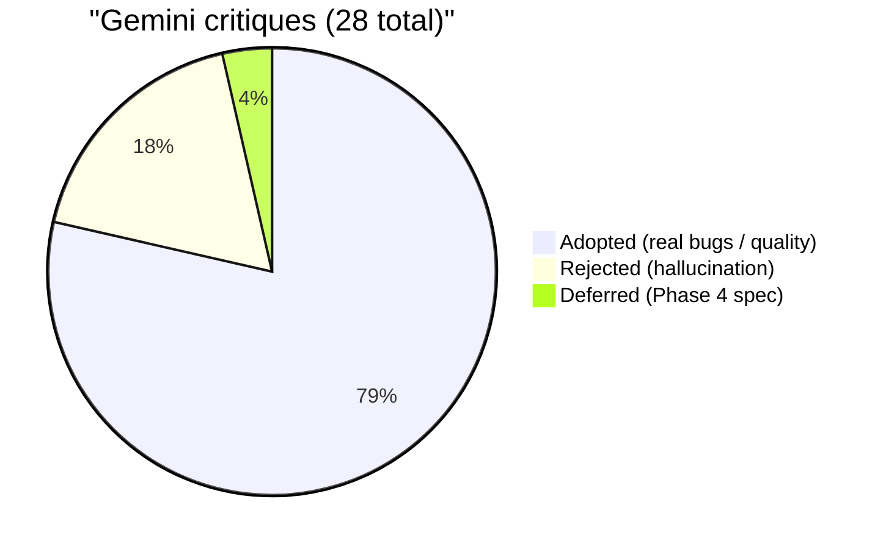
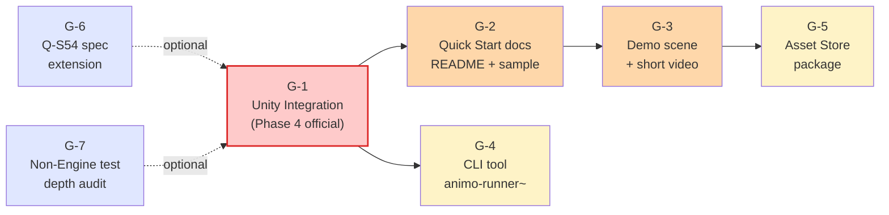
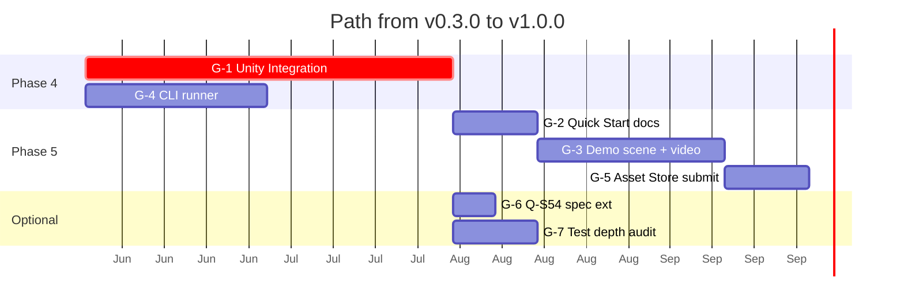

# State of Animo — v0.3.0

**Date**: end of Phase 3 (Task 3-6 Exit Gate complete)
**Author**: h.adachi (STUDIO MeowToon)
**Status**: The core engine works; Unity integration and packaging are still to do.

This document is a snapshot of Animo at the end of Phase 3. It has two aims:

1. **Status** — what works, what is proven, what is shipped.
2. **Gap** — what is missing between "engineering done" and "product done",
   with an ordered action list for Phase 4 and on.

---

## 1. Phase Overview

We are at the line between Phase 3 (done) and Phase 4 (next).

---

## 2. What Phase 3 Gives

### 2.1 Test and Build Status

| Metric                   | Value                 |
| ------------------------ | --------------------- |
| EditMode tests (Debug)   | **447 Green / 0 Red** |
| EditMode tests (Release) | **447 Green / 0 Red** |
| MiniUnity self-tests     | **5 Green / 0 Red**   |
| Combined                 | **452 Green / 0 Red** |
| Build warnings           | **0**                 |
| Build errors             | **0**                 |

### 2.2 Performance

| Operation                       | Result                          |
| ------------------------------- | ------------------------------- |
| `Engine.Live(dt)` per call      | **≈ 0.86 µs** (Release, .NET 8) |
| `Engine.Live` over 100K calls   | **0 bytes** allocated           |
| `Engine.Affect` over 100K calls | **0 bytes** allocated           |
| `Engine.Lock + Unlock`          | **0 bytes** allocated           |
| Frame budget @ 60 fps           | **0.5%** for 100 agents         |

### 2.3 Architecture

`Animo.Core`, `Animo.Model`, and `Animo.Tools` have **zero** UnityEngine
references — verified by grep. They run identically inside Unity and in a
headless CLI.

### 2.4 How the Work Was Checked

Across 5 rounds of hard Gemini review during Phase 3:

Each note was settled by a real `grep` of the code, not by argument or by an
AI agreeing with itself.

---

## 3. Where Animo Stands as a Product

### 3.1 An Honest Score per Part

| Dimension                       | Stars | Verdict                                 |
| ------------------------------- | ----- | --------------------------------------- |
| Engineering quality             | ★★★★★ | Ready for real use                      |
| Test discipline                 | ★★★★★ | 452 Green, physically verified          |
| Performance                     | ★★★★★ | 10x margin against 10 µs target         |
| Spec precision                  | ★★★★★ | 151 Q-S patches, all traceable          |
| Product completeness            | ★★★☆☆ | The core works, but has no product skin |
| Market readiness                | ★★☆☆☆ | No start guide, no demo, no package     |
| Monetization (today)            | ★★☆☆☆ | Almost none until Phase 4 and on        |
| Educational / methodology value | ★★★★★ | A worked example of LLM-led OSS         |

### 3.2 What Animo IS today

+ A **proven, zero-GC Utility AI core** that scales to 100s of agents at
  60 fps with > 99% frame budget remaining.
+ A **headless simulator** (`ScenarioRunner`) that can validate designer JSON
  outside of Unity, producing CSV / JSON traces for regression testing.
+ A **reproducible methodology** — spec-driven, adversarially-reviewed,
  grep-verified — that could be applied to other small OSS engines.

### 3.3 What Animo is NOT yet

+ **Not a Unity Asset Store package.** No `.unitypackage`, no demo scene,
  no install-and-go experience.
+ **Not approachable.** The spec is 6,000+ lines of internal design log; a
  user-facing Quick Start does not exist.
+ **Not visible.** No marketing site, no demo video, no blog post.
+ **Not validated by real users.** The 452 tests verify behavior against
  the spec; they do not verify that designers find the JSON authoring
  pleasant or that game programmers find the API ergonomic.

---

## 4. Phase 4+ Gap Analysis (open issues)

Issues are scoped to "what blocks Animo from becoming a usable product",
ordered by impact-per-effort.

### G-1: Unity Integration (Phase 4 official scope) — 🔴 critical

+ **Status**: not started
+ **What**: Wire `Agent` / `AnimoBootstrapper` into a real Unity scene; verify
  prefab spawn semantics; produce a `*.unitypackage`.
+ **Why critical**: until this lands, Animo cannot be used in any real game.
+ **Effort**: medium (the Unity layer is thin by design — see `Agent.cs`,
  `AnimoBootstrapper.cs`).

### G-2: User-facing Quick Start documentation — 🟠 high

+ **Status**: missing
+ **What**: A `docs/quick_start.md` showing the 5-minute path from
  "I downloaded Animo" to "an NPC is running on my screen".
+ **Why high**: the current spec (`animo_spec_v0.1.5_EN.md`) is 6,000+ lines
  of *internal design log*, not a user manual. New users bounce.
+ **Effort**: small (the engine works; we just need a tutorial path).

### G-3: Demo scene + short video — 🟠 high

+ **Status**: missing
+ **What**: A Unity scene with 3-5 NPCs running visibly different behaviors,
  plus a 60-second screen recording.
+ **Why high**: text cannot communicate "the NPCs feel alive". Visual proof is
  the only currency that works for OSS adoption.
+ **Effort**: medium (requires basic NPC art / animation; could use Unity
  primitives + Animator state names as placeholders).

### G-4: CLI tool (`animo-runner~/`) — 🟡 medium

+ **Status**: not started; spec exists in roadmap §6
+ **What**: A `dotnet`-based command-line wrapper around `ScenarioRunner`.
  `animo-runner persona.json --duration 10 --dt 0.1 --out trace.csv`.
+ **Why medium**: closes the designer feedback loop without launching Unity.
  Powerful for tuning; less critical for first-time adoption.
+ **Effort**: small (Core is Unity-free; CLI is a thin wrapper).

### G-5: Asset Store package — 🟡 medium

+ **Status**: not started; depends on G-1, G-2, G-3
+ **What**: Submit to Unity Asset Store. Could be free (max reach) or paid.
+ **Why medium**: the canonical distribution channel for Unity tools.
+ **Effort**: medium (package metadata, screenshots, submission review).

### G-6: Q-S54 spec extension — `Affect`-then-`GetNeed` semantics — 🟢 low

+ **Status**: deferred from Phase 3 (Gemini round 4, #6)
+ **What**: Spec how `_effective_needs` should behave between an `Affect`
  call and the next `Live(dt)`. Current implementation overwrites with the
  new base value, which erases mid-frame Influence cascade.
+ **Why low**: no observable bug today (tests cover this without cascades);
  matters for future tools that query needs between frames.
+ **Effort**: small (spec discussion + 1-line Engine change + new tests).

### G-7: Test depth audit for non-Engine layers — 🟢 low

+ **Status**: partial
+ **What**: Engine hot path was depth-audited in Phase_3_4_2 (Step1-5 +
  Commitment + Maslow + Threshold all moved from `Is.Not.Null` to numerical
  assertions). The same audit was not done for `Store`, `Bus`, and a handful
  of declaration-only tests (`ApplyNonTierMetadataDeclarationTests`,
  `EnginePreviousBehaviorFieldTests`, etc.).
+ **Why low**: those areas are simpler and have not produced regressions.
  But the methodology should be applied consistently.
+ **Effort**: small per file, ~10-20 files total.

---

## 5. Recommended Path to v1.0.0

The dates above are only a rough shape, not a promise.

---

## 6. Comparison Against Existing Solutions

| Product               | Tests verified | Perf guarantee      | Spec docs       | Price     |
| --------------------- | -------------- | ------------------- | --------------- | --------- |
| **Animo v0.3.0**      | 452 Green      | Live 0.86 µs / 0 GC | 151 Q-S patches | OSS (MIT) |
| Apex Utility AI       | not disclosed  | not disclosed       | API doc only    | $75       |
| Behavior Designer Pro | not disclosed  | not disclosed       | API doc only    | $95       |
| NodeCanvas            | not disclosed  | not disclosed       | tutorial-heavy  | $95       |

Animo's **care in building and its openness** go past the paid tools. The gap
now is **product finish**, not build quality.

---

## 7. One-Line Summary

> Animo v0.3.0 is an **engineering masterpiece without a product
> wrapper**: a zero-GC, spec-proven Utility AI core ready to power real
> games, blocked from adoption only by the absence of Unity packaging,
> Quick Start documentation, and a visual demonstration.

Phase 4 closes that gap.
